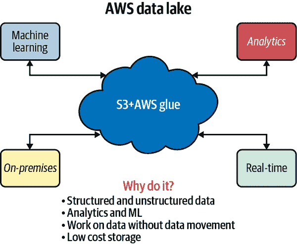

# 附录 B. 技术认证

作者：Noah Gift

“MLOps”这个术语直接暗示着与 IT、运维以及其他传统技术学科通过“Ops”短语的牢固联系。技术认证在验证行业专业人员技能方面一直发挥着重要作用。认证专业人士的薪水令人印象深刻。[根据 Zip Recruiter](https://oreil.ly/OuHfS)，2021 年 2 月，AWS 解决方案架构师的平均工资为 $155k。

从这个话题的角度考虑的一个方法是考虑“三重威胁”的概念。在篮球中，这意味着一个球员如此全面，他们在篮球比赛中取得了 10+个篮板、10+个助攻和 10+分。你可以将这种方法应用到 MLOps 的职业生涯中。拥有一系列你的工作示例、获得认证，并具有工作经验或相关学位。

# AWS 认证

让我们来看看一些 AWS 认证选项。

## AWS 云从业者和 AWS 解决方案架构师

我建议 AWS 云中的 MLOps 专家获得认证。AWS 云从业者是进入 AWS 认证世界的更温和的引子，类似于 AWS 解决方案架构师认证。我经常教授这个认证给不同类型的学生：数据科学硕士学生、非技术业务专业人员和现有的 IT 专业人员。以下是一些与这两种认证相关的常见问题及答案，特别是针对有机器学习背景的人士准备考试。即使你没有获得 AWS 认证，这些问题对于 MLOps 从业者也是至关重要的，值得测试你的知识水平。

Q：我在连接 [RDS](https://oreil.ly/LbcbJ) 并与一组人共享连接时遇到了问题。有没有更简单的方法？

*A*：你可能会发现使用 AWS Cloud9 作为连接到 RDS 的开发环境更为简单。你可以在亚马逊的 [演示](https://oreil.ly/lzO0P) 中看到具体步骤。

Q：云服务模型很令人困惑。PaaS 是什么，它与其他模型有什么不同？

*A*：考虑云服务模型的一种方法是将其与食品行业进行比较。你可以在像 [Costco](https://costco.com) 这样的商店批量购买食品。它有着可观的规模，并且可以将采购价格折扣传递给客户。作为顾客，你可能还需要将这些食品带回家中，准备并烹饪它们。这种情况类似于 IaaS。

现在让我们看看像 [Grubhub](https://grubhub.com) 或 [Uber Eats](https://oreil.ly/zYbpE) 这样的服务。你不仅不必驾车去商店取食物，而且食物已经被准备、烹饪并送到你手中。这种情况类似于 PaaS。你所需要做的就是享用食物。

如果你看 PaaS（平台即服务），它的意思是作为开发者，你可以专注于业务逻辑。因此，许多软件工程的复杂性都消失了。两个早期 PaaS 服务的绝佳例子是[Heroku](https://heroku.com)和[Google App Engine](https://oreil.ly/1MGBA)。AWS 上一个完美的[PaaS 是 AWS SageMaker](https://oreil.ly/lCsUY)。它解决了创建和部署机器学习涉及的许多基础设施问题，包括分布式训练和提供预测。

Q: 边缘位置的确切定义是什么？这并不明显。

*A*: [AWS 边缘位置](https://oreil.ly/IjPBi)是世界上物理位置的实际位置。边缘位置与数据中心不同，因为它们服务更窄的目的。用户离服务器物理位置越近，请求的延迟就越低。这在内容传递（如流媒体视频和音乐）和游戏中至关重要。AWS 上最常提到的边缘服务是 CloudFront。CloudFront 是 CDN（内容分发网络）。通过 CDN，在世界各地的这些位置都有缓存或副本相同的电影文件。这使得用户都能够在流式传输内容时拥有良好的体验。

其他使用边缘位置的服务包括[Amazon Route 53](https://oreil.ly/0gjiE)、[AWS Shield](https://oreil.ly/FLjh4)、[AWS Web 应用程序防火墙](https://oreil.ly/pcqz9)和[Lambda@Edge](https://oreil.ly/XGKp9)。

Q: 如果一个可用性区域（AZ）中的一个数据中心受到火灾影响怎么办？数据中心在自然或人为灾难方面如何相互关联？系统应该如何架构以实现数据复制？

*A*: 作为[共享安全模型](https://oreil.ly/g6Lyp)的一部分，亚马逊负责云，客户负责云中的内容。这意味着数据在灾难性不可预见的失败（如火灾）中是安全的。此外，如果发生故障，该区域内的数据在故障期间可能不可用，但最终会恢复。

作为架构师，客户有责任利用多 AZ 架构。一个很好的例子是[Amazon RDS 多 AZ 配置](https://oreil.ly/uM7sb)。如果一个区域出现故障，备用故障转移数据库将已复制的数据处理请求。

Q: HA 是什么？

*A*: 高可用性（HA，Highly Available）服务是专为可用性设计的服务。这意味着故障是预期的，并且设计支持数据和服务的冗余。一个优秀的 HA 服务的例子是[Amazon RDS](https://oreil.ly/UYOvl)。此外，RDS 多 AZ 设计通过允许在可用区间复制数据库的多个版本，支持最小中断服务。

Q: 你如何在抢占式和按需之间做出决定？

*A*: 中断和按需实例都按固定金额计费的第一分钟，然后按秒计费。中断实例是最具成本效益的，因为它们可以节省高达 90%的费用。在任务运行时间或被中断不重要时使用[中断实例](https://oreil.ly/OmTPP)。实际上，这为中断实例创建了一个关键的使用案例。以下是一些示例：

+   对 AWS 服务进行实验

+   训练深度学习或机器学习作业

+   扩展 Web 服务或其他服务，结合按需实例

当工作负载处于稳定状态时，按需实例可正常工作。例如，生产中的 Web 服务不应仅使用中断实例。相反，可以从按需实例开始，并在服务使用计算时（即 2 个 c4.large 实例）购买[保留实例](https://oreil.ly/tkDVZ)。

Q: 中断实例的休眠如何工作？

*A*: 有几个[中断的实例](https://oreil.ly/w1UJD)的原因，包括价格（出价高于最高价格）、容量（没有足够的未使用的中断实例）和约束（即，可用区目标大小过大）。为了休眠，它必须有一个 EBS 根卷。

Q: EC2 中的标签是用来做什么的？

*A*: 在图 B-1 中，EC2 实例附有标签。这些标签可以将实例类型分组为逻辑组，如“Web 服务器”。


###### 图 B-1\. EC2 标签

使用 EC2 资源的标签的主要原因是将元数据附加到一组机器上。以下是一个场景。假设有 25 个 EC2 实例正在运行购物网站，并且它们没有标签。稍后，用户会再启动另外 25 个 EC2 实例来临时执行任务，例如训练机器学习模型。在控制台中，确定哪些机器是临时的（可以删除）和哪些是生产机器可能会有挑战。

不要猜测机器的角色，最好是分配标签以便用户可以快速识别角色。这个角色可以是：`Key="role"`, `Value="ml"`，或者可以是 `Key="role"`, `Value="web"`。在 EC2 控制台中，用户可以按标签查询。然后，此过程允许批量操作，如终止实例。标签在分析成本中也扮演重要角色。如果机器角色包含标签，则成本报告可以确定某些机器类型是否过于昂贵或使用了太多资源。您可以阅读亚马逊的[官方标签文档](https://oreil.ly/cDxyb)。

Q: 什么是 PuTTY？

*A*: 在图 B-2 中，PuTTY SSH 工具允许从 Windows 远程访问 Linux 虚拟机的控制台。


###### 图 B-2\. PuTTY

PuTTY 是在 Windows 操作系统上使用的免费 SSH 客户端。MacOS 和 Linux 内置支持 SSH。SSH 是什么？它是一种用于执行网络操作的加密网络协议。SSH 用于登录远程计算机并通过终端命令管理设备。

您可以在[这里阅读官方 PuTTY 文档](https://oreil.ly/zw3fx)。

Q: Lightsail 如何与 EC2 或其他服务不同？

*A*: Lightsail 是一个 PaaS 或平台即服务。这意味着开发人员只需关心配置和开发 WordPress 应用程序。EC2 则是较低级别，被称为 IaaS（基础设施即服务）。云计算有一个光谱，低级别服务就像 Costco 的批量原料一样提供。这些批量原料可以创造出餐点，但需要技能。同样，一个人可以订购餐点送到家里。这些餐点更昂贵，但需要较少的专业知识。PaaS 类似；用户为更高级别的服务支付更多费用。

其他 PaaS 解决方案（除了 AWS 外）包括[Heroku](https://heroku.com)和[Google App Engine](https://oreil.ly/4v9Qi)。您可以在《*Python for DevOps*》（O’Reilly）的[“云计算”章节](https://oreil.ly/F3g78)中了解更多有关云服务类型的信息。

Q: 我读到一个 AMI 的用例，描述如下：“用它复制到一组机器（深度学习集群）。”什么是机器组？

*A*: 舰队的工作方式与租车公司类似。当您要求车辆预订时，他们会要求您选择一个组：紧凑型、轿车、豪华型或卡车。不能保证特定型号，只能保证特定组。同样，因为 spot 实例是一个开放市场，可能某个特定机器，比如 C3.8XLarge 不可用，但可能有类似的组合。您可以通过选择舰队请求相同 CPU、内存和网络能力的资源组。您可以在亚马逊的博客上阅读更多关于[EC2 Fleet](https://oreil.ly/EDaGq)的信息。

Q: 对于按需实例大小，"spikey" 是什么意思？

*A*: “spikey” 工作负载可以是突然增加到 10 倍流量的网站。假设这个网站销售产品。一般情况下，一年中的流量是固定的，但到了十二月份，流量激增到原来的 10 倍。这种情况适合使用“按需”实例扩展以满足需求。预期的流量模式应使用预留实例，但对于这种峰值，应使用按需实例。您可以在亚马逊的博客上阅读更多关于[spikey traffic](https://oreil.ly/7JhqV)和[预留实例](https://oreil.ly/KHKy6)的信息。

Q: AWS Lambda 的“SUBSECOND”优势是什么意思？

*A*: 这意味着你可以设计一个高效的服务，并仅在每个请求的持续时间以 100ms 的间隔计费。这种情况与 EC2 实例不同，后者会按秒计费，因为它们是连续运行的。使用 Lambda 函数，你可以设计一个基于事件的工作流，其中 Lambda 仅响应事件而运行。一个好比喻是传统的手动开关灯和运动检测灯。更高效的方法是运动检测灯；它会根据运动情况自动开关。这种方法类似于 AWS Lambda；它根据事件开启、执行任务，然后退出。你可以在 [Amazon 的文档中了解更多关于 Lambda 的信息](https://oreil.ly/y3JoQ)。你还可以在 [GitHub 上构建一个 Python AWS Lambda 项目](https://oreil.ly/ZNmuk)。

Q: 对于 AWS S3，有几种存储类别。IA (Infrequent Access) 存储层包括标准 IA 和单区域 IA 吗？还是还有其他类型？我在 [AWS 网站](https://oreil.ly/plbG8) 的 INFREQUENT ACCESS 部分只看到标准和单区域。

*A*: 有两种 IA（低频访问）类型。标准 IA 存储在三个 AZ（可用区），而单区域则只有一个区域。单区域的一个关键区别是可用性。它的可用性为 99.5%，比三区域 IA 和标准 IA 都低。低成本反映了这种降低的可用性。

Q: Elastic File System (EFS) 是如何工作的？

*A*: EFS 的概念工作方式类似于 Google Drive 或 Dropbox。你可以创建一个 Dropbox 帐户，并与多台计算机或朋友分享数据。EFS 的工作方式非常类似。同一文件系统对于安装它的机器是可用的。这个过程与 EBS（弹性块存储）非常不同，后者一次只能属于一个实例。

Q: 对于 ELB 的使用情况，我不理解这两种用例：1）什么是“单点访问”？它是说，如果可以通过一个端口或服务器控制流量，那么安全性会更高吗？2）“解耦应用程序环境”是什么意思？

*A*: 让我们以网站为例。网站将在 443 端口运行，这是 HTTPS 流量的端口。这个站点可能是 [*https://example.com*](https://example.com)。ELB 是唯一向外界公开的资源。当 Web 浏览器连接到 [*https://example.com*](https://example.com) 时，它只与 ELB 通信。同时，ELB 将向其后面的 Web 服务器请求信息，然后将该信息返回给 Web 浏览器。

在现实世界中的类比是什么？就像驱动通道中的银行出纳员。你开车到窗口但只与银行出纳员联系。银行里有很多人在工作，但你只与一个人互动。你可以在 [AWS 博客](https://oreil.ly/nvYV4) 上阅读有关 ELB 的博文。

Q: 为什么 ELB 的使用案例与经典负载均衡器相同？

*A*: 它们具有相同的特点：通过单一入口点访问，解耦的应用环境；它们提供高可用性和容错性，并增加了弹性和可伸缩性。

Elastic Load Balancing 是负载均衡器的一类。它包括应用负载均衡器、网络负载均衡器和经典负载均衡器。从高层次来看，经典负载均衡器是一种较旧的负载均衡器，功能较少，不如应用负载均衡器。它适用于已经在服务中使用的较旧的 EC2 实例。

这些被称为 EC2 经典实例。在新场景中，像 HTTP 服务这样的应用负载均衡器将是理想的选择。您可以阅读关于 [ELB 功能比较在亚马逊文档中的博客文章](https://oreil.ly/ASjxU)。

## AWS 认证机器学习专业人员

商学院和数据科学学院完全接受教学认证。在加州大学戴维斯分校，我教授学生传统的学分课程材料，如机器学习，包括 AWS 云从业者和 AWS 认证机器学习专业人员。与 AWS 一起，我与其组织的许多部分密切合作，包括 AWS Educate、AWS Academy 和 [AWS ML Hero](https://oreil.ly/wACTB)。

如您所料，我建议获得 AWS 机器学习认证。了解到许多参与创建 AWS ML 认证的人员，并可能在其创建中有所影响，我喜欢它重视 MLOps 的特点。因此，让我们更详细地深入研究它。

[推荐的候选人](https://oreil.ly/B0Np4) 需要具备至少 1-2 年的开发、架构或运行 ML/深度学习工作负载的经验和知识。实际上，这意味着能够表达基本 ML 算法背后的直觉，执行基本的超参数优化，具有 ML 和深度学习框架的经验，遵循模型训练的最佳实践，并遵循部署和运营的最佳实践。简而言之，阅读这本书是准备获得认证的绝佳步骤！

考试结构分为几个领域：数据工程、探索性数据分析、建模以及机器学习实施与运营。特别是考试的最后一部分，实际上是关于 MLOps 的内容。因此，让我们深入探讨这些部分，看看它们如何应用于本书涵盖的概念。

### 数据工程

在 AWS 上进行数据工程、分析和机器学习的一个核心组件是数据湖，它也恰好是 Amazon S3。为什么要使用数据湖（图 B-3）？核心原因如下。首先，它提供处理结构化和非结构化数据的能力。数据湖还允许进行分析和 ML 工作负载。第三，您可以在不移动数据的情况下处理数据，这在处理大数据时非常重要。最后，它成本低廉。



###### 图 B-3\. 数据湖

AWS 数据工程中另一个重要的话题是批处理与流处理数据。让我们先定义流处理数据。流处理数据通常是从许多来源发送的小数据。例如日志文件、指标和时间序列数据，如股票交易信息。在 AWS 上处理流处理的主要服务是 Kinesis。以下是几个理想的应用场景：时间序列分析问题、实时仪表板和实时指标。

批处理与流处理对 ML 流水线开发有显著影响。在批处理中，可以更好地控制模型训练，因为可以决定何时重新训练 ML 模型。持续重新训练模型可能会提供更好的预测结果，但也增加了复杂性。例如，在 SageMaker 端点中可用于模型 A/B 测试。因此，这将需要考虑到架构中。

对于批处理，有几种工具可以作为批处理机制。这些工具包括 Amazon EMR/Spark、AWS Glue、AWS Athena、AWS SageMaker 和名为[AWS 批处理服务](https://oreil.ly/tbu9g)的服务。特别是对于机器学习，AWS 批处理解决了一个独特的问题。例如，想象一下，您希望扩展成千上万个同时进行的独立 k-means 聚类作业。使用 AWS 批处理是一种方法。此外，您可以通过编写一个 Python 命令行工具来为批处理系统提供简单的界面。以下是一段代码片段，展示了实际应用中可能的情况：

```
@cli.group()
def run():
    """AWS Batch CLI"""

@run.command("submit")
@click.option("--queue", default="queue", help="Batch Queue")
@click.option("--jobname", default="1", help="Name of Job")
@click.option("--jobdef", default="test", help="Job Definition")
@click.option("--cmd", default=["whoami"], help="Container Override Commands")
def submit(queue, jobname, jobdef, cmd):
    """Submit a job to AWS Batch SErvice"""

    result = submit_job(
        job_name=jobname,
        job_queue=queue,
        job_definition=jobdef,
        command=cmd
    )
    click.echo(f"CLI:  Run Job Called {jobname}")
    return result
```

处理数据工程的另一个关键方面是使用 AWS Lambda 处理事件。需要注意的是，AWS Lambda 是一个能够深度集成到大多数 AWS 服务中的工具。因此，在进行基于 AWS 的数据工程时，很可能会在某个时刻遇到 AWS Lambda。

AWS 的首席技术官认为[“一个大小的数据库并不适合所有人”](https://oreil.ly/5LEz0)。他所说的内容在图 B-4 中有清晰的描述。


###### 图 B-4\. 一个大小的数据库

另一种表达这一点的方式是使用最适合工作的工具。可以是关系数据库；也可以是键/值数据库。以下示例展示了在 Python 中使用基于 DynamoDB 的 API 有多简单。大部分代码是日志记录。

```
def query_police_department_record_by_guid(guid):
    """Gets one record in the PD table by guid

 In [5]: rec = query_police_department_record_by_guid(
 "7e607b82-9e18-49dc-a9d7-e9628a9147ad"
 )

 In [7]: rec
 Out[7]:
 {'PoliceDepartmentName': 'Hollister',
 'UpdateTime': 'Fri Mar  2 12:43:43 2018',
 'guid': '7e607b82-9e18-49dc-a9d7-e9628a9147ad'}
 """

    db = dynamodb_resource()
    extra_msg = {"region_name": REGION, "aws_service": "dynamodb",
        "police_department_table":POLICE_DEPARTMENTS_TABLE,
        "guid":guid}
    log.info(f"Get PD record by GUID", extra=extra_msg)
    pd_table = db.Table(POLICE_DEPARTMENTS_TABLE)
    response = pd_table.get_item(
        Key={
            'guid': guid
            }
    )
    return response['Item']
```

在数据工程中讨论的另外三个重要事项是 ETL、数据安全性以及数据备份与恢复。在 ETL 中，关键服务包括 AWS Glue、Athena 和 AWS DataBrew。AWS DataBrew 是较新的服务，它解决了在构建生产机器学习模型中一个必要的步骤，即自动化数据清理中混乱的步骤。例如，在图 B-5 中，一个数据集“婴儿姓名”被轻松进行了概要分析，而没有写一行代码。


###### 图 B-5\. DataBrew

之后，同一数据集可能成为 MLOps 项目的重要组成部分。一个有用的功能是跟踪数据集的血统，它来自哪里，以及与数据集相关的操作。此功能可通过“数据血统”选项卡获得（参见图 B-6）。

数据治理是解决由于数据安全和数据备份与恢复而引起的关注的简明方式。AWS 通过 KMS（密钥管理服务）允许集成加密策略。这一步骤至关重要，因为它支持静态和传输中的加密实施，以及最小特权原则（PLP）。


###### 图 B-6\. DataBrew 血统

数据安全的另一个方面是记录和审计对数据的访问。定期审计数据访问是识别风险并加以减轻的一种方法。例如，您可能会标记一个用户定期查看与其工作无关的 AWS Bucket，然后意识到这造成了一个重大的安全漏洞，需要加以解决。


###### 图 B-7\. AWS Cloud-Trail

最后，数据备份和恢复可能是数据治理中最重要的方面之一。大多数 AWS 服务都具有快照功能，包括 RDS、S3 和 DynamoDB。为数据设计一个有用的备份、恢复和生命周期管理，以满足存档到 Amazon Glacier 的最佳实践合规性是至关重要的。

### 探索性数据分析（EDA）

在进行机器学习之前，首先需要对数据进行探索。在 AWS 上，有几种工具可以帮助。这些工具包括之前介绍过的 DataBrew 示例以及 AWS QuickSight。让我们来看看您可以在 AWS QuickSight 中完成的工作，参见图 B-8。


###### 图 B-8\. AWS QuickSight

注意，这种无代码/低代码方法揭示了社交媒体上胜利与受欢迎度之间的幂律关系，即来自维基百科的页面浏览量。粉丝可能最密切地与“赢家”接近，注意到他们，并希望阅读更多关于这些球员的信息。这一初步的 EDA 步骤可能会立即导向开发使用粉丝行为预测哪些队伍更有可能赢得 NBA 赛季的机器学习模型。

自行复制此图表非常简单：下载[CSV 文件](https://oreil.ly/czUpe)，告知 QuickSight 执行新分析，使用 CSV 文件创建新数据集，然后选择“创建分析”。

了解 EDA 在 MLOps 中的角色至关重要。EDA 帮助检测异常值，发现隐藏模式（通过聚类），查看数据分布并创建特征。在使用聚类时，重要的是记住数据需要进行缩放。缩放数据可以标准化大小。例如，如果两个朋友跑了“50”，重要性是需要考虑的关键因素。一个朋友可能跑了 50 英里，另一个可能只跑了 50 英尺。它们是非常不同的事情。如果不进行缩放，机器学习的结果会因一个变量或列的大小而失真。以下示例显示了缩放在实践中的效果：

```

from sklearn.preprocessing import StandardScaler
from sklearn.preprocessing import MinMaxScaler

scaler = StandardScaler()

print(scaler.fit(numerical_StandardScaler(copy=True,
    with_mean=True, with_std=True)

# output
# [[ 2.15710914 0.13485945 1.6406603 -0.46346815]
```

EDA 中的另一个概念是数据预处理的概念。预处理是一个广泛的术语，可以适用于多种场景。例如，机器学习需要数据是数值型的，因此一种预处理形式是将分类变量编码为数值格式。

###### 注意

编码分类数据是机器学习的重要组成部分。有许多不同类型的分类变量。

+   分类（Discreet）变量

    +   有限的值集：{green, red, blue} 或 {false, true}

+   分类类型：

    +   有序（Ordered）：{Large, Medium, Small}

    +   名义（无序）：{green, red, blue}

+   表示为文本

另一种预处理形式是创建新特征。让我们以 NBA 球员年龄为例。一个图表显示年龄呈正态分布，中位数约为 25 岁（见 图 B-9）：

```
import pandas as pd
import seaborn as sns
import matplotlib.pyplot as plt

df = pd.read_csv(
  r"https://raw.githubusercontent.com/noahgift/socialpowernba" \
  r"/master/data/nba_2017_players_with_salary_wiki_twitter.csv")

sns.distplot(df.AGE)
plt.legend()
plt.title("NBA Players Ages")
```


###### 图 B-9\. NBA 球员年龄

我们可以利用这些知识创建一个新特征。该特征可以将年龄转换为几个类别：新秀、巅峰、巅峰后和退休前。这些类别可能会带来未来的洞察：

```
def age_brackets (age):
  if age >17 and age <25:
      return 'Rookie'
  if age >25 and age <30:
      return 'Prime'
  if age >30 and age <35:
       return 'Post Prime'
  if age >35 and age <45:
      return 'Pre-Retirement'
```

然后，我们可以使用这些新分类来对数据进行分组，并找出每个分组的中位数工资：

```
df["age_category"] = df["AGE"].apply(age_brackets)
df.groupby("age_category")["SALARY_MILLIONS"].media
```

请注意，中位数工资存在显著差异。球员刚开始时薪水最低，但在巅峰时期薪水大约会增加三倍。一旦退休，薪酬将急剧下降，为他们巅峰时期的一半：

```
age_category
Post-Prime 8.550
Pre-Retirement   5.500
Prime            9.515
Rookie           2.940
Name: SALARY_MILLIONS, dtype: float64
```

### 机器学习实施与运营（MLOps）

让我们在 AWS ML 认证考试的概念中讨论 MLOps 的一些关键组成部分。在构建模型时，以下关键概念至关重要：

+   监控

+   安全性

+   重新训练模型

+   A/B 测试

+   TCO（总体拥有成本）

MLOps 本身如何？以下是需要考虑的关键因素：

+   您是否使用了足够简单的模型？

+   您是使用数据湖还是直接连接到生产 SQL 数据库？

+   您是否已为预测阈值失败设置了警报？

+   您是否有开发、测试和生产环境？

最后，两个值得讨论的主题是故障排除生产部署和 ML 系统的效率。对于生产部署，这些概念包括使用 CloudWatch、搜索 CloudWatch 日志、对关键事件进行警报、使用自动缩放功能和使用企业支持。

在考试和实际应用中，了解以下关键概念对于 ML 系统的成本和效率至关重要：

+   Spot 实例（显示 spot 代码）

+   正确使用 CPU 与 GPU 资源

+   扩展和缩小规模

+   上市时间

+   AI API 与“自己动手”

# 其他云认证

除了 AWS，Azure 和 GCP 也有显著的认证。

## Azure 数据科学家和 AI 工程师

Azure 有一些 [值得关注的认证](https://oreil.ly/fLHCh)，包括 [Azure 数据科学家](https://oreil.ly/SASq0) 和 [Azure AI 工程师](https://oreil.ly/T4R8g)。这些认证分为三个级别（按照专业水平排序）：基础、关联和专家。此外，还有几条与 Azure AI 平台密切相关的 *学习路径* 与 MLOps 相关。

+   [入门指南](https://oreil.ly/dRoNa)

+   [创建机器学习模型](https://oreil.ly/wwHTK)

+   使用 Azure 机器学习创建无代码预测模型[（链接）](https://oreil.ly/YvywB)

+   [使用 Azure 机器学习构建 AI 解决方案](https://oreil.ly/xOocn)

一个良好的起点是浏览 [培训指南](https://oreil.ly/Tpoyk)，其中列出了一系列引人注目的旅程（例如数据和 AI 专业人员）和明确的认证，如 [Azure AI 基础知识](https://oreil.ly/atHVw)。这些 *旅程* 可让您决定最佳的实现目标的策略。

此外，如果您是 [学生](https://oreil.ly/0M5le) 或 [教职工](https://oreil.ly/9Ca0i)，还有免费（或大部分免费）的资源可帮助您在 Azure 上入门。这些服务通常会随时间变化，但您可以在不需要信用卡的情况下立即开始。如果您是教育工作者，还有其他 [提供和资源](https://oreil.ly/cEh9m) 可供您使用，同样也能提供帮助。

## GCP

一些值得关注的 MLOps 从业者认证包括 [专业机器学习工程师](https://oreil.ly/zJ62s) 和 [专业云架构师](https://oreil.ly/wuGi6)。最后，一个非常具体的与 MLOps 相关的认证是 [TensorFlow 开发者证书](https://oreil.ly/lAtEG)，它允许您展示使用 TensorFlow 解决深度学习和 ML 问题的能力。

# 与 SQL 相关的认证

要成功进行 MLOps，需要有 SQL 的基本知识。稍后建议深入学习 SQL，理论上和应用上都要掌握。以下是一些推荐的资源：

+   [Databricks 认证 Apache Spark 3.0 关联开发者](https://oreil.ly/qI1k7)

    +   学习材料：Databricks 网站和 O’Reilly 学习平台

        +   O’Reilly 学习平台：[学习 Spark](https://oreil.ly/MYX1d)

        +   O’Reilly 学习平台：[Spark：权威指南](https://oreil.ly/48PNO)

+   [Microsoft Certified：Azure 数据基础](https://oreil.ly/F8SgJ)

    +   学习材料：Coursera、Microsoft Learn 和 O’Reilly 学习平台

        +   [Coursera 课程 Microsoft Azure DP-900 数据基础考试准备](https://oreil.ly/WlLuC)

        +   O’Reilly 学习平台：[考试参考 DP-900](https://oreil.ly/vivnp)

+   [Oracle Database SQL 认证专家认证](https://oreil.ly/bV6l5)

    +   学习材料：O’Reilly 学习平台和 Oracle

        +   O’Reilly 学习平台：[OCA Oracle Database SQL 考试指南](https://oreil.ly/HStDe)

        +   Oracle：[Oracle Database SQL 认证专家认证](https://oreil.ly/Pfpgh)

+   [Google 数据分析专业](https://oreil.ly/YeGPd)

    +   学习材料：Coursera 和 O’Reilly 学习平台

        +   O’Reilly 学习平台：[数据治理：权威指南](https://oreil.ly/9FLfc)

        +   O’Reilly 学习平台：[Google 云平台数据科学](https://oreil.ly/0qnAW)

        +   O’Reilly 学习平台：[Google BigQuery：权威指南](https://oreil.ly/hr9jL)

        +   Coursera：[Google 数据分析专业](https://oreil.ly/AtOBK)

你可以在 [Coursera](https://oreil.ly/BZF5P) 找到更多参考资料。
