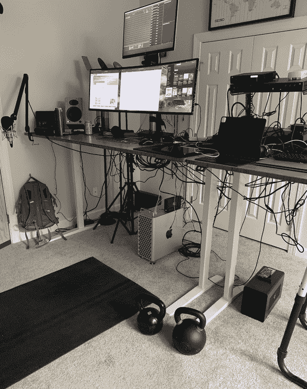
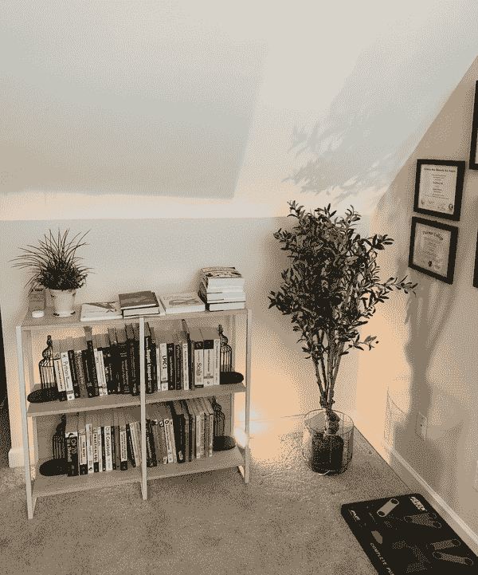

# 附录 C. 远程工作

由 Noah Gift

在 COVID-19 后的世界中，拥有一个稳定的家庭办公室，可以让你完成工作至关重要。另一个因素是远程优先优化了工作成果。面对面环境的一个显著问题是“外表”与实际进展的差异。被拖入毫无结果的会议几个小时就是一个很好的例子。销售团队打扰在开放式办公计划中编写代码的开发人员是另一个问题。当专注于结果时，远程优先开始变得非常合理。

在过去的几年里，我一直在不断“改造”我的家庭办公室，以适应全球教学以及在主要顶级大学的工作，并进行远程软件工程和咨询。你可以在图 C-1 中看到我的设置。我想带领你了解如何设置你自己的工作空间，以便你可以高效工作。

###### 图 C-1\. 在家工作

# 远程工作设备

## 网络

如果你远程工作，以下是一些需要考虑的事项的简要非详尽列表。一个可靠的家庭网络可能是任何远程工作清单上最关键的项目。理想情况下，你可以以低于 100 美元的价格获得低成本的光纤连接。光纤是理想的，因为你的上行和下行速度是一样的。请注意，不仅在美国的许多地区 1GB 的光纤是标准，2GB 的光纤也越来越普遍。

在设置家庭网络时，有一些必要的细节需要注意。让我们接下来讨论这些细节。

### 家庭物理网络

最好将你的工作站通过以太网插入家庭光纤或有线网络。这一步骤可以消除干扰远程工作的一系列问题，特别是无线问题。实现这一目标的一个很好的方法是购买一个能够达到 2.5 GB 或更高速度的廉价网络交换机，并使用 Cat6 网络电缆连接（可提供高达 10 Gbps 的速度）。这样，如果你有 2GB 的光纤连接，你可以直接利用其全速度。

除了有线网络外，无线网格网络可以带来巨大的回报。建议的无线设置是使用网格 WiFi 6 路由器。这些路由器可以覆盖整个家庭，甚至覆盖面积超过 5,000 平方英尺的区域，并且无线速度可以超过 1 Gbps。现代网格网络还允许数百个同时连接，这对于家庭网络来说绰绰有余。

### 能源管理和家庭网络

当你的家变成一个实际的永久办公室时，有两个重要的事情需要考虑：成本和可靠性。例如，如果你经常停电，你可能会损失大量的业务收入。同样，你的电费可能会显著增加。

通过太阳能家庭设置，你可以帮助保护环境，降低家庭公用事业成本，并在停电期间解决业务连续性问题。首先，使用 UPS（不间断电源）处理风暴和电力故障，并将你重要的家庭办公和家庭网络设备插入其中。

最后，特斯拉 Powerwall 电池或类似的电池可以提供数天的备用电力，因为它能够从太阳能充电。这种设置使你能够在任何大风暴期间继续工作。此外，对于太阳能设计，还有显著的税收优惠，进一步增加其吸引力。

## 家庭工作区

站立式办公桌、宽屏显示器、良好的麦克风和优秀的摄像头能够大大提高工作效率，希望也能缩短工作时间。一个重要的考虑因素是购买你能负担得起的最好工具，因为它们能让你赚钱并提高生产力。

### 健康和工作区域

你能否引入站立式办公桌，减少腰部损伤并促进更多的身体活动？你是否每天通过五组每组 20 下做 100 个壶铃摆动？你能否在大脑开始感到超负荷时安排每天的散步？这些看起来很微小，但小事物确实能够显著改善你的健康、工作效率和幸福感。

最后，你能否消除大多数企业垃圾食品习惯，改为间歇性禁食结合健康食物？阅读附录 F 中的间歇性禁食，了解我的旅程和研究。

### 家庭工作空间虚拟工作室设置

拥有摄像机背景可以极大地提升专业水平。这种设置包括良好的照明，一些“布景”以及其他能够增强背景的物品。请注意，在这些设置中，语音自动化可能是一个巨大的优势，因为在开启摄像头前并不需要大灯。

在图 C-2 中，我的背景设置使视频会议呼叫看起来更吸引人。这是远程工作经常被忽视的一个方面。

###### 图 C-2. 工作室背景

## 位置，位置，位置

你能否搬到一个低成本地区，那里既有自然环境又有好学校？在后疫情时代，我们可以预见到一种新的现实可能会让数据科学思维的远程工作者优化健康、生活质量和成本。一个推动因素是房屋所有权的成本。在美国的某些地区，比如旧金山湾区，建立工作力量是没有意义的。哈佛大学住房研究联合中心（JCHS）有许多互动数据可视化，[详细解释了这一点](https://oreil.ly/a3bK4)。你是为了生活而工作还是为了工作而生活？

当你将生活优化为工作与生活平衡、家庭和健康时，你可能会发现，昂贵的抵押贷款可能对你的目标产生反效果。远程工作使你能够深思熟虑你最大的支出：你居住的地方。一个很好的网站，可以帮助你决定居住在哪里，是[Numbeo](https://oreil.ly/XCZ3A)；你可以考虑天气、生活成本、犯罪率、教育等因素。此外，在像纽约和旧金山这样的传统科技中心之外，还有许多令人难以置信的居住地点。
