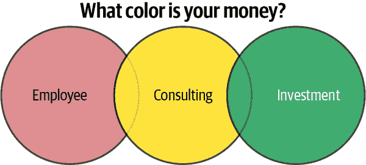

# 附录 D. 为你的职业像 VC 一样思考

作者：Noah Gift

在建立机器学习职业生涯时的一个关键考虑是像风险投资家（VC）那样思考。风险投资家与普通员工有什么不同？他们的一个做法是通过投资一系列公司来设计面向失败的策略。那么为什么不对你的职业也采取同样的策略呢？假设你从一开始就考虑了一个多公司策略。在那种情况下，你可以始终专注于长期获取更多技能、建立副业和作品集，以及除了工作之外的收入。

此外，理解收入和支出使你能够建立自主权——比如说，放下你正在做的事情，深入研究下一代 MLOps 技术。让我们深入探讨如何考虑收入和支出。

# 梨形收入策略

我们生活在一个新时代，在这个时代，只需一台笔记本电脑和一个互联网连接就可以开始一项业务。作为一名长期的顾问和企业家，我已经开发了一个对我有效的框架。在评估与谁合作以及选择什么项目时，我会考虑 PPEAR 或“梨形”：

+   *P（被动）*

+   *P（积极）*

+   *E（指数）*

+   *A（自主权）*

+   *R（25%规则）*

这是你如何利用这个“副业”框架。

## 被动

许多人跳槽追求更高的薪水，但薪水是固定的：无论你的工作有多出色，你的报酬依然相同。被动收入是投资于指数结果的一种形式。每个技术工作者都应该在薪水和某些能够提供指数结果的资产之间取得平衡。理想情况下，这种结果直接与你的工作相关：

+   这个行动是否会带来被动收入：书籍、产品、投资？

+   你拥有客户吗？理想情况下，你应该专注于持有客户。

+   什么是版税关系？

    捕食者（20%或更低）

    与捕食者合作应该有一个非常有说服力的理由。也许他们能为你带来曝光，或者他们愿意冒险与你合作。捕食者的缺点是他们经常有繁文缛节的流程。你必须与多少层人员互动才能完成任何事情？完成某件事需要多长时间？这可能比单独工作要长 10 到 100 倍。

    合作伙伴（50%或更高）

    关于平等伙伴关系，有很多令人喜欢的地方。伙伴在金钱和时间上都有“一份赌注”。

    平台（80%或更高）

    使用平台有利有弊。平台的优势在于，如果你自给自足，你可以保留大部分收入。缺点是你可能还没有标杆。你可能还没有一个“好”是什么的框架。你可能希望先与一位捕食者合作，看看他们是如何做事情的，然后再转向平台。

###### 注意

并不是每个人都想成为作者或创作者，但每个人都可以成为投资者。也许将你的 W2 收入的 50%投入到指数基金或出租房屋中会更好。

## 积极的

在项目或与合作伙伴合作时，它必须是一个积极的体验。即使很好地支付最终也会变得老套，如果环境有毒的话。可以问一些问题：

+   我每天是否感到快乐？

+   我是否尊重每天与我共事的人？

+   我与我一起工作的人是否都是成就卓越并具有成功记录的人？

+   我的健康是否在睡眠、健身和营养方面得到了提高或保持？

+   由于你是与你花费最多时间的五个人的平均值，你如何与积极的人在一起？

## 指数

在项目或与合作伙伴合作时，另一个重要问题是指数潜力。也许你已经决定与一个具有指数潜力项目的捕食者伙伴合作。另一方面，如果你与一个捕食者合作，但项目没有指数潜力，那么也许这不是一个好项目。

这个项目或合作是否会导致收入、用户、流量、媒体曝光或声誉呈指数级增长？

## 自主性

在项目或与合作伙伴合作时，另一个重要问题是自主性。如果你擅长自己的工作，你需要自由。你知道什么是好的，但你的合作伙伴可能不知道。你有多少独立性？最终是否能够靠自己赌一把，或者成功掌握在别人手中？

一些示例问题包括：

+   这个行动是否增加了自主性或者创建了依赖关系？

+   我是否在学习和成长——掌握了新技能、获得了新的声望或品牌关联？

+   这个任务是可以自动化的还是需要手动操作？避免那些无法自动化的任务。

## 25%法则

你赚的钱是什么颜色？图表 D-1 展示了考虑收入的三种方式：员工、顾问或投资者。

作为员工可能对你有价值，因为你可以学习技能并建立人脉。但要记住，这是“红色”金钱。红色的钱随时可能消失。你没有控制权。

###### 图表 D-1. 你的钱是什么颜色？

咨询是“黄色”金钱。这是朝正确方向迈出的一大步。你可以在做员工的同时进行一些咨询。这一行动减少了作为员工的风险。然而，作为顾问，你必须小心，永远不要让一个客户占到你总收入的 25%，最好不要让一个顾客占到你咨询收入的 25%。熟悉产生蔑视。最好的关系是当人们表现最好的时候，他们知道链接只是为了解决问题。

像房地产、指数基金和数字产品这样的投资是“绿色”金钱。这种收入流将永远为你付款。理想情况是用绿色金钱赚取 80%的收入，将咨询或就业限制在 20%的收入内。

## 注释

下面的注释和资源有助于完善这个附录：

+   沃伦·巴菲特在这个主题上有一句著名的话。他说：“如果你不找到一种方法在睡觉时赚钱，你将工作到死。”

+   文章中提供了有价值的相关建议，[“1000 True Fans? Try 100”](https://oreil.ly/BL9Hj)。

+   最后，特别感谢来自[安德鲁·哈加顿](https://oreil.ly/lys5q)和[迪克森·刘易斯](https://oreil.ly/pLuPJ)的反馈和启发性想法。
