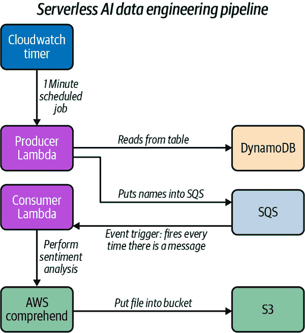

# 附录 E. MLOps 技术作品集的构建

作者是 Noah Gift

我建议每个人都成为“三重威胁”。在篮球中，“三重威胁”指的是能够得分、篮板或助攻的球员。防守者必须防范这三个选项。从职业角度看，你也可以成为“三重威胁”，意味着你能够通过三个方面来通过招聘门卫：技术作品集、相关认证以及工作经验或相关学位。

我在附录 B 中提到了云认证，但在这里我们将深入探讨你的技术作品集。构建作品集项目可以增强你的简历，其中将包含高质量的源代码链接和演示视频，而不是没有的简历。你会召唤哪位应聘者来面试？我会召唤那位在我们会面之前就已经向我展示了他们能力的候选人。

在构建项目时，选择你认为未来两年将会“推动事业”的项目。考虑以下几个想法：

+   GitHub 项目，包含源代码和一个*README.md*来解释项目。*README.md*应具有专业质量并使用商务写作风格。

+   100% 可重复的笔记本或源代码。

+   原创作品（不是 Kaggle 项目的复制品）。

+   真实的激情。

+   五分钟的最终演示视频展示其工作原理。

+   演示需要非常技术化，并准确展示如何完成任务，即需要一步一步地教给别人。 （想象一下烹饪节目中厨师演示如何制作巧克力曲奇饼干的程度。这种细节水平需要类似。）

+   视频应至少为 1080p，16:9 宽高比。

+   考虑使用低成本的外部麦克风录制。

在构建 Jupyter 笔记本时，考虑将数据科学项目的步骤分解。通常的步骤包括：

+   摄取

+   探索性数据分析 (EDA)

+   建模

+   结论

对于 MLOps 作品集项目，以下是一些想法，这些想法使学生能够在主要技术公司（即 FAANG）和前沿创业公司中作为 ML 工程师、数据工程师和数据科学家获得工作。

# 项目：在 PaaS 平台上持续交付 Flask/FastAPI 数据工程 API

测试你构建 API 知识的一个极好的方法是以下项目：

1.  在云平台上创建一个 Flask 或 Fast 应用程序，并将源代码推送到 GitHub。

1.  配置云原生构建服务器（如 AWS App Runner、AWS Code Build 等）以将更改部署到 GitHub。

1.  创建一个真实的数据工程 API。

您可以参考这个[O’Reilly walkthrough](https://oreil.ly/29gnT)，了解如何使用 FastAPI 构建微服务函数，或者参考这个[sample Github project](https://oreil.ly/D1eYf)，这是一个完整的 AWS App Runner 快速入门项目。

# 项目：Docker 和 Kubernetes 容器项目

许多云解决方案涉及 Docker 格式容器。让我们在以下项目中利用 Docker 格式容器：

1.  创造一个定制的 Docker 容器，使用当前版本的 Python 部署一个 Python 机器学习应用程序。

1.  将图像推送到 DockerHub、Amazon ECR、Google Container Registry 或其他一些云容器注册表中。

1.  在云平台的云 Shell 上拉取镜像并运行它：Google Cloud Shell 或 AWS Cloud9。

1.  部署一个应用程序到云托管的 Kubernetes 集群，如 GKE（Google Kubernetes Engine）或 EKS（Elastic Kubernetes Service）等。

# 项目：无服务器 AI 数据工程管道

复制示例无服务器数据工程项目的架构，如 图 E-1 所示。然后，通过扩展 NLP 分析功能来增强项目：添加实体提取、关键短语提取或其他 NLP 功能。

###### 图 E-1\. 无服务器数据工程

该项目的一个良好资源是以下存储库：[*https://github.com/noahgift/awslambda*](https://github.com/noahgift/awslambda)。

# 项目：构建边缘机器学习解决方案

使用书中涵盖的技术之一构建并部署基于边缘的计算机视觉解决方案：

+   Intel Movidius Neural Compute Stick 2

+   AWS DeepLens

+   Coral AI

+   智能手机（iOS、Android）

+   树莓派

这里是您项目的交付成果清单：

+   将您的结果发布为 Jupyter 笔记本、Colab 笔记本文件夹或两者都在 GitHub 仓库中。

+   编写一份两页的研究项目概述的 PDF 格式文档。

+   在您的两页简介中包含指向您已发布作品的链接。

+   创建一个 60 秒的演示视频，展示您的工作计算机视觉项目的推断（预测）。

+   将您的项目提交给 Intel 或 AWS 社区项目。

# 项目：构建云原生机器学习应用程序或 API

构建一个云原生分析应用程序，托管在 Google Cloud Platform（GCP）、AWS、Azure 或其他云或技术上（例如 Kubernetes）。该项目旨在让您能够创建与现代技术兼容的实际工作解决方案。

在开始之前，请阅读 [“Hidden Technical Debt in Machine Learning Systems” by Sculley et al. (2015)](https://oreil.ly/keGLy)。

限制复杂性的一个好方法是使用公共数据集。一个例子可以是使用 Google BigQuery 数据集中的公共数据项目（如果使用 GCP）。或者，如果使用 AutoML，数据可以是教程数据或自定义数据。

主要想法是让您考虑开始创建一个作品集。这是建议的 GCP 项目要求清单；您可以为不同的云修改技术堆栈。

+   源代码存储在 GitHub 上

+   从 CircleCI 进行持续部署

+   数据存储在 GCP 中（BigQuery、Google Cloud Storage 等）

+   创建并提供 ML 预测（AutoML、BigQuery 等）

+   安装 Stackdriver 进行监控

+   Google App Engine 通过 REST API 提供 HTTP 请求服务，使用 JSON 载荷

+   部署到 GCP 环境中

+   一份两页、单行间距的论文，描述项目如何在交接阶段由咨询顾问向客户介绍

以下是一个最终项目检查清单的示例，供参考。

+   是否执行 ML 预测/推断？

+   是否有独立的环境？

+   是否有全面的监控和警报？

+   是否使用了正确的数据存储，即关系、图、键/值？

+   是否适用最小特权原则？

+   数据在传输和静置时是否加密？

+   你有对应用程序进行负载测试以验证性能吗？

# 拿到工作：不要直接攻城，走后门

技术行业总是有一个“梦想”职称。这些职称来了又去。以下是一些例子：Unix 系统管理员、网络管理员、网站管理员、网页开发人员、移动开发人员、数据科学家。当这些职称出现时，公司们会为雇佣这些职位感到恐慌。

然后所有的进展都停滞不前，越来越多的障碍出现。一个经典的例子是在一项技术存在一年时，却要求一个人拥有十年经验。最终，进入“城堡”变得不可能。城堡的前面有守卫、热油、长矛和等待在护城河中的怪物。相反，考虑一个后门。通常后门是一个不那么高级的职称。

如何学习

与其他职业相比，与软件相关的职业是独特的。与软件相关的工作与职业运动员、武术家或音乐家有很多相似之处。实现精通的过程涉及接受痛苦和喜欢犯错。

创造自己的 20%时间

永远不要指望公司是你学习所需的唯一来源。你必须开辟自己的学习路径。其中一种方法是每天花几个小时养成学习新技术的习惯。把它看作是职业生涯的锻炼。

拥抱错误的心态

避免错误和追求完美是很常见的。例如，我们试图避免车祸、掉落的杂货和其他错误，大多数学生都希望在考试中获得完美的“A”成绩。

在成为一个称职的软件工程师的过程中，最好反其道而行之。不断犯错意味着你走在正确的道路上。这周你犯了多少错？今天你犯了多少错？威廉·布莱克在 1790 年最好地表达了这一点，他说：“如果愚人坚持愚蠢，他会变得聪明。”

寻找与学习平行的爱好

如果你询问有 10 年以上经验的成功软件工程师团体，你会听到类似这样的回答：“我是一个学习机器。”那么，一个学习机器如何变得更加优秀？一种方法是选择一项需要多年时间才能掌握的运动，而你在其中完全是个新手，并观察自己。

特别适合这种活动的两款游戏是攀岩和巴西柔术。巴西柔术还有一个额外的副作用，那就是教你实用的自卫技巧。你会发现，在学习中你有一些盲点，然后可以在“真实”的工作中修复它们。
