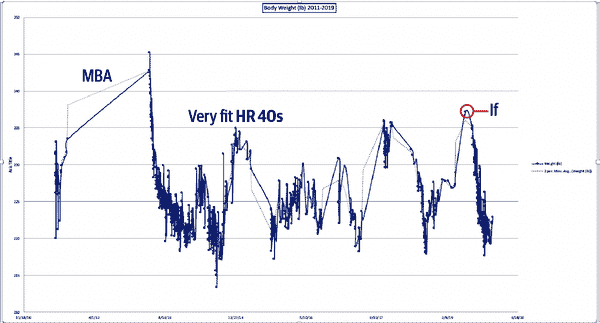

# 附录 F. 数据科学案例研究：间歇性禁食

By Noah Gift

回到 20 世纪 90 年代初，我就读于加州理工大学圣路易斯奥比斯波分校，并主修营养科学。我选择这个学位是因为我痴迷于成为职业运动员。我觉得学习营养科学可以给我带来额外的优势。我首先找到了关于卡路里限制和衰老的研究。

我还参与了营养生物化学课上的自我实验。我们离心分离了我们的血液，并计算了低密度脂蛋白、高密度脂蛋白和总胆固醇水平。在同一课程中，我们补充了大剂量的维生素 C，然后收集了我们的尿液来查看被吸收了什么。结果显示，在健康的大学生群体中，身体智能地通过增加吸收敏感性来应对营养物质的吸收，当其水平较低时。维生素补充品通常是浪费钱的。

我学习了一年的解剖学和生理学，学会了解剖人体。我了解了克雷布斯循环以及糖原储存的工作方式。身体产生胰岛素来增加血糖，并将其储存到肝脏和肌肉组织中。如果这些区域“满了”，它会把糖原储存到脂肪组织中。同样地，当身体缺乏糖原或进行有氧活动时，脂肪组织是主要的燃料。这种储存就像我们的“备用”油箱一样。¹

我还在加州理工大学作为一个失败的一级田径运动员尝试了一年。我从中吃了不少苦头，其中一件事是过多的举重实际上对跑步等运动表现不利。当时我身高 6 英尺 2 英寸，体重 215 磅，可以一次卧推 225 磅，大约能和美国职业橄榄球联盟的线卫相媲美。我也跑 1500 米（大约一英里）用了 4 分 30 秒，经常在一级长跑运动员中带头进行三英里训练跑。我还能在罚球线附近灌篮，以及在 10.9 秒内跑完 100 米。

简言之，我是一个优秀的运动员，多才多艺，但多年来积极地从事错误类型的锻炼（健美）。我的职业道德水平非常高，但对我选择的运动来说，这种方式效果非常不佳，甚至具有反生产力。我还高估了自己在未曾进行多种活动（如撑竿跳）的情况下，能够加入一级体育项目的能力。我几乎也加入了队伍——只差一个人。但在我生活的这一部分，“几乎”并不算数。这次经历是我第一次全神贯注地投入并努力去做某事，最终却失败了。这是一个令人警醒的经历，早在生活的早期就从中得到了很好的教训。我学会了如何处理失败，在软件工程和数据科学中对我很有帮助。

作为一名前硅谷软件工程师，后来我发现了这种行为的一个词汇：YAGNI。YAGNI 代表“你根本不需要它”。就像我花了几年时间增加了 40 磅额外的肌肉，最终导致了我的运动表现下降一样，在软件项目中你可能在错误的事情上花费了精力。例如构建你在应用中不会使用的功能，或者过于复杂的抽象，如高级面向对象编程。这些技术实际上是“累赘”。它们是有害的，因为它们需要时间来开发，这些时间本可以用来做更有价值的事情，而且会永久地减慢项目的进度。就像在田径经验中一样，一些最有动力和才华横溢的人可能是在项目中添加不必要复杂性的最坏的滥用者。

营养科学领域也存在 YAGNI 问题，间歇性禁食是简化技术的一个很好的例子。它的工作方式很像把一个 2000 字的文章删除一半可以使它更好。事实证明，食物中数十年来增加的“复杂性”可以被忽略和删除：频繁的零食、早餐和超加工食品²。

你不需要吃早餐或零食。为了进一步简化，你不需要一天吃很多次。这是时间和金钱的浪费。你也不需要超加工食品：早餐麦片、蛋白棒或任何其他“人造”食品。事实证明，YAGNI 再次在我们的饮食中起作用。你也不需要购买一个特别的工具来健康饮食，比如书籍、补充剂或餐饮计划。

存在一个众所周知的问题叫做旅行推销员问题³，它提出了以下问题：给定一个城市列表和每对城市之间的距离，访问每个城市恰好一次并返回起始城市的最短可能路径是什么？这个问题很重要，因为没有完美的解决方案。用日常语言来说，这意味着一个解决方案在现实世界中太复杂而无法实现。此外，要解答这些数据会花费越来越长的时间。因此，计算机科学用启发式方法解决这些问题。我在研究生院写了一个启发式解决方案，虽然不是特别创新，但它给出了一个合理的答案⁴。它的工作原理是随机选择一个城市，然后当出现可能的路线时始终选择最短路线。在最后的解决方案中，计算总距离。然后，根据你有多少时间重新运行这个模拟，并选择最短的距离。

间歇性禁食如此有效是因为它也跳过了计算卡路里以减肥的不可解决的复杂性。间歇性禁食是一种有效的启发式方法。与其计算卡路里，你可以在一天中的某些时间段内不进食⁵。这些时间段可以如下设置：

每日禁食：

+   8 小时进食窗口或 16:8

    +   中午 12 点至晚上 8 点

    +   上午 7 点至下午 3 点

+   4 小时进食窗口或 20:4

    +   下午 6 点至晚上 10 点

    +   上午 7 点至 11 点

更长时间的复杂模式禁食：

+   5:2

    +   五天正常饮食，两天热量限制，通常为 500 卡路里。

+   隔日禁食

    +   一天正常饮食，另一天限制热量，通常为 500 卡路里。

我主要尝试了每日 16 小时或 20 小时的禁食。作为数据科学家、营养学家和依然竞争力十足的运动员，我也有数据。我有从 2011 年到 2019 年的体重数据。从 2019 年 8 月到 2019 年 12 月，我主要是采用 12:8 的间歇性禁食模式。

在图 F-1 中，我能够利用我的体重秤的数据收集来对自己的身体进行数据科学分析，找出什么有效，什么无效。

###### 图 F-1\. 体重

通过分析体重并尝试数据，我学到的一件事是，一些小事情可以产生重大影响：

+   避免“人类制造”的食物

+   获得 8 小时的睡眠（MBA 和创业公司通过失眠导致体重增加）

+   每日锻炼

+   间歇性禁食

+   不能通过运动来解决糟糕的饮食问题（心率在低 40）

图 F-2 显示了一餐符合 YAGNI 标准的示例。

###### 图 F-2\. 健康食品：鳄梨煎蛋卷

这里是一个带有鳄梨的蘑菇煎蛋卷的食谱：

+   鸡蛋

+   香菇

+   奶酪

+   鳄梨

+   莎莎酱

制作只需要几分钟，脂肪和整食使您感觉到饱腹，而且价格实惠。

当我“超重”的时候，是因为我没有遵循先前的建议：在创业公司疯狂加班，吃“人类制造”的食物。在空腹状态下锻炼需要一些适应时间，但我发现这提高了我在许多运动中的表现：攀岩、举重、高强度间歇训练和巴西柔术。同样地，我在编写软件、写书和进行知识性工作时非常高效。我主要的“技巧”是定期饮用纯冷萃咖啡和水。

我的结论是，间歇性禁食是显著改善一个人生活的最佳方式之一。它不花钱，操作简单，特别是如果你每天都坚持，还有科学支持。此外，许多人在寻找数据科学和机器学习项目时感到困惑。为什么不把自己作为测试案例，正如这个案例研究所展示的那样？

# 关于间歇性禁食、血糖和食物的笔记

从*新英格兰医学杂志*（NEJM）：“证据表明，每 6 小时进食一次，空腹 18 小时可以触发从基于葡萄糖到基于酮的能量代谢转换，增加抗压能力，延长寿命，减少疾病发生，包括癌症和肥胖。”

根据《护士健康研究》（NHS），“几种生活方式行为可能会影响一个人是否能长期保持能量平衡。例如，摄入含糖饮料、甜食和加工食品可能会使这更加困难，而摄入全谷物、水果和蔬菜可能会使这更容易。”

这也展示了解决肥胖问题的数据科学和机器学习方法。增加坚果、水果和酸奶的摄入量。减少或消除薯片、土豆和含糖饮料（请注意超加工食品与胰岛素飙升之间的关联）。这些是导致体重增加的顶级食物：

+   薯片

+   土豆

+   含糖饮料

这些是与体重增加（减重）呈负相关的顶级食物：

+   坚果

+   水果

+   酸奶

当你已经看到背后的数据时，像时间限制饮食（IF）这样的生活方式改变显然更容易尝试！

¹ 参见维基百科上的柠檬酸循环页面 [Wikipedia](https://oreil.ly/BJKbu)。

² 请看《哈佛健康出版》上的“吃更多超加工食品可能会缩短寿命” [Harvard Health Publishing](https://oreil.ly/5uiEj)。

³ 请参阅维基百科上的描述 [Wikipedia](https://oreil.ly/JUMGQ)。

⁴ 这在 [GitHub](https://oreil.ly/k4rIk) 上有提供。

⁵ 请看 [DietDoctor](https://oreil.ly/qD9on) 和《新英格兰医学杂志》 [*New England Journal of Medicine*](https://oreil.ly/IuoQB) 了解更多。

⁶ 这在 [GitHub](https://oreil.ly/SXM9Y) 上有提供。
