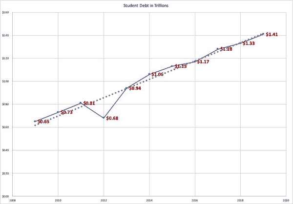
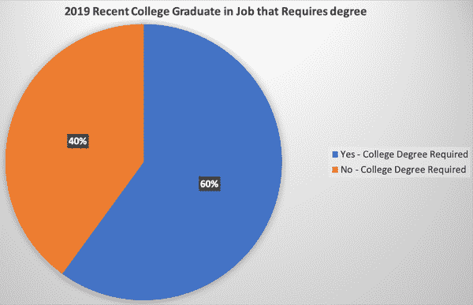
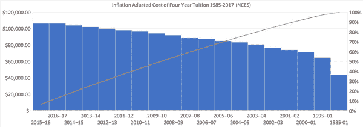
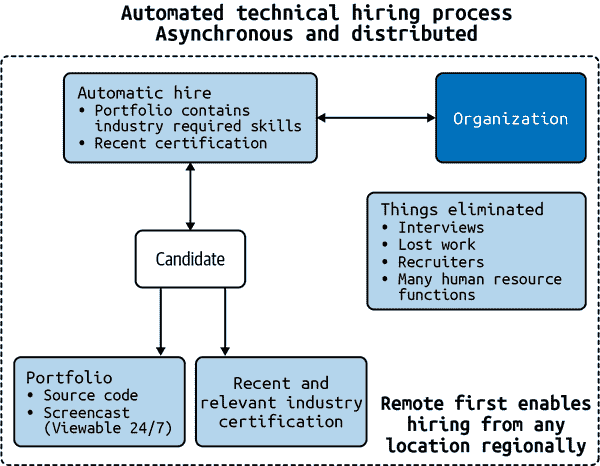

# 附录 G. 额外的教育资源

作者：Noah Gift

我们都知道，一本书、一门课程或一个学位不足以——相反，持续学习是保持更新的最佳方法。保持学习的一种方式是在您的工作、朋友或学校形成一个学习小组来继续成长。我教授的 ML 工程、MLOps 和应用计算机视觉课程提供的以下资源可以帮助您开始。

# 其他 MLOps 关键思考问题

+   一位前初创企业工程经理提到，“敏捷”项目管理单独不足以发布最小可行产品（MVP）。通常还需要一个为期 3 个月的每周计划（即瀑布式计划）。讨论您对这种观点的回应。

+   连续集成（CI）系统解决了哪些问题？

+   为什么 CI 系统是 SaaS 软件的重要组成部分？

+   为什么云平台是分析应用的理想目标？

+   深度学习如何从云计算中受益？

+   像 Google BigQuery 这样的托管服务的优势是什么？

+   Google BigQuery 与传统 SQL 有何不同？

+   从 BigQuery 直接进行机器学习（ML）预测如何为 Google 平台增加价值？

+   这对分析应用工程有什么优势？

+   自动机器学习（AutoML）如何具有较低的总体拥有成本（TCO）？

+   如何能够有更高的 TCO？

+   不同环境解决了什么问题？

+   不同环境创造了哪些问题？

+   如何正确管理云中的意外成本？

+   有哪三种工具可以帮助您管理 Google Cloud Platform 上的成本？

+   有哪三种工具可以帮助您管理 AWS 平台上的成本？

+   有哪三种工具可以帮助您管理 Azure 平台上的成本？

+   为什么 JavaScript 对象表示法（JSON）日志记录通常比非结构化日志记录更好？

+   提示频繁的警报有什么缺点？

+   通过回答以下问题创建终身学习计划：本季度您将学习哪些技能，为什么以及如何？到年底前您将学习哪些技能，为什么以及如何？到明年年底前您将学习哪些技能，为什么以及如何？到五年后您将学习哪些技能，为什么以及如何？

+   连续交付（CD）系统解决了哪些问题？

+   为什么持续交付系统是数据工程的重要组成部分？

+   连续集成和持续交付之间的关键区别是什么？

+   解释监控和日志记录在数据工程中扮演的关键角色。

+   解释健康检查可能出现的问题。

+   解释为什么“数据治理”是网络安全的“无名英雄”。

+   解释测试在数据工程中扮演的关键角色。

+   解释自动化和测试如何紧密相关。

+   选择一个喜欢的 Python 命令行框架，并写一个 hello-world 例子，并分享。您能解释为什么选择它吗？

+   解释云计算如何影响数据工程。

+   解释无服务器如何影响数据工程。

+   分享一个简单的 Python AWS Lambda 函数并解释其作用。

+   解释什么是机器学习工程。

+   创建并共享一个简单的`Dockerfile`，用于运行 Flask 应用。解释它的工作原理。

+   解释什么是数据工程。

+   截断和混洗大数据集，加载到 Pandas 中，并分享您的工作。解释您使用的方法。

+   解释 DevOps 是什么，以及它如何增强数据工程项目。

+   考虑实际的计算机视觉问题时，云解决了什么问题？

+   如何使用 Colab 笔记本和 Jupyter 笔记本交换想法或构建研究组合？

+   生物视觉与机器视觉之间的一些关键区别是什么？

+   生成建模的一些实际用例是什么？

+   解释游戏机器如何使用计算机视觉来获胜。

+   使用计算机视觉 API 解决实际问题的利弊如何？

+   AutoML 如何现在影响数据科学，未来将如何影响它？

+   基于边缘的机器学习的真实用例是什么？

+   几个基于边缘的机器学习平台是什么？

+   集成平台如何融入现有公司的 ML 策略？

+   SageMaker 如何改变组织中的机器学习模型创建？

+   AWS Lambda 的实际用例是什么？

+   解释迁移学习的实际用例。请解释您如何在项目中使用它。

+   如何将您构建的 ML 模型推进到更高级的功能阶段？

+   IAC 是什么，它解决了什么问题？

+   公司在项目中如何决定使用何种级别的云抽象化：SaaS、PaaS、IaaS、MaaS、无服务器？

+   AWS 上网络安全的不同层次及其各自解决的独特问题是什么？

+   AWS Spot 实例解决了什么问题，你如何在项目中使用它们？

+   创建 Docker 格式的容器并推荐如何在项目中使用它们。

+   评估像 Kubernetes 和托管 Kubernetes 这样的容器管理服务，并与它们一起创建解决方案。

+   总结容器注册表及如何使用它们创建自定义容器。

+   容器是什么？

+   容器解决了什么问题？

+   Kubernetes 与容器之间的关系是什么？

+   准确评估分布式计算的挑战和机会，并将这些知识应用到实际项目中。

+   总结最终一致性在云原生应用中的作用。

+   CAP 定理在设计云时如何起作用？

+   Amdahl 定律对机器学习项目有什么影响？

+   为 ASIC 推荐适当的用例。

+   考虑摩尔定律的结束对项目的影响。

+   “一刀切”方法对关系数据库有什么问题？

+   类似 Google BigQuery 这样的服务如何改变你处理数据的方式？

+   像 Athena 这样的“无服务器”数据库解决了什么问题？

+   块存储和对象存储之间的关键区别是什么？

+   数据湖解决的基本问题是什么？

+   无服务器架构的权衡是什么？

+   使用 Cloud9 开发的优势是什么？

+   Google App Engine 解决了什么问题？

+   Cloud Shell 环境解决了什么问题？

# 其他 MLOps 教育材料

除了本书中的资源外，这些是更新频繁的额外资源，您可以利用它们继续改进：

+   O'Reilly 平台每周更新许多其他与 MLOps 相关的视频，由[Pragmatic AI Solutions](https://oreil.ly/g8oz3)提供。您还可以在 O'Reilly 学习平台上查看 Katacodas。

+   在[Pragmatic AI Labs 网站](https://paiml.com)上有几本免费书籍可供阅读。

+   订阅[Pragmatic AI Labs YouTube 频道](https://oreil.ly/4xrBP)。

+   参与杜克大学和 Coursera 专业化课程[构建大规模云计算解决方案](https://oreil.ly/8QbE0)。

# 教育颠覆

颠覆是指从已建立的模型或流程中的中断、干扰或变更。本节提供了我对教育颠覆以及其如何影响学习 MLOps 技术的思考。

在事后看到颠覆总是容易的。考虑出租车司机及当前服务如 Lyft 和 Uber 的问题。为什么要求司机支付[一百万美元购买出租车牌照](https://oreil.ly/DjMHY)作为促进公共出租车服务的机制是合理的（Figure G-1）？

###### 图 G-1\. 出租车牌照¹

Lyft 和 Uber 等公司解决的问题是什么？

+   价格更低

+   推送与拉取（司机来找你）

+   可预测的服务

+   养成习惯的反馈循环

+   异步设计

+   数字与模拟

+   非线性工作流程

让我们在教育方面考虑同样的想法。

## 高等教育的当前状态将被打破

教育也正在进行类似的颠覆。学生债务创历史新高，根据 Experian 的数据，自 2008 年以来呈线性增长，如 Figure G-2 所示。

###### 图 G-2\. Experian 学生债务

与此同时，一个同样令人不安的趋势是一项同样令人不安的统计数据，即 2019 年有四分之一的大学毕业生从事了不需要他们学位的工作（Figure G-3）。

###### 图 G-3\. 需要学位的工作

这个过程是不可持续的。学生债务不能继续每年增长，同时产生几乎一半不直接通向工作的结果。如果结果相同，为什么一个学生不花四年时间学习像个人健身、运动、音乐或烹饪艺术这样的爱好呢？至少在那种情况下，他们不会负债，而且还有一个可以终身使用的有趣爱好。

在彼得·蒂尔（Currency）的书《从零到一》中，他提到了 10 倍规则。他指出，为了成功，一家公司需要比最接近的竞争对手强 10 倍。产品或服务能比传统教育好 10 倍吗？是的，可以。

## 10 倍更好的教育

那么实践中的 10 倍教育系统会是什么样子呢？

### 内置学徒制

如果一个教育项目的重点是工作，那么为什么不在学校期间就进行实习培训呢？

### 关注客户

当前大部分高等教育体系的关注点集中在教职员和教职员的研究上。谁为此买单？学生。这是一个重要的教育者标准，即在知名期刊上发表内容。与客户之间只有间接联系。

与此同时，像[Udacity](https://oreil.ly/EONTI)，Coursera，O’Reilly 和[Edx](https://edx.org)这样的公司直接向客户提供这些产品。这种培训是针对工作的，比传统大学更新速度快得多。

可能教给学生的技能可能只专注于获得工作成果。大多数学生专注于找工作，而不是变得更好的人。有其他途径可以达到这个目标。

### 完成时间缩短

一个学位是否需要四年才能完成？如果学位的大部分时间用于非必要任务，可能需要那么长时间。为什么不能在一年或两年内完成学位？

### 成本更低

根据[USNews](https://oreil.ly/7uGRp)，公立本州大学的四年平均学费为$10,116；公立外州大学为$22,577；私立大学为$36,801。自 1985 年以来（见图 G-4），四年制学位的总成本（通胀调整后）已经不断上升。

###### 图 G-4。通胀调整后的学费

竞争对手能否提供比现在便宜 10 倍的产品？从 1985 年到 2019 年的起点可能是撤销已经发生的事情。如果产品没有改进，但成本却翻了三倍，那么这种情况很容易被打破。

### 异步和远程优先

许多软件工程公司已决定采用[“远程优先”](https://oreil.ly/IpFYA)策略。在其他情况下，像 Twitter 这样的公司正在向分布式劳动力转移（https://oreil.ly/T3j9D）。在构建软件时，产出是数字产品。如果工作是数字化的，环境可以完全异步和远程化。异步和远程优先课程的优势在于规模化分发。

“远程优先”环境的一个优势是组织结构更专注于结果而非地点。许多软件公司由于不必要的会议、嘈杂的工作环境和长途通勤而遭受巨大的干扰和浪费。许多学生将进入“远程优先”工作环境，学习如何成功地掌握这些环境中的技能可能对他们有重大好处。

### 首先包容，而不是首先排除

许多大学公开表明有多少学生申请他们的项目，以及多少学生被录取。这种基于首先排除的方法旨在增加需求。如果出售的资产是物理的，比如马里布海滩的房子，那么根据市场情况价格会调整得更高。如果出售的产品是数字化且可无限扩展的，则排除是没有意义的。

虽然如此，[严格的“训练营”风格课程](https://oreil.ly/GOrXU)也并非没有问题。特别是课程质量和教学质量不应该是事后的考虑。

### 非线性与串行

在数字技术出现之前，许多任务都是持续运营的。一个很好的例子是电视编辑技术。我曾在上世纪九十年代为 ABC 电视台担任编辑。您需要使用物理磁带进行编辑。不久后，视频磁带变成了硬盘上的数据，这开启了许多新的编辑技术。

同样，在教育方面，没有理由强制按计划学习某事。异步开放了许多新学习方式的可能性。妈妈可以晚上学习；现有员工可以在周末或午餐时间学习。

### 终身学习：毕业生可永久获取内容，并有持续的技能提升路径

教育机构重新考虑采用“远程优先”的另一个原因是，这将允许开设课程供校友学习（零成本或按需付费）。按需软件作为一种方法可以防止竞争对手的攻击。许多行业需要持续提升技能。技术行业就是一个很好的例子。

可以毫不夸张地说，任何技术工作者需要每六个月学习一项新技能。当前的教育产品没有考虑到这一点。为什么毕业生不可以有机会学习材料并获得这些材料的认证？增强的校友可能会带来更好的品牌。

### 将会受到打击的区域就业市场

作为前湾区软件工程师和房主，我不认为在当前成本结构下居住在该地区有任何未来优势（图 G-5）。超高成本地区的高生活成本导致了许多连锁问题：无家可归，通勤时间增加，生活质量急剧下降等等。

###### 图 G-5\. 美国的住房可负担性

危机就是机会。许多公司意识到，无论超高成本地区有什么好处，都不值得。相反，具有优秀基础设施和低生活成本的区域中心具有巨大的机会。作为作业增长中心的一些特征包括：可以访问大学，交通便利，住房价格低廉，以及对增长有利的良好政府政策。

像田纳西州这样的地区是一个很好的例子。它有[免费的副学士学位项目](https://tnreconnect.gov)，可以访问许多顶级大学，生活成本低，拥有像[橡树岭国家实验室](https://ornl.gov)这样的顶尖研究机构。这些地区可以极大地颠覆现状，特别是如果它们接受远程优先和异步教育和劳动力。

### 颠覆招聘流程

美国的招聘过程准备进行颠覆。由于专注于直接的同步操作，它很容易被打破。图 G-6 显示，通过取消所有面试并用适当认证的个人自动招募来打破招聘是可能的。这是一个经典的分布式编程问题，通过将任务从串行且“错误”的工作流程转移到完全分布式的工作流程来修复瓶颈。公司应该从工作者那里“拉取”，而不是不断地依赖于陷入徒劳工作的资源。

###### 图 G-6\. 颠覆招聘

云计算之所以是如此重要的技能之一是它简化了软件工程的许多方面。它简化的问题之一是构建解决方案。许多解决方案通常涉及 YAML 格式文件和少量 Python 代码。

# 结论

教育不再是静态的。要在 MLOps 中保持相关性需要一种成长的心态。这种成长的心态意味着你必须在持续产生结果的同时不断学习。好消息是，如果他们利用技术培训机会的激增，有动力的人成功的机会越来越大。

¹ 出处：加利福尼亚，旧金山 1996 年 - 出租车牌照补充许可证 - Flickr - woody1778a.jpg。
