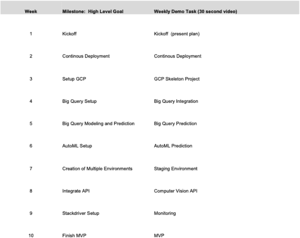
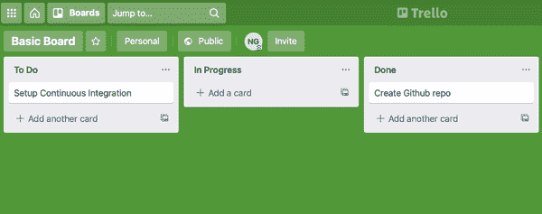

# 附录 H. 技术项目管理

作者：Noah Gift

在高度技术的云计算课程的第一周，我提出了技术项目管理的问题，以及在附录中所描述的做法的重要性。一个学生在课堂上举手提问：“这是一个项目管理课吗？我以为这门课是关于云计算的？”

类似地，在现实世界中，很容易认为项目管理并不重要。然而，对 MLOps 来说，少量的技术项目管理知识是至关重要的。项目管理的三个重要组成部分如下：

+   尝试规划您的项目以完成时间，例如 12 周，使用每周的里程碑。

+   每周向您的团队进行演示，展示进展情况。

+   将任务分解为每四小时一次的时间块，并每周执行，使用像 Trello 或 GitHub 这样的简单任务跟踪系统进行跟踪。

现在，让我们简要介绍一些基础知识，以确保您的成功。

# 项目计划

关于项目管理，MLOps 并没有什么独特之处。不过，值得指出的是项目管理的一些非显而易见的亮点，这些亮点有助于构建机器学习项目。在构建 ML 解决方案时，一个强大的概念是以 10 到 12 周的时间表来思考，并尝试为每周制定个别的结果。在书籍的源代码存储库中，有一个[示例模板供参考](https://oreil.ly/kzPGu)。

一个重要的收获是，计划创建了启动将机器学习代码部署到生产环境所必需的支撑结构，而每周的演示则创造了责任感。

在图 H-1 中，按周划分的项目计划允许对项目复杂性进行初步范围界定。

###### 图 H-1\. 项目计划

接下来，让我们讨论每周演示。

# 每周演示

在现实世界的两种场景中，当我与一个团队一起将代码部署到生产环境或在教育系统中时，每周演示和项目计划是减少项目从未见天日风险的关键组成部分。关于做演示的另一个隐藏事实是，让做演示的人理解他们正在做什么并传达信息。

古罗马谚语“Docendo discimus”表明“通过教学，我们学习”。这个谚语也与关于学习的学术研究相关，并且是我在行业和课堂上看到的更有效的教学方法之一。视频演示对于消费者和创作者都非常有力。

# 任务跟踪

你可以在线查看一个基础的公共 Trello 跟踪面板[online](https://oreil.ly/iJ4iX)。在图 H-2 中，注意到一个简单的方法，仅包括三列：待办、进行中和已完成。由于这是一个很好的工作单元来拆分任务，每个任务大约需要四个小时完成。

###### 图 H-2\. 使用 Trello 进行票务跟踪

最后，这些工单通常每周都会完成一次。这种工作流展示了每周的进展感。请注意，您可以使用任何基于面板的跟踪系统来完成同样的事情。主要的要点是保持简单！简单的项目管理系统能够长期使用，而复杂的则不能。
