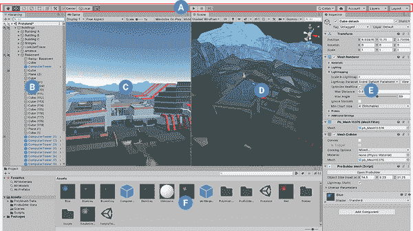
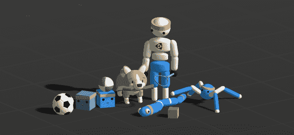

# 第一章：介绍合成和模拟

世界对数据需求迫切。机器学习和人工智能是最需要数据的领域之一。算法和模型不断增大，而现实世界的数据却是有限的。手动创建数据和现实世界系统并不可扩展，我们需要新的方法。这就是 Unity 以及传统用于视频游戏开发的软件发挥作用的地方。

本书关注合成和模拟，并利用现代视频游戏引擎在机器学习中的强大力量。表面上，将机器学习与模拟及合成数据结合起来似乎相对简单，但事实上，将*视频游戏*技术引入机器学习的严肃商业世界，却令许多公司和企业望而却步。

我们希望本书能引导你进入这个世界，并减少你的顾虑。本书的三位作者是具有丰富计算机科学背景的视频游戏开发者，还有一位是认真的机器学习和数据科学家。我们在多年间在各种行业和方法中积累的综合视角和知识，在这里呈现给你。

本书将带你探索使用 Unity 视频游戏引擎来构建和训练机器学习系统的方法和技术，以及使用和生成的数据。本书有两个明显的领域：*模拟* 和 *合成*。模拟指的是在你自己创建的虚拟世界中构建学习做某事的虚拟机器人（称为*代理*）。合成指的是构建虚拟对象或世界，输出有关这些对象和世界的数据，并将其用于在游戏引擎之外训练机器学习系统。

模拟和合成都是强大的技术，能够为以数据为中心的机器学习和人工智能带来新的和令人兴奋的方法。

# 一个全新的 ML 世界

不久后我们将进入本书的结构，但首先，这里是本章剩余部分的概述，分为四个部分：

+   在 “领域” 中，我们将介绍本书探索的机器学习领域：模拟与合成。

+   在 “工具” 中，我们将会介绍我们将要使用的工具——*Unity 引擎*，*Unity ML-Agents Toolkit*，*PyTorch* 和 *Unity Perception*，以及它们如何结合在一起。

+   在 “技术” 中，我们将探讨我们将用于机器学习的技术：*近端策略优化*（PPO），*软演员-评论家*（SAC），*行为克隆*（BC）和 *生成对抗性模仿学习*（GAIL）。

+   最后，在 “项目” 中，我们将总结我们将在本书中构建的项目，以及它们与领域和工具的关系。

在本章结束时，你将准备好深入探索模拟和合成的世界，你将了解游戏引擎的工作原理，并理解为什么它几乎是机器学习的完美工具。在本书结束时，你将准备好解决任何可能从游戏引擎驱动的模拟或合成中受益的问题。

# 领域

本书的双大支柱是*模拟*和*合成*。在本节中，我们将详细解释这两个术语的确切含义，以及本书将如何探索这些概念。

模拟和合成是人工智能和机器学习未来的核心部分。

许多应用立即显而易见：将模拟与深度强化学习结合起来，验证新机器人在建造物理产品之前的功能；在没有汽车的情况下创建你自动驾驶汽车的大脑；在没有仓库（或机器人）的情况下建造你的仓库并训练你的拾取和放置机器人。

其他用途更微妙：通过模拟来合成数据，而不是使用从真实世界记录的信息，然后训练传统的机器学习模型；利用行为克隆与模拟相结合，以真实用户活动为基础，在本来是完美的机器学习任务中添加生物或人类化的元素。

一个视频游戏引擎，比如 Unity，可以模拟足够接近真实世界的环境，并具备足够的逼真度，从而对基于模拟的机器学习和人工智能非常有用。游戏引擎不仅可以让你模拟足够大的城市和汽车来测试、训练和验证自动驾驶汽车深度学习模型，还可以模拟到引擎温度、剩余功率、激光雷达、声纳、X 射线等硬件的细节。想要在你的机器人中加入一个新的高端昂贵传感器？在你投资任何一分钱之前试一试，看看它是否能提高性能。节省金钱、时间、计算资源和工程资源，更好地了解你的问题空间。

是完全不可能的，还是可能不安全的，去获取足够多的你的数据？创建一个模拟并测试你的理论。便宜、无限的训练数据只隔着一个模拟。

## 模拟

当我们说*模拟*时，我们并不指代一个具体的东西。在这个背景下，模拟可以广泛指使用游戏引擎开发场景或环境，然后应用机器学习。在本书中，我们将模拟作为一个术语，广泛涵盖以下内容：

+   使用游戏引擎创建一个具有特定组件的环境，这些组件是代理或者代理们

+   赋予代理（们）移动的能力，或者与环境和/或其他代理进行互动或工作

+   将环境与机器学习框架连接起来，训练一个能够在环境中操作代理（们）的模型

+   使用训练好的模型来操作未来的环境，或将模型连接到其他同样配备的代理人（例如在真实世界中，与实际机器人）

## 合成

在本书的背景下，合成是一件相对容易明确的事情：*合成*是使用游戏引擎创建表面上看来是虚假的训练数据。例如，如果你为超市建立某种图像识别机器学习模型，你可能需要从多个角度和不同背景及环境中拍摄特定麦片品牌的盒子的照片。

使用游戏引擎，你可以创建和加载一个麦片盒的 3D 模型，然后在不同角度、背景和倾斜角度下生成数千张图像，将它们综合起来，并保存为标准图像格式（例如 JPG 或 PNG）。然后，利用你庞大的训练数据，你可以使用完全标准的机器学习框架和工具包（例如 TensorFlow、PyTorch、Create ML、Turi Create，或众多基于网络服务的训练系统之一），训练一个能识别你的麦片盒的模型。

然后可以将这种模式部署到例如某种购物车上的 AI 系统中，帮助人们购物，引导他们找到购物清单上的物品，或帮助店员正确放置货架并进行库存预测。

合成是使用游戏引擎创建训练数据，而游戏引擎本身通常与训练过程无关或关联很少。

# 工具

本章向您介绍了我们将在旅程中使用的工具。如果您不是游戏开发者，那么您将遇到的主要新工具是 Unity。Unity 传统上是一个游戏引擎，但现在被推广为实时 3D 引擎。

让我们逐一介绍本书中你将遇到的工具。

## Unity

首先要明确，Unity 是一款游戏和视觉效果引擎。Unity Technologies 将 Unity 描述为*实时 3D 开发平台*。我们不会为你重复 Unity 网站上的营销材料，但如果你对公司如何定位感兴趣，你可以[查看它](https://oreil.ly/nnVUz)。

###### 提示

本书不旨在教授你 Unity 的基础知识。本书的一些作者已经从游戏开发的角度撰写了几本书籍，如果你感兴趣，你可以在 O'Reilly Media 找到它们。你不需要像游戏开发者那样学习 Unity，以便在模拟和机器学习合成中使用它；在本书中，我们将*只学习足够的 Unity*以在这方面取得效果。

Unity 用户界面看起来几乎与其他拥有 3D 功能的专业软件包相同。我们在 Figure 1-1 中包含了一个示例截图。该界面有可以操作的窗格，用于处理对象的 3D 画布以及许多设置。我们稍后会回到 Unity 用户界面的具体内容。你可以在[Unity 文档](https://oreil.ly/zN8xU)中获取其不同元素的全面概述。

本书中你将同时使用 Unity 进行仿真和合成。

###### Figure 1-1\. Unity 用户界面

Unity 引擎配备了一套强大的工具，允许你模拟重力、力量、摩擦、运动、各种传感器等。这些工具正是构建现代视频游戏所需的完整工具集。事实证明，这些工具也是创建仿真和合成数据所需的完全相同的工具集。但是，考虑到你正在阅读我们的书籍，你可能已经猜到了这一点。

###### 注意

本书适用于 Unity 2021 及更新版本。如果你在 2023 年或之后阅读本书，Unity 的界面可能与我们的截图略有不同，但是概念和整体流程应该没有太大变化。游戏引擎通常会不断添加功能，而不是移除它们，所以你可能会看到的最常见的变化是图标看起来略有不同之类的事情。关于任何可能发生变化的最新注释，请访问我们的[专用书籍网站](https://oreil.ly/1efRA)。

## 通过 Unity ML-Agents 的 PyTorch

如果你身处机器学习领域，你可能已经听说过 PyTorch 开源项目。作为学术界和工业界最受欢迎的机器学习平台和生态系统之一，它几乎无所不在。在模拟和综合空间中，情况也一样：PyTorch 是首选框架之一。

在本书中，我们探索的基础机器学习大部分将通过 PyTorch 完成。我们不会深入探讨 PyTorch 的*细枝末节*，因为我们将大部分时间通过 Unity ML-Agents 工具包来使用 PyTorch。我们马上会讨论 ML-Agents 工具包，但你需要记住的是，PyTorch 是驱动 Unity ML-Agents 工具包所做工作的*引擎*。它一直在那里，在幕后运行，如果需要或者你知道自己在做什么，你可以对其进行调整，但大部分时间你根本不需要碰它。

###### 小贴士

我们将在本节的其余部分讨论 Unity ML-Agents 工具包，所以如果你需要回顾 PyTorch，我们强烈推荐访问[PyTorch 网站](https://pytorch.org)，或者 O’Reilly Media 出版的关于该主题的众多优秀书籍之一。

PyTorch 是一个库，支持使用数据流图进行计算。它支持使用 CPU 和 GPU（以及其他专用的机器学习硬件）进行训练和推理，并且可以在从严肃的 ML 优化服务器到移动设备的各种平台上运行。

###### 注意

因为在本书中您将使用 PyTorch 的大部分工作都是抽象化的，所以我们很少会直接谈论 PyTorch 本身。因此，虽然它几乎是我们要探索的一切的背景，但您与它的主要接口将是通过 Unity ML-Agents 工具包和其他工具。

我们将使用 PyTorch，通过 Unity ML-Agents，进行本书中的所有模拟活动。

## Unity ML-Agents 工具包

Unity ML-Agents 工具包（我们通常将其缩写为 *UnityML* 或 *ML-Agents*）是本书中您将进行的工作的支柱。ML-Agents 最初是作为一个简陋的实验项目发布的，然后逐渐扩展到包含一系列功能，使 Unity 引擎能够作为训练和探索智能代理和其他机器学习应用的模拟环境。

这是一个开源项目，提供了许多令人兴奋和经过深思熟虑的示例（如图 1-2 所示），并且可以通过[其 GitHub 项目](https://oreil.ly/JPkQ8)免费获取。

###### 图 1-2\. Unity ML-Agents 工具包的“主题图像”，展示了一些 Unity 的示例角色

如果不明显的话，我们将在本书中的所有模拟活动中使用 ML-Agents。我们将向您展示如何在您自己的系统上运行 ML-Agents，在第二章中。不要急着安装它！

## Unity Perception

Unity Perception 包（我们通常将其缩写为 *Perception*）是我们将使用来生成合成数据的工具。Unity Perception 提供了一系列额外功能给 Unity 编辑器，允许您适当设置场景以创建 *伪造* 数据。

像 ML-Agents 一样，Perception 也是一个开源项目，您可以通过[其 GitHub 项目](https://oreil.ly/KbvHj)找到它。

# 技术

ML-Agents 工具包支持使用 *强化学习* 和 *模仿学习* 技术进行训练。这两种技术都允许代理通过反复的试验和错误（或“强化”）来“学习”所需的行为，并最终在提供的成功标准下收敛到理想的行为。这些技术的区别在于用于评估和优化代理性能的标准。

## 强化学习

*强化学习*（RL）是指使用显式奖励进行学习过程。实施方负责为可取行为奖励“分数”，并为不良行为扣除分数。

在这一点上，你可能会想，“如果我不得不告诉它该做什么和不该做什么，机器学习的意义何在？” 但让我们来想象一下，例如，教一个双足代理行走。为每个步态变化的每个状态变化提供明确的一套指令——每个关节应该以多少度的旋转顺序进行——将是广泛且复杂的。

但是通过给代理几个点以向前移动，达到终点时给很多点，它跌倒时给负点，并尝试数十万次以获得正确结果，它将能够自行找出具体细节。因此，RL 的巨大优势在于能够给出以目标为中心的指令，需要复杂行为来实现。

ML-Agents 框架提供了两种不同的 RL 算法实现：*近端策略优化*（PPO）和 *软演员-评论家*（SAC）。

###### 警告

注意这些技术和算法的缩写：RL、PPO 和 SAC。记住它们，我们将在整本书中经常使用它们。

*PPO* 是一个强大的通用 RL 算法，已经反复证明在各种应用中非常有效且通常稳定。PPO 是 ML-Agents 中使用的默认算法，并且将在本书的大部分内容中使用。稍后我们将更详细地探讨 PPO 的工作原理。

###### 提示

近端策略优化是由 OpenAI 团队创建的，并于 2017 年首次亮相。如果您对细节感兴趣，可以阅读 [arXiv 上的原始论文](https://oreil.ly/JHfhI)。

*SAC* 是一个 *离线* RL 算法。稍后我们将详细讨论其含义，但目前来看，相对于像 PPO 这样的 *在线* 方法，它通常减少了所需的训练周期，但增加了内存需求。在本书中我们将会使用一两次 SAC，并在到达时更详细地探讨其工作原理。

###### 提示

软演员-评论家是由伯克利人工智能研究组（BAIR）创建的，并于 2018 年 12 月首次亮相。您可以阅读 [原始发布文档](https://oreil.ly/7kNmg) 以获取详细信息。

## 模仿学习

类似于 RL，*模仿学习*（IL）消除了需要定义复杂指令的需求，而是简单地设定目标。然而，IL 也消除了需要定义显式目标或奖励的必要性。相反，通常会提供一个演示——通常是一个由人手动控制的代理的录像——并根据代理模仿所展示行为来内在定义奖励。

这对于复杂领域尤其有用，其中期望的行为非常具体或者大多数可能的行为都是不可取的。对于多阶段目标（代理需要按特定顺序实现中间目标以获得奖励），使用 IL 进行训练也非常有效。

ML-Agents 框架内置了两种不同的 IL 算法的实现：*行为克隆*（BC）和*生成对抗模仿学习*（GAIL）。

*BC*是一种 IL 算法，用于训练代理精确模仿演示的行为。在这里，BC 仅负责定义和分配内在奖励；而现有的 RL 方法，如 PPO 或 SAC，则用于基础训练过程中。

*GAIL*是一种生成对抗方法，应用于 IL。在 GAIL 中，两个独立的模型在训练过程中互相对抗：一个是代理行为模型，它尽最大努力模仿给定的演示；另一个是鉴别器，它会反复接收人类驱动的演示者行为或代理驱动的模型行为的片段，并且必须猜测是哪一个。

###### 提示

GAIL 源于 Jonathan Ho 和 Stefano Ermon 的论文[“生成对抗模仿学习”](https://oreil.ly/bokpR)。

随着鉴别器在识别模仿者方面变得更加熟练，代理模型必须改进以再次欺骗它。同样地，随着代理模型的改进，鉴别器必须建立越来越严格或更为微妙的内部标准来识别伪造的行为。在这种来回之间，每个人都被迫进行迭代改进。

###### 提示

行为克隆通常是应用中最佳的方法，因为可以演示出代理可能遇到的所有或几乎所有条件。相比之下，GAIL 能够推广新的行为，这允许从有限的演示中学习模仿。

在早期训练中通常通过使用 BC，BC 和 GAIL 也可以一起使用，然后将部分训练好的行为模型分配为 GAIL 模型的代理部分。从 BC 开始，通常会使代理在早期训练中迅速改进，而在后期训练中切换到 GAIL 将允许其开发超出演示的行为。

## 混合学习

虽然单独使用 RL 或 IL 几乎总是可以达到目的，它们可以结合使用。然后，代理可以通过明确定义的达成目标的奖励和有效模仿的隐式奖励来获得奖励并且其行为得到指导。甚至可以调整每种奖励的权重，以便训练代理将其中一个作为主要目标或两者作为平等目标。

在混合训练中，IL 演示旨在在训练初期将代理放在正确的路径上，而显式的 RL 奖励则鼓励在此之内或之外的特定行为。这在理想的代理应该优于人类演示者的领域中是必要的。由于这种早期的辅助作用，同时使用 RL 和 IL 训练可以显著加快训练速度，让代理在解决复杂问题或在稀疏奖励情境中导航复杂环境时更快地训练出解决方案。

###### 提示

*稀疏奖励环境*是那些代理特别少接收显式奖励的环境。在这样的环境中，代理“偶然”发现一个可奖励行为并因此收到其首次指示应该做什么，可能会浪费大部分可用的训练时间。但与 IL 结合，演示可以提供有关朝向显式奖励的理想行为的信息。

这些共同产生了一个复杂的奖励方案，可以鼓励代理从事高度特定的行为，但是需要代理达到成功的复杂程度的应用程序并不多。

## 技术总结

本章是概念和技术的入门调查，你将在本书的过程中接触和使用我们在这里看到的每一种技术。通过这样做，你将更加熟悉它们在实际操作中的工作方式。

其要义如下：

+   Unity ML-Agents Toolkit 目前提供了跨两个类别的一系列训练算法：

    +   对于强化学习（RL）：近端策略优化（PPO）和软演员-评论家（SAC）

    +   对于模仿学习（IL）：行为克隆（BC）和生成对抗性模仿学习（GAIL）

+   这些方法可以独立使用，也可以一起使用：

    +   RL 可以单独使用 PPO 或 SAC，也可以与 BC 等 IL 方法结合使用。

    +   BC 可以单独使用，作为使用 GAIL 方法或与 RL 结合的一步。

+   RL 技术需要一组定义好的奖励。

+   IL 技术需要提供一些演示。

+   RL 和 IL *通过实践学习*。

在本书剩余的模拟主题探索过程中，我们将涉及或直接使用所有这些技术。

# 项目

本书是一本实际、务实的工作。我们希望你尽快使用模拟和合成开始工作，并且我们假设你在可能的时候更愿意专注于实施。

因此，虽然我们经常探索幕后情况，但本书的实质内容在于我们将共同构建的项目。

本书的实际基于项目的部分分为我们之前讨论的两个领域：模拟和合成。

## 模拟项目

我们的模拟项目将是多样的：当你在 Unity 中构建模拟环境时，代理可以通过多种*方式*观察和*感知*其世界。

一些模拟项目将使用一个代理来观察世界，使用*向量观察*：也就是说，数字。任何你想发送的数字。从字面上讲，任何你喜欢的数字。实际上，向量观察通常是如代理距离某物的距离或其他位置信息之类的东西。但实际上，任何数字都可以作为一种观察。

一些仿真项目将使用一个观察世界的代理，使用*视觉观察*，也就是图片！因为 Unity 是一个游戏引擎，而游戏引擎和电影一样有*摄像机*的概念，所以你可以简单地（虚拟地）在代理身上安装摄像机，并让它存在于游戏世界中。这些摄像机的视角可以输入到你的机器学习系统中，让代理根据摄像机的输入学习它的世界。

我们将使用 Unity、ML-Agents 和 PyTorch 的仿真示例包括：

+   一个可以自行滚动到目标的球，在第二章中（我们知道，听起来太神奇了，但这是真的！）

+   一个可以推动方块进入目标区域的立方体，在第四章中。

+   一辆简单的自动驾驶汽车在第五章中行驶。

+   一个通过模仿人类演示训练来寻找硬币的球，在第六章中。

+   一个弹道发射代理人，可以使用课程学习将球发射到目标位置，在第八章中。

+   一组立方体共同工作，将方块推向目标，在第九章中。

+   训练代理人使用视觉输入（即摄像机），而不是精确测量来平衡球顶部，在第十章中。

+   使用 Python 连接并操作 ML-Agents，在第十一章中。

## 综合项目

我们的综合项目会比仿真项目少一些，因为领域要简单一些。我们专注于利用 Unity 提供的材料来展示仿真的可能性。

我们将使用 Unity 和 Perception 的综合示例包括：

+   一个随机投掷和放置骰子图像生成器，在第三章中。

+   通过改变骰子图像生成器的地板和颜色来改进，在第十三章中。

+   生成超市产品图像，以允许在具有复杂背景和随意位置的图像上进行 Unity 之外的训练，在第十四章中。

一旦生成了合成数据，我们不会专注于实际的训练过程，因为关于这个主题有许多很好的书籍和在线文章，而我们在这本书中只有有限的页面。

# 总结与下一步

你已经迈出了第一步，本章包含了一些必要的背景材料。从这里开始，我们将通过*实践*来教你。这本书的标题中有*实践*这个词是有原因的，我们希望你通过构建自己的项目来感受仿真和综合。

###### 注意

你可以在我们的[书籍专用网站](https://oreil.ly/1efRA)找到每个示例的代码 — 我们建议你在需要时才下载这些代码。我们也会及时更新网站，以便您了解任何需要注意的更改，请务必收藏该网址！

在下一章中，我们将探讨如何创建您的第一个模拟，实现一个代理程序在其中*执行某些操作*，并使用强化学习训练机器学习系统。
