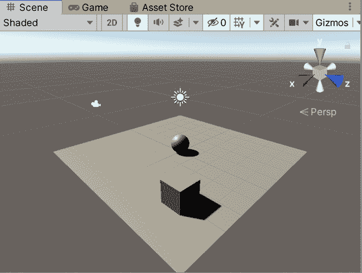

# 第二章：创建你的第一个模拟场景

我们将从一个简单的 *模拟环境* 开始：一个可以在平台上滚动的球代理。正如我们之前所说，我们知道这是一个很多处理的问题，但我们认为你能够应对这些激动人心的挑战，并且最终能够更好地理解 Unity 中的机器学习和模拟。

# 每个人都会记得他们的第一个模拟场景

在本章中，我们将使用 Unity 构建一个全新的模拟环境，创建一个代理，然后使用强化学习训练该代理在环境中完成任务。这将是一个非常简单的模拟环境，但它将展示许多重要内容：

+   如何通过使用少量简单对象的小集合在 Unity 中组装场景是多么简单。

+   如何使用 Unity Package Manager 将 Unity ML-Agents 工具包的 Unity 侧导入 Unity，并为机器学习设置一个 Unity 项目。

+   如何在你的模拟对象中设置一个简单的代理，以便使其能够完成任务

+   如何手动控制你的代理以测试模拟环境

+   如何使用 Unity ML-Agents Toolkit 命令行工具（CLI）开始训练运行，并如何启动 TensorBoard 监控训练进展

+   如何将训练好的模型文件带回 Unity 模拟环境并使用训练好的模型运行代理。

通过本章的学习，你将对 Unity 和使用 ML-Agents 工具包来解决更深层次、更复杂问题感到更加自如。

###### 注

这一章和后面几章不会揭示底层的机器学习算法（请记住本书标题中的“实用”一词？），但我们将开始逐步了解机器学习算法的工作原理，*我们承诺*。

# 我们的模拟

我们的第一个模拟场景看似简单：一个小环境中放置了一个球，它位于虚空中的地面上。球可以自由滚动，包括从地面上掉落到虚空中。它是唯一可控制的元素：既可以由用户（即我们，用于测试目的）控制，也可以由强化学习 ML-Agents 系统控制。

因此，球将作为我们的 *代理*，其目标是在不掉落到 *地面* 之外尽快到达 *目标*。我们将构建的模拟环境在 Figure 2-1 中展示过。


###### 图 2-1\. 我们将要构建的模拟场景

广义上讲，创建任何模拟环境并训练一个或多个代理在其中运作的步骤如下：

1.  在 Unity 中构建环境：这个环境是一个包含物体的物理模拟。

1.  实现机器学习元素：即我们需要一个能在环境中运作的代理。

1.  实现代码，告诉代理如何观察环境，如何在环境中执行动作，如何计算可能收到的奖励，并在成功或失败时如何重置自身或环境。

1.  在环境中训练代理。

我们将在本章中执行这四个步骤。

# 设置

对于仿真和机器学习所需的工具及其讨论，请参考第一章。本节将为您提供关于完成*此特定活动*所需的各个部分的快速摘要。

具体来说，为了完成本章的活动并构建简单的模拟环境，您需要执行以下操作：

1.  *安装 Unity 2021 或更新版本.* 本书不会教授您 Unity 的基础知识（如果您感兴趣，我们已经写了一本[优秀的书籍](https://www.oreilly.com/library/view/unity-game-development/9781491999141)），但值得注意的是，Unity 的安装方式经常变化，比这本书教授的基础材料更频繁，因此我们建议查看 Unity 网站上的[Unity 安装指南](https://oreil.ly/sEa5n)以获取最新的安装信息。跳转到那里，安装适合的 Unity 版本，然后回来。我们还会在这里等您。

    ###### 提示

    虽然 Unity ML-Agents Toolkit 可与任何新于 2018.4 的 Unity 版本配合使用，但我们建议您安装最新的 2021 版本 Unity。您可能会找到 Unity 的 2021 LTS 版本。LTS 代表长期支持，这是 Unity 团队在指定时间内维护的版本，包括 bug 和安全修复。如果您正在进行生产工作，并且已经学完了学习（如果有“学完学习”这样的事情的话），以它为基础是一个安全的选择。您可以在[Unity 文档](https://oreil.ly/1mtHI)中了解更多关于 Unity LTS 版本的信息。

1.  *安装 Python.* 您需要安装一个新于或等于 Python 3.6.1 且旧于（但不包括）Python 3.8 的版本。如果您没有偏好或者没有现有的 Python 环境，我们建议安装 Python 3.7.8。正如我们在第一章中讨论的，Unity ML-Agents Toolkit 的大部分依赖于 Python。

    ###### 警告

    在撰写本文时，Unity ML-Agents Toolkit 不支持 Python 3.8。您需要使用 Python 3.6.1 或更新版本，或任何 Python 3.7 版本。如果您使用的是 Windows，则还需要 Python 的 x86-64 版本，因为该工具包不兼容 x86 版本。如果您在运行花哨的 Apple Silicon macOS 设备，则可能需要在 Rosetta 2 下运行 Python，但在 Apple Silicon 版本的 Python 下也可能正常工作。这方面的情况正在快速变化。查看本书的[网站](https://oreil.ly/1efRA)获取关于 Apple Silicon 和 Unity 仿真的最新信息。

    要安装 Python，请访问[Python 下载页面](https://oreil.ly/5dPG8)，获取适合你操作系统的安装程序。如果你不想直接以这种方式安装 Python，也可以使用操作系统的包管理器（如果有的话），或者一个全面的 Python 环境（我们非常喜欢 Anaconda），只要你安装的 Python 版本符合我们刚才提到的版本和架构版本。

    ###### 注意

    你还需要确保你的 Python 安装包含`pip`（或`pip3`），即 Python 包管理器。如果安装出现问题，可以参考[Python 文档](https://oreil.ly/T8c4j)。

    *我们强烈建议你为 Unity ML-Agents 工作使用虚拟环境（“venv”）。* 要了解更多关于创建 venv 的信息，可以参考[Python 文档](https://oreil.ly/qQPZj)，或者按照我们下面概述的基本步骤进行操作。

    ###### 注意

    如果你有在你的机器上设置 Python 的首选方式，就用那个。我们不会告诉你如何生活。如果你对 Python 感到满意，那么实际上你只需要确保遵守 ML-Agents 的版本限制，安装正确的包，并在需要时运行它即可。在涉及多个版本时，Python 是出了名的不脆弱，对吧？（作者注：我们是澳大利亚人，所以这段话应该带有澳式口音，充满尊重的讽刺。）

    你可以像这样创建一个虚拟环境：

    ```
    python -m venv UnityMLVEnv
    ```

    ###### 提示

    我们建议将其命名为`UnityMLVEnv`或类似的名称。但是名称由你决定。

    你可以像这样激活它：

    ```
    source UnityMLVEnv/bin/activate
    ```

1.  *安装 Python `mlagents`包。* 一旦你安装了 Python，并设置了 Unity ML-Agents 的虚拟环境，可以通过以下命令安装 Python `mlagents`包：

    ```
    pip3 install mlagents
    ```

    ###### 提示

    询问`pip`，Python 包管理器，获取并安装`mlagents`也将安装所有`mlagents`所需的依赖项，包括 TensorFlow。

1.  *克隆或下载 Unity ML-Agents Toolkit GitHub 仓库。* 你可以使用以下命令克隆该仓库：

    ```
    git clone https://github.com/Unity-Technologies/ml-agents.git
    ```

我们主要假设你是你选择的操作系统的开发经验丰富的用户。如果你需要完成任何这些设置步骤的指导，请不要绝望！我们建议你查阅文档，以便快速上手。

在完成前面的四个步骤后，你已经完成了与 Python 相关的设置要求。接下来我们将看看 Unity 的要求。

# 创建 Unity 项目

创建模拟环境的第一步是创建一个全新的 Unity 项目。Unity 项目与任何其他开发项目非常相似：它是 Unity 声明为项目的文件、文件夹和*东西*的集合。

###### 注意

我们的屏幕截图将来自 macOS，因为这是我们日常使用的主要环境。本书中使用的所有工具在 macOS、Windows 和 Linux 上均可使用，所以请使用您偏好的操作系统。我们会尽量在操作系统之间指出显著差异（但在我们所做的事情方面，并没有太多的差异）。我们在所有支持的平台上测试了所有活动，一切都在我们的机器上运行良好。

要创建项目，请确保您已完成所有设置步骤，然后执行以下操作：

1.  打开 Unity Hub 并创建一个新的 3D 项目。如图 Figure 2-2 所示，我们将命名为“BallWorld”，但请随意发挥创意。

    

    ###### Figure 2-2\. 为我们的新环境创建 Unity 项目

1.  选择菜单 Window → Package Manager，并使用 [Unity Package Manager](https://oreil.ly/VTwnY) 安装 ML-Agents Toolkit 包 (`com.unity.ml-agents`)，如图 Figure 2-3 所示。

    

    ###### Figure 2-3\. 安装 Unity ML-Agents Toolkit 包

    ###### 注意

    就像现在的所有东西一样，Unity 有一个包管理器。它实际上相当不错，但也像现在的所有东西一样，有时会有些脆弱。如果遇到问题，请重新启动 Unity 并重试，或者尝试下一个注意事项中解释的手动安装过程。

    包下载和安装可能需要一些时间。下载完成后，您将看到 Unity 正在导入它，如图 Figure 2-4 所示。

    

    ###### Figure 2-4\. Unity 导入 ML-Agents 包

    如果您想手动安装包，或者由于某些原因（如公司政策）无法使用 Unity 包管理器，则可以：

    1.  通过选择菜单 Window → Package Manager 打开包管理器。

    1.  在包管理器中点击 + 按钮，并选择“从磁盘添加包…”。

    1.  在您克隆的 Unity ML-Agents Toolkit 副本中找到 com.unity.ml-agents 文件夹，详见 “设置”。

    1.  选择 *package.json* 文件。

        欲了解更多信息，请查看[Unity 文档](https://oreil.ly/XArSA)，了解如何从本地文件夹安装包。

1.  确认在项目视图的 Packages 下有一个 ML Agents 文件夹，如图 Figure 2-5 所示。

    

    ###### Figure 2-5\. 如果您能看到 ML Agents 文件夹，则项目已准备就绪

您的项目已准备就绪。我们建议您在这一点上将其推送到某种源代码控制，或者将其复制为本书中所有 ML-Agents 工作的新起点。

###### 提示

每次你想在 Unity 中创建一个新的模拟环境时，你都需要这个基本的 Unity 引擎起始点。换句话说，你需要打开一个带有安装了 Unity 包的新 Unity 项目，并且每个你想要工作的 ML-Agents 项目都需要进行这样的设置。Python 设置实际上只需要一次，它设置了你机器上可用的 Python 组件，但是 Unity 设置需要为你想要工作的每个项目都进行。

# 包罗万象

可能会令人稍感困惑，因为有许多名称相似的内容。在我们继续之前，让我们稍微解释一下。

在这里实际上有三组事物，你可以把它们都称为“ML-Agents 包”：

+   Python 包 `mlagents`。这是一个 Python 包，我们之前使用 Python 包管理器 `pip3` 安装了它。它是 Unity ML-Agents Toolkit 的一部分，并通过 [Python 包索引](https://pypi.org/project/mlagents) 分发（这就是你之前使用 `pip3` 安装它的方式）。当我们谈论这个 Python 包时，我们会称之为 `mlagents`。

+   Unity 包 `com.unity.ml-agents`。你可以通过 Unity 包管理器安装此包，就像我们在“创建 Unity 项目”中所做的那样。它还是 Unity ML-Agents Toolkit 的一部分，并通过 Unity 包管理器分发（可以通过自动化过程将其安装到 Unity 项目中，其中你可以从 Unity 包管理器界面的列表中选择它，或者手动方式，其中你可以给 Unity 包管理器一个正确形式的 Unity 包的 Git URL）。当我们谈论这个 Unity 包时，我们会将其称为 `com.unity.ml-agents`、ML-Agents、Unity ML-Agents 包或 ML-Agents Toolkit。这个包允许你在 Unity 编辑器内使用 ML-Agents 的功能，并在你在 Unity 中编写的 C# 代码中使用。

    ###### 注意

    你需要安装`mlagents` Python 包、安装 Unity ML-Agents 包，并克隆本地 ML-Agents 仓库的一个副本，因为每个安装都提供了不同的功能集。Python 包使你能够在终端中运行特定命令来训练代理，克隆的 Git 仓库提供了一些有用的示例代码和资源，Unity 包提供了在 Unity 场景中创建代理和其他 ML-Agents（或相关）组件所需的组件。每个都非常有用。

+   克隆的 *Unity ML-Agents Toolkit GitHub 仓库* 的副本。这是 GitHub 仓库内容的本地副本，我们建议你克隆或下载它，因为它包含了有用的文档、示例文件等。当我们提到这个时，我们会称其为“你的本地 ML-Agents 仓库副本”或类似的名称。

###### 警告

如果您使用的是 Apple Silicon，可以使用 Apple Silicon 版本的 Unity，但在 Intel 环境下需要使用 Python。最简单和最懒的方法是在 Rosetta 下运行您的终端应用程序，但也有其他方法。讨论 Python 在 Apple Silicon 上的使用超出了本书的范围，但如果您处于这种情况下，网上有很多资源。请记住：在 macOS 上，Unity 可以是任何平台，但 ML-Agents 和 Python（对于这种用例）必须是 Intel。

# 环境

基本设置完成后，现在可以在 Unity 编辑器中开始构建您的模拟环境了。

这涉及在 Unity 中创建一个作为模拟环境的场景。我们正在构建的模拟环境具有以下要求：

+   一个*地板*，供代理在其上移动

+   一个代理要寻找的*目标*

我们还需要创建代理本身，但我们将在“代理”中进行讨论。

## 地板

地板是代理会移动的地方。它存在是因为我们的代理存在于 Unity 的物理模拟引擎内，如果没有地板，它将会掉落到地面上。

###### 小贴士

在 Unity 中，地板概念并不特殊。我们只是选择使用平面作为地板，但我们可以使用任何存在于物理系统中并且足够大的物体作为地板。

要创建地板，请确保您已打开一个 Unity 场景，然后按照以下步骤操作：

1.  打开 GameObject 菜单 → 3D Object → Plane。点击在 Hierarchy 视图中创建的新平面，在 Inspector 视图中，设置其名称为“Floor”或类似的名称，如 图 2-6 所示。这是我们的地板。

1.  当地板被选中时，使用 Transform Inspector 将其位置设置为`(0, 0, 0)`，旋转设置为`(0, 0, 0)`，缩放设置为`(1, 1, 1)`，如 图 2-7 所示。我们这样做是为了确保地板处于合理的位置和方向，并且具有足够的比例。这些值可能已经是默认值了。


###### 图 2-6\. 创建并命名地板


###### 图 2-7\. 设置地板的变换

###### 小贴士

如果您需要帮助创建 Unity 场景，请查看[Unity 文档](https://oreil.ly/yrzzq)。总体来说，一个场景包含对象，您可以使用 Assets → Create → Scene 菜单创建新的场景。

对于地板，我们不需要创建空虚空，因为 Unity 已经为我们提供了一个（即每个场景只是一个虚空，除非你添加了物体）。不要忘记使用文件菜单保存您正在工作的场景。

###### 小贴士

您可以通过在 Project 视图中找到默认场景，右键单击它，然后选择重命名来将其名称改为不同于“SampleScene”的名称。

## 目标

目标是我们的代理将在地板上寻找的*东西*。再次强调，Unity 没有特殊的目标概念；我们只是称呼我们正在制作的立方体为目标，因为这在场景和模拟计划中是相关的。

要在你的场景中创建目标，请按照以下步骤操作：

1.  打开游戏对象菜单 → 3D 对象 → 立方体。与地板类似，点击层级视图中的新立方体，并使用检视器将其命名为“目标”或类似名称，如 图 2-8 所示。这将成为目标，正如你所见，它是一个非常引人注目的目标！它可能部分嵌入在地板平面中。

    

    ###### 图 2-8\. 创建并命名目标

1.  当选择目标时，如同对地板操作一样，使用变换检视器设置其位置、旋转和缩放。在本例中，值应该类似于 `(3, 0.5, 3)`、`(0, 0, 0)` 和 `(1, 1, 1)`，如 图 2-9 所示。

    

    ###### 图 2-9\. 至今为止的目标和环境变换

到目前为止，这就是我们为目标所需做的一切。此时，你的环境应该与 图 2-9 类似。不要忘记再次保存你的场景。

# 代理

下一步是创建代理。代理是在环境中移动的*东西*。它将是一个能够在周围滚动并寻找目标的球体。

按照以下步骤创建代理：

1.  打开游戏对象菜单 → 3D 对象 → 球体。将球体命名为“代理”或类似名称。

1.  使用检视器设置变换的位置、旋转和缩放为 `(0, 0.5, 0)`、`(0, 0, 0)` 和 `(1, 1, 1)`。你的代理应该与地板上的位置类似，如 图 2-10 所示。

    

    ###### 图 2-10\. 场景中的代理

1.  在代理的检视器底部使用“添加组件”按钮，如 图 2-11 所示，并向代理添加一个刚体组件。你不需要在刚体组件上做任何更改。

    

    ###### 图 2-11\. 添加组件按钮

这就是代理的物理方面的全部内容。接下来，我们需要给代理添加一些逻辑，并促使其连接到机器学习的一面：

1.  选择代理，并通过检视器的“添加组件”按钮添加一个新的脚本组件，如 图 2-12 所示。将脚本命名为“BallAgent”，然后点击“创建并添加”。

    

    ###### 图 2-12\. 为代理创建脚本

    你应该在代理的检视器中看到一个新的脚本组件附加在上面，如 图 2-13 所示。

    

    ###### 图 2-13\. 脚本已附加到代理

1.  在 Unity 项目视图中双击球代理脚本以在代码编辑器中打开。

    ###### 提示

    基本上，使用 Unity ML-Agents 构建的代理需要附加一个告诉 Unity 其父类是`Agent`的脚本。`Agent`是 ML-Agents Unity 包提供的一个类。作为`Agent`的子类意味着我们必须实现或覆盖 Unity ML-Agents 包提供的某些方法。这些方法允许我们控制和处理代理以进行机器学习。

1.  一旦脚本打开，将以下代码添加到顶部，在`using UnityEngine;`行下面：

    ```
    using Unity.MLAgents;
    using Unity.MLAgents.Sensors;
    ```

    这些行导入了我们导入的 ML-Agents Unity 包的适当部分，并允许我们在代码中使用它们。

1.  找到`Update()`方法并删除它。在这个模拟中我们不会使用它。

1.  找到`BallAgent`类的定义，并将其从这个状态更改为：

    ```
    public class BallAgent : MonoBehaviour
    ```

    到这里：

    ```
    public class BallAgent : Agent
    ```

这使得我们的新类`BallAgent`成为`Agent`的子类（来自 ML-Agents），而不是默认的`MonoBehaviour`（大多数非 ML Unity 对象的父类）。

这些是在 Unity 中设置模拟环境中代理的基础知识。接下来我们需要添加一些逻辑，使我们的代理能够在场景中移动（嗯，地板上）。在这之前，我们将对到目前为止制作的三个对象进行分组。

将代码保存在代码编辑器中，然后切换回 Unity 编辑器，在场景中执行以下操作：

1.  打开 GameObject 菜单 → 创建空物体以创建一个空的 GameObject。

1.  选择空 GameObject 并使用检视面板将其命名为“训练区域”。

    ###### 提示

    当你重命名某物件时，可以在层次视图中选择它，而不是使用检视面板，然后按下回车键/Enter 键进入编辑模式。再次按下回车键/Enter 键保存新名称。

1.  将训练区域的 GameObject 的位置、旋转和比例分别设置为`(0, 0, 0)`、`(0, 0, 0)`和`(1, 1, 1)`。

1.  在层次视图中，将地板、目标和代理拖放到训练区域中。此时你的层次视图应该像图 2-14 一样。这样做时，场景中的任何位置都不应该改变。


###### 图 2-14\. 训练区域

完成后别忘了保存场景。

## 启动和停止代理

我们将使用强化学习来训练这个代理。在 Unity 环境中进行强化学习训练涉及运行许多*episode*，在每个 episode 中，代理试图达到立方体。在每个 episode 中，如果代理做了我们希望它做的事情，我们希望通过奖励来强化这种行为，反之亦然。

一个 episode 运行直到代理失败任务——在本例中，可能是掉落到虚空中或者在预定时间内耗尽——或者成功完成任务，即到达目标。

在每个剧集的开始时，调用位于`Agent`上的 C#方法`OnEp⁠i⁠s⁠o⁠d⁠e​B⁠e⁠g⁠i⁠n⁠()`来初始化新剧集的仿真环境。此方法设置剧集的环境。在大多数情况下，您将使用此方法随机化环境元素，以帮助代理在各种条件下学会成功完成任务。

对于我们的场景，在一个剧集开始时，需求是：

+   确保球代理位于地板上某处，而不是掉进深渊。

+   将目标移动到地板上的随机位置。

为了满足第一个要求，我们需要访问代理的 Rigidbody 组件。Rigidbody 组件是 Unity 模拟对象在物理系统中所必需的一部分。

###### 提示

在[Unity 手册](https://oreil.ly/VqNjd)中了解更多关于 Unity Rigidbody 组件的信息。

再次打开 BallAgent 脚本。由于我们需要重置代理的速度（如果它掉进深渊）并且最终移动它到地板上，我们需要访问它的`Rigidbody`：

1.  我们这里需要的 Rigidbody 组件与此脚本将要附加到的相同对象上（不像刚才我们需要目标的变换），因此我们可以在脚本的`Start()`方法内获取对它的引用。

    首先，当我们获取引用时，我们需要一个地方来存储它。在`Start()`方法之前（在类内但在方法之上和之外），添加以下内容：

    ```
    Rigidbody rigidBody;
    ```

1.  接下来，在`Start()`方法内部，添加以下代码来请求对附加到脚本的对象的 Rigidbody 的引用（并将其存储在我们之前创建的`rigidBody`变量中）：

    ```
    rigidBody = GetComponent<Rigidbody>();
    ```

    为了满足第二个要求，我们需要确保代码可以访问目标的变换，以便我们可以将其移动到新的随机位置。

1.  由于此脚本将附加到代理而不是目标，我们需要获取对目标变换的引用。

    为此，在`BallAgent`类的`Start()`方法之前，添加一个新的`public`类型为`Transform`的字段：

    ```
    public Transform Target;
    ```

    ###### 注意

    Unity 组件中的`public`字段将通过 Unity 编辑器显示在检查器中。这意味着您可以通过视觉或拖放选择要使用的对象。我们之前不需要对`Rigidbody`执行此操作，因为它不需要在 Unity 编辑器中公开。

1.  保存脚本（并保持打开状态），然后切换回 Unity 编辑器。找到附加到代理的脚本组件，查找检查器中新创建的目标字段，并选择其旁边的小圆形按钮，如图 2-15 所示。

    

    ###### 图 2-15\. 在脚本中更改目标

1.  在打开的窗口中，双击目标对象，如图 2-16 所示。

    

    ###### 图 2-16\. 选择目标

1.  验证已附加到代理的脚本组件现在在目标字段中显示目标的变换，如图 2-17 图 所示。

    ###### 提示

    如果您愿意，您还可以从 Hierarchy 视图将目标对象拖动到检查器中的插槽中。

    

    ###### 图 2-17\. 确认目标的变换在字段中显示

1.  接下来，切换回脚本代码，并在类内部实现一个空的 `OnEpisodeBegin()` 方法：

    ```
    public override void OnEpisodeBegin()
    {

    }
    ```

1.  在 `OnEpisodeBegin()` 内部，添加以下代码来检查代理的 `Rigidbody` 的位置是否低于地板（这意味着代理正在下落），如果是，则重置其动量并将其移回地板上：

    ```
    if (this.transform.localPosition. y < 0)
    {
      this.rigidBody.angularVelocity = Vector3.zero;
      this.rigidBody.velocity = Vector3.zero;
      this.transform.localPosition = new Vector3(0, 0.5f, 0);
    }
    ```

1.  最后，在 `if` 语句后添加一些代码，以将目标移动到新的随机位置：

    ```
    Target.localPosition = new Vector3(Random.value * 8 - 4,
                                               0.5f,
                                               Random.value * 8 - 4);
    ```

不要忘记保存您的代码，以防万一。

## 让代理观察环境

接下来，我们需要设置代理以从模拟环境中收集*观察*。我们将假装我们的代理可以看到其目标，以便准确知道其位置（我们的目标不是弄清楚目标在哪里；而是*到达*目标）：因此，它将有一个观察是目标位置的确切位置。这需要更多的编码。

观察是通过向我们的代理添加*传感器*来收集的。传感器可以通过代码添加，也可以通过将组件附加到 Unity 场景中的物体上添加。对于我们的第一个模拟，我们将完全通过代码完成。

在我们的代理 C# 代码中，我们需要执行以下操作：

1.  创建一个空的 `CollectObservations()` 方法：

    ```
    public override void CollectObservations(VectorSensor sensor)
    {

    }
    ```

1.  然后，在方法内部，为代理自身位置添加传感器观察：

    ```
    sensor.AddObservation(this.transform.localPosition);
    ```

1.  我们还需要为代理自身的 `x` 和 `z` 速度添加传感器观察（我们不关心 `y` 速度，因为代理不能上下移动）：

    ```
    sensor.AddObservation(rigidBody.velocity.x);
    sensor.AddObservation(rigidBody.velocity.z);
    ```

1.  最后，我们需要为目标位置添加一个观察：

    ```
    sensor.AddObservation(Target.localPosition);
    ```

观察到这些即可！

## 让代理在环境中采取行动

为了实现向目标移动的目标，代理需要能够*移动*。

1.  首先，创建一个空的 `OnActionReceived()` 方法：

    ```
    public override void OnActionReceived(ActionBuffers actions)
    {

    }
    ```

1.  然后，获取我们需要的两个连续动作的访问权限，一个用于 `x`，一个用于 `z`，允许球在可以滚动的所有方向上进行控制：

    ```
    var actionX = actions.ContinuousActions[0];
    var actionZ = actions.ContinuousActions[1];
    ```

1.  创建一个零向量 `Vector3` 作为控制信号：

    ```
    Vector3 controlSignal = Vector3.zero;
    ```

1.  然后，更改控制信号的 `x` 和 `z` 分量，以从 `X` 和 `Z` 动作中获取它们的值：

    ```
    controlSignal.x = actionX;
    controlSignal.z = actionZ;
    ```

1.  最后，使用我们之前获取的 `Rigidbody`（附加到代理的组件），调用 Unity `Rigidbody` 上可用的 `AddForce()` 函数来应用相关力量：

    ```
    rigidBody.AddForce(controlSignal * 10);
    ```

暂时就这样！现在代理可以由机器学习系统控制。不要忘记保存您的代码。

###### 注意

我们最初使用`Vector3.zero`创建`controlSignal` `Vector3`，因为我们希望`y`分量为`0`。我们可以通过创建一个完全空的`Vector3`，然后将`0`分配给`controlSignal.y`来实现相同的效果。

## 为其行为给予奖励

正如我们在第 1 章中提到的那样，*奖励*是强化学习的基本组成部分。强化学习需要奖励信号来引导代理执行最优策略，即我们希望它执行或尽可能接近的操作。强化学习的*强化*是通过使用奖励信号来引导代理朝着期望的行为（即最优策略）的方向发生的。

在您的`OnActionReceived`方法中，在您刚刚编写的现有代码之后，执行以下操作：

1.  存储到目标的距离：

    ```
    float distanceToTarget = Vector3.Distance
      (this.transform.localPosition, Target.localPosition);
    ```

1.  检查到目标的距离是否足够接近，以确认是否已到达目标位置，如果是，则分配奖励值为 1.0：

    ```
    if (distanceToTarget < 1.42f)
    {
      SetReward(1.0f);
    }
    ```

1.  分配奖励后，在`if`语句*内*，因为已达到目标，请调用`EndEpisode()`来完成当前的训练回合：

    ```
    EndEpisode();
    ```

1.  现在检查代理是否已从平台上掉落，如果是，则同样结束此次训练回合（此情况下不适用奖励）：

    ```
    if (this.transform.localPosition.y < 0)
    {
      EndEpisode();
    }
    ```

完成后，您将希望保存代码并返回 Unity 编辑器。

## 代理的最后一步

一个代理不仅需要扩展`Agent`脚本；还需要在 Unity 编辑器中进行一些支持脚本和设置。我们之前在 Unity 中安装的 ML-Agents 包已经带来了所需的脚本。

要将它们添加到您的代理中，在 Unity 编辑器中打开您的场景，执行以下操作：

1.  在 Hierarchy 中选择代理，然后在其检视器底部点击“添加组件”按钮。

1.  在图 2-18 中查找并添加决策请求组件。通过查看代理的检视器，验证组件是否正确添加，如图 2-19 所示。

    

    ###### 图 2-18\. 添加决策请求器

    

    ###### 图 2-19\. 决策请求器组件在代理的检视器中可见

1.  使用滑块将决策周期更改为`10`。

1.  再次使用“添加组件”按钮，并向代理添加一个行为参数组件。

1.  确认行为参数组件已成功添加，并将行为名称更新为“BallAgent”，向量观测空间大小设置为`8`，连续动作设置为`2`，离散分支设置为`0`，如图 2-20 所示。

我们将向量观测空间大小设置为`8`，因为提供了八个值作为观测。它们是：

+   代表目标位置的向量的三个组成部分

+   代表代理位置的向量的三个组成部分

+   代表代理 X 速度的单个值

+   代表代理 Z 速度的单个值

回到“让代理观察环境”，当我们在代码中添加每个观察时，可以为八个值的复习提供帮助。

同样地，我们将 Continuous Actions 设置为`2`，因为有两个动作。它们是：

+   应用在 x 轴上的力

+   应用在 z 轴上的力

再次回到“让代理在环境中采取行动”，当我们为表示两个行动的代码添加了`OnActionReceived`方法时。


###### 图 2-20\. 设置行为参数

现在也是保存你的场景的好时机。

## 为代理提供手动控制系统

在使用游戏引擎构建机器学习仿真环境的乐趣之一是，你可以控制仿真中的代理并测试代理在环境中存在的能力，甚至测试目标是否可达。

为此，我们扩展`Heuristic()`方法。再次打开你的代理的 C#代码，并按照以下步骤操作：

1.  实现一个空的`Heuristic()`方法：

    ```
    public override void Heuristic(in ActionBuffers actionsOut)
    {

    }
    ```

    ###### 警告

    在 C#中，`in`关键字是一个参数修饰符。这意味着它使参数通过引用传递。在这种情况下，这有效地意味着你直接使用代理的动作，而不是传递到其他地方的副本。

1.  在内部，添加以下代码，将`0`索引动作映射到 Unity 输入系统的水平输入，并将`1`索引动作映射到垂直输入（与我们在“让代理在环境中采取行动”中早些时候映射`x`和`z`动作的方式匹配）：

    ```
    var continuousActionsOut = actionsOut.ContinuousActions;
    continuousActionsOut[0] = Input.GetAxis("Horizontal");
    continuousActionsOut[1] = Input.GetAxis("Vertical");
    ```

    就是这样。你会希望保存你的代码并返回 Unity 编辑器。你的手动控制系统已连接好。

如何使用这个控制系统？我们很高兴你问了。要使用手动控制系统，你需要按以下步骤操作：

1.  在 Hierarchy 中选择代理，使用 Inspector 将行为类型设置为 Heuristic Only。

1.  在 Unity 中按下播放按钮。现在，你可以使用键盘上的箭头键来控制代理。如果代理掉入虚空，代理应如预期地重置。

你可以通过 Unity 更改连接到动作箭头的`Horizontal`和`Vertical`轴的键：

1.  打开 Edit 菜单 → Project Settings…并在 Project Settings 视图的侧边栏中选择 Input Manager。

1.  找到 Horizontal 和 Vertical 轴以及相关的 Positive 和 Negative 按钮，并根据需要更改映射，如图 2-21 所示。

    

    ###### 图 2-21\. 在 Unity 中更改映射到输入轴的键

现在应保存你的场景。

# 使用仿真进行训练

训练模拟是一个多步骤的过程，涉及使用一些提供的 Unity ML-Agents 脚本创建配置文件，并根据您的计算机性能需要一定的时间。为了训练，我们将使用 Python 和终端，但首先我们需要进行一些设置。

具体来说，我们需要创建一个 YAML 文件作为训练的超参数。然后，我们将使用`mlagents` Python 包中的`mlagent-learn`命令来运行训练。

###### 提示

YAML 是一种有用的存储配置格式，旨在尽可能使人类可读。您可以从[Wikipedia](https://oreil.ly/XzIKU)了解更多关于 YAML 的信息。

因此，要训练您的球体代理，请按照以下步骤操作：

1.  创建一个名为*BallAgent.yaml*的新文件，并包含以下超参数和值：

    ```
    behaviors:
      BallAgent:
        trainer_type: ppo
        hyperparameters:
          batch_size: 10
          buffer_size: 100
          learning_rate: 3.0e-4
          beta: 5.0e-4
          epsilon: 0.2
          lambd: 0.99
          num_epoch: 3
          learning_rate_schedule: linear
        network_settings:
          normalize: false
          hidden_units: 128
          num_layers: 2
        reward_signals:
          extrinsic:
            gamma: 0.99
            strength: 1.0
        max_steps: 500000
        time_horizon: 64
        summary_freq: 10000
    ```

1.  将新的 YAML 文件保存在一个明智的位置。我们喜欢把它放在靠近 Unity 项目的*config/*目录中，但不必把它放在 Unity 项目内（尽管如果您愿意的话也可以）。

    ###### 提示

    我们只使用非常小的批处理和缓冲区大小，因为这是一个非常简单的训练模拟：输入和输出不多，所以将批处理和缓冲区大小设得很小可以加快训练速度。更复杂的模拟环境、奖励系统和观测集合将需要不同的超参数值。稍后在第十二章中我们会更详细地讨论潜在的超参数。

1.  紧接着，在您的终端内，进入我们在“设置”中创建的`venv`，通过运行以下命令启动训练过程：

    ```
    mlagents-learn config/BallAgent.yaml --run-id=BallAgent
    ```

    ###### 注意

    用*config/BallAgent.yaml*替换刚创建的配置文件的路径。

1.  一旦命令开始运行，您应该会看到类似于图 2-22 的东西。此时，您可以在 Unity 中点击播放按钮。

    

    ###### 图 2-22\. ML-Agents 开始训练过程

1.  当您看到类似于图 2-23 的输出时，您将知道训练过程正在工作中。

    ###### 提示

    如果您正在运行一台装有高级 Apple Silicon 芯片的 macOS 机器，您可能希望在 Rosetta 2 下运行所有这些操作。

    

    ###### 图 2-23\. 训练过程中的 ML-Agents 过程

## 使用 TensorBoard 监控训练

尽管可能看起来不像，`mlagents-learn`命令在幕后使用的是 PyTorch。PyTorch 的使用意味着您可以使用出色的一套 Python 机器学习工具：对于如此简单的模拟来说并没有太大意义，但至少我们可以讨论如何通过 TensorBoard 查看训练过程中的内部情况。

###### 注意

尽管 TensorBoard 最初作为 TensorFlow 项目的一部分起源，这是一个与 PyTorch 不同的框架，并且最初由完全不同的团队开发，但 TensorBoard 已经成为一个更通用的机器学习框架支持工具，并与许多其他工具一起工作，包括 PyTorch。

按照以下步骤通过 TensorBoard 监控训练过程：

1.  打开额外的终端，并切换到安装 Unity ML-Agents Toolkit 的位置。

1.  激活你的 `venv`，并执行以下命令：

    `tensorboard --logdir=results --port=6006`

    ###### 提示

    如果启动 TensorBoard 遇到问题，请尝试使用命令 `pip3 install tensorboard` 安装最新版本（别忘了你需要在你的 `venv` 中执行！）。

1.  一旦 TensorBoard 运行起来，你可以打开你的网页浏览器，并访问以下网址：[*http://localhost:6006*](http://localhost:6006)。

1.  从这个 TensorBoard 的浏览器实例中，你可以监控训练过程，如 图 2-24 所示。在你的模拟旅程中，特别相关的是 `cumulative_reward` 和 `value_estimate` 统计信息，因为它们显示了代理执行任务的表现（基于其奖励）。如果 `cumulative_reward` 和 `value_estimate` 接近 `1.0`，那么代理很可能已经解决了达到目标的问题（因为代理可以获得的最大奖励是 `1.0`）。

    

    ###### 图 2-24\. TensorBoard 监控训练

## 训练完成时

最终，训练过程将完成，并在保存模型文件时显示 “Saved Model” 消息。

一旦模型文件保存完毕，请按照以下步骤将其导入 Unity 并使用模型运行模拟（而不是使用模拟进行训练），观察你的代理如何运作：

1.  定位模型文件（它的名称可能是 *BallAgent.onnx* 或 *BallAgent.nn* 等），如 图 2-25 所示。

    

    ###### 图 2-25\. 已保存的模型文件

1.  将模型文件移动到 Unity 项目中，可以使用文件管理器或将其拖放到 Unity 项目视图中。你应该在 Unity 中看到 *.onnx* 文件，如 图 2-26 所示。

    

    ###### 图 2-26\. Unity 中的模型

    ###### 注意

    在这里生成的 *.onnx* 文件（以及本书中许多其他章节中生成的文件）是一种开放的神经网络交换（ONNX）格式文件。ONNX 是一种用于存储机器学习模型的开放格式，并提供了一组通用的运算符和共同的文件格式，以使 AI 开发人员可以在各种框架、工具、运行时和编译器中使用模型。这是一个令人兴奋的开放机器学习标准，你在这里使用它！

1.  在检查器中选择代理，并将项目视图中的*.onnx*或*.nn*文件从项目视图拖动到检查器中的模型组件。您的代理检查器应该看起来像图 2-27。

    

    ###### 图 2-27\. 将训练好的模型附加到 Unity 中的代理

    ###### 提示

    您还可以在检查器中的模型字段旁边使用带有圆形按钮，从项目中可用的*.onnx*或*.nn*文件中进行选择（尽管现在只有一个文件可供选择！）。

1.  通过在 Unity 中按下播放按钮来运行模拟。

您应该看到您的代理反复实现其目标！非常成功。

# 这一切意味着什么？

在本章中，您构建了一个非常简单的模拟环境，在这个环境中，单个代理可以学会如何将自己滚向目标（理想情况下是不要把自己滚到世界的边缘）。

这个代理能够观察其环境，因为`BallAgent`提供了关于以下内容的*观察*：

+   它自己的位置

+   它自己的`x`速度

+   它自己的`z`速度

+   目标的位置

值得记住的是，所提供的观察是代理对其环境以及其中状态变化的全部了解。

###### 提示

我们通过向 Unity 的一个简单球体对象附加一个扩展`Agent`类的脚本组件，将其转换为一个代理。如果我们没有这样做，这个球就不会成为一个代理。

就像人类通过与世界的互动所获取的感官信息（视觉、嗅觉、触觉、听觉和味觉）以及自身身体状态（本体感知、内感知和前庭感觉）一样，代理需具备相同的能力，以确定它们在不同时间点的状态，并观察自身状态的变化如何影响与其目标相关的环境部分的状态。

对于一个需要寻找一个立方体的球来说，知道它的位置、速度和目标位置就足够了。例如，它不需要被告知地板在某一点结束。这是因为：

+   从地板上的任意其他点到目标的直接路径永远不会脱离边缘。

+   代理将通过经验学习，超出每个方向的一定距离将导致剧集结束而没有奖励。

其他类型的代理可能需要更多或更复杂的观察。正如稍后将看到的那样，ML-Agents 针对将代理与摄像机或类似激光雷达的深度传感器连接的一些内置实用工具，但您可以向代理传递任何您想要的信息。观察可以是您可以将其归结为数字或数字数组并传递到`AddObservation`方法中的任何东西。

###### 警告

重要的是，代理只能获得足够的观察来理解它应该做什么。额外或冗余的信息可能看起来会帮助代理更快地解决其任务，但实际上它会让代理更加辛苦地找出哪些观察是重要的并与成功相关。

一个智能体最令人印象深刻的地方可能在于，它甚至不知道自己的观察结果是什么；它只是接收到一些没有字段名或上下文的数字。它通过观察这些数字在各种*动作*下如何变化来学习所需的内容。

动作是智能体可以执行以改变环境的指令。`BallAgent`能够添加或移除力量，从而在两个方向上进行滚动或制动。这使得在二维平面上完成完整的移动成为可能，如图 2-28 所示。


###### 图 2-28\. 在两个潜力力方向上的运动范围

但是动作可以是任何导致环境变化的事物，从智能体的物理移动（例如，滚球、移动关节、扑打翅膀、转动轮子）到高级动作（例如，向前走一米、站起来、转身 180 度），再到环境的变化（例如，拾起智能体所站的物体、打开智能体面前的门）。智能体应该获得的动作的粒度和范围将取决于您希望它学习的具体任务。

例如，如果您希望一个智能体学会走路，您可能不希望它的动作是“向前走”。因为那样您将不得不编写代码让它走路，它就不需要学习了。但是，如果您希望您的智能体学会如何完成迷宫，您可以提供移动的编码指令，这样它就不必学会如何走路，然后再学习迷宫的工作。

###### 提示

回想一下我们如何在`BallAgent`上实现`OnActionReceived`方法，通过明确在所需方向上添加力量。它不需要学习如何向自己的`RigidBody`添加力量；相反，它学习何时适合*决定*沿着哪个轴移动。因此，您希望给智能体的任何动作将需要由您实现；智能体学习的是何时以及以何种顺序触发您给它选择的动作。

智能体的任务是利用其观察结果来评估环境的状态，以决定最佳响应，并执行必要的一系列动作。我们引导智能体选择对各种环境状态的所需响应，从而朝向我们对智能体的预期目标前进，使用*奖励*。在`BallAgent`的案例中，只有一个奖励：当智能体达到目标时为+1.0。

奖励只是在满足某些条件时授予或收回智能体的分数。有些奖励是内在的，例如在模仿学习中，奖励是自动给予的，用于与示例行为的相似性。在强化学习中，必须定义显式奖励。

这些奖励是代理程序将获得的唯一关于其行为的反馈，因此必须谨慎决定奖励和触发条件。随着时间的推移，代理程序通常会优化历史上给它带来最多分数的行为，这意味着设计不当的奖励方案可能导致意外的行为。

例如，假设我们决定通过奖励`BallAgent` *接近* 目标来帮助它。这可能会加快训练，因为代理程序收到第一个奖励并得知应该做什么的时间会比仅奖励它达到目标要早得多。

因此，您决定对于这个起始距离目标一定距离的代理（比如说，10 个单位），您将根据它距离目标的接近程度来奖励它每一步。当它达到目标时，奖励为+10.0；当它距离目标一单位时，它将获得+9.0，依此类推。在第一步时，它还未移动，将收到+0.0 的奖励。

经过一些训练后，代理程序每个 episode 平均接收的奖励很高，因此您结束了训练。您将代理程序启动到推断模式，并发现在每个 episode 期间，代理程序会接近对象，然后围绕它旋转而不触及它，直到 episode 达到其长度限制并结束。出了什么问题？

您经过思考意识到，在奖励设计中掉入了一个简单的陷阱：您让代理程序优化了错误的事物。三个因素共同导致了这一混乱：

+   虽然代理程序确实考虑了每一步潜在行动的潜在收益，但它倾向于优化*整个 episode 中可以获得的最高分数*。

+   在理想的 episode 中，`BallAgent`将直接向目标前进并达到它。假设它每步移动约一单位，那么代理将稳步增加奖励：第一步为+0.0，第二步为+1.0，直到代理到达目标时为+10.0，并且*episode 在 10 步后以 55.0 的奖励结束*。

+   如果`BallAgent`代替接近目标一单位，它将在仿真的前九步中获得相同的奖励（总计 45.0）。然后，在此距离围绕目标旋转，它将每一步仿真允许继续获得+9.0。在我们的超参数文件中，`max_steps=500000`，此行为将在剩余的 499,991 步中继续，*episode 将在达到半百万步后强制结束，并获得 4,499,964.0 的奖励*。

您可以看到，只给予奖励点数的代理程序可能认为绕圈是优选的行为，而不是触摸目标。

因此，模拟是建立在三个主要概念上的：观察、行动和奖励。有了这三样东西，模拟代理可以学会各种智能行为。代理利用它收集到的观察经验、采取的行动以及获得的奖励来探索所处的环境。起初，行动会是随机的，随后随着获得奖励和学到的教训，行动将变得更加有针对性，适应当前场景中的理想行为。在*训练*过程中，代理的这种行为模型是不断变化的，随着奖励反馈的接收而更新，但一旦训练结束（当代理以推理模式运行时），它就被锁定了，那将是代理永远展示的行为。

这个模型，它将观察映射到在那一刻产生最高奖励的行动上，被称为*策略*。这是强化学习中行为模型的传统术语，但也是 ML-Agents 中的一个类名。`Policy`类以一种方式抽象出决策过程，使你可以切换决策方式。这就是允许在启发式控制之间切换的东西——之前允许你使用 Unity 的输入系统控制代理——以及通过神经网络控制，如在“训练完成时”中所见。

# 即将来临

本书的第二部分进一步探讨了基于模拟的机器学习与 ML-Agents，在第四章中开始我们下一个模拟活动。在这里，我们将建立在你所学的基础上，创建一个更复杂的模拟环境，其中的代理比这个例子中的滚球更了解它的情况。

你将学习如何将多种观察输入到你的代理中，并利用游戏引擎将*视觉*输入发送给你的代理，而不是原始数字。

我们还将探讨在更复杂的情况下如何加速训练过程，通过复制模拟环境并在许多类似代理之间并行训练，以便神经网络模型可以获得更多经验。令人兴奋，对吧？
