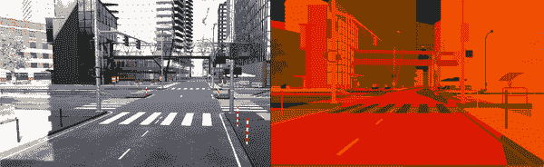

# 第三章：创建您的第一个合成数据

本章介绍了合成，本书的第二支柱，正如第一章中所讨论的。这里重点介绍了用于机器学习数据合成的工具和流程，以及它与您到目前为止为模拟所做的工作如何关联，以及它与模拟工作的不同之处。

到本章结束时，您将生成*世界上最令人失望的合成数据*！但是您将准备好在未来的章节中生成*更有趣的数据*。我们承诺。请继续关注我们。

正如我们在“Unity”中提到的，我们在合成的初探中将主要使用一个名为*感知*的 Unity 包作为工具。

###### 注意

在本书中，我们在合成方面的工作量不会像模拟那样多。这仅仅是因为需要学习的内容不多：模拟是一个非常广泛的领域，有许多不同的方法可以采用，而在 Unity 中进行合成主要是要根据需要执行不同类型的随机化，以生成所需的数据。我们会教你一切必要的知识，但活动会比较少。

# Unity 感知

Unity 的感知包将 Unity 游戏引擎转变为一个工具，用于生成用于机器学习工作流程（主要不在 Unity 内部的工作流程）的合成数据集，主要是图像。

感知框架提供了一系列有用的工具，从数据集捕获、对象标记、图像捕获等等。您可以创建直观的对象-标签关联，并直接将它们馈送到您需要的机器学习工具链的任何部分。感知甚至可以帮助您生成边界框和语义分割蒙版，以及场景生成等等。它真的非常强大。

感知框架是一个开源项目，可以通过[其 GitHub 项目](https://oreil.ly/x0tKg)免费获取。其功能示例显示在图 3-1 中。

###### 图 3-1\. Unity 的感知框架

我们将使用 Unity 感知包，它与 Unity 编辑器（就像 Unity ML-Agents 一样）配合使用，用于本章的所有内容，以及稍后在第十三章中使用。

# 过程

我们在本书中通过示例生成的所有合成数据的整体工作流程如下：

1.  我们将确定一个*场景*，需要大量数据，通常用于训练。

1.  我们将在 Unity 中创建一个*场景*，或者多个场景，布置我们希望参与我们模拟数据的对象。

1.  我们将使用*随机化程序*来改变场景的参数，以根据需要变化数据。

1.  最后，我们将为我们的数据指定*地面真实性*和*标签*，然后*生成*数据。

与仿真不同，Unity 并非你在合成工作中的始终。在仿真中，使用 ML-Agents 你会在 Unity 中建立一个场景作为你的仿真，与你的仿真相关的代理会存在并在那个场景中行动。而且，你训练后的代理的版本（希望完善你给予它们的任务）也会在那个场景中使用（当然，你可以将你和它们学到的东西放在其他地方的“大脑”中，但这超出了本书的范围）。

对于合成，我们只是使用 Unity 和 Perception 包作为生成大量数据的工具。实际上，由于 Unity 是一个视觉开发环境，最适合这种操作的数据类型是视觉数据（图像）。就像在仿真中一样，你将使用 Unity 构建某种环境或世界，然后使用 Unity 摄像头拍摄数以千计的该世界的图像并将它们导出到你的文件系统。一旦你有了这些图片，你将在其他地方进行实际的机器学习，使用 PyTorch、TensorFlow、Create ML 或你喜欢的任何训练系统。在本章中，我们将完成生成数据的设置以及前述工作流程的前两个步骤。

###### 小贴士

ML-Agents 工具包的流程包括训练，感知流程负责训练。明白了吗？

## 使用 Unity Perception

为了探索 Unity 的 Perception 包，我们将完成一个突出显示工作流的简单活动。我们将生成的图像示例显示在 图 3-2 中。

###### 图 3-2\. 我们将生成的骰子图像的示例

最终，我们将生成骰子的图像，摄像头从不同角度拍摄，背景色彩不同，骰子的颜色组合也不同（我们在 “过程” 中提到的随机器）。在本章中，我们将在添加随机器之前完成所有操作。

然而，现在我们将设置一个场景并准备添加随机化。尽管还不会添加实际的随机器，那将在 第十三章 中进行。

# 创建 Unity 项目

与我们许多实际场景一样，使用 Unity 创建合成数据的第一步是创建一个全新的 Unity 项目：

1.  打开 Unity Hub 并创建一个新的 3D “URP” 项目。如 图 3-3 所示，我们将其命名为 “SimpleDice”，但名称对功能并不重要。项目模板选择 (“Universal Render Pipeline” 或 “URP”) 才是重要的。

    

    ###### 图 3-3\. 在 Unity Hub 中创建一个 URP 项目

    ###### 警告

    我们不会像前一章那样创建“3D 项目”，因为我们需要使用 Unity 的通用渲染管线（URP）。通用渲染管线（URP）是一个可编程的图形管线，为游戏开发人员提供了不同的工作流程。

    因为生成合成数据的核心工作之一是输出图像，我们将使用 URP。Perception 使用 URP 生成帧完成渲染时的事件，以项目为单位，我们将使用该事件来输出图像。

    不想考虑？别担心！我们只需要从不同的渲染管线中获取某些功能，以便使用 Unity Perception。对于 ML-Agents，我们不需要这些功能。

    请记住，当您围绕 Unity 的 Perception 功能构建项目时，您可能希望使用 URP，而最简单的方法是从 Unity Hub 提供的 URP 模板开始。

    如果您想了解 Unity 的不同渲染管线，请访问[Unity 文档](https://oreil.ly/waDBl)。

1.  项目加载完成后，您需要删除由 URP 模板添加的示例资产，如图 3-4 所示。仅删除名为“示例资产”的父对象及其下的子对象。保留相机、灯光和“后处理体积”。

    ###### 注意

    由于某种原因，创建新的 URP 项目最简单的方法是使用带有示例环境的项目。我们也不确定为什么会这样。

    

    ###### 图 3-4\. 删除示例资产

1.  接下来，我们需要安装 Perception 包。选择窗口菜单 → 包管理器，使用 Unity 包管理器通过选择“+”菜单 → “从 git URL 添加包”，并输入**`com.unity.perception`**进行安装，如图 3-5 和 3-6 所示。

    

    ###### 图 3-5\. 从 Git 添加包

    

    ###### 图 3-6\. Unity Perception 包的包名称

    包的下载和安装可能需要一些时间，请耐心等待。下载完成后，Unity 将导入该包，如图 3-7 所示。然后可以关闭包管理器窗口。

    

    ###### 图 3-7\. Unity Perception 包由 Unity 加载

1.  接下来，在项目窗格中选择 ForwardRenderer 资源，如图 3-8 所示（您会在*设置*文件夹中找到它）。

    

    ###### 图 3-8\. ForwardRenderer 资源

1.  在其检查器中，单击“添加渲染器功能”，然后单击“真实数据渲染器功能”，如图 3-9 所示。

    

    ###### 图 3-9\. 添加真实数据渲染器

在这一点上，你的项目基本准备就绪了。这是使用 Unity 感知框架进行所有工作的一个良好而干净的起点，因此我们建议将其推送到某种源代码控制中，或者复制一份，以便每次都有一个新的起点。

# 创建一个场景

有时候创建一个场景是件好事！这就是其中一个时机。我们将要构建的场景非常简单：就是一些骰子！这些骰子将放置在一个平面上，并且我们将在引擎中拍摄骰子的图像来生成我们的合成数据（也就是骰子的合成图像）。

让我们开始吧！

## 获取骰子模型

首先，我们需要用到的骰子模型。你可以自己制作，但是在[书籍资源](https://oreil.ly/9WmyP)中，你可以下载一个包含我们为你制作的骰子模型的 Unity 资源包：

1.  通过双击[*Dice.unitypackage* 文件](https://oreil.ly/1efRA)并在 Unity 中点击“全部导入”来下载并导入它。

1.  模型导入后，验证它们在 Unity 编辑器的项目面板中是否可见，如图 3-10 所示。

    

    ###### 图 3-10\. Unity 编辑器中的骰子资源

就是这样！你已经准备好创建一个场景了。

## 一个非常简单的场景

打开场景后，首先我们需要添加一个地板和一些骰子：

1.  通过在层次视图中添加一个平面并将其重命名为“Floor”，如图 3-11 所示，创建一个地板。

    

    ###### 图 3-11\. 初始场景，带有地板

1.  将一些骰子从项目面板中的“Dice”文件夹（在名为“Prefabs”的子文件夹中）拖放到场景或层次视图中，并将它们放置在地板上。现在绝对具体的位置并不是特别重要，但是如果你想要复制我们的场景，你可以在图 3-12 中看到它。

    

    ###### 图 3-12\. 场景中的骰子

1.  将相机位置调整为从稍微高角度显示骰子。你可以在重新定位相机时查看游戏视图来验证这一点。我们的示例在图 3-13 中展示。

    

    ###### 图 3-13\. 骰子的良好视角

1.  使用游戏视图顶部的下拉菜单，如图 3-14 所示，添加一个命名分辨率（我们称之为“Perception”）并将相机的分辨率设置为`480x480`。因为我们将使用主摄像机（也是唯一的摄像机）来渲染图像，这里的分辨率控制着我们将渲染并保存到磁盘的图像的大小。

    ###### 提示

    如果找不到下拉菜单，请确保你正在游戏视图上查看。场景视图没有你需要的菜单。

    

    ###### 图 3-14\. 设置分辨率

在继续之前保存你的场景。

接下来，我们需要创建一种方法来控制我们的合成场景。我们将通过在我们的场景中创建一个“空的”游戏对象，并附加 Unity 感知框架提供的一些特殊组件来实现这一点。以下是执行此操作的步骤：

1.  在层次视图中创建一个新的空游戏对象，并将其命名为“场景”或类似的名称。

    ###### 提示

    我们的“场景游戏对象（Scenario GameObject）”在某种意义上是“空的”，意味着它不映射到你可以在场景中看到的视觉组件。它存在于场景中，但在场景中不可见。如果我们向其添加一个视觉组件（例如像立方体这样的网格），它将变得可见。但是要控制一个场景，你并不需要任何可见的组件。

1.  在层次视图中选择新的场景对象，然后在其检查器中使用“添加组件”按钮，如图 3-15 所示，向此新游戏对象添加固定长度场景组件，如图 3-16 所示。

    

    ###### 图 3-15\. 添加组件按钮

    

    ###### 图 3-16\. 添加固定长度场景组件

1.  现在暂时不要更改固定长度场景的参数和设置。总迭代参数实际上是我们场景中将保存到磁盘的图像数量。

    ###### 注意

    如果您没有可用的固定长度场景组件，请查看前面导入感知包的步骤。此资产来自感知包。

固定长度场景组件用于通过协调所有必要的随机元素来控制场景的执行流程。

现在我们需要修改主摄像机，以使其用于感知：

1.  选择主摄像机，并使用其检查器添加感知摄像机组件。

1.  将感知摄像机的参数保持默认设置，如图 3-17 所示。稍后我们将详细介绍这些内容，但如果您愿意，您可以修改输出基础文件夹，以指定您希望保存渲染图像的位置。

    

    ###### 图 3-17\. 新的感知摄像机组件

###### 警告

如果在添加感知摄像机组件时，在 Unity 编辑器的控制台窗格中看到与异步着色器编译相关的错误或警告，请不要过于担心！如果发生这种情况，请选择编辑菜单 → 项目设置… → 编辑器，在着色器编译设置中找到并禁用异步着色器编译。

感知摄像机组件允许我们修改和控制从摄像机捕获的合成帧的参数，以及它们如何被注释，以及我们最终提供的标签如何与真实数据相关联。

别忘了再次保存你的场景。

# 准备合成

当您生成一个合成图像时，您也可以生成不同类型的*真实数据*。

感知提供一系列不同的*标签器*，它们控制你可以在每张捕获图像旁生成的地面真相的类型：

+   3D 边界框

+   2D 边界框

+   物体计数

+   物体元数据/信息

+   语义分割地图

###### 提示

*地面真相*指我们知道是真实的信息。例如，因为我们正在制作骰子的图像，我们知道它们肯定是骰子。它们是骰子就是地面真相的一部分。

因为我们将生成不同面数的骰子图像，我们对物体元数据/信息标签器感兴趣。在 Unity 编辑器中，Unity 将其称为渲染对象信息标签器。

要为此项目添加一个标签器，请在场景中执行以下操作：

1.  在层次结构面板中选择主摄像机，找到附加到其上的感知摄像机组件。

1.  点击感知摄像机的相机标签器部分中的“+”按钮，如图 3-18（#fig:plusbutton）所示。

    

    ###### 图 3-18。相机标签器部分中的“+”按钮

1.  从出现的列表中选择渲染对象信息标签器，如图 3-19（#fig:renderedobjectinf）所示。

    

    ###### 图 3-19。添加一个渲染对象信息标签器

1.  确认已添加标签器，如图 3-20（#fig:addedroil）所示。

    

    ###### 图 3-20。我们主摄像机上的渲染对象信息标签器

要使用标签器，我们需要创建一些标签：

1.  在项目面板中，右键点击并选择创建 → 感知 → ID 标签配置，如图 3-21（#fig:addingasset）所示。

    

    ###### 图 3-21。创建一个新的 ID 标签配置

1.  找到新创建的资产（通常会被命名为`IdLabelConfig`或类似的名称），然后将其重命名为`DiceLabels`或类似的明显名称。

1.  在项目面板中选择这个资产，然后在其检视器面板中使用“添加新标签”按钮来创建六个标签。完成后，你的标签列表应该类似于我们的示例，如图 3-22 所示。

    

    ###### 图 3-22。已创建六个标签

1.  再次在层次结构中选择主摄像机，找到附加到其上的感知摄像机组件中的 Id 标签配置字段，然后从项目面板将刚刚创建的`DiceLabels`资产拖动到字段中，或者点击字段并选择该资产。一旦设置好，它应该看起来像图 3-23（#fig:finpercam）。

    

    ###### 图 3-23。感知摄像机已设置

再次，在继续之前，你需要保存场景。

## 测试场景

现在是测试场景的好时机，不涉及任何随机元素。按照以下步骤测试场景，并检查我们迄今为止所做的一切是否正确：

1.  使用 Unity 的播放按钮运行场景。这可能需要一段时间。

1.  场景应该生成与我们添加到场景 GameObject 中的 Fixed Length Scenario 组件的 Total Iterations 参数指定的图片数量相同，然后会自动退出播放模式。再次强调，可能需要一段时间，并且 Unity 编辑器可能会显得卡住。

1.  要验证一切是否正常工作，在 Unity 再次响应并且播放模式已结束后，选择层次结构中的主摄像机，找到感知摄像机组件。它将具有一个新的“显示文件夹”按钮，如图 3-24 所示。

1.  点击“显示文件夹”按钮。这将打开存储在您本地计算机上的图像位置。

    此时，您应该找到一个包含从场景摄像机生成的 100 张图片的文件夹。它们都是相同的，如图 3-25 所示。如果您已经走到这一步并且一切都正常工作，您可以继续了！

###### 图 3-24. 成功运行后的“显示文件夹”按钮

###### 图 3-25. 骰子图片

很好！您实际上已经合成了一些数据——每次保存图像时，所有合成的图像都是相同的，我们的标签实际上并没有被使用。

## 设置我们的标签

我们创建的标签表示骰子的哪一面朝上。为了使这些信息以与我们输出的图像匹配的格式可用，我们需要将其附加到预制体上：

1.  通过在项目面板中双击 Dice-Black-Side1（黑色骰子，显示一个点朝上的面）来打开 Dice-Black-Side1 的预制体。

1.  当预制体打开时，如图 3-26 所示，选择其层次结构中的根对象（在本例中为“Dice-Black-Side1”），并使用其检视面板中的“添加组件”按钮添加一个标签组件，如图 3-27 所示。

    

    ###### 图 3-26. 打开一个预制体

    

    ###### 图 3-27. 添加一个标签组件

1.  展开检视面板中新组件的 DiceLabels 部分，并在代表朝上面的标签旁边点击“添加到标签”按钮（这个应该是“one”），如图 3-28 所示。

1.  退出骰子预制体，并为所有骰子预制体重复此过程（总共应该有 30 个，由 5 种不同颜色组成，每种颜色都有 6 个点朝上）。您应该为每个骰子应用对应面朝上的标签号码。

    

    ###### 图 3-28. 添加特定标签

## 检查标签

后续我们将更多地使用标签，但您可以通过以下步骤快速检查它们是否正常工作：

1.  选择层次结构中的主摄像机，在其中添加一个新的 BoundingBox2D 标签，并将其连接到我们之前创建的标签集，如图 3-29 所示。

    

    ###### 图 3-29. 向相机添加新的标签器

1.  运行项目并查看游戏视图。除了将图像文件保存为正常格式外，您还将看到它在每个标记对象周围绘制边界框，如图 3-30 所示。

    

    ###### 图 3-30. 绘制边界框

在后续章节中，当我们开始使用随机化器时，我们将更多地利用这些标签。

# 接下来做什么？

到目前为止，我们已经建立了一个场景，并连接了所有必要的管道以使 Unity Perception 工作：

+   我们使用 URP 管线创建了一个项目，这是使用 Unity Perception 创建模拟图像数据所必需的。

+   我们向场景中的相机添加了一个感知相机组件，我们希望使用它来生成图像。

+   我们在场景中的一个空对象上添加了一个固定长度场景组件，允许我们管理图像的整体生成。

+   我们已经确定了当运行图像合成过程时，图像保存在哪里。

+   我们已经为我们的骰子合成创建了一些标签，并将它们应用到我们使用的相关骰子预设上。

稍后，在第十三章中，我们将通过向场景添加随机化器进一步进行探索，这将改变骰子的位置、大小和其他元素，以及场景本身的元素，从而使我们生成的每幅图像都是独特的。再稍后，在第十四章中，我们将探讨探索已生成的合成数据以及如何利用它。
