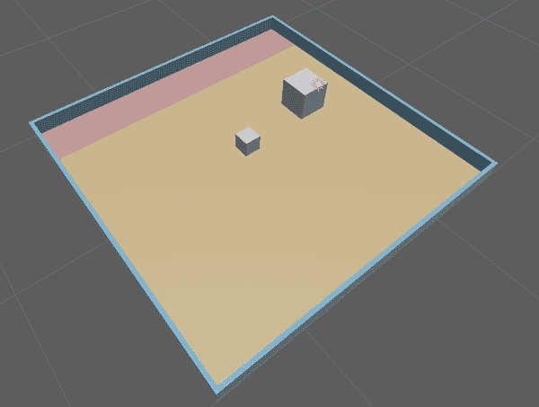
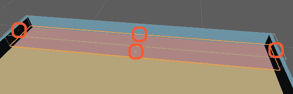

# 第四章：创建更高级的模拟

到目前为止，您已经了解了模拟的基础知识和综合的基础知识。现在是时候深入一些，进行更多的模拟了。回到第二章，我们建立了一个简单的模拟环境，向您展示了在 Unity 中组装场景并用它来训练代理是多么容易。

在本章中，我们将基于您已经学到的东西，并使用相同的基本原理创建一个稍微更高级的模拟。我们将要构建的模拟环境如图 4-1 所示。



###### 图 4-1\. 我们将构建的模拟

这个模拟将由一个立方体组成，它将再次充当我们的*代理*。代理的*目标*是尽快将一个块*推入一个目标*区域。

到本章结束时，您将继续巩固 Unity 技能，用于组装模拟环境，并更好地掌握 ML-Agents Toolkit 的组件和特性。

# 设置推块代理

要获取关于模拟和机器学习工具的全面介绍和讨论，请参考第一章。本节将为您提供完成*这个特定活动*所需的各种工具的快速总结。

具体来说，这里我们将执行以下操作：

1.  创建一个新的 Unity 项目并为其配置 ML-Agents 的使用。

1.  在 Unity 项目的场景中创建我们的推块环境。

1.  实现必要的代码，使我们的推块代理在环境中运行并可以使用强化学习进行训练。

1.  最后，在环境中训练我们的代理并查看其运行情况。

# 创建 Unity 项目

再次，我们将为此模拟创建一个全新的 Unity 项目：

1.  打开 Unity Hub 并创建一个新的 3D 项目。我们将其命名为“BlockPusher”。

1.  安装 ML-Agents Toolkit 包。请参考第二章获取说明。

就这些！您已经准备好为推块代理创建生存环境。

# 环境

有了我们准备好的空白 Unity 项目和 ML-Agents，下一步是创建模拟环境。除了*代理*本身之外，本章的模拟环境还具备以下要求：

+   一个*地板*，供代理移动

+   一个*块*，供代理推动

+   一组外部*墙壁*，防止代理掉入虚空

+   一个*目标*区域，供代理将块推入其中

在接下来的几个部分中，我们将在 Unity 编辑器中创建每个部分。

## 地板

地板是我们的代理和它推动的方块的生活场所。地板与第二章中创建的相似，但这里我们还将围绕它建立墙壁。在编辑器中打开新的 Unity 项目后，我们将创建一个新场景，并为我们的代理（以及它推动的方块）创建地板：

1.  打开 GameObject 菜单 → 3D Object → 立方体。单击在层次视图中创建的立方体，并像之前一样将其名称设置为“地板”或类似的名称。

1.  选择新创建的地板后，将其位置设置为合适的值，比如 `(20, 0.35, 20)` 或类似的值，这样它就是一个平坦而略带厚度的大地板，如 图 4-2 所示。

    

    ###### 图 4-2\. 我们模拟用的地板

    ###### 提示

    地板是这个世界存在的中心。通过将世界的中心定位在地板上，地板的位置实际上并不重要。

这次我们希望地板有更多特色，所以我们打算给它上色：

1.  打开 Assets 菜单 → 创建 → 材质以在项目中创建一个新的材质资源（可以在项目视图中看到）。通过右键单击并选择重命名（或选中材质后按返回键），将材质重命名为“Material_Floor”或类似的名称。

1.  确保在项目视图中选择了新的材料，并使用检查器将反射颜色设置为一些花哨的颜色。我们推荐一个漂亮的橙色，但任何颜色都可以。你的检查器应该看起来像 图 4-3 一样。

    

    ###### 图 4-3\. 地板材质

1.  在层次视图中选择地板，并从项目视图直接将新材料拖放到地板在项目视图中的条目或地板检查器底部的空白处。场景视图中地板的颜色应该会改变，并且地板的检查器应该有一个新的组件，如 图 4-4 所示。

    

    ###### 图 4-4\. 地板的检查器，显示新的材料组件

地板就这样了！确保在继续之前保存场景。

## 墙壁

接下来，我们需要在地板周围创建一些墙壁。与第二章不同，我们不希望代理有可能从地板上掉下来。

要创建墙壁，我们将再次使用我们旧朋友——立方体。回到刚才创建地板的 Unity 场景中，进行以下操作：

1.  在场景中创建一个新的立方体。使其在 x 轴上与地板相同的比例（大约是 `20`），在 y 轴上高 `1` 单位，在 z 轴上约 `0.25` 单位。它应该看起来像 图 4-5 一样。

    

    ###### 图 4-5\. 第一面墙

1.  为墙壁创建新材质，给它一个漂亮的颜色，并将其应用到您创建的墙壁上。我们的示例显示在图 4-6 中。

    

    ###### 图 4-6\. 新的墙壁材质

1.  将立方体重命名为“墙壁”或类似的名称，并再次复制它。这些将是我们在一个轴上的墙壁。目前不要担心将它们放置在正确的位置。

1.  再次复制其中一堵墙，并使用检查器在 y 轴上旋转`90`度。旋转完成后，再次复制它。

    ###### 提示

    您可以按键盘上的 W 键切换到移动工具。

1.  使用移动工具调整墙壁的位置，选择每个墙壁时（无论是在场景视图还是层次视图中），按住键盘上的 V 键进入顶点捕捉模式。在按住 V 键的同时，将鼠标悬停在墙壁网格的不同顶点上。将鼠标悬停在一个墙壁外底角的顶点上，然后单击并拖动移动手柄，以将其捕捉到地板上适当的上角顶点。该过程显示在图 4-7 中。

    

    ###### 图 4-7\. 在角落上进行顶点捕捉

    ###### 提示

    您可以使用场景视图右上角的小部件切换到不同视图，如图 4-8 所示。

    

    ###### 图 4-8\. 场景小部件

1.  对每个墙段重复这个步骤。一些墙段会重叠和相交，这没关系。

    完成后，您的墙壁应该看起来像图 4-9。在继续之前，务必保存您的场景。

    

    ###### 图 4-9\. 四个最终墙壁

## 方块

在这个阶段，方块是我们需要在编辑器中创建的最简单元素。像我们大多数人一样，它存在于被推动的状态（在这种情况下，由代理推动）。我们将在 Unity 场景中添加这个方块：

1.  向场景中添加一个新的立方体，并将其重命名为“方块”。

1.  使用检查器给代理添加刚体组件，将其质量设置为`10`，阻力设置为`4`，并且在所有三个轴上冻结其旋转，如图 4-10 所示。

    

    ###### 图 4-10\. 方块的参数

1.  将方块放置在地板上的任意位置。任何位置都可以。

    ###### 提示

    如果您在精确定位方块的位置时遇到困难，可以像处理墙壁一样使用顶点捕捉模式的移动工具，并将代理捕捉到地板的一个角落（它将与墙壁相交）。然后使用方向移动工具（在移动模式下点击并拖动代理箭头上的箭头）或检查器将其移动到所需位置。

## 目标

目标是场景中代理需要推动方块的位置。它不仅仅是一个物理事物，更是一个概念。但是概念在视频游戏引擎中无法表示，那么我们如何实现它呢？这是一个很棒的问题，亲爱的读者！我们创建一个平面——一个平坦的区域——并将其设置为特定的颜色，以便观察者（也就是我们）可以知道目标区域在哪里。这种颜色不会被代理使用，只是为了我们自己。

代理将使用我们添加的碰撞器，这是一个大的空间体，位于有色地面区域的上方，使用 C# 代码，我们可以知道某物体是否在这个空间体内（因此称为“碰撞器”）。

按照以下步骤创建目标及其碰撞器：

1.  在场景中创建一个新平面并将其重命名为“目标”或类似的名称。

1.  为目标创建新材料并应用它。我们建议您使用一种显眼的颜色，因为这是我们希望代理将方块推入的目标区域。将新材料应用于目标。

1.  使用顶点捕捉与您之前在“墙壁”中使用的相同技巧将目标使用 Rect 工具（可以通过键盘上的 T 键访问）或通过工具选择器定位，如图 4-11 所示。大致按图 4-12 的显示位置放置目标。

    

    ###### 图 4-11\. 工具选择器

    

    ###### 图 4-12\. 目标位置

1.  使用检查器，从目标中删除 Mesh Collider 组件，并使用“添加组件”按钮添加 Box Collider 组件。

1.  选择 Hierarchy 中的目标，在目标的 Inspector 中的 Box Collider 组件中点击“编辑碰撞器”按钮（如图 4-13 所示）。

    

    ###### 图 4-13\. 编辑碰撞器按钮

1.  使用小绿色方形手柄调整目标的碰撞器大小，以便它覆盖更多环境的体积，这样如果代理进入碰撞器，则会被检测到。我们的示例显示在图 4-14，但这不是一门科学；你只需把它做大！你可能会发现，只需使用检查器中的 Box Collider 组件增加其 Y 轴上的大小会更容易。

    

    ###### 图 4-14\. 我们的大碰撞器，显示手柄

如前所述，请不要忘记保存场景。

## 代理

最后（差不多了），我们需要创建代理本身。我们的代理将是一个立方体，并附加适当的脚本（我们也会创建），就像我们在第二章中使用球代理一样。

仍然在 Unity 编辑器中，在你的场景中执行以下操作：

1.  创建一个新的立方体并命名为“代理”或类似的名称。

1.  在代理的检查器中，选择“添加组件”按钮并添加一个新的脚本。命名为类似“BlockSorterAgent”之类的名称。

1.  打开新创建的脚本，并添加以下导入语句：

    ```
    using Unity.MLAgents;
    using Unity.MLAgents.Actuators;
    using Unity.MLAgents.Sensors;
    ```

1.  将类更新为 `Agent` 的子类。

1.  现在你需要一些属性，首先是地板和环境的处理（我们稍后会回到分配这些）。这些放在任何方法之前的类内部：

    ```
    public GameObject floor;
    public GameObject env;
    ```

1.  你还需要一些东西来表示地板的边界：

    ```
    public Bounds areaBounds;
    ```

1.  你需要一些东西来代表目标区域和需要推到目标的块：

    ```
    public GameObject goal;
    public GameObject block;
    ```

1.  现在添加一些`Rigidbody`来存储块和代理的主体：

    ```
    Rigidbody blockRigidbody;
    Rigidbody agentRigidbody;
    ```

当代理初始化时，我们需要做一些事情，所以我们首先要做的就是`Initialize()`函数：

1.  添加`Initialize()`函数：

    ```
    public override void Initialize()
    {

    }
    ```

1.  在内部，获取代理和块的`Rigidbody`：

    ```
    agentRigidbody = GetComponent<Rigidbody>();
    blockRigidbody = block.GetComponent<Rigidbody>();
    ```

1.  最后，对于`Initialize()`函数，获取地板边界的处理：

    ```
    areaBounds = floor.GetComponent<Collider>().bounds;
    ```

接下来，我们想要能够在代理生成时（以及每次训练运行时）在地板上随机放置代理，因此我们会创建一个`GetRandomStartPosition()`方法。这个方法完全是我们自己的，不是实现 ML-Agents（像我们重写的方法）的必需部分：

1.  添加`GetRandomStartPosition()`方法：

    ```
    public Vector3 GetRandomStartPosition()
    {

    }
    ```

    每当我们想在模拟中的地板上随机放置东西时，我们将调用这个方法。它会返回地板上一个随机可用的位置。

1.  在`GetRandomStartPosition()`内部，获取地板和目标的边界：

    ```
    Bounds floorBounds = floor.GetComponent<Collider>().bounds;
    Bounds goalBounds = goal.GetComponent<Collider>().bounds;
    ```

1.  现在创建一个地板上新点的存储位置（稍后我们会回到这一点）：

    ```
    Vector3 pointOnFloor;
    ```

1.  现在，制作一个计时器，这样你就可以看到如果出于某种原因这个过程花费了太长时间：

    ```
    var watchdogTimer = System.Diagnostics.Stopwatch.StartNew();
    ```

1.  接下来，添加一个变量来存储边缘。我们将使用这个变量来从随机位置中添加和移除一个小缓冲区：

    ```
    float margin = 1.0f;
    ```

1.  现在开始一个`do`-`while`循环，继续选择一个随机点，如果选择的点在*目标边界内*，则继续：

    ```
    do
    {

    } while (goalBounds.Contains(pointOnFloor));
    ```

1.  在`do`内部，检查计时器是否花费了太长时间，如果是，则抛出异常：

    ```
    if (watchdogTimer.ElapsedMilliseconds > 30)
    {
        throw new System.TimeoutException
          ("Took too long to find a point on the floor!");
    }
    ```

1.  然后，在`do`内部的`if`语句下面，选择地板顶面上的一个点：

    ```
    pointOnFloor = new Vector3(
        Random.Range(floorBounds.min.x + margin, floorBounds.max.x - margin),
        floorBounds.max.y,
        Random.Range(floorBounds.min.z + margin, floorBounds.max.z - margin)
    );
    ```

    添加和移除`margin`，这样箱子总是在地板上，而不是在墙壁或空间中：

1.  在`do`-`while`之后，`return`你创建的`pointOnFloor`：

    ```
    return pointOnFloor;
    ```

对于`GetRandomStartPosition()`就是这样。接下来，我们需要一个函数，当代理将块移到目标位置时调用。我们将使用这个函数奖励代理做正确的事情，加强我们想要的策略：

1.  创建`GoalScored()`函数：

    ```
    public void GoalScored()
    {

    }
    ```

1.  添加一个调用`AddReward()`：

    ```
    AddReward(5f);
    ```

1.  并添加一个调用`EndEpisode()`：

    ```
    EndEpisode();
    ```

接下来，我们将实现`OnEpisodeBegin()`，这是在每个训练或推断*episode*开始时调用的函数：

1.  首先，我们会放置函数在适当的位置：

    ```
    public override void OnEpisodeBegin()
    {

    }
    ```

1.  我们将获取一个随机的旋转和角度：

    ```
    var rotation = Random.Range(0, 4);
    var rotationAngle = rotation * 90f;
    ```

1.  现在我们将为块获取一个随机的起始位置，使用我们创建的函数：

    ```
    block.transform.position = GetRandomStartPosition();
    ```

1.  我们将设置块的速度和角速度，使用它的`Rigidbody`：

    ```
    blockRigidbody.velocity = Vector3.zero;
    blockRigidbody.angularVelocity = Vector3.zero;
    ```

1.  我们将为代理获取一个随机的起始位置：

    ```
    transform.position = GetRandomStartPosition();
    ```

1.  并且我们将设置代理的速度和角速度，同样使用它的`Rigidbody`：

    ```
    agentRigidbody.velocity = Vector3.zero;
    agentRigidbody.angularVelocity = Vector3.zero;
    ```

1.  最后，我们将旋转整个环境。我们这样做是为了让代理不会只学习总是有目标的那一边：

    ```
    //env.transform.Rotate(new Vector3(0f, rotationAngle, 0f));
    ```

这就是 `OnEpisodeBegin()` 函数的全部内容。保存你的代码。

接下来，我们将实现 `Heuristic()` 函数，这样我们就可以手动控制代理：

1.  创建 `Heuristic()` 函数：

    ```
    public override void Heuristic(in ActionBuffers actionsOut)
    {

    }
    ```

    ###### 注意

    这里对代理的手动控制与训练过程完全无关。它只是存在以便我们可以验证代理在环境中的移动是否恰当。

1.  获取 Unity ML-Agents Toolkit 发送的动作，并设置动作为 `0`，以便最终在调用 `Heuristic()` 结束时你知道你总是会得到一个有效的动作或 `0`：

    ```
    var discreteActionsOut = actionsOut.DiscreteActions;
    discreteActionsOut[0] = 0;
    ```

1.  然   然后，对于每个键（D、W、A 和 S），检查它是否被使用，并发送适当的动作：

    ```
    if(Input.GetKey(KeyCode.D))
    {
        discreteActionsOut[0] = 3;
    }
    else if(Input.GetKey(KeyCode.W))
    {
        discreteActionsOut[0] = 1;
    }
    else if (Input.GetKey(KeyCode.A))
    {
        discreteActionsOut[0] = 4;
    }
    else if (Input.GetKey(KeyCode.S))
    {
        discreteActionsOut[0] = 2;
    }
    ```

    ###### 提示

    这些数字完全是任意的。只要它们保持一致并且不重叠，它们是无所谓的。一个数字始终代表一个方向（在人类控制下对应一个按键）。

这就是 `Heuristic()` 函数的全部内容。

接下来，我们需要实现 `MoveAgent()` 函数，这将允许 ML-Agents 框架控制代理进行训练和推理：

1.  首先，我们将实现这个函数：

    ```
    public void MoveAgent(ActionSegment<int> act)
    {

    }
    ```

1.  然后，在内部，我们将清零用于移动的方向和旋转：

    ```
    var direction = Vector3.zero;
    var rotation = Vector3.zero;
    ```

1.  然后，我们将从 Unity ML-Agents Toolkit 接收到的动作分配到更可读的东西上：

    ```
    var action = act[0];
    ```

1.  现在我们将根据该动作进行切换，并相应地设置方向或旋转：

    ```
    switch (action)
    {
        case 1:
            direction = transform.forward * 1f;
            break;
        case 2:
            direction = transform.forward * -1f;
            break;
        case 3:
            rotation = transform.up * 1f;
            break;
        case 4:
            rotation = transform.up * -1f;
            break;
        case 5:
            direction = transform.right * -0.75f;
            break;
        case 6:
            direction = transform.right * 0.75f;
            break;
    }
    ```

1.  然后，在 `switch` 外部，我们将根据任何旋转来行动：

    ```
    transform.Rotate(rotation, Time.fixedDeltaTime * 200f);
    ```

1.  我们还将根据任何方向对代理的 `Rigidbody` 应用力：

    ```
    agentRigidbody.AddForce(direction * 1, ForceMode.VelocityChange);
    ```

`MoveAgent()` 就这些了。再次保存你的代码。

最后，现在，我们需要实现 `OnActionReceived()` 函数，它不做更多的事情，只是将接收到的动作传递给我们的 `MoveAgent()` 函数：

1.  创建函数：

    ```
    public override void OnActionReceived(ActionBuffers actions)
    {

    }
    ```

1.  调用你自己的 `MoveAgent()` 函数，传递离散动作：

    ```
    MoveAgent(actions.DiscreteActions);
    ```

1.  并且根据步数设置负奖励来惩罚代理：

    ```
    SetReward(-1f / MaxStep);
    ```

    这个负奖励希望能鼓励代理节约其移动并尽可能少地进行移动，以便最大化其奖励并实现我们从中期望的目标。

现在一切就绪了。确保在继续之前保存你的代码。

## 环境

在继续之前，我们需要在设置环境方面做一些行政工作，所以切换回 Unity 编辑器中的场景。我们将首先创建一个 GameObject 来容纳墙壁，只是为了保持 Hierarchy 的整洁：

1.  在 Hierarchy 视图上右键点击，选择 Create Empty。将空 GameObject 重命名为 “Walls”，如 Figure 4-15 所示。

    

    ###### 图 4-15\. 命名为 Walls 的墙体对象

1.  选择所有四个墙壁（你可以依次点击它们，或者在点击第一个后按住 Shift 再点击最后一个），然后将它们拖放到新的墙壁对象下。此时应该看起来像 图 4-16 这样。

    

    ###### 图 4-16\. 墙壁被很好地封装

现在我们将创建一个空的 GameObject 来容纳整个环境：

1.  在层次视图中右键单击，并选择创建空对象。将空的 GameObject 重命名为“环境”。

1.  在层次视图中，将我们刚刚创建的墙壁对象，以及代理、地板、块和目标，拖放到新的环境对象中。此时应该看起来像 图 4-17 这样。


###### 图 4-17\. 环境被封装

接下来，我们需要在我们的代理上配置一些东西：

1.  在层次视图中选择代理，并在检视器视图中向下滚动到你添加的脚本。从层次视图中将地板对象拖放到检视器中的 Floor 槽中。

1.  对整体环境 GameObject、目标和块执行相同操作。在编辑器中将 Max Steps 设置为`5000`，以便代理不会花费太长时间将块推向目标。你的检视器应该看起来像 图 4-18 这样。

    

    ###### 图 4-18\. 代理脚本属性

1.  现在，在代理的检视器中使用“添加组件”按钮，添加一个 DecisionRequester 脚本，并将其决策周期设置为 5，如 图 4-19 所示。

    

    ###### 图 4-19\. 决策请求者组件已添加到代理并适当配置

1.  添加两个 Ray Perception Sensor 3D 组件，每个组件都具有三个可检测标签：block、goal 和 wall，并使用 图 4-20 中显示的设置。

    回到 “让代理观察环境” ，我们说过你可以通过代码或组件添加观察。那时我们全都通过代码实现。而这次我们将全部通过组件实现。所涉及的组件是我们刚刚添加的 Ray Perception Sensor 3D 组件。

    

    ###### 图 4-20\. 两个 Ray Perception 传感器

    ###### 提示

    这次我们的代理甚至没有 `CollectObservations` 方法，因为所有的观察都是通过我们在编辑器中添加的 Ray Perception Sensor 3D 组件收集的。

1.  我们需要将刚刚使用的标签添加到我们实际想要标记的对象中。标签允许我们根据它们的标记引用对象，因此，如果某物被标记为“wall”，我们可以将其视为墙壁等等。在层次结构中选择块，并使用检视器添加一个新标签，如 图 4-21 所示。

    

    ###### 图 4-21\. 添加一个新标签

1.  将新标签命名为“block”，如 图 4-22 所示。

    

    ###### 图 4-22\. 命名一个新标签

1.  最后，如图 4-23 所示，将新标签附加到块上。

    

    ###### 图 4-23\. 将标签附加到对象

1.  对于目标，使用“goal”标签重复此操作，并对所有墙组件使用“wall”标签。有了这些，我们添加的射线感知传感器 3D 组件将仅“看到”使用“block”、“goal”或“wall”标记的物体。如图 4-24 所示，我们添加了两层射线感知器，它们从附加到它们的对象中发出一条线，并回报该线首次碰到的东西（在本例中，仅在它是墙、目标或块时）。我们添加了两个，它们被安置在不同的角度。它们只在 Unity 编辑器中可见。

    

    ###### 图 4-24\. 射线感知传感器 3D 组件

1.  最后，使用“添加组件”按钮添加一个行为参数组件。将行为命名为“Push”，并按图 4-25 设置参数。

    

    ###### 图 4-25\. 代理的行为参数

在 Unity 编辑器中保存你的场景。现在我们将在我们的块上进行一些配置：

1.  添加一个新的脚本到块中，命名为“GoalScore”。

1.  打开脚本，并添加一个属性以引用代理：

    ```
    public Block_Sorter_Agent agent;
    ```

    在这里创建的属性类型应该与附加到代理的类的类名匹配。

    ###### 提示

    这次不需要将父项更改为`Agent`或导入任何 ML-Agents 组件，因为这个脚本不是一个代理。它只是一个普通的脚本。

1.  添加一个 `OnCollisionEnter()` 函数：

    ```
    private void OnCollisionEnter(Collision collision)
    {

    }
    ```

1.  在 `OnCollisionEnter()` 内部，添加以下代码：

    ```
    if(collision.gameObject.CompareTag("goal"))
    {
        agent.GoalScored();
    }
    ```

1.  保存脚本并返回到 Unity，在 Hierarchy 中选中块，将其从 Hierarchy 拖动到新的 GoalScore 脚本中的 Agent 槽位中。如图 4-26 所示。

    

    ###### 图 4-26\. GoalScore 脚本

不要忘记再次保存场景。

# 训练和测试

当在 Unity 和 C# 脚本中构建了所有内容后，现在是训练代理并查看模拟工作的时候了。我们将按照 “使用模拟进行训练” 中的相同过程进行操作：创建一个新的 YAML 文件，用作训练的超参数。

这里是如何设置超参数的：

1.  创建一个新的 YAML 文件，用作训练的超参数。我们的称为 *Push.yaml*，包括以下超参数和值：

    ```
    behaviors:
      Push:
        trainer_type: ppo
        hyperparameters:
          batch_size: 10
          buffer_size: 100
          learning_rate: 3.0e-4
          beta: 5.0e-4
          epsilon: 0.2
          lambd: 0.99
          num_epoch: 3
          learning_rate_schedule: linear
        network_settings:
          normalize: false
          hidden_units: 128
          num_layers: 2
        reward_signals:
          extrinsic:
            gamma: 0.99
            strength: 1.0
        max_steps: 500000
        time_horizon: 64
        summary_freq: 10000
    ```

1.  接下来，在之前在 “设置” 中创建的 `venv` 中，在终端中运行以下命令来启动训练过程：

    ```
    mlagents-learn _config/Push.yaml_ --run-id=PushAgent1
    ```

    ###### 注意

    将`*config/Push.yaml*`替换为你刚创建的配置文件的路径。

1.  一旦命令启动并运行，你应该会看到类似图 4-27 的东西。此时，你可以在 Unity 中按下播放按钮。

    

    ###### 图 4-27\. ML-Agents 进程开始训练

    当你看到类似于图 4-28 的输出时，说明训练过程正在进行。

    

    ###### 图 4-28\. 训练期间的 ML-Agents 过程

当训练完成后，请参考“训练完成后”章节，了解如何找到生成的*.nn*或*.onnx*文件的详细信息。

使用模型来运行代理程序，看看它的表现！
