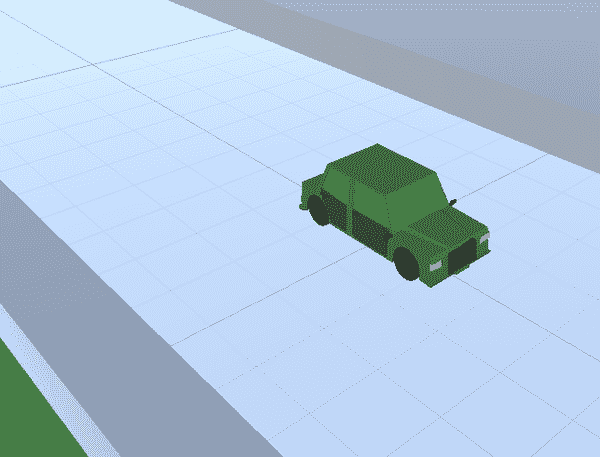
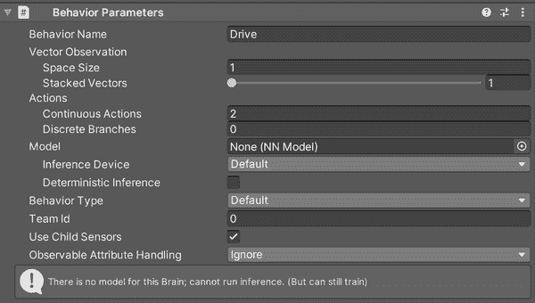
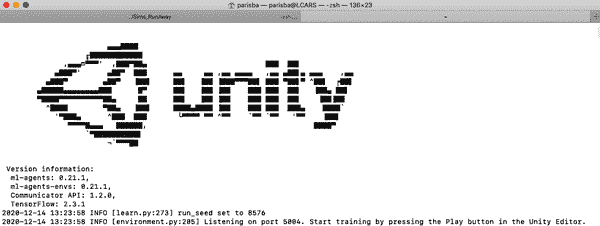

# 第五章：创建自动驾驶汽车

到目前为止，您构建的两个模拟都是相当抽象的概念——在虚空中滚动的球，推动其他立方体的立方体等——但是用于机器学习的模拟确实是真正实用的（我们保证）。 在本章中，我们将在 Unity 中制作一个非常简单的自动驾驶汽车，并使用强化学习来训练它驾驶。 从实用的角度来说，您无法将随后训练的模型加载到真正的物理汽车中，但是它表明了您在模拟环境中可以超越抽象的能力。

现在是你的时候了！ 基本上，为了世界的利益，您将建造您自己的自动驾驶汽车（见图 5-1）。



###### 图 5-1。 自动驾驶汽车在其赛道上。 在他的毡房中。 用他的 iPad。

我们的自动驾驶车辆将仅存在于其自身的美丽虚空中，而不是烦人的现实世界——因此我们可以避开所有那些讨厌的伦理困境，比如如果面前有一个人该怎么办（我们稍后会在本书中详细讨论）。

我们的汽车将学会如何驾驶，但除此之外并不多。 准备好了吗？

# 创建环境

我们需要做的第一件事是我们汽车存在的美丽虚空。 它将包括几个部分，其中最重要的是汽车将要驾驶的赛道。 在我们建造赛道之后，我们将创建汽车本身，然后设置所有内容以与机器学习系统一起工作。

世界的关键部分是赛道，这是汽车绕行的东西，以及汽车本身。 就这些了。 我们承认这是一辆相当简单的自动驾驶汽车。

我们将在 Unity 编辑器中进行这项工作，就像我们迄今为止完成的模拟一样。 它将涉及组装我们汽车生活的世界以及汽车本身。 与之前的活动之间的一个关键区别是，我们将提供一组可下载的资产，用于构建汽车的赛道。

在继续之前，请执行以下操作：

1.  在 Unity Hub 中创建一个新的 3D Unity 项目（我们的项目名为“SimpleCar”），如图 5-2 所示。

    

    ###### 图 5-2。 在 Unity Hub 中创建新的 3D 项目

1.  将 Unity ML-Agents 包导入 Unity 项目（参见“创建 Unity 项目”）。

1.  确保您的 Python 环境已准备就绪（参见“设置”）。

## 赛道

我们要做的第一件事是赛道。 我们的赛道将非常简单，因为我们希望确保我们的自动驾驶汽车如何工作非常明显。 将有两个基本部分：如图 5-3 所示的直道部分，以及如图 5-4 所示的转角部分。


###### 图 5-3。 我们赛道的直道部分


###### 图 5-4。 我们赛道的角落块

赛道的每一部分由地板和一些隔离墙组成。现在让我们制作直道部件：

1.  创建一个新平面。命名为“Track”，并且使用“track”标签标记它。

1.  在项目视图中创建一个材质，命名为类似“TrackMaterial”的名称，以便知道它的用途，并给它一个适合道路的漂亮颜色。我们的是黑色，但你可以随意创意。将此材质分配给赛道平面。

1.  创建一个新的立方体，并在检视器中将其缩放设置为`(1, 1, 10)`，使其变长而细。使用之前使用过的对齐工具将立方体沿平面的一条边放置。

1.  在项目视图中创建一个材质，命名为类似“WallMaterial”的名称，并给它一个漂亮的颜色。将此材质分配给立方体。

1.  复制立方体，并将其移动到平面的另一侧。你的部件应该看起来像图 5-5。

    

    ###### 图 5-5\. 直道部件

1.  将这两个墙片命名为“Wall”的某个变种，并将它们分配到“wall”标签。

1.  创建一个空的 GameObject，命名为类似“Track_Piece”的变种，并将其设置为赛道平面和两堵墙的父对象，如图 5-6 所示。

    

    ###### 图 5-6\. 层次结构中的赛道部件

1.  接下来，选择赛道部件的父对象，然后选择“Assets”菜单 → 创建 → Prefab，如图 5-7 所示。

    

    ###### 图 5-7\. 使用“Assets”菜单创建预制体

现在在你的项目面板中将会有一个赛道预制体，这是一个可复制的赛道部件。你可以修改一次预制体，然后更新所有使用它的地方。我们很快就会用这个预制体来组装我们的赛道。

###### 提示

你也可以从层次结构中的父对象中拖动到项目面板中创建一个预制体。

接下来，我们将制作角落部件：

1.  在场景中创建另一个新平面。命名为“CornerTrack”，并且使用“track”标签标记它（使用与之前部件相同的赛道标签）。将之前创建的赛道材质分配给它。

1.  创建一个新的立方体，并在检视器中将其缩放设置为`(1, 1, 10)`，使其变长而细。使用之前使用过的对齐工具将立方体沿平面的一条边放置。将之前创建的墙体材质分配给它。

1.  复制立方体并将其移动到平面的一侧，形成一个角落。你的部件应该看起来像图 5-8。

    

    ###### 图 5-8\. 到目前为止的角落部件

1.  创建一个新的立方体并放置在对角线上，如图 5-9 所示。

    

    ###### 图 5-9\. 对角线上的对立角，最终角落部件

1.  将这三个墙片命名为“Wall”的某个变种，并且将它们全部分配到“wall”标签，与之前部件中的墙壁相同。

1.  创建一个空的 GameObject，命名为类似“Corner Piece”的变种，并将其设置为赛道平面和三堵墙的父对象，如图 5-10 所示。

    

    ###### 图 5-10\. 角落部件的层级结构

1.  接下来，选择角落部件的父对象，然后选择 Assets 菜单 → 创建 → Prefab。

现在你将在项目面板中看到一个角落预制件，以及轨道预制件。我们的显示在图 5-11 中，并附带它们使用的材料。


###### 图 5-11\. 两个轨道预制件及其材料

###### 注意

如果你对 Unity 比较熟悉，可以按照自己的想法制作轨道部件！这本书不涵盖这方面的内容，但这是一个很好的学习练习。我们建议尝试 Blender，这是一个出色的开源 3D 建模工具。如果你在同一台计算机上安装了 Blender 和 Unity，并且将 *.blend* 文件拖入 Unity，你可以直接在 Unity 中使用该文件，并且在 Blender 中进行的任何更改并保存将自动反映在 Unity 中。

使用 Unity 的工具，就像你在早些活动中使用捕捉工具一样，将部件放置在一起以铺设赛道。我们的赛道显示在图 5-12 中，但你的外观目前并不重要。你只需要制作一个与我们类似复杂度的赛道即可。


###### 图 5-12\. 我们的训练赛道

###### 注意

如果你不太愿意自己制作赛道，可以在本书提供的资产中找到预制赛道。下载资产后，你可以通过打开 *CarPremadeTrack.unitypackage* 文件并将其导入到 Unity 项目中来使用该赛道。

## 汽车

接下来，自然地，我们需要一辆汽车。我们的汽车不需要很复杂，并且不会以任何方式进行装配或动画（即，车轮不会转动，灯光不会工作）。它甚至可以是立方体形状，但为了好玩，我们将其设计成汽车样式。

要获取汽车并将其放入场景中，请按照以下步骤操作：

1.  从 Sketchfab 下载一辆漂亮的汽车，如图 5-13 所示。我们使用的那辆汽车可以在[这里](https://oreil.ly/puzjd)找到，但任何汽车都可以。

    

    ###### 图 5-13\. 我们将要使用的汽车

1.  将汽车导入到 Unity 项目中，方法是将 *.blend* 文件拖放到 Assets 视图中。

1.  接下来，在层级中创建一个空的 GameObject，并命名为“Car”。

1.  将一个 Rigidbody 组件添加到汽车上，如图 5-14 所示。

    

    ###### 图 5-14\. 汽车的 Rigidbody 组件

1.  将一个盒型碰撞体添加到汽车上，如图 5-15 所示。

    

    ###### 图 5-15\. 汽车的盒型碰撞体

1.  将新添加的汽车模型拖入汽车 GameObject 中，如图 5-16 所示。确保位于 GameObject 中的汽车模型位于`(0,0,0)`位置。

    

    ###### 图 5-16\. 汽车的 GameObject，包含其中的模型

    ###### 警告

    确保 Rigidbody 和 Box Collider 组件附加到最上层的汽车 GameObject 上（即你创建的那个），而不是添加模型到场景时创建的内部 GameObject 上。

1.  将汽车 GameObject 定位在赛道上的中心位置，作为你的起始点（具体位置不重要）。我们的位置如 图 5-17 所示。


###### 图 5-17\. 赛道上的汽车，处于起始位置

这就是场景中环境的全部内容，所以不要忘记保存。

## 设置机器学习环境

接下来，我们需要设置项目为一个机器学习模拟。我们会像之前一样，通过安装 ML-Agents Unity 包，并在 Unity 编辑器中的 GameObject 上添加一些组件来实现这一点：

1.  使用 Unity Package Manager 安装 Unity ML-Agents Toolkit。如果需要提醒，请参考 第二章。

1.  安装完成后，向汽车的 GameObject 添加一个 Behavior Parameters 组件，如 图 5-18 所示。

    

    ###### 图 5-18\. 汽车的新行为参数组件

1.  接下来，添加一个决策请求器组件到汽车的 GameObject 上，如 图 5-19 所示。

    

    ###### 图 5-19\. 决策请求器组件，添加到汽车上

在这一点上，你可能应该保存你的 Unity 场景。完成后，现在是时候制作汽车的脚本了：

1.  通过在汽车的 GameObject 上添加组件在 Unity 编辑器中创建一个新的脚本。命名为“CarAgent”或类似的名称。

1.  打开新创建的 CarAgent 脚本资源，在内部导入适当的 Unity ML-Agents Toolkit 部分，除了样板导入之外：

    ```
    using Unity.MLAgents;
    using Unity.MLAgents.Sensors;
    ```

1.  更新 `CarAgent`，使其继承自 `Agent`，移除 Unity 提供的所有样板代码：

    ```
    public class CarAgent : Agent
    {
    }
    ```

    和之前的模拟一样，为了成为一个智能体，我们的汽车需要继承自来自 Unity ML-Agents 包的 `Agent`。

1.  添加一些变量：

    ```
    public float speed = 10f;
    public float torque = 10f;

    public int progressScore = 0;

    private Transform trackTransform;
    ```

    我们将存储汽车的 `speed` 和 `torque`，以便我们可以调整它们，还有一个 `progressScore`。这允许我们显示和使用分数（沿着赛道的进度），如果我们希望的话。

    我们还将创建一个地方来存储 `trackTransform`，我们将根据汽车所在的赛道位置来更新它。`Transform` 类型表示你创建的 3D 场景中的位置，并且是 Unity 中的一种类型。

1.  实现 `Heuristic()` 方法，以便根据需要由你作为人类进行测试和控制汽车：

    ```
    public override void Heuristic(float[] actionsOut)
    {
        actionsOut[0] = Input.GetAxis("Horizontal");
        actionsOut[1] = Input.GetAxis("Vertical");
    }
    ```

    这个 `Heuristic()` 方法与我们在之前的模拟中所做的非常相似：它允许我们将 `actionsOut` 数组的两个元素分配给 Unity 输入系统的 `Horizontal` 和 `Vertical` 轴。无论在 Unity 输入系统中为 `Horizontal` 和 `Vertical` 轴分配了什么键，都将控制输入到 `actionsOut`。

    ###### 提示

    我们在这里使用的是 Unity 的“Classic”输入系统。技术上已被新输入系统取代，但是像游戏引擎中的大多数事物一样，从不会删除任何东西，并且在这里使用新输入系统的增加复杂性没有任何优势。您可以在 Unity 文档中了解关于经典输入系统的信息[链接](https://oreil.ly/RimPC)，并了解 Input Manager [链接](https://oreil.ly/EDMPw)，该管理器允许您配置分配给轴的键。

    您可以通过选择编辑菜单 → 项目设置，并从对话框的侧边栏中选择输入管理器，来选择为轴分配哪些键。默认情况下，键盘上的箭头键已分配。

1.  创建一个`PerformMove()`方法，该方法接受三个浮点数——水平移动、垂直移动和增量时间——并适当地进行车辆的平移和旋转：

    ```
    private void PerformMove(float h, float v, float d)
    {
        float distance = speed * v;
        float rotation = h * torque * 90f;

        transform.Translate(distance * d * Vector3.forward);
        transform.Rotate(0f, rotation * d, 0f);
    }
    ```

我们将使用这个`PerformMove()`方法来移动车辆，无论是通过人工控制还是机器学习的*brain*。这里发生的唯一事情就是在车辆的变换上调用`Translate`和`Rotate`（因为此脚本作为组件附加到场景中的车辆代理），以便移动它。

1.  覆盖`OnActionReceived()`方法是 Unity ML-Agents 框架中`Agent`所必需的一部分：

    ```
    public override void OnActionReceived(float[] vectorAction)
    {
        float horizontal = vectorAction[0];
        float vertical = vectorAction[1];

        PerformMove(horizontal, vertical, Time.fixedDeltaTime);
    }
    ```

    我们的`OnActionReceived()`方法使用从 ML-Agents 框架接收的两个`vectorAction`动作，映射到水平和垂直方向，获取上一个或当前的预移动位置，并调用我们之前创建的`PerformMove()`函数来执行移动操作。

    我们很快将在这个方法中添加一些奖励功能，但现在我们将其保持不变。

1.  接下来，实现`CollectObservations()`，这是 ML-Agents 框架方法的另一个覆盖：

    ```
    public override void CollectObservations(VectorSensor vectorSensor)
    {
        float angle = Vector3.SignedAngle
            (trackTransform.forward, transform.forward, Vector3.up);
        vectorSensor.AddObservation(angle / 180f);
    }
    ```

`CollectObservations()`用于向 ML-Agents 系统提供关于环境的信息。观察是代理所知道的关于其所处世界的信息，您可以决定提供多少信息。

对于车辆代理，我们在`CollectObservations()`中唯一要做的就是比较车辆的方向与赛道的方向。这使用我们之前创建的`trackTransform`，该变量保存车辆的当前位置。这个初始观察给了车辆需要处理的东西：它需要最小化这个角度以便跟随赛道。这是一个带符号的角度，范围在`-180`到`180`之间，用于告诉车辆是否需要向左或向右转向。

现在我们将暂时返回 Unity 编辑器，通过组件添加一些额外的观察。正如我们之前所说，不是所有的观察都必须通过代码到达；有些可以通过 Unity 编辑器中的组件添加。保存您的代码，然后返回 Unity 场景：

1.  在层次结构中选择代理的父对象，并在检视器中使用“添加组件”按钮添加两个 Ray Perception Sensor 3D 组件。

1.  给它们取一个合理的名字（例如，“RayPerceptionSensor1”，“RayPerceptionSensor2”）。

1.  将其中一个设置为图 5-20 中显示的参数。

    

    ###### 图 5-20。两个三维射线感知传感器组件中的第一个

    这个传感器从汽车两侧各发送四条射线，从前方发送一条，如图 5-21 所示。

    

    ###### 图 5-21。第一个传感器的射线

1.  将另一个三维射线感知传感器组件设置为图 5-22 中显示的参数。

    

    ###### 图 5-22。两个三维射线感知传感器组件中的第二个

    ###### 注意

    重要的是这两个传感器都设置为只检测标记为“wall”的物体。

    这个传感器从汽车前方发送一条射线和从后方直接发送一条射线，如图 5-23 所示。

    ###### 提示

    如果我们没有重写`CollectObservations()`并在代码中实现它，如果我们愿意，我们仍然可以通过编辑器中的组件专门为我们的代理提供观察。

    

    ###### 图 5-23。第二个传感器的射线

1.  保存场景，并返回到代码编辑器中的代理脚本。

现在我们将实现自己的函数，名为`TrackProgress()`。它将用于制定奖励系统：

```
private int TrackProgress()
{
    int reward = 0;
    var carCenter = transform.position + Vector3.up;

    // Where am I?
    if (Physics.Raycast(carCenter, Vector3.down, out var hit, 2f))
    {
        var newHit = hit.transform;

        // Am I on a new spot?
        if (trackTransform != null && newHit != trackTransform)
        {
          float angle = Vector3.Angle
              (trackTransform.forward, newHit.position - trackTransform.position);
          reward = (angle < 90f) ? 1 : -1;
        }

        trackTransform = newHit;
    }

    return reward;
}
```

`TrackProgress()`如果我们向前移动到道路的新部分，将返回`1`，如果向后移动，则返回`-1`，其他情况返回`0`。

它通过采用以下逻辑来实现：

+   它从汽车对象的中心向下投射一条射线到地面。

+   利用从那个射线获取的信息，它知道汽车当前在赛道的哪个瓷砖上。

+   如果当前的瓷砖与上一个不同，它会计算瓷砖方向与汽车位置（相对于瓷砖）之间的角度。

+   如果那个角度小于 90 度，它就向前移动；否则，它就向后移动。

重要的是要让汽车具备判断是否在前进的能力；否则，它就不会知道何时应该受到奖励。这就是这个函数的作用。接下来，我们需要创建一些新方法：

1.  首先，我们需要实现`OnEpisodeBegin()`，这是 ML-Agents 框架的另一个重写：

    ```
    public override void OnEpisodeBegin()
    {
        transform.localPosition = Vector3.zero;
        transform.localRotation = Quaternion.identity;
    }
    ```

    我们在这里做的不多：只是将汽车的本地位置和旋转设置为`zero`和`identity`。这个函数在每个 episode 开始时被调用，因此我们在这里用它来重置汽车的本地位置和旋转。

1.  接下来要实现的方法是`OnCollisionEnter()`，我们将用它来确保汽车代理在与墙碰撞时受到相应的惩罚：

    ```
    private void OnCollisionEnter(Collision collision)
    {
        if (collision.gameObject.CompareTag("wall"))
        {
            SetReward(-1f);
            EndEpisode();
        }
    }
    ```

    `OnCollisionEnter()` 是 Unity 对象的标准部分，并在场景中的物体碰撞时调用。在这种情况下，我们检查碰撞的物体是否被标记为 “wall”。我们将在 Unity 编辑器中很快为环境中的物体添加 “wall” 和其他一些有用的标记。如果汽车代理与墙壁相撞，它会受到 `-1` 奖励的惩罚，并且调用了属于 ML-Agents 的 `EndEpisode()` 函数以开始新的一集。

1.  接下来，我们将添加一个 `Initialize()` 方法，该方法首次调用 `TrackProgress()`：

    ```
    public override void Initialize()
    {
        TrackProgress();
    }
    ```

    `Initialize()` 是 Unity 的一部分，在对象首次实例化时调用。

1.  回到 `OnActionReceived()`，在我们之前编写的代码结尾，在调用 `PerformMove()` 之后，我们将添加一些代码：

    ```
    var lastPos = transform.position;

    int reward = TrackProgress();

    var dirMoved = transform.position - lastPos;
    float angle = Vector3.Angle(dirMoved, trackTransform.forward);
    float bonus = (1f - angle / 90f)
        * Mathf.Clamp01(vertical) * Time.fixedDeltaTime;
    AddReward(bonus + reward);

    progressScore += reward;
    ```

    这段代码首先在汽车移动前存储位置，然后调用 `TrackProgress()` 检查我们所在的瓦片是否发生了改变。

    利用这两个信息，我们计算一个代表我们移动方向的向量 `dirMoved`，然后用它来获取当前赛道片段与代理之间的角度。

    因为我们获取的角度在 0 到 180 度之间，如果我们将其映射到更小的范围 0–2，会更容易：我们通过 90 进行除法。从 1 中减去这个值会给出一个小的奖励（当角度增加时会减小）。如果我们的角度大于 90 度，则会变成负数。

    结果乘以垂直速度（为正），因此我们有了一个奖励。我们将整个结果乘以时间 (`Time.fixedDeltaTime`)，以便我们每秒最多只获得一个奖励。

不要忘记在代码编辑器中保存代码和在 Unity 编辑器中保存场景。

# 训练仿真

在一切都建好之后，我们将设置训练环境，然后看看我们简单的自动驾驶汽车在实践中是如何工作的。第一步是将行为设置为启发式，这样我们就可以使用键盘控制汽车进行测试，然后我们将进行训练。

要将汽车代理的行为类型设置为启发式，请在 Unity 编辑器中打开场景，选择 Hierarchy 中的代理并将行为类型更改为启发式，如 图 5-24 中所示，然后在 Unity 中运行场景。


###### 图 5-24\. 将行为类型设置为启发式

您可以使用键盘（箭头和 WASD 键，很可能会使用这些键，除非您在 Unity 输入系统中修改了它们）来驾驶汽车在赛道上行驶。很神奇，对吧？

###### 警告

驾驶可能会非常困难。

## 训练

与前几章一样，训练仿真需要一个配置文件和一些 ML-Agents 脚本来读取它们：

1.  首先，我们需要一个传统的 YAML 文件作为我们的训练超参数。创建一个名为 *CarAgent.yaml* 的新文件，并包含以下超参数和值：

    ```
    behaviors:
      CarDrive:
        trainer_type: ppo
        hyperparameters:
          batch_size: 1024
          buffer_size: 10240
          learning_rate: 3.0e-4
          beta: 5.0e-3
          epsilon: 0.2
          lambd: 0.95
          num_epoch: 3
          learning_rate_schedule: linear
        network_settings:
          normalize: false
          hidden_units: 128
          num_layers: 2
          vis_encode_type: simple
        reward_signals:
          extrinsic:
            gamma: 0.99
            strength: 1.0
        keep_checkpoints: 5
        max_steps: 1.0e6
        time_horizon: 64
        summary_freq: 10000
        threaded: true
    ```

1.  接下来，在层级面板中选择汽车代理，然后在行为参数组件的行为类型下拉菜单中选择默认，如图 5-25 所示。

    

    ###### 图 5-25\. 将行为类型设置为默认

1.  准备好开始训练了。启动之前创建的虚拟环境，并通过在终端中运行以下命令开始训练过程：

    ```
    mlagents-learn config/CarAgent.yaml --run-id=CarAgent1
    ```

    ###### 注意

    你需要用刚刚创建的配置文件的路径替换到 YAML 文件的路径。

一旦系统执行了 `mlagents-learn`，你应该会看到类似于图 5-26 的东西。在 Unity 编辑器中按下播放按钮。



###### 图 5-26\. 准备开始训练汽车

训练将运行 `1.0e6` 步（也就是 `1,000,000` 步）。如果愿意，你可以使用 TensorBoard 监控训练进度。有关详细信息，请参阅“使用 TensorBoard 监控训练”。

## 当训练完成时

最终，训练将完成，你将获得一个 *.onnx* 或 *.nn* 文件，如图 5-27 所示。


###### 图 5-27\. 当训练完成时，会生成 .onnx 文件。

接下来，我们需要将新训练的机器学习模型（存储在 *.nn* 或 *.onnx* 文件中）附加到代理程序：

1.  将新模型文件拖到 Unity 编辑器中的项目窗格中，然后将其附加到你的代理程序，如图 5-28 所示。

    

    ###### 图 5-28\. 在 Unity 编辑器中附加的模型文件

1.  运行项目，看着你的自动驾驶汽车在赛道上自动驾驶！令人惊叹。
