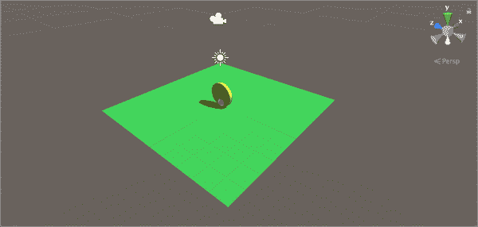
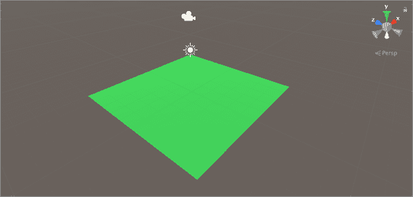
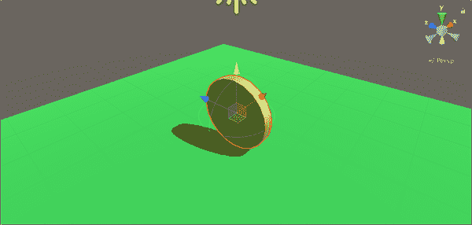
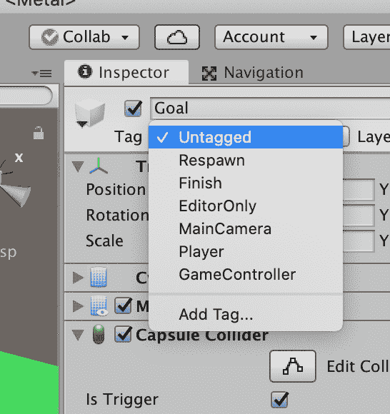
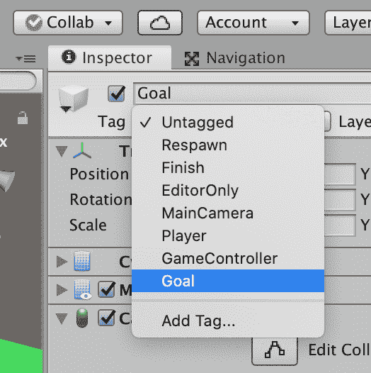
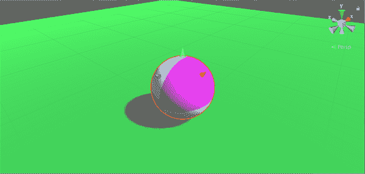
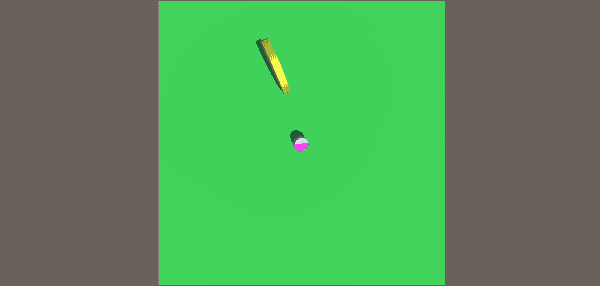
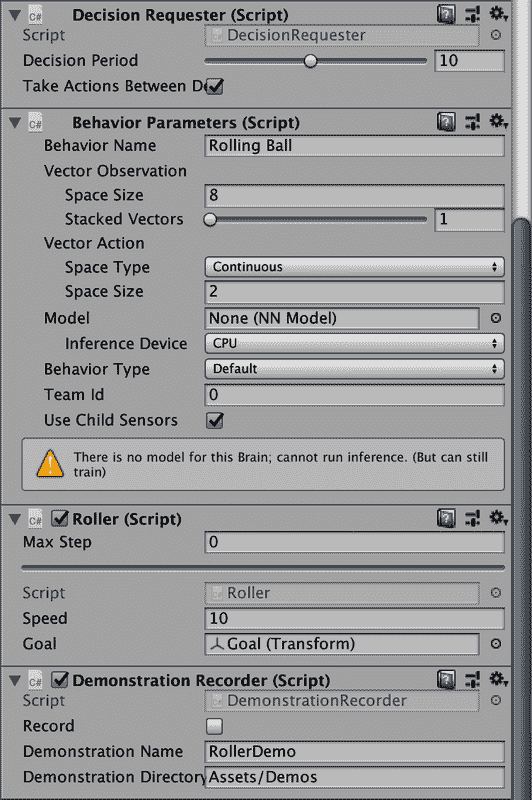
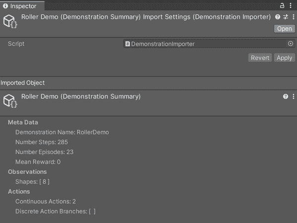
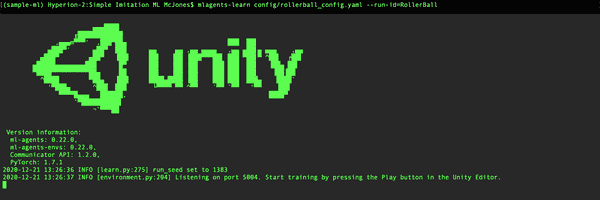

# 第六章：介绍模仿学习

在这一章中，我们将讨论模仿学习（IL）。与其他形式的机器学习略有不同，IL 的目的并不是为了达到特定的目标。相反，它的目的是复制其他事物的行为。那个其他事物？可能是人类。

为了探索 IL，我们将创建另一个基于球的代理程序，它可以在周围滚动，并且我们将训练它去寻找和捡起一个硬币（经典视频游戏风格的捡取）。但与其通过奖励信号强化行为来训练它相反，我们将使用我们自己的大脑来训练它。

这意味着，最初，我们将自己移动代理程序，使用键盘，就像我们在前几章中使用启发式行为来控制代理程序一样。不同之处在于，这一次当我们驱动代理程序时，ML-Agents 将观察我们，一旦完成，我们将使用 IL 让代理程序学会如何复制我们的行为。

###### 注意

IL 不仅可以让您创建更像人类的行为，还可以用来启动训练。一些任务有非常高的初始学习曲线，克服这些早期障碍的训练可能相当缓慢。如果人类能向代理程序展示如何完成任务，代理程序可以将其作为起点并优化方法。幸运的是，人类在很多事情上都做得很好，IL 让您能够利用这一点。IL 的一个缺点是，它不擅长发现新颖的方法，通常比其他方法更早达到顶峰。它的效果取决于所展示的演示。

IL 的主要优势是，您可以比其他机器学习技术更快地获得结果，而无需设置任何奖励结构。这种情况下，奖励信号将自动是它与我们行为匹配程度的衡量，而不是更显式的东西。我们将在第七章中探讨如何与 IL 一起使用奖励。

在这一章中，我们将使用一种特定的 IL 方法，称为行为克隆（BC），这种方法在 Unity 和 ML-Agents 中相对容易实现，但比其他技术有更多限制。我们将在遇到这些限制时详细讨论它们。

###### 提示

Unity 还支持一种称为生成对抗性模仿学习（GAIL）的 IL 技术。我们将在第七章中使用 GAIL。

# 仿真环境

我们的 IL 仿真环境将是相当简单和抽象的。你可以在图 6-1 中看到我们版本的图像。我们的环境将有一个用于地面的大平面，一个球作为我们的代理程序，以及一个扁平的圆柱体作为我们的目标硬币（相信我们，这是一个硬币！）。



###### 图 6-1. 我们将要构建的仿真

要构建仿真环境，我们需要：

+   制造地面

+   制作目标。

+   制作代理。

让我们开始吧：

1.  使用 Unity Hub 创建一个新的 3D Unity 项目。我们的项目名为“ImitationLearningBall”。

1.  导入 Unity ML-Agents 包。

1.  确保你的 Python 环境准备就绪。

完成此操作后，继续构建环境。

## 创建地面。

首先，我们需要我们的地面存在，因为没有地面，我们的球将很难滚动到任何地方。在创建新的 Unity 项目、导入 Unity ML-Agents 包并进入空场景之后，你需要：

1.  创建一个平面，命名为“地面”，并确保其位置为`(0, 0, 0)`。

    现在我们的地面位置正确，我们将快速地给它一个不同的外观，以便我们稍后在环境中能更容易地区分它和其他即将存在的元素。

1.  在项目视图中创建一个材质，命名为“地面材质”或类似名称，并通过更改反照率属性给它一个漂亮的颜色，看起来像地面（我们推荐一个漂亮的草绿色）。

1.  将材料分配给地面平面，通过将其拖动到上面。

当完成时，你应该有类似于图 6-2 的东西。



###### 图 6-2。我们 IL 场景的地面平面

我们的地面已经准备好了，现在是时候制作目标了。在继续之前，请不要忘记保存你的场景。

## 创建目标。

我们此场景的目标将是一个大金币。对于一个滚动的球来说，还能想要什么呢？（如果它足够好用于马里奥，对我们的球来说也足够好！）

要创建硬币，请打开 Unity 场景并按照以下步骤操作：

1.  创建一个新的圆柱体，并命名为“目标”。

1.  使用检视器，将目标的位置更改为`(0, 0.75, 0)`，其旋转更改为`(0, 0, 90)`，并将其缩放更改为`(1.5, 0.1, 1.5)`。

这给了我们一个漂亮的平面圆盘，但看起来并不像一个硬币，所以让我们通过给它一点材质来改变这一点：

1.  创建一个新材质，并命名为与目标硬币相关的名称。

1.  使用检视器，将新材质的反射率颜色设置为漂亮的金黄色。

1.  仍然在材料检视器中，将金属滑块拖到最右边，直到读数为`1.0`，并将光滑度滑块拖动到约`0.3`。

1.  将新材质拖到场景中目标物体或层级上以应用它。

当完成时，你应该有一个看起来类似于图 6-3 的硬币。视频游戏真是不可思议吧？



###### 图 6-3。我们 IL 场景的目标硬币

当然，如果不慢慢旋转，它就不是一个真正的视频游戏硬币*了*。这与任何机器学习或模拟的任何方面都无关，但我们觉得这非常重要：

1.  在层级中选择硬币。

1.  在检视器中，点击“添加组件”按钮。

1.  在下拉菜单中选择“新建脚本”选项。

1.  将脚本命名为“CoinSpin”，然后按回车。

1.  在你的代码编辑器中打开*CoinSpin.cs*脚本。

1.  用以下代码替换文件中的代码：

    ```
    using System.Collections;
    using System.Collections.Generic;
    using UnityEngine;

    public class CoinSpin : Monobehavior
    {
        public float speed = 10;
        void Update()
        {
            var rotationRate = Time.deltaTime * speed;
            transform.Rotate(Vector3.left * rotationRate);
        }
    }
    ```

在 Unity 编辑器中检查器中暴露了一个名为`speed`的浮点变量（因为在代码中设置为`public`），如果您想让硬币旋转得更快或更慢，可以使用它。

现在，如果在 Unity 中播放场景，目标硬币将会缓慢旋转。完美。

###### 注意

让硬币旋转或使其变成闪亮的金色对于培训来说并不是必要的。然而，因为最初需要人类来驾驶球，所以值得花一点时间使事物更加清晰和有趣。人类不喜欢看抽象的白色形状，稍微增加一些乐趣很少是一个坏主意，即使计算机并不在乎。

我们最后需要做的是设置硬币处理碰撞球的情况。

当您创建 Unity 的预定义多面体之一（例如我们将其制成的圆柱体），它会带有碰撞器，让我们知道何时发生碰撞。默认情况下，Unity 将碰撞器视为实体对象，但我们不希望如此。我们不希望球弹开硬币，我们希望球穿过硬币，并通知我们发生了碰撞。

为此，我们需要将我们的碰撞器转换为触发体积：

1.  在 Hierarchy 中选择硬币。

1.  在检查器中，找到胶囊碰撞器部分。

1.  勾选“是触发器”复选框以使其成为触发器。

现在当东西与硬币碰撞时，不会像撞墙那样，我们会被通知有东西碰到了，但不会有物理效果。

我们仍然需要一个简单的方法来让球知道它碰到了硬币而不是其他东西。就像我们在第五章中所做的那样，我们将使用 Unity 编辑器的标签来实现这一点。标签可以让您快速地用附加元数据标记场景中的某些对象，虽然有其他方法可以实现相同的效果，但标签非常轻便和方便：

1.  在 Hierarchy 中选择硬币。

1.  在检查器中，选择标签下拉菜单，如图 6-4 所示。

    

    ###### 图 6-4。初始标签列表

有几个预定义的标签，但我们不想要这些，所以我们将自己制作：

1.  从下拉菜单中选择“添加标签”选项。这将打开标签编辑器，允许我们创建新标签。

1.  点击`+`按钮创建一个新标签。

1.  将标签命名为“目标”。

1.  在 Hierarchy 中选择硬币，并从检查器中打开标签下拉菜单。

1.  选择新创建的“目标”标签，如图 6-5 所示。

    

    ###### 图 6-5。修改后的标签列表

现在我们的硬币被标记为目标，稍后可以用来区分物体。我们的目标硬币完成了！别忘了保存。

## 名称为 Ball，Agent Ball

是时候制作我们的球体代理了。我们知道，思考任何形式的球体总是令人兴奋的，而我们的球体代理也不例外。此时，我们只是设置我们球体的物理属性，而不涉及 ML 元素。

在 Unity 编辑器中，执行以下操作：

1.  在层次视图中创建一个新的球体，并将其命名为 “Ball”。

1.  使用检视面板，将球体的位置设置为 `(0, 0.25, 0)`，其缩放设置为 `(0.5, 0.5, 0.5)`。

1.  使用球体的检视面板添加一个 Rigidbody 组件。你不需要修改其任何参数。

现在我们已经创建并放置了一个球体在场景中，并且给它添加了 Rigidbody，因此它存在于物理系统中。

###### 提示

Rigidbody 是 Unity 的物理系统中允许球体参与的组件，它赋予了球体各种物理属性，比如质量。

最后，我们希望给球体代理赋予一个不同的外观：

1.  在资源窗口中创建一个新的材质。

1.  将其重命名为 “Ball_Mat。”

1.  从 [书籍网站](https://oreil.ly/1efRA) 下载书籍的资源，并找到 *ball_texture.png* 文件。将该文件拖放到 Unity 的项目窗口中。

1.  选择球体材质。

1.  将球体纹理从资源区域拖拽到检视面板中的 Albedo 字段中。

1.  将材质从资源拖放到场景中的球体上。

现在我们的球体在 图 6-6 中已经准备就绪，看起来不错。如果你喜欢，可以自己制作球体的纹理。



###### 图 6-6\. 我们的球体应用了新的材质

继续操作前别忘了保存场景。

## 摄像机

尽管摄像机在训练中没有使用（我们稍后将在 第十章 中讨论），作为人类，在驾驶球体时我们需要能够看到环境，因此我们需要将摄像机放置在我们感到舒适的位置。

这里没有真正的规则，任何你认为最适合你的摄像机角度和位置都可以。但是，如果你希望在任何时候都能看到整个地面，请在 Unity 编辑器中使用以下设置：

1.  在层次视图中选择主摄像机。

1.  在检视面板中，将摄像机的位置更改为 `0, 5, 0`。

1.  在检视面板中，将旋转设置为 `90, 0, 0`。

1.  在检视面板中找到摄像机组件部分。

1.  将视野设置为 `90`。

现在你应该能够从上方俯视整个地面和其上的任何物体，就像 图 6-7 中展示的那样。



###### 图 6-7\. 俯视全视角摄像机

再次，不要忘记保存场景。

# 构建模拟

随着大部分环境的设置和配置完成，我们现在可以转向模拟和训练方面。

我们将在这里进行多项操作，其中大部分与我们的球体相关（即将成为一个代理）。

我们将要采取的步骤应该开始变得熟悉了，但是如果你感觉有些生疏，我们将会：

+   配置球体成为一个代理

+   编写启发式控制代码，使我们能够驱动球。

+   编写代码以生成观察结果。

+   编写代码以在成功或失败时重置环境。

因为我们使用的是 IL 而不是 RL，所以在这种情况下我们不会使用奖励。这意味着你将看不到我们提供任何奖励，无论是正面的还是负面的。

###### 注意

如果我们愿意，我们可以包括奖励，但这对这个特定的场景没有任何影响，所以我们不打算这么做。在下一章中，当我们研究用于模仿学习的 GAIL 方法时，我们将进一步探讨如何结合奖励和模仿。

## 代理组件。

我们的球将需要成为一个代理，但目前它只是一个带有自卑情结的球，所以让我们来修复它。在你的场景中，在 Unity 编辑器中执行以下操作：

1.  在层次结构中选择球。

1.  在检视器中，单击“添加组件”按钮。

1.  添加一个决策请求器组件。

1.  将决策周期更改为`10`。

这将添加许多其他组件。有些是必需的，但其他一些则不需要，所以我们将做一些调整：

1.  在行为参数组件内部检视器中，将行为名称更改为“RollingBall”。

1.  将向量观察空间大小更改为`8`，而不是`1`。

1.  将连续动作更改为`2`。

这些意味着我们已经设置了我们的代理以具有八个观察结果和两个控制动作，但这并不允许启发式控制。现在让我们添加它。这些将是与过去所做的不同的新步骤：

1.  在球代理的检视器中，单击“添加组件”按钮。

1.  添加演示记录器组件。

1.  将演示名称设置为“RollerDemo”。

1.  将演示指导者设置为 Assets/Demos。

演示记录器是一个组件，允许 ML-Agents 系统观察我们驱动球的行为，并将其记录到我们之前设置的目录中的文件中。该文件将用于训练。

最后，我们需要设置一个代理脚本。因为决策请求组件需要一个代理脚本，所以它为我们添加了一个默认版本，但我们希望自定义一个：

1.  在检视器中，单击“添加组件”按钮。

1.  在球上添加一个名为“Roller”的新脚本。

1.  在你的代码编辑器中打开*Roller.cs*。

现在我们将配置球以成为一个代理。我们将在这里进行一些基本设置，然后在后续部分添加更多内容：

1.  在*Roller.cs*文件的顶部添加以下导入：

    ```
    using UnityEngine;
    using Unity.MLAgents;
    using Unity.MLAgents.Sensors;
    ```

    这些为我们提供了我们将使用的基本 ML 组件，以及访问 UnityEngine 库的能力，我们将需要它来生成一些随机数。

1.  修改`Roller`的类定义：

    ```
    public class Roller : Agent
    ```

1.  向`Roller`添加以下实例变量：

    ```
    public float speed = 10;
    public Transform goal;

    private Rigidbody body;
    private bool victory = false;
    ```

1.  用以下内容替换`Start`方法：

    ```
    void Start()
    {
        body = GetComponent<Rigidbody>();
    }
    ```

    我们在这里做了几件事情：首先，我们将`Roller`作为`Agent`的子类，这意味着我们可以得到 Unity 为我们添加的默认代理。然后我们设置了我们将需要的四个不同属性。

    `speed`和`goal`是公共的，意在在检查器中设置，我们马上就会这样做。它们控制着球的移动速度以及它应该以什么`GameObject`作为目标。

    `body`跟踪物理 Rigidbody 组件，以便我们可以根据需要添加和移除力。

    并且`victory`将用于确定是否已达到目标。

1.  在检查器中，将场景中的目标硬币拖到 Roller 组件的目标槽中。

1.  在检查器中，删除 Unity 添加的默认代理组件。

完成以上步骤后，您现在应该在您的球代理上有类似于图 6-8 的 ML-Agents 组件。



###### 图 6-8\. 我们的球，其代理组件正确配置完成。

###### 注意

根据您的 ML-Agents 版本，可能不会自动安装相同的组件。如果是这种情况，您将需要一个决策请求器、一个行为参数以及一个演示记录器组件。您还需要我们的自定义代理脚本 Roller。

别忘了保存一切。

## 添加启发式控制。

由于我们将驱动球以生成训练行为，我们需要一种直接移动球的方式，通常我们可以使用启发式控制来做到这一点：

1.  打开*Roller.cs*。

1.  在类中添加以下方法：

    ```
    public override void Heuristic(in ActionBuffers actionsOut)
    {
        var continuousActionsOut = actionsOut.ContinuousActions;

        continuousActionsOut[0] = Input.GetAxis("Horizontal");
        continuousActionsOut[1] = Input.GetAxis("Vertical");
    }
    ```

    当 ML-Agents 需要代理执行操作时，此方法将被调用，但现在我们拦截了这一过程，并提供了我们自己的操作。

    我们正在使用默认的 Unity 输入系统获取`0` - `1`归一化的水平和垂直值，以控制我们的球。默认情况下，这些值映射到游戏中的标准 WASD 或箭头键控制方案，非常适合我们。

    现在，我们需要能够为每个集进行配置代理及其目标。

1.  在类中添加以下方法：

    ```
    public override void OnEpisodeBegin()
    {
        victory = false;
        body.angularVelocity = Vector3.zero;
        body.velocity = Vector3.zero;
        this.transform.position = new Vector3(0, 0.25f, 0);

        var position = UnityEngine.Random.insideUnitCircle * 3;
        goal.position = new Vector3(position.x, 0.75f, position.y);
    }
    ```

    这做了几件事情。首先，我们将胜利标志重置为 false，尽管它尚未改变。然后，我们从球体中移除所有力，并将其重置到地面的中心。

    最后，在半径为 3 的圆上生成一个随机位置（这与我们的地面的大小很匹配），并将目标设置为该位置。在我们自己驱动球之前，唯一剩下的就是添加操作代码。

1.  在类中添加以下方法：

    ```
    public override void OnActionReceived(ActionBuffers actions)
    {
        var continuousActions = actions.ContinuousActions;

        Vector3 controlSignal = Vector3.zero;

        controlSignal.x = continuousActions[0];
        controlSignal.z = continuousActions[1];

        body.AddForce(controlSignal * speed);

        if (victory)
        {
            EndEpisode();
        }
        else if (this.transform.localPosition.y < 0)
        {
            EndEpisode();
        }
    }
    ```

    在这里，我们获取动作值的水平和垂直分量，并使用它们向我们球的物理体添加一个小力量。这实质上是将球推向动作值的方向，使用了 Unity 的物理系统。

    ###### 提示。

    您可以在[Unity 文档](https://oreil.ly/mbUOy)中了解更多关于`AddForce()`的信息。

    然后我们快速检查一下是否已经获胜（目前还不能），或者是否已经掉到了边缘。如果是这样，我们就结束本集并将一切重置回之前的状态。

    完成这些操作后，保存工作并返回 Unity 编辑器，以便我们可以测试我们的代码。

1.  在检视器中，在行为参数脚本中，将行为类型设置更改为启发式。

1.  播放场景。

您现在可以使用键盘驾驶球。如果您从世界的边缘掉落，环境应该会重置。万岁！

###### 警告

您可能注意到 Unity 警告您关于观察数与设置值不匹配的问题，我们将在下一步修复。这是因为我们尚未提供我们打算提供的所有观察，而我们在配置 Unity 编辑器中代理的行为参数组件的向量观察空间大小时告诉 Unity 预期有八个观察。

如往常一样，请记得保存场景。

## 观察和目标

尽管我们可以完美地驾驭我们的球，但它对自己的世界一无所知，所以它没有学习的能力。

为了使球体代理理解世界，它需要观察。与我们迄今为止构建的每个模拟代理一样，观察是代理了解所处世界的内容。

在这样做的同时，我们还应处理当我们击中硬币时发生的事情以及我们如何击中硬币：

1.  打开 *Roller.cs*。

1.  添加以下方法：

    ```
    public override void CollectObservations(VectorSensor sensor)
    {
        sensor.AddObservation(goal.position);
        sensor.AddObservation(this.transform.position);

        sensor.AddObservation(body.velocity.x);
        sensor.AddObservation(body.velocity.z);
    }
    ```

    当 ML-Agents 需要为代理收集观察时，将调用此方法。对于这种情况，我们的观察相当简单：我们传递目标位置和自身位置 (`x` 和 `z` 坐标)。我们还传递球的水平和垂直速度。

    这就结束了观察，现在是时候加入碰撞了。

1.  在 *Roller.cs* 中添加以下方法：

    ```
    void OnTriggerEnter(Collider other)
    {
        if (other.CompareTag("Goal"))
        {
            victory = true;
        }
    }
    ```

    `OnTriggerEnter` 是 Unity 中的内置函数，当物体进入触发器体积（例如我们的硬币的触发器）时调用。

在这里，我们只是检查我们碰撞的物体是否标记为“目标”，我们的硬币就是这样，并且如果是，我们告诉它设置一个已达成目标的标志。

保存您的脚本。现在，如果我们返回 Unity 并播放场景，我们可以驾驶球，拾取硬币，并重置这一事件。

我们准备好开始生成一些训练数据并进行一些学习。

###### 警告

当我们使用 Unity 物理系统让我们知道何时发生碰撞时，这可能会在更复杂的场景中导致一些奇怪的结果。事件的定时让代理能够关联行动、观察和奖励，这意味着您不能总是依靠 `OnTriggerEnter` 在需要时触发训练。在本例中，我们的示例很简单，这使我们能够更深入地了解 Unity 物理系统，因此我们认为这是值得的。然而，对于大多数情况，建议进行距离检查。

# 生成数据和训练

配置正确的场景后，我们可以生成一些训练数据。现在是向机器人展示如何将球开到硬币的时候了。

## 创建训练数据

令人欣慰的是，Unity 已经让我们轻而易举地记录我们的动作：我们只需要设置一个标志。困难的部分将是善于驾驶球。

###### 注意

在这里很重要的是你尽力玩好游戏。代理将直接从你学习，所以如果你表现不好，代理也会表现不好。*ML-Apple*离*You-Tree*不远。

1.  在层次视图中选择球。

1.  在检视器中找到演示记录器组件。

1.  将记录开关设为打开状态。我们准备开始录制。

1.  播放场景。

1.  使用键盘驱动小球，并确保多次捡起硬币。

1.  当你对场景满意时停止它。我们建议尝试大约 20 次捡起硬币。

一旦完成，你应该在*Assets*目录下看到一个名为*Demos*的新文件夹。在该文件夹内，你应该能看到一个名为*RollerDemo*的文件。如果你在 Unity 编辑器的检视器中选择它，它将告诉你相关信息，比如记录了什么样的动作和观察结果，如图 6-9 所示。



###### 图 6-9\. 检查我们的演示录制

如果进行多次训练运行，你将看到多个演示文件，它们的命名方式是数字递增的，比如*RollerDemo_0*、*RollerDemo_1*等。这些将是我们的训练数据。

## 配置训练

完成了我们的训练数据编写后，现在需要创建我们的 YAML 配置文件。每个人都喜欢 YAML。

本文件的大部分内容将基于第二章，所以我们不会在这里详细讨论。不过，我们会讨论与 IL 特定部分相关的内容：

1.  在项目根目录创建一个 config 文件夹。

1.  在该文件夹内，创建一个新的文本文件。

1.  将其命名为*RollerBallIL.yaml*。

1.  将以下 YAML 添加到该文件中：

    ```
    behaviors:
      RollerBall:
        trainer_type: ppo
        hyperparameters:
          batch_size: 10
          buffer_size: 100
          learning_rate: 3.0e-4
          beta: 5.0e-4
          epsilon: 0.2
          lambd: 0.99
          num_epoch: 3
          learning_rate_schedule: linear
        network_settings:
          normalize: false
          hidden_units: 128
          num_layers: 2
        reward_signals:
          extrinsic:
            gamma: 0.99
            strength: 1.0
        max_steps: 500000
        time_horizon: 64
        summary_freq: 10000

        # behavior cloning
        behavioral_cloning:
          demo_path: ./Assets/Demos/RollerDemo.demo
          strength: 0.5
          steps: 150000
          batch_size: 512
          num_epoch: 3
    ```

大部分内容与我们之前创建的 YAML 文件相同，主要区别在于`behavioral_cloning`部分。这些是我们正在使用的行为克隆（或 BC）技术的具体参数。

目前它们都非常通用，因为我们的模拟非常简单。然而，特别感兴趣的是`strength`设置，它控制 BC 相对于正常的 PPO 训练的学习率。实质上，`strength`表示 BC 对训练的影响和控制程度；如果设置得太高，可能会导致过拟合，但如果设置得太低，则学习不足。

与所有配置参数一样，了解它们的影响最好的方法是改变它们并观察对训练的影响。

另一个有趣的属性是`demo_path`。它指向我们之前制作的演示录制。如果你改变了你的演示名称，或者想要使用不同于第一次运行的演示，确保修改`demo_path`变量以匹配。根据你的系统，可能需要给它一个绝对路径（例如*/Volumes/Work/Sims/IL/RollerDemo.demo*）。

###### 小贴士

在 YAML 文件中很容易打错这些参数。直接从我们的代码中复制它们可能会更容易一些，我们的代码在[GitHub](https://oreil.ly/u43u2)上。

## 开始训练

差不多可以进行机器学习的*机器*部分了，*终于*。但首先，我们必须在 Unity 编辑器中进行一些设置：

1.  在 Hierarchy 中选择球体。

1.  在检视器中找到行为参数组件。

1.  将行为类型设置为默认。

1.  在检视器中找到演示录制器组件。

1.  关闭记录设置。现在我们的代理已经可以由 Python 控制。

1.  打开终端。

1.  导航至 Unity 项目根目录。

1.  运行以下命令：

    ```
    mlagents-learn config/rollerball_config.yaml --run-id=RollerBall
    ```

    过了一会儿，你应该看到类似于图 6-10 的东西，这意味着我们可以在 Unity 中开始工作了。

    

    ###### 图 6-10。Python ML-Agents 已经准备好进行训练。

1.  返回 Unity。

1.  播放场景。

    你应该看到球独自迅速移动，试图学习你的驾驶技能。

1.  去拿一杯很高的咖啡，或者可能读一会儿书。没关系，我们会等你的。

一旦这个过程结束，我们的训练就完成了，我们可以测试它了。

###### 小贴士

如果你需要一个预训练的机器学习模型，请查看我们在[GitHub](https://oreil.ly/nwupp)上制作的模型。

## 使用我们训练好的模型运行。

是时候让我们的 IL 训练模型尝试一下了。

首先，像往常一样，我们需要找到 ML-Agents 为我们创建的神经网络：默认情况下，它将位于项目根目录中的 results 文件夹中。在里面会有一个名为*Roller Ball*的文件夹，里面有一个名为*Rolling Ball.onnx*的文件，这是我们训练好的神经网络。

按照以下步骤使用训练好的模型运行球体代理：

1.  将*.onnx*文件拖放到 Unity 的资源面板中。

1.  在 Hierarchy 中选择球体。

1.  在检视器中找到行为参数组件。

1.  将*.onnx*文件添加到模型槽中。

1.  将行为类型设置为仅推断。

1.  在 Unity 中播放场景。

现在你应该看到球在四处滚动，收集硬币，并且如果你像我们一样开车，经常会从边缘掉下去。希望你比我们更擅长教球。

恭喜你，使用模仿学习训练了一个代理！

# 理解和使用模仿学习。

模仿学习对于使代理像人类一样行为是有用的（在某种程度上）；然而，在实践中，它更可能作为多阶段、多技术训练过程的一部分，帮助代理尤其是在*早期训练*中前进。

###### 小贴士

如需进一步了解多种可能的技术，请参考“技术”章节。

当你考虑进行模拟时，你试图创建一个高效的模拟：你希望早期的训练尽可能成功。

在强化学习中，代理在获得第一个奖励之前完全不知道自己在做什么，甚至稍微的。IL 允许你快速跳过这一过程，使用人类来展示一个“良好的行为”开始，然后继续使用 IL 或切换到 RL 进行训练，尽可能快速地完成困难的早期训练。

在早期训练之后，您可以继续使用 IL 生成具有更有机、“类人”的行为的代理（在您模拟的背景下，这意味着什么），或者转向另一种技术，如前述的 RL，以快速生成新的经验并改进演示的人类行为。

例如，我们在第五章中创建的汽车，最初使用 RL 训练，可以改为首先使用 IL 进行初始训练阶段，其中使用人类驾驶赛道的演示来指导其驾驶行为，然后进行第二个训练阶段——几乎与我们在第五章实际使用的相同——在此基础上使用 RL。这种方法很可能会大大缩短总体训练时间，并使汽车在驾驶课程时显得稍微更具人性化。
