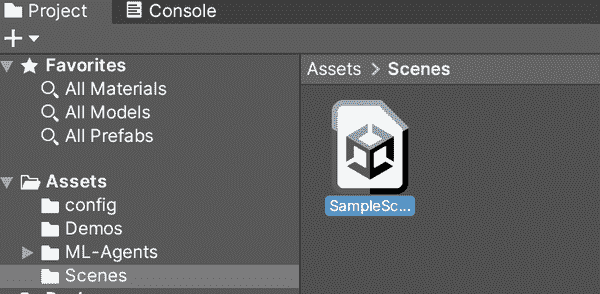

# 第七章：高级模仿学习

在本章中，我们将探讨使用生成对抗仿真学习（GAIL）的模仿学习（IL）。我们可以像我们使用行为克隆（BC）时那样几乎相同地使用 GAIL，但这不会展示给您任何新内容，除了更改配置 YAML 文件外。

到目前为止，通过我们的模拟，我们已经完成了基础工作，建立在此基础上，并使用强化学习创建了一个简单的自动驾驶汽车。在上一章中，我们使用了 IL 来训练一个代理人，使用人类行为。我们用于行为克隆的 IL 试图最大化其与我们提供的训练数据的相似性。

IL 并不是我们能够使用的唯一的 BC 技术。这一次，我们将使用 GAIL。GAIL 可以帮助改善我们代理的训练，使其基本上跳过学习过程中的早期障碍，并让它专注于从那时起的改进。

###### 提示

BC 和 GAIL 也可以结合使用，以便您可以希望提取两者的优点并减少任何一者的弱点。在本章末尾，我们将介绍如何结合 GAIL 和 BC，但目前的重点将放在 GAIL 上。

# 遇见 GAIL

在我们开始使用 Unity 和 ML-Agents 进行基于 GAIL 的活动之前，我们将解析一些使 GAIL 运行的要点。

GAIL 正如其名称所示，是一种对抗性的模仿学习方法，基于一种称为*GAN*的机器学习网络：生成对抗网络。GAN 有效地将两个训练好的模型，称为*鉴别器*和*生成器*，相互对抗。鉴别器模型评估生成器复制所需的训练数据或行为的能力，来自鉴别器的反馈被生成器用来指导和希望改进其行动。

这些行动和行为然后被反馈给鉴别器，以便它更多地了解场景。鉴别器根据生成器采取的行动和提供的演示学习场景的规则和奖励。

###### 提示

GAIL 是一种比 BC 更新得多的模仿学习方法，但这并不一定意味着它更好；它只是不同而已。机器学习作为一个领域处于不断变化之中。

然后自然出现的问题是*我应该何时使用 GAIL，何时使用 BC？*和大多数机器学习中的事物一样，答案并不简单。一般来说，选择使用哪种更多地取决于您打算使用的场景。令人困惑的是，您还可以将它们结合起来（通常）比单独使用它们效果更好。

###### 注意

学术研究围绕 GAIL 经常讨论逆强化学习和无模型学习，以及其他听起来非常花哨的术语。

这基本意味着 GAIL 没有对世界的固有理解；它必须找出场景的规则和最大化场景奖励的行动。

因此，当它被抛入深水区并且几乎没有帮助的情况下，它表现得相当不错。

如果您拥有大量覆盖环境中可能变化的人类生成的训练数据，则 BC 与 IL 结合的效果通常会优于 GAIL。

如果您只有少量的人类生成数据，GAIL 将能够更好地推断出最佳方法。在与由人类定义的外部奖励结合时（使用 ML-Agents 中的`AddReward`函数），GAIL 的表现也往往优于 BC。

在使用强化学习时，为模拟设置正确的奖励结构通常非常棘手。使用 GAIL 可以帮助解决这个问题，因为它在不知道具体场景的情况下运作，并且在某种程度上试图弄清楚您的期望。它通过依赖示范数据中包含的信息来实现这一点。在设计良好的奖励结构困难的复杂场景中，即使您不能本质上解释您的行为为何有效，您也可以使用 GAIL 来基于您的行为模式工作出解决方案。

GAIL 比 BC 与 IL 更加灵活，但这并不是我们在这里使用它的原因；我们之所以使用它，是因为 GAIL 在与外部奖励结合时效果更好。当您只提供部分示范信息时，GAIL 的表现比 BC 与 IL 更好。

###### 提示

本质上，在 GAIL 内部有两只“狼”：第一只“狼”致力于更好地理解它所处的世界，而第二只“狼”则执行希望能够取悦第一只“狼”的行动。

# 按我说的去做和做

有一句古老的谚语，“说到做到”，每当训练 ML-Agent 代理时我就会想起它。

我们基本上只设置了一些奖励，然后告诉代理从那里开始解决问题。如果我们在孩子成长过程中这样做，那会被认为是一种非常糟糕的知识传授方式，所以我们倾向于展示他们如何做几次，然后给他们规则并让他们在此基础上改进。

几乎任何时候，作为人类，当您接受训练时，通常会在您独立操作之前展示正确的操作方式几次。

这就是我们在这里尝试复现的内容；我们希望使用 GAIL 来启动我们代理的训练。我们希望展示正确的方法几次，然后让它从那时开始找出最佳方法。

## 一个 GAIL 场景

对于这种情况，我们将使用类似于我们之前在第六章中使用 IL 进行 BC 训练的问题和环境。我们的活动涉及一个环境，具有以下特征：

+   一个目标区域

+   一个充当代理的球，需要移动到目标位置

它看起来像图 7-1。


###### 图 7-1. 我们的 IL 环境，在修改为 GAIL 之前

如果球掉出世界，这将以失败结束本集；如果球达到目标，这将以成功结束本集。

对于我们与 GAIL 的活动，我们将使用同一个环境，并进行小幅添加：

+   代理需要先触摸“key”，然后才能解锁目标。

+   在没有触摸到“key”之前触摸目标将不会有任何效果。

在这一点上，您可以复制您为第六章创建的 Unity 项目，或者直接进行修改。我们选择在项目内复制场景，因此我们打开 Unity 编辑器并执行以下操作：

1.  如图 7-2 所示，在项目窗格中选择场景。

    

    ###### 图 7-2\. 在项目窗格中选择场景

1.  选择“编辑”菜单 → 复制，如图 7-3 所示。

    

    ###### 图 7-3\. 选择复制

1.  将复制的场景重命名为“GAIL”或类似名称。

确保新场景已经打开并准备就绪。然后是添加 key 的时间：

1.  在项目层次结构中添加一个新的立方体。

1.  将此立方体重命名为“key”。

立方体将部分嵌入在地面中，但目前这没有问题。接下来的步骤是修改代理和代理的脚本。

###### 注意

如果您还没有完成第六章，我们强烈建议您在尝试这之前完成。

## 修改代理的动作

我们当前的代理仅在我们为其录制的演示中使用训练数据——否则没有设置奖励结构。

对于 BC with IL 来说，没有奖励是很好的，但对于我们在 GAIL 活动中所追求的不是这样。我们希望代理使用训练数据来帮助开始学习，然后从奖励中获得值，作为代理优化的组成部分。

###### 注意

因为我们在与基于 BC 的 IL 相同的项目中工作，所以我们将直接修改`roller agent`类（这将影响我们在上一章中创建的场景的功能），但如果您希望保持原样，可以复制该文件或创建一个新的 C# 文件作为新的代理。

只需记住将其连接到场景中的代理并移除旧代理。

1.  打开 *Roller.cs*。

1.  在类中添加以下成员变量：

    ```
    public Transform key;
    private bool hasKey = false;
    ```

    这两个变量中的第一个变量`key`将被用于在场景中引用`key`对象，第二个变量将用于判断我们是否已经拿起了`key`。

    现在我们可以在`key`本身上使用一些特定于 GameObject 的信息，以了解它是否被击中，而不是让另一个变量在那里浪费空间，但这并没有节省多少，以至于不值得被打扰。

1.  用以下代码替换`OnActionReceived`方法：

    ```
    var continuousActions = actions.ContinuousActions;
    Vector3 control = Vector3.zero;
    control.x = continuousActions[0];
    control.z = continuousActions[1];

    body.AddForce(control * speed);

    if (transform.position.y < 0.4f)
    {
      AddReward(-1f);
      EndEpisode();
    }

    var keyDistance = Vector3.Distance(transform.position, key.position);
    if (keyDistance < 1.2f)
    {
      hasKey = true;
      key.gameObject.SetActive(false);
    }
    if (hasKey)
    {
      if (Vector3.Distance(transform.position, goal.position) < 1.2f)
      {
        AddReward(1f);
        EndEpisode();
      }
    }
    ```

这部分的工作方式与我们之前的代码类似：它基于移动动作值施加力。如果代理人滚出平面边缘，我们仍然会重置环境，但现在我们会因此惩罚它。

接下来，我们要判断是否触碰到了关键物体。如果我们触碰到了它，我们会使关键物体失效（因此它不再出现在场景中），并标记关键物体已找到。

最后，我们做了类似的事情，但是针对的是目标而不是关键物体；如果我们有了关键物体，我们会给予奖励并结束这一集。

我们在这里使用一个距离值，1.2 单位，来判断我们是否足够接近。我们选择这个数字是因为它比单位球体与单位立方体之间的中心距离要稍微大一点。我们这样做是因为这段代码简单明了，很好地展示了这个概念。然而，它并不完美：我们粗略地在代理周围画了一个半径为 0.6 的球体，并查看是否有东西在里面。

###### 注意

Unity 有一个内置方法可以做到这一点：`Physics.OverlapSphere`，它允许你定义一个中心点和半径，并查看在这个想象的球体内有哪些`collider`。我们没有使用这种方法，因为它看起来有点笨拙，为了正确地确定你击中了什么，你应该使用标签，这需要我们设置起来。因此，我们保持简单，进行距离检查，但是内置方法在让你定义碰撞层蒙版方面有很大的灵活性，如果我们有一个更复杂的示例，那就是我们要做的。

如果你感兴趣，这里是一个`OverlapSphere`调用的基础。弄清楚你击中了什么或者将碰撞过滤到只有相关的碰撞是一个练习，正如他们所说，留给读者自己去做：

```
var colliders = Physics.OverlapSphere(transform.position,
  0.5f);
foreach(var collider in colliders)
{
  Debug.Log($"Hit {collider.gameObject.name}");
}
```

那些是我们修改后的动作；现在是关于观察结果的内容。别忘了保存你的代码。

## 修改观察结果

现在对观察结果的处理可能已经非常熟悉了，我们将通过将观察结果传递给 ML-Agents 的`CollectObservations()`函数来完成所有操作。与 IL 版本相比，对观察结果的核心更改是添加关于关键信息和关键状态的信息。

在你的代码打开时，用以下代码替换`CollectObservations`方法：

```
sensor.AddObservation(body.velocity.x);
sensor.AddObservation(body.velocity.z);

Vector3 goalHeading = goal.position - transform.position;
var goalDirection = goalHeading / goalHeading.magnitude;
sensor.AddObservation(goalDirection.x);
sensor.AddObservation(goalDirection.z);

sensor.AddObservation(hasKey);
if (hasKey)
{
  sensor.AddObservation(0);
  sensor.AddObservation(0);
}
else
{
  Vector3 keyHeading = key.position - this.transform.position;
  var keyDirection = keyHeading / keyHeading.magnitude;
  sensor.AddObservation(keyDirection.x);
  sensor.AddObservation(keyDirection.z);
}
```

从概念上讲，这与以前并没有太大的不同；我们只是跟踪更多的事物。

我们仍然拥有我们的速度和朝向目标的方向，但我们正在添加一个新的观察值来表明我们是否有关键物体，以及朝向关键物体的方向。如果关键物体已被捡起，我们就不再计算它的方向；我们只发送零，这几乎等同于不发送观察结果。

我们这样做的原因是因为我们必须每次发送相同数量的观察结果。

所有这些代码都改变了发送给代理的观察数量，与以前的基于 IL 的版本相比。我们很快会修复这个问题。

## 重置代理

对于我们最后的一段代码，我们需要更新`OnEpisodeBegin()`函数以适当地重置一切。具体来说，我们现在需要重置关键状态和状态。

替换`OnEpisodeBegin`方法体的代码如下：

```
body.angularVelocity = Vector3.zero;
body.velocity = Vector3.zero;
transform.position = new Vector3(0, 0.5f, 0);
transform.rotation = Quaternion.identity;

hasKey = false;
key.gameObject.SetActive(true);

var keyPos = UnityEngine.Random.insideUnitCircle * 3.5f;
key.position = new Vector3(keyPos.x, 0.5f, keyPos.y);
var goalPos = UnityEngine.Random.insideUnitCircle * 3.5f;
goal.position = new Vector3(goalPos.x, 0.5f, goalPos.y);
```

与观察一样，这与以前并没有太大不同：我们仍然将代理重置到中心并移除其所有力量，并且我们仍然选择一个随机点并将目标移动到那里。然而，我们还标记了我们没有钥匙，确保钥匙游戏对象在场景中处于活动状态，并最终将其移动到一个随机位置。

通过这个改变，我们的代码就完成了。我们不需要触及启发式代码，因为那里的内容没有改变。在返回 Unity 编辑器之前别忘了保存。

## 更新代理属性

我们的代理代码发生了相当大的变化，因此检查器中设置的许多组件值对于该代理不再正确；让我们来修复这个问题。在 Unity 编辑器中，打开您的场景：

1.  在层次结构中选择代理。

1.  在检查器中找到代理组件。

1.  将钥匙游戏对象从层次结构拖放到检查器中的键字段中。

1.  在检查器中找到行为参数组件。

1.  将观察的空间大小设置为 7。

有了这些，我们的代理现在已经正确编码和配置。接下来让我们给它一些训练数据。

## 演示时间

这个略微修改过的世界不再与我们之前使用的相同，所以我们应该为代理创建一些新的演示数据：

1.  在层次结构中选择代理。

1.  在检查器中找到行为组件。

1.  将类型从默认更改为启发式。

1.  在启发式记录器组件中，将其设置为记录。

1.  播放场景。

1.  尽力记录一些演示数据。

###### 注意

您可能会想知道为什么我们要记录新的演示数据，考虑到我们在使用 BC 时已经这样做了。我们这样做是因为这些数据没有奖励作为其一部分，这意味着 GAIL 将无法将动作与奖励关联起来。如果我们使用旧数据，我们将会在没有外部奖励的情况下训练 GAIL。这样做是有效的，但不是本章的重点，很可能不会给您想要的结果。

一旦您觉得已经记录足够的数据，请停止场景。现在您应该有一些数据可以用来输入到 GAIL 中。

###### 提示

如果您选择了创建的演示文件，在 Unity 检查器中可以看到我们获得的平均奖励。它还显示一些其他信息，但在这里我们关心的主要是平均奖励。如果太低，这可能不是一个特别好的演示文件。

接下来是训练。

# 使用 GAIL 进行训练

如果你猜想，“我只需在 YAML 文件中设置一些奇怪的设置来启用 GAIL 吗？” 那么你是正确的，所以我们再次迎来令人兴奋的一轮*让我们在 YAML 文件中编辑一些魔法数字*。对于 GAIL 来说，我们想要调整的相关部分都是奖励设置的一部分。

对于这种情况，我们将使用早期使用 BC 时使用的相同训练配置文件，但我们会做一些更改。首先，我们需要创建一个新的配置文件：

1.  复制 *rollerball_config.yaml* 并将其命名为 *rollerball_gail_config.yaml*。

    接下来，您需要移除配置中与 BC 相关的部分。

1.  删除 `behavioral_cloning` 行以及其下和缩进的所有行。

    最后，我们希望添加 GAIL。

1.  在 `reward_signals` 部分下，添加一个新的 GAIL 部分：

    ```
    gail:
      strength: 0.01
      demo_path: ./Assets/Demos/RollerDemoGail.demo
    ```

我们可以调整几个不同的 GAIL 参数；在这里，我们只设置了两个，而且只有一个是必需的。

必需的是 `demo_path`，它指向我们刚刚创建的演示文件。我们还设置了 `strength`，其默认值为 `1`，我们将其设置得远低于默认值，因为 `strength` 被 GAIL 用来调整奖励信号的比例。

我们将其设置得很低，因为我们的演示数据不太理想，并且计划外部奖励信号是确定采取何种行动的主要指标。如果我们给它一个更强的信号，它会更像我们的演示文件学习，而不是像场景的最佳玩法。

我们还可以在这里配置 GAIL 的其他设置（但保持它们的默认值），包括鉴别器的大小、学习率和伽马等。

我们这里不需要任何这些设置，所以我们将它们保持在默认设置，但如果您对它们感兴趣，[官方文档](https://oreil.ly/6w9DO)中对它们都有描述，如果 GAIL 不按照您希望的方式工作。

###### 警告

由于 GAIL 的设计方式，它有引入[各种偏见](https://oreil.ly/gNIgb)到代理中的习惯；也就是说，即使这与场景目标直接冲突，它经常试图延长情节长度。

由于这个原因，在训练过程中，如果您发现您的代理基本上只是闲逛而不完成手头的任务，很可能需要降低 GAIL 奖励信号，以防止其压倒外部奖励。

完成后，完成的 YAML 文件应该如下所示：

```
behaviors:
  rolleragent_gail:
    trainer_type: ppo
    hyperparameters:
      batch_size: 10
      buffer_size: 100
      learning_rate: 3.0e-4
      beta: 5.0e-4
      epsilon: 0.2
      lambd: 0.99
      num_epoch: 3
      learning_rate_schedule: linear
    network_settings:
      normalize: false
      hidden_units: 128
      num_layers: 2
    reward_signals:
      extrinsic:
        gamma: 0.99
        strength: 1.0
      gail:
        strength: 0.01
        demo_path: ./Assets/Demos/RollerDemoGail.demo
        use_actions: true
    max_steps: 500000
    time_horizon: 64
    summary_freq: 10000
```

配置文件配置完成后，现在是开始实际训练的时候了：

1.  在 Unity 中选择代理程序。

1.  在检视器中，在行为参数组件内，将行为类型更改为默认。

1.  在检视器中，在演示录制器中，取消选中记录框。

1.  在命令行中，运行以下命令：

    ```
    mlagents-learn config/rolleragent_gail_config.yaml
      --run-id=rolleragent_gail
    ```

1.  一旦开始，返回 Unity 并按 Play 按钮。

代理现在应该正在训练中。快速（或不那么快）地喝杯咖啡，让我们在训练完成后再继续。

# 运行及其后续

一旦我们的训练完成，我们可以像之前一样运行它：

1.  将训练好的 *.onnx* 模型文件添加到 Unity 中。

1.  在 Unity 中选择代理。

1.  在 Inspector 中，在行为参数组件内，将行为类型更改为仅推理。

1.  将模型文件拖放到模型槽中。

1.  点击播放，坐下来享受观看你的代理在周围滚动，捡起方块。

对于我们的代理来说，在训练了 500,000 次迭代后，它的平均奖励分数达到了 0.99，这几乎是完美的表现。

与我们的演示文件相比，其平均奖励为 0.95，所以代理已经超越了我们，这正是我们预期的：学生已经成为了大师。

现在我们已经介绍了将 GAIL 与外部奖励因素结合的基础知识，但在我们继续其他主题和章节之前，现在是时候谈谈如何结合 GAIL 了。在这个例子中，我们将 GAIL 与外部奖励结合在一起，但我们也可以将其与模仿学习和行为克隆结合起来。为此，我们只需将 BC 配置元素添加回 YAML 配置文件中即可。

然而，诀窍在于平衡外部奖励、GAIL 和 BC 奖励的相对强度值。

对于这种情况，我们尝试了各种不同的三个值，调整了其他配置设置，甚至尝试将 BC 限制在训练的前半部分，但我们并没有看到训练有任何显著改善。在某些情况下，当试图最佳地融合各种元素时，我们最终得到的代理表现非常糟糕，其平均奖励为 -0.4，这意味着大部分时间它只是干脆从地面边缘掉下去；我们的 GAIL 或仅 BC 都表现出色。

或许在这种情况下，这些调整并没有提供足够的价值，或者也许我们只是还没有找到合适的值让一切顺利运行。

Unity 在其 [金字塔示例](https://oreil.ly/dP67X) 中发现，当结合不同的技术进行训练时，与单独使用任何其他方法相比，代理训练速度更快且效果更好。

结合不同方法确实有其合理之处；毕竟，这与我们学习的方式并没有太大不同。我们尝试结合许多不同的技术以获得尽可能好的结果，那么为什么代理就应该有所不同呢？模仿学习有着巨大的潜力，并且因为它相对容易添加到你的训练中，所以非常值得一试。
