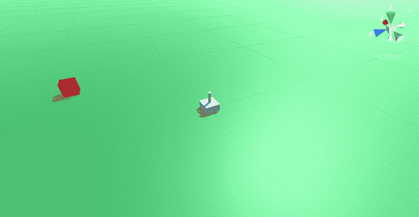
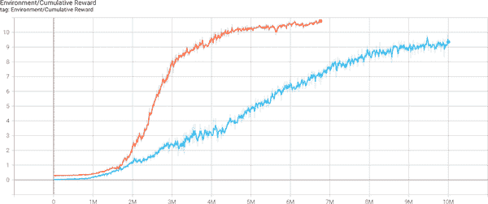
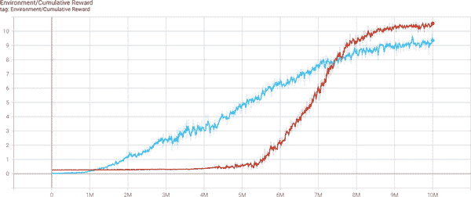

# 第八章：引入课程学习

回想一下你在学校的头几天。那是多么奇怪的时光……老师站在班级前面向你们展示一个二次方程，要求你们解决它。

“*x*的值是多少？”你发现自己被问到。

困惑的是，你不知道发生了什么；毕竟，这是你的第一天。

但你仍然要猜测：“三。”老师瞪视着你然后宣布你非常错误。你被送回家。

第二天这种情况重复。老师再次给你一个二次方程；你再次失败并被送回家。日复一日，这种情况发生：你出现并得到一个方程式，你猜测，得到一个异常错误的答案，然后被送回家。

有一天你猜测，老师说：“错了，但接近了。”

终于，有些进展了。

你仍然被送回家。

第二天这种情况重复，再次重复，每次你都更接近猜测。每次你被送回家，每次你第二天再次出现并猜测。

最终你开始把它们拼在一起，你开始理解构成方程式的个别部分，它们相互作用的方式，它们如何影响*x*的值。这次当被问及时，情况有所不同。你回答说，“*x*等于-1 加或减根号 2”，并且你对你的答案感到自信。你的老师慢慢点头。“正确。”

你现在已经在学校待了 600 年，但是最终你知道如何解决一个二次方程。你被送回家。

当然，这听起来像是一种糟糕的学习方式和一种极其残酷的教学方式，然而这就是我们要求 ML 工作的方式。

实际上人们是按阶段教授的。

我们从需要解决更复杂问题的基础开始，一旦掌握了它们，我们就转向更困难的问题和更复杂的信息。我们像金字塔一样建立在我们以前的知识之上，一层一层地添加，直到我们能够解决我们关心的实际问题。

我们以这种方式教导人们是因为已经证明这种方法有效；事实证明，仅仅让孩子们解决二次方程并不是非常有效的，但是教授数字的基础知识，然后是数学能力，接着是代数和公式，这样有一天你可以让他们解决一个二次方程并且他们能够做到。各种文化在所有知识领域中以各种形式采取这种方法。

机器学习中的课程学习（CL）提出了这样一个问题：“如果它对人类有效，那么它对 ML 也有效吗？”在本章中，我们将看看如何使用课程学习通过分阶段地构建来解决问题。

# 机器学习中的课程学习

使用课程学习（Curriculum Learning）在你的 ML 模型中的主要原因与人类使用它的原因相同：通常在移动到任务的更高级部分之前，掌握某事物的基础知识会更容易。

###### 注意

当课程学习成功时，它是非常成功的。例如，在 Unity 中，当教导一个代理人去达到一个目标（比如学习如何越过篱笆）时，课程学习模型学习速度和效果都比传统模型更快更好。其他与[模拟相关的领域](https://oreil.ly/XwMcW)也显示了类似的[有希望的结果](https://oreil.ly/04bAa)。然而，这并不意味着答案总是“只使用课程学习”。

像许多机器学习中的事情一样，知道何时使用课程学习并不是一成不变的。如果您试图解决的问题具有明确定义的难度元素，或者任务本身具有明显的阶段，那么它可能是课程学习的一个极好候选者。不幸的是，在尝试并查看之前，您实际上无法确定 CL 是否合适。

例如，假设您想训练一个代理人去追逐一个会四处移动的目标；也许您正在制作一只追逐松鼠的狗的模拟。

###### 注意

我们，作者，来自澳大利亚，我们这里没有松鼠，所以我们假设狗追赶它们是完全无害的原因。此外，这些松鼠不能爬树；毕竟，我们从未见过有松鼠这么做过！

我们可以让狗对抗一个在空间中自己移动的松鼠，并让代理人自己想出解决方法，或者我们可以使用课程学习。

要开始我们的课程学习狗代理，我们将从让我们的狗朝一个恰好超过两米宽的松鼠移动开始。

###### 注意

再次强调，我们这里没有松鼠，所以我们很确定它们可以长到这么大。

此外，松鼠不会移动，这对我们的狗来说更容易。然后，松鼠可能开始缩小，迫使狗更精确地移动以达到它。

一旦狗掌握了达到一个静止的松鼠大小的松鼠，我们可以开始移动目标。我们甚至可以让松鼠的速度从非常慢逐渐加快到松鼠速度，最终达到超松鼠的速度。

因此，我们这里的课程是先教我们的代理人移动，然后是追随，然后是追随更快和更快的目标，基本上教它如何追逐。¹

通常，课程学习被展示为在非常复杂的场景中使用，使其几乎感觉像是一种魔法弹药。一些它用于的问题如果没有课程学习的魔法棒可能几乎不可能实现，但要记住的是，从根本上说，它是一种改进训练的手段，而不是做不可能的事情。一般来说，任何您可以用课程学习解决的问题，都可以不用它解决，只是通常需要更长的时间。

结果表明，仅仅通过增加计算能力来解决问题，虽然有点不够优雅，但确实有效。在我们看来，课程学习在最佳状态下时，是用来加快或改善你的代理训练的，而在这个角色中，它很可能是模型训练的未来。

# 课程学习场景

让我们使用课程学习创建并解决一个问题。我们要解决的问题是教代理如何向目标扔球。

虽然作为人类，我们天生擅长扔球，但这实际上是一个非常复杂的任务。如果你想要击中目标，你必须考虑距离、投掷力量、角度以及弹道弧线。

代理始终会从房间中心开始，但目标会随机散布在空间中。在投掷球之前，代理将不得不确定要多大力量扔球，以及垂直角度和投掷方向。

这引出了一个问题，即我们的课程将是什么，以及我们如何增加这种情景的难度。

像所有强化学习方法一样，我们将有一个奖励结构，通过给予接近未中的小奖励来鼓励代理改进。

这种奖励结构将是我们课程的基础。我们将从一个非常大的半径开始，这被视为“接近未中”，随着时间的推移，该半径会缩小，从而鼓励代理变得更加准确以继续获得奖励。就像我们之前的例子（松鼠从一个极大的尺寸开始，然后随着代理理解其意图而不断缩小）一样，这里也是一样的。

因此，我们的课程将分为几个难度逐渐增加的课程，其中代理必须成功地将球扔到靠近目标的距离缩小。

我们可以根据需要设定多少难度级别，但我们的课程的核心方法每次都将是相同的。

# 在 Unity 中构建

让我们从在 Unity 中构建环境开始。完成的环境将类似于图 8-1。

与我们在本书中创建的所有其他例子不同，我们将在模拟侧面做一些略有不同的事情。

我们不会扔出物体然后等待 Unity 物理引擎移动它。相反，我们会即时计算着陆点并使用该计算点。



###### 图 8-1\. 我们场景中的环境，准备进行课程学习

一旦模型训练完毕，我们将使物体四处飞溅，因为这看起来很酷，但不是为了训练。我们不需要以我们能看到的方式扔物体，因为我们可以计算它是否会击中我们的目标。在训练期间模拟实际抛掷的视觉组件会不必要地减慢速度，我们不需要这样做。一旦训练好模型，我们可以添加适当的视觉效果，映射到底层发生的事情。

这样做的原因是，否则我们必须在我们的代理中添加记忆，以便它学会将它采取的投掷动作与稍后得到的奖励联系起来。因此，我们可以进行一些测试，并连接启发式（用于手动人类控制、测试，如以前所做的那样），我们将可视化抛物线和投掷结束点。

###### 注意

ML-Agents 框架确实支持为您的代理添加记忆，但因为*显著*增加了复杂性和训练时间，所以我们尽可能地避免使用它。

弹道数学是众所周知的，因此我们不必真正进行步骤；相反，我们可以进行数学建模。

当我们稍后使我们的代理真正投掷游戏对象时，它们将准确地落在数学上说它们将落在的地方。在这种情况下不可能的情况下，将需要记忆，但在这里不需要。

创建一个新的 Unity 项目，添加 Unity ML-Agents 包，并准备一个空场景继续。我们的项目名叫“CurriculumLearning”，相当有创意。

## 创建地面

首先，我们需要一些地面；对于这个环境，我们将创建一个单一的平面：

1.  在层次结构中创建一个新的平面。

1.  使用检查器将其命名为“地面”，将其位置设置为`(0, 0, 0)`，并将其比例设置为`(20, 1, 20)`。

创建好我们的地面后，我们将给它涂上颜色（通常情况下），这样可以更容易地在视觉上区分模拟中的不同部分（对于我们，人类来说）：

1.  创建一个新的材料，并给它取名为“GroundGrass_Mat”。

1.  使用检查器将材料的反射率颜色设置为漂亮的绿色。

1.  从项目面板将材料拖动到层次结构或场景本身的地平面上。

现在我们的地面有了材料，帮助我们区分一切。完成后，我们将继续制作我们的目标。不要忘记保存你的场景。

## 创建目标

在这个场景的这一部分中，我们的目标将只是一个简单的立方体。在训练期间，它将用于提取一个位置。但是，在推理期间，它将被我们的代理射击并根据物理法则四处飞溅，所以我们需要设置目标来涵盖这两种情况。

###### 注意

“推理阶段”是指您正在使用经过训练的模型时。您的代理从模型推断出动作，因此是推理阶段。

1.  在层次结构中创建一个新的立方体。

1.  使用检查器将其命名为“目标”，并将其位置设置为`(0, 0.5, 0)`。

1.  向其添加刚体组件。

当我们在推理模式下运行模拟时，我们的目标需要有一个刚体，因为我们希望它对被投掷的东西作出反应。这对训练没有影响，但我们现在需要设置它。

完成这些后，我们可以开始工作我们的代理。在继续之前保存场景。

## 代理

现在是构建我们的代理的时候了：我们的代理的基础非常简单，因为它将基于一个立方体（很像我们的目标）。真是个惊喜！

1.  在层级中创建一个新的立方体。

1.  将立方体命名为“Agent”，并将其位置设置为`(0, 0, 0)`。

    这很简单，但在这里有可视化的东西是很有用的。然而，有一个问题：它有一个碰撞器，因为默认情况下立方体有一个。在后面推断时，这只会妨碍产生抛射物。

1.  在检视器中，从代理中移除框碰撞器组件。

    现在，我们为代理使用网格的整个原因是帮助我们可视化它正在做的事情，但不是所有弹道轨迹的方面都能轻松显示。

    因为代理是一个立方体，我们可以看到它朝向的方向，但我们希望有另一个元素来显示它瞄准的俯仰角。

1.  在层级中添加一个新的圆柱体。

1.  将圆柱体拖到代理的下方（在层级中），使其成为代理的子对象。

1.  使用检视器将圆柱体的位置设置为`(0, 1, 0)`，并将其旋转设置为`(0.2, 1, 0.2)`。

1.  在检视器中，从圆柱体中移除碰撞器组件。

这给了我们一个小圆柱体放在箱子上方，我们可以用它来视觉上判断高度。

虽然这将以一种奇怪的方式关联并穿过盒子，但对于启发阶段来说没问题，对于训练或推理阶段，它对模拟没有影响。

大部分场景已完成。在继续之前保存它。

# 构建模拟

随着场景的基本结构准备就绪，是时候开始构建模拟部分了。具体来说，正如你现在希望的那样，我们将创建代理需要的动作、观察和奖励。

## 使代理成为代理

虽然我们可能已经在场景中准备好了代理，但它没有代码；至少，它将需要成为一个`Agent`子类。

1.  创建一个新的 C#文件，并将其命名为*Launcher.cs*。

1.  打开*Launcher.cs*并用以下内容替换它：

    ```
    using System.Collections;
    using System.Collections.Generic;
    using UnityEngine;
    using Unity.MLAgents;
    using Unity.MLAgents.Actuators;
    using Unity.MLAgents.Sensors;

    public class Launcher : Agent
    {
        public float elevationChangeSpeed = 45f;

     [Range(0, 90)]
        public float elevation = 0f;

        public float powerChangeSpeed = 5f;
        public float powerMax = 20f;
        public float power = 10f;

        public float maxTurnSpeed = 90f;

        public float hitRadius = 1f;
        public float rewardRadius = 20f;

        public float firingThreshold = 0.9f;

        public Transform target;
        public Transform pitchCylinder;
    }
    ```

在上述代码中，我们声明了一些控制最小和最大值的变量，以及一些稍后用于调整奖励的额外值。最后，还有两个引用：一个用于目标，一个用于圆柱体。我们很快就需要这些元素，所以现在就处理它们吧。

这些数字变量每个与弹道抛掷的不同元素相关：

+   *Elevation* 是垂直抛掷角度；它被限制在 0 到 90 之间，*Elevation Change Speed* 是俯仰角速度。

+   *力量*是投掷时施加的力量大小，*最大力量*和*力量变化速度*限制了最大力量和代理可以加速和减速其力量的速度。

+   *最大转向速度*是代理能够旋转其面向的速度；我们不需要追踪面向本身，因为与仰角不同，我们只会向前投掷。

+   *击中半径*和*奖励半径*用于给予奖励，所以我们很快会详细讨论它们。

+   *发射阈值* 限制了代理允许投掷投射物的频率。

现在我们需要连接这些各种组件：

1.  将 *Launcher.cs* 文件拖放到场景中的代理对象上。

1.  将目标对象从层级拖放到检查器中的`Launcher`组件的`target`字段中。

1.  将圆柱体对象从层级中拖放到检查器中`Launcher`组件的`cylinder`字段中。

最后，我们需要添加并配置代理的其他必要组件：

1.  从层级中选择代理。

1.  在检查器中，点击“添加组件”按钮，然后选择 ML Agents → 决策请求者。

1.  在检查器中，点击“添加组件”按钮，然后选择 ML Agents → 行为参数。

1.  在行为参数组件部分，将行为重命名为“Launcher”。

1.  将向量观察空间大小设置为`9`。

1.  将连续动作的数量设置为`4`。

1.  在代理组件中，将最大步数设置为`2000`。

现在我们的代理基础就绪，我们可以开始添加动作了。别忘了保存所有内容。

## 动作

我们的代理的动作非常简单。它将能够旋转其朝向（或偏航角），旋转其垂直瞄准方向（或俯仰角），增加或减少其投掷力量，并最终投掷或发射其投射物。

这意味着动作缓冲区将有四个值：*偏航变化*、*俯仰变化*、*力量变化* 和 *是否开火的决定*。

###### 提示

在这里，我们将根据阈值 (`firingThreshold`) 限制发射动作的频率，从而将连续动作强制转换为离散动作。

*离散动作* 是代理可以执行的一种动作，要么发生，要么不发生，而 *连续动作* 是代理响应的可能值范围。

Unity 支持在单个代理中同时使用连续和离散动作；但是，在这里我们不这样做。

能够动态调整此值非常有用，这样我们可以通过调整释放投射物的频率来使模型更具侵略性。只需知道，您可以混合和匹配连续和离散动作。

在创建动作代码之前，我们需要创建几个辅助函数：

1.  在`Launcher`类中添加以下代码：

    ```
    public Vector3 LocalImpactPoint
    {
        get
        {
            var range = (power * power *
              Mathf.Sin(2.0f * elevation * Mathf.Deg2Rad)) /
                  -Physics.gravity.y;
            return new Vector3(0, 0, range);
        }
    }
    public static Vector2 GetDisplacement
        (float gravity, float speed, float angle, float time)
    {
        float xDisp = speed * time *
          Mathf.Cos(2f * Mathf.Deg2Rad * angle);
        float yDisp = speed * time *
          Mathf.Sin(2f * Mathf.Deg2Rad * angle) - .5f * gravity * time * time;
        return new Vector2(xDisp, yDisp);
    }
    ```

    这些方法中的第一个，`LocalImpactPoint`，将给出一个地面平面上的点，投射物一旦释放，将会着陆在这个点上。第二个方法 `GetDisplacement` 根据弹道弧线上的当前时间点返回投射物所在的具体空间点。

    因为弹道投射的物理学非常被理解，这两个函数将为我们提供与直接使用 Unity 物理仿真相同的确切结果，只是不必等待所有那些讨厌的时间过去。

    ###### 注意

    `GetDisplacement`方法是[Freya Holmer 的轨迹类](https://oreil.ly/5GuvT)的稍作修改版本，可在 MIT 许可下使用。它是一组您可能会发现有用的数学函数库的一部分；有关详细信息和许可信息，请参阅[存储库](https://oreil.ly/NilGU)。我们只需要这一个函数，所以我们没有包括所有内容，但这是一个非常棒的代码库，您应该去看看。

    接下来，我们希望能够可视化弹道弧线，以便在测试系统时，我们可以检查其是否正常工作，并帮助我们启发式地测试系统：

1.  将以下方法添加到`Launcher.cs`类中：

    ```
    private void OnDrawGizmos()
    {
        var resolution = 100;
        var time = 10f;

        var increment = time / resolution;

        Gizmos.color = Color.yellow;

        for (int i = 0; i < resolution - 1; i++)
        {
            var t1 = increment * i;
            var t2 = increment * (i + 1);
            var displacement1 = Launcher.GetDisplacement
                (-Physics.gravity.y, power, elevation * Mathf.Deg2Rad, t1);
            var displacement2 = Launcher.GetDisplacement
                (-Physics.gravity.y, power, elevation * Mathf.Deg2Rad, t2);

            var linePoint1 = new Vector3(0, displacement1.y, displacement1.x);
            var linePoint2 = new Vector3(0, displacement2.y, displacement2.x);

            linePoint1 = transform.TransformPoint(linePoint1);
            linePoint2 = transform.TransformPoint(linePoint2);

            Gizmos.DrawLine(linePoint1, linePoint2);
        }

        var impactPoint = transform.TransformPoint(LocalImpactPoint);

        Gizmos.DrawSphere(impactPoint, 1.5f);
    }
    ```

    此方法将绘制出轨迹的弧线以及它将与地面平面相交的点处的小球。

    这通过迭代想象的投掷过程实现，每次迭代后绘制新的线段，并最终在终点处仅绘制一个球体。

    `OnDrawGizmos`方法是内置于 Unity 中的，并在每一帧调用。它可以绘制各种有用的调试和辅助信息（大多数辅助视觉，如场景视图中的翻译箭头，都是使用 gizmos 绘制的）。这些 gizmos 仅在场景视图中显示，不会在游戏或构建中显示。

    现在我们准备好扩展我们的动作。

1.  将以下方法添加到`Launcher.cs`类中：

    ```
    public override void OnActionReceived(ActionBuffers actions)
    {
        int i = 0;
        var turnChange = actions.ContinuousActions[i++];
        var elevationChange = actions.ContinuousActions[i++];
        var powerChange = actions.ContinuousActions[i++];
        var shouldFire = actions.ContinuousActions[i++] > firingThreshold;

        transform.Rotate(0f, turnChange * maxTurnSpeed *
            Time.fixedDeltaTime, 0, Space.Self);

        elevation += elevationChange * elevationChangeSpeed *
            Time.fixedDeltaTime;
        elevation = Mathf.Clamp(elevation, 0f, 90);
        pitchCylinder.rotation = Quaternion.Euler(elevation, 0, 0);

        power += powerChange * powerChangeSpeed * Time.fixedDeltaTime;
        power = Mathf.Clamp(power, 0, powerMax);

        if (shouldFire)
        {
            var impactPoint = transform.TransformPoint(LocalImpactPoint);
            var impactDistanceToTarget = Vector3.Distance
                (impactPoint, target.position);
            var launcherDistanceToTarget = Vector3.Distance
                (transform.position, target.position);

            var reward = Mathf.Pow(1 - Mathf.Pow
                (Mathf.Clamp(impactDistanceToTarget, 0, rewardRadius) /
                    rewardRadius, 2), 2);

            if (impactDistanceToTarget < hitRadius)
            {
                AddReward(10f);
            }

            AddReward(reward);
            EndEpisode();
        }
    }
    ```

    在这种方法中有很多内容。首先我们从缓冲区中获取动作，然后检查释放动作是否超过其阈值。

    然后，我们开始通过动作调整俯仰、偏航和抛出力。

    真正的魔力发生在`if` `(shouldFire)`部分。这是我们授予奖励的地方。

    首先，我们确定我们的抛射物距离目标有多远，然后根据该距离提供一个比例奖励。距离因子符合 sigmoid 形状。

    ###### 提示

    我们决定按照这种方式缩放奖励，因为在测试过程中，我们发现它比线性奖励效果更好。尽管线性仍然有效，但需要更长时间。很多强化学习都涉及这种试错。

    接下来，如果我们在`hitRadius`范围内，即直接击中箱子，我们给代理人一个非常大的奖励。最后，我们结束剧集。

    ###### 注意

    因为代理人只有在释放投掷后结束剧集并获得奖励，有时可能需要一段时间才能获得任何分数。

    你可以等待此过程，尝试调整抛出阈值，或取消训练并重新启动，希望其随机启动时会更愿意释放。

    所有选项都可以使用：只需选择您最喜欢的那个。

## 观察

下一步是让我们的代理通过观察感知世界。我们之前提到会有九个观察值，所以现在让我们来创建它们。在这个活动中，我们将通过代码在一个重写的`CollectObservations`方法中提供所有观察值，并且我们不会在 Unity 编辑器中添加任何传感器。

将以下方法添加到*Launcher.cs*中：

```
public override void CollectObservations(VectorSensor sensor)
{
    sensor.AddObservation(transform.InverseTransformDirection
        (target.position - transform.position));
    sensor.AddObservation(elevation);
    sensor.AddObservation(power);
    sensor.AddObservation(LocalImpactPoint);
    sensor.AddObservation(Vector3.Distance
        (transform.InverseTransformPoint(target.position), LocalImpactPoint));
}
```

我们添加的前三个观察值代表了与目标的*朝向*，*投掷的仰角*和*投掷的力量*。

接下来的两个是*如果投掷，它将击中的位置*和*击中点相对目标的距离*。

因此，如果我们假装代理是一只手臂，实质上我们告诉代理其手臂的设置及基于当前设置抛出的位置有多偏离。

尽管这看起来像是大量信息，但这与我们（作为人类）思考如何投掷物体并没有太大不同。我们非常擅长在投掷之前估计着陆点，并使用这些信息进行调整。

我们的代理只是得到了一点额外的帮助，因为他们的“估计”将是完美的。然而，作为人类，我们也可以估计旅行时间，甚至可以调整我们的投掷来击中一个移动的目标以弥补其运动—我们的代理不知道如何处理这一点。

## 人类的启发式控制

这是一个相当复杂的情景，所以我们希望先测试一下，以确保在我们的代理开始训练之前没有犯任何巨大的错误。

让我们添加一些启发式控制，以便我们可以快速测试场景基础知识。

###### 提示

而且，这样做很有趣。

与之前的所有活动一样，我们这样做是为了让我们作为人类在测试期间控制事物，并不是为了任何将用于训练的东西（不像为 BC 记录演示）：

1.  将以下方法添加到`Launcher`类中：

    ```
    private bool heuristicFired = false;
    public override void Heuristic(in ActionBuffers actionsOut)
    {
        var continuousActions = actionsOut.ContinuousActions;

        var input = new Vector3();

        var keysToVectors = new (KeyCode, Vector3)[]
        {
            (KeyCode.A, new Vector3( 0, -1,  0)),
            (KeyCode.D, new Vector3( 0,  1,  0)),
            (KeyCode.W, new Vector3(-1,  0,  0)),
            (KeyCode.S, new Vector3( 1,  0,  0)),
            (KeyCode.Q, new Vector3( 0,  0, -1)),
            (KeyCode.E, new Vector3( 0,  0,  1)),
        };

        foreach (var e in keysToVectors)
        {
            if (Input.GetKey(e.Item1))
            {
                input += e.Item2;
            }
        }

        var turnChange = input.y;
        var elevationChange = input.x;
        var powerChange = input.z;

        int i = 0;
        continuousActions[i++] = turnChange;
        continuousActions[i++] = elevationChange;
        continuousActions[i++] = powerChange;

        if (Input.GetKey(KeyCode.Space))
        {
            if (heuristicFired == false)
            {
                continuousActions[i++] = 1;
                heuristicFired = true;
            }
            else
            {
                continuousActions[i++] = 1;
            }
            continuousActions[i++] = 1;
        }
        else
        {
            heuristicFired = false;
            continuousActions[i++] = 0;
        }
    }
    ```

    这看起来比实际复杂得多。虽然这里有一大块代码，但它只是检测是否按住了指定的 QWEASD 键之一，如果是，则在动作缓冲区中增加相应的动作（W 和 S 用于俯仰，A 和 D 用于旋转，Q 和 E 用于力量）。

    这使我们完全控制了朝向、投掷的角度和力量。

    然后，如果按下空格键，我们还将发射阈值设置为`1`，以确保代理会释放其投掷。

    让我们试一试，看看它如何运作。

1.  在层次结构中选择代理。

1.  在检视器中找到行为参数组件。

1.  将行为类型属性从默认更改为启发式。

1.  运行场景，尽力击中目标。

因为显然我们没有犯任何错误，也没有必要修复任何东西（对吧？），所以我们可以继续进行课程方面的工作。

# 创建课程

我们之前说过，课程将通过减小奖励半径的大小来增加难度，从而迫使代理人靠近目标以继续获得奖励。这意味着我们需要做几件事情：定义一个课程，确定映射到难度的值，并使环境重置基于课程值。让我们先从重置数值开始。

## 重置环境

我们实际上还没有做任何重置环境的工作。正如前面提到的，我们希望根据课程改变环境，但这并不是我们需要改变的全部。

在我们的模拟中有三个元素在起作用：代理、目标和奖励信号。

我们希望这三个元素在每次重置时都被修改，但只有其中一个会受到课程的影响。这意味着我们可以在不关心课程本身的情况下重置大部分环境。

将以下方法添加到 `Launcher` 类中：

```
public override void OnEpisodeBegin()
{
    power = Random.Range(0, powerMax);
    elevation = Random.Range(0f, 90f);
    transform.eulerAngles = new Vector3(0, Random.Range(0, 360f), 0);

    var spawn = Random.insideUnitCircle * 100f;
    target.position = new Vector3(spawn.x, 0, spawn.y);

    rewardRadius =
        Academy.Instance.EnvironmentParameters.GetWithDefault
        ("rewardRadius", 25f);
}
```

这将在每次新的训练周期开始时由训练调用。现在它没有太多的代码，但它确实包含了所有与我们的课程学习相关的代码。

在这里，我们随机设置初始方向、仰角和投掷力量。然后我们在地平面上随机选取一个点并将目标移动到那里。最后，我们设置我们的 `rewardRadius`，这是决定我们必须接近目标才能获得任何奖励的元素。

对于课程学习来说，这最后一步是关键。`rewardRadius` 值将根据从 `Academy` 环境变量中获取的值进行设置，具体来说是从环境变量 `rewardRadius` 获取的值，我们尚未设置，但很快会设置。这里的环境变量已经设置了一个默认值，在我们的情况下是 `25`，如果找不到环境变量，则使用此值。

完成这些后，如果你按照目前的配置运行模拟并检查代理的 `rewardRadius` 值，你会发现它始终是 `25`，因为我们实际上还没有创建配置，所以它正在使用默认值。尽管如此，这是我们的重置工作完成了，所以现在我们可以继续创建课程的一面。

## 课程配置

现在我们的环境已经正确配置为使用课程提供的值来增加难度，但我们实际上还没有创建课程，让我们来修正一下这个问题。

要创建我们的课程，我们将使用 YAML 配置文件的一个我们尚未深入探讨的部分：环境参数。在这里，我们可以配置我们的课程以逐步增加场景的难度。

我们所有的课程本质上都归结为我们为训练添加到 YAML 文件中的额外一组值：

1.  创建一个新的 YAML 文件，并将其命名为“launcher.yaml”。

1.  将以下文本添加到 YAML 文件中：

    ```
    behaviors:
      Launcher:
        trainer_type: ppo
        hyperparameters:
          batch_size: 2048
          buffer_size: 20480
          learning_rate: 3.0e-4
          beta: 1.0e-2
          epsilon: 0.2
          lambd: 0.95
          num_epoch: 3
          learning_rate_schedule: linear
        network_settings:
          normalize: false
          hidden_units: 256
          memory_size: 256
          num_layers: 2
          vis_encode_type: simple
        reward_signals:
          extrinsic:
            gamma: 0.995
            strength: 1.0
        keep_checkpoints: 5
        max_steps: 10000000
        time_horizon: 120
        summary_freq: 10000
    ```

    这是一个基本上直接的设置，使用 PPO 来训练一个代理，如果我们不展示课程学习，那么这将是我们停止的地方。

    现在，我们将添加适用于我们课程的相关部分。

1.  将以下内容添加到 YAML 文件底部：

    ```
    environment_parameters:
      rewardRadius:
        curriculum:
          - name: Lesson0
            completion_criteria:
              measure: reward
              behavior: Launcher
              signal_smoothing: true
              min_lesson_length: 100
              threshold: 1.0
              require_reset: true
            value: 100
    ```

    在这里，我们声明了一个名为 `rewardRadius` 的新环境参数，这与我们之前在代码中使用的相同，然后设置它以便由课程修改。

    目前我们的课程只有一节：我们将其命名为`Lesson0`，但我们可以随意更改。我们稍后将添加更多内容，但现在让我们单独看看这一节。

    首先，我们有 `name`。正如我们之前提到的，我们不会明确地按名称引用它，但日志将会使用它，因此设定一个是值得的。

    接下来我们有两个不同的属性，`completion_criteria` 和 `value`。

    `completion_criteria` 负责处理何时结束当前课程并开始下一课。

    特别是，两个最重要的元素是 `measure` 和 `m⁠i⁠n⁠_​l⁠e⁠s⁠s⁠o⁠n⁠_length`。

    `measure` 可以是`reward`或`progress`。而不是从奖励信号中获取变化时机，`progress`使用的是步骤数与最大步骤数的比率。

    在我们的情况下，我们希望奖励本身成为我们进步的过程，因此我们正在使用它。

    接下来，`min_lesson_length` 是一个控制，防止幸运的开端将代理置于尚未准备好的更难环境中。

    值为`100`意味着代理必须在达到或超过`threshold`值的情况下执行至少 100 次迭代，然后下一课才会开始。

    最后，`value` 属性是我们可以控制环境参数实际值的地方。

    在我们的情况下，我们将其设置为`100`的值，这使其在获取奖励的大初始区域内。

    ###### 提示

    而不是单个值，您可以将 `value` 设置为具有最小和最大值范围，并让课程从该范围内随机选择。

    您甚至可以配置它是在范围内均匀采样还是高斯采样。

    现在，我们已经完成了第一课，是时候完成我们的课程了。

1.  将以下内容添加到 YAML 文件的课程部分：

    ```
    - name: Lesson1
     completion_criteria:
        measure: reward
        behavior: Launcher
        signal_smoothing: true
        min_lesson_length: 100
        threshold: 3.0
        require_reset: true
     value: 75
    - name: Lesson2
     completion_criteria:
        measure: reward
        behavior: Launcher
        signal_smoothing: true
        min_lesson_length: 100
        threshold: 6.0
        require_reset: true
     value: 50
    - name: Lesson3
     value: 25
    ```

    我们在这里模型中添加了另外三节课，每节课基本上与第一节相同——只是重置时箱子距离的值已经增加。

    ###### 注意

    在这里设置的 YAML 文件中的环境参数不仅限于课程学习。Unity ML-Agents 还将它们用于任何环境随机化。它们只是 ML-Agents 可以访问并注入到模拟中的变量，您可以根据需要使用它们。

    唯一的区别是在最后一课中，我们将奖励半径设置得非常小，并且没有完成标准，因为我们希望代理受到充分挑战。重要的是要提到课程中的所有课程都是列表的一部分，这就是为什么在 YAML 文件中命名的课程旁边有一个小短线（`-`）。如果没有这个，课程将无法正常工作。

    ###### 提示

    如果您计划或需要在课程中包含大量课程，可以将它们声明为数组，而不是像我们一样完全构建每个课程。我们只有几节课，所以像我们这样全部写出来是可以的。

现在我们的课程已经编写完成，我们终于可以开始训练我们的模型了。

###### 注意

我们只修改了一个变量，即`rewardRadius`，但您可以修改尽可能多的变量，或者您可以使用它们来在环境中进行更根本性的改变，远远超出我们所做的范围。对于这种情况的另一个很好的选择可能是减小`hitDistance`的半径，以便完美命中需要更高的精度。我们试图保持简单，以便您可以看到如何使用课程学习，但无论您在课程中修改多少变量，其原理始终如一。正如在所有 ML 中一样，确定何时使用一种技术的正确时机通常更多地是“猜测和检查”。

# 训练

一切准备就绪，现在是时候开始我们的训练了：

1.  在检查器中，在代理的行为参数组件中，将行为类型从启发式更改为默认。

1.  运行以下命令：

    ```
    mlagents-learn config/launcher.yaml --run-id=launcher
    ```

1.  坐下来，放松一下，等待训练完成。

    ###### 注意

    有许多不同的变量可以调整代理的设置，以调整弹道弧线的感觉。您应该在启发式模式下尝试各种设置，看看您是否能找到一些您喜欢的设置。但如果您只想使用我们使用的设置，这里是它们：

    +   海拔变化速度 = 45

    +   功率变化速度 = 5

    +   最大功率 = 50

    +   最大转向速度 = 90

    +   命中半径 = 3

    +   奖励半径 = 100

    +   发射阈值 = 0.9

在我们的情况下，我们发现训练大约需要整整一天时间，所以绝对不能等待完成。但一旦完成，您将拥有一个非常精确地向目标投掷抛射物的小而整洁的代理。

# 运行它

因为我们正在训练代理而不实际在场景中抛出虚拟岩石，所以观看训练代理会相当无聊。

如果您将新训练的模型添加到 Unity 中并将其连接到代理，您将看到它旋转并调整角度，但您实际上能看到的过程只有我们添加为 gizmo 的黄线弧形的变化。

不过，我们想看到的是在将虚拟岩石抛出远处之前，代理调整俯仰和偏航；黄色抛物线简直不足以描述这个过程。

另外，因为情节在发射抛射物后立即结束，所以即使它生成了抛射物，你也看不到目标实际被击中，因为它会突然被传送到世界的另一个部分，所以我们还需要改变这一点。

然而，本章已经相当长了，如果要添加所有必要的步骤来展示代理实际执行这些步骤，将会使它变得非常庞大。

因此，我们将跳过这一方面，并且以各地烹饪节目的传统，说：“这是我们之前准备好的一份”，并引导您访问[我们的网站](https://oreil.ly/1efRA)，如果您想查看我们创建的场景。

这个场景与我们为训练创建的场景并没有太大的不同，但设计它使观看代理执行其动作更加令人兴奋。

这个场景的核心与本章早些时候讨论的先前训练类似。当重置情节时，我们会在地面平面上随机放置一个目标。与训练环境不同的是，当代理发射时我们不会结束情节。相反，我们将生成一个具有代理确定的物理属性的抛射物。然后，这个抛射物从代理处飞出，希望能击中目标。

因为它可能会大部分时间击中目标，我们不会立即重置环境。相反，我们通过对目标施加爆炸力将其抛向空中。在目标被击中三次或者掉落到世界的边缘后，我们然后重置情节。

###### 提示

我们随意选择了三次命中，因为给予太多的奖励往往会使情况变得复杂。试验以找出对每个构建的情景最佳的解决方案。反复试验！同样，在这种情况下，“世界的边缘”指的是落在平面所在的 y 轴下方（换句话说，抛射物没有击中任何物体，并且继续下落）。

现在，我们不限制它可以发射多少个抛射物，所以有时它会不断地发射它们出去，但如果抛射物掉落到世界的边缘或者击中某物时，我们会将它们删除。

如果您想增加或减少它释放的抛射物的数量，最简单的参数调整是`firingThreshold`。增加它会使生成抛射物的可能性较小，而减小它则会增加可能性。

我们发现`0.6`是一个很好的释放大量抛射物的阈值；尝试一些不同的值，看看哪个对您有效。

修改代码以仅支持单个抛射物并不太困难，留作读者的练习。

如果您感兴趣，大部分更改都在*InferenceLauncher.cs*和*Projectile.cs*中，这两个文件包含了管理代理和抛射物本身的所有代码。

然而，从代理的角度来看，它与我们之前编写的原始发射器代码完全相同。唯一的真正区别在于，我们这里没有任何奖励，因为它们是不必要的，所以我们把它们拿掉了。

其他所有更改都是视觉上的微调。你可以在该书的资源中找到这些文件，这些资源可在该书的特定网站上找到。

# 课程学习与其他方法

课程训练的整个目的是改善训练；也就是说，要么增加训练的速度，要么提高训练的整体分数（即质量），要么两者兼而有之。如果你开始设计一个类似于我们用作初始课程的场景，奖励半径为 100 可能会感觉相当大，因为它涵盖了地面的大部分。设计一个奖励半径为 25 的东西更有可能更适合您的需求。事实上，我们还创建了一个奖励半径较小的 25 的训练，您可以在图 8-2 中看到差异。



###### 图 8-2\. TensorBoard 显示课程学习（上方线）与传统训练（下方线）的奖励

当你将这些图并排显示时，你会发现课程学习不仅更快，而且学习效果更好；也就是说，它获得了更高的平均奖励，并且在更少的步骤内达到了更高的奖励。实际上，我们在接近 700 万次迭代时停止了课程学习的训练，因为它基本上已经获得了可能的最大奖励，而即使在 1000 万次迭代后，传统学习方法也只获得了可能最大奖励的约 90%。值得指出的是，我们也遇到了一些情况，其中课程学习在相同设置下的速度显著较慢（如图 8-3 所示），尽管它仍然获得了更高的总体得分。



###### 图 8-3\. TensorBoard 显示较慢的课程学习（较低的弯曲线）与传统训练（较高的直线）的奖励

我们的猜测是，在神经网络中初始随机加权时，偶然地导致了低发射阈值，使其在投掷投射物时犹豫不决。我们认为这是因为在我们课程的`Lesson0`完成后，它并没有努力学习；它似乎只是在学习那个第一部分时遇到了困难。如果你将更慢的课程学习线移到左边，基本上与第一个相同，结果是几乎相同的形状和相同的总奖励。所以，这表明课程学习并不是每种情况的万能药，在训练的早期阶段确实会对整体训练产生重大影响，但即使如此，在复杂场景中它仍然具有优势。

# 接下来做什么？

完成这些后，我们已经解析了一个简单的课程学习示例。你可以将课程学习应用于几乎任何需要分阶段解决的问题。

Unity 的文档中有几个很棒的课程学习示例，如果你想进一步探索，我们在[书籍的在线材料](https://oreil.ly/9WmyP)中提供了一些最佳起点链接。

¹ 编者注：这是一个笑话，澳大利亚人告诉我们这很搞笑。
