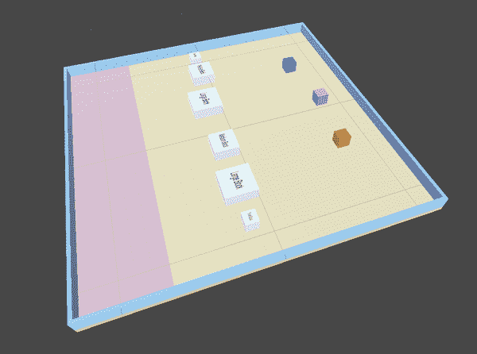

# 第九章：合作学习

在本章中，我们将进一步推进我们的仿真和强化学习，创建一个仿真环境，其中多个代理必须共同努力实现共同的目标。这些类型的仿真涉及*合作学习*，代理通常会作为一个组接收奖励，而不是个别地—包括可能没有为导致奖励的行动做出贡献的代理。

在 Unity ML-Agents 中，用于合作学习的首选训练算法和方法称为多代理后期信用分配（或简称 MA-POCA）。MA-POCA 涉及对一组代理进行集中的*评论*或*指导*训练。MA-POCA 方法意味着代理仍然可以学习他们需要做什么，即使奖励是给整个组的。

###### 提示

在合作学习环境中，如果你愿意，仍然可以给个体代理人奖励。我们稍后会简要涉及这一点。你也可以使用其他算法，或者像通常一样使用 PPO，但是 MA-POCA 具有特殊的功能，可以使合作学习更好。你可以*将一组经过 PPO 训练的代理人联合在一起*以获得类似的结果。不过我们不建议这样做。

# 合作模拟

让我们建立一个仿真环境，其中包含需要共同工作的一组代理人。这个环境有很多部分，所以请慢慢来，逐步进行，并在需要时做笔记。

我们的环境将涉及三个相同大小的代理人，以及三种不同大小的方块（总共六个）。代理人需要共同努力将目标有效地移动到目标区域，特别是大的方块，它们需要多个代理的推力。

## 在 Unity 中构建环境

创建一个新的 Unity 项目，添加 Unity ML-Agents 包，并在编辑器中打开一个新场景。我们的项目名为“Coop”。

阅读项目后，我们需要做的第一件事是创建合作学习仿真的物理元素，所以我们需要：

+   一个地板

+   一些墙壁

+   一个目标区域

+   一些不同大小的方块

+   代理人

现在我们来做这件事。

### 组装地板和墙壁

和通常一样，我们的墙壁和地板将是缩放后的立方体。在 Unity 编辑器中，执行以下操作：

1.  在 Hierarchy 中创建一个立方体，命名为“Floor”，并将其缩放为 `(25, 0.35, 25)`，使其成为一个大的正方形。

1.  在项目面板中创建一个新的材质，指定一种颜色（我们的是浅棕色），并将该材质分配给地板。

1.  在 Hierarchy 中创建四个立方体，分别命名为“Wall1,” “Wall2,” “Wall3,” 和 “Wall4,” 并将它们缩放到 `(25, 1, 0.25)`，以便足够长，覆盖每一侧的地板。

1.  将墙壁旋转并定位到地板的两侧，如图 9-1 所示。

    

    ###### 图 9-1\. 地板上的墙壁位置

1.  在项目面板中创建一个新材质，并分配一个颜色（我们使用的是浅蓝色）。将此材质分配给所有四个墙体对象。

1.  在层次结构中创建一个空的`GameObject`，命名为“墙壁”或类似名称，并将四个墙体对象作为子对象拖动到其中。

此时你的世界应该看起来像图 9-1。保存场景后，你可以继续操作。

### 添加目标

接下来我们需要一个目标区域。正如我们之前看到的，目标区域将是地板的一部分，代理器必须把块推到其中。它将被明亮地着色，以便我们作为人类在 Unity 中查看时能够看到它，并且将具有一个大的 Box Collider 体积用于代理器：

1.  在层次结构中创建一个新平面，命名为“目标”，并将其缩放到`(0.5, 1.16, 2.5)`。

1.  在项目面板中创建一个新材质，并分配一个鲜明而分散注意力的颜色（我们使用的是红色）。将此材质分配给目标。

    ###### 注意

    提醒一下，在这种情况下，代理器没有任何传感器可以告诉它目标的颜色。它根据传感器获得的信息来学习目标的位置，这部分内容将很快涵盖。它看不到颜色。颜色是给人类观察用的。

1.  将目标放置在地板上的一侧，如图 9-2 所示。

    

    ###### 图 9-2\. 目标区域

1.  在目标的检视器中，点击“编辑碰撞体”按钮，并调整目标的盒碰撞体，使其覆盖一个大的体积，如图 9-3 所示。这将用于检测当代理器成功将一块块推入目标区域时。

    

    ###### 图 9-3\. 目标的碰撞体

1.  同样，在目标的检视器中，勾选“是触发器”按钮。我们不希望代理器或块实际与目标的体积碰撞，我们只想知道它们是否在目标的体积内。

这就是关于目标区域的所有内容。现在你的场景应该看起来像图 9-4。在继续之前保存场景。


###### 图 9-4\. 带有目标的区域

### 不同尺寸的块

现在我们将为合作代理器创建一些块，推动到目标中。我们希望有三种不同类型的块，如图 9-5 所示：

+   小块

+   中等大小的块

+   大块

我们将创建每种块的副本，以便有两个每种类型的块。每种类型将获得不同的奖励金额，整个代理器组在将块推入目标时将获得这些奖励。

另外，通过物理系统，一些块会比其他块更重，这意味着代理器需要共同努力将它们推入目标，从而整个代理器组将获得更高的分数。


###### 图 9-5\. 三种类型的块

按照以下步骤创建这些块：

1.  向层级添加一个新的立方体，并命名为“小块 1”或类似的名称。我们将保持默认比例。

1.  向其检查器中的 Add Component 按钮添加一个刚体组件。

1.  按照图 9-6 的设置设置刚体组件。

    

    ###### 图 9-6\. 小块上的刚体组件

1.  复制小块 1，创建（并命名）小块 2。

    ###### 提示

    你可能注意到我们已经为我们的块添加了一个显示一些文本的画布。如果你想的话，你也可以这样做。这不与 ML 组件连接，仅供人类可见。

1.  将它们都放置在场景中，如图 9-7 所示。

    

    ###### 图 9-7\. 两个小块

1.  接下来，复制其中一个小块，并命名为“中等块 1”。

1.  将中等块 1 的比例改为`(2, 1, 2)`，使其比小块 1 稍大。

1.  使用检查器，将中等块 1 的质量在 Rigidbody 组件中设置为`100`，使其相当重。

1.  复制中等块 1，并创建（并命名）中等块 2。

1.  将两个中等块都放置在场景中，如图 9-8 所示，与小块一起。

    

    ###### 图 9-8\. 添加了中等块

1.  最后，复制其中一个中等块，并命名为大块 1。

1.  将大块 1 的比例改为`(2.5, 1, 2.5)`。

1.  使用检查器，将大块 1 的质量在 Rigidbody 组件中设置为`150`，这样它就非常重了。

1.  与小块和中等块一样，复制大块 1，创建（并命名）大块 2。

1.  在场景中将两个大块放置如图 9-9 所示，与所有其他块一起。

    

    ###### 图 9-9\. 添加了大块

现在关于块的部分就到这里了，稍后我们会回来添加一些代码。保存场景。

### 代理

这些代理非常简单，它们所有的合作行为都来自我们马上要编写的脚本，而不是编辑器设置中的任何特殊内容：

1.  在层级中创建一个新的立方体，并将其重命名为“代理 1”。保持默认比例。

1.  向其添加一个刚体组件，设置如图 9-10 所示。

    

    ###### 图 9-10\. 代理的刚体组件

1.  再次复制一次，并将两个新副本重命名为代理 2 和代理 3。

1.  创建三种新的材料——每种代理一种——颜色不同，并分配给代理。

1.  将它们放置得与我们的位置相似，如图 9-11 所示。

    

    ###### 图 9-11\. 三个代理

现在，关于代理就是这些了。接下来我们将添加一些代码，然后需要回到 Unity 场景中实现更多功能。别忘了保存场景。

## 编写代理

大部分场景已经构建完成，现在是为代理编写代码的时候了。实际上，这个代理的代码相当简单，因为很多逻辑都已经移到别的地方了——我们很快就会讲到。

对于代理，我们只需要实现以下方法：

+   `Initialize()`

+   `MoveAgent()`

+   `OnActionReceived()`

让我们开始吧：

1.  在项目窗口中创建一个新的 C#脚本资源，并命名为“合作块推动者”或类似的名称。

1.  在代码编辑器中打开新脚本，删除整个样板内容，然后添加以下导入项：

    ```
    using UnityEngine;
    using Unity.MLAgents;
    using Unity.MLAgents.Actuators;
    ```

1.  接下来，实现类的框架，确保它是从`Agent`继承而来：

    ```
    public class CoopBlockPusher : Agent
    {

    }
    ```

1.  添加一个成员变量来保存对代理`Rigidbody`的引用：

    ```
    private Rigidbody agentRigidbody;
    ```

1.  覆盖代理的`Initialize()`函数来获取对那个`Rigidbody`的引用：

    ```
    public override void Initialize() {
        agentRigidbody = GetComponent<Rigidbody>();
    }
    ```

1.  接下来，创建一个`MoveAgent()`方法：

    ```
    public void MoveAgent(ActionSegment<int> act) {

    }
    ```

    此方法接受一个数组作为参数（`act`），使用 ML-Agents 的`ActionSegment`数据结构。我们很快将在`OnActionReceived()`中调用它，传入离散动作的数组以移动代理。

    ###### 提示

    每次只会传递一个具体的离散动作，因此我们只查看数组的第一个条目。这个代理将有七种不同的可能动作（什么也不做、向一边旋转、向另一边旋转、向前、向后、向左、向右）。

1.  现在，在新方法中，将一些临时变量（用于方向和旋转）清零：

    ```
    var direction = Vector3.zero;
    var rotation = Vector3.zero;
    ```

1.  获取我们正在处理的数组的第一个（也是唯一一个）条目的引用，它表示此刻的具体动作：

    ```
    var action = act[0];
    ```

1.  现在，在这个`action`上执行`switch`：

    ```
    switch(action) {
        case 1:
            direction = transform.forward * 1f;
            break;
        case 2:
            direction = transform.forward * -1f;
            break;
        case 3:
            rotation = transform.up * 1f;
            break;
        case 4:
            rotation = transform.up * -1f;
            break;
        case 5:
            direction = transform.right * -0.75f;
            break;
        case 6:
            direction = transform.right * 0.75f;
            break;
        }
    ```

    这个`switch`语句设置了旋转或方向的一个临时变量，具体取决于传递的动作。

    ###### 注意

    到底哪个动作对应于代理的哪个实际动作，这完全是任意的。我们只是事先决定了，并坚持这样做。机器学习系统学习如何将应用于何处，并处理它。

1.  接下来，根据设置的动作实际实现旋转代理的`transform`，并为代理的`Rigidbody`施加力，分别用于旋转和方向：

    ```
    transform.Rotate(rotation, Time.fixedDeltaTime * 200f);
    agentRigidbody.AddForce(direction * 3, ForceMode.VelocityChange);
    ```

1.  对于`MoveAgent()`方法来说就是这些了，现在我们转向`OnActionReceived()`，在那里实际调用它：

    ```
    public override void OnActionReceived(ActionBuffers actionBuffers) {
        MoveAgent(actionBuffers.DiscreteActions);
    }
    ```

这只是将它接收到的`ActionBuffers`的离散部分取出，并传递给我们刚刚编写的单独的`MoveAgent()`方法。

###### 提示

我们本来可以直接将`MoveAgent()`中的代码放在`OnActionReceived()`中，但因为`OnActionReceived()`技术上是处理动作而不是具体的移动，所以调用我们的`MoveAgent()`方法更清晰，即使唯一可能的动作都与移动相关。

我们的代理代码就这些了。保存脚本，然后返回 Unity 编辑器。

## 编写环境管理器

现在我们需要制作一个脚本，该脚本将负责环境本身。这个脚本将执行一些重要的工作，以便我们可以拥有协作代理：

1.  在项目面板中创建一个新的 C#脚本资源，并命名为“CooperativeBlockPusherEnvironment”或类似的名称。

1.  打开新的脚本并删除模板内容。

1.  添加以下导入项：

    ```
    using System.Collections;
    using System.Collections.Generic;
    using Unity.MLAgents;
    using UnityEngine;
    ```

1.  创建一个类来存储其他所有内容：

    ```
    public class CoopBlockPusherEnvironment : MonoBehaviour {

    }
    ```

    这个类不需要是`Agent`的子类，而是可以直接是默认的 Unity `MonoBehaviour`的子类。

1.  创建一个类来存储所有将一起工作的代理及其起始位置：

    ```
    [System.Serializable]
    public class Agents {
        public CoopBlockPusher Agent;

     [HideInInspector]
        public Vector3 StartingPosition;

     [HideInInspector]
        public Quaternion StartingRotation;

     [HideInInspector]
        public Rigidbody RigidBody;
    }
    ```

1.  现在为它们将要推入目标的块创建一个类似的类：

    ```
    [System.Serializable]
    public class Blocks {
        public Transform BlockTransform;

     [HideInInspector]
        public Vector3 StartingPosition;

     [HideInInspector]
        public Quaternion StartingRotation;

     [HideInInspector]
        public Rigidbody RigidBody;
    }
    ```

1.  我们需要创建一个好的`int`，用来存储我们希望环境执行的最大步数，这样我们可以从编辑器轻松配置它：

    ```
    [Header("Max Environment Steps")] public int MaxEnvironmentSteps = 25000;
    ```

1.  我们还需要创建一个成员变量的集合，用于存储有用的东西的句柄，例如地面、整体区域、目标、在需要重置时检查的内容以及剩余未交付到目标的块的数量：

    ```
    [HideInInspector]
    public Bounds areaBounds;

    // The ground (we use this to spawn the things that need to be placed)
    public GameObject ground;

    public GameObject area;

    public GameObject goal;

    private int resetTimer;

    // blocks left
    private int blocksLeft;
    ```

1.  我们需要创建两个列表，一个是`Agents`，另一个是`Blocks`，使用我们刚写的类：

    ```
    // List of all the agents
    public List<Agents> ListOfAgents = new List<Agents>();

    // List of all blocks
    public List<Blocks> ListOfBlocks = new List<Blocks>();
    ```

1.  最后，我们创建一个`SimpleMultiAgentGroup`，用于将代理分组，以便它们可以共同工作：

    ```
    private SimpleMultiAgentGroup agentGroup;
    ```

    稍后会详细讨论`SimpleMultiAgentGroup`。

1.  接下来，我们需要实现一个`Start()`方法，用于在模拟即将开始时设置一切：

    ```
    void Start() {

    }
    ```

1.  在`Start()`方法内部，我们将执行所有必要的操作，以确保一切准备就绪：

    +   获取地面边界的句柄。

    +   迭代`Blocks`列表（场景中的所有块），并存储它们的起始位置、旋转和它们的`Rigidbody`。

    +   初始化一个新的`SimpleMultiAgentGroup`。

    +   迭代`Agent`s 列表（场景中的所有代理），并存储它们的起始位置、旋转和它们的`Rigidbody`，然后在我们创建的`SimpleMultiAgentGroup`上调用`RegisterAgent()`，通知它存在每个我们想要一起合作的代理。

    +   调用`ResetScene()`，我们马上就会编写这个方法。

1.  在`Start()`方法内部，添加以下代码来完成前述所有操作：

    ```
    areaBounds = ground.GetComponent<Collider>().bounds;

    foreach (var item in ListOfBlocks) {
        item.StartingPosition = item.BlockTransform.transform.position;
        item.StartingRotation = item.BlockTransform.rotation;
        item.RigidBody = item.BlockTransform.GetComponent<Rigidbody>();
    }

    agentGroup = new SimpleMultiAgentGroup();

    foreach (var item in ListOfAgents) {
        item.StartingPosition = item.Agent.transform.position;
        item.StartingRotation = item.Agent.transform.rotation;
        item.RigidBody = item.Agent.GetComponent<Rigidbody>();
        agentGroup.RegisterAgent(item.Agent);
    }

    ResetScene();
    ```

1.  接下来，我们将实现`FixedUpdate()`方法，在 Unity 中会定期调用：

    ```
    void FixedUpdate() {
        resetTimer += 1;
        if(resetTimer >= MaxEnvironmentSteps && MaxEnvironmentSteps > 0) {
            agentGroup.GroupEpisodeInterrupted();
            ResetScene();
        }

        agentGroup.AddGroupReward(-0.5f / MaxEnvironmentSteps);
    }
    ```

    在这里，我们每次增加重置计时器`1`，并检查重置计时器是否大于或等于最大环境步数（且最大环境步数大于`0`），如果是，则通过在代理组上调用`GroupEpisodeInterrupted()`中断代理组，并调用`ResetScene()`。

    如果未达到最大环境步数，我们只需在代理组上调用`AddGroupReward()`，给予组的惩罚为`-0.5`除以最大环境步数，以惩罚它的存在。希望这样可以确保代理尽快完成任务。

    `SimpleMultiAgentGroup`协调了一组代理，并允许代理共同努力以最大化分配给整个组的奖励。通常的奖励和结束事件发生在`Simple⁠M⁠u⁠l⁠t⁠i​A⁠g⁠e⁠n⁠t⁠Group`上，而不是在单个代理上。

    ###### 注意

    `SimpleMultiAgentGroup`是 Unity ML-Agent 实现的 MA-POCA 的一个特性，因此它只在使用 MA-POCA 训练代理时才起作用。

1.  现在我们将创建一个相当大的`GetRandomSpawnPos()`方法，根据需要随机放置区块和代理：

    ```
    public Vector3 GetRandomSpawnPos()
        {
            Bounds floorBounds = ground.GetComponent<Collider>().bounds;
            Bounds goalBounds = goal.GetComponent<Collider>().bounds;

            // Stores the point on the floor that we'll end up returning
            Vector3 pointOnFloor;

            // Start a timer so we have a way
            // to know if we're taking too long
            var watchdogTimer = System.Diagnostics.Stopwatch.StartNew();

            do
            {
                if (watchdogTimer.ElapsedMilliseconds > 30)
                {
                    // This is taking too long; throw an exception to bail
                    // out, avoiding an infinite loop that hangs Unity!
                    throw new System.TimeoutException
                        ("Took too long to find a point on the floor!");
                }

                // Pick a point that's somewhere on the top face of the floor
                pointOnFloor = new Vector3(
                    Random.Range(floorBounds.min.x, floorBounds.max.x),
                    floorBounds.max.y,
                    Random.Range(floorBounds.min.z, floorBounds.max.z)
                );

                // Try again if this point is inside the goal bounds
            } while (goalBounds.Contains(pointOnFloor));

            // All done, return the value!
            return pointOnFloor;
        }
    ```

1.  接下来，我们将创建一个`ResetBlock()`方法，接受一个我们之前创建的`Blocks`类型，并给它一个随机的生成位置（使用我们之前编写的`GetRandomSpawnPos()`方法），将速度和角速度设为零：

    ```
    void ResetBlock(Blocks block) {
        block.BlockTransform.position = GetRandomSpawnPos();

        block.RigidBody.velocity = Vector3.zero;

        block.RigidBody.angularVelocity = Vector3.zero;
    }
    ```

1.  现在我们需要一个方法，用于记录代理或代理组成功将区块交付到目标的时候：

    ```
    public void Scored(Collider collider, float score) {
        blocksLeft--;

        // check if it's done
        bool done = blocksLeft == 0;

        collider.gameObject.SetActive(false);

        agentGroup.AddGroupReward(score);

        if (done) {
            // reset everything
            agentGroup.EndGroupEpisode();
            ResetScene();
        }
    }
    ```

    这可能看起来有点神秘，但实际上我们的`Scored()`方法接受一个`Collider`和一个`float`（表示分数），因为这个方法只有在区块确实被交付到目标时才被调用，它：

    +   将剩余区块的计数减少`1`

    +   检查是否剩余`0`个区块，如果是，则将名为`done`的布尔值设置为`true`

    +   停用传入的`Collider`所属的游戏对象（换句话说，消除推入目标的区块）

    +   向`SimpleMultiAgentGroup`添加奖励，根据传入的分数

    +   然后检查`done`的布尔值是否为`true`，如果是，则在`SimpleMultiAgentGroup`上调用`EndGroupEpisode()`，然后调用`ResetScene()`

1.  接下来，我们将创建一个快速的辅助方法来返回一个随机旋转：

    ```
    Quaternion GetRandomRot() {
        return Quaternion.Euler(0, Random.Range(0.0f, 360.0f), 0);
    }
    ```

1.  而且，对于环境脚本，我们将编写经常调用的`ResetScene()`：

    ```
    public void ResetScene() {
        resetTimer = 0;

        var rotation = Random.Range(0,4);
        var rotationAngle = rotation * 90f;
        area.transform.Rotate(new Vector3(0f, rotationAngle, 0f));

        // first reset all the agents
        foreach (var item in ListOfAgents) {
            var pos = GetRandomSpawnPos();
            var rot = GetRandomRot();

            item.Agent.transform.SetPositionAndRotation(pos,rot);
            item.RigidBody.velocity = Vector3.zero;
            item.RigidBody.angularVelocity = Vector3.zero;
        }

        // next, reset all the blocks
        foreach (var item in ListOfBlocks) {
            var pos = GetRandomSpawnPos();
            var rot = GetRandomRot();

            item.BlockTransform.transform.SetPositionAndRotation(pos,rot);
            item.RigidBody.velocity = Vector3.zero;
            item.RigidBody.angularVelocity = Vector3.zero;
            item.BlockTransform.gameObject.SetActive(true);
        }

        blocksLeft = ListOfBlocks.Count;
    }
    ```

    这个函数：

    +   将`resetTimer`设回`0`。

    +   然后旋转整个区域，这样目标不总是在同一侧。

    +   迭代`ListOfAgents`中的所有`Agent`，使用我们的辅助方法给它们随机位置和随机旋转，并将它们的速度和角速度设为零。

    +   迭代`ListOfBlocks`中的所有`Block`，使用我们的辅助方法给它们随机位置和随机旋转，将它们的速度和角速度设为零，并激活它们。

###### 提示

我们将每个区块设置为活动状态，因为它们可能在重置后从非活动状态回来，因为模拟可能已经运行，并且一些区块可能已经被推入目标（根据之前的代码，这意味着它们被设置为非活动状态）。

环境管理脚本到此结束。保存并返回 Unity。

## 编码区块

我们需要完成的最后一部分编码是区块本身：

1.  在项目面板中创建一个新的 C#脚本资产，并命名为“GoalScore”或类似的名称。

1.  在代码编辑器中打开脚本并删除样板内容。

1.  添加以下导入：

    ```
    using System.Collections;
    using System.Collections.Generic;
    using UnityEngine;
    using UnityEngine.Events;
    ```

1.  实现一个名为`GoalScore`的类，它是 Unity 默认`MonoBehaviour`的子类：

    ```
    public class GoalScore : MonoBehaviour
    {

    }
    ```

1.  内部，添加一些成员变量以存储我们要检测的特定 Unity 标签，推送该脚本将附加到的特定块的价值，并且块的`Collider`：

    ```
    public string tagToDetect = "goal"; //collider tag to detect

    public float GoalValue = 1;

    private Collider blockCollider;
    ```

1.  接下来，在`GoalScore`类内部实现名为`TriggerEvent`的类，如下所示：

    ```
    [System.Serializable]
    public class TriggerEvent : UnityEvent<Collider, float>
    {
    }
    ```

    需要使用 Unity 的事件系统来使用这个类。稍后会详细介绍。

1.  在`TriggerEvent`类之后，但仍然在`GoalScore`类内部，添加以下触发回调函数：

    ```
    [Header("Trigger Callbacks")]
    public TriggerEvent onTriggerEnterEvent = new TriggerEvent();
    public TriggerEvent onTriggerStayEvent = new TriggerEvent();
    public TriggerEvent onTriggerExitEvent = new TriggerEvent();
    ```

    这些表示某物进入所讨论对象的碰撞体、停留在其中和退出其中的事件。

1.  现在，创建每个这些被调用的函数：

    ```
    private void OnTriggerEnter(Collider col)
    {
        if (col.CompareTag(tagToDetect))
        {
            onTriggerEnterEvent.Invoke(blockCollider, GoalValue);
        }
    }

    private void OnTriggerStay(Collider col)
    {
        if (col.CompareTag(tagToDetect))
        {
            onTriggerStayEvent.Invoke(blockCollider, GoalValue);
        }
    }

    private void OnTriggerExit(Collider col)
    {
        if (col.CompareTag(tagToDetect))
        {
            onTriggerExitEvent.Invoke(blockCollider, GoalValue);
        }
     }
    ```

这些每个都映射到我们创建的触发回调之一，接受一个`Collider`，如果该`Collider`具有我们要查找的标签（这在我们之前创建的某些成员变量中定义），则触发回调事件，传递`Collider`和`GoalValue`（这是我们刚刚创建的某个成员变量之一）。

保存脚本，并返回 Unity。

## 完成环境和代理的最后配置

我们已经编写了三个脚本，现在我们需要将它们连接起来。

首先，进行以下操作：

1.  从 Project 窗口中的代理脚本拖动到 Hierarchy 中的每个代理上（总共三个代理）。

1.  从 Project 窗口中的环境脚本拖动到 Hierarchy 中的环境（父对象）上。

1.  并且从 Project 窗口中的 GoalScore 脚本拖动到 Hierarchy 中的每个块上（总共六个块）。

接下来，我们需要配置所有内容。我们将从代理开始。对每个 Hierarchy 中的代理执行以下操作：

1.  选择代理，并使用 Inspector 添加一个行为参数组件。

1.  配置行为参数组件如图 9-12 所示。

    

    ###### 图 9-12\. 已配置的行为参数组件

1.  使用 Inspector 向代理添加决策请求器组件，保留其设置为默认值。

1.  使用 Inspector 向代理添加刚体传感器组件，确保将根体分配为代理的刚体组件，将虚拟根分配为代理本身，并按照图 9-13 中显示的方式勾选框。

    

    ###### 图 9-13\. 刚体传感器组件

1.  接下来，在 Hierarchy 中的代理中添加一个空的子对象，并命名为“网格传感器”或类似的名称。

1.  在 Hierarchy 中的代理的网格传感器子对象上选择，并使用其 Inspector 中的“添加组件”按钮添加网格传感器组件。

1.  使用 Inspector 配置网格传感器组件如图 9-14 所示。

    

    ###### 图 9-14\. 已配置的网格传感器组件

网格传感器组件创建一个网格传感器。网格传感器是一种非常灵活的传感器，它围绕代理创建一个网格形状，并根据它设置为查找的对象类型（由标签定义），在代理周围的顶部视角的特定单元格中检测对象的存在。所选代理附加的网格传感器示例显示在图 9-15 中。

###### 注意

Eidos，视频游戏开发工作室，[向 Unity ML-Agents 项目贡献了网格传感器组件](https://oreil.ly/ryu3F)。网格传感器将射线投射数据提取的通用性与卷积神经网络（CNNs——处理图像的神经网络）的计算效率结合起来。网格传感器通过查询物理属性收集模拟数据，然后将数据结构化为“高度 x 宽度 x 通道”的矩阵。这个矩阵在很多方面类似于图像，并且可以输入到 CNN 中。另一个好处是，网格可以比实际图像具有更低的分辨率，这可以提高训练时间。


###### 图 9-15\. 网格传感器组件的操作

接下来，对层次结构中的每个块执行以下操作：

1.  选择块，并使用检视器将目标分数组件（我们刚刚编写并拖动到其上的脚本）设置为检测带有“goal”标签的物体。

1.  设置适当的目标值：小块为 1，中块为 2，大块为 3。

1.  接下来，单击触发回调部分下方的 + 按钮，并将下拉列表设置为仅运行时，如图 9-16 所示。

    

    ###### 图 9-16\. 仅设置为运行时

1.  从层次结构中拖动环境对象到下拉列表下方的字段中，然后将右侧的下拉列表设置为指向我们先前创建的环境脚本中的`Scored()`方法，如图 9-17 所示。

    

    ###### 图 9-17\. 选择`Scored()`方法

接下来，对环境父对象执行以下操作：

1.  在层次结构中选择环境父对象。

1.  在其检视器中，在属于我们编写并拖动的脚本的环境组件下，将最大环境步骤设置为`5000`。

1.  然后将地板、环境父对象和目标拖入相应的字段中，如图 9-18 所示。

    

    ###### 图 9-18\. 配置环境

1.  更新组件中显示的代理列表以包含`3`，并拖入每个三个代理，如图 9-19 所示。

    

    ###### 图 9-19\. 代理列表

1.  更新组件中显示的块列表以包含`6`，并拖入每个六个块，如图 9-20 所示。

    

    ###### 图 9-20\. 块列表

就这样！保存场景。

# 为合作进行培训

几乎是时候训练我们的合作环境了。通常，首先我们需要创建一个 YAML 文件：

```
behaviors:
  CoopBlockPush:
    trainer_type: poca
    hyperparameters:
      batch_size: 1024
      buffer_size: 10240
      learning_rate: 0.0003
      beta: 0.01
      epsilon: 0.2
      lambd: 0.95
      num_epoch: 3
      learning_rate_schedule: constant
    network_settings:
      normalize: false
      hidden_units: 256
      num_layers: 2
      vis_encode_type: simple
    reward_signals:
      extrinsic:
        gamma: 0.99
        strength: 1.0
    keep_checkpoints: 5
    max_steps: 15000000
    time_horizon: 64
    summary_freq: 60000
```

现在，将其保存在某个地方！要运行训练，请启动您的终端并运行以下内容：

```
mlagents-learn CoopBlockPush.yaml --run-id=BlockCoop1
```

就这样。您的训练可能需要几个小时——在我们的测试 MacBook Pro 上，花了大约 18 小时才达到某个位置。

拿到生成的 *.onnx* 文件，将其拖入 Unity 中的项目面板，然后分配到所有代理人的适当字段中，如 图 9-21 所示，并运行您的模拟以观察您的小伙伴代理共同推动方块。


###### 图 9-21\. 该模型附加到代理人上

# 合作代理或一个大代理

有时很难概念化您可能希望采用合作多代理方法的情况，在这种方法中，每个代理都是真正独立的，但它们通过本章讨论的系统受到奖励和指导，而不是制作一个在模拟中表现为各种实体的单个代理。

换句话说，您可以通过制作一个在世界中有三个立方体实体的单个“巨大”代理来复制您在此处构建的模拟的行为。

制作单独的代理通常更容易，因为每个代理将有一个更简单的模型，这将导致更可靠的训练，并且您将更快地收敛于解决方案。每个代理的模型中存储的神经网络比理论上的巨大代理要小得多，并且行为更可预测，可能也更可靠。但是，是的，您可以制作一个巨大的代理。

###### 注意

一个代理人与其他代理人“合作”与孤立代理人没有任何不同，因为不同代理人之间不能进行通信（它们不能共享意图，关于其他代理人状态的信息只能通过对它们的外部观察得到）。存在于模拟中的其他代理人只是这个代理人必须考虑和观察的环境的另一部分——尽管可能是一个潜在混乱的部分。

一个合法的个体集合，但协作学习代理人的问题空间，而不是一个巨大代理人的部分，比试图处理其控制下实体之间可能发生的指数级交互的单个代理人小得多。因此，如果需要的话，通常最好制作一个协作集合的代理人。

###### 提示

如果您想更详细地探索合作代理，请查看 [Unity 的精彩躲避球环境](https://oreil.ly/BETZi)。
