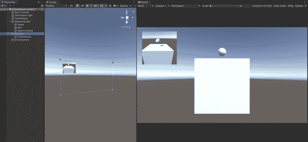

# 第十章：在模拟中使用相机

现在是时候获得一些真正的视觉了。我们不是指闪亮的机器人，而是指相机（还有灯光和行动）。在这一章中，我们将看看如何使用一台相机将你的模拟世界作为代理的观察结果。

你不再需要通过代码向代理输入数字或从传感器输入观测结果！相反，你将受限于你选择设置的相机能够看到的内容。（从技术上讲，这也是数字，但我们离题了。）

# 观察结果和相机传感器

到目前为止，我们使用的所有观察结果基本上都是数字——通常是`Vector3`——我们通过`CollectObservations`方法向代理提供，或者通过某种类型的传感器收集，观察环境来测量事物，或者使用基于网格的观察结果进行二维空间表示。

我们在`Agent`中要么实现了`CollectObservations()`，并传入了向量和其他形式的数字，要么在 Unity 编辑器中向代理添加了组件，这些组件在幕后创建了射线投射（完美的激光用于测量距离和其击中的内容），并自动将这些数字传递给 ML-Agents 系统。

还有另一种方法可以向我们的代理提供观测结果：通过使用`CameraSensor`和`RenderTextureSensor`。这些允许我们传递图像信息，以 3D 张量的形式，给代理策略的卷积神经网络（CNN）。所以，基本上是更多的数字。但从我们的角度来看，这是一幅*图片*。

###### 提示

[卷积神经网络](https://oreil.ly/kPfSW)通常用作描述处理图像的任何形式的神经网络的术语。

使用图像作为观察结果允许代理从图像中的空间规律中学习，以形成策略。

###### 提示

你可以将视觉观察结果与已经使用的向量观察结果结合起来。我们稍后再讨论这个。

广义上说，向你的代理添加`CameraSensor`非常简单，和在 Unity 中的许多其他操作一样，涉及在检视面板中添加一个组件。

我们马上就会通过一个完整的例子来详细讨论，但典型的步骤如下：

1.  在 Unity 编辑器中，定位到场景层次结构中的代理并选择它。

1.  在代理的检视面板中，使用“添加组件”按钮添加一个相机传感器组件。

1.  在添加的相机传感器组件中，将相机（从层次结构中的任何相机）分配给相机字段。

1.  你还可以为相机传感器命名，并指定宽度、高度以及神经网络处理的图像是否为灰度。

###### 注意

每个传感器组件（无论是相机还是其他）必须在每个代理上具有唯一的传感器名称。

我们很快会回到相机传感器，并讨论如何连接相机到其中。

###### 提示

当难以用向量数值化表示您希望代理程序处理的状态时，视觉观察是很有用的，但可能会使您的代理训练速度变慢。

# 构建仅相机代理

为了演示相机传感器的使用，本章的活动是创建一个非常简单的模拟，仅依赖于相机进行观察。

我们即将构建的模拟是一个立方体代理（亲爱的读者，它存在于虚空中），必须在其顶部保持一个球（也称为球，但不是代理球）平衡。

首先，像以前做过几次一样，在 Unity 中创建一个新的空项目，并导入 ML-Agents 包。然后，在一个新场景中，执行以下操作：

1.  在层次结构中创建一个新的立方体，并命名为“代理”。

1.  在层次结构中创建一个新的球体，并命名为“球”。

1.  将代理立方体的比例设置为`(5, 5, 5)`。

1.  将球体移动到代理上方，如图 10-1 所示。大致位置即可；您只需让球在立方体上方的空间中浮动即可。

    

    ###### 图 10-1\. 立方体上方的球

1.  接下来，在层次结构中创建一个新的空对象，命名为“平衡球”，并将代理和球拖到其下作为子对象。这代表整个模拟环境。

目前就这些了。我们保证我们正在做某些事情。

## 编写仅相机代理的代码

现在，我们将编写驱动我们简单代理的代码。要开始编码，像往常一样，在项目视图中创建一个新的脚本资产作为代理的组件。我们将其命名为“BalancingBallAgent”。双击项目视图中的新资产文件以在您的代码编辑器中打开它。

当您在代码编辑器中打开文件后，请按照以下步骤操作：

1.  添加以下导入，以便获取 Unity 所需的所有部分：

    ```
    using UnityEngine;
    using Unity.MLAgents;
    using Unity.MLAgents.Actuators;
    using Unity.MLAgents.Sensors;
    using Random = UnityEngine.Random;
    ```

    我们显然需要从 ML-Agents 中获取大量内容，但我们也想要 Unity 的随机数系统，以便我们可以生成随机数。

1.  接下来，删除为您提供的整个类，并替换为：

    ```
    public class BalancingBallAgent : Agent
    {

    }
    ```

    请注意，您需要确保类名与您创建的资产文件相同。当然，它将从`Agent`继承。

1.  添加一些成员变量，一个用于存储作为球体的`GameObject`引用，另一个用于该球体的`Rigidbody`：

    ```
    public GameObject ball;
    Rigidbody ball_rigidbody;
    ```

1.  接下来，覆盖`Initialize()`方法，这来自`Agent`，在代理首次启用时调用一次：

    ```
    public override void Initialize()
    {
        ball_rigidbody = ball.GetComponent<Rigidbody>();
    }
    ```

    在`Initialize()`内部，我们获取球体的`Rigidbody`的句柄，并可以进行其他设置（但目前不需要）。

1.  覆盖`Heuristic()`方法，这也来自`Agent`，允许我们手动控制代理：

    ```
    public override void Heuristic(in ActionBuffers actionsOut)
    {
        var continuousActionsOut = actionsOut.ContinuousActions;
        continuousActionsOut[0] = -Input.GetAxis("Horizontal");
        continuousActionsOut[1] = Input.GetAxis("Vertical");
    }
    ```

    像往常一样，`Heuristic()`允许代理使用自定义启发式选择动作。这意味着您可以提供一些与任何机器学习分开的自定义决策逻辑。最常见的用途是由人类提供对代理的手动控制，这正是我们在这里所做的。我们将用它来测试代理，而不是训练它，尽管（这次我们不进行 IL 或 GAIL）。

    到目前为止，如果你按顺序阅读本书，我们的代码应该对你来说已经很熟悉了，但本质上它：

    +   获取传递给该方法的`ActionBuffers`的连续部分。

    +   获取连续动作数组中的第一个条目，并将水平输入的负值赋给它。

    +   获取连续动作数组中的第二个条目，并将垂直输入的值赋给它。

        ###### 注意

        有关 Unity 输入管理器的信息，请查阅[Unity 文档](https://oreil.ly/WOjxC)。

1.  接下来，我们将实现`Agent`中的`OnEpisodeBegin()`函数：

    ```
    public override void OnEpisodeBegin()
    {
        gameObject.transform.rotation = new Quaternion(0f, 0f, 0f, 0f);
        gameObject.transform.Rotate
            (new Vector3(1, 0, 0), Random.Range(-10f, 10f));
        gameObject.transform.Rotate
            (new Vector3(0, 0, 1), Random.Range(-10f, 10f));
        ball_rigidbody.velocity = new Vector3(0f, 0f, 0f);
        ball.transform.position = new Vector3
            (Random.Range(-1.5f, 1.5f), 4f, Random.Range(-1.5f, 1.5f))
            + gameObject.transform.position;
    }
    ```

    在这个函数中，我们需要做的是在训练周期开始时设置代理和环境。对于我们的平衡球代理，我们需要：

    +   将代理的旋转设置为默认位置。

    +   在 x 轴上随机旋转代理，在`-10`到`10`之间。

    +   在 z 轴上随机旋转代理，在`-10`到`10`之间。

    +   将球的`Rigidbody`速度设为零。

    +   将球本身的位置随机设置在 x 轴和 z 轴之间的`-1.5`到`1.5`之间，并且在 y 轴上为`4`（这大致是您之前放置的高度），这样它始终位于代理的正上方，但是在不同的位置上。

1.  最后，对于代码，我们实现`OnActionReceived()`。我们将分段实现，因为这是相当多的代码。首先，我们将实现框架：

    ```
    public override void OnActionReceived(ActionBuffers actionBuffers)
    {
        var action_z = 2f *
            Mathf.Clamp(actionBuffers.ContinuousActions[0], -1f, 1f);
        var action_x = 2f *
            Mathf.Clamp(actionBuffers.ContinuousActions[1], -1f, 1f);
    }
    ```

    该方法被调用以允许代理执行一些动作。它执行的操作基于传入的`ActionBuffers`的内容。

    ###### 提示

    `Agent`系统中的`ActionBuffers`位元特别来自我们之前导入的`Unity.MLAgents.Actuators`组件的连续部分。

    到目前为止，我们实现了一些临时变量来保存我们代理的 z 轴和 x 轴动作。具体来说，我们使用了`Clamp`，并传入了连续动作组件的每个部分的内容，将其限制在`-1`到`1`之间，然后将结果乘以 2 以增强效果。

    ###### 注意

    我们在这里使用的`Clamp`函数，在过去的几次使用中，接受一个值（在本例中来自`ActionBuffers`数组），如果它在后续的两个值之间（在本例中为`-1`和`1`），则返回该值。否则，如果初始值小于它，则返回较小的值；如果初始值大于它，则返回较大的值。

1.  接下来，在这个初始代码下方但仍在`OnActionReceived()`内，添加：

    ```
    if ((gameObject.transform.rotation.z < 0.25f && action_z > 0f) ||
        (gameObject.transform.rotation.z > -0.25f && action_z < 0f))
    {
        gameObject.transform.Rotate(new Vector3(0, 0, 1), action_z);
    }

    if ((gameObject.transform.rotation.x < 0.25f && action_x > 0f) ||
        (gameObject.transform.rotation.x > -0.25f && action_x < 0f))
    {
        gameObject.transform.Rotate(new Vector3(1, 0, 0), action_x);
    }
    ```

    此代码检查我们代理的旋转的 z 轴是否小于`0.25`，并且传入的 z 轴动作是否大于`0`，或者我们代理的旋转的 z 轴是否大于`-0.25`，并且传入的 z 轴动作是否小于`0`。如果其中任一条件为真，则调用[`Rotate`](https://oreil.ly/VpVXb)，请求按照我们早些时候创建的`action_z`变量中指定的数量在 z 轴上旋转。

    接下来，我们对 x 轴执行相同的操作。

1.  接下来，在方法内部，在刚刚编写的代码下面，添加以下内容：

    ```
    if ((ball.transform.position.y - gameObject.transform.position.y) < -2f ||
        Mathf.Abs
         (ball.transform.position.x - gameObject.transform.position.x) > 3f ||
        Mathf.Abs
         (ball.transform.position.z - gameObject.transform.position.z) > 3f)
    {
        SetReward(-1f);
        EndEpisode();
    }
    else
    {
        SetReward(0.1f);
    }
    ```

    此代码检查球在 y 轴上的位置与代理在 y 轴上的位置之差是否小于`-2`，或者类似地在 x 和 z 轴上检查差值是否大于`3`。为什么？任何这些情况可能表明球已经离开了代理的顶部并掉下去或者做了其他奇怪的事情。这意味着模拟应该结束本轮，并且代理应该收到处罚（在这种情况下是`-1`）。

    否则，作为小奖励，球很可能仍然在代理的顶部表面，一切都很顺利，提供了`0.1`的奖励。

就这些代码！在切换回 Unity 编辑器之前别忘了保存。

## 为代理添加新摄像头

接下来，我们需要为代理添加一个额外的摄像头，用作其观察。我们将通过在 Unity 编辑器中向场景中添加对象来实现这一点。摄像头默认情况下不是由您编写的，它们是我们向 Unity 世界添加的物理但不可见的东西。

摄像头确实有坐标（即它们有一个`transform`），我们可以在 Unity 编辑器中看到它们（这帮助我们定位它们和它们的朝向），但是如果在场景中有两个相互对视的摄像头，它们不会“看见”对方。这并不存在实体物理。

要添加摄像头，请按照以下步骤进行：

1.  在层级视图中使用，将一个新摄像头创建为平衡球对象（代理和球的父级）的子对象，如图 10-2 所示。

    

    ###### 图 10-2\. 添加新摄像头

1.  将新摄像头重命名为合适的名称，比如“代理摄像头”。

1.  将新的代理摄像头定位，使其朝向代理和球，如图 10-3 所示。

    ###### 注意

    场景中已经有一个摄像头，因为每个场景都会有一个。不要移除它。这是您作为人类观看模拟运行的摄像头。

    

    ###### 图 10-3\. 调整新代理摄像头的位置

1.  在层级视图中选择代理，并使用“添加组件”按钮添加一个摄像机传感器组件。

1.  现在，使用检视面板将新代理摄像头分配给摄像机传感器组件中的摄像机字段，如图 10-4 所示。

    

    ###### 图 10-4\. 分配摄像头

1.  在代理检视器中的“球体”字段中分配层级中的球体对象，如图 10-5 所示。

    

    ###### 图 10-5\. 在脚本中分配球

1.  使用“添加组件”按钮，确保已将决策请求器和行为参数组件附加到代理上。

1.  确保你的行为参数组件在向量观察中具有`0`的空间大小（即没有观察），并具有`2`个连续动作。

1.  你还需要为这个行为命名。我们建议使用“平衡球”或类似的名称。

需要添加相机的全部操作都已完成。在继续之前保存你的场景。

## 查看代理相机所见内容

有几种方法可以查看代理相机的视图。第一种方法非常明显，你可能已经通过它来适当地定位相机：

1.  在层级中选择代理相机。

1.  场景视图将在右下角显示相机所见的预览，如图 10-6 所示。

    

    ###### 图 10-6\. 显示代理相机视图

    你还可以创建一个视图，展示特殊代理相机的视图，并在游戏视图的顶部显示，如图 10-7 所示。

    

    ###### 图 10-7\. 特殊视图显示新相机的视图

1.  在 Unity 编辑器中创建此视图，可以在项目视图中创建一个新的自定义渲染纹理资源，如图 10-8 所示。

    

    ###### 图 10-8\. 创建一个自定义渲染纹理资源

1.  设置如图 10-9 所示。默认设置应该是正确的。

    

    ###### 图 10-9\. 新的渲染纹理资源

1.  给它一个合理的名称，比如“cameraRenderTexture”。

1.  在层级中选择代理相机，在其检视器中的目标纹理字段中，分配刚刚创建的渲染纹理资源，如图 10-10 所示。

    

    ###### 图 10-10\. 分配给代理相机的渲染纹理资源

    ###### 提示

    渲染纹理是一个游戏开发术语，在所有游戏引擎中都很常见，由引擎创建并在运行时更新。因此，渲染纹理在你希望将场景中相机的视图放置在场景中或在场景顶部显示时非常有用。例如，在视频游戏中，常用于显示游戏内屏幕的内容：屏幕视图是一个渲染纹理，显示了摄像机在场景其他位置（玩家视角之外）看到的内容。了解更多关于渲染纹理的内容，可以参考[Unity 文档](https://oreil.ly/HkqTA)。

1.  接下来，在层级中创建一个画布，如图 10-11 所示，保持所有默认设置。

    

    ###### 图 10-11. 在层次结构中创建画布

[画布](https://oreil.ly/OtlT6)是 Unity 提供的用于屏幕渲染的对象；这意味着它通常用于显示位于场景顶部的事物（屏幕与场景），如用户界面。我们将使用它来制作一个简易的非交互界面：显示摄像机所见的内容。

1.  作为画布的子对象，在层次结构中添加一个空对象并命名为“摄像机视图”或类似的名称，如图 10-12 所示。

    

    ###### 图 10-12. 层次结构，显示新画布和摄像机视图

1.  在此新对象的检视器中，使用“添加组件”按钮并添加一个原始图像组件。

1.  然后，将您之前创建的渲染纹理资产（从项目视图中）分配给原始图像组件的纹理字段，如图 10-13 所示。

    

    ###### 图 10-13. 将纹理分配给原始图像组件

1.  现在，使用矩形工具（如图 10-14 所示），在场景视图中调整原始图像组件的大小并将其放置在角落里，如图 10-15 所示。

    

    ###### 图 10-14. 矩形工具

    

    ###### 图 10-15. 将原始图像组件放置在角落里

现在当您运行模拟时，您将会看到主摄像机的视图和代理摄像机的小视图，就像往常一样。您可以使用此技术为您自己对任何您创建的模拟添加视图。即使代理不使用摄像机，也没有阻止您添加摄像机以捕捉不同的视角。

# 训练基于摄像机的代理

要训练代理，您通常需要一个用于超参数的 YAML 文件（你会说：“这真是个巨大的惊喜！”）。这是我们建议使用的文件，但请随意尝试：

```
behaviors:
  BalancingBall:
    trainer_type: ppo
    hyperparameters:
      batch_size: 64
      buffer_size: 12000
      learning_rate: 0.0003
      beta: 0.001
      epsilon: 0.2
      lambd: 0.99
      num_epoch: 3
      learning_rate_schedule: linear
    network_settings:
      normalize: true
      hidden_units: 128
      num_layers: 2
      vis_encode_type: simple
    reward_signals:
      extrinsic:
        gamma: 0.99
        strength: 1.0
    keep_checkpoints: 5
    max_steps: 500000
    time_horizon: 1000
    summary_freq: 12000
```

使用准备好的 YAML 文件后，通过在命令行上执行`mlagents-learn`来运行训练：

```
mlagents-learn BalancingBall.yaml --run-id=Ball1
```

###### 警告

您在代理的行为参数组件上的行为名称需要像往常一样与 YAML 文件中的行为名称匹配。

仅使用视觉观察进行训练将比使用向量观察进行训练需要更长的时间。我们的训练过程，使用前述的 YAML 文件，在最近的 MacBook Pro 上大约花费了两个小时。

当训练完成时，使用生成的*.onnx*文件来运行您的代理，看看效果如何。

###### 提示

探索将视觉观察与向量和其他观察类型结合使用。看看是否可以将它们结合起来以快速训练代理。

# 摄像机和您

一直使用摄像机并把它们用于所有事情非常诱人。我们明白！它们很令人兴奋，给您的代理虚拟眼睛并让它们解决您可能需要解决的任何问题，这种感觉有点神奇。但这很少是最佳的方法。

当你在构建一个模拟仿真，这个仿真代表*某个*你随后可能在现实世界中建造的东西时，摄像头显然是最有用的。当那*某个*东西实际上会使用摄像头时，比如构建一个复杂的自动驾驶汽车、无人机或者拾取放置机器人的仿真，并且计划在实际中使用你生成的模型的一部分或全部时，使用摄像头当然是有道理的。

###### 注意

如果一个代理程序**仅仅**配备了摄像头，那就像一个只有视觉信息的人类一样——只能接收到我们环境的视觉信息是一个非常复杂的问题。它更好地与其他感官输入配对或互补。代理程序通常有一些动作的目标，但不一定会在物理上改变环境。经常有一些代理程序可以执行的动作不会改变摄像头的输入，这意味着它们可能不会因为环境中没有**可见**的状态变化而得到任何反馈。如果代理程序仅仅接收视觉观察结果，那么它需要知道由于它的动作而环境发生了*某种*变化（除了其奖励以外）。

如果你在建造一个纯粹用于模拟的东西，那么在使用摄像头时应该要审慎选择。通常情况下，同时使用摄像头和矢量观察来观察模拟中的相同元素是比较不寻常的，但也有一些情况是合理的：矢量可能会为摄像头增加背景信息，或者提供关于环境的额外信息，这些信息仅从摄像头中无法获取。

例如，如果你正在建造一个拾取放置机器人，它通过摄像头可以看到放在它前面的一袋面条，那么同时使用一个射线投射观察来检测并识别被标记的面条袋，似乎有些奇怪。仅仅图像识别系统就足以处理识别面条袋的任务，而来自射线投射的额外信息，在最好的情况下是多余的，在最坏的情况下，会妨碍训练过程。

基本上，如果你的代理程序在引擎之外（在现实世界中）使用，你应尽可能地模仿它实际上会有的输入；如果你在进行的是纯虚拟的活动，你可以给它一个摄像头，这样可以得到计算机视觉模型作为结果。

你可以给任何代理程序配备摄像头。但这并不意味着它一定会有用。任何不能为代理程序提供更多关于如何实现其目标的信息的观察结果只会让事情变得复杂，导致神经网络的训练变得更慢更困难。你应该尽可能地减少观察结果。

相机非常有趣，当你探索制作自己的模拟时，你绝对应该和它们玩耍。但是当事情变得严肃时，你要小心不要使用过多的相机，或者不要仅仅依赖相机，如果有更好的选择的话。
