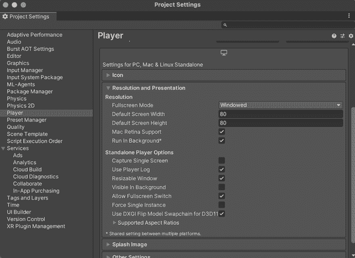

# 第十一章：使用 Python 进行工作

在本章中，我们将探索更多使用 Unity 的 ML-Agents 与 Python 结合的可能性。迄今为止，我们所做的一切都集中在 Unity 和（通过 ML-Agents）Python 的组合上，但我们采取了 Unity 为中心的通过 ML-Agents）Python 的组合上，但我们采取了以 Unity 为中心的方法。

本章将介绍几种从 Python 中心化方法完成任务的方式。具体来说，我们将探讨如何使用 Python 与 Unity 和 ML-Agents 交互。

# Python 无处不在

我们在整本书中一直在使用 Python，但我们还使用了一个运行训练并将其连接到 Unity 的脚本。深层次来看，PyTorch 也被用于训练。除此之外，并不重要我们使用的是 Python。碰巧我们运行的脚本是由 Python 提供支持的。这可能是任何语言。

在本章中，我们将更多地使用 Python，并掌握将 Python 与 ML-Agents 结合生成的能力，超越提供的脚本。我们将证明，当您运行 `mlagents-learn` 来训练一个代理时，实际上是在使用 Python，并稍微超出提供的脚本。

在本章中，我们将主要探讨 Python 中的 GridWorld 环境，这是一个简单的 3x3 网格，代理是一个蓝色的正方形，需要触碰绿色的 + 号，但不能触碰红色的 x 号。它采用纯视觉观测系统：一个朝向网格的摄像头。

它的动作是五个离散选项之一：

+   什么也不做

+   向上移动

+   向下移动

+   向右移动

+   向左移动

如果代理触碰到目标（绿色加号），奖励`1.0`，如果触碰到红色 x，惩罚`-1.0`。每步还会有一个存在惩罚`-0.01`。

您可以在 图 11-1 中看到 GridWorld 的样子。


###### 图 11-1。GridWorld，数字前沿

# 尝试环境

要使用 Python，自然需要设置一个新的 Python 环境。这几乎与我们在“设置”中使用的 Python 环境完全相同，只有一些小的区别。

为了准备好，您需要完成以下步骤：

1.  按照 “设置” 中的说明，设置一个新的 Python 环境。

1.  配置完成后，按照以下规格安装一些额外的内容。首先，安装 matplotlib：

    ```
    pip install matplotlib
    ```

    我们将使用 matplotlib 在屏幕上展示一些图像，同时探索 Python 和 ML-Agents。这本书不涵盖 matplotlib 的详细讨论，但如果你搜索 O'Reilly 的学习平台或 DuckDuckGo，会有大量资料。还有一个[网站](https://matplotlib.org)。

1.  接下来，安装 Jupyter Lab：

    ```
    pip install jupyterlab
    ```

1.  点   启动 Jupyter Lab：

    ```
    jupyterlab
    ```

    Jupyter Lab 是一个创建“笔记本”的工具，它允许您以易于运行和编写的形式执行 Python。它通常用于科学计算，您可能已经接触过它，例如 Jupyter Notebooks、IPython 或 Google 的品牌版本 Google Colab。

1.  一旦运行，创建一个空白的笔记本，如 图 11-2 所示。

    

    ###### 图 11-2\. 空白的 Jupyter 笔记本

就这样。

接下来，我们将开始编码，并且我们将在进行时解释情况：

1.  立即，我们需要导入 ML-Agents：

    ```
    import mlagents
    ```

    这将在我们的笔记本中引入基于 Python 的 ML-Agents 软件包。

1.  接下来，我们将导入 `matplotlib.pyplot`，这样我们就可以显示绘图：

    ```
    import matplotlib.pyplot as plot
    ```

1.  我们告诉 `matplotlib` 我们希望它内联显示：

    ```
    %matplotlib inline
    ```

    这确保 `matplotlib` 将在笔记本中内联显示图像。

1.  现在我们要询问 ML-Agents 它的默认注册表：

    ```
    from mlagents_envs.registry import default_registry
    ```

    这提供了一个预构建的 Unity 环境数据库（称为[“Unity 环境注册表”](https://oreil.ly/pDNML)），基于 ML-Agents 的示例。这些环境可用于通过 Python API 进行实验，而无需将环境构建为二进制文件，也无需同时运行 Unity。

1.  导入默认注册表后，我们可以快速查看我们得到了什么：

    ```
    environment_names = list(default_registry.keys())
    for name in environment_names:
        print(name)
    ```

    如果您此时运行笔记本（使用“运行”菜单 → 运行所有单元格），您将看到一个环境列表，如 图 11-3 所示。

    

    ###### 图 11-3\. 环境列表

1.  接下来，我们将加载其中一个提供的环境：

    ```
    env = default_registry["GridWorld"].make()
    ```

    这将从默认环境中加载 GridWorld 环境。

1.  载入 GridWorld 环境后，我们首先要做的是询问其行为：

    ```
    behavior = list(env.behavior_specs)[0] # get the first behavior
    print(f"The behavior is named: {behavior}")
    spec = env.behavior_specs[behavior]
    ```

    这会获取环境行为的处理（对应于环境中附加到代理的“行为参数”组件），并打印其名称和团队 ID（因为环境不使用团队，所以团队 ID 将为 0）。

1.  接下来，我们将找出它有多少观察结果：

    ```
    print("The number of observations is: ", len(spec.observation_specs))
    ```

1.  接着我们将查看是否有视觉观察：

    ```
    vis_obs = any(len(spec.shape) == 3 for spec in spec.observation_specs)
    print("Visual observations: ", vis_obs)
    ```

1.  我们还将检查连续和离散动作的数量：

    ```
    if spec.action_spec.continuous_size > 0:
     print(f"There are {spec.action_spec.continuous_size} continuous actions")
    if spec.action_spec.is_discrete():
     print(f"There are {spec.action_spec.discrete_size} discrete actions")
    ```

1.  我们将检查离散分支的选项：

    ```
    if spec.action_spec.discrete_size > 0:
     for action, branch_size in enumerate(spec.action_spec.discrete_branches):
      print(f"Action number {action} has {branch_size} different options")
    ```

我们可以再次运行笔记本以获取有关其的一些信息。您应该会看到类似于 图 11-4 的内容。


###### 图 11-4\. 探索环境

接着，我们将按步骤执行环境：

1.  首先，我们将存储环境中的步骤数：

    ```
    decision_steps, terminal_steps = env.get_steps(behavior)
    ```

1.  我们将设置代理行为的动作，传入我们想要使用的行为和一个维度为 2 的张量：

    ```
    env.set_actions
      (behavior, spec.action_spec.empty_action(len(decision_steps)))
    ```

1.  然后，我们将使仿真向前推进一步：

    ```
    env.step()
    ```

1.  仿真推进一次后，现在是时候看看它能看到什么了。首先，我们将检查是否有任何视觉观察：

    ```
    for index, obs_spec in enumerate(spec.observation_specs):
      if len(obs_spec.shape) == 3:
        print("Here is the first visual observation")
        plot.imshow(decision_steps.obs[index][0,:,:,:])
        plot.show()
    ```

    这将从环境中的一个代理获取第一个视觉观察，并使用 `matplotlib` 显示它。

1.  接下来，我们将检查任何向量观察：

    ```
    for index, obs_spec in enumerate(spec.observation_specs):
      if len(obs_spec.shape) == 1:
        print("First vector observations : ", decision_steps.obs[index][0,:])
    ```

1.  在此时运行笔记本应该会显示代理的第一个视觉观察图像，如图 11-5 所示。

    

    ###### 图 11-5\. 第一个视觉观察

1.  现在我们将使环境通过三个情节：

    ```
    for episode in range(3):
      env.reset()
      decision_steps, terminal_steps = env.get_steps(behavior)
      tracked_agent = -1 # -1 indicates not yet tracking
      done = False # For the tracked_agent
      episode_rewards = 0 # For the tracked_agent
      while not done:
        # Track the first agent we see if not tracking
        # len(decision_steps) = [number of agents that requested a decision]
        if tracked_agent == -1 and len(decision_steps) >= 1:
          tracked_agent = decision_steps.agent_id[0]

        # Generate an action for all agents
        action = spec.action_spec.random_action(len(decision_steps))

        # Set the actions
        env.set_actions(behavior, action)

        # Move the simulation forward
        env.step()

        # Get the new simulation results
        decision_steps, terminal_steps = env.get_steps(behavior)
        if tracked_agent in decision_steps: # The agent requested a decision
          episode_rewards += decision_steps[tracked_agent].reward
        if tracked_agent in terminal_steps: # Agent terminated its episode
          episode_rewards += terminal_steps[tracked_agent].reward
          done = True
      print(f"Total rewards for episode {episode} is {episode_rewards}")
    ```

1.  再次运行整个笔记本，您应该看到一些看起来熟悉的训练信息，如图 11-6 所示。

    

    ###### 图 11-6\. 笔记本中的训练

1.  最后，关闭环境：

    ```
    env.close()
    ```

# 如何使用 Python？

我们使用的`mlagents` Python 包与我们用来在模拟中训练代理的`mlagents-learn`脚本相同。

###### 提示

对于本书来说，探索`mlagents` Python API 的全部内容是超出范围并且完全不必要的。里面有很多东西，我们只是在这里以教程形式为您介绍亮点。但如果您感兴趣，可以在[在线文档](https://oreil.ly/7O0h3)中找到所有`mlagents` Python API 的文档。

您可以使用 Python API 来控制、与 Unity 模拟环境交互并获取信息。这意味着您可以开发完全定制的训练和学习算法，而不是依赖通过`mlagents-learn`脚本使用的提供的算法。

稍后，在第十二章中，我们将探讨如何将 Unity 构建的模拟环境连接到 OpenAI Gym。

## 使用您自己的环境

当然，您可以使用自己的环境，而不是 Unity 提供的注册表中的示例之一。

在使用您自己的环境之前，您需要构建它。我们将建立 Unity 的一个示例项目，即我们之前使用过的 GridWorld，作为一个示例：

1.  打开作为 ML-Agents GitHub 仓库一部分的 ML-Agents Unity 项目，如图 11-7 所示。

    

    ###### 图 11-7\. ML-Agents 存储库中的项目

1.  一旦您进入项目，从项目面板中打开 GridWorld 场景，如图 11-8 所示。

    

    ###### 图 11-8\. GridWorld 场景

1.  为简化操作，请选择并从层次结构视图中删除所有编号区域，如图 11-9 所示。

    

    ###### 图 11-9\. 您需要删除的区域

    这些是用于通过同时训练多个代理以加快训练速度的主区域的副本。因为我们将在 Python 中尝试这个环境，所以我们只想要一个区域。

1.  接下来，通过编辑菜单 → 项目设置 → 玩家打开玩家设置。找到分辨率和呈现部分，如图 11-10 所示，并选中“在后台运行”。关闭玩家设置。

    

    ###### 图 11-10\. 玩家设置

1.  打开文件菜单中的“构建设置”从 File → Build Settings，如 图 11-11 所示。选择您要在其上运行此程序的平台（我们在 MacBook Pro 上进行截图），并确保 GridWorld 场景是列表中唯一选中的场景。

    ###### 提示

    如果场景列表为空，则只会构建当前打开的场景。这也没关系。

    

    ###### 图 11-11\. 构建设置

1.  点击构建按钮，并将结果输出保存到您熟悉的路径，如 图 11-12 所示。

    ###### 注意

    在 macOS 上，保存的输出将是一个标准的 *.app* 文件。在 Windows 上，输出将是一个包含可执行文件的文件夹。

    

    ###### 图 11-12\. 选择构建位置

1.  Unity 将构建环境，如 图 11-13 所示。

    

    ###### 图 11-13\. 构建正在进行

## 完全自定义训练

因为 Python 包实际上只是一个 API，用来控制 Unity 模拟环境中发生的进程，我们实际上可以用它来替换 `mlagents-learn` 脚本提供的训练过程。在本节中，我们将快速查看一个主要基于 Unity 示例之一的示例。

在开始之前，您需要设置好 Python 环境，如 “设置” 所述。完成后，请确保 Jupyter Lab 正在运行，并准备继续。

在这个示例中，我们将再次使用 Unity 的 GridWorld 示例环境，而不是使用 Unity 提供的训练算法之一来训练它，而是使用 Q-learning 进行训练。Q-learning 是一种无模型的强化学习算法，旨在学习特定状态下行动的价值。

###### 提示

Q-learning 的“无模型”方面指的是 Q-learning 不需要环境的模型。一切都与状态和动作相关，而不是对环境特定理解的具体模型。Unity ML-Agents 使用的标准算法 PPO 也是无模型的。探索 [Q-learning](https://oreil.ly/4UjqA) 的具体细节超出了本书的范围。

我们将在这里通过提供一些代码来启动这个过程，因为代码有点多。在您下载的书籍资源中找到 `PracticalSims_CustomTraining.ipynb` 笔记本，并将其加载到 Jupyter Lab 中。

让我们来看看这个笔记本中的代码都做了些什么：

+   导入语句引入了 `mlagents`，如往常一样，以及 `torch`（PyTorch）、一些 Python 的 `math` 和 `typing`（Python 的类型提示库），以及 `numpy`。

+   然后，创建一个表示将进行训练的神经网络的类：`VisualQNetwork`。这个类定义了一个神经网络，它以图像作为输入，并输出一组数字。

+   接下来，我们创建一个 `Experience` 类，它存储一个动作、观察、奖励组合。将存储为 `Experience` 的经验将用于训练将要制作的神经网络。

+   现在，笔记本的主要部分，`Trainer` 类，将从我们的 Unity 环境中获取数据，并生成 `Experience` 对象的缓冲区，使用 `VisualQNetwork` 的策略。

有了提供的设置，我们将一起编写训练循环。和往常一样，我们将逐步进行，因为了解发生的情况很重要：

1.  首先，我们将确保关闭任何现有的环境：

    ```
    try:
      env.close()
    except:
      pass
    ```

1.  然后，我们将从 Unity 默认注册表获取一个 GridWorld：

    ```
    env = default_registry["GridWorld"].make()
    ```

1.  现在，我们将创建前面讨论过的 `VisualQNetwork` 的实例（使用笔记本中早期定义的类）：

    ```
    qnet = VisualQNetwork((64, 84, 3), 126, 5)
    ```

1.  我们将创建一个 `Buffer`（早期定义，使用 `Experience`）来存储经验：

    ```
    experiences: Buffer = []
    ```

1.  我们还将创建一个优化器，这只是一个标准的 Adam 优化器，直接来自 PyTorch：

    ```
    optim = torch.optim.Adam(qnet.parameters(), lr= 0.001)
    ```

1.  我们将创建一个浮点数列表来存储累积奖励：

    ```
    cumulative_rewards: List[float] = []
    ```

1.  接下来，我们将定义一些环境变量，如我们希望的训练步数，我们希望每个训练步收集的新经验数量，以及缓冲区的最大大小：

    ```
    NUM_TRAINING_STEPS = int(os.getenv('QLEARNING_NUM_TRAINING_STEPS', 70))
    NUM_NEW_EXP = int(os.getenv('QLEARNING_NUM_NEW_EXP', 1000))
    BUFFER_SIZE = int(os.getenv('QLEARNING_BUFFER_SIZE', 10000))
    ```

1.  最后（当然不是最后一个），我们将编写训练循环：

    ```
    for n in range(NUM_TRAINING_STEPS):
      new_exp,_ =
        Trainer.generate_trajectories(env, qnet, NUM_NEW_EXP, epsilon=0.1)
      random.shuffle(experiences)
      if len(experiences) > BUFFER_SIZE:
        experiences = experiences[:BUFFER_SIZE]
      experiences.extend(new_exp)
      Trainer.update_q_net(qnet, optim, experiences, 5)
      _, rewards = Trainer.generate_trajectories(env, qnet, 100, epsilon=0)
      cumulative_rewards.append(rewards)
      print("Training step ", n+1, "\treward ", rewards)
    ```

    我们的训练循环迭代到我们定义的最大训练步数，每一步创建一个新的经验，将其存储在缓冲区中，更新模型，更新奖励，然后继续。这是一个非常标准的训练循环。

1.  最后，我们关闭环境，并使用 `matplotlib` 绘制一个漂亮的训练图表：

    ```
    env.close()
    plt.plot(range(NUM_TRAINING_STEPS), cumulative_rewards)
    ```

有了它，我们可以运行笔记本，并等待一段时间，因为它在训练。

# Python 的意义是什么？

ML-Agents Toolkit 实际上是完全通过 Python 控制模拟的强大方法。如果不想，您完全不需要将其用于机器学习。

当然，您可以将其用于机器学习。ML-Agents 的 Python API 组件在与定义超参数的 YAML 文件配合使用时非常有用。如果您想要超越 `mlagents-learn` 命令自动执行的内容（与算法和场景的限制），您可以创建完全定制的训练管道，使用 PyTorch（或 TensorFlow，或您能找到的任何东西）的所有出色功能来训练生活在 Unity 模拟中的实体。

您还可以使用 Python API 添加额外的步骤来训练和学习过程中，根据需要在引擎观察发生之前或之后注入对专业领域库的调用。
