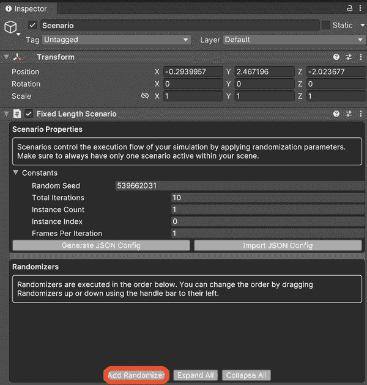
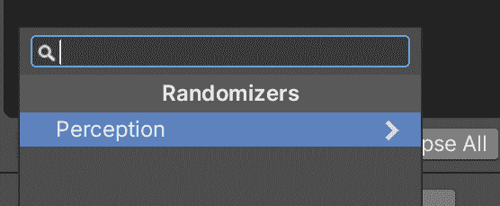
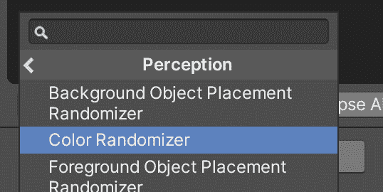
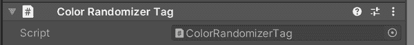
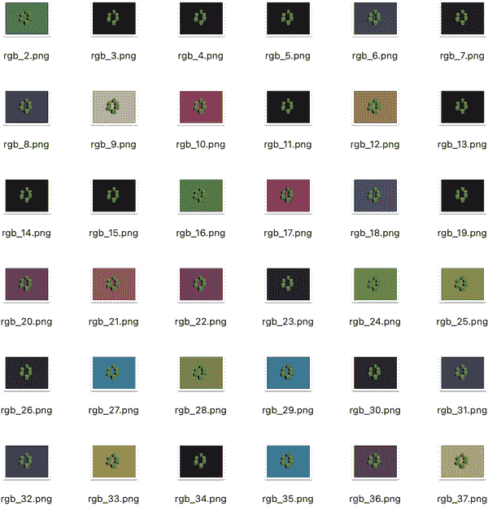
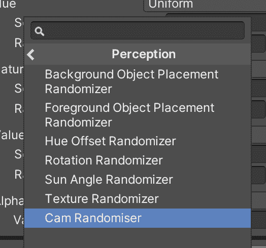
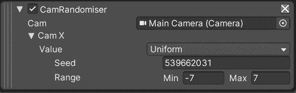
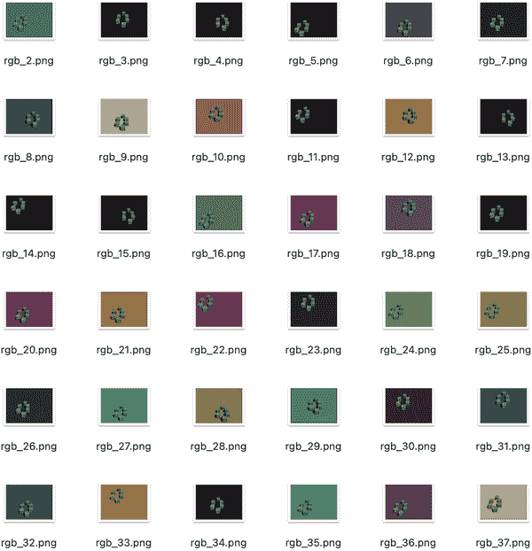

# 第十三章：创建更高级的合成数据

在本章中，我们将回顾合成，并在 Unity 的感知使用中进行深入讨论，这是我们在第三章中进行的介绍的延续。

具体来说，我们将使用随机器人向我们的骰子生成的图像添加一个随机元素，并学习如何探索我们正在合成的数据，利用我们之前添加的标签。

# 向场景添加随机元素

要生成有用的合成数据，我们需要向场景添加随机元素。我们要添加的随机元素包括：

+   一个随机的*地板颜色*

+   一个随机的*摄像机位置*

通过随机改变地板的颜色和摄像机的位置，我们能够生成各种随机的骰子图像，这些图像可以用于在 Unity 之外的图像识别系统中训练，以识别各种情况下的骰子。

我们将继续使用我们在第三章结束时得到的同一个项目，因此在继续之前，请复制它或从头开始重新创建。我们复制了它并将其重命名为“SimpleDiceWithRandomizers”。

###### 提示

切记这   记住，项目必须是一个 3D URP 项目，这与你在第二部分中制作的仿真项目不同。如果需要提醒，请参考“创建 Unity 项目”。

## 随机化地板颜色

要随机化地板颜色，我们首先需要一个随机器。要添加随机器，请打开 Unity 场景并执行以下操作：

1.  找到附加到 Scenario 对象的 Scenario 组件，并单击图 13-1 中显示的添加随机器按钮。

    

    ###### 图 13-1\. 添加一个随机器

1.  选择 g:perceptioncategory)所示，选择感知类别，并如图 13-3 所示，选择颜色随机器。

    

    ###### 图 13-2\. 选择感知类别

    

    ###### 图 13-3\. 选择颜色随机器

    颜色随机器需要知道它应该改变颜色的对象。为此，我们需要在地板平面上（我们希望改变颜色的对象）添加一个颜色随机器标签组件：

1.  在 Hierarchy 面板中选择地板，并使用其 Inspector 添加一个颜色随机器标签组件。

1.  确保已将其添加到对象中，如图 13-4 所示。

    

    ###### 图 13-4\. 颜色随机器标签

就这些。为了测试随机器是否起作用，请运行项目，并检查“测试场景”中记录的文件系统位置。

如果一切正常，你会发现骰子图片有各种不同颜色的背景，如图 13-5 所示。



###### 图 13-5\. 随机平面颜色（如果您正在阅读印刷版本，则将以灰度显示）

## 随机化摄像机位置

接下来，我们将在捕获保存图像的摄像机位置上添加一个随机元素。

要随机化摄像机的位置，我们需要一个不随 Unity Perception 包提供的随机器。为此，我们将编写我们自己的随机器。

###### 注意

随机器是附加到场景的脚本。随机器封装了在环境执行期间执行的特定随机化活动。每个随机器向检视器公开特定参数。

可以通过创建一个新的脚本，该脚本派生自`Randomizer`类，并根据需要实现该类中的方法来创建一个新的随机器。

您可以重写的一些方法包括：

+   `OnCreate()`，在场景加载随机器时调用

+   `OnIterationStart()`，在场景启动迭代时调用

+   `OnIterationEnd()`，在场景完成迭代时调用

+   `OnScenarioComplete()`，在场景完成时调用

+   `OnStartRunning()`，在启用随机器的第一帧时调用

+   `OnUpdate()`，该方法在每一帧都会被调用

例如，这是我们刚才使用的`ColorRandomizer`的代码，它是作为 Unity Perception 包的一部分创建和提供的：

```
[AddRandomizerMenu("Perception/Color Randomizer")]
public class ColorRandomizer : Randomizer
{
    static readonly int k_BaseColor = Shader.PropertyToID("_BaseColor");
    public ColorHsvaParameter colorParameter;
    protected override void OnIterationStart()
    {
        var taggedObjects = tagManager.Query<ColorRandomizerTag>();
        foreach (var taggedObject in taggedObjects)
        {
            var renderer = taggedObject.GetComponent<Renderer>();
            renderer.material.SetColor(k_BaseColor, colorParameter.Sample());
        }
    }
}
```

###### 注意

每个随机器都必须有`[Serializable]`标签，以便 Unity 编辑器可以将其自定义并保存为其 UI 的一部分。您可以在 Unity 的[文档](https://oreil.ly/fOeu4)中了解有关此标签的更多信息。

重要的是要包含`[AddRandomizerMenu]`属性，并为随机器指定一个路径，使其显示为 Figure 13-6 中所示。


###### 图 13-6\. 再次选择颜色随机器

遵循以下步骤来创建您自己的随机器：

1.  通过右键单击项目窗格中的空白处，选择创建 → C# 脚本来创建一个新的脚本。

1.  将新脚本命名为 *CamRandomizer.cs*，然后打开它，删除除提供的导入行以外的所有内容。

1.  添加以下导入项：

    ```
    using UnityEngine.Experimental.Perception.Randomization.Parameters;
    using UnityEngine.Experimental.Perception.Randomization.Randomizers;
    ```

1.  在类之外并在任何方法之上添加上述属性，使其出现在子菜单中：

    ```
    [AddRandomizerMenu("Perception/Cam Randomizer")]
    ```

1.  添加从`Randomizer`派生的类：

    ```
    public class CamRandomizer : Randomizer
    {

    }
    ```

1.  创建一个存储场景摄像机引用的位置，以便您可以使用随机器进行移动：

    ```
    public Camera cam;
    ```

1.  创建一个`FloatParameter`，以便在 Unity 编辑器中定义摄像机`x`位置的范围：

    ```
    public FloatParameter camX;
    ```

1.  接下来，覆盖前面提到的`OnIterationStart()`方法，使用它来`Sample()`刚刚创建的`camX`参数，并定位摄像机：

    ```
    protected override void OnIterationStart()
    {
        cam.transform.position = new Vector3(camX.Sample(),18.62f,0.72f);
    }
    ```

脚本编写完成后，您需要将其添加到场景中：

1.  从层级中选择场景，再次使用“添加随机器”按钮，但这次要找到你新创建的相机随机器，如图 13-7 所示。

    

    ###### 图 13-7\. 新创建的相机随机器

1.  找到相机随机器的设置，将范围设置在`-7`到`7`之间，如图 13-8 所示。

    

    ###### 图 13-8\. 相机随机器设置

1.  将主摄像机拖入相机随机器的摄像机字段中。

通过运行场景来测试随机器。这一次，相机的位置以及地板的颜色将是随机的，如图 13-9 所示。



###### 图 13-9\. 随机生成的图像，具有随机颜色和相机位置

# 接下来是什么？

我们已经在两个与模拟相关的章节中涵盖了 Unity 合成的所有基本原理。接下来，我们将结合我们所有的新知识，并构建一个用于训练图像识别系统的数据集（再次强调，这种训练将在 Unity 之外进行，详细步骤超出本书的范围）。
