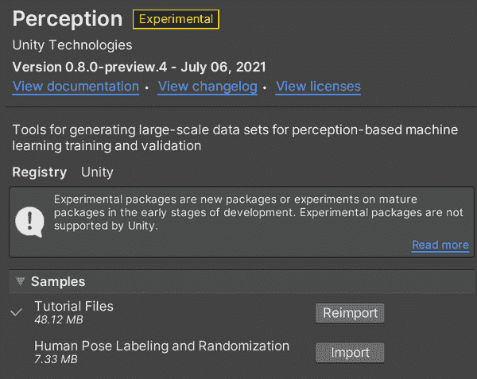
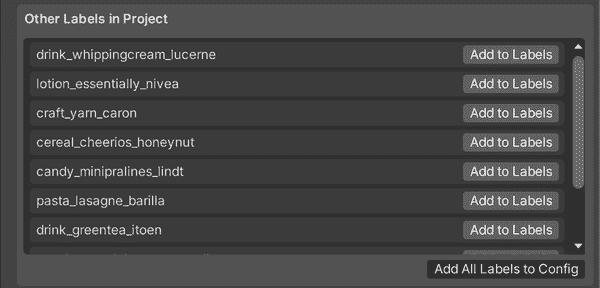
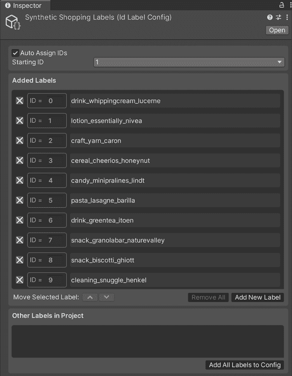

# 第十四章：合成购物

您已经初步了解了如何使用 Unity 生成自定义合成数据集，但仅仅是触及到了皮毛。

在本章中，我们将结合迄今学到的内容，进一步探索 Unity Perception 的可能性和特性，并讨论如何将其应用到您自己的项目中。

具体来说，我们将使用 Unity 和 Perception 创建一个完整功能的合成数据集：一个在超市可能找到的项目集，精心注释和标记。

想象一下，一个由人工智能驱动的购物车，它知道您触摸的物品，当您从货架上拿出它们时（您不必费力去想象它，因为它是真实存在的！）。为了训练这样一个东西，您需要一个大量的数据集，显示超市里的产品包装。您需要各种角度的包装图像，以及它们背后各种物品的图像，并且需要对它们进行标记，以便在使用它们训练模型时，能够准确地进行训练。

我们将在本章中创建该数据集。

# 创建 Unity 环境

首先，我们需要在 Unity 中构建一个世界，用于创建我们的随机商店图像。在这种情况下，世界将是一个场景，我们向其中添加随机器，以创建我们需要的图像范围。

要启动和运行 Unity 环境，请按照以下步骤操作：

1.  创建一个全新的 Unity 项目，再次选择 Universal Render Pipeline（URP）模板，如图 14-1 所示。我们的项目名为“SyntheticShopping”，但您可以自由发挥创意。

    

    ###### 图 14-1\. 一个新的 URP 项目

1.  项目打开后，使用 Unity Package Manager 安装 Unity Perception 包，如图 14-2 所示。

    

    ###### 图 14-2\. 添加 Perception 包

    ###### 提示

    您可以按名称添加该包，`com.unity.perception`，浏览包存储库，或手动下载并安装。

1.  在包管理器窗口中，单击教程文件旁边的导入按钮，同时选中 Unity Perception 包。这将导入一系列有用的图像和模型到项目中。本章我们将使用它们。如图 14-3 所示。

    

    ###### 图 14-3\. 导入教程文件

1.  在项目窗口中创建一个新场景，如图 14-4 所示。将其命名为“SyntheticShop”或类似的名称。

    

    ###### 图 14-4\. 一个新场景

1.  打开新的空场景。您的 Unity 屏幕应该看起来像图 14-4。

1.  然后，在项目窗口中找到 ForwardRenderer 资产，如图 14-5 所示。

    

    ###### 图 14-5\. ForwardRenderer 资产

1.  选择 ForwardRenderer 资产，在 Inspector 中点击添加渲染特性按钮，并选择 Ground Truth Renderer Feature，如 图 14-6 所示。

    

    ###### 图 14-6\. 配置前向渲染器

到此为止我们所需的一切；接下来我们需要添加一个感知摄像机。

# 一个感知摄像机

为了允许地面真实标注，我们需要将感知摄像机添加到 SyntheticShop 场景中的主摄像机。

感知摄像机是生成图像所用的相机或视图。感知摄像机所见的内容最终将呈现为为您生成的每个图像。

要在继续之前测试标签器，请在 Unity 中执行以下步骤：

1.  在 SyntheticShop 场景的 Hierarchy 中选择 Main Camera，并在其 Inspector 中使用添加组件按钮添加 Perception Camera 组件，如 图 14-7 所示。

    

    ###### 图 14-7\. 将感知摄像机添加到主摄像机

1.  接下来，在 Perception Camera 组件的 Inspector 中，在 Camera Labelers 部分下选择 + 按钮，并添加一个 BoundingBox2DLabeler，如图 14-8 和 14-9 所示。

    

    ###### 图 14-8\. 添加 BoundingBox2DLabeler

    

    ###### 图 14-9\. 标签器

1.  现在我们需要创建一个新的资产来命名这些标签。在 Project 面板中创建一个新的 ID Label Config 资产，如 图 14-10 所示。我们命名为“SyntheticShoppingLabels”。

    

    ###### 图 14-10\. 创建 ID Label Config 资产

1.  在 Project 窗格中选择新资产，并在 Inspector 中找到添加所有标签到配置按钮（显示在 图 14-11）以将之前导入的样本数据中的标签添加到配置。

    

    ###### 图 14-11\. 标签和添加所有标签到配置按钮

    ###### 注意

    我们刚刚添加的标签来自导入资产上的标签组件。因为资产有标签，但我们没有一个 ID Label Config 资产来确认和包含这些标签，所以我们需要创建一个并将它们添加进去。

1.  确认标签已移动到已添加标签部分，如 图 14-12 所示。

    

    ###### 图 14-12\. 标签已添加

1.  再次在 Hierarchy 中选择 Main Camera，回到 Perception Camera 组件。将 SyntheticShoppingLabels 资产拖放到 Id Label Config 字段中（或使用按钮，如 图 14-13 所示）。

    ###### 提示

    确保在 BoundBox2DLabeler 部分选中 Enabled 复选框。

    

    ###### 图 14-13\. 指定 ID Label Config 资产

到此为止。接下来，我们需要测试标签。

### 测试标签器

为了测试标签器在继续之前是否正常工作：

1.  找到作为示例资产的一部分导入的前景对象预制件，如图 14-14 所示。

    

    ###### 图 14-14\. 前景预制件

1.  将项目窗格中的任意一个预制件拖动到层次结构中。

1.  选择新添加的预制件，并在场景视图处于活动状态时，按键盘上的 F 键将视图聚焦在它上面，如图 14-15 所示。

    

    ###### 图 14-15\. 聚焦在一些意大利面上

1.  移动主摄像机，在场景视图中，直到在游戏视图中很好地显示新添加的预制件为止。

    ###### 提示

    而不是手动对齐摄像机，您可以选择预制件，在场景视图中聚焦它，然后通过右键单击层次结构中的预制件并选择“与视图对齐”来要求主摄像机复制场景视图的透视图。

1.  使用播放按钮运行场景。您应该看到一个围绕预制件所代表的物品适当显示的边界框，如图 14-16 所示。如果是这样，这意味着到目前为止一切正常！

    

    ###### 图 14-16\. 测试标签

如果一切正常工作，请从场景中删除预制对象。

### 添加随机化器

接下来，我们需要向环境中添加一些随机化器。随机化器将随机放置前景（以及最终的背景）对象，以生成一系列不同的图像。

###### 提示

通过创建随机放置图像的图像（还可以随机做其他事情），我们正在帮助可能最终使用这些数据训练的机器学习模型更有效地找到我们希望它找到的图像中的对象。

正如我们之前讨论的，Unity Perception 提供了许多不同的随机化器，并允许根据需要创建自己的随机化器。对于我们的合成商店，我们希望随机化许多不同的事物：

+   事物的质地

+   我们感兴趣的事物背后的对象（背景对象）

+   背景对象的颜色

+   对象的放置（前景和背景）

+   对象（前景和背景）的旋转

按照以下步骤添加随机化器：

1.  在层次结构中创建一个空的游戏对象，并命名为“场景”或类似的名称。

1.  选择场景对象，并使用其检视器通过“添加组件”按钮添加 Fixed Length Scenario 组件，如图 14-17 所示。

    

    ###### 图 14-17\. 添加固定长度场景组件

1.  使用“添加随机化器”按钮添加 BackgroundObjectPlacementRandomizer。

1.  在新的 BackgroundObjectPlacementRandomizer 中，点击“添加文件夹”按钮，然后导航到教程资产的 Background Objects 文件夹中的 Prefabs 文件夹，如图 14-18 所示。

    

    ###### 图 14-18\. 添加一个 BackgroundObjectPlacementRandomizer

1.  添加了背景对象文件夹后，您可能需要调整深度、层计数、分离距离和放置区域设置：我们的设置如图 14-19 所示。

    

    ###### 图 14-19\. 背景对象放置随机器设置

    ###### 提示

    现在可以再次运行模拟，你会发现相机前方出现了一堆随机形状（颜色相同）。尽管如此，前景对象还没有出现。

1.  接下来，添加一个 TextureRandomizer（在场景对象中的 Fixed Length Scenario 组件的“添加随机器”按钮中使用）。

1.  添加 TextureRadomizer 后，选择“添加文件夹”按钮，并从教程资产中找到背景纹理文件夹，如图 14-20 所示。

    

    ###### 图 14-20\. TextureRandomizer 设置

1.  接下来我们将添加一个 HueOffsetRandomizer，如图 14-21 所示。我们将使用其默认设置。

    

    ###### 图 14-21\. 添加一个 HueOffsetRandomizer

1.  现在我们需要添加一个 ForegroundObjectPlacementRandomizer，并使用“添加文件夹”按钮指向前景对象预制件文件夹（杂货）。我们的设置如图 14-22 所示。

    

    ###### 图 14-22\. 前景对象放置随机器

1.  对于最后的随机器，我们需要一个 RotationRandomizer，如图 14-23 所示。

    

    ###### 图 14-23\. RotationRandomizer

这就是所有的随机器。为了确定随机器影响的对象，我们需要给这些对象添加一些额外的组件：

1.  在项目面板中打开背景对象预制件文件夹，并选择所有预制件（仍然在项目面板中），如图 14-24 所示。

    

    ###### 图 14-24\. 选择背景预制件资源

1.  在检查员（选择所有背景对象预制件时），点击“添加组件”按钮，依次添加一个 TextureRandomizerTag 组件、一个 HueOffsetRandomizerTag 组件和一个 RotationRandomizerTag 组件，如图 14-25 所示。

    

    ###### 图 14-25\. 添加到资源的组件

1.  导航到项目面板中的前景对象预制件文件夹，在该面板中选择所有这些预制件，并使用检查员将 RotationRandomizerTag 添加到所有前景对象中。

就是这样！

# 看起来成功即成

我们准备生成一些假超市数据。

###### 注

您可能需要调整摄像机的位置，以便生成良好框架的图像。

运行环境，Unity 将重复运行我们设置的随机器，并在每次保存图像时显示其保存位置。Unity 控制台会显示这些位置，如图 14-26 所示。

###### 图 14-26\. 图像输出的路径

如果您在系统上导航到此文件夹，您会发现大量图像，以及一些 Unity Perception JSON 文件，描述物体的标签，如图 14-27 所示。

###### 图 14-27。随机图像示例

你可以使用这一组数据来训练 Unity 之外的机器学习系统。要使用这些数据训练机器学习系统，你可以采用许多方法之一。

如果你感兴趣，我们建议首先使用 Faster R-CNN 模型，并使用在 ImageNet 上预训练的 ResNet50 骨干。你可以在 PyTorch 的 `torchvision` 包中找到所有这些内容的实现。

###### 小贴士

我们建议如果您想进一步了解，请找一本关于 PyTorch 或 TensorFlow 的好书。与此同时，Unity 的 [GitHub 上的 datasetinsights 仓库](https://oreil.ly/4FT3j) 是一个很好的起点。

# 使用合成数据

本书中的合成章节专注于使用模拟*环境*生成合成*数据*，这是机器学习领域日益流行的趋势。这是因为创建流行的热门机器学习领域如计算机视觉中所需的检测或分类模型，需要大量代表您希望模型能够识别或区分的对象类型的数据。

通常这意味着由数百万张照片组成的数据集，每张照片都单独标记了其中出现的对象。有时甚至需要标记每张图像中特定对象出现的*区域*。如果针对您尝试解决的问题不存在这样的数据集，这将是一个不可行的工作量。

这导致了*数据集共享*的流行，这是一个很好的做法，但由于机器学习模型在如何做出关键决策方面可能会显得不透明，了解其基于的数据很少，这只会加剧机器学习领域中责任和理解不足的问题。因此，如果您为重要事项或学习练习训练模型，仍然希望创建自己的训练数据集。

数据合成可以通过允许某人定义数据中应该出现的规则及其各个方面的变化方式，来减少创建数据集所需的工作量。然后可以使用模拟环境在给定规格内生成任意数量的随机变化，并以指定形式输出，如标记图像。这可用于创建以下数据集：

+   通过在虚拟场景中从不同角度生成对象的图片，与其他对象混合显示，部分遮挡，并在不同光照条件下展示，来识别特定对象。

+   预测 2D 图像中的距离或深度 —— 通过生成视觉图像和相应的深度地图，这些图像和地图由仿真生成（仿真了解物体与摄像机之间的距离）

+   场景中的分区 —— 类似于预测 2D 图像中的深度，但输出可以允许像自动驾驶汽车这样的设备识别与其驾驶相关的物体，如标志或行人（如图 14-28 所示）

+   你可以在虚拟场景中生成任何其他具有随机变化的内容

###### 图 14-28\. 视觉图像示例（左）及表示场景中识别的物体类别的对应地图（右）

一旦数据合成完成，您可以根据需要处理数据。从图像数据集中摄取并学习所需的通用机器学习超出了本书的范围。这里我们关注仿真部分以及仿真引擎如何实现独特类型的机器学习。

对于超出仿真的机器学习，您可能希望查看 O'Reilly Media 的另一本书，如[*使用 Swift 实现实用人工智能*](https://www.oreilly.com/library/view/practical-artificial-intelligence/9781492044802)，该书的作者与本书相同，或者[*使用 Scikit-Learn、Keras 和 TensorFlow 进行实战机器学习*](https://www.oreilly.com/library/view/hands-on-machine-learning/9781492032632)，该书由 Aurélien Géron 撰写。
