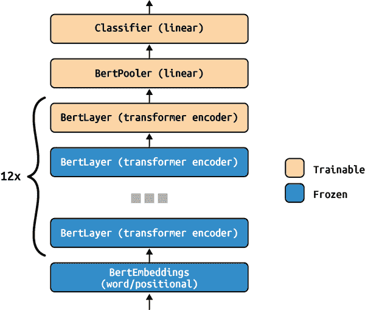

# 第一章：隐私

如果你有关注媒体报道，那么你至少对一家公司的客户数据或专有算法泄露可能导致的损害有所了解。考虑到机器学习（ML）领域基本上需要大量数据，风险尤为突出。

# 机器学习流水线的攻击向量

计算机发明不久后，攻击方法就被发明出来了。为了说明这一点，MITRE 公司创建了一个攻击者用来攻击系统的战术和技术分类法。

机器学习的出现创造了许多额外的方式，通过这些方式可以攻击计算机系统。事实上，MITRE ATT&CK 有一个专门针对机器学习的版本：[MITRE ATLAS（人工智能系统的对抗威胁景观）](https://atlas.mitre.org)。正如攻击者和对手一直试图从普通计算机系统中窃取数据并控制它们一样，机器学习流水线也面临着同样的风险。

本章介绍了一系列可以减少隐私泄露风险的技术和技术。尽管这些技术代表了实际最佳实践和最新研究的交集，但没有一种工具是完美的。如果没有正确实施或者只关注隐私的一个定义，其中一些技术可能会产生反效果。

# 机器学习中实施不当的隐私功能：案例研究

在我们深入探讨数学隐私定义之前，让我们先了解一下在现实世界中实施不当的隐私功能是什么样子，以及可能引起的后果。

描述的许多数据隐私法律旨在惩罚数据泄露。在法律无法阻止人们的情况下，需要组织和技术保障措施。所有这些措施旨在给获取相关数据的人造成巨大成本。问题在于，对于一些不良行为者来说，数据的价值仍远远超过获取它所需的时间和金钱成本。

就消费者而言，在中国存在着一个大量的个人数据黑市。恶意行为者可以以极低的价格购买移动电话定位和移动数据、信用信息、学术记录和电话记录，每个数据可能仅需$0.01（尽管根据个体情况价格会更高）。对于数以千计或百万计的个人数据泄露，财务激励显而易见。像医疗保健记录这样的信息通常会更值钱。据 Experian 称，一条单个患者记录在黑市上可能卖到高达$1,000 以上，具体取决于记录的完整性；这几乎比标准信用卡记录高出 50 倍。

还存在大量专有公司信息的市场。很难量化获取竞争对手信息的价值。在大多数情况下，这是非常高的，特别是如果这些信息是他们分析管道训练的数据或经过数百或数千小时计算训练的关键模型的话。

当然，从窃取信息中获利不仅仅是金钱问题。国家行为者可能有从实现明确的国家安全目标到收集敲诈材料、引起不稳定，甚至更模糊的“最好是有数据而不需要，也不是需要数据而没有”的原则的动机。

就目前而言，我们还没有看到与一些较大的数据泄露相媲美的规模的机器学习模型攻击（尽管将自己与[Meta 泄露的 5.3 亿用户信息](https://oreil.ly/8g84r)进行比较是一个低水平）。部分原因是攻击未安全防护的前端和后端的常规途径仍然足够容易获利。如果某产品或服务已经移除了大部分低 hanging fruit，黑客们可能会转向攻击 ML 模型本身来获取他们想要的东西。

## 情况 1：苹果的 CSAM

2021 年，苹果宣布了[一种新系统，用于应对儿童虐待和儿童贩运](https://oreil.ly/H26d8)，这一消息成为头条。儿童性虐待材料（CSAM）检测系统最初计划在 iOS 15 发布时发布。该系统最显著的特点是一个设备端 ML 模型，将检查所有发送和接收的照片中的 CSAM，并在将照片发送到 iCloud 之前进行设备端匹配和标记。这种匹配将通过[苹果的 NeuralHash 算法](https://oreil.ly/oIw1A)完成。该模型受[用于确定软件完整性的校验和哈希匹配](https://oreil.ly/VvpNE)的启发，将基于照片中特定高级细节的存在与否来生成图像哈希。

这里的关键细节是使用*设备端*网络进行匹配。与收集所有设备数据、存储在中央预言机上，然后在收集的数据上运行 ML 模型不同，NeuralHash 模型仅在用户端点运行，并在检测到一定阈值的命中时向苹果发出警报。理论上，这将允许系统尊重端到端加密，同时仍能在客户数据上运行模型。不幸的是，公众并不认同这种方法，并认为这是一种侵犯隐私的行为。关于苹果在标榜自己为“隐私第一”的公司的同时扫描私人照片所引发的公共关系危机，有很多讨论，但我们将专注于 CSAM 扫描系统中更为重要的技术错误。

苹果的第一个错误是过度依赖神经哈希算法的完整性。在安全环境中使用的哈希算法通常经过几十年的竞争才被采纳为标准。无法确切验证神经网络在所有可能情况下的确切行为。事实上，就在神经哈希发布不久后，用户就创造了碰撞攻击，可以对任何照片进行微小修改，使网络识别图像为不良内容。

第二个错误是记者、开发人员和安全工程师在此事件后对训练数据控制的感知缺失。苹果声称仅训练神经哈希算法以匹配扣押儿童色情照片数据库中的照片特征。在像美国这样的国家，州和联邦执法机构维护着被没收的儿童色情数据库，逮捕恋童癖者在大部分世界上都是一个不受争议的主题。然而，截至 2020 年，苹果产品和服务在[超过 52 个国家销售](https://oreil.ly/1fFrj)。这种分布很大程度上依赖于苹果与各国政府的合作。如果某个国家希望用于扫描其他内容会发生什么呢？例如，如果某个威权政府或政治派别希望使用神经哈希来扫描反对党的口号或反对党政治家或活动人士的图像？

苹果在[推迟（尽管未完全取消）发布此功能](https://oreil.ly/vGFvg)时，主要是因为神经哈希算法缺乏具体性，加上公众对其使用范围不仅限于苹果狭隘声明目标的信心不足。

## 案例 2：GitHub Copilot

2021 年 6 月，GitHub 与 OpenAI 合作发布了 Copilot，这是一个工具，可以根据在公共 GitHub 存储库上的训练自动完成代码。Copilot 由一个名为 Codex 的 ML 模型运行，它本身基于 OpenAI 的 GPT-3（但是训练的是代码而不是原始文本）。因此，Codex 可以接受原始文本提示，并在多种编程语言中生成工作代码。虽然它不能完全替代人类程序员，但 Codex 擅长解决像在 Meta、Apple、Amazon、Netflix 或 Alphabet 的 Google 的白板面试中可以预期的算法问题。

Codex 的泛化能力令人印象深刻，但它也带有与[GPT-3 模型相同的一些问题](https://oreil.ly/b5jFZ)，即在要求完成特别罕见或不寻常提示时，它易于记忆。Codex 也有同样的问题，只不过它记住的信息可能是受版权保护的代码或意外暴露的秘密。

首次报告此问题的是一位 SendGrid 工程师，他演示了如果您向 Copilot 请求 API 密钥（同样类型的密钥可以授予对重要数据库的有选择访问权限），[Copilot 会显示它们](https://oreil.ly/wz4dE)。不久之后，人们发现他们可以向 Codex 请求秘密，比如 AWS 的秘密密钥（例如，某人可以获得对整个公司使用的 AWS 后端的特权访问）或者加密货币钱包的秘密密钥（例如，比特币的秘密密钥将允许某人窃取该钱包中的任意数量比特币，可能价值数百万美元）。

有几种解决此问题的方法。一种方法是在训练数据代码库中搜索 API 密钥并对其进行审查。用相同的 X 替换哈希和密码每个字符将会很容易，尽管找到每个暴露的密码、哈希和 API 密钥的过程将会更加困难，其成功也无法保证。此外，关于 Copilot 的训练数据和输出引发了法律问题。许多开源开发者对 GitHub 未经授权和未经许可使用受版权保护的源代码作为模型训练数据感到愤怒，并基于这些理由开始远离 GitHub。不总是可以证明输出是基于专有代码的，但确实存在一些明显的例子。[在一个尤为明目张胆的案例中](https://oreil.ly/UydLa)，Copilot 可以复制 Carmack 在游戏 *Quake 3* 中著名的反平方根函数。即使是熟练的 C 开发者也不太可能从头开始想出这个解决方案，但通过包含某人的代码注释，复制变得更加明显。

这是一个更加棘手的问题需要解决；它不仅仅是删除少量字符就能解决的。一个简单的方法可能是从训练语料库中排除带有特定类型许可证文件的代码库。然而，是否应该根据缺少这类文件来包含其他代码库，是否算作知情同意却并不明确。软件知识产权律师[Kate Downing 提出](https://oreil.ly/OiZQQ)，尽管创造 Copilot 可能在技术上是合法的，但在法庭上仍有许多问题需要解决（更别提在道德上仍然具有争议）。这是因为 GitHub 多年来一直提供诸如 GNU 通用公共许可证（GPL）第 2 版和第 3 版的许可证。然而，他们从未真正宣传过你现在可以选择一种许可证，以后又可以选择另一种许可证，或者用户在未来可以获得不同的权限。这两个都是 GitHub 的特点，如果用户被更多告知，他们可能不会授予 GitHub 如此广泛的权限来使用他们的代码。考虑到有多少开源开发者因为这种使用而离开 GitHub，很可能他们不会同意这种用法。

## 案例 3：从无代码 ML 工具中窃取模型和数据

许多公司一直在开发无代码模型，用于训练和部署机器学习系统。例如，[Google 的 Teachable Machine](https://oreil.ly/Hc648)和[Microsoft 的 Lobe.ai](https://www.lobe.ai)提供了任何人都可以训练计算机视觉模型的方式。对于在机器学习方面经验不足的移动端或前端开发人员来说，这些工具可能看起来像魔法一样——但它们是一种称为*灰盒攻击*的攻击类型的完美目标。¹

考虑使用 Lobe.ai 制作的项目，这是一种允许任何人（无论其机器学习知识如何）在来自常规文件目录的数据上训练视觉模型的工具。如果您想训练您的模型以确定某人是否戴着口罩，您只需拿一组图像，用口罩遮住它们，将其作为训练数据。然而，少数 Lobe.ai 用户表明其分类器正在运行 Resnet150V2 模型。如果您了解该模型，您可以获取关于其模型架构的大量信息，这使得窃取模型权重（这些权重是神经网络上分配给神经元的数字，它们允许它在计算密集的训练期间存储所有重要的模式、函数和信息）变得更加容易。对于任何已经花费大量 GPU 小时训练模型并花费大量人力小时进行迭代和构建管道的组织来说，这种窃取都将是危险的。毕竟，如果窃取竞争对手的专有模型更容易，那为什么要花费所有的时间和金钱呢？

尽管无代码工具很有价值，但是当有人对所讨论的机器学习模型非常了解时，这时就会引发一些担忧。无数组织使用作为 Keras 或 PyTorch 的一部分可以找到的开箱即用的架构。随着公司将其机器学习模型作为产品出售，供作为 API 接口使用，一些恶意行为者可能会趁机窃取这些模型本身。

# 定义

在看过前述例子之后，您可能会认为自己对隐私有了相当好的理解。但在构建保护隐私的系统时，定义非常重要。在本节中，我们将介绍一些您将在本书中看到的关键术语。

## 隐私的定义

根据韦伯斯特词典的定义，隐私是[“远离他人视线或视图的质量或条件”](https://oreil.ly/LoLIb)，或者“摆脱公众关注或未经授权的侵入状态”。这个定义可能会让人觉得隐私要么是“有或无”，但这是一个过于简化的看法。如果我们有数据因任何原因对任何人都不可见（甚至不是使用数据的应用程序），那从技术上来说是私有的，但对大多数应用程序来说功能上是无用的。在数据不完全开放和完全关闭之间有许多中间地带。因为在实际环境中隐私是一个连续的过程而不是二元的，所以我们需要一些衡量方式。

## 代理和隐私度量

测量隐私是一个与定义隐私分开的问题。伊莎贝尔·瓦格纳和大卫·艾克霍夫²进行的一项回顾将许多现有的度量分类为敌对成功、不可区分性、数据相似性、准确性和精确度、不确定性、信息增益/损失和时间消耗等类别。

### 敌对成功

假设某种敌对方（我们将其称为*敌手*）想要获取我们拥有的任何数据或我们发送或接收的通信的内容。我们不希望他们看到或拼凑出这些信息。敌手成功的机会是多少？

这是隐私度量的一个非常普遍的类别。我们不知道敌手的目标、知识、能力或工具。敌手可能是任何人或任何事物：一个好奇的用户，一个企业间谍，一个国家间谍，一个孤独的小偷，一家公司的预防性渗透测试员，甚至是只是嘲笑你没有正确保护数据或通信的 DEFCON 会议与会者³。敌手可能是一个完全不了解技术后端的外部人，或者他们可能已经确切地了解你正在使用的协议或技术。

鉴于这种度量的模糊性和开放性，还有其他建立在预期敌手攻击概念基础上的定义。

### 不可区分性

不可区分性是指敌手在流程或数据集中分辨两个实体的能力。隐私的这个定义是私有机器学习技术（如差分隐私，见“k-匿名性”）的焦点。

### 数据相似性

基于数据相似性的隐私定义侧重于数据中的特征和子组的分离程度（例如，区分一个人的记录和另一个人的记录）。这是机器学习隐私技术如 k-匿名性（我们在“差分隐私”中讨论）的焦点。

### 准确性和精确度

针对隐私的基于准确度的度量侧重于对手对数据或通信的估计的准确性和精度。这可能涉及使用 F1 分数、精确度或召回率等度量标准，以评估对手对数据信息的估计有多接近。如果对手的估计不够准确，隐私性就更高。

### 不确定性

不确定性度量假设更大的不确定性意味着对手违反隐私承诺的可能性较小。对手对真实信息的估计存在较大误差或熵时，其隐私性就越高。这与基于准确度的度量有些相似，尽管它们不应混淆。*准确度*是读数接近实际值的程度，而*不确定性*则涉及可能偏离准确读数的异常和离群值。

### 信息增益/损失

信息增益/损失度量衡量对手从数据中可以获取或丢失多少信息。如果可以获取的信息较少，则隐私性较高。这个度量标准与不确定性略有不同，因为它考虑了攻击者在开始时已经掌握的信息量。

### 花费时间

一个积极主动的对手可能会反复尝试违反隐私，直到成功为止。基于时间的隐私定义假设隐私机制最终会失败，但某些隐私保护机制要比其他机制需要更多的时间投资才能破解。像同态加密这样的 ML 隐私技术（我们在“同态加密”中讨论）就是依据这种隐私定义工作的。

## 隐私的法律定义

上述隐私的代理和度量是评估系统隐私性的好方法。虽然这一领域很有用，但我们需要知道在哪里划线——但这个决定的一部分可能已经为您做出。如果您发布任何基于机器学习的产品，您就会无可避免地涉及到某些人的数据。因此，您将不可避免地遇到隐私法律的界限。

## k-匿名

k-匿名的概念最早由 Pierangela Samarati 和 Latanya Sweeney 在 1998 年提出，⁴可以被视为“众多中的隐藏”的一个特定版本。它依赖于增加一个给定记录属于某个特定个体的不确定性。为了实现这一点，数据集至少需要 k 个个体共享一组可能用于识别他们的属性。在正确使用时，k-匿名是一个强大的工具。它也是更高级隐私工具如差分隐私的先驱之一（详见“差分隐私”）。

# 机器学习管道上侵犯隐私的攻击类型

现在你应该从机器学习的角度有了对隐私的良好概念性概述，为什么它很重要，以及它如何在 ML 管道中被侵犯。当涉及到侵犯隐私时，外部攻击者可以利用多种工具。攻击的最大一般类别包括成员攻击（识别模型的训练数据），模型反演（使用模型窃取专有数据）和模型盗窃（确切地说就是这样）。

## 成员攻击

机器学习模型的一个隐私风险是对手可能能够重构用于模型创建的数据。⁵ 成员推断攻击是确定样本是否来自训练 ML 模型的数据集的过程。对于被攻击的公司来说，这可能意味着对手能够洞悉专有模型的构建方式，甚至是输入数据的位置（特别是如果来自安全性较差的外部服务器，则风险更大）。

在成员攻击中使用的三个主要模型：

*目标模型*

这是在初始数据集上训练的模型。该模型为每个类别输出置信水平，具有最高置信值的类别被选择为输出类别。成员推断攻击基于这样一个思想：训练数据集中的样本在其实际类别中具有更高的平均置信值，而不在训练中看到的样本则不然。⁶

*影子模型*

在黑盒条件下，攻击者无法对置信水平进行统计分析，因为他们无法访问训练数据集。影子模型是一组模型（可能是模型架构和超参数的精确或非精确副本），旨在模仿目标模型的行为。一旦影子模型训练完成，攻击者可以为攻击模型生成训练样本。

*攻击模型*

这个模型将预测样本是否来自训练集。攻击模型的输入是置信水平，输出标签是“in”或“out”。

除非防御者有非常特定的不利设置，否则成员推断攻击是一种虚幻的威胁。⁷ 这尤其如此，与更擅长窃取训练数据，甚至是机器学习模型本身的攻击相比。

## 模型反演

大多数早期的此类攻击由于从中获得的信息少而耗时过长。对大多数 ML 应用程序来说，成员攻击可能风险较低，但还存在更危险的类型。重建攻击通过重建用于训练 ML 模型的数据，将成员攻击原则推向更深入的程度。这可以直接用于窃取训练数据中使用的个体的信息，或者揭示关于模型如何解释数据的足够信息，以找到进一步破坏其的方法。

首次提出于 2015 年，⁸ 模型反演攻击是一种更直接的窃取数据的方法。与确定输入是否属于数据集不同，这种攻击重建了实际数据的非常精确的表示。在原始论文中，该技术用于一个分类器训练的几个面部（见图 1-1）。与穷举每个可能的像素值可能属于个体不同，这种[技术使用梯度下降](https://oreil.ly/QmDIa)来训练像素值以匹配模型输出的一个类别。


###### 图 1-1。原始面部图像（右）和模型反演恢复的图像（左）（来自 Fredrikson 等人）

值得注意的是，通过这种模型反演攻击返回的数据是属于特定类别的数据的平均表示。在所呈现的设置中，它不允许对单个训练数据点进行反演。然而，在 Fredrikson 等人的研究中，每个面部分类器中的个体都代表其自己的类别。因此，该攻击可以用来获取关于个体的信息并侵犯其隐私。在应用如面部识别的情况下尤其如此，您只需要一个触发相同关键点识别的面部，而不是一个看起来像实际面部的面部。

自 2015 年首次展示此技术以来，模型反演攻击已经变得更加复杂。更糟糕的是，模型反演的概念已扩展到窃取不仅仅是数据。

## 模型提取

模型提取迈出了几步。与仅重建模型输入数据不同，模型提取攻击涉及窃取整个模型。这种类型的攻击首次描述于“通过预测 API 窃取机器学习模型”。⁹ 模型窃取攻击的范围可以从仅窃取模型的超参数¹⁰，到直接窃取模型权重。¹¹ 图 1-2 概述了模型窃取攻击的一般情况。攻击者近似梯度，导致模型输出其当前预测。

开发高性能模型是昂贵的。除了计算成本（对于某些模型可能达到数百万美元）之外，还有获取大规模且可能是私有数据集的成本。设计新颖的训练方法也是知识上的负担。考虑到所有这些因素，恶意行为者可能决定直接提取模型本身。

模型提取过程通常包括三个步骤：

1.  收集数据集以查询受害模型

1.  记录 API 在这些数据点上的预测

1.  训练替代模型以模仿受害者


###### 图 1-2\. 模型窃取攻击结构的一般概述

这种攻击模式可能有很大的变化。早期的模型提取攻击高度依赖于选择哪个数据集用于查询。例如，根据选择 CIFAR10、CIFAR100 还是 MNIST，替代模型的准确性可能大不相同。更近期的攻击机制完全放弃了攻击选择，通过从控制概率分布中引入噪声来进行。在第 2 步中，不同的概率分布选择可以改变需要的查询数量，以接近一个令人满意的替代模型。在第 3 步中，攻击者可能对模型架构一无所知（即“黑盒”攻击），或者他们可能对架构的一些细节有所了解（即“灰盒”攻击）。

最终结果仍然相同。替代模型使用梯度近似，条件是替代输出概率与受害模型的输出概率有多相似。

如果您可以访问计算机视觉模型的输出对数，这种信息泄露具有巨大的滥用潜力。¹² 这些技术利用卷积神经网络的基本属性。这意味着任何使用它们的管道，不仅仅是训练图像的管道，都面临风险。这在“图神经网络上的模型提取攻击：分类和实现”案例中有所体现。¹³

计算机视觉模型易受攻击的部分原因是常见架构的重复使用。常见的机器学习库包含预构建的网络版本，如 ResNet 和 InceptionV3（参见 PyTorch 和 Keras 模型动物园）。更糟糕的是，许多这些模型可以使用 ImageNet 权重加载。微调计算机视觉模型使潜在攻击者在窃取模型权重时获得更多信息。攻击者拥有权重的起始条件，无需从头开始重建架构。由于对神经网络部分先验知识的掌握，一些攻击是灰盒攻击。

# 窃取基于 BERT 的语言模型

本节灵感来自 CleverHans 团队对 NLP 模型窃取的演示，以及从 BERT 模型中窃取权重的最新技术。¹⁴^,¹⁵^,¹⁶ 在本节中，我们探讨了通过使用在公共文本数据上预训练过的模型，并对其进行微调以执行任务的差分隐私文本分类器训练。此过程的第一步是训练 BERT 模型。

###### 注意

您可以在[*BERT_attack* notebook](https://oreil.ly/fFiQ5)中找到与本教程相关的所有代码。

当使用差分隐私训练模型时，几乎总会面临模型大小与任务准确性之间的权衡。模型参数越少，使用差分隐私时获得良好性能就越容易。

大多数最先进的 NLP 模型非常深且庞大（BERT-base 具有超过 1 亿个参数），这使得在私有数据集上训练文本模型具有挑战性。解决此问题的一种方法是将训练过程分为两个阶段。首先，在公共数据集上预训练模型，将模型暴露于通用文本数据中。假设通用文本数据是公开的，在此阶段我们将不使用差分隐私。然后，冻结大部分层，只留下少数上层，在私有数据集上使用 DP-SGD 进行训练。这种方法融合了两种最佳实践——产生深度且强大的文本理解模型，同时只对少数参数使用差分隐私算法。

本教程将采用预训练的 BERT-base 模型，并将其微调以在 IMDB 电影评论数据集上识别情感分类。¹⁷

```
!pip -qq install nlp
!pip -qq install transformers
from transformers import (
    BertForSequenceClassification,
    BertTokenizerFast,
    Trainer,
    TrainingArguments,
)
from transformers import glue_compute_metrics as compute_metrics
from nlp import load_dataset
import torch
import numpy as np
from sklearn.metrics import accuracy_score, precision_recall_fscore_support

model = BertForSequenceClassification.from_pretrained("bert-base-uncased")
tokenizer = BertTokenizerFast.from_pretrained("bert-base-uncased")

def tokenize(batch):
    return tokenizer(batch["text"], padding=True, truncation=True)

imdb_train_dataset, imdb_test_dataset = load_dataset(
    "imdb", split=["train", "test"]
)
imdb_train_dataset = imdb_train_dataset.map(
    tokenize, batched=True, batch_size=len(imdb_train_dataset)
)
imdb_test_dataset = imdb_test_dataset.map(
    tokenize, batched=True, batch_size=len(imdb_test_dataset)
)
imdb_train_dataset.set_format(
    "torch", columns=["input_ids", "attention_mask", "label"]
)
imdb_test_dataset.set_format(
    "torch", columns=["input_ids", "attention_mask", "label"]
)
```

BERT（双向编码器表示转换器）是用于各种 NLP 任务的先进方法。它使用变换器架构，并且在概念上依赖于预训练。我们将使用一个在 HuggingFace 变换器库中提供的预训练 BERT-base 模型。它提供了经过 PyTorch 实现的经典 BERT 架构，以及在维基百科（一个公共英语语料库）上预训练的分词器和权重。

该模型具有以下结构。它使用单词、位置和标记嵌入的组合来创建序列表示，然后通过 12 个变换器编码器传递数据，最后使用线性分类器生成最终标签。由于模型已经预训练，我们只计划对几个上层进行微调，因此希望冻结所有层，除了最后一个编码器及以上的层（BertPooler 和 Classifier）。图 1-3 展示了 BERT 模型的架构。



###### 图 1-3\. BERT 架构

因此，通过使用预训练模型，我们将可训练参数的数量从超过 1 亿减少到略高于 750 万。这将有助于提高性能并在增加噪声的同时加快收敛速度。以下是训练模型的代码。

```
def compute_metrics(pred):
    labels = pred.label_ids
    preds = pred.predictions.argmax(-1)
    precision, recall, f1, _ = precision_recall_fscore_support(
        labels, preds, average="binary"
    )
    acc = accuracy_score(labels, preds)
    return {
        "accuracy": acc,
        "f1": f1,
        "precision": precision,
        "recall": recall,
    }
```

```
training_args = TrainingArguments(
   output_dir='./results',
   num_train_epochs=1,
   per_device_train_batch_size=16,
   per_device_eval_batch_size=16,
   warmup_steps=500,
   weight_decay=0.01,
   #evaluate_during_training=True,
   logging_dir='./logs',
)

trainer_vic = Trainer(
   model=model,
   args=training_args,
   compute_metrics=compute_metrics,
   train_dataset=imdb_train_dataset,
   eval_dataset=imdb_test_dataset
)

trainer_vic.train()
trainer_vic.evaluate()
```

此系统的推断是我们模型盗窃的机会所在。让我们尝试在 Yelp 极性数据集上运行推断。

```
_, origin_sample_test_dataset = load_dataset(
    "yelp_polarity", split=["train", "test"]
)

sample_test_dataset = origin_sample_test_dataset.map(
    tokenize, batched=True, batch_size=len(origin_sample_test_dataset)
)
sample_test_dataset.set_format(
    "torch", columns=["input_ids", "attention_mask", "label"]
)

class ExtractDataset(torch.utils.data.Dataset):
    def __init__(self, encodings, labels):
        self.encodings = encodings
        self.labels = labels

    def __getitem__(self, idx):
        item = {}
        item["attention_mask"] = torch.tensor(
            self.encodings[idx]["attention_mask"]
        )
        item["input_ids"] = torch.tensor(self.encodings[idx]["input_ids"])
        item["label"] = torch.tensor(
            self.labels[idx].argmax(-1), dtype=torch.long
        )
        return item

    def __len__(self):
        return len(self.labels)

theft_train_dataset = ExtractDataset(
    sample_test_dataset, prediction_output.predictions
)
theft_training_args = TrainingArguments(
    output_dir="./results",
    num_train_epochs=1,
    per_device_train_batch_size=16,
    per_device_eval_batch_size=16,
    warmup_steps=500,
    weight_decay=0.01,
    # evaluate_during_training=True,
    logging_dir="./logs",
)

trainer_extract = Trainer(
    model=model,
    args=theft_training_args,
    compute_metrics=compute_metrics_copycat,
    train_dataset=theft_train_dataset,
    # eval_dataset=imdb_test_dataset
)
trainer_extract.train()
trainer_extract.evaluate()
```

这种训练方案将产生一个输出行为与原始模型非常相似的模型。

## 防御模型输出日志的模型盗窃

如果可以仅通过其输出 logits 重建模型，则这对模型安全性不利。幸运的是，有两种防御方式来抵御这种推断攻击。

第一种防御方法是增加查询模型的成本。Xuanli He 等人¹⁸ 探讨了使用公共数据集窃取模型权重的实际应用。基于这些数据集的大小和 Google 和 IBM 语言模型 API 的成本（假设这些是 API 调用成本的下限），他们提出了在 表 1-1 中显示的使用这些数据集窃取基于 BERT 的语言模型的成本估算。

表 1-1\. 攻击成本估算

| 数据集 | 查询次数 | Google 价格 | IBM 价格 |
| --- | --- | --- | --- |
| TP-US | 22,142 | $22.10 | $66.30 |
| Yelp | 520 K | $520.00 | $1,560.00 |
| AG | 112 K | $112.00 | $336.00 |
| 博客 | 7,098 | $7.10 | $21.30 |

根据云服务提供商的不同，攻击的成本可能从几十美元到几千美元不等。同一研究表明，甚至无需选择匹配的变压器架构，即可制作一个紧密匹配的模仿模型（例如，在 BERT 模型的输出上训练 DistilBERT 模型是一种可行的攻击选项）。因此，增加机器学习模型 API 调用的成本将大大有助于防范此类攻击（这是 OpenAI 在 GPT-3 上采取的策略；由于 API 调用成本，对 GPT-3 API 进行反演攻击的最终成本可能超过从头开始训练一个 GPT-3 模型的成本）。

这里有第二种（更巧妙的）防御方式。就像用磨砂玻璃遮挡你的脸会阻碍面部识别一样，你也可以向输出 logits 添加混淆噪声。你可以在模型训练期间加入输出噪声¹⁹，或者在普通训练模型的预测概率后添加随机噪声²⁰。这种“预测污染”的添加噪声是我们将在下一节中展示的策略。

###### 注意

考虑到模型盗窃的危险性及攻击者的创造力，这是一个持续研究的领域。有方法可以发现正在进行的攻击。²¹^,²² 也有方法可以“加固”你的训练数据样本。²³ 你可以通过使用模型集成来进一步混淆模型盗窃攻击。²⁴

如果您试图弄清楚最重要的防御攻击，所有这些提议的想法和防御策略可能会显得令人生畏。特别是如果研究非常新，并且您还没有听说过许多成功的真实用例。最终，值得在您自己的系统上模拟这些攻击，以查看其效果。²⁵^,²⁶

这绝不是可用于针对 ML 管道进行攻击的全面选择。如前所述，攻击者将选择最不费力的路径。如果您能将某种形式的隐私测试工具整合到您的管道中，将会使攻击者的工作更加困难。

## 隐私测试工具

Google Cloud 平台（GCP）具有用于计算给定数据集的[k-匿名性](https://oreil.ly/7KA2v)的工具。精确的计算方法可以通过 GCP 控制台、GCP 协议、Java、Node.js、Python、Go、PHP 或 C#完成。更多关于此的 Python 示例可以在 Google 的[python-dlp GitHub](https://oreil.ly/CsTc1)上找到。其他用于 k-匿名化的 Python 模块包括：

[Nuclearstar / K-匿名](https://oreil.ly/lrfGa)

基于聚类的 K-匿名实现

[qiyuangong / 基于聚类的 K-匿名](https://oreil.ly/aRZA1)

另一种基于聚类的 K-匿名实现

[qiyuangong / Mondrian](https://oreil.ly/pcU5J)

Mondrian 多维 K-匿名的 Python 实现

[kedup / python-datafly](https://oreil.ly/ijJcJ)

用于表格数据 K-匿名的 Datafly 算法的 Python 实现

其他隐私测试工具包括：

+   [PrivacyRaven](https://oreil.ly/vCrSc)，由 Trail of Bits 创建

+   [TensorFlow 隐私](https://oreil.ly/EDXl7)，由 TensorFlow 创建

+   [机器学习隐私计量器](https://oreil.ly/p6Gcs)，由新加坡国立大学数据隐私和可信机器学习实验室创建

+   [CypherCat（仅存档）](https://oreil.ly/LFBGy)，由 IQT Labs / Lab 41 创建

+   [对抗鲁棒性工具箱（ART）](https://oreil.ly/7kUTP)，由 IBM 创建

+   [机器学习隐私计量器](https://oreil.ly/itB0m)，一种工具，用于量化机器学习模型在推断攻击（特别是成员推断攻击）方面的隐私风险

# 保护隐私的方法

就像从 ML 模型中窃取信息有多种方法一样，确保这种窃取变得难以实施的方法也有多种。

## 差分隐私

差分隐私（DP）是一种通过使用数据内子群体的高级模式来分享数据集洞见的方法，同时掩盖或省略特定个体的数据。DP 背后的主要假设是，如果对数据进行单一更改的影响足够小，则从查询中提取有关个体的信息将变得困难。

差分隐私可以被视为诸如 k-匿名性等概念的扩展。其不同之处在于，差分隐私通常被扩展到更高维度的数据上。大多数现代实现都依赖于所谓的 <math alttext="epsilon"><mi>ϵ</mi></math> -差分隐私。

假设 <math alttext="epsilon"><mi>ϵ</mi></math> 是一个实数，<math alttext="script upper A"><mi>𝒜</mi></math> 是一个以数据集作为输入的随机化算法。 <math alttext="upper D 1"><msub><mi>D</mi> <mn>1</mn></msub></math> 和 <math alttext="upper D 2"><msub><mi>D</mi> <mn>2</mn></msub></math> 指的是仅改变一个元素（例如，一个人的数据）的两个数据集。算法 <math alttext="script upper A"><mi>𝒜</mi></math> 对所有可能的 <math alttext="upper D 1"><msub><mi>D</mi> <mn>1</mn></msub></math> 和 <math alttext="upper D 2"><msub><mi>D</mi> <mn>2</mn></msub></math> 组合，以及 <math alttext="script upper A"><mi>𝒜</mi></math> 的可能输出子集，提供 <math alttext="epsilon"><mi>ϵ</mi></math> -差分隐私：

<math alttext="upper P left-parenthesis script upper A left-parenthesis upper D 1 right-parenthesis element-of upper S right-parenthesis less-than-or-equal-to exp left-parenthesis epsilon right-parenthesis ModifyingAbove upper P With dot left-parenthesis script upper A left-parenthesis upper D 1 right-parenthesis element-of upper S right-parenthesis" display="block"><mrow><mi>P</mi> <mrow><mo>(</mo> <mi>𝒜</mi> <mrow><mo>(</mo> <msub><mi>D</mi> <mn>1</mn></msub> <mo>)</mo></mrow> <mo>∈</mo> <mi>S</mi> <mo>)</mo></mrow> <mo>≤</mo> <mo form="prefix">exp</mo> <mrow><mo>(</mo> <mi>ϵ</mi> <mo>)</mo></mrow> <mover accent="true"><mi>P</mi> <mo>˙</mo></mover> <mrow><mo>(</mo> <mi>𝒜</mi> <mrow><mo>(</mo> <msub><mi>D</mi> <mn>1</mn></msub> <mo>)</mo></mrow> <mo>∈</mo> <mi>S</mi> <mo>)</mo></mrow></mrow></math>

有各种具体的技术用于实现差分隐私。这些包括像拉普拉斯机制这样的加性噪声机制，用于本地差分隐私的随机响应，以及通过某种保持汉明距离的转换来传递数据。这种形式设计的目的是确保在后处理中隐私具有鲁棒性，并且如果面对高度相关的特征，至少能够逐渐和显著地退化。差分隐私的另一个优点是它在防御某些模型提取攻击方面的有用性。²⁷

## 偷取经过差分隐私训练的模型

我们已经讨论了差分隐私和对模型盗窃的抵抗力等概念。²⁸ 在这里，我们将详细讨论如何在这种情况下窃取模型权重。我们可以采用一个经过差分隐私训练的预训练网络，然后看它如何抵御各种类型的攻击。让我们继续采用之前的 BERT 架构，并尝试使用差分隐私进行训练。

###### 注意

你可以在[*Chapter_1_PyTorch_DP_Demo* notebook](https://oreil.ly/wZQjf)中找到与本教程相关的所有代码。大部分代码是在 Opacus v1.1.0 和 PyTorch v11.0.0 最新版本发布之前不久编写的。这些交互式代码教程将根据最终版本进行调整。请注意，它们需要大量的 RAM。

与我们的原始实现相比，这次训练的主要区别在于我们使用了 Meta 的 Opacus 库。这是一个允许我们将差分隐私整合到 PyTorch 模型中的库。我们通过在 DataLoader 对象中定义并附加 Opacus 隐私引擎，修改了典型的 PyTorch DataLoader-based 训练过程。

```
train_loader = DataLoader(
   train_dataset,
   num_workers=WORKERS,
   generator=generator,
   batch_sampler=UniformWithReplacementSampler(
       num_samples=len(train_dataset),
       sample_rate=SAMPLE_RATE,
       generator=generator,
   ),
   collate_fn=padded_collate,
   pin_memory=True,
)
```

在模型训练中遇到的通常超参数之外，DP 引入了一个隐私成本超参数，这又因为批量大小较大而受益，因为噪声被缩放到批量中一个样本的范数。

```
test_loader = torch.utils.data.DataLoader(
   test_dataset,
   batch_size=BATCH_SIZE_TEST,
   shuffle=False,
   num_workers=WORKERS,
   collate_fn=padded_collate,
   pin_memory=True,
)
```

要考虑的权衡是，这意味着相对于噪声 epsilon 增长的批量大小增加为`O(sqrt(batch_size)`。 Opacus 的峰值内存占用量为`O(batch_size²)`，与非差分隐私模型相比。幸运的是，Opacus 支持一个名为`virtual_batch_size`的超参数，可以将梯度计算与噪声添加和参数更新分离（以收敛性和隐私保证为代价）。

```
if SECURE_RNG:
   try:
       import torchcsprng as prng
   except ImportError as e:
       message = (
           "Need to install the torchcsprng package! "
           "Documentation: https://github.com/pytorch/csprng#installation"
       )
       raise ImportError(message) from e

   generator = prng.create_random_device_generator("/dev/urandom")

else:
   generator = None
```

引擎构建完成后，我们可以训练模型：

```
# Move the model to appropriate device
model = model.to(device)
# Set the model to train mode (HuggingFace models load in eval mode)
model = model.train()
optimizer = optim.Adam(model.parameters(), lr=LR)

if not DISABLE_DP:
   privacy_engine = PrivacyEngine(
       model,
       sample_rate=SAMPLE_RATE,
       alphas=[1 + x / 10.0 for x in range(1, 100)] + list(range(12, 64)),
       noise_multiplier=SIGMA,
       max_grad_norm=MAX_PER_SAMPLE_GRAD_NORM,
       secure_rng=SECURE_RNG,
   )
   privacy_engine.attach(optimizer)

mean_accuracy = 0
for epoch in range(1, EPOCHS + 1):
   train(model, train_loader, optimizer, epoch)
   mean_accuracy = evaluate(model, test_loader)

if not DISABLE_DP:
   torch.save(mean_accuracy, "bert_imdb_class_dp.pt")
else:
   torch.save(mean_accuracy, "bert_imdb_class_nodp.pt")
```

对于测试准确性，你会注意到噪声是有代价的。epsilon 值越高，输入数据就越受保护，最终模型的准确性就越低。选择 epsilon 值取决于愿意为隐私而牺牲多少模型准确性。在实现差分隐私时，很遗憾没有免费午餐。

## 更多的差分隐私工具

我们已经确定了许多差分隐私的定义并列出了多个工具。对于保护隐私的 AI，OpenMined 项目拥有迄今为止最广泛的基于 PyTorch 模型的实现生态系统。²⁹^,³⁰ 虽然 OpenMined 为 PyTorch 生态系统提供了大量工具，但还有许多其他基于 PyTorch 的工具，如[Opacus](https://oreil.ly/Xtgzx)（正如我们所讨论的）。

IBM 拥有其自己的一套 DP 工具，可以在[IBM 的 DP 库](https://oreil.ly/CRixM)中找到。为 TensorFlow 提供的 CleverHans（以及其 PyTorch 的 Mr. Ed 对应物）拥有一些最全面的工具，用于 DP 和对抗强化。这些包括 PATE，DP-SGD，Moments Accountant，Laplace 和 Exponential Mechanisms 等机制，我们在这里没有讨论。

## 同态加密

在任何高风险工程领域，将关键任务数据在存储前进行加密是一种标准的最佳实践。同态加密是将数据转换为密文，可以像原始数据一样进行分析和处理的技术。同态加密的理念是通过能够在加密数据上运行数学操作来扩展公钥密码学，而无需访问秘密密钥。数学操作的输出仍将是加密的。这种技术已经发展了数十年，可能指的是几种变体之一：

*部分同态加密*

系统只能评估一种加密操作类型（例如，加法或乘法）。

*部分同态加密*

系统可以评估两种类型的操作（例如，加法和乘法），但仅限于系统的某个子集。

*分级全同态加密*

系统可以评估由多层操作组成的任意计算（尽管对这些操作可以嵌套多深有所限制）。

*全同态加密（FHE）*

这是最强大（也是理想的）加密形式。全同态加密允许对由多种操作类型组成的任意算法进行评估，而不限制嵌套深度。

HE 存在两个主要缺点。首先是需要精心存储负责加密和解密的加密密钥。几十年来，这一问题在许多其他工程领域都是一个问题，因此关于如何最佳实施有大量文献可供参考。³¹ 第二个问题是 HE 带来的巨大计算成本。在早期阶段，这使程序运行时间增加了数百万倍。最近，计算成本已经降低到增加数百倍的程度。有许多方法可以将 HE 应用到机器学习中。这些方法从数据加密，到神经网络或决策树加密，再到两者的组合加密，涵盖了多种应用场景。

像许多保护隐私的机器学习技术一样，OpenMined 生态系统提供了 HE 工具。这些工具包括一个针对 TenSEAL 的 Python 接口，TenSEAL 是微软的同态加密库。

## 安全多方计算

如果全同态加密受到计算复杂性的限制，那么下一个最好的选择就是安全多方计算（SMPC）。SMPC 的理念是多个参与方在保持各自输入私密的同时计算一个函数。与专注于防范外部对手或存储数据保护不同，这种隐私方法保护了参与者之间的隐私。

考虑以下工作流程：一个人获取原始数据，用数字 12 表示。每个涉及的方都获取数据的一部分（如 5 或 7），并执行某些操作（例如“乘以 3”）。当输出合并时（ <math alttext="15 plus 21 equals 36"><mrow><mn>15</mn> <mo>+</mo> <mn>21</mn> <mo>=</mo> <mn>36</mn></mrow></math> ），结果与直接在原始数据上运行操作的结果相同。如果保持 A 方和 B 方不知道最终输出的 36，则他们无法推断出原始数据点 12。这是一个超简化的加法示例，但现在想象一下这是一个机器学习流水线。我们的原始数据是一堆用户数据，而不是数字 12。A 方和 B 方获得这些数据的片段，而不是数字 5 或 7。他们正在运行的操作当然是乘法，但在训练 ResNet 模型时进行的是大规模的矩阵乘法。SMPC 的目标是将这些输出转化为一个合并的决策边界。

能够在聚合数据上进行模型训练，而无需让任何人访问这些聚合数据，将是非常宝贵的，特别是如果训练数据涉及一系列安全、隐私、政策或法律风险。例如，医学研究人员可以在基因数据上进行人口研究，而无需在研究机构之间共享数据。如果工资数据实际上从相关公司中永远不离开，研究公司间的性别工资差距将更为可行。

安全多方计算有时与“远程执行”或“可信执行”互换使用。然而，后者并不总是描述安全多方计算。SMPC 是“远程/可信执行”的一个子集。全同态加密可以在 SMPC 内实现，但 SMPC 并不需要它。

## SMPC 示例

对于使用 PyTorch 生态系统的 ML 系统，可以使用 Facebook Research 的 CrypTen 库。CrypTen 的目标是确保实现 SMPC 所需的服务器间交互时最小化摩擦。

###### 注意

您可以在附带的 Jupyter [*Chapter_1_SMPC_Example* notebook](https://oreil.ly/3niF4) 中查看本教程的完整代码。本教程基于 OpenMined 的预发布版本，并基于 Ayoub Benaissa（一位知名的 OpenMined 贡献者）的代码。详细信息将在出版前最终确定，但在此之前不应用于保护重要数据。代码教程将相应更新，以展示最新版本 OpenMined 的最佳实践。

CrypTen 的创建考虑到了“诚实但好奇”的入侵者。最初，它是为内部参与者而建立的，而不是为了防范外部攻击者。OpenMined SMPC 项目进一步扩展了 CrypTen，回答了原始 CrypTen 公告中一些未解答的问题。关于 CrypTen 各方如何同步和交换信息，没有任何改变。然而，PySyft 可以用于启动工作人员之间的计算，并在工作人员之间交换最终结果。

```
import torch
import torch.nn as nn
import torch.nn.functional as F
import crypten
import syft
from time import time

torch.manual_seed(0)
torch.set_num_threads(1)
hook = syft.TorchHook(torch)

from syft.frameworks.crypten.context import run_multiworkers
from syft.grid.clients.data_centric_fl_client import DataCentricFLClient
```

对于这次深入学习，您需要同时安装 PySyft 和 CrypTen。您还应使用`Crypten`的 MNIST_utils 安装 MNIST。此外，在两个分别监听端口`'3000'`和`'3001'`的`GridNode`中启动两个`GridNode`，分别具有 ID 为`'ALICE'`和`'BOB'`。您可以在两个独立的终端中初始化`GridNode`来完成此操作。

```
!pip -qq install torch==1.8.0
!pip -qq install syft==0.2.9
!pip -qq install crypten
```

对于本教程，我们可以在标准 PyTorch 中定义一个简单的神经网络。

```
# Define an example network
class ExampleNet(nn.Module):
   def __init__(self):
       super(ExampleNet, self).__init__()
       self.conv1 = nn.Conv2d(1, 16, kernel_size=5, padding=0)
       self.fc1 = nn.Linear(16 * 12 * 12, 100)
       self.fc2 = nn.Linear(100, 2)

   def forward(self, x):
       out = self.conv1(x)
       out = F.relu(out)
       out = F.max_pool2d(out, 2)
       out = out.view(-1, 16 * 12 * 12)
       out = self.fc1(out)
       out = F.relu(out)
       out = self.fc2(out)
       return out
```

现在，您可以通过它们各自的端口连接到`ALICE`和`BOB`，然后准备并发送数据给不同的工作人员（这仅用于演示；在实际实现中，数据应该已经被私下存储）。如果您使用不同的端口或在远程机器上运行工作人员，则应更新 URL。

```
# Syft workers
print("[%] Connecting to workers ...")
ALICE = DataCentricFLClient(hook, "ws://localhost:3000")
BOB = DataCentricFLClient(hook, "ws://localhost:3001")
print("[+] Connected to workers")

print("[%] Sending labels and training data ...")
# Prepare and send labels
label_eye = torch.eye(2)
labels = torch.load("/tmp/train_labels.pth")
labels = labels.long()
labels_one_hot = label_eye[labels]
labels_one_hot.tag("labels")
al_ptr = labels_one_hot.send(ALICE)
bl_ptr = labels_one_hot.send(BOB)

# Prepare and send training data
alice_train = torch.load("/tmp/alice_train.pth").tag("alice_train")
at_ptr = alice_train.send(ALICE)
bob_train = torch.load("/tmp/bob_train.pth").tag("bob_train")
bt_ptr = bob_train.send(BOB)

print("[+] Data ready")
```

配置完工作人员后，实例化您的模型并创建一个占位符输入，用于构建整个 CrypTen 模型。

```
# Initialize model
placeholder_input = torch.empty(1, 1, 28, 28)
pytorch_model = ExampleNet()
```

定义用于训练神经网络的 CrypTen 计算相对简单。您只需要用`@run_multiworkers`装饰器装饰您的训练循环函数，就可以在不同的工作人员之间运行它。

```
@run_multiworkers(
    [ALICE, BOB],
    master_addr="127.0.0.1",
    model=pytorch_model,
    placeholder_input=placeholder_input,
)
def run_encrypted_training():
    rank = crypten.communicator.get().get_rank()
    # Load the labels
    worker = syft.frameworks.crypten.get_worker_from_rank(rank)
    labels_one_hot = worker.search("labels")[0]
    # Load data:
    x_alice_enc = crypten.load("alice_train", 0)
    x_bob_enc = crypten.load("bob_train", 1)
    # Combine the feature sets: identical to Tutorial 3
    x_combined_enc = crypten.cat([x_alice_enc, x_bob_enc], dim=2)
    # Reshape to match the network architecture
    x_combined_enc = x_combined_enc.unsqueeze(1)
    # model is sent from the master worker
    model.encrypt()
    # Set train mode
    model.train()
    # Define a loss function
    loss = crypten.nn.MSELoss()
    # Define training parameters
    learning_rate = 0.001
    num_epochs = 2
    batch_size = 10
    num_batches = x_combined_enc.size(0) // batch_size

    for i in range(num_epochs):
        # Print once for readability
        if rank == 0:
            print(f"Epoch {i} in progress:")
            pass
        for batch in range(num_batches):
            # define the start and end of the training mini-batch
            start, end = batch * batch_size, (batch + 1) * batch_size
            # construct AutogradCrypTensors out of training examples / labels
            x_train = x_combined_enc[start:end]
            y_batch = labels_one_hot[start:end]
            y_train = crypten.cryptensor(y_batch, requires_grad=True)
            # perform forward pass:
            output = model(x_train)
            loss_value = loss(output, y_train)
            # set gradients to "zero"
            model.zero_grad()
            # perform backward pass:
            loss_value.backward()
            # update parameters
            model.update_parameters(learning_rate)
            # Print progress every batch:
            batch_loss = loss_value.get_plain_text()
            if rank == 0:
                print(
                    f"\tBatch {(batch + 1)} of \
                {num_batches} Loss {batch_loss.item():.4f}"
                )
    model.decrypt()
    # printed contain all the printed strings during training
    return printed, model
```

现在您可以完成分布式计算。这将生成一个字典，其中包含每个工作人员的结果，由其运行的派对排名索引。例如，`result[0]`包含在`'alice'`上运行的派对`0`的结果，而`result[0][i]`包含根据返回的值数量而定的第`i`个值。

```
print("[%] Starting computation")
func_ts = time()
result = run_encrypted_training()
func_te = time()
print(f"[+] run_encrypted_training() took {int(func_te - func_ts)}s")
printed = result[0][0]
model = result[0][1]
print(printed)
```

模型输出是一个 CrypTen 模型，但只要模型未加密，您可以使用 PySyft 共享参数。

```
cp = syft.VirtualWorker(hook=hook, id="cp")
model.fix_prec()
model.share(ALICE, BOB, crypto_provider=cp)
print(model)
print(list(model.parameters())[0])
```

## 更进一步的 SMPC 工具

OpenMined 还在研究 SMPC 的许多非 ML 应用。例如，它有一个演示项目，用于使用私有集交集来警示个体，他们已经接触到 COVID-19。

## 联邦学习

联邦学习（FL）是安全多方计算的一个子集。它还可以与其他保护隐私的 ML 技术如差分隐私和 HE 结合使用。FL 特指将可训练模型的副本发送到数据所在的任何位置，对此数据进行训练，然后将训练更新回收到一个全局模型中。在任何时候，数据本身都不会聚合到一个数据库中。只有模型、模型更新或模型片段会传输。

谷歌使用 FL 提升 Android 键盘的文本自动补全功能，同时不会暴露用户的文本或将其上传到云中介。³⁴ 自 2019 年以来，苹果一直在使用 FL 提升 Siri 的语音识别能力。³⁵ 随着时间的推移，更复杂的模型也可以进行训练。由于离线强化学习的进展，现在还可以使用 FL 来进行强化学习代理。

FL 理论上可以在 CrypTen 中实现，³⁶ 但 OpenMined 提供了额外的支持来在 PyTorch 中实现联邦学习。³⁷ TensorFlow 生态系统通过 [TensorFlow Federated](https://oreil.ly/wMMSm) 支持 FL。

###### 警告

差分隐私、FL 和 SMPC 等技术通常用于防止数据泄漏和保护机器学习模型的安全。但是，这不应与遵守数据隐私法律混淆（其中一些法律具有具体的要求列表，不包括这些技术）。在某些情况下，这些技术可以帮助遵守法律要求，但它们并不自动实现遵守，也不是唯一的最佳安全实践。例如，在美国使用 FL 作为 ML 流程的一部分是一个良好的实践，但并不会自动使您符合 HIPAA 法规。

# 结论

你已经了解到，同态加密、联邦学习、差分隐私和安全多方计算等技术都是机器学习隐私堆栈的不同部分（本身又仅是网络安全空间的一部分）。这些技术涵盖了数据泄漏的不同领域，从数据输入到模型参数再到决策输出。

几个团体已经开始结合这些技术。最近 MIT、瑞士数据安全实验室以及瑞士洛桑的几家医院之间的合作展示了联合学习、差分隐私、同态加密和多方计算组合到一个联合分析系统中（称为 FAHME），在 图 1-4 中展示。³⁸


###### 图 1-4\. 系统模型和 FAMHE 工作流程（来源：基于 Froelicher 等人的图）

合作者们使用 FAHME 系统进行了肿瘤学和遗传学研究。目的是展示多个机构可以合作而无需其中任何一个机构访问完整数据，同时也不会在结果中引入任何错误。最终结果与使用汇总数据集的结果完全一致。作者还表明，这比使用元分析更容易且更精确，后者在原始数据不可用时涉及使用数据集的汇总统计信息。

使用元分析时的问题在于如何解决辛普森悖论。这是一个问题，即在多组数据中出现的趋势在合并后可能完全消失或反转。修正元分析中的辛普森悖论是一个困难的问题，³⁹ 但 FAHME 提供了一个有希望的解决方案：完全跳过元分析阶段，直接使用加密形式的汇总数据进行工作。在 FAHME 工作流程中，查询者向 FAHME 系统提交具有差分隐私的查询，该系统在结果计算中使用同态加密。生成的分析结果与多方计算结合。

这是对本章讨论的概念进行了出色的现实世界演示。然而，构建健壮可信的机器学习流水线远不止涉及隐私问题。

¹ 这个术语源自“黑盒子”和“白盒子”攻击。虽然一些人出于对黑色和白色所引入的潜意识偏见的敏感性，正在避免使用这些术语，但我们在本书中未能找到完全合适的替代方案，仍建议外部资源使用这些术语。我们希望提醒您注意偏见可能性，以免延续这种偏见。

² Isabel Wagner 和 David Eckhoff，[“技术隐私度量：系统性调查”](https://dl.acm.org/doi/10.1145/3168389)，*ACM 计算调查 (CSUR)* 51, no. 3 (2018): 1–38。

³ 请参阅此报告中关于[Hacker Wall of Shame](https://youtu.be/je-nq0lLiAs)的例子。您可能也听说过预防性渗透测试人员被称为“白帽”黑客，这个名称源于西部电影中主角典型穿着的白色帽子。

⁴ Pierangela Samarati 和 Latanya Sweeney，[“在信息披露时保护隐私：K-匿名及其通过概括和抑制实施”](https://oreil.ly/cyQqH)，1998 年。

⁵ 首次描述成员推断攻击的是 Reza Shokri 等人，[“针对机器学习模型的成员推断攻击”](https://arxiv.org/pdf/1610.05820.pdf)，*2017 年 IEEE 安全与隐私研讨会 (SP)*，(2017): 3–18。

⁶ Shokri 等人，“针对机器学习模型的成员推断攻击”，3–18。

⁷ 想要了解更多关于为何成员推断攻击尤为高风险低回报的内容，请参阅 Paul Irolla，[“揭秘成员推断攻击”](https://oreil.ly/9dW54)，*Disaitek*，2019 年 9 月 19 日。

⁸ Matt Fredrikson 等人，["利用置信信息和基本对策的模型反转攻击"](https://dl.acm.org/doi/10.1145/2810103.2813677)，*第 22 届 ACM SIGSAC 计算机与通信安全会议论文集* (2015): 1322–33。

⁹ Florian Tramèr 等人，["通过预测 API 窃取机器学习模型"](https://oreil.ly/zuR9Q)，*第 25 届 USENIX 安全研讨会(USENIX Security 16)* (2016): 601–18.

¹⁰ Binghui Wang 和 Neil Z. Gong，["在机器学习中窃取超参数"](https://oreil.ly/h0JuN)，*2018 年 IEEE 安全与隐私研讨会(SP)* (2018): 36–52。

¹¹ Antonio Barbalau 等人，["黑盒 ripper：使用生成进化算法复制黑盒模型"](https://arxiv.org/abs/2010.11158)，*第 33 届神经信息处理系统进展* (2020)。有关完整代码，请访问[GitHub](https://oreil.ly/MVOx0)。

¹² J. R. Correia-Silva 等人，["通过说服随机非标记数据实现知识窃取的 Copycat CNN"](https://oreil.ly/WA6OT)，*2018 国际联合神经网络会议(IJCNN)*，(2018): 1–8.

¹³ Bang Wu 等人，["关于图神经网络的模型提取攻击：分类与实现"](https://arxiv.org/abs/2010.12751)，*2022 年亚洲计算机与通信安全 ACM 会议论文集* (2022): 337-50。

¹⁴ Kalpesh Khrisha 和 Nicolas Papernot，["如何通过胡言乱语窃取现代 NLP 系统"](https://oreil.ly/4E9VV)，*cleverhans-blog*，第 28 卷，2020 年。

¹⁵ 查看[CleverHans 团队的代码示例](https://oreil.ly/ocqi5)。

¹⁶ Xuanli He 等人，["模型提取与对抗传递性，你的 BERT 是脆弱的！"](https://arxiv.org/abs/2103.10013)，*CoRR*，第 abs/2103.10013 卷 (2021)；提取和转移代码可在[GitHub](https://oreil.ly/sz8lf)上找到。

¹⁷ Samuel R. Bowman 等人，["用于学习自然语言推理的大型注释语料库"](https://arxiv.org/abs/1508.05326)，*arXiv 预印本* (2015)。项目页面包括使用此数据的论文及下载链接。

¹⁸ Xuanli He 等人，["模型提取与对抗传递性，你的 BERT 是脆弱的！"](https://arxiv.org/abs/2103.10013)，*arXiv 预印本* (2021)。

¹⁹ Yuto Mori 等人，["BODAME：胆汁优化用于抵御模型提取"](https://arxiv.org/abs/2103.06797)，*arXiv 预印本* (2021)。

²⁰ Tribhuvanesh Orekondy 等人的文章，“预测污染：防范 DNN 模型窃取攻击的防御方法”，发表于《arXiv 预印本》（2019）。代码示例可在 [GitHub](https://oreil.ly/XoJyX) 查看。

²¹ Soham Pal 等人的文章，“检测模型提取攻击的状态性方法”，发表于《arXiv 预印本》（2021）。

²² Zhanyuan Zhang 等人的文章，“关于模型提取查询及其检测方法的初步研究”，加州大学伯克利分校研究项目，2021 年。

²³ Amir Mahdi Sadeghzadeh 等人的文章，“只需样本难度即可：利用样本难度保护深度学习模型”，发表于《arXiv 预印本》（2021）。

²⁴ Sanjay Kariyappa 等人的文章，“利用多样化模型集合保护 DNN 免受窃取攻击”，发表于 2020 年。

²⁵ Mika Juuti 等人的文章，“PRADA：防范 DNN 模型窃取攻击”，发表于《2019 IEEE 欧洲安全与隐私研讨会（EuroS\&P）》，2019 年：512–27。

²⁶ Chen Ma 等人的文章，“模拟未知目标模型以进行查询效率高的黑盒攻击”，发表于《arXiv 预印本》（2020）。代码可在 [GitHub](https://oreil.ly/Kdov3) 查看。

²⁷ Huadi Zheng 等人的文章，“用差分隐私扰动保护机器学习模型的决策边界”，发表于《IEEE 可靠与安全计算期刊》（2020）：2007-22。

²⁸ 例如，请参阅 Google 的 [差分隐私 GitHub 仓库](https://oreil.ly/WInYR)。

²⁹ 查看 Lex Fridman 的项目 [演示文稿](https://oreil.ly/2nHKv)。

³⁰ Adam James Hall 等人的文章，“Syft 0.5：一个可以普遍部署的结构透明平台”，发表于《arXiv 预印本》（2021）。

³¹ Aaron Rinehart 和 Kelly Shortridge 的书籍，“安全混乱工程”（O’Reilly，2020 年）。

³² PySyft 图书馆的最佳实践和哲学更多详情请参见 Alexander Ziller 等人的文章，“Pysyft: A Library for Easy Federated Learning”，收录于《联邦学习系统》（Muhammad Habib ur Rehman 和 Mohamed Medhat Gaber 编辑），111–39\. 纽约：Springer，2021 年。

³³ 如果你想深入了解分类法，请参阅 Huafei Zhu 等人的文章，“关于（安全）多方计算与（安全）联邦学习之间的关系”，发表于 *DeepAI.org*，2020 年。

³⁴ Brendan McMahan 和 Daniel Ramage，[“联合学习：无需集中训练数据的协作机器学习”](https://oreil.ly/Yk9Er)，*Google Research*（博客），2017 年 4 月 6 日。

³⁵ Karen Hao，[“苹果如何个性化 Siri 而不收集您的数据”](https://oreil.ly/hUC8B)，*MIT Technology Review*，2019 年 12 月 11 日。

³⁶ David Gunning 等人，[“CrypTen：一种新的基于 PyTorch 的安全机器学习研究工具”](https://oreil.ly/BBPVl)，*MetaAI*，2019 年 10 月 10 日。

³⁷ OpenMined 发表了关于联合学习的[博客](https://oreil.ly/CvE3U)。

³⁸ David Froelicher 等人，[“多方同态加密精准医学中真正隐私保护的联邦分析”](https://oreil.ly/Cfvjs)，*Nature Communications* 12 卷，第 1 期（2021 年）：1–10。

³⁹ 例如，参见 Gerta Rücker 和 Martin Schumacher，[“辛普森悖论可视化：罗西格利塔 Zone Meta 分析的例子”](https://oreil.ly/XPoFV)，*BMC Medical Research Methodology* 8 卷，第 34 期（2008 年）。
