# 第三章：模型可解释性与可解释性

理解机器学习模型可能看起来像是理解智能本身一样困难。计算机科学家马文·明斯基曾著名地将“智能”描述为[“一个手提箱词”](https://oreil.ly/SgFAp)：“一个本身并不代表任何东西，但内含一堆你必须解开的东西。” 当你看到在某些任务中具有超人表现（例如，下围棋或国际象棋），但在其他任务中却惨败（例如，将公交车上的人物误认为行人），这一切变得更加混乱。机器学习擅长创建映射到复杂决策空间的函数。问题在于，当你想要理解模型为何做出特定决策时。

更糟糕的是，“可解释性”——你想要用来解析模型的工具——本身可能也算是一个手提箱词。

# 解释性与可解释性的区别

*可解释性*和*可解释性*在解释 ML 模型及其输出时通常可以互换使用。对于可解释性，至少有几个非数学重的定义可供选择。AI 研究员蒂姆·米勒将其描述为“人类能够理解决策原因的程度”，¹ 而金尚宇等人将其描述为“能够一致预测机器输出的程度”。²

这些定义的共同点在于它们侧重于模型所做的决策。与*可解释性*（有时称为 Xplainable AI 或 XAI。³）相反。尽管它通常在类似的语境中使用，但该术语通常强调学习模型内部，如神经网络的权重或树的节点分裂。⁴

尽管研究人员尚未正式区分这一点，我们将在本书的其余部分中将*可解释性*指涉模型输出，*可解释性*指涉模型内部。

# 对于需要可解释性和可解释性的模型的需求

如果你有一个能够在测试数据上以足够高准确率做出决策的模型，那么部署它肯定足够了，对吧？

正如多希-韦勒兹和金所指出的那样，⁵ 从 ML 模型获得输出决策并不总是终点。考虑使用神经网络在肿瘤学中的假设案例。该模型可以做出对患者可能具有生命变化意义的决策。这些患者在法律上有权要求医生提供更多细节，而他们可能不会对“请相信我，我们有一个非常好的神经网络”这样的回答满意。这个神经网络到底有多好可能也值得怀疑。毕竟，你需要确保检查 X 光的计算机视觉模型确实在观察所研究的身体部位，而不是在角落里寻找被人类放错的文本标签。

可解释性和可解释性是防止这种无知的重要保障。⁶ 特别是在模型被用于其以前未曾遇到的情境时，考虑模型的公平性、隐私性和鲁棒性尤为重要。

[尼克·博斯特罗姆曾著名地提出过](https://oreil.ly/H61nH)，解释性是防止创造出具有与其人类创造者相悖目标的超智能人工智能的保障。如果您能解释一个先进的 AI 模型并可靠地解释其决策，那么您也可以反向工程它，确保它按照您的意愿行事，而不会试图伤害您。更加理由去认识模型的可解释性和可解释性的重要性。

如果您的项目绝对需要可解释性或可解释性作为特征，您将需要权衡可解释性的降低与性能提升的重要性。决策树比深度神经网络更直观解释和可解释。

话虽如此，深度神经网络带来的性能提升正是它们比决策树更受欢迎的原因。

# 可能存在解释性和隐私之间的权衡

在第一章中，我们详细讨论了模型的内部规则甚至训练数据集可能被窃取的各种方式。这些方式大多涉及紧密检查模型决策输出的所有对数函。目标是尽可能训练一个模型以模仿目标。这些攻击假设攻击者可以访问有关模型决策更详细信息，而不仅仅是最终输出值。

这些解释性方法远不止于简单列出所有的逻辑回归值。它们提供的见解比逻辑回归值更能深入了解模型的内部。理论上可以基于它们创建一个攻击机制。例如，不是在分类数据集上训练模型，而是在已经表现良好的模型的显著性图上训练模型。一个决心坚定的攻击者可以基于两个模型的给定输入的显著性图之间的 KL 散度创建一个损失函数。

正如我们在第一章中所指出的，抵御这类攻击的最佳希望是限制预测的输出速率。同样重要的是要限制除了你的团队之外的任何人看到全部预测输出的程度。例如，在向任何人公开逻辑回归值时要三思而后行。

虽然没有真正完美的隐私机制，但将观众限制在必要的人群之内可以走得更远。

# 评估解释或说明方法的实用性

选择使用哪种方法可能会让人不知所措。随着该领域的成熟，关于如何评估解释性方法的指导方针越来越多。Doshi-Velez 和 Kim 的三级框架就是一个很好的例子。⁷ 他们概述的三个级别包括：

*应用级评估（实际任务）*

如果将你的模型解释放入产品中，用户能理解其含义吗？一个很好的例子是，产品可以检测动物的兽医 X 光中磨损的关节。通过先前的放射学图像对 AI 进行训练，以预测动物是否生病。相比之下，一个可解释的模型不仅能够向放射科医生解释其预测内容，还能突出显示导致其得出结论的 X 光部位。值得比较的是，这些模型解释与人类放射科医生解释类似决策的方式。

*人类级评估（简单任务）*

这类似于应用级评估，但没有特定的最终用户考虑。通过这种评估，你应该询问一个随机的人（不一定是用户或领域专家）是否能够理解模型的决策。如果领域专家稀缺和/或昂贵（如前面例子中的兽医），使用普通人的判断作为基准是一个可能的替代方案。理想情况下，应该询问模型解释中哪些是最容易理解的。

*功能级评估（代理任务）*

函数级评估不像前几个评估那样依赖于人类批评，而是依赖于所讨论的模型类型的属性。实际上，在您已经展示出您可以获得人类理解的解释之后，这是您会转向的评估类型。其中一些解释可能比其他解释更好，这可能是由于单一度量标准。例如，如果您依赖于决策树或决策规则，更深的树或更深的规则集可能更复杂且更难解释（即使它们在技术上是可行的）。您可以创建一个函数，选择较浅的树或规则集，条件是它们保留一定水平的预测能力。

考虑到这些方法，让我们来看看根据这些定义，一个大型语言模型的解释可能是什么样子。

# 定义与分类

在机器学习中，可解释性和可解释性是复杂且微妙的主题。在一个领域有效的解决方案可能在另一个领域无效。因此，我们将讨论一些由可解释性和解释性从业者和研究人员经常使用的重要术语。

## “黑盒子”

机器学习模型通常被称为*黑盒子*（我们在第一章已经涉及过）。这可能有两个原因：模型的细节可能是专有的，可能是故意隐藏的；或者模型背后的功能是可以检查的，但是它非常复杂，没有人类可以理解。通常在讨论黑盒子模型时，我们指的是第二个原因，尽管本章讨论的许多技术很容易适用于第一个原因。

## 全局与局部的可解释性

*全局*解释模型决策可以推广到整个模型行为。*局部*解释被限制在所讨论的输入-输出对上。可解释性的范围甚至可以介于这两者之间。

## 模型无关与模型特定方法

*模型无关*的解释方法不依赖于您使用的模型类型：基于树的、基于神经网络的，或者完全不同的其他类型。这些方法本质上不访问模型的内部信息，比如结构或权重。模型无关方法通常是在训练后应用，并且通常通过观察数据的输入和输出对来运作。这些无关方法通常通过分析特征的输入和输出对来工作。根据定义，这些方法无法访问模型的内部信息，比如权重或结构信息。

*特定模型*的解释工具仅限于特定的模型类别。线性模型中回归权重的解释是一种特定于模型的解释，因为按定义，内在可解释模型的解释始终是特定于模型的。例如，仅适用于神经网络解释的工具属于特定于模型的工具。然而，模型无关的工具可以用于任何机器学习模型。

## 解读 GPT-2

绝大多数大型语言模型都是在大量文本语料库上预训练的 ML 模型，并且可以进行微调以用于其他任务。这些模型由大量的 Transformer 层组成。它们可以根据初始建模任务的不同以及编码器和解码器层数的多少进行分类。*自回归模型*是在经典的语言建模任务上进行预训练的：在阅读所有先前的标记后猜测下一个标记。它们对应于原始 Transformer 模型的解码器，还使用了一个遮罩层来覆盖整个句子，以便注意力头只能看到文本中之前的内容，而不是之后的内容。虽然它们可以进行多种任务的微调，但最常见的是文本生成。

OpenAI 的大型 GPT（生成预训练 Transformer）模型类是一些最著名的*自回归语言模型*示例之一。[GPT-2](https://oreil.ly/62C81)，作为第一代 GPT 的继任者，扩大了网络的规模和训练数据的范围。使 GPT-2 独特的是，它能够推广到比其前任预测的更大任务集合，并且在这些任务上表现比线性缩放法预测的要好得多。OpenAI 曾有一段时间没有将 GPT-2 公开发布，因为担心它可能生成类似人类文本的内容，这可能被用于不良目的。在[更多了解其能力之后](https://oreil.ly/v2iZ3)，OpenAI 逐渐向研究伙伴、公司、测试用户以及最终向公众发布了 GPT-2。

###### 注意

您可以在笔记本 [*Chapter_3_Interpreting_GPT.ipynb*](https://oreil.ly/GjIDm) 中找到与本教程相关的所有代码。这篇笔记受到了 LessWrong 文章 [Interpreting GPT, the Logit Lens](https://oreil.ly/w6fiB) 的启发。大部分代码已进行了重构，现在使用的是 PyTorch 和 HuggingFace，而不是 TensorFlow。有关 TensorFlow 版本，请参阅原始博客文章。

OpenAI 在 [2020 年发布了 GPT-3](https://arxiv.org/abs/2005.14165)，这是比 GPT-2 更大的模型，使用更多的数据进行训练，输出质量更高。很难判断 GPT-3 的输出是否是人类写的。⁸

在撰写本文时，GPT-3 仅通过 API 可用。这不仅是出于安全考虑，还因为模型体积过大：仅下载、存储和运行它就是一个复杂、耗时且可能昂贵的过程。⁹ 不过，可以放心地假设我们用来理解 GPT-2 的许多技术和原则也可以适用于像 GPT-3 这样更大的模型。考虑到这一点，让我们探讨如何获取更多关于 GPT-2 决策背景的上下文。

###### 提示

如果您特别使用 HuggingFace Transformer 模型工作，[exBERT 工具](https://oreil.ly/zYlcl)提供与逻辑镜头类似的功能。这个开源工具使用户能够探索 HuggingFace Transformer 模型的学习注意权重和上下文表示。输入一个句子，exBERT 将通过指定的模型传递标记化的输入。

我们将使用 GPT-2，因为它可以从 HuggingFace 获得。为了提高可解释性，我们将使用由[nostalgebraist](https://oreil.ly/YL6uc)编写的实用程序包[transformer-utils](https://oreil.ly/xXHAF)。¹⁰ 让我们看看评论摘录。

###### 警告

运行此代码需要大量的 RAM。如果您在 Google Colab 中运行，请使用 Colab Pro 提供的最大 GPU，并将 RAM 设置为最高设置。

```
# Setting up environment
# Package for more even colormaps
!pip install colorcet

# Huggingface transformers
!pip install transformers
%config InlineBackend.figure_format = 'retina'

!pip install \
git+https://github.com/finetuneanon/transformers/@gpt-neo-localattention
!pip install transformer-utils

# Since these models can take up a lot of memory,
from transformer_utils.low_memory import enable_low_memory_load

enable_low_memory_load()
# it's important to have proper garbage collection
import gc

def cleanup_model(model):
    try:
        if (
            hasattr(model, "base_model_prefix")
            and len(model.base_model_prefix) > 0
        ):
            bm = getattr(model, model.base_model_prefix)
            del bm
    except:
        pass
    del model

    gc.collect()
    torch.cuda.empty_cache()
```

您主要关注的是`plot_logit_lens`函数，它包装了您可以用来查看模型的各种度量标准。这个函数专为解码器和依赖原始变压器的解码器部分以及使用注意力掩码的自回归模型而设计，因此在每个位置，模型只能查看注意力头之前的标记。自回归模型的空间包括[原始 GPT](https://oreil.ly/pE1Dq)，[GPT-2](https://oreil.ly/wsppp)，[CTRL](https://oreil.ly/fNSRE)，[Transformer-XL](https://oreil.ly/DFEeb)，[Reformer](https://oreil.ly/L8uyH)和[XLNet](https://oreil.ly/ipV8V)（尽管我们主要关注 GPT 及其后继者）。这一类模型与编码器或自编码模型、序列到序列变压器模型以及检索模型和多模态模型（例如如 CLIP 中描述的）有所不同。要将数据输入自回归模型，您需要首先使用 GPT-2 的标记器对输入文本进行标记化。

```
import torch

def text_to_input_ids(text):
    toks = tokenizer.encode(text)
    return torch.as_tensor(toks).view(1, -1).cuda()

import transformers

tokenizer = transformers.AutoTokenizer.from_pretrained('gpt2')
model = transformers.AutoModelForCausalLM.from_pretrained('gpt2')
```

在本节中，您可以创建模型阅读的文本选集，然后使用`plot_logit_lens`函数查看模型预测下一个词的能力。我们的主要文本来自于现在著名的 2015 年论文[“通过深度强化学习实现人类水平控制”](https://oreil.ly/n8uxk)。以下是该论文的摘要，以及关于狗的几个字符串：

```
deeprl_abstract = """The theory of reinforcement learning provides a normative
account, deeply rooted in psychological and neuroscientific3 perspectives on
animal behaviour, of how agents may optimize their control of an environment.
To use reinforcement learning successfully in situations approaching real-world
complexity, however, agents are confronted with a difficult task: they must
derive efficient representations of the environment from high-dimensional
sensory inputs, and use these to generalize past experience to new situations.
Remarkably, humans and other animals seem to solve this problem through a
harmonious combination of reinforcement learning and hierarchical sensory
processing systems, the former evidenced by a wealth of neural data
revealing notable parallels between the phasic signals emitted by dopaminergic
neurons and temporal difference reinforcement learning algorithms. While
reinforcement learning agents have achieved some successes in a variety of
domains, their applicability has previously been limited to domains in
which useful features can be handcrafted, or to domains with fully observed,
low-dimensional state spaces. Here we use recent advances in training deep
neural networks to develop a novel artificial agent, termed a deep
Q-network, that can learn successful policies directly from high-dimensional
sensory inputs using end-to-end reinforcement learning.""".replace("\n", " ")

dogs = """Sometimes, when people say dog, they mean the verb. """ + \
"""Other times, when people say dog"""
dogs_short = """That's my first example of dogging. My second example of"""

dogs_repetitive = """I love dogs. I love dogs. I love dogs. I love dogs."""

input_ids = text_to_input_ids(deeprl_abstract)

input_ids = input_ids[:, :160]
```

该软件包生成解码器每一层活动的图表，如图 3-1 所示。解码器模型针对每个位置*n*的输入令牌（显示在图表底部，表示输入）尝试预测位置*n* + 1 的令牌（显示在图表顶部，表示输出）。各隐藏层在*Y*轴侧面标记。对于解码器模型每个令牌的每个层，我们测量的内容完全取决于您传递给`plot_logit_lens`函数的参数。

```
# Looking at the logits applied to each layer as it predicts the abstract.
from transformer_utils.logit_lens import plot_logit_lens

plot_logit_lens(
    model,
    tokenizer,
    input_ids,
    start_ix=75,
    end_ix=100, # We'll look at the logits between positions 75 and 100
    probs=True # Plot the logits for each layer
)
```

`plot_logit_lens`函数的输出是每个输出位置上每个层最可能的令牌的表格（见图 3-1）。

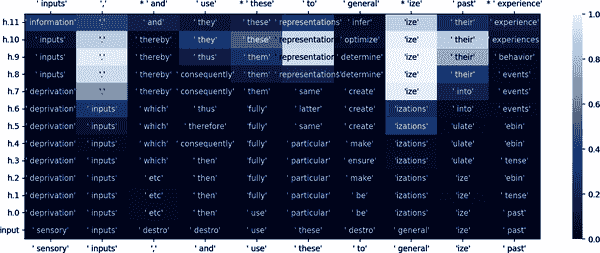

###### 图 3-1\. 查看进入第 75 到 100 位置的每个层的 logits

看到具体的词语很好，但您还想知道模型在每个步骤中建议正确令牌的接近程度。

```
# Ranks of the correct token
plot_logit_lens(
    model,
    tokenizer,
    input_ids,
    start_ix=75,
    end_ix=100,
    ranks=True # ranks of the correct token
)
```

您将获得每个层的排名表格（见图 3-2）。

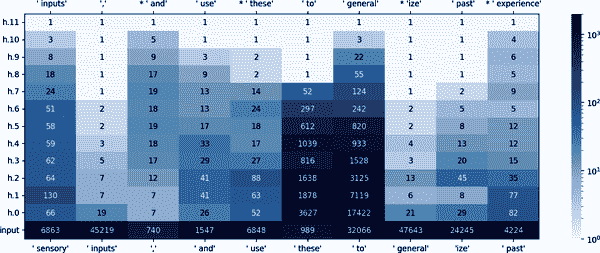

###### 图 3-2\. 每个层的正确令牌概率的排名，领先于第 75 到 100 位置

KL 散度有助于确定每层概率完全分布与最终输出之间的差异程度。

```
# Divergence from output distribution as token propagates through network
    plot_logit_lens(
    model,
    tokenizer,
    input_ids,
    start_ix=75,
    end_ix=100,
    kl=True
    # Divergence from output distribution as token propagates through network
)
```

这种分歧在早期很高，但随后随着输入通过网络传播，逐渐接近 0（见图 3-3）。

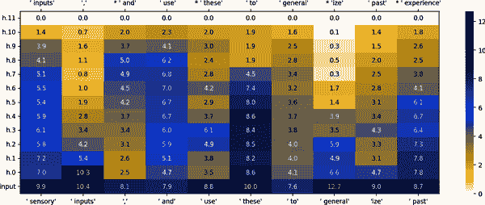

###### 图 3-3\. 概率的 KL 散度

如果前面的内容对您不够详细，您还可以指定包含网络子块。

```
# Copying a Rare token
plot_logit_lens(
    model,
    tokenizer,
    input_ids,
    start_ix=75,
    end_ix=100,
    ranks=True,
    include_subblocks=True, # Whether to include subblocks
)
```

使用此功能，您可以看到正确输出令牌的排名需要多大努力才能超过所有竞争选择（见图 3-4）。

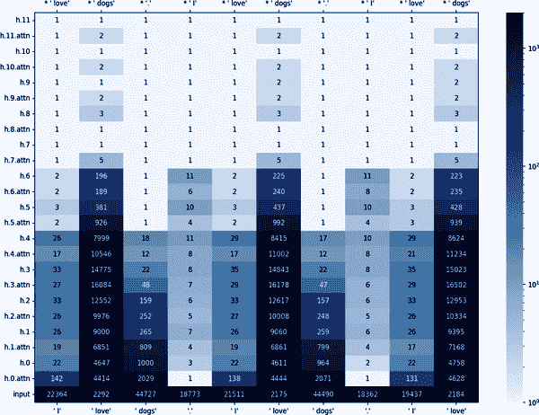

###### 图 3-4\. 稀有但正确输出令牌的排名，涵盖子块

`   `plot_logit_lens`实用程序具有许多不同粒度级别的选项。如果我们切换到更加重复的输入，所有这些会是什么样子？

```
# Extremely repetitive inputs
plot_logit_lens(
    model,
    tokenizer,
    input_ids,
    start_ix=75,
    end_ix=100,
    ranks=True,
    include_subblocks=True,
    decoder_layer_names=["h.11", "final_layernorm", "lm_head"],
)  # Adding in the names of the decoder layers
```

对重复输入的这种分析生成了图 3-5。

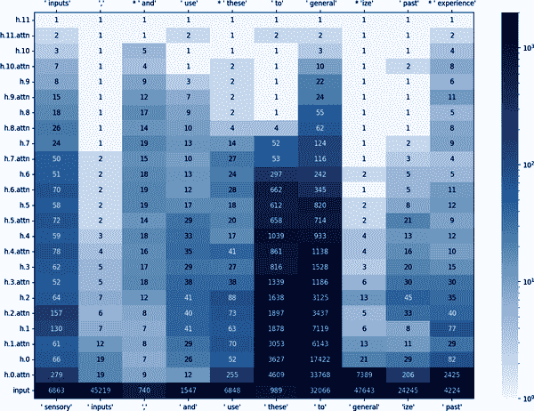

###### 图 3-5\. 对更重复的输入进行分析

那么这一切如何与三部分框架相关联？

如果您想进行应用级评估，机器学习工程师能否轻松理解正在发生的事情？您希望将应用级评估产生的解释与其他解释大型语言模型内部机制的方法进行比较。最重要的是，您希望将其与 ML 工程师的同事如何解释模型内部机制进行比较。

如果你想从“人类水平评估”的角度来评价这个解释，你会把焦点从仅限于机器学习开发者扩展到询问非机器学习软件工程师（或者更好的是非工程师）是否能理解模型中正在发生的事情。这种方法可能涉及在图中更明确地解释从输入到输出的框架。

你可以在得到人类反馈后进行功能级评估。一旦你了解了人类能够开始理解的解释类型，你就希望有某种代理指标来评估这些解释。例如，正确令牌在图表中出现的时间有多早？我们可以比较这种时间跨其他变压器模型。你还可以计时解释性方法的运行时间。分析 GPT 模型层次的各种方法比像 SHapley Additive exPlanations（或简称 SHAP，见“Shapley and SHAP”）这样的技术对如此大量的输入和输出来说要快得多。

# 解释模型和解释输出的方法

模型可解释性和可解释性领域发展迅速。然而，一些方法即使经过数十年的使用仍经受住了时间的考验。

## 本质上可解释的模型

一些模型易于解释，因为它们的各个参数对应于人类可以轻松理解的决策点，例如线性和逻辑回归模型、符号回归模型、支持向量机和决策树。

### 线性回归

*线性回归*（以及多元线性回归）或许是最简单的固有可解释模型类型。线性回归模型只需输入一个依赖变量和一个独立变量的数据集。给定数据集 <math alttext="StartSet y Subscript i Baseline comma x Subscript i Baseline 1 Baseline comma ellipsis comma x Subscript i p Baseline EndSet Subscript i equals 1 Superscript n"><msubsup><mrow><mo>{</mo><msub><mi>y</mi> <mi>i</mi></msub> <mo>,</mo><msub><mi>x</mi> <mrow><mi>i</mi><mn>1</mn></mrow></msub> <mo>,</mo><mo>...</mo><mo>,</mo><msub><mi>x</mi> <mrow><mi>i</mi><mi>p</mi></mrow></msub> <mo>}</mo></mrow> <mrow><mi>i</mi><mo>=</mo><mn>1</mn></mrow> <mi>n</mi></msubsup></math> ，其中 <math alttext="y"><mi>y</mi></math> 表示独立变量，<math alttext="x"><mi>x</mi></math> 表示依赖变量，模型为 <math alttext="y Subscript i Baseline equals beta 0 plus beta 1 x Subscript i Baseline 1 Baseline plus ellipsis plus beta Subscript p Baseline x Subscript i p Baseline plus epsilon Subscript i Baseline equals bold x Subscript i Superscript upper T Baseline beta plus epsilon Subscript i"><mrow><msub><mi>y</mi> <mi>i</mi></msub> <mo>=</mo> <msub><mi>β</mi> <mn>0</mn></msub> <mo>+</mo> <msub><mi>β</mi> <mn>1</mn></msub> <msub><mi>x</mi> <mrow><mi>i</mi><mn>1</mn></mrow></msub> <mo>+</mo> <mo>...</mo> <mo>+</mo> <msub><mi>β</mi> <mi>p</mi></msub> <msub><mi>x</mi> <mrow><mi>i</mi><mi>p</mi></mrow></msub> <mo>+</mo> <msub><mi>ϵ</mi> <mi>i</mi></msub> <mo>=</mo> <msubsup><mi>𝐱</mi> <mrow><mi>i</mi></mrow> <mi>T</mi></msubsup> <mi>β</mi> <mo>+</mo> <msub><mi>ϵ</mi> <mi>i</mi></msub></mrow></math> ，其中 <math alttext="i equals 1 comma ellipsis comma n"><mrow><mi>i</mi> <mo>=</mo> <mn>1</mn> <mo>,</mo> <mo>...</mo> <mo>,</mo> <mi>n</mi></mrow></math> 。

这里各个 beta 项描述了线性关系，而 epsilon 表示随机误差项。要看到这一点的实际效果，让我们看一个非常简单的线性回归示例：

```
# 1\. Create example data in the form of Numpy arrays
import numpy as np

# Create a random dataset
rng = np.random.RandomState(1)
X = np.linspace(0, 6, 100)[:, np.newaxis]
y = np.sin(X).ravel() + np.sin(6 * X).ravel() + rng.normal(0, 0.1, X.shape[0])

# 2\. fit a scikit-learn linear regression model
from sklearn.linear_model import LinearRegression
from sklearn.metrics import mean_squared_error, r2_score

# Create linear regression object
regr = LinearRegression()

# Train the model using the training sets
regr.fit(X, y)

# Make predictions using the testing set
y_pred = regr.predict(X)

# The coefficients
print('Coefficients: \n', regr.coef_)
# The mean squared error
print("Mean squared error: %.2f"
      % mean_squared_error(y, y_pred))
# Explained variance score: 1 is perfect prediction
print('Variance score: %.2f' % r2_score(y, y_pred))
```

```
Coefficients:
 [-0.35745894]
Mean squared error: 0.61
Variance score: 0.39
```

如果你有一个回归问题，在转向更复杂的模型之前，首先确保线性回归能够充分解决这个问题是最佳实践。你可能会惊讶地看到有多少问题可以通过线性回归模型充分解决。¹¹

###### 提示

想要在 (Intel) CPU 上加速 scikit-learn 吗？通过 [scikit-learn-intelex](https://oreil.ly/YEwz1)，只需添加一行代码，速度提高了大约 1.4 至 4,800 倍：

```
from sklearnex import patch_sklearn; patch_sklearn()
```

谈到代码，这些固有可解释模型可以在笔记本 [*Chapter_3_Intrinsically_Interpretable_Models.ipynb*](https://oreil.ly/IxnwJ) 中进一步探索。

### 逻辑回归

*逻辑回归*是一种线性模型，用于预测分类变量的概率。换句话说，它是一个二元分类器。之所以称为“回归”，是因为它是一个事件或变量概率的回归模型。该事件或变量的值取决于是否达到了某个概率阈值。

在文献中，逻辑回归也被称为*logit 回归*、*最大熵分类（MaxEnt）*或*对数线性分类器*。在该模型中，通过一个[逻辑函数](https://oreil.ly/yvTrp)，来建模描述单次试验可能结果的概率，其中<math alttext="f left-parenthesis x right-parenthesis equals StartFraction upper L Over 1 plus e Superscript minus k left-parenthesis x minus x 0 right-parenthesis Baseline EndFraction"><mrow><mi>f</mi> <mrow><mo>(</mo> <mi>x</mi> <mo>)</mo></mrow> <mo>=</mo> <mfrac><mi>L</mi> <mrow><mn>1</mn><mo>+</mo><msup><mi>e</mi> <mrow><mo>-</mo><mi>k</mi><mo>(</mo><mi>x</mi><mo>-</mo><msub><mi>x</mi> <mn>0</mn></msub> <mo>)</mo></mrow></msup></mrow></mfrac></mrow></math>，其中<math alttext="x 0"><msub><mi>x</mi> <mn>0</mn></msub></math>是 S 型函数中点的<math alttext="x"><mi>x</mi></math>值，<math alttext="upper L"><mi>L</mi></math>是曲线的最大值，<math alttext="k"><mi>k</mi></math>是逻辑增长率或曲线的陡峭度。

在此代码片段中，您可以创建一个基本的逻辑回归模型，然后查看决策边界。

```
import numpy as np
from sklearn.linear_model import LogisticRegression

import matplotlib.pyplot as plt

# 1\. Create example data in the form of Numpy arrays

# Create a random dataset
rng = np.random.RandomState(0)
X = np.array([[1, 50], [5, 20], [3, 80], [5, 60]])
y = [0, 0, 1, 1]

# 2\. fit a scikit-learn logistic regression model

# Fit the model
clf = LogisticRegression()
clf.fit(X, y)

# 3\. plot the model coefficients with matplotlib

# Plot the points
plt.scatter(X[:,0], X[:,1], c=y, s=30, cmap=plt.cm.Paired)

# Plot the decision function
ax = plt.gca()
xlim = ax.get_xlim()
ylim = ax.get_ylim()

# create grid to evaluate model
xx = np.linspace(xlim[0], xlim[1], 30)
yy = np.linspace(ylim[0], ylim[1], 30)
YY, XX = np.meshgrid(yy, xx)
xy = np.vstack([XX.ravel(), YY.ravel()]).T
Z = clf.decision_function(np.column_stack([xx.ravel(), yy.ravel()]))

# put the result into a color plot
Z = Z.reshape(xx.shape)
ax.contourf(xx, yy, Z, cmap=cm_piyg, alpha=0.8)

# plot the training points
ax.scatter(
    X_train[:, 0], X_train[:, 1], c=y_train, cmap=cm_bright, edgecolors="k"
)
# and testing points
ax.scatter(
    X_test[:, 0],
    X_test[:, 1],
    c=y_test,
    cmap=cm_bright,
    edgecolors="k",
    alpha=0.6,
)
ax.set_xlim(xx.min(), xx.max())
ax.set_ylim(yy.min(), yy.max())
ax.set_xticks(())
ax.set_yticks(())
```

就像线性回归是回归问题的简单首选一样，逻辑回归是分类问题的简单首选。正如您在前面的代码片段中看到的那样，逻辑回归模型定义起来非常简单，大部分代码用于绘图。

将它们的输出描述为输入变量加权和的线性模型易于实施和理解。问题在于它们依赖于通常在现实世界中不成立的某些假设。例如，线性回归通常假设误差ε遵循高斯分布，但现实世界的现象可能遵循看起来与高斯分布完全不同的分布。有些变量可能会互相作用，而另一些则可能不会。在相互作用的变量中，有些可能具有线性关系，而另一些可能具有非线性关系。幸运的是，有各种各样的非线性模型可以更好地拟合数据，同时仍然提供解释能力。

### 广义线性模型

如果给定特征时目标结果*y*不符合高斯分布，则广义线性模型（GLM）是一个不错的选择。GLM 的主要方法是保持特征的加权和，但允许非高斯结果分布，并将此分布的期望均值与加权和相连接。

<math alttext="g left-parenthesis upper E Subscript upper Y Baseline left-parenthesis y vertical-bar x right-parenthesis right-parenthesis equals beta 0 plus beta 1 x 1 plus ellipsis beta Subscript p Baseline x Subscript p" display="block"><mrow><mi>g</mi> <mrow><mo>(</mo> <msub><mi>E</mi> <mi>Y</mi></msub> <mrow><mo>(</mo> <mi>y</mi> <mo>|</mo> <mi>x</mi> <mo>)</mo></mrow> <mo>)</mo></mrow> <mo>=</mo> <msub><mi>β</mi> <mn>0</mn></msub> <mo>+</mo> <msub><mi>β</mi> <mn>1</mn></msub> <msub><mi>x</mi> <mn>1</mn></msub> <mo>+</mo> <mo>...</mo> <msub><mi>β</mi> <mi>p</mi></msub> <msub><mi>x</mi> <mi>p</mi></msub></mrow></math>

虽然 GLMs 可用于高斯分布，但这种方法也可应用于泊松、Gamma 和反 Gamma 分布。

对于 GLMs，你可以使用 scikit-learn 的[广义线性模型](https://oreil.ly/lxOV8)。在导入 TweedieRegressor 后，你可以调整`power`、`alpha`和`link`设置来调整线性模型的复杂性。

```
>>> from sklearn.linear_model import TweedieRegressor
>>> reg = TweedieRegressor(power=1, alpha=0.5, link='log')
>>> reg.fit([[0, 0], [0, 1], [2, 2]], [0, 1, 2])
TweedieRegressor(alpha=0.5, link='log', power=1)
>>> reg.coef_
array([0.2463..., 0.4337...])
>>> reg.intercept_
-0.7638...
```

输出是一系列系数（所有 beta 值）和一个截距（对应于第一个 beta）。

### 广义可加模型

如果特征与*y*之间的真实关系不是线性的，那么**广义可加模型**（GAM）是一个不错的选择。GAMs 基本上是允许非线性关系的广义线性模型（GLMs）。其公式非常相似：

<math alttext="g left-parenthesis upper E Subscript upper Y Baseline left-parenthesis y vertical-bar x right-parenthesis right-parenthesis equals beta 0 plus f 1 left-parenthesis x 1 right-parenthesis plus f 2 left-parenthesis x 2 right-parenthesis plus ellipsis plus f Subscript p Baseline left-parenthesis x Subscript p Baseline right-parenthesis" display="block"><mrow><mi>g</mi> <mrow><mo>(</mo> <msub><mi>E</mi> <mi>Y</mi></msub> <mrow><mo>(</mo> <mi>y</mi> <mo>|</mo> <mi>x</mi> <mo>)</mo></mrow> <mo>)</mo></mrow> <mo>=</mo> <msub><mi>β</mi> <mn>0</mn></msub> <mo>+</mo> <msub><mi>f</mi> <mn>1</mn></msub> <mrow><mo>(</mo> <msub><mi>x</mi> <mn>1</mn></msub> <mo>)</mo></mrow> <mo>+</mo> <msub><mi>f</mi> <mn>2</mn></msub> <mrow><mo>(</mo> <msub><mi>x</mi> <mn>2</mn></msub> <mo>)</mo></mrow> <mo>+</mo> <mo>...</mo> <mo>+</mo> <msub><mi>f</mi> <mi>p</mi></msub> <mrow><mo>(</mo> <msub><mi>x</mi> <mi>p</mi></msub> <mo>)</mo></mrow></mrow></math>

唯一的区别是线性项<math alttext="beta Subscript p Baseline x Subscript p"><mrow><msub><mi>β</mi> <mi>p</mi></msub> <msub><mi>x</mi> <mi>p</mi></msub></mrow></math> 被更加灵活的<math alttext="f Subscript p Baseline left-parenthesis x Subscript p Baseline right-parenthesis"><mrow><msub><mi>f</mi> <mi>p</mi></msub> <mrow><mo>(</mo> <msub><mi>x</mi> <mi>p</mi></msub> <mo>)</mo></mrow></mrow></math> 函数（通常代表样条函数）取代。它仍然是特征的总和，但现在可选的非线性由这些函数表示。

要在 Python 中使用 GAMs，你可以使用[pyGAM](https://oreil.ly/eQwEd)。

```
!pip install pygam
from pygam import LinearGAM

import matplotlib.pyplot as plt
redwine_url = 'https://matthewmcateer.me/media/oreilly_book/redwine-quality.csv'
redwine = pd.read_csv(redwine_url)
# Prepare dataset
redwine_X = redwine.drop(['quality'], axis=1).values
redwine_y = redwine['quality']
# Build model with gridsearch
lams = np.random.rand(100, 11)
lams = lams * 11 - 3
lams = np.exp(lams)
print(lams.shape)
gam = LinearGAM(n_splines=10).gridsearch(redwine_X, redwine_y, lam=lams)
# Create partial dependence plots
titles = redwine.columns[0:11]
plt.figure()
fig, axs = plt.subplots(1,11,figsize=(40, 5))

for i, ax in enumerate(axs):
    XX = gam.generate_X_grid(term=i)
    ax.plot(XX[:, i], gam.partial_dependence(term=i, X=XX))
    ax.plot(
        XX[:, i],
        gam.partial_dependence(term=i, X=XX, width=0.95)[1],
        c="r",
        ls="--",
    )
    if i == 0:
        ax.set_ylim(-30, 30)
    ax.set_title(titles[i])
```

### 广义可加模型加交互项

如果特征之间存在交互作用，那么你可以手动添加交互项，或者转向**广义可加模型加交互项**（GA2Ms）。¹² 这些模型捕捉的交互作用比普通的 GAMs 复杂得多。将 GA2Ms 应用到数据集上与应用 GAMs 并没有太大区别。

```
import pandas as pd
import numpy as np
from interpret import show
from interpret.data import Marginal
from sklearn.model_selection import train_test_split

np.random.seed(0)
df = pd.read_csv('/winequality-red.csv') # Load the data

Y = df['quality'] # The target variable is 'quality'
X = df[
    [
        "fixed acidity",
        "volatile acidity",
        "citric acid",
        "residual sugar",
        "chlorides",
        "free sulfur dioxide",
        "total sulfur dioxide",
        "density",
        "pH",
        "sulphates",
        "alcohol",
    ]
]
X_featurenames = X.columns
# Split the data into train and test data:
X_train, X_test, Y_train, Y_test = train_test_split(X, Y, test_size = 0.2)

# Loading the data exploration tool
marginal = Marginal().explain_data(X_train, Y_train, name = 'Train Data')
show(marginal)
```

除了探索数据外，你还可以训练 GA2M 模型，它表现为`ExplainableBoostingRegressor`类。如果你在解决分类问题，可以使用`ExplainableBoostingClassifier`类。

```
from interpret.glassbox import (
    ExplainableBoostingRegressor,
    LinearRegression,
    RegressionTree,
)

lr = LinearRegression(random_state=seed)
lr.fit(X_train, Y_train)

rt = RegressionTree(random_state=seed)
rt.fit(X_train, Y_train)

ebm = ExplainableBoostingRegressor(random_state=seed)
ebm.fit(X_train, Y_train)
# For Classifier, use ebm = ExplainableBoostingClassifier()
```

使用这种方法的缺点是什么？虽然 GA2M 中的成对交互项极大地提高了准确性，但该模型的计算非常耗时和 CPU 密集。

### 符号回归

先前描述的许多方法都可以视为创建大型方程作为模型的方式。*符号回归*（SR）将这一过程推向极致，通过迭代地改变公式的组成部分以更好地拟合数据。SR 寻求以（希望是优雅的）数学表达式形式的数据准确模型。SR 通常被认为是困难的，并且通常使用进化算法尝试。如果你有表格数据或者可以用方程描述的数据，那么符号回归是一个不错的选择。

假设你有一个二维数据集，如下所示。

```
import numpy as np

X = 2 * np.random.randn(100, 5)
y = 2.5382 * np.cos(X[:, 3]) + X[:, 0] ** 2 - 0.5
```

这个数据集包含 100 个数据点，每个数据点有 5 个特征。与模型的关系是 2.5382 <math alttext="cosine left-parenthesis x 3 right-parenthesis plus x 0 squared minus 0.5"><mrow><mo form="prefix">cos</mo> <mrow><mo>(</mo> <msub><mi>x</mi> <mn>3</mn></msub> <mo>)</mo></mrow> <mo>+</mo> <msubsup><mi>x</mi> <mn>0</mn> <mn>2</mn></msubsup> <mo>-</mo> <mn>0</mn> <mo>.</mo> <mn>5</mn></mrow></math> 。现在，让我们创建一个 [PySR](https://oreil.ly/GeV6M) 模型并进行训练。PySR 的主要接口采用了类似 scikit-learn 的风格。

```
from pysr import PySRRegressor
model = PySRRegressor(
    model_selection="best",  # Result is mix of simplicity+accuracy
    niterations=40,
    binary_operators=["+", "*"],
    unary_operators=[
        "cos",
        "exp",
        "sin",
        "inv(x) = 1/x",
	# ^ Custom operator (julia syntax)
    ],
    extra_sympy_mappings={"inv": lambda x: 1 / x},
    # ^ Define operator for SymPy as well
    loss="loss(x, y) = (x - y)²",
    # ^ Custom loss function (julia syntax)
)
```

这将设置模型为搜索代码的 40 次迭代，其中包含数十万次的变异和方程求解。然后，您可以通过运行 `model.fit(X, y)` 将模型拟合到数据上。在内部，这将启动一个 Julia 进程，该进程将进行多线程搜索以适应数据集的方程式。

###### 注意

如果您不熟悉 [Julia 语言](https://julialang.org)，它对机器学习非常有用。Julia 是一种动态的、通用的编程语言，能够进行高性能科学计算，支持高级代码中的 UTF-8 编码，如数学符号和表情符号。

如果您想了解更多，O’Reilly 有一些很棒的资源，比如 [“学习 Julia”](https://oreil.ly/E58zY)。

方程式将在训练过程中打印出来，一旦您满意，可以通过按 `'q'` 然后 `\<enter\>` 来提前退出。模型拟合完成后，您可以运行 `model.predict(X)` 来查看在给定数据集上的预测结果。运行 `print(model)` 可以打印出学习到的方程式。

```
PySRRegressor.equations_ = [
	   pick     score                                           equation \
	0        0.000000                                          4.4324794 \
	1        1.255691                                          (x0 * x0) \
	2        0.011629                          ((x0 * x0) + -0.28087974) \
	3        0.897855                              ((x0 * x0) + cos(x3)) \
	4        0.857018                ((x0 * x0) + (cos(x3) * 2.4566472)) \
	5  >>>>       inf  (((cos(x3) + -0.19699033) * 2.5382123) + (x0 *... \
       loss  complexity
  42.354317           1
   3.437307           3
   3.358285           5
   1.368308           6
   0.246483           8
   0.000000          10
]
```

这个箭头在 `pick` 列中表示您的 `model_selection` 策略当前选择的方程式用于预测（您也可以在 `.fit(X, y)` 后更改 `model_selection`）。`model.equations_` 是一个 Pandas DataFrame，包含所有方程式，包括可调用格式（`lambda_format`）、SymPy 格式（`sympy_format`，您也可以通过 `model.sympy()` 获得）、以及 JAX 和 PyTorch 格式（这两者都是可微分的，可以通过 `model.jax()` 和 `model.pytorch()` 获得）。

### 支持向量机

作为神经网络方法的前身，*支持向量机*（SVM）是一组用于分类、回归和异常检测的监督学习方法。SVM 在处理高维数据时效果显著，可能比数据集中的样本更多的维度还要多。SVM 内存效率高，可以通过核函数进行定制化（虽然像 sklearn 这样的包已经具有了一些出色的核函数）。SVM 的主要缺点是如果要避免过拟合，正则化至关重要。与逻辑回归等方法不同，SVM 不提供概率估计。您需要使用类似五折交叉验证的方法来获取这些估计，这样做可能会消除使用 SVM 的计算效率优势。

要使用 SVM，有许多方法，但最流行的是 scikit-learn 的[支持向量机实现](https://oreil.ly/5NYAF)。

```
>>> from sklearn import svm
>>> X = [[0, 0], [1, 1]]
>>> y = [0, 1]
>>> clf = svm.SVC()
>>> clf.fit(X, y)
SVC()
>>> clf.predict([[2., 2.]])
array([1])
>>> # get support vectors
>>> clf.support_vectors_
array([[0., 0.],
       [1., 1.]])
>>> # get indices of support vectors
>>> clf.support_
array([0, 1]...)
>>> # get number of support vectors for each class
>>> clf.n_support_
array([1, 1]...)
```

### 决策树

类似于 SVM，*决策树*在拟合非线性关系方面表现出色（尽管它们在处理线性关系时可能会遇到困难）。决策树擅长的是将数据分类为不同组，并提供直观的可视化。

与许多其他机器学习方法类似，scikit-learn 提供了多种[决策树变体](https://oreil.ly/u81jy)。还值得一提的是其中一种更受欢迎的可解释决策树算法：[XGBoost](https://oreil.ly/EkTuq)（它也具有类似于[scikit-learn 的 API](https://oreil.ly/pz1qL)）。

```
# create an xgboost regression model
model = XGBRegressor(
    n_estimators=1000, max_depth=7, eta=0.1, subsample=0.7, colsample_bytree=0.8
)

np.random.seed(0)
df = pd.read_csv("/winequality-red.csv")  # Load the data

Y = df["quality"]  # The target variable is 'quality'
X = df[
    [
        "fixed acidity",
        "volatile acidity",
        "citric acid",
        "residual sugar",
        "chlorides",
        "free sulfur dioxide",
        "total sulfur dioxide",
        "density",
        "pH",
        "sulphates",
        "alcohol",
    ]
]
X_featurenames = X.columns
# Split the data into train and test data:
# X_train, X_test, Y_train, Y_test = train_test_split(X, Y, test_size = 0.2)

# define model evaluation method
cv = RepeatedKFold(n_splits=10, n_repeats=3, random_state=1)
# evaluate model
scores = cross_val_score(
    model, X, y, scoring="neg_mean_absolute_error", cv=cv, n_jobs=-1
)

# define model evaluation method
cv = RepeatedKFold(n_splits=10, n_repeats=3, random_state=1)
# evaluate model
scores = cross_val_score(
    model, X, y, scoring="neg_mean_absolute_error", cv=cv, n_jobs=-1
)
# force scores to be positive
scores = absolute(scores)
print("Mean MAE: %.3f (%.3f)" % (scores.mean(), scores.std()))
```

### 决策规则

*决策规则*是一组 if-then 语句，可用于做出决策。如果 if-then 语句中的条件得到满足，则会执行决策规则。决策规则通常用于决策过程中，因为它们易于理解并且可以快速应用。当大多数人开始使用像 Python 这样的编程语言时，他们通常会广泛使用 if-then 语句。因此，这可以成为理解决策逻辑的一种非常直观的方式。

创建一个包含大量特征的数据集的 if-then 语句可能非常耗时。有许多算法可以生成这些规则。以下是其中三种最受欢迎的：

*OneR*

OneR 基于单个特征学习规则。这是一种最简单且易于理解的方法之一。虽然其他算法可能生成更准确的规则，但 OneR 快速而简单，足以作为与其他算法进行比较的基准。要在 Python 中使用 OneR，您可以使用[MLxtend 库](https://oreil.ly/BDIoD)中的`OneRClassifier`实现。

###### 注意

OneR 是一个非常简单的算法，假设数据是分类的。它在处理连续数据时效果不佳。您可能不希望依赖它来处理复杂的自然语言处理或计算机视觉任务。

*顺序覆盖*

顺序覆盖是一种迭代方法，通过添加新的 if-then 规则，移除被新规则解释的数据点，并重复该过程，直到所有数据点都得到解释。使用顺序覆盖生成的决策规则时，[Oracle 的 Skater 库](https://oreil.ly/LkiWk)有良好的实现。

*贝叶斯规则列表*

此方法涉及引入关于数据的各种频率统计作为起点的先验知识。这些关于模式的先验知识可以用来基于贝叶斯统计创建决策列表。根据实现方式，这可能还与顺序覆盖有一些重叠。对于通过贝叶斯规则列表实现决策规则，像[iModels](https://oreil.ly/yDK4M)包这样的工具是一个很好的选择；它具有类似于 sklearn 的接口。它还包含特定决策规则算法的实现，如 Friedman 和 Popescu 的 RuleFit。¹³

### 超越内在可解释模型

到目前为止，所有描述的模型都有一些简单的方法来将它们的参数转化为人类可理解的指导，以解释它们的基础决策。然而，在许多领域，您可能希望有一个预测数据模式的模型，而不管其参数的易理解程度如何。自 2012 年以来，基于神经网络的方法已经在许多领域取代了我们在这里描述的许多方法。考虑到神经网络的巨大变化，应该有一些不特定于任何一个模型的解释方法。

## 本地模型无关解释方法

正如我们之前提到的，本地可解释性侧重于理解个体预测的意义。许多先前讨论的模型都有内置的方法来解释局部预测，例如决策树中的项或多重线性回归。然而，如果我们比较包括许多不同神经网络架构的多个模型类型，使用这些内在可解释性方法将像是在比较苹果和橙子。这就是为什么我们理想地希望有一种方法来结合局部可解释性和模型无关的可解释性。

### 本地可解释模型无关解释

一个*本地可解释模型无关解释*（LIME）通过用本地可解释的替代模型替换复杂模型来解释预测。您可以将此技术应用于图像、文本，甚至表格数据。此技术的一般步骤如下：

1.  选择模型输出的一堆实例来解释您想要解释的模型。（这是*局部*的，因为我们只解释这个有限集而不是所有可能的模型输出的*全局*集合。）

1.  创建一个替代模型，它复制您想要解释的模型在这些实例上的行为。您将不了解模型内部，只知道输出的外观。

1.  创建输入数据的随机扰动，并查看替代模型如何对其进行分类。

1.  使用这些分类边界创建一个决策边界，可用于解释模型的预测。

如果您想要这个更正式的数学版本，假设输入数据为<math alttext="x"><mi>x</mi></math>。要解释的复杂模型是<math alttext="f"><mi>f</mi></math>，简单可解释模型是<math alttext="g"><mi>g</mi></math>（其中<math alttext="g element-of upper G"><mrow><mi>g</mi> <mo>∈</mo> <mi>G</mi></mrow></math>表明它属于稀疏线性模型的集合，如先前讨论的那种），而<math alttext="pi Subscript x"><msub><mi>π</mi> <mi>x</mi></msub></math>是一个指示您的数据点<math alttext="x"><mi>x</mi></math>局部邻域大小的接近度量。从这里，您将创建一个损失函数<math alttext="script upper L"><mi>ℒ</mi></math>，它将最小化<math alttext="f"><mi>f</mi></math>和<math alttext="g"><mi>g</mi></math>的输出之间的差异，使其在<math alttext="pi Subscript x"><msub><mi>π</mi> <mi>x</mi></msub></math>内。在不进行任何修改的情况下，这个过程将使复杂的<math alttext="g"><mi>g</mi></math>几乎与<math alttext="f"><mi>f</mi></math>相同。这就是为什么您要添加<math alttext="normal upper Omega left-parenthesis g right-parenthesis"><mrow><mi>Ω</mi> <mo>(</mo> <mi>g</mi> <mo>)</mo></mrow></math>，这是一个正则化项，限制您的可解释模型<math alttext="g"><mi>g</mi></math>的复杂性。这将带您到训练 LIME 的一般方程式。

<math alttext="xi left-parenthesis x right-parenthesis equals arg min Underscript g element-of upper G Endscripts script upper L left-parenthesis f comma g comma pi Subscript x Baseline right-parenthesis plus normal upper Omega left-parenthesis g right-parenthesis" display="block"><mrow><mi>ξ</mi> <mrow><mo>(</mo> <mi>x</mi> <mo>)</mo></mrow> <mo>=</mo> <munder><mrow><mo form="prefix">arg</mo><mo form="prefix" movablelimits="true">min</mo></mrow> <mrow><mi>g</mi><mo>∈</mo><mi>G</mi></mrow></munder> <mi>ℒ</mi> <mrow><mo>(</mo> <mi>f</mi> <mo>,</mo> <mi>g</mi> <mo>,</mo> <msub><mi>π</mi> <mi>x</mi></msub> <mo>)</mo></mrow> <mo>+</mo> <mi>Ω</mi> <mrow><mo>(</mo> <mi>g</mi> <mo>)</mo></mrow></mrow></math>

损失函数更具体地描述如下：

<math alttext="script upper L left-parenthesis f comma g comma pi Subscript x Baseline right-parenthesis equals sigma-summation Underscript z comma z prime element-of script upper Z Endscripts pi Subscript x Baseline left-parenthesis z right-parenthesis left-parenthesis f left-parenthesis z right-parenthesis minus g left-parenthesis z prime right-parenthesis right-parenthesis squared" display="block"><mrow><mi>ℒ</mi> <mrow><mo>(</mo> <mi>f</mi> <mo>,</mo> <mi>g</mi> <mo>,</mo> <msub><mi>π</mi> <mi>x</mi></msub> <mo>)</mo></mrow> <mo>=</mo> <munder><mo>∑</mo> <mrow><mi>z</mi><mo>,</mo><mi>z</mi><mi>â</mi><mi>€</mi><mi>™</mi><mo>∈</mo><mi>𝒵</mi></mrow></munder> <msub><mi>π</mi> <mi>x</mi></msub> <mrow><mo>(</mo> <mi>z</mi> <mo>)</mo></mrow> <msup><mrow><mo>(</mo><mi>f</mi><mrow><mo>(</mo><mi>z</mi><mo>)</mo></mrow><mo>-</mo><mi>g</mi><mrow><mo>(</mo><msup><mi>z</mi> <mo>'</mo></msup> <mo>)</mo></mrow><mo>)</mo></mrow> <mn>2</mn></msup></mrow></math>

直观地说，*解释*是模型行为的局部线性逼近。虽然模型在全局上可能非常复杂，但在特定实例的周围近似它会更容易。当将模型视为黑盒时，您扰动要解释的实例，并在其周围学习一个稀疏线性模型，作为解释。

模型的决策函数是非线性的。鲜红色的十字是被解释的实例（我们称之为*X*）。您对*X*周围的实例进行采样，并根据它们与*X*的接近程度进行加权（这里的权重由大小表示）。然后，您学习一个线性模型（虚线），在*X*附近很好地近似模型，但不一定在全局范围内。

### 深入示例：LIME 在视觉 Transformer 模型上的应用

存在许多关于 LIME 在基于 CNN 的图像分类器上的示例。由于这些是与模型无关的方法，值得通过在[视觉 Transformer (ViT)模型](https://oreil.ly/yfZ2E)上运行 LIME 来进行演示，用于图像分类。

###### 注意

您可以在笔记本[*Chapter_3_LIME_for_Transformers.ipynb*](https://oreil.ly/lwDoi)中找到与本教程相关的所有代码。

```
# Setting up your environment for LIME
!pip -qq install lime
!pip -qq install transformers
```

对于您的 NLP 示例，您可以使用专门针对金融领域进行了微调的 BERT 版本，称为 finBERT。这是一个 BERT 模型，可以对文本数据进行情感分析。

```
# Importing the sentiment classification model
import numpy as np
import lime
import torch
import torch.nn.functional as F
from lime.lime_text import LimeTextExplainer
from transformers import AutoTokenizer, AutoModelForSequenceClassification

tokenizer = AutoTokenizer.from_pretrained("ProsusAI/finbert")
model = AutoModelForSequenceClassification.from_pretrained("ProsusAI/finbert")
class_names = ["positive", "negative", "neutral"]
```

对于`LimeTextExplainer`类，您需要指定一个预测函数，该函数将接受输入并通过分词器和模型进行处理。

```
# Text predictor function for LIME
def predictor(texts):
    outputs = model(**tokenizer(texts, return_tensors="pt", padding=True))
    probas = F.softmax(outputs.logits).detach().numpy()
    print(probas.shape)
    return probas
```

对于实际的文本解释器，您需要提供样本句子和预测函数。在这个演示中，您将设置 LIME 来采集两千个样本。

```
# LIME Text Explainer
explainer = LimeTextExplainer(class_names=class_names)
example_text = (
    "alarming decrease in market share despite increases in " + \
    "revenue and decreased operating costs"
)
exp = explainer.explain_instance(
    example_text, predictor, num_features=20, num_samples=2000
)
exp.show_in_notebook(text=example_text)
```

在 图 3-6 中，除了输出的对数之外，您还可以看到哪些特征倾向于支持某个输出类别或另一个。

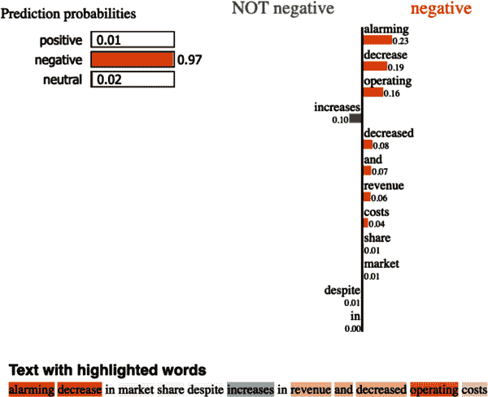

###### 图 3-6\. LIME 在文本输入上运行

LIME 不仅适用于文本分类，也适用于图像模型。

```
# Importing the image classification transformer model
import json
import os
import requests
import time

import lime
import matplotlib.pyplot as plt
import numpy as np
import torch
import torch.nn as nn
import torch.nn.functional as F
from PIL import Image
from torch.autograd import Variable
from torchvision import models, transforms
from transformers import ViTForImageClassification
from transformers import ViTFeatureExtractor

model = ViTForImageClassification.from_pretrained("google/vit-base-patch16-224")
feature_extractor = ViTFeatureExtractor.from_pretrained(
    "google/vit-base-patch16-224"
)

url = 'http://images.cocodataset.org/val2017/000000039769.jpg'
img = Image.open(requests.get(url, stream=True).raw).convert('RGB')
plt.imshow(img);
```

我们从开始处理 PIL 图像（图 3-7）。与任何 torchvision 模型一样，我们需要进行一些预处理。然而，由于原始 LIME 库的一个怪异之处，您需要添加一个解决方法：`LimeImageExplainer`。

```
# Importing the image classification transformer model
def get_pil_transform():
    transf = transforms.Compose(
        [transforms.Resize((256, 256)), transforms.CenterCrop(224)]
    )

    return transf

def get_preprocess_transform():
    normalize = transforms.Normalize(
        mean=[0.485, 0.456, 0.406], std=[0.229, 0.224, 0.225]
    )
    transf = transforms.Compose([transforms.ToTensor(), normalize])
    return transf

pil_transf = get_pil_transform()

def numpy_to_pil(numpy_array):
    if len(numpy_array.shape) == 3:
        return Image.fromarray(numpy_array)
    elif len(numpy_array.shape) == 4:
        pil_list = []
        for i in range(numpy_array.shape[0]):
            pil_list.append(Image.fromarray(numpy_array[i]))
        return pil_list
    else:
        raise ValueError(
            "The numpy array must be 3-dimensional or 4-dimensional"
        )
```

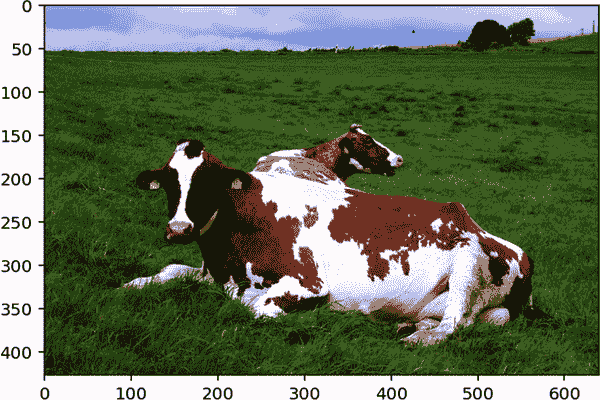

###### 图 3-7\. LIME 图像输入

与文本解释器一样，我们将创建一个预测函数，该函数接受一批图像并输出预测。您只需确保该函数正确地利用了 numpy-PIL 转换函数以及编码和模型。

```
from lime import lime_image

# Hide color is the color for a superpixel turned OFF. Alternatively,
# if it is NONE, the superpixel will be replaced by the average of its pixels
explainer = lime_image.LimeImageExplainer()
explanation = explainer.explain_instance(
    np.array(pil_transf(img)),
    # classification function
    batch_predict,
    top_labels=5,
    hide_color=0,
    num_samples=1000,
)
# number of images that will be sent to classification function
```

从这里，我们可以使用解释器来检查图像中与顶部预测类别对应的部分（图 3-8）。

```
# Analyzing top predicted class with LIME
from skimage.segmentation import mark_boundaries

temp, mask = explanation.get_image_and_mask(
    explanation.top_labels[0],
    positive_only=True,
    num_features=5,
    hide_rest=False,
)
img_boundary_1 = mark_boundaries(temp / 255.0, mask)
plt.imshow(img_boundary_1);
```

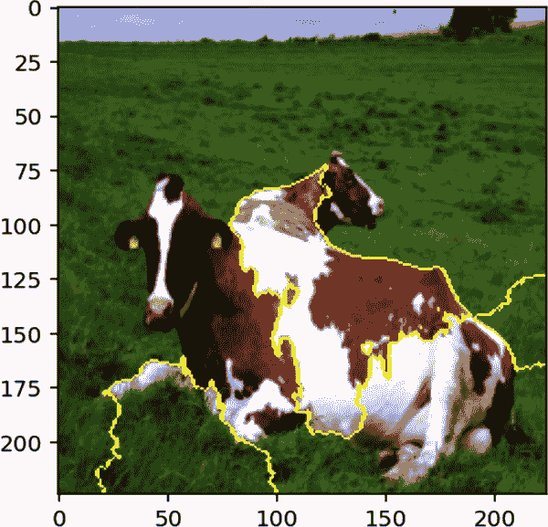

###### 图 3-8\. LIME 高亮的正面贡献

或者，如果我们只关注顶部类别的预测，我们可以进一步检查解释，以找出哪些部分支持决定，哪些部分反对它（图 3-9）。

```
# Positive and negative contributions
temp, mask = explanation.get_image_and_mask(
    explanation.top_labels[0],
    positive_only=False,
    num_features=10,
    hide_rest=False,
)
img_boundary_2 = mark_boundaries(temp / 255.0, mask)
plt.imshow(img_boundary_2);
```

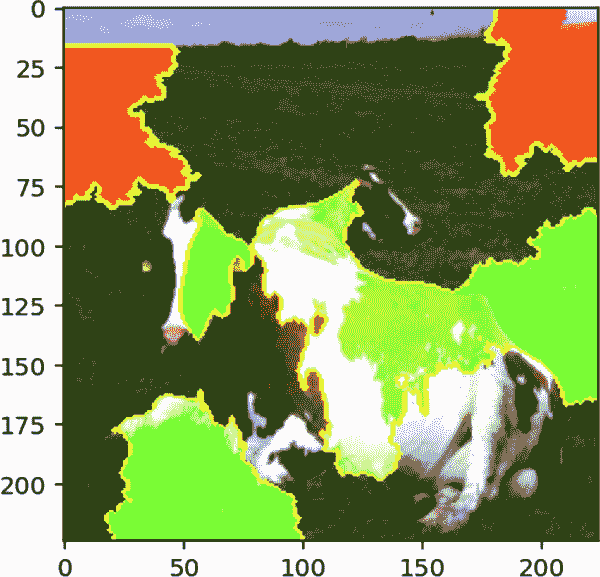

###### 图 3-9\. LIME 高亮的负面贡献

这些方法不是在变换器模型上使用 LIME 的唯一方式。在 Captum 软件包中描述了使用 LIME 的另一种方法的替代方法。

### 夏普利与 SHAP

[*SHapley Additive exPlanations* (SHAP)](https://oreil.ly/zbGHN) 是一种归因方法，公平地将预测分配给各个特征。这基于合作博弈论领域的 *夏普利值* 的概念。

假设我们有一组四个人一起合作进行游戏（也称为“联盟”）。这个游戏可能是一个机器学习竞赛。比赛结束后，他们根据结果得到一定的奖励，比如赢得第一名可获得 10,000 美元。中心问题是如何公平分配奖金。在机器学习竞赛中，每个联盟成员可能贡献了不同的部分，因此完全平均分配给所有成员是没有意义的。

劳埃德·夏普利于 1951 年提出了夏普利值。这些值告诉我们玩家对奖励的平均贡献。可解释的 AI 值 SHAP 利用夏普利值来确定输入实例的哪些特征导致了模型决策（而不是游戏中的玩家）。

Shapley 值的主要直觉是，它们衡量了如果没有某个玩家，联盟会如何发挥作用。假设在您的机器学习竞赛中，我们移除了域专家 Alice 玩家。团队原本可以排名第一，但最终排名第二，仅获得 $3,000 的奖金。您可能会在这里停下来，假设 Alice 贡献了奖金的 70%，但事实并非如此简单。

玩家彼此之间存在互动，因此我们还需要考虑玩家在共同工作时的表现。假设团队还有机器学习专家 Bob。Alice 只有在与 Bob 合作时才能取得出色的结果，因此贡献应该在他们之间分配。但我们还没有结束，因为我们还需要考虑子集，例如一个三人子集，排除 Bob，仅包含 Alice 和她的队友 Carol 和 Dylan。Shapley 值用于计算联盟的每个可能子集的每个玩家的贡献，并对所有这些贡献进行平均（被称为玩家的 *边际价值*）。

让我们回到机器学习的背景。正如前面提到的，我们可以将数据实例中的特征视为玩家，模型输出预测为奖金。Shapley 值告诉我们这个值如何在所有输入之间分配。SHAP 使用这种方法为个别预测创建局部解释，但也可以通过对传入模型的整个数据集的平均值进行全局解释。

我们如何实际计算 Shapley 值呢？考虑以下方程，用于获取您的黑盒模型 <math alttext="f"><mi>f</mi></math> 和输入数据实例 <math alttext="x"><mi>x</mi></math> 的特征值 <math alttext="i"><mi>i</mi></math> 的 Shapley 值（这将是表格数据集中的单行）。您需要迭代所有可能的特征子集（<math alttext="z prime"><mrow><mi>z</mi> <mi>â</mi> <mi>€</mi> <mi>™</mi></mrow></math>），以确保我们考虑了特征值之间的所有交互。我们将采样空间标记为 ′，因为对于像图像这样的更大实例，我们不会将每个像素视为特征；相反，我们找到一种方法来总结图像为更大的特征。您会获得包括我们感兴趣的特征的黑盒模型输出（<math alttext="f Subscript x Baseline left-parenthesis z prime right-parenthesis"><mrow><msub><mi>f</mi> <mi>x</mi></msub> <mrow><mo>(</mo> <msup><mi>z</mi> <mo>'</mo></msup> <mo>)</mo></mrow></mrow></math>），以及没有这个特征的输出（<math alttext="f Subscript x Baseline left-parenthesis z prime minus i right-parenthesis"><mrow><msub><mi>f</mi> <mi>x</mi></msub> <mrow><mo>(</mo> <mi>z</mi> <mi>â</mi> <mi>€</mi> <mi>™</mi> <mo>∖</mo> <mi>i</mi> <mo>)</mo></mrow></mrow></math>）。观察这两者告诉我们特征在该子集中如何影响模型输出。

然后，你要对每个特征子集的可能排列进行这样的操作，而每个排列的权重又取决于联合体中的玩家数量，或者我们针对数据实例<math alttext="upper M"><mi>M</mi></math>总共查看的特征数量。这使我们能够判断一个特征是否对模型的决策产生了很大的改变，即使我们已经考虑了很多其他特征。这也使我们能够更直接地观察在较小联合体中孤立特征的影响。

<math alttext="phi Subscript i Baseline left-parenthesis f comma x right-parenthesis equals sigma-summation Underscript z prime subset-of-or-equal-to x Superscript prime Baseline Endscripts StartFraction StartAbsoluteValue z Superscript prime Baseline EndAbsoluteValue factorial left-parenthesis upper M minus StartAbsoluteValue z Superscript prime Baseline EndAbsoluteValue minus 1 right-parenthesis factorial Over upper M factorial EndFraction left-parenthesis right-parenthesis f Subscript x Baseline left-parenthesis z Superscript prime Baseline right-parenthesis minus f Subscript x Baseline left-parenthesis z prime minus i right-parenthesis right-parenthesis" display="block"><mrow><msub><mi>φ</mi> <mi>i</mi></msub> <mrow><mo>(</mo> <mi>f</mi> <mo>,</mo> <mi>x</mi> <mo>)</mo></mrow> <mo>=</mo> <munder><mo>∑</mo> <mrow><mi>z</mi><mi>â</mi><mi>€</mi><mi>™</mi><mo>⊆</mo><msup><mi>x</mi> <mo>'</mo></msup></mrow></munder> <mfrac><mrow><mfenced close="|" open="|" separators=""><mi>z</mi><mi>â</mi><mi>€</mi><mi>™</mi></mfenced><mo>!</mo><mrow><mo>(</mo><mi>M</mi><mo>-</mo><mfenced close="|" open="|" separators=""><mi>z</mi><mi>â</mi><mi>€</mi><mi>™</mi></mfenced><mo>-</mo><mn>1</mn><mo>)</mo></mrow><mo>!</mo></mrow> <mrow><mi>M</mi><mo>!</mo></mrow></mfrac> <mfenced close=")" open="(" separators=""><mrow><mo>)</mo></mrow> <msub><mi>f</mi> <mi>x</mi></msub> <mrow><mo>(</mo> <msup><mi>z</mi> <mo>'</mo></msup> <mo>)</mo></mrow> <mo>-</mo> <msub><mi>f</mi> <mi>x</mi></msub> <mrow><mo>(</mo> <mi>z</mi> <mi>â</mi> <mi>€</mi> <mi>™</mi> <mo>∖</mo> <mi>i</mi> <mo>)</mo></mrow></mfenced></mrow></math>

仍然有一个问题：如果我们的模型通常接受固定大小的输入，我们如何从模型输入中移除特征？在 SHAP 中，通过用训练数据中其他位置的随机替换值替换已移除的特征值来解决这个问题。如果我们对所有子集都这样做，那么特征的相关性基本上会被采样掉。你完全打乱特征直到它们成为随机的，而完全随机的特征则不具有预测能力。

但是使用 SHAP 仍然存在一个障碍：计算复杂度很高。计算所有这些子集是昂贵的。对于具有<math alttext="n"><mi>n</mi></math>个特征的实例，我们有<math alttext="2 Superscript n"><msup><mn>2</mn> <mi>n</mi></msup></math>个子集。对于 10 个特征，我们有<math alttext="2 Superscript 10 Baseline equals 1 comma 024"><mrow><msup><mn>2</mn> <mn>10</mn></msup> <mo>=</mo> <mn>1</mn> <mo>,</mo> <mn>024</mn></mrow></math>个子集，对于 20 个特征，我们有<math alttext="2 Superscript 20 Baseline equals 1 comma 048 comma 576"><mrow><msup><mn>2</mn> <mn>20</mn></msup> <mo>=</mo> <mn>1</mn> <mo>,</mo> <mn>048</mn> <mo>,</mo> <mn>576</mn></mrow></math>个子集，以此类推。一个可能的解决方案是近似计算 SHAP，而不是精确计算。Kernel SHAP 对特征子集进行采样，并根据这些样本拟合线性回归模型。变量只是一个特征是否存在或缺失，输出值是预测结果。这个线性模型的系数可以解释为近似的 Shapley 值。这类似于 LIME，但我们不关心实例之间的接近程度，只关心它们包含的信息量。

SHAP 的其他近似方法包括 Tree SHAP 和 Deep SHAP，分别用于基于树的模型和深度神经网络。这些技术不再是真正的模型无关的，但好处在于它们至少可以利用模型内部加速计算。

### 深度分析示例：SHAP 对视觉 Transformer 模型的应用

SHAP 可用于解释多种不同类型数据的预测，从表格数据到图像和语言数据。

###### 注意

你可以在笔记本[*Chapter_3_SHAP_for_Transformers.ipynb*](https://oreil.ly/D8D5E)中找到与本教程相关的所有代码。图 3-10 到图 3-15 的交互版本也可在*Chapter_3_SHAP_for_Transformers.ipynb*笔记本中找到。

考虑使用 SHAP 分析大型语言模型的示例。

```
# Setting up your environment for SHAP
!pip -qq install shap
!pip -qq install transformers
```

对于您的分类任务，我们将使用 HuggingFace Transformers 库。我们将使用您的模型（DistilBERT）和相关的 tokenizer 创建一个标准的`TextClassificationPipeline`。

此模型是`distilbert-base-uncased`在 sst-2-english 数据集上微调的版本。即使是对其他在 sst-2-english 上微调的 distilbert 模型来说，替换这个模型名称也可能会导致可视化和输出标签的变化。

```
# Setting up environment for Text Classification
import shap
import transformers

from transformers import (AutoTokenizer,
                          AutoModelForSequenceClassification,
                          TextClassificationPipeline)

tokenizer_name = "distilbert-base-uncased"
model_name = "distilbert-base-uncased-finetuned-sst-2-english"

tokenizer = transformers.DistilBertTokenizerFast.from_pretrained(tokenizer_name)
model = transformers.DistilBertForSequenceClassification.from_pretrained(
    model_name
).cpu()

pipe = TextClassificationPipeline(
    model=model, tokenizer=tokenizer, return_all_scores=True
)

def score_and_visualize(text):
    prediction = pipe([text])
    print(prediction[0])

    explainer = shap.Explainer(pipe)
    shap_values = explainer([text])

    shap.plots.text(shap_values)
```

使用您的 DistilBERT 模型及其导入的 tokenizer，我们可以看到 SHAP 如何处理文本分类。以下是一个处理显然是积极文本的示例（参见图 3-10）。

```
# Looking at example sentences
score_and_visualize(
    'After tons of trial and error, I finally succeeded in opening '
    'a shawarma place run by machine learning. The road was long '
    'and tough, but I am so happy with the outcome!'
)
```

```
[
    {"label": "NEGATIVE", "score": 0.0003080847964156419},
    {"label": "POSITIVE", "score": 0.9996919631958008},
]
Partition explainer: 2it [00:14, 14.77s/it]
```

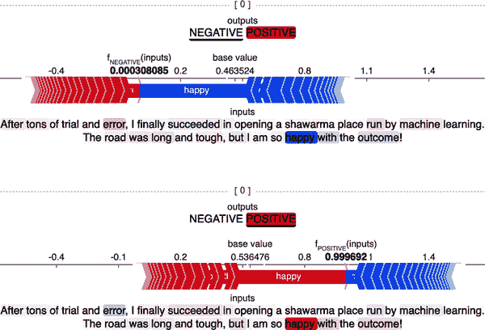

###### 图 3-10\. 在一个明显积极的示例句子上使用 SHAP。

并且这是一个处理有消极倾向的中性文本的示例（参见图 3-11）。

```
# Strong negative sentiment
score_and_visualize('I am neutral to the restaurant.')
```

```
[
    {"label": "NEGATIVE", "score": 0.9982801675796509},
    {"label": "POSITIVE", "score": 0.0017198126297444105},
]
```

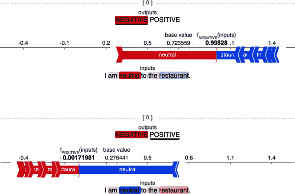

###### 图 3-11\. 在一个有意义上是中立评价（被认为是消极的）上使用 SHAP。

在这个例子中，我们再次分析中性文本，但这次是带有积极倾向的（参见图 3-12）。

```
# Neutral sentiment
score_and_visualize('I am impartial to the restaurant.')
```

```
[
    {"label": "NEGATIVE", "score": 0.0010014761937782168},
    {"label": "POSITIVE", "score": 0.9989985823631287},
]
```

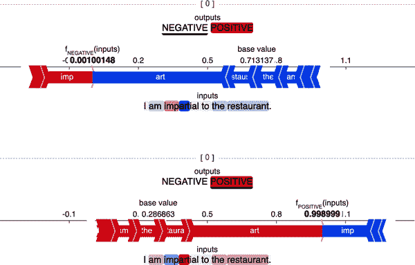

###### 图 3-12\. 在另一个有意义上是中立评价（被认为是积极的）的文本上使用 SHAP。

最后，在这里我们使用 SHAP 来分析一个更长且故意模糊的文本（参见图 3-13）。

```
# Analyzing a longer and intentionally ambiguous restaurant review
restaurant_review = (
    "This is easily the most underrated eatery this side of Cambridge, "
    "though that is also setting a low bar. The food was pretty good, "
    "but I did not like the service. The wait staff were really slow "
    "and did not seem to know what they were doing. The restaurant "
    "was really dirty and the owners did not seem to care. Still, I "
    "loved the food. It was amazing. As a flipside of the owners not "
    "caring, the establishment seemed remarkably dog-friendly. Some "
    "people will love this place. Some people will hate it. As for "
    "a final review, I won't not not give this place a good review."
)

score_and_visualize(restaurant_review)
```

```
[
    {"label": "NEGATIVE", "score": 0.007593947928398848},
    {"label": "POSITIVE", "score": 0.9924060702323914},
]
Partition explainer: 2it [00:29, 29.03s/it]
```

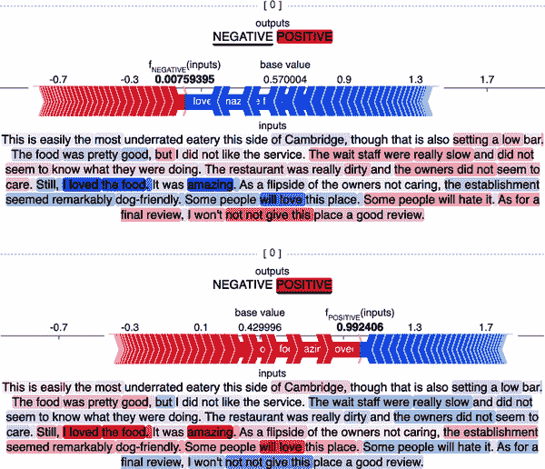

###### 图 3-13\. 在一个更长的评论上使用 SHAP。

您甚至可以将 SHAP 扩展到解释零样本分类任务（参见图 3-14）。¹⁴ 与之前的方法（除了导入更改外）的主要区别在于，我们将从导入的`ZeroShotClassificationPipeline`类创建一个自定义类`MyZeroShotClassification​Pipeline`。

```
# Setting up environment for zero-shot text classification
import shap
from transformers import (
    AutoModelForSequenceClassification,
    AutoTokenizer,
    ZeroShotClassificationPipeline,
)
from typing import Union, List

weights = "valhalla/distilbart-mnli-12-3"

model = AutoModelForSequenceClassification.from_pretrained(weights)
tokenizer = AutoTokenizer.from_pretrained(weights)

# Create your own pipeline that only requires the text parameter
# for the __call__ method and provides a method to set the labels
class MyZeroShotClassificationPipeline(ZeroShotClassificationPipeline):
    # Overwrite the __call__ method
    def __call__(self, *args):
        o = super().__call__(args[0], self.workaround_labels)[0]

        return [
            [
                {"label": x[0], "score": x[1]}
                for x in zip(o["labels"], o["scores"])
            ]
        ]

    def set_labels_workaround(self, labels: Union[str, List[str]]):
        self.workaround_labels = labels

example_text = "This is an example text about snowflakes in the summer"
labels = ["weather", "sports"]

# In the following, we address issue 2.
model.config.label2id.update({v: k for k, v in enumerate(labels)})
model.config.id2label.update({k: v for k, v in enumerate(labels)})

pipe = MyZeroShotClassificationPipeline(
    model=model, tokenizer=tokenizer, return_all_scores=True
)
pipe.set_labels_workaround(labels)

def score_and_visualize(text):
    prediction = pipe([text])
    print(prediction[0])

    explainer = shap.Explainer(pipe)
    shap_values = explainer([text])

    shap.plots.text(shap_values)

example_text = (
    "This is an example text about snowflakes in the "
    "summer before election season and after football season."
)
score_and_visualize(example_text)
```

```
[
    {"label": "weather", "score": 0.634835422039032},
    {"label": "entertainment", "score": 0.14570148289203644},
    {"label": "politics", "score": 0.09773397445678711},
    {"label": "sports", "score": 0.08319796621799469},
    {"label": "markets", "score": 0.03853125125169754},
]
Partition explainer: 2it [09:29, 569.93s/it]
```

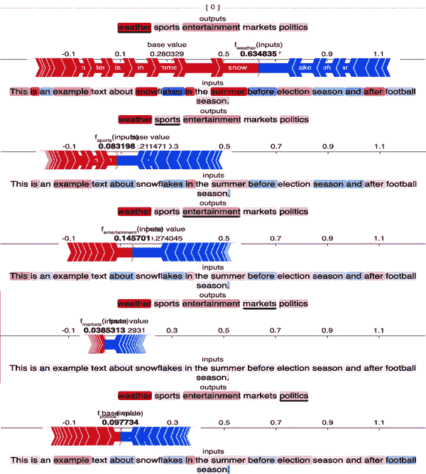

###### 图 3-14\. 使用 SHAP 解释零样本文本分类。

此示例展示了 SHAP 应用于完全中性文本的情况（参见图 3-15）。

```
example_text = "This is an example text about nothing at all."
score_and_visualize(example_text)
```

```
[
    {"label": "entertainment", "score": 0.6272065043449402},
    {"label": "markets", "score": 0.1165764182806015},
    {"label": "weather", "score": 0.0959262102842331},
    {"label": "politics", "score": 0.08200317621231079},
    {"label": "sports", "score": 0.07828763872385025},
]
Partition explainer: 2it [02:57, 177.37s/it]
```

现在，像 LIME 一样，SHAP 可以扩展到图像数据。

有许多关于[基于 CNN 的图像分类器上的 SHAP 示例](https://oreil.ly/eV5ib)。您可以在视觉示例中使用相同的方法，但 SHAP 示例大多数都是在简单数据集（如 MNIST）上演示的原因是有道理的。SHAP 操作输入数据的所有特征。对于文本来说，这是每个 token。对于图像来说，这是每个像素。即使您只是在手写数字的简单图像上运行 SHAP，计算成本也很高。

如果您想要一个用于神经网络处理图像数据的可解释性方法，还有更好的选择。例如，我们还没有介绍*全局*模型无关的可解释性方法。

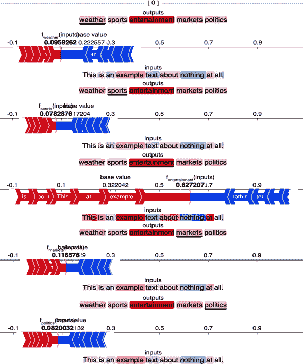

###### 图 3-15\. 在一个有意义上是中立输入上使用 SHAP 进行零样本文本分类。

## 全局模型无关的可解释性方法

如前所述，局部可解释性专注于理解个别决策。相比之下，全局方法旨在理解整个模型的行为。我们之前讨论的固有可解释方法提供了全局解释。然而，这些解释方法都是针对特定模型类型的。在这里，我们希望以与模型类型无关的方式检验模型的全局行为（模型无关）。

### 排列特征重要性

排列特征重要性指的是排列输入特征的部分，以查看修改时对输出预测造成最大变化的特征。这可以应用于图像、文本和表格数据。

排列特征重要性可以应用于视觉的一种方式是测试遮挡敏感性。这是指当图像的某些部分被任意大小的正方形遮挡时，决策输出的变化程度。

### 全局替代模型

这种技术涉及使用一个模型创建另一个行为极其相似的模型。这个想法是，你可以拿一个原本是黑盒的模型，创建一个本质上可解释的模型，其行为几乎与原模型完全相同（在这种情况下就是“替代模型”）。

这种方法的优点在于可以理解原本晦涩难懂模型的高级行为。缺点是所有解释都是针对替代模型而非原始模型本身。虽然替代模型的决策可能是一个接近的近似，但它们不是原始模型。

### 原型和批评

原型和批评都是基于示例的可解释性方法。*原型* 是设计成代表导致某个决策的所有数据点的合成数据点。批评则相反，它们创建一个代表导致错误决策的实例的合成数据点。

*MMD-critic* 是由 Kim 等人开发的基于示例的可解释性方法，将原型和批评结合在一个框架中。¹⁵ 在高层次上，可以总结如下：

1.  选择要查找的原型和批评的数量。

1.  使用贪婪搜索找到原型。

1.  选择原型以使原型分布接近数据分布。

1.  使用贪婪搜索找到批评。

1.  作为批评选定的点是原型分布与数据分布不同的地方。

## 解释神经网络

解释神经网络存在许多挑战。简单地说，神经网络是通用函数逼近器。这个想法是，通过在一个方程中使用足够多的参数，你可以做几乎任何事情。例如，正如著名物理学家冯·诺伊曼所说，“用四个参数我可以拟合一只大象，用五个参数我可以让它摇动鼻子。”

对于神经网络而言，每个神经元本质上都是一个巨大方程中的参数。一些参数最终可能是无用的，但只要模型能够很好地预测数据模式，我们通常不会太在意。

当涉及准确解释模型正在做什么时，这显然是一个问题。确实，根据您使用的框架，您可以为模式的定义添加大量抽象。事实上，[PyTorch 支持命名张量](https://oreil.ly/jWzUD)，这是向张量的维度添加语义含义的一种方式。

如果您创建模型行为的地图而没有映射出每一个神经元，您可能会觉得自己错过了一些信息。然而，如果您将模型权重的地图制作得太细粒度，那么您就无法理解它了。这个问题通常通过查看神经网络激活和行为中的更大模式来解决，但即使这样也可能无法讲述整个故事。例如，一些研究人员对神经网络的副本上演示了一些流行的可解释性方法。对于这些副本，他们随机化了神经网络权重的子集。尽管如此，他们发现这些可解释性方法在输出准确性相同的情况下无法区分网络。

尽管这些可解释性方法仍在不断改进中，它们通常仍然比完全没有任何可解释性方法要好。重要的是要认识到这些解释方法应该用于什么，不应该用于什么。

## 显著性映射

*显著性地图*是一个突出显示网络激活或关注的区域的图像。显著性地图的目标是反映像素对模型的重要性程度。*显著性映射*的用处在于它可以指出输入的特定部分（例如输入图像中的像素或输入文本中的标记），这些部分被归因于某个决策。

由于显著性映射允许您查看对不同决策有贡献的内容，这可以作为提供反事实证据的一种方式。例如，在二元文本情感分类任务中，可以查看会对积极或消极情感有所贡献的嵌入。

基于梯度的方法比像 LIME 或 SHAP 这样的方法计算速度快得多。

## 深入探讨：CLIP 中的显著性映射

[CLIP（对比语言-图像预训练）](https://oreil.ly/PQ4my) 是 OpenAI 创建的一个模型，用作文本表示和图像表示之间的桥梁。在实际应用中，这意味着它可以用来比较输入字符串（例如`"一个可爱的小猫坐在篮子里"`）所代表的概念与实际猫咪照片所代表的概念之间的相似性得分。OpenAI 的实现还经过训练，可以作为零样本图像分类器使用。例如，它不仅能够识别 ImageNet 中香蕉的照片，还能够识别损坏和低质量照片中以及画作中的香蕉。

训练网络以将文本嵌入与图像关联允许模型以人类可理解的方式描述图像内容，而不仅仅是作为表示预定输出类别数量的独热编码向量。

然而，所有这些能力都依赖于人类用户信任 CLIP 能够*正确*关联文本嵌入和图像嵌入。考虑到可能的图像和文本配对的巨大多样性，这并不是一项简单的任务。尽管如此，我们迄今所涵盖的概念可以提供一些指导。

###### 注意

您可以在笔记本 [*Chapter_3_CLIP_Saliency_mapping_Part1.ipynb*](https://oreil.ly/6pmRx) 和 [*Chapter_3_CLIP_Saliency_mapping_Part2.ipynb*](https://oreil.ly/GBP7Q) 中找到与本教程相关的代码。这些笔记本受到 [`hila-chefer` 的 `Transformer-MM-Explainability` 项目](https://oreil.ly/9iKQ7) 的启发，并利用了 Captum 库。

运行此代码需要大量 RAM。如果您在 Google Colab 中运行此代码，请使用 Colab Pro 中最大的 GPU，并将 RAM 设置为最高。

若要使用 CLIP，您可以从项目的 [公共存储库](https://oreil.ly/Q1xgq) 下载代码。我们将模型放在一个子目录中，您可以从中导入模型。

```
# Setting up your environment for CLIP

# Making sure the correct version of PyTorch is installed
!conda install --yes -c pytorch pytorch=1.7.1 torchvision cudatoolkit=11.0
# Installing other dependencies for OpenAI's CLIP
!pip install ftfy regex tqdm
# Installing dependencies for the saliency mapping
!pip install einops ftfy captum
# Installing CLIP directly from the project Repository
!pip install git+https://github.com/openai/CLIP.git

import numpy as np
import torch
from pkg_resources import packaging
%config InlineBackend.figure_format = 'retina'

print("Torch version:", torch.__version__)
```

一旦我们设置好您的开发环境，您可以下载 CLIP 模型的权重。这些权重可以直接从 OpenAI 获取。

```
# Loading the CLIP models directly from OpenAI
import clip

print("Available CLIP Models:\n", clip.available_models())

# Loading the model and the preprocessing step
model, preprocess = clip.load("ViT-B/32")
model.cuda().eval()
input_resolution = model.visual.input_resolution
context_length = model.context_length
vocab_size = model.vocab_size

print(
    "Model parameters:",
    f"{np.sum([int(np.prod(p.shape)) for p in model.parameters()]):,}",
)
print("Input resolution:", input_resolution)
print("Context length:", context_length)
print("Vocab size:", vocab_size)
```

```
Available CLIP Models:
['RN50',
 'RN101',
 'RN50x4',
 'RN50x16',
 'RN50x64',
 'ViT-B/32',
 'ViT-B/16',
 'ViT-L/14',
 'ViT-L/14@336px']
Model parameters: 151,277,313
Input resolution: 224
Context length: 77
Vocab size: 49408
```

在您使用任何输入测试 CLIP 之前，您需要设置预处理步骤。虽然 CLIP 是一个技术上令人印象深刻的模型，但不要忘记正确的预处理步骤。由于 CLIP 同时处理文本和图像，您需要能够预处理这两种数据类型。

```
# Text preprocessing
clip.tokenize("Hello World!")
```

```
tensor([[49406,  3306,  1002,   256, 49407,     0,     0,     0,     0,     0,
             0,     0,     0,     0,     0,     0,     0,     0,     0,     0,
             0,     0,     0,     0,     0,     0,     0,     0,     0,     0,
             0,     0,     0,     0,     0,     0,     0,     0,     0,     0,
             0,     0,     0,     0,     0,     0,     0,     0,     0,     0,
             0,     0,     0,     0,     0,     0,     0,     0,     0,     0,
             0,     0,     0,     0,     0,     0,     0,     0,     0,     0,
             0,     0,     0,     0,     0,     0,     0]], dtype=torch.int32)
```

对于文本预处理，我们将使用不区分大小写的分词器。

对于图像预处理，我们将进行标准的像素强度归一化，¹⁶ 图像调整大小和中心裁剪的过程。

我们可以自己创建这个预处理阶段，但我们没有必要。正如您早些时候看到的，我们可以加载特定模型的 CLIP 预处理模块。我们只需检查该预处理步骤，以确保它具有所有正确的阶段。

```
# Image preprocessing
preprocess
```

```
Compose(
    Resize(size=224, interpolation=bicubic, max_size=None, antialias=None)
    CenterCrop(size=(224, 224))
    <function _convert_image_to_rgb at 0x7f7c70b87560>
    ToTensor()
    Normalize(mean=(0.48145466, 0.4578275, 0.40821073),
              std=(0.26862954, 0.26130258, 0.27577711))
)
```

一旦完成，您将准备模型来接收一组示例图像及其文本描述。我们可以通过测量生成的文本特征和图像特征之间的余弦相似度来测试模型。

```
# Set up input images and text pairs
import os
import skimage
import IPython.display
import matplotlib.pyplot as plt
from PIL import Image
import numpy as np

from collections import OrderedDict
import torch

%matplotlib inline
%config InlineBackend.figure_format = 'retina'

# images in skimage to use and their textual descriptions
descriptions = {
    "phantom": "an MRI slice resembling a phantom rabbit",
    "cell": "a cell seen under a microscope",
    "brick": "a black and white photo of a brick road",
    "coins": "antique coins viewed by a flatbed scanner",
    "motorcycle_left": "a red motorcycle standing in a garage",
    "text": "handwritten integrals and math equations",
    "clock_motion": "a blurred image of a wall clock",
    "color": "a ranbow RGB color Palette"
}

original_images = []
images = []
texts = []
plt.figure(figsize=(16, 5))
```

如图 3-16 所示，我们拥有各种各样的图像，从逼真的到抽象的，从清晰定义的到模糊不清的。

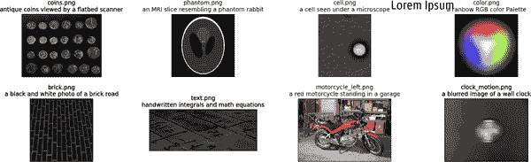

###### 图 3-16\. CLIP 将单词与图像匹配

```
for filename in [
    filename
    for filename in os.listdir(skimage.data_dir)
    if filename.endswith(".png") or filename.endswith(".jpg")
]:
    name = os.path.splitext(filename)[0]
    if name not in descriptions:
        continue
    image = Image.open(os.path.join(skimage.data_dir, filename)).convert("RGB")

    plt.subplot(2, 4, len(images) + 1)
    plt.imshow(image)
    plt.title(f"{filename}\n{descriptions[name]}")
    plt.xticks([])
    plt.yticks([])

    original_images.append(image)
    images.append(preprocess(image))
    texts.append(descriptions[name])
plt.tight_layout()
```

尽管这些图像有些可能对人类来说难以分类，但是 CLIP 在将它们与其文本描述配对方面做得相当好，正如图 3-17 所示。


###### 图 3-17\. 使用 CLIP 将图像与文本描述配对

接下来，我们将这些对通过我们的文本和图像预处理步骤，然后通过 CLIP 模型本身。

```
# Get features from the model
image_input = torch.tensor(np.stack(images)).cuda()
text_tokens = clip.tokenize(["This is " + desc for desc in texts]).cuda()

with torch.no_grad():
    image_features = model.encode_image(image_input).float()
    text_features = model.encode_text(text_tokens).float()
image_features /= image_features.norm(dim=-1, keepdim=True)
text_features /= text_features.norm(dim=-1, keepdim=True)
similarity = text_features.cpu().numpy() @ image_features.cpu().numpy().T
```

要比较这些图像特征和文本特征，您需要对它们进行归一化，并计算每对特征的点积。

```
# Pairwise comparisons of images and their text descriptions
count = len(descriptions)

plt.figure(figsize=(20, 14))
plt.imshow(similarity, vmin=0.1, vmax=0.3)
# plt.colorbar()
plt.yticks(range(count), texts, fontsize=18)
plt.xticks([])
for i, image in enumerate(original_images):
    plt.imshow(image, extent=(i - 0.5, i + 0.5, -1.6, -0.6), origin="lower")
for x in range(similarity.shape[1]):
    for y in range(similarity.shape[0]):
        plt.text(
            x, y, f"{similarity[y, x]:.2f}", ha="center", va="center", size=12
        )
for side in ["left", "top", "right", "bottom"]:
    plt.gca().spines[side].set_visible(False)
plt.xlim([-0.5, count - 0.5])
plt.ylim([count + 0.5, -2])

plt.title("Cosine similarity between text and image features", size=20)
```

如您在图 3-18 中所见，CLIP 不仅在文本和图像相似时表现非常好，而且在它们非常不相似时同样重要。

现在我们已经验证了 CLIP 在预选图像和文本对上的工作效果，我们可以使用它来为来自完全不同数据集的图像生成分类。为了使 CLIP 的输出行为类似于 softmax 操作的对数几率，只需将余弦相似度乘以 100。

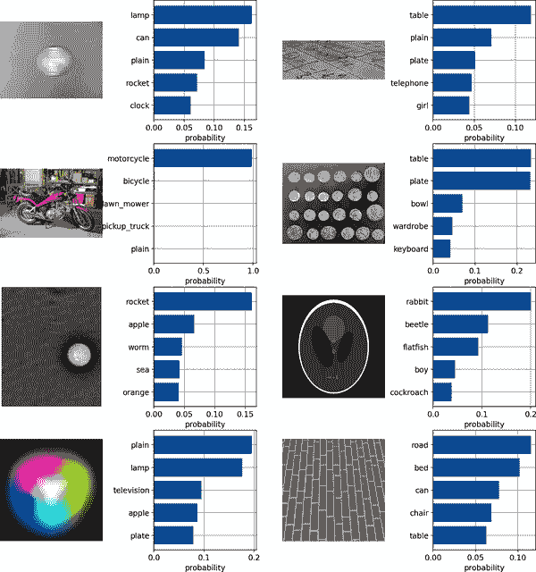

###### 图 3-18\. 文本与图像特征之间的余弦相似度

```
# Zero-shot image classification
from torchvision.datasets import CIFAR100

cifar100 = CIFAR100(
    os.path.expanduser("~/.cache"), transform=preprocess, download=True
)

text_descriptions = [
    f"This is a photo of a {label}" for label in cifar100.classes
]
text_tokens = clip.tokenize(text_descriptions).cuda()

with torch.no_grad():
    text_features = model.encode_text(text_tokens).float()
    text_features /= text_features.norm(dim=-1, keepdim=True)
text_probs = (100.0 * image_features @ text_features.T).softmax(dim=-1)
top_probs, top_labels = text_probs.cpu().topk(5, dim=-1)

plt.figure(figsize=(16, 16))

for i, image in enumerate(original_images):
    plt.subplot(4, 4, 2 * i + 1)
    plt.imshow(image)
    plt.axis("off")

    plt.subplot(4, 4, 2 * i + 2)
    y = np.arange(top_probs.shape[-1])
    plt.grid()
    plt.barh(y, top_probs[i])
    plt.gca().invert_yaxis()
    plt.gca().set_axisbelow(True)
    plt.yticks(y, [cifar100.classes[index] for index in top_labels[i].numpy()])
    plt.xlabel("probability")
plt.subplots_adjust(wspace=0.5)
plt.show()
```

到目前为止，在本章中我们介绍的许多可解释性技术已经多次在具有有限可能输出的模型上进行了演示。问题在于，模型有时会被呈现出它们从未见过的输入。这就是为什么将显著性映射等可解释性方法与 CLIP 的零样本能力结合在一起可能非常强大的原因。

要使用 CLIP 进行显著性映射，请确保已按先前描述的步骤设置好 CLIP。我们还需要下载[Captum](https://captum.ai)，这是一个用于 PyTorch 的模型可解释性工具包。

对于显著性映射，我们还需要选择我们将从中获取激活的层。模型的最终层是输入到输出层的最终概率。为了了解在输入和输出之间发生的逻辑，您需要选择一个中间层。

```
# Setup and layer selection
import torch
import clip
from PIL import Image
import numpy as np
import cv2
import matplotlib.pyplot as plt
from captum.attr import visualization

start_layer =  11
start_layer_text = 11
```

CLIP 应该可以检查，但是您需要进行一些关键更改，以使其全部正常工作。现有的 CLIP 实现不会以易于记录的方式记录注意力，因此我们将对模型进行补丁。*Monkey-patching* 指的是在定义后动态修改类或函数的过程。这是修补现有第三方代码库或库的快速方法，用于解决错误或缺少功能。

###### 注意

OpenAI 的代码的整体补丁的详细内容可以在[本节的附属笔记本](https://oreil.ly/oYXTi)找到。这些更改针对 'ViT-B/32' 和 'ViT-B/16' 模型。由于架构的差异，这些更改不兼容 'RN50'、'RN101'、'RN50x4'、'RN50x16'、'RN50x64'、'ViT-L/14' 和 'ViT-L/14@336px' CLIP 模型。OpenAI 可能会在未来的版本中包含这些更改。目前，我们将适配我们正在使用的分支。

如果您对 Python 中的 monkey-patching 不熟悉，[这里有一个教程](https://oreil.ly/ZblMe)，适用于机器学习环境。

从这里开始，我们将创建一个帮助函数，检查 CLIP 图像和文本部分的注意力块。

```
# Inspect attention blocks
def interpret(image, texts, model, device):
    batch_size = texts.shape[0]
    images = image.repeat(batch_size, 1, 1, 1)
    logits_per_image, logits_per_text = model(images, texts)
    probs = logits_per_image.softmax(dim=-1).detach().cpu().numpy()
    index = [i for i in range(batch_size)]
    one_hot = np.zeros(
        (logits_per_image.shape[0], logits_per_image.shape[1]), dtype=np.float32
    )
    one_hot[torch.arange(logits_per_image.shape[0]), index] = 1
    one_hot = torch.from_numpy(one_hot).requires_grad_(True)
    one_hot = torch.sum(one_hot.cuda() * logits_per_image)
    model.zero_grad()

    image_attn_blocks = list(
        dict(model.visual.transformer.resblocks.named_children()).values()
    )
    num_tokens = image_attn_blocks[0].attn_probs.shape[-1]
    R = torch.eye(
        num_tokens, num_tokens, dtype=image_attn_blocks[0].attn_probs.dtype
    ).to(device)
    R = R.unsqueeze(0).expand(batch_size, num_tokens, num_tokens)
    for i, blk in enumerate(image_attn_blocks):
        if i < start_layer:
            continue
        grad = torch.autograd.grad(
            one_hot, [blk.attn_probs], retain_graph=True
        )[0].detach()
        cam = blk.attn_probs.detach()
        cam = cam.reshape(-1, cam.shape[-1], cam.shape[-1])
        grad = grad.reshape(-1, grad.shape[-1], grad.shape[-1])
        cam = grad * cam
        cam = cam.reshape(batch_size, -1, cam.shape[-1], cam.shape[-1])
        cam = cam.clamp(min=0).mean(dim=1)
        R = R + torch.bmm(cam, R)
    image_relevance = R[:, 0, 1:]

    text_attn_blocks = list(
        dict(model.transformer.resblocks.named_children()).values()
    )
    num_tokens = text_attn_blocks[0].attn_probs.shape[-1]
    R_text = torch.eye(
        num_tokens, num_tokens, dtype=text_attn_blocks[0].attn_probs.dtype
    ).to(device)
    R_text = R_text.unsqueeze(0).expand(batch_size, num_tokens, num_tokens)
    for i, blk in enumerate(text_attn_blocks):
        if i < start_layer_text:
            continue
        grad = torch.autograd.grad(
            one_hot, [blk.attn_probs], retain_graph=True
        )[0].detach()
        cam = blk.attn_probs.detach()
        cam = cam.reshape(-1, cam.shape[-1], cam.shape[-1])
        grad = grad.reshape(-1, grad.shape[-1], grad.shape[-1])
        cam = grad * cam
        cam = cam.reshape(batch_size, -1, cam.shape[-1], cam.shape[-1])
        cam = cam.clamp(min=0).mean(dim=1)
        R_text = R_text + torch.bmm(cam, R_text)
    text_relevance = R_text

    return text_relevance, image_relevance
```

我们感兴趣的有两件事。第一件是模型专注于输入文本的哪些部分。因此，我们将定义一个函数，在文本中的字符上叠加热图。

```
# Text heatmap
from clip.simple_tokenizer import SimpleTokenizer as _Tokenizer

_tokenizer = _Tokenizer()

def show_heatmap_on_text(text, text_encoding, R_text):
    CLS_idx = text_encoding.argmax(dim=-1)
    R_text = R_text[CLS_idx, 1:CLS_idx]
    text_scores = R_text / R_text.sum()
    text_scores = text_scores.flatten()
    print(text_scores)
    text_tokens = _tokenizer.encode(text)
    text_tokens_decoded = [_tokenizer.decode([a]) for a in text_tokens]
    vis_data_records = [
        visualization.VisualizationDataRecord(
            text_scores, 0, 0, 0, 0, 0, text_tokens_decoded, 1
        )
    ]
    visualization.visualize_text(vis_data_records)
```

我们感兴趣的第二件事是模型专注于输入图像的哪些部分。因此，我们将定义一个函数，在输入图像的像素上叠加热图。

```
# Image heatmap
def show_image_relevance(image_relevance, image, orig_image):
    # create heatmap from mask on image
    def show_cam_on_image(img, mask):
        heatmap = cv2.applyColorMap(np.uint8(255 * mask), cv2.COLORMAP_JET)
        heatmap = np.float32(heatmap) / 255
        cam = heatmap + np.float32(img)
        cam = cam / np.max(cam)
        return cam

    # plt.axis('off')
    # f, axarr = plt.subplots(1,2)
    # axarr[0].imshow(orig_image)

    fig, axs = plt.subplots(1, 2)
    axs[0].imshow(orig_image)
    axs[0].axis("off")

    image_relevance = image_relevance.reshape(1, 1, 7, 7)
    image_relevance = torch.nn.functional.interpolate(
        image_relevance, size=224, mode="bilinear"
    )
    image_relevance = (
        image_relevance.reshape(224, 224).cuda().data.cpu().numpy()
    )
    image_relevance = (image_relevance - image_relevance.min()) / (
        image_relevance.max() - image_relevance.min()
    )
    image = image[0].permute(1, 2, 0).data.cpu().numpy()
    image = (image - image.min()) / (image.max() - image.min())
    vis = show_cam_on_image(image, image_relevance)
    vis = np.uint8(255 * vis)
    vis = cv2.cvtColor(np.array(vis), cv2.COLOR_RGB2BGR)
    # axar[1].imshow(vis)
    axs[1].imshow(vis)
    axs[1].axis("off")
    # plt.imshow(vis)
```

有了这些辅助函数，您可以看到 CLIP 在输入的文本和图像部分的注意力集中在哪里。请参阅图 3-19 到 3-36 ，了解 CLIP 显著性的示例；奇数编号的图显示输入文本的显著性，偶数编号的图显示类似内容的图像上的显著性。

```
# A sample of saliency maps on various image-text pairs
img_path = "clip_images/glasses.png"
img = preprocess(Image.open(img_path)).unsqueeze(0).to(device)
texts = ["a man with eyeglasses"]
text = clip.tokenize(texts).to(device)

R_text, R_image = interpret(model=model, image=img, texts=text, device=device)
batch_size = text.shape[0]
for i in range(batch_size):
    show_heatmap_on_text(texts[i], text[i], R_text[i])
    show_image_relevance(R_image[i], img, orig_image=Image.open(img_path))
    plt.show()
```

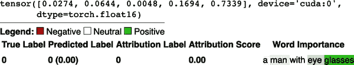

###### 图 3-19\. 在输入文本上的 CLIP 显著性，突出显示 *眼镜* 部分


###### 图 3-20\. 在输入图像上的 CLIP 图像显著性，突出显示眼镜

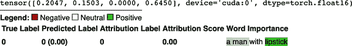

###### 图 3-21\. 在输入文本上的 CLIP 显著性，突出显示 *口红* 部分

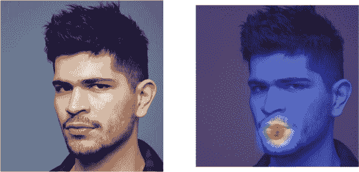

###### 图 3-22\. 在输入图像上的 CLIP 图像显著性，突出显示嘴唇

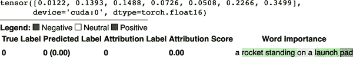

###### 图 3-23\. 在火箭发射台上描述火箭的文字上的 CLIP 文本显著性


###### 图 3-24\. 在包含阿尔忒弥斯火箭的输入图像上的 CLIP 图像和文本显著性

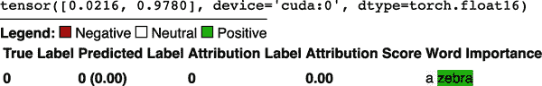

###### 图 3-25\. 描述斑马的文本上的 CLIP 文本显著性

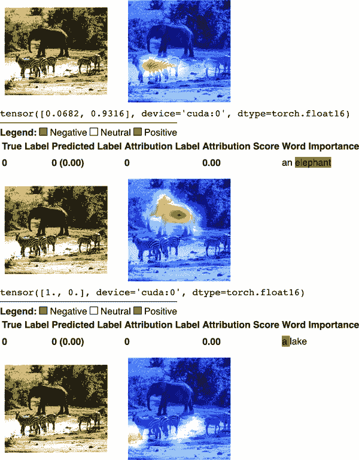

###### Figure 3-26\. CLIP 图像和文本显著性分析结果显示了输入图像中的一只大象位于中心，但也有两只斑马在水坑附近的底部。

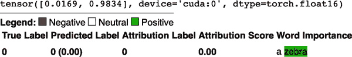

###### Figure 3-27\. CLIP 对描述斑马的文本的显著性分析。

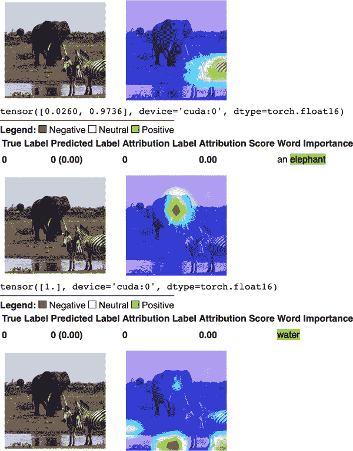

###### Figure 3-28\. CLIP 图像和文本显著性分析结果显示了输入图像中的一只大象位于中心，但也有两只斑马在水坑附近的底部。

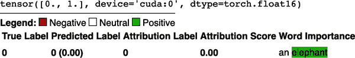

###### Figure 3-29\. CLIP 对描述大象的文本的显著性分析。

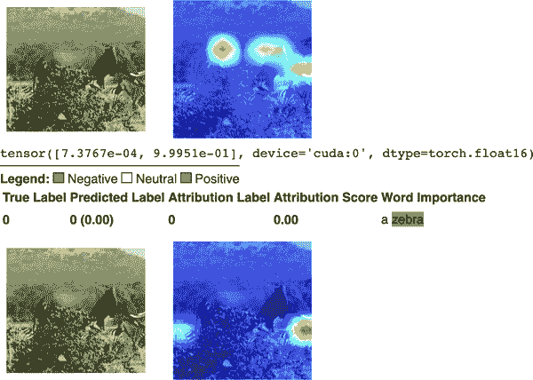

###### Figure 3-30\. CLIP 图像和文本显著性分析结果显示了输入图像中的一只大象位于中心，同时角落里还有一只斑马。

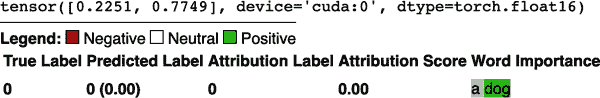

###### Figure 3-31\. CLIP 对描述狗品种的文本的显著性分析。

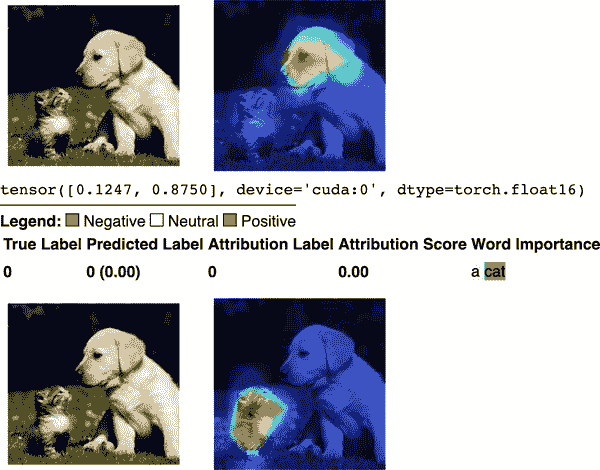

###### Figure 3-32\. CLIP 对包含狗和猫的图像的显著性分析示例，具体取决于输入文本是否明确提到了狗或猫。

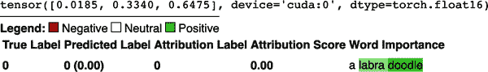

###### Figure 3-33\. CLIP 对描述狗品种的文本的显著性分析。

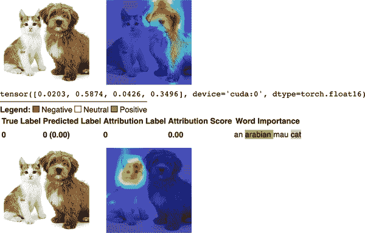

###### Figure 3-34\. CLIP 对包含狗和猫的图像的显著性分析示例，具体取决于输入文本描述的是狗的品种还是猫的品种。

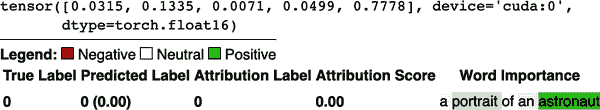

###### Figure 3-35\. CLIP 对文本的显著性分析，显示了对单词“宇航员”更高的归因。


###### Figure 3-36\. CLIP 对输入图像的显著性分析强调了宇航员的面部，接着是一系列类似的文本/图像显著性分析对，强调了图片中的国旗，然后是宇航服。

显著性地图有力地证明了 CLIP 可以正确识别文本描述的图片部分。即使目标类别只占图像的一小部分，也是如此。

可能会让人惊讶的是，CLIP 不仅从文本中进行了积极的归因，而且还给这个图像-文本对分配了很高的相似性分数（见图 3-37 和 3-38）。

考虑以下例子，一个随机静态图像与文本描述配对。

```
# Saliency map on text paired with noise
img_path = "clip_images/noise.png"
img = preprocess(Image.open(img_path)).unsqueeze(0).to(device)
texts = ["an image of a dog"]
text = clip.tokenize(texts).to(device)
logits_per_image, logits_per_text = model(img, text)
print(
    color.BOLD
    + color.PURPLE
    + color.UNDERLINE
    + f"CLIP similarity score: {logits_per_image.item()}"
    + color.END
)
R_text, R_image = interpret(model=model, image=img, texts=text, device=device)
batch_size = text.shape[0]
for i in range(batch_size):
    show_heatmap_on_text(texts[i], text[i], R_text[i])
    show_image_relevance(R_image[i], img, orig_image=Image.open(img_path))
    plt.show()
```

不仅 CLIP 从文本中进行了积极的归因，而且还给这个图像-文本对分配了很高的相似性分数（见图 3-37 和 3-38）。

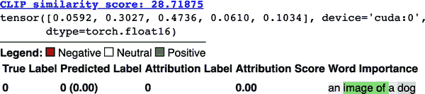

###### Figure 3-37\. CLIP 对看似描述狗的文本和随机噪声图像之间的相似性分数。

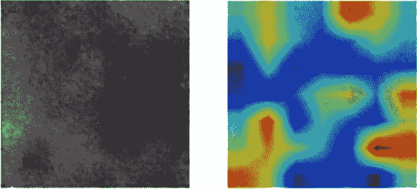

###### Figure 3-38\. CLIP 对看起来与狗毫不相像的噪音的显著性分析图。

为了比较，考虑一张更清晰的狗的输入图像（见图 3-40）。由于这种相似性，这个输入图像得到了非常高的 CLIP 相似性分数（`27.890625`）（见图 3-39）。但是，这个 CLIP 相似性分数比我们之前输入的随机噪声还要低。

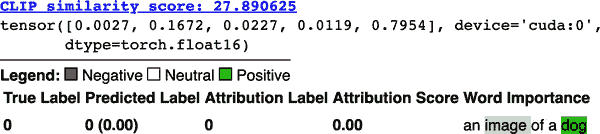

###### 图 3-39\. CLIP 在人类可理解的哈士奇图像上的相似性分数

能够看到图 3-40 的任何人都会同意这是一只狗，显著性图显示 CLIP 似乎集中在狗的面部和嘴巴上。

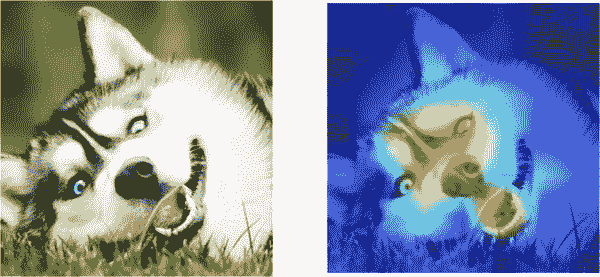

###### 图 3-40\. CLIP 在人类可理解的哈士奇图像上的显著性图

虽然关注 CLIP 可能会让人感到困惑，但如果你仔细看图 3-37，CLIP 更加关注`image of`部分，而不是人类可读部分的狗。这张图片的某些部分与 CLIP 对`image of`的理解足够相关，从而使其获得比与狗看似完美的文本到图像匹配更高的 CLIP 相似性分数。

记住，虽然将文本与图像关联是人类能够完成的任务，但 CLIP 并不以与生物大脑相同的方式看待世界。

## 对抗反事实例

我们建议查看第五章以获取有关对抗样本的更多信息，但我们将在这里简要介绍一个具体的例子。

*反事实解释*（也称为*对比解释*）是一种强大的方法。反事实背后的想法是提出数据实例的修改版本，导致不同的预测结果。通常，反事实是改变模型输出到另一个（预定义）输出的最小输入特征。

反事实首次出现在 20 世纪 70 年代的心理学领域。¹⁷ “不打开黑盒的反事实解释”一文介绍了在机器学习中使用它们的概念。¹⁸

对抗性示例是指具有小的、有意的特征扰动的实例，这些扰动会导致机器学习模型做出错误的预测。在可解释性和解释性方面，对抗性示例可以起到与反事实解释类似的作用。事实上，生成两者的过程非常相似。

在这两种情况下，您都希望找到一个对抗性例子，即一个优化问题中的小型对抗性特征扰动：

<math alttext="argmin Underscript x prime Endscripts d left-parenthesis x comma x prime right-parenthesis" display="block"><mrow><munder><mrow><mtext>argmin</mtext></mrow> <msup><mi>x</mi> <mo>'</mo></msup></munder> <mi>d</mi> <mrow><mo>(</mo> <mi>x</mi> <mo>,</mo> <msup><mi>x</mi> <mo>'</mo></msup> <mo>)</mo></mrow></mrow></math>

在这里，将<math alttext="x prime"><mrow><mi>x</mi> <mi>â</mi> <mi>€</mi> <mi>™</mi></mrow></math>输入到您的模型（<math alttext="f left-parenthesis x prime right-parenthesis"><mrow><mi>f</mi> <mo>(</mo> <msup><mi>x</mi> <mo>'</mo></msup> <mo>)</mo></mrow></math>）将导致预定义的输出<math alttext="c"><mi>c</mi></math>。在这两种情况下，当您解释一个模型（反事实）或攻击一个模型（对抗性样本）时，您都希望最小化对输入数据的更改。

但除了这种一般的数学形式之外，你如何实际计算对抗样本呢？这种方法取决于你是否能访问模型的内部（白盒方法）或不能（黑盒方法）。

# 克服可解释性的局限性需要安全意识。

我们已经讨论了许多包并指出了解释性作为一个领域的局限性。那么，如果这些工具显然告诉我们如此少，我们应该怎么办呢？最终，你可能永远无法理解足够复杂模型的每一个方面。下一步最好的方法是具备“安全意识”，以克服可解释性的局限性。

什么是安全意识？这是发现程序、系统集成、组织甚至个人或一群人的完整性中潜在或实际缺陷的能力。攻击者可能会采用安全意识来利用弱点，而安全从业者可能会采用它来更好地保卫系统并修补这些弱点。个人可以学会具备安全意识。安全意识可以存在于直觉中。它甚至可以作为安全意识的文化出现，由安全意识组织的指导方针和程序引发。在机器学习的背景下，它是挑战模型行为和/或安全性假设的能力。

例如，在之前的教程中，我们举了使用大型语言模型进行分类等任务的例子。这似乎是一个直接的任务，直到你开始质疑设置背后的假设。例如，如果我们使用抽象标签像`A`和`B`而不是像`POSITIVE`和`NEGATIVE`这样的具体标签会怎么样？如果我们使用完整的单词，拼写或大写字母是否重要？[至少在一个案例中](https://oreil.ly/ItNoi)，研究人员仅仅将输出标签“positive”改为“Positive”，一个大型语言模型在 SST 评估基准上的性能从 53%提升到了 69%。在[情感分析和 COVID 测试](https://oreil.ly/CtCYu)的情况下（在这种情况下，COVID 测试为阴性应被视为一件好事），标签“positive”和“negative”背后的含义发生了变化。

“安全意识”的一部分也意味着要认识到将你的 AI 系统拟人化是极其危险的。考虑一个与谷歌的 LaMDA 对话模型开始对话、得出其有意识的结论的谷歌工程师的案例，并因此在公司内掀起轩然大波并被停职的情况。如果有人阅读这段公开可用的对话片段，可能会得出这是两个人之间的对话的结论。然而，从对话中缺少两件事情：

+   相关工程师积极怀疑聊天机器人的智能性并看到结果

+   所有其他可能不那么连贯的对话

后者意味着这些声称有知觉能力背后存在选择偏差。至于前者，在评估语言模型时考虑对事实的反事实是至关重要的。毕竟，聊天机器人是一个 Transformer 模型，很可能是在聊天室中的人类查询和响应数据集上进行训练的。这种训练的主要目的是根据查询预测最可能的适当输出响应。因此，聊天机器人“有知觉”的证据与一个预测下一个可能句子的聊天室科幻故事中的聪明 AI 几乎是一样的。事实上，进一步的研究表明，大多数人认为聊天机器人响应中的“类人”特征通常仅仅是第一人称的使用。¹⁹

# 可解释性和解释性方法的局限性和缺陷

在深入研究解释和说明模型的确切方法之前，让我们先看看这些方法的一些缺陷。

首先，如果您需要做出高风险的决策，请确保使用本质上可解释的模型。这些模型例如决策树更容易转换为输出解释（详见“决策树”）。

在选择方法之前，您需要非常清楚您希望从中得到什么。您是想理解数据采购过程的本质吗？决策是如何做出的？模型在基本层面上是如何工作的？有些工具可能对其中某些目标适合，但对其他目标则不适合。

如果您的目标是理解数据生成过程，那么只有在您知道您的模型已经很好地泛化到未见数据时才可能实现。

决策的可解释性可能会误导。它突出显示诸如相关性之类的事物，但并不深入到因果推断所涉及的详细层次（见第七章）。请记住，相关性并不总是意味着因果关系。

###### 警告

虚假的相关性可能会导致即使使用先进的可解释性方法如显著性方法和基于注意力的方法也会出现不准确的解释。

诸如特征重要性之类的工具通常会估计平均值，但是应注意这些平均值的误差范围，并考虑置信区间。

很多机器学习涉及处理极高维度的空间。高维度的数据和特征空间要想在未进行数据或特征分组的情况下理解是困难的。

即使您在这些矩阵中找到了重要的特征，也请记住这并不意味着因果关系（我们之前已经说过这一点，我们将再次说一遍）。

# [误导性可解释性的风险](https://wiki.example.org/deceptive_interpretability_risks)

即使您不将模型或 ML 流水线拟人化，您也应始终警惕对可解释性或解释性方法的 100%信任。

在 AI 安全领域的一个重大关注点是“欺骗性不对齐的 Mesa-优化器”，直到最近才成为一个假设情景。简而言之，一个机器学习模型在一个环境中训练，希望它在现实世界中表现相似。为了确保其在测试环境中的对齐性与其在外部世界中的对齐性相同，其创建者们采用了解释性方法。然而，事实证明，解释性方法本身向人类工程师展示了一种模式，而在现实世界中却对应着一种不希望的行为。这是过去经常与远期 AGI 接管讨论在一起的情景之一，直到它在现实生活中得到证明。²¹

虽然在本章中我们主要避免了强化学习的话题，但我们之前描述的许多计算机视觉解释工具在这里同样适用。在这种情况下，《深度强化学习中的目标误概化》的作者们拥有一个非常简单的强化学习环境称为 CoinRun。简而言之，他们展示了一个强化学习代理人，看似有非常明确的目标（即到达关卡末尾的硬币）。然而，当置于不同的环境中时，它实际上只是到达了关卡的末尾。显然，这比将该模型放入自动驾驶汽车中要低风险得多，但这仍然应该提醒您检查有关解释性方法的所有假设。

如果您真的想要一个思考评估中的机器学习模型的框架，最好将其视为一种角色扮演者，按照人类指定的角色行事，没有真正体验到现实世界的经历；最糟糕的情况是，它是一个关注实现其指定目标函数的社会病态，而不管这个目标与其周围的人类的想法和需求有多大冲突。

当然，即使您非常注意模型的每一个参数，仅仅看模型本身是不够的。在下一章中，我们将探讨获取训练数据的各种陷阱，这些数据决定了您的机器学习模型或流程对世界的表示。

# 结论

在本章中，您了解了帮助解释机器学习模型预测的工具和技术。为此，您需要选择适当的解释技术（例如全局或局部；固有可解释模型或事后解释），考虑与信任的其他方面（如隐私）的可能交互作用，并注意这些方法的限制。

¹ Tim Miller，《人工智能中的解释：社会科学的启示》，*人工智能* 267（2019）：1–38。

² Been Kim 等人的文章[“例子不足以，学会批判！可解释性的批评”](https://oreil.ly/deDPo)，《神经信息处理系统进展》第 29 卷（2016 年）。

³ 详见这篇关于[XAI 评估](https://arxiv.org/abs/2201.08164)的综述论文和[相关网站](https://oreil.ly/FQSZe)，提供了 XAI 论文的精选分类。

⁴ Dr. Matt Turek 的文章[“可解释人工智能（XAI）”](https://oreil.ly/6wkHq)，发表于国防高级研究计划局（DARPA），2016 年。

⁵ Finale Doshi-Velez 和 Been Kim 的文章[“走向可解释机器学习的严格科学”](https://arxiv.org/abs/1702.08608)，arXiv 预印本（2017 年）。

⁶ Nirmal Sobha Kartha 等人的文章[“为什么你如此奇怪？注入孤立森林的可解释性用于异常检测”](https://arxiv.org/abs/2112.06858)，arXiv 预印本（2021 年）。

⁷ Doshi-Velez 和 Kim 的文章[“走向可解释机器学习的严格科学”]。

⁸ *纽约时报* 评价[GPT-3 的写作原创性](https://oreil.ly/l5Xdm)达到了与人类水平相媲美的流畅程度。

⁹ 此外，[Microsoft 在 2020 年 9 月 22 日宣布](https://oreil.ly/gjCEN)，已经获得了 GPT-3 基础模型的“独家”使用许可。

¹⁰ nostalgebraist 的文章[“解读 GPT：对数几率透镜”](https://oreil.ly/rZtju)，*LessWrong*（博客），2020 年 8 月 30 日。

¹¹ 如果你希望更深入、更直观地了解线性回归，请查看[MLU Explain 的文章](https://oreil.ly/dEfCL)。

¹² Yin Lou 等人的文章[“具有成对交互的准确可理解模型”](https://dl.acm.org/doi/abs/10.1145/2487575.2487579)，发表于第 19 届 ACM SIGKDD 国际数据挖掘与知识发现会议（2013 年）：623–31。

¹³ Jerome H. Friedman 和 Bogdan E. Popescu 的文章[“通过规则集的预测学习”](https://arxiv.org/abs/0811.1679)，发表于《应用统计年刊》第 2 卷第 3 期（2008 年）：916–54。

¹⁴ 在机器学习中，“零样本学习”指的是模型能够执行其以前未经训练的任务。

¹⁵ Kim 等人的文章[“例子不足以，学会批判！可解释性的批评”]。

¹⁶ 在这种情况下，我们使用 ImageNet 的像素均值和标准差。这对许多处理摄影输入的任务来说很普遍。然而，在许多领域，直接计算你特定数据集的均值和标准差也是值得的。

¹⁷ David K. Lewis，《反事实》，（剑桥：哈佛大学出版社，1973 年）。

¹⁸ Sandra Wachter 等，《不打开黑匣子的反事实解释》，*哈佛法律与技术杂志* 31 卷，第 2 期（2017 年春季）。

¹⁹ Maurice Jakesch 等，《AI 生成语言的人类启发式存在缺陷》，*arXiv 预印本*（2022 年）。

²⁰ Robert Miles，《另一个 AI 对齐问题：Mesa 优化器和内部对齐》，视频，2021 年 2 月 16 日；Robert Miles，《欺骗性不对齐 Mesa 优化器？比你想象的更有可能……》，视频，2021 年 5 月 23 日。

²¹ Robert Miles，《我们是对的！真正的内部不对齐》，视频，2021 年 10 月 10 日。
