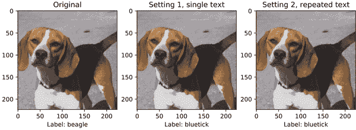

# 第四章：鲁棒性

我们知道，机器学习模型的泛化能力并不太强——稍微改变输入，模型就可能失效。模型在面对数据变化时的抵抗能力被称为 *鲁棒性*。直观地说，无论你的训练数据有多好，模型在现实世界中都会遇到意想不到的情况，而鲁棒性就是确保它做好应对这些情况的准备。

###### 提示

这个问题的核心在于，你几乎总是在训练一个模型来解决一个代理问题。例如，如果你试图制作一个区分狗和猫的图像分类器，优化一个图像分类器以在有限的训练集上最小化错误只是一个代理。你真正的目标是在所有可能的情况下区分猫和狗，但你能做到的最好只是这个代理，因为你的计算资源是有限的。

有时，为你的代理进行优化并不会让你离真正的目标更近。有时，如果你过度优化你的代理，你的过度优化会导致你在真正的目标上表现更差。AI 安全研究人员已经证明，这适用于每一个代理度量指标（无论是 AI 还是人类或一群人在进行优化）。¹ 你最好的选择是知道要注意什么，并早早发现你过度优化的迹象。

有两种鲁棒性：训练时鲁棒性和测试时鲁棒性。 *训练时鲁棒性* 着重于模型对添加到训练数据中的对抗性示例的抵抗能力。 *测试时鲁棒性* 着重于模型在测试过程中对未必在训练中见过的实例的泛化能力。由于在生产环境中防止测试时出现的意外行为最为重要，本章节将侧重于测试时鲁棒性。

注意，鲁棒性的定义也可能因应用而异。例如，在自然语言处理（NLP）领域，研究人员经常提到认证的鲁棒性。在符号表示方面，让我们将一个模型表示为 <math alttext="f"><mi>f</mi></math>，将示例句子表示为 <math alttext="x"><mi>x</mi></math> 。模型的预测结果将是 <math alttext="f left-parenthesis x right-parenthesis"><mrow><mi>f</mi> <mo>(</mo> <mi>x</mi> <mo>)</mo></mrow></math> ，通常是离散的（或者对于多标签设置可能是离散序列）。让 <math alttext="y"><mi>y</mi></math> 是 <math alttext="x"><mi>x</mi></math> 的正确标签。让 <math alttext="x prime"><mrow><mi>x</mi> <mi>â</mi> <mi>€</mi> <mi>™</mi></mrow></math> 表示通过词替换修改的 <math alttext="x"><mi>x</mi></math>，其中一个词与其同义词交换（通常使用修正后的词嵌入进行定义）。如果对于任何例句 <math alttext="x"><mi>x</mi></math> 及由 <math alttext="x"><mi>x</mi></math> 修改词进行替换的句子 <math alttext="x prime"><mrow><mi>x</mi> <mi>â</mi> <mi>€</mi> <mi>™</mi></mrow></math> ，都有 <math alttext="f left-parenthesis x right-parenthesis equals f left-parenthesis x prime right-parenthesis equals y"><mrow><mi>f</mi> <mrow><mo>(</mo> <mi>x</mi> <mo>)</mo></mrow> <mo>=</mo> <mi>f</mi> <mrow><mo>(</mo> <msup><mi>x</mi> <mo>'</mo></msup> <mo>)</mo></mrow> <mo>=</mo> <mi>y</mi></mrow></math>，那么模型 <math alttext="f"><mi>f</mi></math> 就是可以认证为鲁棒的。直觉上来说，这意味着给定两个不同但语义上等效的例句，模型能够保持其预测。

本质上，当模型缺乏鲁棒性时，它无法有效地推广到与训练数据分布不同的测试分布。基本上，无论您的训练数据有多好，模型都将在现实世界中遇到意想不到的事物，鲁棒性就是确保它能够处理现实世界中的噪音的问题。

在公平性和鲁棒性之间存在自然的相似之处；具体而言，可以将*公平性*视为对源自人口统计因素的扰动具有鲁棒性。例如，在 NLP 设置中，人口统计群体可以通过言语和语言模式进行松散的识别。一个非鲁棒的模型，如果主要是在特定人口统计群体的口语示例的基础上进行训练，将不能很好地推广到训练数据集中未见过的人群，因此在具有未在训练数据集中见过的语音和语言模式的人口统计群体上表现出低性能。研究已经实证显示了这两个信任目标之间的关系。

鲁棒性很重要，因为它展示了什么会使模型崩溃。它还有助于训练模型以准备好接受在现实生活中可能遇到的输入。这在关键和高风险应用（如自动驾驶汽车）中尤为重要。

假设你正在为一家大公司创建的自动驾驶汽车系统建模。到目前为止，该模型主要是在美国郊区城镇的数据基础上进行训练的。现在，这些汽车的消费者群体覆盖了美国的城市、农村和郊区地区。如果这个模型不够健壮，它可能无法很好地适应城市环境中的驾驶模式和额外的视觉噪声。由于自动驾驶汽车的问题可能导致事故甚至死亡，这种泛化能力不足是危险的。你需要确信系统在车辆遇到的任何情况下行为正确。你还需要保护它免受攻击者的攻击，例如第二章和第三章中所述的攻击者。

# 评估健壮性

有几种评估和改进模型健壮性的方法。我们可以将它们分为两类：

*非敌对*

非敌对健壮性方法由显式的、预定的转换组成，旨在测试分类器对现实世界设置中存在但在训练数据中可能不存在的低概率但现实情况的泛化能力。

*敌对*

敌对健壮性方法由学习转换组成，使用机器学习模型修改和创建输入，以愚弄模型。这些方法旨在开发能够抵御此类攻击的分类器。

敌对方法包括定向攻击和非定向攻击。定向攻击旨在愚弄模型以预测特定的错误类别，而非定向攻击旨在愚弄模型以预测任何错误类别。例如，在自动驾驶汽车系统中使用的目标检测模型上进行的定向攻击可能会尝试让模型将狗分类为猫；非定向攻击则试图让模型将狗分类为除狗以外的任何东西。尽管这可能是一个较不严重的错误，定向攻击也可能导致模型产生更具破坏性的预测。

让我们看一些这些转换的例子。

# 非敌对健壮性

首先，让我们通过应用显式的、预定的转换方式来探索评估健壮性的方法，这些转换方式旨在测试分类器在低概率但现实情况下的泛化能力。应用非敌对健壮性有几个步骤。首先，给定一个例子，应用扰动。其次，计算相似性约束，仅保留满足约束的扰动。接下来我们将依次解释每个步骤。

## 第一步：应用扰动

在计算机视觉中，扰动发生在像素级别。这可能意味着将像素输入到黑白色彩空间（将图片转换为黑白）或将某些像素置零（遮挡图像的某些部分）。在 NLP 中，您可以通过替换句子中的单词而不改变其含义来添加噪声（例如通过添加诸如“like”或“you know”的填充词或者改写句子）。让我们看一些例子。

### 计算机视觉

表 4-1 列出了计算机视觉中的非对抗性鲁棒性方法，并附带每种方法的示例图像。

表 4-1\. 计算机视觉中的非对抗性鲁棒性方法

| 版本 | 图像 |
| --- | --- |
| 原始 |  |
| 裁剪——显示图像的一部分 |  |
| 遮挡——阻塞图像的一部分 |  |

|

[剪切](https://oreil.ly/zjJPo)——沿 X 轴或 Y 轴滑动图像的一个边缘

|  |
| --- |
| 旋转——旋转图像 |  |

要了解如何给图像添加噪声，您可以使用来自[Augmentor 库](https://oreil.ly/NMtOl)的代码。²

```
import Augmentor
p = Augmentor.Pipeline("/path/to/images")
p.shear(max_shear_left=20, max_shear_right=20, probability=0.2)
p.sample(50)
```

这将使目录中的所有图像向左或向右最多剪切 25 度，并且概率为 0.2，并将 50 张图像写入到*/path/to/images/folder/output/*文件夹中。这意味着有 20%的时间会采样和保存一个被剪切的图像。图 4-1 展示了其中一个被采样图像的示例。

图 4-1 中的图像稍微倾斜或剪切到左侧。


###### 图 4-1\. 剪切图像的示例输出

### 语言

让我们看看 NLP 中数据扰动的示例。

这是某人可能会问 Alexa 或其他 AI 的问题：““泰国的首都的全名是什么？”表 4-2 展示了您可以以不改变含义的方式提出此问题的不同方式。

表 4-2\. NLP 中数据扰动技术的示例

| 扰动类型 | 描述 | 示例扰动 | 扰动类型优点 | 扰动类型缺点 |
| --- | --- | --- | --- | --- |
| Token 级扰动 | 删除、替换或插入原始话语中的令牌，但仍保留语义意义 | “泰国的首都的扩展名称是什么？” | 算法上更为简单 | 可能会消耗大量计算资源；不允许更复杂的扰动，如短语替换或改写；依赖于词汇同义词库的质量 |
| 填充词添加 | 包括各种语音相关噪声，如填充词 | 嗯，泰国的首都全称是什么？ | 算法上更为简单 | 仅限于语音相关的应用 |
| 改写 | 重新表达原始句子 | “What is Bangkok’s full name?” | 捕捉人类语言复杂变化 | 依赖于改写模型的质量 |
| 语音转文本错误 | 包括发音相似的单词、同音异义词或不同口音的发音 | “What is the full mane of Thailand’s capital city?” | 准确捕捉口语环境中的变化 | 可能难以计算；根据用于生产的语音转文本设置，可能无法反映现实世界中的变化 |
| 本地语言变化 | 在口语对话系统中，可能存在某些特定人群中普遍存在的语音模式 | “Whit’s th’ stowed oot name o’ Thailand’s capital toon?” (苏格兰语) | 根据客户群体，可以反映在生产中看到的语音模式差异 | 可能难以生成示例 |

## 第二步：定义和应用约束条件

一旦我们有了这些扰动，为了确定哪些扰动是令人满意的，我们需要定义约束条件。让我们深入探讨一些在自然语言处理和计算机视觉中流行的约束条件。

### 自然语言处理

对于文本而言，确保扰动流畅至关重要：即它们是合法的、自然的句子，并且在语义上等效于原始句子。让我们详细分析如何评估生成的句子在每个方面的表现。

#### 流畅性

您可以使用语言模型（LM）来评估句子的流畅性。语言模型会为语法正确的句子分配高概率，而为语法不正确或不太可能的句子分配低概率，因此您需要使用利用这一点的评估指标。在选择语言模型方面，通常使用预训练的语言模型，尽管最好是针对您评估流畅性的语言类型进行了微调或训练的模型（例如，如果您评估推特上的句子流畅性，则应使用已经在推特上训练过的 LM）。

两种常见的度量指标是对数概率和困惑度。这两种度量指标的方程如下，其中<math alttext="x Subscript t"><msub><mi>x</mi> <mi>t</mi></msub></math>指的是时间步*t*处的标记：

*对数概率*

<math alttext="sigma-summation Underscript t equals upper N Overscript 1 Endscripts log Subscript 2 Baseline p left-parenthesis x Subscript t Baseline vertical-bar x Subscript t Baseline right-parenthesis"><mrow><msubsup><mo>∑</mo> <mrow><mi>t</mi><mo>=</mo><mi>N</mi></mrow> <mn>1</mn></msubsup> <msub><mo form="prefix">log</mo> <mn>2</mn></msub> <mi>p</mi> <mrow><mo>(</mo> <msub><mi>x</mi> <mi>t</mi></msub> <mo>|</mo> <msub><mi>x</mi> <mrow><mo><</mo><mi>t</mi></mrow></msub> <mo>)</mo></mrow></mrow></math>

*困惑度*

<math alttext="upper P left-parenthesis x 1 comma x 2 comma ellipsis comma x Subscript upper N Baseline right-parenthesis Superscript minus StartFraction 1 Over upper N EndFraction"><mrow><mi>P</mi> <msup><mrow><mo>(</mo><msub><mi>x</mi> <mn>1</mn></msub> <mo>,</mo><msub><mi>x</mi> <mn>2</mn></msub> <mo>,</mo><mo>...</mo><mo>,</mo><msub><mi>x</mi> <mi>N</mi></msub> <mo>)</mo></mrow> <mrow><mo>-</mo><mfrac><mn>1</mn> <mi>N</mi></mfrac></mrow></msup></mrow></math>

困惑度也可以重新表述为交叉熵损失的指数：³

<math alttext="2 Superscript minus StartFraction 1 Over upper N EndFraction sigma-summation Underscript t equals upper N Overscript 1 Endscripts log Super Subscript 2 Superscript p left-parenthesis x Super Subscript t Superscript vertical-bar x Super Subscript t Superscript right-parenthesis" display="block"><msup><mn>2</mn> <mrow><mo>-</mo><mfrac><mn>1</mn> <mi>N</mi></mfrac><msubsup><mo>∑</mo> <mrow><mi>t</mi><mo>=</mo><mi>N</mi></mrow> <mn>1</mn></msubsup> <msub><mo form="prefix">log</mo> <mn>2</mn></msub> <mi>p</mi><mrow><mo>(</mo><msub><mi>x</mi> <mi>t</mi></msub> <mo>|</mo><msub><mi>x</mi> <mrow><mo><</mo><mi>t</mi></mrow></msub> <mo>)</mo></mrow></mrow></msup></math>

需要注意的是，虽然性能更好的语言模型会为形式良好的句子分配更高的对数概率，但其困惑度分数会较低。这是因为对于困惑度而言，随着对数概率的增加（以负分数指数表示），困惑度会降低。

也许你会想知道如何计算流畅度度量中定义的概率。通常做法是使用语言模型评估每个同义替换句子的流畅度，并仅保留具有与原始句子相似流畅度得分的句子。请注意，由于这些语言模型本身并不完美，因此这种方法有其局限性。

让我们看看如何计算混乱度。

```
def get_fluency_score(text, tokenizer, model):
    input_ids = torch.tensor(tokenizer.encode(text)).unsqueeze(0)
    with torch.no_grad():
        outputs = model(input_ids, labels=input_ids)
    loss, _ = outputs[:2]
    perplexity = math.exp(loss.item())
    return perplexity
```

虽然对于某些情景来说，流畅度可能是一个令人满意的约束条件，但对于大多数情况来说，这是不够的。

探索你对流畅度的理解：有哪些例子是两个句子分别流畅，除了名词替换之外相似，但意义不相似的？

#### 保持语义意义

混乱度并不表明扰动是否保留语义意义。可以使用语义相似性度量来填补这一空白。一种流行的计算两个句子语义相似性的方法是使用句子级编码器嵌入它们，然后计算它们的相似性（或其他距离度量），这样意义更相似的句子将比意义较少相似的句子具有更高的相似性。

文本相似性的一个标准度量是嵌入的余弦相似度。给定嵌入*A*1 和*B*，这些嵌入的余弦相似度可以用以下公式计算：

<math alttext="sigma-summation Underscript t equals 1 Overscript upper N Endscripts StartFraction upper A Subscript i Baseline upper B Subscript i Baseline Over StartRoot sigma-summation Underscript t equals 1 Overscript upper N Endscripts upper A Subscript i Superscript 2 Baseline EndRoot StartRoot sigma-summation t equals upper N Superscript 1 Baseline upper B Subscript i Superscript 2 Baseline EndRoot EndFraction" display="block"><mrow><munderover><mo>∑</mo> <mrow><mi>t</mi><mo>=</mo><mn>1</mn></mrow> <mi>N</mi></munderover> <mfrac><mrow><msub><mi>A</mi> <mi>i</mi></msub> <msub><mi>B</mi> <mi>i</mi></msub></mrow> <mrow><msqrt><mrow><msubsup><mo>∑</mo> <mrow><mi>t</mi><mo>=</mo><mn>1</mn></mrow> <mi>N</mi></msubsup> <msubsup><mi>A</mi> <mrow><mi>i</mi></mrow> <mn>2</mn></msubsup></mrow></msqrt> <msqrt><mrow><mo>∑</mo><msup><mrow><mi>t</mi><mo>=</mo><mi>N</mi></mrow> <mn>1</mn></msup> <msubsup><mi>B</mi> <mrow><mi>i</mi></mrow> <mn>2</mn></msubsup></mrow></msqrt></mrow></mfrac></mrow></math>

以 ALBERT 为例，一个句子级的编码器。对于一个特定的句子，通过取相关嵌入的均值来获得嵌入，从而得到一个固定向量，不考虑句子的长度。我们将使用 SentenceTransformer 包，它允许我们训练、评估和推理特定训练用途的模型。你可以在[在线池化过程](https://oreil.ly/tqzbm)中了解更多。

然后，给定两个句子的嵌入，我们可以找到它们的余弦相似性。

```
from sentence_transformers import SentenceTransformer
from numpy import dot
from numpy.linalg import norm

def cosine_similarity(a, b):
	return dot(a, b)/(norm(a)*norm(b))

def get_similarity(sentence, paraphrase):
	model = SentenceTransformer('paraphrase-albert-small-v2')
	embs_1 = model.encode([sentence])
	embs_2 = model.encode([paraphrase])
	return cosine_similarity(embs_1, emb_2)
```

现在让我们在一个有效的释义句子上测试这个函数。

```
get_similarity(
"Keto diet is a popular diet in the US among fitness enthusiasts
",
"Many fitness communities such as Crossfit follow to the keto diet
"
)

0.7476
```

为了比较，让我们用两个不是彼此释义的句子做同样的事情。

```
get_similarity(
'Keto diet is a popular diet in the US among fitness enthusiasts",
"You want to minimize carbs on keto"
)

0.57090
```

您可以看到余弦相似度和语义意义非常相似。请查看[笔记本](https://oreil.ly/icUDM)获取完整的代码片段。

正如名称可能暗示的那样，ALBERT 是基于 BERT 的编码器系列的一部分，可以通过这种方式检测语义相似性（另一个例子是 RoBERTa），每个月都会发布更多的编码器。然而，对于这种类型的评估，使用已被证明在评估与示例相同源和类型语言时非常准确的模型是很重要的。例如，包含更正式语言的示例可能不适合在训练于推文上的模型上运行。

语义相似性也取决于具体任务。想象一下，你正在测试一个面向任务型对话系统中意图分类模型的鲁棒性，该系统允许用户预订特定类型菜肴的餐馆。为了得到准确的结果，模型可能需要在保持某些属性（如意图类型）的同时，对话中的句子进行扰动。例如，一个人可能会问：“你能找到便宜的印度餐馆吗？”对这个句子进行扰动的一种方式是保持印度餐食品属性：“你能收藏巴巴尔作为一家提供印度食品的优秀餐馆吗？”另一种方式是保持意图（寻找餐馆）并扰动食品类型属性：“你能找到便宜的餐馆供应泰国食品吗？”因此，根据具体任务评估模型生成的结果非常重要。

### 计算机视觉

对于计算机视觉，我们关注的是像素向量而不是标记和句子的嵌入。因此，我们可以使用余弦相似度以及在计算机视觉中常用的 L2 距离。

通过矩阵 <math alttext="upper X equals left-parenthesis left-parenthesis x Subscript i j Baseline right-parenthesis right-parenthesis element-of upper R Superscript m times n"><mrow><mi>X</mi> <mo>=</mo> <mrow><mo>(</mo> <mrow><mo>(</mo> <msub><mi>x</mi> <mrow><mi>i</mi><mi>j</mi></mrow></msub> <mo>)</mo></mrow> <mo>)</mo></mrow> <mo>∈</mo> <msup><mi>R</mi> <mrow><mi>m</mi><mo>×</mo><mi>n</mi></mrow></msup></mrow></math> 表示图像的像素值，我们计算绝对和相对 L2 距离：

<math alttext="d Subscript a b s Baseline equals sigma-summation Underscript i comma j Endscripts StartAbsoluteValue x Subscript i j Baseline minus x Subscript i j Superscript a d v Baseline EndAbsoluteValue squared comma d Subscript r e l Baseline equals StartFraction d Subscript a b s Baseline Over sigma-summation Underscript i j Endscripts x Subscript i j Superscript 2 Baseline EndFraction" display="block"><mrow><msub><mi>d</mi> <mrow><mi>a</mi><mi>b</mi><mi>s</mi></mrow></msub> <mo>=</mo> <munder><mo>∑</mo> <mrow><mi>i</mi><mo>,</mo><mi>j</mi></mrow></munder> <msup><mrow><mo>|</mo><msub><mi>x</mi> <mrow><mi>i</mi><mi>j</mi></mrow></msub> <mo>-</mo><msubsup><mi>x</mi> <mrow><mi>i</mi><mi>j</mi></mrow> <mrow><mi>a</mi><mi>d</mi><mi>v</mi></mrow></msubsup> <mo>|</mo></mrow> <mn>2</mn></msup> <mo>,</mo> <msub><mi>d</mi> <mrow><mi>r</mi><mi>e</mi><mi>l</mi></mrow></msub> <mo>=</mo> <mfrac><msub><mi>d</mi> <mrow><mi>a</mi><mi>b</mi><mi>s</mi></mrow></msub> <mrow><msub><mo>∑</mo> <mrow><mi>i</mi><mi>j</mi></mrow></msub> <msubsup><mi>x</mi> <mrow><mi>i</mi><mi>j</mi></mrow> <mn>2</mn></msubsup></mrow></mfrac></mrow></math>

表 4-3 列出了许多可用于计算计算机视觉和自然语言处理的语义相似性度量类型。

表 4-3\. 语义相似性度量类型

| 语义相似度 | 优点 | 缺点 | 特定于自然语言处理或计算机视觉 |
| --- | --- | --- | --- |
| 余弦相似度 |

+   常用

+   易于计算

+   在多个包中实现

| 可能与人类相似性概念不相关 | 两者皆是 |
| --- | --- |
| L2 距离 |

+   常用

+   易于计算

+   在多个包中实现

| 可能与人类相似性概念不相关 | 两者皆是 |
| --- | --- |
| 释义分类 | 更符合人类相似性概念 | 依赖模型性能 | 自然语言处理 |

## 深入探讨：余弦相似性约束下的词语替换

现在让我们返回到词语替换功能，并结合约束条件以获取可接受的扰动。

如果生成的句子的困惑度得分与原始句子的得分相差不超过 30 分，则扰动流畅。困惑度增加超过 30 可能意味着生成的句子是无意义的。我们只保留同时满足流畅性和语义相似性约束的扰动。

```
import torch
from nltk.corpus import wordnet as wn
from transformers import GPT2Tokenizer, GPT2LMHeadModel
import math
from transformers import BertModel, BertConfig, BertTokenizer
from numpy import dot
from numpy.linalg import norm
from textblob import TextBlob
import random

def get_perturbations(sentence, eval_model_name):
    tokenizer = GPT2Tokenizer.from_pretrained("gpt2")
    model = GPT2LMHeadModel.from_pretrained("gpt2")
    model.eval()
    tokens = sentence.split(" ")
    num_to_replace = random.randint(1, len(tokens))
    blob = TextBlob(sentence)
    nouns = [n for n, t in blob.tags if "NN" in t]
    perturbations = []
    for noun in nouns:
        for synonym in wn.synsets(noun):
            if synonym.pos() != "n":
                continue
            synonym = synonym.lemma_names()[0]
            print(synonym)
            if synonym != noun:
                if "_" in synonym:
                    synonym = synonym.split("_")[1]
                perturbation = sentence.replace(noun, synonym)
                if (
                    get_fluency_score(sentence, tokenizer, model)
                    - get_fluency_score(perturbation, tokenizer, model)
                    < 30
                    and cosine_similarity(sentence, perturbation) > 0.95
                ):
                    perturbations.append(perturbation)
    print(perturbations)
    return perturbations
```

尝试运行以下函数，输入 `**Hate is the opposite of love**`。你将得到以下扰动。

```
Hate is the antonym of love
Hate is the reverse of love
Hate is the opposition of love
Hate is the inverse of love
Hate is the opposite of beloved
Hate is the opposite of love
```

基于名词的单词替换非常耗费计算资源，特别是在处理数十万个示例时。为了解决这个问题，我们可以使用 AttackToTrain（a2t）等方法仅替换重要的单词或名词，而不是所有名词。与其扰动每个单个名词以查看对模型预测的影响，不如只扰动最重要的名词。在这里，重要性基于 Yoo 和 Qi 的定义：“目标模型对地面真实标签的置信度在删除单词时如何改变。”⁴

例如，采用以下输入。

```
'Can you find me a pastel dress for a friend's wedding?'
```

对于意图分类模型，您可以只扰动`dress`而不是`wedding`，因为意图是购买特定的服装。这种重要性可以通过与任务的损失梯度（例如，意图分类模型的交叉熵损失）相对于单词的计算来计算。通过一次计算每个示例的单词重要性，而不是为每个单词进行多次计算，可以加快计算速度。

AttackToTrain 使用基于梯度的单词重要性排名方法，逐次替换输入中的每个单词，用从伪造的单词嵌入生成的同义词代替。让我们以以下句子作为输入。

```
Walmart said it would check all of its million-plus domestic workers
to ensure they were legally employed. It has also said it would review
all of its domestic employees (more than one million) to ensure they
have legal status.

```

我们可以使用 TextAttack 包找到对抗性示例，并使用改写分类模型来确定要保留的扰动。该工具包包含一组攻击和约束评估方法，包括 a2t 对抗方法。

让我们以来自微软研究改写语料库（MRPC）数据集的沃尔玛示例来尝试一下。我们将使用基于 DistilBERT 的改写模型，该模型已在 MRPC 上进行了微调，以生成单词重要性排名。

```
pip install textattack
textattack attack --model distilbert-base-cased-mrpc \
                  --recipe a2t \
				  --dataset-from-huggingface glue^mrpc \
				  --num-examples 20
```

Table 4-4 显示了这些改写生成的一些释义。

Table 4-4\. 带有单词重要性排名的释义

| 输入 | 输出 |  |
| --- | --- | --- |
| 沃尔玛表示将检查其百万以上的国内员工以确保他们合法就业。 | 沃尔玛表示将检查其百万以上的国内员工以确保他们合法就业。 |  |
| 还表示将审查其超过 100 万名国内雇员，以确保其具有法律地位。 | 还表示将审查其超过 100 万名国内雇员，以确保其具有法律地位。 |  |

您可以在其[文档](https://oreil.ly/x2ife)中详细了解如何使用 TextAttack 工具包。

总结一下，从数据损坏方法中获得的良好生成，其一是（1）保持与原始句子类似的流畅度（类似的困惑度或对数概率），其二是保留原始句子的含义（句子嵌入与原始句子具有高余弦相似度）。

这些非对抗性方法使用诸如 Attack2Train 的方法创建测试数据，这些数据是模型在生产中可能遇到的示例。然后，可以将这些示例添加到测试数据中，以识别模型泛化能力的潜在弱点。然而，在非常开放的领域设置中，确保模型对所有可能的输入都具有鲁棒性是不可能的（或者说至少是困难的）。这正是对抗鲁棒性方法的动机，它们使用更自动化的方法来找到最有可能破坏模型的数据扰动。

# 对抗鲁棒性

在本章的开头，我们告诉您对抗鲁棒性方法是利用机器学习模型修改和创建输入，以欺骗模型的学习转换。简而言之，您训练一个对手模型，旨在修改输入以欺骗预测器或主模型（我们称之为<math alttext="f"><mi>f</mi></math>）。对抗和非对抗鲁棒性的主要区别在于，对抗鲁棒性使用基于梯度的方法来创建欺骗模型的输入，而非对抗性鲁棒性方法修改输入（并不能保证欺骗模型）。

对抗鲁棒性在高风险环境中非常有帮助，用户可能会误用您的模型来获得特定的预测。这些方法创建的示例不太可能反映您日常输入的大部分内容，因此建议同时使用对抗和非对抗鲁棒性方法来评估您的机器学习系统。

让我们考虑一个带有权重<math alttext="θ"><mi>θ</mi></math>和输入<math alttext="x"><mi>x</mi></math>的神经模型。对抗鲁棒性旨在最大化模型<math alttext="f"><mi>f</mi></math>相对于<math alttext="x"><mi>x</mi></math>的误差，以找到一个欺骗模型的<math alttext="x"><mi>x</mi></math>。有多种方式可以进行公式化，例如<math alttext="1 minus upper P left-parenthesis y vertical-bar x semicolon theta right-parenthesis"><mrow><mn>1</mn> <mo>-</mo> <mi>P</mi> <mo>(</mo> <mi>y</mi> <mo>|</mo> <mi>x</mi> <mo>;</mo> <mi>θ</mi> <mo>)</mo></mrow></math>，其中<math alttext="upper P left-parenthesis y vertical-bar x semicolon theta right-parenthesis"><mrow><mi>P</mi> <mo>(</mo> <mi>y</mi> <mo>|</mo> <mi>x</mi> <mo>;</mo> <mi>θ</mi> <mo>)</mo></mrow></math>是带有权重<math alttext="theta"><mi>θ</mi></math>的模型对于正确标签<math alttext="y"><mi>y</mi></math>在<math alttext="x"><mi>x</mi></math>上的置信度。

为了看看对抗鲁棒性是如何工作的，让我们看一个例子。

## 深入探讨：计算机视觉中的对抗攻击

在这一节中，我们将通过计算机视觉中的两个示例进行更深入的探讨：HopSkipJump 攻击和简单的透明对抗攻击。第一个示例展示了典型对抗攻击的有效性如何基于测试图像的属性而变化。第二个示例说明了如何制作对抗攻击，即使没有复杂的开发技能也可以实现。

### ImageNet 上的 HopSkipJump 攻击

HopSkipJump 对（非概率性）分类模型的对抗攻击旨在制作一个与目标测试图像接近的对抗样本，具有与攻击目标图像不同的预测标签，如 L2 或 Linf 距离所示。HopSkipJump 逐步进行。它从一个与目标图像有很大距离的不同标签的图像开始初始化，然后迭代生成越来越接近目标图像的对抗样本图像，但仍具有不同的标签。如果你持续进行大量步骤，最终会得到一个在视觉上与目标图像无法区分的图像，但是模型预测的标签不同。

我们基于 IBM 的[对抗鲁棒性工具箱文档](https://oreil.ly/psgt2)中的教程笔记本进行了扩展。我们首先通过使用预训练的 ImageNet 权重初始化一个 Keras 分类器上的 ResNet50 模型。

```
import numpy as np
import tensorflow as tf
tf.compat.v1.disable_eager_execution()
import tensorflow.keras
from tensorflow.keras.applications.resnet50 import ResNet50
from art.estimators.classification import KerasClassifier

# model
mean_imagenet = np.zeros([224, 224, 3])
mean_imagenet[...,0].fill(103.939)
mean_imagenet[...,1].fill(116.779)
mean_imagenet[...,2].fill(123.68)
model = ResNet50(weights='imagenet')
classifier = KerasClassifier(
    clip_values=(0, 255),
    model=model,
    preprocessing=(mean_imagenet, np.ones([224, 224, 3]))
)
```

作为测试数据，我们使用了来自 ImageNet 样本的 16 张图片。代码加载数据并为每张图片获取预测结果。

```
import pandas as pd
import imagenet_stubs
from imagenet_2012_labels import label_to_name, name_to_label

all_paths = imagenet_stubs.get_image_paths()
all_imgs = []
for path in all_paths:
    img = image.load_img(path, target_size=(224, 224))
    img = image.img_to_array(img)
    all_imgs.append(img)
all_names = [os.path.basename(path) for path in all_paths]
all_probs = [np.max(classifier.predict(np.array([img]))) for img in all_imgs]
all_labels = [
    np.argmax(classifier.predict(np.array([img]))) for img in all_imgs
]

img_data = pd.DataFrame(
    {
        "name": [os.path.splitext(name)[0] for name in all_names],
        "label": [label_to_name(label) for label in all_labels],
        "prob": [round(p, 3) for p in all_probs],
        "img": all_imgs,
    }
).set_index("name")

# check data
img_data[["label", "prob"]].sort_values(["prob"])
```

请在表 4-5 中观察，不同图片的最大预测概率变化非常明显：从约 0.5（malamute, beagle, standard_poodle）到接近 1（mitten, koala, manhole_cover）。那么，当我们尝试为像树袋熊这样确定的图像制作对抗攻击时，与相对不确定的比格尔有何不同？让我们来看看。

表 4-5\. ImageNet 样本：对于每张图片，我们报告实际标签（名称）、预测标签（标签）和预测标签的概率（概率）

| Name | Label | Probability |
| --- | --- | --- |
| malamute | 爱斯基摩犬, 哈士奇 | 0.494 |
| beagle | 雪纳瑞犬 | 0.530 |
| standard_poodle | 标准贵宾犬 | 0.569 |
| marmoset | 提汀猴, 提提猴 | 0.623 |
| tractor | 拖拉机 | 0.791 |
| koala | 树袋熊, 树熊, 袋熊 | 0.99 |
| bagle | 百吉饼, 贝格尔 | 0.997 |

我们选取了五张具有不同预测概率值的图像，并为每张图像执行了 40 步的 HopSkipJump。在步骤 0、10、20、30 和 40，我们计算了原始图像与对抗图像之间的 L2 距离，以查看扰动图像与原始图像有多大差异，如图 4-2 所示。

出现了一些重要的观察结果。

+   对于雪纳瑞犬来说，L2 误差最小，其不确定性最高，主要类的概率为 0.53（见表 4-5）。这意味着需要对原始图像应用最少的扰动来愚弄模型。

+   Koala 具有最高的多数类概率和最高的 L2 误差。

+   对于 beagle 的预测标签是 bluetick，这是一种脸部形状类似的狗品种。

通常，具有较小多数类概率的图像生成的对抗图像与具有较大多数类概率的图像生成的对抗图像有更多*相似*的标签。


###### 图 4-2\. ImageNet Stubs 中的三幅图像，每行显示其原始版本（左）、步骤 0 处的对抗版本（中）、步骤 40 处的对抗版本（右）（按最大预测概率递增排序从上到下排列）

前述输出强调了预测困难如何影响攻击机制创建的对抗图像，无论是对抗图像本身还是其预测标签。更模糊、更难预测的图像的对抗版本比更容易预测的图像的对抗版本更接近原始图像，如图 4-3 所示。


###### 图 4-3\. ImageNet Stubs 图像的绝对和相对 L2 误差（绝对误差为对数刻度，相对误差为非对数 L2 误差与原始图像 L2 范数的比率）

在表 4-5 中，你注意到 malamute 和 marmoset 有什么奇怪的地方吗？使用[notebook](https://oreil.ly/F2ayX)中的代码来检查对它们的 HopSkipJump 攻击。你觉得这里发生了什么？

## 创建对抗样本

许多对抗攻击技术，包括 HopSkipJump，都需要计算密集型，并需要基本的 Python 编程知识。然而，2021 年的一篇研究论文提出了一种尴尬简单的攻击方法，称为*简明透明对抗样本*。⁵ 该方法可以通过将少量高透明度文本嵌入图像来破坏公开部署的图像识别 API。无需编码知识：有许多免费在线文本嵌入工具可用。这些工具还允许用户调整文本的透明度、大小和旋转角度。

让我们看看这是如何工作的。选择字体大小、旋转角度和不透明度后，有两种嵌入文本的方式：单次和重复。在单次嵌入中，短语一次性嵌入到图像中的某个坐标。在重复嵌入中，短语在原始图像内的网格坐标上重复嵌入。以下代码创建了一个 Python 类来在图像中嵌入给定文本。类`SimpleTransparentExamples`用图像、要嵌入的文本和要嵌入的字体样式进行初始化。文本是使用`generate`中的参数（如透明度、角度和位置）嵌入到图像中的。

```
# simple transparent adversarial examples
from PIL import Image, ImageDraw, ImageFont

class SimpleTransparentExamples:
    def __init__(
        self, image, text, font=ImageFont.truetype("sans_serif.ttf", 16)
    ):
        self.image = image
        self.text = text
        self.font = font

    def generate(
        self, alpha=0.3, angle=0, x=0, y=0, image_init=None, resume=False
    ):
        # watermark
        opacity = int(256 * alpha)
        mark_width, mark_height = self.font.getsize(self.text)
        patch = Image.new("RGBA", (mark_width, mark_height), (0, 0, 0, 0))
        ImageDraw.Draw(patch).text(
            (0, 0), text=self.text, font=self.font, fill=(255, 0, 0, opacity)
        )
        patch = patch.rotate(angle, expand=1)

        # merge
        wx, wy = patch.size
        if resume == True:
            img = image.array_to_img(image_init)
        else:
            img = self.image.copy()
        img.paste(patch, (x, y, x + wx, y + wy), patch)
        img = image.img_to_array(img)
        return img
```

图 4-4 展示了在比格尔图像上运行前述代码的结果。第一个是原始图像。虽然对人眼来说这三幅图看起来一样，但第二和第三幅图导致了不同的模型预测。事实上，第二幅图在 30 度旋转时嵌入了红色的“Hello World”，字体大小为 16 像素，透明度为 0.1，位置在 x = 40, y = 20，而第三幅图在 30 度旋转时嵌入了黑色的“Hello World”，字体大小为 8 像素，透明度为 0.5，位置在 20 像素的网格上。

找到这些对抗性图像只需几秒钟。您只需选择 alpha（透明度）和角度参数，然后在*x*-*y*坐标对的值范围内进行网格搜索。对于单次出现的例子，您可以尝试在原始图像中的不同点上放置短语——最接近的两个点在*x*或*y*坐标上相差 20 像素。对于重复出现的例子，您可以继续在这 20 像素网格点上放置“Hello World”，直到输出标签发生变化。您可以在[这个笔记本](https://oreil.ly/Q-HdF)中找到执行此操作的代码。



###### 图 4-4\. 简单透明对抗性示例

这个例子中的结果表明，创建对抗样本实际上非常容易——你并不需要复杂的代码或机器学习来实现这一点！我们确实使用 Python 代码创建了一个机制来将文本嵌入图像，但是具备基本计算机素养的人可以使用众多免费在线工具之一来完成这个任务，通过试错他们可以找到一个外观基本与原始图像相同的对抗性图像。

当您查看图 4-4 时，能否发现文本？尝试使用此方法打破其他图像的预测。这更容易还是更难？为什么？

在 NLP 中测试鲁棒性的对抗方法比计算机视觉中的更困难。词语和句子比像素更离散，无法像像素那样在梯度中使用。⁶ 此外，输入空间中的距离定义更加严格和多样，对句子的扰动可能会很昂贵。例如，要使用词汇扰动，您必须首先构建每个单词适当替换的字典，然后用它来为输入中的每个单词创建扰动。

# 提高鲁棒性

本章展示的研究清楚地表明，使用某些类型的噪声训练的模型无法推广到训练数据中未见过的其他类型的噪声。因此，您可能需要在模型训练中引入鲁棒性方法。我们将在章节末尝试快速浏览一些实现方法：

*简单的数据增强*

向训练数据中加入包含少数样本的数据是提高鲁棒性的一种方式。像 TextAttack 这样的 NLP 库中的示例是一个很好的起点。

*正则化方法*

正则化可通过鼓励模型学习更容易泛化到域外分布示例的特征来提高模型的鲁棒性。在这方面的一些工作包括 HiddenCut、InfoBert 和基于因果的正则化：

+   HiddenCut 是一种修改辍学以淘汰更可能包含相似和冗余信息的相邻单词的技术。⁷ HiddenCut 通过在每个编码层后屏蔽连续令牌跨度的隐藏单元的整体信息更结构性地降低隐藏单元。这鼓励模型充分利用所有与任务相关的信息，而不是在训练期间学习虚假模式。

+   InfoBERT 使用多种正则化器，包括抑制输入和特征表示之间嘈杂互信息的正则化器，以及增加本地鲁棒特征与全局特征之间互信息的正则化器。⁸ 一些论文开始使用因果推断的技术来改善鲁棒性（和公平性）（见第 3 章）。⁹ 其他人则研究整合惩罚依赖于虚假特征并鼓励因果特征的损失函数的细节。我们将这些细节留给第 6 章。

*对抗训练*

对抗训练是对抗攻击的自然延伸。它使用对手创建的示例来训练模型（除了原始训练集）。您还可以在一个循环中执行这样的训练（见图 4-5），交替训练对手（固定模型）和训练模型（固定对手）。TextAttack 库也支持对抗训练（详见[文档](https://oreil.ly/HH6pe)）。


###### 图 4-5\. 对抗训练过程的描绘

已开发了多种工具包来测试机器学习系统的鲁棒性。表 4-6 提供了一个探索的样本。

表 4-6\. 评估和提高鲁棒性的工具包

| 工具包名称 | 特性 | 领域 |
| --- | --- | --- |

|

[Robustness Gym](https://oreil.ly/vHjdG)

|

+   对抗训练

+   有令牌级攻击（扰动）

+   评估模型

+   创建对抗性示例

| 自然语言处理 |
| --- |

|

[OpenAttack](https://oreil.ly/sYFHe)

| 包括所有前述和句子级攻击 | 自然语言处理 |
| --- | --- |

|

[Madry 实验室鲁棒性工具包](https://oreil.ly/eK0xC)

| 图像增强、训练和评估 CV 模型 | 计算机视觉 |
| --- | --- |

|

[Albumentations.ai](https://oreil.ly/mkKUl)

| 图像增强 | 计算机视觉 |
| --- | --- |

|

[聪明的汉斯](https://oreil.ly/OR3FU)

| 基于对抗示例的攻击和提高机器学习模型鲁棒性的防御 | 计算机视觉 |
| --- | --- |

# 结论

正如本章所示，尽管模型能够实现诸如生成美丽艺术或写诗等印象深刻的成就，但它们仍然容易受到噪声和偏见的影响。因此，对于高风险的现实世界应用案例，进行鲁棒性测试是至关重要的，以确保模型在野外能够良好运行。

¹ Simon Zhaung 和 Dylan Hadfield-Menell, [“AI 对齐不良的后果”](https://arxiv.org/pdf/2102.03896.pdf), *第 34 届神经信息处理系统会议* (2020).

² Marcus D Bloice 等, [“使用 Augmentor 进行生物医学图像增强”](https://doi.org/10.1093/bioinformatics/btz259), *Bioinformatics* 35, no. 21 (2019 年 11 月): 4522–24.

³ Aerin Kim, [“困惑度直觉（及其推导）”](https://oreil.ly/Ep5cY), *Towards Data Science* (博客), 2018 年 10 月 11 日.

⁴ Jin Yong Yoo 和 Yanjun Qi, [“改进自然语言处理模型对抗训练的研究”](https://arxiv.org/abs/2109.00544), *arXiv 预印本* (2021).

⁵ Jaydeep Borkar 和 Pin-Yu Chen, [“简单透明的对抗样本”](https://arxiv.org/abs/2105.09685), *ICLR 2021 机器学习系统安全和安全研讨会* (2021).

⁶ 文本生成中离散采样的解决方法，例如 Gumbel-Softmax，是本书讨论范围之外的高级主题。参见 Eric Jang 等, [“带有 Gumbel-Softmax 的分类重参数化”](https://arxiv.org/abs/1611.01144), *arXiv 预印本* (2016); Matt J. Kusner 和 José Miguel Hernández-Lobato, [“GANS 用于离散元素序列的 Gumbel-softmax 分布”](https://arxiv.org/abs/1611.04051), *arXiv 预印本* (2016); 以及 Ivan Fursov 等, [“基于可微语言模型的文本分类器对抗性攻击”](https://oreil.ly/hi6yh), *IEEE Access* 10 (2022): 17966-76.

⁷ Jiaao Chen 等, [“HiddenCut：增强自然语言理解的简单数据增强方法”](https://oreil.ly/AUA9F), *第 59 届计算语言学年会和第 11 届国际联合自然语言处理会议* (2021): 4380–90.

⁸ Boxin Wang 等, [“InfoBERT：从信息理论角度改进语言模型的鲁棒性”](https://arxiv.org/abs/2010.02329), *arXiv 预印本* (2021).

⁹ Zhao Wang 等, [“通过因果关系提升模型的鲁棒性和公平性：一种正则化方法”](https://arxiv.org/abs/2110.00911), *arXiv 预印本* (2021).
