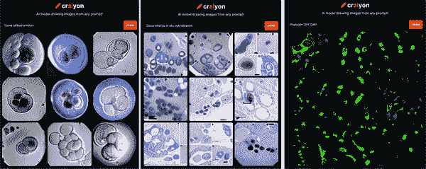
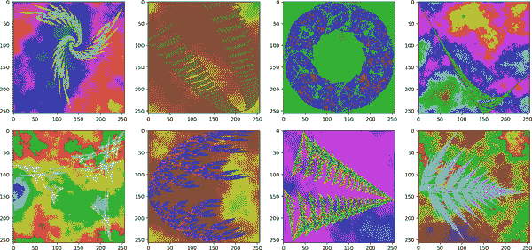
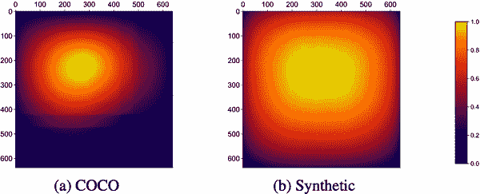

# 第五章：安全可信的数据生成

任何稍有涉足机器学习领域的人都明白数据的重要性。但是，人们往往低估了数据的重要性。OpenAI 在 2020 年发表了一篇关于大型语言模型扩展定律的论文，并得出结论：增加模型大小足以使给定数据集上的机器学习模型更加强大。¹ 然而，DeepMind 在其 2022 年的 Chinchilla 网络论文中展示了，单单增加参数并不能创造出优秀的模型。² DeepMind 表明，数据集的规模需要与模型的大小相匹配。尽管这种扩展定律的证据具有说服力，但问题在于，许多团队更多受制于数据的限制，而不是参数的数量。

在任何机器学习项目中，最常见的障碍之一就是为机器学习模型获取足够的训练数据。³ 数据获取可能非常具有挑战性，因为必须收集足够大的样本，以代表整体数据的总体。在某些情况下，挑战可能在于根本无法获取任何数据来输入模型。考虑到这些问题，记住数据集来源的常见陷阱是非常重要的。

在本书中，我们已经涵盖了一些机器学习模型失败案例的示例。这些案例包括社会或非社会偏见（见第二章）、关注错误的数据特征（见第三章）以及未能捕捉现象的完整分布（见第四章）。许多这些问题的修复可能涉及如何训练机器学习模型的变化，但最大的问题往往出现在数据本身：它可能包含错误、包含偏见（随后反映在模型中）或不符合隐私标准。本章深入探讨了策划和维护数据集的最佳实践。

在我们深入探讨现实世界和合成数据获取的最佳实践之前，让我们来看一些未经信任的数据获取可能的具体示例及其可能带来的后果。

# 案例 1：未加保护的 AWS 存储桶

Amazon S3 存储桶中包含各种信息，包括图像、视频和文本，涵盖几乎每一个可能的领域和主题。在创建这些存储桶时，通常可以设置一些安全设置，以限制访问仅限于您自己或受信任的用户。许多人不设置这些安全措施，可能是因为匆忙或不知道如何设置。

有些人开始意识到这些未安全配置的 AWS 存储桶的程度。就像有些人会从未安全配置的 GitHub 仓库中获取未安全的加密货币私钥一样，一些团体迅速开发了工具，从这些未安全的存储桶中获取有价值的数据集。例如，[GrayHatWarfare](https://oreil.ly/q58ND) 提供了一个 Web 应用程序来搜索和浏览公共 S3 存储桶。许多人专门针对特定类型的数据。例如，在早期阶段，[IntelPixel](https://oreil.ly/YYik3) 将这样一个抓取器与其隐私工具结合起来，用于创建医学成像数据集的匿名化医疗数据。IntelPixel 可能是一个不寻常的道德异常值。大多数访问这些未安全配置的存储桶的公司都不费力进行数据匿名化（而那些进行匿名化的公司也仅仅是部分匿名化）。这样的方法降低了获取数据的门槛，但引入了数据质量控制、法律、伦理和公共关系责任的新问题。

###### 注意

如果你是这些 AWS S3 存储桶的所有者，并且花费了大量时间、金钱和精力获取数据，你应该绝对花时间来[确保访问您的存储桶并设置监控](https://oreil.ly/wrX3h)（或者您在任何云提供商上使用的数据存储选项）。

# 案例 2：Clearview AI 从社交媒体上抓取照片

类似于 S3 存储桶案例的策略，Clearview AI 从公开可用的照片中构建了面部识别工具。他们创建了一个抓取器，将公共社交媒体照片与姓名配对，然后创建了一款据称可以从他们的 30 亿张图片数据库中识别任何人的工具，[不论该美国人的照片是否曾出现在刑事数据库中](https://clearview.ai)。尽管该工具立即显露出可能被跟踪者滥用的[巨大潜力](https://oreil.ly/c1gsc)，但它被市场化为向执法机构推广。这个工具可以基于照片识别大多数美国人，而不管该美国人的照片是否曾被收录在刑事数据库中。隐私专家和公众对此感到震惊。因此，当 Clearview AI 面对包括美国公民自由联盟在内的团体提起的[隐私侵犯诉讼](https://oreil.ly/8lo6W)时，这也就不足为奇了，他们承诺终止企业客户对其从公共网络收集的照片数据库的访问。

###### 注意

如果你是数十亿社交媒体用户之一，你可能应该限制大部分信息仅供自己或亲密朋友查看。更好的做法是应用各种面部识别伪装工具对你的照片进行处理，比如[SAND 实验室的 Fawkes 软件](https://oreil.ly/ALncK)。

# 案例 3：未正确存储的医疗数据

重要的是要记住，不当的数据来源也可能适用于数据如何在内部团队之间传递。2020 年，安全研究人员发现了称为“暂存数据”的未受保护文件夹，通过 Cense AI 网站公开了超过 250 万名患者的个人和健康信息。安全研究人员怀疑这些数据是在加载到 Cense AI 的数据管理系统或 AI 之前暂时存储的。

所有这些情况都涉及某种形式的非法获取数据的使用。在两个案例中，用户可能知道他们的数据存储设置为公共的，但低估了数据的影响力。在第三种情况下，AI 正在从本应为内部系统的数据源获取数据，但是即使是暂时放松的安全标准也会引入巨大的法律责任。

如果您对道德不太关心，至少要意识到这些对数据的处理方法将会烧毁桥梁，侵蚀客户信任，并且通常会成为公共关系灾难。如果您是一个被指定负责策划这类不道德数据获取项目的工程团队的一员，那么请知道，如果您的项目受到不利报道，您很可能会成为第一个替罪羊。

# 获得现实世界数据的问题

当评估您的数据获取工作时，您会希望查看几个方面。

## 使用正确的数据来达到建模目标

在数据获取之前，您应首先询问是否拥有适合建模目标的正确数据。例如，如果您正在获取显微镜数据以获得细胞成像数据集，但您试图观察蛋白质折叠（蛋白质比细胞小得多），那么即使是最明智地取样的、在道德上获取的细胞数据集对您的蛋白质折叠研究也帮助不大。

## 同意

简单地说，您是否获得了数据的生产者的使用许可？这不仅意味着在冗长而难以理解的“条款和条件”文件中解释您将要做的事情。理想情况下，您应确保用户充分了解数据的使用目的，或者至少您正在使用该数据。

即使您已经得到了数据所有者的同意，这种同意可能在时间或地理范围上并不是无限制的。因此，您还应该制定一个数据保留政策。数据保留政策的目的是确定以下内容：

+   您将存储数据的时间有多长

+   您将如何存储数据

+   您将存储数据的位置

+   数据的格式

+   存储数据的介质

+   谁对数据拥有权威

+   当未经授权的实体访问数据时会发生什么

根据您所在行业（例如医疗保健、国防、会计等），这可能已经是合规要求。即使不是，建议仍然制定一个最佳实践政策。

在 2002 年通过萨班斯-奥克斯利法案之后，企业通过设立伦理官员和专门的伦理准则等机制来强化企业责任。将这些准则翻译为适用于使用 AI 系统的组织是增加这些技术开发组织责任感的一种方式。

## PII、PHI 和 机密信息

即使您已经得到数据所有者的同意，您仍然需要确保不使用包含个人身份信息（PII）的任何数据。这可能涉及一系列不同的信息字段或其组合。例如，一个人的姓名和出生日期合在一起的风险比这些字段单独使用更高。同样适用于将一个人的姓名与其地址一起存储。其他字段即使单独使用也是敏感的，例如电话号码、电子邮件地址、社会安全号码、医疗关键词、车辆识别号（VIN）和设备标识符。

根据您所在的国家不同，这可能是受法律保护的信息。例如，在美国，受保护的健康信息（PHI）受《健康保险移植与责任法案》（HIPAA）保护。 PHI 是指描述一个人医疗历史的任何信息（例如，心理或身体健康状况、测试和实验室结果、保险信息和/或可识别的人口统计信息）。

即使您确信您的数据中没有法律上定义的 PII 或 PHI，您仍应注意敏感信息。例如，如果您正在处理涉及代码库的 NLP 项目，您需要确保代码库已经清除了任何机密信息。

## 比例和抽样技术

在使用数据集之前，每个人都应该了解数据集中样本的相对频率以及是否存在异常值。无论您创建的是什么数据集，您都希望确保所有特征的相对频率与整个真实世界人口的相匹配。由于大数定律的存在，这通常（但并非总是）与确保您的数据集足够大是同义的。

## 未描述的变异

对于您的数据集，可能存在未被任何感兴趣的因变量解释的数据特征。如果您不适当地对一些这些特征进行归一化或清理，模型可能会浪费计算时间来试图弄清楚它们与目标变量的相关性。虽然在许多其他统计测试中可能很容易忽略这些问题，但很难让机器学习模型忽略您不感兴趣的特征。还有可能是您在数据标记过程中犯了错误，您的模型正在寻找不存在且不应存在的模式。这反过来可能会导致意外的替代指标。

## 意外的替代指标

这是一个数据的某个特征没有记录的问题，但模型能够使用其他特征作为代理。例如，由于许多城市历年来的歧视性住房政策，一些机器学习模型可能会无意中将像`postal_code`这样的数据特征作为种族或族裔的代理。另一个案例中，一个训练用于检测胸部 X 射线中 COVID-19 的机器学习模型，结果发现主要是[在实际没有 COVID-19 的患病儿童](https://oreil.ly/cTju4)进行了大量训练。因此，该模型主要关注患者是否躺下（这更可能意味着严重疾病），这是意外的代理。

## 外部效度的失败

外部效度是指您能将研究结果推广到其他情境、人群、设置和测量程度的程度。换句话说，您能否将这个模型的结论应用到其他情况？有很多情况下，外部效度可能会受到损害。例如，如果您有一个医疗数据集，试图用它来预测某种精神疾病，并且该模型表现非常出色，您可能会想将其应用于研究之外的人群。然而，请考虑一下，如果您只有 20 到 29 岁年龄段的数据。这个模型突然对普通人群的适用性显得不那么可靠了。当然，您可以在新的 20 到 29 岁年龄段上复制模型的性能，但如果您声称该模型在超出该年龄段的人群中同样表现良好，那这就是效度失败了。这与第二章中描述的许多概念有很大重叠。

## 数据完整性

你知道数据的来源吗？在真实数据中是否混有插值数值？你有记录数据进行的哪些修正吗？你确定训练集和测试集中没有相同的数据实例吗？例如，在 MNIST 数据集中获得高准确率的模型是一件非常容易的事情。然而，在庆祝你的神经网络开始工作之前，你应该意识到 MNIST 数据集中[存在一些错误标记的条目](https://oreil.ly/cZE0N)。

在数据科学或机器学习项目中，尤其是在组建专门的管道管理器之前，最容易犯的错误之一是没有正确跟踪哪些数据位于哪个拆分中。

将数据集拆分为训练、验证和测试集是机器学习中的常见做法。每个拆分中应该有多少数据的比例也有所不同，有些比例适合不同的数据集大小。还有各种不同的洗牌或分层数据的策略。在某些情况下，例如当你处理时间序列数据时，你可能希望确保数据按时间分割。

这些都是需要考虑的重要事项，但我们要关注的问题要简单得多。我们希望确保在测试模型时，无论是在训练集还是验证集上，它都不仅仅是因为记住了数据而得分较高。我们在第四章中讨论了测试机器学习模型鲁棒性的各种方法，但这是非鲁棒性的一个非常常见的来源（即使对于特定模型来说，这并不是唯一的问题来源）。

## 设定合理的期望

在努力获取数据集之后，您可能期望生成的模型突然能够回答关于主题的任何问题。管理期望总是很重要的。毕竟，如果您在数据集上训练回归或分类模型，您应该记住您能够回答的主要问题类别是直接与模型类型相关的。即便如此，一些输出可能是由于模型中的怪癖或瓶颈导致的。

## 数据收集问题的工具

并没有太多技术工具可以自动帮助您收集更可靠的真实世界数据集。大多数现有工具实际上只能在您解决了前述一些更高级别问题后才能真正帮上忙。在处理更高级别问题时，最好随时准备一个检查清单。这是一个领域，高级工具无法弥补人类意图和有意设计的地方。

一旦您完成了检查清单，其他工具实际上会非常有帮助。

### 获得同意

要获得同意，有一些设计原则可以使您成为突出的好人（至少与其他人相比是如此）。

对于“条款和条件”页面，如今有许多网站设置了一个计时器，只有在一定时间后或者在您完全滚动到底部后才能选择*同意*选项，或者两者兼而有之。其他一些组织则通过提供条款和条件的文本转语音选项进一步提升服务（如果您正在更新它，您可以使用像 Speechify 或 Resemble AI 这样的自动文本转语音工具）。

创建数据保留政策，请参阅 [Proofpoint 指南](https://oreil.ly/JRu0n)。

### 辨识 PHI、PII 和其他敏感数据

对于识别 PHI，您可以使用 [Nightfall PHI/PII API](https://oreil.ly/PyPmF)。AWS 还有一个可以帮助您识别 PHI 的 [医疗数据 API](https://oreil.ly/AMrNS)。

要清除密钥，您还可以使用[Nightfall Secrets API](https://oreil.ly/6b7rU)。Nightfall 可以扫描诸如 AWS、Azure、Confluence、Confluent、Datadog、ElasticSearch、Facebook、GitHub、GitLab、Google API、JIRA、Nightfall、Okta、Paypal、Plaid、Salesforce、Slack、Square、Stripe、Twitter、Twilio 和 Zapier 等服务的秘密。GitHub 本身提供了[secret-scanning tool](https://oreil.ly/DTaJ5)（尽管鉴于他们过去在秘密方面的丑闻，比如加密货币私钥出现在 GitHub copilot 的自动完成中，我们建议先探索所有选项）。

### 比例和抽样技术

正确的类比例很重要。例如，如果您正在训练分类模型，您可能希望确保您的数据管道更频繁地对少数类进行抽样。

### 跟踪意外变化

为了控制意外变化，您可以使用像第四章讨论的工具来识别意外变化。

### 跟踪意外代理

第三章讨论的许多工具也可以用来跟踪意外代理。

### 数据完整性

对于生命科学等领域，跟踪数据来源的工作流是标准做法。像[Insitro’s Redun](https://oreil.ly/IpfEz)这样的工具非常适合这些领域。不特定于生物科学的工具还包括像[Airflow](https://oreil.ly/MAexk)和[Luigi](https://oreil.ly/hz0ld)这样的工具。我还建议查看像[Flyte](https://oreil.ly/2h6mP)这样的工具来管理您的数据管道。当涉及到跟踪数据变更时，像[Data Version Control (DVC)](https://dvc.org)这样的工具也是一个不错的选择。当这些变更涉及预处理步骤和特征工程时，您可以使用由 LinkedIn 创建的特征存储库[Feathr](https://oreil.ly/gglaw)，该存储库提供了用于监控和跟踪这些步骤的接口。

### 错误组织的拆分

当您需要确保您的模型在训练和测试数据中没有重复使用相同的数据实例时，您可以使用像[did-it-spill](https://oreil.ly/fdPhQ)这样的工具。

### 设定合理的期望

部署机器学习产品中最常见的故障模式之一可能源于（1）未说明为何认为泛化是可能的以及（2）未仔细思考您的超出分布案例的宇宙。很难找到一个能帮助您设定合理期望的软件包。您能做的最好的事情是持续跟踪您的模型可能遇到的所有不同故障案例。当您需要弄清楚您的机器学习模型或管道将回答的问题时，列出它不会回答的问题也很重要。

所有这些真实世界数据的问题都导致人们试图提出合成训练数据的方法。

# 合成生成的数据

面对获取真实世界数据的所有挑战，寻找生产合成数据的方法可能会很诱人。毕竟，像 StyleGAN 这样的机器学习模型以非真实存在的[人物](https://oreil.ly/ojmhw)（以及[猫](https://oreil.ly/2THmG)、[租房公寓](https://oreil.ly/BsBSX)和[车辆](https://oreil.ly/utQEp)）闻名。有关更多示例，请参阅[“This X does not exist”](https://oreil.ly/tS6sg)。

与真实世界的数据相比，这些数据生成器确实存在一些缺点。然而，合成数据在许多机器学习流程中的一个关键步骤上仍然非常有用：迁移学习。在高质量合成数据上训练的模型可以快速地在真实数据上进行训练。这种方法有几个优点：

+   合成数据可以拥有完全准确的标签。这甚至适用于在现实生活中获取可能复杂或昂贵的详细标签。

+   可以轻松调整合成环境，以改变模型的行为，例如随机化要忽略的环境部分，同时保持希望模型专注的特征的一致性。

+   合成数据可以作为敏感真实世界数据的代理，训练模型捕捉重要模式，同时排除与特定个体相关的模式（有关隐私详情，请参阅第一章）。

+   一旦建立起来，合成数据生成器可以快速、廉价地生成所需的大量数据。

当然，实现这些好处完全依赖于具有足够*优质*的数据生成器。创建能够生成逼真数据的生成器是一项非平凡的任务。更重要的是，尚不能完全依赖生成器训练模型并将其部署到真实世界中，而不进行真实数据训练。我们并非生活在一个理想的世界中。

然而，这并不意味着公司没有投入大量时间和资源来创建复杂的数据模拟工具。例如，有 NVIDIA Omniverse，一个仿真、物理引擎和渲染工具。还有 Pixar 的通用场景描述技术，用于进行准确的渲染。物理模拟器如 MuJoCo 多年来一直在强化学习中使用，自从 DeepMind 购买 MuJoCo 并开源以来，使用它就像`pip install mujoco`一样简单。

## DALL·E、GPT-3 和合成数据

如果你关注过人工智能的新闻，你可能会得出结论，AI 生成器已经发展到可以用来生成逼真数据的程度。例如，DALL·E 项目就是一个可以从文本生成逼真图像的图像生成 AI。有些人尝试使用像[Craiyon（之前称为 DALL·E 迷你）](https://oreil.ly/f4ZAp)（及其适用于本地计算机的优化分支）⁵来尝试在不到五分钟内创建图像分类器。例如，对于一个苹果与香蕉分类器，可以向 DALL·E 迷你输入一系列提示，如“桌上的香蕉”，“随机背景上的香蕉”，“桌上的苹果”和“随机背景上的苹果”。然后，可以将这些图像输入到像谷歌的[Teachable Machine](https://oreil.ly/lwdcd)这样的工具中，并得到一个在分类现实生活中的苹果和香蕉时似乎运作良好的分类器。如果你已经阅读了前几章，那么你现在应该意识到，在玩具环境中制作基本工作的 ML 模型很容易，但要在真实世界中使其稳健则更为困难。例如，前述分类器最终在黄色苹果或不同光照下的苹果和香蕉，或者不属于任何类别的物品的情况下失败了。

尽管如此，仍有许多人会被合成数据生成器所诱惑。在 DALL·E 迷你发布后不久，人们发现该程序可以创建看似逼真的生物研究数据（图 5-1）。



###### 图 5-1\. 从 DALL·E 迷你模型生成的假显微镜图像

图 5-1 中的图像都不是来自实际实验室或显微镜。它们只是由计算机程序生成的。对于非专家来说，这些图像可能看起来非常逼真。然而，如果你想要使用这样的图像来完全训练一个机器学习模型或验证科学出版物中的假设，你会很快遇到困难。当生成模型创建这样的图像时，它们实际上是从代表图像可能属性的概率分布中进行采样。这意味着你经常会得到刻板化的图像，而那些不刻板的图像看起来只会让人感到不协调。因此，这是在像细胞生物学这样一个需要寻找各种离群点的领域中理解的极其糟糕的工具选择。

除了作为唯一的训练数据来源或假设验证的实际无用外，如果将这些图像添加到某种出版物中，可能会破坏出版者与提交图像的人之间的任何信任。这意味着，当涉及使用合成数据进行机器学习或科学研究时，这些类型的图像实际上比无用还要糟糕。⁶

这并不意味着合成数据从不具有*任何*用途。只是要正确使用它通常比看起来要微妙和棘手得多。使用合成数据搞砸自己的脚也极为容易。即使在最好的情况下，您可能也只能将合成数据用于预训练，而不是一个可以在真实世界中运行的完整端到端模型训练流水线。

## 利用合成数据改善模式识别

如果您不能使用合成数据完全训练模型，那么它能有多大用处呢？即使您不依赖合成数据进行整个过程，它仍然可以极大地提升模型的整体模式识别能力。

### 过程驱动的合成数据

过程驱动的合成数据是通过显式定义的算法生成的一种合成数据类型。这可能涉及从方程或流形中随机选择点，并对其添加一些随机噪声。这些方法的优势在于可以将人类领域知识轻松地整合到数据生成中。不利之处在于，设计不当的过程可能会加剧设计该过程的人类的盲点和偏见。

### 数据驱动的合成数据

数据驱动的合成数据指的是通过适应或训练于某种现实世界数据的生成模型生成的合成数据。在这一类别中，您可以找到各种生成对抗网络（GAN）和流模型，用于生成合成数据。

这种方法的优势在于可以更有信心地确保数据集代表真实生活现象。不利之处在于，训练一个良好的生成器取决于是否有大量且高质量的数据集，如果您已经拥有这样一个好的数据集，您可能根本不需要这个新的生成器。毕竟，如果您试图制作一个可以区分由 GAN 生成的图像类的模型，为什么不直接使用 GAN 本身的判别器呢？相反，如果您没有足够的数据来可靠地训练分类器或回归器，您不应期望将模型转化为生成器能够奇迹般地解决数据问题。

## 深入探讨：使用过程驱动的合成数据集预训练模型

以提高模式识别为例，让我们看看当您仅在原始模式上预训练模型时会发生什么。

如果你查看图像识别网络的激活，你会发现早期层次中的神经元集合通常在处理基于一两种颜色的简单模式时更活跃，并且它们的交集呈角度取向。稍后的层次通常在早期神经元组合激活后被激活，形成更高级别的模式，例如独特的形状。甚至更晚一些，这些层次在响应于高级概念对应的模式存在时被明显激活。当你运行整个网络时，模式识别从边缘、纹理、图案、部件，最终到物体的过程逐步进行。⁷

如果你从头开始训练一个模型，你的模型需要学习所有这些模式，包括高级和低级模式。预训练背后的动机在于，虽然接近末端的高级概念由于域的改变可能不那么有用，但在大型数据集上进行训练可能意味着早期层次上的重新训练减少。因此，计算机视觉模型通常会在像 ImageNet 这样的大型（相对）多样化的分类数据集上进行预训练。

假设你想要进行这种类型的预训练，而不是在 ImageNet 或者任何其他真实世界的数据上进行训练。你可以通过构建一个基于过程驱动的合成数据生成器来实现这一点，使模型能够在一堆分形图上进行训练。这些分形图完全是抽象的，不对应于真实世界的物体。你可以得到与使用 ImageNet 这样的数据集预训练的模型相媲美的结果。

###### 注意

你可以在笔记本[*Chapter_5_Synthetic_Data_Fractals.ipynb*](https://oreil.ly/IQpwY)中找到与本教程相关的所有代码。这受到了“改进分形预训练”中优化的分形预训练技术的启发，⁸ 该技术在 2020 年由片冈等人首次提出，表明合成分形可以用于预训练。⁹ 很多代码已经进行了重构，并使用了 PyTorch 和 HuggingFace。

如果你想要可视化从参数生成的分形图，请尝试来自“改进分形预训练”的[交互式浏览器可视化工具](https://oreil.ly/goLSk)。

对于数据生成器，你将大量使用 Numba 库来在 CPU 上高效地生成这些形状。该脚本生成的图像可以存储在磁盘上的数据集中，也可以在每次训练数据生成器的迭代中从头生成。每个输出的分形图将具有有色背景，对应于分形的形状和类型的数值常数，以及与所有这些属性对应的一个或多个标签类型（见图 5-2）。



###### 图 5-2\. 输出分形图示例

## 人脸识别、姿势检测和以人为中心的任务

微软展示了在野外进行高效的人脸识别是可能的，而不需要（直接）使用真实数据。相反，微软通过结合“一个程序生成的参数化 3D 面部模型和一个全面的手工制作资产库来渲染训练图像，以实现前所未有的真实感和多样性。”¹⁰ 这是通过名为“假装到成功”（[微软 GitHub 项目页面](https://oreil.ly/rUJPn)，[数据集库](https://oreil.ly/GYrPI)，以及[视频演示](https://youtu.be/wlOMpQe8luQ)）的项目成功实现的。

长期以来，AI 拥有两大资源：数据和计算力。像这样的项目表明，*数据*实际上只是*计算力*穿着风衣。微软可以利用计算机生成大量数据，从而改变整体 AI 开发的经济学。

不仅仅局限于面部，[Unity 已经创建了一个工具包](https://oreil.ly/Mghmp)，用于生成合成的人体姿势和身体形状。这个工具包，[PeopleSansPeople](https://oreil.ly/jawT9)，允许直接从人体模型生成标签的边界框和姿势关键点。¹¹ 该项目页面详细介绍了这如何创建比标准基准如[“常见上下文中的通用对象”（COCO 数据集）](https://oreil.ly/jfBfO)（在图像分割和物体检测研究中与 MNIST 或 CIFAR-10 相媲美）更大的训练数据集。此外，项目页面还讨论了这些合成数据集如何产生更平滑的边界框分布（见图 5-3）。



###### 图 5-3\. COCO 和“PeopleSansPeople”中的边界框分布，取自 Unity Technologies 项目页面

## 物体识别及相关任务

在计算机视觉中有大量的监督学习任务可以应用于相同的图像。问题在于像图像分类、实例分割、深度映射、光流等任务需要基本不同类型的标签。如果能够制作至少半真实的图像或视频，您可以为输入特征自动生成不同类型的标签，因为您可以控制两者。例如，包括[Tex⁠tRecognitionDataGenerator](https://oreil.ly/TkY79)可以自动生成各种字体和噪声水平下的文本图像，用于光学字符识别（OCR），并每次生成数据时与正确的标签配对。另一个例子，微软创建了一个生成器用于虚拟头像，该生成器将为面部的七百多个关键点自动生成标签。¹² 在这个合成数据集上训练允许面部识别系统在真实面部上识别这些关键点，并在部分面部被遮挡时为每个点提供置信度估计。

Google 研究开发了一个名为[Kubric](https://oreil.ly/cGCg6)的工具。¹³ 这是一个数据生成管道，用于创建具有丰富注释的半真实合成多对象视频，例如实例分割掩模、深度图和光流。[假设您已安装 docker](https://oreil.ly/UPw0n)，您可以使用 Kubric 生成合成训练视频数据。结果是一个 Python 界面，用于与渲染器（Blender，一个开源 3D 渲染器）交互。

```
import logging
import kubric as kb
from kubric.renderer.blender import Blender as KubricRenderer

logging.basicConfig(level="INFO")

# --- create scene and attach a renderer to it
scene = kb.Scene(resolution=(256, 256))
renderer = KubricRenderer(scene)

# --- populate the scene with objects, lights, cameras
scene += kb.Cube(
    name="floor", scale=(10, 10, 0.1), position=(0, 0, -0.1)
)
scene += kb.Sphere(name="ball", scale=1, position=(0, 0, 1.0))
scene += kb.DirectionalLight(
    name="sun",
    position=(-1, -0.5, 3),
    look_at=(0, 0, 0),
    intensity=1.5,
)
scene += kb.PerspectiveCamera(
    name="camera", position=(3, -1, 4), look_at=(0, 0, 1)
)

# --- render (and save the blender file)
renderer.save_state("output/helloworld.blend")
frame = renderer.render_still()

# --- save the output as pngs
kb.write_png(frame["rgba"], "output/helloworld.png")
kb.write_palette_png(
    frame["segmentation"], "output/helloworld_segmentation.png"
)
scale = kb.write_scaled_png(
    frame["depth"], "output/helloworld_depth.png"
)
logging.info("Depth scale: %s", scale)
```

此代码创建了一个场景，其中包含一些极简单的对象，但也可以指定[更复杂的资产](https://oreil.ly/LAszb)。您可以在笔记本[*Chapter_5_Synthetic_Data_Blender.ipynb*](https://oreil.ly/ubaIR)中找到更多示例。

如果您正在寻找一个更大的预填充的合成对象数据集，也可以考虑查看[NVIDIA 的 GET3D 数据集](https://oreil.ly/VJ5Cu)。这是一个工具，基于 2D 图像构建具有纹理和几何细节的高保真度 3D 形状。

对象识别可能看起来是合成数据领域中风险较低的领域，但这仍然归结为这个模型在现实世界中如何使用的问题。部署训练好的模型来处理封闭环境中的耐用物体和部署训练好的模型来导航完全开放的世界之间存在差异。

## 环境导航

多年来，在强化学习中，使用合成数据来训练代理模型如何导航环境已成为标准做法。像[OpenAI Universe](https://oreil.ly/Ixd8x)（已弃用，推荐使用[OpenAI Retro](https://oreil.ly/LzPjs)）和[Unity ML Agents](https://oreil.ly/lI2Wn)这样的工具是 RL 研究的基石。¹⁴

对于模拟更真实的外部环境，像[Microsoft 的 AirSim](https://oreil.ly/HznJp)这样的工具提供了更多的帮助。¹⁵ 还有像[Driving in the Matrix](https://oreil.ly/UeFLb)这样的项目，利用开放世界游戏如*侠盗猎车手 V*来创建适用于实例分割的标记计算机视觉数据。¹⁶

在[2022 年特斯拉 AI 日](https://youtu.be/ODSJsviD_SU)上，特斯拉描述了它如何使用包含数千辆虚拟汽车的虚拟环境来训练其 AI。这个基于虚幻引擎的虚拟环境包括了旧金山街道的虚拟重建。这种模拟环境使特斯拉工程师可以不断地调整训练环境，随机化纹理，使代理能够独立于纹理识别对象，甚至添加在现实世界中难以获取训练数据的不寻常场景和情况。特斯拉从模拟驾驶环境中采纳了一些原则，将其扩展到了一个大规模（尽管最终的[自动驾驶 AI 还不完美](https://oreil.ly/WTTKv)）。

在合成环境中更具前景的发展之一可能是可以由人类和 ML 代理导航的环境，以便比较两者之间的差异。由 Godot 创建的[Generally Intelligent 的 Avalon](https://oreil.ly/I4TzF)就是这样的一个环境。它可以被强化学习代理和戴着 VR 头显的人类导航。

## Unity 和 Unreal 环境

到目前为止讨论的工具与现有的合成数据工具包相关。但是，您可能希望考虑创建与您自己任务相关的合成数据。

Unity 已经在前面的小节中讨论过。它是一个跨平台的 2D 和 3D 游戏引擎，因其优化游戏开发中一些更具挑战性的方面而闻名。它于 2005 年在丹麦的哥本哈根创建并发布。如今，它被广泛应用于许多热门游戏，包括 2D 游戏*Among Us*，3D 游戏*Monument Valley*，像*Pokémon Go*这样的增强现实游戏，以及像*Escape from Tarkov*这样的第三人称射击游戏，以及超越游戏行业的交互式模拟。该引擎本身用 C++编写，但允许开发者使用 C#编写代码。它还提供了一个图形化编辑器，您可以在其中进行编程而无需编写代码。在 Unity 环境中的每个对象都可以具有许多组件，例如网格（定义对象的形状）和网格渲染器（定义纹理及光照如何作用于对象）。还有物理组件，如刚体动力学和碰撞，以模拟对象在现实世界中的行为。游戏开发者在此基础上添加更多行为，例如每次被击中时对象失去生命值。如果您对创建视觉模拟训练数据感兴趣，网格、网格渲染器和物理组件将是最有价值的工具。

如前所述，Unity 具有用于模拟数据和环境的工具，例如[Unity ML Agents](https://oreil.ly/bKq7Q)和[PeopleSansPeople](https://oreil.ly/mBRxu)。但您不必依赖于这些专门的 ML 工具；您也可以使用用 Unity 资产创建的场景来生成合成计算机视觉数据。

Unreal Engine 是 Unity 在模拟逼真环境方面的直接竞争对手。MetaAI 开发了[UETorch](https://oreil.ly/USfzm)，这是一个[Unreal Engine 4](https://oreil.ly/BYX1q)插件，为游戏引擎循环中添加了嵌入式[Lua/Torch](http://torch.ch)脚本支持，并提供了一组 Lua API，用于提供用户输入以及拍摄和分割蒙版。虽然可用，但 UETorch 已经存档多年且不再维护。对于更新的工具包，[UnrealCV](https://oreil.ly/Hb5eo)是另一个库，用于从 Unreal Engine 生成合成场景和图像。¹⁷

## 合成数据在医疗保健中的限制

有许多项目正在处理合成医疗保健数据。其中之一是[DeepSynthBody](https://oreil.ly/y5RFK)。¹⁸ DeepSynthBody 是一组生成模型（条件和非条件的），用于生成看起来逼真的医疗保健数据。生成模型分为 11 类：心血管、消化系统、内分泌、皮肤、淋巴、肌肉、神经、泌尿、生殖、呼吸和骨骼。

当人类在特征分布上的直觉受限时，合成数据通常最容易正确生成。对于组织学或细胞生物学等数据类型，在最佳情况下，即使对于人类的直觉来说，这也变得更加冒险和具有挑战性。

```
import deepsynthbody.cardiovascular.ecg as ecg

help(ecg.generate)

"""
Help on function generate in module
deepsynthbody.cardiovascular.ecg.functions:

generate(num_ecg, out_dir, start_id=0, device='cpu', **kwargs)
 Generate DeepFake 12-leads 10-sec long ECG.

 Parameters
 ----------------
 num_ecg: int
 Number of DeepFake ECGs to generate randomly.
 out_dir: str
 A directory to save output files with extension ".asc".
 start_id: int
 A interger number to start file names. Default value is 0.and
 device: str
 A device to run the generator. Use strin "cpu" to run on CPU and
 "cuda" to run on a GPU.

 Return
 ------
 None
 No return value.
"""

# To Run on GPU, use device="cuda". To run on CPU (default), use device="cpu"
ecg.generate(num_ecg=5, out_dir=".", start_id=0, device="cuda")
# Generate 5 ECGs to the current folder starting from id=0
```

生成函数可以生成具有 8 个导联值的 DeepFake 心电图，每个导联的名称从第一列到第八列依次为*I*, *II*, *V1*, *V2*, *V3*, *V4*, *V5*, *V6*，持续 10 秒钟（每个导联 5000 个值）。这种 8 导联格式可以使用以下方程转换为 12 导联格式：

<math><mrow><mtext>Ⅲ导联</mtext> <mtext>数值</mtext> <mo>=</mo> <mo>(</mo> <mtext>Ⅱ导联</mtext> <mtext>数值</mtext> <mo>)</mo> <mo>-</mo> <mo>(</mo> <mtext>Ⅰ导联</mtext> <mtext>数值</mtext> <mo>)</mo></mrow></math> <math><mrow><mtext>导联</mtext> <mtext>aVR</mtext> <mtext>数值</mtext> <mo>=</mo> <mo>-</mo> <mn>0</mn> <mo>.</mo> <mn>5</mn> <mo>*</mo> <mo>(</mo> <mtext>Ⅰ导联</mtext> <mtext>数值</mtext> <mo>+</mo> <mtext>Ⅱ导联</mtext> <mtext>数值</mtext> <mo>)</mo></mrow></math> <math><mrow><mtext>导联</mtext> <mtext>aVL</mtext> <mtext>数值</mtext> <mo>=</mo> <mtext>Ⅰ导联</mtext> <mtext>数值</mtext> <mo>-</mo> <mn>0</mn> <mo>.</mo> <mn>5</mn> <mo>*</mo> <mtext>Ⅱ导联</mtext> <mtext>数值</mtext></mrow></math> <math><mrow><mtext>导联</mtext> <mtext>aVF</mtext> <mtext>数值</mtext> <mo>=</mo> <mtext>Ⅱ导联</mtext> <mtext>数值</mtext> <mo>-</mo> <mn>0</mn> <mo>.</mo> <mn>5</mn> <mo>*</mo> <mtext>Ⅰ导联</mtext> <mtext>数值</mtext></mrow></math>

除了 DeepSynthBody 外，还有[模拟](https://oreil.ly/M4XQ7)和[SHARED](https://oreil.ly/1oBU4)项目。

医疗数据的一个问题在于，虽然相对容易生成不会识别任何人的健康患者数据，但对实际病理数据进行这样的处理要困难得多。许多医疗数据集的区分特点在于其异常值（健康基准之外的患病者），因此很多人[怀疑这种方法作为隐私解决方案的实用性](https://arxiv.org/abs/2011.07018)（参见第一章关于 k-匿名性）。

人造数据有其优点，因为真实世界的医疗数据在很多情况下太混乱，无法使用。因为许多医疗系统是围绕账单设计的，决策由医院和保险公司的高管做出，他们通常不是技术专家。目前还没有太多的动力来清理系统或者像银行等领域那样制定良好结构化的开放协议进行互操作。

此外，医生和护士通常不关心数据的程序记录，他们通常也没有接受过这方面的培训。他们通常只考虑将数据记录下来，以便其他人类阅读。¹⁹

## 自然语言处理中合成数据的局限性

到目前为止，大多数示例都与图像处理有关。鉴于像 GPT-3 这样的大型语言模型的存在，应该可以为顺序或基于文本的任务生成合成数据。

不幸的是，这与使用 GAN 生成合成数据面临相同的问题。如果你有足够的数据来创建一个训练良好的语言生成模型，那么你可能根本不需要这个生成模型来解决你的数据问题。如果你使用像 [OpenAI](https://openai.com/api), [Cohere](https://cohere.ai), [Copy.ai](https://www.copy.ai), [ElutherAI](https://www.eleuther.ai), 或 [GooseAI](https://goose.ai) 这样的组织提供的非开源语言模型来生成合成数据，你需要极度谨慎地检查错误、偏见和其他在真实数据中不存在的问题。如果你使用需要付费的 API 的非开源语言模型，那么尝试创建一个体面的合成数据集可能比仅仅从伦理角度获取真实数据更加昂贵。

## 自监督学习模型与巨大的自然数据集之间的比较

如果你无法使用大型合成数据集，但又苦于获取足够标记的真实世界数据，还有另一条值得考虑的途径：自监督学习的模型。²⁰

自监督学习的工作原理是试图预测输入中未观察到或隐藏的部分。例如，在自然语言处理中，一行的单词可以使用句子中剩余的单词来预测。它比监督学习更容易扩展。它可以自动生成训练标签，而且许多自监督学习系统可以在比它们训练的更多上下文中使用。唯一的缺点是，自监督学习通常在基础数据为离散的情况下效果最佳（例如，Google 的 BERT 预测文本中的整数标记），但在连续数据上表现相对较差。²¹

###### 注意

混淆不已，SSL 这个首字母缩写同时用来指代自监督学习和半监督学习。半监督学习是一种技术，你可以使用训练好的模型来标记新数据，然后继续在这些新数据上训练。²² 虽然这可以是一种有用的技术，但它与自监督学习并不完全相同。在使用这两种技术时，应注意遵循最佳实践。

## 将质量控制度量重新用于安全目的

合成数据的主要缺点之一是，并非所有人都只是为了减少公司的训练数据预算而使用它。深度伪造技术长期以来一直被视为假设，但正如本章希望说服您的那样，深度伪造技术已经存在。这对了解您的客户（KYC）行业是一个巨大的问题。好消息是，许多用于测试合成和对抗数据鲁棒性的工具（本章和第四章讨论过）也适用于深度伪造技术。关于合成数据生成工具的详细介绍，请参阅附录 A。

# 结论

当涉及到获取数据时，无论是真实世界的还是合成的，这是使您的 ML 流水线符合到目前为止书中描述的各种标准的关键步骤之一。获取有助于您的模型产生您希望的输出的真实世界数据充满了危险，但是如果您知道要寻找什么，有很多工具可以使其变得更容易。数据驱动的合成数据可能看起来是解决某些与真实世界数据相关的问题（例如隐私、可用性等）的解决方案，但它并非灵丹妙药。一些关于合成数据的问题可以通过过程驱动方法来解决，但是过程驱动的合成数据的质量取决于您在数据生成器中硬编码的假设的好坏。归根结底，您能否获得足够的训练数据将取决于您有多么好地能够衡量特征和标签的分布，控制质量，并始终再三检查您在该领域的假设。

¹ Jared Kaplan 等人，《神经语言模型的缩放法则》，*arXiv 预印本*（2020 年）。

² Jordan Hoffmann 等人，《大规模语言模型训练的计算优化实证分析》（2022 年），[arXiv 预印本](https://oreil.ly/QsoDW)。

³ 即使是少样本学习的图像和语言模型，找出*最佳*的几个示例也是困难的。

⁴ [“AI 公司通过互联网泄露了 250 万患者记录”](https://oreil.ly/V-GJu)，*HIPAA Journal*，2020 年 8 月 21 日。

⁵ [DALL·E mini 裸版](https://oreil.ly/THa3U)，仅包含在本地机器上执行推理所需的基本要素。

⁶ 像[撤稿观察](https://retractionwatch.com)这样的网站已经在跟踪使用生成模型产生的假数据而撤销的论文。生成模型可能会更频繁地出现在这类网站上。

⁷ Chris Olah 等人，《特征可视化》，*Distill*（2017 年 11 月 7 日）。

⁸ Connor Anderson 和 Ryan Farrell，[“改进分形预训练”](https://oreil.ly/7sNnO)，*IEEE/CVF 冬季计算机视觉应用会议论文集* (2022).

⁹ Hirokatsu Kataoka 等人，[“无自然图像的预训练”](https://oreil.ly/rb9L1)，*ACCV 2020* (2020).

¹⁰ Erroll Wood 等人，[“虚假而为之：仅使用合成数据在野外进行面部分析”](https://oreil.ly/8wxyh)，*IEEE/CVF 国际计算机视觉会议论文集* (2021): 3681–91。

¹¹ Salehe Erfanian Ebadi 等人，[“PEOPLESANSPEOPLE: 人类中心计算机视觉的合成数据生成器”](https://arxiv.org/abs/2112.09290)，*arXiv 预印本* (2021).

¹² Erroll Wood 等人，[“带有密集标记的 3D 面部重建”](https://oreil.ly/aa7nI)，*Microsoft*，2022 年.

¹³ Klaus Greff 等人，[“Kubric: A Scalable Dataset Generator”](https://arxiv.org/abs/2203.03570)，*IEEE/CVF 计算机视觉与模式识别会议论文集* (2022): 3749–61.

¹⁴ Arthur Juliani 等人，[“Unity：智能代理的通用平台”](https://arxiv.org/abs/1809.02627)，*arXiv 预印本* (2018).

¹⁵ Shital Shah 等人，[“AirSim：用于自动驾驶车辆的高保真视觉和物理仿真”](https://arxiv.org/abs/1705.05065)，*Field and Service Robotics Conference 2017 (FSR 2017)* (2017).

¹⁶ Matthew Johnson-Roberson 等人，[“驾驶在矩阵中：虚拟世界能否替代真实世界任务的人工生成注释？”](https://arxiv.org/abs/1610.01983)，*国际机器人与自动化会议* (2017).

¹⁷ Weichao Qiu 等人，[“UnrealCV：计算机视觉的虚拟世界”](https://dl.acm.org/doi/abs/10.1145/3123266.3129396)，*ACM 多媒体开源软件竞赛*，2017 年.

¹⁸ Vajira Thambawita 等人，[“DeepSynthBody：医学数据不足的终结开始”](https://oreil.ly/Bq5dW)，*IEEE* (2021).

¹⁹ Brian Kihoon Lee，[“电子医疗记录上的深度学习注定失败”](https://oreil.ly/P9pbj)，*moderndescartes.com* (博客)，2022 年 3 月 22 日.

²⁰ Yuki M. Asano 等人，[“PASS: 一种用于自监督预训练的 ImageNet 替代品，无需人类参与”](https://arxiv.org/abs/2109.13228)，*arXiv 预印本* (2021).

²¹ 如果您想了解更多信息，请访问[GitHub](https://oreil.ly/mcteu)查看关于自监督学习的论文列表。

²² 查看 Lilian Weng 的博客文章 [“用不足的数据学习 第一部分”](https://oreil.ly/iN33C)，了解半监督学习的精彩总结。
