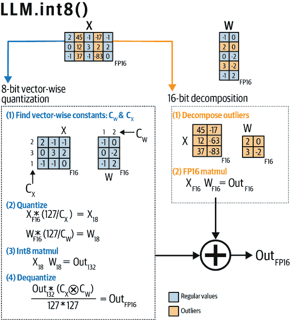
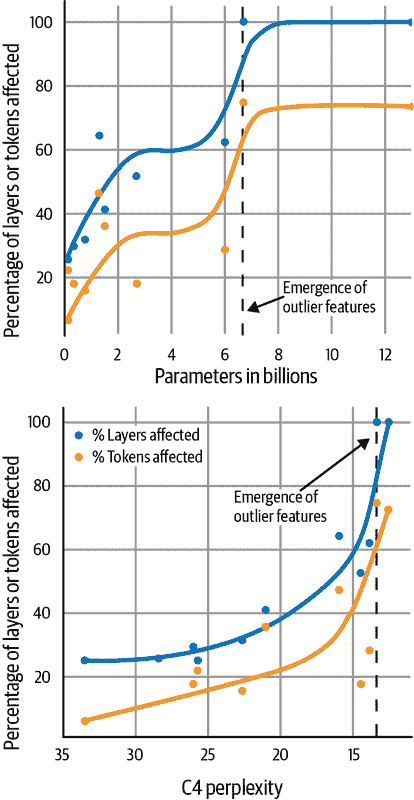
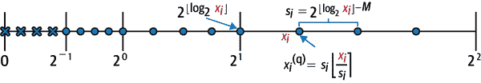
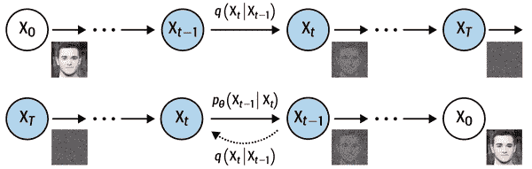
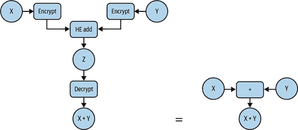
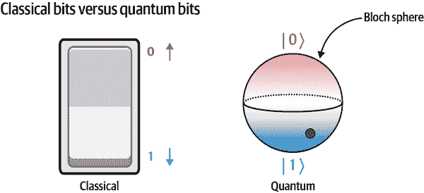
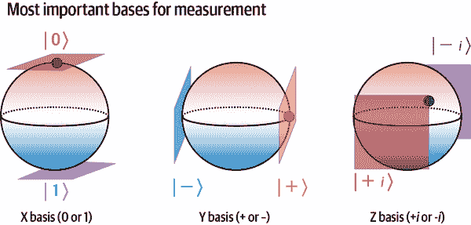

# 第六章：更多的最新研究问题

在前几章中我们涵盖的内容大多从标准实践到实际但未被充分利用的方法。本章专注于刚刚走出研究阶段的方法。我们还将探讨这些方法中哪些正在变得适用于实际世界，并询问它们与我们在前几章中讨论过的各种可信度指标有何不同。这绝不是当前正在进行的各种尖端机器学习技术的详尽列表，然而，这些都是作者在讨论中看到的一些更有趣的技术。

首先，我们希望了解如何警惕关于机器学习技术过度宣传的报告和文章（这在“量子机器学习”中将非常相关）。

# 理解不当宣传研究声明的含义

总的来说，所有这些技术仍处于研究和概念验证阶段。如果我们有更多关于如何评估研究技术及其是否适用于实际应用的例子，将会很有帮助。这可能听起来像是一个自相矛盾，因为机器学习研究的整个目的是产生超出以往可能的见解和技术。

一个更有帮助的方法可能是寻找关于新机器学习进展的报告中的警示信号。确实，考虑到机器学习领域的快速发展，很难强制执行一种标准或质量文化，这在其他类型的报道或新闻报道中可能会看到。幸运的是，机器学习新闻报道的错误是足够常见的，你可以记住几个高级别的反模式（无论是意图的还是非意图的，作者本人也可能会犯的）来警惕。¹

## 浅层次的人类-人工智能比较反模式

这一反模式涉及报告或文章可能不公正地声称某个机器学习系统“就像”或“超越”了人类的所有方式。其中一个最过分的例子是将机器学习系统拟人化。一篇报道可能描述一个机器学习系统具有代理能力，却完全忽视其行动始终在人类监督下进行，不能单独完成。这类文章经常使用人形机器人的图像，给人一种错误的印象，即所讨论的机器学习系统具有实体化（或与《终结者》系列进行比较），即使所涉及的机器学习系统只是云服务器或笔记本上的模式匹配软件。

一些关于人工智能的讨论可能会将深度学习算法与生物大脑的工作方式进行比较。虽然少数团队正在尝试基于对神经元的观察构建人工智能系统（例如[Numenta](https://numenta.com)和一些学术实验室），但其他人使用的人工智能技术与大脑甚至生物神经元的工作方式极为不同。

即使涉及更具体的基准测试，仍然存在将新技术的表现与人类进行比较的倾向。这种比较忽视了人类和机器学习算法在极其有限的领域中的竞争，忽略了人类更具适应性和普适性的特点。

## 淡化技术局限性的反模式

描述新的机器学习技术的好处是可以预期的。毕竟，你不仅要向读者和资助者介绍好处，还要解释研究动机。更不可原谅的是，在非常片面的分析中淡化或忽视技术的局限性。

本书已经讨论了许多信息泄露、偏见、对内部机制的不理解、验证不足和潜在的意外使用案例。我们之所以在本书中讨论所有这些主题，正是因为在将机器学习系统从开发到生产过程中，这些问题通常被忽略。

当呈现有关性能或准确度的数字时，通常会省略如何计算这些准确度指标，甚至省略这些测量的不确定性是什么样子。这是一个问题，因为正如第四章所讨论的那样，许多机器学习模型非常脆弱，在其测试环境稍作改变时，它们无法达到相同的性能。

在许多关于机器学习发展的报告中，技术的局限性可能完全被省略。如果有讨论，它们可能会在文章的结构中被淡化，也许只是给予有限的空间，或者将其埋在大多数读者第一遍阅读时甚至都不会注意到的脚注或附录中。即使没有这种淡化，技术的局限性也可能会通过将其表述为仅由“怀疑论者”或“反对者”提出来，试图将它们最小化。

此外，当一个机器学习模型很健壮时，投入到使其如此的人力往往被低估。具有讽刺意味的是，为了训练更先进的自动化系统以替代人类，生产数据通常是极其劳动密集的。² 忽视人类标记员、注释员甚至在最糟糕的情况下开发者的贡献，会给人们一种错误的印象，认为机器学习系统比实际上更自主。

甚至简单地将模型称为“黑箱”也可能是具有误导性的。我们在第三章讨论了“黑箱”模型，指的是那些本质上不可解释的模型，但可以通过某些工具和技术来更易于检查。在某些情况下，“黑箱”描述符的使用旨在阻止人们审查模型或追究开发者的责任。³

## 不加批判的公关文案反模式

一些机器学习论文听起来更像是公关新闻稿，而不是真正的研究论文。如果你读过这样的论文，那并非杞人忧天。大多数公司和研究实验室通常都有兴趣夸大他们工作的影响，以吸引更多的资金、客户和人才。作为公关文章的论文可以采用多种形式，从含有更多市场术语而不是技术术语的论文，到充斥着难以理解的术语（例如，定义不清的首字母缩写词或大量新的技术术语，其目的与现有的相同）和不必要难以解析的数学符号（例如，在新的领域重新实现 k 最近邻算法，但用故意晦涩的符号填充了一页或多页）。

这超出了仅仅滥用 ArXiV 和机器学习会议的范围。新闻报道经常使用公司公关声明中的术语，这往往会对 AI 的能力造成错误印象（即使在与人类机器人形象毫不相关时，他们可能更容易使用误导性的形象）。如果有采访或引述，可能是来自公司发言人而不是研究人员或技术专家。发言人可能有意夸大声明，或者他们可能真的不了解这个新系统的实际运作方式。

## 反应超大或者完全错误的反范式

最令人头疼的反范式之一是那些对机器学习能力进行夸张、推测甚至是纯粹错误的声明。

有关人工智能的夸大宣称层出不穷。其中一些宣称可能会将其与工业革命或电力发明等重大历史变革进行牵强比较。它们可能会吹捧某个机器学习系统对某个领域或行业的相关性，但缺乏证据，甚至声称它已经在那里发挥作用。新闻报道经常会误解关于新机器学习系统的报告，这既可能是团队缺乏技术专业知识，也可能是组织或发言人故意歪曲。这可能导致将机器学习系统的更为普通的能力表述为比它们实际上更具突破性或变革性的内容。⁴ 这与先前描述的“不加批判的公关文章”反范式有很大重叠。

这种反范式的最坏情况涉及对新的机器学习系统能力的声明，这些声明完全是捏造的。这些声明可能基于虚假的数字或指标，甚至虚假地描述了特定领域的性能。尽管可以通过自行测试这种技术来发现问题，但因为驳斥可能需要如此多的时间和计算投入，造成的损害可能已经难以挽回。

## 克服这些反范式

把这些反模式列出来可能会让你觉得关于机器学习系统的所有声明都不可信。这并不是说你应该对所有关于机器学习系统的声明持怀疑态度，但至少你应该注意这些常见错误。Sayash Kapoor 和 Arvind Narayanan 创造了一个检查 AI 声明的便捷清单。⁵ 总体上，在阅读关于机器学习系统的内容时保持安全意识是个好主意。参见第三章。⁶

为了证明并非所有新的机器学习研究声明都是无稽之谈，我们将更详细地讨论一些新兴的技术和技巧。

# **量化机器学习**

长期以来已知，并非总是需要标准的单精度或双精度浮点数（32 位浮点数或 64 位浮点数）的完整数值精度才能获得良好的结果。当然，这些数字在许多其他领域的数值计算中被使用，但在机器学习中，当神经网络更新其参数时，你可能有机会通过计算大量数字来弥补降低的精度。*量化机器学习*指的是在模型中移除或减少权重和/或偏差和/或激活的精度，以减少内存占用或推理时间的空间。

###### 注意

**量化机器学习**听起来可能与量子机器学习相似，但实际上毫无关系。它通常与*sparse ML*有很大的重叠，后者涉及修剪模型中较不重要的激活和权重，以减少整体大小。

如果你有一个设备想要部署机器学习模型，并且空间非常有限（例如，树莓派）或有非常低的延迟要求（例如，运行在实时视频上的东西），或者有功耗约束（例如，移动应用程序），量化机器学习可以很好地发挥作用。Google Brain 在开发用于在 TPUs 和各种 NVIDIA GPU 上运行的网络时，开发了自己的 bfloat16（*b*代表*brain*）16 位浮点格式。这比完整精度的替代方案提供了更好的能源、内存和运行时效率。但其他机器学习工程师想要更进一步。

8 位精度格式是一个更为棘手的问题。随着精度降低到这个级别，模型的数值稳定性和下游性能都会有更大的降低。训练与完整精度权重模型的偏差是可以察觉到的，但用 16 位 bfloat16 格式可以管理。然而，早期的 8 位量化尝试导致训练偏离得如此之多，以至于模型无法使用。此外，虽然 TPUs 和 GPUs 支持 16 位浮点和 8 位整数格式，但它们通常不支持 8 位浮点运算。

少数研究小组尝试创建专用的神经网络架构，以更好地支持 8 位精度及以下。其中更著名的例子是 XNOR-net，这是一个卷积神经网络，使用二进制权重和激活。这种架构及其后继版本构建得很巧妙，但它们往往没有全精度图像分类器的准确性。在 Transformer 模型中实现低于 16 位精度也比降低精度卷积网络要困难得多。

Meta Research 的研究人员发布了通过块级量化实现工作中的 8 位精度大语言模型的方法，其量化方法节省的内存允许在消费者硬件上运行 1750 亿参数模型（即[GPT-3](https://oreil.ly/HESYM)、[OPT-175B](https://oreil.ly/mtDr1)或[BLOOM](https://oreil.ly/sp4FT)等模型），大约需要 8 个配备每个 24 GB RAM 的 RTX 3090 GPU。图 6-1（#int-process-summary）展示了 Transformer 的 int8 量化。



###### 图 6-1\. Transformer 的 int8 量化方法示意图（来源：基于[8-bit CUDA functions for PyTorch 项目](https://oreil.ly/UcbYu)的图像）

量化方法基于将矩阵乘法分解为两部分。其中一部分矩阵乘法使用`int8`乘法完成，输入左矩阵的每一行和输入右矩阵的每一列都用不同的缩放常数量化为`int8`。第二部分处理某些异常特征维度，使用更高精度的`16-bit`矩阵乘法进行乘法。作者发现，这些包含数值较大的异常特征维度在某些规模的 Transformer 语言模型中（至少 67 亿参数）非常一致地出现，并且在语言建模方面表现良好（如困惑度所测量的）。由于将大幅度数值量化到低精度数据类型可能导致较大误差，量化时必须仔细处理，如图 6-2 所示。⁷

LLM.int8()工作利用了许多加速器中可用的`int8`操作，但作者在论文中指出他们“认为 FP8 数据类型比 Int8 数据类型具有更好的性能，但目前 GPU 和 TPU 都不支持这种数据类型。”

这是一种既可以用于推断又可以用于训练的技术。

例如，如果您想要在训练 PyTorch 模型时使用 8 位精度优化器，您可以简单地注释掉原始的优化器 `#torch.optim.Adam(....)`，添加您选择的 8 位优化器，例如 `bnb.optim.Adam8bit(....)`（参数保持不变），如果需要替换嵌入层（`torch.nn.Embedding(..) -> bnb.nn.Embedding(..)`）。

如果您想要为推理使用 `bitsandbytes`，则需要进行一些额外步骤。

1.  将 `torch.nn.Linear` 注释掉：`#linear = torch.nn.Linear(…)`

1.  添加 bnb 8 位线性光模块：`linear = bnb.nn.Linear8bitLt(…)`（基础参数保持不变）

1.  有两种模式：

    +   用 16 位主权重进行混合 8 位训练：传递参数 `use_fp16_weights=True`（默认）

    +   Int8 推理：传递参数 `use_fp16_weights=False`

1.  要使用完整的 LLM.int8() 方法，请使用 `threshold=k` 参数（作者建议 `k=6.0`）：

    ```
    # LLM.int8()
    linear = bnb.nn.Linear8bitLt(
    	dim1, dim2, bias=True,
    	use_fp16_weights=False,
    	threshold=6.0)
    # inputs need to be fp16
    out = linear(x.to(torch.float16))
    ```



###### 图 6-2\. Transformers 中的异常特征的出现与参数较多和/或低困惑度有关（来源：基于 Dettmers 等人的图像）

另一篇最近的论文，“FP8 量化：指数的力量”讨论了 8 位浮点量化的有效实现，⁹ 构建了一个 8 位浮点算术模拟器的高效实现（参见 图 6-3）。借助这个模拟器，他们研究了 8 位浮点格式在训练和后训练推理中的性能；研究人员表明，对于学习任务，8 位浮点格式可以比 int8 实现更好的性能，但 int8 在训练中表现几乎相同。



###### 图 6-3\. 8 位浮点量化过程的示意图（来源：基于 Kuzmin 等人的图像）

量化 ML 刚刚通过这些进展在大规模上变得实用。虽然这意味着这种量化的所有边缘情况和失败案例尚未完全探索，但这已经是一个巨大的进步。这项研究的声明目标之一是减少需要大型、能耗巨大的企业数据中心来训练大型模型的需求。例如，在这种量化之前，托管像 GPT-3 大小的模型需要一个具有 8 个 A100 GPU 的服务器，每个 GPU 配备 80 GB RAM。现在，八个 RTX 3090 就足够了，或许可以让这样大型模型适应 Google Colab Pro 账户的资源。

## 量化 ML 的工具

有一些工具和服务，可以让您执行量化 ML。

[Larq](https://oreil.ly/reFK5) 是另一个致力于创建二值化神经网络的项目（您可能知道其创作者是[OctoML](https://octoml.ai)背后的人，该公司制作了一款用于优化神经网络的 SDK）。不幸的是，它仅在 Keras 中可用（而不是 PyTorch 或 JAX），研究人员明确表示他们没有计划将其在 PyTorch 中推出。有一些项目在 PyTorch 中[实现了二值化神经网络](https://oreil.ly/eQSXt)，但它们尚未达到 LLM.int8() 研究的同等可用性水平。

至于其他工具，微软研究院已经将其深度学习模型压缩和系统优化框架 DeepSpeed Compression 开源。¹⁰

## 在量化机器学习中的隐私、偏见、解释性和稳定性

就我们在本书中描述的领域而言，量化机器学习产生了显著的影响，有时是好的，有时是不好的。

如果您在设备上运行一个模型，而该设备没有连接到互联网，那么您实际上已经空隔离了您的机器学习模型。这意味着大多数需要互联网访问的攻击将无法奏效。只要您的设备没有显示关于模型内部的详细信息，您就已经消除了大多数机器学习特定攻击。

当然，您仍然可以在连接到互联网的环境中运行量化模型（这可能是本书大多数读者将要做的）。例如，如果您创建了一个较小的模型并部署到 Wasmer 运行时，那么您就会面临更多的安全问题。

当涉及解释性和公平性时，量化机器学习可以使事情稍微容易理解一些。毕竟，当观察景观或任何映射梯度的技术时，通过粗粒度的可视化更容易逃脱，因为该可视化已经更接近网络的粗粒度特性。不幸的是，模型的压缩可能会损害性能，这样会增加偏见并相对于未充分训练的例子损害性能。

然而，当涉及到超出分布攻击和不确定性时，量化模型表现得要差得多。正如本节前面提到的，降低权重精度会引入数值不稳定性。对于使用 LLM.int8() 或 FP8 等技术的 8 位量化，数值不稳定性已经得到控制，以至于模型至少在某些所需的应用中可以使用，但问题并未完全解决。像二值神经网络这样使用较低精度权重创建的模型通常是脆弱的，容易受到对抗性攻击的影响。虽然 8 位精度网络的漏洞不及全精度网络，但仍比全精度网络更易受攻击。¹¹

# 基于扩散的能量模型

对于大多数机器学习模型，通常在训练过程中会尝试最小化某个损失或优化函数。基于扩散的能量模型可以被视为在测试/推理时尝试最小化函数。最近，它们已成为制造高度能力文本到图像模型的首选技术。回想一下，我们在第四章讨论过使用扩散模型进行合成数据生成的潜力（尽管有一些注意事项）。

当我们将文本到图像模型描述为扩散模型时，通常指的是扩散部分构成文本到图像模型的“图像”部分。扩散模型最初是在 2015 年提出的，但直到最近才开始流行起来。扩散模型通过逐步用高斯噪声损坏数据来训练，直到只剩下噪声为止。一旦完成这个过程，扩散过程涉及训练神经网络通过去噪过程创建原始输入图像。其结果是可以从起始随机噪声生成图像的模型。¹² 图 6-4 展示了训练扩散模型的过程。



###### 图 6-4。图像生成扩散模型训练过程的粗略概述（来源：加利福尼亚大学伯克利分校）

没有上下文的情况下，尝试使用 Python 库（如 PIL）将文本嵌入显示为图像时，文本嵌入通常看起来像是随机噪声。因此，可以使用扩散模型从文本嵌入中生成图像，将文本嵌入作为初始噪声。

作为生成模型，扩散模型比生成对抗网络具有两个主要优势。首先，它们不需要对抗样本作为训练数据（这一直是 GAN 的一个重大限制）。其次，它们相对容易进行并行化和扩展。

自扩散模型最初提出以来，出现了许多变体，但立即涵盖的概念仍然适用：

*潜在扩散*

这种类型的扩散模型实现去噪过程时使用图像的潜在空间，而不是图像本身。

*CLOOB 条件潜在扩散*

CLOOB 是一个能够将文本和图像映射到共享嵌入空间的模型。利用 CLOOB 嵌入作为条件，可以在文本和图像上训练 CLOOB 条件潜在扩散方法，以生成最终的图像输出。

*带分类器指导的引导扩散*

这种扩散模型的优化使用分类器生成标签，指导扩散模型朝向特定标签发展。

*无分类器指导的引导扩散*

这是第二种优化方法，它改变了对扩散模型的引导，使其输出同时包含分类器和不含分类器的更新。模型提出了两种更新：一种是使用文本条件，一种是不使用文本条件。无分类器引导强调通过获取两种可能更新之间的差异并通过某个因子缩放来进一步推动该过程。

使用 HuggingFace 的扩散器和 Transformers 库可以导入许多这些模型。

```
# !pip install diffusers transformers
from diffusers import DiffusionPipeline

model_id = "CompVis/ldm-text2im-large-256"

# Load model and scheduler
ldm = DiffusionPipeline.from_pretrained(model_id)

# ruu pipeline in inference (sample random noise and denoise)
prompt = "A capybara eating a stack of pancakes"
images = ldm([prompt], num_inference_steps=50, eta=0.3, guidance_scale=6)[
    "sample"
]
# Save images
for idx, image in enumerate(images):
    image.save(f"capybara_{idx}.png")
```

少于 20 行文本就足以导入其中一个模型，并从几乎只有文本提示开始创建图像。

考虑稳定扩散的例子。稳定扩散严重依赖于由 OpenAI 创建的 DALL·E 2，这是一种基于 Transformer 的模型，根据文本描述生成图像。DALL·E 2 仅通过 API 对大多数用户可访问，并且训练新版本的 DALL·E 2 需要很长时间（并且需要大量计算资源）。然而，某个组织决定投入所需资源，并且这一次他们开放了模型的架构和权重。结果，网络上涌现出了从视频编辑到图像编辑再到基于模型生成的图像创建 3D 模型的用例。

通过向几乎任何人提供如此强大的模型，如何降低相关风险？

其中一种方法是将内容过滤器集成到模型中。在 HuggingFace 的稳定扩散实现中，有一个[`StableDiffusionSafetyChecker`模块](https://oreil.ly/gCzou)。该模型包括从 CLIP 配置（CLIP 模型的参数）到视觉投影（线性投影层），再到概念嵌入参数和*特别关注*嵌入参数的一切。

稳定的扩散安全检查器接受 CLIP 输入，并计算与几个“坏概念”的余弦距离。将这个与概念阈值和调整因子相结合，以确定图像是否安全。通过将概念余弦距离四舍五入到第三位小数，减去概念阈值，并加上调整因子来计算“坏概念”检测。调整因子的好处可以通过增强 NSFW 过滤器来改变，尽管这会增加过滤良性图像的可能性。当“坏概念”出现时，稳定扩散流水线只会输出由纯黑像素组成的图像。

这种方法可以扩展到包括原始实现中未包含的其他概念的过滤器。未来，还可以扩展到检查新单词或概念的嵌入。

# 同态加密

我们在第一章简要提到了同态加密（HE）。私人 ML 领域的目标是在加密数据上运行操作。解密操作的结果与在未加密数据上运行操作的结果相同。图 6-5 概述了 HE 的概况。



###### 图 6-5。同态加密数字相加的视觉概述

在加密数据上运行操作听起来像是隐私的美梦成真，那为什么它没有被更广泛地实施呢？同态加密的问题之一是长期以来一直困扰着它的高计算时间和所需的数学专业知识水平。第一个 HE 方案是在 2009 年创建的，多年来出现了几种改进的方案。这些方案存在作为部分 HE 和完全 HE。虽然部分 HE 可以用来加快速度，但它没有提供与完全 HE 相同级别的安全保证。

快进到 2018 年，微软发布了[SEAL 库](https://oreil.ly/k2lBo)。这是一个 C++库，使得在使用同态加密时更加方便，同时提供了一个在底层密码学数学周围的抽象层。SEAL 支持使用 BFV 算法进行整数或使用 CKKS 算法进行实数的加法、减法和乘法操作。这些 HE 算法涵盖了运行深度神经网络所需的大多数操作。再快进到 2020 年，OpenMined 团队创建了[TenSEAL](https://oreil.ly/LURFK)，这是 SEAL 的 Python 封装。由于大多数机器学习工程师使用 Python，这是使 HE 机器学习更易于公众访问的重要一步。

使 TenSEAL 如此方便的部分是包含各种加密密钥和 HE 操作参数的`TenSEALContext`对象。

```
import tenseal as ts

context = ts.context(
   ts.SCHEME_TYPE.BFV,
   poly_modulus_degree=4096,
   plain_modulus=1032193
)
```

将所有参数和密钥集中在一个地方，大大简化了 HE 操作的原型制作。然而，注重安全的人可能会对将所有重要的加密密钥集中在一个地方感到紧张。如果一个不受欢迎的外部人士仍然可以访问这些密钥，这将抵消使用 HE 的初衷。幸运的是，TenSEAL 还提供了通过`TenSEALContext`对象删除密钥的选项，这样您可以单独管理它。在这种情况下，需要将密钥传递给需要它的 HE 函数。

例如，在以下代码块中，您可以创建一个`public_context`来保存一个秘密密钥，然后使用`make_context_public()`方法丢弃秘密密钥，使其真正适合公共使用。

```
public_context = ts.context(
    ts.SCHEME_TYPE.BFV, poly_modulus_degree=4096, plain_modulus=1032193
)
print(
    "Is the context private?",
    ("Yes" if public_context.is_private() else "No"),
)
print(
    "Is the context public?",
    ("Yes" if public_context.is_public() else "No"),
)
secret_key = public_context.secret_key()
public_context.make_context_public()
print("Secret-key dropped")
print(
    "Is the context private?",
    ("Yes" if public_context.is_private() else "No"),
)
```

这里是测试上下文输出的结果。

```
Is the context private? Yes
Is the context public? No
Secret-key dropped
Is the context private? No
Is the context public? Yes
```

如果您正在使用 TenSEAL 构建任何东西，重要的是在发布代码到生产环境之前，确保您处理好密钥。

###### 警告

同态加密并不自动保证数据或模型的保护。如果您的系统存在漏洞，允许不受欢迎的外部人员访问加密密钥，那么他们可以解密您的加密数据/模型。

您需要采取适当的步骤，确保您的加密密钥被正确封装和保护。

一旦设置了私有或公共的`TenSEALContext`对象，您就可以对加密向量进行加法和乘法运算。让我们来看看 BFV 方案的一些示例。您可以使用 BFV 方案创建一个密文向量，并对其进行算术运算和一个明文向量（c2p），或者对其进行算术运算和另一个密文向量（c2c）。

```
plain_vector = [69, 70, 71, 72, 73]
encrypted_vector = ts.bfv_vector(context, plain_vector)
print(
   "Created ciphertext vector from plaintext vector of size: ",
   encrypted_vector.size()
)

add_result = encrypted_vector + [1, 2, 3, 4, 5]
print("c2p addition result (decrypted): ", add_result.decrypt())
sub_result = encrypted_vector - [1, 2, 3, 4, 5]
print("c2p subtraction result (decrypted): ", sub_result.decrypt())
mul_result = encrypted_vector * [1, 2, 3, 4, 5]
print("c2p multiplication result (decrypted): ", mul_result.decrypt())
encrypted_add = add_result + sub_result
print("c2c addition result (decrypted): ", encrypted_add.decrypt())
encrypted_sub = encrypted_add - encrypted_vector
print("c2c subtraction result (decrypted): ", encrypted_sub.decrypt())
encrypted_mul = encrypted_add * encrypted_sub
print("c2c multiplication result (decrypted): ", encrypted_mul.decrypt())
```

我们可以确认解密的结果与未加密向量算术的结果相匹配。

```
Created ciphertext vector from plaintext vector of size:  5
c2p addition result (decrypted):  [70, 72, 74, 76, 78]
c2p subtraction result (decrypted):  [68, 68, 68, 68, 68]
c2p multiplication result (decrypted):  [69, 140, 213, 288, 365]
c2c addition result (decrypted):  [138, 140, 142, 144, 146]
c2c subtraction result (decrypted):  [69, 70, 71, 72, 73]
c2c multiplication result (decrypted):  [9522, 9800, 10082, 10368, 10658]
```

类似 TenSEAL 的库使得使用同态加密变得更加容易，但仍然存在一些需要克服的挑战。虽然自 2009 年以来，同态加密的计算效率已经大大提高，但它们仍然给现有计算增加了很多开销。如果我们想要使用 HE 来保护我们的数据集，甚至加密模型的权重和偏差，即使是最小的模型训练时间也会更长。例如，我们来比较一下 c2c 和 c2p 乘法的时间。以下是输出时间的代码。

```
from time import time

t_start = time()
_ = encrypted_add * [1, 2, 3, 4, 5]
t_end = time()
print("c2p multiplication time: {} ms".format((t_end - t_start) * 1000))

t_start = time()
_ = encrypted_add * encrypted_mul
t_end = time()
print("c2c multiplication time: {} ms".format((t_end - t_start) * 1000))
```

这里是 c2p 和 c2c 乘法的时间。

```
c2p multiplication time: 1.5492439270019531 ms
c2c multiplication time: 11.610269546508789 ms
```

正如您所见，对两个密文运行的算术操作比对一个密文和一个明文运行的操作时间长得多。结论是，如果您实际上不需要加密某个明文（例如，如果该明文是公共知识或者不是机密），那么就没有必要对其进行加密。

###### 提示

关于如何使用同态加密制作基本神经网络的完整指南，请查看 Jupyter 笔记本[*Chapter_6_Homomorphic_Encryption_NN.ipynb*](https://oreil.ly/Kh64k)。

理解同态加密的这些基础知识，比如用于不同算术操作和数字类型的加密方案，与运行时的权衡，以及仔细管理您的秘密密钥这一至关重要的步骤，将使您在 HE 主题上比大多数机器学习工程师更具知识。

###### 注意

我们已经展示了如何减少网络权重的精度。如果我们将 Float32 权重替换为 Float16 或更低的精度，或者移除总权重的 20%或更多，即使使用 HE，模型的训练和推断速度也会加快。尽管这种方法尚未广泛实施，但 HE 和神经网络实用的 8 位量化工具已经为一些实际用例提供了实用性。尽管 TenSEAL 支持对整数（使用 BFV）或实数（使用 CKKS）的加法、减法和乘法进行加密向量的操作，但是实现对减少权重精度格式的支持可能需要更多工作。

一些 HE 库确实实现了量化，例如[Concrete ML 的实现](https://oreil.ly/BwnlH)，但这是对一个只能处理 8 位整数的加密方案的必要性。我们建议在不同类型的加密 ML 中更广泛地使用量化技术。

同态加密绝对是一个令人兴奋的领域。除了将同态加密用于机器学习操作外，还有几个正在进行的项目也在利用 HE。例如，微软一直在研究[同态加密数据库查询](https://oreil.ly/j6NsQ)。

尽管所有这些使同态加密进入了实用领域，与我们在第一章中讨论的许多其他保护隐私的 ML 工具相比，它仍然是一个不成熟的子领域。我们还要强调，许多司法管辖区都有关于数据隐私的法律，并且在撰写本文时，HE 尚未被列入任何这些标准清单中（例如，在美国使用 HE 并不会自动使您符合 HIPAA 的要求）。

###### 提示

对于同态加密机器学习而言，TenSEAL 目前可能是最佳选择。它是 OpenMined 隐私保护 ML 工具的一部分。例如，要了解 Python 中用于 ML 的备选 HE 工具，可以查看[Concrete HE Rust Library 的 Python 包装器](https://oreil.ly/47YgG)。

# 模拟联邦学习

第一章涵盖了联邦学习（FL），并描述了可以使用较小一组服务器和客户端进行应用和测试的技术。例如，您可能有一组分片的数据库，您希望您的机器学习模型在上面学习。联邦学习通常可以指更大规模的案例，例如将机器学习模型分割、分别训练它们，然后将权重重新组合成一个合并模型。

联邦学习算法可以从集中式到分散式范围。它们可以在许多不同的模型类型上操作，从决策树到支持向量机再到神经网络。问题在于这些技术在实施上可能有巨大差异。神经网络的更新方式与基于树的模型并不完全相同，协议在集中式 FL 与中央预言机和分散式 FL 在许多物联网（IoT）设备（例如[Meta 在移动设备上保护数据的方法](https://oreil.ly/91EPp)）之间差异巨大。

这就是 FL 的核心问题：只有在在大量设备或用户网络上实施后，您才会开始看到其带来的好处。这使得实施变得极其困难，原因包括强制实施隐私保证、复杂的更新方案以及简单测试联邦学习设置所涉及的更大计算成本。

与第一章中讨论的某些隐私技术相比，用于测试联邦学习的开源工具令人惊讶地少。其中少数几个有用且成熟的工具之一是微软的[Federated Learning Utilities and Tools for Experimentation (FLUTE)](https://oreil.ly/4khyN)框架。FLUTE 的建立旨在通过离线模拟来更轻松地测试和原型化联邦学习算法。一些使其具有吸引力的特性包括能够在大规模上模拟联邦学习（数百万客户端，每轮采样数万个实例）、多 GPU 和多节点协同，以及在架构上模拟联邦学习的能力。通过使用开放建模接口（OpenMI）来强化设备之间通信的性能和可扩展性。唯一的缺点是，虽然它可能支持与 Azure 的本地集成，但在其他云提供商上设置 FLUTE 将需要更多工作。此外，虽然 FLUTE 基于可扩展的编程模型并且是用 PyTorch 编写的，但要充分利用它仍需要对联邦学习有更深入的理解。

典型的 FLUTE 架构包括多个节点——物理或虚拟机器——执行多个工作器。其中一个节点充当协调器，将模型和任务分配给不同的工作器。每个工作器按顺序处理任务，计算模型增量，并将梯度发送回协调器，协调器将其联合到集中模型中。

联邦学习工作流通常包括以下步骤：

1.  将初始模型（全局模型）传输到客户端设备。

1.  在每个客户端上使用本地可用数据训练全局模型的实例。

1.  将训练信息从客户端传输到中央协调器服务器（例如适应的本地模型、对数和这些模型的伪梯度）。

1.  将来自所有客户端模型的信息合并，创建一个新模型放在中央服务器上。

1.  可选地，让中央服务器通过服务器端的排练步骤更新全局模型。

1.  将更新后的全局模型发送回客户端。

1.  在下一个训练迭代中对新的客户端子集进行采样后，重复步骤 2 至 6。

如果你正在模拟联邦学习而不是将其部署到大量设备上，那么模拟将理想地模拟算法在更新和协调方面面临的障碍。虽然模拟和计算延迟同样重要，但并非所有测试都需要完美地模拟。

###### 注意

关于如何使用 FLUTE 进行联邦学习模拟的示例，请查看示例笔记本[*Chapter_6_Federated_Learning_Simulations.ipynb*](https://oreil.ly/daGhX)。

此外，要记住联邦学习并不能解决机器学习隐私问题的所有问题。如果你正在开发将在互联网上运行的产品或软件，你应该始终假设会存在某些对抗性行为者。

# 量子机器学习

如果你关注过机器学习的最新进展，你很可能已经听说了围绕量子计算的炒作。如果你听说过这一点，你可能也遇到了“量子机器学习”（QML）的概念。但这些概念是什么，不仅仅是量子机器学习，而是量子计算总体？

简单来说，*量子计算机*是由光子、亚原子粒子和超冷原子等组成的计算机。这些系统的行为通常难以被经典计算机轻松模拟。开发量子机器学习的一部分原因就是为了将计算基底建立在那些难以模拟的东西上。以这种方式构建计算机的好处在于，新计算机可以添加经典计算机无法进行的新类型低级计算操作。这类似于添加已知的[经典逻辑门，如与门、或门、异或门、非与门](https://oreil.ly/ihhaE)，并添加完全新的基本门，如图 6-6 中所示。这些是操作在量子比特（qubits）上的[量子逻辑门](https://oreil.ly/CpvK3)。*量子逻辑门*操作（例如 Pauli-X、Pauli-Y 和 Pauli-Z、Hadamard、Phase、𝜋/8、Controlled NOT、Controlled Z、SWAP 和 Toffoli），与常规逻辑门不同，都是可逆的。所有这些门都是幺正操作，通常被表示为单位矩阵。这就是为什么你经常会看到门操作作为由 1 和 0、复数和单位球值组成的矩阵。



###### 图 6-6\. 经典比特和量子比特状态之间差异的概述

在逻辑门值表中包含复数和单位球数可能看起来有点奇怪。我们已经提到量子计算添加了完全新的低级操作类型。这是由于量子比特比经典比特的独特性质。常规比特只能处于两种状态之一：0 或 1。另一方面，量子比特可以处于两种状态的线性组合之中。

###### 警告

量子比特经常被描述为“叠加”两种状态的状态。“叠加”实际上只是“线性组合”的同义词。这是一个在量子计算研究文献中经常出现的词语或短语，也出现在旨在使量子计算听起来更加令人兴奋的公关和市场材料中。“叠加”本身通常描述的是可能状态的概率分布，而不是已经测量到的处于状态组合中的东西。

类似的是，我们建议不要对那些过于认真对待“薛定谔的猫”的人言听计从。这只猫的思想实验，目前可能比量子计算的概念更为人知晓，其目的正是为了说明一个量子系统真的可以处于超态的概念的荒谬性。超态/线性组合只是描述量子系统不直观行为的数学工具。

当测量量子系统的状态时，无论是粒子的自旋还是光子的极性，你可以将其想象成位于布洛赫球面的某处。那个布洛赫球是一个三维单位球体（就像你初学三角法时的二维单位球面的三维版本）。选择三维球体是因为量子比特的状态可以通过它与球体三个平面极点的距离来描述，如图 6-7 所示。X 平面表示量子比特状态为 (0) 或 (1)。Y 平面表示量子比特状态为正（+）或负（–）。Z 平面表示量子比特状态为相位（i）或反相位（–i）。量子逻辑门的各种操作通过围绕球体旋转量子比特的状态，使其接近或远离这些不同的极点。



###### 图 6-7\. 量子比特测量基础的可视化

当然，这只是整个过程的简化，但这应该是一个很好的方式，至少让你了解量子计算的基本操作是可以理解的，如果你具备矩阵或三角法的基础知识的话。这与许多报道和虚构描绘中量子计算如魔术般的描述有很大不同。

###### 注

想要对量子计算进行高层次直观介绍，请查看迈克尔·尼尔森的 [“非常好奇的量子计算”](https://oreil.ly/Q81Xa)。要深入了解编写量子计算应用程序的量子计算，请参阅奥莱利的资源。例如，你可以阅读埃里克·R·约翰斯顿等人编写的《编程量子计算机》（奥莱利，2019 年）。

量子计算处于一种不确定状态，因为我们有很多研究原型，但没有真正可以用于商业目的的量子计算机（除了用于公关）。不过，有可能情况会发生逆转，它们会突然开始工作，就像 GPU 强化的深度神经网络引入后机器学习的情况一样。

量子计算因其能够改进经典算法的能力而引起了广泛关注。其中较著名的量子算法之一是 Shor 算法，这是一种可以找到数字最短非平凡质因数的量子算法。为何它如此著名？高效的质因数分解削弱了现代 IT 安全大多依赖的基于加密的安全性。使用 Shor 算法的量子计算机可以完全破解椭圆曲线加密方案。哈希函数（如 SHA256）在量子计算机面前表现得相当不错，尽管安全性有所下降，建议使用更长的哈希长度。这就是为什么有如此多的努力在寻找“后量子”加密策略的原因。¹³

量子计算和量子通信也因（极具误导性的）声称这些量子系统是“无法被黑客攻击的”而受到了很多关注。量子计算操作通过操纵概率来完成。当量子比特被测量时，这些概率会坍缩为确定状态。量子计算系统更容易告诉你它们是否被黑客攻击过，但它们仍可能因为一个粗心的系统管理员而遭遇攻击。

当前量子机器学习系统为何如此小？部分原因在于敏感的量子系统常常受到来自宇宙其他部分的误差侵袭。例如，[宇宙射线在超导量子计算机中引起广泛误差](https://arxiv.org/abs/2104.05219)。这对超导量子计算非常不利。像中性原子或离子阱量子计算可能相对更好些，但它们也有自己的误差来源。

要改进一个误差来源通常意味着添加另一个误差来源。还记得我们提到量子门引入新的操作类型吗？量子电路由量子门组成（你希望在这里改变状态）和量子线（你*不*希望改变状态）组成。制造良好的量子门的系统通常制造不良的量子线，反之亦然。量子门和量子线之间的这种冲突是阻止量子计算机变得更大的主要未解决问题之一。在解决这个问题之前，我们不建议过多地依赖量子机器学习的成功。

## 量子机器学习的工具和资源

本节绝不是量子计算的详尽资源，甚至不是专门针对量子机器学习的。在各种量子机器学习方法中，光子芯片似乎最接近成为用于机器学习目的的可用技术（尽管“接近”仍然是相对的，因为所有这些技术离普通实际应用还有很长的路要走）。

Strawberry Fields 是一个全栈 Python 库，用于设计、模拟和优化连续变量量子光学电路。Xanadu 的另一个库 PennyLane 则专为量子计算机的可微分编程进行优化。Qiskit 团队，作为市场上最受欢迎的量子计算框架背后的团队，[发布了一门关于量子 ML 的课程](https://oreil.ly/v4lwi)。

对于经典机器学习的具体算法和量子版本，请参阅列在表 6-1 中的资源。

表 6-1\. 量子机器学习资源及其框架/供应商

| 教程 | 框架/库 | 概述 |
| --- | --- | --- |
| [将量子模型作为傅里叶级数](https://oreil.ly/81DXb) | Xanadu (PennyLane) | 理解变分量子模型与傅里叶级数之间的联系 |
| [训练和评估量子内核](https://oreil.ly/3A1py) | Xanadu (PennyLane), scikit-learn | 使用 PennyLane 进行内核和对齐训练 |
| [使用 Scikit-learn 进行量子模型基于内核的训练](https://oreil.ly/DX8LU) | Xanadu (PennyLane), scikit-learn, PyTorch | 使用 scikit-learn 进行基于内核的训练 |
| [变分分类器](https://oreil.ly/kZSf6) | Xanadu (PennyLane) | 量子变分分类器 |
| [数据重新上传分类器](https://oreil.ly/LLqQW) | Xanadu (PennyLane) | 使用数据重新上传的通用量子分类器 |
| [量子迁移学习](https://oreil.ly/fsCwD) | Xanadu (PennyLane), PyTorch | 量子迁移学习 |
| [Cirq + TensorFlow 的量子生成对抗网络](https://oreil.ly/Ywu70) | Xanadu (PennyLane), TensorFlow, Cirq | 使用 Cirq 和 TensorFlow 创建简单的量子生成对抗网络 |
| [用光子量子神经网络进行函数拟合](https://oreil.ly/y4B74) | Xanadu (PennyLane) | 使用量子神经网络拟合一维噪声数据 |
| [量子图递归神经网络](https://oreil.ly/7kEOx) | Xanadu (PennyLane) | 使用量子图递归神经网络学习量子动态 |
| [使用量子神经网络学习学习](https://oreil.ly/gsc8E) | Xanadu (PennyLane), TensorFlow | 用于变分量子算法的元学习技术 |
| [量子卷积神经网络](https://oreil.ly/AQzFz) | Xanadu (PennyLane), TensorFlow | 使用量子卷积预处理图像 |
| [使用 Forest 和 Qiskit 设备进行集成分类](https://oreil.ly/tfGBM) | Xanadu (PennyLane), scikit-learn, Rigetti (Forest), IBM (QSKit) | 使用多个 QPUs 进行集成量子分类 |
| [量子 GANs](https://oreil.ly/Zbe5n) | Xanadu (PennyLane), PyTorch | 使用量子 GAN 生成图像 |
| [如何用量子计算机逼近经典核](https://oreil.ly/9bQlA) | Xanadu (PennyLane) | 在量子计算机上估算经典核函数 |
| [张量网络量子电路](https://oreil.ly/NiwVn) | Xanadu (PennyLane) | 张量网络量子电路 |
| [从实验中学习的量子优势](https://oreil.ly/pnt2I) | Xanadu (PennyLane) | 从实验中学习的量子优势 |
| [量子多体问题的机器学习](https://oreil.ly/dARKj) | Xanadu (PennyLane) | 量子多体问题的机器学习 |
| [使用量子信号处理进行函数拟合](https://oreil.ly/8XCFg) | Xanadu (PennyLane), PyTorch | 使用 QSP 训练多项式近似函数 |

乍一看，Table 6-1 似乎试图列出量子机器学习作为一个领域的所有内容。这种评估比你意识到的更正确。实际上，Table 6-1 中的所有资源，所有这些小算法在玩具数据集上运行，大致是我们目前能够通过量子机器学习所能做到的。

## 为什么 QML 不能解决你的常规 ML 问题

即使量子计算变得实用，也不应将其视为解决我们之前描述的所有经典机器学习问题和障碍的灵丹妙药。

量子计算的支持者们兴奋地指出其在蛋白质折叠等领域的应用。然而，正如 [AlphaFold 2](https://oreil.ly/SoraC) 所示，经典机器算法已能够为问题创建有效的解决方案，而无需量子计算的参与。

###### 注意

不仅可以使用经典机器学习进行蛋白质设计，而且可以在浏览器中使用 HuggingFace Spaces 运行。其中一个空间是 [ProteinMPNN](https://oreil.ly/xNEZP)。

确实，图神经网络中的量子信息对药物发现很重要，但将该信息作为经典 ML 的特征添加与使用量子现象作为神经网络运行的基质之间存在差异。正如许多人工智能药物发现公司所展示的，仅通过 [添加该信息作为特征](https://oreil.ly/4Faog) 就能做很多事情。

不要期望量子计算能够解决机器学习的问题。事实上，当前情况恰恰相反：机器学习正被用来解决量子计算的问题。¹⁴

再加上增加计算机尺寸中热力学极限的困难，未来 10 到 15 年内量子计算唯一可能的用途是改进经典算法。经典机器学习最终可能支持解决量子问题的解决方案，而不是相反。¹⁵

# 跃迁从理论到实践

到目前为止，本书侧重于改善现实世界中机器学习性能的一些较少为人知的技术。本章迄今侧重于这些技术的前沿，其中理论与实践的区别仍非常模糊。在下一章中，我们将更详细地讨论在试图从理论到实践时应牢记的一般哲学和测试方法。

¹ Sayash Kapoor 和 Arvind Narayanan，[“AI 新闻报道中的十八个陷阱”](https://oreil.ly/qtXa0)，*AI 蛇油*（博客），2022 年 9 月 30 日。

² Mary L. Gray，[“自动化最后一英里的悖论”](https://oreil.ly/lQRRg)，*社交媒体集体*（博客），2015 年 11 月 12 日。

³ Joshua A. Kroll，[“不可测性的谬误”](http://dx.doi.org/10.1098/rsta.2018.0084)，*Phil. Trans. R. Soc. A.* 376（2018 年 10 月 15 日）。

⁴ Emily M. Bender，[“关于《纽约时报》上的人工智能：抵制被印象深刻的冲动”](https://oreil.ly/UH22m)，*Medium*（博客），2022 年 4 月 17 日。

⁵ Sayash Kapoor 和 Arvind Narayanan，[“AI 新闻报道中的十八个陷阱清单”](https://bit.ly/3rp3u26)，2022 年 9 月 30 日。

⁶ 想了解机器学习中“安全思维”更深入的例子，请看[*Inverse Scaling Prize*](https://oreil.ly/phCXa)，旨在发现大型模型表现比小型模型更差的任务。

⁷ Younes Belkada 和 Tim Dettmers，[“使用 Hugging Face Transformers，Accelerate 和 bitsandbytes 进行大规模 Transformer 的 8 位矩阵乘法简介”](https://oreil.ly/KKTUG)，*HuggingFace*（博客），2022 年 8 月 18 日。

⁸ Tim Dettmers 等，[“LLM.int8(): 大规模 Transformer 的 8 位矩阵乘法”](https://arxiv.org/abs/2208.07339)，*NeurIPS 2022*（2022 年）。

⁹ Andrey Kuzmin 等，[“FP8 量化：指数幂的威力”](https://arxiv.org/abs/2208.09225)，*arXiv 预印本*，2022 年。

¹⁰ DeepSpeed 团队和 Andrey Proskurin，[“DeepSpeed 压缩：极端压缩和零成本量化的可组合库”](https://oreil.ly/dwsOU)，*Microsoft Research Blog*，2022 年 7 月 20 日。

¹¹ Alireza Mohammadshahi 等，[“压缩多语言机器翻译模型忽略了什么？”](https://arxiv.org/abs/2205.10828)，*EMNLP 2022 发现*（2022 年）。

¹² 欲深入探索扩散模型如何工作的代码，请查看[“去噪扩散概率模型（DDPM）”](https://oreil.ly/D4xTZ)。

¹³ Bruce Schneier，[“NIST 后量子密码标准”](https://oreil.ly/bW2Tc)，*Schneier on Security*（博客），2022 年 8 月 8 日。

¹⁴ Max G. Levy，[“机器学习获得量子加速”](https://oreil.ly/E7ivo)，*Quanta Magazine*，2022 年 2 月 4 日。

¹⁵ Hsin-Yuan Huang 等，[“量子多体问题的可证明高效机器学习”](https://oreil.ly/X6Emj)，*Science*，2022 年 9 月 23 日。
