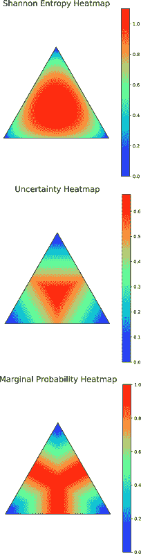
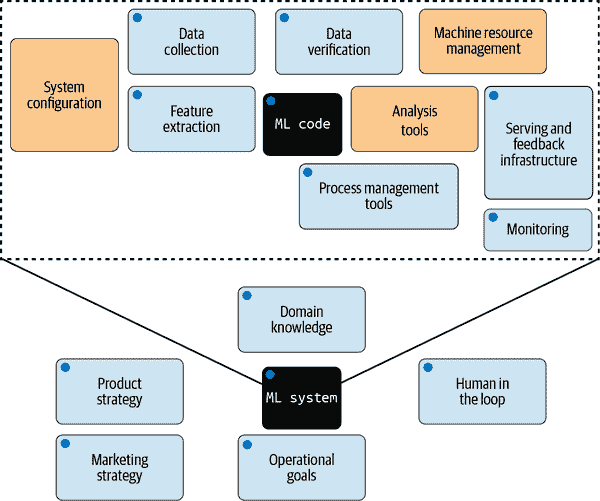
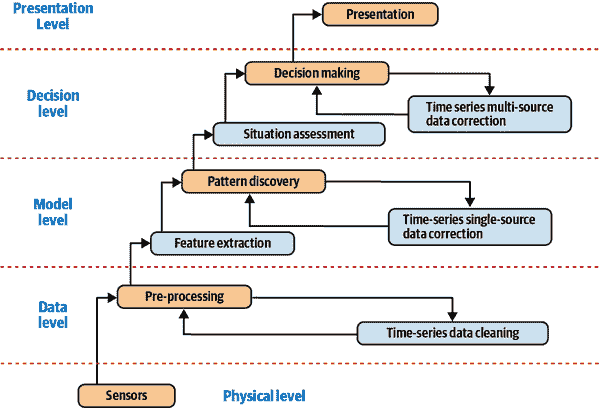

# 第七章：从理论到实践

真实世界的机器学习项目很少是直截了当的。你并不总是知道要实施什么确切的公平度量标准，或者模型推断需要多么稳健。创建可信任的机器学习系统几乎总是涉及在技术考虑和*人类决策*（如预算考虑、在信任和效用之间找到平衡，并使利益相关者朝着共同目标努力）之间进行权衡。作为一个机器学习专家和实践者，你有能力处理技术方面的问题。但是当涉及到人为决策时，你可能并不需要做所有这些决定（也许你不应该）。然而，理解涉及人类和技术决策的概念至少具有高层次的理解是非常重要的，以便有效地将可信任的机器学习开发与更广泛的组织格局对齐。

在本章中，我们将与您分享一些工具，用于在混乱的生产级系统中实际实施我们在前几章中讨论过的可信机器学习方法。我们将首先回顾一些可能需要在推送模型到生产之前解决的额外技术因素，例如因果性、稀疏性和不确定性—​在第一部分。从那里开始，我们将转向第二部分，讨论如何有效地与开发团队之外的利益相关者合作。

# 第一部分：额外的技术因素

在将一个或多个信任元素纳入您的机器学习项目时，您可能需要考虑一些额外的技术因素。这些因素与第五章中讨论的概念有所不同。具体而言，它们已经是已确立的科学概念和工具，这些概念和工具在机器学习应用中变得越来越重要—​以及可信的机器学习应用。

## 因果机器学习

假设你想要建模用户是否点击他们收到的在线广告，作为点击广告的功能，点击者是谁，他们最近的活动历史是什么，广告的主题，以及时间是什么。如何确保特定的用户段更有可能或不太可能点击广告？仅将所有输入特征投入点击预测模型并查看变量重要性并不是最好的主意。也许某些用户段在一天的某个特定时间更多地花费时间上网，因此在这些时间内点击更多的广告。如何超越这种影响——这些影响影响数据收集本身——从数据中提取真正的因果关系？因果推断就是答案。传统的机器学习依赖于观测数据。数据收集通常不涉及一些特征之间的因果关系，同时控制其他特征的效果。典型机器学习模型通过分析观测数据集推断的特征之间的连接仅仅是*关联*，而不是*因果关系*。因果推断领域的概念和工具有助于弥补这些缺陷。¹

### 因果推断的步骤

因果推断遵循四个一般步骤：

*第一步：创建因果问题模型*

这类似于科学方法中的假设生成。这一步骤可能涉及将模型定义为详细的因果图。或者，它可能只是变量名称集合，这些名称对应于像共同原因或工具变量之类的相关类别。

*第二步：确定目标估计量*

这是识别感兴趣变量的因果效应的过程。有许多工具可以用于这一步骤，包括基于机器学习的工具。

*第三步：确定因果效应的强度*

从一个变量向另一个变量绘制因果箭头并不足够。就像你可能使用相关系数来确定线性关系的强度一样，你还需要估计因果效应的强度。即使存在因果关系，它可能仍然很弱。

*第四步：使因果模型经受反驳*

通常，在机器学习中，你希望创建最适合数据的模型。在因果推断中，你希望创建一个*因果*模型，它代表了如何在数据中工作的最佳假设。即使你已经确定了因果效应并估计了它们的强度，你仍然应该测试几个可能的替代假设。表 7-1 列出了一些尝试的内容，并注明理想行为应该是什么样的。

表 7-1。潜在扰动的示例考虑因素

| 动作 | 描述 | 理想 |
| --- | --- | --- |
| 随机共同原因 | 在你向数据集添加独立随机变量作为共同原因后，估计方法是否改变了其估计值？ | 不应该改变 |
| 安慰剂治疗 | 当你用一个独立随机变量替换真实的治疗变量时，估计的因果效应会发生什么变化？ | 效应应该趋近于零 |
| 模拟结果 | 当你用基于已知数据生成过程的模拟数据集替换原始数据集时，估计的因果效应会发生什么变化？ | 它应该与数据生成过程中的效应参数匹配 |
| 未观察到的共同原因 | 当你向数据集中添加一个额外的与治疗和结果相关的共同原因（通常称为*混杂变量*）时，估计的效应有多敏感？ | 不应该太敏感 |
| 数据子集验证 | 当你用随机选取的子集替换原始数据集时，估计的效应会发生显著变化吗？ | 不应该发生 |
| 自举验证 | 当你用来自相同数据集的自举重采样替换原始数据集时，估计的效应会发生显著变化吗？ | 不应该发生 |

### 因果推断工具

*结构因果模型*（SCM）是因果推断的一个重要工具。机器学习中的因果推断方法基于将机器学习模型表示为 SCM，借助因果推理和领域知识。

*结构因果模型*被定义为 4 元组*(D, E, f, P[e])*，其中：

+   *D* 是一组内生变量，可以通过改变其他变量的值来影响它们。

+   *E* 是一组外生变量，其值不可能通过改变其他变量来操控。

+   *f = { f[1], f[2], …​, f[n]}* 是一组函数，代表涉及*D*和*E*成员的因果机制：<math alttext="d Subscript i Baseline equals f Subscript i Baseline left-parenthesis upper P a left-parenthesis d Subscript i Baseline right-parenthesis comma upper E Subscript i Baseline right-parenthesis"><mrow><msub><mi>d</mi> <mi>i</mi></msub> <mo>=</mo> <msub><mi>f</mi> <mi>i</mi></msub> <mrow><mo>(</mo> <mi>P</mi> <mi>a</mi> <mrow><mo>(</mo> <msub><mi>d</mi> <mi>i</mi></msub> <mo>)</mo></mrow> <mo>,</mo> <msub><mi>E</mi> <mi>i</mi></msub> <mo>)</mo></mrow></mrow></math> 。这里的内生变量*d[i]*被建模为其他内生变量*Pa(d[i])*和一个或多个外生变量<math alttext="upper E Subscript i Baseline subset-of-or-equal-to upper E"><mrow><msub><mi>E</mi> <mi>i</mi></msub> <mo>⊆</mo> <mi>E</mi></mrow></math> 的函数*f[i]*。

+   *P[e]* 是*E*元素的概率分布。

将 SCM 视为正式解决因果推断步骤的一种方式。对于创建因果模型的第一步，你可以将带有*f*函数数学规范的 SCM 作为你正在处理的因果问题的正式模型。识别目标估计量的第二步对应于在一组函数中估计因果机制*f[i]*。第三步——确定因果效应的强度——类似于测试*f[i]*或其参数的效应大小。最后，你可以将因果模型进行反驳的第四步视为测试 SCM 中*f*机制的替代形式。

将这些步骤与之前的例子联系起来，基于涉及的变量，一个基于 SCM 的模型如下所示：

+   *D* 包含以下特征：点击或未点击（*C*），用户细分（*S*），以及用户历史（*H*）。

+   *E* 包含以下特征：广告主题（*A*），以及一天中的时间（*T*）。

+   *f* 包括这些函数：

    <math alttext="upper C equals f 1 left-parenthesis upper S comma upper H comma upper A comma upper T right-parenthesis" display="block"><mrow><mi>C</mi> <mo>=</mo> <msub><mi>f</mi> <mn>1</mn></msub> <mrow><mo>(</mo> <mi>S</mi> <mo>,</mo> <mi>H</mi> <mo>,</mo> <mi>A</mi> <mo>,</mo> <mi>T</mi> <mo>)</mo></mrow></mrow></math><math alttext="upper S equals f 2 left-parenthesis upper H comma upper A comma upper T right-parenthesis" display="block"><mrow><mi>S</mi> <mo>=</mo> <msub><mi>f</mi> <mn>2</mn></msub> <mrow><mo>(</mo> <mi>H</mi> <mo>,</mo> <mi>A</mi> <mo>,</mo> <mi>T</mi> <mo>)</mo></mrow></mrow></math><math alttext="upper H equals f 3 left-parenthesis upper S comma upper A comma upper T right-parenthesis" display="block"><mrow><mi>H</mi> <mo>=</mo> <msub><mi>f</mi> <mn>3</mn></msub> <mrow><mo>(</mo> <mi>S</mi> <mo>,</mo> <mi>A</mi> <mo>,</mo> <mi>T</mi> <mo>)</mo></mrow></mrow></math>

+   最后，对于*P[e]*，假设广告主题的分布是根据历史数据推断出来的，而时间可以在一天中均匀分布。

一个因果模型将估计函数*f[1]*并确定因果效应的强度，同时考虑到*f[2]*和*f[3]*编码的混杂效应。最后，要知道这个因果模型在实践中是否有效，你可以通过随机选择两组用户并从每组用户中选择同一广告在同一时间内服务的用户来运行 A/B 测试。对于第一组，选取因果模型预测高点击广告的用户，而对于第二组，则随机选取用户。如果第一组生成的平均点击百分比显著高于第二组，你就知道因果模型是合理的（即比随机猜测更好）。

###### 小贴士

你能想到一个统计测试用来检验两个用户组之间点击百分比的差异是否显著吗？

因果推断涵盖了从基于机器学习到非机器学习统计推断的广泛技术范围。在这个领域出现了大量新工具和技术，远远超出了我们可以在本章节中覆盖的范围。许多大型机器学习会议都专门设有[特别的赛道和研讨会](https://oreil.ly/Jeokv)。

在考虑因果推断工具时，请寻找覆盖技术范围广泛的维护良好的工具。我们推荐的四个最佳选项是：

*[CMU 的 Causal-learn](https://oreil.ly/bTIV7)*

对于基于机器学习的技术来说，这可能是确保您在经受时间考验的统计因果推断方面的最佳选择。Causal-learn 是 Java-based [Tetrad](https://oreil.ly/avaIx)的 Python 翻译和扩展，提供了[因果搜索方法](https://oreil.ly/FdVlA)（通过因果图搜索和提名因果变量），[条件独立性测试](https://oreil.ly/OnNFS)（测试给定一组条件变量时两个变量是否独立），以及[评分函数](https://oreil.ly/vRLWc)，这些在构建贝叶斯模型中非常有用。

*[QuantumBlack 的 CausalNex](https://oreil.ly/wCTBd)*

CausalNex 比 Causal-learn 更深入地探讨了神经网络。具体来说，CausalNex 大量利用贝叶斯网络，并旨在在图模型中编码领域知识。

*[Uber 的 CausalML](https://oreil.ly/LzSf6)*

类似于 CausalNex，Uber 的 CausalML 专注于因果推断的机器学习算法。然而，它提供了更广泛的算法选择，包括基于树的算法（例如基于 KL 散度的提升树算法[Uplift trees based on KL divergence](https://oreil.ly/GMXzR)），元学习算法（包括[S-learner 和 T-learner](https://oreil.ly/bUxG0)，双重稳健学习者），工具变量算法（例如两阶段最小二乘法），以及基于 TensorFlow 的神经网络算法（包括[CEVAE](https://arxiv.org/abs/1705.08821)和[DragonNet](https://arxiv.org/abs/1906.02120)）。

*[DoWhy](https://oreil.ly/Jm9s1)*

类似于 CausalML，DoWhy（以 Judea Pearl 的[“do-calculus”](https://arxiv.org/abs/1305.5506)命名）是一个开源库（最初由微软维护），涵盖了基于统计和机器学习方法的多种因果推断算法。DoWhy 具有一些特性使其特别有用。首先，它可以与微软的其他因果机器学习库（如 EconML 和 CausalML，不要与之前讨论的 Uber CausalML 库混淆）相扩展。它还具有内置的高级 Pandas API。这非常有帮助，因为大多数因果推断方法都针对表格和时间序列数据。Pandas API 还允许您轻松创建用于测试的模拟数据集。DoWhy 在提供自动反驳工具方面也比 CausalML 强大得多。

让我们看一段小代码片段，了解 DoWhy 如何帮助将因果结构编码到机器学习工作流中。

```
import dowhy.api
import dowhy.datasets

data = dowhy.datasets.linear_dataset(
    beta=5,
    num_common_causes=1,
    num_instruments=0,
    num_samples=1000,
    treatment_is_binary=True,
)

# data['df'] is just a regular pandas.DataFrame
data["df"].causal.do(
    x="v0",  # name of treatment variable
    variable_types={"v0": "b", "y": "c", "W0": "c"},
    outcome="y",
    common_causes=["W0"],
).groupby("v0").mean().plot(y="y", kind="bar")
```

虽然这些包很有用，因果机器学习仍然遵循“[垃圾进，垃圾出](https://oreil.ly/2ItFq)”的原则。你对因果性的结论能力将取决于数据集的质量以及你如何跟随创建假设图、测试和试图反驳的过程。

### 因果性与信任

使用 SCM，可以将领域知识嵌入到因果模型中，这些模型本质上是可解释的（即全局解释，参见第三章），使用正则化并生成事后解释。对于局部解释，反事实在评估模型输出在替代*假设*场景下非常有用，例如通过提供模型输入示例并更改某些输入特征的值，然后观察输出。

*反事实* 解释与非因果特征归因方法不同。非因果方法基于仅改变被评估输入特征的值。相比之下，反事实方法观察模型输出，输入点的值改变为评估特征以及受评估特征影响的其他输入特征，基于潜在的因果模型。² 反事实的概念也可应用于公平性和鲁棒性。³ 总的来说，评估不受真实观测数据混淆效应的合成反事实样本，允许更精确地评估信任度指标。

## 稀疏性与模型压缩

在工业应用中部署大规模机器学习模型成本高昂，因为训练它们需要大量的计算能力和内存。当部署模型到移动电话等环境时，资源约束变得更加严峻。通常情况下，训练好的深度学习模型对象，甚至随机森林或[XGBoost](https://oreil.ly/sbhXW)，包含大量参数，以帮助高度细粒度的决策过程。为了在边缘机器学习中训练对象，你需要压缩模型。

默认情况下，传统神经网络（NN）和深度学习模型的训练过程是*密集*的：它设置所有节点的权重和偏差为非零值。你可以猜测，不是所有节点对模型性能贡献相同。权重接近零的节点贡献非常少，因此如果将这些权重设置为零，对性能几乎没有影响。这就是*稀疏神经网络*所做的事情：它们的一些权重硬编码为零。稀疏神经网络不仅有助于模型压缩，还通过防止过拟合大大改善了泛化能力。

### 精简

使神经网络训练结果变得稀疏的一个简单方法是仅丢弃低幅度权重。[Frankle and Carbin](https://oreil.ly/EikoA) 提倡了这种方法。他们将找到适合神经网络数据的参数集与参与彩票游戏的情况做了比较。训练密集神经网络就像购买大量彩票以增加中奖概率。但如果有办法找出哪些彩票更有可能中奖，你可以花更少的钱，同时保证高额奖金。类似地，如果你能够分离出训练后密集神经网络性能背后最重要的权重和偏差，你就能将其余的设为零，同时仍然保持良好的性能。

在密集神经网络中将一些参数设为零的系统化过程称为 *修剪（pruning）*。在修剪时，需要考虑一些权衡。例如，你可能需要在修剪量和性能指标（如准确性）、特定数据集或数据类型的最佳策略，以及硬件和软件架构等高级设计选择之间进行平衡。

获得稀疏神经网络的三个步骤包括：训练、修剪和微调。当神经网络模型的训练过程收敛时，其经验风险——即对训练数据的平均损失——是最小的。如果你通过将一些权重设为零来修剪这个 NN 的权重集合 *W*，这将会降低模型在训练数据上的性能。因此，你需要重新训练你的模型。这就是所谓的 *微调*。通常，微调是在预定义的迭代次数内进行的。

给定训练数据 *X* 和作为 <math alttext="f left-parenthesis x comma dot right-parenthesis"><mrow><mi>f</mi> <mo>(</mo> <mi>x</mi> <mo>,</mo> <mo>·</mo> <mo>)</mo></mrow></math> 定义的一组神经网络，其中函数 *f* 的参数是权重矩阵 *W*，通过修剪获取稀疏神经网络的一般过程看起来像以下算法：

输入

特征矩阵：<math alttext="upper X element-of double-struck upper R Superscript n times p"><mrow><mi>X</mi> <mo>∈</mo> <msup><mi>ℝ</mi> <mrow><mi>n</mi><mo>×</mo><mi>p</mi></mrow></msup></mrow></math>

迭代次数：*N*

步骤

1.  <math alttext="upper W left-arrow i n i t i a l i z e left-parenthesis right-parenthesis"><mrow><mi>W</mi> <mo>←</mo> <mi>i</mi> <mi>n</mi> <mi>i</mi> <mi>t</mi> <mi>i</mi> <mi>a</mi> <mi>l</mi> <mi>i</mi> <mi>z</mi> <mi>e</mi> <mo>(</mo> <mo>)</mo></mrow></math>

1.  <math alttext="upper W left-arrow t r a i n upper T o upper C o n v e r g e n c e left-parenthesis f left-parenthesis upper X semicolon upper W right-parenthesis right-parenthesis"><mrow><mi>W</mi> <mo>←</mo> <mi>t</mi> <mi>r</mi> <mi>a</mi> <mi>i</mi> <mi>n</mi> <mi>T</mi> <mi>o</mi> <mi>C</mi> <mi>o</mi> <mi>n</mi> <mi>v</mi> <mi>e</mi> <mi>r</mi> <mi>g</mi> <mi>e</mi> <mi>n</mi> <mi>c</mi> <mi>e</mi> <mo>(</mo> <mi>f</mi> <mo>(</mo> <mi>X</mi> <mo>;</mo> <mi>W</mi> <mo>)</mo> <mo>)</mo></mrow></math>

1.  <math alttext="upper M left-arrow o n e s left-parenthesis n comma p right-parenthesis"><mrow><mi>M</mi> <mo>←</mo> <mi>o</mi> <mi>n</mi> <mi>e</mi> <mi>s</mi> <mo>(</mo> <mi>n</mi> <mo>,</mo> <mi>p</mi> <mo>)</mo></mrow></math>

1.  对于 *i* 在 1 到 *N* 之间执行

1.  <math alttext="upper M left-arrow p r u n e left-parenthesis upper M comma s c o r e left-parenthesis upper W right-parenthesis right-parenthesis"><mrow><mi>M</mi> <mo>←</mo> <mi>p</mi> <mi>r</mi> <mi>u</mi> <mi>n</mi> <mi>e</mi> <mo>(</mo> <mi>M</mi> <mo>,</mo> <mi>s</mi> <mi>c</mi> <mi>o</mi> <mi>r</mi> <mi>e</mi> <mo>(</mo> <mi>W</mi> <mo>)</mo> <mo>)</mo></mrow></math>

1.  <math alttext="upper W left-arrow f i n e upper T u n e left-parenthesis f left-parenthesis upper X semicolon upper M circled-dot upper W right-parenthesis right-parenthesis"><mrow><mi>W</mi> <mo>←</mo> <mi>f</mi> <mi>i</mi> <mi>n</mi> <mi>e</mi> <mi>T</mi> <mi>u</mi> <mi>n</mi> <mi>e</mi> <mo>(</mo> <mi>f</mi> <mo>(</mo> <mi>X</mi> <mo>;</mo> <mi>M</mi> <mo>⊙</mo> <mi>W</mi> <mo>)</mo> <mo>)</mo></mrow></math>

1.  返回 *M, W*

第 5 步中的修剪对 *W* 的每个元素应用一个 *得分函数（score function）*，基于这个函数将 *M* 的一些元素设为零。可以将得分函数看作一个阈值。它可以简单到绝对值，也可以复杂到考虑到 *W* 的元素对层激活函数的贡献程度。文献中可以找到处理上述算法细节的修剪方法。这包括设计新颖的得分函数、微调方法、调度修剪迭代或结构化修剪过程，以便通过个别权重、按组或其他逻辑修剪权重。⁴

### 稀疏训练

基于修剪的方法在某种程度上是临时性的。有许多技术可用于评分、微调和修剪。这些技术的组合将取决于您的任务和数据集，哪种算法对哪类任务的效果最佳。与后处理已训练的神经网络相比，稀疏*训练*方法在理论上为哪种算法适用于哪类任务提供了更广泛的性能保证。罗伯特·提布什拉尼最早提出了用于稀疏训练的方法，称为*最小绝对值收缩和选择算子*（LASSO）⁵，设计用于线性回归。自那时起，稀疏惩罚模型的理论已经相当成熟。

稀疏训练涉及优化一个惩罚风险函数。在本节的符号表示中，由稀疏训练过程产生的权重集可以写成如下形式：

<math><mrow><mover accent="true"><mi>W</mi> <mo>^</mo></mover> <mo>=</mo> <msub><mtext>argmax</mtext> <mrow><mi>W</mi><mo>∈</mo><mi>𝒲</mi></mrow></msub> <mfenced close="}" open="{" separators=""><mi>L</mi> <mo>(</mo> <mi>Y</mi> <mo>,</mo> <mi>f</mi> <mo>(</mo> <mi>X</mi> <mo>;</mo> <mi>W</mi> <mo>)</mo> <mo>)</mo> <mo>+</mo> <mi>λ</mi> <mi>P</mi> <mo>(</mo> <mi>W</mi> <mo>)</mo></mfenced></mrow></math>

Here *Y* 是输出特征的集合，<math alttext="script upper W"><mi>𝒲</mi></math> 是所有可能的 *W* 矩阵的集合，优化运行在这些矩阵上，<math alttext="upper L left-parenthesis dot comma dot right-parenthesis"><mrow><mi>L</mi> <mo>(</mo> <mo>·</mo> <mo>,</mo> <mo>·</mo> <mo>)</mo></mrow></math> 是损失函数，而 <math alttext="upper P left-parenthesis dot right-parenthesis"><mrow><mi>P</mi> <mo>(</mo> <mo>·</mo> <mo>)</mo></mrow></math> 是一个*惩罚函数*。将惩罚函数定义为 *L[1]* 范数，即 <math alttext="upper P left-parenthesis upper W right-parenthesis equals parallel-to upper W parallel-to"><mrow><mi>P</mi> <mrow><mo>(</mo> <mi>W</mi> <mo>)</mo></mrow> <mo>=</mo> <msub><mrow><mo>∥</mo><mi>W</mi><mo>∥</mo></mrow> <mn>1</mn></msub></mrow></math> ，对于解 <math alttext="ModifyingAbove upper W With caret"><mover accent="true"><mi>W</mi> <mo>^</mo></mover></math> 的权重值施加稀疏性。调节参数 <math alttext="lamda"><mi>λ</mi></math> 控制了 <math alttext="ModifyingAbove upper W With caret"><mover accent="true"><mi>W</mi> <mo>^</mo></mover></math> 值超过该上限时被设为 0 的上界。选择最优 <math alttext="lamda"><mi>λ</mi></math> 的方法有很多，比如交叉验证和[信息准则](https://oreil.ly/X2uCX)⁶。

尽管有希望，但将稀疏训练方法应用于比逻辑回归更复杂的模型时，计算密集度非常高。此外，现代深度学习软件和硬件都针对*密集*矩阵计算进行了优化，因此修剪（pruning）要容易得多。最近的几篇论文开始提出现实和可扩展的稀疏神经网络训练过程。⁷

###### 注意

本节讨论主要适用于基于神经网络的模型。其他技术，如基于支持向量机（SVM）或决策树的技术，也可以采用它们自己的稀疏诱导训练方法。

### 稀疏模型中的信任元素

稀疏模型的一个优势是它们更容易解释。稀疏神经网络比密集神经网络少得多的潜变量需要跟踪。在解释修剪模型（约 90%或更多的稀疏度）中的许多内部时，您可以简单地忽略一些权重，因为它们会导致死胡同。这可以大大减少您需要处理的信息量，以解释稀疏神经网络模型的预测。然而，对于像图像分割或自然语言处理的非常大的模型来说，使用更少的权重可能不足以减轻负担。

尽管稀疏模型似乎提高了泛化能力，但它们也倾向于*忘记*某些信息。例如，Hooker 等人表明，尽管神经网络可以被修剪到高稀疏度而对*顶线指标*（如 1%或 5%的准确率）几乎没有影响，但这是以在少数样本中性能下降为代价的，他们称之为*压缩识别示例*（CIE）。⁸ 在后续的一篇论文中，⁹ 同一团队表明，CIE 实际上更可能包含比非 CIE 更少代表的属性值，因此它们可能加剧原始模型中的公平性问题。总的来说，CIE 更可能对训练过程产生较高的影响。修剪模型还对噪声和损坏非常敏感。因此，修剪可能具有鲁棒性和隐私方面的影响。

## 不确定性量化

在前一节中，你看到对于存储大型训练过的神经网络权重是一个问题的用例，保留（大部分）预测性能的简洁的网络内部表示是可取的。在其他情况下，你可能还想知道模型决策的确定程度。一个常见的例子是，当你比较两个模型的性能并想知道它们的性能是否有显著差异时。根据决策过程中你关注的位置，有多种方式来量化不确定性。模型不确定性度量也可以作为故障安全机制的一部分，如果某个不确定性度量低于临界阈值，则触发人在环路的事件响应，向 ML 开发团队发送警报。在 “稀疏性和模型压缩” 中，你减少了可以对模型做出贡献的潜在变量的数量。在某种意义上，你减少了 *功能性不确定性*，或者说是涉及到输出的函数中的不确定性。超越功能性不确定性，[*随机性* 和 *认知* 不确定性](https://oreil.ly/CQYqj) 是在这一领域经常出现的两个概念。它们分别指的是围绕输入和输出的不确定性，尽管它们很容易混淆。

### 随机性不确定性

即使模型输入的真实输出标签在接受的输出分布之内，输入本身可能仍然落在训练数据输入分布之外。换句话说，即使一个输入是合法的并且应该产生一个可接受的输出，训练算法可能无法正确计算它。这种不确定性，指的是输入数据（在适当的问题空间内）未能与其他具有相同地面真实的数据匹配，也被称为 *随机性不确定性*。例如，假设你有一个 MNIST 分类器，训练它可以区分数字 0 到 9。你可以输入一个属于这些类之一但形状介于两个非常相似类别之间的图像（例如 1 和 7 或 6 和 0）。这就是随机性不确定性的一个例子。

高随机性不确定性案例比高认知不确定性案例的替代问题表述更难解决（见下一节）。这也是为什么尽管花费了大量时间和资源来解决它，但随机性不确定性在医学诊断中仍然是一个大问题的一部分。¹⁰

### 认知不确定性

*认知不确定性* 指的是地面真实输出决策落在先前已知输出分布之外的情况。例如，想象一下，你不是输入一个手写数字的图像，而是输入一些完全不同于先前提到的 MNIST 分类器的东西。你可能输入一封手写的字母，或者一封排版的字母，或者甚至不是字母或数字而是一幅狗的图片。

对于大多数硬编码输出的分类器来说，通常没有“不属于任何已识别类别”的选项。这是除非你专门创建一个具有指定[*垃圾类*](https://oreil.ly/h6uqr)的一对所有分类器。即使如此，很难考虑到输入可能在训练分布之外的所有可能方式（理论上是无限的）。一些 ML 模型架构考虑到了这一点。例如，一般的图像分割模型具有一个*背景类*，代表所有不在感兴趣对象边界内的内容。

对于普遍量化认知不确定性，有许多公式化的方法，具体取决于输出结构的定义方式。让我们在一个独热编码或二元分类器的上下文中探讨这三种方法。

有三种常见方法可以计算 ML 决策制定的认知不确定性。从分类器模型中测量不确定性的最直接方法是*分类不确定性*：<math alttext="upper U left-parenthesis x right-parenthesis equals 1 minus upper P left-parenthesis ModifyingAbove x With caret vertical-bar x right-parenthesis"><mrow><mi>U</mi> <mrow><mo>(</mo> <mi>x</mi> <mo>)</mo></mrow> <mo>=</mo> <mn>1</mn> <mo>-</mo> <mi>P</mi> <mrow><mo>(</mo> <mover accent="true"><mi>x</mi> <mo>^</mo></mover> <mo>|</mo> <mi>x</mi> <mo>)</mo></mrow></mrow></math>，其中*x*是要预测的实例，<math alttext="upper P left-parenthesis ModifyingAbove x With caret vertical-bar x right-parenthesis"><mrow><mi>P</mi> <mo>(</mo> <mover accent="true"><mi>x</mi> <mo>^</mo></mover> <mo>|</mo> <mi>x</mi> <mo>)</mo></mrow></math>是最有可能的预测。例如，如果你有类别 `[0,1,2]` 和分类概率 `[0.1,0.2,0.7]`，则根据分类器，最可能的类别是 2，不确定性为 0.3。假设你有三个带有类别概率的实例。

```
proba = np.array([[0.1 , 0.85, 0.05],
                  [0.6 , 0.3 , 0.1 ],
                  [0.39, 0.61, 0.0 ]])
```

相应的不确定性为 `1 - proba.max(axis=1)`，或者 `array([0.15, 0.4, 0.39])`（简言之，第二类最不确定）。这对于特定类别的不确定性很有用，即如果你不确定某个类别的预测是否准确。但你也希望考虑到分类之间的差异，即一个类别预测包含多少不确定性——它是否正确或不正确。

*分类间隔* 是指第一最可能预测与第二最可能预测之间的概率差异。数学上定义为 <math alttext="upper M left-parenthesis x right-parenthesis equals upper P left-parenthesis ModifyingAbove x 1 With caret vertical-bar x right-parenthesis minus upper P left-parenthesis ModifyingAbove x 2 With caret vertical-bar x right-parenthesis"><mrow><mi>M</mi> <mrow><mo>(</mo> <mi>x</mi> <mo>)</mo></mrow> <mo>=</mo> <mi>P</mi> <mrow><mo>(</mo> <mover accent="true"><msub><mi>x</mi> <mn>1</mn></msub> <mo>^</mo></mover> <mo>|</mo> <mi>x</mi> <mo>)</mo></mrow> <mo>-</mo> <mi>P</mi> <mrow><mo>(</mo> <mover accent="true"><msub><mi>x</mi> <mn>2</mn></msub> <mo>^</mo></mover> <mo>|</mo> <mi>x</mi> <mo>)</mo></mrow></mrow></math> 。这里，<math alttext="ModifyingAbove x 1 With caret"><mover accent="true"><msub><mi>x</mi> <mn>1</mn></msub> <mo>^</mo></mover></math> 是最可能的类别，而<math alttext="ModifyingAbove x 2 With caret"><mover accent="true"><msub><mi>x</mi> <mn>2</mn></msub> <mo>^</mo></mover></math> 是第二可能的类别。使用与分类不确定性相同的示例，对于矩阵`proba`中给定的类概率，相应的间隔为

```
part = np.partition(-proba, 1, axis=1)
margin = - part[:, 0] + part[:, 1]
# array([0.75, 0.3 , 0.22])
```

当您查询标签时，这种策略选择具有最小间隔的样本，因为决策间隔越小，决策越不确定。在这种情况下，具有最小间隔的样本将是第三个样本。

*分类熵* 提供了一种更基于信息论的不确定性方法。在信息论中，我们有一个随机变量的熵，或者说是变量可能结果的“信息”、“惊讶”或“不确定性”的平均水平。如果我们有像掷骰子这样的随机变量，我们期望可能结果的概率是相等的。然而，由于一个好的分类器会偏向某个输出而不是其他输出，输出的 logits 比随机变量更可预测（因此更少“惊讶”或“不确定”）。数学上，它简单地是[Shannon 熵](https://oreil.ly/0niIu)在样本的预测类概率分布上定义：<math alttext="upper H left-parenthesis x right-parenthesis equals minus sigma-summation Underscript k Endscripts p Subscript k Baseline log left-parenthesis p Subscript k Baseline right-parenthesis"><mrow><mi>H</mi> <mrow><mo>(</mo> <mi>x</mi> <mo>)</mo></mrow> <mo>=</mo> <mo>-</mo> <msub><mo>∑</mo> <mi>k</mi></msub> <msub><mi>p</mi> <mi>k</mi></msub> <mo form="prefix">log</mo> <mrow><mo>(</mo> <msub><mi>p</mi> <mi>k</mi></msub> <mo>)</mo></mrow></mrow></math> ，其中*p[k]* 是样本属于第*k*类的概率。

就直觉而言，熵与你找到真实类别所需的平均猜测次数成正比。让我们回到之前的例子。在这里，相应的熵是

```
from scipy.stats import entropy
entropy(proba.T)
# array([0.51818621, 0.89794572, 0.66874809])
```

如果你对许多随机样本重复此过程，你会得到一个*分布*，显示不确定性值。图 7-1 展示了三种不确定性的分布。分布越接近均匀，特定类型的不确定性越大。三角形的角落越接近，说明特定标签的预测概率越高。



###### 图 7-1\. 不确定性分布的表现形式

要了解如何在一个三类分类问题中实现分类不确定性、边际不确定性和分类熵的代码演示，请参见[这个笔记本](https://oreil.ly/oydWO)。

###### 提示

让我们稍微回顾一下“深入了解：计算机视觉中的对抗性攻击”。在这里学到的不确定性度量中，你认为哪一个适合用来量化不同图像预测概率中的模糊性？

### 置信区间

正如在前一节中所看到的，通过简单的无量纲数字可以量化误差不确定性和认知不确定性。然而，当向利益相关者呈现不确定性时，通常会选择更直观的视觉表示。对于基于回归的模型，你可以以[置信区间（CI）](https://oreil.ly/WZfBO)的形式呈现输出。大多数数据科学家和机器学习从业者应该熟悉放置指示上下限估计的柱状图。通常，你可以通过计算均值响应的[标准误差](https://oreil.ly/oSt6U)，然后用它来构建这个均值响应的 CI。

### Bootstrap 重抽样

你可以通过自助重抽样（bootstrap resampling）来估计标准误差并生成置信区间。广义来说，bootstrapping 使用数据与*重抽样*数据分布之间的差异来近似真实数据与样本数据分布的差异。它生成手头数据集（或从中估计的参数）的变体，希望这些变体能让我们对数据生成过程及其参数的不确定性有直观的了解。要在 scikit-learn 中实现 bootstrap 的代码演示，请参见[这个笔记本](https://oreil.ly/n0wi7)。

Bootstrap 重抽样有三个主要变体。让我们在监督模型设置中看看它们，观察观察到的数据集*D*由输入特征矩阵*X*和输出特征向量*y*组成：

非参数 bootstrap

你直接从观察到的数据集*D*中进行样本采样，可能要重复成千上万次，以构建你的变体数据集。采样通常是*有放回*的，即可以多次选取同一个数据点。

参数 bootstrap

您从参数模型开始拟合数据：<math alttext="y equals f left-parenthesis upper X semicolon theta right-parenthesis plus epsilon"><mrow><mi>y</mi> <mo>=</mo> <mi>f</mi> <mo>(</mo> <mi>X</mi> <mo>;</mo> <mi>θ</mi> <mo>)</mo> <mo>+</mo> <mi>ϵ</mi></mrow></math> ，其中 <math alttext="epsilon"><mi>ϵ</mi></math> 是一个随机误差向量。然后，您使用参数估计 <math alttext="ModifyingAbove theta With caret"><mover accent="true"><mi>θ</mi> <mo>^</mo></mover></math>（这些是数据*D*的函数）作为真实参数 <math alttext="theta Superscript asterisk"><msup><mi>θ</mi> <mo>*</mo></msup></math> 的代理，从参数模型 <math alttext="y Subscript r Baseline equals f left-parenthesis upper X semicolon ModifyingAbove theta With caret right-parenthesis plus upper P left-parenthesis ModifyingAbove epsilon With caret right-parenthesis"><mrow><msub><mi>y</mi> <mi>r</mi></msub> <mo>=</mo> <mi>f</mi> <mrow><mo>(</mo> <mi>X</mi> <mo>;</mo> <mover accent="true"><mi>θ</mi> <mo>^</mo></mover> <mo>)</mo></mrow> <mo>+</mo> <mi>P</mi> <mrow><mo>(</mo> <mover accent="true"><mi>ϵ</mi> <mo>^</mo></mover> <mo>)</mo></mrow></mrow></math> 生成大量数据集，其中 <math alttext="ModifyingAbove epsilon With caret equals y minus f left-parenthesis upper X semicolon ModifyingAbove theta With caret right-parenthesis"><mrow><mover accent="true"><mi>ϵ</mi> <mo>^</mo></mover> <mo>=</mo> <mi>y</mi> <mo>-</mo> <mi>f</mi> <mrow><mo>(</mo> <mi>X</mi> <mo>;</mo> <mover accent="true"><mi>θ</mi> <mo>^</mo></mover> <mo>)</mo></mrow></mrow></math> 是拟合残差向量，*P*表示置换。然后，您为每个新数据集估计 <math alttext="ModifyingAbove theta With caret"><mover accent="true"><mi>θ</mi> <mo>^</mo></mover></math>。

野生自举

如果数据中的随机变异量并非始终保持恒定，那么这是参数自举的一般版本，其中您仍然使用 <math alttext="ModifyingAbove theta With caret"><mover accent="true"><mi>θ</mi> <mo>^</mo></mover></math> 生成新数据集，但不是置换残差，而是*扰动*它们：<math alttext="y Subscript r Baseline equals left-parenthesis f left-parenthesis upper X semicolon ModifyingAbove theta With caret right-parenthesis plus ModifyingAbove epsilon With caret v"><mrow><msub><mi>y</mi> <mi>r</mi></msub> <mrow><mo>=</mo> <mo>(</mo> <mi>f</mi></mrow> <mrow><mo>(</mo> <mi>X</mi> <mo>;</mo> <mover accent="true"><mi>θ</mi> <mo>^</mo></mover> <mo>)</mo></mrow> <mo>+</mo> <mover accent="true"><mi>ϵ</mi> <mo>^</mo></mover> <mi>v</mi></mrow></math> ，其中*v*是一个均值为 0、方差为 1 的随机变量的独立抽样向量。

让我们来看一个使用自助法置信区间在回归模型中的例子。为简单起见，我们将采用非参数方法（即直接从数据集中抽样）。让我们从给定大小的数据中抽样一千个子集，对每个样本拟合线性回归模型，然后记录每个回归模型的截距和系数。从这些数据中，您可以通过获取截距和系数的 97.5%和 2.5%分位数来获得 95%的置信区间。使用基于分位数的区间还意味着不对底层数据分布做出假设。现在，您可以估计这些模型预测的不确定性。根据[线性回归的标准假设](https://oreil.ly/mx0yT)，您可以使用预测残差来近似给定输入特征值的结果值的方差。从这个方差中，您可以计算标准误差，这是衡量您对*y*估计精度的一种指标。

<math><mrow><msup><mi>σ</mi> <mn>2</mn></msup> <mo>=</mo> <mfrac><mrow><msubsup><mo>∑</mo> <mi>i</mi> <mi>N</mi></msubsup> <msup><mrow><mo>(</mo><msub><mi>y</mi> <mi>d</mi></msub> <mo>-</mo><msub><mover accent="true"><mi>y</mi> <mo>^</mo></mover> <mi>d</mi></msub> <mo>)</mo></mrow> <mn>2</mn></msup></mrow> <mrow><mi>N</mi><mo>-</mo><mn>2</mn></mrow></mfrac> <mo>,</mo></mrow></math><math><mrow><mtext>Var</mtext> <mrow><mo>(</mo> <mover accent="true"><mi>α</mi> <mo>^</mo></mover> <mo>+</mo> <mover accent="true"><mi>β</mi> <mo>^</mo></mover> <msub><mi>x</mi> <mi>d</mi></msub> <mo>)</mo></mrow> <mo>=</mo> <mtext>Var</mtext> <mrow><mo>(</mo> <mover accent="true"><mi>α</mi> <mo>^</mo></mover> <mo>)</mo></mrow> <mo>+</mo> <mtext>Var</mtext> <mrow><mo>(</mo> <mover accent="true"><mi>β</mi> <mo>^</mo></mover> <mo>)</mo></mrow> <msubsup><mi>x</mi> <mi>d</mi> <mn>2</mn></msubsup> <mo>+</mo> <mn>2</mn> <msub><mi>x</mi> <mi>d</mi></msub> <mtext>Cov</mtext> <mrow><mo>(</mo> <mover accent="true"><mi>α</mi> <mo>^</mo></mover> <mo>,</mo> <mover accent="true"><mi>β</mi> <mo>^</mo></mover> <mo>)</mo></mrow> <mo>,</mo></mrow></math><math><mrow><mtext>Var</mtext> <mrow><mo>(</mo> <mover accent="true"><mi>α</mi> <mo>^</mo></mover> <mo>+</mo> <mover accent="true"><mi>β</mi> <mo>^</mo></mover> <msub><mi>x</mi> <mi>d</mi></msub> <mo>)</mo></mrow> <mo>=</mo> <msup><mi>σ</mi> <mn>2</mn></msup> <mfenced close=")" open="(" separators=""><mfrac><mn>1</mn> <mi>m</mi></mfrac> <mo>+</mo> <mfrac><msup><mrow><mo>(</mo><msub><mi>x</mi> <mi>d</mi></msub> <mo>-</mo><mover accent="true"><mi>x</mi> <mo>¯</mo></mover><mo>)</mo></mrow> <mn>2</mn></msup> <mrow><mo>∑</mo><msup><mrow><mo>(</mo><msub><mi>x</mi> <mi>i</mi></msub> <mo>-</mo><mover accent="true"><mi>x</mi> <mo>¯</mo></mover><mo>)</mo></mrow> <mn>2</mn></msup></mrow></mfrac></mfenced> <mo>,</mo></mrow></math><math><mrow><msub><mi>s</mi> <msub><mi>μ</mi> <mrow><mi>y</mi><mo>|</mo><mi>x</mi></mrow></msub></msub> <mo>=</mo> <msqrt><mrow><mtext>Var</mtext> <mo>(</mo> <mover accent="true"><mi>α</mi> <mo>^</mo></mover> <mo>+</mo> <mover accent="true"><mi>β</mi> <mo>^</mo></mover> <msub><mi>x</mi> <mi>d</mi></msub> <mo>)</mo></mrow></msqrt> <mo>,</mo></mrow></math><math><mrow><mi>C</mi> <mi>I</mi> <mo>=</mo> <mo>[</mo> <msub><mi>μ</mi> <mrow><mi>y</mi><mo>|</mo><mi>x</mi></mrow></msub> <mo>-</mo> <msub><mi>t</mi> <mrow><mn>1</mn><mo>-</mo><mi>α</mi><mo>/</mo><mn>2</mn><mo>,</mo><mi>n</mi><mo>-</mo><mn>2</mn></mrow></msub> <msub><mi>s</mi> <msub><mi>μ</mi> <mrow><mi>y</mi><mo>|</mo><mi>x</mi></mrow></msub></msub> <mo>,</mo> <msub><mi>μ</mi> <mrow><mi>y</mi><mo>|</mo><mi>x</mi></mrow></msub> <mo>+</mo> <msub><mi>t</mi> <mrow><mn>1</mn><mo>-</mo><mi>α</mi><mo>/</mo><mn>2</mn><mo>,</mo><mi>n</mi><mo>-</mo><mn>2</mn></mrow></msub> <msub><mi>s</mi> <msub><mi>μ</mi> <mrow><mi>y</mi><mo>|</mo><mi>x</mi></mrow></msub></msub> <mo>]</mo> <mo>.</mo></mrow></math>

生成的 CI 很好，但这只涵盖了*Y*的*平均*响应的漂移。如果您想要为给定*X*值的所有可能*Y*值计算区间，您需要计算*预测区间*。预测区间的推导与 CI 的类似，只是在计算标准误差时包括了我们的因变量*Y*的方差，导致区间更宽。

### 您确定我能相信您吗？

计算诸如信任度度量的 CI 等不确定性估计是将不确定性量化纳入可信 ML 管道的一种明显方式。这是有用的额外信息。例如，假设用于招聘用例的 ML 模型的二元结果的不平等影响为 1.1。尽管表面上看来，模型似乎没有偏差，但 95%的 CI 的不同宽度可能导致不同的结论。CI 为[1.08, 1.12]将通过 1.1 的点估计重新确认无偏的结论。另一方面，更宽的 CI，比如[0.9, 1.3]，可能会减弱对结论的信任。根据与您合作的领域专家的反馈，这可能促使您重新审视数据收集过程，以确定 1.1 值是否仅仅是特定数据集分析的结果。

# 第二部分：实施挑战

现在您已了解超越信任方面的技术因素可能对建立可信 ML 管道的努力有所帮助，现在是转变思路的时候了。让我们讨论设计可信 ML 系统所需的系统考虑因素。在严格的方法论研究设置之外，ML 工作并非在真空中进行。这在典型的现代科技公司设置中更是如此。作为明确定义的产品倡议的一部分，ML 开发团队*需要*与团队外的人员进行互动。根据这些利益相关者对 ML 和可信 ML 概念的熟悉程度，您可能会面对一个或多个挑战，您需要解决这些挑战以在有效整合信任方面的产品开发旅程中取得进展。

## 激励利益相关者开发可信 ML 系统

在应用可信 ML 原则于商业环境中的旅程中，随着您的进展，很可能会面对来自团队以外的利益相关者的问题和评论，内容大致如下：

+   首先，我们为什么需要可信的方法？

+   您的模型已经优化以获得最佳性能。将这些额外条件放在模型上是否会降低其准确性、曲线下面积（AUC）或其他性能指标？

+   如果您希望得到一个公平的 ML 模型，就不要使用涉及敏感特征的数据！

+   我不知道您是否有预算来完成所有这些额外工作。

添加一个或多个信任元素到应用的机器学习工作流程有两种推理线索：(a) 债务管理和 (b) 风险管理。当这两件事做得恰当时，可信任的机器学习开发带来的好处远远超过“额外”工作的感知成本。

### 债务管理

1992 年，沃德·坎宁安提出了术语*技术债务*，用于表示由于永久快速开发周期而给软件系统带来的隐藏长期成本¹¹。作为[敏捷开发](https://oreil.ly/j2VFi)的创始人，坎宁安对良好的软件开发有一些了解。他意识到，永远地构建和添加新功能并不便宜。如果不适当地引导，快节奏的开发文化会造成冗余和依赖，使基础产品在其能力不断增强的同时难以排除故障和维护。像重构代码以最小化依赖、清理重复代码和撰写适当文档等债务管理工作确实需要一些开发者周期。然而，这些工作保护产品免受运行脆弱、拼凑在一起的系统可能导致的更高长期成本的影响。

除了技术债务，机器学习系统可能还需要处理一些独特且更系统化的维护问题。机器学习特定技术债务的例子包括依赖于文档质量差和/或质量可疑的外部数据、对黑盒机器学习模型的数据依赖以及由于模型训练和推理期间的随机性而导致的可重现性问题（尤其是当一个模型的输出是另一个模型的输入时）。真实的机器学习系统仅有相对较少的代码专门用于模型训练和推理。这些代码组件需要一个复杂的基础设施来正确执行其工作，从而产生额外的信任债务。在这个系统中添加信任元素意味着创建更多超出机器学习基础设施范围的依赖和互动（参见图 7-2）。

真实的机器学习系统由许多超出数据和代码之外的组件组成。机器学习系统本身是公司范围内各种倡议的一部分。信任考虑（圆圈）适用于业务的许多组件，无论是在机器学习系统内部还是外部。因此，为了使机器学习系统可信任，这些额外的债务需要机器学习团队以及整体产品团队的关注。



###### 图 7-2\. 机器学习系统的技术和非技术组件，其中有潜在信任考虑的组件标记为圆圈

### 风险管理

在金融领域，模型风险管理（MRM）框架已经因其作为最佳实践规范，以确保数据分析项目达到监管目标并与核心机构价值观保持一致的能力而受到欢迎。将值得信赖的机器学习实践视为 MRM 的增强形式是很有帮助的。有助于思考组织信任的机器学习能力的三个阶段的演变：

*设定标准*

第一个阶段包括为将信任元素纳入机器学习工作流程和产品设计中制定正式流程和最佳实践。

*实施*

第二阶段包括将指南实施到实际项目中，以及培训从业人员。

*效率*

最后，确保效率包括通过收集反馈以改进未来的实施、优化资源管理和验证领域方法，从而实际提取可信机器学习实践的价值。

这个三阶段过程有助于抵消信任债务，并防止面临重大运营风险。这些风险包括不符合当前或未来 ML 应用程序的法规要求，以及如果出现问题可能引起的负面公关。

虽然在阶段 1 和 2 启动*信任*风险管理过程会有成本，但专注于第 3 阶段非常重要，这主要是为了抵消这些成本，甚至随着时间的推移实现盈利。研究表明*信任-效用权衡*通常是一个不切实际的问题。例如，[Rodolfa 等人](https://oreil.ly/Ii11e)表明，在资源受限的实际情况下，确实可以使用机器学习公平和公正地分配利益，几乎不会影响模型性能下降。

## 信任债务

现在让我们深入探讨技术和非技术（伦理）信任债务的几个方面。¹² 这两种类型的债务根据系统组件在图 7-2 中进行分类。

### 技术信任债务

技术信任债务的组成部分大致映射到典型机器学习项目的生命周期阶段。总体思路是制定并坚持符合我们公司和机器学习组织约束条件的技术最佳实践：

数据收集

特定数据集通常被分组到具有集中领域专业知识的群体中。很难获得关于特定敏感数据集访问政策的适当指导。出于这些后勤原因，一个机器学习团队可能不愿意整合能够帮助他们构建受信任应用程序的数据源。即使他们设法整合了这些数据源，数据源的所有者有时会在没有适当跟踪更改的情况下更新它们。这可能导致一天工作正常的模型在第二天就神秘地失效。

类似数据版本控制（[DVC](https://dvc.org)）这样的工具可以帮助您跟踪团队使用的数据集版本，并为特定实验固定版本。您可以将 DVC 视为数据集的 Git。将 DVC 添加到项目中非常简单。

```
dvc init

```

只需确保向 Git 添加几个内部文件。

```
git status
Changes to be committed:
        new file:   .dvc/.gitignore
        new file:   .dvc/config
        ...
git commit -m "Initialize DVC"

```

使用 DVC 进行版本控制很简单。

```
 dvc add data/data.xml

```

如果您已经初始化了项目，可以使用 DVC 直接下载数据集。

```
 dvc get https://github.com/iterative/dataset-registry \
          get-started/data.xml -o data/data.xml

```

此外，`dvc get`可以下载 DVC 仓库中跟踪的任何文件或目录。它类似于`wget`，但用于 DVC 或 Git 仓库。在这种情况下，我们从数据集注册仓库（数据源）下载*data.xml*文件的最新版本。

数据验证

即使所需数据已经可用且易于访问，数据收集过程中的缺陷可能会阻碍可信的机器学习部署。例如，在应用算法公平性中，获取优质第三方人口统计数据一直是一个持续存在的问题。¹³

监控关键数据依赖项的健康状态是一个持续进行的过程。即使源数据在模型的第一次迭代中提供了高质量的数据，您也需要确保将来的迭代中仍然保持这种质量水平。

特征提取

实施机器学习公平方法的一个主要障碍是，关于敏感特征的信息可能通过相关的非敏感代理特征渗入数据中。这就是为什么创建公平算法并不像简单地在数据集中不包含敏感特征那样简单。

对于信任的其他方面，当您在标准数据科学工作流程中设计特征时，需要广泛运用领域知识。没有合理推理的提取-转换-加载（ETL）管道，机器学习系统难以解释和排错，因此难以建立信任。即使特征*不*敏感，未见过的相关特征也可能使机器学习训练更加脆弱和更加昂贵。诸如协方差分析（[ANCOVA](https://oreil.ly/Zm4Sg)）之类的工具通常用于识别相关特征。然而，在许多场景中，ANCOVA 被使用时，其某些假设显然不适用。¹⁴这是我们在“因果机器学习”中提到的因果推断技术的实际应用。

过程管理

组织内的 ML 项目很少是线性和孤立的。相反，它们往往集中在少数应用领域，利用类似的 ETL 组件，并通过重用和输出链接相互交互。鉴于这种相互连接性，一个项目中产生的信任债务可能会向受当前项目影响的其他项目级联传递，或者同一债务源可能会影响多个项目。如果在管道的任何步骤中重新训练模型，则重要的是也重新训练受输出变化影响的任何下游模型。它们应按照信息通过管道的顺序进行重新训练。

反馈

反馈循环可能直接或间接导致技术信任债务。*直接反馈循环*发生在模型所采集数据的人群中，这些数据用于为模型的先前迭代提供推断服务(图 7-3)。而*间接*或*隐藏*的反馈循环则是指两个或更多模型通过中间的现实世界步骤相互影响。在这两种情况下，信任债务可以通过放大一个或多个信任方面的问题而级联扩展。



###### 图 7-3\. ML 管道中可能存在的直接反馈循环示例

监控

技术信任债务可以在组织的 ML 旅程的任何部分或所有部分中产生。随着您部署、更新和迭代越来越多的 ML 模型，可能会出现新的需求，而旧的需求则可能消失。因此，不仅需要建立一个进行代码和基础设施尽职调查的流程，还需要定期重新评估该流程的有效性。

### 道德债务

非技术信任债务，通常称为*道德债务*，是在机器学习工作流程和/或指导机器学习工作流程的业务决策与伦理原则不一致时产生的。道德债务比技术信任债务更为危险，因为其后果可能远远超出组织范围，影响到真实人员，有时甚至涉及生死。正如网络安全工程师凯瑟琳·佩特罗齐诺指出，“与技术债务不同，道德债务加剧的原因在于，某些人工智能解决方案的伦理问题只能在部署后才能检测到。”¹⁵ 比如，[Elaine Herzberg 的死亡](https://oreil.ly/D5cLv)与 Uber 自动驾驶测试车有关，以及基于 ML 的招聘算法继续展现出人口统计偏见，即使设计用于解决相同问题也是如此。¹⁶

研究 ML 中的道德债务相对较新。让我们将当前对这一主题的处理总结为几个类别:¹⁷

假设

即使是出于良好意图的、值得信赖的机器学习实现有时也会由于错误的或上下文无关的假设而未能达到其目标。例如，不同影响（DI）阈值为 0.8 和 1.2 是基于[平等就业机会委员会的 80-20 规则](https://oreil.ly/IG3QC)。该规则最初是在打击招聘歧视的背景下提出的，但如今在算法公平性文献中 DI 指标的所有应用中都被视为理所当然。

后事实确定

在最近的过去，由于受害者讲述他们的经历，ML 应用造成的一些伦理伤害已经显露出来。将信任元素添加到基于 ML 的解决方案中确实会减少这些事件的发生。然而，仅仅对已知缺陷进行反应性补救而不积极扩展或描述应用程序尚待修复的缺陷，只会为未来的不幸留下空间。

人类限制

组织决策是一个集体和迭代的过程。ML 项目的实施细节也不例外。人类团队的集体判断往往受到感知差距、文化多样性不足以及资源和教育的短缺的限制。

自动化偏见

自动决策系统中的人类往往容易出现*自动化偏见*，或者对机器生成的输出过度依赖。这在 ML 解释性方面特别是个问题，主要目标是确保 ML 决策的解释对最终用户“讲得通”。一些 2020 年和 2021 年发表的研究发现，人们确实倾向于过度信任事后解释方法的输出，而且可能通过不良解释误导用户。¹⁸^,¹⁹

清偿信任负债

在 ML 中正式衡量技术债务具有挑战性。对于伦理债务，更复杂的是，那些犯下不良实践的人并不总是在偿还债务。最终用户是受不可信赖算法负面影响最多的人群，这些影响往往最常影响到处于劣势的用户群体。

在一定程度上，一般的工程最佳实践可以帮助控制技术信任负债。这包括撰写适当的文档、分享知识、最小化依赖关系，并实施测试来衡量和调整为基于 ML 的解决方案添加新功能的影响。特别是，有助于创建专注于记录信任特定考虑因素并从类似过去项目的文档信息中学习的文档。让我们在这里简要讨论两种方法，但详细处理推迟到第八章。

模型卡片

*模型卡*是结构化文档，提供 ML 模型开发和性能的背景和透明度。²⁰ 目前有多种模型卡实现，例如 TensorFlow 生态系统的[模型卡工具包](https://oreil.ly/XtBuH)。

模型卡对 B2C 用例很有用，但对内部开发团队可能不够。不断发展的公司更关注如何轻松添加关于 ML 管道的新细节。模型卡主要关注 ML 模型，而忽视围绕模型的更大的 ML 管道。

作为开发者，您不仅需要 ML 模型卡，还需要 ML 有向无环图（DAGs）。这将更详细地描述信息通过管道流动并到达各种决策点的依赖网络。关于模型文档和维护中的 DAGs 的实现，请查看使用[Metaflow](https://metaflow.org)和[Weights and Biases](https://wandb.ai/site)构建的[DAG 卡](https://oreil.ly/iaj8O)。

## 信任的重要方面

因此，您的团队已经成功说服利益相关者，他们的产品 ML 算法不仅需要准确，还需要进行信任的尽职调查。恭喜！现在，您如何决定在特定项目中优先考虑哪些方面？您的算法需要公平吗？可解释吗？私密吗？健壮吗？安全吗？全部？部分？您需要多少公平性、可解释性等？让我们谈一谈在这种情况下如何前进。

这个决策过程有三个步骤：评估您的需求以决定优先考虑信任的哪些方面，为每个方面确定指标，以及确定这些指标的阈值。

第一步，评估需求，意味着权衡项目对每个信任方面的需求，并按优先级分类这些需求。让我们考虑三类需求：

*高需求*

算法公平、可解释、私密、健壮和安全绝对至关重要。

*中等需求*

算法公平、可解释、私密、健壮和安全会很好。

*低需求*

算法公平、可解释、私密、健壮和安全并不是太重要。

弄清楚这一点的最佳方法是提出一些问题。其中一些问题是通用的，其他则是特定于一个或多个信任元素。有关示例问题列表，请参见表格 7-2。并非每家公司或产品的优先级都相同，因此请随时根据您自己的情况采取、修改和扩展这个表格的部分。

表格 7-2\. 用于信任元素需求评估的示例问题列表，如果答案是*是*，则相关的信任元素会打勾。

| 问题 | 公平性 | 可解释性 | 隐私性 | 健壮性 | 安全性 |
| --- | --- | --- | --- | --- | --- |
| 是否有适用于此使用案例的法规或法律？ |  |  |  |  |  |
| 我们会使用个人数据吗？ |  |  |  |  |  |
| 是否有受影响的人群分部会因为模型的偏见输出而受到不公平的影响？ |  |  |  |  |  |
| 是否有需要了解这个模型功能的人类？ |  |  |  |  |  |
| 是否存在任何潜在的数据质量问题？ |  |  |  |  |  |
| 我们是否知道有攻击可能会使数据或模型组件以意外方式暴露？ |  |  |  |  |  |

让我们考虑一个例子。假设你在美国一家教育技术（EdTech）公司工作，正在开发一款能够自动评分个人写作样本的产品。美国政府的[民权办公室禁止基于种族、肤色、国籍、性别、残疾和年龄的歧视](https://oreil.ly/jY6Iw)。虽然你的公司并不直接使用个人的人口统计数据来评分他们的写作，但仍存在歧视的潜力。研究表明，自动评分系统可能会受到使用复杂词汇但写作质量不佳的文本所欺骗。在这种情况下，那些教育背景未曾接触到这些词汇的人可能处于不利地位。

确保模型在例子上训练时重要的一点是，写作质量不应过分与每个词的音节数相关，或者更好的情况是，训练在大词被误用为[滑稽错误](https://oreil.ly/cO5Kw)的例子上。最好能够有人参与以发现作家使用大词不仅不提升文章质量，反而降低其质量的地方。

在这个例子中，最需要的信任要素包括：

+   *公正性*，跨相关人口统计类别收集的写作样本

+   *对于方言和词汇复杂程度的变化具有鲁棒性*

+   *可解释性*，以便教师和学生能够理解如何改善他们的写作

在评估需求后，下一步是决定指标及其阈值。这对于您的应用领域和使用案例非常具体。通常来说，您的利益相关者应该具备领域知识，以确定哪些指标最为有用。

一个很好的一般规则是首先检查领域中是否适用任何默认规则。如果没有，请使用统计显著性检验。在我们的不平等影响（DI）示例中，对于招聘领域的 ML 项目，适用 EEOC 80-20 规则。然而，对于 DI 的其他应用，可以检查其是否足够极端，从而引起公平性关切。您可以使用自举抽样或置换来生成 DI 的零假设分布，然后针对该零假设分布获取计算度量的 *p* 值。²²

## 评估和反馈

在所有事情都解决之后，您需要评估您如何成功地将信任元素纳入您的分析中。这比仅仅检查所有相关指标的可接受范围或阈值是否满足要复杂一些。您可能需要解决一些特定于元素的考虑，如下：

公平性

+   选择预处理、处理中或后处理的缓解技术

+   对是否进行人口统计偏见的数据、模型或预测级别的缓解进行风险评估

+   确保为特定用户段调整算法不会引入额外的偏见

可解释性

+   利益相关者对可解释性技术效果的反馈

+   确保解释实际上增强了人类专家的专业知识，即它们不会因过度依赖解释而遭受自动化偏见

隐私保护

选择引入差分隐私（DP）噪音的建模步骤以及隐私效用权衡的最佳 DP 噪音量

鲁棒性和安全性

+   确保保护免受特定对抗性攻击的鲁棒方法不会使 ML 系统更容易受到其他相关攻击

+   优先考虑鲁棒性/安全性规范，并确保高优先级规范获得更高权重或始终被满足

## 可信度和 MLOps

将信任元素纳入 ML 流水线是很重要的，但同时也要确保您的流水线在随时间变化的配置下保持功能正常。因此，在本节中，我们讨论了一些会复杂化事情的信任工程方面，包括扩展、数据漂移以及模型监控和可观察性方面的挑战。

### 扩展挑战

除了后勤限制之外，您将信任元素纳入 ML 管道的能力可能受到公司实际可以承受的计算能力的限制。例如，讨论的两种处理技术在计算上都非常复杂。对于对抗性去偏差，这是两个神经网络的迭代优化结果。对于 HGR，罪魁祸首是计算密集的核密度计算，用于计算输出和敏感特征的联合密度。在可解释性方法中，计算 SHAP 值的精确计算因计算密集而臭名昭著。

面对扩展挑战时，环顾四周，发挥创造力！往往你会在文献或开源社区中找到解决方案，可以解决你的问题。例如，FastSHAP 提供了快速但近似的 Shapley 值计算。²³ 与其使用不可扩展的 Python 库，不如尝试用 Scala 编写自己的代码，或者使用类似[LiFT](https://oreil.ly/n5Ll3)的包，在大量数据的情况下执行公平性评估。

### 数据漂移

用于构建 ML 模型的入站数据的各个方面可能随时间变化。例如，特征可能会被删除或添加，分类特征可能会添加新的类别，数据质量可能会改善或恶化，一个或多个关键特征的分布可能会发生变化。您需要建立一个流程，持续将这些变化整合到模型训练和评估周期中，并且这也涉及到信任元素。变化或修改后的特征会影响信任度量的估计值 *以及* 估计不确定性。

### 模型监控与可观察性

这两个在 DevOps 中广为人知的概念对 MLOps 同样适用。²⁴ 一般来说，*监控* 指的是通过抽样收集软件系统中的指标、日志或其他文物，以支持事后分析和学习。相比之下，*可观察性* 是软件系统本身的属性。它使得系统可以向开发团队提供关键的结构化文物，以便他们能够快速采取有意义的行动来排查系统问题。

与 ML 模型中信任元素的方法无关的监控广泛对应于计算并记录每个训练和/或推理周期的指标（特征重要性、偏见指标和某些代表性数据点的解释），并进一步分析一个或多个此类指标的时间线，以排除将来训练和推理迭代中的管道问题。

相比之下，在信任度量中的可观察性更具前瞻性。特定的信任元素组合可以与一个或多个技术因素结合使用——比如因果关系、稀疏性和不确定性量化——来设计专注的资源。在之前的 EdTech 示例中，假设你想要衡量对一个人群利益的预测公平性，因为已知该人群的样本不足问题。当你计算偏差度量时，最好监控不确定性。这是信任元素可观察性的一个例子。

### 技术

我们将通过介绍几种方法的基础来结束这一章，这些方法有助于解决数据或模型指标中的漂移和其他质量问题，从而实现监控和可观察性。

#### 异常检测

将*异常*视为带有背景信息的异常值。它们不仅是在通常数据点流中的罕见事件，而且经常代表潜在特征问题。例如，如果最近的五个测试数据集显示某一敏感人群的评分准确性突然下降，这很可能指向新数据集中写作样本质量的更广泛问题。然而，如果只有一个异常值，它可能只是正常数据流中的一个罕见观察结果，也可能不是。

以下是两种流行的异常检测方法：

+   *STL*（Loess 季节趋势分解）将 Loess 平滑器拟合到时间序列数据中，以移除季节性和趋势等时间组成部分，然后检查残差以确定高于或低于某些阈值的点是否为异常值。阈值设置为四分位距（IQR）的某个倍数（IQR 定义为第 75 百分位数与第 25 百分位数之差）。

+   *广义极端学生化偏差*（GESD）测试通过从考虑用于阈值计算的数据中移除更高百分位数的样本点来迭代调整检测阈值。GESD 比 STL 更消耗计算资源，但误报率较低。

#### 变点检测

变点检测方法旨在检测时间序列数据集中数据生成过程本身发生变化的点。这种变化比异常检测更为永久。有两种变点检测方法：离线和在线。离线方法对时间序列进行事后分析，而在线方法检测数据流中的变点。正如你可以猜到的那样，数据/模型指标中的在线变点检测与我们讨论过的 MLOps 问题非常相关，特别是当可观察性与可能导致这些变化的参数的知识结合在一起时。

#### 控制图

数十年来，统计过程控制图表一直是工业质量控制方法的支柱。控制图表在分析时间线时比异常或变更点检测包含更多因果知识。²⁵ 简而言之，为感兴趣的子群体计算多个明确定义的指标，并随时间跟踪这些指标。这些指标可以包括：

+   均值和标准差（ <math alttext="x overbar"><mover accent="true"><mi>x</mi> <mo>¯</mo></mover></math> 和 *s* 图表）

+   正负预测的比例（*p* 和 *np* 图表）

+   通过移动平均线（EWMA 图表）或累积和（CUSUM 图表）结合多个时间点

+   自定义聚合指标（见表 7-3 中的示例）

在教育科技示例的可信 MLOps 背景中，控制图表可用于确保 ML 模型结果的*可信度*质量。详见表 7-3 中，为此目的跨时间跟踪的示例指标。

表 7-3\. 示例指标，用于跟踪信任元素的质量控制

| 信任元素 | 附加因素 | 指标 | 聚合 |
| --- | --- | --- | --- |
| 公平性 |  | 不平等影响 | 自定义：敏感与非敏感子群体比例的比率 |
| 公平性 |  | 统计平等性 | 所有样本的平均值 |
| 鲁棒性 |  | 存在一个或多个复杂词语时预测差异 | 所有样本的平均值 |
| 鲁棒性 | 不确定性 | 存在一个或多个复杂词语时预测差异 | 所有样本的标准差 |
| 可解释性 |  | LIME 特征重要性在存在和不存在特征值时的差异 | 所有样本的平均值 |
| 可解释性 | 不确定性 | LIME 特征重要性在存在和不存在特征值时的差异 | 所有样本的标准差 |
| 可解释性 | 因果性 | 反事实解释的差异 | 所有样本的平均值 |
| 可解释性和公平性 |  | LIME 特征重要性在存在和不存在特征值时的差异 | 对敏感和非敏感样本的平均差异 |

###### 提示

作为练习，尝试设计用于多个信任元素质量控制的指标，就像表 7-3 中的最后一行。试试吧！在提出一些示例后，尝试增加附加因素。

# 结论

在实施真实世界的 ML 项目时，除了决策、编码和评估信任度指标外，还需要考虑更多因素。本章涵盖了几个重要的技术和非技术考虑事项。

技术考虑事项包括评估因果关系、压缩模型以及必要时估算不确定性。还要记得检查这些考虑事项如何与信任元素互动！

-   总是确保从 ML 团队以外的利益相关者那里获得支持。在此过程中，请记住，技术和伦理债务管理以及风险管理是促使值得信赖的 ML 方法对更广泛组织重要的两个关键原因。

-   最后，要注意大规模值得信赖的 ML 实施中的规模问题。即使在将系统投入生产后，继续监控和解决问题也是一个好主意。

¹ 深入研究因果推断的书籍，例如 Judea Pearl 的著作 [*“为什么的书”*](https://oreil.ly/LUcZh) (Basic Books, 2018)。

² Christoph Molnar 在他的 [“可解释机器学习”](https://oreil.ly/JvCHc) 一书中对反事实解释进行了深入解释和举例。

³ Matt Kusner 等人的研究，[“反事实公平性”](https://oreil.ly/I2r9t)，*NeurIPS-2017* (2017)；Timothy Christensen 和 Benjamin Connault 的研究，[“反事实敏感性和鲁棒性”](https://arxiv.org/abs/1904.00989)，*arXiv 预印本* (2019)。

⁴ 如需更多关于特定方法的技术细节，请参阅[R. Reed](https://oreil.ly/TcUjt)及其合著者的综述论文，以及参考文献中的论文。

⁵ Robert Tibshirani 的研究，[“Lasso 回归收缩和选择”](https://oreil.ly/noLVr)，*Royal Statistical Society B 系列期刊* 58 卷 1 期 (1996): 267–88。

⁶ 您可以在 Uber AI 的 ICML 2019 海报 [“解构彩票：零、符号和超蒙版”](https://oreil.ly/iLQ9e) 中直观地看到这些概念的可视化。

⁷ 例如，查看 Selima Curci 等人以及 Shiwei Liu 等人的最新论文，这些论文在 GitHub 上有可用的代码。

⁸ Sara Hooker 等人的研究，[“压缩深度神经网络忘却了什么？”](https://arxiv.org/abs/1911.05248)，*arXiv 预印本* (2019)。

⁹ Sara Hooker 等人的研究，[“压缩模型中的偏差表征”](https://arxiv.org/abs/2010.03058)，*arXiv 预印本* (2020)。

¹⁰ Abhaya Indrayan 的著作，*医学生物统计学* (Boca Raton, FL: CRC Press, 2008)。

¹¹ Ward Cunningham 的报告，[“WyCash 投资组合管理系统”](https://oreil.ly/E5k5J)，*OOPSLA ’92 经验报告*，1992 年 3 月 26 日。

¹² 关于机器学习中技术债务的详细讨论，请参阅 D. Sculley 等人的[“Hidden Technical Debt in Machine Learning Systems”](https://oreil.ly/GtJ3E)，*NeurIPS Proceedings* (2015)。关于本文和现代机器学习工作流中债务管理的技术视角，请参阅作者 Matthew McAteer 在 2020 年的[博客文章，“Nitpicking Machine Learning Technical Debt”](https://oreil.ly/M6Yix)。

¹³ McKane Andrus 等人，在[“What We Can’t Measure, We Can’t Understand: Challenges to Demographic Data Procurement in the Pursuit of Fairness”](https://dl.acm.org/doi/10.1145/3442188.3445888)，*FaccT-2021* (2021 年 3 月): 249–60。

¹⁴ Matthieu Renard，在[“One of The Most Common Mistakes When Running an ANOVA in R”](https://oreil.ly/0UyT7)，*Towards Data Science* (博客)，2020 年 1 月 2 日。

¹⁵ Catherine Petrozzino，在[“Who Pays for Ethical Debt in AI?”](https://oreil.ly/E31jV)，*AI and Ethics* 1 (2021 年 1 月): 205–8。

¹⁶ Miranda Bogen，在[“All the Ways Hiring Algorithms Can Introduce Bias”](https://oreil.ly/BTR1X)，*Harvard Business Review*，2019 年 5 月 6 日。

¹⁷ 关于动机的详细讨论，请参阅 Casey Fiesler 和 Natalie Garrett 的[“Ethical Tech Starts With Addressing Ethical Debt”](https://oreil.ly/ihDM6)，*Wired*，2020 年 9 月 16 日 和 Petrozzino 的“Who Pays for Ethical Debt in AI?” 205–8。

¹⁸ 在[“‘How Do I Fool You?’: Manipulating User Trust via Misleading Black Box Explanations”](https://dl.acm.org/doi/10.1145/3375627.3375833)，Himabindu Lakkaraju 和 Osbert Bastani 在 *Proceedings of the AAAI/ACM Conference on AI, Ethics, and Society* (2020 年 2 月): 79–85 中表明，像其他任何机器学习方法一样，解释方法也容易受到对手的欺骗。

¹⁹ 关于人类如何理解解释方法的结果，请参阅 Harmanpreet Kaur 等人的[“Interpreting Interpretability: Understanding Data Scientists’ Use of Interpretability Tools for Machine Learning”](https://dl.acm.org/doi/abs/10.1145/3313831.3376219)，*Proceedings of the 2020 CHI Conference on Human Factors in Computing Systems* (2020 年 4 月): 1–14 和 Forough Poursabzi-Sangdeh 等人的[“Manipulating and Measuring Model Interpretability”](https://dl.acm.org/doi/10.1145/3411764.3445315)，*Proceedings of the 2021 CHI Conference on Human Factors in Computing Systems*，no. 237 (2021 年 5 月): 1–52。

²⁰ Margaret Mitchell 等人，在[“Model Cards for Model Reporting”](https://dl.acm.org/doi/10.1145/3287560.3287596)，*Proceedings of the Conference on Fairness, Accountability, and Transparency* (2019 年 1 月): 220–9。

²¹ Evelin Amorim 等人，[“在偏见评分存在时的自动化作文评分”](https://oreil.ly/sxS65)，*ACL Anthology* 1（2018 年）：229–37。

²² Cyrus DiCiccio 等人，[“使用排列测试评估公平性”](https://dl.acm.org/doi/10.1145/3394486.3403199)，*KDD-2020*（2020 年 8 月）：1467–77。

²³ Neil Jethani 等人，[“FastSHAP：实时 Shapley 值估计”](https://arxiv.org/abs/2107.07436)，*International Conference on Learning Representations*（2021 年）。

²⁴ Jayne Groll，[“监控与可观察性：在 DevOps 中有何区别？”](https://oreil.ly/Rq7YC)，*The Enterprisers Project*，2021 年 9 月 17 日。

²⁵ *控制图* 由 John Murdoch（Palgrave）撰写，是关于控制图理论和应用的重要资源。
