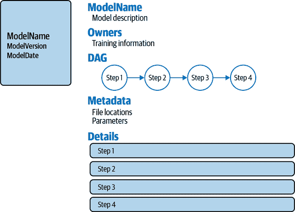
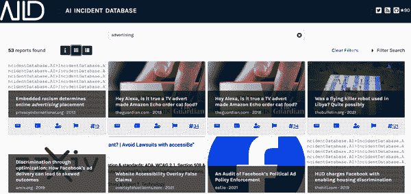
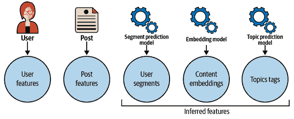

# 第八章：生态系统的信任

到目前为止，在本书中，您已经了解了成为有效负责任的机器学习从业者所需的工具。但这些是否足够？您还需要哪些内容来构建、部署和迭代能够让各种利益相关者信任的机器学习系统？除了前面介绍的个别工具和技术外，您还需要知道如何将这些不同的部分组合在一起，以解决业务问题的机器学习驱动解决方案，同时最小化下游风险。起初听起来可能令人生畏，但在这个增长领域中有一些资源可以帮助实现这一目标。

本章将涵盖提供公司内部和跨越机器学习模型的鸟瞰视图的工具、策略和框架。首先，您将了解实施机器学习管道的技术工具以及有效导航人在环机器学习管道中的步骤的指南和策略。您将介绍一些概念和资源，帮助您在公司内部的机器学习工作流程中获得跨项目的视角。最后，通过探索实施基于机器学习的推荐系统的深度示例，您将看到所有这些知识如何结合在一起。如果您是产品或工程领导者，本章中的资源将帮助您与业务利益相关者有效合作，实施可信机器学习。如果您是机器学习工程师或数据科学家，您将获得有价值的背景知识，了解在项目中确定技术步骤时的权衡和约束条件。

# 工具

第 1 到 5 章节侧重于信任每个方面的开源工具。然而，这些工具对于端到端的机器学习工作流程并不足够。它们中的许多并不适用于行业机器学习项目的计算需求和数据集大小。它们可能还预设了一些并不总是为新项目提供的知识，例如选择指标、数据可用性和明确的利益相关者需求。在考虑这些限制的同时，让我们更深入地探讨一下，您可能需要什么来使可信机器学习的技术知识操作化。

## LiFT

不幸的是，大多数技术工具在可信的机器学习领域公开可用，但并不适用于大量数据的扩展。当您希望分析像是 Web 规模推荐等应用中的大数据集时，LinkedIn Fairness Toolkit (LiFT)是唯一一个提供开源且可扩展解决方案的工具。该工具包的[Spark/Scala 库](https://oreil.ly/iuWLn)主要用于测量适用于数据级或模型级输出标签的公平度量指标，以及适用于离散或连续输出和离散敏感特征的公平度量指标。LiFT 提供的唯一缓解技术是机会平等转换。

在 LiFT 中有宝贵的经验教训。你绝对需要专注于研发，以提出公平性、可解释性、隐私性、安全性和鲁棒性的最新方法。但是当涉及到在实际问题上的适用性时，情况就有些不同了。最终，你受到数据规模和质量、应用方法的复杂性、项目时间表和业务目标的限制。在这些约束条件下找到可行的解决方案是棘手的。例如，对于涉及客户数据的 PB 级问题，你可能永远无法应用 AI Fairness 360 中的处理中偏差缓解技术。相反，你可能需要采用后处理方法或为内部计算架构量身定制的自制解决方案。

## 数据表

数据集数据表是帮助建立应用机器学习工作流程信任的另一工具²。基本上，该论文将数据集的显著特征提炼出来，以预定义的模式组织为未来使用而准备的数据表。数据表将这些特征分为七个部分——每个部分包含一组问题。这些问题的答案应该提供有关数据收集的不同阶段和潜在用途的信息：

*动机*

本节记录了收集数据集的原因，以及资助机构和数据收集者等信息。数据收集者有责任记录对数据下游消费者有用的信息。

*构成*

本节旨在让数据集用户能够就其在任务中的有用性做出知情决策。一些问题涉及数据集与个人信息的相关性。这对于遵守例如欧盟的通用数据保护条例（GDPR）等法规可能很重要。

*收集*

如果你是数据集策展人，你应该在收集数据之前阅读这些问题，以预测潜在问题，然后在收集数据后回答。如果你是数据集使用者，这些答案将告诉你与数据收集相关的问题（例如，缺失数据、抽样不平衡），这些问题可能会影响你如何为你的目的使用数据集。

*预处理*

这里的意图是存储有关原始数据的 ETL 处理的信息。再次强调，数据集创建者需要在收集数据之前阅读这些问题，消费者需要在使用数据之前阅读答案。

*用途*

数据集创建者应该考虑此数据集可以或不能用于哪些应用，并将其记录在本节中，以指导数据集消费者。

*分发*

与*用途*类似，这些问题要求数据集策展人记录一些关于数据集消费者的指导方针。在这种情况下，指导方针关注的是分发数据集的详细信息，例如许可证、DOI 等唯一标识符以及任何限制。

*维护*

业务关键数据集正在积极维护和更新。这些信息可能对数据集使用者有用。例如，如果您想要在生产环境中部署 ML 模型，了解底层数据集的更新时间表将帮助您决定何时更新您的生产模型。

在这七个部分中，有多个问题涉及数据集下游使用的信任方面。让我们来看一下这些问题，由 Gebru 等人在《数据集数据表》中提供，详见表 8-1。查看更广泛的问题列表，请参考 Gebru 等人的《数据集数据表》，或者访问[此 GitHub 仓库](https://oreil.ly/EoB3V)。该仓库提供了问题的模板形式，您可以下载并用于创建您自己的数据表。它还引用了一些数据表的示例。本章稍后将讨论集成到 ML 管道中的数据表示例（见#sec-example）。

表 8-1. 触及信任要素的数据表问题

| 部分 | 问题 |
| --- | --- |
| 组成 | 数据集是否识别任何子人群（例如按年龄、性别）？ |
|  | 是否可能直接或间接地（即与其他数据结合）从数据集中识别个人（即一个或多个自然人）？ |
|  | 数据集是否包含可能在任何方面被视为敏感的数据（例如显示种族或族裔起源、性取向、宗教信仰、政治观点或工会会员身份、地理位置的数据；财务或健康数据；生物识别或遗传数据；政府身份识别形式，如社会安全号码；犯罪记录）？ |
| 收集 | 您是直接从相关个体收集数据，还是通过第三方或其他来源（例如网站）获取的？ |
|  | 是否已通知相关个体有关数据收集的事宜？ |
|  | 个体是否同意收集和使用他们的数据？ |
|  | 如果获得了同意，那么被授权的个体是否提供了未来撤销同意或特定用途的机制？ |
|  | 是否对数据集及其使用对数据主体的潜在影响进行了分析（例如，数据保护影响分析）？ |
| 用途 | 数据集的组成或收集、预处理/清洗/标记方式是否会影响将来的使用？ |
|  | 有哪些任务不应使用该数据集？ |
| 分发 | 数据集或个别实例是否受到任何出口控制或其他监管限制？ |
| 维护 | 如果数据集涉及人员，那么与实例相关的数据的保留是否受到适用的限制（例如，相关个体是否被告知其数据将在固定期限后删除）？ |

## 模型卡片

从技术上讲，数据表可以包含关于*任何*数据集的信息，这些数据集可能用于构建或不用于构建 ML 模型。相比之下，模型卡与 ML 更直接相关，尤其是可信赖的 ML。[³] 模型卡包含发布或部署的 ML 模型的元数据，包括可接受的阈值和评估。评估不仅记录了准确度和均方误差（MSE）等性能指标，还包括与 ML 模型处理的特定用例相关的信任指标。

最初建议，模型卡应包含以下几个部分。这些可以根据您自己的用例或您的组织通常处理的用例进行定制。以下是每个部分涉及的小结：

*模型细节*

包含元数据，如开发模型的人员或组织、模型版本、模型类型（监督/无监督、分类/回归等）、资源（论文、GitHub 仓库）、引用详细信息、许可证以及如何提供反馈。

*预期用途*

包含模型的主要目的（例如分类猫和狗的图像）、主要用户（例如组织、Kaggle 竞争者）以及超出范围的用途。

*因素*

包含可以影响模型性能的因素信息。模型卡的作者将这些因素分为三类：*群体*（样本的重要子群，如种族、性别或它们的组合，对于每个样本与一个或多个个体相关的模型）、*仪器设备*（数据收集环境的详细信息，例如面部检测模型的摄像头硬件详情）、以及*环境*（部署环境的详细信息，例如计算机视觉模型的光照条件）。

*度量*

包括性能类型、信任度或任何其他用于评估模型的自定义指标，其可接受的阈值，验证细节如不确定性指标（例如标准差、置信区间）以及验证方法（例如十折交叉验证、单次训练测试拆分）。

*评估数据*

包含评估数据的详细信息，例如数据集的组成、选择该数据的动机以及对数据进行的任何预处理。

*训练数据*

包含与评估数据相同的信息，除非训练数据是专有的或受保护的。在这种情况下，应提供有关训练数据的高级信息。

*定量分析*

包含评估结果，包括度量部分报告的指标值，在使用的评估数据上测量相关因素。每个因素都是单独评估的，还报告了各种因素的相关交集（例如，黑人与白人、女性与男性、或黑人女性与其他人之间的不均衡影响）。

*伦理考虑*

有意识地记录了模型开发背后的伦理考虑。这些考虑可以包括对敏感数据的任何使用，健康和安全问题，相关的风险和危害以及针对它们的缓解策略，以及可能存在风险的模型应用。

*警告和建议*

包含了在前面章节中未提到的任何关注点和信息。

您可能已经注意到的模型卡和数据表之间的一个重要区别是，信任考虑在模型卡中更为突出。这是有道理的，因为模型比数据更具行动性。正如我们在本书早期讨论的那样，如果机器学习团队在模型开发过程中不考虑信任问题，那么机器学习模型可能出现许多问题。因此，模型卡建议机器学习从业者积极考虑、衡量和记录每个模型的伦理方面。

[这个 GitHub 存储库](https://oreil.ly/sBFog)提供了一个模型卡的模板，您可以下载并使用。它还包含一些相当知名的机器学习模型的模型卡示例。除了一次性示例之外，[HuggingFace](https://oreil.ly/ytnqM)要求为预训练模型提交创建模型卡（例如`bert-base-uncased`）。如果您在自然语言处理领域工作，并且使用过他们平台上的预训练模型，那么您很可能已经接触过模型卡！

## DAG 卡

数据表包含数据元数据，而模型卡包含模型元数据。最近提出的 DAG 卡是这一演变的下一步。⁴ 它们包含机器学习管道的所有关键信息。DAG 卡在一个地方结构化了所有这些信息，包括数据和模型的处理和转换、模型的训练、评估和部署。类似于用于构建数据工程管道的[Airflow](https://oreil.ly/smAav)平台，DAG 卡使用 DAGs 以模块化方式表示所有这些信息。

DAG 卡的优点在于几乎没有额外的手动工作。Metaflow 和 Weights & Biases（W&B）是广泛使用的工具，用于运行 ML 模型管道和进行模型训练。如果您使用这两个工具，您可以从[GitHub](https://oreil.ly/GqYhW)下载 DAG 卡代码，以提取和显示有关模型训练管道 DAG 的信息。DAG 卡通过将这些由代码生成的信息总结为可读文档来推动透明度。传统上，Confluence 页面或内部维基负责在公司内部传达有关 ML 模型的信息。但这类文档与代码的耦合不强，并且需要手动更新。最重要的是，这些文档中的细节和结构程度很大程度上取决于编写者。DAG 卡解决了这个问题。DAG 卡是一种自足的文档，对于实际编码团队和产品经理等非直接参与的人员都很有帮助。

尽管 DAG 卡不直接促进可信 ML 开发，但它们使 ML 团队和相关产品团队能够总结现有的信任考量，并关注未解决的问题。在（非 ML）软件世界中，软件材料清单（SBOM）通过维护其构建块的结构化清单来维护复杂软件的积极安全性和风险监控。在某种程度上，DAG 卡相当于应用 ML 世界中的 SBOM。

图 8-1 概述了 DAG 卡的通用结构，列出了其不同组件及其所呈现的信息。



###### 图 8-1. DAG 卡的示意图表示

###### 注意

还有一些其他工具，它们的功能类似于数据表、模型卡和 DAG 卡的结合体。例如，您可以查看[数据集营养标签](https://oreil.ly/3WN0M)和[AI 事实表 360](https://oreil.ly/ASpCv)，它们也通过元数据文档帮助增强 ML 模型开发管道的透明度。

# 人在回路步骤

ML 模型端到端工作流的技术工具和文档非常必要，但仅此还不足以建立信任。您的公司还需要有一个关于如何处理 ML 工作流的人类步骤的共享标准。这些步骤包括在 ML 项目开始时确定相关危害、确定数据来源、决定何时收集额外数据以及在项目多个阶段进行风险评估。记住图 7-2 吗？它显示信任考量不仅与 ML 模型相关，还涉及公司的产品和营销策略、领域知识以及运营目标。

让我们看一些能帮助结构化 ML 开发工作流中人在回路步骤的最佳实践。

## 监督指南

模型卡要求记录考虑到每个机器学习项目的伦理问题。但是你如何实际操作呢？一方面，机器学习开发团队通常不了解更广泛的问题，如法规和合规指南的细节。另一方面，机器学习团队可以咨询的专业主题专家（SMEs）可能不会因为每个项目都坐下来谈论相同的事情而感到高兴。因此，很明显，你需要在这两个极端之间找到一个平衡点。

人类监督指南（HOG）可以帮助解决这种情况。⁵ 基本上，这些是按照 SME 专业知识划分的常见问题（FAQ）风格文档。可能编写 HOG 的两种类型的 SME 有：

领域专家

例如，公司中相应部门的法律、公共关系（PR）或隐私专业人员

用例专家

例如，有深厚经验的高级产品经理、解决方案架构师或工程师，专注于特定用例组，如欺诈、广告、金融或健康数据。

事先从专业主题专家（SME）策划一组通用的问题和答案有助于在公司所有机器学习团队中*扩展*人类级别的监督。这需要是一次性的、跨职能的工作，由 ML 治理、产品管理或 AI 伦理团队领导。负责此项工作的团队将从一份样本问题列表开始，并与特定的 SME 合作，最终完成带有问题列表及其答案的 HOG 文档。然后，他们将最终文档提供给 ML 开发和产品团队参考。这些文档成为对信任问题的第一道防线。在机器学习模型开发管道的不同阶段，机器学习团队将参考这些文档获取指导。如果前进的最佳方式仍不清楚，他们将联系编写该文档的 SME 以获取具体的指导。

现在让我们看一下两组 HOG 问题，一组是领域专家的，另一组是用例专家的。每个 HOG 仅列出少量问题和一个示例答案。你可以在[本章的 GitHub](https://oreil.ly/qj4C2)找到完整的文档。

这里是一个隐私 SME 编写 HOG 的示例问题：

1.  哪些数据类型在隐私审查范围内？

1.  对于这些数据及其使用，有哪些法律/法规？

1.  在使用这些数据时，机器学习项目应该注意哪些类型的隐私风险？

1.  是否有这些风险的外部例子？如果有，请提供这些例子。

1.  什么特征能让机器学习团队评估项目是低风险、中风险还是高风险？有没有减少相关风险的方法？

1.  是否有需要特定批准才能在风险缓解中使用的数据元素？

1.  通常用于衡量隐私风险的指标是什么？这些指标是否有标准可接受的阈值？

1.  对于第三方数据进行了哪些审查，使用这些数据存在哪些责任风险？

1.  在数据/模型元素重复使用方面是否存在隐私问题？

1.  数据科学家需要联系谁获取额外信息？

隐私专家可能会如下回答第二个问题：

> 根据个人数据元素收集的地理区域，可能适用一种或多种法律。例如，GDPR 适用于从欧盟自然人获取的数据，包括公开可获取的数据。在美国，加利福尼亚州、弗吉尼亚州和科罗拉多州居民的数据受各自司法管辖区的保护。去标识化和公开可获取的数据不适用这些法律，但在弗吉尼亚州和科罗拉多州，聚合信息适用。您可以咨询[Bloomberg Law](https://oreil.ly/edMqw)获取更多信息或与我联系。

请注意，一些问题是为隐私专家提出的概括性问题，而其他问题则专门涉及隐私风险。在答案中，专家提供高层指导，并提供额外信息的指引。

对于使用案例 HOG，让我们想象一家公司维护一个在线平台，用于买卖消费品，并需要为该平台上的广告机器学习项目制定指南。机器学习治理团队可以联系在该领域为公司构建过机器学习系统的高级工程师，向其提出这些问题。

以下是关于广告领域使用案例 SME 的示例问题：

1.  在定向广告领域，哪些类型的数据使用可能存在信任问题？

1.  要获取此类数据，有哪些隐私、法律或其他要求？

1.  是否可以使用公开可用或汇总数据来避免信任问题？

1.  在这一领域有哪些法律/法规？

1.  在广告使用案例中，可以使用哪些指标、阈值和缓解技术来检测和缓解信任问题？

1.  在机器学习团队之外，可以咨询哪些资源人员？

使用案例 SME 可能会如下回答第一个问题：

> 从隐私角度考虑，使用敏感个人信息（SPI）和可识别个人信息（PII）非常重要。不允许使用 PII，而使用 SPI 如种族或地理位置则需获得批准。如果数据中的特征与敏感特征如种族和性别相关联，如果在机器学习流程中不考虑这些敏感特征，可能会出现公平性问题。

## 评估阶段

在来自 SME 的直接和间接指导下，作为技术负责人或产品经理，您如何实际评估您领导的 ML 项目的信任问题，然后如何继续构建模型管道？当您与技术团队一起确定和执行管道的技术步骤（即数据处理、模型训练、验证和部署）时，务必也讨论这些阶段的信任相关问题。让我们详细了解如何有条理地处理这些任务的细节。请注意，涉及人类参与 ML 循环的整体过程的部分内容在第七章中介绍过。

### 范围界定

在您界定项目范围以确定数据来源、模型和交付机制时，请确保确定哪些信任方面是重要的。使用一组问题，模仿第七章中提供的问题，评估每个信任方面的重要性。

在此之后，您需要为每个信任方面确定量化指标。例如，如果您希望在展示某些类型广告时避免种族歧视（例如教育机会、职位发布或购房信息），您将需要人口统计数据。在您的业务背景下，人口统计数据的最可靠来源是什么？是否存在与数据质量、访问限制或数据使用伦理相关的问题？您应该使用个体级别还是聚合级别的数据？使用一种数据源而不是另一种的权衡是什么？与利益相关者讨论这些问题，然后做出明智的决策继续前进。最重要的是，记录这些决策以供将来参考和透明度。

让我们根据您需要在 ML 管道的哪些阶段执行这些人类步骤进行详细解析。

### 数据收集

数据科学/机器学习是一个迭代过程。您收集一些数据集，进行一些探索性分析以确定是否需要更多数据，收集更多数据，回到探索步骤，并且仅在您拥有的数据足够好以进一步进行时才进行模型构建。在这个过程中，不要忘记考虑信任元素。这可以意味着根据用例执行以下一个或多个步骤：

1.  确保数据中不存在个人身份信息（PII）

1.  检查并纠正缺失特征、随机缺失的值以及任何缺失值与敏感特征的相关性

1.  对异常值进行类似的尽职调查

1.  确保重要样本子群体具有足够的数据点供使用

1.  确定一个或多个非敏感特征是否可以作为敏感特征的代理；如果可以，决定是清理这些特征、丢弃它们，还是在模型构建过程中考虑它们。

基于前述步骤的不足，您可能需要收集更多数据。确保经过相同的步骤，确保您发现的差距已经弥补。

### 模型训练

现在，您已经为重要的信任方面确定了度量和阈值，在这个阶段，您将通过使用来自“评估与反馈”的指南，审查模型训练步骤。

### 模型验证

后模型人类水平的步骤会因为你是处理新模型还是处于已部署模型推理阶段而有所不同。如果是前者，现在是执行和评估任何后处理去偏置或在模型训练期间未执行的添加隐私噪声的时候了。如果可解释性是优先考虑的话，使用事后解释并确保它们符合利益相关者的喜好。如果只是在已部署模型上做推理，调查会比较详细。你需要检查数据漂移⁶，概念漂移⁷以及上游数据集的组成和质量变化。你还需要检查信任度指标，确保它们在阈值内并/或与历史推理数据相比未显示异常行为。同样，使用“信赖性和 MLOps”来处理这些任务。如果发现任何问题，可能需要深入研究测试数据以使用最新的批次诊断，然后通过重新训练模型来减轻问题。

# 跨项目方法的需求

超越项目级别的工具和文档，让我们探索一个全面的方法来看待与可信 ML 相关的行业项目。行业 ML 项目往往涉及广泛或紧密相关的主题。它们还倾向于重复使用数据、代码、模型或 ML 管道的部分。考虑到这一点，将信息 ML 项目的常见存储库整合到公司的各个项目中是合理的。

安全社区在几十年前就解决了这个问题，并开始分享和编码软件系统中的安全漏洞信息。例如，入侵检测系统[Snort](https://snort.org)基于开源共享和使用签名和规则来实时检测互联网网络中的安全威胁。[MITRE ATT&CK](https://oreil.ly/6PZF8)，[Cyber Kill Chain](https://oreil.ly/eJdzi)和[NIST 网络安全框架](https://oreil.ly/2YyKd)是三种广泛接受的分类现有和新的安全威胁和攻击的方法。[国家漏洞数据库（NVD）](https://oreil.ly/Sk9A3)包含特定软件中可利用弱点（*漏洞*）的详细信息。

在更广泛的可信 ML 领域中，尚不存在这些系统的确切等价物。但让我们看一些朝正确方向迈出的框架。

## MITRE ATLAS

由麻省理工学院（MITRE）维护的[人工智能系统的对抗威胁景观（ATLAS）](https://oreil.ly/ErQNx)是一个开源的知识库，用于对抗性 ML 攻击。ATLAS 参照了著名的 MITRE ATT&CK 框架。他们为 ML 从业者提供了一套分类系统，可用于他们自己的目的。他们还可以通过添加信息并将其分类到 ATLAS 分类中，为这个知识库贡献一个新的攻击。

表 8-2 显示了 ATLAS 中的 12 大类对抗性攻击战术。

表 8-2\. MITRE ATLAS 中包含的针对 ML 系统的顶级战术，表示攻击向量

|  | 战术 | ATLAS ID | 对手的目标 |
| --- | --- | --- | --- |
| 1. | 侦察 | AML.TA0002 | 收集关于 ML 系统的信息以供以后使用 |
| 2. | 资源开发 | AML.TA0003 | 建立支持其自身操作的资源 |
| 3. | 初始访问 | AML.TA0004 | 获取包含 ML 模型工件的系统访问权限 |
| 4. | ML 模型访问 | AML.TA0000 | 获取 ML 模型本身的访问权限 |
| 5. | 执行 | AML.TA0005 | 运行恶意代码 |
| 6. | Persistence | AML.TA0006 | 维持其自身的恶意访问 |
| 7. | 防御规避 | AML.TA0007 | 避免被安全软件检测到 |
| 8. | 发现 | AML.TA0008 | 获取关于运行/服务 ML 模型的系统的知识 |
| 9. | 收集 | AML.TA0009 | 收集与其目标相关的信息 |
| 10. | ML 攻击策划 | AML.TA0001 | 利用对被攻击系统的了解来定制攻击 |
| 11. | 数据外泄 | AML.TA0010 | 窃取 ML 模型工件 |
| 12. | Impact | AML.TA0011 | 操纵、破坏或干扰 ML 系统、模型或底层数据的功能 |

每个类别下列出了多种技术。意图是，如果您想评估您的 ML 模型对对抗性攻击的脆弱性，您将评估其对每种攻击类别的受影响程度。在这样做时，您将受到每个子类别下历史攻击案例的启发。

让我们回到介绍在 第四章 中的 HopSkipJump 攻击，并看看在 ATLAS 格式中的一个*案例研究*提交可能会是什么样子。

```
study:
  id: AML.CS9999
  name: HopSkipJump Attack on ImageNet
  object-type: case-study
  summary: >
    As an example in the adversarial robustness chapter,
    Authors of the book "Practicing Trustworthy Machine Learning" used a Keras
    classifier on a ResNet50 model with pre-trained Imagenet weights.

    The HopSkipJump attack was able to create adversarial images with
    incorrect predicted images for all test images.
  incident-date: 2022-04-01T00:00:00.000Z
  incident-date-granularity: DATE
  procedure:
    - tactic: AML.TA0007
      technique: AML.T0015
      description: >
        The HopSkipJump attack was able to create adversarial images with
        incorrect predicted images for all test images.

        Original and adversarial images were visually indistinguishable for all
        16 test cases. On examination, there seems to be a relationship between
        predicted majority class probability and the relative L2 distance
        between original and perturbed images.
  reported-by: Authors
  references:
    - title: "Practicing Trustworthy Machine Learning"
      url: https://oreil.ly/ptml
    - title: "HopSkipJumpAttack: A Query-Efficient Decision-Based Attack"
      url: https://arxiv.org/abs/1904.02144
```

注意，ATLAS 分类允许您将示例放入一个广泛的战术（[防御规避，AML.TA0007](https://oreil.ly/rJzOC)）和一个具体的技术（[规避 ML 模型，AML.T0015](https://oreil.ly/GBBJn)）下。

## 基准

从攻击转向防御，[RobustBench](https://oreil.ly/P1E9z)为现有的对抗鲁棒性方法提供了标准化的质量基准。类似于 Kaggle 竞赛，RobustBench 采用排行榜方式。他们的排行榜分为众所周知的计算机视觉（CV）数据集（CIFAR-10、CIFAR-100、ImageNet）和鲁棒性技术（ <math alttext="script l 2"><msub><mi>ℓ</mi> <mn>2</mn></msub></math> 范数、 <math alttext="script l Subscript normal infinity"><msub><mi>ℓ</mi> <mi>∞</mi></msub></math> 范数）的组合。对于每个组合，相关方法的性能以标准和鲁棒分类精度等指标在排行榜上展示。RobustBench 还通过其[Model Zoo](https://oreil.ly/pvOXv)提供对这些模型的访问。如果你在 CV 领域工作，并且有充分的理由认为你处理的数据集可能需要鲁棒技术，那么 RobustBench 是一个很好的起点。

[OpenXAI](https://oreil.ly/XPpyk)是一个最近推出的工具包，它主要处理*可解释人工智能*（XAI）。唯一的区别在于，RobustBench 更专注于基准测试，而 OpenXAI 专注于工具包。OpenXAI 的动机直接源于自动化偏见讨论中的第七章：并非所有的解释方法都是可靠的。它们可能会被对手欺骗，即使错误时，人类通常也会过于信任它们。因此，如果你（a）有一个数据集，并正在寻找一个适用于它的 XAI 方法；或者（b）提出了一种新的 XAI 方法，并希望检查其表现，那么 OpenXAI 是一个很好的选择。

## AI 事件数据库

为了对未来可能出现的问题有所了解，你应该了解过去发生了什么问题。在 ML 项目的背景下，这意味着查看与你正在开发的项目相关的 ML 系统失败案例。为此，[AI 事件数据库（AIID）](https://oreil.ly/ohGPZ)提供了一个部署 AI/ML 系统引起的伤害的众包存储库。为了在内部利用 AIID，你可以采取两种方法。你可以从这个存储库中获取信息，并用来避免在自己的工作中犯同样的错误。或者你可以扩展这些信息，包括关于不一定需要是失败的内部 ML 项目的更细粒度信息。

例如，让我们来看看先前的广告示例。在这个领域内界定一个机器学习项目时，了解过去相关失败案例对技术团队非常有帮助。AIID 可以提供帮助。在 AIID 中搜索关键词*广告*，会得到 53 个众包 AI 失败案例的结果（图 8-2）。这些结果包括谷歌在线广告放置中的种族歧视案例（第一个链接）和 Facebook 的房屋广告推荐（最后一个链接）。



###### 图 8-2\. AIID 关键词“广告”的搜索结果

过去相关失败的记录可以指导 ML 团队和产品经理在规划项目范围时做出更好的人类级决策，比如在选择敏感特征和可靠数据源时。

## Bug Bounties

另一个开始进入值得信赖的 ML 社区的标准做法是漏洞赏金。漏洞赏金鼓励开发人员和工程师在软件系统中找到漏洞或弱点的证据。Twitter 的[算法偏见赏金挑战](https://oreil.ly/ELka8)是该领域的首个尝试。此赏金的组织者最近推出了一个非营利性组织[Bias Buccaneers](https://oreil.ly/A87rj)，专门致力于第三方偏见赏金。

另外两个相关的倡议是 Anthropic 的[反向缩放奖](https://oreil.ly/rtLwj)和斯坦福 HAI 的[AI 审计挑战](https://oreil.ly/6nXcB)。如果您可以在公司组织类似的 ML 漏洞竞赛或黑客马拉松，那就去做吧！即使没有金钱动机，漏洞赏金也是在这一领域获得实践经验的好地方，超越了这本书中的概念和示例。一些托管在 Hugging Face 中的广泛使用的预训练模型的模型卡片包含有关其预测潜在偏见的信息。这些可以扩展为对某种类型偏见的完整评估。

###### 提示

在`bert-base-uncased` [模型卡片](https://oreil.ly/5nGcu)的*限制和偏见*部分给出的示例。基于输出，你能想出一个偏见度量标准，来量化围绕与女性刻板印象相关联的职业和与男性刻板印象相关联的职业之间情感差异吗？你将如何测试这个度量标准是否足够显著，从而得出结论：该模型在给定示例中填充掩码词的任务上存在偏见？

# 深度挖掘：串联各种线索

让我们通过一个例子来结束本节，展示您和您的团队如何将前述工具和技术整合起来，以在 ML 项目中做出明智的工作流决策。超越单个项目，您将看到为什么从整体角度考虑 ML 治理是如此重要。

考虑在社交网络平台上构建用户时间线的问题。这是一个典型的排名问题，您使用多个数据源构建一个（主要是）最近的帖子排名列表，以展示给用户。通常希望使排名较高的帖子与用户相关，以便他们在平台上花费更多时间。

让我们按照 DAG 卡片的结构来构建一个模块化的 ML 流水线，由 DAG 连接的节点组成。每个节点将存储 ML 模型特定阶段的重要信息。当您的团队在模型构建过程中找到额外的步骤时，请将它们作为单独的节点添加到模型流水线 DAG 中。这是您将随着进展填充的高级 DAG 的通用框架。这不仅是当前推荐系统示例的起点，也适用于通用的 ML 流水线。

```
{
  "data": { ... },
  "preprocessing": { ... },
  "model_training": { ... },
  "model_inference": { ... }
}
```

## 数据

让我们为`data`节点添加一些细节。在此下面，您将拥有一堆子节点，每个节点都包含一个数据源。那么，对于能够输出用户特定排名列表的推荐系统，您需要考虑哪些数据源？让我们搁置像 Twitter、LinkedIn 或 Facebook 这样现代社交平台拥有的复杂推荐引擎，并仅考虑以下类型的数据：

+   用户或最近一段时间内类似用户组的活动模式（例如查看、点赞或分享的帖子）

+   特定于用户的特征

    +   用户或用户组的历史使用数据的聚合

    +   第三方数据

+   帖子特定特征

    +   元数据，如哈希标签、时间和星期几

    +   帖子或类似帖子的历史活动数据

+   多个层次的推断特征

    +   从用户分割模型获取的用户段

    +   使用嵌入表示的帖子内容的语义表示

    +   从主题预测模型推断的帖子主题标签

让我们来看看这些数据集的来源（见图 8-3）。在确保信任方面，事情可能会变得非常复杂，非常迅速。推断出的特征是 ML 模型本身的结果。因此，这些上游模型中的任何信任问题不仅会影响它们的输出，还可能传播到推荐引擎本身。



###### 图 8-3. 推荐系统示例中数据节点及其来源

根据“数据表格”的指导，您可以将数据节点的详细信息编码为数据表格的形式。在我们的示例中，这需要一些细微的差别。对于前两个数据集，您可以简单地链接到它们的数据表格，也可以附加一些高级别的详细信息。对于其他三个数据集，您需要更详细地描述，因为它们是模型生成的数据集，不会有自己的数据表格。虽然不一定需要构建完整的数据表格，但至少应包括以下元素：

+   生成这些特征的模型简要描述

+   每个特征代表的简要描述

+   对这些特征可靠性的注意事项和见解

+   生成这些特征的模型的唯一 ID 或 DAG 卡片链接

一旦您获取了所有信息，数据节点结构的骨架会看起来像这样。

```
"data": {
  "user_features": {
    "data_description": ...,
    "datasheet": ...
  },
  "post_features": {
    "data_description": ...,
    "datasheet": ...
  },
  "user_segments": {
    "model_description": ...,
    "feature_description": ...,
    "considerations": ...,
    "dag_card": ...
  },
  "content_embeddings": {
    "model_description": ...,
    "feature_description": ...,
    "considerations": ...,
    "dag_card": ...
  },
  "topic_tags": {
    "model_description": ...,
    "feature_description": ...,
    "considerations":...,
    "dag_card": ...
  }
}
```

## 预处理

在这个阶段，您的任务是对不同数据集的部分进行*特征化*，以准备实际用于模型训练和评估的数据集。因为您仍在处理数据集，因此数据集数据表框架再次非常有用，以决定要将哪些信息保留以备后用。请记住，从“数据表”中得知，数据表有七个组成部分：*动机*，*组成*，*收集*，*预处理*，*用途*，*分发*和*维护*。在这种情况下，您不需要前两个，因为项目已经规划好，并且数据已经就绪。在其余的五个中，您将进行的数据整理的实际细节将会放入*预处理*中。这些包括 ML 工作流中的标准步骤（例如特征转换，分箱，过滤和分组，缺失数据插补）和特定于信任的步骤（更多内容即将发布）。

对于剩下的步骤，实际上可以重复使用两个模型生成的数据集相同步骤中的一些信息。您可以将任何额外的评论作为单独的字段包含进来。对于三个推断数据集，您可以参考这些模型的数据表，以及有关下游变更的更多评论来解释。

根据上述内容，这里是`preprocessing`节点的结构示例。 `*` 通配符表示`source_information`某一字段下的所有子字段，最后三个组件的字段组合与`source_information`相同。

```
"preprocessing": {
  "collection":{
    "description": ...,
      "inherited": [
        ["user_features.datasheet.collection", "comments"],
        ["post_features.datasheet.collection", "comments"],
        ["user_segments.dag_card.data.*.datasheet.collection", "comments"],
        ["content_embeddings.dag_card.data.*.datasheet.collection", "comments"],
        ["topic_tags.dag_card.data.*.datasheet.collection", "comments"]
        ]
    },
    "preprocessing": {
      "feature_transformation": [],
      "feature_binning": [],
      "filtering": [],
      "missing_data": [],
      "other_steps": ...
    },
    "uses": {
      "description": ...,
      "inherited": [["*.uses", "comments"]]
    },
    "distribution": {
      "description": ...,
      "inherited": [["*.distribution", "comments"]]
    },
    "maintenance": {
      "description": ...,
      "inherited": [["*.maintenance", "comments"]]
    }
}
```

前置模型可能使用了共同的数据源。因此，当你合并多个数据表时，可能需要进行后处理步骤以选择唯一字段。

## 模型训练

此步骤将类似于使用数据表对预处理采取的操作，但是使用模型卡。让我们从空白的模型卡结构开始，然后在该模型卡的某些组件中添加特定的信息来训练我们的推荐系统模型。最后，将一些继承的链接槽入其他组件，以填充模型卡，使其与提供推断特征的其他模型连接起来。

四个模型卡字段 *模型详情*，*预期用途*，*评估数据*，*训练数据* 可包含特定于当前模型的信息。其他字段可以包含与生成推断特征模型相同信息和追溯信息。当然，推断特征模型的模型详情、预期用途、评估数据和训练数据信息也很重要。但在项目规划阶段，你应该期望在这些模型上查看这些信息。

与之前相同的约定，这里是用于记录`model_training`节点元数据的结构。

```
"model_training": {
  "model_details": { ... },
  "intended_use": { ... },
  "factors":{
    "description": ...,
    "inherited": [
      ["user_segments.dag_card.model_training.factors", "comments"],
      ["content_embeddings.dag_card.model_training.factors", "comments"],
      ["topic_tags.dag_card.model_training.factors", "comments"]
    ]
  },
  "metrics": { "details": [], "inherited": [["*.metrics", "comments"]] },
  "evaluation_data": {},
  "training_data": {},
  "analyses": { "description": ..., "inherited": [["*.analyses", "comments"]] },
  "ethical_considerations": {
    "description": ..., "inherited": [["*.ethical_considerations", "comments"]]
  },
  "caveats": { "description": ..., "inherited": [["*.caveats", "comments"]] }
}
```

## 模型推断

此部分在模型部署后对可观察性和故障排除非常有用。其想法是记录关于模型生成预测数据集以及预测本身的细节，例如指标和警报。为了跟进先前部分的做法，您还应包括对推理阶段的前驱模型的挂钩，以便可以主动监控已部署模型的下游影响。

关于此节点的示例架构，请参阅以下草图结构。有三类需要存储的元数据：`数据`、`指标`和`警报`。在每个类别及其子类别下，字典条目对应于如评估数据集、指标值和警报详细信息等变化元素。每个此类条目的时间戳都被存储以便未来查询。

```
"model_inference": {
  "data": {
    "version": {
      {"timestamp": ..., "sampling": ..., "location": ... },
      { ... }
    }
    "additional_details": ...
  },
  "metrics": {
    "data": {
      {
        "timestamp": ...,
        "results": {
          {"metric": ..., "value": ... },
          {...}
        }
      },
      {...}
    },
    "model": {
      {
        "timestamp": ...,
        "results": {
          {"metric": ..., "value": ... },
          {...}
        }
      },
      { ... }
    }
  },
  "alerts": {
    "data": {
      {
        "timestamp": ...,
        "results": {
          {"metric": ..., "alert_type": ..., "score": ... },
          {...}
        }
      },
      { ... }
    },
    "model": {
      {
        "timestamp": ...,
        "results": {
          {"metric": ..., "alert_type": ..., "score": ... },
          {...}
        }
      },
      { ... }
    },
    "inherited": [
      ["user_segments.dag_card.model_inference.alerts", "comments"],
      ["content_embeddings.dag_card.model_inference.alerts", "comments"],
      ["topic_tags.dag_card.model_inference.alerts", "comments"]
    ]
  },
}
```

## 信任组件

鉴于您的代码以标准化格式注释，围绕模型管道的部分构建包装不是太困难，以提取相关文本和继承指针以构建前述的 DAG 卡结构。原始的 DAG 卡是在节点级别使用 Metaflow 和 W&B 功能的包装器来处理这些信任方面的许多问题。例如，您可以记录所选的信任指标及其计算值，然后在数据、模型或推理阶段信任指标值超出可接受水平时获得警报。使用继承指针，还可以将信息、指标和警报传递给使用您模型输出的前驱模型的上游和下游其他模型。

但是关于人为层面考虑的信息呢？如何存储和重复使用这些信息？在“人在环路中的步骤”中，您了解了监督文件和评估步骤。为了将来参考，您需要存储一些关于这种人为层面尽职调查的信息。

为此，您可以采取双管齐下的方法。首先，在高级 DAG 卡中添加额外的`范围`节点，以记录启动项目时主要是人为层面的考虑。这些基本上是来自跨功能利益相关者会议的简化会议记录，这些会议通常在项目开始时由 ML 团队进行。其次，在每个节点的最后添加额外的`风险评估`步骤。这作为签署以进入 ML 管道下一阶段的批准。

按照“评估阶段”的指导原则，以下是范围阶段的一个示例结构。

```
"scoping": {
  "motivation": ...,
  "data_identification": ...,
  "trust_elicitation": ...,
  "metric_elicitation": ...,
  "risk_assessment": {
    "list": {
      {"issue": ..., "step_taken": ..., "resolved": true/false},
      {...}
    },
    "proceed_flag": true/false
  }
}
```

各个字段的功能如下：

`motivation`

记录开始新项目的原因。

`data_identification`

标识相关数据源，并总结为何选择或未选择某些数据源的理由。

`trust_elicitation`

确定项目的重要信任方面及其优先级。为此目的使用“信任的重要方面”中的评分表。

`metric_elicitation`

描述了评估模型所需的指标。这些指标包括传统的性能指标和信任指标。

`risk_assessment`

总结了与信任相关的风险，并根据重要性进行了优先级排列。

对于第二部分（即在其他阶段添加风险评估步骤），`scoping.risk_assessment`为您的团队提供了一个重新审视的起点，以考虑随后阶段的新工作信息。在每个阶段的风险评估步骤中，团队可以（希望能够）开始勾选其中的事项，以及在下一个阶段添加新的检查事项。在阶段结束时，您的团队还应评估是否能够真实地解决所有未减轻的高优先级风险。如果认为无法解决，请停止！在这种情况下，您有两个选择。要么完全停止项目工作，要么在完成额外工作后重新审视同一阶段。根据您所处的阶段，此额外工作可以是额外的数据收集（`data`，`preprocessing`），更改缓解技术（`model_training`）或模型重新训练（`model_inference`）。

让我们考虑在我们的示例中优先级风险列表可能会是什么样子。根据`scoping`阶段的人为考虑，在甚至开始数据收集之前，假设 ML 团队已经识别出需要考虑的许多信任问题。表 8-3 列出了这些问题及其解决状态（基本上是`scoping.risk_assessment.list`）。

表 8-3\. `scoping`阶段样本风险评估检查表

| 问题 | 采取的步骤 | 已解决 |
| --- | --- | --- |
| 用户组 A 与用户组 B 在用户特征数据中存在潜在偏见 |  | False |
| 用户组 A 与用户组 B 在帖子特征数据中存在潜在偏见 |  | False |
| 主题标签预测准确性对比，对比组 C 与对比组 D | `topic_tags.*.risk_assessment`已充分解决 | True |
| 需要遵守加州适龄内容安全和隐私指南设计法案^(a) |  | False |
| 需要根据 UX 要求使用用户历史特征解释建议 |  | False |
| ^(a) Kari Paul，《[加州儿童在线安全法案将首次施行](https://oreil.ly/9Gw5F)》，《卫报》，2022 年 8 月 30 日。 |

请注意，潜在问题中只有一个填写了解决方案字段。这是有道理的：因为这个问题涉及到一个推断特征模型，仅检查该项目的`risk_assessment`步骤就足够了。尽管其余问题尚未解决，但项目团队对进行数据收集感到足够有信心，可以继续推进。

在前面的风险评估指导下，团队确保获取用户的人口统计数据。因此，即使 `data.risk_assessment` 解决的问题不超过 表 8-3 中记录的问题，但团队在下个阶段（仅显示具有新信息的行）已经准备好解决所有问题，除了可解释性问题（表 8-4）。

表 8-4\. 数据阶段的样本风险评估检查表

| 问题 | 执行步骤 | 已解决 |
| --- | --- | --- |
| 用户组 A 与用户组 B 的用户特征数据中的潜在偏差 | 收集人口统计数据以在 `preprocessing` 中进行评估 | False |
| 用户组 A 与用户组 B 的后特征数据中的潜在偏差 | 收集人口统计数据以在 `preprocessing` 中进行评估 | False |

在 `preprocessing` 中，团队检查了精心制作的特征中的数据偏差，并发现了用户特征中的偏差，但未在后特征中发现。这解决了一个未解决的问题（表 8-5）。

表 8-5\. 预处理阶段的样本风险评估检查表

| 问题 | 执行步骤 | 已解决 |
| --- | --- | --- |
| 用户组 A 与用户组 B 的用户特征数据中的潜在偏差 | 在 x、y、z 特征中发现了偏差；详细信息请参见 `pre​pro⁠cessing.other_steps` | False |
| 用户组 A 与用户组 B 的后特征数据中的潜在偏差 | 未在相关特征中发现偏差；详细信息请参见 `pre​pro⁠cessing.other_steps` | True |

现在团队正在训练推荐模型，并使用后处理步骤执行偏差缓解，通过实施安全和隐私过滤器，并添加事后可解释性层以从产品方面获得解释需求（表 8-6）。

表 8-6\. 模型训练阶段的样本风险评估检查表

| 问题 | 执行步骤 | 已解决 |
| --- | --- | --- |
| 用户组 A 与用户组 B 的用户特征数据中的潜在偏差 | 使用后处理缓解偏差；详细信息请参见 `model_training.metrics` | True |
| 需要遵循适龄内容安全和隐私指南，根据加州适龄设计法案^(a) | 添加了隐私和安全过滤器；请参见 `model_training.metrics` 和 `model_training.ethical_considerations` | True |
| 根据用户历史特征解释推荐的需求符合 UX 要求 | 已实施解释；详细信息请参见 `model_training.metrics` | True |
| ^(a) 保罗，“加州首个类似法案将使儿童在网上更安全。” |

由于所有信任问题都已解决，产品端决定继续进行模型部署。一旦部署完成，`model_inference.risk_assessment`将检查模型管道中使用的信任指标的测量结果是否在可接受范围内。`issue`字段基本保持不变，而`step_taken`字段将引用`model_inference.metric`下的特定字段，并且可以从相应的`model_inference.alerts`中推导出`resolved`状态，用于度量或一组度量。

###### 提示

您能否详细说明`model_inference.risk_assessment`的确切模式？有不止一种正确答案—试试看！

# 结论

在本章中，您了解到了工具和框架，这些工具和框架使您能够以可信的方式在公司中实现生产级别的 ML *管道*。为此，您需要：

+   使用实际能够在公司技术和法规约束条件下完成工作的工具：

+   保留 ML 管道的元数据信息，以便将来重复使用，为类似项目提供信息

+   将人类水平的考虑因素编码，以指导未来的项目。

+   连接机器学习管道并分享学习成果，以便于故障排除。

这种整体方法在定义上是透明的。无论利益相关者是谁，他们都会准确了解导致 ML 管道设计决策的所有考虑因素，模型组件的技术规格是什么，以及当出现问题时如何跟进。

¹ Siram Vasudevan 和 Krishnaram Kenthapadi，[“LiFT: A Scalable Framework for Measuring Fairness in ML Applications”](https://dl.acm.org/doi/10.1145/3340531.3412705)，*CIKM-2020*（2020 年 10 月）：2773–80。

² Timnit Gebru 等，[“Datasheets for Datasets”](https://oreil.ly/xPSjM)，*Communications of the ACM 2021* 64 卷，第 12 期（2021 年 12 月）：86–92。

³ Margaret Mitchell 等，[“Model Cards for Model Reporting”](https://dl.acm.org/doi/10.1145/3287560.3287596)，*Proceedings of the Conference on Fairness, Accountability, and Transparency*（2019 年 1 月）：220–9。

⁴ Jacopo Tagliabue 等，[“DAG Card Is the New Model Card”](https://arxiv.org/abs/2110.13601)，*arXiv preprint*（2021 年）。

⁵ Emily Dodwell 等，[“Towards Integrating Fairness Transparently in Industrial Applications”](https://arxiv.org/abs/2006.06082)，*arXiv preprint*（2020 年）。

⁶ Srikanth Machiraju，[“Why Data Drift Detection Is Important and How Do You Automate it in 5 Simple Steps”](https://oreil.ly/6iA64)，*Towards Data Science*（博客），2021 年 11 月 1 日。

⁷ Jason Brownlee，[“A Gentle Introduction to Concept Drift in Machine Learning”](https://oreil.ly/gsBxn)，*Machine Learning Mastery*（博客），2017 年 12 月 15 日。

⁸ 例如，请查看[Google 的开源软件漏洞奖励计划](https://oreil.ly/bf7GI)。
