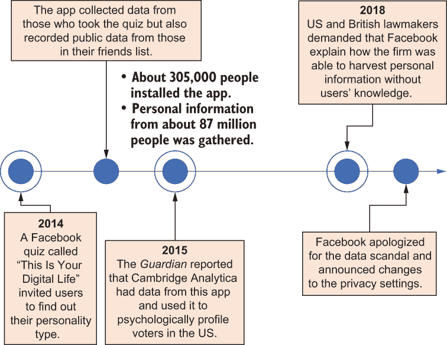
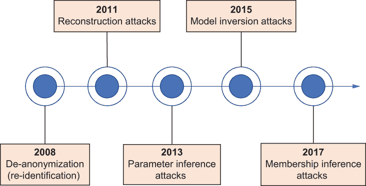
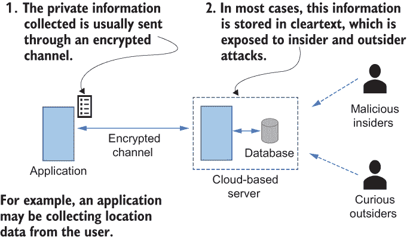
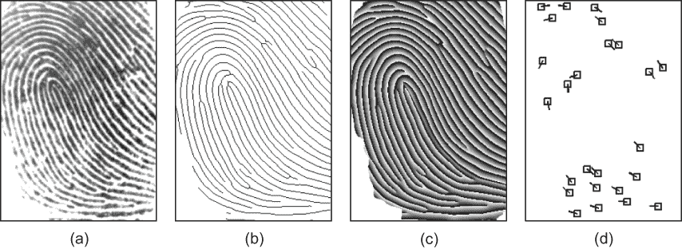
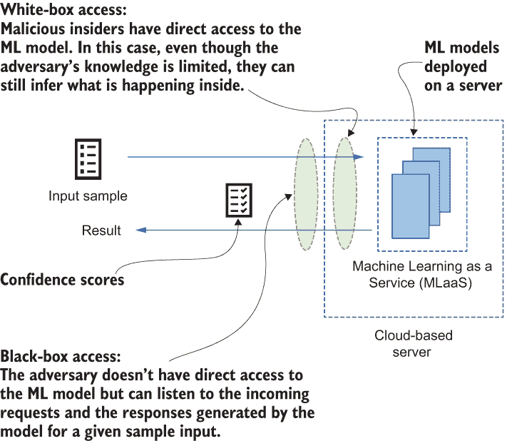
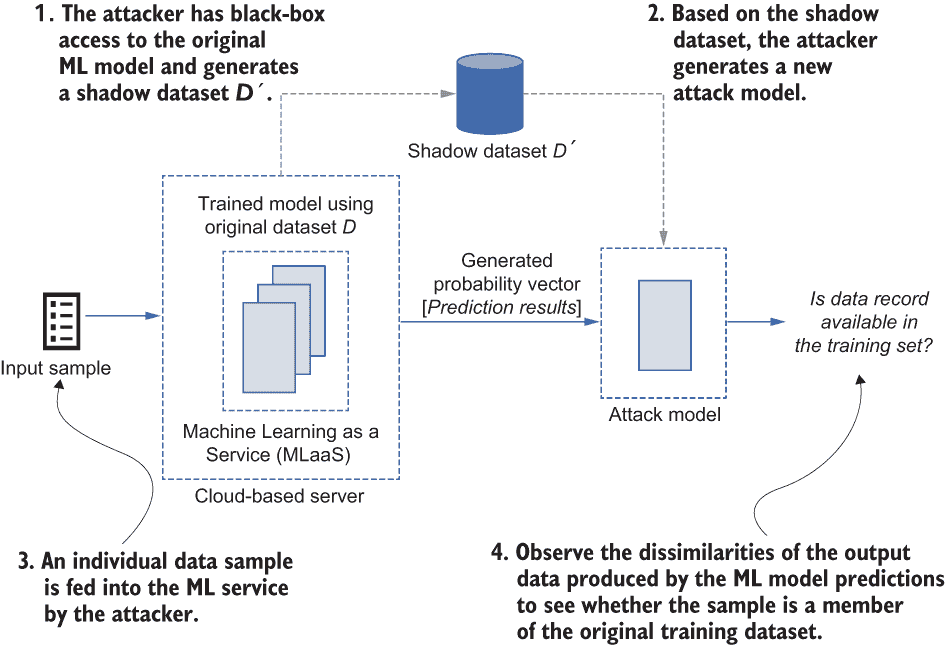
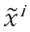
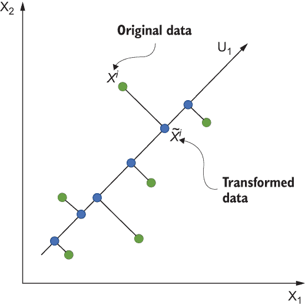
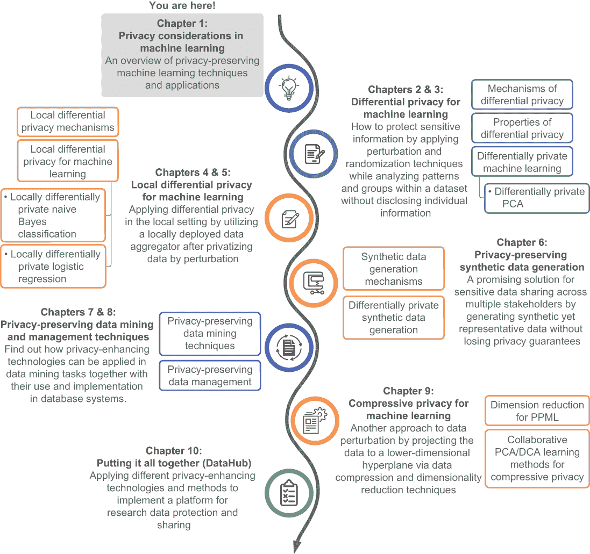

# 1 机器学习中的隐私考虑

本章涵盖

+   在大数据人工智能时代隐私保护的重要性

+   机器学习中的隐私相关威胁、漏洞和攻击类型

+   可以在机器学习任务中利用的技术，以最小化或规避隐私风险和攻击

我们的搜索查询、浏览历史、购买交易、观看视频和电影偏好是每天收集和存储的一些信息类型。人工智能的进步增加了利用和从收集的私人数据中获益的能力。

这种数据收集发生在我们的移动设备和计算机上，在街道上，甚至在我们的办公室和家中，这些数据被不同领域的各种机器学习（ML）应用使用，例如市场营销、保险、金融服务、移动性、社交网络和医疗保健。例如，越来越多的基于云的数据驱动 ML 应用正在由不同的服务提供商（可以归类为*数据用户*，如 Facebook、LinkedIn 和 Google）开发。这些应用中的大多数都利用从每个个人（*数据所有者*）收集的大量数据为用户提供有价值的服务。这些服务通常通过促进各种用户推荐、活动识别、健康监测、定向广告甚至选举预测，使用户获得一些商业或政治优势。然而，另一方面，相同的数据可能被重新用于推断敏感（私人）信息，这可能会危及个人的隐私。此外，随着机器学习即服务（MLaaS）的日益普及，其中基于云的 ML 和计算资源捆绑在一起，以提供高效的分析平台（如 Microsoft Azure Machine Learning Studio、AWS Machine Learning 和 Google Cloud Machine Learning Engine），在它们与敏感数据集一起使用之前，有必要采取措施来强制执行这些服务的隐私。

## 1.1 人工智能时代的隐私问题

让我们先来看一个真实世界的私人数据泄露的例子，以便可视化这个问题。在 2018 年 4 月的 Facebook-Cambridge Analytica 丑闻中，大约 8700 万 Facebook 用户的资料被一个 Facebook 测验应用（一个基于云的数据驱动应用）收集，然后与从这些用户的社交媒体资料中获取的信息（包括他们的性别、年龄、关系状况、位置和“点赞”）配对，除了匿名化之外，没有采取任何保护隐私的操作。这是怎么发生的？

这个名为“这是你的数字生活”的测验最初由剑桥大学的俄罗斯心理学教授亚历山大·科甘创建。这个测验旨在收集个性信息，大约有 27 万人为此获得了报酬。然而，除了测验旨在收集的信息之外，它还从参与者的朋友资料中提取了数据，形成了一个庞大的数据集。后来，科甘与剑桥分析公司达成商业合作，剑桥分析公司从这些数据集中提取了个人信息，例如用户的居住地和他们喜欢的页面，最终帮助剑桥分析公司构建心理档案，并推断出每个个体的某些敏感信息，如图 1.1 所示。

图 1.1 Facebook-Cambridge Analytica 丑闻引起了人们对隐私问题的警觉。

那只是一个事件！2020 年，在另一起隐私丑闻之后，Facebook 同意支付 5.5 亿美元来解决因公司使用基于机器学习的面部识别技术而引发的集体诉讼。这再次引发了人们对社交网络数据挖掘实践的质疑。诉讼称，该公司未经用户同意，也未告知他们数据将保留多长时间，就收集了该州数百万用户的照片中的面部数据，用于标签建议，违反了伊利诺伊州的生物识别隐私法。最终，Facebook 在隐私问题担忧之下禁用了标签建议功能。

这些前所未有的数据泄露丑闻引起了人们对基于云的数据驱动应用程序隐私问题的警觉。人们在提交任何数据到云服务之前开始三思而后行。因此，数据隐私已经成为学术界和技术公司比以往任何时候都更热门的话题，它们投入了巨大的努力来开发隐私保护技术，以防止私人数据泄露。例如，谷歌开发了随机可聚合隐私保护序数响应（RAPPOR）技术，这是一种从终端用户客户端软件中收集统计数据的众包技术。苹果也声称它首先在 iOS 11 中引入了其成熟的隐私技术，用于从 iPhone 用户那里收集表情符号偏好和使用分析统计数据。2021 年，谷歌通过替换第三方 cookies 并在广告公司如何与浏览器中使用的私人数据互动方面设置边界，将其隐私沙盒倡议引入 Chrome 网络浏览器。当人们使用互联网时，出版商和广告商希望提供与他们相关且有趣的内容，包括广告。人们的兴趣通常通过观察他们访问的网站或页面来衡量，依赖于第三方 cookies 或更不透明且不受欢迎的机制，如设备指纹识别。通过这一隐私沙盒倡议，谷歌引入了一种新的方式，通过将具有相似浏览模式的大量人群进行聚类，隐藏个体在人群中的身份，并保留他们在浏览器中的网络历史记录，而不使用第三方 cookies，来提供相关的内容和广告。

## 1.2 超出预期目的的学习威胁

机器学习可以被视为算法模仿智能人类行为的能力，通过从不同角度观察数据并跨领域分析数据来执行复杂任务。这一学习过程被我们日常生活中的各种应用所利用，从在线门户网站的产品推荐系统到互联网安全应用中的复杂入侵检测机制。

### 1.2.1 动态使用私人数据

机器学习应用需要从各种来源收集大量数据以产生高度可信的结果。网络搜索查询、浏览历史、在线购买交易历史、电影偏好以及个人位置签到是一些每天收集和存储的信息，通常在用户不知情的情况下进行。其中一些信息对个人来说是私密的，但它们通常以明文格式上传到高端集中式服务器，以便机器学习算法从中提取模式和构建机器学习模型。

问题不仅限于不同机器学习应用收集这些私有数据。由于信息对数据挖掘公司的员工是可用的，数据还可能受到内部攻击。例如，数据库管理员或应用程序开发者可能在没有太多限制的情况下访问这些数据。这些数据还可能受到外部黑客攻击，私人信息可能泄露给外界。例如，2015 年，Twitter 解雇了一名工程师，因为情报官员发现他可能通过访问用户详情（如电话号码和 IP 地址）来监视沙特异议人士的账户。据《纽约时报》报道，这些账户属于安全和隐私研究人员、监控专家、政策学者和记者。这一事件是另一个例子，说明了问题的严重性。最重要的是，即使数据被转换为不同的嵌入（匿名化），或者数据集和机器学习模型不可访问，只透露测试结果，也可能从私有数据中提取更多信息。

### 1.2.2 机器学习算法内部如何处理数据

要了解数据隐私与机器学习算法之间的关系，了解机器学习系统如何处理它们处理的数据至关重要。通常，我们可以将机器学习算法的输入数据（从各种来源捕获）表示为一组样本值，每个样本可以是一组特征。以一个面部识别算法为例，该算法在人们上传图像到 Facebook 时识别人员。考虑一个 100 × 100 像素的图像，其中每个像素由 0 到 255 之间的单个值表示。这些像素可以连接起来形成一个特征向量。每个图像都可以表示为机器学习算法的数据向量，以及与该数据相关联的标签。在训练阶段，机器学习算法会使用多个特征向量和它们的相关标签来生成机器学习模型。然后，该模型将用于新鲜、未见的数据（测试样本）来预测结果——在这种情况下，识别一个人。

衡量机器学习模型的性能

机器学习模型准确预测最终结果的能力是衡量该模型如何将泛化到未见数据或首次引入的数据的程度。这种准确性通常通过经验方法进行衡量，并且会根据训练样本数量、构建模型所使用的算法、训练样本的质量以及为机器学习算法选择的超参数等因素而变化。在某些使用不同机制从原始数据中提取基本特征的应用中，在将原始数据输入到机器学习模型之前进行预处理同样重要。这些机制可能涉及各种技术（如主成分分析），以将数据投影到较低维度。

### 1.2.3 为什么在机器学习中保护隐私很重要

当个人信息被用于错误或不正当的目的时，它可以被操纵以获得竞争优势。当大量个人记录与机器学习算法相结合时，没有人能够预测它们可能会产生什么新的结果，或者这些结果可能会揭示多少私人信息。之前讨论过的 Facebook-Cambridge Analytica 丑闻就是个人数据被错误使用的完美例子。

因此，在设计应用于机器学习的算法时，确保隐私保护至关重要。首先，它确保其他方（数据使用者）不能利用个人数据为自己谋取利益。其次，每个人都有他们不想让别人知道的事情。例如，他们可能不希望别人知道他们医疗历史的细节。但机器学习应用是数据驱动的，我们需要训练样本来构建模型。我们希望使用私有数据来构建模型，但我们也希望防止机器学习算法学习到任何敏感信息。我们该如何做到这一点呢？

让我们考虑一个场景，在这个场景中我们使用了两个数据库：一个是列出患者用药历史的清洁医疗数据库，另一个是包含用户信息和访问过的药店的数据库。当这些来源被链接在一起时，相关的数据库可以拥有额外的知识，例如哪些患者从哪些药店购买了他们的药物。假设我们正在使用这个相关数据集与一个机器学习应用来提取患者、药物和药店之间的关系。虽然它将提取不同疾病和所开具药物之间的明显关系，但它也可能仅仅通过参考患者最常访问的药店的邮编，粗略地学习到患者的居住地，即使数据中不包含患者的地址。这是一个简单的例子，但你可以想象如果隐私没有得到保护，后果可能会多么严重。

### 1.2.4 监管要求与效用与隐私权衡

传统上，数据安全和隐私要求由数据所有者（如组织）设定，以保护他们提供的产品和服务的竞争优势。然而，在大数据时代，数据已成为数字经济中最有价值的资产，政府实施了众多隐私法规，以防止敏感信息被用于其预期目的之外。例如，像 1996 年的《健康保险可携带性和问责法案》（HIPAA）、《支付卡行业数据安全标准》（PCI DSS）、《家庭教育权利和隐私法案》（FERPA）以及欧盟的《通用数据保护条例》（GDPR）这样的隐私标准，是组织通常遵守的一些隐私法规。例如，无论实践规模大小，大多数医疗保健提供者都会通过电子方式传输健康信息，如索赔、药物记录、福利资格查询、转诊授权请求等。然而，HIPAA 法规要求这些医疗保健提供者在没有患者同意或知情的情况下，保护敏感的患者健康信息不被泄露。

无论数据是否标记，或原始数据是否预处理，机器学习模型本质上是基于训练数据集的非常复杂的统计模型，机器学习算法被优化以从数据中榨取每一丝效用。因此，在大多数情况下，它们能够学习数据集中的敏感属性，即使这不是预期的任务。当我们试图保护隐私时，我们希望防止这些算法学习敏感属性。因此，正如你所看到的，效用和隐私处于光谱的两端。当你加强隐私时，可能会影响效用的性能。

真正的挑战是在机器学习应用中平衡隐私和性能，以便我们更好地利用数据，同时确保个人的隐私。由于监管和特定应用的要求，我们不能仅仅为了提高应用的效用而降低隐私保护。另一方面，隐私必须系统地实施，而不使用任意机制，因为必须考虑许多额外的威胁。机器学习应用容易受到不同的隐私和安全攻击。我们将在下一节详细探讨这些潜在攻击，并探讨我们如何通过设计隐私保护机器学习（PPML）算法来减轻它们。

## 1.3 机器学习系统的威胁和攻击

我们在上一节讨论了一些隐私泄露事件，但文献中提出了许多其他针对机器学习系统的威胁和攻击，这些攻击可能被部署在实际场景中。例如，图 1.2 是一个显示机器学习系统威胁和攻击列表的时间线，包括去匿名化（重新识别）攻击、重建攻击、参数推断攻击、模型反演攻击和成员推断攻击。我们将简要探讨这些威胁或攻击的细节。

图 1.2 为机器学习系统识别的威胁和攻击的时间线

尽管一些领先的公司，如谷歌和苹果，开始设计和使用他们自己的用于机器学习任务的隐私保护方法，但提高公众对这些隐私技术的认识仍然是一个挑战，这主要是因为缺乏组织良好的教程和书籍，这些教程和书籍系统地解释了概念。

### 1.3.1 明文中的私有数据问题

图 1.3 说明了典型的客户端/服务器应用程序场景。如图所示，当应用程序收集私有信息时，该信息通常通过加密渠道传输，转移到云服务器上进行学习。在该图中，一个移动应用程序连接到云服务器以执行推理任务。

图 1.3 存储私有数据为明文格式的问题

例如，一个停车应用可能会将用户的位置数据发送以寻找附近的可用停车场。即使通信渠道是安全的，数据很可能会以原始未加密的形式或作为从原始记录中提取的特征存储在云中。这是对隐私的最大挑战之一，因为该数据容易受到各种内部和外部攻击。

### 1.3.2 重建攻击

正如你所看到的，在服务器上以加密形式存储私有数据是至关重要的，我们不应该以原始形式直接将原始数据发送到服务器。然而，重建攻击提出了另一个可能的威胁：攻击者甚至在没有访问服务器上完整原始数据集的情况下重建数据。在这种情况下，对手通过对外部特征向量（用于构建机器学习模型的数据）的了解而获得优势。

对手通常需要直接访问服务器上部署的机器学习模型，这被称为白盒访问（见表 1.1）。然后他们试图通过使用对模型中特征向量的了解来重建原始的私有数据。当在训练阶段用于构建机器学习模型的特征向量在模型构建后未从服务器清除时，这些攻击是可能的。

表 1.1 白盒、黑盒和灰盒访问的区别

| 白盒访问 | 黑盒访问 | 灰盒访问 |
| --- | --- | --- |
| 具有完全访问内部细节的 ML 模型，如参数和损失函数 | 没有访问内部细节的 ML 模型 | 具有部分访问内部细节的 ML 模型 |

重建工作原理：攻击者的视角

现在你已经对重建攻击的工作原理有了高级概述，让我们来看看它是如何可能的细节。重建数据的方法取决于攻击者可用以准确重现数据的背景知识（信息）。我们将考虑以下两个基于生物识别的认证系统的用例示例：

+   *指纹图像的细节点模板重建*——如今，基于指纹的认证在许多组织中都很普遍：用户通过将新获取的指纹图像与用户认证系统中已保存的指纹图像进行比较来进行认证。通常，这些指纹匹配系统使用四种不同的表示方案，称为*灰度*、*骨架*、*相位*和*细节点*（图 1.4）。基于细节点的表示法由于表示的紧凑性而被广泛采用。正因为这种紧凑性，许多人错误地认为细节点模板不包含足够的信息供攻击者重建原始指纹图像。

    2011 年，一个研究团队成功地演示了一种可以从细节点模板直接重建指纹图像的攻击[1]。他们从细节点重建了一个相位图像，然后将其转换为原始（灰度）图像。接下来，他们针对指纹识别系统发起攻击，以推断私人数据。

    

    图 1.4 指纹匹配系统中使用的四种不同表示方案：（a）灰度图像，（b）骨架图像，（c）相位图像和（d）细节点

+   *针对基于移动的连续认证系统的重建攻击*——Al-Rubaie 等人调查了使用基于移动的连续认证系统中用户认证配置文件的手势原始数据进行的重建攻击的可能性[2]。连续认证是一种在整个会话期间（如 iPhone 中的 Face ID）不断验证用户的方法，而不仅仅是验证一次。如果没有连续认证，组织更容易受到许多攻击向量的攻击，例如，当系统不再使用但会话仍然打开时，系统可能会被接管。在这种情况下，重建攻击可能会使用泄露给对手的可用私人信息。从高层次来看，Al-Rubaie 等人使用存储在用户配置文件中的特征向量来重建原始数据，然后使用这些信息来入侵其他系统。

在大多数这些情况下，隐私威胁源于对认证系统的安全威胁，重建的原始数据误导了机器学习系统，迫使它认为原始数据属于特定用户。例如，在基于移动的持续认证系统案例中，攻击者获得了对移动设备和其个人记录的访问权限；因此，认证机制未能保护用户的隐私。另一类重建攻击可能会直接揭示私人信息，正如你接下来将看到的。

涉及重建攻击的真实场景

在 2019 年，西蒙·加芬克尔及其在美国人口普查局的团队展示了一个详细的例子，说明了攻击者如何仅利用公开数据来启动重建攻击[3]。他们进一步解释说，发布按少数人口统计分组的人口频率计数、平均值和中位数年龄，允许任何拥有这些统计数据和个人电脑的人准确重建几乎整个调查人群的个人数据。这一事件引发了人们对人口普查数据隐私的关注。基于这一发现，美国人口普查局对 2010 年的人口普查数据进行了系列实验。在 800 亿条统计数据中，每人 25 个数据点允许成功重建超过 40%的美国人口的机密记录。

尽管这与机器学习算法没有直接关系，但你可能已经理解了这个问题有多么可怕。统计机构每年发布的庞大敏感数据量可能为决心攻击者提供足够的信息来重建某些或全部目标数据库，并侵犯数百万人的隐私。美国人口普查局已经识别了这一风险，并实施了正确的措施来保护 2020 年美国人口普查，但重要的是要注意，重建不再是一个理论上的危险。它是真实的。

现在的问题是，我们如何防止此类攻击成功？在减轻针对机器学习模型的重建攻击方面，最佳方法是避免在机器学习模型中存储显式特征向量。如果必须存储特征向量（例如，支持向量机需要存储特征向量和模型元数据），它们应该对机器学习模型的用户不可访问，以便难以重建。特征名称至少可以被匿名化。为了减轻针对数据库或数据挖掘操作（如美国人口普查案例）的重建攻击，可以使用不同的和已建立的数据净化和披露避免技术。

这场讨论只是对重建攻击工作原理的总结。我们将在接下来的章节中更详细地讨论这些技术和其他缓解策略。

### 1.3.3 模型反演攻击

虽然一些机器学习模型存储显式特征向量，但其他机器学习算法（如神经网络和岭回归）不保留模型内部的特征向量。在这些情况下，攻击者的知识有限，但他们可能仍然可以访问机器学习模型，正如在白盒访问场景中讨论的那样。

在另一种黑盒访问场景中，攻击者没有直接访问机器学习模型：当用户提交新的测试样本时，他们可以监听对机器学习模型的请求，以及模型生成的响应。在模型反演攻击中，攻击者以类似于创建机器学习模型时使用的原始特征向量方式利用机器学习模型生成的响应[4]。图 1.5 展示了模型反演攻击的工作原理。

图 1.5 白盒访问和黑盒访问的区别。白盒访问需要直接访问和权限来推断数据；黑盒访问通常涉及监听通信通道。

通常，此类攻击利用从机器学习模型收到的置信度值（如概率决策分数）来生成特征向量。例如，让我们考虑一个人脸识别算法。当你向算法提交人脸图像时，算法会根据它在图像中识别的特征生成一个包含类别和相应置信度分数的结果向量。现在，假设算法生成的结果向量是

[*John*:.99, *Simon*:.73, *Willey*:.65]

这个结果的意义是什么？算法有 99%的信心（决策分数）认为这张图像属于 John（类别），有 73%的信心认为它属于 Simon，等等。

如果攻击者可以监听所有这些通信呢？即使他们没有输入图像或不知道图像属于谁，他们也可以推断，如果输入一个相似的图像，他们将在这个范围内获得一个置信度分数。通过在一定时期内累积结果，攻击者可以生成代表机器学习模型中某个类别的平均分数。如果这个类别代表一个单独的个人，如在人脸识别算法中，识别这个类别可能导致隐私泄露的威胁。在攻击开始时，攻击者不知道这个人是谁，但随着时间的推移累积数据，他们将能够识别这个人，这是非常严重的。

因此，模型反演攻击对基于机器学习的系统构成了严重威胁。请注意，在某些情况下，模型反演攻击可以根据特征在原始数据中的排列方式被归类为重建攻击的一个子类。

在缓解模型反演攻击时，限制攻击者仅限于黑盒访问很重要，因为它限制了攻击者的知识。在我们的基于人脸识别的认证示例中，我们不是提供某个机器学习类别的确切置信度值，而是将其四舍五入。或者，我们可以只返回最终的预测类别标签，这样攻击者就难以学习到特定预测之外的信息。

### 1.3.4 成员推理攻击

与模型反演攻击不试图从训练数据集中重现实际样本不同，成员推理攻击试图根据机器学习模型的输出推断一个样本，以确定它是否在原始训练数据集中。成员推理攻击背后的想法是，给定一个机器学习模型、一个样本和领域知识，攻击者可以确定该样本是否是构建机器学习模型所使用的训练数据集的成员，如图 1.6 所示。

图 1.6 成员推理攻击的工作原理

让我们通过分析输入的医疗信息和条件来考虑一个基于机器学习的疾病诊断系统。例如，假设一位患者参与了一项研究，该研究诊断了一个旨在识别患有阿尔茨海默病的复杂游戏的正确难度级别。如果攻击者成功执行了成员推理，他们将知道这位患者是否在构建模型所使用的原始数据集中。不仅如此，通过了解游戏的难度级别，攻击者可以推断出这位患者是否患有阿尔茨海默病。这种情况描述的是一种严重的信息泄露，这些信息可能后来被用于针对患者的针对性行动。

如何进行成员推理

在这种攻击中，攻击者的意图是了解个人的个人记录是否被用于训练原始机器学习模型。为此，攻击者首先通过利用模型的领域知识生成一个二级攻击模型。通常，这些攻击模型是使用基于实际数据噪声版本、从模型反演攻击中提取的数据或基于统计的综合生成的影子模型进行训练的。为了训练这些影子模型，攻击者需要黑盒或白盒访问原始机器学习模型和样本数据集。

通过这种方式，攻击者可以访问机器学习服务以及攻击模型。攻击者观察在训练阶段使用的机器学习模型预测产生的输出数据与训练集中未包含的数据之间的差异，如图 1.6 所示。成员推理尝试学习特定记录是否在训练数据集中，而不是数据集本身。

有几种缓解成员推理攻击的策略，例如正则化或预测值的粗略精度。我们将在第八章中讨论这些正则化策略。然而，仅将机器学习模型的输出限制为类别标签是降低威胁的最有效方法。此外，差分隐私（DP）是抵抗成员推理攻击的有效机制，我们将在第二章中讨论。

### 1.3.5 反匿名化或重新识别攻击

在将数据集发布给第三方用户之前对其进行匿名化是一种典型的保护用户隐私的方法。简单来说，匿名化通过删除或更改将个人与存储数据连接的标识符来保护私人或敏感信息。例如，您可以通过保留数据但保持来源匿名的数据匿名化过程来匿名化个人身份信息，如姓名、地址和社会安全号码。一些组织采用各种策略，只为公众使用发布其数据集的匿名版本（例如，公共选民数据库、Netflix 奖项数据集、AOL 搜索数据等）。例如，Netflix 通过邀请不同的参赛者进行数据挖掘并提出构建更好的电影推荐系统的算法，发布了一个包含 50 万 Netflix 订阅者的大型数据集，其中包含了匿名化的电影评分。

然而，即使数据被清除了标识符，攻击仍然可能通过反匿名化进行。反匿名化技术可以轻松地交叉引用公开可用的来源并揭示原始信息。在 2008 年，Narayanan 等人证明了即使在*k*匿名等数据匿名化技术下，也有可能推断出个人的私人信息[6]。在他们攻击场景中，他们利用互联网电影数据库（IMDb）作为背景知识来识别已知用户的 Netflix 记录，显然揭示了用户的政治偏好。因此，基于简单语法的匿名化不能可靠地保护数据隐私免受强大对手的攻击。我们需要依赖类似差分隐私的东西。我们将在第八章中更详细地讨论重新识别攻击。

### 1.3.6 大数据分析中隐私保护面临的挑战

除了针对机器学习模型和框架的特定威胁和攻击之外，在机器学习和隐私光谱的另一端也出现了一个隐私挑战。那就是，我们如何保护*静态数据*，例如在输入机器学习任务之前存储在数据库系统中的数据，以及*传输中的数据*，其中数据在底层机器学习框架的各个元素中流动？向更大、更互联的数据存储库的持续转变使得数据库系统和数据分析工具在保护数据免受隐私威胁方面变得更加困难。

数据库系统中一个显著的隐私威胁是将不同的数据库实例链接起来以探索个人的独特指纹。这种攻击可以归类为重识别攻击的一个子类，并且在数据库应用中通常是内部攻击。基于数据的形成和识别，这些攻击可以进一步分为两种类型：相关攻击和识别攻击。

相关攻击

相关攻击的最终目的是在数据库或一组数据库实例中找到两个或更多数据字段之间的关联，以创建独特且信息丰富的数据元组。正如您所知，在某些情况下，我们可以将来自外部数据源的主题知识引入识别过程。例如，让我们以一个列出用户信息以及药物处方历史的医疗记录数据库为例。考虑另一个包含用户信息以及访问过的药房的数据库。一旦这些来源被连接起来，相关的数据库可以包括一些额外的知识，例如哪些患者从哪些药房购买了药物。此外，如果足够智能地探索常去的药房，攻击者可能能够获得患者居住的大致估计。因此，最终的关联数据集可能比原始数据集包含更多关于每个用户的私人信息。

识别攻击

当相关攻击试图提取更多私人信息时，识别攻击试图通过链接数据库实例中的条目来识别目标个人。其想法是探索有关特定个人的更多个人信息以进行识别。我们可以将这种攻击视为对数据集中最具威胁的数据隐私攻击之一，因为它对个人的隐私影响更大。例如，假设雇主调查了其员工在医疗记录或药房客户数据库中的所有出现情况。这可能会揭示有关员工药物记录、医疗治疗和疾病的大量额外信息。因此，这种攻击对个人隐私构成了日益增长的威胁。

到目前为止，应该很清楚，我们需要在数据分析和应用机器学习中有复杂的机制来保护个人免受不同针对性攻击的隐私。使用多层数据匿名化和数据假名化技术使得在链接不同数据集的同时保护隐私成为可能，但通过分析数据记录来识别个人则具有挑战性。第七章和第八章对不同的隐私保护技术进行了全面评估，详细分析了它们如何在现代数据驱动应用中使用，并展示了如何在 Python 中实现它们。

## 1.4 在从数据中学习的同时保护隐私：隐私保护机器学习

许多增强隐私的技术集中在允许多个输入方协作训练机器学习模型，同时不泄露原始形式的私有数据。这种协作可以通过使用加密方法（例如，安全多方计算）或差分隐私数据发布（扰动技术）来实现。差分隐私在防止成员推理攻击方面特别有效。最后，正如之前讨论的，通过限制模型的预测输出（例如，仅限类别标签）可以降低模型反演和成员推理攻击的成功率。

本节从高层次介绍了几种增强隐私的技术，以使您对它们的工作原理有一个一般性的了解。这些技术包括差分隐私、局部差分隐私（LDP）、隐私保护合成数据生成、隐私保护数据挖掘技术以及压缩隐私。这些内容将在本书的后续章节中进一步展开。

### 1.4.1 差分隐私的使用

数据爆炸导致个人和实体（如个人图像、财务记录、人口普查数据等）持有的数据量大幅增加。然而，当这些数据离开数据所有者的控制并用于某些计算时，就会引发隐私担忧。AOL 搜索引擎日志攻击[7]和 Netflix 奖项竞赛攻击[8]证明了这种威胁的存在，并强调了具有隐私意识机器学习算法的重要性。

差分隐私（DP）是提供数据隐私保护的一个有希望的解决方案。它试图保护个体的敏感信息，防止针对个体统计数据或聚合数据的任何推理攻击。在许多情况下，仅发布数据集中多个人群的统计数据或聚合数据并不一定能确保隐私保护。让我们考虑一个简单的零售用例，忠诚度卡场景。假设我们有两组聚合统计数据：特定一天所有顾客的总消费额以及其中一部分——当天使用忠诚度卡的顾客的总消费额。假设恰好有一位顾客没有使用忠诚度卡进行购买。在这种情况下，通过简单地比较这两组统计数据之间的差异，某人可以很容易地推断出这位顾客的总消费额，仅基于这些聚合统计数据。

DP（差分隐私）基于这样一个理念：统计数据或聚合数据（包括机器学习模型）不应揭示个体是否出现在原始数据集中（机器学习模型的训练数据）。例如，给定两个相同的数据库，一个包含个体的信息，另一个则没有，DP 确保在第一个或第二个数据库上生成特定统计数据或聚合值的概率几乎相同。

更具体地说，考虑一个可信的数据管理员，他从多个数据所有者那里收集数据并对数据进行计算，例如计算平均值或找到最大值或最小值。为了确保没有人可以从计算结果中可靠地推断出任何单个样本，DP 要求管理员向结果添加随机噪声，使得如果任何底层数据样本发生变化，发布的数据将不会改变。由于没有单个样本可以显著影响分布，对手无法自信地推断出与任何单个样本对应的信息。因此，如果数据的计算结果是针对任何单个样本变化的鲁棒的，那么该机制就是差分隐私的。

由于其底层机制，差分隐私技术通过向输入数据、特定机器学习算法的迭代或算法输出中添加随机噪声来抵抗成员推断攻击。在第二章和第三章中，我们将详细分析我们如何在隐私保护机器学习（PPML）应用中采用差分隐私。

### 1.4.2 本地差分隐私

当输入方没有足够的信息来训练一个机器学习模型时，利用依赖于本地差分隐私（LDP）的方法可能更好。例如，多个癌症研究机构希望构建一个机器学习模型来诊断皮肤病变，但没有一个机构拥有足够的数据来训练模型。LDP 是他们可以用来在不侵犯个人隐私的情况下协作训练机器学习模型的一种解决方案。

在 LDP 中，个人在通过扰动对数据进行隐私化处理后，将他们的数据发送给数据聚合器。因此，这些技术为个人提供了合理的否认可能性（对手无法证明原始数据存在）。数据聚合器收集所有扰动值并估计诸如人口中每个值的频率等统计数据。与 DP 相比，LDP 将扰动从中心站点转移到本地数据所有者。它考虑了一个没有可信第三方且不可信的数据管理员需要从数据所有者那里收集数据并执行某些计算的场景。数据所有者仍然愿意贡献他们的数据，但数据的隐私必须得到强制执行。

本地隐私的一个古老且广为人知的版本是随机响应（RR），它为受访者对敏感查询提供了合理的否认可能性。例如，受访者抛一枚公平的硬币：

1.  如果是反面，受访者将如实回答。

1.  如果是正面，他们将抛第二枚硬币，如果正面则回答“是”，如果反面则回答“否”。

一个面向机器学习的工作，AnonML，利用了 RR 的思想从多个输入方生成直方图[9]。AnonML 使用这些直方图来创建用于训练机器学习模型的合成数据。与其他 LDP 方法一样，当没有输入方有足够的数据自己构建机器学习模型（且没有可信的聚合器）时，AnonML 是一个不错的选择。在第四章和第五章中，我们将详细分析 LDP 与差分隐私的不同之处以及它在不同的机器学习应用中的使用方法。

### 1.4.3 隐私保护合成数据生成

尽管已经提出了许多用于各种机器学习算法的隐私保护技术，但有时数据用户可能想要执行新的机器学习算法和分析程序。当没有预定义的算法用于请求的操作时，数据用户可能要求使用数据本地化。为此，过去已经提出了不同的隐私保护数据共享技术，如*k*-匿名、*l*-多样性、*t*-接近性和数据扰动。这些技术可以被微调，从同一原始数据集中生成一个新的匿名化数据集。然而，在某些情况下，仅匿名化可能会损害底层机器学习算法的效用。因此，数据共享的一个有希望的解决方案是生成既合成又具有代表性的数据，可以安全地与他人共享。

合成数据是通过人工生成而非通过高级别现实世界事件产生的。它通常是通过算法生成的，并且经常被用作训练和测试机器学习模型的替代品。然而，在实践中，以与原始数据集相同的格式（保留相同的统计特征）共享合成数据集，为数据用户提供更大的灵活性，同时隐私担忧最小化。

不同的研究在不同的维度上调查了隐私保护合成数据生成。例如，*合理否认*是这样一个方法，在生成合成数据后进行隐私测试。在 2012 年，Hardt 等人提出了一种结合乘性权重方法和差分隐私数据发布指数机制的算法[10]。另一方面，Bindschaedler 等人提出了一种生成模型，这是一种基于相关特征选择的概率模型，它捕捉了特征联合分布[11]。在 2017 年，Domingo-Ferrer 等人提出了一种基于微聚合的差分隐私数据发布方法，它基于*k*-匿名减少了差分隐私所需的噪声[12]。总的来说，隐私保护合成数据生成在机器学习社区中越来越受欢迎。

使用合成数据的好处，例如在使用敏感数据时减少约束以及能够针对某些无法通过真实数据获得的特定条件定制数据的能力，已经在许多现实世界的实际应用案例中引起了关注。在第六章中，我们将介绍用于合成数据生成的不同机制，目标是实现隐私保护机器学习。

### 1.4.4 隐私保护数据挖掘技术

到目前为止，在本章中，我们已经探讨了针对机器学习算法的不同隐私保护方法。现在，让我们专注于在执行数据挖掘操作时保护隐私。对机器学习算法、存储和敏感信息流动的进步不断增长的兴趣引发了重大的隐私问题。因此，在过去十年中，已经提出了不同的处理和发布敏感数据的方法。

在隐私保护数据挖掘（PPDM）技术中，绝大多数依赖于修改数据或删除部分原始内容以保护隐私。这种净化或转换导致的质量下降是数据质量与隐私水平之间的权衡。尽管如此，所有这些 PPDM 技术背后的基本思想是在保护个人隐私的同时高效地挖掘数据。根据数据收集、发布和处理的各个阶段，处理 PPDM 的技术可以分为三个主要类别。让我们简要地看看这些方法。

隐私保护数据收集技术

第一类 PPDM 技术确保在数据收集阶段保护隐私。它通常在数据收集阶段结合不同的随机化技术，生成私有化值，因此原始值从未被存储。最常用的随机化方法是通过添加已知分布的噪声来修改数据。每当涉及数据挖掘算法时，可以重现原始数据分布，但不是个别值。加性和乘性噪声方法是这一类别中最常见的两种数据随机化技术。

数据发布和处理的不同方法

PPDM 的第二类技术处理的是当数据被发布给第三方（公开）而未披露敏感信息所有权的情况。仅从数据集中移除可以明确识别个人的属性是不够的，因为用户可能仍然可以通过组合非敏感属性或记录来被识别。例如，考虑一个来自医院的病人记录数据集。在发布之前，我们可以从这个数据集中移除可识别的属性，如姓名和地址，但如果有人知道一个病人的年龄、性别和邮政编码，他们可能能够结合这些信息来追踪数据集中的特定病人记录，即使没有访问到姓名属性。

因此，PPDM 技术通常包含一个或多个数据清洗操作，例如泛化、抑制、解剖和扰动。基于这些清洗操作，可以提出一系列隐私模型，这些模型现在广泛应用于不同的应用领域以实现隐私保护。我们将在第七章中讨论这些技术和隐私模型。

保护数据挖掘算法输出的隐私

即使只有对原始数据集的隐式访问，数据挖掘算法的输出也可能揭示底层数据集的隐私信息。一个活跃的攻击者可能访问这些算法并查询数据以推断一些隐私信息。因此，已经提出了不同的技术来保护数据挖掘算法输出的隐私：

+   *关联规则隐藏*——在数据挖掘中，关联规则挖掘是一种基于规则的流行数据挖掘方法，用于发现数据集中不同变量之间的关系。然而，这些规则有时可能会泄露个人的隐私或敏感信息。关联规则隐藏的想法是仅挖掘非敏感规则，确保不会发现任何敏感规则。最直接的方法是对条目进行扰动，使得所有敏感但非敏感的规则都被隐藏。

+   *降低分类器有效性*——正如我们在成员推理攻击的上下文中讨论的那样，分类器应用可能会泄露信息，使得攻击者可以确定特定记录是否在训练数据集中。回到我们用于诊断疾病的 ML 服务示例，攻击者可以设计攻击来学习特定个人的记录是否被用于训练 ML 模型。在这种情况下，降低分类器的准确性是保护隐私的一种方法。

+   *查询审计和限制*——在某些应用中，用户可以查询原始数据集，但具有有限的查询功能，例如聚合查询（SUM、AVERAGE 等）。然而，攻击者仍然可以通过查看查询序列及其对应的结果来推断一些隐私信息。查询审计通常用于此类场景的隐私保护，通过扰动查询结果或拒绝查询序列中的一或多个查询来实现。然而，这种方法计算复杂度远高于其他方法。

这只是一个关于 PPDM 工作原理的概述。在第七章和第八章中，我们将详细分析 PPDM 技术，以及数据库系统中的隐私增强数据管理技术。

### 1.4.5 压缩隐私

压缩隐私通过压缩和降维技术将数据投影到低维超平面来扰动数据。这些转换技术中的大多数都是有损的。刘等人建议，压缩隐私将加强敏感数据的隐私保护，因为从转换版本（即压缩或降维数据）中恢复精确的原始数据是不可能的 [13]。

在图 1.7 中，x^i 是原始数据，而是对应的转换数据——x^i 在维度 U¹上的投影。我们知道可以被映射回与 U¹垂直的无限多个点。换句话说，可能的解是无限的，因为方程的数量少于未知数的数量。因此，刘等人提出了应用随机矩阵来降低输入数据的维度。由于随机矩阵可能会降低效用，其他方法使用了无监督和监督的降维技术，如主成分分析、判别成分分析和多维尺度。这些技术试图找到最佳投影矩阵以实现效用目的，同时依靠降低的维度来增强隐私。

图 1.7 压缩隐私通过将数据投影到低维超平面来工作。

定义：什么是低维超平面？一般来说，超平面是其原始空间维度少一的子空间。例如，在图 1.7 中，原始环境空间是二维的；因此，其超平面是一维线，如图所示。

压缩隐私保证原始数据永远无法完全恢复。然而，我们仍然可以从降低的维度中获得原始数据的近似值。因此，一些方法，如江等人[14]，将压缩隐私技术（降维）与差分隐私技术相结合，以发布差分隐私数据。

尽管某些实体可能试图完全隐藏他们的数据，压缩隐私对隐私还有另一个好处。对于具有两个标签的样本集——效用标签和隐私标签——Kung [15] 提出了一种降维方法，允许数据所有者以最大化学习效用标签的准确性的方式投影他们的数据，同时降低学习隐私标签的准确性。尽管这种方法不能消除所有数据隐私风险，但它控制了当隐私目标已知时数据的滥用。第九章将介绍压缩隐私的不同方法和应用。

## 1.5 这本书是如何结构的？

本书接下来的章节结构如下。第二章和第三章将讨论如何利用差分隐私（DP）在 PPML 中，包括不同的用例场景和应用。如果你对了解如何在实际应用中使用 DP，以及一系列真实世界示例感兴趣，这些章节将为你提供所需的内容。

在第四章和第五章中，我们将介绍在本地设置中应用差分隐私的方法和应用程序，并增加一个限制条件，即使对手能够访问个别响应，他们仍然无法了解超出这些响应之外的信息。

第六章将研究合成数据生成技术如何在 PPML 范式中使用。正如我们之前讨论的，合成数据生成在 ML 社区中越来越受欢迎，尤其是在作为训练和测试 ML 模型的替代品。如果你对寻找生成合成数据的方法和手段以实现 PPML 感兴趣，这是你的章节。

在第七章和第八章中，我们将探讨隐私增强技术如何在数据挖掘任务中应用，以及如何在数据库系统中使用和实现。我们知道，最终，所有东西都必须存储在某个地方的数据库中，无论是关系型、NoSQL 还是 NewSQL 数据模型。如果这些数据库或数据挖掘应用在访问或发布数据时容易受到隐私攻击，怎么办？这两章将调查不同的技术、方法和成熟的行业实践，以减轻这种隐私泄露。

接下来，我们将探讨另一种可能的 PPML 方法，即通过将数据投影到另一个超平面来压缩或降低数据的维度。为此，在第九章中，我们将讨论不同的压缩隐私方法及其应用。如果你正在设计或开发针对压缩数据的受限环境的隐私应用，我们建议你在这章上投入更多时间。我们将使用数据压缩技术的实际例子来实现不同应用场景的隐私保护。

最后，在第十章中，我们将把所有内容整合起来，通过强调设计挑战和实施考虑，设计一个用于研究数据保护和共享的平台。

## 摘要

+   在重建攻击中，对手通过对外部知识（特征向量或用于构建 ML 模型的数据）的了解获得优势。

+   重建攻击通常需要直接访问服务器上部署的 ML 模型；我们称之为白盒访问。

+   有时，对手可以监听 ML 模型的新测试样本提交时的传入请求以及模型为给定样本生成的响应。这可能导致模型反演攻击。

+   成员推理攻击是模型反演攻击的扩展版本，其中对手试图根据机器学习模型的输出推断样本，以确定该样本是否在训练数据集中。

+   即使数据集被匿名化，确保系统可靠地保护数据隐私仍然具有挑战性，因为攻击者可以利用背景知识通过去匿名化或重新识别攻击来推断数据。

+   将不同的数据库实例链接起来以探索个人的独特指纹，对数据库系统来说是一个重大的隐私威胁。

+   差分隐私（DP）通过添加随机噪声来尝试保护敏感信息，防止针对个人统计数据或聚合数据的推理攻击。

+   本地差分隐私（LDP）是 DP 的本地设置，其中个人在通过扰动对数据进行隐私化处理后，将数据发送给数据聚合器，从而提供合理的否认可能性。

+   压缩隐私通过压缩和降维技术将数据投影到低维超平面，从而扰动数据。

+   生成合成数据是数据共享的一个有希望的解决方案，它以与原始数据相同的格式生成和共享合成数据集，这为数据用户如何使用数据提供了更大的灵活性，同时无需担心基于查询的隐私预算。

+   隐私保护数据挖掘（PPDM）可以通过不同的技术实现，这些技术可以分为三个主要类别：数据收集、数据发布和修改数据挖掘输出的隐私保护方法。
