# 2 机器学习的差分隐私

本章节涵盖

+   差分隐私是什么

+   在算法和应用中使用差分隐私机制

+   实现差分隐私的性质

在上一章中，我们探讨了机器学习（ML）中各种与隐私相关的威胁和漏洞以及隐私增强技术的概念。从现在开始，我们将关注一些基本且流行的隐私增强技术的细节。在本章和下一章中，我们将讨论的是*差分隐私*（DP）。

差分隐私是目前在应用中使用的最受欢迎且最有影响力的隐私保护方案之一。它基于使数据集足够健壮的概念，以至于数据集中任何单个替换都不会泄露任何私人信息。这通常是通过计算数据集中组别的模式来实现的，我们称之为*复杂统计学*，同时保留数据集中个人的信息。

例如，我们可以将一个机器学习模型视为描述其训练数据分布的复杂统计学描述。因此，差分隐私使我们能够量化算法在其操作的（私有）数据集上提供的隐私保护程度。在本章中，我们将探讨差分隐私是什么以及它如何在实际应用中得到广泛采用。你还将了解其各种基本性质。

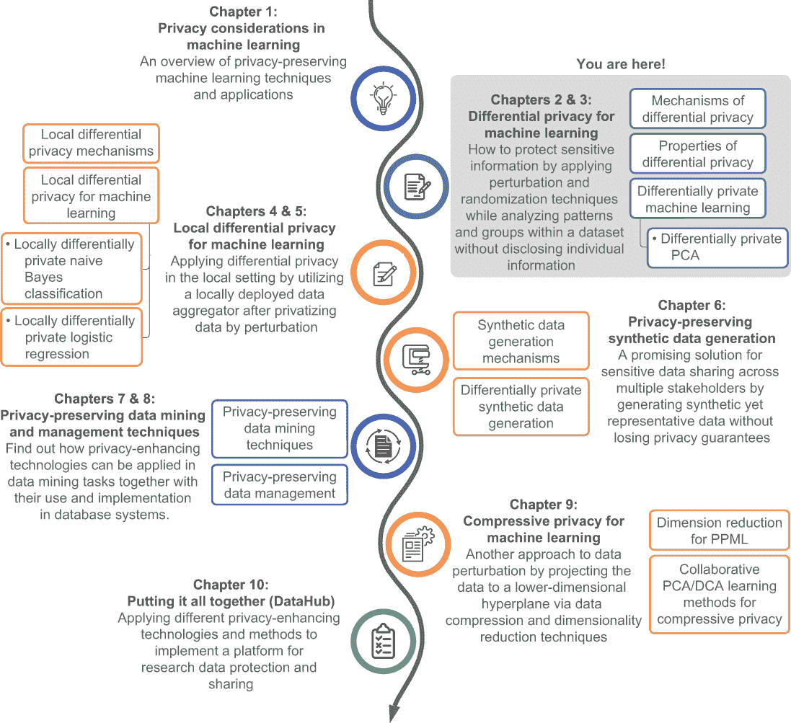

## 2.1 什么是差分隐私？

许多现代应用生成了一堆属于不同个人和组织的个人数据，当这些数据离开数据所有者的控制时，会引发严重的隐私担忧。例如，AOL 搜索引擎日志数据泄露[1]和 Netflix 推荐竞赛隐私诉讼[2]展示了威胁以及对于机器学习算法严格隐私增强技术的需求。为了应对这些挑战，差分隐私（DP）作为一种有前景的隐私增强技术已经发展起来，它提供了一个严格的隐私定义[3]，[4]。

### 2.1.1 差分隐私的概念

在介绍差分隐私的定义之前，让我们来看一个例子，如图 2.1 所示。

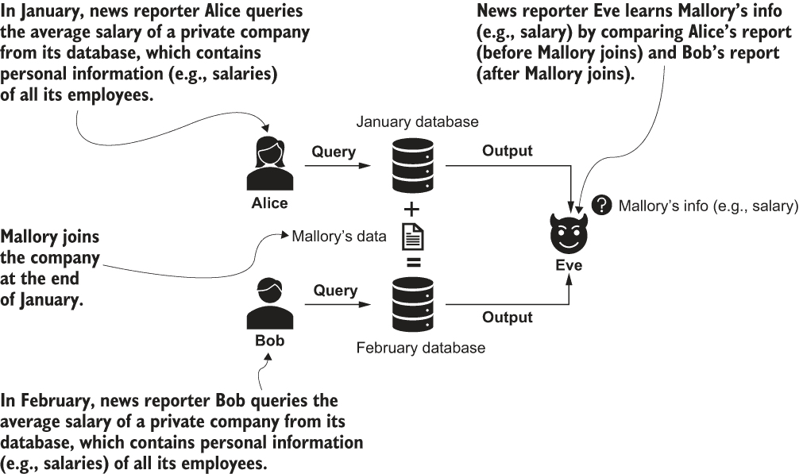

图 2.1 个人信息泄露问题

假设 Alice 和 Bob 是来自不同新闻机构的新闻记者，他们想要报道一家私营公司的平均薪水。这家公司有一个包含所有员工个人信息（如职位、工资和联系方式）的数据库。由于数据库包含受隐私关注的数据，直接访问数据库受到限制。Alice 和 Bob 被要求通过接受保密培训和签署数据使用协议（禁止使用和披露从数据库中获得的个人信息的用途和披露）来证明他们计划遵循公司处理个人数据的协议。公司授予 Alice 和 Bob 访问查询公司数据库中某些汇总统计数据的权限，包括员工总数和平均薪水，但不能访问任何个人信息，如姓名或年龄。

2020 年 1 月，Alice 基于从数据库中获得的信息撰写了一篇文章，报道称该私营公司有 100 名员工，平均薪水为 55,000 美元。2020 年 2 月，Bob 基于他从同一数据库中获得的信息撰写了一篇文章，报道称该私营公司有 101 名员工，平均薪水为 56,000 美元。唯一的区别是 Alice 在 1 月访问了数据库，而 Bob 在 2 月访问了数据库。

Eve 是一家第三家新闻机构的新闻记者。在阅读了 Alice 和 Bob 的文章后，Eve 得出结论，认为在 1 月到 2 月之间公司新加入了一名员工，他们的薪水是 156,000 美元（即 $56,000 × 101 − $55,000 × 100）。Eve 匿名地采访了公司的员工，有人告诉 Eve Mallory 在那个时期加入了公司。随后，Eve 写了一篇报道，称 Mallory 加入了一家私营公司，年薪为 156,000 美元，这比公司的平均薪水要高得多。

Mallory 的私人信息（她的薪水）已经泄露，因此她向相关当局投诉，并计划起诉该公司和记者。然而，Alice 和 Bob 并没有违反政策——他们只是报道了汇总信息，这些信息不包含任何个人信息。

这个例子说明了典型的隐私泄露场景。即使研究、分析或计算只从数据集中发布汇总统计信息，这些信息仍然可以导致关于个人的有意义的但敏感的结论。我们如何以简单但严谨的方式处理这些问题？这就是差分隐私的用武之地。

差分隐私量化了算法从对底层数据集的计算中泄露的信息，在隐私研究领域引起了广泛关注。让我们考虑图 2.2 中的例子。在差分隐私的一般设置中，一个受信任的数据管理员从多个数据所有者那里收集数据以形成一个数据集。在我们之前的例子中，私有公司是数据管理员，数据所有者是该公司的员工。差分隐私的目标是对收集到的数据集进行某些计算或分析，例如找到平均值（例如，平均工资），以便数据用户可以访问这些信息，而不会泄露数据所有者的私人信息。

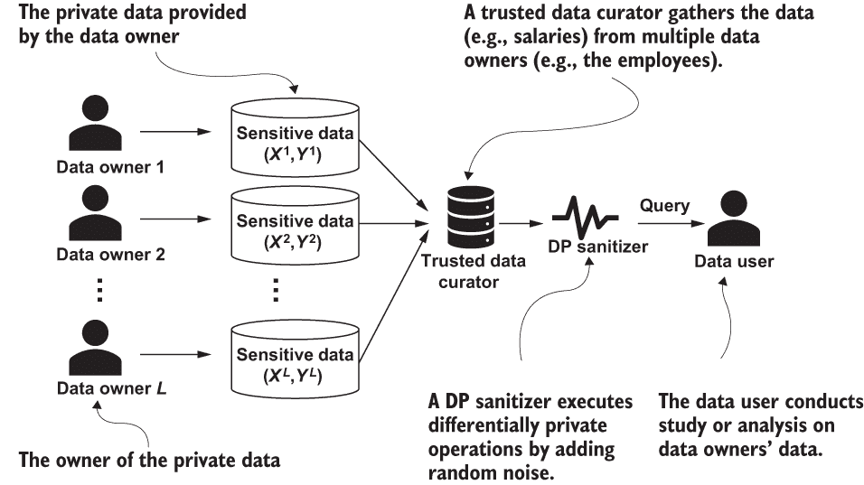

图 2.2 差分隐私框架

差分隐私的美丽之处在于，它旨在通过发布数据库或数据集的汇总或统计信息来加强隐私保护，而不透露该数据库中任何个人的存在。正如前一个例子中讨论的，我们可以认为一月份和二月份的数据库彼此相同，除了二月份的数据库包含 Mallory 的信息。差分隐私确保无论分析是在哪个数据库上进行的，得到相同汇总或统计信息或得出特定结论的概率都是相同的（如图 2.3 所示）。

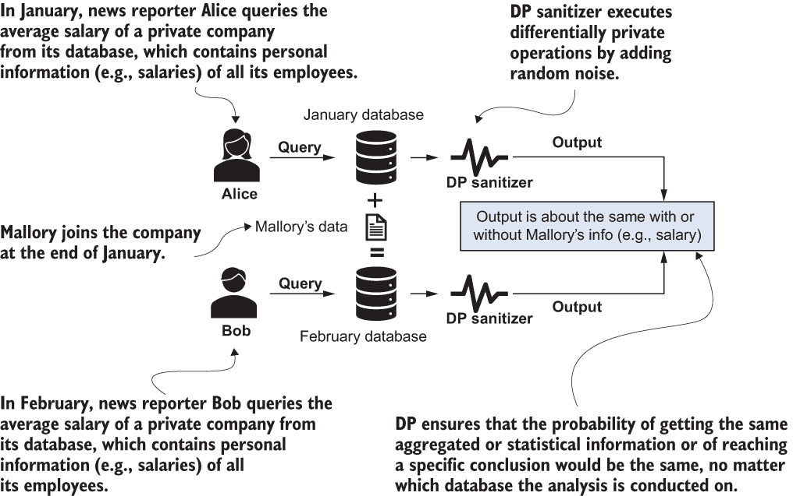

图 2.3 使用差分隐私保护个人数据

如果某个数据所有者的私人数据不会显著影响某些汇总统计信息的计算，数据所有者应该对在数据库中共享他们的数据不太担心，因为分析结果不会区分他们。简而言之，差分隐私是关于*差异*的——如果一个系统几乎不会因为你的数据是否在系统中而有所不同，那么这个系统就是差分隐私的。这就是我们在“差分隐私”这个术语中使用“差分”一词的原因。

到目前为止，我们只讨论了差分隐私的一般概念。接下来，我们将探讨差分隐私在现实场景中的工作方式。

### 2.1.2 差分隐私是如何工作的

如图 2.2 所示，数据管理员通过差分隐私净化器向计算结果添加随机噪声，使得即使底层数据中的个人信息发生变化，发布的结果也不会改变。由于没有单个个人的信息可以显著影响分布，对手无法自信地推断任何信息对应于任何个人。

让我们看看如果我们的例子中的私有公司在将查询结果（即员工总数和平均工资的总数）发送给新闻记者 Alice 和 Bob 之前添加了随机噪声（如图 2.3 所示）会发生什么。

在一月，爱丽丝会基于从数据库（一月访问）获得的信息撰写文章，报告称私人公司有 103 名员工（其中 100 是实际数字，3 是添加的噪声）和平均工资为 55,500 美元（其中 55,000 美元是真实值，$500 是添加的噪声）。

在二月，鲍勃会用同样的方式（但使用二月获取的数据）撰写文章，报告称这家私人公司有 99 名员工（其中 101 是实际数字，-2 是添加的噪声）和平均工资为 55,600 美元（其中 56,000 美元是真实值，-$400 是添加的噪声）。

员工数量和平均工资的噪声版本对新闻文章中出现的私人公司信息（员工数量约为 100，平均工资约为 55,000-56,000 美元）的影响不大。然而，这些结果将阻止伊芙得出结论，即一月份到二月份之间私人公司增加了一名新员工（因为 99 - 104 = -5），并确定他们的工资，从而降低莫利个人隐私信息泄露的风险。

这个例子展示了 DP 是如何通过在发布之前向汇总数据添加随机噪声来工作的。接下来要问的问题是，每个 DP 应用应该添加多少噪声？为了回答这个问题，我们将在 DP 应用中介绍*敏感性*和*隐私预算*的概念。

DP 应用的敏感性

DP 中的一个核心技术问题是在发布之前确定要添加到汇总数据中的随机噪声量。随机噪声不能来自任意随机变量。

如果随机噪声太小，它无法为每个个体的隐私信息提供足够的保护。例如，如果爱丽丝报告称公司有 100.1 名员工（即+0.1 噪声）和平均工资为 55,000.10 美元（即+$0.10 噪声），而鲍勃在二月报告称这家私人公司有 101.2 名员工（即+0.2 噪声）和平均工资为 55,999.90 美元（即-$0.10 噪声），那么伊芙仍然可以推断出可能有一名新员工加入了公司，他们的工资大约是 155,979.90 美元，这几乎与实际值 156,000.00 美元相同。

同样，如果随机噪声太大，发布的汇总数据将会失真且没有意义；它将无法提供任何效用。例如，如果爱丽丝报告称私人公司有 200 名员工（即+100 噪声）和平均工资为 65,000 美元（即+$10,000 噪声），而鲍勃报告称公司有 51 名员工（即-50 噪声）和平均工资为 50,000 美元（即-$6,000 噪声），几乎不会泄露任何员工的隐私信息，但报告不会提供关于真实情况的任何有意义的信息。

我们如何可能以一种有意义和科学的方式决定添加到聚合数据中的随机噪声的数量？粗略地说，如果你有一个需要从数据集中发布聚合数据的应用或分析，那么需要添加的随机噪声的数量应该与单个个体的私人信息（例如，数据库表中的一行）对聚合数据可能造成最大差异成比例。在差分隐私（DP）中，我们将“单个个体的私人信息可能造成的最大差异”称为 DP 应用的**敏感性**。敏感性通常衡量每个个体的信息对分析输出可能产生的最大影响。

例如，在我们的私人公司场景中，我们有两个要发布的聚合数据集：员工总数和平均工资。由于老员工离职或新员工加入公司最多只会对员工总数造成+1 或-1 的差异，其敏感性为 1。对于平均工资，由于不同工资的员工（具有不同的工资）离职或加入公司可能会对平均工资产生不同的影响，最大可能差异将来自具有最高可能工资的员工。因此，平均工资的敏感性应该与最高工资成比例。

对于任意应用，通常很难计算确切的敏感性，我们需要估计一些敏感性。我们将在第 2.2 节中讨论更复杂场景的数学定义和敏感性计算。

对于差分隐私（DP）来说，没有免费的午餐：dp 的隐私预算

正如你所看到的，确定在应用 DP 时添加的随机噪声的适当数量是至关重要的。随机噪声应该与应用的敏感性（均值估计、频率估计、回归、分类等）成比例。但“成比例”这个词是模糊的，可能指小比例或大比例。在确定添加的随机噪声数量时，我们还应该考虑什么其他因素？

让我们先回顾一下我们的私人公司场景，在这个场景中，随机噪声被添加到数据库的查询结果中（在 Mallory 加入公司之前和之后）。理想情况下，在应用 DP 时，平均工资的估计应该保持不变，无论像 Mallory 这样的员工是离开还是加入公司。然而，确保估计“完全相同”需要排除 Mallory 的信息来进行这项研究。然而，我们可以继续使用相同的论点，并排除公司数据库中每位员工的个人信息。但如果估计的平均工资不能依赖于任何员工的信息，那么它将没有太多意义。

为了避免这种困境，DP 要求分析结果的输出在有无 Mallory 信息的情况下都保持“大致相同”，而不是“完全相同”。换句话说，DP 允许在有无任何个人信息的分析输出之间存在轻微的偏差。这种允许的偏差被称为 DP 的*隐私预算*。如果你在包含或排除个人数据时可以容忍更大的允许偏差，那么你可以容忍更多的隐私泄露，因此你有更多的隐私预算可以花费。

希腊字母ϵ（epsilon）用于表示这种隐私预算，在量化允许偏差的程度时。隐私预算ϵ通常由数据所有者设置，以调整所需的隐私保护水平。较小的ϵ值会导致较小的允许偏差（更少的隐私预算），因此与更强的隐私保护但更低的效用准确性相关。在 DP 中没有免费的午餐。例如，我们可以将ϵ设置为 0，这允许零隐私预算并提供完美的隐私保护，即在 DP 的定义下没有隐私泄露。分析输出将始终相同，无论是否添加或删除了信息。然而，正如我们之前讨论的，这也需要忽略所有可用的信息，因此不会提供任何有意义的成果。如果我们把ϵ设置为 0.1，一个很小的数但大于零呢？有无任何个人信息的允许偏差将会很小，提供更强的隐私保护，并使数据用户（如新闻记者）能够了解一些有意义的成果。

在实践中，ϵ通常是一个很小的数。对于如均值或频率估计之类的统计分析任务，ϵ通常设置在 0.001 和 1.0 之间。对于机器学习或深度学习任务，ϵ通常设置在 0.1 和 10.0 之间。

为我们的私有公司场景制定 DP 解决方案

你可能现在对 DP（差分隐私）以及如何根据应用的敏感性和数据所有者的隐私预算推导随机噪声有一个大致的了解。让我们看看我们如何将这些技术应用到我们之前的私有公司示例中，从数学上进行阐述。

在图 2.4 中，私有公司的一月数据库（在 Mallory 加入公司之前）位于左侧，这是 Alice 查询的内容。右侧是私有公司二月的数据库（在 Mallory 加入公司之后），这是 Bob 查询的内容。我们想要推导出差分隐私解决方案，以便私有公司可以与公众（Alice 和 Bob）共享两个汇总值：员工总数和平均工资。

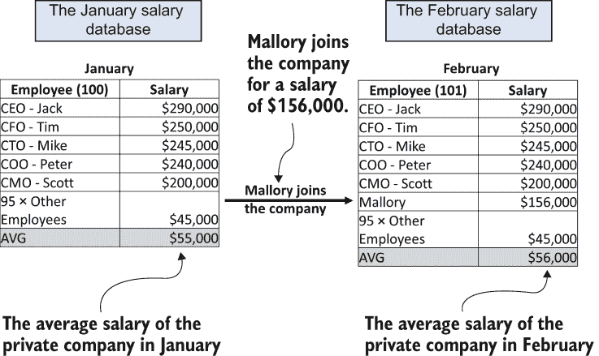

图 2.4 我们私有公司数据库的摘录

让我们从更容易的任务开始，发布员工总数。首先，我们将推导出敏感性。正如我们之前解释的，无论员工是离职还是加入公司，对员工总数的总影响都是 1，因此这个任务的敏感性是 1。其次，我们需要设计在发布之前添加到员工总数中的随机噪声。如前所述，噪声的量应该与敏感性正相关，与隐私预算负相关（因为更少的隐私预算意味着更强的隐私保护，因此需要更多的噪声）。随机噪声应该与△f/ϵ成正比，其中△f 是敏感性，ϵ是隐私预算。

在本例中，我们可以从零均值拉普拉斯分布中抽取我们的随机噪声，这是一种“双边”指数分布，如图 2.5 所示。

拉普拉斯分布

以尺度 b 为中心的拉普拉斯分布（通常我们使用μ = 0）由概率密度函数定义为

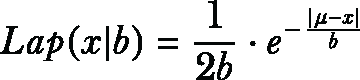

其中方差为σ² = 2b²。我们还可以将拉普拉斯分布视为指数分布的对称版本。

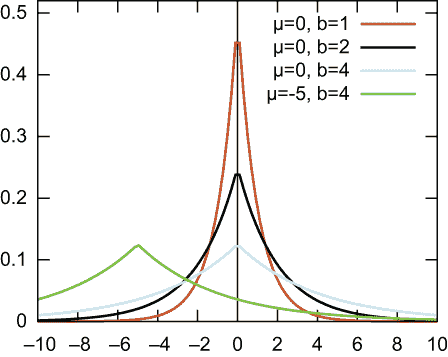

图 2.5 拉普拉斯分布

有了这个，我们可以计算出 b = △f/ϵ，并从拉普拉斯分布（x|△f/ϵ）中抽取随机噪声添加到员工总数中。图 2.6 展示了在应用不同的隐私预算（即ϵ）的情况下，1 月和 2 月发布的员工总数。根据差分隐私（DP）的定义，更好的隐私保护通常意味着 1 月和 2 月发布的员工人数更有可能接近。换句话说，结果有更低的概率向看到这两个发布值的人泄露 Mallory 的信息。效用性能通常指的是某些聚合数据或统计计算的准确性。在这种情况下，它指的是发布扰动值与其真实值之间的差异，差异越小意味着效用性能越好。对于任何数据匿名化算法，包括 DP，通常在隐私保护和效用性能之间有一个权衡。例如，当ϵ减小时，将添加更多的噪声，两个发布值之间的差异将更接近，从而提供更强的隐私保护。相反，指定较大的ϵ值可以提供更好的效用但较少的隐私保护。

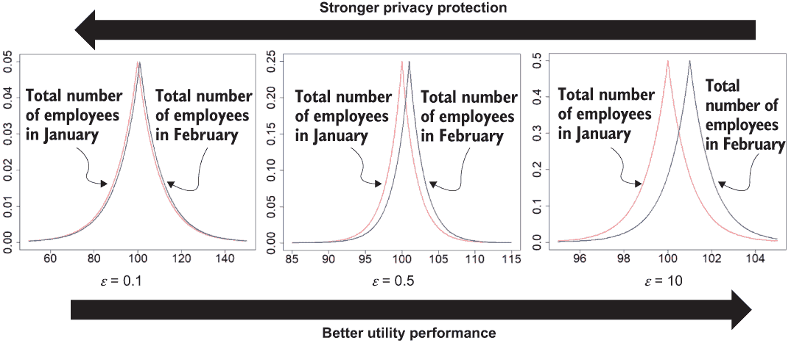

图 2.6 隐私与效用之间的权衡

现在，让我们考虑发布差异隐私平均工资的情况。无论任何个别员工是否离职或加入公司，最大的可能差异应来自可能最高工资的员工（在这种情况下是 CEO 杰克，他年薪 290,000 美元）。例如，在极端情况下，数据库中只有一名员工，而且恰好是 CEO 杰克，他有最高的可能工资，290,000 美元，他的离职将导致公司平均工资的最大可能差异。因此，敏感性应为 290,000 美元。现在我们可以遵循与总员工数相同的程序，添加从 Lap（x|△f/ϵ）抽取的随机噪声。

我们将在下一节中详细探讨从拉普拉斯分布中抽取随机噪声的应用。有关 DP 的数学和正式定义的更多信息，请参阅附录 A.1 节。

## 2.2 差分隐私机制

在上一节中，我们介绍了 DP 的定义和用法。在本节中，我们将讨论 DP 中最受欢迎的一些机制，这些机制也将成为我们将在本书中介绍的许多 DP ML 算法的构建块。您也可以将这些机制用于您自己的设计和开发。

我们将从一种古老但简单的 DP 机制——二进制机制（随机响应）开始。

### 2.2.1 二进制机制（随机响应）

二进制机制（随机响应）[5]是一种长期以来被社会科学家在社会科学研究中使用的方法（自 20 世纪 70 年代以来），它比 DP 公式的制定要早得多。尽管随机响应很简单，但它满足了 DP 机制的所有要求。

假设我们需要对 100 人进行调查，了解他们在过去 6 个月内是否使用过大麻。从每个人那里收集到的答案将是是或否，这被视为*二元响应*。我们可以将每个“是”答案赋予值 1，每个“否”答案赋予值 0。因此，我们可以通过计算 1 的数量来获得调查组中大麻使用率的百分比。

为了保护每个个体的隐私，我们可以在收集提交答案之前对每个真实答案应用少量噪声。当然，我们也希望添加的噪声不会改变最终的调查结果。为了设计一个差异隐私解决方案来收集调查数据，我们可以使用平衡硬币（即，p = 0.5）作为随机响应机制，其过程如下，并在图 2.7 中展示：

1.  抛一个公平的硬币。

1.  如果硬币正面朝上，提交的答案与真实答案相同（0 或 1）。

1.  如果硬币反面朝上，再抛一次公平的硬币，如果正面朝上则回答 1，如果反面朝上则回答 0。

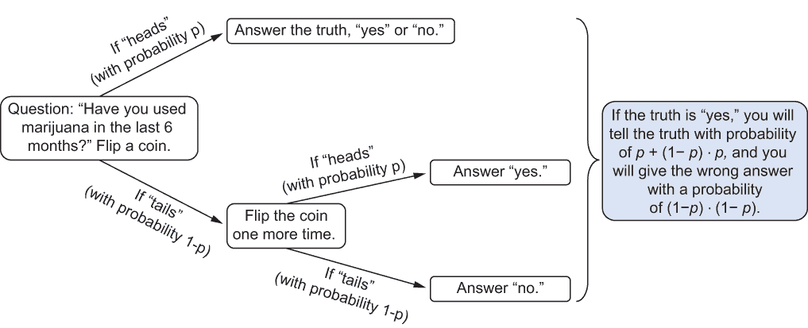

图 2.7 二进制机制（随机响应）的工作原理

该算法中的随机化来自两次抛硬币。这种随机化产生了关于真实答案的不确定性，这为隐私提供了来源。在这种情况下，每个数据所有者有 3/4 的概率提交真实答案，有 1/4 的机会提交错误答案。对于单个数据所有者，他们的隐私将得到保护，因为我们永远无法确定他们是否在说真话。但进行调查的数据用户仍然会得到期望的答案，因为预计有 3/4 的参与者会说出真相。

让我们回顾一下 ϵ-DP 的定义（更详细和正式的 DP 定义可以在 A.1 节找到）。假设我们有一个简单的随机响应机制，我们暂时将其称为 *M*。这个 *M* 对于每对相邻数据库或数据集 *x*、*y* 以及对于每个子集 *S* ⊆ *Range*(*M*)，都满足 ϵ-DP。

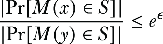

在我们的两个抛硬币的例子中，数据要么是 1 要么是 0，M 的输出也是要么是 1 要么是 0。因此，我们有以下结果：

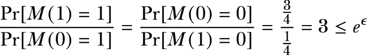

我们可以推断出我们的简单随机响应机制 M 满足 ln(3)-DP，其中 ln(3) 是隐私预算（ln(3) ≈ 1.099）。

随机响应的基本思想是，在回答一个二元问题时，一个人可以以更高的概率说出真相，以更低的概率给出错误答案。可以通过稍微提高说出真相的概率来维持效用，而隐私则通过随机化个人的回答在理论上得到保护。在先前的例子中，我们假设硬币是平衡的。如果我们使用一个不平衡的硬币，我们可以制定一个满足其他差分隐私预算的随机响应机制。

基于图 2.7 中的机制，假设硬币以概率 p 出现正面，以概率 (1 − p) 出现反面，其中 p > 1/2：

+   对于任意一个调查参与者，他们的答案将是 0 或 1，这取决于参与者是否以“否”或“是”的方式诚实地回答。

+   我们随机响应机制 M 的输出也可以是 0 或 1。

根据 DP 的定义，我们有

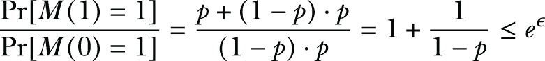

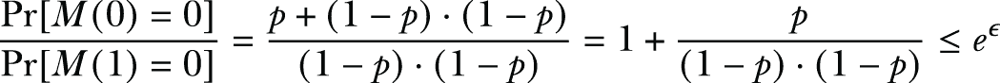

然后，我们有

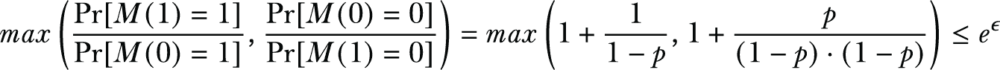

由于我们假设 p > 1/2，因此我们有

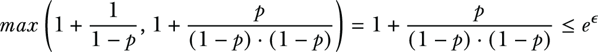

因此，使用不平衡硬币的隐私预算为


这就是计算随机响应机制隐私预算的一般公式。

现在我们尝试用伪代码来表述这个概念，其中 x 表示真实值，可以是 0 或 1：

```
def randomized_response_mechanism(x, p):
    if random() < p:
        return x
    elif random() < p:
        return 1
    else:
        return 0
```

让我们更仔细地看看我们二进制机制在不同 p 值（即硬币出现正面的概率）下的隐私预算。根据前面的分析，如果 p = 0.8，我们二进制机制的隐私预算将是 ln(1 + 0.8/(0.2 × 0.2))，即 ln(21)，大约是 3.04。我们可以将其与之前的 p = 0.5 的例子进行比较，其隐私预算是 ln(3) = 1.099。

如前所述，隐私预算可以被视为对隐私泄露容忍度的度量。在这个例子中，更高的 p 值意味着添加的噪声更少（因为它更有可能生成正确答案），导致更多的隐私泄露和更高的隐私预算。本质上，通过这个二进制机制，用户可以调整 p 值以适应他们自己的隐私预算。

### 2.2.2 拉普拉斯机制

在二进制机制中，隐私预算由抛硬币的概率决定。相比之下，拉普拉斯机制通过向目标查询或函数添加来自拉普拉斯分布的随机噪声来实现 DP [6]。我们已经在私有公司场景的解决方案中提到了拉普拉斯机制。在本节中，我们将更系统地介绍拉普拉斯机制，并通过一些例子进行说明。

让我们回到我们的私有公司场景。要设计一个使用拉普拉斯机制的不同隐私解决方案，我们只需用来自拉普拉斯分布的随机噪声扰动查询函数 f 的输出（例如，员工总数或平均工资），其尺度与查询函数 f 的敏感性相关（除以隐私预算 ϵ）。

根据拉普拉斯机制的设计，给定一个返回数值的查询函数 f(x)，以下扰动函数满足 ϵ-DP，

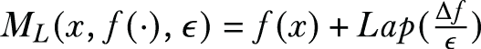

其中 △f 是查询函数 f(x) 的敏感性，Lap (△f/ϵ) 表示从以 0 为中心、尺度为 △f/ϵ 的拉普拉斯分布中抽取的随机噪声。

我们在上一个章节中建立了 *敏感性* 的概念，但让我们来回顾一下！直观地说，一个函数的敏感性提供了对其输出进行扰动以保护个体隐私的上限。例如，在我们之前的例子中，数据库包含所有员工的薪水，查询函数旨在计算所有员工的平均薪水，查询函数的敏感性应由数据库中的最高薪水（例如，CEO 的薪水）决定。这是因为特定员工的薪水越高，它对数据库中查询输出（即平均薪水）的影响就越大。如果我们能够保护最高薪水的员工的隐私，其他员工的隐私就得到了保障。这就是为什么在设计差分隐私算法时识别敏感性很重要的原因。

现在，让我们探索一些应用拉普拉斯机制的伪代码：

```
def laplace_mechanism(data, f, sensitivity, epsilon):
    return f(data) + laplace(0, sensitivity/epsilon)
```

DP 通常被设计和用于应用程序中以回答特定的查询。在我们深入探讨更多细节之前，让我们探索一些可能应用拉普拉斯机制的查询示例。

示例 1：差分隐私计数查询

计数查询是形式为“数据库中有多少元素满足给定的属性 P？”的查询。许多问题都可以被视为计数查询。让我们首先考虑一个未应用 DP 的关于人口普查数据的计数查询。

在下面的列表中，我们正在计算数据集中年龄超过 50 岁的个体数量。

列表 2.1 计数查询

```
import numpy as np
import matplotlib.pyplot as plt
ages_adult = np.loadtxt("https://archive.ics.uci.edu/ml/machine-learning-
➥ databases/adult/adult.data", usecols=0, delimiter=", ")

count = len([age for age in ages_adult if age > 50])      ❶
print(count)
```

❶ 人口普查数据集中有多少个体年龄超过 50 岁？

输出将为 6,460。

现在，让我们看看如何将 DP 应用到这种计数查询。要应用 DP 到这个查询，我们首先需要确定查询任务（查询超过 50 岁的个体数量）的敏感性。由于任何单个个体离开或加入人口普查数据集最多只能改变计数 1，因此这种计数查询任务的敏感性为 1。根据我们之前对拉普拉斯机制的描述，我们可以在发布之前向每个计数查询添加从拉普(1/ϵ)抽取的噪声，其中 ϵ 是数据所有者指定的隐私。我们可以通过使用 NumPy 的 random.laplace 来实现这种计数查询的 DP 版本，如下所示（使用 ϵ= 0.1，loc=0 作为中心）：

```
sensitivity = 1
epsilon = 0.1

count = len([i for i in ages_adult if i > 50]) + np.random.laplace
➥ (loc=0, scale=sensitivity/epsilon)

print(count)
```

输出为 6,472.024,453,709,334。如您所见，使用 ϵ= 0.1 时，差分隐私计数查询的结果仍然接近真实值 6,460。让我们尝试使用一个更小的 ϵ（这意味着将添加更多噪声），ϵ= 0.001：

```
sensitivity = 1
epsilon = 0.001

count = len([i for i in ages_adult if i > 50]) + np.random.laplace
➥ (loc=0, scale=sensitivity/epsilon)

print(count)
```

输出为 7,142.911,556,855,243。如您所见，当我们使用 ϵ= 0.001 时，结果与真实值（6,460）相比增加了更多噪声。

示例 2：差分隐私直方图查询

我们可以将直方图查询视为计数查询的一种特殊情况，其中数据被划分为不相交的单元格，查询询问每个单元格中有多少数据库元素。例如，假设一个数据用户想要查询人口普查数据中的年龄直方图。我们如何设计一个差分隐私直方图查询来研究年龄分布而不损害单个个体的隐私？

首先，让我们先探索在无 DP 的情况下对人口普查数据中年龄的直方图查询。

列表 2.2 无 DP 的直方图查询

```
import numpy as np
import matplotlib.pyplot as plt

ages_adult = np.loadtxt("https://archive.ics.uci.edu/ml/machine-learning-
➥ databases/adult/adult.data",
                        usecols=0, delimiter=", ")
hist, bins = np.histogram(ages_adult)
hist = hist / hist.sum()

plt.bar(bins[:-1], hist, width=(bins[1]-bins[0]) * 0.9)
plt.show()
```

我们将得到类似于图 2.8 的输出。

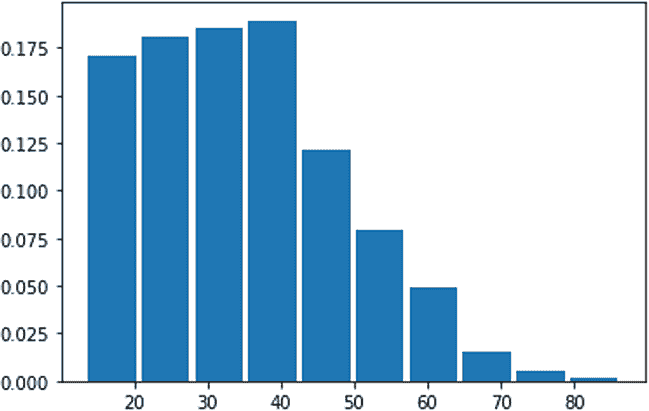

图 2.8 无 DP 的直方图查询输出

要应用 DP 于这个直方图查询，我们首先需要计算敏感性。由于直方图查询的敏感性为 1（添加或删除单个个体的信息最多可以改变单元格中的元素数量 1 个），因此直方图查询任务的敏感性为 1。接下来，我们需要在发布之前向每个直方图单元格添加从 Lap(1/ϵ)抽取的噪声，其中ϵ是数据所有者指定的隐私预算。

我们可以很容易地使用 NumPy 的 random.laplace 实现这个直方图查询的 DP 版本，就像我们之前的例子一样。在这里，我们将探索使用 IBM 的差分隐私库 diffprivlib 的实现。

首先，安装 diffprivlib 并导入 diffprivlib.mechanisms.Laplace：

```
!pip install diffprivlib
Laplace
```

现在，我们可以使用 diffprivlib .mechanisms.Laplace 实现直方图查询的 DP 版本。

列表 2.3 直方图查询的 DP 版本

```
def histogram_laplace(sample, epsilon=1, bins=10, range=None, normed=None,
➥  weights=None, density=None):
  hist, bin_edges = np.histogram(sample, bins=bins, range=range, 
  ➥ normed=None, weights=weights, density=None)
  dp_mech = Laplace(epsilon=1, sensitivity=1)
  dp_hist = np.zeros_like(hist)

  for i in np.arange(dp_hist.shape[0]):
    dp_hist[i] = dp_mech.randomise(int(hist[i]))

  if normed or density:
    bin_sizes = np.array(np.diff(bin_edges), float)
    return dp_hist / bin_sizes / dp_hist.sum(), bin_edges

  return dp_hist, bin_edges
```

然后，差分隐私直方图查询的工作方式如下（ϵ = 0.01）：

```
dp_hist, dp_bins = histogram_laplace(ages_adult, epsilon=0.01)
dp_hist = dp_hist / dp_hist.sum()

plt.bar(dp_bins[:-1], dp_hist, width=(dp_bins[1] - dp_bins[0]) * 0.9)
plt.show()
```

输出将类似于图 2.9 的右侧。你能看到在应用 DP 前后直方图查询之间的差异吗？即使应用了 DP，分布的形状仍然基本上是相同的，不是吗？

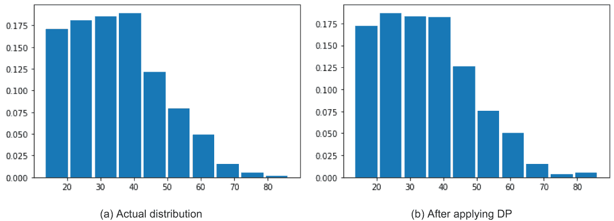

图 2.9 比较应用 DP 前后的直方图查询

前两个例子表明，在应用拉普拉斯机制时，最重要的步骤是为给定的应用推导出适当的敏感性。让我们通过一些练习来学习如何在不同情况下确定拉普拉斯机制的敏感性。

练习 1：差分隐私频率估计

假设我们有一个学生班级，其中一些学生喜欢踢足球，而另一些则不喜欢（见表 2.1）。老师想知道哪一组学生人数最多。这个问题可以被视为直方图查询的特殊情况。这个应用的敏感性是多少？

表 2.1 爱踢足球和不踢足球的学生

| 学生姓名 | 是否喜欢足球 |
| --- | --- |
| Alice | 是 |
| Bob | 否 |
| Eve | 是 |
| ... | ... |

提示：班上的每个学生要么喜欢足球，要么不喜欢，所以敏感性是 1。根据我们对拉普拉斯机制的描述，我们可以通过向每个频率添加从*Lap*(1/ϵ)抽取的噪声来同时计算喜欢或不喜欢的学生的频率，其中ϵ是学生指定的隐私预算。你可以基于以下伪代码实现来构建你的解决方案：

```
sensitivity = 1
epsilon = 0.1

frequency[0] is the number of students who like football
frequency[1] is the number of students do not like football

dp_frequency = frequency[i] + np.random.laplace(loc=0,
➥ scale=sensitivity/epsilon)
```

练习 2：COVID-19 最常见的医疗状况

假设我们希望知道在患者（如表 2.2 所示）的医疗历史中，哪种状况（在多种症状中）大约是最常见的：

+   这个应用的敏感性是多少？

+   如果我们想生成 COVID-19 医疗状况的直方图，敏感性应该是多少？

表 2.2 COVID-19 患者的症状

| 患者 | 发热 | 咳嗽 | 呼吸困难 | 疲劳 | 头痛 | 喉咙痛 | 腹泻 |
| --- | --- | --- | --- | --- | --- | --- | --- |
| 艾丽斯 | X | X | X |  |  |  |  |
| 鲍勃 | X | X | X |  | X |  | X |
| 伊芙 | X | X |  | X |  | X |  |
| 马洛里 | X |  | X | X |  | X | X |
| ... | ... | ... | ... | ... | ... | ... | ... |

提示：

+   由于个人可能会经历许多状况，这一系列问题的敏感性可能很高。然而，如果我们只报告最常见的医疗状况，每个人最多只会导致 1 个数字的差异。因此，最常见的医疗状况的敏感性仍然是 1。我们可以通过向最常见的医疗状况的每个输出添加从*Lap*（1/ϵ）抽取的噪声来获得ϵ-差分隐私结果。

+   如果我们想生成 COVID-19 医疗状况的直方图，敏感性应该是多少？由于每个人可能会经历多种状况（最多可能经历所有状况），敏感性远大于 1——它可能是报告的 COVID-19 不同医疗状况的总数。因此，COVID-19 医疗状况直方图的敏感性应该等于医疗状况的总数，即 7，如表 2.2 所示。

### 2.2.3 指数机制

拉普拉斯机制对于大多数产生数值输出的查询函数效果良好，并且向输出添加噪声不会破坏查询函数的整体效用。然而，在特定场景中，如果查询函数的输出是分类的或离散的，或者直接向输出添加噪声会导致无意义的结果，拉普拉斯机制就会失去其神奇的力量。

例如，给定一个返回乘客性别（男性或女性，这是分类数据）的查询函数，添加来自拉普拉斯机制的噪声会产生无意义的结果。有许多这样的例子，例如拍卖中的出价价值[4]，其目的是优化收入。即使拍卖价格是实数，即使添加少量正噪声到价格（以保护出价的隐私）也可能破坏对结果的评估。

指数机制[7]是为那些目标是为了选择“最佳”响应，但直接向查询函数的输出添加噪声会破坏效用的场景而设计的。因此，指数机制是使用 DP 从集合（数值或分类）中选择一个元素的自然解决方案。

让我们看看如何使用指数机制为查询函数 f 提供ϵ-DP。以下是步骤：

1.  分析师应该定义查询函数 f 的所有可能输出的集合 A。

1.  分析师应该设计一个效用函数 H（也称为得分函数），其输入是数据 x 和 f(x) 的潜在输出，表示为 a ∈ A。H 的输出是一个实数。△H 表示 H 的敏感性。

1.  给定数据 x，指数机制以 exp(ϵ ⋅H(x, a)/(2ΔH)) 为比例输出 A 中的元素 a。

让我们探索一些可以应用指数机制的示例，这样您可以看到如何定义效用函数并推导出敏感性。

示例 3：差分隐私中最常见的婚姻状况

假设一个数据用户想知道人口普查数据集中最常见的婚姻状况。如果您加载数据集并快速浏览“婚姻状况”列，您将注意到记录包括七个不同的类别（已婚-civ-spouse、离婚、未婚、分居、丧偶、已婚配偶缺席、已婚-AF-配偶）。

让我们先看看数据集中每个类别的数据人数。在继续列出 2.4 之前，您需要从书籍代码仓库下载 adult.csv 文件，该仓库位于 [`github.com/nogrady/PPML/`](https://github.com/nogrady/PPML/)。

列表 2.4 每个婚姻状况组的人数

```
import matplotlib.pyplot as plt
import pandas as pd
import numpy as np

adult = pd.read_csv("adult.csv")

print("Married-civ-spouse: "+ str(len([i for i in adult['marital-status']
➥ if i == 'Married-civ-spouse'])))
print("Never-married: "+ str(len([i for i in adult['marital-status']
➥ if i == 'Never-married'])))
print("Divorced: "+ str(len([i for i in adult['marital-status']
➥ if i == 'Divorced'])))
print("Separated: "+ str(len([i for i in adult['marital-status']
➥ if i == 'Separated'])))
print("Widowed: "+ str(len([i for i in adult['marital-status']
➥ if i == 'Widowed'])))
print("Married-spouse-absent: "+ str(len([i for i in adult['marital-
➥ status'] if i == 'Married-spouse-absent'])))
print("Married-AF-spouse: "+ str(len([i for i in adult['marital-status']
➥ if i == 'Married-AF-spouse'])))
```

结果将如下所示：

```
Married-civ-spouse: 22379
Never-married: 16117
Divorced: 6633
Separated: 1530
Widowed: 1518
Married-spouse-absent: 628
Married-AF-spouse: 37
```

如您所见，已婚-civ-spouse 是这个人口普查数据集中最常见的婚姻状况。

要使用指数机制，我们首先需要设计效用函数。我们可以将其设计为 H(x, a)，它与每种婚姻状况 x 的人数成正比，其中 x 是七个婚姻类别之一，a 是最常见的婚姻状况。因此，包含更多人数的婚姻状况应该有更好的效用。我们可以将此效用函数实现如下代码片段所示：

```
adult = pd.read_csv("adult.csv")
sets = adult['marital-status'].unique()

def utility(data, sets):
    return data.value_counts()[sets]/1000
```

在此基础上，我们可以设计一个使用指数机制的差分隐私中最常见的婚姻状况查询函数。

列表 2.5 使用指数机制每个婚姻状况组的成员数

```
def most_common_marital_exponential(x, A, H, sensitivity, epsilon):
    utilities = [H(x, a) for a in A]                                     ❶

    probabilities = [np.exp(epsilon * utility / (2 * sensitivity))
    ➥ for utility in utilities]                                         ❷

    probabilities = probabilities / np.linalg.norm(probabilities, ord=1) ❸

    return np.random.choice(A, 1, p=probabilities)[0]                    ❹
```

❶ 计算 A 中每个元素的效用。

❷ 根据每个元素的效用计算其概率。

❸ 将概率标准化，使它们的总和为 1。

❹ 根据概率从 A 中选择一个元素。

在使用此查询之前，我们需要确定敏感度和隐私预算。对于灵敏度，由于添加或删除单个个人的信息最多可以改变任何婚姻状况的效用分数 1 分，灵敏度应为 1。对于隐私预算，让我们先尝试ϵ = 1.0：

```
most_common_marital_exponential(adult['marital-status'], sets,
➥ utility, 1, 1)
```

如您所见，输出结果是已婚-civ-spouse。为了更好地说明 most_common_marital_exponential 的性能，让我们检查查询 10,000 次后的结果：

```
res = [most_common_marital_exponential(adult['marital-status'], sets,
➥ utility, 1, 1) for i in range(10000)]
pd.Series(res).value_counts()
```

您将得到类似以下输出的结果：

```
Married-civ-spouse       9545
Never-married             450
Divorced                    4
Married-spouse-absent       1
```

根据这些结果，most_common_marital_exponential 可以通过随机化最常见的婚姻状况的输出来提供隐私保护。然而，它也产生了提供最高效用概率的实际结果（已婚-civ-spouse）。

您也可以通过使用不同的隐私预算来检查这些结果。您会观察到，随着隐私预算的提高，更有可能得到真正的答案已婚-civ-spouse。

练习 3：从有限集合中选择差分隐私选择

假设一个城市里的人们想要投票决定他们在夏天想要哪种体育比赛。由于城市的预算有限，只能从四个选择（足球、排球、篮球和游泳）中选一个，如表 2.3 所示。市长希望使投票具有差分隐私性，每个人有一票。我们如何通过使用指数机制以差分隐私的方式发布投票结果？

表 2.3 不同体育项目的投票

| 体育项目 | 投票数 |
| --- | --- |
| 足球 | 49 |
| 排球 | 25 |
| 篮球 | 6 |
| 游泳 | 2 |

提示：要使用指数机制，我们首先需要确定效用函数。我们可以设计效用函数为*H*(*x*, *a*)，它与每个类别*x*的投票数成正比，其中*x*是四种体育中的一种，而*a*是获得最高投票的体育。因此，投票数更多的体育应该有更好的效用。然后，我们可以将指数机制应用于投票结果以实现ϵ-DP。

效用函数的伪代码可能定义如下：

```
def utility(data, sets):
    return data.get(sets)
```

然后，我们可以使用以下伪代码实现使用指数机制的差分隐私投票查询函数。

列表 2.6 差分隐私投票查询

```
def votes_exponential(x, A, H, sensitivity, epsilon):
    utilities = [H(x, a) for a in A]                                      ❶

    probabilities = [np.exp(epsilon * utility / (2 * sensitivity))
    ➥ for utility in utilities]                                          ❷

    probabilities = probabilities / np.linalg.norm(probabilities, ord=1)  ❸

    return np.random.choice(A, 1, p=probabilities)[0]                     ❹
```

❶ 计算 A 中每个元素的效用。

❷ 根据每个元素的效用计算其概率。

❸ 将概率标准化，使它们的总和为 1。

❹ 根据概率从 A 中选择一个元素。

与任何机制一样，在使用此查询之前，我们需要确定敏感度和隐私预算。对于敏感性，由于每个投票者只能为一种类型的运动投票，每个个人最多可以改变任何运动的效用分数 1 分。因此，敏感性应该是 1。对于隐私预算，我们首先尝试ϵ = 1.0。

我们可以将 DP 查询函数称为以下伪代码所示：

```
A = ['Football', 'Volleyball', 'Basketball', 'Swimming']
X = {'Football': 49, 'Volleyball': 25, 'Basketball': 6, 'Swimming':2}
votes_exponential(X, A, utility, 1, 1)
```

给定这种实现，你的结果应该与示例 3 相似，它以更高的概率输出足球（得票最高的运动）。当你使用更高的隐私预算时，正确选择足球的可能性会更大。

在本节中，我们介绍了 DP 中目前最流行的三种机制，它们是许多差分隐私机器学习算法的构建块。附录 A.2 列出了一些在特殊场景中可以使用的更高级机制，其中一些是拉普拉斯和指数机制的变体。

到目前为止，在我们的私有公司示例中，我们已经为满足 DP 的任务（员工总数和平均工资）设计了解决方案。然而，这些任务并不是相互独立的。同时进行这两项任务（共享员工总数和平均工资）需要在 DP 属性方面进行进一步的分析。这就是我们接下来要做的。

## 2.3 差分隐私的属性

到目前为止，你已经学习了 DP 的定义，并看到了如何为简单场景设计差分隐私解决方案。DP 还具有许多有价值的属性，使其成为在敏感个人信息上实现隐私保护数据分析的灵活且完整的框架。在本节中，我们将介绍应用 DP 的三个最重要且最常用的属性。

### 2.3.1 差分隐私的后处理属性

在大多数数据分析与机器学习任务中，需要经过几个处理步骤（数据收集、预处理、数据压缩、数据分析等）才能完成整个任务。当我们希望我们的数据分析与机器学习任务具有差分隐私时，我们可以在任何处理步骤中设计我们的解决方案。在应用 DP 机制之后的步骤被称为*后处理*步骤。

图 2.10 展示了典型的差分隐私数据分析与机器学习场景。首先，私有数据（D[1]）存储在由数据所有者控制的安全数据库中。在发布任何关于私有数据的信息（如总和、计数或模型）之前，数据所有者将应用 DP 净化器（添加随机噪声的 DP 机制）以生成差分隐私数据（D[2]）。数据所有者可以直接发布 D[2]或进行后处理步骤以获得 D[3]，然后将 D[3]发布给数据使用者。

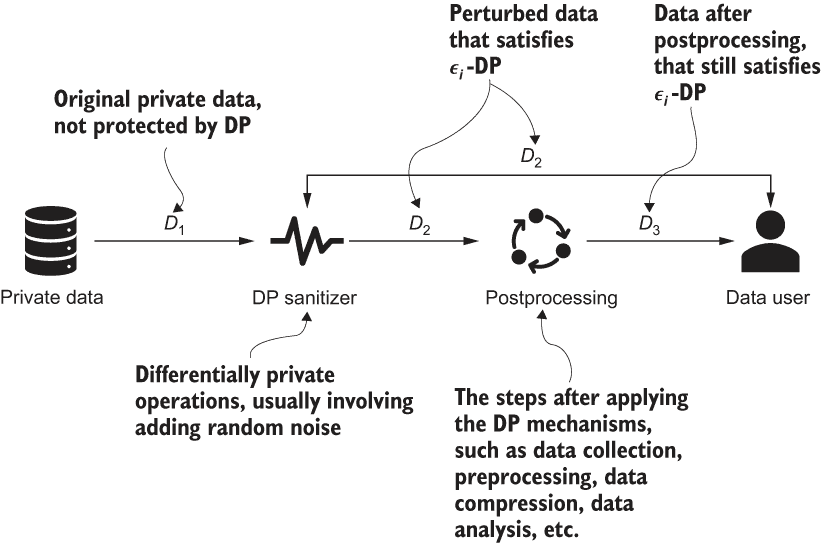

图 2.10 差分隐私的后处理属性

值得注意的是，后处理步骤实际上可以减少 DP 清洗器添加到私有数据中的随机噪声量。让我们继续使用我们的私有公司场景作为一个具体的例子。

如您之前所见，这家私有公司通过添加从拉普拉斯分布中抽取的随机噪声（该分布按 △f/ϵ 缩放，其中 △f 是敏感性，ϵ 是隐私预算）为发布其员工总数和平均工资设计了差分隐私解决方案。这个解决方案完美地满足了 DP 的概念。然而，在添加随机噪声后直接发布数据可能会导致潜在问题，因为从零均值的拉普拉斯分布中抽取的噪声是一个实数，也可能是负实数（概率为 50%）。例如，将拉普拉斯随机噪声添加到员工总数可能会导致非整数，如 100 → 100.5（+0.5 噪声），以及负数，如 5 → -1（-6 噪声），这是没有意义的。

解决这个问题的简单自然的方法是通过后处理将负值向上取整到零，并将大于 *n* 的值向下取整到 *n*（下一个整数）：100.5 → 100（将实值向下取整到下一个整数），-1 → 0（将负值向上取整到零）。

如您所见，这个后处理步骤解决了问题，但与未进行后处理相比，它也可能减少添加到私有数据中的噪声量。例如，假设 y 是私有数据，而 ȳ 是扰动数据，其中 ȳ = y + Lap(Δf/ϵ)，y' 是向上取整的扰动数据。如果 y 由于添加拉普拉斯噪声而为正，则 ȳ 为负。通过将 ȳ 向上取整到零（即，ŷ' = 0），我们可以清楚地看到它变得更接近真实答案，因此添加的噪声量已经减少。对于 ȳ 是实数但大于 y 的情况，也可以得出相同的结论。

到目前为止，可能会有人提出一个问题：在执行之前描述的后处理步骤之后，这个解决方案是否仍然保持差分隐私？简短的答案是肯定的。DP 对后处理具有免疫力 [3]，[4]。后处理属性保证，给定一个差分隐私算法的输出（满足 ϵ-DP 的算法），任何其他数据分析师，没有关于原始私有数据库或数据集的额外知识，都不能提出任何后处理机制或算法来使输出变得不那么差分隐私。总结一下：如果一个算法 M(x) 满足 ϵ-DP，那么对于任何（确定性的或随机的）函数 F(⋅)，F(M(x)) 满足 ϵ-DP。

基于 DP 的后处理属性，一旦个人的敏感数据被声明由随机算法保护，其他数据分析师就无法增加其隐私损失。我们可以将后处理技术视为任何对 DP 私有数据进行去噪、聚合、数据分析甚至 ML 操作的技术，这些操作不直接涉及原始私有数据。

### 2.3.2 差分隐私的组隐私属性

在我们之前的例子中，我们只讨论了单个个体的隐私保护或泄露。现在让我们看看一个可能涉及一组人的隐私保护或泄露的例子。

图 2.11 展示了这样一个场景，其中 k 位科学家通过相互分享结果来共同进行一项研究。一个现实世界的例子是不同癌症研究机构合作开展一项研究以发现新药。由于隐私问题，他们不能共享患者的记录或公式，但他们可以共享清洗后的结果。

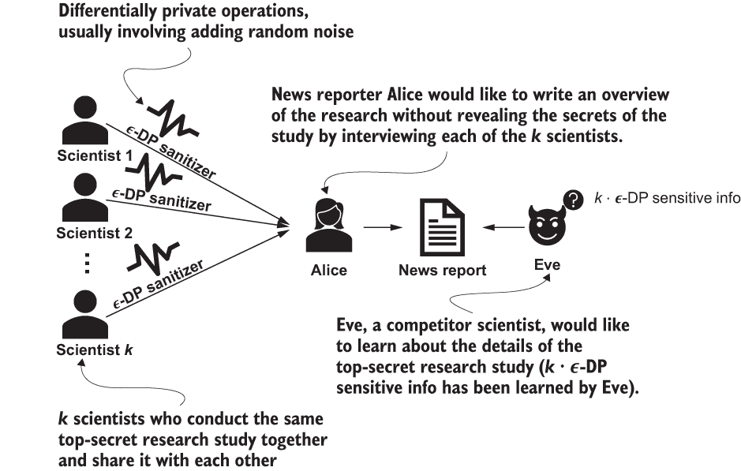

图 2.11 差分隐私的组隐私属性

现在假设新闻记者爱丽丝想通过采访每位 k 位科学家来报道研究的亮点，而不泄露研究的秘密。为了确保没有科学家泄露关于他们研究的信息，科学家们设计了一个协议，在记者采访每位科学家时遵循，以确保关于研究的任何交换信息都应由ϵ-DP 随机机制进行清洗。

爱丽丝对每位 k 位科学家进行了访谈并发表了她的报告。然而，最近发现，一位竞争对手科学家伊芙仅基于爱丽丝的报告就了解了关于研究细节的信息，超出了与爱丽丝交换的内容。可能发生了什么？

从 DP 的定义回顾，ϵ是控制随机机制输出与真实世界场景差异的隐私预算。可以证明，k 位科学家输出的ϵ-差分隐私随机机制与真实世界场景之间的差异增长到最多 k ⋅ ϵ的隐私预算。因此，尽管对每位科学家进行访谈只花费了ϵ的隐私预算，但由于 k 位科学家共享相同的秘密，对全部科学家进行访谈实际上花费了 k ⋅ ϵ的隐私预算。因此，随着群体规模的增加，隐私保证适度下降。如果 k 足够大，伊芙就能了解关于研究的所有信息，尽管每位 k 位科学家在访谈时都遵循了ϵ-差分隐私随机机制。可以为大小约为 k ≈ 1/ϵ的个人群体提供有意义的隐私保证。然而，对于 k ≈ 100/ ϵ的群体几乎没有任何保护保证。

*k* 科学家示例说明了 DP（差分隐私）的群体属性，其中有时一组成员（如家庭或公司的员工）会希望一起加入一个分析研究，因此敏感数据可能与所有群体成员有关。总结来说：如果算法 M(x)满足ϵ-DP，则将 M(x)应用于 k 个相关个体满足 k ⋅ ϵ-DP。

DP（差分隐私）的群体隐私性质使研究人员和开发者能够为个体群体设计高效且有用的 DP 算法。例如，考虑联邦学习（即协作学习）的场景。一般来说，联邦学习允许数据所有者以去中心化的方式协作学习共享模型，同时保持所有训练数据本地化。本质上，这个想法是在不需要共享训练数据的情况下执行机器学习。在这个阶段，保护拥有数据样本群体的每个数据所有者的隐私非常重要，而不是每个样本本身，此时 DP 可以发挥重要作用。

### 2.3.3 差分隐私的组合性质

DP（差分隐私）的另一个非常重要且有用的性质是其组合定理。DP 的严谨数学设计使得可以分析和控制多个不同差分隐私计算累积的隐私损失。理解这些组合性质将使您能够更好地设计和分析基于更简单构建块的更复杂 DP 算法。主要有两个组合性质，我们将在下面探讨。

顺序组合

在数据分析与机器学习中，相同的信息（统计数据、汇总数据、机器学习模型等）通常会被多次查询。例如，在我们之前的私有公司场景中，员工总数和平均工资可能会被不同的人（如 Alice 和 Bob）多次查询。尽管每次查询的结果都会添加随机噪声，但更多的查询将消耗更多的隐私预算，并可能导致更多的隐私泄露。例如，如果 Alice 或 Bob 能够从当前的（静态）数据库中收集足够的噪声查询结果，他们可以通过计算这些噪声查询结果的平均值来消除噪声，因为随机噪声始终来自相同的零均值拉普拉斯分布。因此，在设计需要多次顺序查询的私有数据差分隐私解决方案时，我们应该谨慎行事。

为了说明 DP 的顺序组合属性，让我们考虑另一个场景。假设 Mallory 的个人信息（她的薪水）包含在私人公司使用的员工信息数据库中，该数据库被潜在的商业分析师在两个不同的差分隐私查询中使用。第一个查询可能是关于公司平均薪水的，而第二个查询可能是关于有多少人的薪水高于 50,000 美元。Mallory 担心这两个查询，因为当两个结果进行比较（或合并）时，它们可能会泄露个人的薪水。

DP 的顺序组合属性证实了从数据上的多个查询中累积的隐私泄露总是高于单个查询的泄露。例如，如果第一个查询的 DP 分析是在隐私预算 ϵ[1] = 0.1 下进行的，而第二个查询的隐私预算为 ϵ[2] = 0.2，那么这两个分析可以被视为一个具有可能大于 ϵ[1] 或 ϵ[2] 但最多为 ϵ[3] = ϵ[1] + ϵ[2] = 0.3 的隐私损失参数的单个分析。总结一下：如果算法 F1 满足 ϵ[1]-DP，并且 F2 满足 ϵ[2]-DP，那么 F1 和 F2 的顺序组合满足 (ϵ[1] + ϵ[2])-DP。

现在，让我们探索一个示例，该示例演示了 DP 的顺序组合属性。

示例 4：差分隐私计数查询的顺序组合

让我们重新考虑示例 1 中的场景，其中我们想要确定人口普查数据集中有多少人年龄超过 50 岁。不同的是，现在我们有两个具有不同隐私预算的 DP 函数。让我们看看在依次应用不同的 DP 函数后会发生什么。

在下面的列表中，我们定义了四个 DP 函数，其中 F[1] 满足 0.1-DP（ϵ[1] = 0.1），F[2] 满足 0.2-DP（ϵ[2] = 0.2），F[3] 满足 0.3-DP（ϵ[3] = ϵ[1] + ϵ[2]），而 F[seq] 是 F[1] 和 F[2] 的顺序组合。

列表 2.7 应用顺序组合

```
import numpy as np
import matplotlib.pyplot as plt
ages_adult = np.loadtxt("https://archive.ics.uci.edu/ml/machine-learning-
➥ databases/adult/adult.data", usecols=0, delimiter=", ")

sensitivity = 1
epsilon1 = 0.1
epsilon2 = 0.2
epsilon3 = epsilon1 + epsilon2

def F1(x):                                                            ❶
    return x+np.random.laplace(loc=0, scale=sensitivity/epsilon1)     ❶

def F2(x):                                                            ❷
    return x+np.random.laplace(loc=0, scale=sensitivity/epsilon2)     ❷

def F3(x):                                                            ❸
    return x+np.random.laplace(loc=0, scale=sensitivity/epsilon3)     ❸

def F_seq(x):                                                         ❹
    return (F1(x)+F2(x))/2                                            ❹
```

❶ 满足 0.1-DP

❷ 满足 0.2-DP

❸ 满足 0.3-DP

❹ F1 和 F2 的顺序组合

现在，假设 x 是“人口普查数据集中有多少人年龄超过 50 岁？”的实数值，让我们比较 F[1]、F[2] 和 F[3] 的输出：

```
x = len([i for i in ages_adult if i > 50])

plt.hist([F1(x) for i in range(1000)], bins=50, label='F1');            ❶

plt.hist([F2(x) for i in range(1000)], bins=50, alpha=.7, label='F2');  ❷

plt.hist([F3(x) for i in range(1000)], bins=50, alpha=.7, label='F3');  ❸

plt.legend();
```

❶ 图 F1

❷ 图 F2（应该看起来相同）

❸ 图 F3（应该看起来相同）

在图 2.12 中，你可以看到 F[3] 的输出分布看起来比 F[1] 和 F[2] 的“更尖锐”，因为 F[3] 具有更高的隐私预算（ϵ），这表明更多的隐私泄露，因此有更高的概率输出接近真实答案（6,460）的结果。

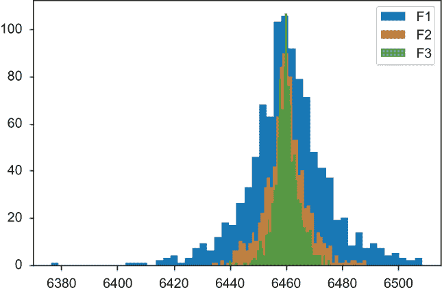

图 2.12 不同差分隐私计数查询的顺序组合输出

现在，让我们比较 F[3] 和 F[seq] 的输出，如下面的代码片段所示：

```
plt.hist([F_seq(x) for i in range(1000)], bins=50, alpha=.7,
➥ label='F_seq');                                                       ❶

plt.hist([F3(x) for i in range(1000)], bins=50, alpha=.7, label='F3');   ❷

plt.legend();
```

❶ 图 F_seq

❷ 图 F3

如图 2.13 所示，F[3] 和 F[seq] 的输出大致相同，这证明了 DP 的顺序组合属性。但值得注意的是，顺序组合仅定义了几个 DP 函数顺序组合的总 ϵ 的上界（即最坏情况的隐私泄露）。对隐私的实际累积影响可能更低。有关 DP 顺序组合的数学理论更多信息，请参阅章节 A.3。

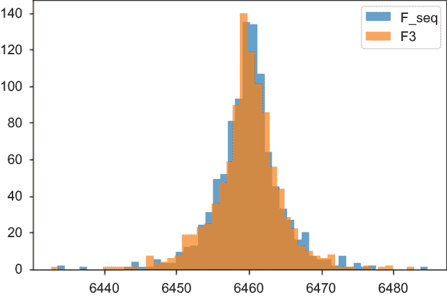

图 2.13 比较输出 F[3] 和 F[seq] 的分布

并行组合

到目前为止，一个明显的问题是，如果有人将几个不同的 DP 算法并行组合会发生什么。为了说明 DP 的并行组合属性，考虑以下场景。

假设公司 A 维护着其员工薪资信息的数据库。Alice 想要了解公司 A 中薪资高于 $150,000 的员工数量，而 Bob 则想研究公司 A 中薪资低于 $20,000 的员工数量。为了满足公司的隐私保护要求，Alice 被要求使用 ϵ[1]-DP 机制访问数据库，而 Bob 则需要应用 ϵ[2]-DP 机制从同一数据库中获取信息。Alice 和 Bob 访问数据库的总隐私泄露是多少？

由于高于 $150,000 的薪资和低于 $20,000 的薪资的员工是两个不相交的个体集合，因此同时发布这两组信息不会导致同一员工两次隐私泄露。例如，如果 ϵ[1] = 0.1 且 ϵ[2] = 0.2，根据 DP 的并行组合属性，Alice 和 Bob 访问数据库所使用的总隐私预算为 ϵ[3] = max(ϵ[1], ϵ[2]) = 0.2。

总结：如果算法 F1 满足 ϵ[1]-DP，且 F2 满足 ϵ[2]-DP，其中 (x[1], x[2]) 是整个数据集 x 的非重叠划分，那么 F1 和 F2 的并行组合满足 max(ϵ[1], ϵ[2])-DP。max(ϵ[1], ϵ[2]) 定义了几个 DP 函数并行组合的总 ϵ 的上界（即最坏情况的隐私泄露）；对隐私的实际累积影响可能更低。有关 DP 并行组合背后的数学理论更多信息，请参阅章节 A.4。

DP 的顺序和并行组合属性被认为是 DP 的固有属性，其中数据聚合者不需要在组合多个 DP 算法时进行任何特殊计算以确定隐私界限。DP 的这种组合属性使得研究人员和开发者可以更多地关注更简单的差分隐私构建块（即机制）的设计，而这些简单的构建块可以直接组合起来解决更复杂的问题。

## 总结

+   DP 是一种有前途且流行的隐私增强技术，它为隐私提供了一个严格的定义。

+   DP 旨在通过发布数据库或数据集的汇总或统计信息来加强隐私保护，同时不透露该数据库中任何个人的存在。

+   敏感性通常衡量每个个体信息对分析输出可能产生的最大影响。

+   隐私预算 ϵ 通常由数据所有者设置，以调整所需的隐私保护级别。

+   DP 可以通过使用不同的 DP 机制扰动敏感信息的汇总或统计来实现。

+   在二元机制中，随机化来源于二元响应（抛硬币），这有助于扰动结果。

+   拉普拉斯机制通过向目标查询或函数添加从拉普拉斯分布中抽取的随机噪声来实现 DP。

+   指数机制有助于应对那些需要选择最佳响应但直接向查询函数的输出添加噪声会完全破坏效用的情况。

+   DP 对后处理免疫：一旦个人的 DP 敏感数据声称被随机化算法保护，没有其他数据分析师可以在不涉及原始敏感数据信息的情况下增加其隐私损失。

+   DP 可以应用于分析和控制来自群体（如家庭和组织）的隐私损失。

+   DP 还具有顺序和并行组合属性，这使得可以从更简单的差分隐私构建块设计和分析复杂的差分隐私算法。
