# 3 机器学习差分隐私的高级概念

本章涵盖

+   差分隐私机器学习算法的设计原则

+   设计和实现差分隐私监督学习算法

+   设计和实现差分隐私无监督学习算法

+   设计和分析差分隐私机器学习算法的步骤

在上一章中，我们研究了差分隐私（DP）的定义和一般用途，以及在不同场景下差分隐私的性质（后处理属性、分组属性和组合属性）。我们还探讨了常见且广泛采用的差分隐私机制，这些机制在各种隐私保护算法和应用中作为基本构建块。本章将介绍如何使用这些构建块来设计和实现多个差分隐私机器学习算法，以及如何在现实场景中应用这些算法。

## 3.1 在机器学习中应用差分隐私

在第二章中，我们研究了不同的差分隐私机制及其性质。本章将展示如何使用这些差分隐私机制来设计和实现各种差分隐私机器学习算法。

如图 3.1 所示，我们考虑的是一个两方机器学习训练场景，包括数据所有者和数据用户。数据所有者提供私有数据，即输入或训练数据。通常，训练数据将经过数据预处理阶段以清理数据并去除任何噪声。然后，数据用户将对这些个人数据执行特定的机器学习算法（回归、分类、聚类等），以训练并生成机器学习模型，即输出。

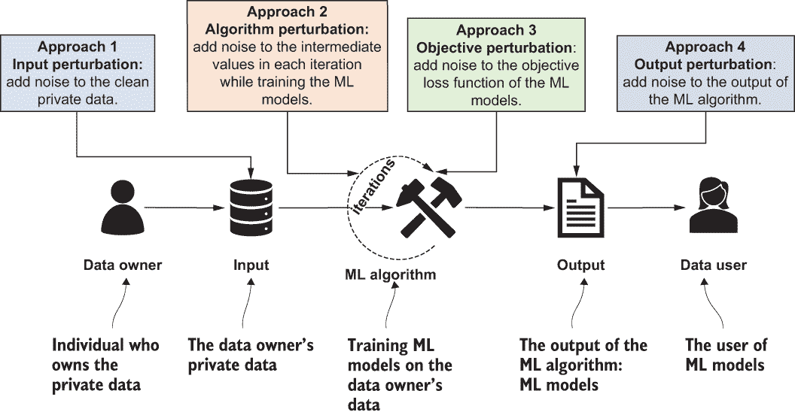

图 3.1 差分隐私机器学习的设计原则

正如我们所知，差分隐私（DP）在过去十年中受到了越来越多的关注。因此，工业和学术研究人员都提出了各种不同的差分隐私机器学习算法，并进行了设计、实现。差分隐私可以应用于防止数据用户通过分析机器学习模型来推断私有数据。如图 3.1 所示，扰动可以在机器学习过程的各个步骤中应用，以提供差分隐私保证。例如，输入扰动方法直接向干净私有数据或数据预处理阶段添加噪声。算法扰动方法在训练机器学习模型期间添加噪声。目标扰动方法向机器学习模型的目标损失函数添加噪声。最后，输出扰动直接向训练好的机器学习模型（即机器学习算法的输出）添加噪声。

图 3.2 识别了在本章中作为示例展示的机器学习算法中应用的几种流行扰动策略。当然，还有其他可能的例子，但我们将坚持这些方法，并在下一节详细讨论这些扰动方法。

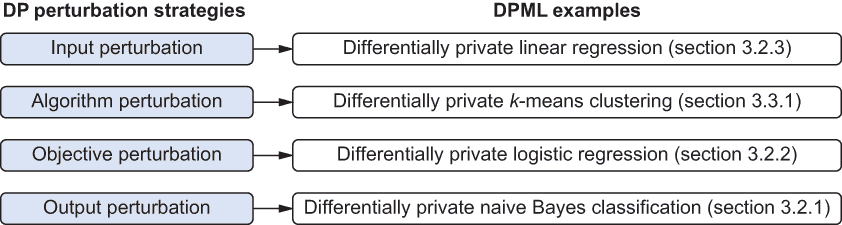

图 3.2 DP 扰动策略及其讨论的章节

让我们逐一探讨这些针对差分隐私机器学习算法的四个常见设计原则，从输入扰动开始。

### 3.1.1 输入扰动

在输入扰动中，噪声直接添加到输入数据（训练数据）中，如图 3.3 所示。在清洗数据上执行所需的非隐私机器学习算法计算（机器学习训练过程）后，输出（机器学习模型）将是差分隐私的。例如，考虑主成分分析（PCA）机器学习算法。它的输入是私有数据的协方差矩阵，它的输出是一个投影矩阵（PCA 的输出模型）。在对方差矩阵（输入）进行特征分解之前，我们可以在协方差矩阵中添加一个对称的高斯噪声矩阵[1]。现在输出将是一个差分隐私投影矩阵（记住，这里的目的是不发布投影数据，而是 DP 投影矩阵）。

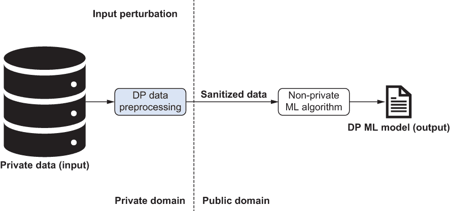

图 3.3 输入扰动的原理

输入扰动易于实现，并且可以用来生成适用于不同类型机器学习（ML）算法的清洗数据集。由于这种方法侧重于扰动输入数据以应用于机器学习模型，因此相同的程序可以推广到许多不同的机器学习算法。例如，扰动协方差矩阵也可以作为许多不同的成分分析算法的输入，例如主成分分析（PCA）、线性判别分析（LDA）和多重判别分析（MDA）。此外，大多数差分隐私（DP）机制都可以在输入扰动方法中利用，具体取决于输入数据的属性。

然而，输入扰动通常需要向机器学习输入数据添加更多的噪声，因为原始输入数据通常具有更高的敏感性。正如第二章所讨论的，差分隐私中的敏感性是一个个体私人信息可能造成的最大可能差异。具有更高敏感性的数据需要我们添加更多的噪声以提供相同级别的隐私保证。在第 3.2.3 节中，我们将讨论差分隐私线性回归，以展示在设计差分隐私机器学习算法时如何利用输入扰动。

### 3.1.2 算法扰动

在算法扰动中，私有数据被输入到机器学习算法中（可能经过非私有数据预处理程序），然后采用差分隐私机制生成相应的净化模型（见图 3.4）。对于需要多次迭代或多个步骤的机器学习算法，差分隐私机制可以用来扰动每个迭代或步骤中的中间值（即模型参数）。例如，PCA 的特征分解可以使用幂迭代方法执行，这是一个迭代算法。在带噪声的幂方法中，可以在算法的每个迭代中添加高斯噪声，该算法作用于未扰动的协方差矩阵（即输入），从而实现差分隐私 PCA [2]。同样，Abadi 提出了一种差分隐私深度学习系统，该系统修改了随机梯度下降算法，使其在每个迭代中添加高斯噪声 [3]。

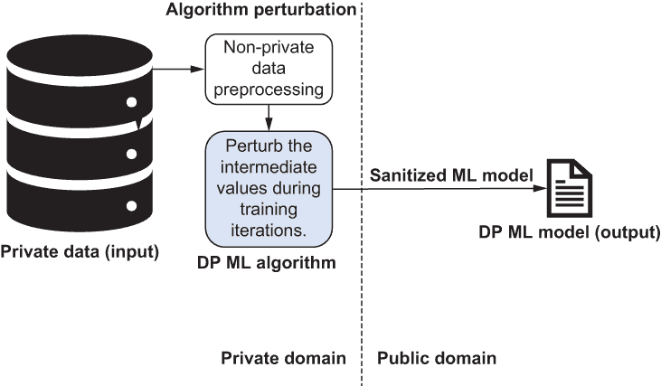

图 3.4 算法扰动的原理：输入是私有数据。然后我们预处理数据（非私有）。接下来，我们在机器学习算法的训练迭代过程中扰动中间值。最后，我们得到一个差分隐私机器学习模型。

如您所见，算法扰动方法通常应用于需要多次迭代或多个步骤的机器学习模型，例如线性回归、逻辑回归和深度神经网络。与输入扰动相比，算法扰动需要对不同的机器学习算法进行特定设计。然而，由于训练机器学习模型中的中间值通常比原始输入数据具有更少的敏感性，因此它通常在相同的差分隐私预算下引入更少的噪声。更少的噪声通常会导致差分隐私机器学习模型具有更好的效用。在 3.3.1 节中，我们将介绍差分隐私*k*-均值聚类，进一步讨论如何在差分隐私机器学习的设计中利用算法扰动。

### 3.1.3 输出扰动

使用输出扰动时，我们采用非私有学习算法，然后对生成的模型添加噪声，如图 3.5 所示。例如，我们可以通过使用指数机制（即采样一个随机*k*-维子空间，该子空间近似于前*k*个 PCA 子空间）来净化 PCA 算法生成的投影矩阵，从而实现差分隐私 PCA。


图 3.5 输出扰动的原理：输入是私有数据。然后我们预处理数据（非私有）。接下来，我们对非私有机器学习算法应用差分隐私扰动。最后，我们得到一个差分隐私机器学习模型。

通常，输出扰动方法适用于产生复杂统计数据的机器学习算法。例如，特征提取和降维算法通常发布提取的特征。因此，使用投影矩阵进行降维是使用输出扰动的合适场景。然而，许多需要发布模型并与测试数据多次交互的监督机器学习算法，如线性回归、逻辑回归和支持向量机，不适合输出扰动。在 3.2.1 节中，我们将通过差分隐私朴素贝叶斯分类来讨论如何利用输出扰动在差分隐私机器学习中。

### 3.1.4 目标扰动

如图 3.6 所示，目标扰动涉及向学习算法（如经验风险最小化）的目标函数添加噪声，这些算法使用噪声函数的最小/最大值作为输出模型。经验风险最小化的核心思想是，由于我们不知道算法在实际数据上的表现如何，因为我们不知道算法将要处理的数据的真实分布。然而，我们可以测量它在已知训练数据集上的性能，我们称这种测量为*经验风险*。因此，在目标扰动中，可以设计一个向量机制来适应噪声的添加。要了解更多关于如何具体操作的细节，请参阅附录 A.2。


图 3.6 目标扰动的工作原理：输入是私有数据。然后我们对数据进行预处理（非私有）。接下来，我们在训练过程中扰动机器学习模型的目标函数。最后，我们得到一个差分隐私机器学习模型。

什么是目标函数？

在数学优化中，目标函数试图根据一组约束条件和一或多个决策变量之间的关系，最大化成本（或最小化损失）。通常，损失函数（或成本函数）将一个或多个变量的值映射到一个实数（一个数值），然后可以表示为与事件相关的“成本”。在实践中，它可能是项目的成本、利润率，甚至是生产线上的数量。有了目标函数，我们试图达到输出、利润、资源使用等目标。

用数学术语来说，目标函数可以表示如下。

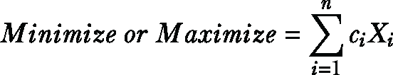

考虑一个最大化产品利润的例子，其中我们有一些变量可以直接影响利润。在这个公式中，X[i]是这些变量中的第*i*个变量，c[i]是第*i*个变量的系数。我们在这里想要实现的是，在试图达到最大利润的过程中，确定这些变量的最佳设置。

正如你所知，*样本空间*是事件或实验所有可能结果的集合。现实世界的样本空间有时包括有界值（位于特定范围内的值）和无界值，覆盖无限多的可能结果。然而，大多数扰动机制假设样本空间是有界的。当样本空间是无界的，它会导致无界敏感性，从而导致无界噪声的增加。因此，如果样本空间是无界的，我们可以假设每个样本的值在预处理阶段将被截断，并且截断规则与私有数据无关。例如，我们可以使用常识或额外的领域知识来决定截断规则。在第 3.2.2 节中，我们将讨论差分隐私逻辑回归和 DP ML 中的目标扰动。

## 3.2 差分隐私监督学习算法

*监督学习*使用标记数据，其中每个特征向量都与一个输出值相关联，该输出值可能是一个类别标签（分类）或连续值（回归）。标记数据用于构建模型，这些模型可以预测新特征向量的标签（在测试阶段）。在分类中，样本通常属于两个或多个类别，机器学习算法的目标是确定新样本属于哪个类别。一些算法可能通过在不同类别之间找到分离的超平面来实现这一点。一个示例应用是面部识别，其中可以测试面部图像以确定它属于特定的人。

多种分类算法可以用于之前提到的每个应用，例如支持向量机（SVMs）、神经网络或逻辑回归。当样本标签是一个连续值（也称为因变量或响应变量）而不是离散值时，该任务被称为回归。样本由也称为自变量的特征组成。回归的目标是将预测模型（如直线）拟合到观察数据集，使得观察数据点与直线之间的距离最小化。例如，可以根据房屋的位置、邮编和房间数量来估计房屋价格。

在以下小节中，我们将制定三种最常见监督学习算法的 DP 设计：朴素贝叶斯分类、逻辑回归和线性回归。

### 3.2.1 差分隐私朴素贝叶斯分类

首先，让我们了解一下差分隐私朴素贝叶斯分类是如何工作的，以及一些数学解释。

朴素贝叶斯分类

在概率论中，贝叶斯定理描述了基于先前对可能相关事件的条件的知识来描述事件的概率。它表述如下：

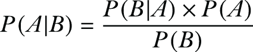

+   A 和 B 是事件。

+   P(A|B)是在 B 为真的条件下 A 的概率。

+   P(B|A)是在 A 为真的条件下 B 的概率。

+   P(A)和 P(B)是 A 和 B 的独立概率。

朴素贝叶斯分类技术使用贝叶斯定理以及每对特征之间相互独立的假设。

首先，让待分类的实例为 n 维向量 X = [x[1], x[2],...,x[n]]，特征的名称为[F[1], F[2],...,F[n]]，可以分配给实例的可能类别为 C = [c[1], c[2],...,c[n]]。

朴素贝叶斯分类器将实例*X*分配到类别 F[S]，当且仅当 P(C[s]|X) P(C[j]|X)对于 1 ≤ j ≤ k 且 j ≠ s。因此，分类器需要计算所有类别的 P(C[j]│X)并比较这些概率。

我们知道在使用贝叶斯定理时，概率 P(C[j]│X)可以计算为

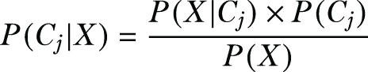

由于 P(X)对所有类别都是相同的，因此找到具有最大 P(X|C[j]) ∙ P(C[j])的类别就足够了。假设特征是独立的，那么这个类别等于 P(C[j]) ⋅ Π^n[i=1] P(F[i] = x[i]|C[j])。因此，将 C[j]分配给给定实例 X 的概率与 P(C[1]) ⋅ Π³[i=1] P(F[i]= x[i]|C[j])成正比。

这就是目前朴素贝叶斯分类的数学背景。接下来，我们将通过示例演示如何应用朴素贝叶斯对离散和连续数据进行分类。

离散朴素贝叶斯

为了演示朴素贝叶斯分类器在离散（分类）数据上的概念，让我们使用表 3.1 中的数据集。

表 3.1 这是从一个抵押贷款支付数据集中提取的部分。年龄、收入和性别是独立变量，而未支付款项代表预测任务的因变量。

| 数量 | 年龄 | 收入 | 性别 | 未支付款项（是或否） |
| --- | --- | --- | --- | --- |
| 1 | 年轻 | 低 | 男 | 是 |
| 2 | 年轻 | 高 | 女 | 是 |
| 3 | 中等 | 高 | 男 | 否 |
| 4 | 老年 | 中等 | 男 | 否 |
| 5 | 老年 | 高 | 男 | 否 |
| 6 | 老年 | 低 | 女 | 是 |
| 7 | 中等 | 低 | 女 | 否 |
| 8 | 中等 | 中等 | 男 | 是 |
| 9 | 年轻 | 低 | 男 | 否 |
| 10 | 老年 | 高 | 女 | 否 |

在这个例子中，分类任务是预测客户是否会错过抵押贷款支付。因此，有两个类别，C[1]和 C[2]，分别代表是否错过支付。P(C[1]) = 4⁄10 和 P(C[2]) = 6⁄10。此外，年龄特征的条件下概率如图 3.7 所示。我们可以类似地计算其他特征的条件下概率。

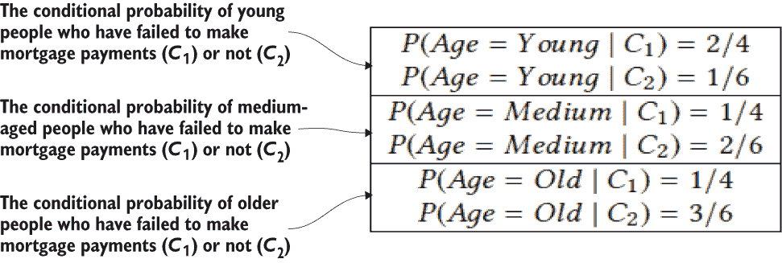

图 3.7 示例数据集中 F[1]（即年龄）的条件概率

为了预测一个中等收入的年轻女性是否会错过付款，我们可以设置 X = (Age = Young, Income = Medium, Gender = Female)。然后，使用表 3.1 中的原始数据计算结果，我们将得到 P(Age = Young|C[1]) = 2/4, P(Income = Medium|C[1]) = 1/4, P(Gender = Female|C[1]) = 2/4, P(Age = Young|C[2]) = 1/6, P(Income = Medium|C[2]) = 1/6, P(Gender = Female|C[2]) = 2/6, P(C[1]) = 4/10, 和 P(C[2]) = 6/10。

要使用朴素贝叶斯分类器，我们需要比较 P(C[1]) ⋅ Π³[i=1] P(F[i] = x[i]|C[1]) 和 P(C[2]) ⋅ Π³[i=1] P(F[i] = x[i]|C[2])。由于前者等于 0.025（即，4/10 × 2/4 × 1/4 × 2/4 = 0.025）而后者等于 0.0056（即，6/10 × 1/6 × 1/6 × 2/6 = 0.0056），可以确定朴素贝叶斯分类器将实例 X 分配给 C[1]。换句话说，可以预测一个中等收入的年轻女性会错过她的付款。

高斯朴素贝叶斯

当涉及到连续数据（任何两个数值数据点之间有无限可能的值）时，一种常见的方法是假设这些值是按照高斯分布分布的。然后我们可以使用这些值的**均值**和**方差**来计算条件概率。

假设一个特征 F[i] 具有连续域。对于每个类别 C[j] ∈ C，计算训练集中 F[i] 的值的均值 μ[i,j] 和方差 σ[i,j]²。然后，对于给定的实例 X，使用高斯分布计算条件概率 P(F[i] = x[i]│C[j])，如下所示：


你可能已经注意到，在离散朴素贝叶斯中，由于训练集中未看到的值的数量很高，在大离散域中准确性可能会降低。然而，高斯朴素贝叶斯也可以用于具有大离散域的特征。

实现差分隐私朴素贝叶斯分类

现在，让我们看看我们如何使朴素贝叶斯分类具有差分隐私。这种设计遵循输出扰动策略 [4]，其中推导出朴素贝叶斯模型参数的敏感性，然后直接将拉普拉斯机制（即，添加拉普拉斯噪声）应用于模型参数（如第 2.2.2 节所述）。

首先，我们需要确定模型参数的敏感性。离散和高斯朴素贝叶斯模型参数有不同的敏感性。在离散朴素贝叶斯中，模型参数是概率


其中 n 是总训练样本数，其中 C = C[j]，而 n[i,j] 是具有 F[i] = x[i] 的此类训练样本的数量。

因此，DP 噪声可以添加到训练样本数量（即 n[i,j]）。我们可以看到，无论我们添加还是删除一条新记录，n[i,j] 的差异总是 1。因此，对于离散朴素贝叶斯，每个模型参数 n[i,j] 的敏感性为 1（对于所有特征值 F[i] = x[i] 和类别值 C[j]）。

对于高斯朴素贝叶斯，模型参数 P(F[i] = x[i]│C[j]) 依赖于均值 μ[i,j] 和方差 σ[i,j]²，因此我们需要找出这些均值的敏感性。假设特征 F[i] 的值被范围 [l[i], u[i]] 所限制。那么，正如 Vaidya 等人 [4] 所建议的，均值 μ[i,j] 的敏感性是 (μ[i] − l[i] ) /(n + 1)，方差 σ[i,j]² 的敏感性是 n ∙ (μ[i] − l[i]) / (n + 1)，其中 n 是 C = C[j] 的训练样本数量。

为了设计我们的差分隐私朴素贝叶斯分类算法，我们将使用输出扰动策略，其中每个特征的敏感性根据其是否为离散或数值来计算。根据第 2.2.2 节中关于拉普拉斯机制的讨论，添加适当尺度的拉普拉斯噪声（参数为离散特征的样本数量和数值特征的均值与方差）。图 3.8 展示了我们的算法伪代码，大部分内容都是自我解释的。

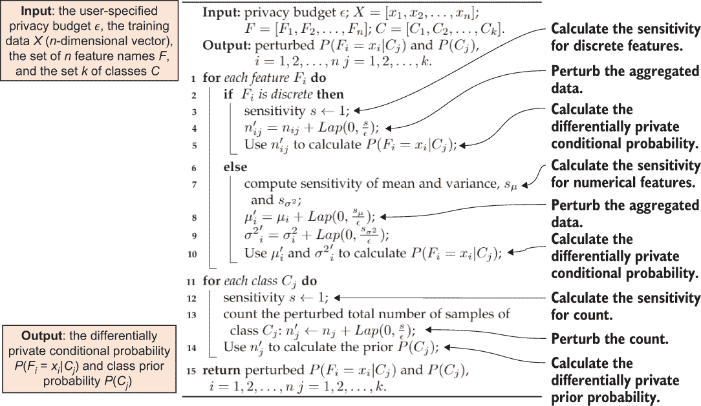

图 3.8 差分隐私朴素贝叶斯分类的工作原理

现在我们将实现一些这些概念，以获得一些实际操作经验。让我们考虑一个场景，其中我们正在训练一个朴素贝叶斯分类模型，根据人口普查数据集预测一个人是否年收入超过 50,000 美元。您可以在 [`archive.ics.uci.edu/ml/datasets/adult`](https://archive.ics.uci.edu/ml/datasets/adult) 找到更多关于数据集的详细信息。

首先，我们需要从 adult 数据集中加载训练和测试数据。

列表 3.1 加载数据集

```
import numpy as np

X_train = np.loadtxt("https://archive.ics.uci.edu/ml/machine-learning-
➥ databases/adult/adult.data",                          
➥ usecols=(0, 4, 10, 11, 12), delimiter=", ")

y_train = np.loadtxt("https://archive.ics.uci.edu/ml/machine-learning-
➥ databases/adult/adult.data", 
➥ usecols=14, dtype=str, delimiter=", ")

X_test = np.loadtxt("https://archive.ics.uci.edu/ml/machine-learning-
➥ databases/adult/adult.test",
➥ usecols=(0, 4, 10, 11, 12), delimiter=", ", skiprows=1)

y_test = np.loadtxt("https://archive.ics.uci.edu/ml/machine-learning-
➥ databases/adult/adult.test", 
➥ usecols=14, dtype=str, delimiter=", ", skiprows=1)
y_test = np.array([a[:-1] for a in y_test])
```

接下来，我们将训练一个常规（非隐私）的朴素贝叶斯分类器，并测试其准确性，如下所示。

列表 3.2 无隐私的朴素贝叶斯

```
from sklearn.naive_bayes import GaussianNB
nonprivate_clf = GaussianNB()
nonprivate_clf.fit(X_train, y_train)

from sklearn.metrics import accuracy_score

print("Non-private test accuracy: %.2f%%" % 
     (accuracy_score(y_test, nonprivate_clf.predict(X_test)) * 100))
```

输出将类似于以下内容：

```
> Non-private test accuracy: 79.64%
```

为了应用差分隐私朴素贝叶斯，我们将使用 IBM 差分隐私库 diffprivlib：

```
!pip install diffprivlib
```

使用 diffprivlib 的 models.GaussianNB 模块，我们可以在满足 DP 的同时训练朴素贝叶斯分类器。如果我们不指定任何参数，模型默认为 epsilon = 1.00。

```
import diffprivlib.models as dp
dp_clf = dp.GaussianNB()

dp_clf.fit(X_train, y_train)

print("Differentially private test accuracy (epsilon=%.2f): %.2f%%" %
➥ (dp_clf.epsilon, accuracy_score(y_test, 
➥ dp_clf.predict(X_test)) * 100))
```

输出将类似于以下内容：

```
> Differentially private test accuracy (epsilon=1.00): 78.59%
```

如您从前面的输出准确率中可以看到，常规（非隐私）朴素贝叶斯分类器产生了 79.64%的准确率；通过设置 epsilon=1.00，差分隐私朴素贝叶斯分类器达到了 78.59%的准确率。值得注意的是，（非隐私）朴素贝叶斯分类器和差分隐私朴素贝叶斯分类器的训练过程是非确定性的。因此，您可能获得的数字与我们所列的准确率略有不同。尽管如此，DP-朴素贝叶斯的结果略低于其非隐私版本。

使用较小的 epsilon 通常会导致更好的隐私保护，但准确性较低。例如，让我们设置 epsilon=0.01：

```
import diffprivlib.models as dp
dp_clf = dp.GaussianNB(epsilon=float("0.01"))
dp_clf.fit(X_train, y_train)

print("Differentially private test accuracy (epsilon=%.2f): %.2f%%" %
➥ (dp_clf.epsilon, accuracy_score(y_test, 
➥ dp_clf.predict(X_test)) * 100))
```

现在的输出将看起来像这样：

```
> Differentially private test accuracy (epsilon=0.01): 70.35%
```

### 3.2.2 差分隐私逻辑回归

上一小节探讨了差分隐私监督学习算法的朴素贝叶斯方法。现在让我们看看在差分隐私设置下如何应用逻辑回归。

逻辑回归

逻辑回归（LR）是二元分类的模型。LR 通常被表述为通过最小化训练集（X, Y）上的负对数似然来训练参数 w。

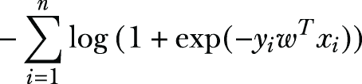

其中 X = [x[1], x[2], ...,x[n]] 和 Y = [y[1], y[2], ...,y[n]]。

与标准 LR 相比，正则化 LR 在其损失函数中有一个正则化项。因此，它被表述为通过最小化来训练参数 w。

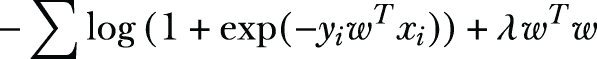

在训练集（X, Y）上，其中 X = [x[1], x[2],...,x[n]], Y = [y[1], y[2],...,y[n]], λ是一个超参数，用于设置正则化的强度。

为什么逻辑回归中需要正则化？

过度拟合是机器学习任务中常见的问题。通常，我们会在一组数据上训练一个模型，它似乎在那组数据上表现良好，但当我们用一组未见过的数据对其进行测试时，性能会下降。导致这个问题的原因之一是过度拟合，即模型过于紧密地符合训练集，从而错过了更通用的趋势。

正则化被称为收缩方法，因为它们“收缩”了结果回归中的系数。这种系数的收缩减少了模型中的方差，有助于避免过度拟合。用更简单的话说，有了正则化，当输入变量改变时，模型的预测变化小于没有正则化时的变化。

实现差分隐私逻辑回归

我们可以在设计差分隐私逻辑回归时采用目标扰动策略，其中向学习算法的目标函数中添加噪声。我们将使用基于经验风险最小化的向量机制来决定噪声函数的最小值和最大值，以产生 DP 噪声输出模型。

Chaudhuri 等人提出的定理 3.1 为正则化逻辑回归公理化了敏感性 [5]。训练数据输入 {(x[i], y[i]) ∈ X × Y:i = 1,2,...,n} 由 n 个数据标签对组成。此外，我们将使用符号 ‖A‖[2] 来表示 A 的 L[2] 范数。我们正在训练参数 w，λ 是一个超参数，用于设置正则化的强度。

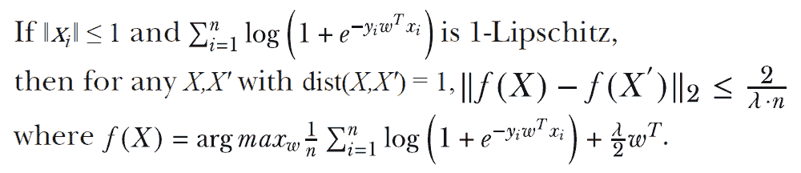

定理 3.1

您可以参考原文以获取数学证明和细节。现在我们关注的是敏感度的计算，即 ‖f(X) − f(X')‖[2] 的差，它小于或等于 2/λ ∙ n。

现在，我们将使用目标扰动策略来设计我们的差分隐私逻辑回归算法，其中敏感性是根据定理 3.1 计算的。图 3.9 展示了伪代码。有关基于经验风险最小化的向量机制的更多细节，请参阅原文 [5]。

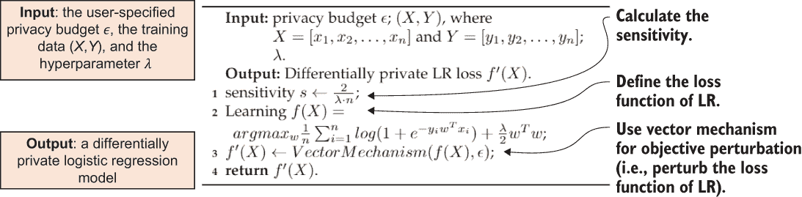

图 3.9 差分隐私逻辑回归的工作原理

基于我们之前使用的 adult 数据集，让我们继续之前的场景，通过训练逻辑回归分类模型来预测一个人是否每年收入超过 50,000 美元。首先，让我们从 adult 数据集中加载训练和测试数据。

列表 3.3 加载测试和训练数据

```
import numpy as np

X_train = np.loadtxt("https://archive.ics.uci.edu/ml/machine-learning-
➥ databases/adult/adult.data", 
➥ usecols=(0, 4, 10, 11, 12), delimiter=", ")

y_train = np.loadtxt("https://archive.ics.uci.edu/ml/machine-learning-
➥ databases/adult/adult.data", 
➥ usecols=14, dtype=str, delimiter=", ")

X_test = np.loadtxt("https://archive.ics.uci.edu/ml/machine-learning-
➥ databases/adult/adult.test", 
➥ usecols=(0, 4, 10, 11, 12), delimiter=", ", skiprows=1)

y_test = np.loadtxt("https://archive.ics.uci.edu/ml/machine-learning-
➥ databases/adult/adult.test", 
➥ usecols=14, dtype=str, delimiter=", ", skiprows=1)

y_test = np.array([a[:-1] for a in y_test])
```

对于 diffprivlib，当特征缩放到控制数据范数时，逻辑回归表现最佳。为了简化此过程，我们将在 sklearn 中创建一个 Pipeline：

```
from sklearn.linear_model import LogisticRegression
from sklearn.pipeline import Pipeline
from sklearn.preprocessing import MinMaxScaler

lr = Pipeline([
    ('scaler', MinMaxScaler()),
    ('clf', LogisticRegression(solver="lbfgs"))
])
```

现在我们首先训练一个常规（非隐私）逻辑回归分类器并测试其准确性：

```
lr.fit(X_train, y_train)

from sklearn.metrics import accuracy_score

print("Non-private test accuracy: %.2f%%" % (accuracy_score(y_test,
➥ lr.predict(X_test)) * 100))
```

您将得到如下输出：

```
> Non-private test accuracy: 81.04%
```

要应用差分隐私逻辑回归，我们首先安装 IBM 差分隐私库：

```
!pip install diffprivlib
```

使用 diffprivlib.models.LogisticRegression 模块，我们可以在满足 DP 的同时训练逻辑回归分类器。

如果我们没有指定任何参数，模型默认为 epsilon = 1 和 data_norm = None。如果在初始化时没有指定数据的范数（如本例所示），则在第一次调用 .fit() 时会在数据上计算范数，并会抛出一个警告，因为这会导致隐私泄露。为了确保没有额外的隐私泄露，我们应该显式地指定数据范数作为参数，并选择与数据无关的界限。例如，我们可以使用领域知识来做到这一点。

列表 3.4 训练逻辑回归分类器

```
import diffprivlib.models as dp
dp_lr = Pipeline([
    ('scaler', MinMaxScaler()),
    ('clf', dp.LogisticRegression())
])

dp_lr.fit(X_train, y_train)

print("Differentially private test accuracy (epsilon=%.2f): %.2f%%" %
➥ (dp_lr['clf'].epsilon, accuracy_score(y_test, 
➥ dp_lr.predict(X_test)) * 100))
```

输出将类似于以下内容：

```
> Differentially private test accuracy (epsilon=1.00): 80.93%
```

如前所述的输出准确率所示，常规（非隐私）逻辑回归分类器产生了 81.04%的准确率；通过设置 epsilon=1.00，差分隐私逻辑回归可以达到 80.93%的准确率。使用较小的 epsilon 通常会导致更好的隐私保护，但准确性会降低。例如，如果我们设置 epsilon=0.01：

```
import diffprivlib.models as dp
dp_lr = Pipeline([
    ('scaler', MinMaxScaler()),
    ('clf', dp.LogisticRegression(epsilon=0.01))
])

dp_lr.fit(X_train, y_train)

print("Differentially private test accuracy (epsilon=%.2f): %.2f%%" %
➥ (dp_lr['clf'].epsilon, accuracy_score(y_test, 
➥ dp_lr.predict(X_test)) * 100))
```

如预期的那样，结果将看起来像这样：

```
> Differentially private test accuracy (epsilon=0.01): 74.01%
```

### 3.2.3 差分隐私线性回归

与逻辑回归不同，线性回归模型在数据集中定义了观察到的目标变量与多个解释变量之间的线性关系。它通常用于回归分析中的趋势预测。计算此类模型的最常见方法是使数据集中观察到的目标（解释变量）与线性近似预测的目标（解释变量）之间的残差平方和最小化。

让我们深入研究理论基础。我们可以将线性回归的标准问题表述为寻找 β = arg min[β]‖Xβ − y‖²，其中 X 是解释变量矩阵，y 是解释变量向量，β 是待估计的未知系数向量。

岭回归是线性回归的正则化版本，可以表示为 β^R= arg min[β]‖Xβ − y‖² + w²‖β‖²，它有一个封闭形式的解：β^R = (X^TX + w²I[p×p])X^Ty，其中 w 被设置为最小化 β^R 的风险。

设计差分隐私线性回归的问题变成了设计第二矩矩阵的差分隐私近似。为了实现这一点，Sheffet [6] 提出了一种算法，使用 Wishart 机制向第二矩矩阵添加噪声。有关更多详细信息，您可以参考原始论文，但这对我们继续前进已经足够了。

让我们考虑在糖尿病数据集上训练线性回归的场景。这是机器学习研究人员中另一个流行的数据集，您可以在以下链接中找到更多关于它的信息：[`archive.ics.uci.edu/ml/datasets/diabetes`](https://archive.ics.uci.edu/ml/datasets/diabetes)。我们将使用 scikit-learn 提出的示例（[`scikit-learn.org/stable/auto_examples/linear_model/plot_ols.xhtml`](https://scikit-learn.org/stable/auto_examples/linear_model/plot_ols.xhtml)），并使用糖尿病数据集来训练和测试线性回归器。

我们首先加载数据集，并将其分为训练样本和测试样本（80/20 的分割）：

```
from sklearn.model_selection import train_test_split
from sklearn import datasets

dataset = datasets.load_diabetes()
X_train, X_test, y_train, y_test = train_test_split(dataset.data,
➥ dataset.target, test_size=0.2)
print("Train examples: %d, Test examples: %d" % (X_train.shape[0],
➥ X_test.shape[0]))
```

你将得到类似以下的结果，显示训练集和测试集中的样本数量：

```
> Train examples: 353, Test examples: 89
```

我们现在将使用 scikit-learn 的原生 LinearRegression 函数为我们的实验建立一个非隐私基线。我们将使用 r 平方分数来评估模型的拟合优度。r 平方分数是一个统计量，表示回归模型中由独立变量或变量解释的因变量的方差比例。r 平方分数越高，线性回归模型越好。

```
from sklearn.linear_model import LinearRegression as sk_LinearRegression
from sklearn.metrics import r2_score

regr = sk_LinearRegression()
regr.fit(X_train, y_train)
baseline = r2_score(y_test, regr.predict(X_test))
print("Non-private baseline: %.2f" % baseline)
```

结果将类似于以下内容：

```
> Non-private baseline: 0.54
```

要应用差分隐私线性回归，让我们首先安装 IBM Differential Privacy Library，如果您还没有这样做的话：

```
!pip install diffprivlib
```

现在让我们训练一个差分隐私线性回归器（epsilon=1.00），其中训练模型对训练数据是差分隐私的：

```
from diffprivlib.models import LinearRegression

regr = LinearRegression()
regr.fit(X_train, y_train)

print("R2 score for epsilon=%.2f: %.2f" % (regr.epsilon, 
➥ r2_score(y_test, regr.predict(X_test))))

```

你将得到一个类似于以下 R2 分数：

```
> R2 score for epsilon=1.00: 0.48
```

## 3.3 差分隐私无监督学习算法

无监督学习是一种从未标记数据中学习模式的算法。在这种学习类型中，特征向量不包含类标签或响应变量。在这种情况下，目标是找到数据结构。

聚类可能是最常见的无监督学习技术，它的目的是将一组样本分组到不同的聚类中。同一聚类中的样本应该相对相似，并且与其他聚类中的样本不同（相似度度量可以是欧几里得距离）。*k*-means 聚类是最受欢迎的聚类方法之一，它被用于许多应用。本节将介绍 *k*-means 聚类的差分隐私设计，并带您了解设计过程。

### 3.3.1 差分隐私 k-means 聚类

我们现在将转向差分隐私无监督学习算法。我们将首先检查 *k*-means 聚类及其工作原理。

什么是 *k*-means 聚类？

在高层次上，*k*-means 聚类尝试将相似的项目分组或分组。假设我们有一组数据点，我们希望根据它们的相似性将它们分配到组（或聚类）中；组数用 *k* 表示。

*k*-means 有多种不同的实现，包括 Lloyd 的、MacQueen 的和 Hartigan-Wong 的 *k*-means。我们将查看 Lloyd 的 *k*-mean 算法 [7]，因为它是 *k*-means 最广为人知的实现。

在训练 *k*-means 模型过程中，算法从 *k* 个随机选择的质心点开始，这些点代表 *k* 个聚类。然后算法迭代地将样本聚类到最近的质心点，并通过计算聚类到质心点的样本的平均值来更新质心点。

让我们来看一个例子。在你的超市新鲜食品区，你会看到不同种类的水果和蔬菜。这些商品按其类型分组排列：所有的苹果都在一个地方，橙子放在一起，等等。你很快会发现它们形成组或聚类，其中每个项目都在其类型的组内，形成聚类。

实现差分隐私**k**-均值聚类

现在我们已经概述了**k**-均值聚类，接下来让我们开始探讨差分隐私**k**-均值聚类。这种设计遵循一种称为 DPLloyd [8]（Lloyd 的**k**-均值的扩展）的算法扰动策略，其中在 Lloyd 算法的迭代更新步骤中应用拉普拉斯机制（即添加拉普拉斯噪声）。本质上，它向中间质心和聚类大小添加拉普拉斯噪声，从而产生差分隐私**k**-均值模型。

假设**k**-均值聚类的每个样本是一个**d**-维点，并假设**k**-均值算法有一个预定的运行迭代次数，表示为 t。在**k**-均值算法的每次迭代中，计算两个值：

+   每个聚类 C[i]的样本总数，表示为 n[i]（即计数查询）

+   每个聚类 C[i]的样本总和（用于重新计算质心），表示为 s[i]（即求和查询）

然后，在**k**-均值中，每个样本将涉及 d ⋅ t 次求和查询和 t 次计数查询。添加或删除一个新样本将使 n[i]增加 1，这种操作可能在每次迭代中发生，因此 n[i]的敏感性是 t。假设每个样本的每个维度（即特征）的大小被限制在范围[−r,r]内。那么，通过添加或删除一个新样本，x[i]的变化将是 d ⋅ r ⋅ t。

如前所述，我们将使用算法扰动策略来设计我们的差分隐私**k**-均值聚类算法，其中计算计数查询和求和查询的敏感性。拉普拉斯机制（即添加拉普拉斯噪声）通过向中间质心和聚类大小添加噪声，应用于 Lloyd 算法的迭代更新步骤。图 3.10 展示了算法的伪代码，大部分都是自我解释的。

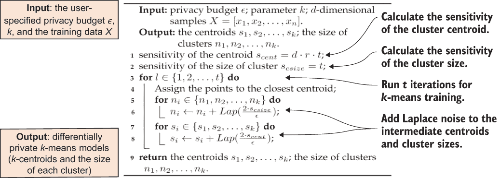

图 3.10 差分隐私**k**-均值聚类的工作原理

让我们在 scikit-learn 的 load_digits 数据集上训练一个*k*-means 聚类模型。我们将遵循 scikit-learn 给出的示例，并使用 load_digits 数据集来训练和测试一个*k*-means 模型。如图 3.5 所示，我们将使用几个不同的指标来评估聚类性能。评估聚类算法的性能并不像计算错误数量或监督分类算法的精确率和召回率那样简单。因此，我们将查看同质性、完整性和 V-measure 评分，以及调整后的兰德指数（ARI）和调整后的互信息（AMI）评分。请参阅 scikit-learn 文档以获取详细步骤和数学公式：[`scikit-learn.org/stable/modules/clustering.xhtml#clustering-evaluation`](https://scikit-learn.org/stable/modules/clustering.xhtml#clustering-evaluation)。

列表 3.5 训练一个*k*-means 聚类模型

```
import numpy as np
from time import time
from sklearn import metrics
from sklearn.cluster import KMeans
from sklearn.datasets import load_digits
from sklearn.preprocessing import scale

X_digits, y_digits = load_digits(return_X_y=True)
data = scale(X_digits)

n_samples, n_features = data.shape
n_digits = len(np.unique(y_digits))
labels = y_digits

sample_size = 1000

print("n_digits: %d, \t n_samples %d, \t n_features %d"
      % (n_digits, n_samples, n_features))
> n_digits: 10,  n_samples 1797,  n_features 64

print('init\t\ttime\tinertia\thomo\tcompl\tv-meas\tARI\tAMI\tsilhouette')
> nit time inertia homo compl v-meas ARI AMI silhouette

def bench_k_means(estimator, name, data):
    t0 = time()
    estimator.fit(data)
    print('%-9s\t%.2fs\t%i\t%.3f\t%.3f\t%.3f\t%.3f\t%.3f\t%.3f'
          % (name, (time() - t0), estimator.inertia_,
             metrics.homogeneity_score(labels, estimator.labels_),
             metrics.completeness_score(labels, estimator.labels_),
             metrics.v_measure_score(labels, estimator.labels_),
             metrics.adjusted_rand_score(labels, estimator.labels_),
             metrics.adjusted_mutual_info_score(labels,
             estimator.labels_),
             metrics.silhouette_score(data, estimator.labels_,
                                      metric='euclidean',
                                      sample_size=sample_size)))
```

我们现在将使用 scikit-learn 的本地 KMeans 函数来为我们的实验建立一个非私有的基线。我们将使用 k-means++和随机初始化：

```
bench_k_means(KMeans(init='k-means++', n_clusters=n_digits, n_init=100),
              name="k-means++", data=data)

bench_k_means(KMeans(init='random', n_clusters=n_digits, n_init=100),
              name="random", data=data)
```

结果可能看起来像图 3.11。如图所示，前面的代码涵盖了不同的结果评分指标，如同质性、完整性等。同质性、完整性和 V-measure 评分的下限是 0.0，上限是 1.0，数值越高越好。直观上，可以通过使用同质性和完整性评分来定性分析具有较差 V-measure 的聚类，以更好地确定分配过程中所犯的错误类型。对于 ARI、AMI 和轮廓系数评分，范围是-1 到 1。同样，数值越高越好。最后，较低的值通常表示两个几乎独立的标签，而接近 1 的值表示有显著的一致性。

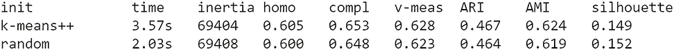

图 3.11 比较结果：k-means++与随机初始化

现在让我们为 k-means 聚类应用差分隐私：

```
!pip install diffprivlib 
from diffprivlib.models import KMeans

bench_k_means(KMeans(epsilon=1.0, bounds=None, n_clusters=n_digits,
➥ init='k-means++', n_init=100), name="dp_k-means", data=data)
```

一旦应用了差分隐私*k*-means 聚类，你将看到如图 3.12 所示的结果。如图所示，dp_k-means 提供了比 k-means++和随机初始化更多样化的结果，提供了更好的隐私保障。当你比较不同评分指标的数值时，你会看到差分隐私如何影响最终结果。

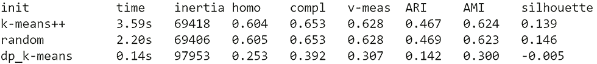

图 3.12 应用差分隐私*k*-means 聚类后的结果比较

我们现在已经研究了几个不同差分隐私机器学习算法的设计和使用，并进行了一些实际实验。在下一节中，我们将使用差分隐私主成分分析（PCA）作为案例研究应用，并引导你了解设计差分隐私机器学习算法的过程。

## 3.4 案例研究：差分隐私主成分分析

在前面的章节中，我们讨论了当今应用中常用的 DP 机制以及各种差分隐私机器学习算法的设计和用法。在本节中，我们将讨论如何设计作为案例研究的差分隐私主成分分析（PCA），以向您介绍设计差分隐私机器学习算法的过程。本节的内容部分发表在我们的论文[9]中，您可以参考以获取更多详细信息。本案例研究的实现可以在本书的 GitHub 仓库中找到：[`github.com/nogrady/PPML/blob/main/Ch3/distr_dp_pca-master.zip`](https://github.com/nogrady/PPML/blob/main/Ch3/distr_dp_pca-master.zip)。

注意：本节旨在向您介绍我们案例研究的所有数学公式和实证评估，以便您了解如何从头开始开发一个差分隐私应用。如果您目前不需要了解所有这些实现细节，您可以跳到下一章，稍后再回到这一节。

### 3.4.1 PCA 在水平分区数据中的隐私性

PCA 是一种统计过程，它从底层数据中计算出一个低维子空间，并生成一组新的变量，这些变量是原始变量的线性组合。它在各种数据挖掘和机器学习应用中得到了广泛应用，例如网络入侵检测、推荐系统、文本和图像处理等。

在 2016 年，Imtiaz 等人提出了一种前所未有的隐私保护分布式 PCA 协议[10]。他们的主要想法是通过聚合每个数据所有者的本地 PCA 来近似全局 PCA，其中数据所有者持有水平分区数据。然而，他们的工作存在运行时间过长和效用退化的缺点，而局部主成分无法很好地表示数据。更具体地说，他们的解决方案要求所有数据所有者都在线，并且逐个传输本地 PCA 数据。这种序列化计算使得他们的协议依赖于数据所有者的数量，这严重降低了效率和可扩展性。此外，当数据量远小于其特征数量时，局部主成分无法很好地表示主成分的效用。

数据水平分区和垂直分区的区别

在许多实际的大规模解决方案中，数据通常被划分为可以单独管理和访问的分区。分区可以提高可扩展性和性能，同时减少竞争。水平分区（通常称为分片）将行分区到具有相同模式和列的多个数据存储中。垂直分区将列分割到包含相同行的多个数据存储中。

在我们的案例研究中，我们将假设数据是水平划分的，这意味着所有数据共享相同的特征。数据所有者的数量将超过数百。我们将假设一个不可信的数据用户想要学习分布式数据的主成分。一个诚实但好奇的中间方，称为 *proxy*，在数据用户和数据所有者之间工作。

数据所有者同时加密自己的数据份额并将其发送给代理。代理在加密数据上运行差分隐私聚合算法，并将输出发送给数据用户。然后，数据用户从输出中计算主成分，而不了解底层数据的内容。

在我们的实验中，我们将研究所提出协议的运行时间、效用和隐私权衡，并将其与先前的工作进行比较。

“诚实但好奇”是什么意思？

通常，在通信协议中，一个诚实但好奇的对手是一个合法的参与者或用户，他不会偏离协议定义的限制，但会尝试从合法接收的消息中学习所有可能的信息。

在继续我们的协议设计之前，让我们简要回顾一下主成分分析（PCA）和同态加密的概念。

主成分分析是如何工作的

让我们快速浏览一下主成分分析（PCA）的数学公式。给定一个方阵 A，A 的一个特征向量 v 是一个非零向量，当 A 作用于它时不会改变方向，即

Av = λv

其中 λ 是一个实数标量，称为特征值。假设 A ∈ ℝ^((n×n))，那么它最多有 n 个特征向量，每个特征向量都与一个不同的特征值相关联。

考虑一个包含 *N* 个样本 x[1], x[2],...,x[N] 的数据集，其中每个样本有 M 个特征（x^i ∈ ）。一个中心调整的散点矩阵 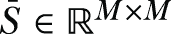 计算如下，

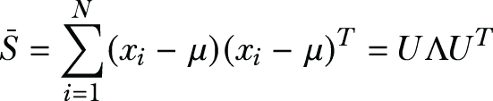

其中 μ 是均值向量，μ = 1/N ∑^N[(i=1)]x[i]。通过在 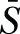 上进行特征值分解（EVD），我们将得到 *Λ* 和 *U*，其中 *Λ* = diag(*λ*[1], *λ*[2],...,*λ*[M]) 是一个特征值对角矩阵。

这可以按绝对值非递增的顺序排列；换句话说，‖λ[1]‖ ≥ ‖λ[2]‖ ≥ ⋯ ≥ ‖λ[M]‖，U = [u[1] u[2] ... u[M] ] 是一个 M × M 矩阵，其中 u[j] 表示  的第 j 个特征向量。

在主成分分析（PCA）中，每个特征向量代表一个主成分。

同态加密是什么？

同态加密是这个工作的一个基本构建块。简单来说，它允许在加密数据上执行计算，其中生成的结果的解密与在明文上执行的操作的结果相匹配。在本节中，我们将使用 Paillier 密码系统来实现协议。

为了刷新你的记忆，Paillier 密码系统是由 Pascal Paillier 提出的一种用于公钥密码学的概率非对称算法（一种部分同态加密方案）。

让我们考虑函数 ε[pk][⋅]，它是一个具有公钥 pk 的加密方案，函数 D[sk][⋅]是一个具有私钥 sk 的解密方案。加法同态加密可以定义为

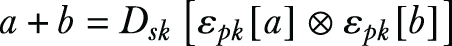

其中 ⊗ 表示加密域中的模乘法运算符，a 和 b 是明文消息。乘法同态加密定义为

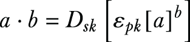

由于密码系统只接受整数作为输入，实数应该被离散化。在这个例子中，我们将采用以下公式，

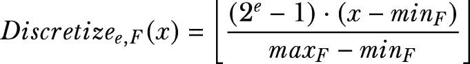

其中 e 是位数，min[F]，max[F]是特征 F 的最小值和最大值，x 是要离散化的实数，Discretize(e,F)取值在[0,2^((e-1))].

### 3.4.2 在水平划分的数据上设计差分隐私 PCA

让我们首先回顾一下我们在这里想要实现的目标（见图 3.13）。假设有 L 个数据所有者，每个数据所有者 l 有一个数据集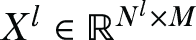，其中 *M* 是维数数量，*N*^l 是数据所有者 l 持有的样本数量。*X*^l 的横向聚合生成一个数据矩阵 *X* ∈ ℝ^((N×M))，其中 *N* *= ∑*^l[(i=1)]*N*^i。现在假设一个数据用户想要对 *X* 执行 PCA。为了保护原始数据的隐私，数据所有者不会以明文形式与数据用户共享原始数据。

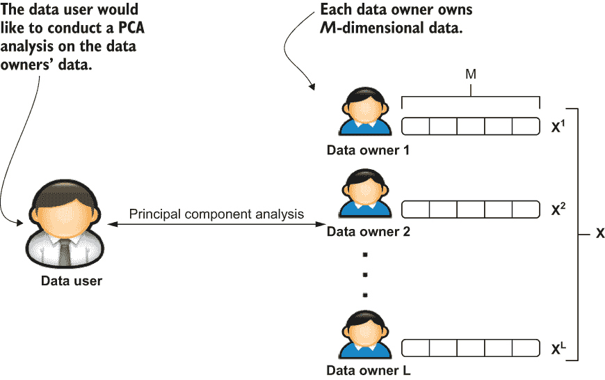

图 3.13 分布式 PCA 的高级概述

为了适应这一点，我们需要设计一个差分隐私分布式 PCA 协议，允许数据用户执行 PCA，但除了主成分之外，不学习任何信息。图 3.14 说明了差分隐私分布式 PCA 协议的一个设计方案。在这种情况下，假设数据所有者是诚实的，并且不会相互勾结，但假设数据用户是不可信的，并且会想要学习比主成分更多的信息。代理作为一个诚实但好奇的中间方，不会与数据用户或所有者勾结。

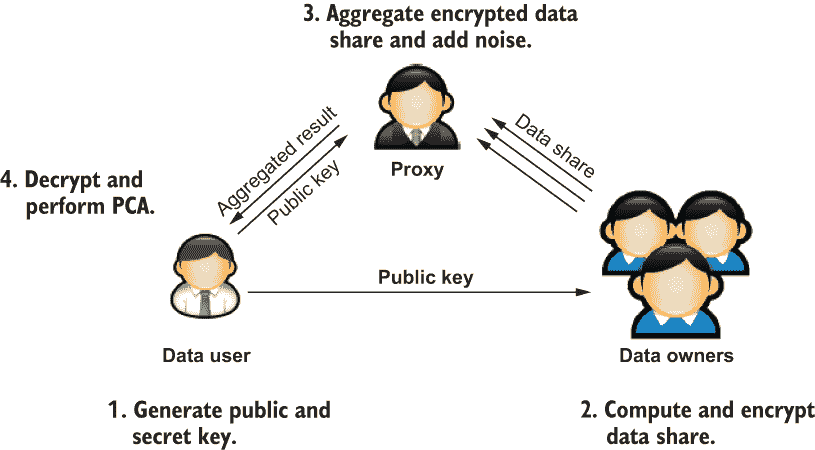

图 3.14 协议的设计和工作原理

为了学习 X 的主成分，需要计算 X 的散布矩阵。在提出的协议中，每个数据所有者 l 计算 X^l 的数据份额。为了防止代理学习数据，每个数据份额在发送到代理之前都会被加密。一旦代理从每个数据所有者那里收到加密的数据份额，代理就会运行差分隐私聚合算法，并将聚合结果发送给数据用户。然后数据用户从结果中构建散布矩阵并计算主成分。图 3.14 概述了这些步骤。

计算散布矩阵

让我们来看看分布式散布矩阵的计算。

假设有 L 个数据所有者，每个数据所有者 l 有一个数据集，，其中 M 是维度数，N^l 是 l 持有的样本数。每个数据所有者本地计算一个包含

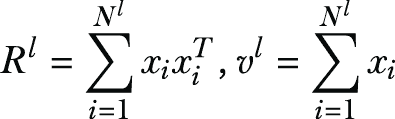

其中 x[i] = [x[i1] x[i2]... x[iM]]^Te。散布矩阵 可以通过对每个数据所有者的数据份额求和来计算：

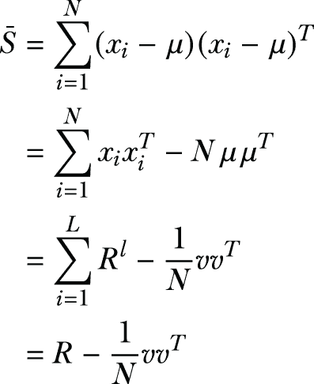

其中

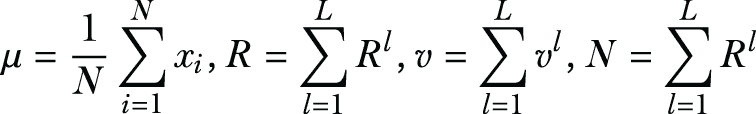

分布式散布矩阵的计算允许每个数据所有者同时计算部分结果。与其它方法[10]不同，这种方法减少了数据所有者之间的依赖性，并允许它们同时发送数据份额。

设计协议

防止通过代理泄露任何可能的数据泄露至关重要，因此每个数据份额应由数据所有者加密。然后代理对收到的加密份额进行聚合。为了防止从 PCA 中进行推断，代理向聚合结果添加一个噪声矩阵，使得散布矩阵的近似满足(ϵ, δ)-DP。然后，聚合结果被发送给数据用户。

什么是(ϵ, δ)-DP？δ是另一个隐私预算参数，其中，当δ = 0 时，算法满足ϵ-DP，这比δ > 0 的(ϵ, δ)-DP 提供了更强的隐私保证。你可以在附录 A.1 中找到关于δ的更多详细信息。

这可以看作是ϵ-DP 的最一般松弛，它通过允许一个额外的微小δ概率密度来放宽定义，这个概率密度上的上界ε不成立。如果你考虑 DP 的实际应用，这会导致数据发布的困境。你不可能总是忠实于数据并保护所有个人的隐私。输出效用和隐私之间存在权衡。特别是在异常值的情况下，ε隐私发布将几乎没有效用（因为敏感性很大，导致添加了很多噪声）。

或者，你可以移除异常值或修剪它们的值以实现更合理的敏感性。这样，输出将具有更好的效用，但它不再是数据集的真实表示。

所有这些最终导致 (ϵ, δ) 隐私。数据用户解密结果，构建散点矩阵的近似，然后计算 PCA，正如你之前看到的。让我们一步一步来：

1.  数据用户为 Paillier 密码系统生成一个公钥对（pk 和 sk），并将 pk 发送给代理和数据所有者。在实践中，安全地分发密钥很重要，但在这里我们不强调这一点。

    此后，数据所有者计算份额 R^l，v^l，l = 1,2,..., L，并将 ε[pk][R^l]，ε[pk][v^l]，ε[pk][N^l] 发送到代理。

1.  在收到来自每个数据所有者的加密数据份额后，代理聚合份额并应用对称矩阵噪声以满足 DP。这个过程如图 3.15 中的算法 1 所示。

让我们看看算法 1 来了解这里发生了什么：

1.  第 2-4 行：聚合来自每个数据所有者的数据份额。

    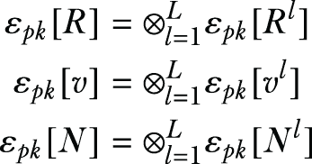

1.  第 5-7 行：构建噪声 ε[pk][v ']。为了防止数据用户从 v 中学习信息，代理通过将随机向量 ε[pk][b] 与 ε[pk][v] 相加来生成噪声 ε[pk][v']，使得 ε[pk][v'] = ε[pk][v] ⊗ ε[pk][b]。可以证明，v'v'^T 的元素 v'[ij] 是

    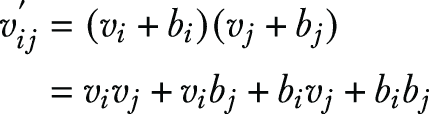

    方程式的两边都除以 N，得到

    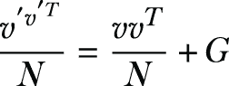

    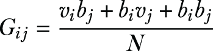

    因此，我们有

    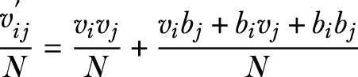

    回想一下，在 Paillier 密码系统中，乘法同态性质定义为

    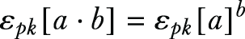

    然后，ε[pk][G[ij]] 是

    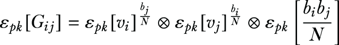

    在这一点上，我们可以通过将 b 与 N 相乘来使指数成为整数。需要注意的是，在加密过程中，代理必须学习 N。为了实现这一点，代理将 ℇ[pk][N] 发送到数据用户，数据用户在解密后以明文形式返回 N。

1.  第 8-10 行：应用对称矩阵以满足 (ϵ, δ)-DP。代理根据 DP 参数 (ϵ, δ) 生成 G’ ∈ ℝ^(M×M)，并获取 ℇ[pk][R’]，ℇ[pk][v’]，其中

    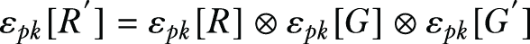

    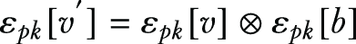

    然后，将 ℇ[pk][R’]，ℇ[pk][v’] 发送到数据用户。

    在从代理收到聚合结果 ε[pk][N]，ε[pk][R’]，ε[pk][v’] 后，数据用户对每个结果进行解密并计算 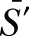。

    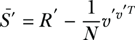

    使用，数据用户可以继续计算特征向量并得到主成分。

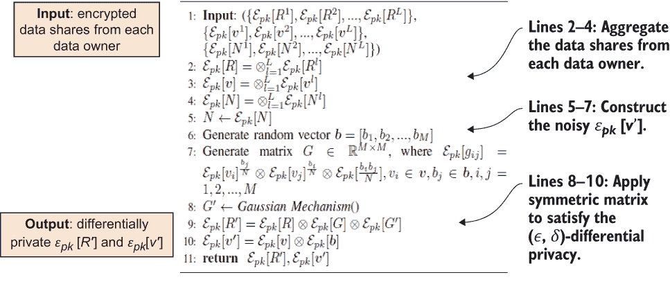

图 3.15 算法 1：DPAggregate

分析安全性和隐私性

现在我们来确定协议是否足够安全。在我们的例子中，假设数据用户是不可信的，代理假设是诚实但好奇的。此外，我们假设代理不会与数据用户或数据所有者勾结。

为了保护数据免受代理的侵害，数据所有者加密了 R^l、v^l 和 N^l。在协议执行过程中，代理只学习到明文中的 N，它不会泄露单个数据所有者的隐私。在没有与数据用户勾结的情况下，代理不能学习到 R^l、v^l 和 N^l 的值。另一方面，代理将 R 和 v 与随机噪声混合，以防止数据用户获取除了主成分之外的信息。

从代理接收到的数据中，数据用户解密了ε[pk][N]、ε[pk][R’]、ε[pk][v’]，然后继续构建散点矩阵的近似值，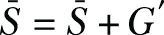，其中 G’是 R’携带的高斯对称矩阵。对于的后处理算法，(ϵ, δ)-DP 是封闭的。由于代理没有与数据用户勾结，数据用户不能学习 R 和 v 的值。因此，数据用户只能学习到计算出的主成分。

作为一种灵活的设计，这种方法可以与不同的对称噪声矩阵合作，以满足(ϵ, δ)-DP。为了向您展示协议，我们实现了算法 2（图 3.16）中的高斯机制。

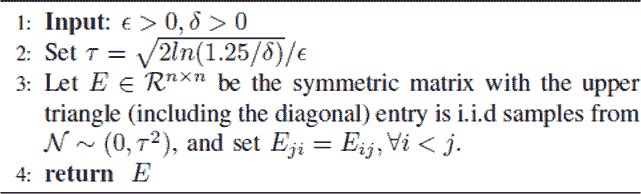

图 3.16 算法 2：高斯机制

值得注意的是，一旦数据用户从协议中学习到私有主成分，他们可能会将这些主成分公开以供进一步使用，这将允许代理访问这些组件。在这种情况下，代理仍然没有足够的信息从完整的主成分集中恢复协方差矩阵，这意味着代理不能从发布的数据中恢复协方差矩阵的近似值。此外，数据用户可能会发布主成分的子集（前 K 个），而不是完整的组件集，这将使代理恢复协方差矩阵变得更加困难。不知道协方差矩阵的近似值，代理不能通过去除添加的噪声来推断原始数据。

### 3.4.3 实验评估协议的性能

我们已经讨论了所提议协议的理论背景，现在让我们实现差分隐私分布式主成分分析（DPDPCA）协议，并从效率、效用和隐私等方面对其进行评估。为了评估效率，我们将测量 DPDPCA 的运行时间效率，并将其与文献[10]中的类似工作进行比较；这将表明 DPDPCA 优于先前的工作。

此实验将使用 Python 和发布在[`github.com/mikeivanov/paillier`](https://github.com/mikeivanov/paillier)的 Python Paillier 同态密码系统库进行开发。

数据集和评估方法

我们将使用六个数据集进行实验，如表 3.2 所示。Aloi 数据集是小型物体彩色图像的集合，Facebook 评论量数据集包含从 Facebook 帖子中提取的特征，而百万歌曲数据集由音频特征组成。Aloi、Facebook 和百万歌曲的基数超过 100,000，每个的维度小于 100。CNAE 数据集是从商业文档中提取的文本数据集，属性是词频。GISETTE 数据集包含用于 NIPS 2003 特征选择挑战的高度混淆的数字 4 和 9 的灰度图像。ISOLET 是一个语音字母数据集，记录了 150 个受试者的 26 个英语字母，并具有如频谱系数和轮廓特征等特征组合。所有数据集（除 Aloi 外）均来自 UCI ML 存储库，而 Aloi 来自 LIBSVM 数据集存储库。我们将通过 CNAE、GISETTE 和 ISOLET 数据集上的 SVM 分类来评估 DPDPCA 的性能。

表 3.2 实验数据集摘要

| 数据集 | 特征 | 基数 |
| --- | --- | --- |
| Aloi | 29 | 108,000 |
| Facebook | 54 | 199,030 |
| 百万歌曲 | 90 | 515,345 |
| CNAE | 857 | 1,080 |
| ISOLET | 617 | 7,797 |
| GISETTE | 5,000 | 13,500 |

对于分类结果，我们将测量精确度、召回率和 F1 分数，因为数据集是不平衡的。您可以参考以下数学公式以了解这些测量的详细信息。此外，所有实验将运行 10 次，并将结果的平均值和标准差绘制在图中。

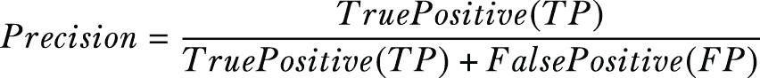

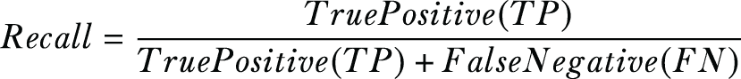

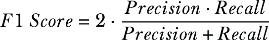

提出方法的高效性

正如我们所提到的，先前的工作存在两个主要问题：协议运行时间过长以及当局部主成分无法提供良好的数据表示时，效用下降。在本节中，我们将从这两个方面比较这两种协议。为了简洁起见，我们将所提议的协议称为“DPDPCA”，而 Imtiaz 和 Sarwate[11]所做的工作称为“PrivateLocalPCA”。

首先，我们将查看 DPDPCA 和 PrivateLocalPCA 的运行时间结果。DPDPCA 的总运行时间包括以下部分：

+   数据所有者的平均局部计算时间

+   代理中私有聚合算法的时间

+   数据用户执行 PCA 的时间

+   各方之间的数据传输时间

对于 PrivateLocalPCA，运行时间从第一个数据所有者开始，到最后一个数据所有者结束，包括局部 PCA 计算和传输时间。我们使用 I/O 操作而不是本地网络来模拟数据传输，以使通信一致且稳定。我们测量了不同数量数据所有者的协议运行时间，并且所有样本都被均匀分配到每个数据所有者。实验在一台台式机上运行（i7-5820k，64 GB 内存）。

结果如图 3.17 所示。横坐标指定数据所有者的数量，纵坐标指定运行时间（秒）。您可以看到 PrivateLocalPCA 的运行时间几乎与数据所有者的数量呈线性关系。这是因为 PrivateLocalPCA 要求将局部主成分逐个通过数据所有者传输，下一个数据所有者必须等待前一个数据所有者的结果。因此，它的时间复杂度为 O(*n*)，其中*n*是数据所有者的数量。相比之下，DPDPCA 在相同数量的数据所有者下所需时间远少于 PrivateLocalPCA。原因是，首先，分布式散度矩阵计算允许每个数据所有者同时计算他们的局部份额，其次，代理可以并行实现局部份额的聚合，其运行时间与数据所有者的数量呈对数线性关系。总的来说，DPDPCA 在数据所有者数量方面比 PrivateLocalPCA 具有更好的可扩展性。

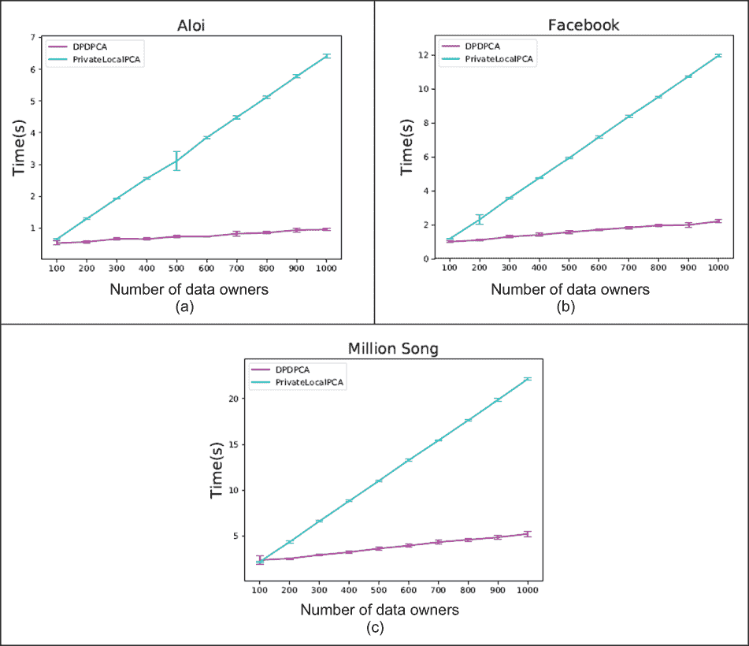

图 3.17 DPDPCA 与 PrivateLocalPCA 的运行时间比较，**∈** = 0.3

对应用程序效用的影响

接下来，我们将探讨当数据量远小于特征数量时，PrivateLocalPCA 和 DPDPCA 的效用退化。我们考虑一个场景，即每个数据所有者持有包含基数可能远小于特征数量的数据集，例如图像、音乐和电影的评分以及个人活动数据。为了模拟这种情况，我们在实验中将不同大小的样本分配给每个数据所有者。对于 PrivateLocalPCA，由于只使用了前几个主成分来表示数据，因此方差并未完全保留。

与之相反，DPDPCA 不受每个数据拥有者持有的样本数量的影响，并且局部描述性统计被汇总以构建散点矩阵。因此，总方差不会丢失。在本实验中，我们测量了关于不同数量的私有主成分的转换数据的 F1 分数。主成分的数量由每个数据拥有者对数据的排名决定。训练和测试数据被投影到一个低维空间，其中包含来自每个协议的组件。然后我们使用转换后的训练数据训练一个具有 RBF 核的 SVM 分类器，并使用未见过的数据测试分类器。为了提供真实情况，还对训练数据执行了无噪声 PCA。此外，相同的对称矩阵噪声机制[10]也被应用于 DPDPCA，以进行公平的比较。

图 3.18 显示了结果。水平轴指定每个数据拥有者持有的样本数量，垂直轴显示 F1 分数。你可以看到 DPDPCA 的 F1 分数对数据拥有者的样本数量不变，结果与无噪声 PCA 兼容，这意味着保持了高效用。相比之下，PrivateLocalPCA 的 F1 分数受到每个数据拥有者样本数量的严重影响，并且它不能仅通过少量样本来保持效用。总的来说，对于 CNAE 和 GISETTE 数据集，在所有设置下，DPDPCA 的 F1 分数都优于 PrivateLocalPCA。

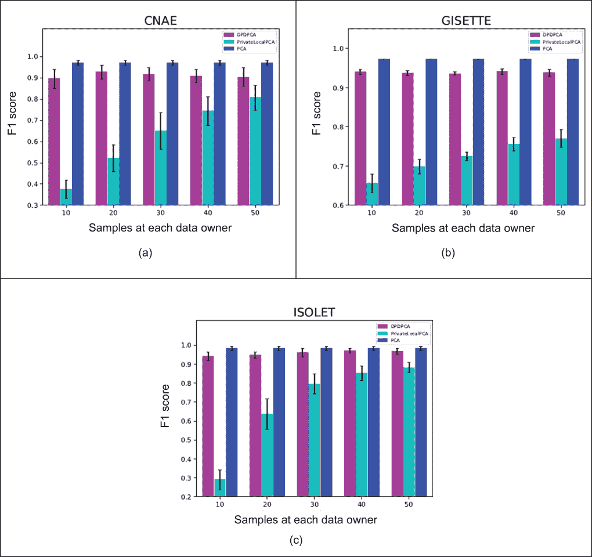

图 3.18 DPDPCA 与 PrivateLocalPCA 之间的主成分效用比较，**∈** = 0.5

效用与隐私之间的权衡

另一个重要的关注点是效用与隐私之间的权衡。让我们通过使用高斯机制来测量私有主成分的捕获方差来研究 DPDPCA 的权衡，其中加性噪声的标准差与∈成反比。∈越小，添加的噪声越多，获得的隐私越多。结果如图 3.19 所示，其中水平轴指定∈，垂直轴显示捕获方差的比率。在图中，你可以看到高斯机制捕获的方差在给定的∈范围内几乎保持相同的水平。此外，比率的值表明高斯机制捕获了大部分方差。

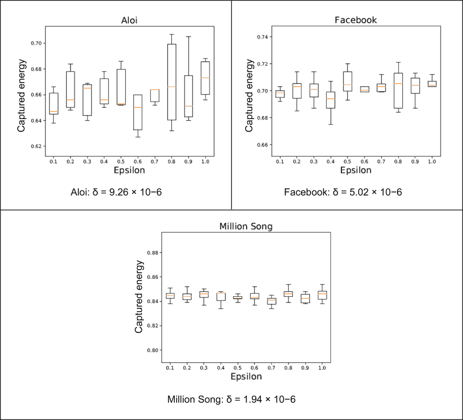

图 3.19 捕获的方差，δ = 1/N

总之，本案例研究提出了一种高度高效且可大规模扩展的 (ϵ, δ)-DP 分布式 PCA 协议，DPDPCA。正如你所见，我们考虑了数据水平分区且不可信的数据用户希望在短时间内学习分布式数据的主成分的场景。我们可以想到实际应用，例如灾害管理和应急响应。与先前的工作相比，DPDPCA 提供了更高的效率和更好的效用。此外，它还可以结合不同的对称矩阵方案来实现 (ϵ, δ)-DP。

## 摘要

+   DP 技术通过向输入数据、算法迭代或算法输出添加随机噪声来抵抗成员推理攻击。

+   对于基于输入扰动的 DP 方法，噪声被添加到数据本身，在执行所需的非隐私计算后，输出将是差分隐私的。

+   对于基于算法扰动的 DP 方法，噪声被添加到迭代机器学习算法的中间值中。

+   基于输出扰动的 DP 方法涉及运行非隐私学习算法并向生成的模型添加噪声。

+   目标扰动 DP 方法包括向学习算法（如经验风险最小化）的目标函数添加噪声。

+   差分隐私朴素贝叶斯分类基于贝叶斯定理以及每对特征之间独立性的假设。

+   我们可以在设计差分隐私逻辑回归时采用目标扰动策略，其中向学习算法的目标函数添加噪声。

+   在差分隐私的 *k*-means 聚类中，拉普拉斯噪声被添加到中间质心和聚类大小中，最终产生差分隐私的 *k*-means 模型。

+   DP 的概念可以应用于许多分布式机器学习场景，例如 PCA，以设计高度高效且可大规模扩展的 (ϵ, δ)-DP 分布式协议。
