# 4 本地微分隐私在机器学习中的应用

本章涵盖

+   本地微分隐私 (LDP)

+   为 LDP 实现随机响应机制

+   用于一维数据频率估计的 LDP 机制

+   实现和实验不同 LDP 机制以处理一维数据

在前两章中，我们讨论了集中式微分隐私 (DP)，其中有一个可信的数据管理员从个人那里收集数据并应用不同的技术来获取关于人口的微分隐私统计量。然后，管理员发布关于这个人口的隐私保护统计信息。然而，当个人不完全信任数据管理员时，这些技术是不适用的。因此，为了在本地设置中满足 DP 而消除对可信数据管理员的需求，已经研究了各种技术。在本章中，我们将介绍本地 DP 版本的原理、机制和应用，即本地微分隐私 (LDP)。

本章将主要探讨如何通过查看不同的示例和实现代码来在机器学习算法中实现 LDP。在下一章中，我们还将向您介绍一个案例研究，展示如何将 LDP 应用到朴素贝叶斯分类以处理现实世界的数据集。

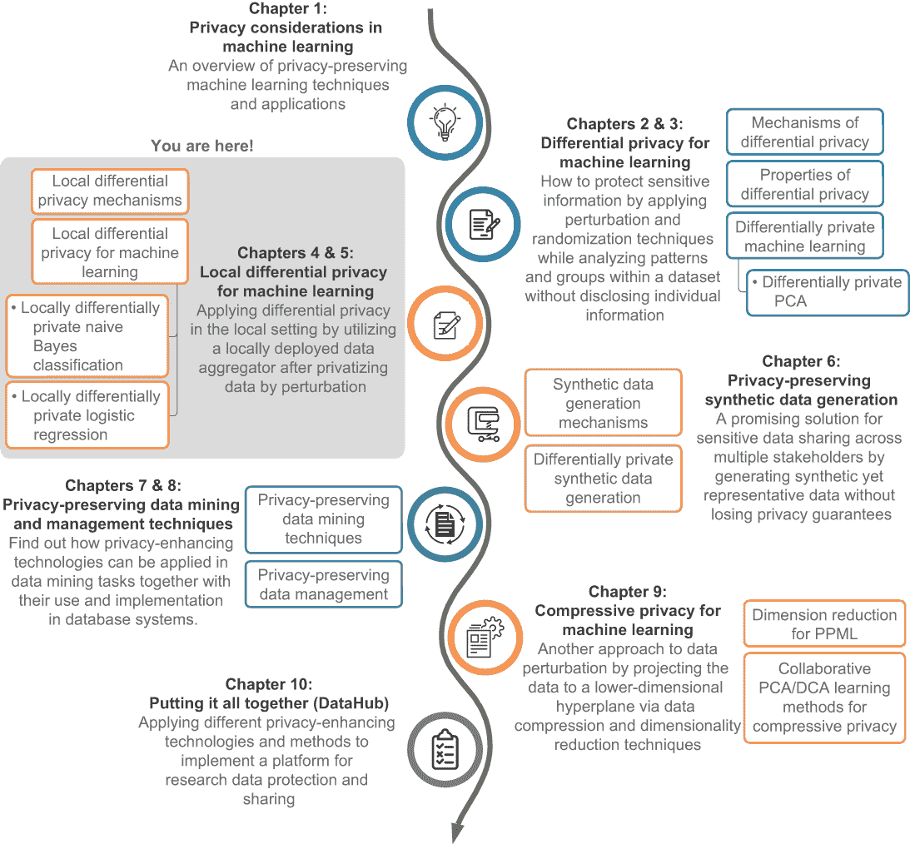

## 4.1 什么是本地微分隐私？

DP 是一个广泛接受的用于量化个人隐私的标准。在 DP 的原始定义中，有一个可信的数据管理员从个人那里收集数据并应用技术来获取不同的隐私统计量。然后，该数据管理员发布关于人口的隐私保护统计信息。我们在第二章和第三章中探讨了如何在机器学习的背景下满足 DP。然而，当个人不完全信任数据管理员时，这些技术不能应用。

已经提出了不同的技术来确保在本地设置中实现 DP 而无需可信的数据管理员。在 LDP 中，个人在通过扰动对数据进行隐私化处理后，将数据发送给数据聚合器（见图 4.1）。这些技术为个人提供了合理的否认可能性。数据聚合器收集所有扰动值并对统计量进行估计，例如人口中每个值的频率。

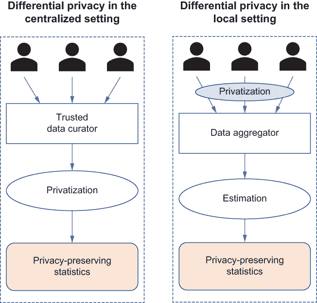

图 4.1 集中式与本地 DP 对比

### 4.1.1 本地微分隐私的概念

许多现实世界的应用，包括来自谷歌和苹果的应用，已经采用了 LDP。在我们讨论 LDP 的概念及其工作原理之前，让我们看看它是如何应用于现实世界产品的。

谷歌和苹果如何使用 LDP

2014 年，谷歌推出了随机可聚合的隐私保护序数响应（RAPPOR）[1]，这是一种从终端用户客户端软件匿名收集统计数据的技术，具有强大的隐私保障。这项技术最近已被集成到 Chrome 网络浏览器中。在过去五年中，RAPPOR 以保证 LDP 的方式处理了数十亿个每日的随机报告。这项技术旨在收集大量客户端的客户端值和字符串的统计数据，例如类别、频率、直方图和其他统计数据。对于任何报告的值，RAPPOR 为报告客户端提供强大的否认保证，严格限制由 DP 衡量的私人信息泄露，甚至对于经常报告同一值的单个客户端也是如此。

2017 年，苹果也发布了一篇关于它是如何使用 LDP 通过了解许多用户的做法来改善其产品用户体验的研究论文。例如，哪些新词正在流行，可能会提供最相关的建议？哪些网站的问题可能会影响电池寿命？哪些表情符号被选择得最频繁？苹果使用的 DP 技术源于这样一个想法：轻微的统计噪声可以在与苹果共享之前掩盖用户数据。如果许多人提交相同的数据，添加的噪声可以在大量数据点上平均，苹果可以看到有意义的信息出现。苹果详细介绍了两种在保护用户隐私的同时收集数据的技术：计数均值草图和哈达玛德计数均值草图。这两种方法都将随机信息插入正在收集的数据中。这种随机信息有效地掩盖了数据的任何识别特征，因此无法追溯到个人。

如您在这些示例中所见，LDP 通常用于均值或频率估计。在调查（或类似调查的问题）中进行频率估计是利用 LDP 在日常应用中最常见的方法之一。例如，公司、组织和研究人员经常使用调查来分析行为或评估思想和观点，但由于隐私原因，从个人那里收集研究信息具有挑战性。个人可能不相信数据收集者不会共享敏感或私人信息。尽管个人可以匿名参与调查，但有时仍然可以通过提供的信息识别出这个人。另一方面，尽管进行调查的人更感兴趣的是调查答案的分布，而不是特定个人的信息，但在涉及敏感信息时，他们很难赢得调查参与者的信任。这就是 LDP 发挥作用的地方。

LDP 的详细说明

现在你已经对 LDP 的使用有了背景知识，让我们来看看细节。LDP 是在数据收集者不可信时衡量个人隐私的一种方式。LDP 旨在保证当个人提供值时，识别原始值应该具有挑战性，这提供了隐私保护。许多 LDP 机制还旨在尽可能准确地根据从所有个人收集到的扰动数据的聚合来估计人口分布。

图 4.2 说明了 LDP 的典型用法。首先，每个个人（数据所有者）生成或收集自己的数据，例如调查答案或个人数据。然后，每个个人使用特定的 LDP 机制（我们将在第 4.2 节中讨论）在本地扰动他们的数据。扰动后，每个个人将他们的数据发送给数据收集者，数据收集者将执行数据聚合和统计或模型估计。最后，估计的统计数据或模型将被发布。根据这样的发布信息推断个人的数据将极其困难（如 LDP 定义所保证的）。

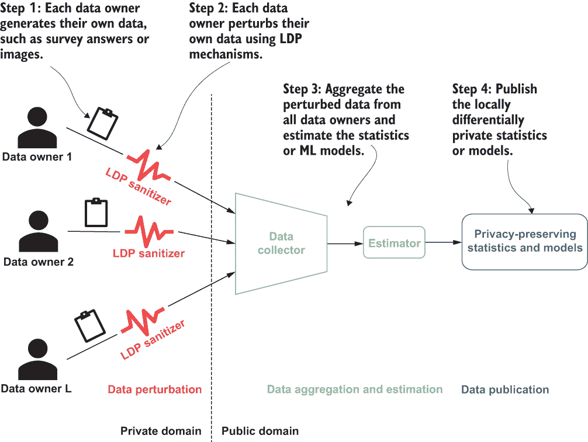

图 4.2 展示了局部差分隐私的工作原理

LDP 表明，对于任何使用ϵ-LDP 机制的发布估计统计数据或模型，数据收集者（或任何公共领域的其他对手）通过区分两个输入值（即个人的数据）的概率至多为 *e*^(-ϵ)。

协议 *P* 满足 ϵ-LDP，如果对于任何两个输入值 *v[1]* 和 *v[2]* 以及 *P* 的输出空间中的任何输出 *o*，我们有

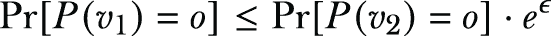

其中 Pr[⋅] 表示概率。Pr[*P*(*v*[1]) = *o*] 是给定输入 *v*[1] 到 *P*，它输出 *o* 的概率。定义中的 ϵ 参数是隐私参数或隐私预算。它有助于调整定义提供的隐私量。小的 ϵ 值要求 *P* 在给定相似输入时提供非常相似的输出，因此提供更高的隐私级别；大的 ϵ 值允许输出之间的相似性更少，因此提供更少的隐私。例如，如图 4.3 所示，对于小的 ϵ 值，给定一个扰动值 *o*，它几乎同样可能是由任何输入值产生的，即在这个例子中的 *v*[1] 或 *v*[2]。通过这种方式，仅仅通过观察输出，就很难推断出其对应的输入；因此，数据隐私得到了保证。

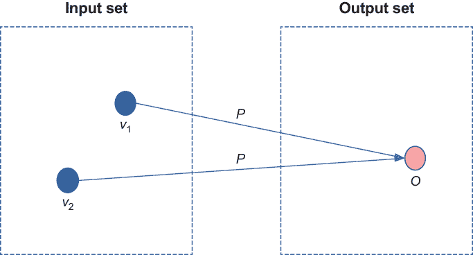

图 4.3 展示了 ϵ-LDP 的工作原理。给定一个扰动值 *o*，它几乎同样可能是由任何输入值产生的——在这个例子中是 *v*[1] 或 *v*[2]。

我们现在已经讨论了 LDP 的概念和定义，并探讨了它与集中式 DP 的不同之处。在介绍任何 LDP 机制之前，让我们先看看一个我们将应用 LDP 的场景。

一个包含调查的 LDP 场景

通过像 SurveyMonkey 这样的工具在线调查或社交网络测验中回答问题，现在是一种普遍的做法。LDP 可以在这些调查的答案离开数据所有者之前保护这些答案。在本章中，我们将使用以下场景来展示 LDP 机制的设计和实现。

假设公司 A 想要确定其客户（针对定向广告活动）的分布。它进行了一次调查，样本调查问题可能如下所示：

+   你已婚吗？

+   你的职业是什么？

+   你多大了？

+   你的种族类别是什么？

然而，这些问题非常敏感且私密。为了鼓励其客户参与调查，公司 A 应在进行调查的同时，尽可能保持其客户估计分布的准确性，并提供隐私保证。

并不出奇，LDP 是公司可以使用的几种技术之一。有几种不同的 LDP 机制可以处理不同的场景（例如，数据类型、数据维度等）。例如，对于“你已婚吗？”这个问题，答案只是一个分类的二进制结果：“是”或“否”。随机响应机制适合解决此类场景。另一方面，对于“你的职业是什么？”和“你的种族类别是什么？”这两个问题，答案仍然是分类的，但将是可能答案集合中的单个项目。对于此类场景，直接编码和一元编码机制会更好。此外，对于像“你多大了？”这样的问题，答案是数值的，所有答案的汇总看起来像直方图。在这种情况下，我们可以使用直方图编码。

在简单概述了 LDP 如何在实践中使用之后，我们将通过介绍如何设计和实现适用于不同调查问题的不同 LDP 机制来解决的实际场景来介绍 LDP 的工作原理。我们将从最直接的 LDP 机制——随机响应开始。

### 4.1.2 随机响应用于本地差分隐私

如第二章所述，随机响应（二进制机制）是最古老和最简单的 DP 机制之一，但它也满足 LDP。在本节中，你将学习如何使用随机响应来设计和实现一个用于保护二进制调查隐私的 LDP 解决方案。

假设我们想要调查一组人，以确定 50 岁以上的人数。每个个体将被问及，“你超过 50 岁了吗？”从每个个体收集到的答案将是“是”或“否”。答案被视为对调查问题的二元响应，其中我们对每个“是”答案给出二元值 1，对每个“否”答案给出二元值 0。因此，最终目标是通过对个体发送的作为其答案的 1 的数量进行计数，来确定超过 50 岁的人数。我们如何使用随机响应机制来设计和实现一个局部差分隐私调查来收集这个简单的“是”或“否”问题的答案？

接下来是隐私保护。如列表 4.1 所示，每个个体将根据算法以真实答案或提供随机答案进行响应。因此，个人的隐私将得到很好的保护。此外，由于每个个体将以 0.75 的概率（即 1/2 + 1/4 = 0.75）提供真实答案，以 0.25 的概率提供错误答案，因此将有更多个体提供真实答案。因此，我们将保留足够的基本信息来估计人口统计分布（即 50 岁以上的人数）。

列表 4.1 基于随机响应的算法

```
def random_response_ages_adult(response):
    true_ans = response > 50

    if np.random.randint(0, 2) == 0:            ❶
        return true_ans                         ❷
    else:
        return np.random.randint(0, 2) == 0     ❸
```

❶ 抛掷第一枚硬币。

❷ 返回真实答案。

❸ 抛掷第二枚硬币并返回随机答案。

让我们在列表 4.2 中展示的美国人口普查数据集上实现并测试我们的算法。在下一节中，我们将讨论更多实际用例，但现在我们将使用人口普查数据集来演示您如何估计汇总值。

列表 4.2 玩转美国人口普查数据集

```
import numpy as np
import matplotlib.pyplot as plt

ages_adult = np.loadtxt("https://archive.ics.uci.edu/ml/machine-
➥ learning-databases/adult/adult.data", usecols=0, delimiter=", ")

total_count = len([i for i in ages_adult]) 
age_over_50_count= len([i for i in ages_adult if i > 50]) 

print(total_count)
print(age_over_50_count)
print(total_count-age_over_50_count)
```

输出结果如下：

```
32561
6460
26101
```

如您所见，美国人口普查数据集中有 32,561 个个体：6,460 个个体超过 50 岁，26,101 个个体低于或等于 50 岁。

现在我们来看看如果我们将我们的基于随机响应的算法应用于相同的应用程序会发生什么。

列表 4.3 数据扰动

```
perturbed_age_over_50_count = len([i for i in ages_adult 
➥ if random_response_ages_adult(i)]) 
print(perturbed_age_over_50_count)
print(total_count-perturbed_age_over_50_count)
```

结果如下：

```
11424
21137
```

如您所见，应用我们的随机响应算法后，50 岁以上个体的扰动数量变为 11,424，50 岁以下或等于 50 岁的个体扰动数量为 21,137。在这个结果中，50 岁以上的人数仍然少于 50 岁以下或等于 50 岁的人数，这与原始数据集的趋势一致。然而，这个结果，11,424，似乎与我们想要估计的实际结果 6,460 有些差距。

现在的问题是，如何根据我们的基于随机响应的算法和迄今为止的结果来估计 50 岁以上实际人数。显然，直接使用 1 或“是”的值并不能精确估计实际值。

为了精确估计 50 岁以上人数的实际值，我们应该考虑基于随机回答的算法中随机性的来源，并估计来自实际上 50 岁以上的人的 1 的数量，以及来自随机回答结果的 1 的数量。在我们的算法中，每个人以 0.5 的概率说实话，并以 0.5 的概率再次进行随机回答。每次随机回答将以 0.5 的概率产生 1 或“是”。因此，个人仅基于随机性（而不是因为他们实际上超过 50 岁）回答 1 或“是”的概率是 0.5 × 0.5 = 0.25。因此，正如你所见，我们总共有 1 或“是”值的 25%是错误肯定回答。

另一方面，由于硬币的第一次翻转，我们将说实话的人和随机回答的人分开。换句话说，我们可以假设两组中 50 岁以上的人数大致相同。因此，50 岁以上的人数大约是说实话的人组中 50 岁以上人数的两倍。

现在我们知道了问题，我们可以使用以下实现来估计 50 岁以上总人数。

列表 4.4 数据聚合和估计

```
answers = [True if random_response_ages_adult(i) else False 
➥ for i in ages_adult ]                                       ❶

def random_response_aggregation_and_estimation(answers):       ❷
    false_yesses = len(answers)/4                              ❸

    total_yesses = np.sum([1 if r else 0 for r in answers])    ❹

    true_yesses = total_yesses - false_yesses                  ❺

    rr_result = true_yesses*2                                  ❻
    return rr_result

estimated_age_over_50_count = 
➥ random_response_aggregation_and_estimation(answers)
print(int(estimated_age_over_50_count))
print(total_count-int(estimated_age_over_50_count))
```

❶ 扰动

❷ 数据聚合和估计

❸ 预计有四分之一（0.25）的回答是 1 或肯定回答，这些来自随机回答（由抛硬币产生的错误肯定回答）。

❹ 收到的肯定回答总数

❺ 真正的肯定回答数是总肯定回答数与错误肯定回答数之差。

❻ 因为真正的肯定回答估计了说实话的组中肯定回答的总数，所以肯定回答的总数可以估计为真正肯定回答的两倍。

你将得到以下输出：

```
6599
25962
```

现在我们对 50 岁以上人数的估计更加精确。估计有多接近？相对误差仅为（6599 - 6460）/ 6460 = 2.15%。我们的基于随机回答的算法似乎在估计 50 岁以上人数方面做得很好。此外，根据我们在第二章的分析，该算法的隐私预算是*ln*(3)（即*ln*(3) ≈ 1.099）。换句话说，我们的算法满足*ln*(3)-LDP。

在本节中，我们通过设计和实现一个隐私保护的二选一调查应用，回顾了在 LDP 背景下随机回答机制。正如你所见，随机回答机制仅擅长处理基于单个二进制问题的难题，即“是”或“否”问题。

在实践中，大多数问题或任务并非仅仅是“是”或“否”的问题。它们可能涉及从有限集合中选择值（例如“你的职业是什么？”）或返回数据集的直方图（例如一组人的年龄分布）。我们需要更通用和高级的机制来解决这类问题。在下一节中，我们将介绍更多常见的 LDP 机制，这些机制可以在更广泛和复杂的情况下使用。

## 4.2 本地差分隐私的机制

我们已经讨论了 LDP 的概念和定义，以及它是如何通过随机响应机制来工作的。在本节中，我们将讨论一些在更通用和复杂场景下常用的 LDP 机制。这些机制也将作为下一章案例研究中 LDP 机器学习算法的构建块。

### 4.2.1 直接编码

随机响应机制适用于具有 LDP 的二进制（是或否）问题。但对于有多个答案的问题怎么办？例如，如果我们想确定美国人口普查数据集中每个职业的人数，该怎么做？职业可能包括销售、工程、金融、技术支持等。已经提出了相当数量的不同算法来解决在本地差分隐私模型中的这个问题[2]，[3]，[4]。在这里，我们将从一个最简单的机制开始，称为*直接编码*。

在一个需要利用 LDP 的问题中，第一步是定义不同答案的域。例如，如果我们想了解美国人口普查数据集中每个职业的人数，域将是数据集中可用的职业集合。以下列出了人口普查数据集中的所有职业。

列表 4.5 每个职业领域的数量

```
import pandas as pd
import numpy as np
import matplotlib.pyplot as plt
import sys
import io
import requests
import math

req = requests.get("https://archive.ics.uci.edu/ml/machine-learning-
➥ databases/adult/adult.data").content             ❶
adult = pd.read_csv(io.StringIO(req.decode('utf-8')), 
➥ header=None, na_values='?', delimiter=r", ")
adult.dropna()
adult.head()

domain = adult[6].dropna().unique()                 ❷
domain.sort()
domain
```

❶ 加载数据。

❷ 领域

结果将如下所示：

```
array(['Adm-clerical', 'Armed-Forces', 'Craft-repair', 'Exec-managerial',
       'Farming-fishing', 'Handlers-cleaners', 'Machine-op-inspct',
       'Other-service', 'Priv-house-serv', 'Prof-specialty',
       'Protective-serv', 'Sales', 'Tech-support', 'Transport-moving'],
      dtype=object)
```

如我们在上一节所讨论的，LDP 机制通常包含三个功能：编码，用于编码每个答案；扰动，用于扰动编码后的答案；以及聚合和估计，用于聚合扰动后的答案并估计最终结果。让我们为直接编码机制定义这三个功能。

在直接编码机制中，通常不需要对输入值进行编码。我们可以使用每个输入在域集中的索引作为其编码值。例如，“Armed-Forces”是域的第二个元素，因此“Armed-Forces”的编码值是 1（索引从 0 开始）。

列表 4.6 应用直接编码

```
def encoding(answer):
    return int(np.where(domain == answer)[0])

print(encoding('Armed-Forces'))     ❶
print(encoding('Craft-repair'))
print(encoding('Sales'))
print(encoding('Transport-moving'))
```

❶ 测试编码。

列表 4.6 的输出将如下所示：

```
1
2
11
13
```

如前所述，“Armed-Forces”被分配值为 1，“Craft-repair”被分配值为 2，依此类推。

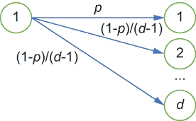

图 4.4 直接编码的扰动

我们的下一步是扰动。让我们回顾直接编码的扰动（如图 4.4 所示）。每个人以以下概率正确报告他们的值 *v*：

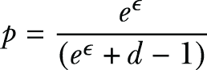

或者他们以 *d* - 1 个剩余值的概率报告其中一个

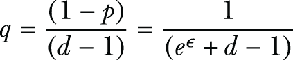

其中 *d* 是域集的大小。

例如，在我们的例子中，由于美国人口普查数据集中列出了 14 种不同的职业，域集的大小是 *d* = 14。如列表 4.7 所示，如果我们选择 ϵ = 5.0，则 *p* = 0.92 和 *q* = 0.0062，这将以更高的概率输出实际值。如果我们选择 ϵ = 0.1，则 *p* = 0.078 和 *q* = 0.071，这将以更低的概率生成实际值，从而提供更多的隐私保障。

列表 4.7 直接编码中的扰动算法

```
def perturbation(encoded_ans, epsilon = 5.0):
    d = len(domain)                                           ❶
    p = pow(math.e, epsilon) / (d - 1 + pow(math.e, epsilon))
    q = (1.0 - p) / (d - 1.0)

    s1 = np.random.random()
    if s1 <= p:
        return domain[encoded_ans]                            ❷
    else:
        s2 = np.random.randint(0, d - 1)
        return domain[(encoded_ans + s2) % d]

print(perturbation(encoding('Armed-Forces')))                 ❸
print(perturbation(encoding('Craft-repair')))
print(perturbation(encoding('Sales')))
print(perturbation(encoding('Transport-moving')))
print()

print(perturbation(encoding('Armed-Forces'), epsilon = .1))   ❹
print(perturbation(encoding('Craft-repair'), epsilon = .1))
print(perturbation(encoding('Sales'), epsilon = .1))
print(perturbation(encoding('Transport-moving'), epsilon = .1))
```

❶ 域集的大小

❷ 以概率 p 返回自身

❸ 测试扰动，epsilon = 5.0。

❹ 测试扰动，epsilon = .1。

输出将看起来如下：

```
Armed-Forces
Craft-repair
Sales
Transport-moving

Other-service
Handlers-cleaners
Farming-fishing
Machine-op-inspct
```

让我们尝试理解这里发生了什么。当你将 epsilon 值设置为 5.0（查看输出中的前四个结果）时，你将以很高的概率得到实际值。在这种情况下，准确率为 100%。然而，当你将 epsilon 设置为一个更小的数字（在这种情况下为 0.1）时，算法将以更低的概率生成实际值；因此，隐私保障更好。从输出中的后四个结果可以看出，我们得到了不同的职业作为结果。您可以在代码中尝试分配不同的 epsilon 值，以查看它如何影响最终结果。

让我们看看在将扰动应用于调查问题“你的职业是什么？”的答案后会发生什么。

列表 4.8 扰动后直接编码的结果

```
perturbed_answers = pd.DataFrame([perturbation(encoding(i)) 
➥ for i in adult_occupation])
perturbed_answers.value_counts().sort_index()
```

应用直接编码后的结果将看起来像这样：

```
Adm-clerical         3637
Armed-Forces          157
Craft-repair         3911
Exec-managerial      3931
Farming-fishing      1106
Handlers-cleaners    1419
Machine-op-inspct    2030
Other-service        3259
Priv-house-serv       285
Prof-specialty       4011
Protective-serv       741
Sales                3559
Tech-support         1021
Transport-moving     1651
```

现在我们有了扰动结果，让我们将它们与实际结果进行比较。

列表 4.9 实际结果与扰动值的比较

```
adult_occupation = adult[6].dropna()         ❶
adult_occupation.value_counts().sort_index()
```

❶ 每个职业类别的从业人员数量

这些是每个职业类别人数的实际结果：

```
Adm-clerical         3770
Armed-Forces            9
Craft-repair         4099
Exec-managerial      4066
Farming-fishing       994
Handlers-cleaners    1370
Machine-op-inspct    2002
Other-service        3295
Priv-house-serv       149
Prof-specialty       4140
Protective-serv       649
Sales                3650
Tech-support          928
Transport-moving     1597
```

为了清晰起见，让我们将结果并排比较，如图 4.1 所示。可以看出，与实际值相比，一些扰动答案的聚合误差非常高。例如，对于职业为“Armed-Forces”的人数，扰动值为 157，但实际值为 9。

表 4.1 扰动前后每个职业的人数

| 数量 | 职业 | 人数 |
| --- | --- | --- |
| 原始值 | 扰动后 |
| 1 | Adm-clerical | 3770 | 3637 |
| 2 | Armed-Forces | 9 | 157 |
| 3 | Craft-repair | 4099 | 3911 |
| 4 | Exec-managerial | 4066 | 3931 |
| 5 | 农业-渔业 | 994 | 1106 |
| 6 | 处理员-清洁工 | 1370 | 1419 |
| 7 | 机械操作检查员 | 2002 | 2030 |
| 8 | 其他服务 | 3295 | 3259 |
| 9 | 私人住宅服务 | 149 | 285 |
| 10 | 专业教授 | 4140 | 4011 |
| 11 | 保护服务 | 649 | 741 |
| 12 | 销售 | 3650 | 3559 |
| 13 | 技术支持 | 928 | 1021 |
| 14 | 运输移动 | 1597 | 1651 |

为了克服这些错误，我们需要一个聚合和估计函数，以及直接编码机制。在聚合和估计过程中，当聚合器从 *n* 个个体收集扰动值时，它将估计每个职业 I ∈ {1,2,...,*d* } 的频率如下：首先，*c*[i] 是 *i* 被报告的次数。在人口中值 *i* 的估计出现次数为 *E*[i] = (*c*[i] - *n* ⋅*q*)/(*p* - *q*)。为了确保估计的数值始终为非负值，我们设 *E*[i] = max(*E*[i], 1)。你可以尝试实现列表 4.10 来查看其工作原理。

列表 4.10 将聚合和估计应用于直接编码

```
def aggregation_and_estimation(answers, epsilon = 5.0):
    n = len(answers)
    d = len(domain)
    p = pow(math.e, epsilon) / (d - 1 + pow(math.e, epsilon))
    q = (1.0 - p) / (d - 1.0)

    aggregator = answers.value_counts().sort_index()

    return [max(int((i - n*q) / (p-q)), 1) for i in aggregator]  

estimated_answers = aggregation_and_estimation(perturbed_answers)    ❶
list(zip(domain, estimated_answers))
```

❶ 数据聚合和估计

你将得到以下类似的结果作为输出：

```
[('Adm-clerical', 3774),
 ('Armed-Forces', 1),
 ('Craft-repair', 4074),
 ('Exec-managerial', 4095),
 ('Farming-fishing', 1002),
 ('Handlers-cleaners', 1345),
 ('Machine-op-inspct', 2014),
 ('Other-service', 3360),
 ('Priv-house-serv', 103),
 ('Prof-specialty', 4183),
 ('Protective-serv', 602),
 ('Sales', 3688),
 ('Tech-support', 909),
 ('Transport-moving', 1599)]
```

使用这个结果，让我们将估计结果与表 4.2 中所示的实际结果进行比较。如图所示，当使用隐私预算 *x* = 5.0 时，直接编码机制的估计结果比使用扰动结果的精度要高得多。你可以尝试更改此代码中的隐私预算或将其应用于其他数据集以查看其工作情况。

表 4.2 每个职业的人数，聚合和估计前后

| 数量 | 职业 | 人数 |
| --- | --- | --- |
| 原始值 | 聚合和估计后 |
| 1 | 行政-文职 | 3770 | 3774 |
| 2 | 武装部队 | 9 | 1 |
| 3 | 手工艺-修理 | 4099 | 4074 |
| 4 | 执行-管理 | 4066 | 4095 |
| 5 | 农业-渔业 | 994 | 1002 |
| 6 | 处理员-清洁工 | 1370 | 1345 |
| 7 | 机械操作检查员 | 2002 | 2014 |
| 8 | 其他服务 | 3295 | 3360 |
| 9 | 私人住宅服务 | 149 | 103 |
| 10 | 专业教授 | 4140 | 4183 |
| 11 | 保护服务 | 649 | 602 |
| 12 | 销售 | 3650 | 3688 |
| 13 | 技术支持 | 928 | 909 |
| 14 | 运输移动 | 1597 | 1599 |

你现在已经看到了一个使用直接编码的 LDP 机制。这些步骤可以总结为以下三个组件：

+   编码：直接编码（二进制随机响应的推广）

+   扰动：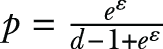 用于 *ε*-LDP

+   估计：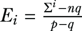 其中 *q* = (1 - *p*)/(*>d* - 1)

### 4.2.2 直方图编码

直接编码机制使我们能够将 LDP 应用于分类和离散问题。相比之下，直方图编码使我们能够将 LDP 应用于数值和连续数据。

考虑一个具有数值和连续答案的调查问题。例如，假设有人想知道一组人群中年龄的分布或直方图，而这无法通过直接编码实现。他们可以开展调查，询问每个人一个问题：“你的年龄是多少？”让我们以美国人口普查数据集为例，绘制人群年龄的直方图。

列表 4.11 使用人群年龄绘制直方图

```
import pandas as pd
import numpy as np
import matplotlib.pyplot as plt
import sys
import io
import requests
import math

req = requests.get("https://archive.ics.uci.edu/ml/machine-learning-
➥ databases/adult/adult.data").content                   ❶
adult = pd.read_csv(io.StringIO(req.decode('utf-8')), 
➥ header=None, na_values='?', delimiter=r", ")
adult.dropna()
adult.head()

adult_age = adult[0].dropna()                             ❷
ax = adult_age.plot.hist(bins=100, alpha=1.0)
```

❶ 加载数据。

❷ 人群的年龄

输出将类似于图 4.5 中的直方图，表示每个年龄类别中的人数。正如您所看到的，最多的人数在 20 到 40 岁的年龄范围内，而在其他值中报告的人数较少。直方图编码机制旨在处理此类数值和连续数据。

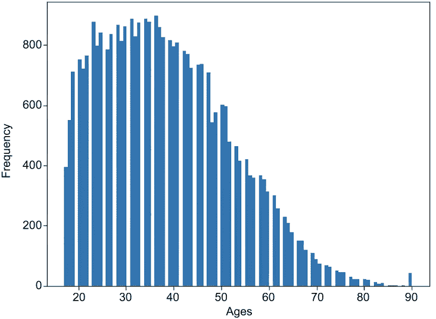

图 4.5 来自美国人口普查数据集的人群年龄直方图

我们首先需要定义输入域（即调查答案）。在这里，我们假设所有参加调查的人的年龄将在 10 到 100 岁之间。

列表 4.12 调查人群年龄的输入域

```
domain = np.arange(10, 101)    ❶
domain.sort()
domain
```

❶ 域的范围在 10 到 100 之间。

因此，域将看起来像这样：

```
array([ 10,  11,  12,  13,  14,  15,  16,  17,  18,  19,  20,  21,  22,
        23,  24,  25,  26,  27,  28,  29,  30,  31,  32,  33,  34,  35,
        36,  37,  38,  39,  40,  41,  42,  43,  44,  45,  46,  47,  48,
        49,  50,  51,  52,  53,  54,  55,  56,  57,  58,  59,  60,  61,
        62,  63,  64,  65,  66,  67,  68,  69,  70,  71,  72,  73,  74,
        75,  76,  77,  78,  79,  80,  81,  82,  83,  84,  85,  86,  87,
        88,  89,  90,  91,  92,  93,  94,  95,  96,  97,  98,  99, 100])
```

在直方图编码中，个人将他们的值 *v* 编码为一个长度-*d* 的向量 [0.0,0.0,...,0.0,1.0,0.0,...,0.0]，其中只有 *v* 个分量是 1.0，其余分量是 0.0。例如，假设总共有 6 个值（{1,2,3,4,5,6}），即 *d* = 6，实际要编码的值是 6。在这种情况下，直方图编码将输出向量 ({0.0,0.0,0.0,0.0,0.0,1.0})，其中向量的第六位是 1.0，其他所有位置都是 0.0（见图 4.6）。

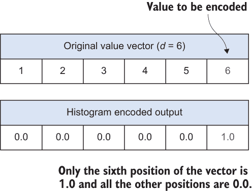

图 4.6 直方图编码的工作原理

下面的列表展示了编码函数的实现。

列表 4.13 直方图编码

```
def encoding(answer):
    return [1.0 if d == answer else 0.0 for d in domain]

print(encoding(11))                                           ❶

answers = np.sum([encoding(r) for r in adult_age], axis=0)    ❷
plt.bar(domain, answers)
```

❶ 测试输入年龄 11 的编码。

❷ 数据编码图

列表 4.13 的输出如下，直方图结果如图 4.7 所示：

```
[0.0, 1.0, 0.0, 0.0, 0.0, 0.0, 0.0, 0.0, 0.0, 0.0, 0.0, 0.0, 0.0, 0.0, 0.0, 0.0, 0.0, 0.0, 0.0, 0.0, 0.0, 0.0, 0.0, 0.0, 0.0, 0.0, 0.0, 0.0, 0.0, 0.0, 0.0, 0.0, 0.0, 0.0, 0.0, 0.0, 0.0, 0.0, 0.0, 0.0, 0.0, 0.0, 0.0, 0.0, 0.0, 0.0, 0.0, 0.0, 0.0, 0.0, 0.0, 0.0, 0.0, 0.0, 0.0, 0.0, 0.0, 0.0, 0.0, 0.0, 0.0, 0.0, 0.0, 0.0, 0.0, 0.0, 0.0, 0.0, 0.0, 0.0, 0.0, 0.0, 0.0, 0.0, 0.0, 0.0, 0.0, 0.0, 0.0, 0.0, 0.0, 0.0, 0.0, 0.0, 0.0, 0.0, 0.0, 0.0, 0.0, 0.0, 0.0]
```

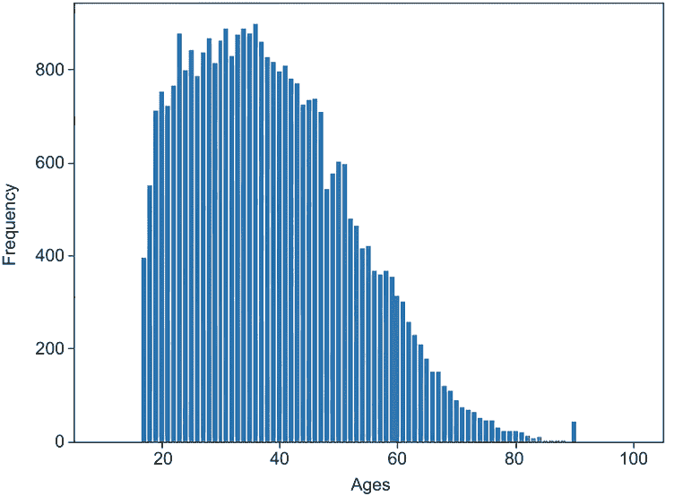

图 4.7 编码年龄的直方图

数据所有者通过向编码值中的每个分量添加 *Lap*(2/ϵ) 来扰动他们的值，其中 *Lap*(2/ϵ) 是来自拉普拉斯分布的样本，均值为 0，尺度参数为 2/ϵ。如果您需要复习拉普拉斯分布及其性质，请回顾第 2.1.2 节。 

当数据聚合器收集所有扰动值后，聚合器有两种估计方法可供选择：

+   直方图编码求和（SHE）

+   直方图编码阈值（THE）

直方图编码求和（SHE）

直方图编码求和（SHE）计算个人报告的所有值的总和。为了估计人口中值 *i* 的发生次数，数据聚合器将所有报告值中的 *i* 个分量求和。

以下列表显示了使用 SHE 进行扰动的实现。

列表 4.14 使用直方图编码的求和

```
def she_perturbation(encoded_ans, epsilon = 5.0):
    return [she_perturb_bit(b, epsilon) for b in encoded_ans]

def she_perturb_bit(bit, epsilon = 5.0):
    return bit + np.random.laplace(loc=0, scale = 2 / epsilon)

print(she_perturbation(encoding(11)))                         ❶
print()

print(she_perturbation(encoding(11), epsilon = .1))           ❷

she_estimated_answers = np.sum([she_perturbation(encoding(r)) 
➥ for r in adult_age], axis=0)                               ❸
plt.bar(domain, she_estimated_answers)
```

❶ 测试扰动，ε = 5.0。

❷ 测试扰动，ε = .1。

❸ 数据扰动、聚合和估计

列表 4.14 的输出如下，图 4.8 显示了结果的直方图。

```
[0.4962679135705772, 0.3802597925066964, -0.30259173228948666, 
   ➥ -1.3184657393652501, ......, 0.2728526263450592, 
   ➥ 0.6818717669557512, 0.5099963270758622, 
   ➥ -0.3750514505079954, 0.3577214398174087]

[14.199378030914811, 51.55958531259166, -3.168607913723072, 
   ➥ -14.592805035271969, ......, -18.342283098694853, 
   ➥ -33.37135136829752, 39.56097740265926, 
   ➥ 15.187624540264636, -6.307239922495188, 
   ➥ -18.130661553271608, -5.199234599011756]
```

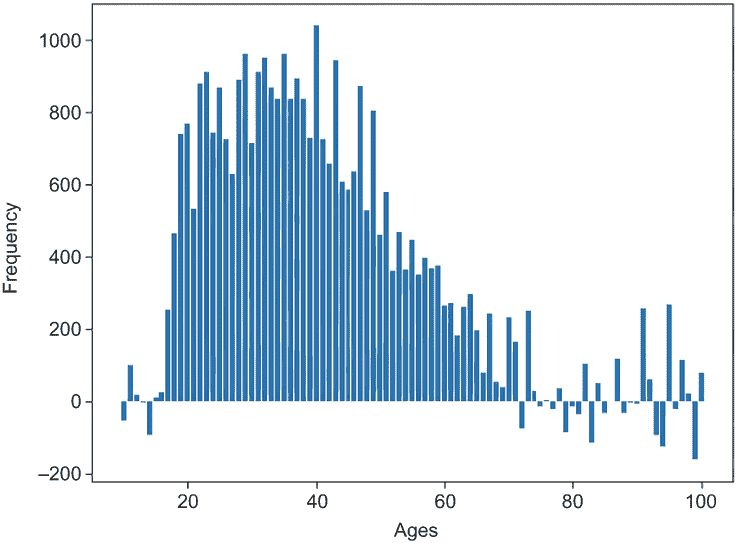

图 4.8 使用 SHE 估计年龄的求和

从图 4.8 中可以看出，使用 SHE 估计的值与图 4.7 中原始编码直方图的形状相似。然而，图 4.8 中的直方图是使用估计函数生成的。这些估计值中存在噪声，因此它们不是真实的，并且可能导致负值。对于这个例子，负年龄频率是无效的，因此我们可以丢弃这些值。

使用直方图编码的阈值处理（THE）

在使用直方图编码（THE）进行阈值处理的情况下，数据聚合器将所有大于阈值θ的值设置为 1，其余值设置为 0。然后它估计人口中的*i*数量为*E[i]* = (*c[i]* - *n* ⋅ *q*)/(*p* - *q*)，其中*p* = 1 − 1/2*e*^((ϵ⋅(1-θ)/2))，*q* = *e*^((ϵ⋅(0-θ)/2))，而*c[i]*是应用阈值后所有报告值中第*i*个分量的 1 的数量。

以下列表显示了使用 THE 进行扰动的实现。

列表 4.15 使用直方图编码的阈值处理

```
def the_perturbation(encoded_ans, epsilon = 5.0, theta = 1.0):
    return [the_perturb_bit(b, epsilon, theta) for b in encoded_ans]

def the_perturb_bit(bit, epsilon = 5.0, theta = 1.0):
    val = bit + np.random.laplace(loc=0, scale = 2 / epsilon)

    if val > theta:
        return 1.0
    else:
        return 0.0

print(the_perturbation(encoding(11)))                                     ❶
print()

print(the_perturbation(encoding(11), epsilon = .1))                       ❷

the_perturbed_answers = np.sum([the_perturbation(encoding(r)) 
➥ for r in adult_age], axis=0)                                           ❸
plt.bar(domain, the_perturbed_answers)
plt.ylabel('Frequency')
plt.xlabel('Ages')

def the_aggregation_and_estimation(answers, epsilon = 5.0, theta = 1.0):  ❹
    p = 1 - 0.5 * pow(math.e, epsilon / 2 * (1.0 - theta))
    q = 0.5 * pow(math.e, epsilon / 2 * (0.0 - theta))

    sums = np.sum(answers, axis=0)
    n = len(answers)

    return [int((i - n * q) / (p-q)) for i in sums]  
```

❶ 测试扰动，ε = 5.0。

❷ 测试扰动，ε = .1。

❸ 总扰动

❹ THE—聚合和估计

对于不同的ε值，输出将如下所示。图 4.9 显示了 THE 估计函数前的总扰动。

```
[0.0, 1.0, 0.0, 0.0, 0.0, 0.0, 0.0, 0.0, 1.0, 0.0, 0.0, 0.0, 0.0, 0.0, 0.0, 0.0, 0.0, 0.0, 1.0, 0.0, 0.0, 0.0, 0.0, 0.0, 0.0, 1.0, 0.0, 0.0, 0.0, 0.0, 0.0, 0.0, 0.0, 0.0, 0.0, 0.0, 0.0, 0.0, 0.0, 0.0, 0.0, 0.0, 0.0, 0.0, 0.0, 0.0, 0.0, 0.0, 0.0, 0.0, 0.0, 0.0, 0.0, 0.0, 0.0, 0.0, 0.0, 0.0, 0.0, 0.0, 0.0, 0.0, 0.0, 0.0, 0.0, 0.0, 0.0, 0.0, 0.0, 0.0, 0.0, 0.0, 0.0, 0.0, 0.0, 0.0, 0.0, 0.0, 0.0, 0.0, 0.0, 0.0, 0.0, 0.0, 0.0, 0.0, 0.0, 0.0, 0.0, 0.0, 0.0]

[1.0, 1.0, 1.0, 0.0, 0.0, 0.0, 0.0, 0.0, 1.0, 0.0, 0.0, 0.0, 0.0, 0.0, 1.0, 1.0, 0.0, 1.0, 0.0, 1.0, 1.0, 0.0, 1.0, 1.0, 0.0, 0.0, 0.0, 1.0, 0.0, 0.0, 0.0, 1.0, 0.0, 0.0, 1.0, 1.0, 1.0, 0.0, 0.0, 1.0, 0.0, 0.0, 0.0, 1.0, 1.0, 1.0, 0.0, 0.0, 0.0, 1.0, 1.0, 0.0, 0.0, 0.0, 0.0, 0.0, 1.0, 0.0, 1.0, 1.0, 0.0, 1.0, 0.0, 1.0, 0.0, 0.0, 0.0, 1.0, 1.0, 1.0, 1.0, 0.0, 0.0, 0.0, 1.0, 0.0, 0.0, 0.0, 0.0, 0.0, 1.0, 1.0, 0.0, 1.0, 0.0, 1.0, 0.0, 0.0, 0.0, 0.0, 1.0]
```

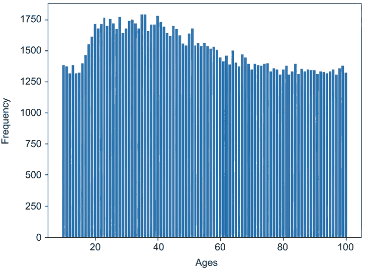

图 4.9 使用 THE 扰动答案的直方图

估计值可以通过以下代码片段获得：

```
# Data aggregation and estimation
the_perturbed_answers = [the_perturbation(encoding(r)) for r in adult_age]
estimated_answers = the_aggregation_and_estimation(the_perturbed_answers)
plt.bar(domain, estimated_answers)
plt.ylabel('Frequency')
plt.xlabel('Ages')
```

输出的直方图显示在图 4.10 中。THE 的估计值与图 4.7 中原始编码直方图的形状相似。

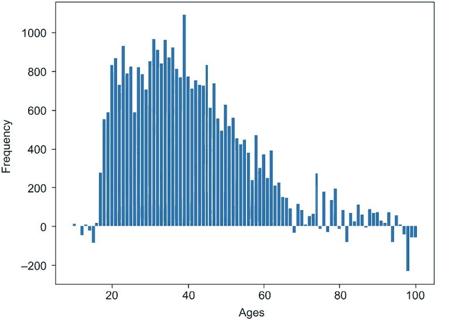

图 4.10 阈值估计年龄

总结来说，直方图编码使我们能够对数值和连续数据应用 LDP，我们讨论了在直方图编码下的 LDP 的两个估计机制：SHE 和 THE。SHE 汇总了所有用户报告的噪声直方图，而 THE 将阈值以上的每个噪声计数解释为 1，阈值以下的每个计数解释为 0。当你将直方图编码与直接编码进行比较时，你会发现当域集大小*d*变大时，直接编码的方差更大。使用 THE，通过固定ε，你可以选择一个θ值以最小化方差。这意味着 THE 可以通过限制大量噪声的影响来提高 SHE 的估计：

+   使用直方图编码的求和（SHE）：

    +   编码：Encode(*v*) = [0.0, 0.0,...,1.0,...,0.0]，其中只有 *v* 个分量是 1.0。

    +   扰动：将 *Lap*(2/ε) 添加到每个分量。

    +   估计：将所有个人报告的噪声直方图的总和。

+   历史编码阈值（THE）：

    +   编码：Encode(*v*) = [0.0, 0.0,...,1.0,...,0.0]，其中只有 *v* 个分量是 1.0。

    +   扰动：将 *Lap*(2/ε) 添加到每个分量。将值 > θ 设置为 1，其余值设置为 0。

    +   估计：，其中 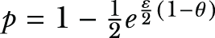 和 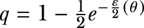。

### 4.2.3 一元编码

一元编码机制是一种更通用且高效的 LDP 机制，适用于分类和离散问题。在此方法中，个人将他们的值 *v* 编码为一个长度-*d* 的二进制向量 [0, ..., 1, ..., 0]，其中只有 *v* 位是 1，其余位是 0。然后，对于编码向量中的每个位，如果输入位是 1，他们将以概率 *p* 正确报告值，以概率 1 - *p* 错误报告。否则，他们可以以概率 1 - *q* 正确报告，以概率 *q* 错误报告。

在一元编码中，我们再次有两个不同的选项进行操作：

+   对称一元编码（SUE）

+   最优一元编码（OUE）

在对称一元编码的情况下，*p* 被选为 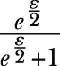，而 *q* 被选为 1 - *p*。在最优一元编码中，*p* 被选为 1/2，而 *q* 被选为 1/(e^ε + 1)。然后数据聚合器估计人口中 1 的数量为 *E*[i] = (*c*[i] - *m* ∙ *q*)/(*p* - q)，其中 *c*[i] 表示所有报告值中第 *i* 位的 1 的数量。

作为一元编码机制的示例，假设有人想确定不同种族的人数。他们需要询问每个人，“你的种族是什么？”让我们尝试在 US Census 数据集上实现 SUE。OUE 的实现将是 SUE 实现的扩展，需要对实现中 *p* 和 *q* 的定义进行更改。（您也可以参考我们代码仓库中的 OUE 示例实现。）

首先，让我们加载数据并检查领域。

列表 4.16 在数据集中检索不同的种族类别

```
import pandas as pd
import numpy as np
import matplotlib.pyplot as plt
import sys
import io
import requests
import math

req = requests.get("https://archive.ics.uci.edu/ml/machine-learning-
➥ databases/adult/adult.data").content               ❶
adult = pd.read_csv(io.StringIO(req.decode('utf-8')), 
➥ header=None, na_values='?', delimiter=r", ")
adult.dropna()
adult.head()

domain = adult[8].dropna().unique()                   ❷
domain.sort()
domain
```

❶ 加载数据。

❷ 领域

列表 4.16 的输出将如下所示

```
array(['Amer-Indian-Eskimo', 'Asian-Pac-Islander', 'Black', 'Other',
       'White'], dtype=object)
```

如您所见，数据集中有五种不同的种族。

现在，让我们看看美国人口普查数据集中不同种族的实际人数。

列表 4.17 每个种族的人数

```
adult_race = adult[8].dropna()
adult_race.value_counts().sort_index()
```

这里是数据集中实际数字的输出：

```
Amer-Indian-Eskimo      311
Asian-Pac-Islander     1039
Black                  3124
Other                   271
White                 27816
```

如您所见，我们类别“美洲印第安人-爱斯基摩人”中有 311 人，类别“亚洲-太平洋岛民”中有 1,039 人，等等。

现在，让我们看看 SUE 机制的实现。

列表 4.18 对称单值编码

```
def encoding(answer):
    return [1 if d == answer else 0 for d in domain]

print(encoding('Amer-Indian-Eskimo'))       ❶
print(encoding('Asian-Pac-Islander'))
print(encoding('Black'))
print(encoding('Other'))
print(encoding('White'))
```

❶ 测试编码。

你应该得到以下类似的输出：

```
[1, 0, 0, 0, 0]
[0, 1, 0, 0, 0]
[0, 0, 1, 0, 0]
[0, 0, 0, 1, 0]
[0, 0, 0, 0, 1]
```

正如我们在本节开头讨论的那样，想法是每个个体将他们的值*v*编码为一个长度*d*的二进制向量[0,...,1,...,0]，其中只有*v*位是 1，其余位是 0。

下面的列表显示了如何实现 SUE 机制的扰动。它主要是一目了然的。

列表 4.19 对称单值编码的扰动

```
def sym_perturbation(encoded_ans, epsilon = 5.0):                        ❶
    return [sym_perturb_bit(b, epsilon) for b in encoded_ans]

def sym_perturb_bit(bit, epsilon = 5.0):
    p = pow(math.e, epsilon / 2) / (1 + pow(math.e, epsilon / 2))
    q = 1 - p

    s = np.random.random()
    if bit == 1:
        if s <= p:
            return 1
        else:
            return 0
    elif bit == 0:
        if s <= q:
            return 1
        else: 
            return 0

print(sym_perturbation(encoding('Amer-Indian-Eskimo')))                  ❷
print(sym_perturbation(encoding('Asian-Pac-Islander')))
print(sym_perturbation(encoding('Black')))
print(sym_perturbation(encoding('Other')))
print(sym_perturbation(encoding('White')))
print()

print(sym_perturbation(encoding('Amer-Indian-Eskimo'), epsilon = .1))    ❸
print(sym_perturbation(encoding('Asian-Pac-Islander'), epsilon = .1))
print(sym_perturbation(encoding('Black'), epsilon = .1))
print(sym_perturbation(encoding('Other'), epsilon = .1))
print(sym_perturbation(encoding('White'), epsilon = .1))
```

❶ 对称单值编码—扰动

❷ 测试扰动，epsilon = 5.0。

❸ 测试扰动，epsilon = .1。

列表 4.19 的输出将如下所示：

```
[1, 0, 0, 0, 0]
[0, 1, 0, 0, 0]
[0, 0, 1, 0, 0]
[0, 0, 0, 1, 0]
[0, 0, 0, 0, 1]

[1, 1, 0, 0, 1]
[0, 1, 1, 0, 1]
[1, 0, 1, 0, 0]
[1, 0, 0, 0, 1]
[1, 0, 0, 0, 1]
```

这显示了两组向量，类似于我们在早期机制中拥有的。第一组是 epsilon 分配为 5.0，另一组是 epsilon 分配为 0.1。

现在我们可以测试它以查看扰动的答案：

```
sym_perturbed_answers = np.sum([sym_perturbation(encoding(r)) 
➥ for r in adult_race], axis=0)
list(zip(domain, sym_perturbed_answers))
```

你将得到类似的结果：

```
[('Amer-Indian-Eskimo', 2851),
 ('Asian-Pac-Islander', 3269),
 ('Black', 5129),
 ('Other', 2590),
 ('White', 26063)]
```

记住，这些只是扰动后的值。我们还没有完成！

接下来是 SUE 机制的聚合和估计。

列表 4.20 对称单值编码的估计

```
def sym_aggregation_and_estimation(answers, epsilon = 5.0):                ❶
    p = pow(math.e, epsilon / 2) / (1 + pow(math.e, epsilon / 2))
    q = 1 - p

    sums = np.sum(answers, axis=0)
    n = len(answers)

    return [int((i - n * q) / (p-q)) for i in sums]  

sym_perturbed_answers = [sym_perturbation(encoding(r)) for r in adult_race]❷
estimated_answers = sym_aggregation_and_estimation(sym_perturbed_answers)
list(zip(domain, estimated_answers))
```

❶ 对称单值编码—聚合和估计

❷ 数据聚合和估计

估计的最终值将如下所示：

```
[('Amer-Indian-Eskimo', 215),
 ('Asian-Pac-Islander', 1082),
 ('Black', 3180),
 ('Other', 196),
 ('White', 27791)] 
```

现在你已经知道了 SUE 是如何工作的。让我们将实际值和估计值并排比较，看看差异是什么样子。如果你仔细查看表 4.3，你会理解 SUE 在这种类型的分类数据上工作得更好。

表 4.3 在应用 SUE 之前和之后每个种族的人数

| 数字 | 种族 | 人数 |
| --- | --- | --- |
| 原始值 | 应用 SUE 后 |
| 1 | 美洲印第安人-爱斯基摩人 | 311 | 215 |
| 2 | 亚洲-太平洋岛民 | 1039 | 1082 |
| 3 | 黑人 | 3124 | 3180 |
| 4 | 其他 | 271 | 196 |
| 5 | 白人 | 27816 | 27791 |

在本节中，我们介绍了两种具有单值编码的 LDP 机制：

+   对称单值编码（SUE）：

    +   编码：Encode(*v*) = [0, 0, ..., 1, ..., 0]，其中只有*v*位是 1。

    +   扰动：每个位都像在二元随机响应机制中那样扰动。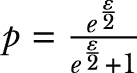对于ε-LDP。

    +   估计：对于每个值，使用二元随机响应机制中的估计公式。

+   优化的单值编码（OUE）：

    +   编码：Encode(*v*) = [0, 0, ..., 1, ..., 0]，其中只有*v*位是 1。

    +   扰动：*p* = 1/2，*q* = 1/(*e*^ε + 1)（如图 4.11 所示）。

    +   估计：。

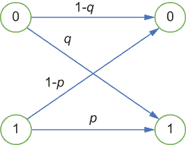

图 4.11 优化单值编码的扰动

本章主要关注不同 LDP 机制的工作方式，特别是对于一维数据。在第五章中，我们将扩展我们的讨论，看看我们如何使用更高级的机制来处理多维数据。

## 摘要

+   与集中式 DP 不同，LDP 消除了对可信数据管理者的需求；因此，个人可以在使用扰动技术对数据进行隐私化处理后，将其发送给数据聚合器。

+   在许多实际应用场景中，LDP 用于均值或频率估计。

+   随机响应机制也可以通过设计和实现隐私保护算法与 LDP 结合使用。

+   虽然直接编码有助于我们为分类和离散数据应用 LDP，但直方图编码可以用于应用 LDP 到数值和连续变量。

+   当数据聚合器收集扰动值时，聚合器有两种估计方法可供选择：使用直方图编码（SHE）的求和和阈值处理（THE）。

+   使用直方图编码（SHE）的求和计算个人报告的所有值的总和。

+   在使用直方图编码（THE）进行阈值处理的情况下，数据聚合器将所有大于阈值 *θ* 的值设置为 1，其余的值设置为 0。

+   单值编码机制是一种更通用且高效的 LDP 机制，适用于分类和离散问题。
