# 5 适用于机器学习的高级 LDP 机制

本章涵盖

+   高级 LDP 机制

+   使用朴素贝叶斯进行机器学习分类

+   使用 LDP 朴素贝叶斯处理离散特征

+   使用 LDP 朴素贝叶斯处理连续特征和多维数据

+   设计和分析 LDP 机器学习算法

在上一章中，我们探讨了局部微分隐私（LDP）的基本概念和定义，以及其底层机制和一些示例。然而，大多数这些机制都是专门为处理一维数据和频率估计技术而设计的，包括直接编码、直方图编码、一元编码等。在本章中，我们将进一步扩展我们的讨论，并探讨如何处理多维数据。

首先，我们将介绍一个使用朴素贝叶斯分类的机器学习（ML）用例示例。然后，我们将通过设计和分析一个 LDP ML 算法来探讨 LDP 朴素贝叶斯案例研究的实现。


## 5.1 局部微分隐私快速回顾

正如我们在上一章所讨论的，当数据收集者不可信时，LDP 是一种衡量个人隐私的方式。LDP 的目标是确保当个人提供特定值时，难以识别该个人，从而提供隐私保护。许多 LDP 机制还旨在尽可能准确地估计人群的分布，基于从多个个体收集的扰动数据的聚合。

图 5.1 总结了在不同应用场景中应用 LDP 的步骤。有关 LDP 如何工作的更多信息，请参阅第四章。

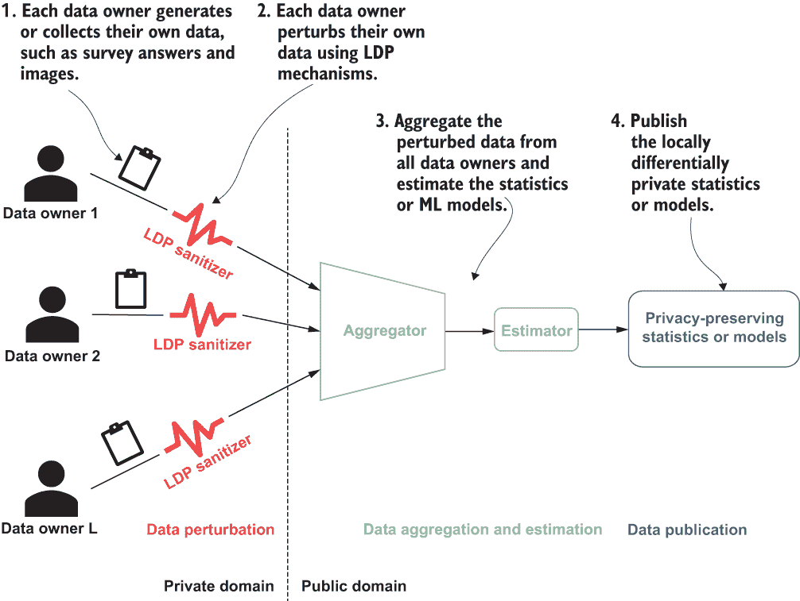

图 5.1 LDP 的工作原理：每个数据所有者对其数据进行局部扰动，并将其提交给聚合器。

现在我们已经回顾了 LDP 的工作原理，让我们来看看一些更高级的 LDP 机制。

## 5.2 高级 LDP 机制

在第四章中，我们探讨了直接编码、直方图编码和一元编码 LDP 机制。这些算法都适用于一维分类数据或离散数值数据。例如，调查问题“你的职业是什么？”的答案将是一个职业类别，这是一维分类数据。调查问题“你的年龄是多少？”的答案将是一个一维离散数值。然而，许多其他数据集，尤其是在处理机器学习任务时，更为复杂，包含多维连续数值数据。例如，基于像素的图像通常是高维的，而移动设备传感器数据（如陀螺仪或加速度计传感器）是多维的，通常是连续的数值数据。因此，了解在机器学习任务中处理此类场景的 LDP 机制至关重要。

在本节中，我们将关注三种为多维连续数值数据设计的不同机制：Laplace 机制、Duchi 机制和分段机制。

### 5.2.1 LDP 的 Laplace 机制

在第二章中，我们介绍了用于集中式差分隐私的 Laplace 机制。我们可以类似地实现用于 LDP 的 Laplace 机制。不过，首先，让我们回顾一些基础知识。

为了简单起见，让我们假设 LDP 机制中的每个参与者是 *u*[i]，并且每个 *u*[i] 的数据记录是 *t*[i]。这个 *t*[i] 通常是一个在-1 到 1 范围内的单维数值（如前一章所述），我们可以用数学表示为 *t*[i] ∈ [-1,1]^d。然而，在本节中，我们将讨论多维数据，因此 *t*[i] 可以定义为在-1 到 1 范围内的 *d*-维数值向量，即 *t*[i] ∈ [-1, 1]^d。此外，我们将使用 Laplace 机制扰动 *t*[i]，因此我们将让 *t*[i]^* 表示应用 LDP 后 *t*[i] 的扰动数据记录。

在掌握了这些基础知识之后，我们现在可以深入探讨 LDP 的 Laplace 机制。假设我们有一个参与者 *u*[i]，他们的数据记录是 *t*[i] ∈ [-1,1]^d。记住，这个数据记录现在是多维的。为了满足 LDP，我们需要扰动这个数据记录，在这种情况下，我们将使用来自 Laplace 分布的噪声。我们将定义一个随机函数 *t*[i]^* = *t*[i] + *Lap*(2 * *d*/ϵ) 来生成一个扰动值 *t*[i]^*，其中 *Lap(λ)* 是来自尺度为 *λ* 的 Laplace 分布的随机变量。

小贴士：当你提到差分隐私时，为什么我们总是关注 Laplace 机制？原因在于高斯扰动并不总是令人满意，因为它们不能用来实现纯 DP（ϵ-DP），这需要重尾分布。因此，最流行的分布是 Laplace 机制，其尾部“恰到好处”，可以用来实现纯 DP。

以下列表展示了实现 LDP 的 Laplace 机制的 Python 代码。

列表 5.1 LDP 的 Laplace 机制

```
def getNoisyAns_Lap(t_i, epsilon):
    loc = 0
    d = t_i.shape[0]
    scale = 2 * d / epsilon
    s = np.random.laplace(loc, scale, t_i.shape)
    t_star = t_i + s
    return t_star
```

Laplace 机制为 LDP 扰动多维连续数值数据提供了基本功能。然而，如 Wang 等人[1]所研究，当使用较小的隐私预算 ϵ（即，ϵ < 2.3）时，Laplace 机制往往会导致扰动数据中更多的方差，从而提供较差的效用性能。在下一节中，我们将探讨 Duchi 机制，它在使用较小的隐私预算时表现更好。

### 5.2.2 LDP 的 Duchi 机制

虽然 Laplace 机制是生成用于 LDP 扰动的噪声的一种方法，但 Duchi 等人[2]介绍了一种另一种方法，称为 Duchi 机制，用于扰动多维连续数值数据以实现 LDP。这个概念与 Laplace 机制类似，但数据处理方式不同。

让我们先看看 Duchi 机制是如何处理一维数值数据的扰动的。给定一个参与者 *u*[i]，他们的一个维数据记录 *t*[i] ∈ [-1,1]，以及隐私预算 ϵ，Duchi 机制执行如下：

1.  从 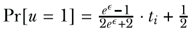 中采样一个伯努利变量 *u*。

1.  然后，如果 *u* = 1，扰动的数据将是 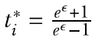；否则，它是 。

1.  扰动的数据 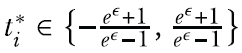将是 Duchi 机制的输出。

该算法的 Python 实现如下所示。

列表 5.2 Duchi 的一维数据机制

```
def Duchi_1d(t_i, eps, t_star):
    p = (math.exp(eps) - 1) / (2 * math.exp(eps) + 2) * t_i + 0.5
    coin = np.random.binomial(1, p)
    if coin == 1:
        return t_star[1]
    else:
        return t_star[0]
```

伯努利分布是什么？

在概率论中，伯努利分布是理解起来最简单的分布之一，它经常被用作更复杂分布的构建块。从高层次来看，伯努利分布是一个只有随机变量两个可能值的离散概率分布，其中它以概率 p 取值为 1，以概率 *q* = 1 - *p* 取值为 0。

简单来说，如果一个实验只有两种可能的结果，“成功”和“失败”，并且如果 p 是成功的概率，那么


在这种情况下，我们通常将“成功”视为我们想要跟踪的结果。

现在你已经知道了 Duchi 机制在一维数据上的工作原理，让我们将其扩展到多维数据。给定一个 *d*-维数据记录 *t*[i] ∈ [-1,1]^d 和隐私预算 ϵ，Duchi 机制的多维数据执行如下：

1.  通过独立地从以下分布中采样每个 *v*[*A*[j]]，生成一个随机的 *d*-维数据记录 *v* ∈ [-1,1]^d。

    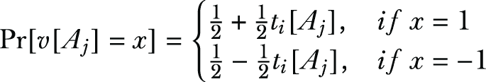

    *v*[*A*[j]] 表示 *v* 的第 *j* 个值。

1.  定义 *T*^+（相应地，*T*^-）为所有数据记录 *t* ^* ∈ {-*B*, *B*}^d 的集合，使得 *t*^* ⋅ *v* ≥ 0（相应地，*t*^* ⋅ *v* ≤ 0），其中我们得到

    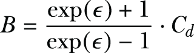

    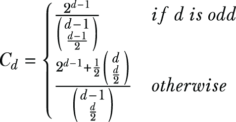

1.  从 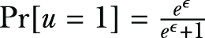 中采样一个伯努利变量 *u*。

1.  最后，如果 *u* = 1，输出从 *T*^+ 中均匀选择的数据记录；否则，输出从 *T*^- 中均匀选择的数据记录。

以下列表显示了该算法的 Python 实现。如果你仔细遵循我们刚才讨论的步骤，你会很快理解代码中的操作。

列表 5.3 Duchi 的多维数据机制

```
def Duchi_md(t_i, eps):
    d = len(t_i)
    if d % 2 != 0:
        C_d = pow(2, d - 1) / comb(d - 1, (d - 1) / 2)
    else:
        C_d = (pow(2, d - 1) + 0.5 * comb(d, d / 2)) / comb(d - 1, d / 2)

    B = C_d * (math.exp(eps) + 1) / (math.exp(eps) - 1)
    v = []
    for tmp in t_i:
        tmp_p = 0.5 + 0.5 * tmp
        tmp_q = 0.5 - 0.5 * tmp
        v.append(np.random.choice([1, -1], p=[tmp_p, tmp_q]))
    bernoulli_p = math.exp(eps) / (math.exp(eps) + 1)
    coin = np.random.binomial(1, bernoulli_p)

    t_star = np.random.choice([-B, B], len(t_i), p=[0.5, 0.5])
    v_times_t_star = np.multiply(v, t_star)
    sum_v_times_t_star = np.sum(v_times_t_star)
    if coin == 1:
        while sum_v_times_t_star <= 0:
            t_star = np.random.choice([-B, B], len(t_i), p=[0.5, 0.5])
            v_times_t_star = np.multiply(v, t_star)
            sum_v_times_t_star = np.sum(v_times_t_star)
    else:
        while sum_v_times_t_star > 0:
            t_star = np.random.choice([-B, B], len(t_i), p=[0.5, 0.5])
            v_times_t_star = np.multiply(v, t_star)
            sum_v_times_t_star = np.sum(v_times_t_star)
return t_star.reshape(-1)
```

当使用较小的隐私预算（即，ϵ < 2.3）时，Duchi 机制表现良好。然而，当使用较大的隐私预算时，它在效用方面不如拉普拉斯机制。是否可能存在一个更通用的算法，无论隐私预算是较小还是较大，都能表现良好？我们将在下一节中查看分段机制。

### 5.2.3 LDP 的分段机制

到目前为止，在本章中你已经学习了可用于 LDP 的机制。第三种机制，称为分段机制[1]，已被提出用于处理在使用 LDP 时多维连续数值数据，并且它可以克服拉普拉斯和 Duchi 机制的缺点。其思路是对多维数值进行扰动，并具有渐近最优误差界限。因此，每个个体只需报告一个比特给数据聚合器。

首先，让我们看看一维数据的分段机制。给定参与者 *u*[i] 的一维数据记录 *t*[i] ∈ [-1,1] 和隐私预算 ϵ，分段机制执行如下：

1.  在 0 到 1 的范围内选择一个值 *x*，均匀随机。

1.  如果 ，我们从 [l(t[i]), r(t[i])] 中均匀随机抽取 t[i]^*；否则，我们从 [-C, l(t[i]) **∪** r(t[i]), C] 中均匀随机抽取 t[i]^*，其中

    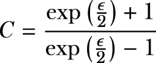

    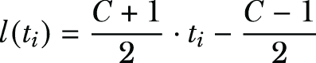

    和

    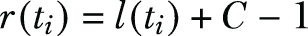

1.  扰动数据 *t*[i]^* ∈{-*C*,*C*} 将是分段机制的输出。

分段机制由三部分组成：中心部分、右侧部分 *r*() 和左侧部分 *l*()。中心部分计算为 *t*[i]* ∈ [*l*(*t*[i]), *r*(*t*[i])]，最右侧部分为 *t*[i]* ∈ [*r*(*t*[i]),*C*]，最左侧部分为 *t*[i]* ∈ [-*C*, *l*(*t*[i])]。你可以在下面的列表中看到一个该算法的 Python 实现。

列表 5.4 一维数据的分段机制

```
def PM_1d(t_i, eps):
    C = (math.exp(eps / 2) + 1) / (math.exp(eps / 2) - 1)
    l_t_i = (C + 1) * t_i / 2 - (C - 1) / 2
    r_t_i = l_t_i + C - 1

    x = np.random.uniform(0, 1)                              ❶
    threshold = math.exp(eps / 2) / (math.exp(eps / 2) + 1)
    if x < threshold:
        t_star = np.random.uniform(l_t_i, r_t_i)
    else:
        tmp_l = np.random.uniform(-C, l_t_i)
        tmp_r = np.random.uniform(r_t_i, C)
        w = np.random.randint(2)
        t_star = (1 - w) * tmp_l + w * tmp_r

    return t_star
```

❶ 在 uniform() 中提供大小参数将产生一个 ndarray。

我们如何处理多维数据？我们可以简单地将分段机制从其一维版本扩展到处理多维数据。给定一个 *d*-维数据记录 t[i] ∈ [-1,1]^d 和隐私预算 ϵ，多维数据的分段机制执行如下：

1.  从 {1, 2, ..., *d*} 中均匀无放回地抽取 *k* 个值，其中

    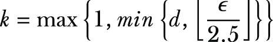

1.  对于每个采样的值 *j*，将 *t*[i][*A*[j]] 和 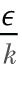 作为分段机制的一维版本的输入，并得到一个噪声值 *x*[i,j]。

1.  输出 t[i]^*，其中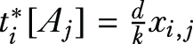。

以下列表展示了该算法的 Python 实现。

列表 5.5 多维数据的分段机制

```
def PM_md(t_i, eps):
    d = len(t_i)
    k = max(1, min(d, int(eps / 2.5)))
    rand_features = np.random.randint(0, d, size=k)
    res = np.zeros(t_i.shape)
    for j in rand_features:
        res[j] = (d * 1.0 / k) * PM_1d(t_i[j], eps / k)
    return res
```

现在我们已经研究了多维数值数据的三个高级 LDP 机制，让我们来看一个案例研究，展示如何使用真实世界的数据集实现 LDP。

## 5.3 实现 LDP 朴素贝叶斯分类的案例研究

在上一章中，我们介绍了一系列可以用来实现 LDP 协议的机制。在本节中，我们将以 LDP 朴素贝叶斯分类设计作为一个案例研究，来讲解设计 LDP 机器学习算法的过程。本节内容部分已发表在我们的研究论文[3]中。本案例研究的实现和完整代码可以在[`github.com/nogrady/PPML/tree/main/Ch5`](https://github.com/nogrady/PPML/tree/main/Ch5)找到。

注意：本节将向您介绍本案例研究的数学公式和实证评估，以便您可以从零开始学习如何开发 LDP 应用。如果您目前不需要了解这些实现细节，您可以跳到下一章。

### 5.3.1 使用朴素贝叶斯进行机器学习分类

在 3.2.1 节中，您学习了差分隐私朴素贝叶斯分类的工作原理及其数学公式。在本节中，我们将扩展讨论，探讨如何使用 LDP 结合朴素贝叶斯。正如前一章所述，LDP 涉及个人在通过扰动对数据进行隐私化后，将数据发送给数据聚合器。这些技术为个人提供了合理的否认可能性。数据聚合器随后收集所有扰动值并估计诸如人口中每个值的频率等统计数据。

为了保证在分类任务中提供训练数据的个人的隐私，可以在数据收集阶段使用 LDP 技术。在本章中，我们将应用 LDP 技术到朴素贝叶斯分类器上，这些分类器是基于贝叶斯定理的一组简单概率分类器。为了快速回顾，朴素贝叶斯分类器假设每对特征之间相互独立。最重要的是，这些分类器具有高度的可扩展性，特别适合特征数量多或训练数据量小的情况。尽管朴素贝叶斯分类器很简单，但它通常可以比更复杂的分类方法表现得更好或接近。

现在我们来详细探讨一下。给定一个新实例（一个已知的类别值），朴素贝叶斯计算每个类别标签的条件概率，然后将最大似然类标签分配给给定的实例。其想法是，使用贝叶斯定理和特征独立性的假设，每个条件概率可以分解为几个概率的乘积。我们需要使用训练数据计算这些概率，以实现朴素贝叶斯分类。由于训练数据必须通过保护隐私从个人那里收集，我们可以利用 LDP 频率和统计估计方法从个人那里收集扰动数据，然后使用朴素贝叶斯分类估计条件概率。

在这个案例研究中，我们首先将探讨如何使用 LDP 朴素贝叶斯分类器处理离散特征，同时保持类别标签和特征之间的关系。其次，我们将讨论连续特征的情况。我们将讨论如何对数据进行离散化，并在向数据添加拉普拉斯噪声以满足 LDP 后应用高斯朴素贝叶斯。我们还将向您展示如何处理连续数据的扰动方法。最后，我们将通过一系列实验场景和真实数据集来探索和实现这些技术，展示如何在保持分类器准确性的同时，LDP 保证是如何得到满足的。

离散特征与连续特征

*离散变量*是两个值之间具有可数个值的数值变量。离散变量始终是数值的。例如，缺陷部件的数量或错过付款的数量可以被视为离散值。

相比之下，*连续变量*是两个值之间具有无限个值的数值变量。连续变量可以是数值的，也可以是日期/时间，例如部件的长度或收到付款的日期/时间。

然而，我们有时会根据应用的不同，将离散数据视为连续数据，将连续数据视为离散数据。

### 5.3.2 使用具有离散特征的 LDP 朴素贝叶斯

在深入理论之前，让我们先来看一个例子。一个独立分析师想要训练一个机器学习分类器来预测“一个人错过抵押贷款支付的可能性”。想法是使用来自不同抵押贷款和金融公司的数据，训练一个模型，并使用这个模型来预测未来客户的行为了。问题是，没有任何一家金融公司愿意参与，因为他们不想分享他们客户的私人或敏感信息。对他们来说，最好的选择是分享他们数据的扰动版本，这样就能保护客户的隐私。但如何扰动数据，使其可以用于训练朴素贝叶斯分类器同时保护隐私呢？这正是我们要弄清楚的问题。

我们在第 3.2.1 节中讨论了朴素贝叶斯分类的工作原理，所以这里我们只回顾一下关键点。更多细节请参阅第三章。

在概率论中，贝叶斯定理描述了基于与事件可能相关的前置知识的事件概率。它表述如下：

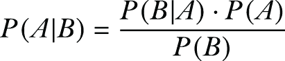

基于贝叶斯定理和每对特征之间独立性的假设，朴素贝叶斯分类技术使用贝叶斯定理。假设要分类的实例是 *n*-维向量 *X* = {*x*[1], *x*[2], ..., *x*[n]}，特征的名称是 *F*[1], *F*[2], ..., *F*[n]，可以分配给实例的可能类别是 *C* = {*C*[1], *C*[2], ..., *C*[k]}。朴素贝叶斯分类器将实例 *X* 分配到类别 *C*[s]，当且仅当 *P*(*C*[s]|*X*) > *P*(*C*[j]|*X*) 对于 1 ≤ *j* ≤ *k* 且 *j* ≠ *s*。因此，分类器需要计算所有类别的 *P*(*C*[j]|*X*) 并比较这些概率。使用贝叶斯定理，概率 *P*(*C*[j]|*X*) 可以计算如下

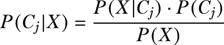

由于 *P*(*X*) 对于所有类别都是相同的，因此找到具有最大 *P*(*X*|*C*[j]) ∙ *P*(*C*[j]) 的类别就足够了。

让我们首先考虑所有特征都是数值和离散的情况。假设有 *m* 个不同的记录或个人（在这些金融公司中）可以用来训练这个分类器。表 5.1 显示了我们在第三章中讨论的抵押贷款支付数据集的一个摘录。

表 5.1 来自抵押贷款支付数据集的一个摘录。年龄、收入和性别是独立变量，而错过付款代表预测任务中的因变量。

| 编号 | 年龄 | 收入 | 性别 | 是否错过付款（是或否） |
| --- | --- | --- | --- | --- |
| 1 | 年轻 | 低 | 男 | 是 |
| 2 | 年轻 | 高 | 女 | 是 |
| 3 | 中等 | 高 | 男 | 否 |
| 4 | 老年 | 中等 | 男 | 否 |
| 5 | 老年 | 高 | 男 | 否 |
| 6 | 老年 | 低 | 女 | 是 |
| 7 | 中等 | 低 | 女 | 否 |
| 8 | 中等 | 中等 | 男 | 是 |
| 9 | 年轻 | 低 | 男 | 否 |
| 10 | 老年 | 高 | 女 | 否 |

我们的目的是使用这些数据来训练一个分类器，该分类器可以用来预测未来的客户，并确定特定客户是否有可能错过抵押贷款付款。因此，在这种情况下，分类任务是预测客户的行为（他们是否会错过抵押贷款付款），这使得它成为二元分类——我们只有两个可能的类别。

就像我们在第三章中所做的那样，让我们将这两个类别定义为 *C*[1] 和 *C*[2]，其中 *C*[1] 表示错过前一次付款，而 *C*[2] 表示其他情况。根据表 5.1 中报告的数据，这些类别的概率可以按以下方式计算：

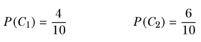

同样，我们可以计算条件概率。表 5.2 总结了我们在第三章中计算的年龄特征的已计算条件概率。

表 5.2 计算的年龄特征条件概率总结

| 条件概率 | 结果 |
| --- | --- |
| P(Age = Young | C[1])P(Age = Young | C[2]) | 2/41/6 |
| P(Age = Medium | C[1])P(Age = Medium | C[2]) | 1/42/6 |
| P(Age = Old | C[1])P(Age = Old | C[2]) | 1/43/6 |

一旦我们有了所有条件概率，我们就可以预测例如一个收入中等的年轻女性是否会错过付款。为此，首先我们需要将 *X* 设置为 *X* = (*Age* = *Young*, *Income* = *Medium*, *Gender* = *Female*)。第三章介绍了使用朴素贝叶斯分类器的剩余步骤和计算，如果需要可以参考。 

基于这些计算的结果，朴素贝叶斯分类器将为实例 *X* 分配 *C*[2]。换句话说，一个收入中等的年轻女性不会错过付款。


和

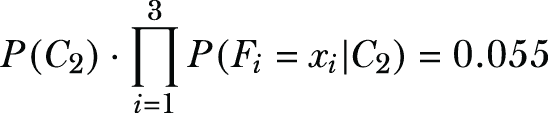

在了解了朴素贝叶斯分类器如何工作的基本原理之后，让我们看看如何使用之前讨论过的 LDP 频率估计方法来计算朴素贝叶斯分类器所需的概率。记住，在 LDP 中，数据聚合器负责计算类别概率 *P*(*C*[j]) 对于类别 *C* = {*C*[1], *C*[2], ..., *C*[k]} 中的所有类别，以及对于所有可能的 *x*[i] 值的条件概率 *P*(*F*[i] = *x*[i]|*C*[j])。

假设某个个体的数据，爱丽丝的数据，是 (*a*[1], *a*[2], ..., *a*[n])，并且她的类别标签是 *C*[v]。为了满足 LDP，她需要准备她的输入并对其进行扰动。让我们看看爱丽丝的数据如何准备和扰动，以及数据聚合器如何估计类别概率和条件概率。

计算类别概率

对于计算类别概率，由于爱丽丝的类别标签是 *C*[v]，她的输入变为 *v* ∈ {1, 2, ..., *k*}。然后爱丽丝对她的值 *v* 进行编码和扰动，并向数据聚合器报告。我们可以使用之前讨论过的任何 LDP 频率估计方法。同样，其他个人也会向数据聚合器报告他们扰动的类别标签。

数据聚合器收集所有扰动的数据，并估计每个值 *j* ∈ {1, 2, ..., *k*} 的频率为 *E*[j]。现在，概率 *P*(*C*[j]) 被估计为

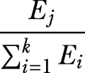

让我们通过一个例子来使问题更清晰。在表 5.1 的示例数据集中，类别标签只有两种选择：缺失付款或未缺失付款。假设 Alice 有缺失付款。那么 Alice 的输入*v*变为 1，并报告给数据聚合器。同样，如果她没有缺失付款，她将报告 2 作为她的输入给数据聚合器。图 5.2 显示了三个人向数据聚合器提交他们的扰动值。然后数据聚合器估计每个值的频率并计算类别概率。

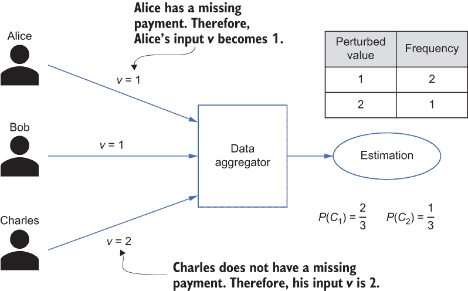

图 5.2 展示如何计算类别概率的示例

计算条件概率

为了估计条件概率*P*(*F*[i] = *x*[i]|*C*[j])，直接报告特征值是不够的。为了计算这些概率，必须保留类别标签和特征之间的关系，这意味着个体需要使用特征值和类别标签的组合来准备他们的输入。

我们将*F*[i]的可能值的总数设为*n*[i]。如果 Alice 在第*i*个维度的值是*a*[i] ∈ {1, 2, ..., *n*[i]}，并且她的类别标签值是*v* ∈ {1, 2, ..., *k*}，那么 Alice 对特征*F*[i]的输入变为*v*[i] = (*a*[i] - 1)∙*k* + *v*。因此，每个个体都会在她的第*i*个特征的[1, *k*∙*n*[i]]范围内计算她的输入。

这有点难以理解，不是吗？但别担心。让我们通过一个例子来看看。例如，假设表 5.1 中的年龄值被枚举为（年轻 = 1），（中等 = 2），（老年 = 3）。对于这个年龄特征，个人的输入可以是 1 到 6 之间的任何值，如表 5.3 所示，其中 1 表示年龄年轻且存在缺失付款，而 6 表示年龄老年且没有缺失付款。

表 5.3 准备输入作为特征值和类别标签的组合

| 类别标签与特征之间的关系 | 枚举值 |
| --- | --- |
| (年龄 = 年轻 &#124; C[1]) | 1 |
| (年龄 = 年轻 &#124; C[2]) | 2 |
| (年龄 = 中等 &#124; C[1]) | 3 |
| (年龄 = 中等 &#124; C[2]) | 4 |
| (年龄 = 老年 &#124; C[1]) | 5 |
| (年龄 = 老年 &#124; C[2]) | 6 |

你可能已经注意到，在表 5.2 中每一行都有一个输入值。同样，收入的可能输入值有 6 个，性别的可能输入值有 4 个。在确定她的第*i*个特征的输入后，Alice 会对她的值*v*[i]进行编码和扰动，并将扰动后的值报告给数据聚合器。为了估计*F*[i]的条件概率，数据聚合器通过估计具有值*y* ∈ {1, 2, ..., *n*[i]}和类别标签*z* ∈ {1, 2, ..., *k*}的个体的频率*E*[y,z]，来估计输入(*y* - 1)∙ *k* + *z*的频率。因此，条件概率*P*(*F*[i] = *x*[i]|*C*[j])被估计为


对于表 5.3 中的示例，为了估计概率 *P*(*Age* = *Medium*|*C*[2])，数据聚合器估计了 2、4 和 6 的频率为 *E*[1,2]、*E*[2,2] 和 *E*[3,2]。然后，*P*(*Age* = *Medium*|*C*[2]) 可以估计为

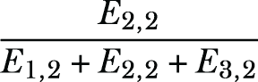

值得注意的是，为了有助于计算类概率和条件概率，每个个体可以准备 *n* + 1 个输入（即，Alice 的 {*v*, *v*[1], *v*[2], ..., *v*[n]}），这些输入可以在扰动后报告。然而，报告相互依赖的多个值通常会降低隐私级别。因此，每个个体只报告一个输入值。

最后，当数据聚合器估计一个值，例如 *E*[j] 或 *E*[(y,z)] 时，估计值可能是负数。我们可以将所有负估计值设为 1，以获得一个有效且合理的概率。

使用 LDP 与多维数据

上述频率和均值估计方法仅适用于一维数据。但如果我们有更高维度的数据呢？如果个体拥有的数据是多维的，使用这些方法报告每个值可能会因为特征之间的依赖性而导致隐私泄露。

为了达到这个目的，可以使用三种常见的方法与 *n*-维数据一起使用：

+   *方法 1*—如果噪声与维度 *n* 成比例缩放，则可以使用 LDP 与拉普拉斯机制（在第三章中讨论）一起使用。因此，如果个体的输入是 *V* = (*v*[1], ..., *v*[n])，且对所有 *i* ∈ {1, ..., *n*}，*v*[i] ∈ [-1,1]，则个体可以在添加 *Lap*(2*n*/ε) 后报告每个 v[i]。然而，如果维度 *n* 较高，这种方法不适用，因为大量的噪声会降低准确性。

+   *方法 2*—我们可以利用第 5.2.3 节中描述的 Piecewise 机制。Piecewise 机制可以用 LDP 协议扰动多维数值。

+   *方法 3*—数据聚合器可以从每个个体请求一个扰动输入以满足 ϵ-LDP。每个个体可以随机均匀选择要报告的输入，或者数据聚合器可以将个体分成 *n* 组，并从每组请求不同的输入值。结果，每个特征大约由 *m*/*n* 个个体报告。当个体数量 *m* 相对于特征数量 *n* 较高时，这种方法是合适的。否则，由于每个特征的报告值数量较低，准确性会降低。

现在我们已经了解了多维数据如何与 LDP 一起工作，让我们看看 LDP 在连续数据朴素贝叶斯分类中的细节。

### 5.3.3 使用具有连续特征的 LDP 朴素贝叶斯

到目前为止，我们已经看到了如何应用 LDP（拉普拉斯离散化）来处理离散特征。现在我们将探讨如何将相同的概念应用于连续特征。在朴素贝叶斯分类中，对于连续数据，LDP 可以采用两种不同的方法：

+   我们可以将连续数据离散化，并应用上一节中概述的离散朴素贝叶斯解决方案。在这种情况下，连续数值数据被分为桶，使其有限且离散。每个个体在离散化后都会扰动其输入。

+   数据聚合器可以使用高斯朴素贝叶斯来估计概率。

让我们从第一种方法，离散朴素贝叶斯开始。

离散朴素贝叶斯

对于离散朴素贝叶斯，我们需要将连续数据离散化，并使用 LDP 频率估计技术来估计频率。基于连续域内的已知特征，数据聚合器确定桶的区间以对域进行离散化——可以使用等宽离散化（EWD）或等宽分箱（EWB）来等分域。EWD 计算每个桶的宽度为 (*max* - *min*)/*n*[b]，其中 *max* 和 *min* 是最大和最小特征值，*n*[b] 是期望的桶数。在第 5.3.4 节中，我们将使用 EWD 方法在一些实验中进行离散化。

什么是等宽分箱？

通常，分箱是一种数据预处理方法，通过将原始数据值分为称为“桶”的小区间来最小化小观察误差的影响。然后，原始值被替换为该桶计算出的一个一般值。基本上，分箱方法将数值变量转换为分类对应物，但不使用目标（或类别）信息。在较小数据集的情况下，这有更好的机会减少过拟合。

将数据分为桶有两种基本方法：

+   *等频分箱* (*EFB*) **—**在这种情况下，所有桶具有相同的频率。

    +   示例输入数据：[0,4,12,16,16,18,24,26,28]

    +   分箱 1：[0,4,12]

    +   分箱 2：[16,16,18]

    +   分箱 3：[24,26,28]

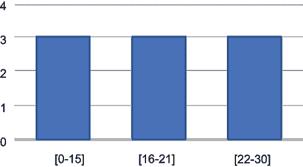

+   *等宽分箱* (*EWB*) **—**在这种情况下，数据被分为大小相等的区间，其中区间（或宽度）定义为 w = (max - min)/(number of bins)。

    +   示例输入数据：[0,4,12,16,16,18,24,26,28]

    +   分箱 1：[0,4]

    +   分箱 2：[12,16,16,18]

    +   分箱 3：[24,26,28]

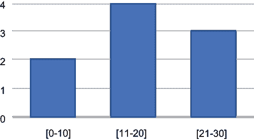

当数据聚合器与个体共享区间时，每个个体将他们的连续特征值离散化，并应用类似于我们讨论的 LDP 朴素贝叶斯离散特征的程序。数据聚合器也会使用与 LDP 朴素贝叶斯离散数据相同的程序来估计概率。每个个体应只报告一个扰动值以确保 ϵ-LDP。如您所见，通过分箱进行离散化是一种数据预处理方法。实际的隐私保护是通过离散朴素贝叶斯实现的。

高斯朴素贝叶斯

对于连续数据的第二种方法是使用高斯朴素贝叶斯。在这种情况下，最常见的方法是假设数据呈正态分布。对于 LDP 高斯朴素贝叶斯，计算类别概率与离散特征相同。为了计算条件概率，数据聚合器需要具有每个特征在给定类别标签下的训练值的均值和方差。换句话说，为了计算 *P*(*F*[i] = *x*[i]|*C*[j])，数据聚合器需要使用具有类别标签 *C*[j] 的个体的 *F*[i] 值来估计均值 *μ*[(i,j)] 和方差 σ²[i,j]。这意味着特征与类别标签之间的关联必须保持（类似于离散朴素贝叶斯分类器）。

我们已经讨论了均值估计过程，但要同时计算均值 *μ*[(i,j)] 和方差 σ²[i,j]，数据聚合器可以将个体分为两组。一组通过扰动他们的输入并与数据聚合器共享来为均值估计（即 *μ*[(i,j)]) 贡献。另一组通过扰动他们输入的平方并与之共享来为平方均值（即 μ^S[i,j]）的估计做出贡献。

让我们考虑另一个例子。假设鲍勃有一个类别标签 *C*[j] 和一个特征 *F*[i]，其值为 *b*[i]。我们还可以假设每个特征的域被归一化，使其值介于 [-1,1] 之间。如果鲍勃属于第一组，他会向他的值 *b*[i] 添加拉普拉斯噪声，从而获得扰动后的特征值 *b'*[i]。当数据聚合器收集到第一组具有类别标签 *C*[j] 的个体扰动后的特征值时，它会计算扰动特征值的平均值，这给出了均值 *μ*[(i,j)] 的估计，因为个体添加的噪声平均值是 0。第二组可以采用类似的方法。如果鲍勃属于第二组，他会向他的平方值 *b*²[i] 添加噪声，以获得 *b^(2')*[i]，并将其与数据聚合器共享。同样，数据聚合器会计算平方均值（μ^S[i,j]）的估计。最后，方差 σ²[i,j] 可以通过 μ^S[i,j] - (μ[i,j])² 来计算。再次强调，每个个体在扰动后只报告他们的一个值或值的平方，因为它们是相关的。

到目前为止，概率的计算是清晰且直接的。但你注意到当我们计算平均值和方差时，个体的类别标签并没有从数据聚合器那里隐藏吗？我们如何隐藏原始的类别标签？

为了克服这个问题并隐藏类别标签，我们可以采用以下方法：假设鲍勃正在报告一个与类别 *C*[j] 相关的特征值 *F*[i] = *b*[i]，其中 *j* ∈ {1,2, ..., *k*}。首先，他构建一个长度为 *k* 的向量，其中 *k* 是类别标签的数量。该向量初始化为零，除了对应于第 *j* 个类别标签的第 *j* 个元素，它被设置为特征值 *b*[i]。之后，向量的每个元素都像往常一样被扰动（即，通过添加拉普拉斯噪声）并贡献给数据聚合器。由于甚至在向量的零元素上也添加了噪声，数据聚合器将无法推断出实际的类别标签或实际值。

对于估计每个类别的实际平均值（以及平方值的平均值），数据聚合器只需要像往常一样计算扰动值的平均值，然后除以该类的概率。为了理解为什么我们需要这样做，假设一个类别 *j* 的概率为 *P*(*C*[j])。因此，对于特征 *F*[i]，只有 *P*(*C*[j]) 的个体在其输入向量的第 *j* 个元素中有实际值，而其余比例（1 - *P*(*C*[j])) 有零。因此，在围绕实际平均值的噪声相互抵消后，围绕零的噪声也相互抵消，我们将得到 *P*(*C*[j]) × *μ*[(i,j)] = *观测* (*偏移*) *平均值*。之后，我们可以通过 *P*(*C*[j]) 来除以观测平均值以获得估计的平均值。同样的方法适用于平方值的平均值，因此也适用于计算方差。

### 5.3.4 评估不同 LDP 协议的性能

现在我们已经了解了理论，是时候讨论不同 LDP 协议的实现策略和实验评估结果了。这些实验基于从 UCI 机器学习仓库 [4] 获得的数据集。表 5.4 总结了实验中使用的数据集。

表 5.4 实验中使用的数据集摘要

| 数据集名称 | 实例数量 | 特征数量 | 类别标签数量 |
| --- | --- | --- | --- |
| 车辆评估 | 1,728 | 6 | 4 |
| 国际象棋 | 3,196 | 36 | 2 |
| 蘑菇 | 8,124 | 22 | 2 |
| 四子棋 | 67,557 | 42 | 3 |
| 澳大利亚信用批准 | 690 | 14 | 2 |
| 糖尿病 | 768 | 8 | 2 |

为了评估在 LDP 下朴素贝叶斯分类的准确性，我们使用 Python 和 pandas 以及 NumPy 库实现了前几节讨论的方法。我们实现了五种不同的 LDP 协议用于频率估计——直接编码（DE）、使用直方图编码的求和（SHE）、使用直方图编码的阈值（THE）、对称一元编码（SUE）和最优一元编码（OUE），并且在不同θ值下进行了 THE 的实验。通过这些实验，我们发现当θ = 0.25 时可以达到最佳准确性，因此我们将给出 SHE 在θ = 0.25 时的实验结果。总的来说，我们将比较这些不同实现的成果，以展示哪个算法最适合这些数据集。

使用离散特征评估 LDP 朴素贝叶斯

为了评估使用 LDP 朴素贝叶斯对具有离散特征的数据进行分类的准确性，我们使用了来自 UCI ML 存储库的四个不同数据集（Car evaluation、Chess、Mushroom 和 Connect-4）。最初，执行了没有 LDP 的朴素贝叶斯分类作为比较不同编码机制在 LDP 下准确性的基准。

让我们看看图 5.3 所示的实验结果，其中显示了直到 5 的ε值的变化。虚线显示了没有隐私的准确性。正如预期的那样，当训练集中的实例数量增加时，较小的ε值准确性更好。例如，在 Connect-4 数据集中，除了 SHE 以外的所有协议即使在非常小的ε值下也提供了超过 65%的准确性。由于没有隐私的准确性大约为 75%，因此所有这些协议在ε值小于 1 时的准确性是显著的。Mushroom 数据集的结果也类似。当ε = 0.5 时，除了 SHE 以外的所有协议提供了近 90%的分类准确性。

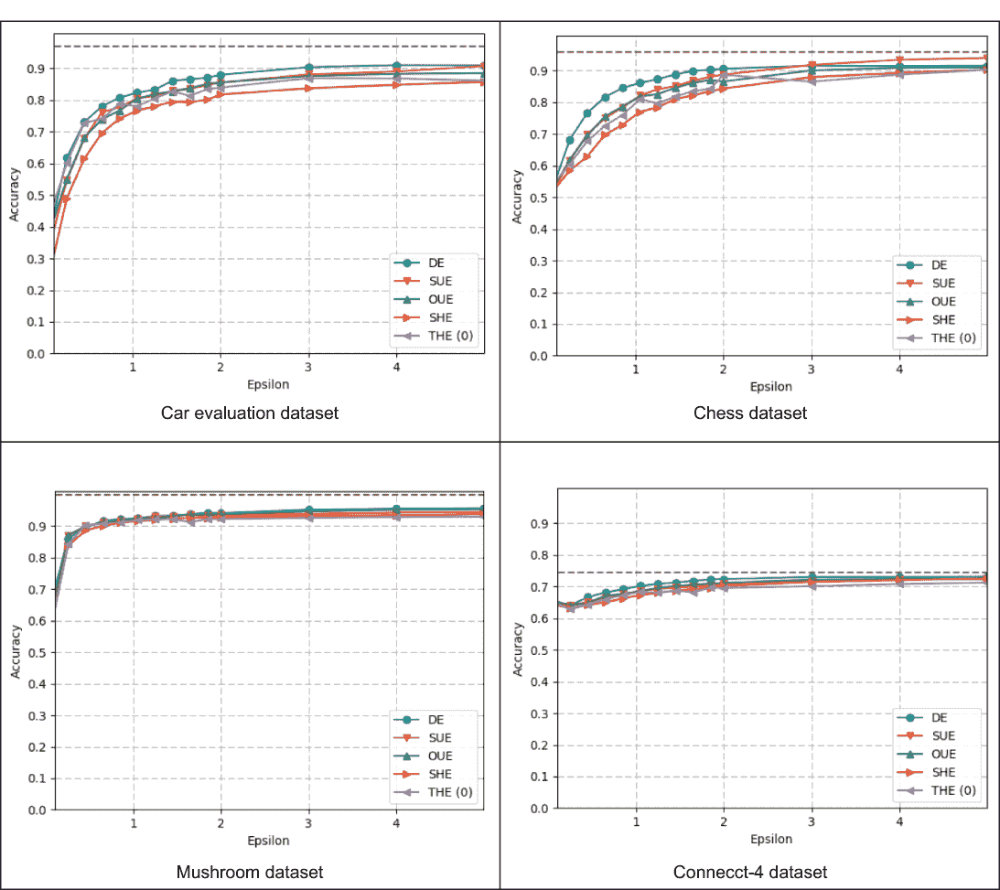

图 5.3 具有离散特征的 LDP 朴素贝叶斯分类准确性

在所有数据集中，你可以看到准确性最差的协议是 SHE。因为这个协议只是简单地对噪声值求和，其方差高于其他协议。此外，DE 在 Car Evaluation 和 Chess 数据集中对于小的ε值实现了最佳准确性，因为输入域较小。另一方面，DE 的方差与输入域的大小成正比。因此，当输入域较小时，其准确性更好。我们还可以看到，在所有实验中，SUE 和 OUE 提供了相似的准确性。当输入域较大时，它们的表现优于 DE。尽管 OUE 被提出以减少方差，但在这一组实验中，SUE 和 OUE 之间没有观察到显著的效用差异。

使用连续特征评估 LDP 朴素贝叶斯

现在，让我们讨论使用连续数据的 LDP Naive Bayes 的结果。在这种情况下，实验是在两个不同的数据集上进行的：澳大利亚信用批准和糖尿病。澳大利亚数据集有 14 个原始特征，而糖尿病数据集有 8 个特征。

最初，应用了离散化方法，然后实现了两种降维技术（PCA 和 DCA）以观察它们对准确率的影响。图 5.4 给出了两个数据集在不同 ϵ 值下的结果。我们还展示了两种 LDP 方案的结果，直接编码和优化一元编码，它们为不同领域大小提供了最佳准确率。对于澳大利亚数据集，输入域被划分为 *d* = 2 个桶，而对于糖尿病数据集，输入域被划分为 *d* = 4 个桶。

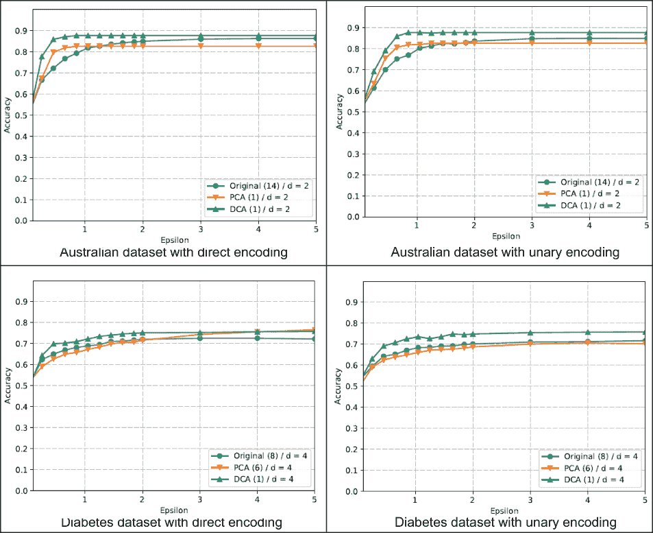

图 5.4 使用离散化方法对具有连续特征的数据集进行 LDP Naive Bayes 分类准确率

如您所见，对于澳大利亚数据集，当特征数量减少到 1 时，主成分分析（PCA）和判别成分分析（DCA）获得了最佳结果。另一方面，对于糖尿病数据集，当 PCA 将特征数量减少到 6，而 DCA 将特征数量减少到 1 时，达到了最佳准确率。如图 5.4 所示，DCA 提供了最佳的分类准确率，这显示了在离散化之前使用降维的优势。您还可以看到，DCA 的准确率优于 PCA，因为 DCA 主要是为分类设计的。

PCA 和 DCA 是什么？

主成分分析（PCA）和判别成分分析（DCA）是两种常用的降维方法，常用于降低大型数据集的维度。PCA 和 DCA 都通过将数据投影到低维超平面来工作。然而，它们之间的关键区别在于 PCA 假设与梯度之间存在线性关系，而 DCA 假设存在单峰关系。我们将在第九章中更详细地讨论不同的降维方法。

此外，我们还对相同的两个数据集应用了 LDP 高斯 Naive Bayes（LDP-GNB）。我们讨论的多维数据（在标题为“使用 LDP 处理多维数据”的子节中）的三个扰动方法都得到了实现。图 5.5 展示了在这两个数据集上执行 LDP-GNB 的结果。

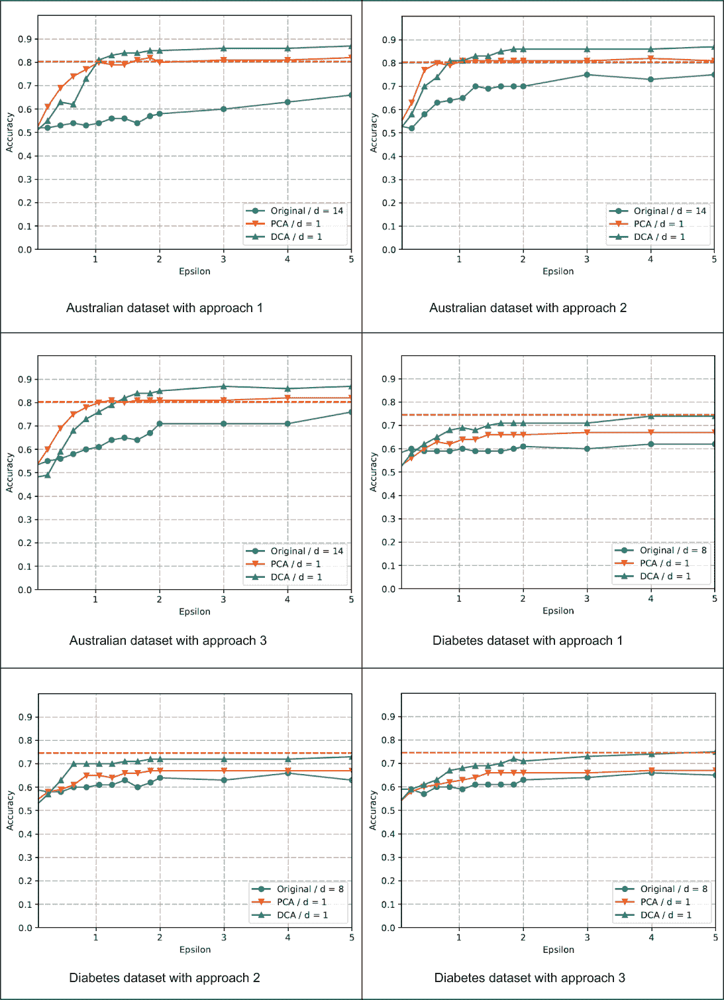

图 5.5 使用连续特征的 LDP 高斯 Naive Bayes 分类准确率

如您所见，三种方法中的第一种（使用拉普拉斯机制）导致最低的效用，因为个体通过添加更多与维度数量成比例的噪声来报告所有特征。在每个图中，都显示了三条曲线，对应于使用原始数据（澳大利亚和糖尿病数据集分别有 14 个或 8 个特征）或在使用 LDP 噪声之前使用 PCA 或 DCA 投影数据。所有图表都显示了降低维度的积极影响。在两个数据集中，对于 PCA 和 DCA，降低的维度数都是 1。DCA 或 PCA 总是比原始数据表现更好，并且对于所有扰动方法。

最后，当您比较连续数据的离散化和高斯 Naive Bayes 的结果时，您会发现离散化提供了更好的准确性。特别是对于较小的 ϵ 值，离散化的优越性很明显。尽管无法比较随机响应和拉普拉斯机制产生的噪声量，但离散化可能由于输入域较小而引起更少的噪声。

## 摘要

+   有不同的高级 LDP 机制适用于一维和多维数据。

+   正如我们在 DP 的集中设置中所做的那样，我们也可以为 LDP 实现拉普拉斯机制。

+   虽然拉普拉斯机制是生成扰动噪声的一种方法，但 Duchi 机制也可以用来扰动 LDP 的多维连续数值数据。

+   断续机制可以用来处理 LDP 的多维连续数值数据，同时克服拉普拉斯和 Duchi 机制的不利之处。

+   Naive Bayes 是一种简单而强大的机器学习分类器，它可以与 LDP 频率估计技术一起使用。

+   LDP Naive Bayes 可以与离散和连续特征一起使用。

+   当涉及到具有连续特征的 LDP Naive Bayes 时，有两种主要方法，即离散 Naive Bayes 和高斯 Naive Bayes。
