# 6 隐私保护合成数据生成

本章涵盖

+   合成数据生成

+   为匿名化生成合成数据

+   使用差分隐私机制生成隐私保护合成数据

+   为机器学习任务设计一个隐私保护合成数据生成方案

到目前为止，我们已经探讨了差分隐私（包括集中式、DP 和本地式、LDP 版本）的概念及其在开发隐私保护查询处理和机器学习（ML）算法中的应用。如您所见，DP 的理念是在查询结果中添加噪声（而不干扰其原始属性），以便结果可以确保个人的隐私同时满足应用的效用。

但有时数据用户可能需要原始数据以进行本地直接利用，可能用于开发新的查询和分析程序。隐私保护的数据共享方法可用于此类目的。本章将探讨合成数据生成——一种数据共享的可行解决方案，它生成合成且具有代表性的数据，可以在多个当事人之间安全地共享。合成数据生成的理念是人工生成具有与原始数据相似分布和属性的数据。由于它是人工生产的，我们不必担心隐私问题。

我们将从这个章节开始介绍合成数据生成的基本概念和原理。随后的章节将展示使用不同的数据匿名化技术或差分隐私（DP）实现合成数据生成方法的实例。在本章的末尾，我们将向您介绍一个案例研究，该研究实现了一种新颖的隐私保护合成数据生成方法，该方法使用数据匿名化和 DP 进行机器学习。

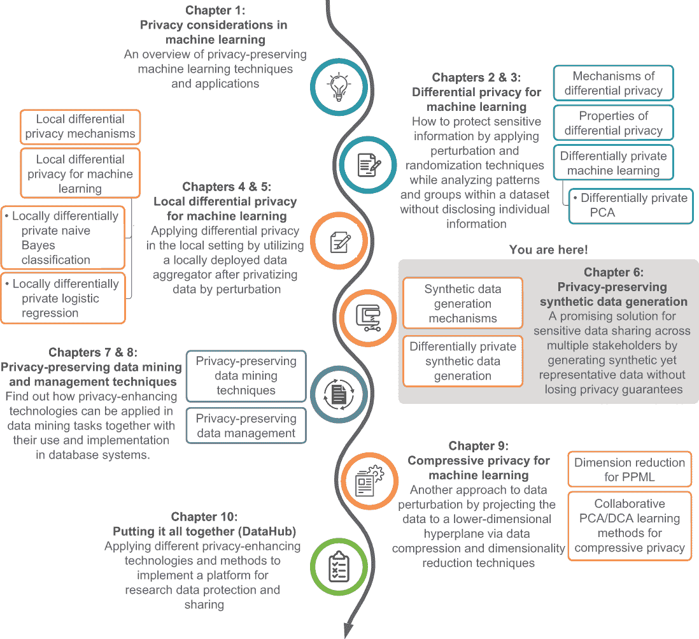

## 6.1 合成数据生成概述

从本质上讲，数据是一系列可以转化为计算机可以理解和处理的形式的事实。随着今天现代应用的发展，数据收集几乎无处不在，如商业分析、工程优化、社会科学分析、科学研究等。通常，不同的数据特征或模式可用于实现各种目标。例如，在医疗保健应用中，各种图像数据，如 X 光片、CT 扫描和皮肤镜检查图像，可以被机器学习应用用于诊断特定疾病或辅助治疗。

然而，在实践中，由于多种原因，包括隐私问题，获取真实（且敏感）数据非常具有挑战性，即使你能够收集数据，通常也不允许你与其他方分享。当涉及到机器学习应用时，大多数算法需要大量的训练数据才能达到最佳性能，但收集如此大量的真实数据并不总是可行的。因此，需要合成（但具有代表性）的数据，鉴于上述担忧，合成数据已成为越来越重要且受欢迎的话题。

### 6.1.1 什么是合成数据？为什么它很重要？

机器学习模型的表现很大程度上取决于用于训练模型的数据量和质量。当一个组织没有足够的数据进行训练时，具有相似研究兴趣的组织之间通常会进行数据共享。这使得研究可以扩展，但隐私问题仍然存在。数据通常包括可能导致个人隐私泄露的敏感个人信息。因此，在数据共享时启用隐私保护机制至关重要。为此，生成隐私保护合成数据是最佳替代方案之一——它是跨多个利益相关者共享敏感数据的灵活且可行的下一步解决方案。

合成数据是一种人工编制的数据，通常通过人工算法生成，而不是通过现实世界的直接测量技术收集。但它们仍然携带一些实际数据的临界特征（例如，统计属性、功能或结论）。分析合成数据可以产生与分析实际数据本身相似的结果。合成数据的另一个优点是，它可以针对现实中极难观察到的罕见测试场景的特定特征生成（即，难以获取实际数据的场景）。这使得工程师和研究人员能够生成不同的数据集来验证各种模型，评估机器学习算法，并在不同场景下测试新产品、流程和工具。

此外，合成数据帮助我们确保隐私保护。合成数据可以具有与原始数据相似的统计特性，而不泄露原始数据，这为保护隐私和机密性开辟了一条更安全的方式。例如，初级保健提供者（如医院）在患者同意的情况下收集和分享他们的患者信息用于研究目的。然而，大多数患者不会同意与其他方分享他们的私人信息。我们不是分享原始数据，而是可以根据原始数据集的特性生成人工或合成数据。然后我们可以与其他数据用户共享这些合成的数据。这样既保留了应用的效用，又保护了原始数据的隐私。

### 6.1.2 使用合成数据保护隐私的应用方面

合成数据不包含任何个人信息；它是一个与原始数据分布相似的人工产生的数据集。因此，工程、商业和科学研究应用可以从使用合成数据来保护隐私的目的中受益。

例如，让我们考虑一个在不同医疗实体之间（例如，医院和研究机构）共享临床和医疗数据的例子。假设两家医院，A 和 B，计划开展一项研究项目，以了解个人特定个人信息（年龄、BMI、血糖等）与患乳腺癌概率之间的关系。两家医院都可以从他们的患者那里收集有价值的数据，但由于患者-医院协议，两家医院不能相互分享他们的数据。此外，由于样本数量有限，一家医院的数据不足以支持此类研究。因此，两家医院必须合作进行研究，同时不泄露他们的患者的个人信息。

在这种情况下，我们可以使用合成数据生成技术来生成既合成又具有代表性的数据，这些数据可以安全地共享。通常，生成的合成数据具有与原始数据相同的格式、统计和分布（如图 6.1 所示），而不泄露任何个人信息。以与原始数据相同的形式共享合成数据集，为数据用户如何使用它提供了更多的灵活性，而无需担心隐私问题。

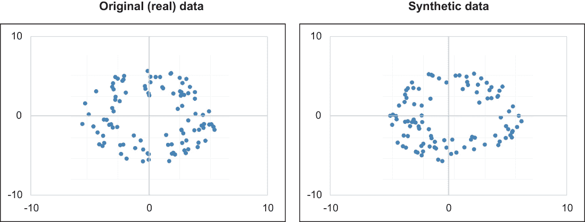

图 6.1 合成数据保留了原始数据的结构，但它们并不相同。

合成数据也可以在商业场景中使用。例如，假设一家公司想要进行商业分析以提高其营销支出。为了进行这项分析，公司的营销部门通常需要获得其客户的同意以使用他们的数据。然而，客户可能不会同意分享他们的数据，因为这些数据可能包含敏感信息，如交易、位置和购物信息。在这种情况下，使用从客户数据生成的合成数据将使公司能够在不需要客户同意的情况下进行准确的业务分析。由于合成数据是基于实际数据的统计特性生成的，因此它可以可靠地用于此类研究。

### 6.1.3 生成合成数据

在我们查看具体的生成技术之前，让我们回顾一下生成合成数据的一般过程，如图 6.2 所示。

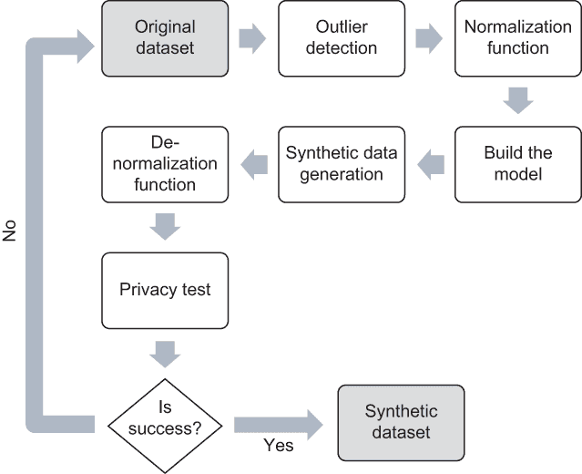

图 6.2 生成合成数据的一般流程

在从原始数据集中提取任何统计特性之前，第一步是对原始数据集进行预处理，通过去除异常值和归一化特征值。异常值是远离其他观察点的数据点。它们可能来自实验中的可变性和测量误差，有时会向数据用户提供错误信息。在大多数情况下，异常值可能会误导合成数据生成器生成更多的异常值，从而使 ML 模型不准确。检测异常值的一种常见方法是使用基于密度的方法：观察在某个区域中特定点存在的概率是否远低于该区域的预期值。

下一步是特征归一化。每个数据集都有不同数量的特征，每个特征都有不同的值范围。特征归一化通常将所有特征缩放到相同的范围，这有助于我们提取统计特性，同时给予不同特征平等的考虑。在归一化数据集之后，我们可以构建分布提取模型，该模型保持原始数据的统计特性。

最后，隐私测试旨在确保生成的合成数据满足某些预定义的隐私保证（*k*-匿名性、DP 等）。如果生成的合成数据无法提供预定义的隐私保证，隐私测试将失败。我们可以反复生成合成数据集，直到其中一个通过隐私测试。

现在我们已经涵盖了基本概念、应用场景和一般合成数据生成过程，让我们来看看基于数据匿名化和 DP 的一些最流行的合成生成技术。我们将从数据匿名化方法开始。

## 6.2 通过数据匿名化确保隐私

前几章讨论了通过添加噪声和使用扰动技术来隐私化敏感信息的不同技术。正如我们在本章开头所讨论的，合成数据是人为产生的数据。因此，不同的数据匿名化技术也可以用来创建一个合成数据集。

在本节中，我们将讨论使用数据匿名化技术来共享私有和敏感信息而不泄露个人隐私的历史非 DP 方法。在第 6.3 节中，我们将讨论使用 DP 进行合成数据生成。

### 6.2.1 私有信息共享与隐私关注

在我们查看匿名化技术是如何工作的之前，让我们考虑这样一个场景：个人的医疗记录被公开发布用于研究目的。分享此类信息对研究有许多好处，包括帮助研究界确认已发表的结果，并促进他们进行更多定性深入的数据分析。因此，在发布数据之前对数据进行匿名化是常见的做法。

但我们能否任意匿名化一个数据集呢？1997 年，马萨诸塞州的集团保险委员会想要发布一个州雇员住院访问的数据集，该数据集将被用于研究目的[1]。当然，存在隐私考虑，所以他们移除了所有可以用来识别患者身份的列，例如姓名、电话号码、SSN 和地址。你认为这次数据发布进行得顺利吗？

不幸的是，它并没有。麻省理工学院的研究员 Latanya Sweeney [2] 发现，尽管主要标识符已被移除，但数据集中仍留下了一些人口统计信息，例如邮政编码、出生日期和性别。Sweeney 意识到，马萨诸塞州州长坚持认为个人隐私得到尊重的声明实际上是不正确的。她决定重新识别已发布（或匿名化）数据集中的哪些记录属于州长，因此她调查了马萨诸塞州的公共选民记录，这些记录具有完整的标识符，例如姓名、地址和人口统计数据，包括邮政编码和出生日期。她能够识别数据集中属于州长的处方和访问记录。

注意：在数据安全中，*重新识别攻击*是指有人试图将外部数据源与特定个人或敏感记录联系起来。

正如你所见，数据匿名化技术可以用来合成一个数据集，但我们需要确保数据集中的敏感值不再唯一。我们如何创建一个匿名化数据集，使得数据集中的所有敏感值都不再唯一？这就是所谓的*k*-匿名性，一种流行的数据匿名化方法。

### 6.2.2 利用 k-匿名性对抗重新识别攻击

*K*-匿名性是一个关键的安全概念，用于通过将其链接到外部数据集来减轻某人通过重新识别匿名化数据的风险 [3]。这个想法很简单。它使用称为 *泛化* 和 *抑制* 的技术来隐藏一组类似人员中的个人身份。在技术术语中，当敏感列的每个可能值组合至少出现在 *k* 个不同记录中时，数据集被认为是 *k*-匿名的，其中 *k* 代表该组中的记录数。如果特定数据集中的任何个人至少有 *k*-1 个其他个人具有相同的属性，则可以说该数据集是 *k*-匿名化的。

例如，假设我们有一个相同的团体保险委员会数据集，我们正在查看该数据集中的邮编，并将 *k* 设置为 20。如果我们查看该数据集中的任何个人，我们应该始终找到 19 个其他人与之共享相同的邮编。底线是，我们仅通过引用他们的邮编就无法具体识别个人。同样的概念可以进一步扩展到结合多个属性。例如，我们可以考虑邮编和年龄作为属性。在这种情况下，匿名化数据集应该始终有 19 个其他人与之共享相同的年龄和邮编，这使得重新识别比前一种情况更困难。

表 6.1 中的数据集是 2 匿名化的，其中每个值（在这种情况下，邮编和年龄）的组合至少出现 *k* = 2 次。

表 6.1 一个示例 2 匿名化数据集，其中邮编和年龄的每个组合至少出现两次

| 邮编 | 年龄 |
| --- | --- |
| 33617 | 24 |
| 33620 | 35 |
| 33620 | 35 |
| 33617 | 24 |
| 33620 | 35 |

如何制作合成数据集 *k*-匿名

有两种不同的技术可以用来使原始数据集 *k*-匿名：泛化和抑制。

在泛化中，主要思想是使一个值不那么精确，以便具有不同值的记录被泛化为具有相同值的记录。让我们考虑表 6.2 中显示的原始数据集和表 6.3 中显示的 2 匿名化版本。

表 6.2 原始数据集

| 邮编 | 年龄 |
| --- | --- |
| 33617 | 24 |
| 33620 | 41 |
| 23622 | 43 |
| 33617 | 29 |

表 6.3 表 6.2 中数据集的 2 匿名化版本

| 邮编 | 年龄 |
| --- | --- |
| 33617 | 20-29 |
| 33617 | 20-29 |
| 236** | 40-49 |
| 236** | 40-49 |

假设表 6.2 代表我们感兴趣的原始数据集，我们需要将其转换为它的 2 匿名化版本。在这种情况下，我们可以将数据集中的数值转换为数值范围，以便结果表验证 2 匿名性，如表 6.3 所示。

如您所见，即使在匿名化过程之后，结果值仍然相对接近数据集中的原始值。例如，年龄 24 变成了 20 到 29 的范围，但它仍然很接近原始值。

现在，让我们考虑表 6.4。在这里，前四条记录可以简单地转换为它们的 2-匿名版本。但最后一条记录是一个异常值。如果我们尝试将它与一对中的一对组合，结果将会有一个非常大的值范围。例如，年龄的范围将从 10 到 49 岁，而邮编将完全被删除。因此，最简单的解决方案是从数据集中删除异常值，并保留其余的记录。这个过程被称为*抑制*。

表 6.4 一个包含异常值的示例数据集。正如您所看到的，最后一行的 12 岁年龄是一个异常值。

| 邮编 | 年龄 |
| --- | --- |
| 33617 | 24 |
| 23620 | 41 |
| 23622 | 43 |
| 33617 | 29 |
| 19352 | 12 |

在高层次上，这是我们如何将*k*-匿名应用于数据集以生成匿名（或合成）数据集的方法。我们将在第七章中讨论更多详细示例和技术，以及实际操作练习。

正如您所看到的，通过泛化和抑制数据，*k*-匿名性使得隐私泄露变得困难。然而，它也有一些缺点，我们将在下面讨论。

### 6.2.3 超越 k-匿名化的匿名化

虽然*k*-匿名性使得重新识别记录变得更加困难，但它也有一些缺点。例如，假设数据集中的所有个体在考虑的属性上都有相同的值。在这种情况下，仅通过知道这些个体是数据集的一部分，就可能泄露这些信息。

让我们考虑表 6.5 中的数据集。正如您所看到的，它已经进行了 2-匿名化，但假设鲍勃住在 33620 邮编，并且知道他的邻居最近去做了医疗预约？鲍勃可能会推断出他的邻居患有心脏病。因此，尽管鲍勃不能区分哪条记录属于他的邻居（多亏了*k*-匿名），但他仍然可以推断出他的邻居患有哪种疾病。

表 6.5 即使是*k*-匿名化的数据集，也可能泄露一些信息。

| 邮编 | 年龄 | 疾病 |
| --- | --- | --- |
| 33617 | 20-29 | 癌症 |
| 33617 | 20-29 | 传染病 |
| 33620 | 40-49 | 心脏病 |
| 33620 | 40-49 | 心脏病 |

通常，可以通过增加等价组内敏感值的多样性来解决此问题。这就是*l*-多样性，它是*k*-匿名的一个扩展，用于提供隐私保护。*l*-多样性的基本方法是确保每个组至少有*l*个不同的敏感值，这样就可以很难识别个人或敏感属性。可以通过增加记录的多样性来对相同的数据库进行*l*-多样性处理，如表 6.6 所示。

表 6.6 记录的多样性可以通过增加来保护那些*k*-匿名不起作用的情况。

| 邮编 | 年龄 | 疾病 |
| --- | --- | --- |
| 33*** | 20-29 | 癌症 |
| 33*** | 20-29 | 传染病 |
| 33*** | 40-49 | 心脏病 |
| 33*** | 40-49 | 心脏病 |

如您所见，与表 6.5 相比，表 6.6 现在具有 2-多样性（*l* = 2），鲍勃无法区分他的邻居是否患有癌症、病毒感染或心脏病。然而，*l*-多样性在某些情况下可能仍然不起作用。如果鲍勃知道他的邻居 40 岁出头呢？现在他可能能够将搜索空间缩小到表 6.6 的最后两行，并且他会知道邻居患有心脏病。如果我们需要减轻这种情况，我们可以再次泛化年龄列，使其范围从 20 岁到 49 岁。然而，这将显著降低结果数据的有用性。我们将在第八章通过实际练习讨论如何在不同的场景中使用*l*-多样性。

效用与隐私（一种反向关系）之间的基本权衡始终是数据匿名化的一个关注点。为此，使用其他方法生成合成数据是解决该问题的可行下一步解决方案。本质上，我们将使用原始数据集来训练一个机器学习模型，然后使用该模型生成具有与底层真实数据相同统计特性的更真实但合成的数据。在下一节中，我们将探讨我们可以使用哪些技术来生成合成数据。

## 6.3 用于隐私保护合成数据生成的差分隐私（DP）

在上一节中，我们讨论了通过使用数据匿名化技术生成合成数据。在本节中，我们将探讨在合成数据生成中应用差分隐私（DP）。

让我们考虑以下数据共享场景。假设公司 A 收集了大量关于其客户（年龄、职业、婚姻状况等）的数据，并且他们想对这些数据进行商业分析以优化公司的支出和销售。然而，由于关键的隐私原因，公司 A 没有进行这种分析的能力。他们希望将这项任务外包给第三方运营商，公司 B。但是，由于关键的隐私原因，公司 A 不能与公司 B 共享原始数据。因此，公司 A 希望生成一个合成数据集，该数据集保留了原始数据集的统计特性，而不泄露任何私人信息。然后，他们可以将合成数据集与公司 B 共享，以进行进一步的分析。

在这种情况下，公司 A 有两个合成数据生成和共享选项。首先，他们可以生成原始数据集的合成数据表示，例如直方图、概率分布、均值/中位数或标准差。尽管这样的合成数据表示可以反映原始数据的一些属性，但它们与原始数据不具有相同的“形状”（即特征数量和样本数量）。如果数据分析过程需要特定的或更复杂且可定制的算法（如机器学习或深度学习算法），仅仅提供原始数据的合成数据表示无法满足这些数据需求。例如，大多数机器学习或深度学习算法都需要直接在数据集的特征向量上运行，而不是在数据集的统计数据（如均值或标准差）上运行。因此，第二种选项，即更通用和灵活的选项，是提供一个保持与原始数据集相同统计属性且具有相同形状的合成数据集。

在本节的剩余部分，我们将使用直方图作为示例数据表示，以展示如何生成满足差分隐私（DP）的合成数据表示。我们还将探讨如何使用 DP 合成数据表示来生成差异隐私合成数据。

### 6.3.1 DP 合成直方图表示生成

让我们继续我们之前的数据共享场景。假设我们的外包公司 B 想了解在特定年龄范围内的公司 A 客户数量。一个直接的方法就是向公司 B 提供一个计数查询函数，该函数可以直接查询公司 A 的原始数据。

让我们以美国人口普查数据集为例，并按以下列表加载它。

列表 6.1 加载美国人口普查数据集

```
import pandas as pd
import numpy as np
import matplotlib.pyplot as plt
import sys
import io
import requests
import math

req = requests.get("https://archive.ics.uci.edu/ml/machine-learning-
➥ databases/adult/adult.data").content                               ❶
adult = pd.read_csv(io.StringIO(req.decode('utf-8')), header=None, 
➥ na_values='?', delimiter=r", ")
adult.dropna()
adult.head()
```

❶ 加载数据。

你将得到如图 6.3 所示的结果。

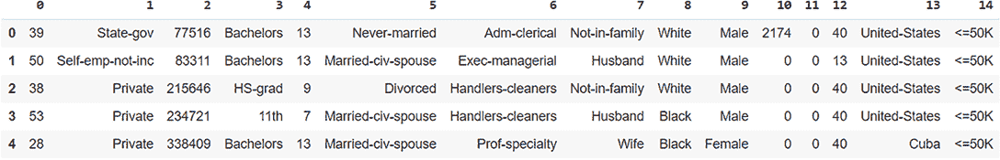

图 6.3 美国人口普查数据集快照

现在，让我们实现一个计数查询来计算特定年龄范围内的人数。在这个例子中，我们将寻找年龄在 44 到 55 岁之间的人数。

列表 6.2 实现计数查询

```
adult_age = adult[0].dropna()      ❶

def age_count_query(lo, hi):       ❷
    return sum(1 for age in adult_age if age >= lo and age < hi)

age_count_query(44, 55)
```

❶ 人群的年龄

❷ 计算特定年龄范围内的人数 [lo, hi)。

你会发现在这个数据集中，44 至 55 岁年龄范围内有 6,577 人。在这个时候，我们可以将 DP 扰动机制添加到计数查询的输出中，以满足公司 B 的需求。然而，这种实现只能满足公司 B 对公司 A 原始数据的一次性计数查询需求。在现实中，公司 B 不会只使用一次这个计数查询。正如我们在第二章中讨论的，增加同一数据集上的不同隐私查询次数意味着我们需要增加整体隐私预算，这意味着容忍更多来自原始数据集的隐私泄露，或者向查询输出添加更多噪声，这会导致精度下降。

我们如何改进这个解决方案以满足需求？答案是提供原始数据的不同隐私合成数据表示，而不是不同隐私查询函数。在这里，我们可以使用合成直方图来表示原始数据，并为计数查询提供足够的信息。首先，让我们使用之前定义的计数查询实现一个合成直方图生成器。

列表 6.3 合成直方图生成器

```
age_domain = list(range(0, 100))                                       ❶

age_histogram = [age_count_query(age, age + 1) for age in age_domain]  ❷

plt.bar(age_domain, age_histogram)
plt.ylabel('The number of people (Frequency)')
plt.xlabel('Ages')
```

❶ 年龄的域

❷ 使用年龄计数查询创建年龄直方图。

你将得到一个类似于图 6.4 的直方图。这里显示的是使用列表 6.2 中的年龄计数查询生成的直方图。正如你所见，它显示了每个年龄段在这个数据集中有多少人。

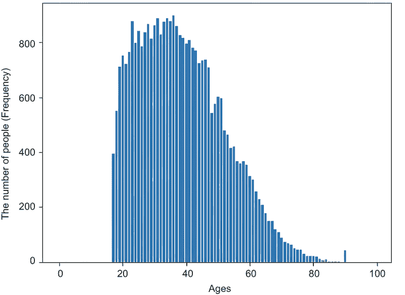

图 6.4 显示每个年龄段人数的直方图

让我们称这个为合成直方图或合成数据表示。记住，我们还没有生成任何合成数据——这是我们将用来生成合成数据的“表示”。

现在，让我们使用这个直方图来创建计数查询。

列表 6.4 使用合成直方图生成器实现计数查询

```
def synthetic_age_count_query(syn_age_hist_rep, lo, hi):         ❶
    return sum(syn_age_hist_rep[age] for age in range(lo, hi))

synthetic_age_count_query(age_histogram, 44, 55)
```

❶ 从年龄的合成直方图中生成合成计数查询结果。

从合成数据产生的输出将是 6,577。正如你所见，由合成直方图数据表示生成的结果与使用之前在原始数据上进行的计数查询生成的结果相同。这里的要点是，我们并不总是需要原始数据来查询或推断某些信息。如果我们能获得原始数据的一个合成数据表示，这足以让我们回答一些查询。

在列表 6.3 中，我们使用原始数据生成了直方图。现在，让我们使用拉普拉斯机制（敏感度和 epsilon 都等于 1.0）实现一个不同隐私合成直方图生成器。

列表 6.5 添加拉普拉斯机制

```
def laplace_mechanism(data, sensitivity, epsilon):                        ❶
    return data + np.random.laplace(loc=0, scale = sensitivity / epsilon)

sensitivity = 1.0                                                         ❷
epsilon = 1.0
dp_age_histogram = [laplace_mechanism(age_count_query(age, age + 1), 
➥ sensitivity, epsilon) for age in age_domain]

plt.bar(age_domain, dp_age_histogram)
plt.ylabel('The number of people (Frequency)')
plt.xlabel('Ages')
```

❶ DP 的拉普拉斯机制

❷ 生成一个差分隐私合成直方图。

结果如图 6.5 所示。让我们称这为差分隐私合成直方图数据表示。观察这个直方图和图 6.4 中的直方图的模式。你看到任何区别吗？这两个看起来非常相似，但这个并不是使用原始数据集生成的。相反，我们使用了拉普拉斯机制（DP）来生成数据。

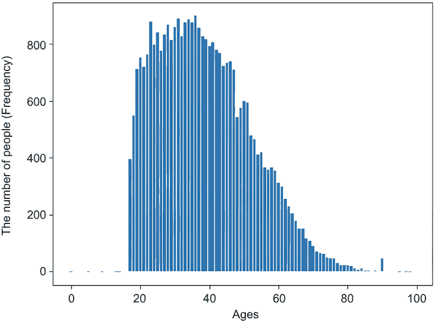

图 6.5 一个差分隐私合成直方图

现在的问题是，“如果我们运行计数查询，这会给我们相同的结果吗？”让我们在相同的输入下，使用差分隐私合成直方图生成一个计数查询结果。

列表 6.6 差分隐私计数查询

```
synthetic_age_count_query(dp_age_histogram, 44, 55)   ❶
```

❶ 使用差分隐私合成直方图生成一个差分隐私计数查询结果。

你会得到类似 6,583.150,999,026,576 的输出。

注意：由于这是一个随机函数，你将得到不同的结果，但应该接近这个值。

如您所见，结果仍然与之前的真实结果非常相似。换句话说，差分隐私合成直方图数据表示可以在满足公司 B 的数据共享要求的同时，仍然保护公司 A 的隐私要求，因为我们使用的是合成数据而不是原始数据。

### 6.3.2 DP 合成表格数据生成

在上一节中，我们看到了如何使用差分隐私合成数据表示来启用隐私保护的数据共享。但是，如果公司 B 想要执行更复杂的数据分析方法，例如机器学习或深度学习算法，这些方法需要使用与原始数据集相同形状的数据集，那会怎样呢？在这种情况下，我们需要再次从合成数据表示中生成与原始数据相同形状的合成数据。

在我们的例子中，美国人口普查数据集包含表格数据。为了生成具有相同形状的合成表格数据，我们可以使用合成直方图作为表示原始数据潜在分布的概率分布。然后我们可以使用这个合成直方图来生成合成表格数据。

简而言之，给定一个直方图，我们可以将所有直方图区间的计数总和视为总数。对于每个直方图区间，我们可以使用其计数除以总数来表示样本落在该直方图区间的概率。一旦我们有了这些概率，我们就可以使用直方图及其区间的域轻松地采样合成数据集。

假设我们已经有了一个差分隐私合成直方图。然后我们需要预处理合成直方图，以确保所有计数都是非负的并且归一化。这意味着每个区间的计数应该是一个概率（它们应该加起来为 1.0）。以下列表显示了预处理和归一化操作。

列表 6.7 预处理和归一化操作

```
dp_age_histogram_preprocessed = np.clip(dp_age_histogram, 0, None)
dp_age_histogram_normalized = dp_age_histogram_preprocessed / 
➥ np.sum(dp_age_histogram_preprocessed)

plt.bar(age_domain, dp_age_histogram_normalized)
plt.ylabel('Frequency Rates (probabilities)')
plt.xlabel('Ages')
```

概率直方图可能看起来像图 6.6。

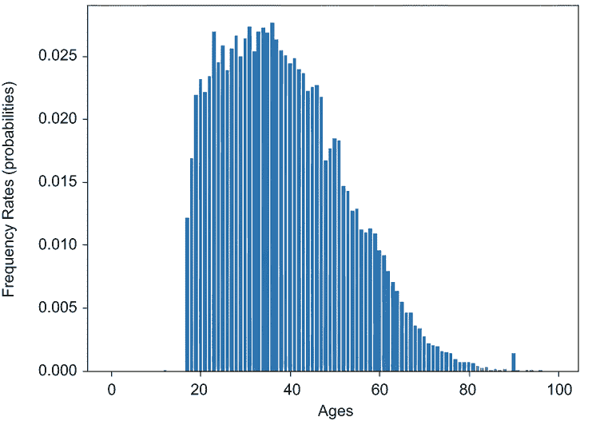

图 6.6 一个归一化的差分隐私合成直方图

如你所见，这个直方图的 y 轴现在已归一化，但它仍然与图 6.5 中输入的差分隐私合成直方图具有相同的形状。

现在让我们生成差分隐私合成表格数据。

列表 6.8 生成差分隐私合成表格数据

```
def syn_tabular_data_gen(cnt):
    return np.random.choice(age_domain, cnt, p = dp_age_histogram_normalized)

syn_tabular_data = pd.DataFrame(syn_tabular_data_gen(10), columns=['Age'])
syn_tabular_data
```

结果显示在图 6.7 中。记住，这是一个随机函数，所以你的结果可能会有所不同。

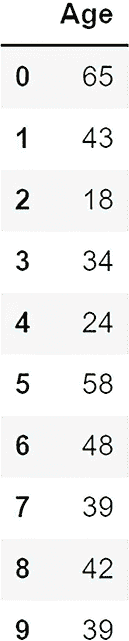

图 6.7 一组差分隐私合成表格数据的样本集

列表 6.8 中我们在做什么？我们使用列表 6.7 中生成的归一化合成直方图生成了十个不同的合成数据记录。这意味着我们使用归一化合成直方图的性质生成了全新的合成数据记录。现在我们有两个不同的数据集：原始数据集和合成生成数据集。

现在让我们使用直方图来比较合成数据和原始数据的统计特性，如图 6.9 和 6.10 所示。

列表 6.9 合成数据的直方图

```
syn_tabular_data = pd.DataFrame(syn_tabular_data_gen(len(adult_age)), 
➥ columns=['Age'])
plt.hist(syn_tabular_data['Age'], bins=age_domain)
plt.ylabel('The number of people (Frequency) - Synthetic')
plt.xlabel('Ages')
```

此代码生成如图 6.8 所示的合成数据的直方图。

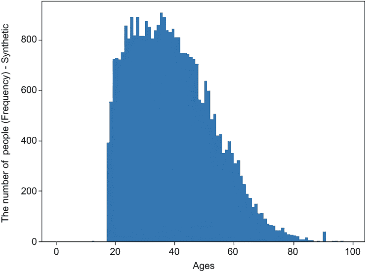

图 6.8 使用合成表格数据生成产生的直方图

为了进行比较，让我们生成原始数据的直方图。

列表 6.10 原始数据的直方图

```
plt.bar(age_domain, age_histogram)
plt.ylabel('The number of people (Frequency) - True Value')
plt.xlabel('Ages')
```

结果可能看起来像图 6.9。


图 6.9 原始数据的直方图

如果你比较图 6.8 和 6.9 中的直方图形状，你会发现它们非常相似。换句话说，我们生成的合成数据具有与原始数据相同的统计特性。有趣，不是吗？

### 6.3.3 DP 合成多边际数据生成

上一节介绍了一种使用 DP 从合成直方图数据表示生成隐私保护的单列合成表格数据的方法。但大多数现实世界的数据集由多列表格数据组成。我们该如何解决这个问题？

一个简单的解决方案是使用我们之前描述的方法为多列表格数据的每一列生成合成数据，然后将所有合成的单列表格数据组合在一起。这个解决方案看起来很简单，但它并没有反映这些列之间的相关性。例如，在美国人口普查数据集中，年龄和婚姻状况直观上高度相关。在这种情况下我们该怎么办？ 

我们可以考虑同时考虑多个列。例如，我们可以计算有多少人是 18 岁且从未结婚，有多少人是 45 岁且离婚，有多少人是 90 岁且成为寡妇，等等。然后我们可以使用之前的方法计算每种情况的可能性，并从模拟的概率分布中采样合成数据。我们将这个结果称为*合成多边缘数据*。

让我们在包含年龄和婚姻状况的美国人口普查数据集上实现这个想法。

列表 6.11 2 路边缘表示

```
two_way_marginal_rep = adult.groupby([0, 5]).size().
➥ reset_index(name = 'count')
two_way_marginal_rep
```

原始数据集的 2 路边缘表示如图 6.10 所示。记住，列 0 是年龄，列 5 是婚姻状况。正如你在第二行（索引 1）中看到的那样，有 393 人从未结婚且年龄为 17 岁。

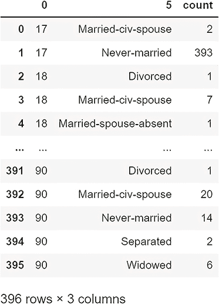

图 6.10 原始数据集的 2 路边缘表示快照

对于每种婚姻状况和年龄组合，我们都有 396 个这样的类别。一旦我们生成这样的 2 路边缘数据集，我们就可以使用拉普拉斯机制使其具有差分隐私。

列表 6.12 差分隐私的 2 路边缘表示

```
dp_two_way_marginal_rep = laplace_mechanism(two_way_marginal_rep["count"],
➥ 1, 1)
dp_two_way_marginal_rep
```

2 路边缘表示的结果如图 6.11 所示。正如你所看到的，我们已经为所有 396 个类别生成了一个差分隐私值。

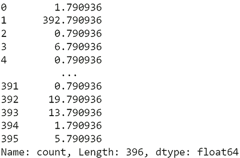

图 6.11 差分隐私的 2 路边缘表示快照

现在，我们可以使用我们提出的方法来生成包含年龄和婚姻状况的合成多边缘数据。以下列表使用列表 6.12 中产生的 2 路边缘表示来生成合成数据集。

列表 6.13 生成合成多边缘数据

```
dp_two_way_marginal_rep_preprocessed = np.clip(dp_two_way_marginal_rep,
➥ 0, None)
dp_two_way_marginal_rep_normalized = dp_two_way_marginal_rep_preprocessed / 
➥ np.sum(dp_two_way_marginal_rep_preprocessed)
dp_two_way_marginal_rep_normalized

age_marital_pairs = [(a,b) for a,b,_ in 
➥ two_way_marginal_rep.values.tolist()]
list(zip(age_marital_pairs, dp_two_way_marginal_rep_normalized))

set_of_potential_samples = range(0, len(age_marital_pairs))

n = laplace_mechanism(len(adult), 1.0, 1.0)

generating_synthetic_data_samples = np.random.choice(
➥ set_of_potential_samples, int(max(n, 0)), 
➥ p=dp_two_way_marginal_rep_normalized)
synthetic_data_set = [age_marital_pairs[i] for i in 
➥ generating_synthetic_data_samples]

synthetic_data = pd.DataFrame(synthetic_data_set, 
➥ columns=['Age', 'Marital status'])
synthetic_data
```

生成的合成 2 路边缘数据集如图 6.12 所示。

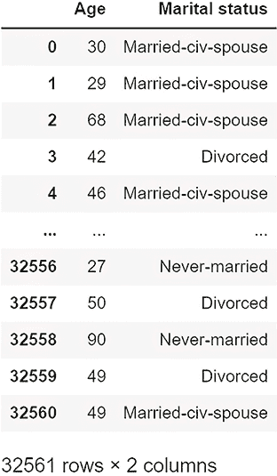

图 6.12 合成产生的 2 路边缘数据集快照

让我们比较合成数据和原始数据的统计特性。首先，让我们比较年龄数据的直方图。

列表 6.14 使用合成多边缘数据生成的直方图

```
plt.hist(synthetic_data['Age'], bins=age_domain)
plt.ylabel('The number of people (Frequency) - Synthetic')
plt.xlabel('Ages')
```

合成数据的直方图如图 6.13 所示。

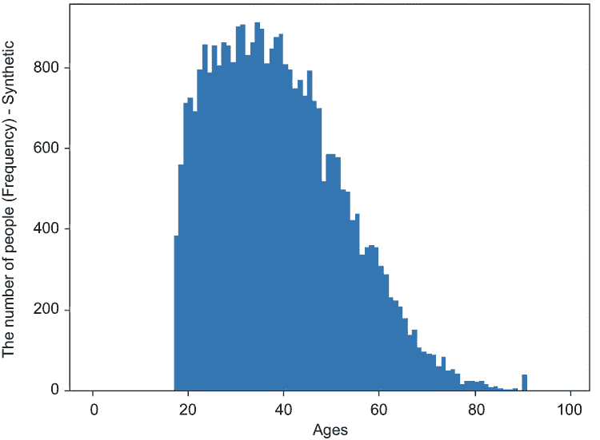

图 6.13 使用合成多边缘数据生成的直方图

为了比较结果，我们将使用以下代码（与列表 6.10 中的代码相同）来生成原始数据的直方图。

列表 6.15 原始数据的直方图

```
plt.bar(age_domain, age_histogram)
plt.ylabel('The number of people (Frequency) - True Value')
plt.xlabel('Ages')
```

原始数据的直方图如图 6.14 所示。通过简单地观察它们的形状和数据点的分布情况，我们可以快速得出结论，图 6.13 和图 6.14 中的两个直方图是相似的。


图 6.14 原始数据的直方图

我们已经研究了年龄的分布情况，但婚姻状况呢？让我们比较婚姻状况数据的分布。

列表 6.16 原始数据的统计

```
adult_marital_status = adult[5].dropna()
adult_marital_status.value_counts().sort_index()
```

结果如图 6.15 所示。

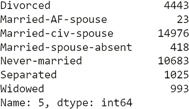

图 6.15 原始数据统计概要

下一个列表将总结原始数据集中的婚姻状况数据。

列表 6.17 合成数据的统计

```
syn_adult_marital_status = synthetic_data['Marital status'].dropna()
syn_adult_marital_status.value_counts().sort_index()
```

图 6.16 显示了合成数据的概要。如图所示，不同隐私的合成多边际数据的婚姻状况看起来与原始数据相似（但并不相同）。

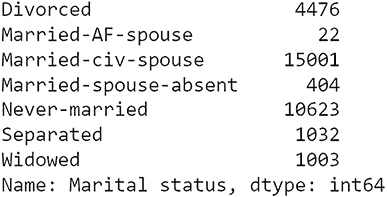

图 6.16 合成产生的婚姻状况数据统计概要

再次，我们可以得出结论，我们不必使用原始数据，可以使用合成的数据来完成同样的任务，同时保护原始数据的隐私。

我们已经研究了生成满足 DP 的合成直方图数据表示，并且我们已经通过使用不同的私有合成直方图表示来生成隐私保护的合成单列表格数据和多边际数据。但是等等！我们如何处理包含两个或三个以上列和大量记录的大型数据集呢？我们将在下一部分找到答案。下一节将研究一个更复杂的案例研究，以展示我们如何应用数据匿名化和 DP 来为机器学习生成隐私保护的合成数据。

练习 1：自己试试

在列表 6.11 中，我们查看了一个包含年龄和婚姻状况的 2 向边际表示。正如讨论的那样，年龄和婚姻状况高度相关，我们想看看合成的数据是否也遵循类似的分布。现在尝试按照相同的步骤对教育和职业列进行操作，看看你是否能得到相似的结果。

提示：在原始数据集中，教育信息位于第 3 列，第 6 列是职业。首先按照以下方式更改列表 6.11 中的列：

```
adult.groupby([3, 6]).size().reset_index(name = 'count') 
```

然后按照所有步骤进行。

练习 2：自己试试

重复相同的过程，但对于 3 列数据的 3 向边际表示。例如，你可能考虑年龄、职业和婚姻状况作为 3 向表示。

## 6.4 通过特征级微聚合发布私有合成数据的案例研究

现在我们已经讨论了生成合成数据的不同方法，让我们通过一个案例研究来了解如何通过特征级微聚合方法设计私有合成数据发布机制。听起来太技术了吗？不用担心，我们将一步一步地介绍细节。

首先，回忆一下 DP（差分隐私）是一种机制，它为保护个人数据记录提供强大的隐私保障（正如我们在第二章所讨论的）。在本案例研究中，我们将讨论一种在 DP 保障下工作的隐私保护合成数据生成方法，该方法适用于多个机器学习任务。它是基于聚类数据的差分隐私生成模型来生成合成数据集。在本节的下半部分，我们将向您展示这种方法与一些现有方法相比的有效性，以及它如何与其他方法相比提高了效用。

在我们查看案例研究的细节之前，让我们首先回顾一些基础知识。通常，为机器学习设计一个强大的隐私保护合成数据生成方法会带来许多挑战。首先，隐私保护方法通常会向数据样本引入扰动，这会损害数据的效用。减轻扰动以达到一定程度的效用不是一项容易的任务。其次，机器学习可以表示为许多不同的任务，如分类、回归和聚类。一个有效的合成数据生成方法应该适用于所有这些不同的任务。第三，一些数据可能以非常复杂的分布形式出现。在这种情况下，很难基于整个数据分布形成一个准确的生成器。

在过去，人们已经提出了几种私有合成数据发布算法[4]，[5]。其中一种常见的方法是利用噪声直方图发布合成数据，但大多数都是为处理分类特征变量而设计的。另一方面，一些算法旨在在原始数据集上进行一些预处理后，在统计模型下生成合成数据。然而，它们通常只基于整个数据分布生成合成数据。

在这项研究中，我们将关注如何在保持与原始数据集相似的统计特征的同时生成合成数据，同时确保数据所有者没有隐私担忧。

既然你对我们要做什么有了基本的了解，让我们深入细节。

### 6.4.1 使用分层聚类和微聚合

我们方法论的一个关键部分，我们将在此基础上构建，是*分层聚类*。本质上，分层聚类是一种算法，它根据样本的*邻近矩阵*将输入样本聚类到不同的簇中。这个邻近矩阵表示每个簇之间的距离。在这种情况下，我们将使用*聚合分层聚类* [6]，这是一种自下而上的方法，它首先将每个数据样本分配到它自己的组中，然后合并距离最小的簇对，直到只剩下一个簇为止。

如第 6.2 节所述，*k-匿名性*可以用来匿名化数据。在这里，我们将使用一种名为*微聚合*的数据匿名化算法来实现*k-匿名性*。我们这里提到的微聚合方法是一种简单的启发式方法，称为*最大距离到平均记录*（MDAV），由 Domingo-Ferrer 等人[7]提出。其想法是将样本分为簇，每个簇包含恰好*k*条记录（除了最后一个），簇中的记录在距离上应尽可能相似。此外，簇中的每条记录将被替换为该簇的代表记录以完成数据匿名化。

### 6.4.2 生成合成数据

在这个合成数据生成机制中，四个主要组件共同作用以生成满足 DP 的合成数据：

+   *数据预处理*—结合独立特征集和特征级微聚合来生成描述数据更通用的数据簇。

+   *统计提取*—提取每个数据簇的代表统计信息。

+   *DP 净化器*—在提取的统计信息上添加差分隐私噪声。

+   *数据生成器*—通过扰动生成模型逐个生成合成数据样本。

这四个组件在图 6.17 中展示。

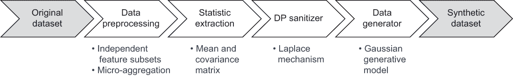

图 6.17 合成数据生成算法的不同组件

数据预处理的工作原理

在数据预处理中，我们使用微聚合作为全特征维度（覆盖所有我们感兴趣的特征的样本）样本的聚类方法。我们不会用代表记录替换记录，而是将使用差分隐私生成模型来建模每个簇。然而，这里有几个挑战。

在对 MDAV 生成的输出簇进行建模时，一些簇可能携带实际数据分布中可能不存在的相关性。这种虚假特征相关性在建模数据簇时可能施加不必要的约束，这可能导致合成数据呈现出不同的形状。另一方面，我们知道差分隐私（DP）通常会引入噪声方差。直观上，引入的 DP 噪声越少，效用越高。因此，减少 DP 机制噪声也有助于提高数据的效用。为了解决这些不利影响，我们不仅可以在样本级别采样数据，还可以在特征级别采样数据。

下面是如何进行特征级和样本级聚类的：

+   *特征级聚类*——每当我们在一个数值数据集 *D*^(n^×d^) 中时，我们可以使用层次聚类将这些 *d* 个数据特征划分为 *m* 个独立的特征集。在这里，可以将皮尔逊相关系数转换为距离的函数用于形成层次聚类中的邻近矩阵。相关性较高的特征应具有较低的距离，而较低的相关性对应较高的距离。这种方法将帮助我们确保同一集合中的特征之间相关性更高，与其他特征集的特征相关性更低。

+   *样本级聚类*——一旦我们获得了特征级聚类的输出，我们就在特征级别上分割数据，然后对每个数据段应用微聚合。其思想是将同质样本分配到同一聚类中，这将帮助我们保留更多来自原始数据的信息。与全局敏感性相比，每个样本聚类的敏感性也可能降低。这种降低将涉及 DP 机制中的较少噪声。换句话说，它在相同的隐私保证水平下增强了数据的效用。

生成合成数据背后的概念

微聚合过程输出包含至少 *k* 条记录的多个聚类。假设每个聚类形成一个多元高斯分布，则对每个聚类 *c* 计算均值 (*μ*) 和协方差矩阵 (Σ)。然后，隐私净化器在 *μ* 和 Σ 上添加噪声以确保模型满足差分隐私（DP）。最后，构建生成模型。生成合成数据的完整过程如图 6.18 所示。

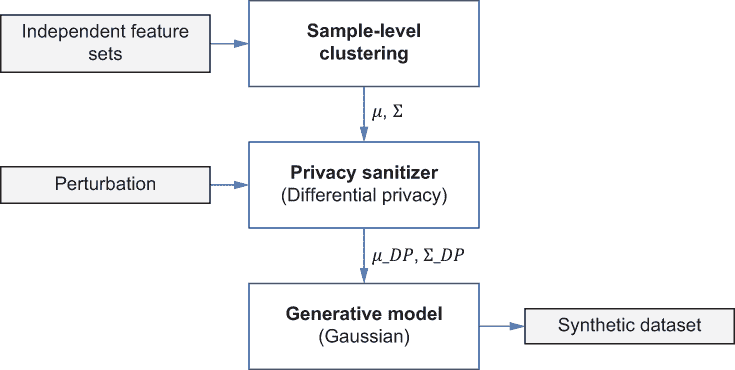

图 6.18 合成数据生成器的工作原理。这里 μ 代表均值，Σ 是为每个聚类计算的协方差矩阵。

在图 6.18 中，原始的多变量高斯模型由均值 (*μ*) 和协方差矩阵 (Σ) 参数化。值得注意的是，隐私净化器输出两个参数，*μ*_*DP* 和 Σ_*DP*，它们受到差分隐私的保护。因此，由 *μ*_*DP* 和 Σ_*DP* 参数化的多变量高斯模型也受到差分隐私的保护。此外，根据差分隐私的后处理不变性，所有从差分隐私多元高斯模型导出的合成数据也受到差分隐私的保护。

方差、协方差和协方差矩阵

在统计学中，*方差*通常衡量单个随机变量的变化（例如，人口中一个人的身高），而协方差是衡量两个随机变量一起变化的量度。例如，我们可以考虑人口中一个人的身高和体重来计算协方差。

两个随机变量 *x* 和 *y* 的协方差公式如下

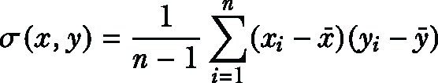

其中 n 是样本数量。协方差矩阵是一个由 C(i,j) = *σ* (x[i], x[j])给出的方阵，*C* ∈ ℝ^(^n^×^n^)，其中 n 是随机变量的数量。协方差矩阵的对角线元素是方差，而其他元素是协方差。对于两个随机变量的情况，协方差矩阵可以按以下方式计算：

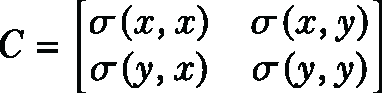

### 6.4.3 评估生成的合成数据的性能

为了评估所提出方法的性能，我们将其在 Java 中实现。是的，这次是 Java。完整的源代码、数据集和评估任务可在本书的 GitHub 仓库中找到：[`github.com/nogrady/PPML/blob/main/Ch6/PrivSyn_Demo.zip`](https://github.com/nogrady/PPML/blob/main/Ch6/PrivSyn_Demo.zip)。

我们生成了不同的合成数据集，并在不同的聚类大小(*k*)和隐私预算(ε)下进行了实验。ε的设置从 0.1 到 1 不等，聚类大小为：*k* = 25, 50, 75, 100。对于每个合成数据集，我们考察了三个通用机器学习任务：分类、回归和聚类。为了完成这些任务，我们使用了两种不同的实验场景，结合了不同的合成和原始数据组合。

+   *实验场景 1*—使用原始数据进行训练，合成数据进行测试。

    机器学习模型在原始数据集上训练，并测试生成的合成数据集。对于每个实验数据集，30%的样本被用作种子数据集来生成合成数据集，而 70%被用作原始数据来训练模型。生成的合成数据用于测试。

+   *实验场景 2*—使用合成数据进行训练，原始数据进行测试。

    机器学习模型在合成数据集上训练，并在原始数据集上测试。对于每个实验数据集，80%的样本被用作种子数据集来生成合成数据集，而 20%被用作原始数据来测试模型。

实验中使用的数据集

对于这次性能评估，我们使用了来自 UCI 机器学习仓库[8]和 LIBSVM 数据仓库的三个数据集来检验不同算法的性能。数据集中的所有特征都被缩放到[-1,1]范围内：

+   *糖尿病数据集*—这个数据集包含了 768 个样本和 9 个特征的病人记录诊断测量，包括血压、BMI、胰岛素水平和年龄等信息。目标是识别病人是否患有糖尿病。

+   *乳腺癌数据集*—这个数据集是从乳腺癌诊断的临床病例中收集的。它有 699 个样本和 10 个特征。所有样本都被标记为良性或恶性。

+   *澳大利亚数据集*——这是来自 StatLog 项目的澳大利亚信用批准数据集。每个样本是一个信用卡申请，数据集包含 690 个样本和 14 个特征。样本通过申请是否被批准进行标记。

性能评估和结果

正如所讨论的，我们对三个主要的机器学习任务感兴趣，用于评估合成数据：分类、回归和聚类。

使用支持向量机（SVM）进行分类任务。在每个训练阶段，我们使用网格搜索和交叉验证来选择 SVM 模型的最佳参数组合。在选择最佳性能的 SVM 模型时，使用了 F1 分数。具有最高 F1 分数的模型用于测试分类精度。

对于回归任务，使用了线性回归作为回归器。回归的评价指标是均方误差（MSE）。

最后，使用了*k*-means 聚类作为聚类任务。正如你在前几章所学，聚类是一种无监督机器学习任务，它将相似的数据分组。与先前的分类和回归任务不同，聚类中原始数据集中的所有数据都被视为合成数据的种子。*k*-means 算法应用于原始和合成数据集，两者都产生了两个聚类，这些聚类在实验数据集中呈现二进制类别。在每个实验中，*k*-means 运行 50 次，每次使用不同的质心种子，并输出 50 次连续运行中的最佳情况。

三个机器学习任务的成果展示在图 6.19、6.20 和 6.21 中。你可以看到，当ε的范围从 0.1 到 0.4 时，每个*k*的性能都会迅速提高，但峰值性能并不总是来自固定的*k*值。例如，图 6.19（e）在*k* = 50 时有一个局部最优点，而图 6.21（a）和图 6.21（c）在*k* = 75 时有一个局部最优点。


图 6.19 任务 1（SVM）的两个不同实验场景的实验结果

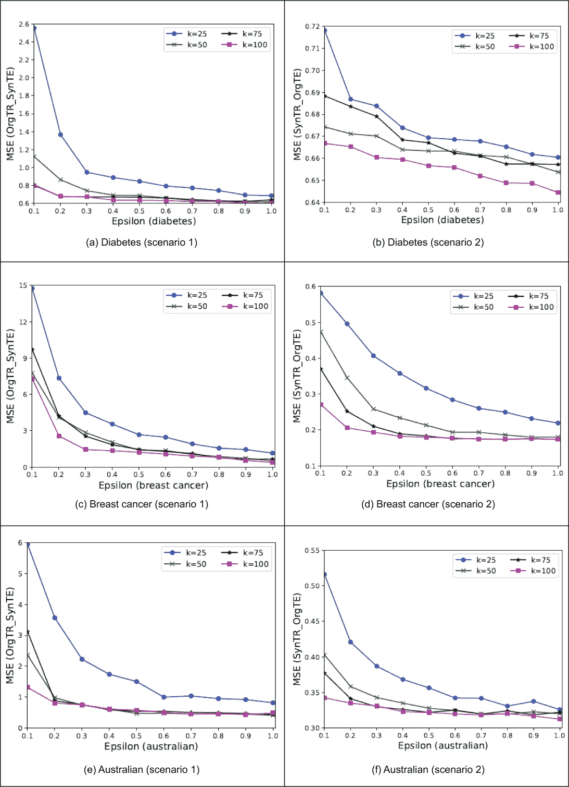

图 6.20 任务 2（线性回归）的两个不同实验场景的实验结果

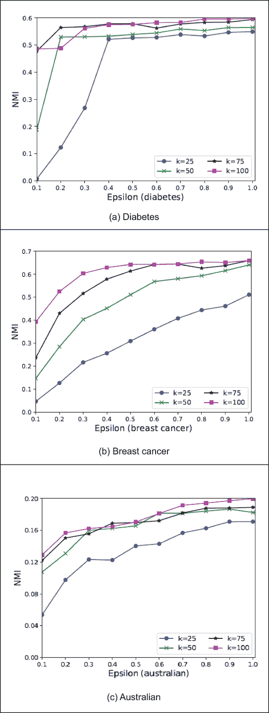

图 6.21 任务 3（*k*-means 聚类）的实验结果

从理论上讲，较小的 ε 值通常比较大的 ε 值引入更多的噪声到合成数据中，这增加了随机性。在回归的情况下（图 6.20），当隐私预算较小的时候，场景 2 中反映的随机性比场景 1 中的 MSE 要少得多。这是由于场景 1 中的测试数据具有差分隐私噪声，而场景 2 中的测试数据没有噪声。当 ε > 0.4 时，性能提升相对稳定，当 *k* = 100 时，在相同的隐私预算下，聚类方法总是优于其他 *k* 值。值得注意的是，当 *k* = 25 时，整体性能远低于其他 *k* 值。这是因为当我们在一个只包含少量数据样本的簇上形成多元高斯生成模型时，计算出的均值和协方差矩阵可能会存在偏差。该簇不能很好地反映数据分布。因此，*k* 应该是一个适中的值来形成多元高斯生成模型。更大的 *k* 值也可以使模型比更小的 *k* 值更快地收敛，如图 6.19（a）、6.19（d）、6.20（a）和 6.21（a）所示。

## 摘要

+   合成数据是从原始数据生成的人工数据，它保留了原始数据的统计特性并保护了原始数据的隐私信息。

+   合成数据生成过程涉及多个步骤，包括异常检测、归一化函数和构建模型。

+   隐私测试用于确保生成的合成数据满足某些预定义的隐私保证。

+   *K*-匿名性是生成匿名化合成数据以减轻重新识别攻击的良好方法。

+   虽然 *k*-匿名性使得重新识别个体变得更加困难，但它也有一些缺点，这导致了其他匿名化机制，如 *l*-多样性。

+   数据集的合成表示可以捕捉原始数据集的统计特性，但大多数情况下，它不会与原始数据集具有相同的形状。

+   我们可以使用合成直方图来生成合成表格数据。

+   合成表示可以用来生成与原始数据集具有相同统计特性和形状的合成数据集。

+   我们可以通过将拉普拉斯机制应用于合成表示生成器来生成差分隐私合成数据，然后使用差分隐私合成表示生成器。

+   我们可以通过将微聚合技术应用于合成数据生成来生成满足 *k*-匿名性的差分隐私合成数据。
