# 7 隐私保护数据挖掘技术

本章涵盖

+   数据挖掘中隐私保护的重要性

+   处理和发布数据的隐私保护机制

+   探索数据挖掘的隐私增强技术

+   使用 Python 在数据挖掘中实现隐私技术

到目前为止，我们已经讨论了研究界和工业界合作的不同隐私增强技术。本章重点介绍这些隐私技术如何用于数据挖掘和管理操作。本质上，*数据挖掘*是发现数据中新关系和模式的过程，以实现进一步的有意义分析。这通常涉及机器学习、统计操作和数据管理系统。在本章中，我们将探讨如何将各种隐私增强技术与数据挖掘操作捆绑在一起，以实现隐私保护的数据挖掘。

首先，我们将探讨数据挖掘中隐私保护的重要性以及如何将个人信息泄露给外界。然后，我们将介绍可以用于确保数据挖掘操作隐私保证的不同方法，并附带一些示例。在本章的末尾，我们将讨论数据管理技术的最新发展，以及这些隐私机制如何被用于数据库系统以设计定制的隐私增强数据库管理系统。


## 7.1 数据挖掘和管理中隐私保护的重要性

今天的应用程序持续生成大量信息，我们都知道在这个深度学习时代隐私保护的重要性。同样重要的是在高效、安全的数据处理框架中处理、管理和存储收集到的信息。

让我们考虑一个基于云的电子商务应用的典型部署，其中用户的个人信息由数据库应用程序存储和处理（图 7.1）。

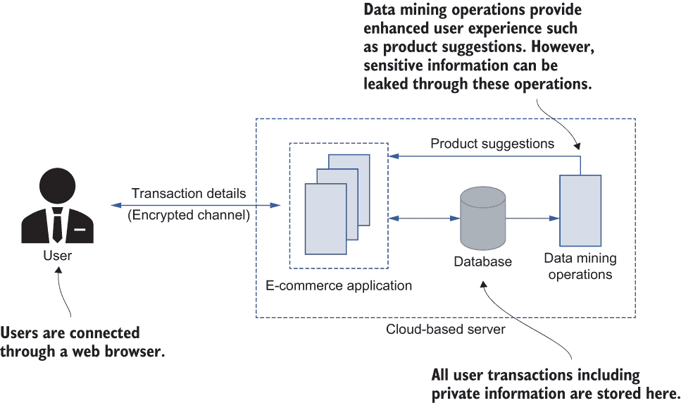

图 7.1 一个典型的电子商务 Web 应用的部署。所有用户数据，包括个人信息，都存储在数据库中，这些数据将被数据挖掘操作使用。

在电子商务应用中，用户通过网络浏览器连接，选择他们想要的产品或服务，并在网上进行支付。所有这些都在后端数据库中记录，包括客户的姓名、地址、性别、产品偏好和产品类型等私人信息。这些信息随后通过数据挖掘和机器学习操作进一步处理，以提供更好的客户体验。例如，可以将客户的产品偏好与其他客户的选择联系起来，以推荐额外的产品。同样，可以使用客户的地址提供基于位置的服务和建议。虽然这种方法为顾客带来了许多好处，如服务质量提升，但也伴随着许多隐私问题。

让我们以一个简单的例子来说明，一个客户经常在线购买衣服。在这种情况下，即使没有明确提到性别，数据挖掘算法也可能仅通过查看客户过去购买的衣服类型来推断客户的性别。这成为一个隐私问题，通常被称为*推断攻击*。我们将在下一章更详细地探讨这些攻击。

现在大多数科技巨头（如 Google、Amazon 和 Microsoft）提供机器学习即服务（MLaaS），中小型企业（SMEs）倾向于基于这些服务推出他们的产品。然而，这些服务容易受到各种内部和外部攻击，我们将在本章末尾讨论。因此，通过将两个或多个数据库或服务链接在一起，可以推断出更敏感或私人的信息。例如，一个能够访问电子商务网站上客户邮编和性别的攻击者可以将这些数据与公开可用的团体保险委员会（GIC）数据集[1]结合起来，他们可能能够提取个人的医疗记录。因此，在数据挖掘操作中，隐私保护至关重要。

为了这个目的，在本章和下一章中，我们将详细阐述数据挖掘和管理中隐私保护的重要性，它们的应用和技巧，以及在两个特定方面（如图 7.2 所示）的挑战：

+   *数据处理和挖掘*—可以在收集的信息通过各种数据挖掘和分析工具进行处理和分析时使用的工具和技术

+   *数据管理*—可以用于保存、存储和为不同数据处理应用提供服务的信息的方法和技术

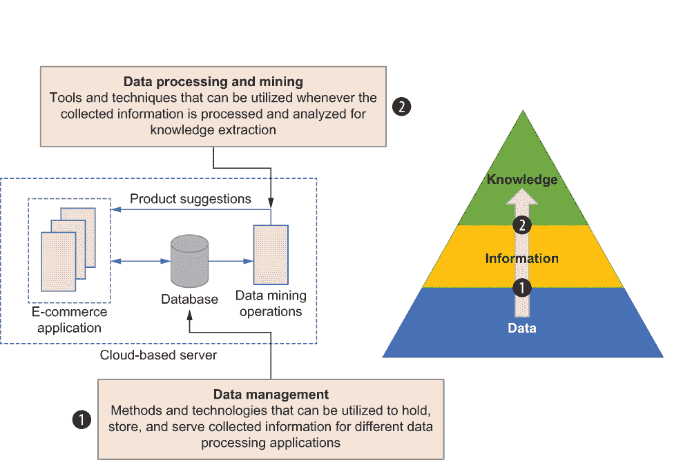

图 7.2 在数据挖掘和管理方面，本质上有两个方面的隐私保护。

因此，我们将探讨如何通过修改或扰动输入数据来确保隐私保护，以及当数据发布给其他方时我们如何保护隐私。

## 7.2 数据处理和挖掘中的隐私保护

数据分析和挖掘工具旨在从收集的数据集中提取有意义的特征和模式，但直接在数据挖掘中使用数据可能会导致不希望的数据隐私侵犯。因此，已经开发出利用数据修改和噪声添加技术（有时称为数据扰动）的隐私保护方法，以保护敏感信息免受隐私泄露。

然而，修改数据可能会降低效用或甚至使其无法提取基本特征。这里的效用指的是数据挖掘任务；例如，在前面提到的电子商务应用中，向客户推荐产品的机制是效用，隐私保护方法可以用来保护这些数据。然而，任何数据转换都应该在隐私和预期应用效用之间保持平衡，以便仍然可以在转换后的数据上执行数据挖掘。

让我们简要地看看数据挖掘是什么以及隐私法规是如何出现的。

### 7.2.1 什么是数据挖掘以及它是如何被使用的？

数据挖掘是从收集的数据集或信息集中提取知识的过程。信息系统定期收集和存储有价值的信息，将信息存储在数据存储中的目的是提取诸如关系或模式等信息。为此，数据挖掘有助于从这些数据集中发现新的模式。因此，数据挖掘可以被认为是学习新模式或关系的过程。例如，在我们的电子商务示例中，数据挖掘算法可以用来确定一个购买了婴儿尿布的客户也购买婴儿湿巾的可能性有多大。基于这样的关系，服务提供商可以做出及时的决定。

通常，这些关系或模式可以用适用于集合中原始数据子集的数学模型来描述。实际上，已识别的模型可以以两种不同的方式使用。首先，模型可以用描述性的方式使用，其中集合中数据之间的关系可以被转换成人类可识别的描述。例如，一家公司的当前财务状况（是否盈利）可以根据存储在数据集中的历史财务数据来描述。这些被称为*描述性模型*，它们通常基于历史数据提供准确的信息。预测模型是第二种方式。它们的准确性可能不是非常精确，但可以根据历史数据预测未来。例如，像“如果公司投资这个新项目，五年后他们的利润率会增加吗？”这样的问题可以使用预测模型来回答。

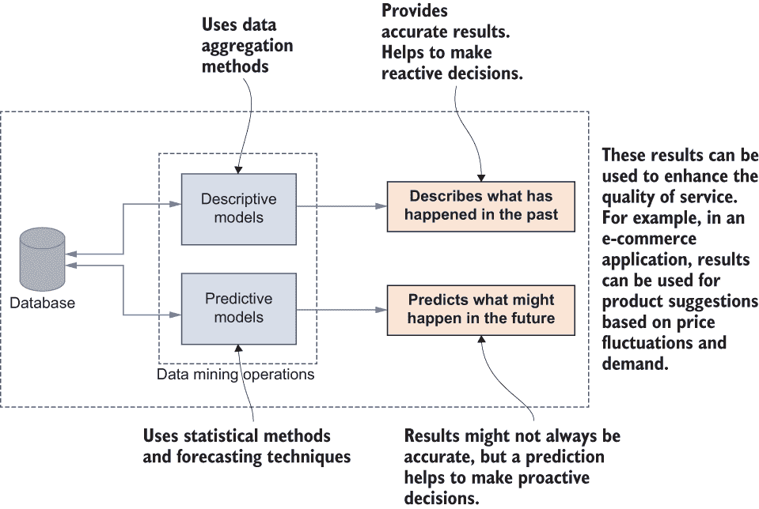

图 7.3 数据挖掘中的关系和模式可以通过两种不同的方式实现。

如图 7.3 所示，数据挖掘可以产生描述性模型和预测性模型，我们可以根据底层应用的要求应用它们进行决策。例如，在电子商务应用中，预测模型可以用来预测产品的价格波动。

### 7.2.2 隐私法规要求的影响

传统上，数据安全和隐私要求由数据所有者（如组织自身）设定，以保护他们提供的产品和服务的竞争优势。然而，数据已成为数字经济中最有价值的资产，许多隐私法规已由政府实施，以防止敏感信息超出其预期用途的使用。不同的组织通常遵守隐私标准，如 HIPAA（1996 年健康保险可携带性和问责法案）、PCI-DSS（支付卡行业数据安全标准）、FERPA（家庭教育权利和隐私法案）以及欧盟的 GDPR（通用数据保护条例）。

例如，无论实践规模大小，几乎每个医疗服务提供者都会在涉及某些交易的情况下以电子方式传输健康信息，例如索赔、药物记录、福利资格查询、转诊授权请求等。然而，HIPAA 法规要求所有这些医疗服务提供者保护敏感患者健康信息，防止未经患者同意或知情的情况下泄露。

在下一节中，我们将详细探讨不同的隐私保护数据管理技术，并讨论它们在确保这些隐私要求方面的应用和缺陷。

## 7.3 通过修改输入保护隐私

现在你已经了解了基础知识，让我们深入了解细节。已建立的隐私保护数据管理（PPDM）技术可以根据隐私保证的实施方式分为几个不同的类别。在本章中，我们将讨论前两类；其他类别将在下一章中介绍。

第一类 PPDM 技术确保在数据收集阶段以及将其移动到数据存储之前数据的隐私性。这些技术通常在数据收集阶段结合不同的随机化技术，并为每条记录单独生成私有化值，因此原始值从未被存储。最常用的两种随机化技术是通过添加具有已知统计分布的噪声来修改数据，以及通过乘以具有已知统计分布的噪声来修改数据。

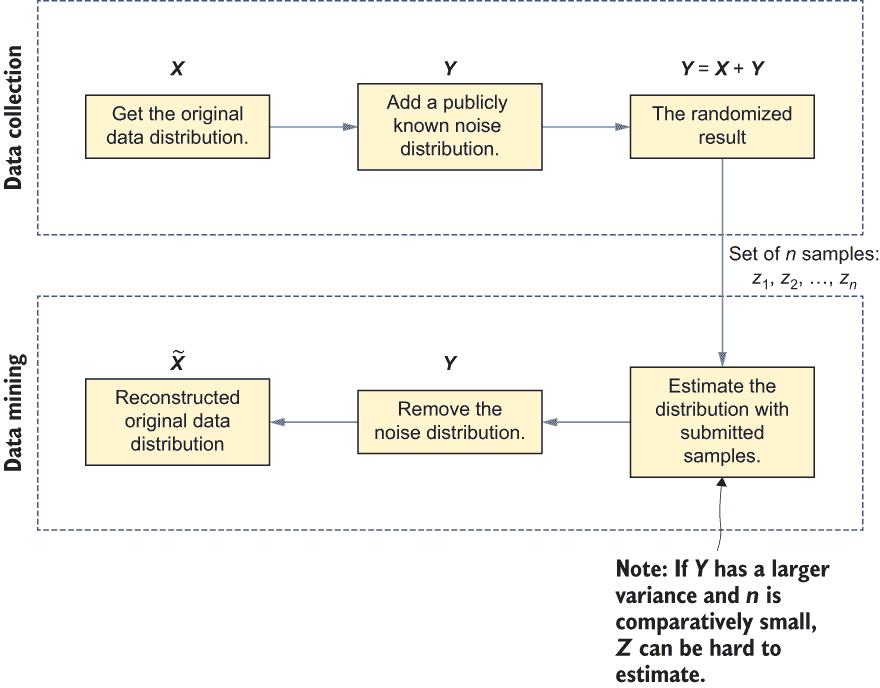

图 7.4 在数据输入修改中使用随机化技术

图 7.4 说明了这两种技术中的第一种。在数据收集阶段，添加一个公开已知的噪声分布以产生随机结果。然后，当涉及数据挖掘时，我们可以简单地根据样本估计噪声分布，并重建原始数据分布。然而，需要注意的是，尽管原始数据分布可能被重建，但原始值并未恢复。

### 7.3.1 应用和限制

现在我们已经了解了如何修改输入以保护隐私，让我们来看看这些随机化技术的优点和缺点。

最重要的是，这些方法可以在随机化后仍然保留原始数据分布的统计属性。这就是为什么它们被用于不同的隐私保护应用中，包括差分隐私（我们在第二章和第三章中讨论过）。

然而，由于原始数据已被扰动，只有数据分布可用（而非个体数据），这些方法需要特殊的数据挖掘算法，通过查看分布来提取必要的信息。因此，根据应用的不同，这种方法可能会对效用产生更大的影响。

分类和聚类等任务可以使用这些输入随机化技术，因为它们只需要访问数据分布。例如，考虑在基于特定特征或参数的疾病识别任务中，对医疗诊断数据集应用此类技术。在这种情况下，访问个体记录是不必要的，分类可以基于数据分布进行。

## 7.4 发布数据时的隐私保护

下一个类别的 PPDM 处理的是在将数据发布给第三方而不披露敏感信息所有权时的技术。在这种情况下，通过在将数据发布给外部各方之前对个体数据记录应用数据匿名化技术来实现数据隐私。

如前一章所述，在当前阶段，仅通过删除可以明确识别数据集中个体的属性是不够的。匿名化数据中的用户可能通过结合非敏感属性或记录与外部数据关联而被识别。这些属性被称为准标识符。

让我们考虑第六章中讨论的一个场景，即结合两个公开可用的数据集。在 US Census 数据集中结合不同的值，如邮政编码、性别和出生日期，与来自集团保险委员会（GIC）的匿名化数据集相当直接。通过这样做，有人可能能够提取特定个人的医疗记录。例如，如果鲍勃知道他的邻居爱丽丝的邮政编码、性别和出生日期，他可以使用这三个属性将这两个数据集结合起来，他可能能够确定 GIC 数据集中哪些医疗记录是爱丽丝的。这是一种称为*链接*或*关联攻击*的隐私威胁，其中特定数据集中的值与其他信息来源相链接，以创建更信息丰富和独特的条目。在发布数据时通常使用的 PPDM 技术通常包含一个或多个数据清洗操作以保护隐私。

注意：如果您不熟悉 GIC 数据集，它是一个显示美国州政府雇员每次医院访问的“匿名化”数据集。其目标是帮助研究人员，并且州政府花费时间移除了所有关键标识符，如姓名、地址和社会安全号码。

您可能已经注意到，在实际操作中使用了许多数据清洗操作，但大多数这些操作可以概括为以下几种类型之一：

+   *泛化*——这种操作将数据集中特定的值替换为一个更通用的属性。例如，一个人的薪水数值，如 56,000 美元，可以被替换为 50,000 美元至 100,000 美元的范围。在这种情况下，一旦值被清洗，我们就不知道确切的值，但我们知道它在 50,000 美元和 100,000 美元之间。

+   这种方法也可以应用于分类值。考虑之前提到的美国人口普查数据集，它包含就业详情。如图 7.5 所示，我们不是将人们分类到不同的职业中，而是简单地将他们分为“就业”或“失业”，而不暴露个人职业。

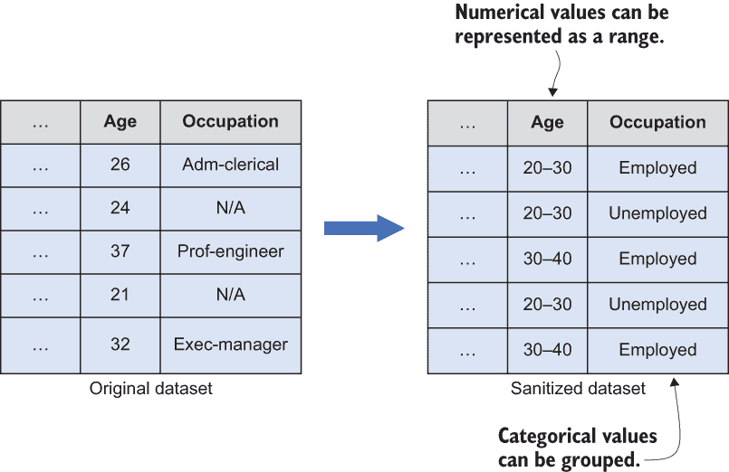

图 7.5 通过分组数据来实现泛化。

+   *抑制*——与泛化用更通用的表示替换原始记录不同，抑制的想法是从数据集中完全删除记录。考虑一个包含医院医疗记录的数据集。在这样的医疗数据库中，根据姓名（一个敏感属性）可以识别个人，因此我们可以在将数据集发布给第三方之前从数据集中删除姓名属性（见图 7.6）。

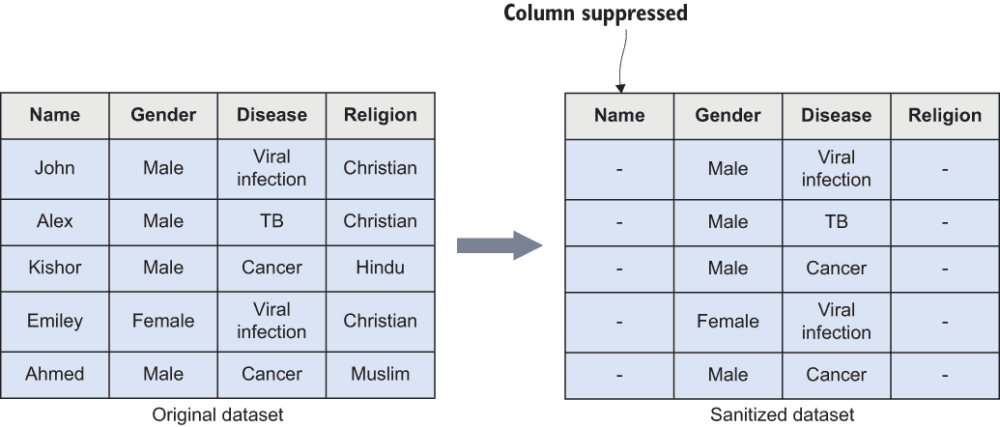

图 7.6 抑制通过删除原始记录来实现。

+   *扰动法*——另一种可能的数据净化操作是用具有相同统计属性且可以通过随机化技术生成的扰动数据替换个人记录。

+   一种可能的方法是使用我们在上一节中讨论的技术，如添加或乘法噪声添加，向原始值添加噪声。如图 7.7 的例子所示，原始数据库第一列的记录被基于随机噪声的完全不同的值所替换。

    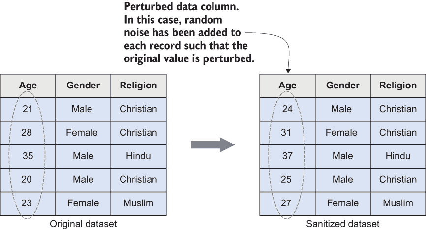

    图 7.7 扰动通过添加随机噪声来实现。

    另一种方法是使用第六章中讨论的合成数据生成技术。在这种情况下，使用原始数据构建一个统计模型，然后可以使用该模型生成合成数据，这些数据可以替换数据集中的原始记录。

    另一种可能的方法是使用数据交换技术来实现扰动。其思路是在数据集中交换多个敏感属性，以防止记录与个人关联。数据交换通常从随机选择一组目标记录开始，然后为每个记录找到一个具有相似特征的合适伙伴。一旦找到伙伴，就交换彼此的值。在实践中，数据交换相对耗时（因为它必须循环通过许多记录以找到合适的匹配），并且需要额外的努力来扰动数据。

+   *解剖法*——另一种可能的净化方法是把敏感属性和准标识符分别放入两个独立的数据库中。在这种情况下，原始值保持不变，但目的是使它们更难以相互关联并识别个人。考虑我们之前在这个列表中讨论过的医疗数据库。如图 7.8 所示，原始数据库可以被分为两个不同的数据库：敏感属性（例如，姓名、宗教）和准标识符（例如，性别、疾病）。

    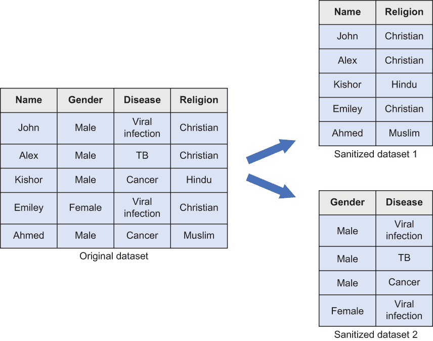

    图 7.8 使用解剖法

### 7.4.1 在 Python 中实现数据净化操作

在本节中，我们将使用 Python 实现这些不同的数据净化技术。对于这个例子，我们将使用 Barry Becker 最初从 1994 年美国人口普查数据库中提取的真实世界数据集[2]。该数据集包含 15 个不同的属性，我们首先将查看数据集的排列方式。然后，我们将应用不同的净化操作，如图 7.9 所示。

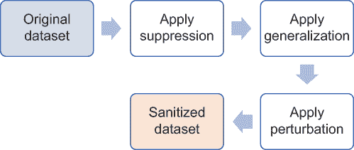

图 7.9 本节 Python 代码中使用的顺序和技术

首先，我们需要导入必要的库。如果你已经熟悉以下包，你可能已经安装了所有这些。

我们将使用 pip 命令安装这些库：

```
pip install sklearn-pandas
```

一切安装完毕后，将以下包导入到环境中：

```
import pandas as pd
import numpy as np
import scipy.stats
import matplotlib.pyplot as plt
from sklearn_pandas import DataFrameMapper
from sklearn.preprocessing import LabelEncoder
```

现在让我们加载数据集并看看它的样子。你可以直接从本书的代码仓库下载数据集（[`mng.bz/eJYw`](http://mng.bz/eJYw)）。

```
df = pd.read_csv('./Data/all.data.csv')
df.shape
df.head()
```

使用 df.shape()命令，你可以获得数据框的维度（行数和列数）。正如你所看到的，这个数据集包含 48,842 条记录，分为 15 个不同的属性。你可以使用 df.head()命令列出数据集的前五行，如图 7.10 所示。


图 7.10 美国人口普查数据集的前五条记录

你可能已经注意到，有一些敏感属性，例如关系、种族、性别、国籍等等，需要匿名化。让我们首先对一些属性应用*抑制*，以便它们可以被删除：

```
df.drop(columns=["fnlwgt", "relationship"], inplace=True)
```

再次尝试 df.head()，看看有什么变化。

处理分类值

如果你仔细查看种族列，你会看到一些分类值，例如白人、黑人、亚洲-太平洋岛民、美洲印第安人-爱斯基摩人等等。因此，在隐私保护方面，我们需要对这些列进行*泛化*。为此，我们将使用 sklearn_pandas 中的 DataFrameMapper()，它允许我们将元组转换为编码值。在这个例子中，我们使用 LabelEncoder()：

```
encoders = [(["sex"], LabelEncoder()), (["race"], LabelEncoder())]
mapper = DataFrameMapper(encoders, df_out=True)
new_cols = mapper.fit_transform(df.copy())
df = pd.concat([df.drop(columns=["sex", "race"]), new_cols], axis="columns")
```

现在再次使用 df.head()检查结果。它将列出数据集的前五行，如图 7.11 所示。

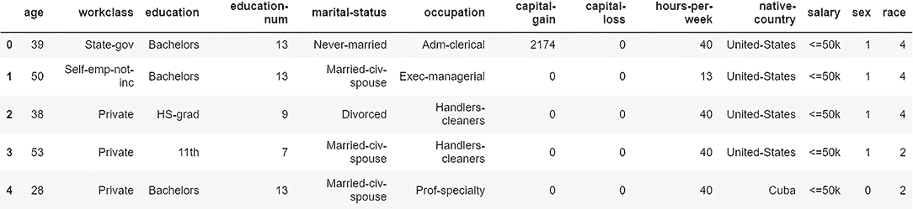

图 7.11 编码值的结果数据集

我们将性别和种族列都进行了泛化，这样就没有人能知道某个人的性别和种族。

处理连续值

连续值，如年龄，仍然可能泄露一些关于个人的信息，正如我们之前讨论的那样。即使种族被编码（记住，种族是一个分类值），有人可能结合几条记录来获得更详细的结果。因此，让我们应用*扰动*技术来匿名化年龄和种族，如下面的列表所示。

列表 7.1 修改年龄和种族

```
categorical = ['race']
continuous = ['age']
unchanged = []

for col in list(df):
    if (col not in categorical) and (col not in continuous):
        unchanged.append(col)

best_distributions = []
for col in continuous:
    data = df[col]
    best_dist_name, best_dist_params = best_fit_distribution(data, 500)
    best_distributions.append((best_fit_name, best_fit_params))
```

对于连续变量年龄，我们使用了一个名为 best_fit_distribution()的函数，该函数遍历一系列连续函数，以找到具有最小误差的最佳拟合函数。一旦找到最佳拟合分布，我们就可以用它来近似年龄变量的新值。

对于分类变量种族，我们首先使用 value_counts()确定唯一值在分布中出现的频率，然后使用 np.random.choice()生成具有相同概率分布的随机值。

所有这些都可以封装在一个函数中，如下面的列表所示。

列表 7.2 对数值和分类值进行扰动

```
def perturb_data(df, unchanged_cols, categorical_cols, 
    ➥ continuous_cols, best_distributions, n, seed=0):
    np.random.seed(seed)
    data = {}

    for col in categorical_cols:
        counts = df[col].value_counts()
        data[col] = np.random.choice(list(counts.index),
        ➥ p=(counts/len(df)).values, size=n)

    for col, bd in zip(continuous_cols, best_distributions):
        dist = getattr(scipy.stats, bd[0])        
        data[col] = np.round(dist.rvs(size=n, *bd[1]))

    for col in unchanged_cols:
        data[col] = df[col]

    return pd.DataFrame(data, columns=unchanged_cols+categorical_cols+continuous_cols)    

gendf = perturb_data(df, unchanged, categorical, continuous,
➥ best_distributions, n=48842)
```

使用 gendf.head()命令的结果如图 7.12 所示。

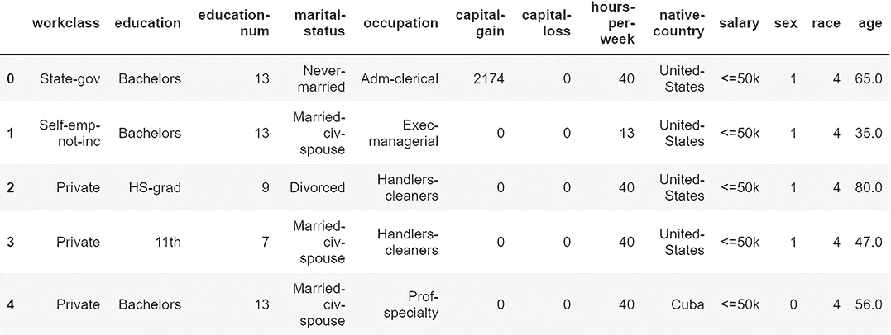

图 7.12 扰动数值和分类值后的结果数据集

仔细观察最后两列。年龄和种族值已被替换为遵循与原始数据相同概率分布的随机生成数据。因此，现在可以将此数据集视为隐私保护的数据集。

我们现在已经讨论了在各种隐私保护应用中常用的数据净化操作。接下来，我们将探讨如何在实践中应用这些操作。我们已经在第 6.2.2 节中介绍了 *k*-匿名性的基础知识；现在，我们将扩展讨论。下一节将详细介绍 *k*-匿名性隐私模型，以及其在 Python 中的代码实现。

首先，让我们通过一个练习回顾本节中的净化操作。

练习 1

考虑一个数据挖掘应用与组织员工数据库相关联的场景。为了简洁起见，我们将考虑表 7.1 中的属性。

表 7.1 组织的员工数据库

| Number | Name | Gender | Zip code | Salary (*k*) |
| --- | --- | --- | --- | --- |
| 1 | John | Male | 33617 | 78 |
| 2 | Alex | Male | 32113 | 90 |
| 3 | Kishor | Male | 33613 | 65 |
| 4 | Emily | Female | 33617 | 68 |
| 5 | Ahmed | Male | 33620 | 75 |

现在尝试回答以下问题，以使此数据集保持隐私：

+   哪些属性可以使用泛化操作进行净化？如何操作？

+   哪些属性可以使用抑制操作进行净化？如何操作？

+   哪些属性可以使用扰动操作进行净化？如何操作？

+   在此示例中，解剖是否有效？为什么？

### 7.4.2 k-anonymity

可以用于匿名化数据集的最常见且广泛采用的隐私模型之一是 *k*-匿名性。Latanya Sweeney 和 Pierangela Samarati 在 1990 年代末在其开创性工作“在披露信息时保护隐私” [3] 中首次提出了它。这是一个简单而强大的工具，强调为了使数据集中的记录不可区分，至少需要 *k* 个具有相同属性集（可用于唯一识别记录的准标识符）的个体记录。简单来说，如果一个数据集至少有 *k* 个具有相同敏感属性的相似记录，则该数据集被认为是 *k*-匿名的。我们将通过一个例子来探讨这一点，以更好地理解其工作原理。

k 是什么，以及如何应用它？

值 *k* 通常用于衡量隐私，当 *k* 值较高时，记录的匿名化变得更加困难。然而，当 *k* 值增加时，数据通常变得更加泛化，因此效用通常会降低。

许多不同的算法被提出以实现 *k*-匿名性，但其中绝大多数都应用了诸如抑制和泛化等净化操作以达到所需的隐私级别。图 7.13 展示了如何在数据集中定义敏感和非敏感属性，这些属性可以通过 *k*-匿名性在实践中进行净化。

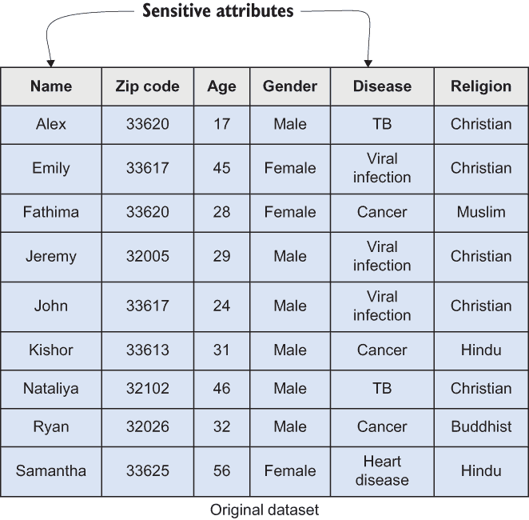

图 7.13 定义敏感和非敏感属性的样本数据集

在这种情况下有几个重要且敏感的属性和准标识符。因此，当我们应用*k*-匿名性时，确保所有记录都足够匿名，使得数据用户难以去匿名化记录是至关重要的。

注意：属性的敏感性通常取决于应用程序的要求。在某些情况下非常敏感的属性在其他应用领域可能并不敏感。

让我们考虑图 7.14 中显示的数据集。正如你所见，姓名和宗教属性通过抑制进行了清理，而邮编和年龄则进行了泛化。如果你仔细观察，可能会意识到这是 2 匿名化（*k* = 2），意味着每个组至少有两条记录。让我们以表中的前两条记录为例。正如你所见，这些记录属于同一组，使得邮编、年龄和性别对两者都相同；唯一的区别是疾病。

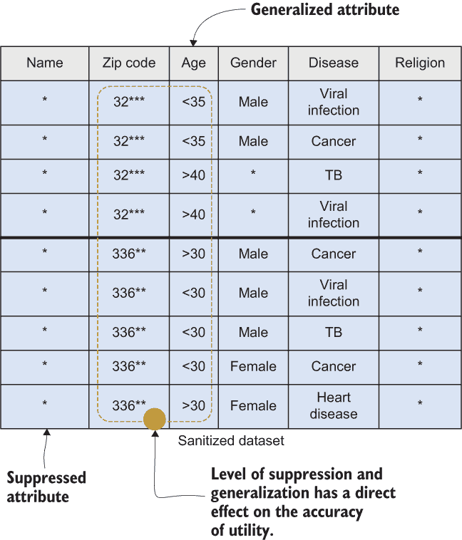

图 7.14 使用泛化和抑制

现在让我们考虑一个场景，其中鲍勃知道他的朋友住在 32314 邮编，并且他 34 岁。仅通过查看数据集，鲍勃无法区分他的朋友是否有病毒感染或癌症。这就是*k*-匿名性的工作方式。原始信息被清理并难以重现，但结果仍可用于数据挖掘操作。在先前的例子中，*k* = 2，但当我们增加*k*时，重现原始记录就更加困难了。

K 匿名性并不总是有效

虽然*k*-匿名性是一种强大的技术，但它有一些直接和间接的缺点。让我们尝试了解这些缺陷，看看*k*-匿名性如何容易受到不同类型攻击的影响：

+   *明智选择敏感属性的重要性*—在*k*-匿名性中，敏感属性的选择必须谨慎进行。然而，所选属性不得泄露已匿名化属性的信息。例如，某些疾病可能在某些地区和年龄组中很普遍，因此有人可能通过参考地区或年龄组来识别疾病。为了避免这种情况，调整那些感兴趣属性的抑制和泛化级别是至关重要的。例如，与其将邮编改为 32***，你可能会选择将其抑制到 3****，使原始值更难以猜测。

+   *群体数据深度多样化的重要性*——数据的多样性对*k*-匿名性有重大影响。从广义上讲，在*k*-匿名性方面，关于具有良好代表性的多样化数据存在两个重要问题。第一个问题是每个代表个体在组或等价类中只有一个记录。第二个问题出现在敏感属性的值对于组或等价类中的其他*k*-1 个记录都相同的情况下，这可能导致识别组中的任何个体。无论敏感属性是否相同，这些问题都可能使*k*-匿名性容易受到不同类型的攻击。

+   *在低维度管理数据的重要性*——当数据维度较高时，在实用范围内难以保持*k*-匿名性所需的数据隐私水平。例如，将多个数据记录串联起来有时可以唯一地识别个体，例如位置数据类型。另一方面，当数据记录分布稀疏时，必须添加大量噪声以将它们分组，以实现*k*-匿名性。

现在，让我们看看我们提到的攻击以及这些攻击是如何工作的。如图 7.15 所示，这些攻击要生效有一系列前提条件。例如，对于某些攻击，如同质性攻击，要生效，敏感属性的值必须与*k*-匿名化数据集中组内的其他记录相同。

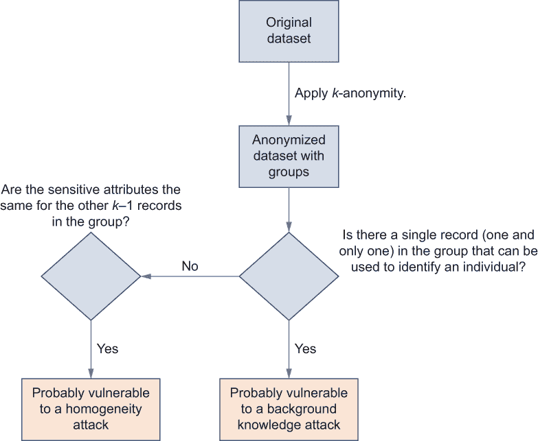

图 7.15 解释*k*-匿名性可能存在的缺陷并导致不同攻击的流程图

让我们看看图 7.16 中描述的例子。假设 Alice 知道她的邻居 Bob 被送进了医院，他们两人都住在 33718 邮政编码的地区。此外，Bob 今年 36 岁。有了这些可用的信息，Alice 可以推断 Bob 可能患有癌症。这被称为*同质性攻击*，其中攻击者使用已有的信息来找到个体所属的记录组。

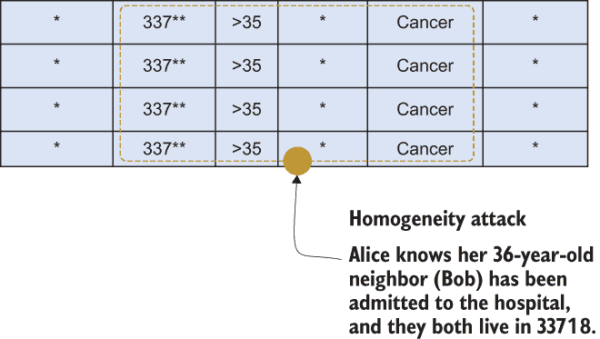

图 7.16 同质性攻击

或者，这可能导致*背景知识攻击*，其中攻击者使用外部背景信息来识别数据集中的个体（见图 7.17）。假设 Alice 有一个日本朋友 Sara，她 26 岁，目前住在 33613 邮政编码的地区。她还知道日本人的心脏病死亡率非常低。据此，她可以得出结论，她的朋友可能患有病毒感染。

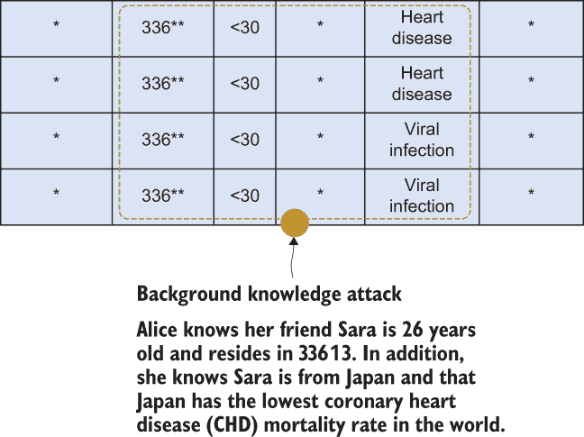

图 7.17 背景知识攻击

如您所见，我们可以通过增加等价组中敏感值的多样性来防止由属性披露问题引起的攻击。

### 7.4.3 在 Python 中实现 k-匿名性

现在我们来实现代码中的 *k*-匿名性。为此，我们将使用 Python 中的 cn-protect [4] 包。（在出版时，CN-Protect 库已被 Snowflake 收购，库不再公开可访问。）你可以使用以下 pip 代码安装它：

```
pip install cn-protect
```

一旦准备就绪，你可以加载我们清理过的美国人口普查数据集以及以下列出的包。这个数据集版本可在代码仓库中下载（[`mng.bz/eJYw`](http://mng.bz/eJYw)）。

列 7.3 导入数据集并应用 *k*-匿名性

```
import pandas as pd
import matplotlib.pyplot as plt
import seaborn as sns
from cn.protect import Protect
sns.set(style="darkgrid")

df = pd.read_csv('./Data/all.data.csv')

df.shape
df.head()
```

结果将类似于图 7.18。

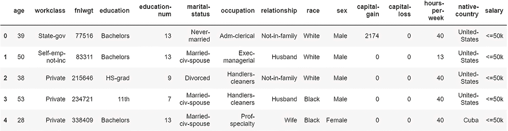

图 7.18 导入数据集的前几条记录

使用 Protect 类，我们首先定义什么是准标识符：

```
prot = Protect(df)
prot.itypes.age = 'quasi'
prot.itypes.sex = 'quasi'
```

你可以使用 prot .types 命令查看属性类型，如图 7.19 所示。

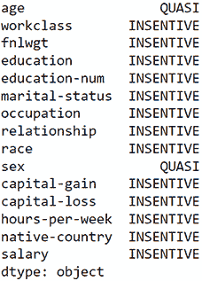

图 7.19 定义准标识符的数据集属性

现在是设置隐私参数的时候了。在这个例子中，我们使用 *k*-匿名性，所以让我们将 *k* 值设置为 5：

```
prot.privacy_model.k = 5
```

一旦设置好，你可以通过使用 prot.privacy_ model 命令来查看结果。结果应该类似于以下内容：

```
<KAnonymity: {'k': 5}>
```

你可以使用以下代码片段观察结果数据集（见图 7.20）：

```
prot_df = prot.protect()
prot_df
```

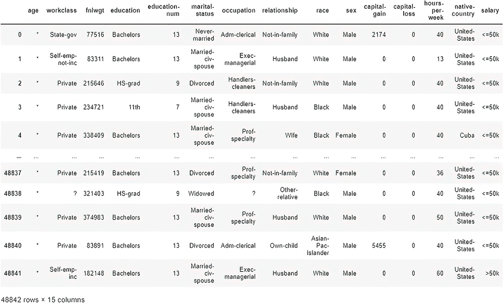

图 7.20 一个 5-匿名化的美国人口普查数据集

仔细观察结果中的年龄和性别属性。现在数据集已经实现了 5-匿名化。通过更改参数自己尝试一下。

练习 2

考虑一个数据挖掘应用场景，该场景涉及来自抵押贷款公司的以下贷款信息数据库。假设表 7.2 中显示的数据集具有许多属性（包括抵押贷款历史、贷款风险因素等）和记录，尽管表格只显示了其中的一些。此外，数据集已经实现了 2-匿名化（*k* = 2）。

表 7.2 简化的员工数据库

| 编号 | 姓名 | 年龄 | 区码 | 借款人种族 | 借款人收入 |
| --- | --- | --- | --- | --- | --- |
| 1 | * | 21-40 | 336** | 黑人或非裔美国人 | 65k |
| 2 | * | 31-40 | 34*** | 亚洲 | 80k |
| 3 | * | 31-40 | 34*** | 白人 | 85k |
| 4 | * | 21-40 | 336** | 黑人或非裔美国人 | 130k |

现在尝试回答以下问题，看看这个匿名化数据集是否仍然泄露了一些重要信息：

+   假设约翰知道他的邻居爱丽丝申请了抵押贷款，并且他们两人都住在 33617 区码？约翰可以推断出哪些信息？

+   如果爱丽丝是一位非裔美国女性，约翰还能了解哪些额外信息？

+   你如何保护这个数据集，使得约翰无法了解除爱丽丝的区码和种族之外的信息？

## 摘要

+   在数据挖掘和管理操作中采用隐私保护技术不是一种选择。如今，它对于今天的数据驱动应用来说，比以往任何时候都更加必要。

+   通过使用不同的噪声添加技术修改输入数据，可以在数据挖掘中实现隐私保护。

+   当发布数据以在数据挖掘应用中保护隐私时，可以使用不同的数据净化操作（泛化、抑制、扰动、解剖）。

+   数据净化操作可以根据应用需求以不同的方式实现。

+   *K*-匿名性是一个广泛使用的隐私模型，可以在数据挖掘操作中实现。它允许我们在提供灵活性的同时应用各种净化操作。

+   虽然 k-匿名性是一种强大的技术，但它也有一些直接和间接的缺点。

+   在同质性攻击中，攻击者利用已有的信息来找到个体所属的记录组。

+   在背景知识攻击中，攻击者利用外部背景信息来识别数据集中的一名个体。
