# 8 隐私保护的数据管理和操作

本章涵盖了

+   广泛使用的数据发布隐私模型

+   数据库系统中的隐私威胁和漏洞

+   在数据库管理系统中发现隐私保护策略

+   实现隐私保护数据库系统的数据库设计考虑因素

在上一章中，我们讨论了可以在数据挖掘操作中利用的不同隐私增强技术以及如何实现*k*-匿名性隐私模型。在本章中，我们将探讨研究社区提出的另一组旨在减轻*k*-匿名性模型缺陷的隐私模型。在本章的末尾，我们将讨论数据管理技术的最新发展，这些隐私机制如何在数据库系统中实施，以及设计隐私增强的数据库管理系统时需要考虑的因素。


## 8.1 数据处理和挖掘中的隐私保护快速回顾

您已经看到，数据分析和管理工具旨在从收集的数据集中提取有意义的特征和模式，并且直接在数据挖掘中使用原始数据可能会导致不希望的数据隐私侵犯。因此，我们使用不同的数据净化操作来最小化私人信息的披露。为此，第七章和本章的讨论涵盖了两个特定的方面，总结在图 8.1 中：

+   *数据处理和挖掘*——可以在收集的信息被数据挖掘和分析工具处理和分析时使用的工具和技术。

+   *数据管理*——可以用于存储、存储和为不同的数据处理应用提供服务所收集信息的方法和技术。

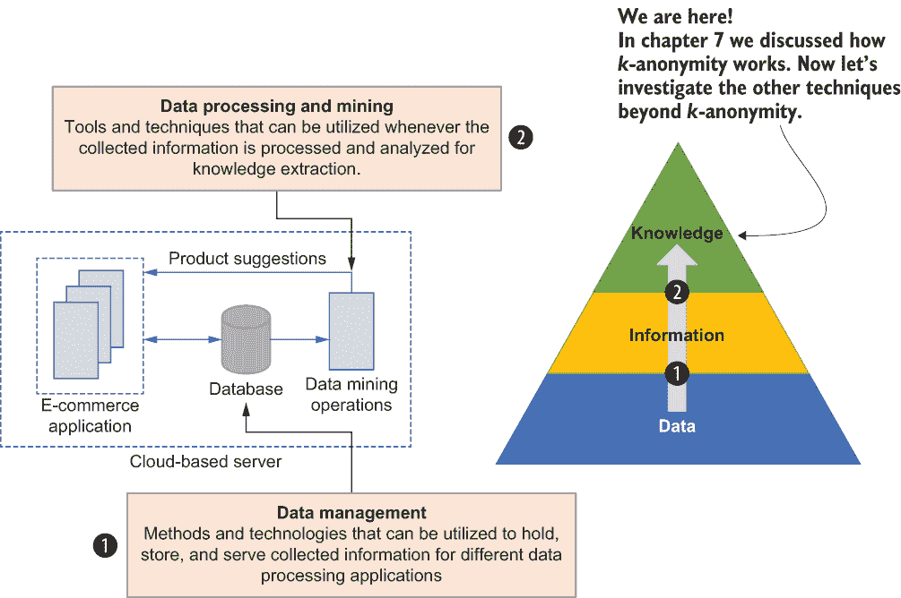

图 8.1 数据挖掘和管理中的隐私保护有两个主要方面。在本章中，我们将详细阐述这两个不同的方面。

到目前为止，我们已经讨论了不同的数据净化操作，它们在 Python 中的实现，以及在*k*-匿名性隐私模型中的应用。在下一节中，我们将继续讨论其他超越*k*-匿名性的流行隐私模型。

## 8.2 超越 k-匿名性的隐私保护

*K*-匿名性是一种非常强大且简单的技术，可以在许多不同场景中用于保护数据挖掘操作中的隐私。然而，正如我们在上一章所讨论的，*k*-匿名性并不适用于所有情况，如图 8.2 中的流程图所示。它容易受到不同的攻击，例如同质性和背景知识攻击（详情请参阅第 7.4.2 节）。让我们扩展我们对隐私保护的讨论，看看我们如何可以减轻这些缺陷。

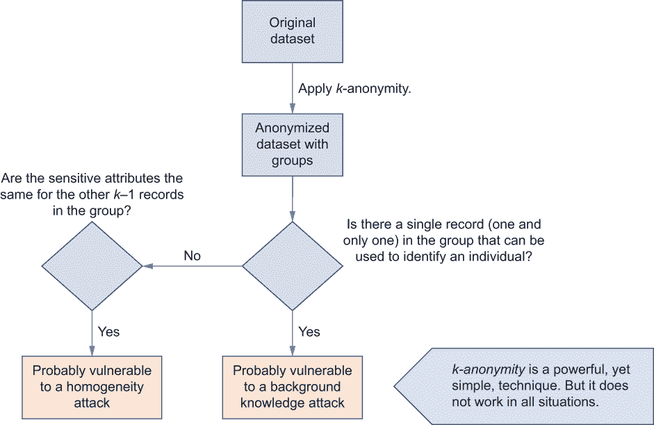

图 8.2 解释*k*-匿名性可能存在的缺陷并导致不同攻击的流程图。如图所示，即使经过匿名化，如果一条记录可以用来识别个人，它可能会导致背景知识攻击或同质性攻击。

### 8.2.1 l-多样性

由于*k*-匿名性的局限性，Machanavajjhala 等人于 2007 年引入了一种称为*l*-多样性的新技术[1]（其中的“*l*”代表*light*）。它是*k*-匿名性的扩展，其中*l*-多样性表明每个组必须至少有*l*个不同的敏感记录。与*k*-匿名性模型类似，增加*l*值会增加同一组中敏感值的变异性，使其对可能的隐私泄露更加稳健。

让我们考虑我们在上一章讨论的相同医院数据集场景，并取图 8.3 中显示的*k*-匿名化示例。

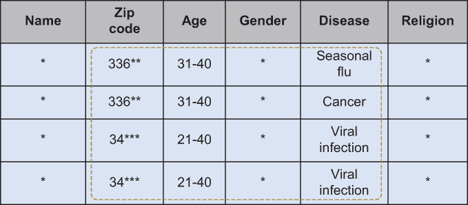

图 8.3 *k*-匿名性（*k*=2）的示例

这些数据记录已经是 2-匿名（*k* = 2）。然而，如果攻击者知道 Alice 住在邮编 34317，他们可以轻松地将搜索范围缩小到最后两行。此外，即使攻击者无法区分哪个记录属于 Alice，他们也可以轻易地推断出 Alice 患有病毒感染。问题是该组中的所有患者都共享相同的准标识符；因此，会泄露私人信息。

*l*-多样性的基本方法是要确保每个组至少有*l*个不同的敏感值，这样就不容易识别任何个人。让我们将图 8.3 中的数据集变为 2-多样性（*l* = 2）。如图 8.4 所示，现在每个组至少有两个不同的敏感值。例如，第一和第四条记录属于同一个组，邮编为 3****，年龄为 21-40 岁，但他们有两种不同的疾病（季节性流感和病毒感染）。同样，第二和第三条记录属于同一个组，但有两种不同的疾病，因此无法区分哪个记录属于哪个患者。因此，攻击者很难知道哪个记录对应 Alice 以及疾病是什么，根据现有信息。

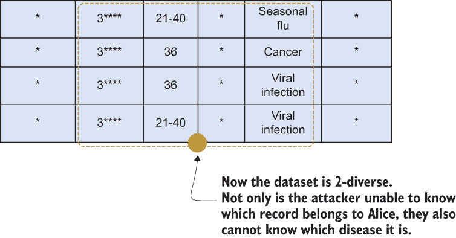

图 8.4 图 8.3 中示例的 2-多样性（*l*=2）版本

是否会泄露任何信息？

除了*k*-匿名性之外的隐私保证外，*l*-多样性也受到一些限制：

+   *数据多样性仍然可能泄露一些敏感信息*——即使有*l*-多样性数据，在某些情况下敏感信息仍可能泄露。让我们考虑与图 8.5 中的示例相同的医院数据集场景，该示例提供 2-多样性。

+   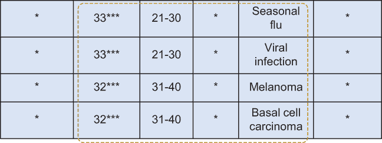

    图 8.5 如何泄露*l*-多样性敏感信息

    让我们假设攻击者知道 Bob 住在 32317 邮政编码且 35 岁。攻击者可以缩小搜索范围，使得 Bob 要么患有黑色素瘤，要么患有基底细胞癌。考虑到这些信息，攻击者可以推断 Bob 患有可能是癌性的皮肤病。因此，仍然泄露了一些私人信息。

+   *概率分布也可能泄露一些信息*——在某些情况下，即使有*l*-多样性数据集，概率分布也可能泄露一些信息，使数据集容易受到攻击者的攻击。这种隐私泄露被称为*偏斜攻击*。

+   考虑图 8.6 所示的数据集。如图所示，它已经是一个 2-多样性数据集，但让我们考虑一个知道 Bob 住在 33617 邮政编码且 27 岁的攻击者。在这个时候，攻击者不知道 Bob 是否有病毒感染或心脏病，但根据数据分布，攻击者知道 Bob 患有心脏病的可能性更高。

    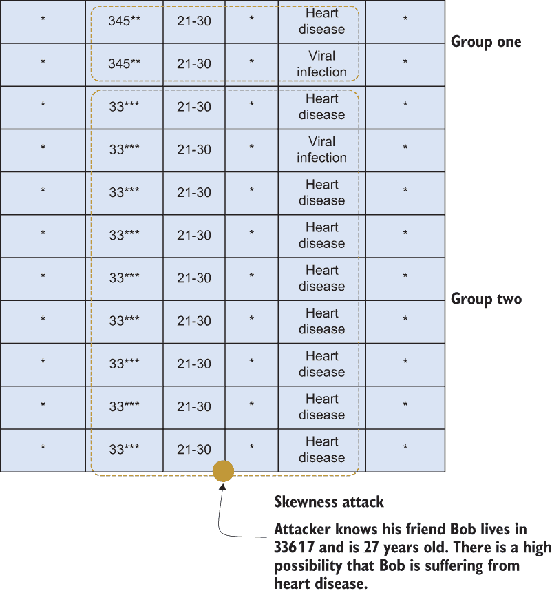

    图 8.6 概率分布也可能泄露一些信息。

你可以看到，在数据集中拥有多样化的属性集是不够的。我们还需要在类别内平衡数据分布。

“类别内”是什么意思？

等价类是一组属于同一组的记录。例如，图 8.6 中第二组的九条记录都属于同一个邮政编码和年龄类别。同样，第一组的记录也具有相似的性质。这些不同的组可以被称为*类别*，我们使用类别内的数据分布来找出它们的统计特性。

### 8.2.2 t-接近度

从*l*-多样性方法的缺陷中吸取教训，Li 等人提出了另一个名为*t*-接近度的隐私模型[2]，以防止由于分布偏斜导致的属性泄露。*t*-接近度的理念是保持每个组（等价类）中敏感记录的分布与原始数据集中相应分布足够接近。换句话说，根据*t*-接近度原则，原始数据集中一个属性的分布与组内相同属性的分布之间的距离应该小于或等于*t*。

我们可以让*X* = (*x*[1], *x*[2], ..., *x*[n])表示原始数据集中敏感属性的值分布，而*Y* = (*y*[1], *y*[2], ..., *y*[n])表示所选组中相同属性的值。为了使这两个分布满足*t*-接近度，以下方程必须成立：


让我们考虑我们之前提到的医院数据挖掘场景，并使用图 8.7 中另一个 3-多样性数据集的例子。

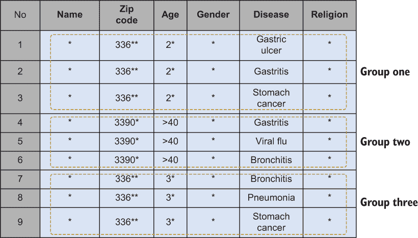

图 8.7 一个 3-多样性数据集的例子，容易受到偏斜攻击

如你所见，数据集有三个不同的组，每个组有三个不同的记录。然而，它仍然容易受到我们在上一节中讨论的偏斜攻击的影响。假设攻击者已经知道他的朋友鲍勃的记录属于第一组。攻击者可以推断鲍勃可能有一些与胃相关的疾病，因为第一组中的所有疾病都与胃有关。因此，特定的多样性可能提供不同级别的隐私——我们需要考虑数据的整体分布。

让我们尝试将这个数据集转换为 *t-*接近度版本。正如我们在本节开头提到的，*t-*接近度依赖于概率分布之间的距离。有两种不同的方式来衡量两个概率分布之间的距离，但在实践中，*t-*接近度使用地球移动距离（也称为 Wasserstein 度量）、Kullback-Leibler 距离或变分距离等距离度量。

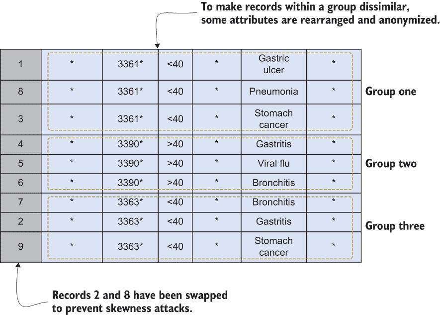

图 8.8 如何使用 *t*-接近度防止偏斜攻击

考虑如图 8.8 所示的相同数据集的匿名 *t-*接近度版本。由于攻击者无法清楚地判断鲍勃是否有与胃相关的疾病，因此偏斜攻击已被防止。

什么是地球移动距离？

地球移动距离（EMD）是评估两个数学分布之间相似性的技术。假设你有一个名为“空洞”的分布和另一个名为“地球元素”的分布。EMD 的想法是通过将地球元素移动到空洞中来填充空洞。EMD 通过将单位地球元素通过单位地面距离运输来衡量填充空洞所需的最小工作量。

假设 *P* = (*p*[1], *p*[2], ..., *p*[m]) 是地球元素的质量，而 *Q* = (*q*[1], *q*[2], ..., *q*[m]) 代表空洞。P 中元素 i 和 Q 中元素 j 之间的地面距离可以表示为 d[ij]。

流量 *F* = [*f*[ij]]（其中 *f*[ij] 是 *p*[i] 和 *q*[j] 之间的权重流量）可以定义为最小化总成本，[2]

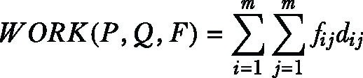

受以下约束条件限制：

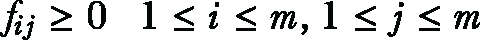

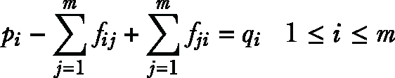

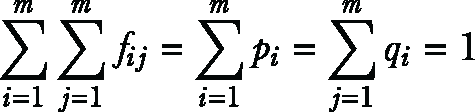

一旦解决了运输问题并找到了最优流量 *F*，EMD 被定义为总流量归一化的工作量，如下所示：

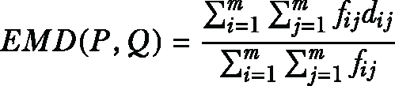

让我们通过一个例子来看看 EMD 是如何工作的。

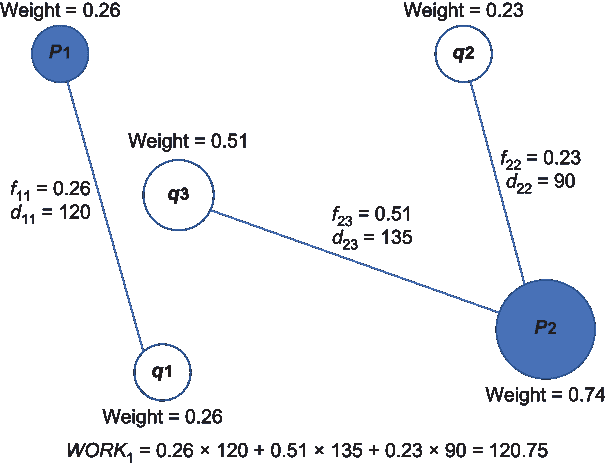

为运输问题计算的可能流量排列之一

如您所见，P 和 Q 的权重之和为 1。然而，这只是可能的一种流。还可能有以下另一个优化流。

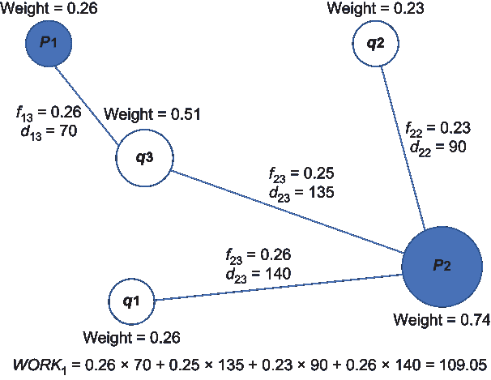

为运输问题计算的最优流

现在已经找到了最优流，EMD（P，Q）= 109.05。

这里最重要的点是，我们已经更改（泛化和抑制）了邮政编码和年龄属性，这使得我们可以交换记录 2 和 8，使得难以在每个组中识别疾病。

### 8.2.3 使用 Python 实现隐私模型

现在让我们尝试在 Python 中使用这些隐私模型。对于这个例子，我们将使用 Barry Becker 从 1994 年美国人口普查数据库中最初提取的成人数据集 [3]。该数据集包含 15 个不同的属性，我们将探讨如何使用 *k-* 匿名、*l-* 多样性和 *t-* 接近度对其进行隐私化。（此示例代码受 N. Prabhu 在 GitHub 上的实现 [4] 的启发）。

首先，我们需要导入必要的库。如果您已经熟悉以下包，您可能已经安装了所有内容。如果没有，请使用 pip 命令开始安装。

列表 8.1 准备数据集

```
pip install sklearn-pandas

import pandas as pd                                                   ❶
import matplotlib.pylab as pl
import matplotlib.patches as patches

from IPython.core.interactiveshell import InteractiveShell            ❷
InteractiveShell.ast_node_interactivity = "all"

names = ('age', 'workclass', 'fnlwgt', 'education', 'education-num',  ❸
         'marital-status', 'occupation', 'relationship', 
         'race', 'sex', 'capital-gain', 'capital-loss', 
         'hours-per-week', 'native-country', 'income',)

categorical = set(('workclass', 'education', 'marital-status', 
                   'occupation', 'relationship', 'sex',
                   'native-country', 'race', 'income',))

df = pd.read_csv("./Data/adult.all.txt", 
                 sep=", ", header=None, names=names, 
                 index_col=False, engine='python')

df.head()                                                             ❹
df.nunique()
```

❶ 一切安装完毕后，将以下包导入到环境中。

❷ 启用 shell 显示所有输出。

❸ 定义表头名称和分类属性。

❹ 打印表头。

该数据集包含 48,842 条记录，分为 15 个不同的属性，如图 8.9 所示。

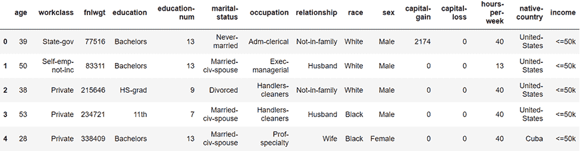

图 8.9 美国人口普查数据集的前几条记录

让我们通过查看每一列来查找值范围，如下面的列表所示。

列表 8.2 寻找值范围

```
for name in categorical:                      ❶
    df[name] = df[name].astype('category')    

def get_spans(df, partition, scale=None):     ❷

    spans = {}
    for column in df.columns:
        if column in categorical:
            span = len(df[column][partition].unique())
        else:
            span = df[column][partition].max()-df[column][partition].min()
        if scale is not None:
            span = span/scale[column]
        spans[column] = span
        print("Column:", column, "Span:", span)
    return spans

full_spans = get_spans(df, df.index)
```

❶ 将这些属性分类。

❷ 获取值范围。

现在让我们对数据集进行分区。我们的示例是 *k-* 匿名化，*k* = 3，我们使用年龄和教育编号属性作为准标识符。

列表 8.3 数据集划分

```
def split(df, partition, column):                              ❶
    dfp = df[column][partition]
    if column in categorical:
        values = dfp.unique()
        lv = set(values[:len(values)//2])
        rv = set(values[len(values)//2:])
        return dfp.index[dfp.isin(lv)], dfp.index[dfp.isin(rv)]
    else:        
        median = dfp.median()
        dfl = dfp.index[dfp < median]
        dfr = dfp.index[dfp >= median]
        return (dfl, dfr)

def is_k_anonymous(df, partition, sensitive_column, k=3):      ❷
    if len(partition) < k:
        return False
    return True

def partition_dataset(df, feature_columns, sensitive_column, 
    ➥ scale, is_valid):                                       ❸
    finished_partitions = []
    partitions = [df.index]
    while partitions:
        partition = partitions.pop(0)
        spans = get_spans(df[feature_columns], partition, scale)
        for column, span in sorted(spans.items(), key=lambda x:-x[1]):
            lp, rp = split(df, partition, column)
            if not is_valid(df, lp, sensitive_column) or 
            ➥ not is_valid(df, rp, sensitive_column):
                continue
            partitions.extend((lp, rp))
            break
        else:
            finished_partitions.append(partition)
    return finished_partitions

feature_columns = ['age', 'education-num']
sensitive_column = 'income'
finished_partitions = partition_dataset(df, 
➥ feature_columns, sensitive_column, full_spans, 
➥ is_k_anonymous)
```

❶ 根据分类与否分割数据框。

❷ 检查是否为 k-匿名（k=3）。

❸ 分割数据集。

现在数据集已经划分，让我们根据分区构建匿名数据集，如下面的列表所示。

列表 8.4 构建匿名数据集

```
def agg_categorical_column(series):
    return [','.join(set(series))]

def agg_numerical_column(series):
    return [series.mean()]

def build_anonymized_dataset(df, partitions, 
    ➥ feature_columns, sensitive_column, max_partitions=None):    ❶
    aggregations = {}
    for column in feature_columns:
        if column in categorical:
            aggregations[column] = agg_categorical_column
        else:
            aggregations[column] = agg_numerical_column
    rows = []
    for i, partition in enumerate(partitions):
        if i % 100 == 1:
            print("Finished {} partitions...".format(i))
        if max_partitions is not None and i > max_partitions:
            break
        grouped_columns = df.loc[partition].agg(aggregations,
        ➥ squeeze=False)

        sensitive_counts = df.loc[partition].groupby(
        ➥ sensitive_column).agg({
        ➥ sensitive_column : 'count'})
        values = grouped_columns.iloc[0].to_dict()
        for sensitive_value, count in 
        ➥ sensitive_counts[sensitive_column].items():
            if count == 0:
                continue
            values.update({
                sensitive_column : sensitive_value,
                'count' : count,
            })
            rows.append(values.copy())
    return pd.DataFrame(rows)

dfn = build_anonymized_dataset(df, finished_partitions, 
➥ feature_columns, sensitive_column)

dfn.head()                                                        ❷
```

❶ 构建匿名数据集。

❷ 打印表头。

结果数据集将类似于图 8.10。

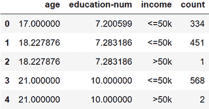

图 8.10 具有 k-匿名的匿名数据集

我们已经使用 *k-* 匿名对数据集进行了匿名化。现在让我们使用 *l-* 多样性对其进行匿名化。在下面的列表中，我们将使用 *l* = 2 的值。

列表 8.5 使用 l-多样性匿名化数据集

```
def diversity(df, partition, column):
    return len(df[column][partition].unique())

def is_l_diverse(df, partition, sensitive_column, l=2):            ❶
    return diversity(df, partition, sensitive_column) >= l

finished_l_diverse_partitions = partition_dataset(df, 
➥ feature_columns, sensitive_column, full_spans, 
➥ lambda *args: is_k_anonymous(*args) and is_l_diverse(*args))

column_x, column_y = feature_columns[:2]
dfl = build_anonymized_dataset(df, finished_l_diverse_partitions,
➥  feature_columns, sensitive_column)

print(dfl.sort_values([column_x, column_y, sensitive_column]))     ❷
dfl.head()
```

❶ 检查是否为 l-多样性（l=2）。

❷ 打印 l-多样化输出。

结果数据集如图 8.11 所示。

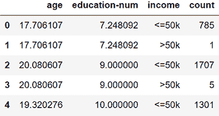

图 8.11 具有 l-多样性的匿名数据集

现在我们将使用*t*-closeness 对相同的数据集进行匿名化。不过，首先我们需要检查频率。

列表 8.6 检查频率

```
global_freqs = {}
total_count = float(len(df))
group_counts = df.groupby(sensitive_column)[sensitive_column].agg('count')
for value, count in group_counts.to_dict().items():
    p = count/total_count
    global_freqs[value] = p

print(global_freqs)     ❶
```

❶ 打印频率。

你可能会注意到，收入<=50k 的整体概率是 0.76，而收入>50k 的概率是 0.24。现在让我们根据这个概率使用*t*-closeness 对数据集进行匿名化。

列表 8.7 使用*t*-closeness 匿名化数据集

```
def t_closeness(df, partition, column, global_freqs):                      ❶
    total_count = float(len(partition))
    d_max = None
    group_counts = df.loc[partition].groupby(column)[column].agg('count')
    for value, count in group_counts.to_dict().items():
        p = count/total_count
        d = abs(p-global_freqs[value])
        if d_max is None or d > d_max:
            d_max = d
    return d_max

def is_t_close(df, partition, sensitive_column, global_freqs, p=0.2):      ❷
    if not sensitive_column in categorical:
        raise ValueError("this method only works for categorical values")
    return t_closeness(df, partition, sensitive_column, global_freqs) <= p

finished_t_close_partitions = partition_dataset(df, 
➥ feature_columns, sensitive_column, full_spans, 
➥ lambda *args: is_k_anonymous(*args) 
➥ and is_t_close(*args, global_freqs))

dft = build_anonymized_dataset(df, finished_t_close_partitions,
➥ feature_columns, sensitive_column)                                      ❸

#print the header
print(dft.sort_values([column_x, column_y, sensitive_column]))
dft.head()
```

❶ 计算*t*-closeness。

❷ 检查敏感列是否为分类列。

❸ 构建匿名化数据集。

结果数据集将类似于图 8.12。

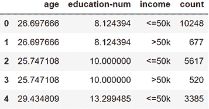

图 8.12 基于*t*-closeness 的匿名化数据集

## 8.3 通过修改数据挖掘输出保护隐私

到目前为止，我们已经讨论了两种主要的隐私保护数据挖掘技术：第一种是在收集信息时，第二种是在发布数据时（见图 8.13）。现在我们正在探讨另一类重要的 PPDM，它与如何调节数据挖掘输出以保护数据隐私的技术相关。

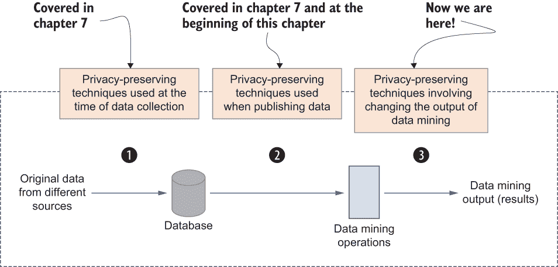

图 8.13 不同 PPDM 技术的概览

通用思路是确保挖掘过程的结果（输出值）不会泄露任何敏感信息。问题是，有时在提交查询时，即使没有直接访问原始数据集，数据挖掘算法的输出也可能泄露敏感信息。

让我们考虑一个场景，即一个组织的员工数据库已经使用* k*-匿名性等技术进行了匿名化。不同的应用程序使用该数据集进行数据挖掘操作以做出预测性决策。

假设一个针对特定查询的数据挖掘算法返回所有收入超过$100,000 且年龄在 25-35 岁之间的员工的记录。由于数据集已经匿名化，我们不知道这些员工的名字，但根据数据挖掘输出，有人可能会推断这些员工可能有自己的车，考虑到他们的年龄和工资。这是一个简单的例子，但它可以强调保护数据挖掘输出以确保个人隐私的重要性。

现在我们将调查为保护数据挖掘算法输出泄露而开发的不同的隐私技术。

### 8.3.1 关联规则隐藏

*关联规则*数据挖掘是寻找数据模式和关联的一种流行的数据挖掘方法。通常，关联规则挖掘可以用来探索数据的特征（属性的维度），例如哪些特征相互关联，哪些特征同时出现。

例如，考虑一个场景，我们正在挖掘患者记录数据库。这个数据集可以用来找出已经患有疾病 A 的患者是否也可能会患有疾病 B。这被称为关联规则；如果疾病 A 发生，患者可能也会患有疾病 B。在另一个不同背景下，另一个经典例子是，收入超过$100,000 且年龄在 25-35 岁之间的人是否可能拥有房屋。这就是关联规则数据挖掘的工作方式。我们匹配两个或更多属性之间的关联以发现新的发现。

一旦建立了关联规则，可以使用两个重要参数来评估规则的有效性，这两个参数称为*支持度*和*置信度*。支持度指的是历史数据支持挖掘规则的程度，而置信度指的是你对建立的规则有多大的信心。

问题在于，这些规则中的一些可能明确地披露有关个人的私人信息。让我们考虑之前的例子，涉及收入和年龄。它可以揭示拥有房屋的个人年收入，这可能是应该保密的私人信息。

关联规则隐藏是一种技术，它允许在非敏感规则上进行数据挖掘操作，同时防止使用敏感规则。关联规则隐藏的一个典型方法是通过数据抑制操作删除与敏感规则相关的数据条目。例如，上述例子中的收入属性将被净化，并且不会包含在数据挖掘输出中。然而，这可能会隐藏大量的非敏感规则，从而降低数据挖掘操作的效用。因此，人们提出了不同的最优解决方案。

而不是完全抑制敏感属性，这些属性可以用其他（噪声）值来替换，以降低关联规则的支持度和置信度。例如，在不完全抑制收入属性的情况下，我们可以在生成结果时向其中添加一些噪声，以确保原始值永远不会暴露。正如我们在本书的第二章和第三章中讨论的那样，差分隐私是产生噪声结果的一种流行方法。

### 8.3.2 降低数据挖掘操作的精度

可能存在敌手可以误导数据挖掘操作以揭示其他个人敏感信息的情况。通常，这些敌手用户会通过恶意输入来欺骗或误导系统。例如，考虑一个场景，敌手向疾病诊断机器学习服务提供某人的医疗记录，以检查该人是否患有癌症。这被称为成员推理攻击，在数据挖掘操作中这是一个威胁性的情况。

在成员推理攻击中，攻击者试图推断出用于训练具有黑盒访问权限的机器学习模型的个人原始记录。例如，假设攻击者使用爱丽丝的个人信息公开信息来确定记录是否在原始数据集（训练集）中。为了实现这一点，攻击者通常会使用一个辅助的机器学习模型，该模型使用主模型的预测结果构建。

如图 8.14 所示，给定一个机器学习模型、一个输入样本和攻击者的领域知识，成员推理攻击试图确定该样本是否是用于构建机器学习模型的原始训练数据集的成员。这种攻击利用了在训练阶段由模型预测产生的输出数据与训练集未包含的数据之间的差异。通常，这些攻击模型是使用从真实数据的噪声版本或其他方法（如我们在第 1.3 节中讨论的模型反演攻击）生成的阴影（攻击）模型进行训练的。

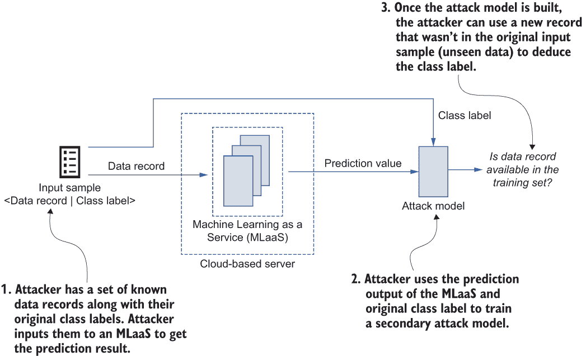

图 8.14 成员推理攻击的工作原理

为了防止此类攻击同时支持数据挖掘操作，通常使用精度降低方法（将精度降低到某个水平）。然而，每当精度降低时，数据挖掘操作的结果就会变得不那么准确。因此，想法是确保尽管攻击者可以推断出更多信息，但攻击者不能得出精确的结论。

### 8.3.3 统计数据库中的推理控制

为了保护隐私而规范数据挖掘输出的另一个重要方面是采用推理控制机制。当数据库中的数据记录频繁更新时，为每次数据挖掘操作生成一个单独的清洗数据集是具有挑战性的。因此，组织有时会提供对原始数据集的有限访问权限，允许进行统计查询，如聚合。

让我们回到我们在第七章中讨论的电子商务示例。通常，此类应用的底层数据库更新非常频繁。这使得维护数据集的清洁当前版本具有挑战性。在实践中，我们通常允许数据挖掘操作在原始未清洗数据上执行一组有限的统计查询（如 COUNT、MAX、SUM 等）。然而，某些查询可能仍然会泄露敏感信息，因此通常实施不同的推理控制机制。

正如你在图 8.15 中可以看到的，不允许在员工详细信息数据库中进行诸如“亚历克斯的年龄是多少？”这样的查询，但可以回答诸如“最高工资是多少？”这样的查询。这里的担忧是，有人可能会假设首席执行官是公司中薪酬最高的员工，因此他们的薪水是 85,000 美元。我们如何减轻这种担忧？

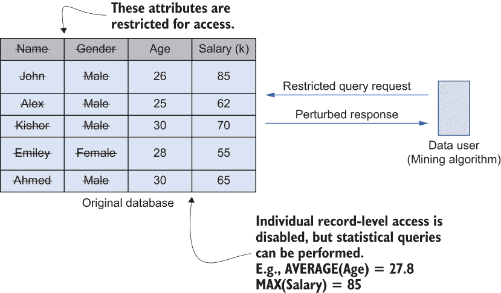

图 8.15 如何对聚合查询进行推理控制的示例

最直接答案是，我们不必返回确切的值；相反，我们可以返回一个范围作为答案。例如，我们可以返回 $50,000-100,000 而不是 $85,000 作为答案。还有一些其他的方法。我们将在 8.4.4 节中讨论在统计数据库上实现推理控制的常见方法。

## 8.4 数据管理系统中的隐私保护

到目前为止，我们已经讨论了不同的方法来增强隐私，特别是在数据挖掘操作中。但如果数据在源头泄漏怎么办？让我们看看如何在数据库级别处理隐私。

让我们回到我们的电子商务应用示例。通常，一个连接到电子商务应用（如亚马逊）的数据库在几分钟内可以处理数千笔交易或记录。显然，数据库需要管理这些信息。除了管理高量的交易外，该应用还需要提供额外的功能，如产品推荐，这涉及到数据挖掘。因此，除了简单的存储功能外，现代数据库系统还需要提供强大的数据挖掘能力。

随着组织对数据库系统的使用增加，尤其是大数据，这些系统管理的信息的安全性变得更加重要。机密性、完整性和可用性被认为是数据安全和隐私的基础，但在现代数据库系统中实现这些属性仍然是一个重大问题。数据库基础设施从本地到分布式云架构的迁移也增加了安全和隐私泄露的风险，而且大多数组织不会将关键任务数据存储在云端，因为当数据存储在本地时，对安全性的信心更高。因此，数据库系统的新挑战是利用它们为大数据应用提供的最先进性能优势，同时不牺牲安全性。本节将讨论在设计数据库管理系统时需要考虑的因素，以便满足现代数据隐私需求。

### 8.4.1 数据库安全和隐私：威胁和漏洞

在我们探讨如何在数据库系统中集成增强隐私的技术之前，让我们快速回顾一些保护数据的一般技术。

行业目前采用的数据保护方案

让我们看看数据库系统中提供安全性的现有解决方案。今天大多数可用的关系数据库系统都配备了加密机制来保护静态和传输中的数据。其中一些加密技术是针对特定数据库系统的，而另一些则由许多供应商应用。

透明数据加密（TDE）是许多供应商采用的一种技术，用于保护静态数据。Oracle 数据库和 Microsoft SQL Server 是两种流行的关系型数据库系统，它们使用 TDE 作为其主要的数据加密机制。它们通过在硬盘和备份媒体上加密数据库，在文件级别实施保护。然而，许多 NoSQL 解决方案，如 Riak、Redis、Memcached 和 CouchDB，被设计成在安全和可信的环境中工作，因此它们不提供加密机制。尽管如此，Cassandra 和 HBase 等 NoSQL 数据存储现在在其企业版本中包含 TDE，以提供静态数据的加密。

虽然静态数据保护是在数据库引擎中实现的，但同样重要的是确保数据在交换时或数据库服务器与客户端应用程序或其他同一集群内的节点之间的通信过程中得到保护。传统上，大多数数据库系统都采用了防火墙策略、操作系统配置或组织级别的虚拟专用网络（VPN）来确保节点间通信的安全性，因为它们通常是在本地可信环境中部署的。然而，数据存储现在越来越分布式，它们的部署架构已经从本地转变为云基础设施，因此需要特殊的机制来确保传输中的数据保护。包括 NoSQL 和 NewSQL 在内的大多数数据库系统现在通过使用传输层安全性（TLS）支持传输中的数据加密。

什么是 TLS？

传输层安全性（TLS）是一种广泛采用的加密安全协议，它促进了两个或更多通信计算机应用程序之间的隐私和数据安全。在当今世界，TLS 的主要用例是加密 Web 应用程序和服务器之间的通信，例如浏览器加载网站。除此之外，TLS 还用于许多其他应用程序，以加密通信，如电子邮件、消息和 IP 语音（VoIP）。

隐私保证非常具有挑战性！

即使有了所有这些安全机制，在实际部署中确保数据隐私仍然具有挑战性。你可能已经注意到，大多数最新的数据库引擎并没有提供任何类型的集成机制来保护数据免受安全或隐私攻击[5]。管理敏感信息的数据库系统中的大规模妥协已经影响了针对现有数据库系统中可用的典型安全和隐私机制之外的信息安全新技术的积极研究。

由于现代大数据应用的需求，也提出了各种协议，用于将数据安全地外包给第三方数据库服务器，使用强加密原语，如全同态加密、无感知 RAM、顺序保持加密等[6]。然而，一些最近的研究已经证明了成功的攻击，尤其是在加密数据库上，并发现这些系统仍然容易受到攻击[7]、[8]、[9]。因此，如果你计划部署新的数据驱动型应用，了解数据库系统中的性能和隐私权衡是至关重要的，包括不同的攻击策略。

### 8.4.2 现代数据库系统泄露私人信息的可能性有多大？

既然你已经对现有的安全机制有了背景了解，让我们详细看看数据库系统是如何泄露私人信息的。

数据库系统中最严重的威胁通常是主动攻击者，他们完全控制数据库服务器并执行任意恶意数据库操作。例如，数据库和系统管理员或云服务提供商通常可以无限制地访问生产数据库。他们可以执行恶意操作并从数据库中推断敏感信息。这种攻击很难防御。

除了这些主动攻击者之外，还可能有被动攻击者，他们不会干扰数据库的功能，而是被动地观察所有操作。我们通常将它们归类为“诚实但好奇”。他们通常会观察和分析数据用户发出的查询，并查看查询如何访问数据。

大多数这些威胁模型都是理论上的抽象。然而，还有许多其他类型的数据泄露，例如通过数据库日志文件、虚拟机（VM）快照泄露、应用程序核心转储等。下一节将讨论针对数据库系统的各种可能的攻击[5]。

### 8.4.3 对数据库系统的攻击

我们可以将对数据库系统的攻击分为两大类：

+   *对数据机密性的攻击*——对于大多数违反数据机密性的攻击，攻击者是“诚实但好奇”的人——他们有一些访问数据库服务器或嗅探服务器端通信的手段。然而，对于查询劫持攻击，例如注入攻击，攻击者可能在客户端，当数据库客户端或协议包装器处理 Web 请求时，将恶意代码注入远程 Web 访问请求（通过 API）。

+   *对数据隐私的攻击*——对于大多数针对隐私泄露的攻击，攻击者可能是合法的数据用户，他们可以无限制地访问数据库，例如数据分析师。

在高层次上，机密性控制防止对机构手中已有的信息的未经授权使用。相比之下，隐私保护个人控制机构收集、维护和与他人共享的信息的权利。

在本章的结尾，我们将探讨为满足用户隐私需求而量身定制的隐私保护数据库系统的设计考虑因素。为了实现这一点，研究这些攻击向量的影响是至关重要的。

图 8.16 展示了典型的数据库服务器部署并总结了可能的数据库攻击。正如您所看到的，数据泄露的可能性有很多，甚至在数据库级别处理之前：在客户端驱动程序或包装器中，在通信通道中，或者在服务器端的操作系统级别。让我们详细看看这些。

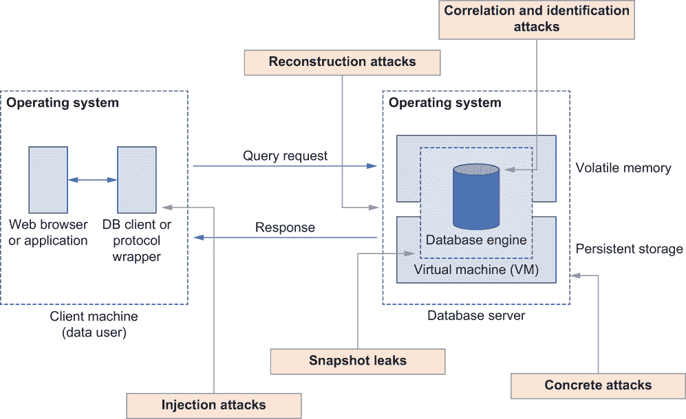

图 8.16 一个典型的数据库服务器部署。攻击可能导致数据泄露发生在客户端、网络接口本身，甚至在服务器端组件上。

针对数据机密性的攻击

数据库攻击的第一类是基于攻击者突破数据机密性的能力。让我们看看这些攻击如何在日常应用中部署：

+   *注入攻击*—SQL 注入是一种常见的攻击，通过在基于 SQL 的查询语句中插入恶意代码，该应用程序将其传递给数据库客户端（在客户端机器上）。大多数数据库在系统级诊断表中收集和存储性能统计信息，这些信息可用于数据库调整和解决诊断问题。有时，这些表会保留当前执行查询的时间戳列表（例如，MySQL 中的信息模式和性能模式数据库）。有了当前执行查询的列表，攻击者可以轻松地获取其他用户执行的查询列表。这在 NoSQL 数据库中也是可能的，一些研究表明攻击者可以通过注入恶意代码绕过身份验证机制非法提取数据。

+   *重建（泄露滥用）攻击*—这是一种攻击策略，其中攻击者利用一些泄露来恢复查询信息。这种攻击可以基于查询访问模式和通信量。

    基本上，使用查询访问模式进行的重建攻击涉及服务器学习特定查询返回的哪些记录。相比之下，使用通信量进行的重建攻击涉及服务器学习查询返回了多少记录。此外，这些攻击即使在加密数据库（EDBs）中也是可能的。正如你在本节开头所学的，加密数据库是安全数据库系统，其中数据以加密形式（而非明文）存储，这样查询仍然可以进行。大多数 EDBs 依赖于某种类型的属性保持加密（PPE）机制（例如，确定性或顺序保持加密），这使得它们能够执行各种数据库操作。然而，由于底层加密算法的弱点，这些解决方案仍然会泄露一些信息。

+   *具体攻击*——另一种可能的攻击场景是持久存储（磁盘盗窃）。大多数符合 ACID 规范的数据库使用磁盘日志文件来简化最近事务的回滚操作。通过使用标准的取证技术，这些日志文件可以用来重建数据库上发出的过去查询事务。此外，SQL 查询的时间可能携带敏感信息，这些信息可以从支持复制事务的日志文件中提取。这些攻击可以通过使用静态数据加密机制来缓解。

+   *快照泄露*——现代数据库系统越来越多地部署在虚拟机上，因此它们面临着一种称为虚拟机镜像泄露攻击的威胁。在这种情况下，攻击者获取虚拟机的快照镜像，从而揭示整个持久或易失性内存的特定时间点状态。此外，通过访问缓存内存中的单个页面，攻击者可以泄露有关过去执行查询的信息。

+   *全面系统破坏*——全面系统破坏是一种攻击策略，涉及根数据库系统并获取对数据库和操作系统状态的完全访问权限。这可能是一种持续的被动或主动攻击；被动攻击更为常见。

针对数据隐私的攻击

我们已经讨论了一些针对数据机密性的攻击。然而，我们今天面临的一个主要担忧是将不同类型的数据集链接在一起，以揭示个人的独特指纹或敏感信息（也称为再识别）。通常，这些都是内部攻击，并且可以分为两个子类：

+   *关联攻击*——在关联攻击中，数据集中的值与其他信息源相关联，以创建独特且信息丰富的条目。考虑医院数据库和药店数据库的场景。如果一个公开的数据库列出了带有药物处方的用户信息，而另一个列出了带有访问药店的用户信息，将它们联系起来可以提供有关哪些患者从哪些药店购买药物的信息。因此，最终的关联数据集可能包含关于每个用户更多的信息。

+   *识别攻击*——虽然关联攻击试图任意地将两个数据集联系起来，但识别攻击试图通过链接数据库中的条目来获取有关特定个人的更多信息。这可以被认为是数据隐私攻击中最具威胁性的一种，因为它对个人隐私的影响更大。例如，如果雇主在药店客户数据库中搜索其员工的记录，这可能会透露一些关于其员工医疗治疗和疾病的信息。

数据匿名化或数据脱敏技术可以在缓解这些攻击中发挥重要作用。虽然数据集的链接仍然可行，但识别结果数据集中的个人却很困难。下一节将讨论隐私增强技术在数据库系统（尤其是在统计数据库）中的应用，以克服先前的威胁和漏洞。

### 8.4.4 统计数据库系统中的隐私保护技术

您现在对攻击向量有了基本的了解。现在是时候看看如何在数据库系统中应用隐私保护了。

通常，统计数据库（SDB）系统允许用户检索数据库中呈现的实体子集的汇总统计信息（例如，计数、平均值、样本均值等）。例如，在一个公司数据库中查找员工的平均工资是一个在数据库内作为 SQL 查询执行的汇总统计查询。今天的大多数数据驱动型应用都使用数据分析（通常称为在线分析处理，或 OLAP）进行决策。然而，正如我们已经看到的，当前的数据安全方法在提供通用访问（对于内部用户）时，尤其是对于数据库系统中的 OLAP 查询，无法保证个人的隐私。常见的机制，如访问控制策略，可以限制对特定数据库的访问，但一旦内部分析师获得了数据访问权限，这些策略就无法控制数据的使用方式。过去许多内部攻击所揭示的情况表明，允许无限制地访问数据是隐私泄露的一个重要原因 [10]，[11]，[12]。在统计数据库上提供安全性已经成为一个公众关注的问题。

研究社区已经提出了几种防止统计数据库妥协的技术。这些技术主要可以分为两大类：噪声添加和数据或查询限制：

+   *噪声添加技术*—在统计数据库中，最常用的隐私保护方法是向输出查询结果添加噪声。在此方法中，数据库中的所有数据都可用于使用，但只返回近似值。噪声添加技术的重点是通过对敏感数据添加一定程度的噪声来掩盖其实际值。这通常以受控的方式进行，以平衡隐私和信息损失之间的竞争需求。根据噪声添加的方式，这些技术可以进一步分类：

    +   *数据扰动方法*—在此方法中，数据库的原始内容被替换为扰动数据库，在该数据库中执行统计查询，如图 8.17 所示。

    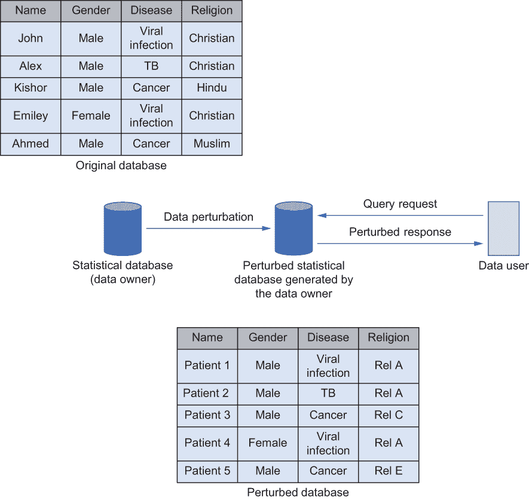

    图 8.17 数据扰动方法

    +   *输出扰动方法*—使用输出扰动方法（如图 8.18 所示），查询在原始数据上评估。然而，在将结果发布给查询方之前，数据库会向单个结果添加噪声（通过数据库），以确保原始值永远不会被披露。这可以通过使用我们在本章开头讨论的数据匿名化噪声添加技术来实现。然而，值得注意的是，查询的最终准确性取决于我们添加多少噪声。显然，当噪声较高时，隐私性更好，但它可能会影响最终结果的准确性。

    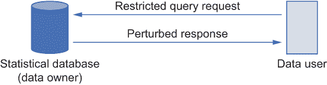

    图 8.18 输出扰动方法

+   *查询（或数据）限制技术*—查询或数据限制技术将数据净化操作应用于查询结果（见图 8.19）。这些技术可以进一步细分为三种不同的方法：

    +   *全局记录*方法将属性转换到另一个域以确保隐私。例如，而不是返回某人的年龄为 26 岁，它将年龄转换为范围值，并以类似 20-30 岁的范围返回。

    +   *抑制*方法的应用是用原始数据集中未出现过的值替换属性的值。这与第 7.4 节中讨论的抑制技术类似，但不是完全删除记录，而是用另一个值替换它。为了找到一个替换值，我们首先需要确定一个在我们所查看的属性中不可用的值。例如，假设我们有一个定义为 Age = [20, 23, 35,..., 42, 26]的属性，并且假设列表中不包含值 33。因此，33 可以作为替换值的候选。

    +   使用*查询限制*技术，用户的查询要么得到精确回答，要么被拒绝。决定哪些查询应该得到正确回答的决策基于不同的参数，例如查询集大小、查询集重叠等。

    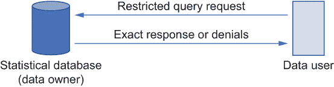

    图 8.19 查询限制方法

既然我们已经讨论了可以在数据库系统上实施的不同隐私增强技术及其局限性，那么让我们看看我们如何定制这些隐私技术。不同的应用程序有不同的隐私需求，因此，在数据库系统中拥有可定制的隐私组件集，允许用户根据他们的需求配置隐私，这一点很重要。下一节将讨论如何设计隐私保护数据库系统，强调主要架构需求。

### 8.4.5 设计可定制隐私保护数据库系统时需要考虑的因素

许多现代数据库系统由于各种原因没有上述隐私增强技术。今天的大多数数据库架构都是考虑到高可用性和性能而设计的，但并未考虑隐私。因此，这些系统很难覆盖数据隐私，除了在架构设计层面的认证、授权和访问控制等安全原语之外。隐私伴随着额外的成本。在数据库系统中实施隐私技术总是涉及数据隐私和性能之间的权衡。

已经研究了专门针对支持隐私策略和标准的数据库管理系统；万维网联盟（W3C）的隐私偏好平台（P3P）项目就是这样一项研究。然而，领先的数据库提供商中没有任何一家能够提供实用的隐私保障数据库系统，这需要隐私增强技术和隐私保护数据挖掘的联合方法。在本节中，我们将简要讨论设计隐私保护数据库系统所需的稳固数据库架构变更和需求。

在高层次上，一旦收集数据，信息系统的隐私承诺必须得到执行。因此，设计这样一个系统需要利用广泛的安全策略和其他净化技术。让我们简要地看看它们。

维护丰富的隐私相关元数据

类似于 P3P 这样的机制通常要求数据用户指定他们检索数据的预期用途，以确保隐私保证。因此，为了便于访问此类元数据，保护隐私的数据库管理系统应实施机制以存储与数据相关的隐私特定元数据。例如，数据库中的一组数据属性可以具有相关的元数据，指定其预期用途，例如数据是否用于内部，是否可以与其他属性结合，等等。此外，这些元数据应与数据关联，以一系列可能的粒度进行，具有足够的灵活性，且不会降低数据存储的整体性能。

支持属性级别的访问控制机制

一个保护隐私的数据库系统应该支持数据属性级别的访问控制。大多数数据库系统（无论是关系型、NoSQL 还是 NewSQL）都配备了基于角色的访问控制（RBAC）机制，其中每个用户配置文件被分配预定义的角色，例如管理员、最终用户或特殊用户。例如，管理员可能拥有删除记录的权限，而最终用户可能只能添加或查看记录。同样，所有被分配 HR 角色的用户可能被授予访问薪酬信息的权限，而其他人则没有。然而，RBAC 不提供用于隐私执行的应用依赖用户配置文件。这些策略通常为每个数据表（或集合）定义，但不是基于属性。因此，在保护隐私的数据库管理系统中，有必要有机制来扩展对基于属性或基于目的的访问控制机制的支撑。

什么是基于属性的访问控制？

与 RBAC 不同，基于属性的访问控制（ABAC）具有大量称为“属性”的可能控制变量，这使得访问控制比 RBAC 更细粒度。这些属性可以采取不同的形式，例如用户属性（user_name、user_id、role 等）、资源属性（resource_owner、creation_date、privacy_level 等）或环境属性（access_date_time、data_location、risk_level 等）。这些不同的属性允许 ABAC 提供更细粒度的访问控制级别。

例如，假设我们有一个 RBAC，其中所有 HR 角色的用户都可以访问数据库中的员工和薪酬信息。使用 ABAC 可以进一步过滤，使得只有特定的分支或办公室可以访问薪酬信息，而其他人则受到限制。

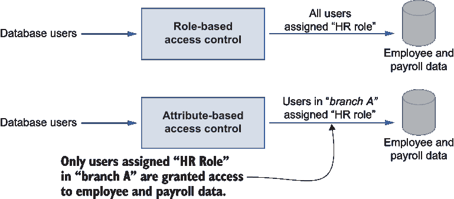

基于角色和基于属性的访问控制之间的区别

实施对数据的细粒度访问控制

除了 ABAC 机制之外，对数据的细粒度访问控制至关重要。

在传统的数据库系统中，通过数据库视图实现细粒度的访问控制。*视图* 是一个虚拟表，不存储数据，但可以像表一样查询。视图通常将数据库中的几个表或集合组合起来，然后授予一组用户查询这些数据的权限。然而，视图仅限于受控的属性组。用户不能在此级别修改数据，但数据可以用于挖掘任务。

为了实现隐私增强的数据库管理系统解决方案，这些 *视图* 机制应该扩展到每个被保护的元组或元组集的水平，并且应该基于每个用户实现。例如，人力资源经理可以访问 HR 视图中的所有属性，而其他人力资源用户可能只能访问视图中有限的一组属性。实现这一点的最直接方法是为每个用户或用户组创建新的或额外的视图，但这会消耗资源。因此，数据库系统本身必须具备提供这种细粒度访问控制数据的机制。

视图是什么？它是如何工作的？

视图是存储在表上的聚合结果的输出，数据库用户可以像查询持久化集合对象（如表）一样查询它。让我们通过一个快速示例来创建 MongoDB 中的视图，通过连接两个表（在 MongoDB 中称为集合）。

在这个例子中，viewName 是我们要创建的视图的名称，而 table1 和 table2 是我们要连接的表。对于 $lookup，连接的条件是 table2.col1=table1.col1，而在 $project 中的参数 0 强调了 table1 的 col3 和 col4 以及 table2 的 col1 和 col3 应该从最终视图中移除。

```
Db.createView("viewName", "table1",
   [{$lookup: {from: "table2", localField: "col1", 
foreignField: "col1", as: "t2"}},
   {$project: {"col3": 0, "col4": 0, "t2.col1": 0, "t2.col3": 0}])

```

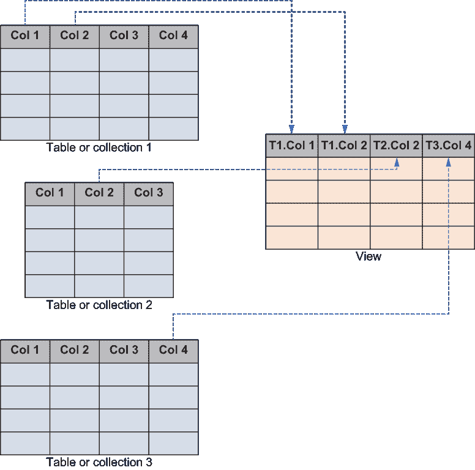

在 MongoDB 中生成视图

我们如何连接图中显示的所有三个表？你可以自己尝试一下。

维护隐私保护的信息流

另一个重要的考虑因素是在数据库系统中保持隐私保护的数据流。在大多数分布式数据库系统中，数据会在不同的域之间流动，因此，与数据相关的所有隐私策略也应该随着数据一起流动，无论是在组织内部还是在组织之间。如果敏感数据是在特定的隐私承诺下收集的，那么在数据传递给不同方时，这些限制也应该得到执行。例如，一个组织的分布式数据库系统可能位于全球范围内，收集全球范围内的个人数据。每当数据从一个区域收集并通过另一个区域时，应该保证相同的隐私执行集合。

防止内部攻击

合法的高权限用户滥用权限是数据库系统中最具威胁的攻击之一。虽然防止这种攻击具有挑战性，但有一些方法可以减轻此类攻击。

最简单的方法是采用按用户分层的加密机制，这样每个用户都有自己的加密。其他用户仍然可以访问数据，但由于加密密钥不同，他们无法从中获取任何有价值的信息。然而，这给数据库系统的实用性带来了更多问题。

另一个可能的选择是使用用户访问配置文件技术。一旦用户在数据库系统中定义，他们的配置文件就可以通过机器学习技术进行监控，以检测与常规活动不同的行为。如果有人访问未经授权的内容，可以被检测到。

我们现在已经讨论了可以在实际部署中使用的数据保护方案，以及各种攻击如何针对数据机密性和隐私。在第十章中，我们将使用这些概念来解释如何设计一个实用的隐私保护数据管理解决方案。但首先，在第九章中，我们将探讨机器学习的压缩隐私，这是一种扰动数据的替代方法。

## 摘要

+   有时，*k*-匿名性隐私模型并不是保护数据挖掘应用隐私的最佳解决方案。

+   通过在属性组中创建*l*个不同的敏感记录，可以使用*l*-多样性来减轻*k*-匿名性对同质性和背景知识攻击的敏感性。

+   *t*-接近性的理念是确保每个组（等价类）中敏感记录的分布足够接近原始数据集中的相应分布。这防止了由于分布偏斜导致的属性泄露。

+   数据挖掘算法的输出可以被修改以保护某些数据挖掘应用的隐私。

+   数据库系统中存在许多不同的安全和隐私威胁和漏洞，针对机密性和数据的隐私。

+   我们可以将对数据库系统的攻击分为两大类：对数据机密性的攻击和对数据隐私的攻击。

+   统计数据库系统中的隐私保护技术可以用来减轻当今数据库系统中的大多数隐私威胁。

+   大多数现代数据库系统并不是从数据隐私的角度设计的；它们通常关注数据库的性能。
