# 9 压缩隐私在机器学习中的应用

本章涵盖

+   理解压缩隐私

+   为机器学习应用引入压缩隐私

+   从理论到实践的压缩隐私实现

+   用于隐私保护机器学习的压缩隐私解决方案

在前面的章节中，我们探讨了差分隐私、局部差分隐私、隐私保护合成数据生成、隐私保护数据挖掘以及在设计隐私保护机器学习解决方案时的应用。如您所回忆的，在差分隐私中，一个可信的数据管理员从个人那里收集数据，并通过向个人数据的聚合中添加精确计算的噪声来产生差分隐私的结果。在局部差分隐私中，个人在将数据发送到数据聚合器之前通过扰动来隐私化自己的数据，从而消除了需要一个可信的数据管理员从个人那里收集数据的需要。在数据挖掘中，我们探讨了在收集信息和发布数据时可以使用的各种隐私保护技术和操作。我们还讨论了调节数据挖掘输出的策略。隐私保护合成数据生成提供了私有数据共享的可行解决方案，其中可以生成合成且具有代表性的数据，然后安全且安全地共享给多个当事人。

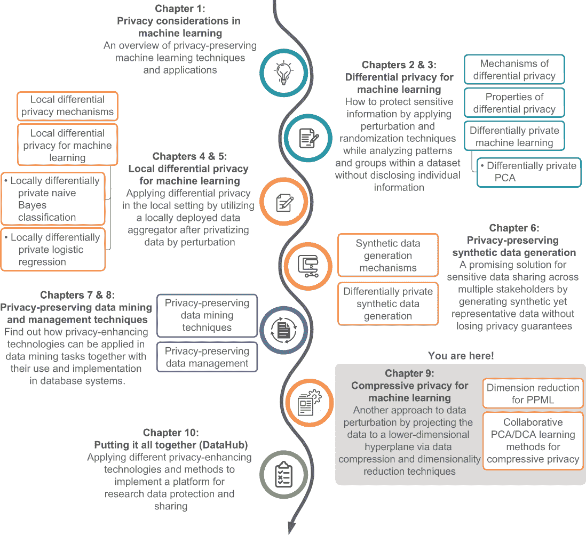

如您所见，我们讨论的大多数技术都是基于差分隐私（DP）的定义，它不对对手的能力做出任何假设，因此提供了极其强大的隐私保证。然而，为了实现这种强大的隐私保证，基于 DP 的机制通常会在私有数据上添加过多的噪声，导致某种程度的不可避免的有效性下降。这阻止了 DP 方法应用于许多现实世界应用，尤其是使用机器学习（ML）或深度学习的实际应用。这促使我们探索其他基于扰动的隐私保护方法。压缩隐私（CP）是我们可以探讨的一种替代方法。在本章中，我们将探讨压缩隐私的概念、机制和应用。

## 9.1 引入压缩隐私

*压缩隐私*（CP）是一种通过压缩和降维（DR）技术将数据投影到低维超平面上来扰动数据的方法。为了更好地理解压缩隐私的概念和优势，让我们将其与我们在第二章中讨论的差分隐私（DP）理念进行比较。

根据 DP 的定义，如果一个随机算法*M*满足对于所有*S*属于*M*的输出集*Range*(*M*)以及所有只相差一个项目的数据集*D*和*D*'，都有 Pr[*M*(*D*) ∈ *S*] ≤ *e*^ε ∙ Pr[*M*(*D*') ∈ *S*]，则称该算法是输入数据的ε-DP 算法。其中，*Range*(*M*)是算法*M*的输出集。换句话说，DP 背后的思想是，如果对数据库进行任意单个更改或替换的影响足够小，查询结果就不能用来推断任何单个个体的信息，因此它提供了隐私保护。正如你所看到的，DP 保证了从数据集查询结果的分布，无论数据集中的单个项目是否更改，都应该是不可区分的（模*e*^ε因子）。DP 的定义没有对对手做出任何先前的假设。例如，对手可能拥有无界的辅助信息和无限的计算资源，但 DP 机制仍然可以在这种 DP 定义下提供隐私保证。

这显示了 DP 的积极一面——它通过严格的理论分析提供了强大的隐私保证。然而，DP 的定义和机制并没有对效用做出任何假设。因此，DP 机制通常不能在效用方面提供良好的性能。这在将 DP 方法应用于需要复杂计算的实际应用（如数据挖掘和机器学习）时尤其如此。这就是为什么我们还需要探索其他考虑效用同时放松理论隐私保证的隐私增强技术。CP 就是这样一种可以用于实际应用的替代方案。

与 DP 不同，CP 方法允许查询根据已知的效用和隐私任务进行定制。具体来说，对于具有两个标签的样本数据集，即效用标签和隐私标签，CP 允许数据所有者以最大化效用标签学习准确性的方式将数据投影到低维空间，同时降低隐私标签学习的准确性。我们将在详细讨论时讨论这些标签。值得注意的是，尽管 CP 不能消除所有数据隐私风险，但在隐私任务已知的情况下，它提供了一些对数据滥用的控制。此外，CP 保证原始数据永远不会被完全恢复，这主要是由于降维。

现在我们来深入探讨 CP 是如何工作的。图 9.1 展示了 CP 的威胁模型。对手是所有拥有对公共数据集（例如，背景和辅助信息）完全访问权限的数据用户。

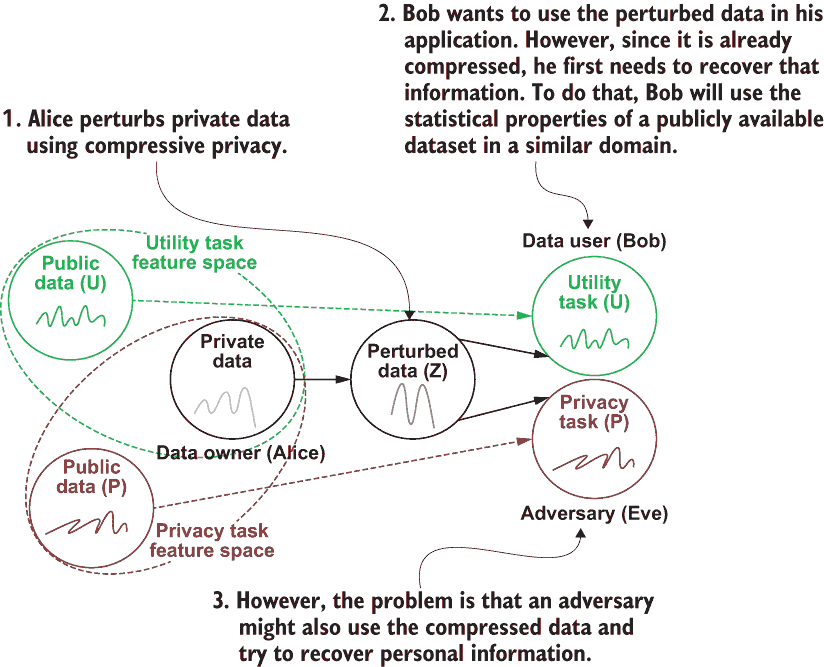

图 9.1 压缩隐私的威胁模型。真正的挑战在于平衡效用和隐私之间的权衡。

在这个场景中，让我们假设隐私任务是二分类{+,-}问题（实用任务与隐私任务独立），*X*[+]和*X*[-]是两个公开数据集。假设*X*[S]是数据所有者的私有数据，其中*s* ∈{+,-}是其原始类别（隐私任务），而*t* ∈ {+,-}是在应用 CP 扰动后的预期类别（隐私任务）。数据所有者可以使用 CP 机制发布*z*（*X*[S]的扰动版本）。然而，也可能存在一个对手，使用他们的方法*z*' = *A*(*z*, *X*[+], *X*[-])来推断原始（隐私任务）类别*s*。因此，我们想要实现的目标是最小化概率差异，|*Pr* (*z*' = +|*z*) - *P r* (*z*' = -|*z*)|，这样对手就不能学习到任何有价值的信息。

在图 9.1 中，Alice（数据所有者）有一些私有数据，她希望为了一个实用任务发布这些数据。假设这个实用任务是允许数据用户使用这些数据执行机器学习分类。由于它包含个人信息，Alice 可以使用 CP 对数据进行扰动。每当 Bob（数据用户）想要使用这个压缩数据时，他需要恢复信息，这可以通过使用在类似领域公开可用的数据集的统计特性（我们称之为*实用任务特征空间*）来实现。问题是，其他人，比如 Eve（一个对手），也可能使用压缩数据并尝试使用另一个公开可用的数据集来恢复它，这可能导致隐私泄露。因此，CP 的真正挑战在于平衡这种实用/隐私权衡。我们可以压缩数据以执行实用任务，但仍然需要让其他人难以恢复数据以识别个人信息。

以下章节将向您介绍几个有用的组件，这些组件使 CP 能够用于隐私保护的数据共享或机器学习应用。

## 9.2 压缩隐私机制

CP（差分隐私）的一个重要组成部分是监督降维技术，它依赖于数据标签。主成分分析（PCA）是一种广泛使用的方法，旨在将数据投影到具有最高方差的主成分上，从而在降低数据维度的同时保留数据中的大部分信息。我们曾在 3.4.1 节中简要讨论过这一点，但让我们快速回顾一下。

### 9.2.1 主成分分析（PCA）

让我们先了解一下主成分是什么。*主成分* 是通过数据集中初始变量的线性组合构造的新变量。这些组合是以一种方式创建的，使得新变量之间不相关，并且初始变量中的大部分信息都压缩到了第一个成分中（这就是为什么我们称之为 *压缩*）。因此，例如，当 10 维数据给出 10 个主成分时，PCA 尝试将尽可能多的信息放入第一个成分，剩余的最大信息放入第二个成分，依此类推。当你以这种方式组织主成分信息时，你可以在不丢失太多关键信息的情况下降低维度。

让我们考虑一个包含 *N* 个训练样本的 *x*[1], *x*[2], ..., *x*[N]，其中每个样本有 *M* 个特征（*x*[i] ∈ ℝ^M）的数据集。PCA 执行一种称为 *中心调整散布矩阵的谱分解*  的操作，使得

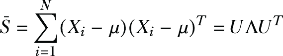

其中 μ 是均值向量，Λ = diag(*λ*[1], *λ*[2], ..., *λ*[M]) 是一个对角矩阵，其对角线上的特征值按单调递减的顺序排列（即 *λ*[1] *≥* *λ*[2] *≥* ⋯ *≥* *λ*[M])。

在这里，矩阵 *U* = [*u*[1],*u*[2], ..., *u*[M]] 是一个 *M* × *M* 的单位矩阵，其中 *u*[j] 表示之前提到的散布矩阵的第 *j* 个特征向量。对于 PCA，我们保留与 *m* 个最高特征值相对应的 *m* 个主成分以获得投影矩阵 *U*[m]。一旦找到投影矩阵，就可以找到以下降低维度的特征向量：

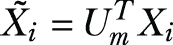

如您所见，参数 *m* 决定了在降维后信号功率保留的程度。

特征值分解

在线性代数中，特征值分解（EVD）是将矩阵分解为标准形式的过程，其中矩阵用其特征值和特征向量表示。基本上，它旨在找到满足方程 *Au* = *λu* 的矩阵 *A* 的特征值（称为 *λ*）和特征向量（称为 *u*）。

通常，特征值分解（EVD）可以以多种方式执行。一些方法，如 QR 算法，一次找到所有特征向量和特征值。然而，PCA 减少了维度，因此不需要所有特征向量。因此，我们可以依赖仅找到特征值和特征向量子集的方法，以避免与找到不必要的特征向量相关的额外计算。

为了达到这个目的，最著名的特征值分解算法之一是幂迭代法。这种方法找到主导特征值（最大的值）及其相关的特征向量。之后可以使用矩阵消去法来消除已找到的主导特征值的影响，同时保持剩余特征值不变。我们可以通过反复应用幂迭代法和矩阵消去法来找到所需的特征向量数量。

### 9.2.2 其他降维方法

现在你已经了解了主成分分析（PCA）的工作原理，通过将数据投影到主成分上，让我们看看一些可以用于不同机器学习分类任务的其他方法。因为相同的数据库可以在不同的分类问题中使用，所以让我们定义一个分类问题为 *c*，它与相应的训练样本 *x*[i] 相关的唯一标签集相关。不失一般性，该数据库可以用于单个效用目标 *U* 和单个隐私目标 *P*。

例如，假设一个机器学习算法使用人脸图像数据集进行训练。效用目标是识别人脸，而隐私目标是识别个人。在这种情况下，每个训练样本 *x*[i] 有两个标签 ∈ {1, 2, ..., *L*^u} 和 ∈ {1, 2, ..., *L*^p}。*L*^u 和 *L*^p 分别是效用目标和隐私目标的类别数量。

基于费舍尔线性判别分析 [1]，[2]，给定一个分类问题，其训练样本的类内散布矩阵包含大部分 *噪声信息*，而其训练样本的类间散布矩阵包含大部分 *信号信息*。我们可以按以下方式定义效用目标的类内散布矩阵和类间散布矩阵，

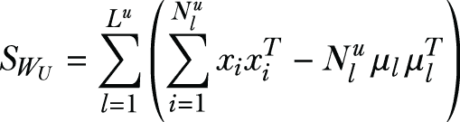

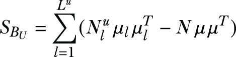

其中 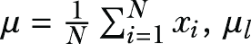 是属于类别 *l* 的所有训练样本的均值向量，而 N^u[l] 是属于类别 *l* 的效用目标训练样本的数量。

同样地，对于隐私目标，类内散布矩阵和类间散布矩阵被定义为


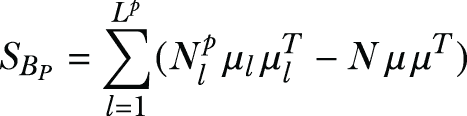

假设我们让 *W* 是一个 *K* × *M* 投影矩阵，其中 *K* < M。给定一个测试样本 *x*，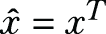∙ *W* 是其在子空间中的投影。我们将要探讨的框架结合了两种基于特征值分解的降维（DR）技术的优点：DCA（效用驱动投影）[3] 和 MDR（隐私强调投影）[4]。让我们快速了解一下这些：

+   *判别成分分析（DCA）*——DCA 涉及搜索投影矩阵 *W* ∈ *R*^(M×K),

    

    其中 *det*(.) 是行列式算子，*ρI* 是为了数值稳定性而添加的小正则化项，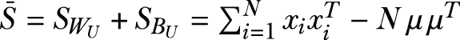。

    该问题的最优解可以从矩阵 pencil 的前 *K* 个主广义特征向量 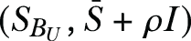 中导出。

+   *多类判别比*（MDR）——MDR 考虑了效用目标和隐私目标，定义为

    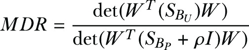

    其中 ρI 是为了数值稳定性而添加的小正则化项。MDR 的最优解可以从矩阵 pencil 的前 *K* 个主广义特征向量 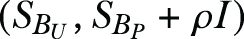 中导出。

在这些基本原理和数学公式的基础上，让我们看看如何在 Python 中实现 CP 技术。

## 9.3 使用压缩隐私进行机器学习应用

到目前为止，我们已经讨论了不同 CP 机制的理论背景。让我们将这些技术应用于实际的实时人脸识别应用中。由于其在从简单的在线图像搜索到监控等各个领域的广泛应用，人脸识别一直是机器学习（ML）和信号处理领域的一个研究热点。

在当前的隐私要求下，一个现实世界的人脸识别应用必须确保数据本身不会出现任何隐私泄露。让我们研究几种不同的 CP 方法，看看我们如何确保人脸识别应用的效用和重建图像的隐私。在提交给人脸识别应用之前，我们需要压缩人脸图像，以便应用仍然能够识别人脸。然而，其他人不应该仅通过观察就能区分图像，或者能够重建原始图像。在我们的实验中，我们将使用三个不同的面部数据集。这些动手实验的源代码可以在本书的 GitHub 仓库中下载：[`github.com/nogrady/PPML/tree/main/Ch9`](https://github.com/nogrady/PPML/tree/main/Ch9)。

+   *耶鲁人脸数据库*——耶鲁人脸数据库包含 15 个个体的 165 张灰度图像，并可以从 [`cvc.cs.yale.edu/cvc/projects/yalefaces/yalefaces.xhtml`](http://cvc.cs.yale.edu/cvc/projects/yalefaces/yalefaces.xhtml) 公开获取。

+   *奥利维蒂人脸数据集*—这个数据集包含 1992 年 4 月至 1994 年 4 月在 AT&T 实验室剑桥拍摄的 40 位不同人物的 400 张灰度人脸图像。数据集可以从 [`scikit-learn.org/0.19/datasets/olivetti_faces.xhtml`](https://scikit-learn.org/0.19/datasets/olivetti_faces.xhtml) 下载。

+   *眼镜数据集*—我们通过选择性地从耶鲁和奥利维蒂数据集中选择戴眼镜的受试者来推导出这个数据集。在这种情况下，数据集包含 300 张图像。其中一半的图像是戴眼镜的人，另一半是不戴眼镜的人。

对于耶鲁和奥利维蒂数据集，从人脸图像中识别个人的任务将是我们的应用（我们的目标应用），而图像的重构将是我们的隐私目标。一个用例场景是一个“实体”想要使用用户提供的用于训练的敏感人脸图像构建人脸识别算法。但在这种场景中，人们通常不愿意分享他们的面部图像，除非它们被改变到没有人能识别图像中的人。

为了简单起见，我们可以假设想要构建人脸识别分类器的实体是一个服务运营商，但这个运营商可能是恶意的，并试图从从用户那里接收到的训练数据中重建原始图像。

对于眼镜数据集，我们有两种不同的类别（戴眼镜和不戴眼镜）。我们应用的价值将在于识别某人是否佩戴了一副眼镜；隐私目标将是图像的重构。

### 9.3.1 实现压缩隐私

现在让我们开始工作！我们将使用耶鲁数据集，看看我们如何在人脸识别应用中使用 CP 技术。首先，你需要加载一些模块和数据集。请注意，discriminant_analysis.py 是我们为 PCA 和 DCA 方法开发的模块。更多信息请参考源代码。

注意：你可以直接使用耶鲁数据集的清洁版本，它可在代码仓库中找到：[`github.com/nogrady/PPML/tree/main/Ch9`](https://github.com/nogrady/PPML/tree/main/Ch9)。

列表 9.1 加载模块和数据集

```
import sys
sys.path.append('..');
import numpy as np
from discriminant_analysis import DCA, PCA
from sklearn.svm import SVC
from sklearn.model_selection import GridSearchCV
from sklearn.model_selection import train_test_split
from matplotlib.pyplot import *

data_dir = './CompPrivacy/DataSet/Yale_Faces/';    ❶
X = np.loadtxt(data_dir+'Xyale.txt');
y = np.loadtxt(data_dir+'Yyale.txt');
```

❶ 加载数据集。

你可以运行以下命令来查看数据集的外观：

```
print('Shape of the dataset: %s' %(X.shape,))
```

如您从输出中看到的，数据集包含 165 张图像，每张图像为 64 x 64（这就是为什么我们得到 4,096）。

```
Shape of the dataset: (165, 4096)
```

现在让我们回顾数据集中的几幅图像。由于数据集包含 165 张不同的图像，你可以运行以下列表中的代码来随机选择四幅不同的图像。我们使用 randrange 函数随机选择图像。为了在输出中显示图像，我们使用 displayImage 例程和四列的 subplot。

列表 9.2 从数据集中加载一些图像

```
def displayImage(vImage,height,width):             ❶
    mImage = np.reshape(vImage, (height,width)).T
    imshow(mImage, cmap='gray')
    axis('off')

for i in range(4):                                 ❷
    subplot(1,4,i+1)
    displayImage(X[randrange(165)], height, width)

show()
```

❶ 定义一个显示图像的函数。

❷ 从数据集中随机选择四幅不同的图像。

输出将类似于图 9.2，尽管你将得到不同的随机人脸图像。

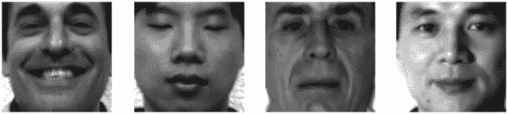

图 9.2 来自耶鲁数据集的一组样本图像

现在你已经知道了我们正在处理的数据类型，让我们用这个数据集实现不同的 CP 技术。我们特别关注在这个数据集上实现主成分分析（PCA）和判别成分分析（DCA）。我们已经开发和封装了 PCA 和 DCA 的核心功能到 discriminant_analysis.py 类中，所以你可以简单地调用它并初始化方法。

注意：Discriminant_analysis.py 是我们开发的一个类文件，用于涵盖 PCA 和 DCA 方法。你可以参考该文件的源代码以获取更多信息：[`github.com/nogrady/PPML/blob/main/Ch9/discriminant_analysis.py`](https://github.com/nogrady/PPML/blob/main/Ch9/discriminant_analysis.py)。

DCA 对象使用两个参数初始化：rho 和 rho_p。你将记得我们在第 9.2.2 节中讨论了这些参数（ρ和更新的ρ）。我们使用的代码将首先定义和初始化这些值，以及一组我们将需要用于投影图像数据以查看结果的维度。

我们将首先设置 rho = 10 和 rho_p = -0.05，但在此章的后面部分，你将了解到这些参数的重要属性以及不同值如何影响隐私。现在我们只关注算法的训练和测试部分。

设置 ntests = 10 意味着我们将进行相同的实验 10 次以平均最终结果。你可以将此值设置为任何数字，但越高越好。dims 数组定义了我们将使用的维度数。正如你所见，我们将从少数维度开始，例如 2，然后移动到更多维度，例如 4096。再次提醒，你可以尝试为这个值设置自己的值。

```
rho = 10; 
rho_p = -0.05;
ntests = 10;
dims = [2,5,8,10,14,39,1000,2000,3000,4096];

mydca = DCA(rho,rho_p);
mypca = PCA();
```

一旦定义了这些值，mypca 和 mydca 对象将在数据集分为训练集和测试集之后，使用以下代码进行训练。Xtr 是训练数据矩阵（训练集），而 ytr 是训练标签向量。fit 命令从数据中学习一些量，特别是主成分和解释方差。

```
Xtr, Xte, ytr, yte = train_test_split(X,y,test_size=0.1,stratify=y);
mypca.fit(Xtr);
mydca.fit(Xtr,ytr);
```

此后，可以按以下方式获得数据的投影：

```
Dtr_pca = mypca.transform(Xtr);
Dte_pca = mypca.transform(Xte);
Dtr_dca = mydca.transform(Xtr);
Dte_dca = mydca.transform(Xte);   
print('Principal and discriminant components were extracted.')
```

对于我们感兴趣的每个维度（2, 5, 8, 10, 14, 39, 1000 等），可以找到投影矩阵 D，然后可以将图像数据重构为 Xrec：

```
D = np.r_[Dtr_pca[:,:dims[j]],Dte_pca[:,:dims[j]]];   ❶
Xrec = np.dot(D,mypca.components[:dims[j],:]);

D = np.r_[Dtr_dca[:,:dims[j]],Dte_dca[:,:dims[j]]];   ❷
Xrec = mydca.inverse_transform(D,dim=dims[j]);
```

❶ 使用 PCA 技术重构数据。

❷ 使用 DCA 技术重构数据。

当我们将所有这些放在一起时，完整的代码如下所示。

列表 9.3 重构图像和计算准确性的完整代码

```
import sys
sys.path.append('..');
import numpy as np
from random import randrange
from discriminant_analysis import DCA, PCA
from sklearn.svm import SVC
from sklearn.model_selection import GridSearchCV
from sklearn.model_selection import train_test_split
from matplotlib.pyplot import *

def displayImage(vImage,height,width):
    mImage = np.reshape(vImage, (height,width)).T
    imshow(mImage, cmap='gray')
    axis('off')

height = 64
width = 64

data_dir = './CompPrivacy/DataSet/Yale_Faces/';
X = np.loadtxt(data_dir+'Xyale.txt');
y = np.loadtxt(data_dir+'Yyale.txt');

print('Shape of the dataset: %s' %(X.shape,))

for i in range(4):    
    subplot(1,4,i+1)
    displayImage(X[randrange(165)], height, width)
show()

rho = 10; 
rho_p = -0.05;
ntests = 10;
dims = [2,5,8,10,14,39,1000,2000,3000,4096];

mydca = DCA(rho,rho_p);
mypca = PCA();

svm_tuned_params = [{'kernel': ['linear'], 'C': 
➥ [0.1,1,10,100,1000]},{'kernel':
    ['rbf'], 'gamma': [0.00001, 0.0001, 0.001, 0.01], 'C': 
    ➥ [0.1,1,10,100,1000]}];

utilAcc_pca = np.zeros((ntests,len(dims)));
utilAcc_dca = np.zeros((ntests,len(dims)));
reconErr_pca = np.zeros((ntests,len(dims)));
reconErr_dca = np.zeros((ntests,len(dims)));

clf = GridSearchCV(SVC(max_iter=1e5),svm_tuned_params,cv=3);

for i in range(ntests):
    print('Experiment %d:' %(i+1));
    Xtr, Xte, ytr, yte = train_test_split(X,y,test_size=0.1,stratify=y);
    mypca.fit(Xtr);
    mydca.fit(Xtr,ytr);

    Dtr_pca = mypca.transform(Xtr);                                     ❶
    Dte_pca = mypca.transform(Xte);
    Dtr_dca = mydca.transform(Xtr);
    Dte_dca = mydca.transform(Xte);   
    print('Principal and discriminant components were extracted.')

    subplot(2,5,1)
    title('Original',{'fontsize':8})
    displayImage(Xtr[i],height,width)

    subplot(2,5,6)
    title('Original',{'fontsize':8})
    displayImage(Xtr[i],height,width)    

    for j in range(len(dims)):
        clf.fit(Dtr_pca[:,:dims[j]],ytr);                               ❷
        utilAcc_pca[i,j] = clf.score(Dte_pca[:,:dims[j]],yte);
        print('Utility accuracy of %d-dimensional PCA: %f' 
              %(dims[j],utilAcc_pca[i,j]));

        D = np.r_[Dtr_pca[:,:dims[j]],Dte_pca[:,:dims[j]]];             ❸
        Xrec = np.dot(D,mypca.components[:dims[j],:]);
        reconErr_pca[i,j] = sum(np.linalg.norm(X-Xrec,2,axis=1))/len(X);
        eigV_pca = np.reshape(Xrec,(len(X),64,64))
        print('Average reconstruction error of %d-dimensional PCA: %f' 
              %(dims[j],reconErr_pca[i,j]));

        clf.fit(Dtr_dca[:,:dims[j]],ytr);                               ❹
        utilAcc_dca[i,j] = clf.score(Dte_dca[:,:dims[j]],yte);
        print('Utility accuracy of %d-dimensional DCA: %f' 
              %(dims[j],utilAcc_dca[i,j]));

        D = np.r_[Dtr_dca[:,:dims[j]],Dte_dca[:,:dims[j]]];             ❺
        Xrec = mydca.inverse_transform(D,dim=dims[j]);
        reconErr_dca[i,j] = sum(np.linalg.norm(X-Xrec,2,axis=1))/len(X);
        eigV_dca = np.reshape(Xrec,(len(X),64,64))
        print('Average reconstruction error of %d-dimensional DCA: %f' 
              %(dims[j],reconErr_dca[i,j]));    

        subplot(2,5,j+2)                                                ❻
        title('DCA dim: ' + str(dims[j]),{'fontsize':8})
        displayImage(eigV_dca[i],height,width) 

        subplot(2,5,j+7)
        title('PCA dim: ' + str(dims[j]),{'fontsize':8})
        displayImage(eigV_pca[i],height,width)        

    show()

np.savetxt('utilAcc_pca.out', utilAcc_pca, delimiter=',')               ❼
np.savetxt('utilAcc_dca.out', utilAcc_dca, delimiter=',')
np.savetxt('reconErr_pca.out', reconErr_pca, delimiter=',')
np.savetxt('reconErr_dca.out', reconErr_dca, delimiter=',')
```

❶ 预计算所有组件。

❷ 测试 PCA 的准确性。

❸ 测试 PCA 的重构误差。

❹ 测试 DCA 的准确性。

❺ 测试 DCA 的重构误差。

❻ 显示重构的图像。

❼ 将每个周期的准确性和重建误差保存为文本文件。

如列表 9.3 所示，我们正在运行 PCA 和 DCA 重建 10 次（记住我们设置了 ntests = 10），并且对于每种情况，它都会随机分割数据集进行训练和测试。最后，我们计算每个维度的 PCA 和 DCA 的准确性和重建误差。这将使我们能够评估压缩图像重建的准确性。

当你运行代码时，结果可能看起来像以下这样。完整的输出太长，无法在此处包含——我们只包含了输出前几行和循环中前两次运行的重构图像。

```
Experiment 1:
Principal and discriminant components were extracted.
Utility accuracy of 5-dimensional PCA: 0.588235
Average reconstruction error of 5-dimensional PCA: 3987.932630
Utility accuracy of 5-dimensional DCA: 0.882353
Average reconstruction error of 5-dimensional DCA: 7157.040696
Utility accuracy of 14-dimensional PCA: 0.823529
Average reconstruction error of 14-dimensional PCA: 4048.247986
Utility accuracy of 14-dimensional DCA: 0.941176
Average reconstruction error of 14-dimensional DCA: 7164.268844
Utility accuracy of 50-dimensional PCA: 0.941176
Average reconstruction error of 50-dimensional PCA: 4142.000701
Utility accuracy of 50-dimensional DCA: 0.941176
Average reconstruction error of 50-dimensional DCA: 6710.181110
Utility accuracy of 160-dimensional PCA: 0.941176
Average reconstruction error of 160-dimensional PCA: 4190.105696
Utility accuracy of 160-dimensional DCA: 0.941176
Average reconstruction error of 160-dimensional DCA: 4189.337999
...
...
```

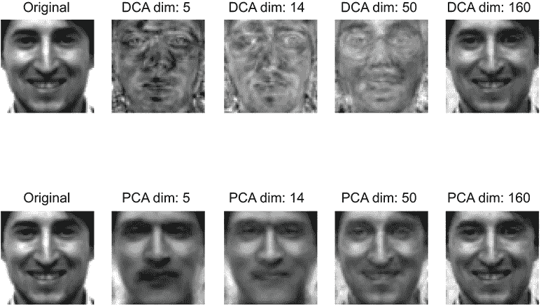

```
Experiment 2:
Principal and discriminant components were extracted.
...
...
```

如果你仔细查看输出中的重现图像，与原始图像相比，你会看到当降低维度时，很难识别这个人。例如，如果你比较原始图像和维度为 5（无论是 PCA 还是 DCA）的版本，从压缩图像中识别这个人相当困难。另一方面，当 dims = 160 时，你可以看到重建图像正在变得更好。这意味着我们通过减少维度来保护敏感数据的隐私。正如你所看到的，在这种情况下，DCA 对于 5 到 50 的维度比 PCA 表现得更好，使其接近原始图像，但仍难以识别。

### 9.3.2 效用任务的准确性

你现在知道，当维度减少时，隐私性会提高。但效用任务的准确性如何呢？如果我们无法为效用任务获得相当高的准确性，那么在这种情况下使用 CP 技术就没有意义了。

为了检查效用任务的准确性如何随着维度的减少而变化，我们可以简单地增加 ntests 变量的值到最大值（因为数据集中有 165 条记录，所以最大值是 165），并对每个维度的效用准确性结果进行平均。

图 9.3 总结了准确性结果。如果你仔细查看 DCA 的结果，你会注意到，当维度变为 14 时，其准确性在大约 91%左右饱和。现在看看维度为 14 的 DCA 的脸部图像。你会注意到，很难识别这个人，但图表显示，效用任务（在这种情况下是面部识别应用）的准确性仍然很高。这就是 CP 如何工作，确保隐私和效用之间的平衡。

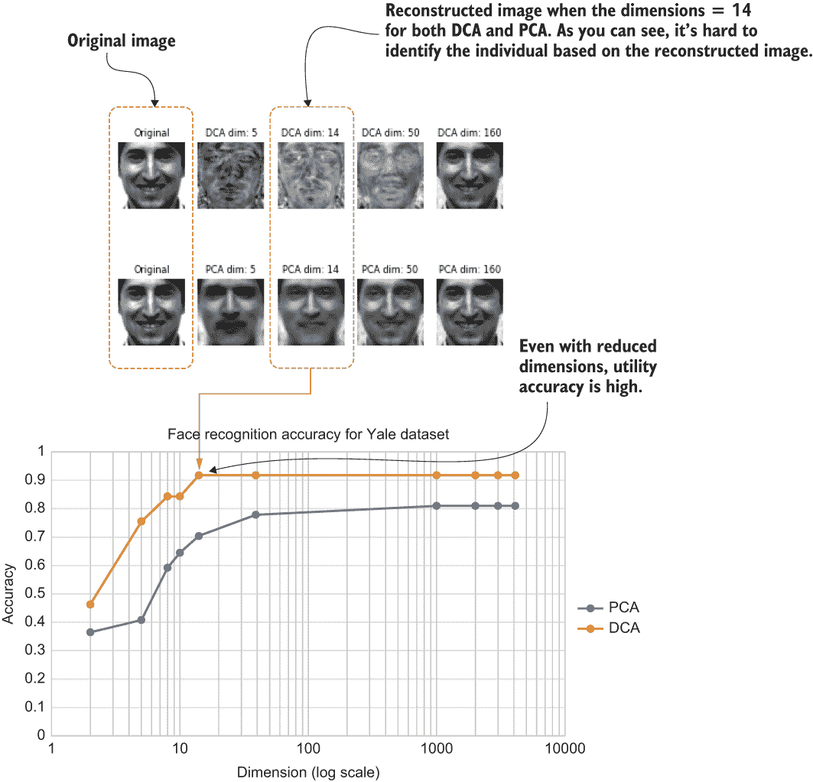

图 9.3 不同维度设置下重建图像准确性的比较

既然我们已经研究了效用函数的准确性，让我们看看其他人重建压缩图像有多困难。这可以通过重构误差来衡量。为了确定这一点，我们需要遍历整个数据集，而不仅仅是几条记录。因此，我们将稍微修改一下代码，如下所示。

列表 9.4 计算平均重构误差

```
import sys
sys.path.append('..');
import numpy as np
from discriminant_analysis import DCA, PCA

rho = 10; 
rho_p = -0.05;

dims = [2,5,8,10,14,39,1000,2000,3000,4096];

data_dir = './CompPrivacy/DataSet/Yale_Faces/';
X = np.loadtxt(data_dir+'Xyale.txt');
y = np.loadtxt(data_dir+'Yyale.txt');

reconErr_pca = np.zeros((len(dims)));
reconErr_dca = np.zeros((len(dims)));

mydca = DCA(rho,rho_p);
mypca = PCA();
mypca.fit(X);
mydca.fit(X,y);

D_pca = mypca.transform(X);                                            ❶
D_dca = mydca.transform(X); 
print('Principal and discriminant components were extracted.')

for j in range(len(dims)):
    Xrec = np.dot(D_pca[:,:dims[j]],mypca.components[:dims[j],:]);     ❷
    reconErr_pca[j] = sum(np.linalg.norm(X-Xrec,2,axis=1))/len(X);
    print('Average reconstruction error of %d-dimensional PCA: %f' 
              %(dims[j],reconErr_pca[j]));

    Xrec = mydca.inverse_transform(D_dca[:,:dims[j]],dim=dims[j]);     ❸
    reconErr_dca[j] = sum(np.linalg.norm(X-Xrec,2,axis=1))/len(X);
    print('Average reconstruction error of %d-dimensional DCA: %f' 
              %(dims[j],reconErr_dca[j]));

np.savetxt('reconErr_pca.out', reconErr_pca, delimiter=',')            ❹
np.savetxt('reconErr_dca.out', reconErr_dca, delimiter=',')
```

❶ 预计算所有组件。

❷ 测试 PCA 的重构误差。

❸ 测试 DCA 的重构误差。

❹ 将结果保存到文本文件中。

图 9.4 显示了列表 9.4 的结果与不同维度对比。如图所示，当维度较低时，其他人很难准确重建图像。例如，在维度 14 的 DCA 数据点具有很高的重构误差值，这使得其他人很难重建图像。然而，正如你之前看到的，它仍然为面部识别任务提供了良好的准确性。这就是使用 CP 技术应用于机器学习应用的整体思路。

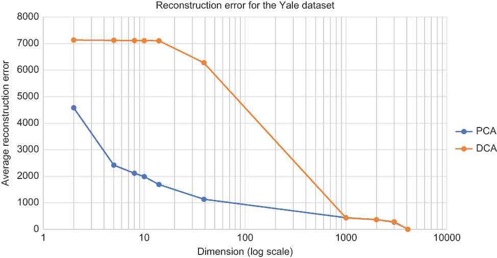

图 9.4 比较不同维度设置的平均重构误差

### 9.3.3 DCA 中 ρ' 对隐私和效用的影响

我们已经实验了如何通过降维来确定隐私。当维度数量较低时，损失的信息更多，从而提供更好的隐私。但在 DCA 中，我们还有一个参数 *ρ*。到目前为止，我们只改变了维度的数量，并将 *ρ* 保持为 rho_p = -0.05。现在我们将通过保持维度数量不变来观察这个参数在确定隐私水平方面的重要性。

以下列表几乎与列表 9.3 相同，只是现在我们将改变 rho_p 参数为不同的值：[-0.05, -0.01, -0.001, 0.0, 0.001, 0.01, 0.05]。我们将维度固定在 160（你也可以尝试不同的值）。

列表 9.5 在 DCA 中改变 *ρ* 并确定其对隐私的影响

```
import sys
sys.path.append('..');
import numpy as np
from discriminant_analysis import DCA
from matplotlib.pyplot import *
from random import randrange

def displayImage(vImage,height,width):
    mImage = np.reshape(vImage, (height,width)).T
    imshow(mImage, cmap='gray')
    axis('off')

height = 64
width = 64

rho = 10; 
rho_p = [-0.05,-0.01,-0.001,0.0,0.001,0.01,0.05]
selected_dim = 160
image_id = randrange(165)

data_dir = './CompPrivacy/DataSet/Yale_Faces/';
X = np.loadtxt(data_dir+'Xyale.txt');
y = np.loadtxt(data_dir+'Yyale.txt');

subplot(2,4,1)
title('Original',{'fontsize':8})
displayImage(X[image_id],height,width)

for j in range(len(rho_p)):    
    mydca = DCA(rho,rho_p[j]);   
    mydca.fit(X,y);
    D_dca = mydca.transform(X); 
    print('Discriminant components were extracted for rho_p: '+str(rho_p[j]))

    Xrec = mydca.inverse_transform(D_dca[:,:selected_dim],dim=selected_dim);
    eigV_dca = np.reshape(Xrec,(len(X),64,64))

    subplot(2,4,j+2)
    title('rho_p: ' + str(rho_p[j]),{'fontsize':8})
    displayImage(eigV_dca[image_id],height,width)

show()
```

结果显示在图 9.5 中。左上角的图像是原始图像，其余图像是用不同的 rho_p 值生成的。如图所示，当 rho_p 值从 -0.05 变化到 0.05 时，生成的图像发生了显著变化，难以识别。因此，我们可以推断出 *ρ* 也是在 DCA 使用时确定隐私水平的一个重要参数。如图所示，*ρ* 的正值比负值提供了更高的隐私水平。

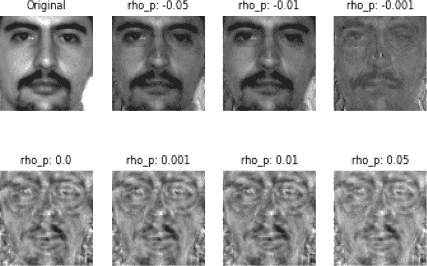

图 9.5 在耶鲁数据集上固定维度为 160 时 *ρ* 对隐私的影响

我们现在已经探讨了将 CP 技术集成到机器学习应用中的可能性。您已经看到，在最小数量的维度下，可以获得最大的面部识别准确率，同时重建图像的隐私性仍然得到保护。在下一节中，我们将通过一个关于水平分区数据隐私保护案例研究来进一步扩展讨论。

首先，这里有一些练习您可以探索，以了解*ρ*对提高准确性的影响，并尝试不同的数据集。

练习 1

您现在知道*ρ*的正值有助于提高隐私。那么，面部识别任务的准确性呢？*ρ*的正值是否也有助于提高准确性？更改列表 9.3 中的代码，观察每个不同的*ρ*值的有效性和平均重建误差。（提示：您可以通过添加另一个循环来实现，该循环遍历不同的 rho_p 值。）

解决方案：在面部识别任务的准确性方面，*ρ*的值没有显著影响。尝试绘制*ρ*与准确性的关系图，您将清楚地看到这一点。

练习 2

我们迄今为止探索的所有实验都是基于耶鲁数据集的。切换到奥利维蒂数据集，重新运行所有实验，看看观察到的模式和现象是否相似。（提示：这相当直接。您只需更改数据集名称和位置。）

解决方案：此解决方案在本书的源代码库中提供。

练习 3

现在将数据集更改为眼镜数据集。在这种情况下，请记住，应用程序的效用是确定一个人是否戴眼镜。隐私目标是图像的重建。更改代码，看看 PCA 和 DCA 在这里如何帮助。

解决方案：解决方案在本书的源代码库中提供。

## 9.4 案例研究：水平分区数据上的隐私保护 PCA 和 DCA

如您所知，机器学习（ML）可以分为两类不同的任务或类别：监督任务，如回归和分类，以及无监督任务，如聚类。在实践中，这些技术被广泛应用于许多不同的应用中，例如身份和访问管理、检测欺诈信用卡交易、构建临床决策支持系统等。这些应用在机器学习的训练和测试阶段通常会使用个人数据，例如医疗记录、财务数据等。

虽然有许多不同的方法，但降维（DR）是机器学习中的一个重要工具，可以用来克服不同类型的问题：

+   当特征维度远超过训练样本数量时的过拟合

+   由于搜索不优导致的性能下降

+   由于特征空间中的高维性导致的高计算成本和功耗

我们在本章中已经讨论了几种 DR 方法：PCA 和 DCA。

如您所回忆的那样，主成分分析（PCA）旨在将数据投影到具有最高方差的主成分上，从而在降低数据维度的同时保留大部分信息。如图 9.6（a）所示，大部分变异性都沿着第一个主成分（表示为 PC-1）发生。因此，将所有点投影到这个新轴上可以在不牺牲太多数据变异性的情况下降低维度。

与 PCA 相比，DCA 是为监督学习应用设计的。DCA 的目标不是可恢复性（如 PCA 用于减少重建误差），而是提高学习分类器的判别能力，以便它们可以有效地区分不同的类别。图 9.6（b）显示了一个监督学习问题的例子，其中 PCA 会选择 PC-1 作为数据投影的主成分，因为 PC-1 是最大变异性方向。相比之下，DCA 会选择 PC-2，因为它提供了最高的判别能力。

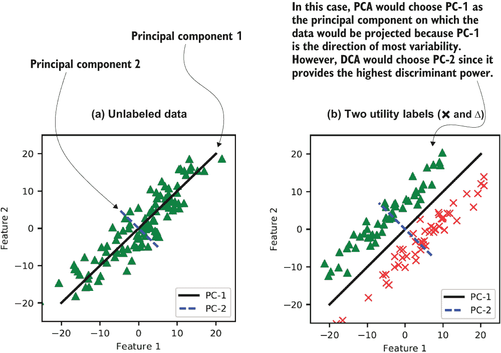

图 9.6 主成分分析（PCA）如何工作

传统上，PCA 和 DCA 是通过在集中位置收集数据来执行的，但在许多应用中（如连续认证[5]），数据分布在多个数据所有者之间。在这种情况下，协作学习是在由不同数据所有者持有的样本组成的联合数据集上进行的，其中每个样本包含相同的属性（特征）。这种数据被称为*水平分割*，因为数据以类似特征的行（列）表示，并且每个数据所有者在联合数据矩阵中持有不同的一组行。

在这种情况下，假设一个中心实体（数据用户）想要以隐私保护的方式使用分布在多个数据所有者之间的数据来计算 PCA（或 DCA）投影矩阵。然后，数据所有者可以使用投影矩阵来降低其数据的维度。这种降低维度的数据可以随后用作输入到特定的隐私保护机器学习算法中，这些算法执行分类或回归。

在本节的研究案例中，我们将探讨数据用户在计算 PCA 和 DCA 投影矩阵时不会损害数据所有者隐私的问题。在早期关于 PCA 的分布式机器学习研究中，根本未考虑隐私问题。后来，为 PCA 提出了不同的隐私保护方法[6]，但在实施时，它们要求所有数据所有者在协议执行期间保持在线，这并不太实用。在本案例研究中，我们将通过提出并实现一种使用 PCA 和 DCA 的隐私保护方法来解决这个问题。

与早期方法相比，我们即将探讨的协议不会泄露任何中间结果（例如散布矩阵），并且不需要数据所有者相互交互或提交他们的个人加密份额后保持在线。这种新的方法可以作为在应用其他隐私保护机器学习算法进行分类或回归之前，隐私保护数据预处理阶段的利用。因此，它确保在将机器学习算法应用于私有数据时既保护隐私又保持效用。

### 9.4.1 在水平分区数据上实现隐私保护

在我们深入了解细节之前，让我们快速浏览一下在这个案例研究中我们将关注的要点。为了便于分布式隐私保护主成分分析（或 DCA），需要以分布式方式计算散布矩阵。我们将使用加法同态加密来计算散布矩阵。

除了数据所有者（持有数据）和数据用户（旨在计算投影矩阵）之外，我们还将假设存在一个第三方实体，即加密服务提供商（CSP），它不会与数据用户串通。当数据所有者发送数据时，他们需要计算他们的个人份额，使用 CSP 的公钥进行同态加密，最后将这些份额发送给数据用户，数据用户将汇总这些份额。之后，CSP 可以构建一个执行从汇总份额中计算的散布矩阵的混淆电路（参见侧边栏中对混淆电路的讨论）。数据用户和 CSP 都无法以明文形式看到汇总份额，因此此解决方案中的数据交换协议不会泄露任何中间值，例如用户份额或散布矩阵。此外，这种方法不会给数据所有者带来与其他数据所有者互动的负担，并且不需要他们在发送加密份额后保持在线，这使得这些协议变得实用。

什么是混淆电路？

混淆电路（由安德鲁·姚提出）是一种加密计算的方法，使得它揭示了计算的输出，但不会揭示关于输入或任何中间状态或值的任何信息。其想法是使两个不信任的当事人能够安全地通信，并在他们的私有输入上执行计算，而不需要可信的第三方。

让我们通过一个简单的例子来探讨这个问题。假设爱丽丝有一个私有输入 *x*，鲍勃有一个私有输入 *y*。他们同意某个计算函数 *f*（称为电路），并且双方都想学习 *f*(*x*, *y*)，但不希望对方了解任何更多内容，例如中间值或对方的输入。他们将这样做：

+   双方需要就如何表达 *f* 达成一致。然后爱丽丝将电路 *f* 转换为其混淆版本，并将该混淆版本及其输入 x̂ 的混淆版本一起发送给鲍勃。

+   Bob 想要创建其输入ŷ的混乱版本，而不让 Alice 知道原始值*y*是什么。为此，他们使用了无意识传输（OT）技术。无意识传输是一种两方协议，发送者和接收者之间通过发送者向接收者传输一些信息，但发送者对接收者实际获得的信息保持无意识。

+   现在 Bob 已经拥有了混乱的电路以及该电路的混乱输入 x̂和ŷ，他可以评估混乱电路并学习*f*(*x*, *y*)，并将其向 Alice 揭示。因此，该协议揭示的不会超过*f*(*x*, *y*)。

### 9.4.2 回顾降维方法

在本章的后面部分，我们将使用我们之前讨论的降维（DR）技术以及其他增强隐私的技术，以实现 PCA 和 DCA 的隐私保护。让我们快速回顾一下我们讨论过的 DR 方法。

PCA 是一种常用于降低大型数据集维度的 DR 方法。其想法是将大量变量转换成较小的集合，同时仍然包含大部分大集合中的信息。在数据集中减少变量的数量自然会以精度为代价。然而，DR 技术以牺牲一点精度为代价，换取方法的简单性。由于较小的数据集更容易探索和可视化，并且因为它们使机器学习算法分析数据变得更容易更快，这些 DR 技术在其中发挥着至关重要的作用。

虽然 PCA 是一种无监督的 DR 技术（它不利用数据标签），但 DCA 是一种监督的 DR 方法。DCA 选择一个可以有效地区分不同类别的投影超平面。从高层次来看，这两种技术之间的关键区别在于 PCA 假设梯度之间存在线性关系，而 DCA 假设存在单峰关系。

除了 PCA 和 DCA 之外，许多其他 DR 技术依赖于本章开头讨论的两个不同步骤：计算散布矩阵和计算特征值。一般来说，这些 DR 方法可以根据所需的散布矩阵和需要解决的特征值问题来区分。例如，线性判别分析（LDA）是一种类似于 DCA 的方法（两者都是基于效用）。我们不会在这里深入细节，但主要区别在于 LDA 利用类内散布矩阵来求解特征值，而 DCA 使用类间散布矩阵。

虽然 DCA 和 LDA 是以效用驱动的 DR 技术，但另一类 DR 方法集中在效用-隐私优化问题上，如多类判别比（MDR）[4]。我们在本章开头探讨了 MDR 的细节。在高层上，MDR 旨在最大化效用分类问题（预期任务）的分离性，同时最小化隐私敏感分类问题（敏感任务）的分离性。它假设每个数据样本有两个标签：一个效用标签（用于数据的预期目的）和一个隐私标签（用于指定敏感信息的类型）。因此，我们可以获得两个类间散布矩阵：一个基于效用标签，另一个使用隐私标签计算。

### 9.4.3 使用加法同态加密

为了便于加密服务提供商（CSP）的功能，加法同态加密将成为我们协议中的基本构建块。在第 3.4.1 节中，我们讨论了同态加密。正如你所知，存在多种语义安全的加法同态加密方案。我们将探讨 Paillier 密码系统[7]如何作为此类加密方案的一个示例。假设函数*E*[pk][∙]是一个由公钥*pk*索引的加密操作，并且假设*D[sk]*[∙]是一个由私钥*sk*索引的解密操作。加法同态加密可以表示为*E*[pk][*a* + *b*] = *E*[pk][*a*] ⊗ *E*[pk][*b*]，其中⊗是加密域中的模乘运算符。此外，通过*E*[pk][*a*]^b = *E*[pk][*a* ∙ *b*]可以实现标量乘法。如果你对 Paillier 密码系统的更多细节感兴趣，可以参考原始论文。你需要理解同态加密方案的基本功能，因为我们将在下一节中使用它。

这种加密方案仅接受整数作为明文，但在大多数用例中，当你实现机器学习（ML）应用时，你会处理实数值。在处理 ML 时，典型的方法是将数据（特征值）离散化以获得整数值。

### 9.4.4 提出方法概述

在这项研究中，我们将考虑跨多个数据所有者的水平分区数据的情况。系统架构如图 9.7 所示。假设有*N*个数据所有者，其中每个数据所有者*n*持有一组特征向量*Xi*^i ∈ ℝ^(k×M)，其中*M*是特征数（维度）且*i* = 1, ..., *k*。在这里，*k*是特征向量的总数。因此，每个数据所有者*n*将有一个数据矩阵，使得*X*^n ∈ ℝ^(k×M)。此外，在监督学习中，每个样本*x*都有一个标签*y*，表示它属于某一类。

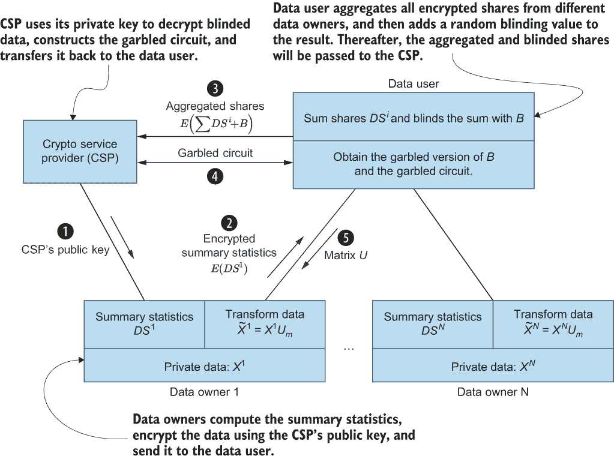

图 9.7 系统架构及其工作原理

在这个系统中，数据用户希望利用数据并从数据中计算 PCA（或 DCA）投影矩阵，这些数据在多个数据所有者之间水平划分。有许多实际应用属于这种数据共享模型。例如，在持续认证（CA）应用中，CA 服务器需要使用机器学习算法（包括 PCA 等 DR 技术）为注册用户群体构建认证配置文件。因此，CA 服务器（数据用户）需要使用分布（水平）在所有注册用户（数据所有者）之间的数据进行 PCA（或 DCA）投影矩阵的计算。

我们将在稍后详细了解每个步骤的细节，但让我们假设有两个数据所有者，Alice 和 Bob，他们希望为了协作机器学习任务共享他们的私有数据。在这种情况下，机器学习任务将是数据用户。从隐私的角度来看，最重要的关注点是任何计算方，如数据用户或 CSP，都不应了解 Alice 或 Bob 的任何输入数据或任何中间值的明文格式。这就是为什么我们需要首先加密数据的原因。但是，当数据被加密时，机器学习算法如何学习任何东西呢？这就是同态性质发挥作用的地方，它允许你在加密数据的情况下仍然执行某些计算，如加法或减法。

传统上，主成分分析（PCA）和分解浓度分析（DCA）仅用于联合数据集（由多个数据所有者贡献的数据）的集中位置，但计算投影矩阵 *U* 需要数据所有者透露他们的数据。在本案例研究中，我们将修改投影矩阵的计算方法，使其分布式且保护隐私。为了便于这种隐私保护计算，我们将利用第三方（加密服务提供商），该第三方将与数据用户进行相对简短的单一回合信息交换，以计算投影矩阵。然后，数据所有者可以使用投影矩阵来降低他们数据的维度。这种降低维度的数据可以后来用作输入，供某些执行分类或回归的隐私保护机器学习（ML）算法使用。

在设计安全架构时，识别可能对我们正在开发的解决方案造成潜在危害或脆弱性的威胁非常重要。因此，让我们快速回顾一下我们可能面临的威胁类型，以便我们可以在我们的解决方案中减轻它们。我们协议的主要隐私要求是使数据所有者能够保护其数据的隐私。我们将考虑对手为计算方：数据用户和加密服务提供商（CSP）。这些方中的任何一方都不应能够访问任何数据所有者的输入数据或任何中间值（例如数据所有者份额或散布矩阵）的明文格式。数据用户应仅了解 PCA 或 DCA 投影矩阵的输出和特征值。

CSP 的主要角色是促进散布矩阵的隐私保护计算。为此，假设 CSP 是一个独立的第三方，不与数据用户勾结。例如，数据用户和 CSP 可能是不同的公司，它们不会勾结，至少为了维护它们的声誉和客户群。此外，我们假设所有参与者都是诚实但好奇的（这是半诚实对抗模型）。这意味着所有方都将正确遵循协议规范，但他们可能会好奇并试图使用协议记录来提取新信息。因此，数据用户和 CSP 都被视为半诚实、非勾结，但其他方面不受信任的服务器。我们还将讨论可以解释数据用户与数据所有者子集勾结以获取有关单个数据所有者的私人信息的扩展。

假设数据所有者、数据用户和 CSP 之间的所有通信都是通过使用 SSL/TLS、数字证书和签名等已知方法在安全通道上进行的。

### 9.4.5 隐私保护计算的工作原理

现在我们已经涵盖了所有必要的背景信息，让我们继续进行散布矩阵和 PCA 或 DCA 投影矩阵的隐私保护计算。我们假设有*N*个数据所有者愿意与某个数据用户合作来计算散布矩阵。

隐私保护 PCA

PCA 的第一步是以分布式方式计算散布矩阵的总和。假设总散布矩阵是，并且它可以以迭代方式计算。我们有*N*个数据所有者，每个数据所有者*n*携带一组训练样本，我们将这些样本表示为*P*^n。每个数据所有者计算一组值，我们将这些值称为*本地份额*，如下面的方程所示：

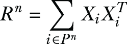

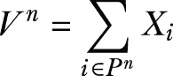

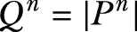

散布矩阵的总和可以通过将每个参与方的部分贡献相加得到，如下所示，

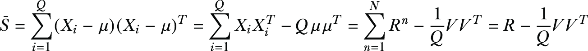

其中

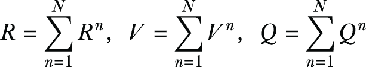

重要的是，数据所有者不应该以明文形式将他们的本地份额发送给数据用户，因为这些份额包含了他们数据的统计摘要。本地份额可以使用加法同态加密方案（如 Paillier 密码系统）进行加密，其中 CSP 提供公钥。

在接收到这些加密份额后，数据使用者可以将它们聚合起来计算加密的中间值（即 *R*、*V* 和 *Q*），在盲化这些值后发送给 CSP 进行解密。然后，数据使用者可以使用这些聚合值通过使用混淆电路和无意识传输来计算散点矩阵和 PCA 投影矩阵。在这里，“盲化”指的是向加密值添加随机数，以防止 CSP 在聚合形式中了解任何关于数据的信息。（这些值使用一次性密码的等效物进行盲化。）

让我们一步一步地看看这个协议是如何工作的，以确保在保持 PCA 的同时保护隐私：

1.  *设置用户*—在设置过程中，CSP 根据数据所有者和数据使用者的请求，向数据所有者和数据使用者发送 Paillier 密码系统的公钥 *pk*。这一步也可能包括数据所有者向 CSP 的官方注册。

1.  *计算本地份额*—每个数据所有者 *n* 将使用我们之前讨论的方程计算其自己的份额 *DS*^n = {*R*^n, *V*^n, *Q*^n}。在将所有值离散化以获得整数值后，数据所有者将使用 CSP 的公钥加密 *R*^n、*V*^n 和 *Q*^n，以获得 *E*[pk][*DS*^n] = {*E*[pk][*R*^n], *E*[pk][*V*^n], *E*[pk][*Q*^n]}。最后，每个数据所有者将 *E*[pk][*DS*^n] 发送给数据使用者。

1.  *聚合本地份额*—数据使用者从每个数据所有者那里接收 *E*[pk][*DS*^n] = {*E*[pk][*R*^n], *E*[pk][*V*^n], *E*[pk][*Q*^n]}，并继续计算 *R*、*V* 和 *Q* 的加密。更具体地说，数据使用者能够从加密的数据所有者份额中计算出 *E*[pk][*R*]，*E*[pk][*V*]，和 *E*[pk][*Q*]，如下所示：

    

    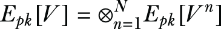

    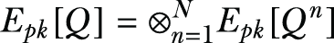

    数据使用者将这些聚合值添加一些随机整数以掩盖它们，从而获得盲化的聚合份额 *E*[pk][*R'*]，*E*[pk][*V'*]，和 *E*[pk][*Q'*]，这些可以发送给 CSP 进行解密。

1.  *使用混淆电路进行特征值分解（EVD）*：

    1.  一旦从数据使用者那里收到盲化的聚合份额，CSP 将使用其私钥解密它们，*E*[pk][*R'*]，*E*[pk][*V'*]，和 *E*[pk][*Q'*]。由于 CSP 不知道数据使用者添加的随机值，因此 CSP 无法了解原始的聚合值。

    1.  CSP 将构建一个混淆电路，对从聚合份额计算出的散点矩阵执行特征值分解（EVD）。这个混淆电路的输入是 CSP 解密后的盲化聚合份额的混淆版本以及由数据使用者生成并持有的盲化值。

    1.  由于 CSP 构建了混淆电路，它可以自己获得其输入的混淆版本。然而，数据用户需要通过不可知传输与 CSP 交互，以获得其输入的混淆版本：盲化值。使用不可知传输，我们可以保证 CSP 不会学习到数据用户持有的盲化值。

    1.  CSP 构建的混淆电路接收两个混淆输入，并从份额 *R'*, *V'*, 和 *Q'* 中减去数据用户在之前步骤中添加的盲化值，从而计算出散布矩阵。CSP 随后通过在散布矩阵上执行特征分解来获得 PCA 投影矩阵。

    1.  数据用户将接收到的混淆电路作为其评估器。这个混淆电路已经包含了 CSP 的混淆输入（解密和盲化的聚合份额），并且数据用户通过不可知传输获得了盲化值的混淆版本。

    1.  最后，数据用户执行混淆电路，并获取投影矩阵和特征值作为输出。

这就是隐私保护 PCA 如何在实际应用中实现和计算的方法。我们将在本章后面讨论这种方法的有效性。现在让我们看看隐私保护 DCA 是如何工作的。

隐私保护 dca

正如我们在第 9.2 节中讨论的那样，DCA 计算需要计算总散布矩阵  和信号矩阵 *S*[B]。此外，一些其他的 DCA 公式还使用称为 *噪声* 矩阵 *S*[W]。我们首先简要概述 *S*[B] 和 *S*[W] 的分布式计算，然后我们将继续介绍协议实现细节。

*S*[B] 和 *S*[W] 的计算可能因数据所有者是否拥有属于单个类别的数据而不同。例如，考虑一个垃圾邮件检测应用，其中每个数据所有者都有垃圾邮件和非垃圾邮件。这种情况代表两个类别（垃圾邮件和非垃圾邮件），它是多类别数据所有者（MCDO）的一个例子。另一方面，有时每个数据所有者代表一个类别，如在连续认证系统中。在这种情况下，所有他们的数据都会有相同的标签。这是一个单类别数据所有者（SCDO）的例子。

我们将首先回顾计算散布矩阵 *S*[B] 和 *S*[W] 的方程，然后我们将介绍执行隐私保护 DCA 计算的协议。假设每个样本 *X*[i] 有一个标签 *y*[i]，表示它属于 *K* 个类别 *C*[1]，*C*[2]，...，*C*[k] 中的一个。我们将用 *μ* 表示类别 *C*[k] 中训练样本的均值向量，用 *M*[k] 表示类别 *C*[k] 中的样本数量。有了这些，噪声矩阵 *S*[W] 可以按以下方式计算，

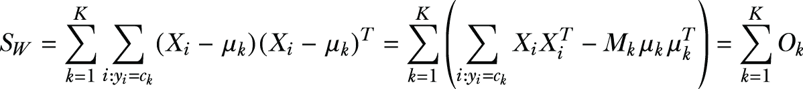

其中矩阵 *O*[k] 代表与类别 *k* 相关的份额。由于每个数据所有者 *n* 映射到单个类别 *k*（在 SCDO 情况下），我们可以写出 *O*[k] = *O*^n 并有 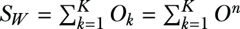。

对于多类别数据所有者（MCDO）的情况，每个数据所有者 *n* 将持有属于不同类别的数据。我们将 P^n[k] 表示为数据所有者 *n* 持有的属于类别 *k* 的训练样本集合。对于每个类别 *k*，数据所有者可以在本地计算

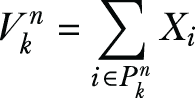

此外，M^n[k] 可以计算为 M^n[k] = |P^n[k]|，数据所有者也会像 PCA 一样计算 *R*^n，因为它不受特定类别的限制。现在，*S*[W] 可以根据数据所有者的部分贡献安排如下，

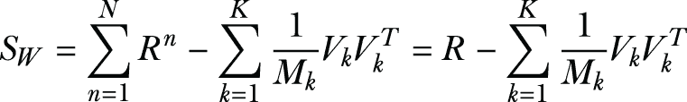

其中

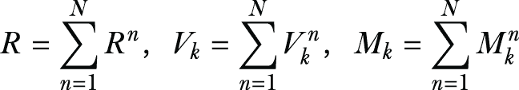

现在，让我们看看我们如何计算信号矩阵 *S*[B]。单类别（SCDO）和多类别（MCDO）的计算方式相同。此外，信号矩阵可以直接从前面方程中描述的聚合数据（*V*[k]，*M*[k]，*V*，*M*）计算如下：

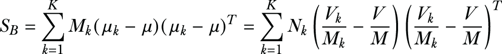

与散点矩阵不同，噪声矩阵和信号矩阵在计算中都使用类别平均值。这将需要数据所有者向数据使用者发送每个类别的份额。如果一个数据所有者只发送与数据所有者拥有的类别相关的份额，这将泄露哪些类别属于哪个数据所有者的知识。因此，建议所有数据所有者发送代表所有类别的份额，当一个数据所有者不拥有某些类别的数据时，他们可以将该类份额设置为全零。

让我们一步一步地看看隐私保护 DCA 协议是如何工作的：

1.  *设置用户*—这一步与我们为 PCA 所做的工作非常相似。CSP 根据数据所有者和数据使用者的请求，向他们发送 Paillier 密码系统的公钥 *pk*。

1.  *计算局部份额*—每个数据所有者 *n* 从其数据中计算 *R*^n，对于每个标记为 *k* 的类别，数据所有者计算 V^n[k] 和 M^n[k]。如前所述，如果一个数据所有者没有与类别 *k* 相关的样本，他们仍然会生成 V^n[k] 和 M^n[k]，但将它们设置为零。在离散化和获得整数值后，数据所有者将使用 CSP 的公钥加密 *R*^n 以获得 *E*[pk][*R*^n]，并且还会加密基于类别的份额（V^n[k] 和 M^n[k]），为每个类别 *k* 获得如下：{*k*，*E*[pk][V^n[k]]，*E*[pk][M^n[k]]}。最后，数据所有者将发送他们自己的加密份额 *DS* n 到数据使用者。

1.  *聚合本地份额*——从每个数据所有者那里，数据用户接收 *DS*^n，其中包含 *E*[pk][*R*^n]，并且对于每个类别 *k*，它还包括 {*k*, *E*[pk][V^n[k]], *E*[pk][M^n[k]]}。数据用户随后继续重建 *R* 的加密、*V*[k] 的值和 *M*[k] 的值，如下所示：

    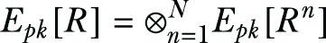

    对于每个类别 *k* ∈ 1, ..., *K*，数据用户计算

    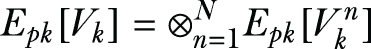

    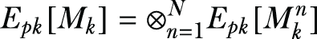

    此后，数据用户将这些聚合值添加一些随机整数以掩盖它们，从而获得盲化份额 *E*[pk][*R'*] 以及 *E*[pk] 和 *E*[pk] 的值。然后，这些盲值被发送到 CSP。

1.  *执行广义特征值分解（GEVD）*：

    1.  CSP 将使用其私钥解密从数据用户那里接收到的盲化份额 *E*[pk][*R'*] 以及 *E*[pk][*V’*[k]] 和 *E*[pk][*M’*[k]] 的值。在不了解数据用户添加的随机值的情况下，CSP 无法学习到聚合值。

    1.  然后，CSP 将构建一个混淆电路，对从聚合份额计算出的信号和总散布矩阵执行 GEVD。这个混淆电路的输入是 CSP 解密后的盲化聚合份额的混淆版本以及数据用户生成并持有的盲值。

    1.  正如我们在 PCA 案例中讨论的那样，由于 CSP 构建了混淆电路，它可以自己获得其输入的混淆版本。然而，数据用户需要通过盲传输与 CSP 交互，以获得其输入的混淆版本：盲值。这种盲传输保证 CSP 不会学习到数据用户持有的盲值。

    1.  CSP 构建的混淆电路接受两个混淆输入，并从聚合份额中移除盲值，并使用份额 *V'*[k] 和 *M'*[k] 来计算 *V* 和 *M*。然后，它计算总散布矩阵 ，以及信号矩阵 *S*[B]，最后，它执行广义特征值分解来计算 DCA 投影矩阵。

    1.  数据用户将接收到混淆电路作为其评估器。我们知道这个混淆电路已经包含了 CSP 的混淆输入（解密并盲化的聚合份额），因此他们通过盲传输获得盲值的混淆版本。

    1.  最后，数据用户执行混淆电路，并获得投影矩阵和特征值作为输出。

这就是如何在您的应用程序和用例中实现隐私保护 DCA。

什么是广义特征值分解（GEVD）？

给定矩阵 *A* 和 *B*，GEVD 的目标是找到满足方程 *Au* = *λBu* 的特征值（称为 *λ*）和特征向量（称为 *u*）。

您可能会考虑将这个问题简化为常规的 EVD，通过计算 *B* 的逆并尝试解 *B*^((-1))*Au* = *λu*。然而，*B*^((-1))*A* 并不总是保证是一个对称矩阵。散布矩阵的一个重要特性是它们是对称的。对称矩阵的特征值总是实数，这使得我们可以有一个更简单的幂方法实现，该方法不涉及复数。

您现在已经了解了如何使用加密份额转换数据以及如何执行特征值分解以在具有隐私性的 ML 任务中与 PCA 和 DCA 一起工作的方程。在下一节中，我们将评估这些不同方法的效率和准确性。

### 9.4.6 评估隐私保护 PCA 和 DCA 的效率和准确性

到目前为止，在本章中，我们已经讨论了理论背景以及在不同现实世界的 ML 应用中实现 CP（尤其是 PCA 和 DCA）的不同方法。在这里，我们将评估本案例研究前几节（尤其是 9.4.4 节）中讨论的实现方法的效率和准确性。正如我们已经讨论过的，当我们将隐私整合到我们的 ML 任务中时，保持隐私和效用之间的平衡是很重要的。因此，我们将评估这一点，看看所提出的方案对于实际的 ML 应用有多有效。

在本案例研究中，我们用于实验的数据集来自 UCI 机器学习仓库[8]。虽然 PCA 和 DCA 适用于任何类型的 ML 算法，但我们选择了分类，因为可用的分类数据集数量（255 个）远远超过了聚类或回归（每个大约 55 个）。此外，由于所提出的协议的效率取决于数据维度（特征的数量），我们选择了具有不同特征数量的数据集：8-50 个。表 9.1 和 9.2 总结了每个数据集的特征和类别数量。SVM 被用作这些评估的分类任务，并且所有情况下数据所有者的数量都设置为 10。

分析效率

表 9.1 和 9.2 显示了使用 Paillier 密钥长度为 1,024 位在不同数据集上执行隐私保护 PCA 和 DCA 的计时数据。您可以尝试使用不同的密钥长度来查看它将如何影响性能——您会发现当密钥长度更长时，性能会受到不利影响。

对于数据所有者，平均时间成本指的是数据所有者计算各个份额并对其进行加密所花费的总时间。对于数据使用者，平均时间成本代表从每个数据所有者收集每个份额并添加到当前这些份额总和（在加密域中）所需的时间。

表格还显示了 CSP 解密从数据用户接收到的盲化聚合值所需的时间。最后，它们显示了使用混淆电路运行特征值分解以计算 PCA 或 DCA 投影矩阵所需的时间。括号中的值指的是使用混淆电路生成的主成分数量。当然，减少这个数量将减少给定数据集的计算时间。正如我们将在下一节讨论的，即使是 SensIT Vehicle（声学）数据集的 15 个主成分也足以达到足够的准确性。

最后，你会注意到增加数据的维度将增加协议所有阶段的计算时间，尤其是特征值分解。

表 9.1 分布式 PCA 的效率

| 数据集 | 特征 | 类别 | 数据所有者平均时间成本（秒） | 数据用户平均时间成本（毫秒） | CSP 解密时间（秒） | 使用混淆电路进行特征值分解 |
| --- | --- | --- | --- | --- | --- | --- |
| 糖尿病 | 8 | 2 | 0.63 | 10 | 0.67 | 13.8 sec (8) |
| 乳腺癌 | 10 | 2 | 0.93 | 11 | 1.0 | 20.7 sec (8) |
| 澳大利亚 | 14 | 2 | 1.7 | 12 | 1.8 | 37.4 sec (8) |
| 德国 | 24 | 2 | 5.0 | 17 | 5.0 | 3.28 min (15) |
| 电离层 | 34 | 2 | 9.8 | 24 | 9.9 | 6.44 min (15) |
| SensIT Vehicle（声学） | 50 | 3 | 22.5 | 40 | 22.7 | 13.8 min (15) |

表 9.2 分布式 DCA 的效率

| 数据集 | 特征 | 类别 | 数据所有者平均时间成本（秒） | 数据用户平均时间成本（毫秒） | CSP 解密时间（秒） | 使用混淆电路进行特征值分解 |
| --- | --- | --- | --- | --- | --- | --- |
| 糖尿病 | 8 | 2 | 0.7 | 12 | 0.8 | 4.0 sec (1) |
| 乳腺癌 | 10 | 2 | 1.2 | 13 | 1.3 | 5.8 sec (1) |
| 澳大利亚 | 14 | 2 | 2.1 | 15 | 2.2 | 12.1 sec (1) |
| 德国 | 24 | 2 | 5.6 | 22 | 5.8 | 46.6 sec (1) |
| 电离层 | 34 | 2 | 11.2 | 29 | 11.6 | 1.9 min (1) |
| SensIT Vehicle（声学） | 50 | 3 | 26.2 | 48 | 26.9 | 6.7 min (2) |

分析 ml 任务的准确性

图 9.8 和表 9.3 总结了执行实验以测试在隐私保护协议使用后分类任务准确性的结果，与使用 Python 库 NumPy 获得的结果进行了比较。

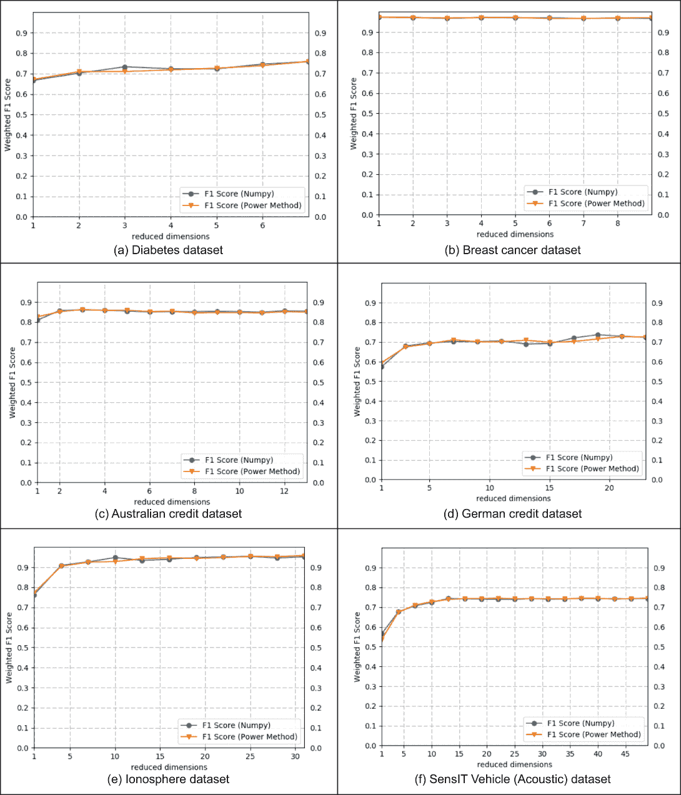

图 9.8 隐私保护 PCA 准确性

我们在这里使用加权 F1 分数来测试分类器的准确性。F1 分数可以被视为精确度和召回率分数的加权平均值；当 F1 分数为 1 时，分类器处于最佳状态，而当分数为 0 时，处于最差状态。F1 分数是 ML 应用中用于比较两个分类器性能的主要指标之一。有关 F1 分数如何工作的更多信息，请参阅第 3.4.3 节。

作为提醒，以下是计算 F1 分数的方法：

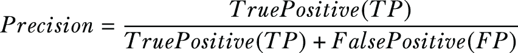


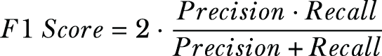

DCA 的结果显示在表 9.3 中，每个值只有一个，因为 DCA 将数据投影到*K* - 1 个维度（其中*K*是类别标签的数量），而 PCA 将数据投影到可变数量的维度。正如您所看到的，这些协议是正确的，并且它们的结果与使用 NumPy 获得的结果相同。需要注意的是，加权 F1 分数的轻微波动主要是由于 SVM 参数选择造成的。然而，两种方法的准确性几乎相同。

表 9.3 隐私保护 DCA 准确性

| 数据集 | F1 分数 %(使用所提出的方法) | F1 分数 %(使用 NumPy 库) |
| --- | --- | --- |
| 糖尿病 | 76.5 | 76.4 |
| 乳腺癌 | 96.9 | 96.8 |
| 澳大利亚 | 86.1 | 85.5 |
| 德国 | 72.7 | 73.8 |
| 电离层 | 84.3 | 83.4 |
| SensIT Vehicle (Acoustic) | 67.8 | 68.4 |

在本案例研究中，我们讨论了如何在水平划分的数据上实现机器学习（尤其是 PCA 和 DCA）的隐私保护协议，这些数据分布在多个数据所有者之间。从结果来看，这种方法是高效的，它既保持了数据用户的效用，又保护了数据所有者数据的隐私。

## 摘要

+   基于 DP 的隐私保护技术的主要问题是，它们通常会给私有数据添加过多的噪声，导致不可避免地降低效用。

+   压缩隐私是一种替代方法（与 DP 相比），可以在许多实际应用中用于隐私保护，而不会在效用任务中造成重大损失。

+   压缩隐私本质上通过压缩和 DR 技术将数据投影到低维超平面，从而扰动数据，使得数据可以在不影响隐私的情况下被恢复。

+   不同的压缩隐私机制适用于不同的应用，但对于机器学习和数据挖掘任务，PCA、DCA 和 MDR 是一些流行的方法。

+   压缩隐私技术，如 PCA 和 DCA，也可以在分布式环境中使用，以实现机器学习的隐私保护协议。
