# 10 整合所有要素：设计一个隐私增强平台（DataHub）

本章涵盖

+   针对协作工作的隐私增强平台要求

+   研究协作工作空间的不同组件

+   现实世界应用中的隐私和安全要求

+   在研究数据保护和共享平台上整合隐私和安全技术

在前面的章节中，我们探讨了服务于不同目的的隐私增强技术。例如，在第二章和第三章中，我们探讨了差分隐私（DP），它涉及向数据查询结果添加噪声，以确保个人的隐私，同时不影响数据的原始属性。在第四章和第五章中，我们研究了局部差分隐私（LDP），它是一种局部设置，利用本地部署的数据聚合器。本质上，LDP 消除了我们在原始 DP 技术中使用的可信数据管理员。然后，在第六章中，我们讨论了合成数据生成技术，这些技术可以替代上述隐私技术。在第七章和第八章中，我们探讨了在数据库应用中存储数据并在不同的数据挖掘任务中发布数据时保护数据隐私的问题。最后，在第九章中，我们向您介绍了不同的压缩隐私（CP）策略，这些策略将数据投影到低维空间。我们还讨论了使用 CP 方法的好处，特别是对于机器学习（ML）算法。

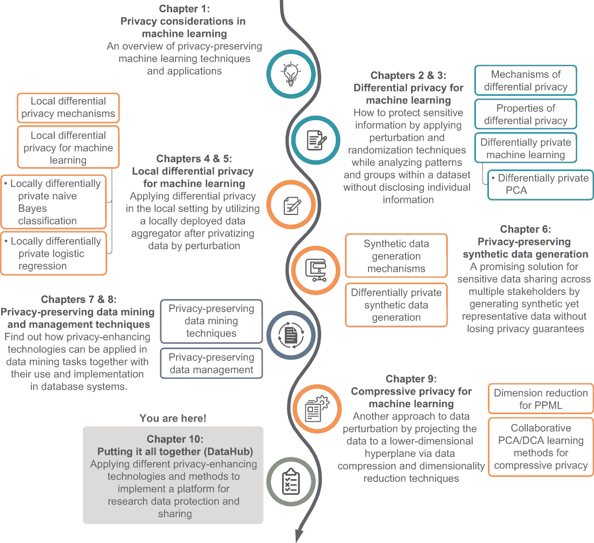

现在我们已经到达这本书的最后一章。在这里，我们将向您展示如何将隐私增强技术和方法应用于实现一个现实世界的应用，一个研究数据保护和共享平台——我们将称之为*DataHub*。在本章中，我们将探讨这个假设系统的功能和特性。我们的目标是向您展示一个实际应用的设计过程，其中隐私和安全增强技术发挥着至关重要的作用。

## 10.1 研究数据保护和共享平台的重要性

在许多应用场景中，需要将隐私增强技术应用于现实世界的应用，以保护个人的隐私。例如，正如我们在前面的章节中讨论的那样，从电子商务或银行应用中收集的私人数据，如年龄、性别、邮编、支付模式等，需要得到保护，以便其他方无法追踪回原始用户。

类似地，在医疗保健应用中，你必须确保所有必要的隐私保护。患者记录和药物详情不得泄露，即使在研究目的下，也必须在患者同意的情况下。在这种情况下，当利用这种私有信息进行诸如研究之类的目的时，最佳方法是应用某种隐私增强机制并扰动原始数据。但哪种机制最有效？我们能否在所有不同的用例中使用任何机制？本章将通过将不同的机制组合到一个协作任务中来回答这些问题。

让我们考虑一个场景，其中不同的医疗机构独立地寻找特定疾病（如皮肤癌）的治愈方法。每个机构都与其患者紧密合作，以开发高级研究项目。假设他们正在使用机器学习算法，根据皮肤镜图像对皮肤癌进行分类，以帮助研究过程。然而，如果他们不是各自独立工作，而是协作以提高机器学习模型的准确性，那会怎样。不同的机构可以贡献不同类型的数据，这提供了更多样化的数据集，从而提高了准确性。

然而，正如你所知，专门为研究目的收集的人类受试者数据必须得到安全维护，通常由于隐私问题不能与其他方共享。这就是隐私增强技术发挥作用的地方。由于这是一个协作努力，我们必须选择最合适的技术来确保数据隐私保证。

本章将探讨我们如何允许不同的利益相关者进行协作（在这种情况下，各种医疗机构）。我们将设计一个端到端平台，使用一系列增强安全和隐私的技术来保护和共享研究数据。我们的想法是展示如何将我们在前几章中讨论的技术应用于现实世界场景。我们的用例将是 DataHub——研究数据保护和共享平台。

### 10.1.1 DataHub 平台背后的动机

来自不同机构、组织或国家的研究人员共同合作，以实现一个共同的科学目标。他们通常从各种来源收集大量数据，并对其进行分析，以回答具体的研究问题。例如，假设一个癌症研究所正在进行预防和治疗间皮瘤的研究，这是一种在美国人群中很少见的癌症类型。由于这是一种罕见的癌症类型，该研究所提供的间皮瘤患者数据非常有限。因此，该研究所的研究人员需要从其他癌症研究所获取更多患者数据，但其他研究所可能不愿意分享患者数据，因为隐私政策。在协作研究中，从多个数据所有者聚合私有数据是一个重大问题。

让我们考虑另一个场景。假设一位研究人员正在调查个人的政治态度。研究人员可能进行传统的面对面调查或使用在线调查工具，但在任何情况下，研究人员都会获得包含个人隐私信息的原始数据。这种原始数据容易受到滥用，正如我们在第一章中简要讨论的 Facebook-Cambridge Analytica 数据丑闻所示——剑桥分析公司收集的数据被用来试图影响选民的观点。因此，对允许数据共享和聚合同时保护安全和隐私的系统需求日益增加。

本章的 DataHub 是一个假设的系统，它将实现这些目标。在这样的系统中，我们需要提供数据存储的安全性、消除数据滥用，并维护研究过程的完整性。由于人类是许多研究领域（如医学、生物学、心理学、人类学和社会学）的研究对象，因此，对于使用包含个人信息的数据的研究人员来说，保护个人隐私是一个基本要求。我们将设计的 DataHub 平台将通过为分析来自多个数据所有者的聚合数据提供隐私保护机制来解决这个问题。此外，这个平台将包含进行隐私保护调查的工具，这些工具从个人收集扰动数据，并保证隐私。本质上，我们可以通过这些隐私保证来提高调查参与度并消除隐私泄露。

### 10.1.2 DataHub 的重要特性

对于这个应用，将会有许多不同的利益相关者——数据所有者、数据使用者、算法提供商等等——因此，需要通过数据或技术贡献和共享来促进平台用户之间的协作，并指定由数据所有者设定的隐私访问控制。

让我们来看看这种应用所需的关键特性：

+   *确保数据保护*。收集的数据需要通过安全和隐私增强技术进行保护。通过数据存储和检索过程中的数据加密/解密和完整性检查可以确保安全性。完整性验证可以保证数据不会被无意或恶意地更改。通过使用我们在前几章讨论的隐私保护技术，包括合成数据生成和隐私保护机器学习，可以扰动数据或分析结果来确保隐私。

+   *允许应用程序扩展*。一旦部署，系统应利用云计算和数据库系统中新兴的分布式数据处理技术的进步，随着数据和应用程序需求的增长来扩展计算。安全性和隐私技术应通过在虚拟机（VMs）上部署的数据保护作为服务来实现。随着数据和用户数量的增加，可以动态部署更多虚拟机资源。

+   *启用利益相关者的协作和参与*。平台应通过至少四个角色促进协作：数据所有者、数据提供者、数据用户和算法提供者。除了研究数据外，还可以收集和共享跨机构的数据分析和保护算法。可以通过不同的基于角色的访问控制机制启用对数据和算法的访问。

即使在数据保护和共享的背景下，也有许多不同的应用用例。我们已经提到了两个：一个用于跨多个协作机构的数据聚合的应用程序，以及一个在线调查工具，用于促进数据收集过程。可能还有许多其他用例，涉及存储、分析、收集和共享研究数据。

如果你想知道是否有任何类似这种的既定解决方案，答案是肯定的。例如，BIOVIA ScienceCloud ([www.sciencecloud.com](https://www.sciencecloud.com)) 是一个基于云的基础设施，它能够提供研究协作的解决方案。HUBzero ([`hubzero.org`](https://hubzero.org)) 是另一个开源软件平台，用于托管分析工具、发布数据、共享资源、协作和建立社区。开放科学数据云（OSDC；www.opensciencedatacloud.org）是另一个促进存储、共享和分析千兆和太字节规模科学数据集的云平台。然而，现有的解决方案中没有任何一个允许隐私保护查询或分析来自多个来源的保护数据，这正是我们所寻找的。此外，它们中没有一个提供进行隐私保护调查的工具，这是从个人收集信息的基本方式，尤其是在社会科学领域。这种缺乏隐私保护技术意味着当前的平台不足以支持研究协作。我们将通过提供一个安全、共享的工作空间来填补这一空白，在这个工作空间中，多个组织和科学研究社区可以共同在云基础系统上工作，这个系统在一个屋檐下满足科学社区的所有需求，并确保隐私安全。

## 10.2 理解研究协作工作空间

我们现在将详细阐述研究协作工作空间的设计。DataHub 将促进平台上的四个不同用户群体：数据所有者、数据提供者、数据用户和算法提供者，如图 10.1 所示。这些不同的用户可以通过基于角色的访问控制机制进行配置。平台用户也可能在系统中拥有多个角色。例如，数据所有者可能希望利用其他数据所有者的数据。在这种情况下，数据所有者可以作为数据用户运行隐私保护算法。

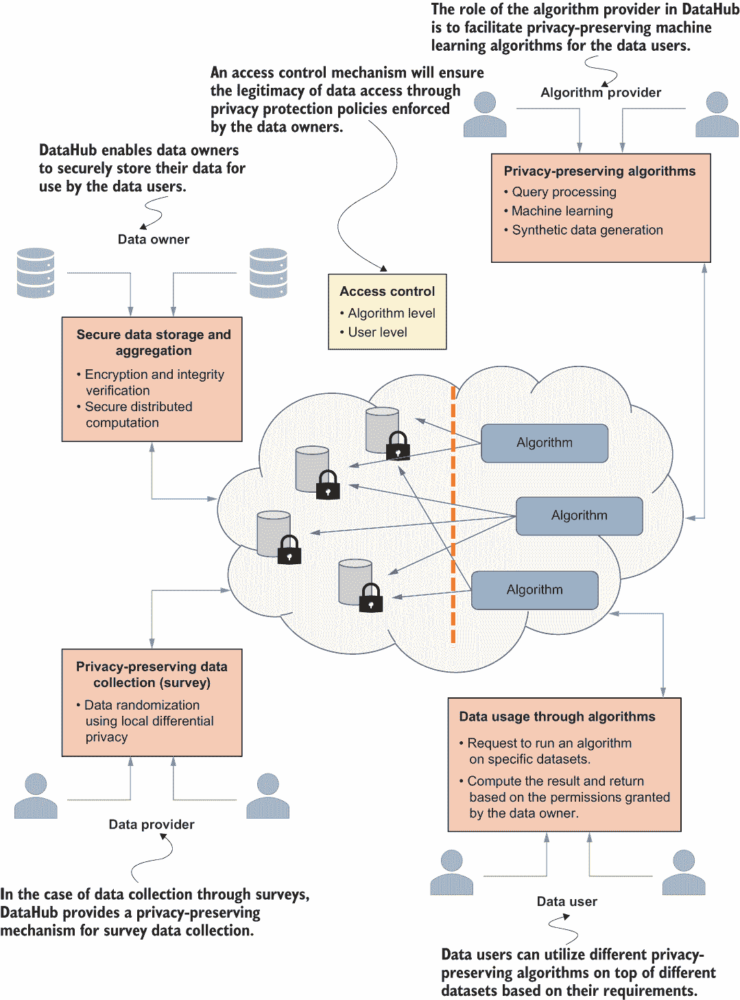

图 10.1 DataHub 系统中不同用户角色的概述

如图 10.1 所示，数据所有者的目标是允许研究人员使用他们的数据集，同时保护这些数据集的安全性和隐私。实现数据集安全性和隐私的一种方法是将可扩展的基于云的 SEC-NoSQL 安全 NoSQL 数据库解决方案[1]集成到架构中。

每当数据所有者将他们的数据提交给 DataHub 时，这些数据将安全地存储在数据库中。为了实现这一点，一个解决方案是数据所有者加密这些信息并将其放入数据库中。然而，每当我们需要查询该数据集中的一个数据元组时，数据所有者必须解密整个数据库，这在多方应用中既不实用也不高效。为了解决这个问题，研究界提出了一个 SQL 感知加密概念[2]。其想法是数据将以一种方式加密，使得查询加密数据成为可能，而无需解密整个数据库。这可以通过不同属性保持加密的层次来实现。SEC-NoSQL 框架将通过数据加密机制和数据存储和检索期间的数据完整性验证来提供数据安全。完整性验证防止数据被任何一方无意或恶意地更改。我们将在第 10.3.1 节中探讨细节，但作为一个快速的高级概述，数据安全操作可以在两种信任模型中实现，以保护数据所有者的数据免受 DataHub 其他部分的影响：

+   一个半信任的第三方称为加密服务提供商（CSP），将为加密提供公钥。

+   算法将在数据所有者和 DataHub 之间执行，而不需要加密服务提供商的帮助。

在这个平台上，数据所有者将通过访问控制机制定义不同的保护策略来控制他们的数据如何被使用以及谁可以访问或使用它。

在安全架构设计中，什么是信任模型？

通常，信任是安全架构的一个特征，它可以被看作是使人们对某事将以可预测的方式发生或不会发生产生信心。例如，根据 ITU-T X.509 标准，信任被定义为以下内容：“当第一个实体假定第二个实体将完全按照第一个实体期望的方式行事时，可以说第一个实体‘信任’第二个实体。”

信任模型提供了一个提供安全机制的框架。信任建模是安全架构师执行的过程，用于定义一个补充的威胁配置文件。该练习的结果将整合有关特定 IT 架构的威胁、漏洞和风险的信息。

DataHub 还将有一个用于通过隐私保护调查收集数据的组件（见图 10.1）。正如我们在第四章中讨论的，局部差分隐私（LDP）允许数据用户在保护每个个人（数据所有者）隐私的同时，通过使用随机响应机制（见第 4.1.2 节）聚合有关人群的信息。

此外，数据用户可以通过在 DataHub 中运行隐私保护算法来利用数据所有者拥有的数据。这些算法可以是隐私保护机器学习、查询处理、合成数据生成等。一般来说，如果获得访问权限，数据用户将只会了解算法的结果。算法的结果将保证差分隐私，这是我们讨论的第二章和第三章中常用的量化个人隐私的标准。

最后，数据集可以通过算法提供商添加新的算法（图 10.1）来扩展。这促进了不同机构之间的合作。

### 10.2.1 架构设计

作为科学社区的扩展系统，DataHub 将是一个在公共云上管理所有数据和算法的平台。如图 10.1 所示，DataHub 的主要功能将在受保护的数据集上运行隐私保护算法。NoSQL 数据库将被用于数据存储，因为它们为大数据提供了更好的性能和高度的可扩展性，特别是对于增加的工作负载。详细的部署架构如图 10.2 所示。

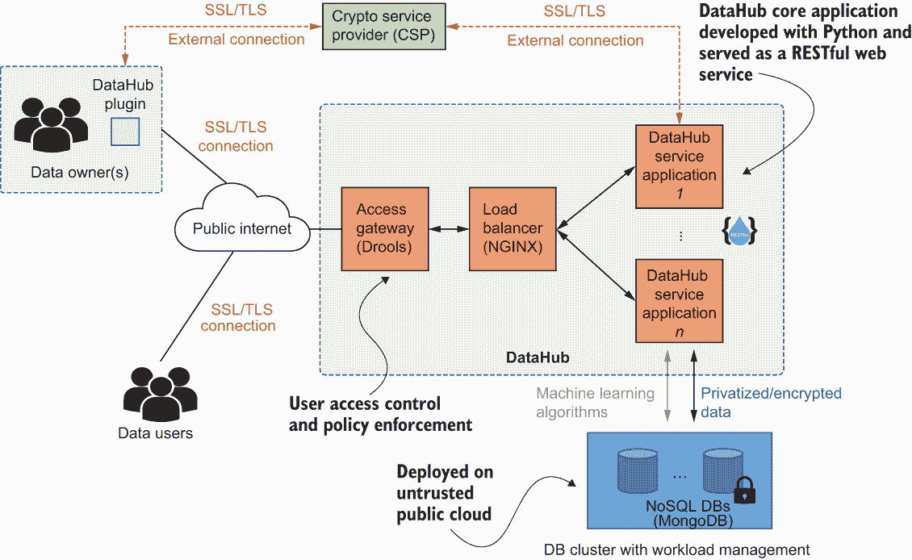

图 10.2 DataHub 的系统部署架构

让我们快速浏览一下图 10.2 中显示的组件。如图所示，DataHub 可以建立在不同的商业可用、开源工具和技术之上。数据所有者和数据使用者通过公共互联网连接到 DataHub 平台，就像访问任何网页一样。访问网关将在登录过程中执行访问策略，以识别分配给每个用户的权限。如果访问被允许，负载均衡器将适当地分配负载，并根据请求类型将请求转发到相关的 DataHub 服务应用程序。我们将在本章后面讨论不同的服务提供。DataHub 执行的每个功能都作为服务应用程序（资源即服务）提供。例如，机器学习作为机器学习即服务提供。最后，为了便于某些服务的安全交付，集成了加密服务提供商。

注意：图 10.2 标识了一些最受欢迎的开源软件产品，以给您一个关于它们功能的想法。这只是为了参考。您可以使用您首选的软件产品。

在部署方面，我们可以为 DataHub 选择半诚实信任模型。在半诚实信任模型中，系统中的每个参与者都假定正确遵循协议，但他们可能会对交换的数据感到好奇，并可能通过分析协议执行期间接收到的值来尝试获取更多信息。数据所有者不能完全信任基于云的服务提供商，因此 DataHub 在运行算法时不会要求数据所有者提供原始数据。

我们可以为半诚实信任模型的两种变体开发隐私保护算法。第一种信任模型需要一个半信任的第三方，即加密服务提供商（CSP），它将提供用于加密的公钥。这个模型在通信成本方面更有效率。第二种信任模型不需要 CSP，但在执行过程中，算法需要数据所有者和 DataHub 之间有更多的通信。在这两种模型中，都可以分析来自多个数据所有者的汇总数据，促进协作研究。

现在让我们详细地看看这些信任模型。

### 10.2.2 混合不同的信任模型

如前所述，我们在我们的设计架构中使用了两种不同的半诚实信任模型。

基于 CSP 的信任模型

在这个模型中，想法是使用一个半信任的第三方，即加密服务提供商（CSP）[3]，来开发更有效的算法。CSP 首先生成一个密钥对，并提供公钥供数据所有者用于加密。由于数据所有者不希望与 DataHub 共享他们的原始数据，因此他们加密他们的数据，并与 DataHub 共享加密后的数据。

要在加密数据上执行计算，我们可以使用同态加密等加密方案（我们在第 9.4 节讨论了类似的协议）。当 DataHub 为算法在多个加密数据集上执行计算时，它需要在将结果与数据用户共享之前与 CSP 互动以解密结果。这种方法是实用的，因为它不需要数据所有者在算法执行期间在线。然而，它涉及一些假设，例如 CSP 和 DataHub 之间没有勾结。

图 10.3 展示了在 DataHub 中使用 CSP 执行算法的方式。每个数据所有者首先使用 CSP 的公钥加密他们的数据并将其发送到 DataHub 平台。每当数据用户想要访问数据，例如在该数据上运行机器学习任务时，DataHub 将在加密数据上运行任务并获得结果。然后，这些结果将被盲化并发送给 CSP 进行解密。由于数据被盲化，CSP 无法推断数据。一旦收到解密后的数据，DataHub 将移除盲化并将数据发送回数据用户以完成请求。

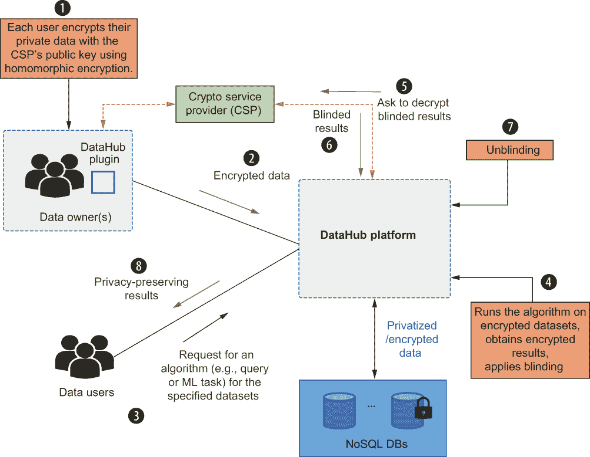

图 10.3 在 DataHub 中针对基于 CSP 的信任模型的隐私保护算法的执行

非 CSP 基于信任模型

此模型不需要 CSP 执行算法。当算法正在执行时，DataHub 直接与数据所有者互动。对此模型有几种解决方案。例如，可以在 DataHub 和数据所有者之间开发安全多方协议，或者每个数据所有者可以使用自己的密钥进行加密和解密。

我们可以使用分布式差分隐私（在第三章中讨论）作为此模型的另一种可能解决方案。当有数据用户请求在多个数据集上运行算法时，DataHub 可以将这些请求分配给这些数据集的所有者。使用 DataHub 插件，每个数据集所有者可以在本地计算其份额并对其计算出的份额应用差分隐私。当 DataHub 从数据所有者收集所有差分隐私份额时，可以使用私有份额计算数据用户请求的结果。

图 10.4 阐述了该分布式差分隐私算法的执行过程。与基于 CSP 的模型相比，这种方法要求数据所有者在算法执行期间在线，这需要 DataHub 和数据所有者之间有更多的通信。

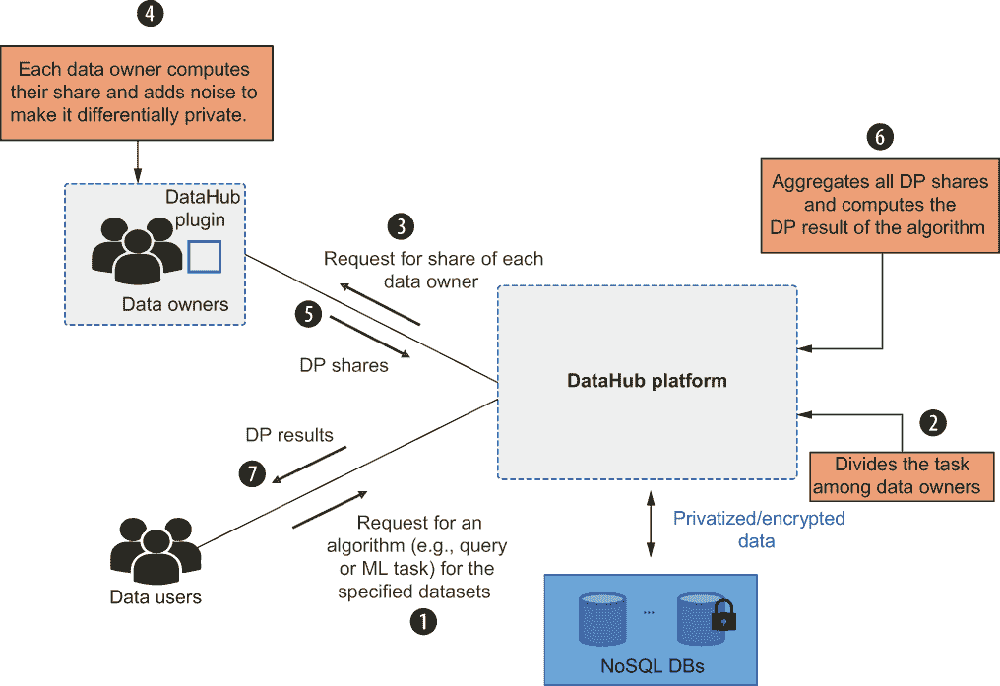

图 10.4 在 DataHub 中针对非 CSP 基于信任模型的隐私保护算法（分布式 DP 方法）的执行

### 10.2.3 配置访问控制机制

身份和访问管理是任何信息系统安全的重要组成部分。通常，访问控制机制是一个框架，有助于管理应用程序的身份和访问管理。在这个系统中使用适当的访问控制机制非常重要，既要保护系统资产（数据和隐私保护算法）免受未经授权的外部方的侵害，又要管理不同资产如何被内部用户访问（数据所有者、数据提供者、数据用户或算法提供者）。

访问控制策略通常可以用对象、主体和操作来描述。*对象*代表系统中需要保护的具体资产，例如数据所有者的数据和算法。*主体*指的是特定的系统用户。*操作*描述了系统用户（主体）在系统资产（对象）上执行的具体动作，例如创建、读取、更新和删除。一个访问控制策略定义了主体如何对某个对象进行操作。

今天的应用程序中采用了四种主要的访问控制类型：

+   *基于任意访问控制（DAC**）*—在 DAC 模型中，资源所有者指定哪些主体可以访问特定的资源。例如，在 Windows、macOS 或 Ubuntu 等操作系统上，当你创建一个文件夹时，你可以轻松地添加、删除或修改你想给予其他用户的权限（如完全控制、只读等）。这种模型被称为*任意*，因为访问控制基于资源所有者的决定。

+   *强制访问控制（MAC**）*—在 MAC 模型中，用户不能确定谁可以访问他们的资源。相反，系统的安全策略将决定谁可以访问资源。这通常用于信息机密性至关重要的环境，例如军事机构。

+   *基于角色的访问控制（RBAC**）*—在 RBAC 模型中，不是为每个主体授予对不同对象的访问权限，而是授予对*角色*的访问权限。与角色关联的主体将获得对这些对象的相应访问权限。

+   *基于属性的访问控制（ABAC**）*—ABAC 模型是 RBAC 的高级实现，其中访问基于系统中对象的属性。这些属性可以是用户、网络、网络上的设备等几乎任何特征。

DataHub 是一个基于角色的协作数据共享平台（如你在图 10.1 中看到的），它涉及大量用户（主体）访问数据（对象）。对每个主体对众多不同对象的访问进行单独管理是不切实际的。因此，我们将在我们的平台上设计和实现一个基于角色的访问控制（RBAC）机制。

现在，让我们看看 RBAC 如何帮助我们实现 DataHub 中的访问控制策略。如图 10.5 所示，存在一组对象（例如，数据集 *D*[1]，算法 *A*[1]），一组主体（例如，用户 *U*[1]，*U*[2] 和 *U*[3]），以及一组操作（例如，查询处理，执行机器学习算法）。对于每个对象，我们根据不同的角色定义不同的访问控制策略（例如，*R*[1]，*R*[2]）。每个角色都由某些属性和规则来描述。属性定义了与相应角色关联的主体，规则定义了相应的策略。例如，在图 10.5 中，*U*[1] 和 *U*[2] 与 *D*[1] 内定义的 *R*[1] 相关联，该规则还定义了“允许查询处理访问”。在这种情况下，*U*[1] 和 *U*[2] 被允许在 *D*[1] 上执行查询处理。同样，*U*[3] 被允许在数据集 *D*[1] 上执行机器学习算法 *A*[1]。

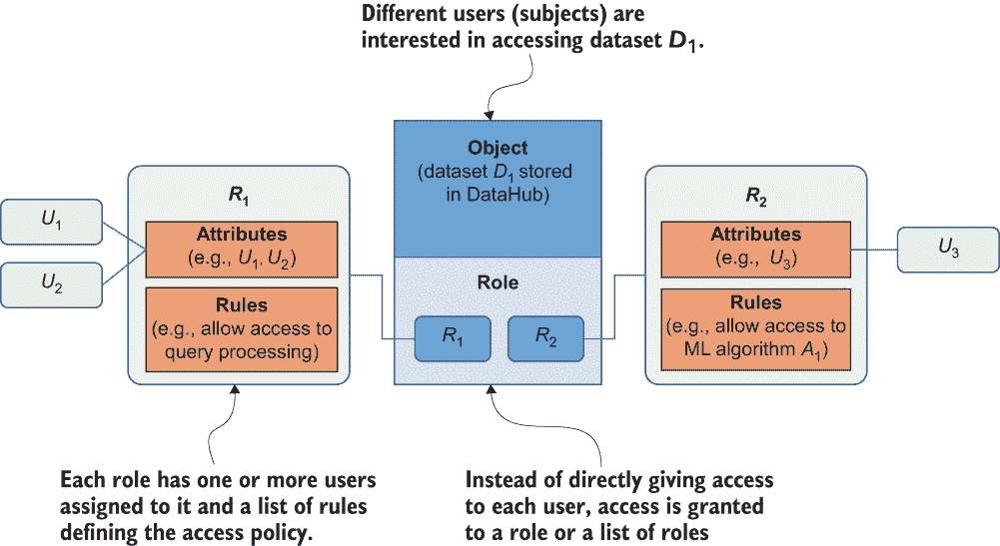

图 10.5 角色基于访问控制（RBAC）的工作原理

在这个设计中，相应的用户（例如，数据所有者或数据提供者）可以将访问控制策略（例如）与他们的数据一起提交给 DataHub。这样，数据所有者和数据提供者可以完全控制他们提交的数据。他们还有权控制和监控访问他们数据的算法。当新的数据用户被添加到 DataHub 时，他们可以请求访问特定数据集的权限。请求数据集的数据所有者可以决定是否将该用户添加到与该数据集关联的角色之一。这就是图 10.2 中访问网关得以实现的方式。

既然你对 DataHub 的架构有了基本的了解，让我们看看隐私技术是如何协同工作来保护这个平台的。

## 10.3 将隐私和安全技术集成到 DataHub 中

正如我们在本章前面提到的，我们的目标是向你展示如何在现实场景中结合不同的隐私增强技术。在本节中，我们将探讨这些不同技术集成的技术方面。首先，我们将介绍数据存储选项，然后我们将讨论机器学习机制。

### 10.3.1 使用基于云的安全 NoSQL 数据库进行数据存储

在第七章和第八章中，我们讨论了隐私增强技术如何在数据挖掘任务和数据库应用中使用。作为一个快速回顾，无论我们使用的数据模型是什么（无论是关系型还是非关系型），安全性在任何数据存储中都是一个主要关注点。但大多数现代数据库系统（尤其是 NoSQL 数据库系统）更关注性能和可扩展性，而不是安全性。

基于不同方法的安全感知数据库系统已经研究了许多年[2]，[4]。在云环境中确保敏感数据安全的一种方法是在客户端加密数据。CryptDB [2] 是为关系数据库开发的一个这样的系统。它利用中间件应用程序重写客户端发出的原始查询，因此这些查询在数据库级别上执行在加密数据上。基于这种方法，我们探索了可能性并实现了一个名为 SEC-NoSQL [1]的框架，如图 10.6 所示。它确保了 NoSQL 数据库的安全性和隐私，同时保持了大数据分析中的数据库性能。

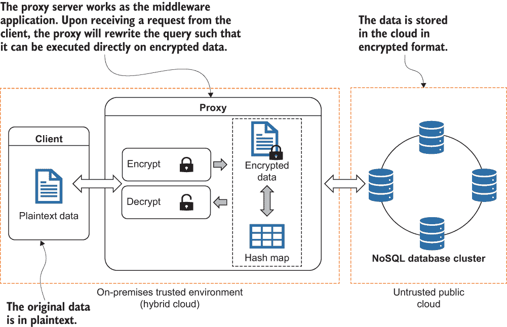

图 10.6 SEC-NoSQL 的架构

SEC-NoSQL 框架背后的主要思想是实现一个实用且安全感知的 NoSQL 数据库解决方案，该方案在云上运行，并保证了一定的性能和可扩展性。在这个设计中，客户端仅与代理服务器通信，就像它们直接将数据存储到数据库或从数据库检索数据时一样。首先，数据所有者向代理发出创建数据库模式的请求。代理通过匿名化列名来转换模式，并在数据库中执行该模式。当代理收到数据写入请求时，它将通过加密机制，并使用 HMAC-SHA256 算法生成该记录的哈希值（HMAC）。此值将被存储在代理维护的哈希表中。在读取请求的情况下，代理从数据库中检索加密记录，生成哈希值，并将哈希表中的对应条目进行比较以确保数据完整性。如果完整性检查通过，则记录将被解密，并将相应的结果发送回客户端。

为了方便对加密记录进行查询，我们需要实现允许我们在加密数据上执行基本读写操作的加密技术。不同的加密算法提供不同的安全保证。更安全的加密算法可以确保对强大对手不可区分，并且某些方案允许在加密数据上执行不同的操作。

通过遵循 CryptDB 建议的方法，我们实现了一套不同的加密算法，以方便对加密数据进行一系列不同的 SQL 查询。基于不同的加密操作，如随机加密、确定性加密、顺序保持加密和同态加密，SEC-NoSQL 可以在不影响数据库性能水平的情况下，对加密数据进行操作和处理。

在对 SEC-NoSQL 的工作原理有了基本理解之后，让我们快速看一下查询操作的一个简单示例。假设我们正在使用 MongoDB 作为我们的后端数据库，并且需要在数据库的 table_emp 表中插入员工的 ID 和姓名。在 MongoDB 中，我们可以通过执行以下类似的内容来实现：

```
db.table_emp.insertOne({col_id: 1, col_name: 'xyz'})
```

然而，当这个查询被 SEC-NoSQL 的中间件应用程序接收时，它将被翻译成以下类似的内容：

```
db.table_one.insertOne({col_one: DET(1), col_two: RND('xyz')})
```

如您所见，所有的表和列名都将被匿名化，数据将被加密（这里，DET 表示确定性加密）。这就是简单的 INSERT 操作是如何工作的。类似的方案可以用来实现 READ、UPDATE 和 DELETE 操作。

### 10.3.2 基于本地差分隐私的隐私保护数据收集

我们在第四章和第五章中讨论了本地差分隐私（LDP）的基本原理和应用。LDP 的一个潜在用例是用于在线调查。研究人员使用调查用于各种目的，例如分析行为或评估思想和观点。

由于隐私原因，从个人收集调查信息用于研究目的具有挑战性。个人可能不会足够信任数据收集者来分享敏感信息。尽管个人可以匿名参与调查，但仍然有可能通过提供的信息[5]识别出这个人。LDP 是解决这个问题的方法之一。您可能还记得，LDP 是在数据收集者不受信任时确保个人隐私的一种方式。LDP 的目标是确保当个人提供一个值时，很难识别出原始值是什么。

那么，我们如何在 DataHub 平台上使用 LDP 呢？在我们回答这个问题之前，让我们快速回顾一下 LDP 的基础知识。LDP 协议由三个主要步骤组成。首先，每个用户使用编码方案对他们的值（或数据）进行编码。然后，每个用户扰动他们的编码值并将它们发送给数据收集者。最后，数据收集者汇总所有报告的值并估计隐私保护统计信息。图 10.7，您在第四章中已经看到，展示了这个 LDP 过程。


图 10.7 本地差分隐私是如何工作的

我们将为 DataHub 平台设计一个在线调查工具，如图 10.8 所示，通过实现从个人（数据提供者）收集数据并估计关于人群的统计信息现有的 LDP 方法。由于每个值在发送到 DataHub 之前都会被扰动，因此数据提供者不必担心他们的隐私。

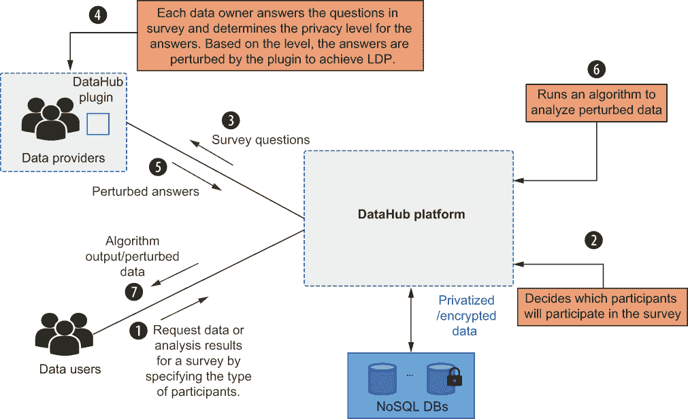

图 10.8 DataHub 的隐私保护调查机制

大多数现有的 LDP 实现方案都假设单个ϵ值由数据收集者确定并由个人使用。然而，个人可能有不同的隐私偏好。在我们的方法中，我们计划允许数据提供者为提交给 DataHub 的每条信息选择一个隐私级别。例如，一个人可能愿意与数据收集者分享他们的年龄，而另一个人可能更愿意隐藏它。研究人员可以通过在 LDP 下保证每个个人的隐私来收集个人用于不同目的的数据。当个人通过 DataHub 与研究人员共享信息时，他们将控制他们隐私的级别。

同样的架构不仅可以用于诸如频率估计等基本问题，还可以用于其他分析，如分类和回归。正如第 5.3 节所讨论的，我们可以使用扰动数据来训练一个朴素贝叶斯分类器，然后可以用于不同的任务。

### 10.3.3 隐私保护机器学习

机器学习高度依赖于底层数据，当数据来自多个方时，数据隐私成为一个关键问题。例如，数据可能分布在几个方之间，他们可能希望在不透露他们的数据的情况下运行 ML 任务。或者数据所有者可能希望在他们的数据上运行 ML 任务，并与其他方共享学习到的模型。在这种情况下，模型不应透露任何关于训练数据的任何信息。

有不同的方法来解决这个问题，这些方法可以大致分为两类：基于密码学的方法和基于扰动的的方法。

密码学方法

在基于密码学的隐私保护机器学习（PPML）解决方案中，同态加密、混淆电路和秘密共享技术是广泛使用的机制，用于保护隐私。

在第 9.4 节的研究案例中，我们讨论了一个混合系统，该系统利用加法同态加密和混淆电路在不泄露底层数据信息的情况下执行主成分分析（PCA）。如图 10.9 所示，数据所有者计算并加密汇总统计数据，然后将它们发送给数据用户。数据用户随后将数据所有者的所有加密份额汇总起来，向结果添加一个随机盲化值，并将它们传递给 CSP。CSP 使用其私钥解密盲化数据，构建混淆电路，并将它们转回数据用户。最后，数据用户执行混淆电路以获得输出。

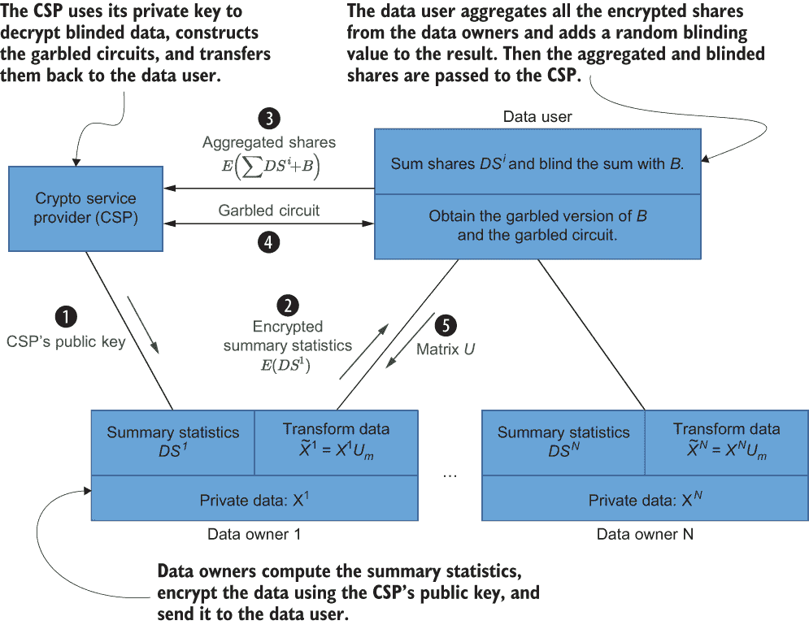

图 10.9 基于密码学的隐私保护机器学习协议

在 DataHub 的情况下，我们可以稍微修改这个协议。例如，由于加密数据集将存储在 NoSQL 数据库中，DataHub 可以使用同态属性计算每个数据所有者的本地份额并遵循该协议。在具有 CSP 的信任模型中，DataHub 不需要与数据所有者交互，并且可以在 CSP 的帮助下解密结果。

基于扰动的方案

我们在第二章和第三章中讨论了差分隐私 (DP) 的使用。作为一个快速回顾，DP 的目的是在发布数据库中的聚合信息的同时保护个人的隐私，通过向算法的输出添加随机性来防止成员推理攻击。我们将使用基于扰动的方案结合 DP。

已经开发了几种不同的隐私保护机器学习算法来满足差分隐私 (DP)。在这些算法中，研究社区已经调查了使用不同方法的不同隐私 PCA。一些方法通过添加对称高斯噪声矩阵来估计数据的协方差矩阵，而另一些方法则使用 Wishart 分布来近似协方差矩阵。这两种方法都假设数据已经被收集。在第 3.4 节中，我们探索了一种高度高效和可扩展的差分隐私分布式 PCA 协议 (DPDPCA) 用于水平分区数据。我们将在 DataHub 中使用该协议。

如图 10.10 所示，每个数据所有者加密其数据份额并发送给代理，代理位于数据用户和数据所有者之间的半信任方。代理聚合从每个数据所有者接收到的加密数据份额。为了防止通过 PCA 进行推理，代理向聚合结果添加一个噪声矩阵，使得散点矩阵的近似满足 (ε, δ)-差分隐私。聚合结果被发送给数据用户，数据用户解密结果，构建散点矩阵的近似，然后继续进行 PCA。

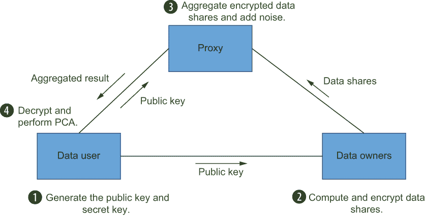

图 10.10 基于扰动的隐私保护机器学习协议

### 10.3.4 隐私保护查询处理

现在让我们看看如何利用 DataHub 来简化查询处理。正如我们在第 10.2.2 节中讨论的那样，DataHub 平台将支持两种信任模型：基于 CSP 的信任模型和非基于 CSP 的信任模型，其中 CSP 是一个半诚实的第三方。因此，我们将为这两种信任模型开发处理一个或多个受保护数据集查询的算法。这种查询处理功能可以通过两种不同的方法启用。第一种方法通过 SEC-NoSQL 框架实现查询处理，而另一种方法则实现差分隐私查询处理。每种方法都有其优点和缺点，因此让我们详细回顾这些方法的技术细节。

我们当前的 SEC-NoSQL 框架支持主要的 CRUD 操作（创建、读取、更新和删除）。通过使用其他加密方案，如同态加密和有序保持加密，我们可以扩展此框架以支持不同类型的统计查询，如 SUM、AVERAGE 和 ORDER BY。在基于 CSP 的信任模型中，数据所有者将使用 CSP 的公钥进行同态加密，并将加密后的数据提交给 DataHub，DataHub 可以在 CSP 的帮助下处理聚合查询。在非 CSP 基于信任模型下使用 SEC-NoSQL 框架处理查询也是可能的。每个数据所有者可以使用他们自己的公钥并将加密后的数据发送到 DataHub。然而，当数据用户想要处理查询时，DataHub 需要与数据所有者进行交互以进行解密。这将降低查询处理的实用性，因为数据所有者需要在查询处理期间在线，并且需要更多的 DataHub 与每个数据所有者之间的通信。

在分布式设置中，对于差分隐私查询处理方法不需要 CSP。为了满足数值查询的差分隐私，我们只需向查询结果添加所需的噪声级别。然而，当数据分布在几个当事人之间时，决定每个当事人应添加多少噪声并非易事。我们在 3.4.2 节中讨论了这个问题。作为一个解决方案，Goryczka 等人[6]为安全求和聚合问题引入了一个分布式差分隐私设置。在分布式拉普拉斯扰动算法（DLPA）中，每个数据所有者生成一个从高斯、伽马或拉普拉斯分布中采样的部分噪声，聚合器中累积的噪声将遵循拉普拉斯分布，这满足 DP。在实践中，使用拉普拉斯分布进行部分噪声对于具有隐私的分布式数据聚合来说更有效率，并且添加的冗余噪声更少。因此，DataHub 将在分布式模型中使用 DLPA 来实现差分隐私。

### 10.3.5 在 DataHub 平台中使用合成数据生成

在第六章中，我们讨论了合成数据生成的不同用例以及为什么合成数据如此重要。隐私保护查询处理和机器学习算法很重要，但有时研究人员想要执行新的查询和分析程序。当没有预定义的操作算法时，我们必须从数据所有者那里请求原始数据，以便我们可以在本地使用它。这就是隐私保护数据共享方法，如*k*-匿名性、*l*-多样性、*t*-接近性和数据扰动发挥作用的地方。我们在第七章和第八章中讨论了这些隐私保护数据共享和数据挖掘技术。然而，数据共享的另一个有希望的解决方案是生成既合成又具有代表性的数据，这些数据可以安全地共享。以与原始数据相同格式的合成数据集进行共享，使我们能够在数据用户如何使用数据方面拥有更多的灵活性，无需担心数据隐私。让我们看看如何在 DataHub 平台上利用合成数据生成机制。

DataHub 将包括一个私有的合成数据生成算法作为服务，如图 10.11 所示。此算法将结合属性级微聚合[7]和差分隐私多元高斯生成模型（MGGM）来生成满足差分隐私的合成数据集。正如第六章中讨论的那样，为了实现合成数据的 DP 所需的噪声小于其他算法。数据用户将能够在合成数据集上执行聚合查询，或者他们可以使用 DataHub 中的合成数据与机器学习算法一起使用。

为了更好地捕捉实际数据的统计特征，我们可以将属性划分为独立的属性子集。同一子集中的属性将相互关联，并且与不同属性子集中的属性不相关。对于每个属性子集，我们可以分配一个包含微聚合和差分隐私 MGGM 的合成数据生成器。您可以参考第 6.4 节了解更多关于实现和技术细节的信息。

我们提出的解决方案将非常适合我们之前讨论的信任模型（带有 CSP 和不带有 CSP）。在基于 CSP 的信任模型中，DataHub 在 CSP 的帮助下生成合成数据。在非 CSP 基于的信任模型中，数据所有者生成合成数据并将其发布到 DataHub。图 10.11 显示了在 DataHub 中生成和使用合成数据（非 CSP 基于的信任模型）所涉及的步骤。

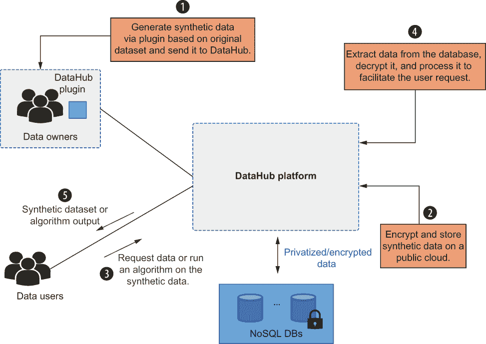

图 10.11 DataHub 的没有 CSP 的合成数据生成机制

这就结束了我们对 DataHub 平台不同功能的讨论。我们通过在实际场景中部署这些技术，探讨了实现和产业化本书中讨论的隐私增强技术的可能方法。DataHub 只是其中一个应用场景。你可以在你的应用领域中运用相同的概念、技术和方法。每章的相关源代码都可在本书的 GitHub 仓库中找到，因此你可以应用我们讨论的任何概念。实施它们，实验它们，并充分利用它们。祝你好运！

## 摘要

+   在整本书中，我们讨论了各种可以服务于整体隐私保护的隐私增强技术。

+   这些不同的概念各有其优点、缺点和用例。当你想要实现隐私时，重要的是要看到更广阔的图景，并明智地选择适当的技术。

+   我们用于研究数据保护和共享的隐私增强平台（DataHub）是一个现实世界的应用场景，展示了我们如何将不同的隐私增强技术对准共同目标。

+   有两种主要的信任模型——基于 CSP 和非基于 CSP 的——我们可以将其集成到 DataHub 的架构设计中。

+   在设计应用程序时，数据隐私和安全至关重要，尤其是在分布式、协作环境中。

+   我们可以在基于云的、安全的 NoSQL 数据库中，将数据存储在 DataHub 平台上。

+   DataHub 可以通过两种不同的设置促进隐私保护的数据收集：使用基于密码学和扰动的方法。

+   DataHub 还提供在两种信任模型（带有 CSP 和不带有 CSP）中的合成数据生成。
