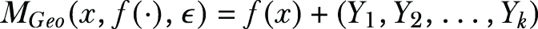
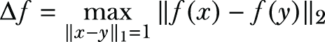
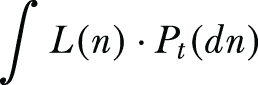
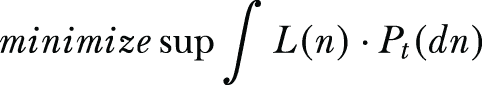
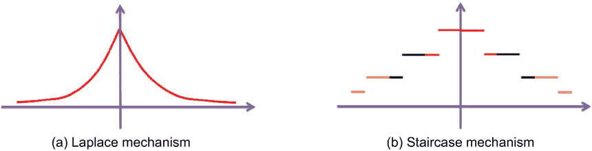
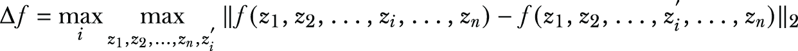
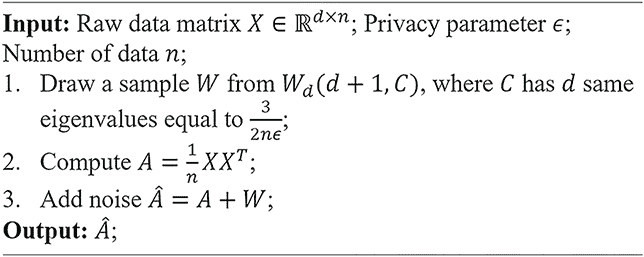
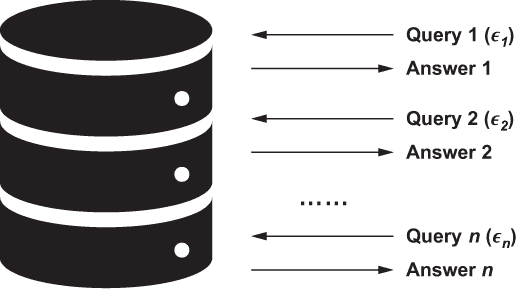
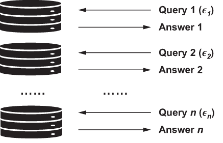

# 附录 A. 差分隐私的更多细节

正如我们在第二章中讨论的，差分隐私（DP）是最受欢迎和最有影响力的隐私保护方案之一。它基于使数据集足够健壮的概念，以至于数据集中的任何单个替换都不会泄露私人数据。这通常是通过计算数据集中组内的模式来实现的，我们称之为 *复杂统计*，同时保留数据集中个人的信息。差分隐私的美丽之处在于其数学可证明性和可量化性。在接下来的章节中，我们将介绍数学基础和差分隐私的正式定义。如果你对这些数学基础不感兴趣，你现在可以跳过这部分，并在需要时再回来。

## A.1 差分隐私的正式定义

在我们介绍差分隐私的正式定义之前，让我们看看一些最初由 Dwork 和 Roth [1]定义的基本术语：

+   *概率单纯形*—令 *B* 表示一个离散集合。*B* 的概率单纯形，记为 Δ(*B*)，定义为 Δ(B) = {x ∈ ℝ^(|B|) : x[i] ≥ 0 for all i and Σ^(|B|)[i=1] x[i] = 1}。你可以将概率单纯形视为给定概率分布的空间。

+   *随机算法*—一个具有域 *A* 和离散范围 *B* 的随机算法 *M* 与映射 *M* : *A*→Δ(*B*) 相关联。给定一个输入 *a* ∈ *A*，算法 *M* 以概率 (*M*(*a*))[b] 输出 *M*(*a*) = *b*，对于每个 *b* ∈ *B*。概率空间是算法 *M* 的硬币翻转。我们已经在第 2.2.1 节中讨论了算法中的随机化是如何发生的。

+   *数据库*—数据库 *x* 是形成宇宙 *X* 的记录集合。

    例如，让全集 *X* 定义数据库中的唯一元素集合。那么一个数据库可以通过数据库内元素的直方图来表示，x ∈ ℕ^(|X|)，其中每个条目 *x*[i] 代表数据库 *x* 中类型 *i* ∈ *X* 的元素数量。

+   *数据库之间的距离*—数据库 *x* 的 *l*[1] 范数表示为 ‖*x*‖[1]，定义为 ‖x‖[1] = Σ^(|x|)[i=1] |xi|。因此，两个数据库 *x* 和 *y* 之间的 *l*[1] 距离是 ‖*x* - *y*‖[1]。

+   *邻近数据库*—两个数据库 *x* 和 *y* 被定义为邻近数据库，如果它们只在一行上有所不同。例如，对于数据库对 *x*，*y* ∈ *N*^(|X|)，如果 ‖*x* - *y*‖[1] ≤ 1，我们则认为 *x* 和 *y* 是邻近数据库。

现在我们准备介绍差分隐私的正式和最一般的定义。它为随机算法提供了在邻近数据库上表现相似的数学保证。

+   (ϵ, *δ*)-*差分隐私*—一个随机算法 *M* 是 (ϵ, *δ*)-DP，如果对于每一对邻近数据库 *x*，*y* 和对于所有 *S* ⊆ *Range*(*M* )，我们有

    Pr[*M*(*x*) ∈ *S*] ≤ *e*^ε ⋅ Pr[*M*(*y*) ∈ *S*] + δ

    其中 Pr[⋅] 表示事件的概率，*Range*(M) 表示随机算法 M 所有可能输出的集合。当 ϵ 和 δ 越小，Pr[*M*(*x*) ∈ *S*] 和 Pr[*M*(*y*) ∈ *S*] 越接近，隐私保护就越强。当 δ = 0 时，算法 *M* 满足 ϵ-DP，这比 (ϵ, *δ*)-DP（δ > 0）提供了更强的隐私保证。通常人们将 ϵ 称为 DP 定义中的 *隐私预算*。ϵ 的值越高，意味着拥有更多的隐私预算，因此可以容忍更多的隐私泄露。ϵ 的值越低，意味着需要或提供的隐私保护越强。隐私参数 δ 代表定义中的“失败概率”。以 1 - δ 的概率，我们将获得与纯 DP（即 ϵ-DP，其中 δ = 0）相同的保证。以 δ > 0 的概率，我们则没有任何保证。换句话说，

    +   以 1 - δ 的概率，我们有 Pr[*M*(*x*) ∈ *S*] ≤ *e*^ϵ⋅Pr[*M*(*y*) ∈ *S*]。

    +   以 δ 的概率，我们根本没有任何保证。

## A.2 其他差分隐私机制

第二章讨论了三种最流行的差分隐私机制：二元、拉普拉斯和对数。为了回顾，二元机制中的随机化来自二元响应（抛硬币），这有助于我们扰动结果。拉普拉斯机制通过向目标查询或函数添加来自拉普拉斯分布的随机噪声来实现 DP。对数机制帮助我们应对那些效用是选择最佳响应但直接向查询函数的输出添加噪声会完全破坏效用的场景。在本节中，我们将讨论一些其他的 DP 机制。

### A.2.1 几何机制

拉普拉斯机制（在第 2.2.2 节中讨论）向查询函数的输出添加实值噪声。它最适合输出实值的查询函数，因为直接将噪声添加到输出中不会使结果变得无意义。对于输出整数的查询函数，你仍然可以添加拉普拉斯噪声，但之后需要应用离散化机制。然而，这可能会降低结果的效用。

正是几何机制在这里发挥作用 [2]。它被设计用来向只有整数输出值的查询函数添加拉普拉斯噪声的离散对应物（从几何分布中抽取）。以下是几何分布和几何机制的定义：

+   *几何分布*—给定一个大于 1 的实数 α，几何分布表示为 *Geom*(α) 是一个对称分布，它取整数值，其概率质量函数在 *k* 处为 ((*α* – 1) /(*α* + 1)) ⋅ *α*^(-|k|)

    几何分布具有与拉普拉斯分布相似的性质。从 *Geom*(α) 中抽取的随机变量的方差为 σ² = 2α/(1 - α)²。

+   *几何机制*—给定一个数值查询函数 f: ℕ^(|^X|) → ℤ^k，数据库 x ∈ ℕ^(|^X|) ，以及隐私预算 ϵ，几何机制定义为

    

    其中 *Y*[1] 是从 Geom(ϵ/Δf) 中抽取的独立同分布随机变量，Δ*f* 是查询函数 *f* 的 *l*[1]-敏感性。

定理 A.1 几何机制满足 (ϵ, 0)-DP。

几何机制可以应用于第 2.2.2 节中涉及拉普拉斯机制的示例，提供略微更好的效用。

### A.2.2 高斯机制

高斯机制 [1] 是拉普拉斯机制的另一种替代方案。它不是添加拉普拉斯噪声，而是添加高斯噪声，并提供略微放宽的隐私保证。

高斯机制将其噪声缩放到 *l*[2] 敏感性（与拉普拉斯机制相比，它缩放到 *l*[1] 敏感性），如下定义：

+   *l*[2]*-敏感性*—给定一个数值查询函数 f: ℕ^(|^X|) → ℝ^k，对于所有数据库对，x, y ∈ ℕ^(|^X|)，其 *l*[2]-敏感性是 。

我们可以根据高斯分布和 *l*[2]-敏感性定义高斯机制如下：

+   *高斯机制*—给定一个数值查询函数 f: ℕ^(|^X|) → ℝ^k，数据库，x ∈ ℕ^(|^X|) ，以及隐私预算 ϵ 和 δ，高斯机制定义为

    

    其中 *Y*[i] 是从高斯分布 τ = Δf √(2ln (1.25/ δ)) / ε 中抽取的独立同分布随机变量，Δ*f* 是查询函数 *f* 的 *l*[2]-敏感性。

定理 a.2 高斯机制满足 (ϵ, δ)-DP。

与其他随机噪声相比，添加高斯噪声有两个优点：

+   高斯噪声与其他许多噪声源相同（例如，通信通道中的白噪声）。

+   高斯随机变量的和导致一个新的高斯随机变量。

这些优点使得分析并纠正应用高斯机制的保护隐私机器学习算法变得更加容易。

### A.2.3 梯度机制

梯度机制 [3] 是拉普拉斯机制的一种特殊情况。它通过调整拉普拉斯机制（其概率密度函数是连续的）和几何机制（其概率密度函数是离散的）之间的权衡来优化经典拉普拉斯机制的错误界限。

在梯度机制中，我们通常定义一个损失函数 L(⋅) : ℝ → ℝ，这是一个关于加性噪声的函数，其中给定加性噪声 *n*，损失变为 *L*(*n*)。令 t ∈ ℝ 表示查询函数 *f* ( ) 的输出，*P*[t] 表示生成加性噪声的随机变量的概率分布。那么，损失函数的期望将是

梯度机制旨在最小化所有可能的查询输出 t ∈ ℝ 中的最坏情况成本：

关于如何构建和解决此类优化问题的更多信息，请参阅 Geng 和 Viswanath 的原论文[3]。

梯度机制可以通过三个参数指定：ϵ、Δ*f* 和 γ^*，它由 ϵ 和损失函数 *L*( ) 确定。图 A.1 展示了拉普拉斯和梯度机制的概率密度函数。

图 A.1 拉普拉斯和梯度机制的概率密度函数

### A.2.4 向量机制

向量机制旨在扰动向量值函数，例如许多机器学习算法的凸目标函数（线性回归、岭回归、支持向量机等）。

向量机制将其噪声缩放到以下定义的向量值函数的 *l*[2] 敏感性：

+   向量值函数的 *l*[2]*-sensitivity*——给定一个向量值查询函数 *f*，其 *l*[2] 敏感性定义为当输入变化时函数值在 *l*[2] 范数中的最大变化：

    

一旦定义了向量值函数的 *l*[2] 敏感性（尽管在现实场景中，如机器学习算法中，构建此类敏感性是非平凡的），我们就可以使用从任何其他机制（如 Lap(Δf/ϵ)，其中Δ*f*是向量值函数 *f* 的 *l*[2] 敏感性）抽取的独立同分布随机变量来定义向量机制。

### A.2.5 维斯哈特机制

维斯哈特机制[4]旨在在二次矩矩阵（如协方差矩阵）上实现差分隐私。基本思想是将从维斯哈特分布生成的维斯哈特噪声矩阵添加到二次矩矩阵中。由于维斯哈特矩阵始终是正半定的，并且可以被认为是某些随机高斯向量的散布矩阵，因此它是生成具有其意义和有用性的差分隐私协方差矩阵的自然噪声源（因为协方差矩阵始终是正半定的，也是散布矩阵）。图 A.2 展示了在协方差矩阵上应用维斯哈特机制的伪代码，其中 *W*d(⋅,⋅) 是维斯哈特分布。

图 A.2 应用维斯哈特机制的伪代码

## A.3 差分隐私的组成属性的形式定义

差分隐私的一个重要且有用的属性是其组成定理。差分隐私的严谨数学设计使得分析和控制多个差分隐私计算中的累积隐私损失成为可能。有两个主要组成属性，我们已在第 2.3.3 节中详细讨论了它们。在本节中，我们将探讨这些属性数学定义。

### A.3.1 序列组成的差分隐私的形式定义

DP 的序列组合属性确认了从数据的多次查询中累积的隐私泄露总是高于单次查询的泄露（图 A.3）。例如，如果第一次查询的 DP 分析使用隐私预算 ϵ[1] = 0.1，第二次查询的隐私预算为 ϵ[2] = 0.2，这两个分析可以视为一个具有可能大于 ϵ[1] 或 ϵ[2] 但最多为 ϵ[3] = ϵ[1] + ϵ[2] = 0.3 的隐私损失参数的单次分析。

图 A.3 序列组合

我们从一个简单的案例开始，其中有两个独立的差分隐私算法，一个(ϵ[1], 0)-DP 算法 *M*[1] 和一个(ϵ[2], 0)-DP 算法 *M*[2]。如果依次应用 *M*[1] 和 *M*[2]（其中 *M*[1] 的输出成为 *M*[2] 的输入），那么它遵循以下的双序列组合定理。

定理 a.3 双序列组合：令 M[1] : ℕ^(|X|) → R[1] 表示一个(ϵ[1], 0)-DP 的随机算法，令 M[2] : ℕ^(|X|) → R[2] 表示一个(ϵ[2], 0)-DP 的随机算法。这两个算法的序列组合，表示为 M[1,2] : ℕ^(|X|) → R[1] × R[2]，通过映射 M[1,2] (x) = (M1, M2)，满足(ϵ[1] + ϵ[2], 0)-DP。

在看到双序列组合定理之后，将其扩展到适用于多个独立 DP 算法级联的多序列组合定理应该不难，如下所示。

定理 a.4 多序列组合 1.0：令 M[i] : ℕ^(|X|) → R[i] 表示一个(ϵ[i], 0)-DP 的随机算法。k 个 DP 算法的序列组合，*M*[i]，其中 i = 1, 2, ... , *k*，表示为 M[(k)] : ℕ^(|X|) → Π^k[i=1]R[i]，通过映射 *M*[[k]](*x*) = (*M*1, *M*2, ..., *M*k) 满足 (Σ^k[i=1] ε[i], 0)。

如果 δ ≠ 0 会怎样？序列组合会是什么样子？看看以下定理。

定理 a.5 多序列组合 2.0：令 M[i] : ℕ^(|X|) → R[i] 表示一个(ϵ[i], δ[i])-DP 的随机算法。k 个 DP 算法的序列组合，*M*[i]，其中 i = 1, 2, ... , *k*，表示为 M[(k)] : ℕ^(|X|) → Π^k[i=1]R[i]，通过映射 *M*[[k]](*x*) = (*M*1, *M*2, ..., *M*k) 满足 Σ^k[i=1] ε[i], Σ^k[i=1] δ[i])-DP。

### A.3.2 并行组合 DP 的形式定义

现在让我们转向 DP 的并行组合。总结来说，如果算法 F1 满足 ϵ[1]-DP，F2 满足 ϵ[2]-DP，其中 (x[1], x[2]) 是整个数据集 x 的非重叠划分（图 A.4），F1 和 F2 的并行组合满足 max(ϵ[1], ϵ[2])-DP。

图 A.4 并行组合

假设单个数据库 *x* 已经被分割成 *k* 个不相交的子集，*x*[i]。在这里，“不相交”确保了任何两个子集，*x*[i] 和 *x*[j]，彼此独立。在这种情况下，可能有 *k* 个独立的差分隐私算法，但它们都满足相同的 (ϵ, 0)-DP，并且每个算法 *M*[i] 专门负责一个子集 *x*[i]。以下并行组合定理将允许我们组合这 *k* 个差分隐私算法。

定理 a.6 并行组合 1.0：令 M[i] : ℕ^(|X|) → R[i] 表示一个随机算法，它是 (ϵ, 0)-DP，其中 *i* = 1, 2, ... , *k*。*k* 个差分隐私算法的并行组合，*M*[i]，*i* = 1, 2, ... , *k*，表示为 M[(k)] : ℕ^(|X|) → Π^k[i=1]R[i]，通过映射 *M*[[k]](*x*) = (*M*1, *M*2, ..., *M*k)，其中 *x*[i]，*i* = 1, 2, ... , *k* 代表数据库 *x* 的 *k* 个不相交子集，满足 (ϵ, 0)-DP。

如果所有差分隐私算法都使用差分隐私预算，从而在并行组合场景中满足不同级别的差分隐私，那会怎样？以下定理提供了这种情况的解决方案。

定理 a.7 并行组合 2.0：令 M[i] : ℕ^(|X|) → R[i] 表示一个随机算法，它是 (ϵ[i], 0)-DP，其中 *i* = 1, 2, ... , *k*。*k* 个差分隐私算法的并行组合，*M*[i]，*i* = 1, 2, ... , *k*，表示为 M[(k)] : ℕ^(|X|) → Π^k[i=1]R[i]，通过映射 *M*[[][k][]](x) = (*M*1, *M*2, ..., *M*k)，其中 *x*[i]，*i* = 1, 2, ... , *k* 代表数据库 *x* 的 *k* 个不相交子集，满足 (max ϵ[i], 0)-DP。
