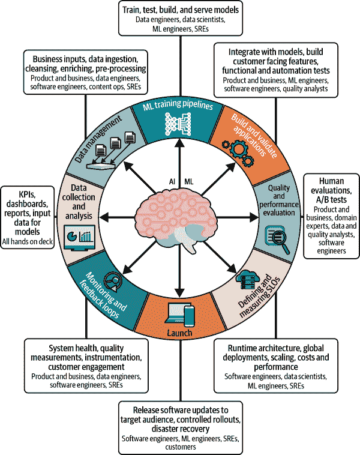

# 第一章：介绍

我们从一个模型或框架开始，用于向网站添加机器学习（ML），广泛适用于多个领域，不仅限于这个例子。我们称这个模型为*ML 循环*。

# ML 生命周期

ML 应用永远不会真正完成。它们也不会在任何一个地方技术上或组织上开始或停止。ML 模型开发人员经常*希望*他们的生活会很简单，他们只需收集数据并训练一次模型，但实际上很少会这样。

一个简单的思想实验可以帮助我们理解其中的原因。假设我们有一个 ML 模型，我们正在调查该模型是否达到足够好的效果（根据某个特定阈值）或者没有达到。如果效果不够好，数据科学家、业务分析师和 ML 工程师通常会共同合作，探讨如何理解失败并进行改进。这通常涉及大量的工作：也许修改现有的训练管道以改变某些特征，增加或删除一些数据，并重新构建模型以迭代已完成的工作。

相反，如果模型运行良好，通常组织会感到兴奋。自然而然的想法是，如果我们可以通过一个天真的尝试取得如此多的进展，想象一下如果我们更加努力并变得更加复杂，我们能做得更好。这通常涉及——你猜对了——修改现有的训练管道，改变特征，增加或删除数据，甚至可能重构模型。无论哪种方式，都会做更多或更少相同的工作，而我们做的第一个模型只是我们下一步工作的起点。

让我们更详细地看看 ML 生命周期或循环（图 1-1）。

###### 图 1-1 ML 生命周期

ML 系统始于数据，因此让我们从图表的左侧开始，详细介绍这个循环。我们将具体查看每个阶段，并解释在我们的购物网站背景下，组织中的每个成员在每个阶段所涉及的关键活动。

## 数据收集与分析

首先，团队清点拥有的数据并开始评估这些数据。团队成员需要决定他们是否拥有所有所需的数据，然后优先考虑可以利用这些数据的业务或组织用途。然后他们必须收集和处理这些数据。

数据收集和分析工作几乎触及公司每一个人，尽管对他们的具体影响因公司而异。例如，业务分析师可能属于财务、会计或产品团队，并且每天使用平台提供的数据。或者数据和平台工程师可能构建可重用的工具来摄取、清理和处理数据，尽管他们可能不参与业务决策。（在较小的公司中，也许他们只是软件或产品工程师。）一些地方有正式的数据工程角色。其他公司则有数据科学家、产品分析师和用户体验（UX）研究员，他们都消费此阶段工作的输出。

对于 YarnIt，我们的网店运营商，组织中大部分人参与了这一步骤。这包括业务和产品团队，他们最了解业务优化的最高影响领域。例如，他们可以确定每笔销售利润的微小增加对业务更重要，还是稍微增加订单频率更合理。他们可以指出低利润和高利润产品的问题或机会，并讨论将客户分为更赚钱和不那么赚钱的客户。产品和机器学习工程师也会参与其中，思考如何处理所有这些数据，而站点可靠性工程师（SRE）将在整体管道上提出建议和决策，以使其更易于监控、管理和可靠。

管理 ML 数据是一个涉及广泛的主题，我们已经在第二章中专门讨论了数据管理原则，并在第四章和第十章中进一步讨论了训练数据。现在，假设设计和管理数据收集和处理系统是任何良好 ML 系统的核心是很有用的。一旦我们将数据放在适当的位置和格式中，我们将开始训练模型。

## ML 训练流水线

*ML 训练流水线*是由数据工程师、数据科学家、ML 工程师和 SRE 设计、构建和使用的。它们是特定用途的抽取、转换、加载（ETL）数据处理流水线，读取未处理的数据并应用 ML 算法和我们模型的结构到数据上。[¹] 它们的任务是消费训练数据并生成完成的模型，准备进行评估和使用。这些模型可以一次性完整生成，也可以以多种方式逐步生成 —— 有些模型是不完整的，因为它们仅覆盖了部分可用数据，还有些模型在范围上不完整，因为它们只设计用来覆盖整体 ML 学习的一部分。

训练管道是我们机器学习系统中仅有的直接、明确使用机器学习特定算法的部分，尽管即使在这里，这些算法通常打包在相对成熟的平台和框架（如 TensorFlow 和 PyTorch）中。

训练管道也是我们机器学习系统中少数几个部分之一，最初不可避免地需要处理算法细节。一旦机器学习工程师建立并验证了一个训练管道，很可能是依赖相对成熟的库，那么其他人在重新使用和操作管道时就不需要太多的直接统计专业知识了。²

训练管道具有任何其他数据转换管道的所有可靠性挑战，以及一些特定于机器学习的挑战。最常见的机器学习训练管道故障如下：

+   缺乏数据

+   数据格式不正确

+   软件错误或实现数据解析或机器学习算法时的错误

+   管道或模型配置错误

+   资源短缺

+   硬件故障（由于机器学习计算量大且运行时间长，这种情况相对较常见）

+   分布式系统故障（通常是因为转向使用分布式系统进行训练，以避免硬件故障）

所有这些故障也是普通 ETL 数据管道（非机器学习）的故障模式特征。但是机器学习模型可能会因数据分布、数据缺失、欠采样或其他大量常见于普通 ETL 领域未知的问题而悄无声息地失败。³ 具体而言，第二章中详细讨论的一个例子是，数据子集的缺失、处理错误或其他原因无法使用，是机器学习训练管道失败的常见原因。我们将在第七章和第九章讨论监控训练管道和检测这类问题的方法（通常称为*分布变化*）。现在，让我们记住，与其他数据管道相比，机器学习管道确实更难以可靠地运行，因为存在这些微妙的故障模式。

如果还不清楚的话，ML 训练流水线绝对是一个生产系统，需要像服务二进制文件或数据分析一样谨慎对待。（如果你所处的环境中除了你没有人相信这一点，知道会有足够的反例来说服任何人——最终还是小安慰。）举个例子，如果你对生产过程不够重视，我们知道有些公司建立在由实习生生成的模型上，这些实习生现在已经离开公司，没有人知道如何再生成这些模型。这样说可能太简单了，但我们建议你永远不要陷入这种境地。养成写下你所做的事情并将其转化为自动化的习惯，是避免我们提到的结果的重要一步。好消息是，从小规模手动操作开始，并不需要特别的可重复性，这是完全可行的。但是，要成功就需要自动化和审计，我们认为，你能尽早将你的模型训练自动化，并通过一些简单的正确性和模型保持的检查来控制，那就更好了。

无论如何，假设我们成功构建了一个模型，我们将需要将其集成到面向客户的环境中。

## 构建和验证应用程序

ML 模型本质上是一组软件功能，需要解锁才能提供价值。你不能只是盯着这个模型看；你需要*审问*它——向它提问题。这样做的最简单方法是提供一个直接的机制来查看预测结果（或报告模型的另一个方面）。然而，更常见的情况是，我们必须与更复杂的东西集成：通常情况下，模型的任何目的最好通过与另一个系统的集成来实现。我们的应用程序集成将由产品和业务功能的员工指定，由 ML 工程师和软件工程师完成，并由质量分析员监督。有关更多详细信息，请参阅第十二章。

考虑 *yarnit.ai*，我们的在线购物网站，人们可以从世界各地找到最适合编织或钩针编织的优质纱线，所有这些都是基于 AI 的推荐！举个例子，让我们来看看一个向购物者推荐额外购买的模型。该模型可以使用用户的购物历史以及当前购物车中的产品列表，再加上其他因素，如他们通常运送到的国家、他们通常购买的价格范围等等。该模型可以利用这些特征生成一个排名列表，购物者可以考虑购买这些产品。

为了为公司和用户提供价值，我们必须将这个模型与网站本身集成。我们需要决定在哪里查询模型以及我们将如何处理结果。一个简单的答案可能是，在用户考虑结账时，在购物车下方的水平列表上显示一些结果。这似乎是一个合理的初步尝试，为购物者提供一些便利，可能为 YarnIt 带来额外的收入。

要确定我们的集成效果如何，系统应记录其决定展示什么以及用户是否采取了任何行动——他们是否将商品添加到购物车并最终购买？通过记录这些事件，此集成将为我们的模型提供新的反馈，使其能够基于其推荐的质量进行训练并开始改进。⁴ 在这个阶段，我们只需验证它是否有效：换句话说，模型是否加载到我们的服务系统中，查询是否由我们的 Web 服务器应用程序发出，结果是否显示给用户，预测是否已记录，并且日志是否已存储以用于未来的模型训练。接下来是评估模型质量和性能的过程。

## 质量和性能评估

当然，ML 模型只有在起作用时才有用。事实证明，确实需要进行相当详细的工作来真正回答这个问题——从几乎令人发笑但却绝对真实的观点开始，我们必须决定什么算是*有效工作*，以及我们将如何根据这一目标评估模型性能。这通常涉及识别我们试图创建的影响，并在各种子集（或切片）上测量它在代表性查询或用例中的表现。这在第五章中有更详细的覆盖。

一旦我们决定进行评估，我们应该从离线开始这个过程。最简单的思路是，我们发布我们认为是代表性查询集，并分析结果，将答案与“正确”或“真实”响应集合进行比较。这应该帮助我们确定模型在生产环境中应该工作的效果如何。一旦我们对模型基本性能有了一些信心，我们可以进行初始集成，无论是实时发布还是暗部署系统。在*实时发布*中，模型接收实时生产流量，影响网站和相关系统等。如果我们小心或幸运的话，这是一个合理的步骤，只要我们监控关键指标以确保不会损害用户体验。

*暗部署*涉及与模型协商并记录结果，但不将其直接用于用户看到的网站。这可以增强我们对模型技术集成的信心，但可能无法提供对模型质量的高度信心。

最后，有一个中间地带：我们可以在应用程序中构建能力，仅在部分用户中的*某些情况*下使用模型。尽管选择这一部分的话题在本书的范围之外是一个令人惊讶的高级话题⁵，但总体思想很简单：在一些查询中尝试模型，并对集成以及模型质量的信心进行评估。

一旦我们确信模型不会造成伤害，并且有助于我们的用户（希望也能带来收入！），我们几乎可以准备好发布了。但首先，我们需要集中精力进行监控、测量和持续改进。

## 定义和测量 SLOs

*服务水平目标*（*SLOs*）是针对特定测量预定义的阈值，通常称为*服务水平指标*（*SLIs*），用于定义系统是否按要求执行。一个具体的例子是：“99.99% 的 HTTP 请求在 150 毫秒内成功完成（返回 20x 状态码）”。SLOs 是 SREs 的自然领域，但对于产品经理来说同样关键，因为他们会明确产品需要做什么，以及如何对待其用户，同时对数据科学家、ML 工程师和软件工程师也至关重要。指定[SLOs 总体上是具有挑战性的](https://www.alex-hidalgo.com/the-slo-book)，但由于数据微小的变化，甚至是周围环境的变化，对 ML 系统的指定则更为困难。

提及到这一点，当我们考虑 ML 系统的 SLOs 时，可以使用明显的关注点分离来开始。首先，我们可以使用服务、训练以及应用本身之间的区分。其次，我们有传统的[黄金四信号](https://oreil.ly/hl4Vd)（延迟、流量、错误、饱和度）与 ML 操作内部之间的区分，它们本身比黄金信号明显不那么通用，但仍不完全属于特定领域。第三，我们有与 ML 增强应用本身工作相关的 SLOs。

让我们更具体地看看这些关于 SLOs 的想法如何直接适用于*yarnit.ai*。我们应该为每个系统设置单独的 SLOs：服务、训练和应用。对于模型的服务，我们可以简单地查看错误率，就像我们对待任何其他系统一样。对于训练，我们可能应该关注吞吐量（每秒训练的示例或者如果我们的模型复杂性相似，则可能是训练的数据字节）。我们可能还会制定一个总体的模型训练完成的 SLO，例如：95% 的训练运行在一定秒数内完成。在应用中，我们可能应该监控诸如显示推荐的数量以及模型服务器的成功调用的指标（从应用程序的角度来看，这可能与模型服务系统报告的错误率相匹配，也可能不匹配）。

请注意，然而，这些示例都与模型的机器学习性能无关。对于这一点，我们需要为应用程序本身的业务目的设定相关的 SLOs，并且这些测量可能需要在相当长的时间段内进行。对于我们网站的良好起点可能是模型生成建议的点击率和模型排名的搜索结果。我们可能还应该为由模型带来的收入建立一个端到端的 SLO，并且不仅在整体上进行测量，还要考虑我们客户的合理子集（按地理位置或可能按客户类型）。

我们将在第九章中更详细地讨论这个问题，但目前我们要求您接受，在机器学习的背景下，有合理的方法来确定 SLOs，并且它们涉及许多与非机器学习 SLO 对话中使用的相同技术（尽管机器学习的工作细节可能会使这些对话变得更长）。但是不要让复杂性妨碍基础的建立。最终，产品和业务负责人明确他们可以接受哪些 SLOs，哪些不能接受，以便组织的生产工程资源都集中于实现正确的目标上。

一旦我们收集了数据，建立了模型，将其集成到我们的应用程序中，衡量了其质量并确定了 SLOs，我们就准备进入令人兴奋的启动阶段了！

## 启动

现在我们将首次直接向客户获取反馈！在这里，产品软件工程师、机器学习工程师和 SRE 共同合作，为我们的最终用户发布应用程序的更新版本。如果我们在处理基于计算机或移动设备的应用程序，这将涉及软件发布以及所有这类发布所需的质量测试。然而，在我们的情况下，我们正在发布一个新版本的网站，该版本将包含我们的机器学习模型推荐和结果。

启动机器学习管道与启动任何其他在线系统有共同之处，但也有其特定于机器学习系统的一套非常独特的问题。有关一般在线系统启动的建议，请参阅《*Site Reliability Engineering: How Google Runs Production Systems*》第三十二章（由 Betsy Beyer 等人编辑，O’Reilly，2016）。你肯定希望基本的监控/可观察性、发布控制和回滚都得到覆盖——进行没有明确回滚计划的启动是危险的。如果您的基础设施不允许您轻松或根本无法回滚，我们强烈建议您在启动之前先解决这个问题。对于机器学习特定的问题，我们将在接下来详细介绍一些问题。

### 代码模型

请记住，模型和您的训练系统二进制代码、服务路径以及数据处理代码一样都是代码。部署新模型绝对可能导致您的服务系统崩溃，并破坏您的在线推荐。在某些系统中，部署新模型甚至可能影响训练（例如，如果您正在使用迁移学习来启动使用另一个模型进行训练）。重要的是要类似对待代码和模型的发布：尽管一些组织可能在（比如说）假期季节发布新模型，但模型出现问题的可能性完全存在，我们曾见过这种情况，不久之后需要代码修复。在我们看来，它们具有同等的风险，并应采取同等的缓解措施。

### 缓慢发布

在部署在线系统的新版本时，我们通常能够逐步进行，从所有服务器或用户的一部分开始，随着时间的推移逐步扩展，仅在我们对系统行为正确和我们的机器学习改进质量有信心时扩展。明确地说，在这里，我们试图限制损害并在两个方面获得信心：用户和服务器。如果我们恰好制造了一个糟糕的系统或模型，我们不希望将所有用户都暴露在其中；相反，我们首先向一小部分最终用户展示它，然后逐步扩展。类似地，对于我们的服务器群，如果我们恰好构建了一个不运行或运行不好的系统，我们不想一次性冒险所有计算资源的风险。

这个问题最棘手的一面在于确保新系统在部署过程中不会干扰旧系统。对于机器学习系统而言，这种情况最常见的方式是通过中间存储工件。具体来说，格式的变化和语义的变化会导致数据解释错误。这些内容涵盖在第二章中。

### 发布，而不是重构

尽可能少地同时进行改变的总则适用于许多系统，但在机器学习系统中尤为重要。整个系统的行为如此容易改变（通过底层数据的变化等），以至于在任何其他上下文中都很容易进行重构的重构可能会使人难以推断出问题出在哪里。

### 在数据层隔离发布

在进行渐进式部署时，请记住隔离*必须在数据层*，同时也要在代码/请求/服务层进行隔离。具体来说，如果新模型或服务系统记录的输出被旧版本的代码或模型使用，诊断问题可能会很长，并且很棘手。

这不仅仅是机器学习问题，如果未能将新代码路径的数据与旧代码路径隔离开来，多年来就会发生一些令人兴奋的故障。这可能发生在任何处理由系统的不同部分生成的数据的系统上，尽管机器学习系统的故障往往更加微妙且更难检测。

### 在发布期间测量 SLOs

确保您至少有一个仪表板显示最新和最敏感的指标，并在发射过程中跟踪这些指标。随着您弄清楚哪些指标最重要，哪些最有可能表明发射失败，您可以将这些编码到一个服务中，在未来如果情况变得不妙时自动停止发射。

### 回顾发布

无论是手动还是自动，确保在任何类型的发射过程中有人或某物进行监视。较小的组织或更大（或更不寻常）的发射可能需要由人类进行监视。随着您的信心增强，如前所述，您可以开始依赖自动化系统来执行此操作，并显著增加发射速率！

## 监视与反馈循环

就像对于任何其他分布式系统一样，有关我们 ML 系统正确或不正确功能的信息对于有效和可靠地操作它至关重要。明确识别“正确”功能的主要目标仍然是产品和业务人员的角色。数据工程师将识别信号，软件工程师和 SRE 将帮助实施数据收集、监视和警报。

这与之前的 SLO 讨论密切相关，因为监视信号经常直接影响到 SLO 的选择或构建。在这里，我们稍微深入探讨了各类别：

系统健康或黄金信号

这些与任何非 ML 信号没有区别。将端到端系统视为数据摄入、处理和服务系统，并相应地进行监视。进程是否在运行？它们是否在取得进展？新数据是否正在到达？等等（您将在第九章中看到更多详细信息）。ML 的复杂性很容易让人分心。然而，重要的是要记住，ML 系统只是系统：它们具有与其他分布式系统相同的所有故障模式，以及一些新颖的故障模式。不要忘记基础知识，这是监视的*黄金信号*方法的理念：找到代表系统整体行为的通用高级指标。

基本模型健康或通用 ML 信号

检查基本的模型健康度指标是 ML 系统中与系统健康等价的内容：它不是特别复杂或与域密切相关，但包括有关建模系统的基本和代表性事实。新模型是否符合预期大小？它们能否无错误地加载到我们的系统中？在这种情况下的关键标准是您是否需要了解模型内容以进行监视；如果不需要，您正在进行的监视就是基本模型健康的事务。在这种无上下文的方法中有相当大的价值。

模型质量或特定领域的信号

监控和仪表化的最困难之处在于模型质量。在操作上相关的模型质量问题与提升模型质量的机会之间没有明确的分界线。例如，如果我们的模型在我们的网站上为购买针而不是毛线的用户提供了糟糕的推荐，这可能是改进我们模型的机会（如果我们选择以这种质量水平发布），或者是需要立即响应的紧急事件（如果这是最近的退化现象）⁷。区别在于上下文。对于大多数 SRE 来说，这也是他们难以接受的 ML 系统的最困难方面：没有一个客观的“足够好”的模型质量衡量标准，更糟糕的是，这是一个难以衡量的多维空间。最终，产品和业务领导人必须建立实际的度量标准，指示模型是否根据其需求进行运行，并且 ML 工程师和 SRE 需要共同确定哪些质量措施与这些结果最直接相关。

作为循环的最后一步，我们需要确保我们的最终用户与模型互动的方式能够反映到下一轮数据收集中，并且准备好再次循环。ML 服务系统应该记录他们认为将来可能有用的任何信息，以便将来改进。通常，这至少包括他们收到的查询、他们提供的答案以及为什么提供这些答案的某些信息。“为什么”可以是一个简单的单维度相关性分数，或者是一个影响决策的更复杂的一组因素。

我们已经完成了第一轮循环，并准备好重新开始。到这个时候，*yarnit.ai* 至少应该增加了基本的 ML 功能，并且我们应该处于能够持续改进的位置，无论是通过改善第一个模型还是识别可以通过 ML 改进的站点的其他方面。

# 来自循环的教训

现在应该清楚了，*ML 的起点和终点是数据*。成功、可靠地将 ML 整合到任何业务或应用程序中，没有理解你拥有的数据以及从中提取信息的能力是不可能的。为了使这一切工作起来，我们必须驯服数据。

对于任何特定环境，实施机器学习没有固定的顺序。通常情况下，从数据开始是有意义的，但随后您需要访问每个功能阶段，甚至可能需要重新审视它们。我们想要解决的问题决定了我们需要的数据。服务基础设施告诉我们可以构建的模型。训练环境限制了我们将使用的数据类型及其处理量。隐私和伦理原则塑造了每一个这些要求。模型构建过程需要对整个循环以及整个组织本身有一个全面的视角。在机器学习领域，严格的关注点分离是不可行或不实用的。

所有这些背后都是组织的复杂性问题，以及在 ML 方面的风险承受能力。并非所有组织都准备好在这些技术上进行大规模投资，并冒险将他们的关键业务功能置于未经验证的算法上——他们也不应该这样做！即使对于具有大量 ML 经验并能够评估模型质量和价值的组织来说，大多数新的 ML 理念也应该先试验，因为大多数新的 ML 理念并不成功。在很多方面，ML 工程最好是作为一个持续实验来对待，通过部署增量变化和优化，并通过产品管理帮助评估成功标准来看看哪些方法可行。今天的软件工程尝试将 ML 视为确定性开发过程是不可能的。然而，即使考虑到当今世界的基本混乱，通过如何进行第一次试验的纪律性，您可以显著提高您的 ML 实验最终成功的机会。⁸

由于实施是循环的，这本书几乎可以按任何顺序阅读。选择一个最符合您当前关注点的章节，从那里开始。然后，找出您最迫切的问题，转到下一个章节。所有章节都广泛地交叉引用其他章节。

如果您是一种顺序读者，也可以的，您可以从数据开始。对于那些对公平性和伦理问题如何被整合到基础设施的每个部分感兴趣的人，可以直接跳到第六章。

读完这本书，您应该对如何开始将机器学习引入组织服务有一个具体的理解。您还将拥有一份变革路线图，以确保该过程成功实施。

¹ ETL 是一种常见的抽象化表示这种数据处理方式。维基百科的["Extract, transform, load"页面](https://oreil.ly/XqcQs)有一个合理的概述。

² 我们使用哪些成熟的库和系统主要取决于应用程序。如今，TensorFlow、JAX 和 PyTorch 在深度学习中广泛使用，但如果你的应用程序从不同的学习风格中受益（例如，XGBoost 是常见的），那么还有许多其他系统可供选择。选择模型架构在本书的范围之外，尽管在第三章和第七章中涵盖了其小部分内容。

³ 考虑阅读 Andrej Karpathy 在 2019 年发布的优秀博文 [“训练神经网络的秘籍”](http://karpathy.github.io/2019/04/25/recipe) 以获取更多信息。

⁴ 如果你对电子商务中的 A/B 测试概念比较熟悉，这也是确保此类测试的实现在集成测试中正确工作的适当场所。一个很好的用例是能够区分在有和没有机器学习建议的情况下的用户行为。

⁵ 幼稚地说，我们可能只是生成一个随机数并选择其中的 1% 来得到模型。但这意味着即使在同一个网络会话中，同一用户有时会得到模型生成的推荐，有时则不会。这不太可能帮助我们弄清楚模型是否有效，并且可能会产生真正糟糕的用户体验。因此，对于 Web 应用程序，我们可能会选择所有已登录用户中的 1% 来获得模型生成的结果，或者也可能是所有 cookie 中的 1%。在这种情况下，我们将很难判断模型生成结果对用户的影响，并且在当前用户与新用户选择中可能存在偏见。我们可能希望同一用户有时会得到模型生成的结果，有时则不会，或者我们可能希望一些用户总是如此，但其他用户只在特定的会话或日期上如此。关键是在这里如何随机访问 ML 结果是一个相当统计上复杂的问题。

⁶ 为了完整起见，确实有一种安全的方式来推出新的数据格式：通过在系统开始写入格式之前完成对读取格式的支持的渐进式推出。显然，这并不是在这种情况下所做的事情。

⁷ 也不要忘记数据漂移：2019 年的模型与 2020 年的模型在大多数地区对于口罩的重要性和意义会有很大不同。

⁸ [“驯服长尾：改进人工智能经济的冒险”](https://oreil.ly/474mq) 是由 Martin Casado 和 Matt Bornstein 撰写的一篇在这一背景下有用的文章。
