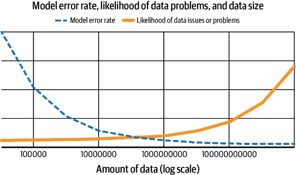
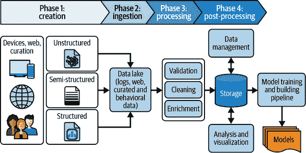
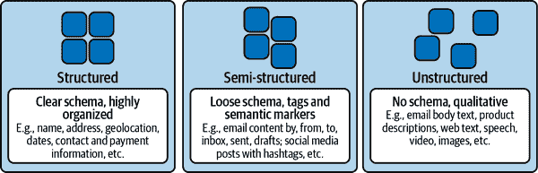
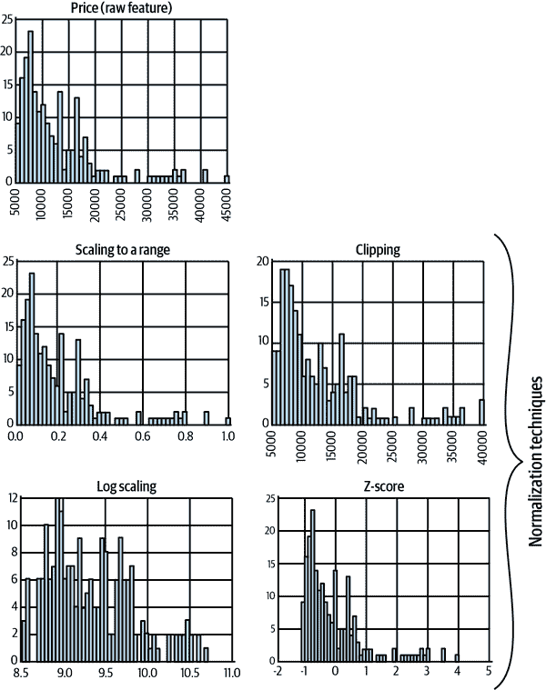
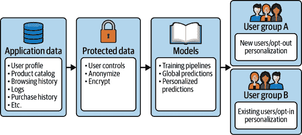

# 第二章：数据管理原则

在本书中，我们很少关注模型构建的算法细节或其结构化方式。去年最激动人心的算法发展是明年平凡的可执行内容。相反，我们对两件事情极为感兴趣：用于构建模型的数据以及将数据转换成模型的处理管道。

最终，ML 系统是数据处理管道，其目的是从数据中提取可用和可重复的见解。然而，ML 管道与传统的日志处理或分析管道有一些关键的不同和特定的约束，并以不同的方式失败。它们的成功很难衡量，并且许多失败很难检测到。（我们在第九章详细讨论这些主题。）基本上，它们消耗数据，并输出该数据的加工表示（尽管两者的形式大相径庭）。因此，ML 系统彻底和完全依赖其基础数据系统的结构、性能、准确性和可靠性。这是从可靠性角度来看 ML 系统最有用的思考方式。

在本章中，我们将深入研究数据本身：

+   数据的来源

+   如何解释数据

+   数据质量

+   更新数据源（我们如何使用它们以及如何使用它们）

+   将数据整理成适合使用的形式

我们将介绍数据的生产需求，并展示，就像模型一样，*生产中的数据有一个生命周期*：

+   摄入

+   清理和数据一致性

+   丰富和扩展

+   存储和复制

+   在训练中的使用

+   删除

数据和元数据定义的稳定性以及这些定义的版本控制至关重要，我们将解释如何实现它们。¹ 我们还将涵盖数据访问约束、隐私和可审计性问题，并展示确保*数据来源*（数据的来源）和*数据血统*（自我们获得以来谁负责它）的一些方法。在本章末尾，我们期望您对使数据处理链可靠且可管理的主要问题有完整但表面的理解。

# 数据作为负债

写作关于 ML 的几乎普遍建议数据在 ML 系统中是一个重要的*资产*。这种观点是正确的：没有数据，确实无法有 ML 系统。正如图 2-1 所示，通常情况下，具有更多（和更高质量）训练数据的简单（甚至简化的）ML 系统可以胜过具有较少或较不代表性数据的更复杂系统。

组织继续争相收集尽可能多的数据，希望找到将这些数据转化为价值的方法。事实上，许多组织已将此变成了一个极其成功的商业模式。想想 Netflix，其向客户推荐高质量节目和电影的能力是早期的差异化因素。据报道，Netflix 还利用这些数据，在进入内容制作业务后，根据对人们想观看什么的详细了解，确定为哪些受众制作哪些节目。

###### 图 2-1\. 数据大小、模型错误率及与数据相关的问题或风险的权衡示意图

当然，就像任何东西都可能是一种资产，在适当（不适当）的情况下，它也可能成为一种负债。对于数据来说，最重要的是说，数据的获取、收集和整理可能会揭示出数据中意想不到的微妙和复杂性。如果不考虑这些因素，可能会对我们和我们的用户造成潜在危害。所有这些方法必须根据数据类型适当地加以限定——例如，医疗记录可能需要与工作历史有所不同的处理。当然，最佳的数据整理方式成本高昂，所以这里没有免费的午餐。

这个简短部分的目的不是成为关于数据收集、存储、报告和删除实践的权威作品。这远远超出了本部分甚至本书的范围。这里的目的是列举出足够的复杂性，以阻止任何读者简单地认为“更多数据 == 更好”，或者认为“这些东西很简单”。让我们来看看数据的生命周期，看看其中一些挑战来自哪里。

首先，数据必须依照适用法律收集，这可能取决于我们组织所在地、数据来源地以及组织政策。我们肯定需要深思熟虑（并与我们可能运营的所有司法辖区的律师交流）。关于个人数据的内容有显著的限制，包括哪些算是关于人的数据、如何获得存储数据的许可、如何存储和检索已获得的许可、是否需要向提供数据的人提供访问权限以及在什么情况下需要。这些限制可能来自法律、行业实践、保险法规、公司治理政策或其他各种来源。某些司法辖区通常的限制包括禁止在未经明确书面同意的情况下收集个人可识别信息（PII），以及根据数据主体的请求删除该数据的要求。如何收集数据以及是否收集数据并非技术问题，而是政策和治理问题。（此主题的部分内容在第六章中更加详细地讨论。）

如果我们被允许收集和存储数据，必须确保防止外部访问。很少有好事发生在组织因泄露用户私人数据而导致的结果。此外，即使对员工也必须限制访问。员工不应无限制地查看或更改私人用户数据，并且必须详细记录这些操作。

减少数据访问和审计表面的另一种方法是对数据进行匿名化处理。一个相对简单且有价值的选项是使用*pseudonymization*（伪名化）。在这种情况下，私人标识符以可逆转的方式替换为其他标识符，并且要逆转伪名化需要访问额外的数据或系统。这保护了数据免受工作在管道上的工程师的随意检查，但如果我们发现需要逆转匿名化，则可以进行发现。伪名化还希望保留对于我们模型相关的数据特性。换句话说，如果某个数据字段在特定情况下保持某种相似性很重要（例如，考虑邮政编码，在同一城镇或同一城市的同一部分时，它们的前缀是相同的），那么我们的伪名化可能需要保留这种特性。尽管这种保护级别对于防止随意检查具有价值，但重要的是将伪名化数据视为与完全非匿名化数据一样有风险。历史上存在许多这类数据被用来暴露用户真实和私人信息的案例（请参见以下边栏）。

更好的方法是永久性地删除个人私密数据与我们用于训练的数据之间的直接连接。如果我们能永久性地消除私密数据与个人之间的关联，就能显著降低数据的风险，并增加我们处理数据的灵活性。当然，这比看起来要困难得多。³以一种不是轻而易举可逆的方式实现这一点，同时还有价值，确实很难。虽然有许多良好的技术存在，一个常见的基本想法是结合数据集，以确保没有任何一条报告的数据与任何少于某个真实人数的唯一标识符相关联。这是许多严肃的人口研究组织采取的方法，包括美国人口普查局。然而，要做到这一点，有许多微妙之处需要注意。正确的匿名化超出了本书的范围，尽管我们会提到它。

最后，我们最终需要能够删除数据。我们可能会在个别用户的请求、本地法律、欧盟的《通用数据保护条例》（[GDPR](https://gdpr-info.eu)）等法规或其他情况下进行此操作，即使我们不再有权限存储数据。删除数据并实际上让其被删除是非常困难的事情。

自从早期的 MS-DOS 时代以来，删除文件只是删除了对它的引用，而没有真正删除数据本身，这意味着您可以在足够的决心和运气下重建文件。如今的计算环境使删除变得更加困难，从追踪多个数据副本到元数据管理，无所不在。在大多数分布式存储系统中，数据被分成许多片段并存储在一组物理机器上。根据实现方式，可能几乎不可能确定每个可靠存储设备（硬盘驱动器或固态驱动器）可能存有数据。

确保人们希望删除他们的数据，而不是设立随意障碍，这一点非常重要。在平衡这一点时，可以在真正删除数据之前施加一段短暂的延迟。用户可能会在请求删除数据后被授予几小时甚至几天的时间来取消请求。但是，一旦确认请求是真实和合法的，我们将需要追踪到每一份数据副本并消除它。根据存储方式，数据结构、索引和备份可能需要重建，以确保访问附近数据的效率和可靠性与之前一样。

和大多数事情一样，删除数据的任务通过深思熟虑可以更好地完成。如果您的系统没有经过深思熟虑，可以使用一些变通方法。以下是两种常见的优化方法：

定期重写数据

当存在一个重新生成数据的过程时，我们可以利用先前提到的“不要立即删除数据”的建议，简单地安排“已删除”的数据，在下次数据重写时不包括这些数据。这假设数据再生周期与预期的和可接受的删除延迟相匹配。这还假设数据的重写有效地删除数据，这很可能根本不是事实。

加密所有数据并丢弃一些密钥。

这种设计方式的系统具有一些显著的优势。特别是，它保护“静止”状态的私密数据（写入持久存储）。删除数据也很简单：如果我们丢失了用户数据的密钥，我们就无法再读取这些数据。缺点大多是可以避免的，但值得认真考虑：任何采用这种策略的人都需要非常非常可靠的密钥处理系统，因为如果丢失密钥，*所有*数据都会丢失。这也可能使得从密钥系统的每个备份中可靠删除单个密钥变得困难。

# 机器学习管道的数据敏感性

机器学习管道与大多数数据处理管道的主要区别在于，机器学习管道对其输入数据的敏感性通常比大多数其他数据处理管道更高。所有数据处理管道在某种意义上都受其输入数据的正确性和数量的影响，但机器学习管道对数据*分布*的细微变化特别敏感。一个管道可以很容易地从大部分正确变成显著错误，只要省略了一小部分数据，而这一小部分数据不是随机的，或者在我们的模型敏感的特征范围内没有均匀采样。

在这里进行一个简单的思维实验，考虑一个像*yarnit.ai*这样的真实系统，它不知何故丢失了特定国家、地区或语言的所有数据。例如，如果我们删除了某一年的 12 月 31 日的所有数据，我们将失去检测跨年购物趋势的能力，这可能与 12 月和 1 月的其他日子有显著不同。在许多这些情况下，丢失了一小部分数据，结果是系统地有偏见的，会导致对我们模型的理解和预测产生显著混乱。

由于这种敏感性，聚合、处理和监控*数据*的能力至关重要，而不仅仅是实时系统。我们在第九章中详细讨论了数据监控，但这里提前预览一下。监控数据的一个关键见解是将数据沿着各种轴线（确定*哪些*轴线最适合切分数据是探索性数据分析中的重要活动，超出本书的范围）进行切片或分割。在试图追踪实时活动的系统中，我们可以根据数据的年龄分成数据桶：最近的、1 到 2 小时前的、3 到 6 小时前的等等。我们可以追踪当前正在处理数据的数据桶，以便了解我们已经落后了多少。但我们可以并且应该追踪与我们的应用程序相关的各种其他直方图。检测当*全部*或*几乎全部*子集数据消失时的能力将非常重要。

例如，在我们的购物网站*yarnit.ai*中，我们可能会根据搜索来训练，以预测任何给定搜索的最佳结果（其中“最佳”意味着“最有可能被购买”——毕竟我们是在销售业务中！）。我们在多个市场以多种语言运营我们的网站。假设一个广泛的支付故障只影响我们的西班牙语站点，导致使用西班牙语搜索的人完成订单的数量大幅减少。一个旨在推荐客户购买产品的模型将会学习到，与其他语言的结果相比，西班牙语结果显著减少购买的可能性。该模型将会展示更少的西班牙语结果，甚至可能开始向使用西班牙语的用户展示其他语言的结果。当然，该模型将无法“知道”这种行为变化的原因。

如果我们的网站主要是北美或欧洲网站，这可能会导致总购买量略微下降，但西班牙语的搜索和购买总数将大幅下降。如果我们基于这些数据进行训练，我们的模型可能会对西班牙语搜索结果表现出糟糕的结果。它可能会学到西班牙语查询从不购买任何东西（因为这基本上是真实的）。模型可能会开始展示探索性行为——如果所有的西班牙语结果都一样糟糕，那么任何结果*可能*都是好的，因此模型将尝试找到西班牙语搜索者实际可能购买的任何东西。这将导致糟糕的搜索结果和销售额下降，一旦我们的西班牙站点的支付故障解决后，后果将非常糟糕。这是一个相当糟糕的结果。（有关类似问题的更完整处理，请参见第十一章。）

查询量的变化可能在总体查询量水平上也不容易检测到，因为西班牙语的总体查询量可能与其他语言相比较小。我们将讨论如何监控训练管道，并检测这些分布变化的方法，详见第九章。这个例子只是为了激发思考，即 ML 管道确实更难以可靠地运行，因为这些微妙的故障模式。

在考虑这些限制的情况下，让我们回顾一下我们系统中数据的生命周期。我们必须从数据被创建的那一刻开始，将其视为我们的责任，直到我们删除它。

# 数据的各个阶段

大多数团队依赖于他们使用的平台，包括他们的数据存储和处理平台，以提供他们需要的大部分内容。YarnIt 并不是一个大型组织，但我们仍然会让负责业务管理、数据工程和运营的员工帮助我们理解和满足这里的需求。我们很幸运有 SREs 来解决与数据存储和处理相关的可靠性问题。

数据管理阶段基本上是将我们拥有的数据转换为适合后续处理阶段使用的格式和存储组织。在此过程中，我们还可能应用一系列特定于模型（或至少是模型领域特定）的数据转换，以准备数据进行训练。我们对数据的下一步操作将是训练 ML 模型、匿名化某些敏感数据项，并在不再需要或被要求这样做时删除数据。为了为这些数据操作做好准备，我们将继续从业务领导者那里获取输入，以回答关于我们数据主要用例及未来探索可能领域的问题。

与本书的大部分章节一样，要设计和运行可靠的 ML 系统，并不一定需要或有时甚至不希望深入了解 ML。然而，对模型训练的基本理解确实直接影响我们如何准备数据。在现代 ML 环境中，数据管理在将数据馈送到模型训练管道之前包含多个阶段，如图 2-2 所示：

+   创造

+   摄入

+   处理（包括验证、清洗和增强）

+   后处理（包括数据管理、存储和分析）

###### 图 2-2. ML 数据管理阶段

## 创造

或许这样说会显得奇怪或显而易见，但是机器学习训练数据来自于*某处*。也许您的数据集来自于其他地方，比如另一个部门的同事或者来自学术项目，并在那里创建。但数据集总是通过某种过程在某一时点创建的。在这里，我们指的是数据创建作为在*某些*数据存储系统中生成或捕获数据的过程，但不是*我们*的数据存储系统。例如，这些例子包括来自服务系统日志、从事件中捕获的大量图像集、医疗程序的诊断数据等。在这个过程中隐含的是，我们希望设计新系统并改进现有系统，以生成比我们可能需要的更多的数据，以便我们的机器学习系统有东西可以使用。

有些数据集在静态时表现良好（或至少不会迅速更改），而其他数据集仅在频繁更新时才有用。例如，一个照片识别数据集在很多个月内可能是可用的，只要它合适地代表了我们想用我们的模型识别的照片类型。另一方面，如果外部照片只代表了温带气候下的冬季环境，则照片集的分布将与我们需要识别的预期图像集显著不同。因此，在这些地方春季升温时，它将不会有用。同样地，如果我们试图自动识别*yarnit.ai*上的交易欺诈，我们将希望不断地在最新交易上训练我们的模型，并提供关于这些交易是否欺诈的信息。否则，有人可能会想出一个难以检测的聪明办法来窃取我们所有的编织用品，我们可能永远不会教会我们的模型如何检测它。

我们收集的数据类型和我们创建的数据产物可以是非结构化、半结构化或非常结构化（图 2-3）。

*结构化数据* 是定量的，具有预定义的数据模型/架构，高度组织化，并以类似电子表格或关系数据库的表格格式存储。名称、地址、地理位置、日期和付款信息都是结构化数据的常见例子。由于其格式良好，结构化数据可以通过相对简单的代码和明显的启发式算法轻松处理。

另一方面，*非结构化数据* 是没有标准数据模型/架构的定性数据，因此无法使用传统的数据方法和工具进行处理和分析。非结构化数据的例子包括电子邮件正文、产品描述、网页文本以及视频和音频文件。半结构化数据没有特定的数据模型/架构，但包括标签和语义标记，因此是介于结构化数据和非结构化数据之间的一种结构化数据类型。半结构化数据的例子包括可以按发件人、收件人、收件箱、已发送、草稿等搜索的电子邮件，以及社交媒体内容，可以根据公开、私密和朋友分类，还可以根据用户维护的标签（如标签）进行分类。数据的内部结构特性将对我们处理、存储和使用数据的方式产生重大影响。

###### 图 2-3\. 机器学习训练数据分类

尽管模型中的偏见来自模型结构以及数据，但数据创建的环境对正确性、公平性和伦理有深远影响。虽然我们在第五章和第六章中详细讨论这一点，但我们在这里能够提出的主要建议是您应该有某种流程来确定您的模型是否存在偏见。我们可以通过多种方式做到这一点，最简单的可能是采用[模型卡片](https://oreil.ly/h7E8h)方法，但是任何具备这种流程并且被组织接受的流程都比没有这种流程要好得多。这绝对是在我们开始处理机器学习系统中的伦理和公平考虑时要做的第一件事情。例如，您可以相对容易地将检测偏见的工作整合到数据溯源或数据生命周期会议或跟踪流程中。但是，每个从事机器学习的组织都应该建立某种流程，并将其作为持续改进的一部分进行审查。

回想一下，偏见来自很多来源，并且在整个过程中的多个阶段都会显现出来。没有确保数据公平性的绝对方法。在这里取得成功的一个有用前提是拥有一个包容性强的公司文化，这个文化包括来自各种背景、拥有不同和创新观点的人员。有充分的证据表明，具有非常不同背景和观点的人，在建立在信任和尊重基础上的环境中工作，比那些成员相似的团队产生更好、更有用的想法。这可以成为对通过先前描述的检查中可能出现的偏见的一种强有力的防御措施的一部分。然而，这并不会在没有过程和工具支持的情况下防止所有不良后果，正如没有系统帮助的人类努力也无法防止所有不良后果一样。

最后关于数据集创建或者说数据集增强的一个注意事项：如果我们有少量的训练数据，但不足以训练高质量的模型，可能需要增强这些数据。现有工具可以实现这一点。例如，[Snorkel](https://www.snorkel.org/features)提供了一个编程接口，可以将少量数据点排列成更多更多样化的数据点，从本质上讲，这些数据是虚构的但在统计上是有效的训练数据。这是一个很好的起点，因为它可以帮助我们轻松地将小数据集扩展成大数据集。尽管从表面上看，这种程序生成的数据集可能不那么有价值或有用，但有充分的证据表明，这种方法可以以较低的成本获得极好的结果，尽管使用时需要谨慎。⁵

## 数据摄取

数据需要进入系统并写入存储以进行进一步处理。在这个阶段，必然会进行过滤和选择。由于我们不需要或不希望所有创建的数据都被摄取或收集，因此可能不会收到全部数据。

我们可以在这个阶段按类型过滤数据（即我们认为对我们的模型不会有用的数据字段或元素）。如果数据量很大，我们认为无法承担处理所有数据，我们也可以在这个阶段进行简单的抽样。由于机器学习训练和其他数据处理通常非常耗费计算资源，抽样数据可以是节省中间处理和训练成本的有效方式，但重要的是要衡量抽样的质量成本，并将其与节省的成本进行比较。数据还应该按照我们关心的每个时间段或其他切片的体积/速率进行比例抽样。这样可以避免在突发期间丢失细节。然而，抽样很可能偶尔会在某些事件上失去一些细节，这是无法避免的。

通常情况下，机器学习训练系统在使用更多数据时表现更好。吹毛求疵者会立即想到许多例外情况，但这是一个有用的起点。因此，任何数据的减少可能会同时影响质量和成本。

根据数据量和服务的复杂性，摄取阶段可能仅仅是“将一些文件倒入那个目录”或者是一个复杂的远程过程调用（RPC）端点，接收特定格式的文件并确认接收到的数据包的参考，以便能够追踪其在系统中的进展。在大多数情况下，我们希望至少通过一个简单的 API 提供数据摄取，因为这提供了一个明显的地方来确认数据的接收/存储，记录摄取过程，并应用任何关于数据的治理政策。

在摄取阶段的可靠性关注点通常集中在正确性和吞吐量上。*正确性*是数据在正确位置正确读取和写入的一般属性，而不会被不必要地跳过或放错地方。虽然放错数据的想法听起来有些滑稽，但这绝对会发生，并且很容易理解为什么会发生。存储中的日期或时间导向的分桶系统与摄入过程中的一个偏移错误结合起来，可能导致每天的数据存储在前一天的目录中。在摄入数据之前和期间监控数据的存在和状态是数据流水线中最困难的部分。

## 处理

一旦我们成功地将数据加载（或摄取）到一个合理的特征存储系统中，大多数数据科学家或建模者将进行一系列常见的操作，使数据准备好进行训练。这些操作——验证、清洗和确保数据一致性，以及丰富和扩展——将在接下来详细说明。

### 验证

无论我们的机器学习模型多么高效和强大，如果数据质量不好，它们都不能按照我们的期望进行。在生产环境中，数据错误的常见原因是首次收集数据的代码中存在的错误。来自外部来源的数据可能会存在许多错误，即使每个来源都有一个明确定义的模式（例如，整数字段的浮点值）。因此，在有明确定义的模式和/或能够与上次已知有效的数据进行比较时，验证传入的数据尤为重要。

验证是根据领域的通用定义进行的，即它是否符合我们的预期？为了进行此验证，我们需要存储并能够引用这些标准定义。使用全面的元数据系统来管理一致性并跟踪字段的定义，对于维护数据的准确表示至关重要。这在第四章中有更详细的讨论。

### 清洗和确保数据一致性

即使有了一个体面的验证框架，大多数数据仍然杂乱无章。它可能存在缺失字段、重复、错误分类，甚至编码错误。数据越多，清洗和数据一致性就越可能成为处理的一个阶段。

对许多初次这样做的人来说，这似乎很令人沮丧且不必要：建立一个完整的系统仅仅为了检查数据听起来有点夸张。事实上，我们的机器学习流水线肯定会有专门清理数据的代码。我们可以把这些代码放在一个地方，可以进行审查和改进，或者把它们放在整个训练流水线的各个环节中。第二种策略会导致流水线非常脆弱，因为关于数据正确性的假设会增多，但我们确保这些假设得到满足的能力并没有增强。此外，当我们改进某些用于验证和校正数据的代码时，我们可能会忽视在执行这些工作的所有许多地方实施这些改进。或者更糟糕的是，我们可能会适得其反。例如，我们可以多次“修正”同一数据，以消除数据中的原始信息。我们还可能存在潜在的竞争条件，即流程的不同部分在不同的方式上清理或使数据一致。

在这一部分的另一组数据一致性任务是数据的归一化。*归一化*通常指一组技术，用于将输入数据转换为类似的比例，这对于依赖于梯度下降或类似数值优化方法进行训练的深度学习等方法非常有用。一些标准技术如 图 2-4 所示，包括以下内容：

缩放到一个范围

将数据的所有 X 值映射到一个固定的范围，通常是 0 到 1，但有时（例如身高或年龄）也可以是其他代表常见最小和最大值的数值。

截断

截断数据的最大值。当数据集存在少数极端异常值时，这是有用的。

对数缩放

*x*’ = log(*x*)。当数据呈幂律分布，具有少数非常大的值和大量非常小的值时，这是有用的。

Z 分数标准化

将变量映射到距离均值的标准偏差数量。

需要注意的是，如果在一个具有与稍后应用它的数据集不同属性的测试数据集上计算任何范围、分布或平均值，这些技术中的每一种都可能存在风险。

最后一个相关且常见的技术是将数据放入*桶*中：我们将一系列数据映射到表示相同范围的一组更小的组中。例如，我们可以用年龄来衡量年龄，但在训练时，我们可以按十年为单位分桶，以便所有年龄在 30 到 39 岁之间的人都被放入“30 年代”桶中。分桶可能导致许多难以检测的错误。例如，一个系统按十年边界分桶，另一个系统按五年边界分桶。在我们分桶数据时，我们必须认真考虑保留现有数据，并为每个记录编写一个新的、正确格式的字段。如果（何时？）我们改变分桶策略，我们会很高兴我们这样做了；否则，将无法进行切换。

###### 图 2-4\. 标准化技术，如 Google Developers 的[数据准备课程](https://oreil.ly/0cgBm)

### 丰富和扩展

在这个阶段，我们将我们的数据与其他来源的数据结合起来。最常见和基本的扩展数据的方式是通过*标记*。这个过程通过从外部数据源（有时是人类）确认来标识特定事件或记录。标记数据是所有监督机器学习的关键驱动因素，并且通常是整个机器学习过程中最具挑战性和昂贵的部分之一。没有足够数量和高质量的标记数据，监督学习将无法进行。（标记和标记系统在第四章中有详尽的讨论。）

但是标记只是扩展数据的一种方式。我们可能会使用许多外部数据源来扩展我们的训练数据。假设出于某种原因我们相信一个人所在位置的温度会预测他们将购买什么。⁶ 我们可以取得在用户访问网页时的大致地理位置的温度，将其加入到*yarnit.ai*网站搜索日志中。我们可以通过查找或创建温度历史服务或数据集来实现这一点。这将允许我们基于`source temperature`作为特征训练模型，看看我们可以做出什么样的预测。这可能是一个糟糕的想法，但并非完全不切实际。

## 存储

最后，我们需要将数据存储在某个地方。我们如何存储数据的方式和位置大部分由我们倾向于如何使用它来驱动，这实际上是一系列关于训练和服务系统的问题。我们在第四章中对此进行了更详细的讨论，但这里有两个主要关注点：存储效率和元数据。

存储系统的效率受访问模式的驱动，这些模式受模型结构、团队结构和训练过程的影响。为了对我们的存储系统做出明智的选择，这里有一些我们需要回答的基本问题：

+   我们是否仅仅在这些数据上训练模型一次，还是多次？

+   每个模型会读取*全部*数据还是只有部分数据？如果只读取部分数据，所选子集是通过数据类型（某些字段而非其他字段）还是通过随机抽样数据（所有记录的 30%）选择的？

+   特别是，相关团队是否读取数据中的不同字段子集？

+   我们需要按特定顺序读取数据吗？

关于数据重用，事实证明几乎所有数据都会被多次读取，因此存储系统应该以此为基础构建，即使模型所有者声称他们只会对数据训练一次模型也是如此。为什么？模型开发本质上是一个迭代过程。ML 工程师创建一个模型（读取必要的数据以完成此操作），衡量模型在设计任务中的表现，并部署它。然后，他们想出了另一个想法：如何以某种方式改进模型。在你意识到之前，他们又重新读取相同的数据来尝试新的想法。我们建立的每个系统，从数据到训练再到服务，都应该基于这样一个假设：模型开发人员将半连续地重新训练同一模型以改进其性能。实际上，当他们这样做时，他们可能每次都会读取数据的不同子集。

鉴于此，以每个特征为一列的列式存储方案是一种常见的设计架构，尤其是对于在结构化数据上进行模型训练的情况。⁷ 大多数读者熟悉行式存储，即从数据库中提取数据时检索匹配行的所有字段。这是一种适合所有使用大部分或全部数据的应用集合的架构，换句话说，是一组非常相似的应用集合。列式数据便于仅检索字段子集。这对于使用给定数据子集的应用集合（在这种情况下是 ML 训练流水线）非常有用。换句话说，列式数据存储允许不同的模型有效地读取不同的特征子集，而无需每次读取整行数据。我们在同一位置收集的数据越多，就越有可能有不同的模型使用该数据的完全不同子集。

然而，对于某些训练系统而言，这种方法实在太复杂了。例如，如果我们正在处理大量未经预处理的图像，我们实际上不需要采用列式存储系统——我们可以直接从目录或存储桶中读取图像文件。但是，假设我们正在读取更结构化的数据，例如具有时间戳、来源、引荐者、金额、商品、运输方式和支付机制等字段的交易数据日志。那么，假设某些模型将使用其中一些特征，而其他模型将使用其他特征，这将促使我们采用列式结构。

元数据帮助人类与存储进行交互。当多人在同一数据上构建模型（或同一人在一段时间内进行此工作）时，有关存储特征的元数据提供了巨大的价值。它是理解上一个模型是如何组合的以及我们可能如何组合模型的路线图。存储系统的元数据是机器学习系统中常被低估的部分之一。

本节应明确指出，我们的数据管理系统主要受两个因素驱动：

我们打算利用数据的业务目的

我们试图解决什么问题？这个问题对我们的组织或客户有什么价值？

模型结构和策略

我们计划构建哪些模型？它们是如何组合的？它们多频繁地刷新？有多少个模型？它们彼此有多相似？

我们对数据管理系统的每个选择都受到这两个因素的制约，并且也对它们施加制约。如果数据管理是关于我们如何以及为何写数据，那么机器学习训练流水线就是关于我们如何以及为何读数据。

## 管理

典型情况下，数据存储系统实施基于凭证的访问控制，以限制未经授权的用户访问数据。这种简单的技术只能满足基本的机器学习实现。在更复杂的场景中，特别是当数据包含机密信息时，我们需要采用更精细的数据访问管理方法。例如，我们可能希望只允许模型开发者访问他们直接工作的特征，或者以其他方式限制他们对数据子集的访问（也许只能访问最近的数据）。另外，我们可能会在数据静态存储或访问时对数据进行匿名化或伪匿名化处理。最后，我们可能会允许生产工程师访问所有数据，但只有在事故期间证明确实需要访问，并且通过一个独立团队仔细记录和监控他们的访问情况。（这些有趣的方面在第十一章中有所讨论。）

SREs 可以在生产环境中配置数据访问限制，允许数据科学家通过授权网络（如虚拟专用网络（VPN））安全读取数据，实施审计日志记录以跟踪哪些用户和训练作业正在访问哪些数据，生成报告并监视使用模式。业务所有者和/或产品经理可以根据使用案例定义用户权限。我们可能需要生成和使用不同类型的元数据来处理这些异构性维度，以最大化我们访问和修改数据以供后续阶段使用的能力。

## 分析与可视化

*数据分析和可视化*是将大量数据转换为使用统计和/或图形技术和工具易于导航的表示的过程。⁸ 这是 ML 架构和知识发现技术的基本任务，使数据变得更少混乱和更易访问。仅仅展示饼图或条形图是不够的。我们需要为人类读者提供每个数据集记录意味着什么，它与其他数据集中的记录如何关联以及它是否干净安全可用于训练模型的解释。对于数据科学家来说，要查看大型数据集而没有定义良好且高性能的数据可视化工具和流程几乎是不可能的。

# 数据可靠性

因为我们的数据处理系统需要正常运行，数据在穿越系统时必须具备几个特性。明确这些特性可能是有争议的。对一些人来说，它们似乎是显而易见的，而对另一些人来说，似乎是不可能真正保证的。这两种观点都错过了关键点。

阐明关于我们的数据应始终如一的不变性的意图是，它允许我们所有人在这些不真实或系统不能正确保证它们将如实时发现时采取行动以在未来做得更好。请注意，可靠性的主题，即使是数据管理系统，也是非常广泛的，这里无法完全覆盖；有关更多详细信息，请参见[*《站点可靠性工程：谷歌如何运行生产系统》*](https://oreil.ly/ZzIkN)，由 Betsy Beyer 等人编辑（O’Reilly 出版社，2016 年）。

这部分仅涵盖确保数据不会丢失（持久性）、所有副本一致性和随时间变化进行严格跟踪（版本控制）的基础知识。我们还将介绍如何考虑数据读取速度（性能）以及数据尚未准备好进行读取的频率（可用性）。对这些概念的快速概述应使我们能够专注于正确的领域。

## 持久性

在详细说明存储系统要求时，持久性通常是被忽视最多的，因为它被视为理所当然。*持久性*是存储系统拥有您的数据并且没有丢失、删除、覆盖或损坏的属性。我们绝对希望以非常高的概率拥有这种属性。

持久性通常以每年无法取回丢失的字节或块的百分比表达。在这里，良好存储系统的常见值为 11 或 12 个 9，也可以表达为“存储的字节 99.999999999%或更多不丢失”。虽然这可能是底层存储系统的提供，但我们的保证可能要逊色得多，因为我们正在编写与存储系统交互的软件。

一个重要的注意事项是，一些系统具有极其耐用的数据，即没有任何数据丢失，但却有可能出现故障模式，导致某些数据长时间无法访问。这可能包括需要从另一个较慢的存储系统（例如磁带驱动器）恢复数据，或者通过缓慢的网络连接从离线位置复制数据。如果这是原始数据并且对模型很重要，可能需要恢复它。但对于某种方式从现有原始数据派生的数据，可靠性工程师可能会考虑是否更容易仅重新创建数据而不是恢复它。

对于具有许多数据转换的机器学习存储系统，我们需要谨慎考虑这些转换的编写和监控方式。我们应该记录数据转换，并且如果负担得起的话，存储数据转换前后的副本。在数据从未管理状态转为管理状态的摄取过程中，跟踪数据是最困难的地方。由于我们建议在摄入过程中使用 API，这为确保数据存储、记录事务和确认接收数据提供了一个明确的位置。如果数据未能干净地和持久地接收，则发送系统当然可以重试发送操作，而数据仍然可用。

在数据转换的每个阶段，如果我们负担得起的话，应该存储数据的转换前后的副本。我们还应该监控转换的吞吐量以及预期的数据大小变化。例如，如果我们对数据进行 30%的抽样，则转换后的数据显然应该是转换前数据大小的 30%，除非发生错误。另一方面，如果我们通过分桶将浮点数转换为整数，根据数据表示的方式，我们可以预期结果数据大小保持不变。如果结果数据要么大得多要么小得多，那几乎可以肯定存在问题。

## 一致性

当我们从多台计算机访问数据时，我们可能希望保证每次读取的数据都是相同的；这就是*一致性*的特性。任何规模的机器学习系统通常都是分布式的。我们正在进行的大部分处理基本上是可以并行化的，并且假设从一开始就使用机器集群通常是值得的。这意味着存储系统将通过网络协议从其他计算机访问，并引入了可靠性方面的挑战。特别是，它引入了相同数据的不同版本可能同时存在的事实。很难保证数据在任何地方都是复制的、可用的和一致的。

是否模型训练系统关注一致性实际上是模型和数据的一个属性。并非所有的训练系统都对数据的不一致性敏感。就此而言，并非所有*数据*都对不一致性敏感。一个思考的方式是考虑数据的密集度或稀疏度。当每个数据片段所代表的信息很稀少时，数据是*稀疏*的。当每个数据片段所代表的信息很常见时，数据是*密集*的。当数据集中有大量零值时，数据是稀疏的。因此，如果*yarnit.ai*有 10 种畅销毛线，几乎代表了我们销售的全部内容，那么对于任何一种毛线的购买来说，数据是密集的——这不太可能教给我们太多新东西。如果一种畅销毛线的单次购买在我们的存储系统的一个副本中可读，而在另一个副本中不可读，模型基本上不会受到影响。另一方面，如果我们 90%的购买是不同种类的毛线，那么每一次购买都很重要。如果我们的某一部分训练系统看到了某种特定毛线的购买，而另一部分没有看到，我们可能会产生相对于该特定毛线或我们模型表示为与该毛线相似的毛线的不一致模型。在某些情况下，一致性很难保证，但通常情况下，如果我们可以稍等数据到达和同步，我们可以轻松地保证这一属性。

我们可以通过两种简单直接的方式消除数据层面的一致性问题。第一种是构建能够抵御不一致数据的模型。就像其他数据处理系统一样，机器学习系统也需要权衡。如果我们能够容忍不一致数据，特别是当数据最近写入时，我们可能能够显著加快模型训练速度并更便宜地操作我们的存储系统。在这种情况下的成本是灵活性和保证。如果我们选择这条路，我们就限制了自己只能无限期地在这些保证下操作存储系统，并且只能训练满足这一属性的模型。这是一个选择。

第二个选择是运行一个提供一致性保证的训练系统。对于一个复制的存储系统来说，最常见的做法是系统本身提供关于哪些数据是完全和一致地复制的信息。读取数据的系统可以消费这个字段，并选择仅在完全复制的数据上进行训练。这对存储系统来说通常更复杂，因为我们需要提供复制状态的 API。这可能也更昂贵或更慢。如果我们希望在摄入和转换后快速使用数据，我们可能需要为网络（复制数据）和存储 I/O 容量（写入副本）预留大量资源。

思考一致性需求是战略性决策。这对于平衡成本和能力具有长期影响，并且应该由机器学习工程师和组织决策者共同参与决策。

## 版本控制

机器学习数据集的版本管理，在许多方面与传统数据和/或源代码版本控制类似，用于书签化数据状态，以便将来应用特定版本的数据集进行后续实验。*版本控制* 在新数据可用进行重新训练时以及计划实施不同数据准备或特征工程技术时变得重要。在生产环境中，机器学习专家处理大量数据集、文件和指标，以进行日常操作。这些工件的不同版本需要在多次迭代中进行跟踪和管理。版本控制是管理众多数据集、机器学习模型和文件以及记录多次迭代的良好实践——即何时、为何以及做了什么修改。⁹

## 性能

存储系统需要足够快的写入吞吐量，以快速摄取数据而不影响转换速度。系统需要足够快的读取带宽，使我们能够根据适合我们建模行为的访问模式快速训练模型。值得注意的是，慢读取性能的代价可能相当高，因为机器学习训练通常使用相对昂贵的计算资源（如 GPU 或高端 CPU）。当这些处理器因等待训练数据而停滞不前时，它们只是在消耗周期和时间，而没有完成任何有用的工作。许多组织认为自己无法投资于其存储系统，但实际上它们无法承担不投资的后果。

## 可用性

我们写入的数据在我们阅读时需要存在。*可用性* 在某些方面是耐久性、一致性和性能的产物。如果数据存在于我们的存储系统中，并且被一致地复制，我们能够以合理的性能读取它，那么这些数据就算是可用的。

# 数据完整性

有价值的数据应当受到妥善对待。这意味着尊重数据的来源、安全性和完整性。¹⁰ 我们的数据管理系统将需要从一开始就设计这些特性，以便能够为我们提供的访问控制和其他数据完整性做出适当的保证。

数据完整性除了安全性和完整性外还有三个重要主题：隐私、政策合规性和公平性。值得花时间从总体角度考虑这些主题。我们需要确保理解这些领域所提出的要求，以便确保我们构建的存储系统和 API 能够提供我们所需的各种保证。

## 安全性

有价值的 ML 数据通常以私有数据的形式开始其生命周期。一些组织选择建立流程，从其数据存储中简单地排除所有 PII。出于几个原因，这是一个好主意。它简化了访问控制问题。它消除了数据删除请求的运营负担。¹¹ 最后，它消除了存储私人信息的风险。正如我们讨论过的，数据应该像资产一样被视为一种负债。

我们可能已经成功地从 ML 数据存储中排除了 PII。但是，出于两个原因，我们可能不应该完全依赖于此。一方面，我们可能没有像我们认为的那样有效地排除 PII。正如前面提到的，如果没有对添加到特征存储中的*所有*数据进行深思熟虑的人工审查，要识别 PII 是非常困难的，因此极有可能一些数据与其他数据结合在一起确实包含 PII。另一方面，对于许多组织来说，合理地从数据存储中排除所有 PII 可能根本不可行。因此，这些组织有义务强化对其数据存储的保护。

关于个人可识别信息（PII）的担忧之外，团队可能会针对特定类型的数据开发特定的使用方式。数据存储的合理使用将限制对某些数据的访问，仅允许最有可能需要和使用该数据的团队访问。深思熟虑地限制访问将实际上提高生产力，因为模型开发人员可以轻松访问（并且只访问）他们最有可能用于构建模型的数据。

在所有情况下，系统工程师应跟踪关于哪些开发团队构建了哪些模型以及哪些模型依赖于特征存储中哪些特征的元数据，这有效地形成审计跟踪。这些元数据对于操作和安全相关目的是有用的，如果不是必需的。

## 隐私

当 ML 数据涉及个人时，存储系统需要具有保护隐私的特性。将客户或合作伙伴的私人信息泄露是将数据从资产转变为负债的最快方式之一。

我们可以在处理私有数据方面做出两种不同的架构选择：消除或锁定。在我们仍然可以获得优秀结果的情况下，消除私有数据是一种极其合理的策略。如果我们防止 PII 数据被存储在数据存储系统中，我们就消除了大部分持有私有数据的风险。这可能会很困难——不仅因为识别私有数据并不总是容易，还因为在没有私有数据的情况下很难获得出色的结果。

###### 图 2-5\. 数据在 ML 系统中移动时的选择和处理

考虑到所有这些复杂性，将数据在摄取时进行匿名化要更好、更容易。如前所述，匿名化的话题在技术上很复杂，但每个构建机器学习系统的人都需要了解两个关键事实：

匿名化很难。

这是人们研究并发展专业知识的一个话题。不要试图随便应付。认真对待并做到完美。

匿名化取决于上下文

没有一种确保可以在不了解其他数据存在及其数据之间关系的情况下对数据进行匿名化的方法。

匿名化虽然困难，但并非不可能，而且在正确执行时，可以避免一系列其他问题。请注意，这样做会需要定期审查，以确保当前的匿名化仍符合在实施时对数据和访问权限的假设，以及每次添加新数据源时的审查，以确保数据源之间的连接不会破坏匿名化。关于这个主题，在第六章中有更详细的讨论。

## 策略与合规

策略和合规通常源自于你的组织之外的要求。在某些情况下，“组织之外”实际上指的是 YarnIt 的老板或律师执行外部的法律要求，而在其他情况下，它可能意味着国家政府直接介入。这些要求通常背后有痛苦而强大的理由，但通常在看待这些要求本身时并不明显。

这里有一个令人讨厌但又强有力的例子：关于浏览器中的 cookie 同意的欧洲法规经常给欧洲和非欧洲的网站用户们显得过于烦扰、侵入性或愚蠢。网站需要明确获得用户同意以在用户设备上存储标识符的想法可能看起来是不必要的。但任何了解第三方广告 cookie 侵犯隐私能力的人都可以证明，至少在一些对 cookie 的限制背后有一个非常强大的理由。虽然“对每个网站的每个用户都询问”的方式可能不是最优雅和可扩展的，但当我们更了解这些 cookie 如何被使用及保护用户隐私的难度时，这种做法就更容易理解了。

对数据存储的政策和合规要求应该认真对待。但单纯根据要求或标准的字面意思而不了解背后意图是一个错误。通常，整个咨询行业已经开发出了复杂的合规实践，而简单的方法也可能是合规的。

如前所述，匿名化是一种潜在的合规捷径。如果私人数据需要特别处理，也许可以通过确定（并*记录*）我们没有存储任何私人数据的方式来避免这些要求。

关于政策和治理要求，还有两件事需要注意：司法管辖区和报告。

### 司法管辖规则

当今世界上充斥着越来越多的政府，他们主张对存储在其地理位置中的数据处理进行控制。虽然原则上这似乎合理，但却并不完全符合过去几十年来构建网络计算机系统的方式。甚至对于一些云服务提供商来说，确保在一个国家生成的数据在该国家内处理可能都不可能。YarnIt 计划全球销售，即使我们可能最初只在少数几个国家推出。因此，我们必须仔细考虑需要遵守的数据存储和处理要求。

对于较大的组织来说，一个司法管辖区的选择比任何其他选择都更为重要：公司总部所在国家。这很重要，因为该国政府能够对存储在任何其他国家的数据行使权力。选择公司注册国可以对我们的数据管理系统产生深远的影响，但这并不是大多数人仔细考虑的因素。他们应该考虑。

### 报告要求

记住，合规工作需要报告。在许多情况下，报告可以融入我们监控服务的方式中。合规要求是服务水平目标（SLOs），报告包括服务水平指标（SLIs），这些指标确定了我们在合规 SLOs 方面的实施状态。这样考虑可以将这项工作与我们需要完成的其他实施和可靠性工作正常化。

# 结论

这是一个快速而肤浅的介绍（尽管可能并不感觉如此），以思考 ML 数据系统。此时，你可能还不太能够构建完整的数据摄入和处理系统，但应该清楚这样一个系统的基本要素。更重要的是，你应该能够识别出一些最大的风险和陷阱所在。为了在这方面取得实际进展，大多数读者将希望将他们的努力分成以下几个方面：

政策与治理

许多组织从产品或工程团队开始进行 ML 工作。正如我们所强调的，然而，长远来看，拥有一致的政策决策和一致的治理方法将至关重要。尚未开始这项工作的组织应立即着手。第六章 是一个很好的起点。

要在这个领域产生最大影响，你应该首先确定可能存在的最大问题或差距，并优先解决它们。考虑到当前我们对错误使用 ML 风险的理解及可用工具的现状，完美是不可能的。但绝对可以减少严重违规的情况，并且这是一个合理的目标。

数据科学与软件基础设施

如果我们已经开始使用机器学习，很可能我们的数据科学团队已经在组织的各个地方建立了定制的数据转换管道。清理、规范化和转换数据是正常操作，需要进行机器学习。为了避免未来的技术机器学习债务，我们应尽快开始建立软件基础设施，将这些转换管道集中起来。¹³

已经解决了自身问题的团队可能会对这种中心化产生抵触情绪。然而，通过将数据转换作为服务运行，有时可以吸引所有新用户甚至一些现有用户转移到中心化系统。随着时间的推移，我们应该努力将数据转换集中在一个单一、良好管理的地方。

基础设施

我们显然需要大量的数据存储和处理基础设施来有效管理机器学习数据。其中最重要的元素是特征存储系统（通常简称为*特征存储*）。我们在第四章详细讨论了特征存储系统的有用元素。

¹ 如果数据本身是可变的并且经常更新，也许还需要为数据的不同版本进行版本控制。

² 数据要想成为有用的，必须是高质量的（准确的、足够详细的、代表我们模型关心的世界事物）。对于监督学习来说，数据必须是一致且准确标记的——也就是说，如果我们有羊毛和针的图片，我们需要知道哪些是哪些，这样我们才能用这个事实来训练模型识别这些类型的图片。没有高质量的数据，我们就不能期望得到高质量的结果。

³ AOL 搜索日志案例是最著名的失败案例；详见 Michael Barbaro 和 Tom Zeller Jr.的[“A Face Is Exposed for AOL Searcher No. 4417749”](https://oreil.ly/WALx5)。这一事件也在维基百科的[“AOL search log release”页面](https://oreil.ly/cBpOve)有所解释。

⁴ 与数据集的模型卡片相辅相成的方法称为数据卡片；详见[数据卡片实战站点](https://oreil.ly/aaSMr)。

⁵ 更多详情请参见 Alexander J. Ratner 等人的[“Learning to Compose Domain-Specific Transformations for Data Augmentation”](https://oreil.ly/uxLdr)。

⁶ 没有太多理由相信这是真的，但这个想法似乎有些合理和有趣。如果有人实现“源温度”作为一个功能，并发现它很有价值，请联系作者领取签名书。

⁷ 大多数常见的大数据存储和分析服务来自大型云提供商都是面向列的。Google Cloud BigQuery、Amazon RedShift 和 Microsoft Azure SQL Data Warehouse 都是面向列的，数据服务提供商 Snowflake 的主要数据存储也是如此。PostgreSQL 和 MariaDB Server 都有面向列的配置选项。

⁸ 数据科学家、数据分析师、研究科学家和应用科学家使用各种数据可视化工具和技术，包括信息图表、热力图、发烧图、面积图和直方图。欲知更多，请参考维基百科的[“数据和信息可视化”页面](https://oreil.ly/DL2B2)。

⁹ 一些读者可能会看到“版本控制”就想到“Git”。像 Git 这样的基于内容索引的软件版本控制系统并不真正适用或必要于跟踪 ML 数据的版本。我们并非在进行数千次小而结构化的更改，而是通常在添加和删除整个文件或部分。我们需要的版本控制跟踪数据指向的内容，谁创建/更新了它，以及创建时间。许多 ML 建模和训练系统都包括一些版本控制。MLflow 就是一个例子。

¹⁰ 在“耐久性”一节中讨论的数据耐久性通常被包括为数据完整性的关键概念之一。由于整个章节都是关于数据管理的，耐久性已与可靠性概念一起分组，这里的 *完整性* 指的是我们可以对数据断言的属性，而不仅仅是其存在和可访问性。

¹¹ 一个有用的总结可以在 Databricks 的文章《最佳实践：使用 Delta Lake 实现 GDPR 和 CCPA 合规性》中找到，特别是关于[化名处理](https://oreil.ly/I5hPt)的部分。

¹² 参见 Brendan McMahan 和 Daniel Ramage 的《联合学习：无需集中训练数据的协作机器学习》[概述](https://oreil.ly/ptj9h)，以及至 2017 年该主题的合理链接。联合学习自然在那之后继续发展。

¹³ ML 系统中的技术债务通常与我们在其他软件系统中看到的情况有很大不同。详细解释这一点的一篇论文是[《机器学习系统中的隐藏技术债务》](https://oreil.ly/3SV7Q)，作者包括 D. Sculley（本书的共同作者）等人。
