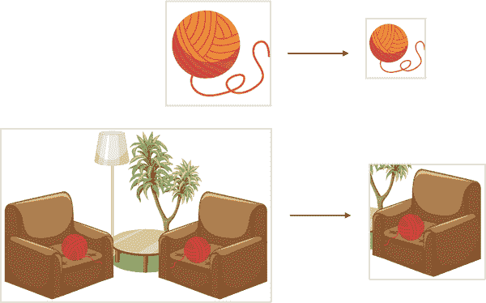

# 第三章：基础模型介绍

本书的大部分内容都关于管理机器学习系统和生产级别的机器学习流水线。这涉及到与许多数据科学家和机器学习研究人员通常从事的工作非常不同，后者试图花费大部分时间开发新的预测模型和方法，以提高精度的百分点。相反，在本书中，我们侧重于确保包含机器学习模型的系统表现出一致、强大和可靠的*系统级*行为。在某些方面，这种系统级行为独立于实际模型类型、模型有多好或其他仅与模型相关的考虑因素。然而，在某些关键情况下，它与这些考虑因素*并不*独立。本章的目标是为您提供足够的背景，以便在生产系统的警报开始响起或传呼机开始响起时，您能够理解自己所处的情况。

我们首先声明，我们的目标不是教你如何构建机器学习模型、哪些模型对于解决什么问题可能更好，或者如何成为数据科学家。那需要一本（或更多）书来详细讲解，并且有许多优秀的文本和在线课程涵盖了这些方面。

本章我们的目标不是过于深入地涉及细枝末节，而是提醒一下什么是机器学习模型以及它们如何工作。我们还将提供一些关键问题，供机器学习运营（MLOps）专家询问他们系统中的模型，以便他们能够理解如何适当地规划解决方案中可能出现的问题类型。

# 什么是模型？

在数学或科学中，术语*模型*指的是一种规则或指导方针，通常可以用数学或代码表达，它帮助处理输入并对未来世界可能运作的方式进行预测。例如，这里是一个你可能认识的著名模型：

> *E* = *mc*²

这是一个可爱的小模型，告诉你，如果你把给定的质量（*m*）转化为一些超级炽热和爆炸性的东西，你可能会得到多少能量（*E*），而常数*c*²告诉你，即使只有一点点*m*，你也能得到相当大量的*E*。这个模型是由一位聪明的人精心思考了很长时间而创建的，在各种环境中表现良好。它不需要太多的维护，并且可以很好地泛化到各种设置中，甚至是最初创建时未曾设想的设置。

我们在机器学习中通常处理的模型在某些方面是相似的。它们接受输入并产生输出，这些输出通常被视为*预测*，使用的规则可以用数学符号或代码来表达。这些预测可以代表物理世界，比如“明天在西雅图下雨的概率是多少？”或者代表数量，比如“下个月从我们网站*yarnit.ai*上将卖出多少单位的毛线？”或者甚至代表抽象的人类概念，比如“这张图片对用户来说是否美观？”

一个关键的区别在于，我们通常用于机器学习的模型，不像*E* = *mc*²那样可以通过一个简洁的规则写出来，无论我们多么聪明。我们在需要考虑许多信息片段（通常称为*特征*）的情况下，会转向机器学习，因为这些信息片段很难事先由人类明确规定。一些可以作为特征处理的数据示例包括来自数千个位置的大气读数、图像中数千个像素的颜色值，或者最近访问在线商店的所有用户的购买历史。当处理这种复杂信息源的信息时——远不止一个质量值和一个缩放常数——通常对人类专家来说创建和验证利用所有可用信息的可靠模型是困难或不可能的。在这些情况下，我们转向使用大量先前观察到的数据。在使用数据来*训练模型*时，我们希望所得到的模型既能很好地适应我们的过去数据，又能在未来对新的、以前未见过的数据进行良好的预测。

# 基础模型创建工作流程

目前最广泛使用的用于创建机器学习模型的基本过程——正式称为*监督学习*——如下所示。

首先，我们收集关于我们问题领域的大量历史数据。这可能是过去 10 年太平洋西北部所有大气传感器的读数，或者是 50 万张图片的集合，或者是访问在线*yarnit.ai*网站的用户浏览历史日志。我们从这些数据中提取一组*特征*，即数据的特定可测量属性。特征以一种机器学习模型容易消化的方式表示数据的关键特性。对于数值数据，这可能意味着将值缩小以便在某些范围内很好地适应。对于结构化程度较低的数据，我们可能会设计出特定数量来识别和提取原始数据中的内容。一些示例包括可以表示诸如 1000 个传感器位置每个位置的大气压力的输入特征，或者给定毛线球的具体颜色和大小值，或者与每种可能产品对应的一组特征，如果给定用户查看了该产品则值为`1`，否则为`0`。

对于监督机器学习，我们还需要一种*标签*，显示我们希望我们的模型在未来看到类似情况时预测的历史结果。这可能是给定日期的天气结果，比如如果下雨则为`1`，如果没有则为`0`。或者它可以是一个尝试捕捉给定用户是否认为图像美观的分数，比如如果他们给出“赞”则为`1`，如果没有则为`0`。或者它可以是显示在给定月份销售的给定纱线产品的单位数量的值。或者纱线的颜色和尺寸等等。我们将记录每个条目的给定标签，并称每个条目为*带标签的示例*。

然后我们将在这些历史数据上*训练*一个模型，使用选择的模型类型和选择的机器学习平台或服务。目前，许多人选择使用基于*深度学习*，也被称为*神经网络*的模型类型，当提供非常大量的数据时效果特别好（想想数以百万计或数十亿的带标签示例）。¹ 神经网络根据训练中使用的示例在节点层之间建立连接。

在其他设置中，像随机森林或梯度增强决策树这样的方法在提供较少示例时效果很好。² 而更复杂、更大的模型也不总是首选，无论是出于预测能力还是可维护性和可理解性。那些不确定哪种模型类型可能最适合的人经常使用自动化机器学习（AutoML）这样的方法，它训练多个模型版本，并尝试自动选择最佳模型。即使没有 AutoML，所有模型都有必须为每个任务专门设置的调整和设置，称为*超参数*，通过一种称为*调优*的过程，这实际上只是试错的一个花哨名称。无论如何，在最后，我们的训练过程将产生一个模型，该模型将获取新示例的特征输入并生成预测作为输出。模型的内部很可能被视为不透明并抵制直接检查，通常由数千、数百万甚至数十亿个学习*参数*组成，显示如何结合输入特征（并可能在许多进一步的中间阶段重新组合它们）以创建最终输出预测。

从系统工程的角度来看，我们可能会注意到一些令人不安的事情。通常情况下，没有人知道什么是“正确”的模型。我们无法仅凭我们的知识查看通过训练生成的模型并知道它是好还是坏。我们能做的最好的事情是对其进行各种压力测试和验证，并希望我们提出的压力测试和验证足以捕捉模型将被要求处理的各种情况的范围。³

最基本的验证形式是从我们准备好的训练数据中随机留出一部分，称之为*留出测试集*。我们不使用这部分数据进行训练，而是等待并将其用于对模型进行压力测试，理由是模型在训练过程中从未见过这些留出的数据，因此可以很好地用作我们希望其进行有用预测的以前未见数据的代表。因此，我们可以将测试集中的每个示例输入到模型中，并将其预测与真实结果标签进行比较，以查看其表现如何。非常关键的一点是，这些验证数据确实应该在训练过程中留出，因为模型很容易出现*过拟合*，即模型完美地记住了训练数据，但在新的未见数据上预测能力很差。

一旦我们对模型的验证感到满意，就该将其部署到整体生产系统中。这意味着找到一种方法来*服务*模型预测，以满足需求。其中一种方法是为所有可能的输入预先计算所有可能的预测结果，并将它们写入我们的系统可以查询的缓存中。另一种常见方法是从生产系统创建输入流，并将其转换为特征，以便可以按需将其馈送到我们模型的副本中，然后将模型的结果预测反馈到更大的系统中供使用。这两种选项都可以在第八章的背景下理解。

如果一切顺利，我们就完成了。然而，世界充满了不完美，我们对世界的模型更是如此。在 MLOps 世界中，即使是最小的问题也可能造成严重后果，因此我们需要有所准备。让我们快速浏览一下可能会变成潜在问题的一些领域。

# 模型架构与模型定义与训练后的模型

术语*模型*经常被不精确地用来指称三个独立但相关的概念：

模型架构

我们在这个应用程序中使用的学习策略。这可以包括模型家族的选择，例如深度神经网络（DNN）或随机森林，以及结构选择，例如 DNN 中的层数或随机森林中的树木数量。

模型定义（或配置模型）

模型配置加上训练环境，以及我们将进行训练的数据类型和定义。这包括所有使用的特征集、所有超参数设置、用于初始化模型的随机种子，以及用于定义或复现模型的任何其他方面。可以合理地将其视为整个训练环境的封闭（详见 4），尽管许多人并未考虑到这一点的可靠性或系统影响（特别是需要非常大量的软件和数据相互版本化，以获得合理的可复现性）。

训练模型

系统配置模型的特定快照或实例化表示，在特定时间点上使用特定数据进行训练，包含一组特定的训练模型参数，例如权重和阈值。需要注意的是，我们在机器学习中使用的一些软件，特别是在分布式部署中，存在相当多的非确定性。因此，同样的系统配置模型在相同数据上训练两次可能会产生明显不同的训练模型。

尽管在本书中我们尽力避免混淆这些概念，请注意它们在整个行业中并未仔细区分，我们自身也可能偶尔不清楚。大多数人称这三个概念都为*模型*。即使这些术语是我们自己创造的，因为目前没有行业标准术语来区分*模型*的不同用法。

# 哪里存在漏洞？

从系统可靠性的角度来看，依赖机器学习的系统存在多个容易出错的弱点。在本节中，我们简要触及了其中的一些领域，稍后的章节将更深入地探讨这些主题。需要注意的是，这里我们讨论的不是安全漏洞，而是可能导致故障或模型质量问题的结构性或系统性弱点。本节旨在列举一些模型失败的最常见方式。

## 训练数据

*训练数据*是定义系统行为的基础要素。训练数据的质量决定了我们的模型和系统的质量和行为，而训练数据的不完美可能会以出人意料的方式放大。从这个角度看，数据在机器学习系统中的作用可以类比于传统系统中的代码。但与传统代码不同的是，传统代码可以用前置条件、后置条件和不变量描述，并且可能经过系统化的测试，而真实世界的数据通常存在有机的缺陷和不规则性。这些问题可能导致多种问题类型。

### 覆盖不完整

需要考虑的第一个问题是，我们的训练数据可能以各种方式不完整。想象一下，我们有大气压力传感器，在冰冻天气下停止工作，因此在寒冷天气没有数据。这对模型来说形成了一个盲点，特别是当被要求在这种情况下进行预测时。这里的一个困难是，这类问题不能通过使用保留测试集来检测，因为按定义，保留集是我们已经可以访问的数据的随机样本。发现这些问题需要仔细思考和辛勤工作的结合，以收集或合成额外的数据，这些数据可以帮助在验证时暴露这些缺陷或在训练时进行修正。

### 虚假相关

数据中不总是在现实世界中适用的相关性形成的特殊形式的不完整覆盖。例如，想象所有被标记为“美观”的图像都包含白色画廊墙壁，而标记为“不美观”的图像则没有。在这些数据上训练可能会导致一个模型，在保留测试数据上显示非常高的准确性，但本质上只是一个白墙检测器。在实际数据上部署这种模型可能会产生可怕的结果，尽管在保留测试数据上表现出色。

再次，揭示这类问题需要仔细考虑训练数据，并通过选择良好的示例有针对性地测试模型在各种情况下的行为。这类问题的一个重要类别可能在社会因素创建某些群体缺乏包容或代表性时发生；这些问题在第六章中有所讨论。

### 冷启动

许多生产建模系统随着时间在部署中收集额外的数据，并进行重新训练或更新以整合这些数据。这类系统在初始数据较少时可能会遇到*冷启动*问题。这种情况可能发生在最初未设置为收集数据的系统上，例如天气服务希望使用以前从未部署过的新创建的传感器网络。它也可能出现在推荐系统中，例如那些向用户推荐各种纱线产品，并观察用户交互数据进行训练的系统。这些系统在它们生命周期的最开始阶段可能几乎没有或没有训练数据，并且随着时间推出新产品，也可能会遇到个别物品的冷启动问题。

### 自我实现的预言和机器学习回声室

许多模型用于反馈循环中，它们过滤数据、推荐物品或选择行动，然后在未来创建或影响模型的训练数据。帮助用户推荐纱线产品的模型可能只会在实际显示给用户的前几个排名上得到未来反馈。对话代理可能只会得到它选择创建的句子的反馈。这可能导致一种情况，即未被选中的数据永远得不到正面反馈，因此在模型的估计中永远不会占据主导地位。解决这个问题通常需要有意识地*探索*低排名数据，偶尔选择展示或尝试模型当前认为不太好的数据或行动，以确保在全范围可能性的训练数据中保持合理的流动。

### 世界变化

人们很容易认为数据反映了现实，但不幸的是，它实际上只是某个特定时间世界某个部分的历史快照。这种区别在真实世界事件引起变化时可能显得有些哲学，但有时变得至关重要。实际上，如果明天发生类似 COVID 风格的封锁，没有比向组织的高管领导提出“如果明天发生另一场 COVID 风格的封锁，我们的模型会发生什么变化？”更好的方法来说服他们关于 MLOps 的重要性了。

例如，想象一下我们的模型帮助根据先前用户预订反馈推荐酒店。很容易想象这样一种情况，即 COVID 风格的封锁突然导致酒店预订大幅下降，这意味着在预封锁数据上训练的模型现在显得极其乐观。由于它在较新的数据上学习，许多较少的预订发生，很容易想象它在稍后解除封锁并且用户希望再次预订更多酒店房间时可能表现得非常糟糕——只是发现系统无法推荐任何内容。

这些基于真实世界事件的互动和反馈循环并不局限于重大世界灾难。以下是一些可能发生在各种环境中的其他情况：

+   在某个国家的选举之夜，视频的观看行为突然有所不同。

+   新产品的推出迅速引起了对某种羊毛的用户兴趣激增，但我们的模型没有任何关于它的先前信息。

+   预测股票价格的模型出现错误，对某只股票过度预测。使用该模型的自动对冲基金随后错误地购买了该股票——在真实市场中提高了价格，并导致其他自动对冲基金模型效仿。

## 标签

在监督学习中，**训练标签**提供了“正确答案”，展示了模型在给定示例中应该尝试预测的内容。标签是至关重要的指导，向模型展示了它的目标，通常定义为一个数值分数。以下是一些例子：

+   对于电子邮件垃圾邮件过滤模型，“垃圾邮件”为`1`，“非垃圾邮件”为`0`的分数。

+   西雅图某一天的每日降雨量，以毫米为单位。

+   一组可能完成给定句子的每个可能单词的标签，如果它是实际完成给定句子的单词则为`1`，否则为任何其他单词。

+   在给定图像中每个对象类别的一组标签，如果该对象类别在图像中显著出现则为`1`，否则为`0`。

+   数值分数显示特定抗体蛋白质在湿实验室实验中与给定病毒结合的强度。

由于标签对模型训练非常重要，很容易看出，标签问题可能是许多下游模型问题的根本原因。让我们看一些例子。

### 标签噪声

在统计语言中，“噪音”一词是“错误”的同义词。如果我们提供的标签由于某种原因是错误的，这些错误可能会影响模型的行为。在某些情况下，随机噪音可能是可以容忍的，如果错误随时间平衡，则尽管如此，测量和评估仍然很重要。更为严重的是数据中特定部分发生的错误，例如，如果一个人类标签员经常将青蛙错误地标记为蟾蜍，用于水生图像模型，或者一组特定用户一直被某种类型的电子邮件垃圾邮件欺骗，或者在实验中发生了一种污染，使得一组给定的抗体无法结合给定类别的病毒。

因此，定期检查和监控标签的质量并解决任何问题至关重要。在使用人类专家提供训练标签的系统中，这通常意味着对任务规范的文档进行极其细致的关注，并为人类本身提供详细的培训。

### 错误的标签目标

机器学习训练方法倾向于极其有效地学习预测我们提供的标签，有时候甚至会揭示我们希望的标签含义与实际代表的差异。例如，如果我们的目标是使*yarnit.ai*网站的客户长期满意，可能很容易希望“购买”标签与满意的用户会话相关联。这可能导致一个过于关注购买的模型，也许随着时间的推移学习推广看似是好交易但实际上令人失望的产品。另一个例子，考虑使用用户点击作为用户对新闻文章满意度的信号的问题，这可能导致突出显眼的点击诱饵标题或甚至过滤泡泡效应的模型，即用户不会看到与他们预设看法相左的新闻文章。

### 欺诈或恶意反馈

许多系统依赖于用户的信号或观察到的人类行为来提供训练标签。例如，一些电子邮件垃圾邮件系统允许用户将消息标记为“垃圾邮件”或“非垃圾邮件”。很容易想象，一个积极的垃圾邮件发送者可能会试图欺骗这样的系统，通过向其自己控制的账户发送大量垃圾邮件，并尝试将它们标记为“非垃圾邮件”，以试图破坏整体模型。同样可以想象，试图预测某种产品在用户评论中将收到多少颗星的模型可能潜在地易受到恶意行为者的攻击，这些人可能会试图高估自己的产品，或低估竞争对手的产品。在这种情况下，谨慎的安全措施和对可疑趋势的监控是长期系统健康的关键组成部分。

除了开发完整和代表性数据集或正确标记示例的问题之外，我们在模型训练过程中还可能遇到对模型的威胁。标签和标记系统在第四章中会更详细地讨论。

## 训练方法

一些模型只训练一次，然后很少或从不更新。但大多数模型在其生命周期的某个时刻会更新。这可能每隔几个月一次，例如从抗体测试中获得另一批湿实验数据，或者每周一次，以整合新的图像数据和相关的物体标签，或者在流媒体设置中每隔几分钟一次，根据用户浏览和购买各种羊毛产品的新数据进行更新。平均而言，每次新的更新都预期会改善整体模型，但在特定情况下，模型可能会变得更差甚至完全失效。以下是一些可能导致这种头痛的原因。

### 过拟合

如同我们在典型模型生命周期简要概述中所讨论的，一个好的模型能够很好地推广到新的、之前未见过的数据，并不仅仅是狭义地记忆训练数据。每次重新训练或更新模型时，我们需要使用留出的验证数据来检查过拟合情况。但如果我们始终重复使用同样的验证数据，那么就有可能潜在地对这些重复使用的验证数据过拟合的风险。

因此，定期更新验证数据并确保我们不会自欺欺人非常重要。例如，如果我们关于*yarnit.ai*上的购买验证数据集从未更新，而我们的客户行为随时间改变以偏爱更亮的羊毛，我们的模型将无法跟踪到这种购买偏好的变化，因为我们会评分那些学习这种行为的模型为“质量较低”的模型，而不是不学习这种行为的模型。重要的是，模型质量评估要包括对模型性能的现实世界确认。

### 缺乏稳定性

每次重新训练模型时，无法保证其预测从一个模型版本到另一个版本是*稳定的*。一个版本的模型可能在识别猫方面表现出色，但在狗方面表现较差，而另一个版本在狗方面可能更好，但在猫方面可能不太好——即使两个模型在验证数据的整体准确率上相似。在某些情境下，这可能成为一个重要问题。

例如，想象一个用于检测信用卡欺诈并关闭可能已被损害的卡片的模型。一个精度为 99%的模型在一般情况下可能非常好，但如果模型每天重新训练，并在不同的 1%用户中出现错误，则在三个月后，潜在地整个用户群可能会因为错误的模型预测而受到不便。评估我们关心的预测的相关子集上的模型质量非常重要。

### 深度学习的特殊性

近年来，深度学习方法因其在许多领域中实现极强的预测性能而变得非常重要。然而，深度学习方法也伴随着一套特定的脆弱性和潜在的漏洞。因为它们被广泛使用，并且从 MLOps 的角度看具有特定的特殊性和关注点，所以我们特别详细地介绍了深度学习模型。

当从头开始训练深度学习模型——没有任何先验信息时，它们从一个随机的初始状态开始，并且以随机顺序接收大量的训练数据，通常是小批量的。模型做出其当前的最佳预测（初始阶段通常很糟糕，因为模型尚未学到很多知识），然后显示正确的标签。一旦计算出数学上的*损失梯度*，模型的内部就应该更新。使用这个损失梯度时，会对模型的内部进行小的更新，试图让模型稍微好一点。这种在随机顺序的小批量上进行小修正的过程被称为*随机梯度下降*（*SGD*），并且重复进行数百万次或数十亿次。我们在决定模型在留置验证数据上表现良好后停止训练。

关于这个过程的关键见解如下：

深度学习依赖于随机化。

在初始的随机状态中，数据以随机顺序显示。在大规模并行设置中，由于网络和并行计算效应，更新的方式甚至在处理方式上也有随机性。因此，使用相同的设置和数据反复训练相同的模型可能会导致最终模型有显著不同。

很难确定训练何时“完成”。

在保留验证数据上，随着额外的训练步骤，模型的性能通常会提高，但有时在早期会反弹，后来如果模型开始过度拟合训练数据，性能往往会显著恶化。当性能收敛到良好水平时，我们停止训练并选择最佳模型，通常选择显示中间良好行为的 *检查点* 版本。不幸的是，我们现在看到的性能是否是训练进一步继续时能够达到的最佳性能，目前没有正式方法能够知晓。事实上，最近针对广泛模型发现的 *双峰* 现象表明，我们以前对何时停止训练的概念可能不是最优的。⁵

深度学习模型有时在训练中会爆炸。

我们采取小步而非大步的原因在于，很容易在数学上掉入悬崖，并将模型内部置于难以恢复的状态。事实上，*爆炸梯度* 是一个表示适当危险的技术术语。陷入此状态的模型通常在预测或中间计算中产生 `NaN`（不是一个数）值。这种行为也可能表现为模型的验证性能突然恶化。

深度学习对超参数非常敏感。

正如前面提到的，超参数是必须调整的各种数值设置，以使机器学习模型在任何给定任务或数据集上达到最佳性能。其中最明显的是 *学习率*，它控制每次更新步骤的大小。步长越小，模型爆炸或产生奇怪预测的可能性就越小。但是训练时间越长，使用的计算量就越大。其他设置也会产生显著影响，如内部状态的大小或复杂性、小批量的大小以及如何强力地应用各种抑制过拟合的方法。深度学习模型对这些设置非常敏感，这意味着需要进行大量的实验和测试。

深度学习资源消耗大。

SGD 的训练方法在生成良好模型方面非常有效，但依赖于极其庞大数量的微小更新。实际上，用于训练某些模型的计算量可能相当于数千个 CPU 核心连续运行数周。

当深度学习方法出错时，可能会出错得很严重。

深度学习方法对其训练数据进行外推，这意味着新的、之前未见的数据点越不熟悉，极端预测的可能性越大，可能完全偏离基准或超出典型行为范围。这类高度自信的错误可能是系统级误行为的重要源头。

现在您已经了解了模型创建可能出现的问题结构，可能有必要从更广泛的视角看待首先训练模型所需的基础设施。

# 基础设施和流水线

模型只是更大的机器学习系统中的一个组件，这些系统通常由显著的基础设施支持，用于支持一个或多个流水线中的模型训练、验证、服务和监控。因此，这些系统继承了传统（非机器学习）流水线和系统的所有复杂性和脆弱性，以及机器学习模型的复杂性。我们不会在这里详述所有传统问题，但将重点介绍一些传统流水线问题在基于机器学习的系统中凸显出来的领域。

## 平台

现代机器学习系统通常构建在一个或多个机器学习框架之上，例如 TensorFlow、PyTorch 或 scikit-learn，甚至是诸如 Azure 机器学习、Amazon SageMaker 或 Google Cloud Vertex AI 这样的集成平台。从建模的角度来看，这些平台使开发人员能够以极快的速度和灵活性创建模型，并在许多情况下利用诸如 GPU 和 TPU 或基于云的计算而无需额外的工作。

从系统角度来看，使用这些平台会引入一组通常超出我们控制范围的依赖关系。我们可能会遇到包升级、修复可能不兼容旧版本的问题，或者组件可能不兼容新版本的问题。发现的错误可能难以修复，或者我们可能需要等待平台所有者优先接受我们提出的修复措施。总体而言，使用这些框架或平台的好处几乎总是超过这些缺点，但仍然必须考虑并纳入任何长期维护计划或 MLOps 策略中。

另一个需要考虑的因素是，由于这些平台通常是作为通用工具创建的，因此我们通常需要创建大量的适配器组件或*粘合代码*，帮助我们将原始数据或特征转换为平台使用的正确格式，并在服务时与模型进行接口交互。这些粘合代码很快就会在大小、范围和复杂性上变得重要，并且重要的是像系统的其他组件一样进行测试和监控支持。

## 特征生成

从原始输入数据中提取信息性特征是许多机器学习系统的典型部分，可能包括以下任务：

+   在文本描述中进行单词标记化

+   从产品列表中提取价格信息

+   将大气压力读数分成五个粗略桶（通常称为*量化*）

+   查找用户帐户的最后登录时间

+   将系统时间戳转换为当地的时间

大多数这些任务都是将一种数据类型转换为另一种的简单转换。它们可能像是将一个数字除以另一个数字那样简单，也可能涉及复杂的逻辑或请求其他子系统。无论如何，重要的是要记住，在特征生成中的错误可能是机器学习系统中*最常见的错误来源*。

特征生成之所以成为漏洞的焦点有几个原因。首先是特征生成中的错误通常不会通过聚合模型性能指标（如保留测试数据上的准确性）可见。例如，如果我们的温度传感器读数分桶方式存在 bug，它可能会稍微降低准确性，但我们的系统也许会通过更依赖其他特征来弥补这个 bug。特征生成代码中的 bug 被发现并在生产环境中运行数月甚至数年而未被检测到，这种情况可能会出奇地常见。

特征生成错误的第二个来源是，在训练时间和服务时间计算相同逻辑特征的方式不同。例如，如果我们的模型依赖于设备模型的本地化时间，当训练数据计算时可能通过全局批处理作业计算，但在服务时间可能直接从设备查询。服务路径中的 bug 可能会导致预测错误，由于缺乏地面真实验证标签，这些错误可能难以检测。我们在第九章中介绍了这一重要情况的一组监控最佳实践。

特征生成错误的第三个主要来源是我们的特征生成器依赖于一个上游依赖项，而该依赖项出现故障或遭遇中断时会出现问题。例如，如果我们用于生成羊毛购买预测的模型依赖于向另一个服务的查找查询，该服务报告用户评价和满意度评级，那么如果该服务突然下线或停止返回合理的响应，我们的模型将遇到严重问题。在实际系统中，我们的上游依赖项通常也有它们自己的上游依赖项，我们确实容易受到它们全部影响的风险。

## 升级和修复

特别微妙的一个领域是，在我们的模型中，上游依赖项可能因为上游系统进行升级或修复 bug 而导致问题。修复 bug 会导致问题似乎有些奇怪。要记住的原则是*更好不一定是更好，更好是不同的——而不同可能是坏的*。

这是因为我们模型期望看到与某些数据相关联的特征值分布的任何更改可能会导致错误行为。例如，假设我们在天气预测模型中使用的温度传感器在代码中有错误，当应该报告摄氏度时报告华氏度。我们的模型学习到 32 度是冰冻的温度，90 度是西雅图附近的炎热夏日。如果聪明的工程师注意到这个 bug，并修复温度传感器代码以发送摄氏度值，模型将看到 32 度的值并假设世界是冰冷的，而实际上是炎热和晴朗的天气。

这种漏洞形式有两个关键的防御措施。第一个是与上游依赖方就在其发生之前告警这类变更达成强有力的一致。第二个是创建特征分布的监控，并对变更进行警报。这也在第九章中更详细地讨论。

# 有关任何模型的一组有用问题

研究人员和学者往往关注 ML 模型的数学特性。在 MLOps 中，我们可以找到不同一套问题集，这些问题将帮助我们理解我们的模型和系统可能出错的地方，如何在问题发生时修复问题，以及如何预防性地为长期系统健康进行工程设计：

训练数据从何而来？

这个问题是概念性的——我们需要完全理解训练数据的来源以及它们应该表示的内容。如果我们正在寻找电子邮件垃圾邮件，我们是否能够访问路由信息，并且这些信息是否能够被恶意行为者篡改？如果我们在建模用户与纱线产品的互动，它们以什么顺序显示，并且用户如何在页面中移动？我们没有访问的重要信息是什么，以及其原因是什么？是否有关于数据访问或存储的政策考虑，尤其是涉及隐私、伦理考虑或法律或监管限制的问题？

数据存储在哪里，如何进行验证？

这是上一个问题的更直接的一面。数据存储在一个大型平面文件中，还是跨数据中心共享？最常见或最有效的访问模式是什么？是否应用了任何聚合或抽样策略，可能会降低成本但会丢失信息？隐私考虑如何执行？给定数据存储多长时间，如果用户希望从系统中删除他们的数据会发生什么？我们如何知道存储的数据没有以某种方式被损坏，信息源是否不完整，以及我们可以应用哪些健全性检查和验证？

特征是什么，它们是如何计算的？

特征，我们从原始数据中提取的信息，以便机器学习模型轻松消化，通常是模型开发人员采用“越多越好”的方式添加的。从运维的角度来看，我们需要全面了解每个单独的特征，它是如何计算的，以及验证结果的方式。这很重要，因为特征计算层面的错误可以说是系统层面问题的最常见源头。与此同时，这些错误通常是传统机器学习验证策略难以检测到的最困难的部分——一个留置的验证集可能会受到相同特征计算错误的影响。正如之前建议的，最阴险的问题通常是在训练时由一个代码路径计算特征——例如为了优化内存效率——而在实际部署的服务时由另一个代码路径计算特征——例如为了优化延迟。在这种情况下，模型的预测可能会出错，但我们可能没有地面真实验证数据来检测这一问题。

模型在哪些类型的例子上表现最差？

几乎所有的机器学习模型都是不完美的，在某些类型的例子上预测会出错。花时间查看模型在错误预测上的数据是很重要的，理解任何共同点或趋势，这样我们可以确定这些失败模式是否会在重要的下游用例中产生影响。这通常需要一定的手动工作，实际的人类查看实际的数据以完全理解，除了更高层次的摘要之外。

模型如何随时间更新？

一些模型很少更新，例如在大批量数据上训练的自动翻译模型，每隔几个月推送到设备应用程序一次。其他模型则更新非常频繁，例如邮件垃圾过滤器模型，必须始终保持最新状态，因为垃圾邮件发送者会不断演变并开发新的技巧以尝试避免检测。然而，可以合理地假设所有模型最终都需要更新，并且我们将需要建立结构来确保在任何模型新版本投入使用之前进行全套验证检查。我们还需要与组织内的模型开发人员达成明确的协议，确定谁负责评估模型性能是否足够，以及如何处理预测准确性问题。

我们的系统如何适应更大的环境？

我们的 ML 系统很重要，但与许多复杂数据处理系统一样，它们通常只是更大系统、服务或应用的一部分。我们必须深入了解我们的 ML 系统如何适应更大的整体架构，以防止问题并在问题出现时进行诊断。我们需要了解所有在训练时和服务时为我们的模型提供数据的上游依赖项，并了解它们可能如何更改或失败，以及发生这种情况时我们如何收到警报。同样，我们需要知道我们模型预测的所有下游消费者，以便在我们的模型遇到问题时适时地通知它们。我们还需要了解模型预测如何影响最终用例，如果模型是任何反馈环路的一部分（直接或间接），以及是否存在任何循环依赖，如时间、星期几或年度效应。最后，我们需要了解像准确性、新鲜度和预测延迟等重要的模型质量在更大系统背景下的重要性，以确保这些系统级要求得到良好的建立并随着时间推移得到满足。

最坏的情况是什么？

或许最重要的是，我们需要知道如果 ML 模型在任何方面失败，或者针对给定输入给出最坏的预测时，更大系统会发生什么情况。这种知识可以帮助我们定义防护栏、备用策略或其他安全机制。例如，股价预测模型可能会在几毫秒内使对冲基金破产⁶，除非制定了限制某些购买行为或金额的具体防护栏。

# 一个示例 ML 系统

为了帮助我们对基本模型的介绍有所了解，我们将漫游一些示例生产系统的结构。我们将在这里详细讨论，以便您开始看到前面列出的一些重要问题的答案，但我们也将深入研究这个示例的特定领域。

## Yarn 产品点击预测模型

在我们的虚构 *yarnit.ai* 网站上，ML 模型应用于许多领域。其中之一是预测用户选择给定羊毛产品列表的可能性。在这种设置中，良好校准的概率估计对于排列和排序可能的产品（包括毛线、各种针织针类型、图案以及其他毛线和针织配件）非常有用。

## 特征

在这种设置中使用的模型是一个深度学习模型，它以以下一组特征作为输入：

从产品描述文本中提取的特征

这些包括文本的标记化单词，但也特别识别特征，例如纱线量、针的尺寸和产品材料。由于这些特征在来自不同制造商的产品描述中以各种方式表达，因此每个特征由专门训练的单独组件模型预测，以识别产品描述文本中的该特征。这些模型由一个独立的团队拥有，并通过一个有时会中断的网络服务提供给我们的系统。

原始产品图像数据

将原始产品图像输入模型之前，首先将其归一化为 32 × 32 像素的正方形格式，方法是将图像压缩至适合正方形并平均像素值以创建低分辨率近似。如图 3-1 所示，以前大多数制造商提供的图像几乎是正方形的，并且产品很好地居中于图像中。近年来，一些制造商开始提供更宽的横向格式图像，必须更多地压缩才能变成正方形，而且产品本身通常显示在额外的环境设置中，而不是在纯色背景上。

###### 图 3-1\. 变尺寸和格式的原始产品图像（图片由 Vecteezy 提供）

前用户搜索和点击行为

基于用户接受的带有适当隐私控制的 cookie 的记录历史被转换成功能，显示用户以前查看、点击或购买的先前产品。因为一些用户不接受使用 cookie，所以并非所有用户在训练或预测时都有这种形式的信息可用。

与用户搜索查询或导航相关的功能

用户可以输入诸如“粗黄色丙烯酸纱线”或“木质 8 号针”的搜索查询，或者通过点击上一页中列出的各种主题标题、导航栏或建议到达某个页面。

与产品在页面上的放置相关的功能

因为出现在列表结果较高位置的产品比列表较低的产品更可能被查看和点击，因此在训练时有功能来显示产品在数据收集时的列表位置非常重要。然而，请注意，这引入了一个棘手的依赖性问题——在服务时我们无法知道这些功能的值，因为页面上结果的排名和排序取决于我们模型的输出。

## 功能标签

我们模型的训练标签是一个简单的映射，如果用户点击了产品则为`1`，如果用户没有点击则为`0`。然而，在时间上我们需要考虑一些细微之处——用户可能会在任务中间分心一段时间，然后稍后返回并点击产品，时间间隔可能会达到几分钟甚至几个小时。因此，对于这个系统，我们允许一个小时的窗口期。

此外，我们已经检测到一些不道德的制造商试图通过重复点击他们的产品来提升其产品列表的排名。其他一些更微妙但同样不良意图的制造商则试图通过发出许多查询来降低其*竞争对手*的排名，而不实际点击它们。[⁷] 这两者都是欺诈或垃圾行为的尝试，在将这些数据用于训练模型之前需要进行过滤。这种过滤是通过每隔几小时运行的大型批处理作业来完成的，以查找趋势或异常，并避免复杂情况。然而，有时这些过滤作业会失败，这可能会给我们的系统引入显著的额外延迟。

## 模型更新

我们常把我们的模型描述给高管们听作是“持续更新的”，以便适应新的趋势和新产品。然而，系统中存在一些固有的延迟。首先，我们需要等待一个小时来确认用户是否确实没有点击给定的结果。接着，我们需要等待上游处理流程尽可能地过滤掉垃圾或欺诈行为。最后，生成训练数据的特征提取作业需要批处理资源，并且会引入数小时的延迟。因此，实际上，我们的模型会在用户查看或点击给定产品后约 12 小时进行更新。这是通过合并更新模型的数据批次来实现的。

从头开始完全重新训练模型需要回到历史数据并按顺序重新审视这些数据，目的是模仿随时间推移新数据的同一序列。这是在系统中添加新模型类型或额外功能时由模型开发人员不时执行的操作。有关更多详细信息，请参阅第十章。

## 模型服务

幸运的是，我们的在线商店非常受欢迎——我们每秒收到数百个查询，这对于全球针织产品市场来说并不差。对于每个查询，我们的系统需要快速评分候选产品，以便在用户开始感知等待时间之前的两到三十分之一秒内返回一组产品列表。因此，我们的机器学习系统需要低延迟服务。为了优化这一点，我们在基于云的计算平台上创建大量的服务副本，以便请求不必要地排队等待。每个副本每隔几小时重新加载以获取模型的最新版本。（我们将在第八章中更详细地讨论模型服务的各个方面。）

因为模型在运行中实时更新并提供服务，我们的系统有几个需要监控的领域，以确保实时性能继续良好。这些领域包括以下内容：

模型新鲜度

模型是否定期更新？新的检查点是否成功被服务副本接收？

预测稳定性

随着时间的推移，聚合统计数据大致与最近的历史相符吗？我们可以查看基本可验证的内容，如每分钟进行的预测数量和平均预测值。我们还可以监控随时间变化的点击数是否与随后看到的点击数相匹配。

特征分布

我们的输入特征是系统的生命线。我们监控每个输入特征的基本聚合统计数据，以确保这些数据随时间保持稳定。对于某个特定特征的值突然变化可能表明上游故障或其他需要管理的问题。

当然，这只是一个起始集合——我们将在第九章中详细讨论监控选项。

## 常见故障

思考最坏情况有助于我们做好准备。每种情况通常与整体产品需求和要求相关，因为最终影响到我们整体产品生态系统的才是真正重要的。这些最坏情况如下：

无限延迟

可能发生的一种坏事是我们的模型永远不返回值。也许是因为服务副本超负荷或全部因某些原因关闭。如果系统无限期挂起，用户将永远无法获得任何结果。基本的超时和合理的后备策略将在这里有所帮助。一种后备策略可以是在超时情况下使用成本更低、更简单的模型。另一种可能是预先计算一些最受欢迎项目的预测，并将其用作后备预测。

所有预测都为零

如果我们的模型对所有产品评分为`0`，则不会向用户显示任何产品。当然，这表明模型存在问题，但如果情况出现异常，我们需要监控平均预测并切换到另一个系统。

所有预测都不好

想象一下我们的模型被损坏，或者输入特征信号变得不稳定。在这种情况下，我们可能会得到任意或随机的预测结果，这会令用户困惑，导致用户体验不佳。为了应对这种情况，一个方法可能是同时监控预测的总体方差和平均值。这也可能发生在预测的子集中，因此我们可能需要监控相关预测的子集。

模型偏好于仅仅少数几个

想象一下，一些产品恰好获得了非常高的预测值，而其他一切都获得了低预测值。天真地说，这可能会导致其他产品，或者随着时间推移的新产品，永远没有机会展示给用户，从而也无法获得点击信息来帮助它们在排名中上升。在这些情况下，小量的随机化可以有所帮助，以确保模型获得一定量的探索数据，这将使模型了解以前未展示的产品。这种探索数据形式也对监控很有用，因为它允许我们验证模型的预测，并确保当模型表示某个产品不太可能被点击时，这在现实中也是正确的。

显然，许多其他问题可能出现，幸运的是，MLOps 人员在这方面往往有强大和积极的想象力。通过这种方式思考场景，使我们能够健壮地准备我们的系统，并确保任何故障不会是灾难性的，并且可以迅速解决。

# 结论

在本章中，我们已经介绍了一些机器学习模型的基础知识，以及它们如何适应依赖机器学习的整体系统。当然，我们只是初步涉及了这些主题领域的表面。在后续章节中，我们将更深入地探讨我们在这里提到的几个主题。

这里有几点希望您能记住：

+   模型的行为是由数据决定的，而不是由正式的（程序）规范决定的。

+   如果我们的数据发生变化，我们的模型行为也会发生变化。

+   特征和训练标签是我们模型的关键输入。我们应该花时间理解和验证每一个输入。

+   机器学习模型在可理解程度上可能有所不同，但我们仍然可以监控和评估它们的行为。

+   灾难确实会发生，但通过慎重的预见性和计划，可以将其影响最小化。

+   MLOps 人员需要与其组织中的模型开发人员建立牢固的工作关系和协议。

¹ *神经网络* 这个术语源于它们的构建方式与大脑中神经元的工作方式之间的类比。*深度学习* 这个术语之所以流行，部分原因是有很多人指出，与大脑中神经元的类比并不特别准确。

² 许多机器学习生产工程师或 SRE（Site Reliability Engineers）不需要详细了解神经网络、随机森林或梯度提升决策树的工作原理（尽管刚开始看起来可能并不可怕或困难）。然而，与这些系统一起工作的可靠性工程师确实需要了解这些系统的要求和典型性能。因此，在此我们讨论高级结构。

³ 模型质量或性能评估是一个复杂的主题，将在第五章中进行讨论。

⁴ 另一种说法是“重新生成训练环境所需的所有元数据和数据”。

⁵ OpenAI 在“深度双峰”（Deep Double Descent）中提供了对这一现象的简明描述，同时提供了有用的参考文献，详见[Preetum Nakkiran 的博客](https://openai.com/blog/deep-double-descent)。

⁶ 这是当今股票价格交易的时间框架。更多信息请参阅迈克尔·刘易斯的《*闪电男孩*》（W. W. Norton & Co., 2014）。

⁷ 这种方法有效的原因是，每当产品展示但未被点击时，模型就会学习到该产品在该客户的情境下不是好结果，或者至少学习到该产品不是最佳结果。当然，这种情况对所有产品都经常发生，但如果竞争对手能够通过数百万甚至更多次展示产品而不点击来淹没系统，模型将学习到客户总体上并不喜欢该产品。
