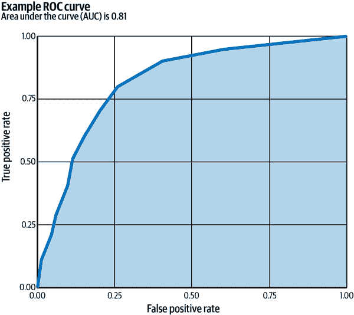

# 第五章：评估模型的有效性和质量

好的，所以我们的模型开发人员已经创建了一个他们认为可以投入生产的模型。或者我们有一个更新版本的模型需要替换当前在生产中运行的版本。在我们打开开关并在关键环境中开始使用这个新模型之前，我们需要回答两个广泛的问题。第一个是确定模型的*有效性*：新模型会破坏我们的系统吗？第二个是关于模型的*质量*：新模型是否好用？

这些是简单的问题，但可能需要深入调查才能回答，通常需要各种专业领域的人员合作。从组织的角度来看，对我们来说很重要的是制定并遵循健全的流程，以确保这些调查被仔细和彻底地执行。借用我们内心的托马斯·爱迪生，可以说模型开发是 1%的灵感和 99%的验证。

本章深入探讨了有效性和质量的问题，并提供了足够的背景，使得 MLOps 从业者能够参与这两个问题。我们还将花时间讨论如何构建流程、自动化以及围绕确保这些问题得到适当关注、关怀和严谨对待的强大文化。

图 5-1 概述了模型开发的基本步骤以及质量在其中的角色。虽然本章重点介绍了评估和验证方法，但重要的是要注意这些过程可能会在时间上以迭代的方式重复进行。更多信息请参阅第十章。

###### 图 5-1。模型开发重复周期的简化视图

# 评估模型的有效性

有人说所有人类都渴望以某种方式获得验证，我们 MLOps 从业者也不例外。事实上，*有效性* 是 MLOps 的核心概念，在这个背景下，我们涵盖了模型是否在投入生产时会导致系统级故障或崩溃的概念。

我们考虑有效性检查的事物与模型质量问题是不同的。例如，一个模型可能准确度极低，错误地猜测每张显示的图像都应该被标记为`chocolate pudding`，但不会导致系统级崩溃。同样地，一个模型在离线测试中可能表现出色，但依赖于当前生产堆栈中不可用的特定功能版本，或者使用某个 ML 包的不兼容版本，或者偶尔产生导致下游消费者崩溃的`NaN`值。验证有效性是第一步，确保模型不会对我们的系统造成灾难性危害。

在验证模型不会使我们的系统陷入困境时，有些需要测试的事项如下：

是否是正确的模型？

令人惊讶易被忽视的是，确保我们打算服务的模型版本确实是我们实际使用的版本是非常重要的。在模型文件中包含时间戳信息和其他元数据是一个有用的后备方案。这个问题突显了自动化的重要性，并展示了随意手动过程可能带来的困难。

模型能在生产环境中加载吗？

为了验证这一点，我们创建生产环境的副本，然后简单地尝试加载模型。这听起来很基础，但这是一个很好的起点，因为在这个阶段出现错误是令人惊讶地容易。正如你在第七章中所学到的，我们通常会获取模型的训练版本，并将其复制到另一个位置，该位置将用于离线批处理的评分，或者根据需求在线提供实时流量的服务。无论哪种情况，模型通常会以特定格式的文件或文件集合的形式存储，然后进行移动、复制或复制以供服务。这是必要的，因为模型往往体积较大，而且我们也希望有版本化的检查点，可以作为服务和未来分析的工件，或者在发生意外危机或错误时作为恢复选项。问题在于，随着时间的推移，文件格式往往会略有变化，而且模型保存的格式可能与我们当前的服务系统兼容的格式不同。

另一个可能导致加载错误的问题是，模型文件可能过大，无法加载到可用内存中。这在内存受限的服务环境中尤为可能，例如设备设置中。但是，当模型开发者热衷于增加模型大小以追求更高的准确性时，这也可能发生，这在当今的机器学习中越来越常见。重要的是要注意，模型文件的大小和内存中实例化的模型的大小是相关的，但通常只是松散相关，并且绝对不相同。我们不能仅仅查看模型文件的大小来确保生成的模型足够小，以便在我们的环境中成功加载。

模型能在不崩溃基础架构的情况下提供结果吗？

再次，这似乎是一个直截了当的要求：如果我们向模型提供一个最小的请求，它是否会给我们返回任何类型的结果，还是系统会失败？请注意，我们故意说“一个最小的请求”，而不是许多请求，因为这类测试通常最好从单个示例和单个请求开始。这既可以最小化风险，又可以使调试更容易，如果确实出现故障的话。

为一个请求提供结果可能会导致失败，原因有几种：

平台版本不兼容

特别是在使用第三方或开源平台时，服务堆栈可能会轻易地使用与训练堆栈不同的平台版本。

特征版本不兼容

生成特征的代码在训练堆栈和服务堆栈中通常是不同的，特别是当每个堆栈具有不同的内存、计算成本或延迟要求时。在这种情况下，导致一个给定特征在这些不同系统中失去同步的代码可能导致失败——这是通常被称为*训练-服务偏差*问题类别的一种形式。例如，如果一个字典用于将单词标记映射到整数，那么服务堆栈在为训练堆栈创建新字典后可能仍在使用过时版本的字典。

损坏的模型

错误发生了，作业崩溃了，最终我们的机器是物理设备。模型文件可能因写入时的错误或在训练时未进行足够的健全性检查而出现某种方式的损坏，或者在磁盘上写入 NaN 值。

缺失的管道连接

假设模型开发人员在训练中创建了一个功能的新版本，但忽略了实现或连接管道，使该功能可以在服务堆栈中使用。在这些情况下，加载依赖该功能的模型版本将导致崩溃或不良行为。

结果超出范围

我们的下游基础设施可能要求模型预测在给定范围内。例如，考虑一下，如果一个模型应返回一个介于 0 和 1 之间（不包括）的概率值，但实际上返回了 0.0 的分数，甚至是-0.2。或者考虑一个模型应返回 100 个类中的一个以表示最合适的图像标签，但实际上返回了 101。

模型的计算性能是否在允许范围内？

在使用在线服务的系统中，模型必须即时返回结果，这通常意味着必须满足严格的延迟约束。例如，一个旨在进行实时语言翻译的模型可能只有几百毫秒的预算来响应。而在高频股票交易上使用的模型可能会更少。

因为这些约束通常互相冲突，对于模型开发者在寻求提高准确性的更改中，测量部署前的延迟非常关键。在这样做时，我们需要牢记生产环境可能存在的硬件或网络方面的特殊性，这些可能会导致不同于开发环境的瓶颈，因此延迟测试必须尽可能接近生产环境进行。同样地，即使在离线服务的情况下，总体计算成本可能是一个重要的限制因素，在启动大批处理作业之前评估任何成本变化是很重要的。最后，正如之前讨论的，存储成本，例如模型在 RAM 中的大小，是另一个关键限制，必须在部署之前进行评估。这样的检查可以自动化进行，但手动验证以考虑权衡也可能很有用。

对于在线服务，模型是否会在生产环境中经过一系列渐进的金丝雀级别？

即使我们对新模型版本在验证检查基础上有了一些信心，我们也不希望只是翻转开关，让新模型突然承担全部生产负载。相反，如果我们首先要求模型仅服务一小部分数据，并在确保模型在服务中表现如预期后逐渐增加数据量，我们的整体压力将会减少。这种金丝雀渐进上升的方式是模型验证和模型监控的交集，正如在第九章中讨论的那样：我们的最终验证步骤是在生产中进行控制的渐进升级，并进行仔细监控。

# 评估模型质量

确保模型通过验证测试是重要的，但这本身并不能回答模型是否足够好来完成其工作。回答这类问题将使我们进入评估模型质量的领域。当然，理解这些问题对于模型开发者很重要，但对于组织决策者以及负责保持系统平稳运行的 MLOps 人员同样至关重要。

## 离线评估

正如在第二章中讨论的模型开发生命周期的快速导览中所述，模型开发者通常依赖离线评估，例如查看在保留测试集上的准确性，作为评判模型好坏的一种方式。显然，这种评估方式有其局限性，正如我们在本章稍后将讨论的那样——毕竟，在保留数据上的准确性并不等同于幸福或利润。尽管存在局限性，这些离线评估是开发生命周期的主要内容，因为它们在成本低效率高的甜蜜点上提供了一个合理的代理，使开发者能够快速连续测试多个更改。

现在，什么是评估呢？*评估*由两个关键组成部分组成：性能指标和数据分布。*性能指标*包括准确率、精确率、召回率、ROC 曲线下面积等等——如果这些还不熟悉，稍后我们会详细讨论其中几个。*数据分布*则是诸如“从与训练数据相同的数据源中随机抽样的留出测试集”，我们之前讨论过，但留出测试数据并非唯一重要的分布。其他可能包括“特定于雪天路况的图像”或“挪威用户的纱线店查询”或“生物学家尚未确认的蛋白质序列”等等。

评估总是由性能指标和数据分布两者共同组成——评估展示了模型在该分布中数据上的性能，由所选指标计算得出。这一点很重要，因为在机器学习领域，有时人们会使用简化说法，比如“这个模型的准确率更高”，而不澄清使用的数据分布是什么。这种简化说法对我们的系统是危险的，因为它忽略了在评估过程中使用的数据分布的具体情况，可能导致忽视重要案例的文化。实际上，2010 年代末出现的许多关于公平性和偏见的问题很可能可以追溯到在模型评估中未充分考虑数据分布的具体情况。因此，当我们听到“准确率更高”的说法时，我们总是可以通过问“在哪个数据分布上？”来增加价值。

## 评估分布

在理解机器学习系统中，也许没有比决定如何创建评估数据更重要的问题了。以下是一些常用的分布以及一些考虑其优势和劣势的因素。

### 留出测试数据

最常用的评估分布是*留出测试数据*，我们在第三章中介绍了它，当时正在回顾典型的模型生命周期。表面上看，这似乎是一个容易考虑的事情——我们随机选择一些训练数据，将其保留并仅用于评估。当训练数据中的每个示例具有等概率且独立地放入留出测试数据时，我们称之为*IID 测试集*。*IID*术语是统计学术语，意味着*独立同分布*。我们可以将 IID 测试集过程简单地理解为针对训练数据中的每个示例基于结果像是抛一枚（可能是有偏的）硬币或掷一颗骰子，并根据结果保留其中的每一个示例用于 IID 测试集。

使用 IID 测试数据已被广泛接受，这不是因为它一定是创建测试数据的最具信息性的方式，而是因为它尊重了支持一些监督机器学习理论保证的假设。然而，在实践中，一个纯粹的 IID 测试集可能不合适，因为它可能会给出一个在部署中模型预期性能的不现实的乐观视图。

举例来说，想象我们有一个大量股价数据的数据集，我们希望训练一个模型来预测这些价格。如果我们创建一个纯粹的 IID 测试集，我们可能会在训练数据中有来自某一天 12:01 和 12:03 的数据，而 12:02 的数据却在测试数据中。这会造成这样一种情况：模型可以更好地猜测 12:02，因为它已经看到了 12:03 的“未来”。实际上，一个关于 12:02 的模型是无法访问这种信息的，所以我们需要小心地创建我们的评估方式，不允许模型在“未来”数据上进行训练。类似的例子可能存在于天气预测或纱线产品购买预测中。

这里的重点不是说 IID 测试分布总是不好，而是这些细节确实很重要。我们需要在创建评估数据时应用谨慎的推理和常识，而不是依赖固定的配方。

### 渐进式验证

在具有基于时间排序数据的系统中——就像我们前面的股价预测示例一样——使用渐进式验证策略可能非常有帮助，有时也称为*回测*。基本思想是模拟训练和预测在真实世界中的工作方式，但是按照数据最初出现的顺序将数据通过模型。

对于每个模拟时间步骤，模型展示下一个示例并要求做出最佳预测。然后记录该预测并将其合并到总体评估指标中，然后才将示例展示给模型进行训练。通过这种方式，每个示例首先用于评估，然后用于训练。这有助于我们看到时间顺序的影响，并提出诸如“去年选举日这个模型会怎么做？”的问题。

缺点是，如果我们的模型需要多次通过数据进行良好训练，这种设置有些难以适应。第二个缺点是，我们必须小心比较基于完全相同时间范围的评估数据的模型。最后，不是所有的系统都会在一个可以有意义地按照规范顺序排序数据的环境中运行，比如时间。

### 黄金集

在不断重新训练和使用某种形式的渐进验证的模型中，很难确定模型性能是否正在改变，还是数据变得更容易或更难预测。控制这种情况的一种方法是创建一组*金标准*数据，模型永远不允许在其上进行训练，但数据是从特定时间点获取的。例如，我们可能决定去年 10 月 1 日的数据被设置为金标准数据，无论何种情况下都不得用于训练，而是单独保留。

当我们设置金标准数据时，还会将该数据集通过我们的模型运行的结果，或者在某些情况下，人类对金标准数据进行评估的结果与之保持一致。有时我们可能会把这些结果视为“正确的”，即使它们实际上只是从特定过程和特定时间点的这些示例的预测结果。

金标准数据的性能评估能够显示模型质量的突然变化，这对于调试大有裨益。需要注意的是，金标准评估并不特别适用于评判模型的绝对质量，因为随着时间的推移，其对当前性能的相关性会逐渐降低。如果我们无法长时间保留金标准数据（例如，为了遵守某些数据隐私法律或响应删除或访问到期请求），还可能会出现另一个问题。金标准的主要好处在于识别变化或错误，因为通常情况下，随着新训练数据被整合到模型中，模型在金标准数据上的表现只会逐渐改变。

### 压力测试分布

在现实世界中部署模型时，一个担忧是它们在现实中遇到的数据可能与训练时展示的数据大不相同。（文献中有时将这些问题描述为不同的名称，包括*协变量转移*、*非稳态*或*训练-服务偏差*）。例如，我们可能有一个主要基于北美和西欧图像数据进行训练的模型，但后来将其应用于全球各国。这会产生两个可能的问题。首先，模型可能在新类型的数据上表现不佳。其次，更为重要的是，我们可能并不知道模型表现不佳的原因，因为数据在提供（据称为 IID 测试数据）的源中未被代表。

这类问题在公平和包容的角度尤为关键。假设我们正在建立一个模型，根据提供的人像图像预测用户偏好的纱线颜色。如果我们的训练数据不包括具有各种肤色的人像图像，那么 IID 测试集可能无法充分代表，以揭示模型在具有特别深色皮肤人群的图像上表现不佳的问题。（这个例子回溯到 Buolamwini 和 Gebru 的开创性工作。）在这种情况下，创建特定的压力测试分布是非常重要的，其中精心构建的测试集各自探索模型在不同肤色上的性能。类似的逻辑适用于测试模型在实践中可能关键的任何其他性能领域，从适用于温带气候中开发的导航系统的雪地街道，到适用于多数英语工作场所中开发的语音识别系统的广泛语音和语言。

### **分析切片**

有一个有用的技巧需要考虑，即任何测试集——即使是 IID 测试集——都可以被切片，以有效地创建各种更有针对性的压力测试分布。通过*切片*，我们指的是根据某个特定特征的值对数据进行过滤。例如，我们可以切片图像，查看仅具有雪地背景的图像的性能，或者是市场上第一周交易的公司的股票，或者是仅为红色的纱线。只要我们至少有一些符合这些条件的数据，我们就可以通过切片评估每种情况下的性能。当然，我们需要注意不要切片得太细，否则我们所看到的数据量在统计意义上将会太小，无法得出任何有意义的结论。

### **对事实进行反事实测试**

了解模型更深层次性能的一种方法涉及学习，即如果数据不同，模型将如何进行预测。这有时被称为*反事实测试*，因为我们最终提供给模型的数据与某种方式上的实际数据相悖。例如，我们可能会问，如果给定图像中的狗不是在草地背景上，而是在雪地或云层背景下，模型会预测什么。我们可能会问，如果申请人住在不同的城市，模型是否会推荐更高的信用评分，或者如果电影中主演的代词从*他*变为*她*，模型是否会预测出不同的评分。

这里的诀窍在于，我们可能没有符合这些情景的任何示例，如果是这样的话，我们会采取创建合成反事实示例的步骤，通过操纵或改变我们可以访问到的示例来进行。当我们想要测试某个给定的改变是否*不会*显著改变模型预测时，这种方法往往非常有效。每一个这样的测试都可能揭示关于模型及其依赖的信息源的一些有趣的事情，从而使我们能够判断模型行为是否恰当，以及是否需要在发布前解决任何问题。

## 一些有用的指标

在机器学习领域的某些角落，有一种倾向于将单一指标视为评估给定任务上模型性能的标准方法。例如，多年来，准确率一直是评估 ImageNet 留存测试数据上模型的唯一方式。事实上，在基准测试或竞赛设置中，这种心态通常最为常见，因为单一指标简化了不同方法之间的比较。然而，在现实世界的机器学习中，只单纯考虑一个指标通常是不明智的。最有效的方法往往是考虑多样化的指标和评估，每个指标都有其独特的优势、劣势、盲点和特异性，就像没有一个最佳的观日出的地方一样，也没有一个最佳的指标来评估一个给定的模型。

在这里，我们将试图建立对一些较常见指标的直觉。我们将它们分为三大类别：

金丝雀指标

擅长指出模型存在问题，但不太有效地区分好模型和更好模型。

分类指标

帮助我们理解模型对下游任务和决策的影响，但需要复杂的调整，可能会使模型之间的比较更加困难。

回归和排名指标

避免这种调整，使得比较更容易理解，但可能会忽视某些错误成本较低的具体折衷方案。

### 金丝雀指标

正如我们所指出的，这组指标为我们提供了一种有用的方法来判断我们的模型是否存在严重问题。就像传说中的煤矿中的金丝雀一样，如果任何一个指标的表现不如预期，那么我们肯定有问题需要解决。另一方面，如果这些指标看起来不错，并不一定意味着一切都好或者我们的模型完美无缺。这些指标只是潜在问题检测的第一道防线。

#### 偏差

这里使用的*偏差*是指统计意义上的，而不是道德意义上的。统计偏差是一个简单的概念——如果我们根据模型的预测加总所有我们期望看到的东西，然后加总实际数据中我们实际看到的东西，结果是否相同？在理想的情况下，应该是相同的，通常一个运行良好的模型将展现出非常低的偏差，意味着对于给定的预测类别，预期值和观察到值之间的差异非常小。

作为一个评估指标，偏差的一个好处是，与大多数其他指标不同，我们期望大多数模型能够达到的“正确”值是 0.00。这里偏差的偏差甚至一两个百分点的差异通常都是某些问题存在的迹象。偏差经常与切片分析结合起来作为一种评估策略，以揭示问题。我们可以使用切片分析来识别模型在某些数据部分上表现不佳的地方，作为开始调试和改善整体模型性能的方法。

以偏差作为评估指标的缺点在于，创造一个完全零偏差的模型是微不足道的，但那是一个糟糕的模型。作为一种思想实验，可以通过让模型只返回每个示例的平均观察值来实现这一点——总体上偏差为零，但完全没有信息价值。像这样病态糟糕的模型可以通过在更细粒度切片上观察偏差来检测，但更重要的问题仍然存在。偏差作为一个指标是一个很好的指示器，但仅仅有零偏差并不能表明模型质量高。

#### 校准

当我们有一个预测概率值或回归估计的模型，比如用户点击给定产品的概率或明天温度的数值预测时，创建一个*校准图*可以对模型的整体质量提供重要的洞察。这主要可以分为两步进行，大致可以理解为首先将我们的评估数据分桶，并计算每个桶中模型的偏差。通常，分桶是通过模型分数来完成的——例如，模型预测中最低十分之一的示例放入一个桶中，接下来的十分之一放入下一个桶中，以此类推——这种方式让人想起之前讨论的切片分析的概念。这样，校准可以被看作是结合偏差和切片分析方法的一种系统扩展。

校准图可以显示系统效应，如在不同区域的过度预测或欠预测，并且可以是特别有用的可视化工具，帮助理解模型在其输出范围极限附近的表现。总体而言，校准图可以帮助显示模型可能系统性地过度预测或欠预测的区域，通过绘制观察到的发生率与它们的预测概率。这对于检测模型评分更可靠或不太可靠的情况非常有用。例如，在 图 5-2 中的图表显示，该模型在中间范围内有良好的校准，但在极端情况下表现不佳，在实际低概率示例上过度预测，在实际高概率示例上欠预测。

###### 图 5-2\. 一个示例校准图

### 分类指标

当我们考虑模型评估指标时，分类指标如准确度通常是首先想到的。广义上说，*分类指标* 帮助衡量我们是否正确地识别了给定示例属于特定类别（或 *类* ）。类别标签通常是离散的——比如 `click` 或 `no_click`，或者 `lambs_wool`、`cashmere`、`acrylic`、`merino_wool`——我们倾向于将预测判断为二进制的正确或错误，是否正确得到了给定的类别标签。

因为模型通常为给定的标签报告一个分数，比如 `lambs_wool: 0.6`、`cashmere: 0.2`、`acrylic: 0.1`、`merino_wool: 0.1`，我们需要调用某种决策规则来决定何时预测一个给定的标签。这可能涉及一个阈值，比如“每当 `acrylic` 的得分在给定图像中超过 0.41 时，预测为亚克力”，或者询问哪个类别标签在所有可用选项中得分最高。这些决策规则是模型开发者的选择，通常是通过考虑不同类型错误的潜在成本来设置的。例如，错过识别停止标志可能比错过识别美利奴羊毛产品显著更为昂贵。

有了这些背景知识，让我们看一些经典的指标。

#### 准确度

在对话中，很多人使用 *准确度* 这个术语来表示一种总体的良好感，但准确度也有一个正式的定义，显示了模型预测正确的比例。这满足了我们的直觉需求——我们想知道我们的模型多频繁地正确。然而，这种直觉有时候在缺乏适当的背景信息时可能会误导我们。

要将准确度度量放入背景中，我们需要理解总是预测最普遍类别的天真模型有多好，还要了解不同类型错误的相对成本。例如，99% 的准确率听起来很不错，但如果目标是弄清楚何时安全地穿过繁忙的街道，那可能会很糟糕——我们很可能很快就会发生事故。类似地，0.1% 的准确率听起来很糟糕，但如果目标是预测中奖的彩票号码组合，那将是惊人的表现。因此，当我们听到一个准确率值时，第一个问题应该始终是：“每个类别的基础率是多少？”还值得注意的是，看到 100% 的准确率或任何指标的完美表现通常更多是引起关注而不是庆祝，因为这可能表明过度拟合、标签泄露或其他问题。

#### 精确率和召回率

这两个指标通常成对出现，并且在一个重要的方面相关。这两个指标都有一个*正例*的概念，我们可以将其视为“我们努力寻找的东西”。这可以是为垃圾邮件分类器找到垃圾邮件，或者为毛线商店模型找到与用户兴趣匹配的毛线产品。这些指标回答以下相关的问题：

精确率

当我们说一个例子是正例时，这种情况确实发生了多少次？

召回率

在我们的数据集中的所有正例中，我们的模型识别了多少个？

当数据中正例和负例不均匀分布时，这些问题特别有用。与准确率不同，90% 的精确率或者 95% 的召回率意味着什么的直觉在一定程度上是合理的，即使正例只是总体数据的一小部分。

尽管如此，重要的是注意这些指标之间存在一种有趣的紧张关系。如果我们的模型没有足够的精确度，我们可以通过增加它用于做出决策的阈值来提高其精确度。这会导致模型仅在更加确信时才说“正例”，对于合理的模型，这将导致更高的精确度。然而，这也意味着模型更少地说“正例”，即它识别的正例总数更少，召回率更低。我们也可以在另一个方向进行权衡，降低阈值以增加召回率，但代价是精确度降低。这意味着必须考虑这些指标的综合使用，而不是孤立地考虑它们。

#### AUC ROC

有时这仅仅被称为*曲线下面积*（*AUC*）。*ROC*是*接收者操作特征*的缩写，这是一个最初用于帮助测量和评估第二次世界大战中雷达技术的指标，但这个缩写已经普遍使用。

尽管名称令人困惑，AUC ROC 具有独立于阈值的模型质量度量的优良特性。请记住，准确率、精度和召回率都依赖于分类阈值，这些阈值必须进行调整。阈值的选择可以显著影响度量的值，使得模型之间的比较变得棘手。AUC ROC 将这个阈值调整步骤从度量计算中剔除。

从概念上讲，AUC ROC 是通过创建一个图表来计算的，该图表显示了给定模型在每个可能的分类阈值下的真正率和假正率，然后找出该曲线下的面积；参见图 5-3 作为示例。（听起来很昂贵，但可以使用高效算法来进行此计算，而无需实际运行大量不同阈值的评估。）当这条曲线下的面积缩放到 0 到 1 的范围时，这个值也提供了以下问题的答案：“如果我们从数据中随机选择一个正例和一个负例，那么我们的模型给出高分预测分数给正例而不是负例的概率是多少？”

然而，没有完美的指标，AUC ROC 也有其弱点。它容易被模型改进所欺骗，这些改进改变了远离任何合理决策阈值的示例的相对排序，例如将已经排名低的负例进一步降低。

###### 图 5-3. 展示模型在一组分类上性能的 ROC 曲线

#### 精度/召回率曲线

就像 ROC 曲线在不同决策阈值下映射出真正率和假正率之间的权衡空间一样，许多人绘制精度/召回率曲线，这些曲线在不同决策阈值下映射出精度和召回率之间的权衡空间。这对于在一系列可能的权衡中获取两个模型的整体比较是有用的。

与 AUC ROC 不同，计算的精度/召回率曲线下的面积没有理论上的统计含义，但在实践中常被用作概述信息的快速方式。在强烈的类别不平衡情况下，可以认为精度/召回率曲线下的面积是一种更具信息性的度量。³

### 回归指标

与分类度量不同，回归度量不依赖于决策阈值的概念。相反，它们查看代表模型预测的原始数值输出，例如给定毛线的预测价格，用户可能花在阅读描述上的秒数，或者给定图片包含小狗的概率。它们通常在目标值本身是连续值时使用最多，但在离散值标签设置中也有用，如点击预测。

#### 均方误差和平均绝对误差

当将模型的预测与实际值进行比较时，我们可能首先关注的指标是我们的预测与现实之间的差异。例如，在某种情况下，我们的模型可能预测某个例子实际上有 4 颗星，但实际上只有 4.3 颗星，而在另一种情况下，它可能预测某个例子实际上有 5 颗星，但实际上只有 4.7 颗星。如果我们不加思考地聚合这些值，这样我们可以查看许多值的平均值，我们将遇到一个轻微的烦恼，在第一个例子中差异是 0.3，在第二个例子中是-0.3，因此我们的平均误差看起来是 0，这对于一个明显不完美的模型来说可能会误导。

其中一个修复方法是取每个差异的绝对值——创建一个称为*平均绝对误差*（*MAE*）的度量来对这些值进行平均。另一个修复方法是平方误差——将它们提升到二次幂——以创建一个称为*均方误差*（*MSE*）的度量。这两个度量具有一个有用的特性，即值为 0.0 表示一个完美的模型。MSE 比较大的误差要比较小的误差惩罚更严厉，这在不希望犯大错误的领域中可能是有用的。如果数据包含噪声或更好地忽略的异常值示例，那么 MAE 可能是一个更好的度量。特别是计算这两个度量并查看它们是否为两个模型之间的比较提供了质量上不同的结果，这可以提供有关深入理解它们差异的线索。

#### Log loss

有些人将*对数损失*视为*逻辑损失*的缩写，因为它源自*logit*函数，它等同于两种可能结果之间的对数比率。更方便的思考方式可能是将其视为*我们在考虑我们的模型输出为实际概率时想使用的损失*。概率不仅仅是限制在 0.0 到 1.0 范围内的数字，尽管这是一个重要的细节。概率还有意义地描述了某个事情发生的可能性是真实的机会。

Log loss 在概率方面表现出色，因为它能够凸显出预测为 0.99、0.999 和 0.9999 之间的差异，并且如果预测错误，将更严重地惩罚每个更自信的预测结果——对于预测为 0.01、0.001 和 0.0001 等极端概率也是如此。如果我们确实关心使用模型输出作为概率，这一点非常有帮助。例如，如果我们正在创建一个风险预测模型，预测事故发生的机率，那么操作的可靠性为 99% 和 99.99% 之间存在巨大差异——如果我们的指标不能凸显出这些差异，我们可能会做出非常糟糕的定价决策。在其他情境下，我们可能只是大致关心一张图片中包含小猫的可能性，而 0.01 和 0.001 的概率可能都最好解释为“基本不太可能”，在这种情况下，对于最终指标来说，对数损失将是一个不合适的选择。最后，需要注意的是，如果我们的模型预测的值恰好是 1.0 或 0.0 并且出错，对数损失可能会产生无限的值（显示为 `NaN` 值并破坏平均值）。

# 将验证和评估操作化

我们刚刚快速浏览了评估模型有效性和模型质量的世界。我们如何将这些知识转化为可操作的内容？

评估模型的有效性是任何关心生产的人都应该知道如何做的事情。即使你不是每天进行模型评估，也可以通过结合培训、检查清单/流程以及简单情况下的自动化支持代码（这本身可以为更复杂的情况节省人类的专业知识和判断）来实现这一点。

对于模型质量评估的问题，情况可能更加模糊。显然，对于 MLOps 人员来说，熟悉对于我们系统中评估模型质量最关键的各种分布和指标是非常有用的。一个组织可能会经历几个阶段。

在组织进行模型开发的最早阶段，最大的问题通常更多地集中在使某事起作用上，而不是如何评估它。这可能导致相对粗糙的评估策略。例如，在开发羊毛店产品推荐模型的第一个版本时，主要问题更有可能是围绕创建数据管道和服务堆栈，而模型开发人员可能没有精力仔细选择各种分类或排名指标之间的差异。因此，我们的第一个标准评估可能只是预测用户在保留测试集中点击的 AUC ROC。

随着组织的发展，对给定评估可能存在的缺陷或盲点的理解逐渐加深。通常情况下，这导致开发额外的度量或分布，帮助揭示模型性能的重要领域。例如，我们可能会注意到一个冷启动问题，即新产品未在留存集中表示，或者我们可能决定查看校准和偏差指标，跨国家或产品列表类型的范围，以更多了解我们模型的性能。

在后期阶段，组织可能开始回顾和质疑基本假设，例如所选择的度量标准是否充分反映了业务目标的真实性。例如，在我们想象中的纱线店中，我们可能会意识到优化点击并非等同于优化长期用户满意度。这可能需要全面重构评估堆栈，并仔细重新考虑所有相关度量。

这些问题是否属于模型开发人员或 MLOps 人员的领域？对此的看法可能有所不同，但我们认为，一个健康的组织将鼓励多种观点，并对这些问题进行充分讨论。

# 结论

本章重点是建立模型有效性和模型质量的初始观点，这两者在将模型新版本投入生产之前都至关重要。

有效性测试有助于确保模型的新版本不会破坏我们的系统。这些测试包括与代码和格式的兼容性，以及确保计算、内存和延迟的资源需求都在可接受的限度内。

质量测试有助于确保模型的新版本将提高预测性能。这通常涉及评估模型在某种形式的留存或测试数据上的表现，选择适合应用任务的评估指标。

这两种测试形式共同确立了对模型的相当程度的信任，并将是许多静态训练的机器学习系统的合理起点。然而，将机器学习部署在连续循环中的系统将需要额外的验证，详细信息见第十章。

¹ 详见 Joy Buolamwini 和 Timnit Gebru 的[“性别阴影：商业性别分类中的交叉准确性差异”](https://oreil.ly/g37lG)。

² 例如，详见 Kai Xiao 的[“噪声还是信号：图像背景在对象识别中的作用”](https://arxiv.org/abs/2006.09994)。[What-If Tool](https://oreil.ly/M07ff)也是一个允许进行反事实探索的优秀工具的例子。

³ 详见 Tam D. Tran-The 的[“在不平衡数据中，精确度-召回曲线比 ROC 更具信息性：餐巾数学及更多”](https://oreil.ly/wZA17)。
