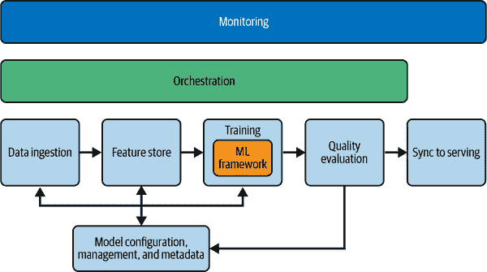

# 第七章：训练系统

*ML 训练*是我们将输入数据转换为模型的过程。我们获取一组输入数据，几乎总是经过预处理并以高效方式存储，然后通过一系列 ML 算法处理它。输出是该数据的表示，称为*模型*，我们可以集成到其他应用程序中。有关模型的更多详细信息，请参阅第三章。

*训练算法*描述了软件如何读取数据并更新模型以尝试表示这些数据的具体步骤。而*训练系统*则描述了围绕该算法的整套软件。最简单的 ML 训练系统的实现是在单台计算机上运行的单个进程上读取数据，对数据进行一些清理并对数据进行一致性处理，然后应用 ML 算法，并通过从数据中学到的内容创建具有新值的数据模型表示。在单台计算机上进行训练是构建模型的最简单方法，而大型云服务提供商确实提供强大的单机配置的租赁服务。但请注意，许多在生产中使用 ML 的有趣应用处理大量数据，因此可能受益于不止一台计算机的处理能力。分布式处理带来了规模，但也带来了复杂性。

部分原因是由于我们对 ML 训练系统的广泛概念，跨不同组织和模型构建者，ML 训练系统在各自的最终 ML 系统的不同部分之间可能没有太多共同之处。在第八章中，您将看到即使在不同的用例中，服务系统的许多基本要求也是广泛相似的：它们将模型的表示加载到 RAM 中，并回答从应用程序发送的关于该模型内容的查询。在服务系统中，有时该服务是针对非常小的模型（例如手机上的模型）。有时它是针对无法全部安装在单台计算机上的巨大模型。但问题的结构是相似的。

相比之下，训练系统甚至不一定生存在我们 ML 生命周期的同一部分（见图 1-1）。有些训练系统最接近输入数据，几乎完全离线于服务系统。其他训练系统嵌入在服务平台中，并与服务功能紧密集成。当我们观察训练系统维护和表示模型状态的方式时，会出现额外的差异。由于合法且结构良好的 ML 训练系统之间存在显著的差异，因此不合理涵盖所有组织训练模型的方式。

相反，本章涵盖了一个稍微理想化的简单分布式 ML 训练系统的版本。我们将描述一个存在于 ML 循环中的特定部分的系统，该系统与数据并行，并生成供模型质量评估系统和服务系统使用的工件。尽管你在现实世界中遇到的大多数 ML 训练系统与此架构有很大的不同，但将其分离出来将使我们能够专注于训练本身的特点。我们将描述一个功能齐全且易于维护的训练系统所需的元素，并描述如何评估额外理想特性的成本和收益。

# 要求

一个训练系统需要以下元素，尽管它们可能以不同的顺序或与其他元素组合出现：

训练用数据

如果有人类标签和注释，这包括它们。这些数据在使用时应预处理并标准化。通常，它们将以一种在训练期间进行高效访问优化的格式存储。请注意，“在训练期间进行高效访问”可能因我们的模型而异。数据还应存储在一个受访问保护且执行政策的环境中。

模型配置系统

许多训练系统都有一种方式来表示单个模型的配置，将其与整个训练系统的配置分开。¹ 这些配置应该在具有有关创建模型团队和模型使用数据的元数据的版本化系统中存储。稍后这将非常方便。

模型训练框架

大多数模型创建者不会手动编写模型训练框架。最可能的情况是，大多数机器学习工程师和建模者最终将专门使用训练系统框架，并根据需要进行定制。这些框架通常具有以下功能：

管理

系统的不同部分需要在不同的时间运行，并且需要彼此通知。我们称之为*编排*。有些系统还包括以下两个元素，但这些功能可以分开组装，因此在这里将它们分开。

作业/工作调度

有时候，作业调度的一部分，指的是实际在计算机上启动二进制文件并跟踪它们。

训练或模型开发软件

这些软件处理通常与构建 ML 模型相关的常规样板任务。当前的常见示例包括 TensorFlow、PyTorch 和许多其他框架。关于哪个框架最好的争论有时甚至会引发类似宗教战争的辩论，但它们都能完成帮助模型开发者更快速、更一致地构建模型的工作。

模型质量评估系统

有些工程师认为这不是训练系统的一部分，但它必须是。模型构建的过程是迭代的和探索性的。模型构建者尝试各种想法并且舍弃了其中的大部分。模型质量评估系统提供了对模型性能的快速和一致的反馈，并允许模型构建者快速做出决策。

###### 警告

这是训练系统中最常被忽略的部分，但确实是强制性的。

如果我们没有一个模型质量评估系统，那么我们每个模型开发者都将为自己构建更加临时和不可靠的系统，并且这样做会给组织带来更高的成本。这个主题在第五章中有更详尽的覆盖。

将模型同步到服务中

我们对模型的最后一步通常是将其发送到下一个阶段，通常是服务系统，但也可能是另一种分析系统。

如果我们有一个系统来满足这些基本需求，我们将能够为模型开发者提供一个最低限度的生产技术环境。除了这些基本元素外，我们还希望增加专门用于可靠性和可管理性的基础设施。在这些元素中，我们应该包括对监控这个多阶段管道的仔细思考，团队对特性和模型的所有权的元数据，以及一个完整的特性存储系统。

# 基本训练系统实现

图 7-1 描述了一个简单但相对完整和可管理的机器学习训练系统的建议架构。²

###### 图 7-1\. 基本机器学习训练系统架构

在这个简化的训练系统中，数据从左侧流入，模型从右侧出现。在此过程中，我们清理、转换和读取数据。我们使用一个机器学习框架，该框架应用训练算法将数据转化为模型。我们评估刚刚生成的模型。它是否格式良好？它是否有用？最后，我们将这个模型的可服务版本复制到我们的服务系统中，这样我们就可以将其集成到我们的应用程序中。在此期间，我们在一个元数据系统中跟踪我们的模型和数据，确保管道持续工作，并监控整个过程。接下来，我们将详细讨论每个组成部分的角色。

## 特性

*训练数据* 是关于我们认为对我们的模型有关联的世界事件或事实的数据。*特征* 是这些数据的具体可度量的方面。具体来说，特征是我们认为在建模、分类和预测未来事件时，在类似情况下最有用的数据方面。为了有用，特征需要在整个机器学习系统中，包括特征存储、训练、质量评估和服务中，具有一致的定义、一致的归一化和一致的语义。详细信息，请参阅第四章。

如果我们考虑像“购买价格”这样的 YarnIt 购买数据特征，我们很容易理解如果我们不小心会出现问题。首先，我们可能需要将购买行为标准化为同一货币，或者至少在我们的模型中不混合使用不同货币。所以让我们假设我们将所有金额转换为美元。我们需要确保我们根据特定时间点的汇率进行转换——比如我们查看数据的那一天伦敦交易日结束时的收盘汇率。然后，我们必须存储用于可能需要重新转换原始数据的转换值。我们可能应该对数据进行归一化，或者将其放入更大的桶或类别中。我们可以将所有小于 1 美元的金额放入第一个桶中，1 至 5 美元放入下一个桶中，依此类推，每 5 美元递增一个桶。这样做可以使某些类型的训练更加高效。这还意味着我们需要确保在训练和服务之间有标准的归一化，并且如果我们改变归一化方式，我们需要仔细同步更新所有地方。

特征和特征开发是我们在制作模型时进行实验的关键部分。我们试图弄清楚数据的哪些方面对我们的任务很重要，哪些不相关。换句话说，我们想知道哪些特征能够让我们的模型更好。随着模型的开发，我们需要简便的方法来添加新特征，在我们对现有日志中要查找的新想法时，对旧数据生成新特征，并删除证明不重要的特征。特征可能会很复杂。

## 特征存储

我们需要存储这些特征，毫不奇怪，我们用来存储这些特征的系统最常见的名称就是*特征存储*。即使我们的模型训练系统每次都会读取原始数据并提取特征，特征存储的特性仍然存在。大多数人会发现，将提取的特征存储在某种专门的系统中是方便的，尤其是作为重要的可靠性奖励。这个主题在第四章中有详细介绍。

这种情况下常见的数据架构是目录中的一堆文件（或对象存储系统中的一堆桶）。这显然不是最复杂的数据存储环境，但有一个巨大的优势，能够快速启动训练，并似乎促进对新特征的实验。长期来看，这种非结构化的方法却有两个巨大的缺点。

首先，确保整个系统始终正确运行是极其困难的。像这样具有非结构化特征工程环境的系统经常遭受训练-服务特征偏差（即在训练和服务环境中定义特征不同的情况），以及即使在训练系统中也存在随时间不一致的特征语义问题。

第二个问题是，非结构化的特征工程环境实际上会妨碍协作和创新。这使得更难理解模型中特征的来源，以及添加它们的人员、时间和原因。³ 在协作环境中，大多数新的模型工程师将极大受益于理解前人的工作。通过能够从效果良好的模型向后追溯，直至模型定义，最终到使用的特征，这一点变得更加容易。特征存储提供了一个一致的位置，用于理解特征的定义和作者，并且可以显著提升模型开发中的创新能力。

## 模型管理系统

*模型管理系统* 至少可以提供三组功能：

模型的元数据

配置、超参数和开发者的作者身份

训练模型的快照

通过使用迁移学习更高效地引导相同模型的新变体，以及在意外删除模型时用于灾难恢复的非常有用。

特征的元数据

每个模型具体使用的特征的作者和用途

虽然这些功能在理论上可以分开，而且软件产品中通常是分开的，但它们一起构成了一个系统，允许工程师理解正在生产中的模型，它们是如何构建的，由谁构建的，以及它们所依赖的特征是什么。

就像特征存储一样，每个人都有一个基本的模型管理系统，但如果它仅仅是“领导模型开发者家目录中的配置文件和脚本”，可能需要检查这种灵活性是否仍然适合组织的需求。有合理的方法可以启动模型管理系统，以降低负担。它并不需要复杂，但可以成为信息的重要来源，从服务端一直到存储端进行关联。如果没有这些数据，就不总是可能找出生产环境中出现问题的原因。

## 编排

*编排* 是协调和跟踪培训系统所有其他部分的过程。这通常包括安排和配置与训练模型相关的各种作业，以及跟踪培训何时完成。编排通常由与我们的机器学习框架和作业/进程调度系统紧密耦合的系统提供，但不一定如此。

在这里的编排中，请把 Apache Airflow 当作一个例子。许多系统在技术上是工作流编排系统，但专注于构建数据分析流水线（例如 Apache Beam 或 Spark，或 Google Cloud Dataflow）。这些系统通常对你的任务结构有很多假设，并且具有额外的集成和许多内置的限制。请注意，Kubernetes 不是一个流水线编排系统：Kubernetes 有一种编排容器和在其中运行的任务的方式，但通常本身不提供帮助我们指定数据如何通过流水线移动的语义。

### 作业/进程/资源调度系统

在分布式环境中运行机器学习训练流水线的每个人都有一种启动进程、跟踪它们并在其完成或停止时注意到的方式。有些人很幸运能够在提供调度作业和任务的本地或云端集中服务的组织中工作。否则，最好使用其中一个流行的计算资源管理系统，无论是开源还是商业的。

资源调度和管理系统的例子包括先前提到的软件，如 Kubernetes，尽管它还包括许多其他功能，如设置容器之间的网络并处理对容器的请求。更普遍且传统的是，Docker 可以通过提供一种配置和分发虚拟机（VM）映像到 VM 的方式被视为资源调度系统。

### 机器学习框架

*机器学习框架* 是算法操作的地方。机器学习训练的目的是将输入数据转换为该数据的表示，称为 *模型*。我们使用的机器学习框架将提供一个 API 来构建我们需要的模型，并处理读取特征并将其转换为适合模型的数据结构的所有样板代码。机器学习框架通常是相当低级的，虽然它们讨论和辩论很多，但最终在组织的整体机器学习循环中占据相当小的部分。

## 质量评估

ML 模型开发过程可以被看作是持续的部分失败后紧随的适度成功。很少有人的第一个尝试的模型能成为最好的，甚至是对特定 ML 问题合理的解决方案。因此，模型训练环境的一个基本要素是一种系统化的评估刚刚训练的模型的方法。

在某   模型质量评估在某种程度上必须与特定模型的目的密切相关。视觉模型能正确分类图片，语言模型则解释和预测文本。在最基本的层面上，模型质量评估系统提供了一种执行质量评估的方法，通常由模型开发者编写，并以一种可以与同一模型的先前版本进行比较的方式存储结果。这种系统的运作角色最终是足够可靠，能够作为自动门，防止“糟糕”的模型被发送到我们的生产环境中。

评估始于诸如验证我们是否加载了正确版本的正确模型，并确保模型在我们的模型服务器中加载。评估还必须包括性能方面，以确保模型可以在我们可用的内存和计算资源中提供服务。但是，我们还必须关心模型在我们认为代表我们将获得的请求上的性能。有关此主题的更详细信息，请参见第五章。

## 监控分布式数据处理管道是困难的。生产工程师可能关心的那些简单的事情，例如管道是否足够快速地处理数据，对于分布式系统来说很难准确而有意义地产生。查看最老的未处理数据可能没有意义，因为可能会有一个单独的旧数据块卡在一个其余已经完成处理的系统中。同样地，仅仅看数据处理速率本身可能不太有用，如果某些类型的数据比其他数据显著更昂贵，那么这种评估就更加复杂。

果某些类型的数据比其他类型显著更昂贵，则不一定是有效的。

本书有一个完整的监控章节（第九章）。更难的问题将在那里解决。对于本节而言，跟踪和警报的最重要的指标是训练系统的吞吐量。如果我们有一个有意义的长期趋势，能够快速处理各种条件下的训练数据，我们应该能够设置阈值，以在出现问题时提醒我们。

# 一般可靠性原则

在制定和操作系统的构建过程中，如果我们记住几个一般原则，事情通常会更顺利。

## 大多数故障不是机器学习的故障。

ML 训练系统是复杂的数据处理管道，对它们处理的数据非常敏感。它们通常分布在许多计算机上，尽管在最简单的情况下可能只在一台计算机上。这并不是一个能够长期保持可靠性的基本状态，生产工程师通常会关注这些数据敏感性引发的最常见故障。然而，有经验的从业者在长期观察机器学习系统的故障时发现，大多数故障并非机器学习特有的[⁴]。它们通常是在这种分布式系统中普遍发生的软件和系统故障。这些故障通常具有机器学习特有的影响和检测挑战，但其根本原因通常并非机器学习特有。

这些故障的有趣例子包括一些非常直接的事情，比如“训练系统失去读取数据的权限，因此模型在没有数据的情况下训练”，以及“我们复制到服务中的版本并非我们所认为的那个版本”。大多数情况下，这些故障是由于错误监控和管理数据管道引起的。更多例子详见第十一章和第十五章。

要使机器学习训练系统可靠，首先要解决系统和软件错误，并对其进行缓解。关注软件版本管理和部署、权限和数据访问要求、数据更新策略和数据组织、复制系统以及验证。基本上，在开始任何机器学习特定工作之前，要做好使一般分布式系统可靠的所有工作。

## 模型将被重新训练。

或许这一部分应该更加强调：模型必须*重新训练*。一些模型开发者会从数据集中训练一个模型，检查结果，将模型部署到生产环境，并声称完成了工作。他们会指出，如果数据集没有变化并且模型达到了目的，那么该模型已经足够好，没有必要再次进行训练。

不要相信这一点。最终，无论是在一天还是一年之后，该模型开发者或其继任者都会有新想法，想要训练同一模型的不同版本。也许会发现或创建一个涵盖类似案例的更好数据集，然后模型开发者会希望在其上进行训练。或许只是出于灾难恢复的原因，您希望证明如果错误删除了模型的每一个副本，您可以重新创建它。您可能只是想验证训练和验证工具链是否完整。

出于所有这些原因，假设每个模型都会重新训练，并据此制定计划——存储配置并进行版本控制，存储快照，并保留有版本的数据和元数据。这种方法具有巨大的价值：关于所谓的“离线”和“在线”模型的大部分争论实际上是关于在有新数据存在的情况下重新训练模型的争论。通过创建一个严格的生产要求，即模型可以重新训练，技术环境在很大程度上有助于定期重新训练所有模型（包括快速重新训练）⁵。

###### 提示

假设每个模型都会重新训练。

## 模型将会有多个版本（同时存在！）

模型几乎总是以队列方式开发，这显而易见是因为我们希望使用不同的超参数训练不同版本。一种常见的方法是给一个命名模型添加多个小的变化。有时这些变化会在开始时迅速集中出现，而其他时候则会随时间逐渐到来。但正如模型将会重新训练一样，它们也将会随时间的推移而发生变化和发展。在许多环境中，我们希望同时提供同一模型的两个或更多个版本，以确定不同条件下模型的不同版本如何工作（对于熟悉传统网页开发用户体验的人来说，这本质上是模型的 A/B 测试）。

同时托管同一模型的多个版本需要特定的基础设施。我们需要使用我们的模型管理基础设施来跟踪模型元数据（包括模型系列、模型名称、模型版本和模型创建日期等内容）。我们还需要有一个系统，将部分查询路由到一个版本的模型而不是另一个版本。

## 好的模型会变坏

我们应该假设我们生产的模型将很难复制，并且将来可能会出现微妙和严重的可靠性问题。即使一个模型在启动时表现良好，我们也必须假设模型或者世界可能以某种难以预测的方式发生变化，从而在未来几年给我们带来巨大的麻烦。制定备份计划。

第一个备份计划是为我们的模型制定一个非 ML（或至少是“更简单的 ML”）回退路径或“故障安全”实现。这将是一个确保我们的应用程序在 ML 模型无法提供复杂预测、分类和洞见时至少提供一些基本功能的启发式算法或默认设置。实现这一目标的常见算法是简单而极为普遍的，但至少比没有稍微好一点。我们之前提到的一个例子是，在*yarnit.ai*商店的推荐系统中，当我们没有定制的推荐模型可用时，我们可能简单地默认显示流行商品。

然而，这种方法存在一个巨大的问题：它限制了您能够让您的机器学习模型有多好。如果模型比启发式或默认设置要好得多，您将会对它们依赖如此之深，以至于没有任何备份足以实现相同的目标。依赖于默认设置和启发式是大多数在机器学习采用生命周期早期的组织所选择的一条完全适当的道路。但这是一个依赖关系，如果您真的想在组织中实际利用机器学习，您应该摆脱它。

另一个备份计划是保留同一模型的多个版本，并计划在需要时回退到旧版本。这将涵盖一些由于某种原因新版本模型显著较差的情况，但当整个世界已经改变，因此所有版本的这个模型都不是很好时，它将无济于事。

最终，第二个备份计划结合能够同时提供多个模型并快速开发现有模型的新变体的能力，为理解和解决未来模型质量问题提供了一条路径，当世界以一种使模型表现不佳的方式改变时。对于传统的生产人员来说，重要的是注意，在这种情况下，模型开发和生产之间不存在固定或可辩护的障碍。模型质量既是生产工程问题，也是模型开发问题（可能紧急发生在生产中）。

## 数据将不可用

在尝试读取时，用于训练新模型的部分数据将不可用。数据存储系统，特别是分布式数据存储系统，有包括少量实际数据丢失和更高量的数据不可用在内的故障模式。这是一个值得提前考虑的问题，因为它肯定会发生。

大多数机器学习训练数据集已经从另一个更大的数据集中抽样，或者仅仅是从我们开始收集数据的时间或方式的全部可能数据的一个子集。例如，如果我们在*yarnit.ai*的客户购买行为数据集上进行训练，这个数据集从一开始就是不完整的，至少有两个明显的方面。

首先，有一些日期是我们没有收集这些数据的日期（或者在某些日期之前我们选择不使用数据，无论出于什么原因）。其次，这实际上只是我们网站上的客户购买行为，不包括其他网站上类似产品的客户购买行为。这并不奇怪，因为我们的竞争对手不与我们共享数据，但这意味着我们已经看到的几乎肯定是相关训练数据的一个子集。对于非常高容量的系统（例如 Web 浏览日志），许多组织在训练之前也会自动对这些数据进行子采样，以减少数据处理和模型训练的成本。

鉴于我们的训练数据已经进行了子抽样，可能以多种方式进行，当我们丢失数据时，我们应该回答这个问题：数据的丢失是否存在某种偏差？如果我们以完全随机的方式删除每一千个训练记录中的一个，这几乎可以肯定可以忽略对模型的影响。另一方面，失去所有来自西班牙人或者上午购物的人的数据，或者大型针织会议前一天的数据，这些都是不能忽略的。它们很可能会在我们训练的数据与我们不训练的数据之间造成新的偏差。

一些培训系统会在问题出现之前尝试预先解决整个系统的缺失数据问题。只有在所有模型具有类似的约束和目标时，这种方法才会奏效。这是因为缺失数据的影响对每个模型都很重要，只有在其对每个模型影响的背景下才能理解。

缺失数据还可能具有值得考虑的安全属性。一些系统，特别是那些旨在防止欺诈和滥用的系统，将受到外部恶意方的持续观察和攻击。对这些系统的攻击包括尝试不同类型的行为来确定系统的响应，并利用出现的漏洞或弱点。在这些情况下，训练系统可靠性团队需要确保没有外部方面可以系统性地偏置哪些特定时间段在训练过程中被跳过。攻击者找到的方式，例如在短时间内创建大量重复交易，以淹没数据处理系统并尝试命中系统中的高丢弃启发式策略，这是每个处理数据丢失场景的人都需要事先考虑的一种情景。

## 模型应该可以改进

模型会随着时间变化，不仅仅是通过添加新数据。它们还会经历更大的结构性变化。改变的要求来自多个方向。有时我们会向应用程序或实现添加一个新特性，该特性不仅提供新数据，还需要模型的新特性。有时候我们的用户行为会发生足够大的变化，以至于我们需要修改模型来适应。在描述的训练系统中，程序上对模型训练最具挑战性的变化是添加一个全新的特性。

## 特征将被添加和更改

大多数生产 ML 训练系统都会有某种形式的特征存储来组织 ML 训练数据。（特征存储提供了许多优势，并在第四章中详细讨论。）从训练系统的角度来看，我们需要注意的是，随着时间推移，模型开发的重要部分通常是向模型添加新特征。这种情况发生在模型开发人员对可能与现有数据结合使用以有用地改进模型的某些数据有新想法时。

添加特征将需要更改特征存储模式，这是特定于实施的，但也可能受益于“回填”特征存储的过程，通过重新处理过去的原始日志或数据为以前的示例添加新特征。例如，如果我们决定我们认为顾客正在购物的城市的当地天气是预测他们可能购买的一种显著方式，我们将不得不向特征存储添加`customer_temperature`和`customer_precipitation`列。[⁷] 我们可能还会重新处理过去一年的浏览和购买数据，以在过去添加这两列，以便验证我们的假设这是一个重要的信号。向特征存储添加新列以及更改过去数据的模式和内容是两项活动，如果变更未经精心管理和协调，可能会显著影响训练系统中所有模型的可靠性。

## 模型可能训练得太快。

有时，ML 生产工程师会惊讶地发现，在某些学习系统中，模型可能训练得太快。[⁸] 这可能有点取决于确切的 ML 算法、模型结构以及实施系统的并行性。但完全有可能出现这样一种模型：当训练得太快时，产生垃圾结果；但当训练得更慢时，产生的结果则更准确。

以下是可能发生的一种方式：模型状态有一个分布式表示，由分布式的学习过程集合使用。学习过程读取新数据，查询模型的状态，然后更新模型的部分状态以反映它们刚刚读取的数据。[⁹] 只要在这个过程中有锁定（慢！）或没有更新正在更新的特定键（在规模上不太可能），一切都很好。

问题在于可能存在多个竞争条件，其中两个或多个学习任务同时查询模型，读取某些数据，并将更新排队到模型。一个非常普遍的情况是更新可以堆叠在一起，导致模型的某个部分在某个方向上移动得太远。下次一群学习任务查询模型时，它们发现它在某个方向上的偏差很大，与它们正在读取的数据相比，因此它们排队更新以使其大幅朝另一个方向移动。随着时间的推移，这部分模型（以及其他部分模型）可能会偏离正确的值而不是收敛。

###### 警告

对于分布式训练设置来说，多个竞争条件是一个极为常见的失败来源。

对于机器学习生产工程学科来说，确定模型是否训练得“太快”并没有简单的方法。有一个现实世界的测试是不方便和令人沮丧的：如果你以更快和更慢的速度训练同一个模型（通常是用更多和更少的学习任务），并且慢速模型在某些质量指标上“更好”，那么你可能是在训练得太快了。

缓解这个问题的主要方法是通过在任何学习过程中将模型状态与存储状态密切同步，从而结构性地限制“正在进行中”的更新次数。这可以通过在非常快速的存储（RAM）中存储当前模型状态以及限制多个进程更新模型的速率来实现。当然，也可以为每个关键字或模型的每个部分使用锁定数据结构，但这些通常会施加太高的性能惩罚，难以认真考虑。

## 资源利用至关重要

这应该简单明了地说明：机器学习的训练和服务是计算昂贵的。我们关注机器学习训练资源效率的一个基本原因是，如果没有有效的实施，机器学习可能没有商业意义。考虑到机器学习模型提供的某些业务或组织价值与其提供的价值成比例，除以创建模型的成本。尽管最初的成本主要是人力和机会成本，但随着我们收集更多数据，训练更多模型并更多地使用它们，计算基础设施成本将占据越来越大的开支份额。因此，早期关注这一点是有意义的。

具体而明确地说，利用率描述如下：

<math><mrow><mrow><mfrac><mrow><mi>计算资源使用的部分</mi></mrow><mrow><mi>支付的总计算资源</mi></mrow></mfrac></mrow></mrow></math>

这是浪费的反义词，衡量我们如何有效使用我们付费的资源。在一个日益云化的世界中，这是一个早期跟踪的重要指标。

资源利用也是可靠性问题。与我们可用的资源相比，我们有更多余地来重新训练模型，整个系统的韧性就越强。因为我们能够更快地从停机中恢复过来。这一点不论是在单台计算机上还是在大型集群上训练模型都成立。此外，利用率也是创新问题。模型训练得越便宜，我们在给定的时间和预算内能够探索的想法就越多。这显著增加了我们在所有糟糕的想法中找到好想法的可能性。在细节层面很容易忽视这一点，但我们实际上不是在这里训练模型 —— 我们是为了在我们的组织和客户中产生某种不同。

因此，我们关心资源的有效使用。以下是一些简单的方法，可以使机器学习训练系统在这方面表现良好：

批处理处理数据

在可能的情况下（依赖于算法），同时对数据块进行训练。

重建现有模型

早期阶段的机器学习训练系统通常会在新数据到达时从头开始重建模型。这从配置和软件角度来看更简单，但最终可能效率极低。增量更新模型的这种想法还有几个其他变体：

+   使用迁移学习通过利用现有模型构建一个模型。¹⁰

+   使用多模型架构，其中包括一个长期模型，大且不经常重新训练，以及一个较小的短期模型，便宜且频繁更新。

+   使用在线学习，即每个新数据点到达时增量更新模型。

诸如此类简单步骤可以显著影响组织的计算成本，用于训练和重新训练模型。

## 利用率 != 效率

要知道我们的机器学习工作是否有用，我们必须衡量过程的价值，而不是提供它所花费的 CPU 周期。效率度量包括以下几点：

<math><mrow><mrow><mfrac><mrow><mi>生成价值</mi></mrow><mrow><mi>成本</mi></mrow></mfrac></mrow></mrow></math>

成本可以通过两种方式计算，每种方式都提供了我们努力的不同视角。*以金钱为索引的成本*是我们在资源上花费的美元数。在这里，我们只计算用于训练模型的总金额。这样做的优点是对大多数组织来说，这是一个非常实际的数字。但它的缺点是资源定价的变化可能会使我们难以区分由建模和系统工作引起的变化与来自我们资源提供者的外生变化。例如，如果我们的云服务提供商开始对我们目前使用的 GPU 收费更多，我们的效率会因为我们没有做出任何改变而下降。当然，了解这一点很重要，但它并不能帮助我们建立一个更高效的训练系统。换句话说，金钱成本是衡量效率最重要的长期指标，但具有讽刺意味的是，并不总是识别项目以提高效率的最佳方式。

相反，*以资源为索引的成本*是以恒定美元的术语衡量的。做到这一点的一种方法是识别最昂贵和最受限制的资源，并将其用作资源索引成本的唯一元素。例如，我们可以将成本测量为*CPU 秒*或*GPU 秒*。这样做的优点是，当我们使我们的训练系统更加高效时，我们将能够立即看到它，而不受当前定价细节的影响。

这引发了一个困难的问题，那就是我们的机器学习工作的价值究竟是多少。同样，我们可能要衡量的价值有两种：*每个模型*和*整体*。在每个模型的粒度水平上，*价值*可能不如我们预期那样宏伟。我们不需要衡量每个训练模型的实际业务影响。相反，为了简单起见，让我们假设我们的训练系统是值得的。在这种情况下，我们需要一个指标来帮助我们比较在训练相同模型的不同实现之间创建的价值。一个运作良好的指标可能是

训练的特征数量

或者甚至

处理的示例数量

或者

训练的实验模型数量

因此，对于每个模型、以资源为索引的、成本效率的指标，我们可能有这样一个：

<math><mrow><mrow><mfrac><mrow><mi>数百万例</mi></mrow><mrow><mi>GPU 秒</mi></mrow></mfrac></mrow></mrow></math>

这将帮助我们轻松地看到使阅读和训练更加高效的努力，而无需我们了解模型实际上做了什么。

相反，*整体*价值试图衡量在整个机器学习模型培训计划中的价值，考虑到我们为将价值增加到整个组织中所付出的成本。这将包括员工成本、测试模型以及生产模型的培训和服务成本。它还应试图衡量模型对我们组织的整体价值。我们的客户是否更满意？我们是否赚更多的钱？机器学习训练系统的整体效率是以整个计划或整个组的基础上衡量的，并且是以月为单位而不是秒为单位衡量的。

没有效率概念的组织最终会错误地分配时间和精力。有一个略微不准确但可以改进的测量指标远比根本不测量效率要好得多。

## 故障包括恢复

这显然是一个显而易见的事实，但还是值得清楚地指出：ML（机器学习）的故障包括从故障中恢复所需的时间。这对监控、服务水平和事故响应有着巨大和直接的影响。例如，如果一个系统能够容忍培训系统的 24 小时故障，但是在发现任何问题需要 18 小时，并且在发现问题后需要 12 小时来训练新模型，我们就不能可靠地在 24 小时内完成。很多人在建模生产工程响应培训系统故障时完全忽视了包括模型恢复时间。

# 常见的训练可靠性问题

现在您已经了解了培训系统的基本架构，并查看了关于培训系统的一般可靠性原则，让我们看看一些特定的培训系统失败场景。本节涵盖了 ML 训练系统三个最常见的可靠性问题：数据敏感性、可重复性和容量不足。对于每个问题，我们将描述失败情况，然后在 YarnIt 的情景中给出一个具体的例子。

## 数据敏感性

正如反复提到的，ML 训练系统对输入数据的小变化和数据分布的变化非常敏感。具体来说，我们可能有相同数量的训练数据，但在数据覆盖不同子集的方式上存在显著差异。想象一个试图预测全球购买行为的模型，但只有美国和加拿大的交易数据。或者考虑一个图像分类算法，其中没有猫的图片，但有许多狗的图片。在每种情况下，由于仅在有偏见的数据集上进行训练，模型对现实的看法都会存在偏差。这些训练数据覆盖的空白可能从一开始就存在，也可能随着时间推移而出现，因为我们在训练数据中经历了空白或变化。

输入数据缺乏代表性是 ML 模型中偏见的常见源头；这里我们使用 *偏见* 一词既是在技术上指模型预测值与正确值之间的差异，也是在社会上指对某一人群有偏见或有损害的含义。数据中的奇怪分布也可能引起许多其他更为普通的问题。有关一些微妙且有趣的案例，请参阅 第十一章，但现在让我们考虑 YarnIt 的一个明显的数据敏感性问题。

## 在 YarnIt 的示例数据问题

YarnIt 使用 ML 模型来对最终用户搜索结果进行排名。客户访问网站并输入一些产品名称的关键词。我们生成一个简单而广泛的候选产品列表，这些产品可能与搜索匹配，并使用设计用于预测每个产品对正在进行此查询的用户有用程度的 ML 模型对它们进行排名。

模型将具有“产品名称中的单词”，“产品类型”，“价格”，“查询的原产地”，以及“用户的价格敏感性”等特征。这些特征将帮助我们为用户排名一组候选产品。我们每天重新训练这个模型，以确保我们正确地排名新产品，并适应购买模式的变化。

在一个案例中，我们在 YarnIt 的定价团队创建了一系列促销活动，以清理库存产品。建模团队希望分别捕获折扣前价格和销售价格，因为这些可能是不同的用户购买行为信号。但由于数据格式的变化，他们在将折扣价格添加到数据集后错误地排除了所有折扣购买记录，直到他们注意到这一点，模型将完全基于全价购买进行训练。从 ML 系统的角度来看，折扣商品似乎永远不再被任何人购买。因此，模型最终将停止推荐折扣产品，因为我们的日志、数据和训练系统中再也找不到任何人购买它们的证据！在训练期间数据处理中的这种非常小的错误可能会导致模型中的重大错误。

## 可复制性

ML 训练通常不是严格可复制的；在现代大多数 ML 训练框架工作方式下，几乎不可能在完全相同的训练数据和二进制文件上生成完全相同的模型，甚至可能无法得到大致相同的模型。请注意，虽然学术上的 ML 中的“可复制性”是指在已发布论文中重现结果，但这里我们指的是更为简单和更为关键的问题：在相同的数据集和模型上重现我们自己的结果。

ML 可复制性的挑战来自几个来源，其中一些可解决，另一些则不行。重要的是先解决可解决的问题。以下是一些导致模型不可复制的最常见原因：

模型配置，包括超参数

模型精确配置的微小变化，特别是选择的超参数，可能会对生成的模型产生重大影响。解决方案很明确：对模型配置进行版本控制，包括超参数，并确保使用完全相同的数值。

数据差异

尽管听起来显而易见，但大多数机器学习训练特征存储系统经常更新，很难保证在同一模型的两次运行之间数据完全没有任何变化。如果遇到可重现性挑战，消除训练数据差异的可能性是至关重要的一步。

二进制更改

即使是对机器学习训练框架、学习二进制文件或编排或调度系统的微小版本更新，也可能导致生成的模型发生变化。在调试可重现性问题时，保持这些内容在训练运行期间保持不变。¹¹

除了那些可修复的无法重现的原因外，至少还有三个原因不容易修复：

随机初始化

许多机器学习算法和大多数机器学习系统使用随机初始化、随机洗牌或随机起点选择作为它们工作的核心部分。这可能导致训练运行中的差异。在某些情况下，可以通过在多次运行中使用相同的随机种子来减少这种差异。

系统并行性

在分布式系统（甚至是具有多个线程的单机训练系统）中，作业将被安排在大量处理器上，并且它们每次学习的顺序都会有所不同。根据以何种顺序更新哪些键，会产生顺序效应。在不牺牲分布计算的吞吐量和速度优势的情况下，没有明显的方法可以避免这一点。请注意，一些现代硬件加速器架构提供了比其他网络技术快得多的定制高速芯片之间的互连。例如，NVIDIA 的 NVLink 或 Google 的 Cloud TPU 之间的互连就是其中的例子。这些互连减少了但并未消除在计算节点之间传播状态时的延迟。¹²

数据并行

正如学习任务被分布式处理一样，数据也是如此，假设我们有大量数据。大多数分布式数据系统在不加入显著性能约束条件下，不具备强有序性保证。我们必须假设，即使是从有限数量的训练任务中读取训练数据，也会以略有不同的顺序进行阅读。

处理这三个原因是昂贵且具有挑战性的，几乎是不可能的。在机器学习训练过程中，某种程度上无法精确复现完全相同的模型是一个必要的特征。

## YarnIt 的可重现性问题示例

在 YarnIt，我们每晚重新训练我们的搜索和推荐模型，以确保我们定期调整它们以适应产品和客户行为的变化。通常，我们会对前一天的模型拍摄快照，然后在此之后训练新的事件。这样做更加经济，但最终意味着每个模型实际上是在相当长时间之前训练的模型的数十或数百次增量训练运行之上。

定期地，我们的训练数据集会随着时间而发生小的变化。最常见的变化是由于欺诈而产生的费用。发现一笔交易是欺诈可能需要多达几天的时间，到那时我们可能已经用包含该交易的新模型进行了训练。最彻底的修复方式将是将原始交易重新分类为欺诈，并重新训练每个曾经包含该交易的模型，从一个旧的快照中。每次发生欺诈交易时这样做的成本将非常昂贵。我们可能最终会不断重新训练最近几周的模型。另一种方法是试图从模型中撤销欺诈交易。这很复杂，因为在大多数机器学习模型中没有绝对可靠或精确的方法来撤销交易。¹³ 我们可以通过将检测到的欺诈视为新的负面事件来近似这种变化，但得到的模型将不会完全相同。¹⁴

所有这些都是针对当前正在生产中的模型。同时，YarnIt 的模型开发人员不断开发新模型，试图提高它们预测和排名的能力。当他们开发新模型时，他们会从头开始用所有新模型结构的数据进行训练，然后将其与现有模型进行比较，看看它是否在实质上更好或更差。可能显而易见的是，问题在于如果我们从头开始对当前数据重新训练*当前*的生产模型，那么该模型很可能与当前正在生产的生产模型显著不同（后者是随时间迭代地在相同数据上训练的）。先前列出的欺诈交易将永远不会被训练，而是在一段时间后被删除。事实上，情况甚至比这更不确定：即使我们对完全相同的数据使用完全相同的模型进行训练而没有任何变化，我们也可能会有非常显著的差异，一个模型一次性训练，另一个则在数次更新中逐步训练。¹⁵

这种真正令人不安的问题正是为什么模型质量必须由模型、基础设施和生产工程师共同负责。面对这个问题的唯一真正的可靠解决方案是将每个训练的模型视为该模型的柏拉图理想的略有不同的变体，并彻底放弃训练过的模型之间相等的观念，即使它们是由相同的计算机在相同数据上连续两次训练的相同模型配置。当然，这可能会大幅增加回归测试的成本和复杂性。如果我们绝对需要它们更加稳定（注意这并不是“相同”，因为在大多数情况下我们无法做到这一点），那么我们可能不得不开始考虑使用同一模型的复数副本集合，以便我们在时间上尽量减少变化。¹⁶

## 计算资源能力

就像它是非 ML 系统中停机的常见原因一样，缺乏足够的训练能力也是 ML 系统停机的常见原因。我们需要训练新模型的基本能力包括以下内容：

I/O 能力

这是特征存储的能力，以便我们能够快速读取输入数据。

计算能力

这是训练作业的 CPU 或加速器，以便我们能够从输入数据中学习。这需要相当数量的计算操作。

内存读写能力

在任何给定时间点，模型的状态存储在某个地方，但通常是在 RAM 中，因此当训练系统更新状态时，系统需要内存带宽来执行此操作。

ML 训练系统能力问题的一个棘手和令人困扰的方面之一是输入数据分布的变化，而不仅仅是其大小，可以导致计算和存储能力问题。为 ML 训练系统的能力问题进行规划需要周密的架构设计以及细致和一致的监控。

## YarnIt 的容量问题示例

YarnIt 每天更新多个模型。这些模型通常是在网站使用最低的时间段训练的，这个时间段是大多数用户的夜间，并且预计在第二天忙碌期开始前更新。按照这种方式进行训练使得我们可以在在线服务和 ML 训练系统之间重复利用一些资源。至少，我们需要读取由服务系统产生的日志，因为 YarnIt 每天训练的模型读取前一天网站的搜索、购买和浏览历史。

和大多数 ML 模型一样，某些类型的事件在计算上比其他事件更简单。我们特征存储中的一些输入数据需要连接到其他数据源，以便完成一些训练操作的输入。例如，当我们展示由我们合作伙伴而不是 YarnIt 直接列出的产品购买时，我们需要查找有关该合作伙伴的详细信息，以便继续构建准确预测客户对该合作伙伴产品偏好的模型。如果由于某种原因，我们从合作伙伴那里的购买比例随时间增加，我们可能会在从合作伙伴信息数据集读取方面看到显著的能力不足。此外，这可能会导致我们似乎已经耗尽了计算能力，而实际上 CPU 正等待来自合作伙伴数据存储系统的响应。

此外，一些模型可能比其他模型更为重要，我们可能需要一个系统来优先处理那些资源受限、需要更多资源集中的重要模型训练任务。这种情况通常发生在故障后。假设我们在训练系统的某个部分经历了 48 小时的故障。那时，我们拥有的模型已经过时，代表着我们两天前对世界的最佳视角。由于停机时间如此之长，合理地预期我们需要时间来赶上进度，即使我们使用了所有可用的机器资源。在这种情况下，了解哪些模型需要快速更新是极其有用的。

# 结构可靠性

一些 ML 训练系统的可靠性问题并不是来自代码或训练系统的实现，而是来自其实施的更广泛背景。这些挑战有时对系统和可靠性工程师来说是不可见的，因为它们不会在模型或系统中显示出来，而是显示在组织和人员中。

## 组织挑战

许多添加机器学习能力的组织首先雇佣某人来开发模型。仅在此后才加入机器学习系统和可靠性工程师。这在某种程度上是合理的，但为了完全提高生产力，模型开发者需要在一个稳定、高效、可靠且良好工具化的环境中运行。虽然在行业中有相对较少有生产工程师或 ML 系统 SRE 经验的人员，但事实证明，几乎所有与 ML 系统相关的问题都是分布式系统问题。任何曾经构建和维护过类似规模的分布式系统的人，经过一段时间和经验积累后，应该能够成为我们 ML 系统上有效的生产工程师。

这将足够让我们开始将机器学习应用于我们的组织。但是，如果我们从前面的失败案例中学到了什么，那就是有些案例非常简单，但其他案例确实涉及理解模型结构和学习算法的基础知识。为了长期成功，我们不需要成为机器学习生产工程师的专家，但我们需要那些对机器学习感兴趣并致力于了解其工作细节的人。我们不能简单地把所有模型质量问题都委托给建模团队。

最后，我们还将面临资历和可见性问题。机器学习团队更有可能得到比许多其他同样规模或范围的团队更多的高级关注。这至少部分原因是因为当机器学习成功时，它被应用于我们业务中最有价值的部分：赚钱、使客户满意等。当我们在这些方面失败时，高级领导会注意到。整个生态系统中的机器学习工程师需要学会在组织中更高级别地进行沟通，并与对他们工作有兴趣的非技术领导人合作，当出现问题时可能会带来严重的声誉和法律后果。对于一些工程师来说，这是不舒服的，但是建立机器学习团队的经理应该为这种可能性做好准备。

关于除了训练系统之外的组织考虑的更深入讨论，请参阅第十三章和第十四章。

## 道德和公平考量

机器学习可以很强大，但也可能造成巨大的损害。如果我们组织中没有人负责确保我们正确使用机器学习，我们很可能最终会遇到麻烦。机器学习训练系统是我们可以看到问题（模型质量监控）并实施治理标准的地方之一。

对于刚开始实施机器学习的组织来说，模型开发者和机器学习训练系统工程师可能需要共同负责实施最基本的隐私、公平和道德检查。至少，这些检查必须确保我们在每个运营司法管辖区内使用数据隐私和使用方面符合当地法律要求。他们还必须确保数据集的创建和管理是公平的，并且模型经过了最常见的偏见检查。

一个常见且有效的方法是，组织采用一套负责任的 AI 原则，随后逐步建立系统和组织能力，确保这些原则在组织内所有 ML 使用中得到一致和成功的应用。考虑如何在模型层面（第五章）、政策层面（第六章）保持一致，同时将原则应用到数据（第四章）、监控（第九章）和事故响应（第十一章）。

# 结论

虽然 ML 训练系统的实施者仍然需要做出许多选择，但本章应该能清晰地说明这些选择的背景、结构和后果。我们已经概述了训练系统的主要组成部分以及影响我们对这些系统使用的许多实际可靠性原则。有了对训练模型创建过程的这种视角，我们现在可以把注意力转向 ML 生命周期中的以下步骤。

¹ 在许多现代框架中（特别是 TensorFlow、PyTorch 和 JAX），通常使用的配置语言是实际的代码，通常是 Python。这对于 ML 训练系统世界的新手来说是一个重要的头疼来源，但确实提供了灵活性和熟悉度的优势（对于某些人来说）。

² 几种类型的 ML 系统（尤其是强化学习系统）与本文框架有很大不同。它们通常具有额外的组件，如代理和模拟，并且把预测放在我们这里称为“训练”的环节。我们并不忽视这些差异，但选择了最常见的组件来简化这次讨论。你的系统可能会以不同的顺序拥有这些组件，或者可能有额外的组件。

³ 更糟糕的是，当无法追踪数据来源时，我们将面临治理问题（合规性、伦理、法律）。例如，如果我们无法证明我们训练的数据是我们拥有或已获许可用于此用途，我们可能会面临误用数据的指控。如果我们无法展示创建数据集的连接链条，我们无法证明遵守隐私规则和法律。

⁴ 例如，请参阅[“ML 如何失败：十年来一个大型 ML 管道的失败”](https://oreil.ly/Y1tk8) by Daniel Papasian and Todd Underwood。

⁵ 这个建议有一个有趣的例外，但不适用于绝大多数从业者：大型语言模型。大型 ML 中心组织正在训练多个非常大的语言模型，以便跨多种语言和数据类型提供复杂查询的答案。这些模型的训练成本如此之高，以至于它们的生产模型明确是一次性训练，然后“永久”使用（直接或通过迁移学习）。当然，如果降低这些模型的训练成本或出现其他算法进步，这些组织可能会发现自己仍需训练新版本的这些模型。

⁶ 统计学家将数据的这些不同属性称为*完全随机缺失*（数据点缺失的倾向完全随机）；*随机缺失*或*MAR*（数据缺失的倾向不与数据相关，但与另一变量相关—这真是一个统计术语的不幸命名）；以及*非随机缺失*（数据缺失的倾向与数据中的某些因素相关）。在这种情况下，我们描述的是 MAR 数据，因为任何给定数据点缺失的倾向都与另一个变量相关（例如地理位置或时间）。

⁷ 添加这些功能可能会对隐私造成重大影响。这些问题在第四章中简要讨论，而在第六章中则更加详尽。

⁸ 这在使用梯度下降并具有显著并行学习的模型架构中最为常见。但这对于大型 ML 训练系统来说是一种极为常见的设置。一个不会遇到这个问题的模型架构示例是随机森林。

⁹ 一个模型参数存储的架构被 Mu Li 等人在《“Scaling Distributed Learning with the Parameter Server”》中描述得很好，并在《深入深度学习》（Joanne Quinn 等人著，Corwin，2019）的第十二章中详细讨论。这种架构的变体已成为大规模 ML 训练系统分布式学习的最常见方式。

¹⁰ 迁移学习通常涉及将一个任务的学习应用到另一个相关的任务上。在生产环境中，迁移学习通常涉及从已经训练好的早期版本模型的快照开始学习。我们要么只训练新特征，这些特征未包含在快照中，要么只训练自快照训练后出现的新数据。这可以显著加快学习速度，从而显著降低成本。

¹¹ 敏锐的读者可能会注意到这是多么令人恐惧。另一种解读是“我的模型可能会在我随时更新 TensorFlow 或 PyTorch，即使是一个新的小版本时改变。” 这基本上是真的，但并不常见，而且差异通常并不显著。

¹² 只要处理器（无论是 CPU 还是 GPU/加速器）及其本地内存的操作速度显著高于我们从网络连接中访问该状态的速度，传播该状态总会有延迟。当处理器根据他们学到的输入数据更新模型的部分时，始终会有其他处理器在使用模型中这些键的较旧版本。

¹³ 有关从机器学习模型中删除数据的大量研究工作正在进行中。读者应该参考一些这方面的研究，以更好地了解不同方法及其删除先前学习数据的后果。一篇总结这一主题上一些最新工作的论文是 [“Making AI Forget You: Data Deletion in Machine Learning”](https://oreil.ly/GWShn)，但请注意这是一个活跃的研究领域。

¹⁴ 第六章 讨论了一些我们希望从已经训练过的模型中删除私有数据的案例。简而言之，如果数据是真正私密的，并且包含在我们的模型中，除非在模型构建过程中使用了差分隐私并提供了关于如何查询模型的谨慎保证，否则我们可能需要从头开始重新训练模型。事实上，每当有人请求删除其数据时，我们都必须这样做。这一点单独就是确保我们的模型不包含私人数据的一个强有力的论点。

¹⁵ 为什么会出现这种情况的详细内容与模型和机器学习框架有关，并且超出了本书的范围。但通常归结为机器学习框架中的非确定性加上数据并行处理中的非确定性。在您自己的环境中复现这种非确定性能带来巨大的教育意义，但也会有些许恐惧。是的，这个脚注确实鼓励读者复现不可重现性。

¹⁶ *集成模型* 就是由多个其他模型组成的模型集合。它们最常见的用途是将多个非常不同的模型结合到一个单一目的中。在这种情况下，我们会将多个相同模型的副本组合起来。
