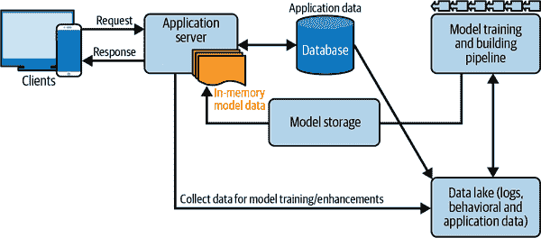

# 第八章：服务

你已经创建了一个模型；现在你必须让它进入世界，并开始预测事物。这个过程通常被称为*模型服务*。这是一个常见的简称，用来描述“创建一个结构，以确保我们的系统可以要求模型对新示例进行预测，并将这些预测返回给需要它们的人或系统”（所以你可以看到为什么会发明这个简称）。

在我们的*yarnit.ai*在线商店示例中，我们可以想象我们的团队刚刚创建了一个可以很好地预测给定用户购买特定产品可能性的模型。我们需要一种方式让模型与我们的整体系统分享其预测结果。但是，确切地说，我们应该如何设置这个？

我们有各种可能性，每一种都有不同的架构和权衡。它们在方法上有很大的不同，所以看到这个列表时可能并不明显，这些都是解决同一个问题的尝试：我们如何将我们的预测与整体系统集成？我们可以做以下任何一项：

+   将模型加载到爱荷华州得梅因市的 1,000 台服务器中，并将所有传入的流量发送到这些服务器。

+   预计算模型对 100,000,000 个最常见的羊毛产品组合和用户查询的预测，使用一个大型离线批处理作业。每天将这些写入一个共享数据库，并对不在列表中的内容使用*p* = 0.01 的默认分数。

+   创建模型的 JavaScript 版本，并将其加载到网页中，以便在用户的浏览器中进行预测。

+   创建一个嵌入模型的移动应用程序，以便在用户的移动设备上进行预测。

+   有不同版本的模型，具有计算成本和准确性的不同权衡。创建一个分层系统，其中模型的不同版本在云中可用，使用不同成本的不同硬件。将简单的查询发送到成本更低（准确性更低）的模型，将更难的查询发送到成本更高（准确性更高）的模型。

这一章致力于帮助我们制定从诸如此类选择中选择的标准。在此过程中，我们还将讨论一些关键的实际问题，比如确保在服务中使用的特征流水线与训练中使用的兼容，并更新服务中的模型的策略。

# 模型服务的关键问题

我们可以考虑许多在模型周围创建支持服务的结构的方法，每种方法都有不同的权衡集。为了帮助导航这个领域，思考一些关于我们系统需求的具体问题是很有用的。

## 我们的模型负载会是多少？

关于我们的服务环境，首先要理解的是我们的模型将要处理的流量水平——通常在按需进行查询时称为*每秒查询数*（*QPS*）。为每天数百万用户提供预测的模型可能需要处理数万次每秒的查询。运行在移动设备上监听“Hey YarnIt”等唤醒词的音频识别器模型可能只需几个 QPS。预测房地产服务中房价的模型可能根本不会按需提供，而可能作为大型批处理流水线的一部分运行。

几种基本策略可以解决大流量负载问题。第一种是将模型复制到多台机器上并并行运行——可能使用基于云的平台来实现流量分发和根据需求扩展。第二种是使用更强大的硬件，比如像 GPU 或其他专用芯片这样的硬件加速器。这些通常需要将请求批量处理以最大化效率，因为这些芯片非常强大，它们可能更多地受限于输入和输出而不是计算模型预测本身。¹

我们还可以调整模型本身的计算成本，例如使用较少的特征，或者深度学习模型使用较少的层或参数，或者采用量化和稀疏化等方法使内部数学操作成本更低。模型级联也可以有效降低成本——这是指使用廉价模型对简单示例进行初步决策，只有更困难的示例才会发送到更昂贵的模型。

## 我们的模型对预测延迟有什么需求？

*预测延迟*是我们发出请求到收到答复的时间间隔。可接受的预测延迟在不同应用中可能差异巨大，是服务架构选择的主要决定因素。

对于像*yarnit.ai*这样的在线网络商店，我们可能只有半秒钟的总时间预算，从用户输入类似“美利奴羊毛线”这样的查询到他们希望看到完整推荐产品页面的时间。考虑到网络延迟和构建加载页面所需的其他处理，这可能意味着我们只有几毫秒的时间让模型对候选产品进行所有预测。其他非常低延迟的应用可能包括用于高频交易平台的模型，或者实时引导自动驾驶车辆的模型。

在另一方面，我们可能有一个模型，用于确定最佳的石油钻探点，或者尝试指导蛋白质序列的设计，用于创建新的抗体治疗方法。对于这些应用，延迟并不是一个主要的关注点，因为使用这些预测结果（例如实际建造石油钻机或在湿实验室中测试候选蛋白质序列）可能需要几周或几个月的时间。其他应用方式内含有隐含的延迟。例如，如果用户每天早上检查他们的收件箱，则电子邮件垃圾过滤模型可能不需要毫秒级响应时间。

综合考虑，延迟和流量负载定义了我们机器学习系统的整体计算需求。如果预测延迟过高，我们可以通过使用更强大的硬件来减轻问题，或者通过使我们的模型计算成本更低来解决问题。然而，需要注意的是，通过创建更多模型副本来进行并行化通常不是解决预测延迟的方法，因为通过模型的单个示例的端到端时间不受简单拥有更多模型版本的影响。

真实系统通常会产生延迟值的分布，这是由网络效应和整体系统负载引起的。关注尾延迟，如最坏的几个百分比，而不是平均延迟，这样我们就不会错过注意到一部分请求可能被丢弃的情况。²

## 模型需要存储在哪里？

在我们现代世界中，定义为信息流动和虚拟机等概念的流动，我们很容易忘记计算机是物理设备，并且模型需要存储在具体位置的物理设备上。我们需要确定我们模型的主要存储位置（或多个位置），这个选择对整体服务系统架构有重要的影响。以下是一些考虑的选项。

### 在本地机器上

虽然这并不是一个真正的生产级解决方案，在某些情况下，模型开发人员可能在他们的本地机器上运行模型，可能在需要时调用小批处理作业来处理数据。这不推荐用于除小规模原型设计或定制使用外的任何情况。即使在这些情况下，很容易在早期阶段依赖这一点，并在需要迁移到生产级环境时产生比预期更多的麻烦。

### 在我们组织拥有或管理的服务器上

如果我们的组织拥有或运营自己的服务器，我们可能会在同一平台上运行我们的模型。在特定的隐私或安全问题需要考虑时，这可能尤为重要。如果延迟是一个超级关键的问题，或者运行我们的模型需要专用硬件，那么这可能是正确的选择。然而，这个选择可能会限制在能力上的灵活性，无论是扩展还是收缩，都需要特别关注监控。

### 在云端

通过使用基于云的提供商来提供我们的模型，可以轻松地扩展或缩减我们的整体计算印记，同时还可以选择多种硬件选项。这可以通过两种方式实现。首先，我们可以在自己的虚拟服务器上运行模型服务器，并控制我们使用多少个服务器，这本质上与之前使用我们组织拥有或管理的服务器的选项无异。在这种情况下，也许稍微容易一些扩展或缩减服务器的数量，但管理开销在其他方面是类似的。这里我们更感兴趣的是第二种情况：使用托管推理服务。

在托管推理服务中，一些监控需求可能会自动解决——尽管我们仍然可能需要独立验证和监控整体模型质量和预测性能。由于网络成本的原因，往返延迟可能会较高。根据实际数据中心的地理位置不同，这些成本可能会高低不一，如果我们要全球处理请求，可能可以通过在多个主要地理位置使用数据中心来缓解部分问题。隐私和安全需求在这里也被突显出来，因为我们将通过网络发送信息，并且需要确保适当的保护措施已经到位。最后，除了隐私和安全问题外，我们可能出于治理原因而对使用特定云提供商保持谨慎：一些在线活动受国家政府监管的方式要求某些数据必须保留在特定司法管辖区。在制定服务布局计划之前，请确保您了解这些因素。

### 在设备上

当今世界充满了成为我们日常生活一部分的计算设备。从手机到智能手表，数字助理，汽车，恒温器，打印机，家庭安全系统，甚至是运动设备，这些设备都具有令人惊讶的计算能力，开发人员几乎在所有这些设备中找到了机器学习应用。当这些环境需要模型时，很可能需要将模型存储在设备本身上，因为另一种选择是访问云中的模型，这需要持续的网络连接，并可能存在复杂的隐私问题。这些“边缘服务”设置通常对模型大小有严格的限制，因为内存有限，并且可能由模型预测消耗的电量也有限制。

在这些设置中更新模型通常需要通过网络推送，并且不太可能及时更新所有此类设备；某些设备甚至可能根本不会接收任何更新。由于难以进行修复和推送更新，测试和验证在这些设置中变得尤为重要。在某些关键用例中，例如一个需要不断扫描输入音频以检测特定命令的模型，甚至可能需要在硬件级别而不是软件级别对模型进行编码。这可以带来巨大的效率提升，但会增加更新的难度，甚至可能不可能。

## 我们模型的硬件需求是什么？

近年来，出现了一系列计算硬件和芯片选项，这些选项极大地提升了各种模型类型的服务效率。了解这些选项对于指导我们的整体服务架构非常重要。

在服务中了解深度模型的主要内容是它们依赖于密集矩阵乘法，这基本上意味着我们需要以计算密集的方式进行大量乘法和加法运算，但在内存访问模式方面也非常可预测。³ 构成一个密集矩阵乘法运算的小乘法和加法操作可以很好地并行化。这意味着传统的 CPU 在执行良好方面会遇到困难。在撰写本文时，典型的 CPU 大约有八个核心，每个核心拥有一个或者最多几个算法逻辑单元（ALU），这些是芯片中知道如何进行乘法和加法运算的部件。因此，CPU 通常只能同时并行化少数这些操作，并且它们在处理分支、内存访问和各种计算操作方面的优势并没有真正发挥出来。这使得在 CPU 上运行深度学习模型的推断速度变慢。

服务深度学习模型的一个更好选择是称为*硬件加速器*的芯片。最常见的是 GPU，因为这些芯片最初是为处理图形而开发的，图形处理同样依赖于快速的密集矩阵乘法。⁴ GPU 的主要洞察是，如果少数 ALU 是好的，那么成千上万个肯定更好。因此，GPU 在专门的密集矩阵乘法任务上表现出色，但通常不适合其他任务。⁵

当然，GPU 也有其缺点，其中最明显的是这些都是专门的硬件。这通常意味着我们要在组织上投资，以便使用 GPU 为深度模型提供服务；或者我们正在使用提供 GPU 的云服务（可能会相应收费）；或者我们正在使用本地可用 GPU 的设备。

GPU 的另一个主要缺点是它们不太适合不涉及大量密集矩阵乘法的操作。稀疏模型就是一个例子。稀疏模型在我们只需要从大量可能性中选择少量重要信息时非常有用，例如给定句子或搜索查询中出现的具体词语，而这些词语又来自所有可能词语的大量可能性。通过适当的建模，稀疏性可以在这些设置中被使用以显著减少计算成本，但是 GPU 不能轻易从中受益，而 CPU 可能更为适合。稀疏模型可能包括非深度方法，例如稀疏线性模型或随机森林。它们也可以出现在深度学习模型中作为稀疏嵌入，可以将稀疏输入数据（例如文本）转换为更容易在深度模型中使用的密集表示。

## 服务模型将如何存储、加载、进行版本控制和更新？

作为物理对象，我们的服务模型具有特定的大小需要存储。在离线环境中提供服务的模型可能存储在磁盘上，并且通过特定的二进制文件在批处理作业中加载，每当需要进行新的预测时。主要的存储需求因此是保持模型所需的磁盘空间，以及从磁盘加载模型的 I/O 容量，以及将模型加载到内存中进行使用所需的 RAM——在这些成本中，RAM 可能更昂贵或容量更有限。

用于实时在线服务的模型需要存储在专用机器的 RAM 中，并且在高吞吐量服务和延迟关键设置中，该模型的副本可能会并行存储和提供在许多复制机器中。正如我们在第十章中讨论的那样，大多数模型最终需要通过在新数据上进行重新训练来更新，有些模型每周、每天、每小时甚至更频繁地更新。这意味着我们需要用新版本替换在给定机器上当前用于服务的模型版本。

如果我们希望在此过程中避免生产中断，我们有两种主要策略。第一种是为服务作业分配两倍的 RAM，这样在旧版本仍在提供服务时，新版本的模型可以加载到机器中，然后一旦新版本完全准备就绪，就可以热替换使用哪个版本。这种方法效果很好，但在大多数时间内模型未加载或交换时会浪费 RAM。第二种策略是根据机器副本数的百分比过度配置，然后逐步将一定比例（例如 10%）的机器下线以更新模型。这种更渐进的方法还允许更优雅的错误检查和金丝雀发布。

还要记住，如果我们希望系统支持 A/B 测试（大多数开发者都希望使用），那么创建一个允许同时提供模型的 A 版本和 B 版本的架构非常重要。事实上，开发者可能希望在同一时间运行多种类型的 B 版本进行 A/B 测试。决定支持多少个版本以及以何种容量支持是一项重要的架构选择，需要平衡资源、系统复杂性和组织需求。

## 我们的服务特征管道会是什么样子？

特征需要在服务时和训练时处理。任何在训练时对数据进行的特征处理或其他数据操作几乎肯定需要在发送给我们模型的所有示例中重复执行，并且这可能需要相当大的计算资源。在某些情况下，这可能仅仅是将图像的原始像素值转换为密集向量以供图像模型使用。在更典型的生产设置中，可能需要实时合并多个信息源。

例如，对于我们的*yarnit.ai*商店，我们可能需要为产品推荐模型提供以下内容：

+   用户查询的标记化标准化文本，来自搜索框输入。

+   过去的购买历史信息，来自存储的用户信息数据库。

+   产品价格和描述信息，来自存储的产品数据库。

+   地理信息、语言和时间信息，来自本地化系统。

每种信息来源不同，并且在查询到查询或会话到会话之间可能有不同的预计算或重用机会。在许多情况下，这意味着用于将这些信息转换为我们的 ML 模型在服务时间使用的特征的实际代码可能与训练时间用于类似任务的代码不同。这种区别是经典的*训练-服务偏差*错误和错误的主要来源之一，而这些错误通常难以检测和调试。关于这种偏差及其他类型的更深入讨论，请参见第九章。

现代特征存储的一个承诺是它们在单一逻辑包中同时处理训练和服务。这一承诺的实际情况可能因系统和用例而异，因此确保在任何情况下进行强大的监控非常重要。

还值得注意的是，在服务时间为我们的模型创建特征是延迟的一个主要来源，在许多系统中可能是支配性因素。这意味着服务特征管道远非一种事后想法，实际上通常是整个服务堆栈中最关键的部分。

# 模型服务架构。

考虑到前面的问题，我们现在将详细研究四种广泛的服务架构。显然，每种都需要根据具体的用例进行定制，有些服务系统可能会使用多种方法的组合。话虽如此，我们注意到大多数架构和部署方法可归为以下四类：

+   离线

+   在线

+   模型即服务

+   边缘服务

我们现在详细查看每个。

## 离线服务（批量推理）

*离线服务*通常是实现最简单和最快的架构。直接面向最终用户的应用程序不会直接暴露给模型。模型通常提前训练好，通常称为*批量推理*。

批量推理是一种避免主机模型以在需要时进行预测的问题的方法。它通过加载模型并针对预定义的输入数据离线执行其预测来工作。因此，模型的预测被存储为简单的数据集，可能存储在数据库或*.csv*文件或其他存储数据的资源中。一旦需要这些预测，问题就变成了从数据存储加载静态数据资源的标准问题。本质上，通过离线计算模型预测，您将按需模型预测转换为更标准的简单数据查找问题（图 8-1）。

例如，可以在离线计算*yarnit.ai*上每个产品的*流行度*，针对给定的用户子集—也许在方便的低负载时间进行，如果某种方式的开销较大—并在需要时用作排序功能助手，以在任何时候根据需要呈现页面。

###### 图 8-1\. 通过数据存储进行离线模型服务

如果用例要求不高，我们甚至可以避免通过数据库存储和提供模型预测的复杂性，将预测写入平面文件或内存数据结构，并在应用程序中直接使用它们（图 8-2）。例如，我们的网店可以使用*搜索查询意图分类器*（特定产品与广泛类别），帮助查询引擎高效地重写查询以检索搜索结果。 （当然，您当然可以通过构建类似结构的近似值来索引纱线，例如通过包含羊毛、棉花、丙烯酸、混合物等的散列，或者反向散列。）

###### 图 8-2\. 通过内存数据结构进行离线模型服务

### 优点

离线服务的优点如下：

较少复杂

这种方法不需要特殊的基础设施。通常可以重用已有的东西，或者开始一些小而简单的东西。运行时系统的移动部件较少。

方便使用

促进使用案例的应用可以根据数据存储执行简单的键值查找或 SQL 查询。

更好的性能

预测是快速提供的，因为它们已经预先计算。这可能是某些关键任务应用的首要考虑因素。

灵活

通过基于标识符的单独表格或记录，此方法提供了一个灵活且简便的方式来推出和回退各种模型。

验证

在使用之前验证所有模型预测的能力是建立正确操作的重要优势。

### 缺点

离线服务的缺点在这里列出：

数据的可用性（训练）

训练数据需要提前准备好。因此，模型增强将需要更长时间才能部署到生产系统中。此外，关键的上游数据故障可能导致过时的模型、数天的延迟、永久丢失的数据，以及昂贵的回填过程来“赶上”离线作业到当前状态。

数据的可用性（服务）

实际上，服务数据需要提前准备好；为了完全正确的运行，系统需要事先知道每一个可能查询的可能。在许多使用案例中，这是不可能的。

扩展

扩展很困难，特别是对于依赖大型数据集或大查询空间的使用案例。例如，无法处理长尾搜索查询空间——即许多不同的查询，其中大部分不常用——以高准确度和低延迟。

容量限制

将多个模型输出存储在内存中或应用程序数据库中会有存储限制和/或导致性能问题。这将影响同时运行多个 A/B 测试的能力。只要数据库和查询资源需求的扩展速率相似，并且我们有足够的资源来提供，这可能不会造成真正的问题。

选择性较少

由于模型和预测是预先计算的，我们无法通过使用在线上下文影响预测。

## 在线服务（在线推理）

与前述方法相比，*在线服务* 不依赖于固定查询空间的预先计算输出。相反，我们通过摄取/流式传输实时数据样本，通常来自用户活动，实时提供预测。在我们的网店示例中，我们可以通过使模型不断学习实时用户行为来建立更个性化的购物体验，通过使用当前上下文以及历史信息来进行预测。当前上下文可能包括位置、对预先计算推荐的视图/印象、最近的搜索会话、查看的物品或添加到购物篮和从购物篮中删除的物品。

因为所有这些活动可以在预测时考虑到，这使得如何响应具有显著的灵活性成为可能。由离线模型生成的推断驱动的应用程序加上实时训练补充模型以获取额外参数（图 8-3）提供了巨大的好处和显著的业务影响。

###### 图 8-3\. 混合在线模型服务与离线生成预测的结合

### 优点

在线服务的优点包括以下几点：

适应性

在线模型在学习过程中不断进步，因此大大减少了模型重新训练和部署所需的周期。模型不是在部署时适应概念漂移，而是在推断时适应概念漂移，从而提高了客户模型的性能。

可供补充模型适用

我们可以调整更多情境特定的模型，而不是训练和更改一个全局模型，只需使用一小部分实时数据（例如用户或位置特定的模型）。

### 缺点

这里是在线服务方法的一些缺点：

需要延迟预算

模型需要访问所有相关特征。它需要快速访问新的查询，以便将其转换为特征，并进一步查找存储在其他地方的相关特征。如果我们需要为单个训练示例发送的所有数据不能作为 API 调用负载的一部分发送到服务器，则需要在毫秒级别从其他地方获取这些数据。通常，这意味着使用某种内存存储（例如，Redis）。

部署复杂性

由于预测是实时进行的，因此在容器编排环境（如 Kubernetes）中部署模型更改非常具有挑战性。

受可扩展性约束

因为模型可能会随时更改，所以它不具备水平扩展性。相反，我们可能需要构建一组单模型实例的集群，这些实例可以尽快消耗新数据，并将学习到的参数集作为 API 响应的一部分返回。

需要更高的监督要求

这种方法需要更先进的监控和调整/回滚机制，因为实时变化可能包括生态系统中由恶意行为者引起的欺诈行为，并且它们可能以某种方式与模型行为互动或影响。

需要更高的管理要求

除了强大的监控和回滚机制之外，正确执行这一点还需要非常复杂的专业知识和精细调整，既包括数据科学又包括产品工程。因此，这种方法可能仅对关键的业务线应用程序值得，通常对业务有很高的经济影响。

当在线提供模型与我们在下一节中讨论的模型即服务方法相结合时，其能力更加强大。我们顺便提一句，实时预测可以同步或异步提供。虽然同步模式更直接简单，更容易理解，但异步模式使我们在处理结果传递方式时更加灵活，并且能够启用通过推送或拉取机制发送预测的方法，具体取决于应用程序和最终客户端（浏览器、应用程序、设备、内部服务等）。

## 模型即服务

*模型即服务 (MaaS)* 方法类似于软件即服务，并固有地支持微服务架构。使用 MaaS，模型存储在专用集群中，并通过明确定义的 API 提供结果。无论传输或序列化方法如何（例如 gRPC 或 REST），⁶ 由于模型作为微服务提供，它们相对于主应用程序是相对隔离的（见图 8-4）。因此，这是最灵活和可扩展的部署/服务策略，因为不一定需要进程内交互或紧密耦合。

###### 图 8-4\. 作为单独的微服务提供模型

鉴于行业中 X 即服务方法的广泛流行，我们将更多关注这种特定方法，并将在本章后续详细探讨通过 API 提供模型预测的各个方面。

### 优势

以下是 MaaS 的优势：

利用上下文

根据 MaaS 上下文的定义，我们有能力通过使用实时上下文和新功能实时提供预测。

关注点分离

采用单独服务方法允许 ML 工程师以更稳定的方式进行模型调整，并应用于管理操作问题的众所周知的技术。大多数 MaaS 类型的模型可以以无状态方式组织，没有任何共享配置依赖。在这些情况下，增加新的模型服务能力就像向服务架构添加新实例一样简单，也称为*横向扩展*。

部署隔离

与任何开发架构一样，在其中 RPC 是唯一的通信方法，技术堆栈的选择可能会在应用程序和模型服务层之间变化，允许各自团队根据需要进行非常不同的开发。也可以遵循独立的部署周期，更容易在不同的时间轴上部署版本，或者在多个环境中进行部署：QA、staging、金丝雀发布等。

版本管理

版本控制很容易扩展，因为我们可以在同一集群中存储多个模型版本，并根据需要指向它们；例如，在 A/B 测试中非常方便。关于使用的模型的版本标识信息通常也可以设计为服务响应数据的一部分。此外，这还允许滚动部署，因为利益相关者系统可以依赖模型标识符来跟踪、路由和汇总由使用 ML 模型引起的任何事件数据，例如在 A/B 测试中用于服务特定结果的模型。

集中化有助于便捷的监控

由于模型架构是集中化的，因此比较容易监控系统健康、容量/吞吐量、延迟和资源消耗，以及每个模型的业务指标，如印象、点击、转化等。如果我们设计包装输入/输出和标准化识别模型并从配置加载它们的架构组件，那么可以通过插入其他提供这些常规微服务的 SRE “黄金四”类型的可观察性指标的预定义工具来“免费”获得许多这些指标。

### 缺点

MaaS 的缺点如下所示：

管理开销

当您加入微服务列车时，要安全且良好地保持在车上是困难的，并且需要大量的开销。然而，这种开销至少有一个优点，即被充分记录和理解。

组织合规性

当我们依赖于标准框架部署微服务时，最初可能会得到许多“免费”的东西，例如日志聚合、指标抓取和仪表板、跟踪容器和计算使用的元数据，以及将代码构建或发布转换为真正部署的管理交付软件。但是，我们也会收到改变请求，以遵守隐私、安全标准、身份验证、审计、资源限制以及各种迁移。

需要延迟预算

在任何有效将您的调用堆栈外部化的微服务架构中，延迟成为一个关键且不可忽视的约束条件。由于用户感知的延迟需要保持在合理紧凑的限制内（理想情况下为亚秒级），这对您将与之通信的所有其他系统施加了性能相关的约束。它还可能在用户感知性能周围创建组织盲点，因为（在分离的企业中默认情况下）没有一个团队会整体拥有那个性能。因此，选择底层数据存储、语言、组织结构和模式变得非常重要。

分布式可用性

建立在分布式微服务上的架构必须能够鲁棒地容忍部分故障。当模型服务不可用时，调用服务必须有合理的后备方案。

## 边缘服务

当模型部署到边缘设备上时，使用一种稍少见的服务架构（参见图 8-5）。边缘设备可能是从物联网（IoT）门铃到自动驾驶车辆等各种设备。如今，具有互联网连接的大多数边缘设备是现代智能手机。

###### 图 8-5。模型在边缘和服务器上作为单独的微服务提供

这些模型通常不会独立存在：某种服务器端的补充模型有助于填补空白。同时，大多数边缘应用程序主要依赖设备上的推理。这种情况可能会随着联合/协作学习等新技术的出现而发生变化。⁷ 较接近用户的优势对某些应用来说是一个很大的优势，但我们在这种架构中经常面临严重的资源限制。

### 优势

边缘提供的优势包括：

低延迟

将模型放在设备上可以加快速度。对于某些应用程序，几乎即时的响应（没有丢包的风险等）非常关键：在自动驾驶车辆中，高延迟或抖动可能导致事故、伤害甚至死亡。在边缘设备上运行模型在这里实际上是强制性的。

更高效的网络使用

你能够本地回答的查询越多，就越少需要通过网络发送。

提高隐私和安全性

在本地进行推断意味着用户数据及其上的预测变得更难被攻击。这对于个性化搜索或需要个人身份信息（PII）如用户配置文件、位置或交易历史的推荐非常有用。

更可靠

当网络连接不稳定时，能够在本地执行某些以前在远程执行的操作变得更加可取，甚至有时是必要的。

能源效率

边缘设备的一个关键设计要求是能源效率。在某些情况下，本地计算消耗的能量比网络传输要少。

### 缺点

以下是边缘提供的缺点：

资源限制（专业化）

在计算能力有限的情况下，边缘设备只能执行少数任务。非边缘基础设施仍应处理大型模型的训练、构建和服务，而边缘设备则可以使用较小的模型进行本地推理。

资源限制（准确性）

机器学习模型可能会消耗大量 RAM 并且计算成本高昂；将它们适配到内存受限的边缘设备上可能会很困难或不可能。好消息是，目前有大量研究正在进行以寻找替代方法来解决这个问题；例如，像 SqueezeNet 和 MobileNet 这样的参数高效神经网络正是为了保持模型小巧高效而不牺牲太多准确性的尝试。

设备异构性（特定于设备的编程语言）

例如，想出一种确保 iOS 和 Android 上的边缘服务和设备内训练完全一致的方法是一个重大挑战。在移动开发最佳实践的背景下高效完成这项工作，还涉及到两个高度专业化的团队（ML 工程师和移动工程师）的交叉，这可能会对稀缺的共享专业团队造成组织压力，或者阻止采用全栈开发的标准化团队模型。类似的交互集合存在于将软件部署为面向公众使用的服务时。例如，一个在 Web 上可用的会计服务将要求具有建立会计系统经验的软件工程师与具有在生产环境中运行软件经验的生产工程师打交道。这里的差异主要是程度上的：ML 工程师和移动工程师来自极不同的世界和技术背景，如果不加努力，可能不太可能有效沟通。

设备软件版本由用户控制

除非您使用后端代理服务设计模式将各种调用从设备路由到服务器端后端，否则边缘设备的所有者将控制软件更新周期。我们可能在 iOS 应用程序中推出一个关键的改进，但这并不意味着数百万现有用户必须更新其 iPhone 上的版本。他们可能会继续等待并继续使用过时版本，直到他们愿意为止。因为部署到边缘设备的任何 ML 模型可能需要稳定运行，并且其预测和设备上学习设置可能需要长时间继续工作，这是一个巨大的架构承诺，可能带来大量未来技术债务和遗留支持，并且应该谨慎选择。

###### 注意

在生产中为 ML 模型提供服务时需要跟踪的重要属性之一是版本控制。反馈循环数据、备份、灾难恢复和性能测量都依赖于它。我们将在第九章中更详细地讨论这些想法。特别是，在两个部分中我们将查看建议的测量：服务和 SLOs。

## 选择架构

谈论了各种架构选项之后，我们现在需要选择正确的架构！根据用例的不同，这可能是一件复杂的事情；模型生命周期、格式等之间的差异是考虑的一个方面，更不用说存在的广泛实施景观了。

我们推荐的方法是首先考虑应用程序所需的数据量和数据速度：如果极低的延迟是优先考虑的，使用离线/内存服务。否则，使用 MaaS，除非您在边缘设备上运行，在这种情况下，在边缘提供服务（显然）是最合适的。

本章的其余部分专注于 MaaS，因为它更加灵活，并且从教学角度来看更好，因为它受到的约束较少。

# 模型 API 设计

通常，生产规模的 ML 模型通常使用各种编程语言、工具包、框架和定制软件构建。当试图与其他生产系统集成时，由于 ML 和软件工程师可能需要学习新的编程语言或编写新数据格式的解析器，这些差异限制了它们的*可访问性*，以及它们的*互操作性*，需要数据格式转换器和多语言平台。

改进可访问性和互操作性的一种方式是通过 Web 服务提供抽象接口。基于资源的架构（ROAs）符合 REST 风格的设计哲学，适合隐藏实现特定细节的愿望。⁸ 部分支持这一观点，我们近年来在 ML Web 服务领域看到了快速增长的情况，例如 Google Prediction/Vision APIs、Microsoft Azure Machine Learning 等。

大多数面向服务的架构（SOA）最佳实践也适用于 ML 模型/推理 API。⁹ 但是对于模型，您需要注意以下几点：

数据科学与工程技能

许多组织拥有纯数据科学团队，几乎没有在生产中运行服务的经验。然而，为了获得 DevOps 的所有好处，您将希望授权数据科学团队全权负责将其模型发布到生产环境中。他们不会把模型“移交”给另一个团队，而是与运维团队合作，共同完成从头到尾的流程。

表示和模型

甚至特征分布的轻微变化也可能导致模型漂移。对于足够复杂的模型，创建这种表示可能意味着大量的数据管道、数据库，甚至是上游模型。对于许多 ML 团队来说，处理这种关系是非常棘手的。

规模/性能特征

通常情况下，管道的*预测*部分在服务环境中是纯计算绑定的，这在服务环境中是相当独特的。在许多情况下，工作流程的*表示*部分更多地受到 I/O 绑定的影响，特别是当我们需要通过加载数据/特征来丰富输入，或检索我们试图进行预测的图像/视频时。

我们认为推动推理服务设计中许多设计模式的压倒性因素是——也许令人惊讶的是——*组织支持和技能集*。在要求数据科学团队完全负责生产部署的所有端到端组件与完全将生产问题与数据科学团队分开以便其专注于模型训练和模型优化的领域专业化之间存在根本的紧张关系。

在任何方向上都走得太远可能都不利。如果要求数据科学团队承担过多责任，或者与运维支持团队没有密切合作伙伴关系，可能会因为处理没有接受过训练的生产问题而感到不堪重负。如果数据科学团队承担的责任过少，可能会脱离模型必须适应的生产系统的限制或实际情况，无法纠正错误、协助关键错误修复或参与架构规划。

因此，当我们准备在生产环境中部署模型时，实际上部署了两种不同的东西：模型本身以及用于查询模型并获取给定输入的预测的 API。这两个方面还会生成大量遥测数据和信息，稍后将用于帮助我们监视生产中的模型，尝试检测漂移或其他异常，并反馈到机器学习生命周期的训练阶段。

## 测试

在将模型部署和提供服务到生产环境之前，测试模型 API 非常关键，因为模型可能具有显著的内存占用，并且需要大量计算资源来提供快速响应。数据科学家和机器学习工程师需要与软件和质量保证工程师，产品和业务团队密切合作，以估算 API 的使用情况。至少需要执行以下测试：

+   功能测试（例如，对于给定输入的预期输出）

+   统计测试（例如，对 1,000 个未见请求进行 API 测试，预测类的分布应与训练分布匹配）

+   错误处理（例如，请求中的数据类型验证）

+   负载测试（例如，*n*个同时用户每秒调用*x*次）

+   端到端测试（例如，验证所有子系统是否按预期工作和/或记录）

# 服务的准确性还是韧性？

当为机器学习模型提供服务时，性能提升并不总是意味着业务增长。通过监控并将模型指标与业务关键绩效指标（KPI）相关联，有助于弥合性能分析与业务影响之间的差距，整合整个组织以更高效地朝着共同目标运作。重要的是要通过业务 KPI 来看待机器学习管道中的每一项改进；这有助于量化哪些因素最为重要。

模型性能是评估模型在执行任务时的准确性能力，不仅使用样本数据，还使用实际用户数据在生产设置中实时运行。必须评估性能以发现任何错误预测，如检测中的漂移、偏差和增加的数据不一致性。检测之后，根据其行为调试以缓解这些错误，确保部署的模型在用户端进行准确预测，并且对数据波动具有弹性。ML 模型指标是根据用户所服务的模型类型（例如，二元分类、线性回归等）来进行测量和评估，生成统计报告列出所有 KPI，成为模型性能的基础。

尽管改进这些指标（如减少对数损失或提高召回率）会提升模型的统计性能，但我们发现业务所有者往往更少关心这些统计指标，而更注重业务关键绩效指标（KPI）。我们将寻找能够详细展示特定组织表现以及为优化决策制定分析基础的 KPI。在我们的*yarnit.ai*网店示例中，主要的 KPI 可能如下：

每次访问的页面浏览量

这度量用户在单次访问期间平均浏览页面的数量。较高的值可能表明用户体验不佳，因为用户必须进行大量搜索才能找到他们想要的内容。或者，非常低的值可能表明用户对网站感到无聊或沮丧，并且可能导致流失。

回头客订单

这度量现有客户的订单数量，对于追踪品牌价值和增长至关重要。

一个弹性模型，虽然在数据科学指标如准确性或 AUC 方面并非最佳模型，但在除了训练集之外的广泛数据集上表现良好。它也将在更长时间内表现更好，因为它更加鲁棒和不容易过拟合。这意味着我们不需要不断监控和重新训练模型，这可能会干扰模型在生产中的使用，甚至可能造成组织损失。虽然没有单一的 KPI 来衡量模型的弹性，但我们可以通过以下几种方式来评估模型的弹性：

+   交叉验证运行中较小的标准偏差

+   在生产模型中，较长时间内的类似错误率

+   测试和验证数据集的错误率之间的差异较小

+   模型受输入漂移影响的程度

我们在第五章中详细讨论了模型质量和评估，以及 API/系统级 KPI，如延迟和资源利用率在第九章中。

# 缩放

我们通过 API 端点公开了模型，以便为业务和客户提供价值。这很好，但这只是一个开始。如果一切顺利，模型端点可能会在不久的将来看到显著增加的工作负载。如果组织开始为更多用户提供服务，这些增加的需求可以迅速导致 ML 服务/基础设施的崩溃。

部署为 API 端点的 ML 模型需要响应这种需求变化。在请求增加时，为服务模型的 API 实例数应增加。当工作负载减少时，实例数应减少，以避免在集群中资源被低效利用，并且我们可以潜在地节省大量运营费用。这类似于现代软件架构中任何云计算环境中的自动缩放。在 ML 环境中，缓存也可以效率高效，就像传统软件架构中一样。让我们简要讨论一下这些。

## 自动缩放

*自动缩放* 根据工作负载的变化动态调整模型分配的实例数量。自动缩放通过监控目标指标（例如 CPU 或内存使用情况）并将其与我们监控的目标值进行比较来工作。此外，我们可以配置最小和最大缩放容量以及冷却期来控制缩放行为和价格。在我们的 *yarnit.ai* 网店示例中，用于支持搜索用例的每语言拼写校正模块可以与基于客户购买历史推荐新/类似产品的个性化推荐模块的扩展独立扩展。

## 缓存

考虑在我们的 *yarnit.ai* 网上商店中预测类别和子类别的问题。用户可能搜索“cable needles”，我们可能会预测他们的预期购物区域是设备 → 针织针，来自我们商店类别布局的内部分类系统。在这种情况下，与其每次遇到重复查询如“cable needles”时重复调用昂贵的 ML 模型，我们可以利用缓存。

对于在缓存中有少量查询的简单情况，通常可以通过简单的内存缓存来解决，可能直接定义在应用逻辑中或模型的 API 服务器中。但是，如果我们处理大量客户查询以适应缓存，我们可能需要将我们的缓存扩展到独立可独立扩展和监控的单独 API/服务中。

# 灾难恢复

MaaS 通过 ML 服务与其他软件即服务（SaaS）平台具有相同的故障恢复要求：生存单个数据中心的丢失，多样化基础设施风险，避免供应商锁定，快速回滚糟糕的代码更改，并确保良好的断路器以避免贡献于故障级联。除了这些标准服务故障考虑因素外，ML 系统对训练和数据管道（无论在线还是离线）的深度依赖性还带来了额外的要求，包括适应数据架构变化和数据库升级，接入新的数据源，以及在面对缺失数据或上游数据 ETL 作业中断时优雅地失败等等。

数据在数据仓库、数据湖和流数据源中不断变化和增长：在产品/服务中添加新特性或增强现有特性会创建新的遥测，可能会添加新的数据源来补充新模型，现有数据库经历迁移，某人在上个模型版本中意外地从 1 开始初始化计数器而不是 0 等。任何这些变化都给生产中的 ML 系统带来更多挑战。

在第七章中讨论了数据可用性方面的挑战。在没有适当的故障恢复措施的情况下，经历未知数据变化或数据中断的机器学习模型可能需要从生产环境中移除，并进行长达数月甚至更长时间的离线迭代。在架构审查的早期阶段，务必多问关于系统如何应对异常数据变化以及如何增强系统健壮性以保证其继续在生产环境中运行的问题。此外，我们无可避免地希望通过添加额外的数据特征来扩展成功模型的范围或优化表现不佳的模型。在早期架构考虑中，将这种数据可扩展性视为关键因素至关重要，以避免因为新数据在生产中的处理逻辑而导致模型无法接收新特征的失败场景。

此外，为了确保高可用性，我们可能希望在云计算世界中的多个数据中心和/或可用性区域/地区中运行模型 API 集群。这将使我们能够在特定集群发生故障时快速路由流量。这些部署架构决策基本上受到组织服务水平目标（SLOs）的驱动。我们在第九章中对 SLOs 进行了更详细的讨论。

就像应用数据一样，我们需要有备份策略，不断地对当前模型数据进行快照，并在需要时使用最后一个已知的良好副本。这些备份可以离线用于进一步分析，并且可能会通过训练流水线来增强现有模型，衍生新特征。

# 道德和公平考虑

第六章详尽讨论了公平和道德（以及隐私）的总体主题。这是一个广泛的领域，使系统实施者可能会感到不知所措。我们强烈建议您阅读该章节，了解一般介绍以及一些具体建议。

然而，对于服务而言，我们应考虑以下具体要点：

组织支持和透明度

在生产中提供 ML 模型时，涉及道德和公平问题，我们需要在开发和部署框架中建立检查和平衡，并且对内部利益相关者和客户透明，说明所收集数据的用途。

减少隐私攻击面

当我们通过模型 API 处理请求时，请求和响应模式应尽量避免或至少减少对用户个人、人口统计信息的需求。如果这些信息是请求的一部分，我们需要确保在提供预测时不在任何地方记录这些数据。即使是为了提供个性化的预测服务，对道德和隐私非常承诺的组织也经常使用短期的用户标识符/令牌与服务基础设施交互，而不是追踪唯一标识符如用户 ID、设备 ID 等。

安全端点

除了数据隐私，特别是处理个人身份信息（PII）时，产品/业务所有者和 ML/软件工程师应投入更多时间和资源来保护模型 API 端点，即使它们仅在内部网络中可访问（即，用户请求首先由应用服务器处理，然后调用模型 API）。

每个人的责任

公平和道德是每个人的责任，不仅仅是伦理学家，关键是 ML 服务系统的实施者和用户必须接受这些主题的教育。这些关键问题的治理不仅仅是 ML 工程师的领域，必须全面地由组织中的其他成员，包括法律顾问、治理和风险管理、运营和预算规划以及所有工程团队的成员来综合考虑。

# 结论

提供可靠的服务很难。让模型对数百万用户可用，同时保持毫秒级延迟和 99.99%的正常运行时间是非常具有挑战性的。建立后端基础设施，以便在出现问题时通知合适的人员，并找出问题所在，也很难。但我们可以通过多种方式成功应对这种复杂性，包括在开始时对系统提出正确的问题，选择正确的架构，并特别关注您可能实现的 API。

服务并非一次性活动。一旦开始服务，我们就需要持续监控和评估成功（和可用性）。有多种方法来衡量 ML 模型和产品对业务的影响，包括来自关键利益相关者、客户和员工的反馈，以及以收入或其他组织相关度量标准衡量的实际 ROI。有关此内容以及部署、日志记录、调试和实验的其他主题的提示，请参阅第九章，而在第五章中有更完整的模型衡量覆盖。

¹ 然而，在某些情况下，您关于如何安排计算的选择是固定的，无法更改。必须在设备上提供服务的模型就是一个例子。假设我们正在部署一个模型，用于在移动应用程序中使用图像识别从手机摄像头拍摄的图片中识别毛衣的编织图案。我们可以选择在移动设备上直接实现图像识别，避免将图片发送到其他服务器，这样可以改善延迟和可靠性，甚至可能改善隐私保护——尽管对于移动设备来说，ML 计算通常会消耗电池电量。

² *尾延迟* 指的是查询模型时观察到的延迟分布的最长延迟。如果我们多次查询模型并按照响应时间从短到长排序，我们可能会发现一个分布，其中中位数响应时间非常快。但在某些情况下，我们可能会遇到一长串长得多的响应时间。这就是尾部，而这些持续时间就是尾延迟。更多详情请参阅 Jeffrey Dean 和 Luiz André Barroso 的[《规模尾部》](https://research.google/pubs/pub40801)。

³ 想象一下，为了从深度神经网络进行一次预测，可能需要进行数百万或数十亿个单独的算术操作。

⁴ 虽然 GPU 在训练和服务中是最常见的 ML 硬件加速器类型，但许多其他专用加速器架构专门为 ML 设计。像谷歌、苹果、Facebook、亚马逊、高通和三星电子这样的公司都有 ML 加速器产品或项目。这个领域正在快速变化。

⁵ 实际上，GPU 在计算方面非常出色，以至于它们通常不是在执行矩阵乘法时成为瓶颈，而是在于获取和输出数据的带宽。将请求批处理以摊销输入和输出成本可以是一种非常有效的策略，在许多情况下，这样做可以使我们处理数百个请求与处理单个请求具有相同的墙钟延迟。批处理的唯一问题是，我们可能会因等待足够的请求组成足够大的批次而变慢，但在高负载环境中，这通常不是问题。

⁶ [gRPC](https://grpc.io)是一种由 Google 最初开发的开源 RPC 系统。当开发者创建 Web API 时，表现状态转移（REST）是一种广泛使用的模式。

⁷ 联邦学习是一种方法，通过多个断开的边缘设备训练模型。详细内容请查看[TensorFlow](https://oreil.ly/dYqeC)。

⁸ 资源导向的架构（与面向服务的架构相比）扩展了用于构建 Web API 的 REST 模式。资源是具有可以分配给统一资源定位符（URL）的状态的实体。关于这方面的概述，请参阅 Joydip Kanjilal 的《“An Overview of Resource-Oriented Architectures”》。

⁹ 类似地，面向服务的架构是一种方法，通过该方法将应用程序分解为一系列服务。这是一个有些被过度使用的术语，在业界通常代表不同的含义（正如 Cesar de la Torre 等人在《“Service-Oriented Architecture”》中反映的那样）。

¹⁰ SLO（服务级别目标）在《*Site Reliability Engineering: How Google Runs Production Systems*》中有详细介绍，并且在《*Implementing Service Level Objectives*》（Alex Hidalgo 著，O’Reilly 出版，2020 年）中有更详细的覆盖。
