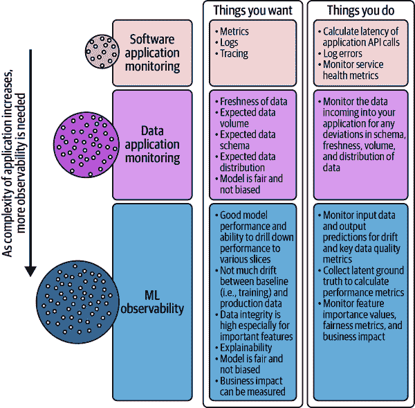
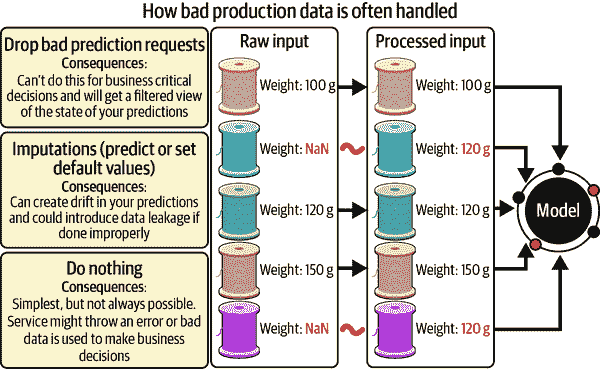

# 第九章：监控和可观察性的模型

作者：Niall Murphy 和 Aparna Dhinakaran

**贡献者/审阅者：** Ely Spears，Lina Weichbrodt，Tammy Le

**图表：** Joel Bowman

管理生产系统介于艺术和科学之间。在这种混合学科中加入机器学习的复杂性，它看起来更像一门艺术而不是科学。今天我们所做的很大程度上是前沿，而不是一个定义明确的领域。尽管如此，本章概述了我们对如何监控、观察和警报机器学习生产系统的了解，并建议在您自己的组织中发展这一实践。

# 什么是生产监控以及为什么要进行监控？

本章讨论如何监控正在进行机器学习的系统，而不是使用机器学习来监控系统。后者有时被称为*AIOps*；我们专注于前者。

说了这么多，让我们通俗地讨论一下生产监控，不涉及机器学习的复杂性，以便更容易理解——开始的地方又何处比定义更好呢？*监控*，在最基本的层面上，提供有关您的系统性能的数据；这些数据可以以某种合理的方式存储、访问和显示。*可观察性* 是软件的一个属性，意味着当正确编写时，发出的监控数据——通常通过标签或标记方式扩展或扩展——可以用于正确推断系统的行为。¹

为什么你会在意？事实证明有很多原因。最紧迫的是，监控可以帮助你确定你的系统是否真正正常工作。如果你自愿购买并阅读这本书，你可能已经理解这一点的重要性。甚至连 DevOps 运动的联合创始人安德鲁·克雷·沙弗（Andrew Clay Shafer）都曾经 [写道](https://sre.google/workbook/foreword-II)，“如果系统崩溃了，软件就没有价值。” 如果你不认为这很重要，或者你理解了这些论点但不相信，我们建议你阅读詹姆斯·特恩布尔（James Turnbull）的《*监控的艺术*》（2016 年）。不过，在本章的其余部分，我们假设你理解你需要监控（和对系统状态进行警报），讨论的是如何最好地实现这一点。

当然，情况比这复杂得多。首先，系统通常不会像布尔值那样表现，完全是开或者完全是关；通常情况下，它们可能在从极好到非常糟糕的全谱上表现。显然，监控需要能够处理这种情况并正确地反映现实。

监控本身非常重要，但监控的一个分支绝对至关重要：警报。一个有用的简化是，当出现问题时，会向人类发出警报以修复它们，而在本段中，*警报*因此既定义了“事情出了问题”的条件，又能可靠地通知相关人员有些不对劲 —— 例如，呼叫。这是帮助“保护用户体验”的关键技术。

较少紧急但仍然至关重要的是长期趋势分析、容量规划以及对服务范围的整体理解的监控。您使用这类监控数据来回答诸如以下问题：我的服务是否具有成本效益？它是否有任何不明显的性能断层？是否存在数据分布漂移？例如，服务延迟如何与用户在周末与工作日的行为有关？所有这些问题等等在没有监控和可观察性的情况下很难得到很好的回答。

## 它看起来是什么样子？

如我们所提到的，要进行监控，您必须拥有一个*监控系统*以及要监控的系统（这里称为*目标系统*）。如今，目标系统会发出*指标* —— 一系列通常是数字的数据，带有标识名称 —— 然后由监控系统收集并以各种方式转换，通常通过*聚合*（在多个实例或机器间生成总和或速率）或*装饰*（例如，将事件详细信息添加到相同的数据上）。这些聚合指标用于系统分析、调试以及前面提到的警报*。*

一个具体的例子是具有总请求数量度量的 Web 服务器；这种指标有一个名称 —— 比如，在这种情况下是 `server.requests_total`。（当然，它可以是任何请求/响应架构，比如一个 ML 模型！）监控系统通常通过*推送*或*拉取*获得这些指标，这取决于是否从目标系统拉取指标或者目标系统推送指标。然后这些指标被汇总、存储，并可能以某种方式处理，通常作为*时间序列*。不同的监控系统会对如何接收、存储、处理等做出不同选择，但数据通常是*可查询*的，而且（非常频繁地）通常有一种图形方式来绘制监控数据，以便利用我们的视觉比较硬件（眼睛、视网膜、视神经等等）来理解实际发生的情况。

扩展来说，可观察系统使用这些基本理念，但更进一步：与其仅仅获取总请求数计数器不同，您会得到关于该指标的*标记*²数据，事实上大多数指标都是如此。具体来说，*标记数据*意味着您不仅仅获取计数器；您还可以获取该指标的子集或切片。因此，例如，您不仅仅有`server.requests_total`；您还有`server.requests_total{lang=en}`，这意味着“对于所有客户端请求以英语渲染页面的请求，总请求数是多少？”当然，并不只是`{lang=en}`，还有`{lang=fr}`、`{lang=pt}`、`{lang=es}`、`{lang=zh}`等等。一个完全可观察的系统允许在*极其*细粒度的边界上对这些数据进行切片和切块，以至于可以构建查询来查看过去 12 天以来，发生在罗马尼亚的查询，导致 HTTP 404 返回代码，在 1200 毫秒延迟之后.³

监控本质上有许多微妙之处，特别是在聚合方式和结果使用方面，但这是一个合理的高层次描述，至少是在非 ML 系统监控方面。当您将 ML 系统作为*目标系统*添加到这个图景中时，不仅仅是前面提到的所有问题，还有 ML 的特殊关注点；图 9-1 可能会有所帮助。

###### 图 9-1\. 可观察性层和系统要求

## ML 对监控带来的关注

一个重要的关注点不一定是监控 ML 本身的任务，而是模型开发社区对监控行为的*感知*。我们是什么意思呢？

嗯，我们相信模型开发社区非常清楚软件有输入和输出，并且应该进行观察以弄清楚发生了什么。（模型开发的整个过程可以被视为指标提取、控制和优化的过程，首先！）然而，有时候缺少的是对模型开发完成并投入生产后发生的事情的认识和参与。我们看到关于 ML 监控的思维方式问题，部分源于术语的使用方式——从语义上讲，*监控*既可以指模型开发中的检查活动，也可以指对生产系统的持续观察。实际上，这个术语在两个情境中都被使用。

换句话说，许多模型开发者并没有意识到，在模型在生产环境中运行时，检查需求的确可以和应该和在开发中一样。这个差距尤其明显，如果您的背景是使用指标进行优化，而不是进行*检测*。检测事实上是一个非常关键的用例，而监控活动应该适用于整个模型生命周期。

这不仅仅是感知问题。事实上，机器学习在可解释性方面已经存在困难——特别是在生产执行的时候。部分原因是机器学习本身的特性，部分是现今模型开发方式的结果，部分是生产操作的本质，还有一部分反映在检查工具通常只专注于模型开发上。所有这些因素共同导致了监控机器学习变得更加困难。

## 持续进行机器学习可观测性——在生产中

从你的模型中获取的可观测性数据对业务至关重要——无论是战术操作还是战略洞察。我们已经提到，有关监控和可观测性缺失的负面后果，已经有很多文章写过，但也有积极的结果。

我们喜欢使用的一个例子是延迟与在线销售之间的关系。在 2008 年，亚马逊发现每增加 100 毫秒的延迟会导致销售下降 1%，反之亦然——因此，越快越好。⁴ Akamai Technologies、Google、Zalando 等也证实了类似的结果。我们断言，如果没有可观测性，就不可能发现这种影响，而且肯定无法确定是改善了还是恶化了情况！

最终，可观测性数据确实是业务结果数据。在机器学习时代，这不仅让你能够检测和响应故障，还能理解对你的业务发生的非常重要的事情。如果忽视这一点，你将会付出代价。

# 机器学习生产监控的问题

机器学习模型开发仍处于初级阶段。工具不够成熟，概念框架不完善，纪律性不足，因为每个人都在争先恐后地试图尽快建立某种模型——任何一种模型！——并解决实际问题。时间紧迫，出货压力巨大，这是实实在在的。

特别是模型开发，由于其困难性，因为它涉及调和各种矛盾关注点，所以随着紧迫感迫使开发人员和数据科学家专注于这些难题，并忽视更广泛的视角。更广泛的视角通常涉及监控和可观测性的问题。

这导致我们对模型开发和生产服务之间差异的两个重要观察。其中一个是关于所有生产环境的通用观察，恰好在机器学习领域尤为复杂和困难。另一个是关于当前广泛适用但未来可能不再如此的模型开发特定情况，尽管如此，作为后续内容的基础，这仍值得一提。

## 开发与服务的困难之处

第一个问题是，即使在专门用于此任务的独立环境中（如测试、预发布等），在开发中有效模拟生产也极其困难。这不仅是因为可能的服务架构种类繁多（模型池、共享库、边缘设备等，以及您可能或可能未运行的相关基础设施），还因为在开发中，出于速度原因，您经常直接调用预测方法或只需很少的代码量。而在生产中运行通常意味着您无法任意操作输入、日志级别、处理等，这导致在调试、复现问题配置等方面遇到巨大困难。最重要的是，测试中拥有的数据不一定像模型在生产中遇到的数据分布那样分布，而对于机器学习来说，数据分布确实非常重要。

第二个问题有些不同。在传统软件交付中，行业已经掌握了已知能够提高吞吐量、可靠性和开发*速度*的工作实践。其中最重要的可能是连续集成/连续部署（CI/CD）、单元测试、小改变以及尼科尔·福斯格伦等人在《加速》（IT Revolution Press, 2018）中最好描述的一些其他技术的集合。（见⁵）不幸的是，今天我们在模型开发中缺少这种类似于 CI/CD 的机制，还不能说我们已经达到了一套好的（与遥测相关或其他）模型训练和验证工具的标准。我们预计随着现有工具（如 MLflow 和 Kubeflow）的推广、供应商将更多这些关注点纳入其平台，以及整体或全生命周期监控思维的更广泛接受，这种情况将会有所改善。

## 必须改变心态

尽管今天我们面临许多技术挑战，但组织和文化上的挑战可能是对整体监控最具影响力的。特别是，模型开发人员通常不会考虑*部署后*问题的检测，而是考虑*部署前*的 KPI 性能建模——而 KPI 性能建模并不一定直接与业务 KPI 连接！（见⁶）

这显然对整个生命周期的监控构成了问题，因为预部署和后部署都变得重要，就像成功的软件一般，后部署通常比你想象的时间长。专注于快速开发和部署模型的团队通常对严格的交付框架感到不耐烦，好像这些交付框架会阻止他们以最方便的方式组织培训和服务。当然，它们确实在某种程度上做到了。但是它们通过提供一套在生产环境中难以实现并仅以特定的特定方式部署的监控和管理保证来实现这一点。

如果我们接受这个框架，我们应该做的最重要的事情是努力寻找一个合理灵活的解决方案，以在整个生命周期内维护模型行为的最广泛有用的视图，并使其适应你自己的情况。由于今天用于模型开发的特殊工具（如 TensorBoard、Weights & Biases 等）通常不会自然地转化为生产本身，当前使用的特定监控系统等等，我们必然需要自己制定一些内容。鉴于此，本章的总体目标是推荐一种全生命周期的监控方法，特别是建议一个默认的监控事项集，*除了*模型旨在改进的特定业务指标，因为它们已经得到了很好的理解。

# 机器学习模型监控的最佳实践

让我们从几个框架假设开始：在本章的目的下，模型开发通常是循环进行的。我们选择数据，对其进行训练，建立模型，进行基本的测试/验证，调整，重新训练，最终发布到生产环境，了解模型的行为，并开始下一个循环，以改进的想法。

在服务中的监控可以分为模型、数据和服务（也称为*基础设施*）。这种分离是有用的，因为我们不必在每个层次处理每个细节，尽管我们承认某些交叉存在。

*可解释性*——理解模型分类的原因，预测的原因等——是一个重要的主题，随着机器学习在更多行业中发挥更大作用，它可能变得越来越重要。详细解释可解释性以及最佳实践概述超出了本章的范围，也超出了本书的范围。一些伦理原则在第六章中有所涉及，大多数读者应该查阅该章节。

然而，仅从模型监控的更实际角度来看，可解释性在预生产阶段和越来越多的生产阶段是重要的。可解释性的具体情况因模型类型、阶段、业务策略等而异。但通常情况下，在生产中使用 ML 用于安全关键或社会重要方式，并且在理解导致结果的原因方面可能存在法律或道德兴趣。这里的主要目标是尽可能找到平滑模型开发和服务之间差异的方法。

## 通用的预服务模型建议

我们在第三章中有更多讨论，但从监控的角度来看，最重要的是牢记与模型开发相连的业务目标，并将其 KPI 连接到导出的指标以供监控目的使用。对于你没有业务洞察力但有大量基础设施洞察力的模型来说，它几乎无用，同样地，你了解在开发中工作良好但对于其在生产中行为没有洞察力的模型，可以说可能比无用还要有害。

最重要的建议是，您的业务关键绩效指标（KPI）应与模型指标相关联；您应能够从开发到生产阶段连续追踪这些指标。例如，如果您是一家打车应用公司，并且正在预测乘车的预计到达时间（ETA），那么接驳地点是您在整个期间内明确希望可用的内容。在监控数据完整性时，因此模型的最重要特征应优先考虑。

### 可解释性和监控

如前所述，可解释性是一个重要领域，但特别是在监控方面，它会带来一些问题。就像调试或一般的可观察性一样，完整的可解释性通常在生产环境中比在开发中需要更多资源（并且更慢、更昂贵等）。然而，你通常最急需的是在生产环境中的可解释性。

负责机器学习模型的人有几个原因需要可解释性：确定哪些特征应优先考虑数据完整性，调查特定预测或特定预测片段，并响应一般的可解释性业务要求。由于这是如此昂贵，并且商业人士可能没有理解所需背景的全部知识，有效的方法通常涉及与他们讨论他们真正关心的问题。通常情况下，您可以回应他们的关切（甚至可能构建特殊的监控解决方案），而无需深入具体的建模细节，这种对话有时可能会偏离主要问题。

然而，在某些情况下，可解释性对于故障排除至关重要。让我们以借贷案例为例：假设预测被拒绝，因为请求具有一个特征的唯一值，而这个值并不常见——在这种情况下，例如，一个申请日期是二月二十九日。申请日期通常不是我们所有预测中前十个最重要的特征之一，但是如果由于某种原因我们的训练数据集中只有很少的二月二十九日的申请，并且这些申请在中间几年里都是较差的风险，我们可以想象一个模型会使用申请日期来严重影响决策以拒绝。

在这种情况下，可解释性可以揭示驱动个体预测结果的因素。这可以通过定期记录预测摘要来实现，通过 LIME 和 SHAP（本质上是使用概念上类似的差分密码分析方法的替代或重复模型）⁷或另一种更定制化的方法来暴露内部机制。通常，这些解释不仅被模型开发人员使用，还被风险和合规团队使用，并且可以帮助非技术用户理解模型的系统问题。不幸的是，这在生产中大多数情况下都是太昂贵的。

## 训练与重新训练

从经典的监控角度来看，训练阶段通常是最容易处理的。在监控训练时，最重要的事情是保持全局视角，最重要的指标是从开始训练到生成（希望工作的）模型所需的时间。

尽管模型回滚是解决生产问题最常见的策略，但有时会使用重新训练——在这种情况下，您可以将其视为模型的前进：即用最新版本的一切替换生产中的内容，希望或期望这样做可能会为我们解决问题。

通常在回滚未奏效或无法奏效时（参见“验证中的回退”），或者如果对您的基础设施来说，前进比回退更容易时，会使用重新训练。⁸ 同样，在两种情况下，重新训练都有缺点。首先，在重新训练时，会在与训练旧模型使用的完全相同的数据上执行（在这种情况下，您会广泛期待相同的行为，因为这是相同的输入）。其次，重新训练需要花费很长时间，无法用来战术性地解决故障。 （这是您可能希望自动定期运行重新训练的一个原因，如果对您来说，这样做是可行的话。）

对于第一个问题，你有时可以通过一点“技巧”来稍微“操作”情况——无论是通过使用全新的语料库，替换一些不良数据，添加丢失的数据等。（当然，这里训练过程中的重要变量包括改变我们训练的数据范围，以及是否改变任何权重，但希望决定这些事项相对较快。)⁹

在监控环境中，训练非常重要，不仅因为重新训练，还因为这是大多数开发者建立其*基准线*的地方，之后广泛用于比较点。（10）

### 具体建议

接下来，我们概述了一些监控基础覆盖的事项列表。我们认为最低限度和强制性的事项，我们用斜体突出显示；如果你必须从某个地方开始，就从那里开始。当然，你可以花费*很多*精力来监控，也许在某些情况下是值得的，但在某些情况下则不是。因此，我们建议在实施以下所有检查之前，仔细考虑成本/效益权衡。（如果你想找到更高级的决定重要性的指南，我们建议你查看为你的训练流水线和模型编写 SLOs——详见“ML 监控中的 SLOs”了解更多详情。）

+   输入数据

    +   *与预期大小相比，输入数据集有多大？* 将训练数据集与上次训练此模型的情况进行比较，或者使用另一个外生度量来指示粗略大小。如果数据集意外地缩小了 50%，那通常是个不好的迹象。

    +   *你正在比较原始输入数据和特征数据吗？*（一些问题只有在将字段组合成特征时才会出现。）

    +   *最年轻和最老的输入数据分别是什么？它们符合预期吗？* 如果额外加分，开始查看年龄分布直方图。在分布式训练情况下，有时可能会有少量非常老的数据，而其他所有数据都已经被处理得干净有效。

    +   *在这种情况下，基数是多少*（总元素或示例的数量），以及*数据是如何分布的？* 这个分布与预期分布非常不同吗——无论是与我们上次训练这些数据的情况相比，还是与其他生成的预期分布相比？

    +   在批处理场景中，*你能枚举数据并确保它已经完成了吗？*（你能保证所有来自特定日期——比如昨天——的事件都已经到达并包含所有相关字段吗？你有来自前一天或今天的任何异常值吗？）

    +   在流处理场景中，*传入数据的到达速率是多少？* 你是在每个“包裹”到达时处理，还是在收集到固定大小后处理（在这种情况下，你应该跟踪处理被调用的频率）？

    +   如果数据访问是经过中介的，*访问率是多少？是否存在大量失败*（特别是与身份验证相关的失败）？

    +   如果数据是从其他地方复制到，比如特征存储中，并且模型是从特征存储中构建的，*那么复制是否正确进行？*

+   处理

    +   *有多少处理作业正在运行？它们上次运行是什么时候？它们是否按时完成？重新启动率和成功作业完成率是多少？有未处理单元的积压吗？未处理单元的年龄分布如何？*

    +   *处理速率是多少*（比如每秒处理的输入数据元素数量？） *处理速率的 50th、90th 和 99th 百分位是多少？*（特别关注长时间运行的分片—即，如果您将工作分布到多个处理作业中，通常会看到其中一个运行时间较长—参见前面关于输入分布的评论。）与前一次迭代相比如何？或者为了更准确的比较，您如何确保正确考虑季节性效应以定义前一次迭代？¹¹

    +   *为了生成模型，CPU、内存和 I/O 这三个维度的资源总共消耗了多少？* （这可能很难确定，但对于找出瓶颈非常关键—特别是如果您增加了任何资源，您是否知道系统会变得更快？）

+   全面视角

    +   *整个运行过程—从整理输入数据到生成模型—需要多长时间，无论是绝对时长还是比较时长？*

    +   输出模型的*大小是多少*？如果有多个文件，是否每个应该存在的文件都存在？

    +   *模型是否能够成功加载并进行简单预测？*

    +   对于在单独环境中进行测试的人来说，*模型是否通过了测试流程？*

    +   *将模型投入生产并处理查询所需的时间是多少？*

    +   对于在生产环境进行测试的人来说，*模型是否经过用户曝光？* 新模型是否以意外方式影响了您在生产中跟踪的业务或使用指标？

    +   *您是否了解将模型投入生产中的最大贡献是什么？* 是手动操作还是自动操作？（您可能需要添加装饰或注释信息来实现此目标：例如，标记特定时期为网络负载较重的时间。）

最后，我们注意到，其中一些建议可能也可以有用地应用于您培训管道的子组件。例如，往往在将其复制到其他地方进行更完整处理之前，各种数据着陆区可能已经应用了一些非常简单的检查（例如，考虑到经常使用的相对不灵活的电子资金转移或 EFT 过程的纱线供应商交付清单）。了解如果这些减少了 50%的大小是否有用。类似的论点可能适用于特征存储假设之前的特征预处理链等等。我们无法提前描述每种可能的架构，但我们可以说，业务风险分析可以帮助您了解在哪里最好地配置您稀缺的资源。

## 模型验证（投入使用之前）

模型通常被设计来实现某种业务影响，也称为*改善指标*。因此，**业务验证**可以理解为试图了解模型的业务影响，¹² 例如，查看它如何影响利润和损失（有时也称为*盈亏曲线*），或者使用混淆矩阵，试图理解模型错误分类的情况，应该是"是"而模型分类成"否"，等等。当然，我们始终需要注意用户行为可能会有噪声，但主要目标是找出模型是否从基准改善了某个指标。

次要目标是尝试确定新模型是否比我们已有的更好。为此，我们不仅需要针对历史数据进行测试（我们可能已经在做了），还需要将两个模型彼此比较。¹³ 我们可以选择至少两种好方法之一：

+   在预生产环境中进行测试（有时称为*沙箱*），并根据您的能力并行或串行运行模型，以比较其行为。

+   在生产中进行测试，使模型获取一小部分实际用户流量（通常在 1%到 5%之间），有时称为*金丝雀测试*。

第二种方法还有一个好处，即在全面推出之前暴露模型对用户流量的反应问题。但是，这确实需要您有某种方式来工程化流量，以便特定版本只获取子集流量——并非所有基础设施都支持此功能。但如果您有此功能，它对允许从旧模型到新模型的安全过渡非常有益，并且与 A/B 测试完美重叠。（通用模型更新也可以很好地适应这种框架，并且事实上，当代软件部署广泛使用此方法。）

混合方法是将一些数据发送到本地模型，同时将相同数据发送到在生产环境中运行的模型（尽管采用这种方法，本地模型不能完全处理生产流量；它只是处理你的测试流量）。这有助于暴露建模和服务之间的特征代码差异、配置差异等。最后，有些人将生产流量发送到模型，但不将结果提供给最终用户，这样可以测试服务路径的许多组件，而不会给用户带来风险。这被称为*影子模式*，在正确性和风险之间提供了另一个平衡点。

### 验证中的备用方案

由于各种原因，强烈建议制定一个*备用计划*，即一套步骤，用于在新模型失败、发布失败，甚至老模型在特定情况下出现奇怪行为时采取。这里有两种主要方法（如《“紧急响应必须实时完成”》中所见）：

使用旧版本的模型（回滚）

这意味着保持这些实际二进制文件的正确版本化是个好主意，并且监控生产中的实际版本，因为在生产停机时为了从旧数据构建模型而加重训练基础设施的负担通常是不明智的做法的反面。

退回到更简单的算法或甚至硬编码的方法

例如，在试图为产品购买提供排名推荐时，不要显示错误的推荐，只需展示站点上最受欢迎的前 10 款产品—虽然对任何人来说都不完全正确，但大多数情况下也不会完全错误！

在回滚时要非常小心，因为许多微妙的问题等待在长草中，随时准备袭击：*模式更改*、*格式更改*或*语义更改*——在这些情况下，关键数据库、数据源或特征存储格式在版本发布之间的更改都是容易被忽视的例子。有时这会使得回滚变得事实上不可能或不切实际，除非整个依赖套件被重新构建，但也可能使得向前转到新版本变得困难，除非完全理解实际的错误。在这些情况下，算法备用可以拯救生命。然而，算法备用本身也可能因为分类错误而失败。

这里的一个细微之处是，即使架构保持不变，应用于模型的特征转换也可能与另一个版本中应用的不同。例如，在一个模型版本中，如何处理顺风车应用的上车位置的缺失值可能是简单地默认为乘客上次出现的位置，而在另一个版本中可能是最接近先前保存的上车位置（例如家、办公室等）。这些特征转换方式的差异可能在不同版本之间存在差异，并且还会使回滚变得复杂。更糟糕的是，如果您在系统的一侧回滚到一个特征转换，而在另一侧保留新的特征转换，则情况将变得更加复杂。

### 行动号召

当前在基础设施即代码（IaC）社区中使用的 CI/CD 工作流程，用于模型开发尚未普遍存在。¹⁴ 不同的公司甚至同一公司内的不同团队可能会以不同方式解决问题。这并不意味着你不能进行检查，或者不能自动执行检查——自行开发的方法当然有其用处——但如今的现实是需要手动、基于同行的代码和数据审查，并需要统计学博士的详细验证。

就其价值而言，目前的情况对机器学习开发构成了严重的摩擦。行业迫切需要努力使尽可能多的工作自动化，而这项工作太重要，不能单单依靠平台完成。因此，我们呼吁行业朝着在机器学习开发中广泛使用 IaC 方法的状态迈进，就像 CI/CD 和 IaC 在产品开发中今天所受欢迎一样。即使我们无法达到这一目标，也将手动验证后的所有训练成果安全自动地推向生产将显著改善目前整个行业的平均水平。

### 具体建议

用于评估机器学习模型性能的常用数值 KPI，这些内容在第五章中也有详细讨论和更深入的理论基础，并特别关注服务用例在第八章中的应用。我们在这里总结这些 KPI，以保持连贯性和易于访问性：

准确性

模型预测正确的比例。

精度

真正例与总正例的比例。

召回率

预测为正例的比例与总正例的比例。¹⁵

精度和召回（PR）曲线

在不同决策阈值下精度和召回之间的权衡空间。

对数损失

更多详细信息，请参阅第五章。

ROC 曲线和 AUC

模型质量的无阈值独立度量。

还有许多其他可能使用的数学度量标准，其中一些您可能从早期的统计课程中认识到（例如，*p*-值和系数效应大小），还有一些涉及的稍微复杂一些（例如，后验模拟）。总的来说，如果您能理解前面列表中关于您的模型的内容，并了解您的输出分布*形状*，您对正在发生的事情就有很好的把握了。

## 服务

在生产环境中为 ML 模型提供服务时监控它们，具有在生产中观察事物的所有困难，再加上解释 ML 特有的事物发生原因的众多挑战。尽管如此，我们可以从一组简单的问题开始：

+   哪些指标适合衡量我的模型在服务中的表现？（在某种意义上，您希望更相关的指标；任意的指标往往会不断增长，直到信号/噪音被削弱。）

+   我的模型是否如预期般执行？如果表现不佳，原因是什么，我该如何解决？

为了选择衡量模型性能的好指标，我们需要正确理解模型可能出现故障的方式。为使模型成功运行，需要三个组成部分：

模型

进行预测的模型。

数据

流入和流出模型的数据。这包括模型用于进行预测的特征及其预测结果本身。

服务

实际渲染模型的服务**。** 这通常涉及模型的部署和推理服务——从广义上讲，这是基础设施。

这三个组成部分中的每一个都需要按预期工作，以使模型成功。任何一个组成部分的失败都可能对模型旨在改善的整体业务关键绩效指标产生影响。因此，我们需要测量*所有*这些以获得完整的图片。在接下来的章节中，我们将更详细地研究它们。

### 模型

从模型本身开始，我们再次注意到，在服务中测量模型性能比在服务之前测量性能要困难得多。鉴于这些困难，我们更倾向于在服务中使用与训练/验证中相同的指标来评估模型，因为这将使我们更有信心，我们实际上在某种意义上“测量到了相同的东西”。当然，这样做需要能够将预测结果与相应的实际观察结果进行匹配。

例如，假设一家乘车打车公司有一个模型预测车辆到达客户的预计时间（ETA）。在验证阶段评估此模型时，你非常关心将误差（通常称为*均方根误差*或*RMSE*¹⁶) 最小化，以便模型的预测接近实际的 ETA：在这种情境下，事实证明如果你承诺过高而实际交付不足，顾客往往会更加不满意。因此，在生产环境中计算相同的度量标准，必须有一些过程可以协调预测的 ETA 与实际的 ETA（即计算误差）。

在实践中，有几种场景描述了真实结果（称为*实际数据*）到达的延迟及我们如何应对这些情况。¹⁷

#### 案例 1：实时的实际数据

理想的机器学习部署场景——通常也是课堂上唯一教授的场景——是当你将模型部署到生产环境后，能够立即获取行动建议和性能信息。

许多行业非常幸运地拥有这种理想的场景。可能最著名的是数字广告：一个模型试图预测哪个广告消费者最有可能与之互动。几乎在预测完成后立即确定了真实结果——他们是否点击了广告。类似的例子是食品送货；一旦披萨送到饥饿的客户家门口，你就有了可以将模型预测与之比较的实际测量数据，而食品送货作为一个业务，有着严格的时间限制（以及其他成分）——如果时间过长，顾客通常就不再需要了。¹⁸ 最终，强有力的检测 KPI 是你想要的，如果你能够获取的话。

快速反馈环路的关键之处在于能够几乎*即时*（或至少非常快速地）测量模型的效果；当然，一旦你将这个潜在的真实数据与预测事件联系起来，无论获取这些数据花费多长时间，模型的性能指标都可以轻松计算和跟踪。¹⁹ 定期跟踪这些指标可以确保模型的表现没有从训练时或最初投入生产时显著降级。

然而，许多现实环境都会改变你获取真实数据的方式，以及你用来监控模型的工具。

#### 案例 2：延迟的实际数据

在这种情况下，你无法享受之前提到的快速实时反馈的好处。事实上，这些类型的情况在业务中可能比案例 1 更常见，而且处理起来肯定更加尴尬。想象一下，你试图预测物理基础设施失败的可能性——比如桥梁倒塌——或者使用机器学习来进行房地产市场预测。这两种情况都可能需要几年甚至几十年的时间来测量。这使得确保一个旨在帮助你做出高质量决策的模型行为符合预期变得非常棘手。

这种延迟接收真实情况，而且可能是*无界*的。例如，一家金融科技公司试图分类哪些信用卡交易是欺诈行为。你可能要等到客户的卡片丢失报告或者交易争议之后才能知道一笔交易是否真的是欺诈。这可能发生在交易清算后的几天、几周或几个月内——或者在交易未被客户察觉的情况下，甚至*永远*不会发生。

最终，如果你能获得足够多的“半实时”数据，数据能够足够可靠等等，你仍然可以使第一种方法奏效，但如果你不能使该方法奏效，团队可能需要转向代理指标。*代理指标*是与你试图逼近的真实情况相关的替代信号，但特别选择它们的原因是它们到达得更快。

对于桥梁故障的情况，我们可能会查看桥梁检查的结果、维护计划、桥梁是否处于易受洪水影响的地区以及桥梁的年龄。对于房地产购买价格预测，一个常见的技术是查看类似房屋的价格，但尽量不改变太多组成部分：例如相同数量的卧室和浴室但在不同地区，或者不同数量的卧室但在同一地区等等。对于几个月或几年的建筑工期来说，即使是这样一个混乱的复合代理指标，也比没有要好。

最终，代理指标在面对延迟的真实情况时成为一个强大的工具，因为如果你无法在实时获取到一个强相关的度量，至少可以获取一个相关性较弱的度量；通常这已经足够了。不过，不要忘记你的代理指标需要具有统计显著性的数学要求，而且代理指标可能随时间而改变其相关性，因此需要持续重新评估。

#### 情况 3：偏倚的实际数据

一个重要的注意事项是，并非所有的真实数据都是平等的。例如，如果我们是一家金融科技公司，在贷款情境下审视信用度，预测的核心问题是拒绝贷款意味着你将不再有关于申请人是否能够偿还贷款的任何信息。换句话说，只有你决定发放贷款给的人才会产生可以用来训练未来模型的结果，这种选择偏差可能导致其他类型的偏差潜入。因此，我们将永远不会知道模型预测的某人是否会违约，其实际是否能够完全偿还贷款。正如在第六章中更详细地描述的那样，因此至关重要的是评估我们的数据，以发现潜在的偏见、盲点和代表性不足的领域。

#### 情况 4：没有/少量实际数据

在一些机器学习应用中，及时获取实际数据（响应）是不可能的。这可能由于各种原因，包括以下几点：

+   需要手动干预来验证模型的预测结果。

+   没有办法将响应归因于预测。

+   获取实际数据的时间窗口延迟如此之长，以至于无法有意义地通知建模者应该检查模型的性能。

例如，许多图像分类应用程序需要人为干预，以手动验证图像是否被正确分类。这可能需要抽样，以便仅对预测的有价值部分进行手动验证，以改进模型的未来训练数据集。

那么如果团队没有获取到实际数据，该怎么办呢？在这些情况下，ML 团队再次使用代理指标来提供模型性能的信号并不罕见。在这些极端情况下，较弱的相关性可能比没有更好。在测试新版本模型在生产中的同时，对模型进行 A/B 测试并比较其对产品指标的影响也很常见。监控模型的数据变得更加重要，以了解模型是否偏离了预期。

#### 其他方法

除了模型可能如何处理与实际数据的关系之外，还可以使用模型行为的通用测量来判断事情是否真的出了问题。我们的首要选择是“无用”响应的比例，即空白、不完整或次优的回复，而另一个关键指标是我们的老朋友，数据分布。

#### 故障排除模型性能指标

假设模型性能指标可以计算。不可避免地，你的模型在某些时候会达不到性能期望。要回答的难题是*为什么*。最常见的原因通常是训练数据的欠采样、漂移以及影响模型用于预测的数据质量的数据完整性问题。一个最佳实践是超越平均值，调查各种*预测片段*，即预测的特定子段，例如加利福尼亚州的所有人。

想象一下，你的模型正在预测欺诈的可能性。你预期误报负例（你的模型未能捕捉到真实的欺诈交易）的体积少于 0.01%。假设你突然看到误报负例跳到了 2%。继续的自然方法是查看这种行为是否局限在特定的地区或商家。通过这样做，你可以找出错过的分类发生在哪里，以及重新训练模型时需要增加哪些数据片段的样本量。当然，了解模型最差表现的片段可以为模型构建者提供反馈，以改善模型性能。

### 数据

ML 监控的关键组成部分是监控模型的输入和输出。随着特征的添加或删除，监控必须适应模型的架构。我们有两种常见的监控数据的方法——漂移检测和数据质量检查。漂移更适合捕捉数据分布的缓慢变化，而数据质量检查更适合捕捉数据的突然大变化。

#### 漂移

漂移测量随时间的分布变化。模型在每种可能的输入上表现并不一样：它们高度依赖于它们训练时的数据，在看到类似的数据时表现良好，在看不到时表现较差。特别是在数据不断演变的高速增长业务中，考虑到漂移对确保模型保持相关性非常重要。因此，通过直方图风格的方法测量数据在各个维度上的分布对于理解生产过程中发生的情况至关重要。一些模型对输入分布的轻微变化具有韧性，但不存在无限的韧性；在某些时刻，数据分布将远离模型在训练中看到的情况，这将影响任务的性能。这种漂移被称为*特征漂移*或*数据漂移*。相反，当模型输出偏离已建立的基线时，这被称为*模型漂移*或*预测漂移*。

如果只有输入到您的模型的事物可以改变，那将是很好的，但不幸的是，情况并非如此。假设您的模型是确定性的，并且特征管道中没有任何变化，如果它看到相同的输入，它应该给出相同的结果。

尽管这让人感到欣慰，但如果正确答案即实际数据的分布发生变化会怎样呢？即使您的模型今天做出的预测与昨天相同，也可能出错！实际数据的这种漂移会导致模型性能的退化，通常称为*概念漂移*。

#### 测量漂移

了解两个分布之间的差异很重要，但这是一个复杂的话题，我们在此不能详细展开。所以如果这些材料对您来说很陌生，不要担心。要么就直接使用它，要么去查找并学习更多。（无论如何，如果您与数据分布有任何交集，不管是主动监控还是被动使用，您都可能会遇到这些术语。）

正如我们之前讨论的，我们通过比较输入、输出和实际数据的分布来测量漂移。这两个分布通常是生产数据和基准分布。常用的基准分布包括训练数据集、测试数据集或生产中的先前时间窗口。但是如何量化这些分布之间的距离呢？

有几种流行的方法。*人口稳定性指数* (*PSI*) 在银行和金融科技领域广泛使用，依赖于为一个度量指标进行数据桶化，计算每个分布中驻留在桶中的百分比，并比较分割百分比的对数。这可以检测到桶内或桶间的变化。*Kullback-Leibler 散度* (*KL 散度*) 类似于 PSI，但是是非对称的，因此可以检测到分布顺序的变化。*Wasserstein 距离*（也称为*地球移动者距离*）计算将一个分布移动到另一个分布所需的工作量，这对于识别桶之间的移动量非常有用——即使从一个桶溢出到下一个，Wasserstein 分数会比从一个分布端到另一个远端进行更激烈跳跃时低。

尽管这些分布距离测量方法在计算距离的方式上有所不同，它们都在做同样的事情：提供一种量化两个分布有多不同的方式。特别是在实际数据不可用时，漂移被用于实际世界中识别模型预测、特征和实际数据的变化。

#### 漂移故障排除

在许多机器学习用例中，当无法直接计算性能指标时，漂移通常成为监控模型预测变化的主要方法。当检查为何预测开始漂移时，我们通常从观察哪些输入也漂移了开始，并且可以将特征漂移和特征重要性结合在一起，以确定哪些特征可能与变化更强相关。反过来，这有助于我们确定哪些特征可能需要从基线重新采样，或者可能需要数据质量修复。

### 数据质量

虽然漂移侧重于*缓慢*故障，但模型数据质量监控侧重于*严重*故障。模型依赖于输入特征的输入来进行预测，而这些输入特征可以来自各种数据源。不同类型的数据可以监控数据质量问题——分类字段、数值字段，以及诸如嵌入等非结构化数据类型。在这里，我们将深入研究监控结构化分类和数值数据的常见策略。

#### 分类数据

*分类数据*是从一个有限但更大的值集合中选择单个值的流。想想类别，比如某人拥有的宠物类型：狗、猫、鸟等等。你可能认为这里不会出什么问题，但类别分布突然变化总是可能的，可能是因为用户行为（例如，今年流行的圣诞宠物是驯鹿）或其他故障。举个例子，假设你的假设模型预测你的宠物用品店应该购买哪种宠物食品，现在的数据表明人们只拥有猫。这可能会导致你的模型只购买猫食品，而所有拥有狗的潜在客户将不得不去街对面的宠物用品店。

除了你的分类数据中突然发生的基数转移之外——即每个类别中实际计数的变化——你的数据流还可能开始返回不符合该类别的值。这很简单地是你的数据流中的一个 bug，违反了你与数据和模型之间建立的合同（语义期望）。这可能出现多种原因：你的数据源不可靠，你的数据处理代码出错，上游模式变更等等。在这一点上，你模型的输出变得未定义行为，你需要确保在分类数据流中保护自己免受类型不匹配等问题的影响。

例如可能包括以下情况：

+   你期望的功能是字符串，突然收到了浮点数。

+   对于一个特征（即状态输入），你是大小写敏感的，但期望的是小写值，现在却收到了大写值（例如，*ca* 和 *CA*）。

+   你正在从第三方供应商那里接收数据，他们的模式顺序存在一个偏移错误。现在，你看到每个特征接收到另一个特征的值。

一个不幸常见且难以处理的情况是缺失数据。这可能由于与基础设施、应用程序、存储和网络故障或简单的错误相关的任何原因引起。真正的问题是如何处理它。在训练环境中，有时只需丢弃这一行就可以使事情继续进行，而不会太糟糕；在生产环境中，你可以抛出一个错误（但不是致命错误；否则，这将把一个间歇性故障的存储服务转变为整个舰队的灾难，这是不推荐的）。虽然这些技术帮助你弥补了这个问题，但实际上并不是一个可持续的解决方案：如果你有数百、数千或数万个用于计算模型特征向量的数据流，其中一个数据流缺失的可能性就会非常高！

###### 注意

尽管这更多与鲁棒性而非监控有关，但可以通过多种方式来补偿类别数据中的缺失值，这个过程通常称为*插补*。你可以选择在你的数据中历史上看到的最常见类别，²⁰或者可以使用存在的值来预测这个缺失的值可能是什么。你解决这个问题的复杂度完全取决于你的应用场景，但重要的是要知道没有一种解决方案是完美的。

#### 数值数据

数字数据流也相当不言自明。*数值数据*通常由浮点数（有时是整数）表示，例如银行账户中的金额，或者华氏或摄氏温度。

在我们分析数值流可能出现的问题时，有时你会看到一个*异常值*，即远远超出历史值范围的值。异常值对你的模型可能是潜在危险的，因为它们可能会导致你的模型在预测中出现严重错误。

*类型不匹配*也会影响数字数据。可能出现你期望得到温度读数的特定数据流，而实际上得到的是类别数据点，你需要适当处理。可能的默认行为是将这个类别值转换为一个数字，虽然此时是有效的，但它完全丧失了语义意义，成为数据中极难追踪的错误。另一种可能性是类型不变但语义发生变化：也许你正在追踪一个总计计数器（具有某些任意大或小的包装），突然它被更改为一个增量。当然，根据数据的不同，这可能在相当长的时间内不被察觉！

最后，就像分类数据一样，数值数据也会遇到同样的缺失数据问题，但数值序列隐含的排序和跨度使我们在缺失值插补方面有更多选择。例如，我们可以取平均值、中位数或其他聚合分布度量来填补缺失的数值，比如纱线重量（以克为单位）；参见图 9-2。

###### 图 9-2\. 处理不良生产数据的方法

#### 测量数据质量

当今 ML 从业者对于许多模型依赖于非常大量的特征来执行其任务并不感到意外。随着训练集大小爆炸性增长至数亿甚至数十亿，特征向量长度为数十万至数百万的模型并不罕见。

这带来了今天从业者面临的一个主要挑战。为了支持这些极其庞大的特征向量，团队不断地向特征生成中注入更多更大的数据流。现实情况是，这种数据模式将不可避免地经常发生变化，因为团队在试验以改进模型。常见的做法包括添加特征、删除特征或更改特征的计算/处理方式，而诸如特征存储等平台正在广泛用于处理这种管理开销。具体而言，在所有特征上执行以下最重要的检查：

+   分类数据

    +   基数：唯一值的数量是否已更改？

    +   缺失值：此特征是否存在缺失数据？

    +   类型不匹配：数据类型是否已更改？

    +   数据量：此特征的数据量是否已更改？

+   数值数据

    +   超出范围的违规：值是否超出了适当的范围？

    +   缺失值：此特征是否存在缺失数据？

    +   类型不匹配：数据类型是否已更改？

    +   移动平均值：特征值是否在增加/减少？

### 服务

要使 ML 系统成功，您需要理解 ML 系统中输入和输出的数据、模型本身的性能，以及渲染或服务模型的整体服务性能——使其预测或分类结果可用。即使模型的性能改善了业务结果并保持数据完整性，但对于单个预测需要几分钟，这可能还不足以在实时服务系统中部署。与部署到生产环境的其他软件服务类似，部署模型并服务模型推理的服务需要进行监控。

有多种选项可用于将模型投入生产：部署自己的 API/微服务、使用开源模型服务框架（如 TensorFlow Serving、PyTorch Serving、Kubeflow Serving 等）、或使用第三方服务。无论使用何种模型服务方式，特别是在实时服务中，监控服务的预测延迟非常重要，因为预期的预测应该在请求发送后立即发生。有两种方法可以做到这一点：

模型层级

缩短模型进行预测所需的时间。

服务层级

减少系统接收请求后服务预测所需的时间。这不仅涉及到模型本身，还包括收集输入特征（有时预先计算或缓存它们），以及快速捕捉预测结果以提供服务。

#### 优化模型性能

为了优化模型以降低预测延迟，最好的方法是减少模型的复杂性。减少复杂性的一些例子包括减少神经网络中的层级、减少决策树中的层级，或减少模型中的任何无关/未使用部分。架构也很重要：例如，双向编码器表示转换（BERT）比前馈方法慢，而基于树的模型比深度学习快。

在某些情况下，这可能直接影响模型的效力。例如，如果决策树中有更多层级，可以从数据中捕捉到更复杂的关系，从而提高模型的整体效果。然而，决策树中较少的层级可以减少预测延迟。在部署任何模型时，平衡模型的效力（准确度、精确度、AUC 等）与其所需的操作约束是非常重要的。这对于嵌入在移动设备或设备上的模型尤为重要。

#### 优化服务性能

为了优化服务性能，以下是您可以监控和改进的建议区域。

首先，让我们考虑*输入特征查找*。在模型能够进行预测之前，必须收集所有输入特征，这通常由 ML 系统的服务层完成。一些特征将由调用者传入，而其他特征可能会从数据存储中收集或实时计算。例如，一个预测客户对广告反应可能性的模型可能会获取该客户的历史购买信息。客户在浏览页面时不会提供这些信息，但模型服务会查询特征存储或实时数据库来获取这些信息。通常将输入特征收集分为两组：

静态特征

不太可能迅速改变且可以提前存储或计算的特征。例如，可以提前计算历史购买模式或顾客的偏好。

实时计算的特征

需要在动态时间窗口内计算的特征。例如，在预测食品配送的到达时间时，可能需要知道过去一小时内下了多少其他订单。

在实践中，我们通常有用户或应用程序提供的特征、静态特征和实时计算的特征的混合。监控这些特征的查找和转换对于追踪 ML 系统中的延迟来源至关重要。

接下来，让我们考虑*预先计算预测*。在某些用例中，通过预先计算预测、存储并使用低延迟读取数据存储服务提供预测，可以减少预测延迟。例如，流媒体服务可以预先存储他们服务的新用户的最受欢迎推荐。这种离线批量评分作业可以大大降低服务环境中的延迟，因为大部分工作在调用模型之前已经完成。

## 其他需要考虑的事项

即使考虑了前述所有因素，我们还远未穷尽对监控和可观察性可能存在的潜在关注点的清单。以下是一些你在监控旅程中可能想要记住的其他领域。

#### 机器学习监控中的 SLOs

SLOs 是一种流行且仍在增长的技术，用于明确地预先确定系统的适当可靠性水平——某种意义上决定用户体验将是什么，并决定是进行特性工作还是可靠性工作，这取决于我们在某一时刻处于哪一阈值的哪一侧。例如，如果我们已经决定客户应该有 99.9%的可用性，并且在某些时刻我们低于这个水平，这将触发修复损坏的系统，直到我们再次趋于 99.9%。这样，机器学习工程师、整体产品团队和 SRE 团队（如果有的话）协同合作，将用户体验的可靠性“弯曲”朝向优化的、预先决定的水平。

这是一个非常简单，实际上是简化的例子，事实上在多个关键领域中的现实要复杂得多。即使机器学习很复杂，你仍然可以通过 SLOs 获得一些价值。但是要注意以下微妙之处：

+   正如我们已经确定的，仅仅看模型就不能确定模型是否适合投入生产。因此，SLOs 有充分理由扩展范围以涵盖数据（以及数据分布，新鲜度等）。

+   对于请求-响应服务系统，例如*yarnit.ai*的前端 Web 服务器，可用性是一个相对清晰的问题——要么在一定可接受的延迟内提供正确的内容，要么不提供。当被提供的内容可能具有从 0.0 到 1.0 的分类器置信度时，以及任何单个结果或一组结果可能完全、正确地且有正当理由地低于任意质量阈值时，ML 系统的可用性意味着什么？至少，ML 的 SLO 因此必须包含质量或置信度阈值的概念。

+   或许有点令人惊讶的是，最佳方法并不是专注于 ML 系统的性能，而是专注于该 ML 系统所需交付的业务目标。换句话说，如果整体用户体验仍在定义的限制范围内，系统作为一个整体可以遭受各种各样——也许是暂时的——退化。关于这个话题的更多内容，请参见《实施服务水平目标》的第八章。

+   对于具有大量模型或大量模型变更的环境，一个有前途的方法是自助服务基础设施，使 ML 工程师可以定义和强制执行每个模型或模型类的 SLO（通常通过与黄金数据集的比较）；SRE 可以开发、提供和支持这样的服务，从而帮助所有人的整体 SLO 方法扩展。 （同样的方法也可以扩展到单个模型的单独用例，只要可以以确定性方式进行标记。）

+   最后，正如从第十一章（事件响应）中清楚地看出的那样，ML 在整个业务中是*交织*在一起的，指定 ML 系统的 SLO 而不同时还为所有或大多数相邻系统指定它们可能是不切实际的。此外，由于检视性或可解释性通常难以获得，足以捍卫足够严格的 SLO（例如，99.5%或更高）的快速反应不会成为仅凭人工驱动的过程可以实现的事情：这将成为自动系统与人类协同行动的问题。在非 ML 情况下，自动系统单独行动通常非常有用，但在 ML 情况下我们应该谨慎行事。

如果您希望更具体地为您的 ML 基础架构建立 SLOs，我们建议您从哪里开始。如果您查看表 9-1，您将看到我们针对您关心的内容提出的 SLO 建议。行涵盖您试图衡量的内容，列涵盖范围。因此，例如，如果您担心 ML 训练系统的整体系统健康，左上角的象限是您可以找到启动点的地方。本质上，该表格概述了基于行为、指标或示例指标制定 SLO 的想法。当然，这不是一个详尽无遗的列表。

表 9-1. 每个 ML 上下文要监控的行为或指标

|   | 训练 | 服务 | 应用（YarnIt） |
| --- | --- | --- | --- |

| 整体系统健康 | 模型构建时间（不包括快照）并发训练数量

失败的构建尝试次数

资源饱和度（例如，GPU 或 I/O 吞吐量）| 延迟（响应请求的时间）流量（请求数量）

错误计数（失败请求的数量）

饱和（任何特定资源的枯竭：CPU、RAM、I/O）| 主要与用户旅程或会话购买率相关

登录率

页面子组件失败率（例如，购物车显示）

购物车弃购率 |

| 通用 ML 信号/基础模型健康 | 预训练：源数据大小（即，自上次构建以来未大幅增长或缩小）

训练：

模型类型和输入数据大小的训练时间函数

训练配置（例如，超参数）

训练后：

模型质量指标（准确率、精确度、召回率、其他模型特定指标）| 模型服务延迟（作为总体服务延迟的一部分或随时间比较）模型服务吞吐量

模型服务错误率（超时/空值）

服务资源使用（特别是 RAM）

在服务中的模型年龄/版本 | 模型特定指标（在单个页面加载时可见）每页推荐数量

每个推荐的预测点击率估计质量

搜索模型的类似指标 |

| 领域特定信号 | 构建模型通过验证测试（不仅是聚合过滤器有效，而且在黄金集和保留集测试中的结果质量相等或更好）。商店中新产品的推荐与同等或更高质量的产品相似。 | 这些指标通常会延迟。离线信号与服务预测在总体和相关片段中匹配。特定查询的推荐数量与预服务预期匹配。 | 会话或用户旅程特定指标。拜访率不下降的百分比。

每次访问的平均销售额保持不变。

保持会话持续时间。 |

实际上，具体指定一个服务级别目标最好留给其他文献，但[Betsy Beyer 等编辑的《可靠性站点工作手册》](https://oreil.ly/1lbVy)（O’Reilly，2018 年）提供了一个完全具体化、详尽细致的[服务级别目标文档示例](https://sre.google/workbook/slo-document)；即使是像“99%的数据在两小时内更新”这样简单的描述，也能提供价值。

#### 跨服务的监控

随着机器学习基础设施的进一步扩展，你可能会发现自己需要做的两件重要事情是分布式追踪和理解系统的延迟分布。（尽管我们在本章节中已经多次讨论分布，但在本节中我们特指监控，而非机器学习。）

分布式追踪与可观测性密切相关，它使你能够追踪请求在分布式架构中不同服务之间的完整路径。可以将其视为给请求贴上“给我一份关于路径完整报告”的标签。处理请求的每个系统在其传播过程中应该增加一定程度的额外可见性。各种商业和免费系统都实现了这一点——你可以查看[OpenTelemetry](https://opentelemetry.io)来了解其工作原理。

另一个关键领域是理解分布——在这种情况下，不是机器学习数据的分布，而是延迟的分布。这并不一定直观，但在足够复杂的架构安排中，即使是一小部分运行缓慢的请求也可能显著影响客户体验。[²¹] 大多数组织没有存储或计算能力来追踪每个请求的这些情况，因此需要某种形式的*请求抽样*——即为某些请求跟踪详细统计信息，但默认情况下只是相对较小比例的请求。你可以根据环境的不同以各种方式实现这一点，但我们建议您尽早启用这些功能，因为对客户体验和生产行为的额外洞察通常至关重要。

最后，通常只适用于非常大型组织的一个问题是如何扩展到非常大型的监控设置。虽然我们无法在这里详细介绍这个问题，但有三个主要问题需要考虑。第一是（1）如何运行多个监控实体而不重复警报、数据等。通常这与（2）找到合理划分要监控的实体的方法相关（这通常意味着近似等分监控目标）。最后，（3）我们必须监控监控器，以确保它们自身在运行。不同的监控产品在这些功能的支持程度上有所不同——例如，Prometheus 可以监控自身并去重警报。我们的经验表明，去重可能是这里潜在最重要的能力——如果您的系统无法执行这一功能，那么下一次严重的停机事件时，您可能会收到*N* × <*您将收到的页面数*>，其中*N*是您拥有的监控实例数量。这可能是一个相当大的数字。

关于构建和运行复杂监控设置的进一步建议可以从多种来源获取，但特别好的一个来源是《*可观测工程*》（*Observability Engineering*）由 Charity Majors 等人提供（O'Reilly，2022 年）。

#### 监控中的公平性

在本章中，我们已经涵盖了监控服务健康、模型有效性和模型数据完整性的重要指标。然而，监控的话题还包括其他我们无法在本章中涵盖的考虑因素。例如，我们部署的模型几乎可以说具有现实世界的影响：决定谁获得贷款，谁获得工作，或者我们将做出什么购买决策。在这种决策越来越自动化的世界中，至关重要的是我们不要通过模型将系统性偏见和歧视编码化。公平性显然是一个关键话题，在第六章中有深入探讨。从监控的角度来看，我们的主要关注点是要求能够促进对模型决策的可见性，同时不促进不适当的可见性——更多细节请参见下一节。

#### 监控中的隐私

公平性的一个特殊案例是监控中的隐私问题。几乎默认情况下，生产监控仪表板会显示输入的信息。因此，您立即可以理解，如果您的监控堆栈暴露了个人身份信息（PII）或其他敏感信息，这些信息将直接显示在仪表板上，并且对所有能够访问该仪表板的人可见，即使他们在生产环境级别上无法访问。这显然违反了隐私期望，即使不违反某些关注隐私的法律框架（尽管我们不是律师）。

尽管每种情况都有细微差别，但一般而言，我们建议如果您无法容忍 PII 泄露的风险，*要么*加强仪表板访问权限（以及收集信息的每个中间点），*要么*控制 PII 在第一个聚合点外流时的处理方式——例如，姓名、地址等完全匿名化，并且系统已进行了彻底的隐私审查。一般而言，控制对仪表板的访问更为简单易行，但确实不是一个强有力的控制点。您几乎肯定希望（需要！）在监控系统的第一个外流点 PII-proof 数据，甚至以分阶段的方式进行，不同类型的数据可以在不同的进入点向不同的系统剥离或处理——一种多阶段过滤方法。再次见第六章，这里更详尽地讨论了这一重要问题。

#### 业务影响

我们未涉及的另一重要类别是将模型性能指标与模型对业务影响相关联。我们用统计指标如 AUC 或对数损失来衡量模型性能，但这些指标并未包括业务在指标恶化时所经历的具体影响。指标越具代表性，就越容易建立这种关联——请谨慎选择！²²

#### 密集数据类型（图像、视频、文本文档、音频等）

我们不会涉及的另一个重要类别是密集数据类型的监控，有时也称为*非结构化数据*——尽管实际上这些格式是高度结构化的，这有些误导！随着机器学习越来越多地使用图像、视频等作为模型的输入，有必要为这些非表格数据类型的数据完整性进行监控。目前普遍没有可用的方法，我们呼吁行业积极努力支持这一点。一个日益流行的方法是监控数据本身的*嵌入*输出。机器学习从业者使用嵌入将这些项目（如电影、图像）映射到低维向量，其中相似的项目靠得更近。监控这些低维向量提供了监控密集数据类型的代理。

## 高级监控策略推荐

“服务”给出了许多关于如何开始监控的详细建议，但我们想在这里概述您整体监控策略的几个高级建议：

实际情况还是？

如果您的模型能够以接近实时的方式返回实际数据，监控模型/KPI 的性能是最佳信号，因为这最接近您对模型正在执行的概念。如果没有合理的实际数据，您将不得不从一组部分来源（包括基础设施元素和模型性能）构建发生情况的图像。查看本列表末尾的“一般建议”项，了解如何做到这一点的提示。

模型性能指标

一般而言，最好公开我们在“模型”中讨论的模型性能统计数据。这在很大程度上取决于您的本地监控情况、机器学习平台使用情况等，因此我们无法详细告诉您如何做到这一点，但至少您应该追踪它们。查看模型性能如何在纯服务水平上运行也有一定的价值。将其视为简单的请求-响应服务；如果模型无法进行预测/推荐，如果模型产生的预测置信度显著降低，以及如果任何算法回退路径被调用频率超出预期，这些都是需要了解的好事情（因此您应该监控它们）。

数据关注点（漂移）

定期跟踪输入数据的分布非常重要，因此计算分布的各种度量（如 PSI、KL 散度、Wasserstein 距离等），并在监控系统中呈现它们也是至关重要的。（您的*输出*数据的分布—即预测本身与现实的对比—在先前已经涵盖。）

数据质量关注点

如前章节讨论过的那样，跟踪丢失数据、类型不匹配、数据语料库大小及相关属性是至关重要的。训练部分的一些建议在服务环境中也非常相关，当然不包括训练本身的持续时间，而是关于数据可用性的一切。

服务或基础设施性能

作为第一次近似，即您需要一个起点，您可以将其视为任何服务系统。从[*网站可靠性工程*](https://oreil.ly/Y1geI)中，有四个*黄金信号*可用于查看您服务系统的高级状态：延迟、流量、错误和饱和度。如果您为这些建立了良好的水平，例如通过[*实施服务级别目标*](https://oreil.ly/efwiE)的第八章，那么在基础设施中出现严重问题并且这些问题不反映在这些数据中将非常困难。在某种意义上，您正在寻找“良好吞吐量”：问题以合理的速率到达，并且以足够快且正确地方式回答以满足应用程序的需求。

警报和服务水平目标（SLO）

在本章中，我们没有特别多地谈到警报，因为一般来说，一旦您监视了某个度量标准并建立了某种阈值，警报（应该）是一个相当机械的成就。 但是，重要的是特别注意决定要警报哪些正确的度量标准——绝对不是每个度量标准——以及什么构成一个好的阈值。 否则，每个人都会被警报淹没，吸走宝贵的认知注意力，其中几乎所有的警报对客户体验基本上都是无关紧要的。 欲了解更多信息，请参阅[*实施服务级目标*第八章](https://oreil.ly/Ruf03)。

尽管请求/响应系统的许多概念基础适用于 ML 服务系统，但训练不同，主要是批处理或流式处理导向。 在监视训练时您经常会遇到的一个潜在问题是如何警报模型构建延迟。 这里的主要挑战在于，由于模型构建持续时间可能是大量的分钟、小时，甚至是天数，因此在训练性能每次波动时警报并不合理；否则，您将会警报太多。

因此变得重要的量是*赶上时间*。 如果您的模型大约需要（比如）20 小时来构建，并且您每 24 小时需要一个新模型，那么如果您在构建过程中进行了 8 小时，然后停顿了 4 小时会发生什么？ 消耗了 12 个墙钟小时，还有 12 个墙钟小时要走，如果您以前的速度恢复训练，您将在完成之前学习 12 个小时。 因此，您可能已经错过了截止日期，并且提前 12 小时进行预测将是一个重要的优化。 因此，保持追赶所需时间的概念，并在当前时间+追赶时间大于阈值时发出警报，将有助于迅速引起潜在的停滞情况的注意。

通用建议

一个重要的监控和/或调试技术是将预测（ID，值）记录到表格或某种易于搜索的格式中——如果您担心速度、头部阻塞等问题，那么采样也是一个完全可行的方法（尽管您将失去保证的可解释性）。 对于额外的分数，还可以有一个*实际*值的列，而不是预测值，这样您可以回填和比较。 在微服务和/或分布式跟踪的世界中，让预测的客户消费者也记录预测 ID 同样很有用，这样您就有了可连接事件链。 （有时在从开发到预测的过程中删除这种脚手架是可以接受的，但在两种情况下通常都很方便。）

服务期间的可解释性

在服务过程中的可解释性的黄金标准是所谓的*个体推理级解释*，换句话说，为什么会批准或拒绝这笔具体交易，或者分类器在这特定背景下做出那个具体决定的原因是什么？根据前述的“通用建议”段落，成功的表现实际上是能够将模型在特定预测请求时的具体状态与特定状态联系起来。在某些行业，如贷款领域，预测是否向个人发放贷款的模型可能使用可解释性来表明为何拒绝个人。通常通过原因代码向下游用户传达这一信息。

# 结论

希望本章为您监控机器学习系统从诞生到投产的过程提供了有用的概述。重申一下：主要挑战在于意识到你需要尽可能高的保真度来监控——无论是为了解释性、生产调试，还是简单地了解业务的运行情况。一旦你接受了这一点，你可以选择多种实施方法，并且本章各个“具体建议”节的整合对你应该是有用的。

¹ 你不能没有监控就实现可观察性，但可以反过来——可以进行粗略级别的检测，但没有任何深入检查的能力。然而，这并非行业发展的方向。

² 注意，这里使用的“标记”一词与监督学习中“标记数据”的用法不同。在这里，标记更像是与时间序列相关的任意键值对。

³ 当然，你不会免费获得这种详细级别的信息。产品开发人员必须编写代码来维护标记的度量并正确导出它们，你还需要一个能够进行分析和展示的系统。但这是值得的。

⁴ *发现* 可能不太准确。更多细节，请参阅 Farhan Khan 撰写的 Digital Realty 博文[“延迟成本”](https://oreil.ly/qawrq)，或者 Christoph Luetke Schelhowe 等人于 2018 年撰写的 Zalando 研究[“加载时间的重要性”](https://oreil.ly/UCN69)。

⁵ CI/CD 这里不便详细描述，但基本上是指以持续、可靠的方式交付软件。此外，要明确的是，仅因为我们知道在某些情况下的有效做法，并不意味着整个行业都能保持一致性——只是我们有充分的基于证据的理由去相信它。

⁶ 实际上，我们经常看到，建模的关键绩效指标难以有效与业务关键绩效指标联系起来，团队最终可能会进行一系列旨在理解在线业务指标与离线建模指标之间耦合程度的 A/B 测试。

⁷ 我们看到行业趋势朝向 SHAP 作为模型可解释性的黄金标准；LIME 也很受欢迎。详见 Ashutosh Nayak 的《关于 SHAP 和 LIME 的理念》[链接](https://oreil.ly/yd9zo)。

⁸ 在可靠性文献中，*向前滚动* 通常被认为是相当危险的，只有在确实没有安全干净的回滚可能性时才需要认真考虑。变化就是变化，即使回到模型的旧版本也代表了一些风险，但这样做可能会通过减少*未经测试的* 变更来最小化风险。

⁹ 请注意，有时如果您按下重新训练按钮，情况可能会变得更糟。例如，在盎格鲁撒克逊世界中，可能会在 12 月 24 日和 12 月 26 日之间进行训练，产生的模型可能完全不同。此外，新版本并不保证更好，因此，除非您的验证过程显著自动化，否则您不仅需要支付 CPU 成本，还需要支付员工时间成本。

¹⁰ Andrej Karpathy 在[ML 背景下的软件开发生命周期（SDLC）](https://oreil.ly/dtqF7)的博客和 Google Cloud 关于[持续 ML](https://oreil.ly/IKU5a)的页面在这方面也非常值得阅读。

¹¹ 例如，使用周对周来避免比较（例如）星期六和星期五，它们通常具有非常不同的购物模式。总体而言，意识到这些模式对监控工作是有用的。

¹² 第五章更详细地讨论了这个主题，但有必要在这里重复一些元素，并且强调稍微不同的一组元素。

¹³ 当然，这引发了一个可能性，即，鉴于绩效可能是多维度评估，可能没有明确的赢家。在这种情况下，有充分的理由采取两种相反的做法：(1) 更倾向于当前正在运行的模型，因为它变化最少且被充分理解，以及(2) 更倾向于新模型，因为基于更近期数据构建的东西可能更能经受住变化并且过渡也不那么痛苦。只有您能判断哪种对您的情况更好。

¹⁴ IaC 是将计算机基础设施管理为代码的行为——这意味着，在文件中使用语句、版本控制、发布流程等等。

¹⁵ 对于具有搜索引擎背景的人来说，举例来说，如果搜索特定术语，*精确度*表示检索到包含相关术语的文档数除以总检索到的文档数，而*召回率*表示检索到的相关文档数除以总相关文档数。因此，*高精确度*意味着您不会向用户提供不相关的文档，而*高召回率*意味着您几乎提供了每个相关文档。相反的情况，不幸的是，两者的定义都很容易直觉理解，并且很容易生成。

¹⁶ 在许多其他地方都有关于 RMSE 的更多细节；[C3 AI 术语表页](https://oreil.ly/KqpdH)可能是一个很好的起点。

¹⁷ 这里的工程挑战在于如何将这些数据集合并，通常可以使用会话 ID、用户旅程令牌或类似的东西来完成。

¹⁸ 尽管 YarnIt 一直在尝试使用直邮功能来交付其产品，但反馈循环仍然受限于物理交付周期和产品评审时间。

¹⁹ 最佳模型指标的选择主要取决于模型的类型以及预测数据的分布。这通常应与训练/验证中使用的指标相匹配。

²⁰ 这加强了应用程序保持分布状态的论点，或者至少是桶计数器。其他提高鲁棒性的技术实际上是使用*丢弃*数据来改善鲁棒性（这实际上是避免过拟合的同义词）。

²¹ 请参阅[《规模的尾部》](https://research.google/pubs/pub40801)，作者为杰弗里·迪恩和路易斯·安德烈·巴罗索。

²² 模型的商业影响最终是其存在的唯一原因。其他所有指标都次于模型构建的目的。因此，直接监控业务影响是监控的至高无上的目标，无论其难度如何。确定可用监控指标与业务价值之间的关联几乎可以肯定是组织从其 ML 生产努力中提取最大价值的最重要事情。
