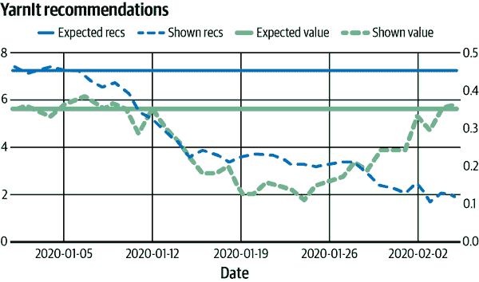

# 第十一章：事故响应

在这个世界上，有时候坏事情会发生，即使是对良好的数据和系统也是如此。磁盘故障。文件损坏。机器损坏。网络中断。API 调用返回错误。数据卡住或轻微变化。曾经准确代表模型的模型变得不那么准确。世界也可能在我们周围改变：以前几乎从未发生的事情可能变得司空见惯；这本身对我们的模型产生影响。

本书的大部分内容涉及构建能够预防这些问题发生的机器学习系统，或者在这些问题发生时——而它们确实会发生——正确识别情况并加以缓解。具体而言，本章讨论了在机器学习系统遇到坏事情并需要紧急响应时的应对方法。你可能已经熟悉团队如何处理系统宕机或出现问题的情况：这被称为*事故管理*，并且有关管理这些事故的最佳实践在许多计算机系统中都是通用的¹。

我们介绍了这些通用的实践方法，但我们的重点是如何管理机器学习系统的故障，并特别关注这些故障及其管理与其他分布式计算系统的不同之处。

最重要的一点是，机器学习系统具有使其故障处理可能与非机器学习生产系统的故障处理截然不同的特性。在这种情况下最重要的特性是它们与真实世界情况和用户行为的紧密联系。这意味着我们可能会看到不直观的效果，例如 ML 系统、世界或我们试图建模的用户行为之间的不一致。我们稍后会详细讨论这一点，但现在需要理解的主要事情是，解决机器学习事故可能需要组织的更多参与，远超标准生产事故的工程部门，包括财务、供应商和供应商管理、公关、法律等。ML 事故的解决不一定只是工程部门的事情。

最后一个严肃的观点是，在此开篇，我们想要表明的是，和机器学习系统的其他方面一样，事故管理对伦理有着严重的影响，并且很常见地涉及到隐私问题。将重点放在先让系统工作，然后担心隐私，这是一个错误。在本节中，不要忽视我们工作的这一关键部分。隐私和伦理问题会在本章的几个部分中显现，并且朝着章节结束直接讨论，因为到那时我们将能够更清晰地得出一些关于机器学习伦理原则如何与事故管理互动的结论。

# 事故管理基础知识

成功的事故管理的三个基本概念是*了解事故所处的状态*，*确定角色*，以及*记录信息以便后续跟进*。许多事故因未能识别事故所处状态和谁负责管理其各个方面而拖延。如果这种情况持续足够长的时间，你就会有一个*未管理的事故*，这是最糟糕的事故类型。²

的确，如果你处理事故的时间足够长，你可能已经见过这样的事故，并且它可能是这样开始的：一个工程师意识到有问题；他们独自排除问题，希望找出原因；他们未能评估问题对最终用户的影响；他们也未向团队其他成员或组织其余部分沟通问题的状态。排除问题本身通常是杂乱无章的，并且在行动之间存在延迟，以及在行动后评估发生的情况。一旦初始排查者意识到事故的范围，他们可能会遇到更多延迟，因为他们试图弄清楚需要协助的其他团队，并发送页面或警报以跟踪它们。如果问题无限期持续下去，组织的其他部门可能会注意到问题存在，并独立（有时是适得其反地）采取不协调的步骤来解决问题。

关键思想在于实际上有一个过程——一个经过充分演练的过程——在发生值得称为事故的不良事件时可靠而系统地应用它。当然，创建一个管理良好的事故是有成本的，正式化沟通、行为和后续行动会增加开销。所以我们并不是每一个在日志中的`WARNING`都需要几个小时的会议或电话。成为一名有效的值班工程师需要发展出对什么是严重问题和什么不是的感觉，并在需要时平稳地启动事故处理机制。提前明确定义关于何时宣布事故、如何管理它以及事后如何跟进的指南是极其有帮助的。

## 事故的生命周期

事故在其存在中有明显的各个阶段。尽管有良好意愿的人可能在具体细节上有分歧，但事故可能包括以下状态：

事前事故

导致中断的架构和结构决策。

触发

发生某些事情导致用户端影响。

中断开始

我们的服务受到至少一些用户在至少一些功能上的显著影响。

检测

服务的所有者通过自动化监控通知我们或外部用户投诉而意识到问题的存在。

故障排除

我们试图找出问题的原因并设计修复问题的方法。

缓解

我们确定最快和最少风险的步骤，以至少防止问题中最严重的情况发生。这可能从发布一则通知表明某些事情不正常工作，一直到完全禁用我们的服务。

解决方案

我们解决了根本问题，服务恢复正常。

后续

我们进行回顾，了解关于中断的所有信息，确定我们希望修复的一系列问题或其他要采取的行动，然后实施这些行动。

计算机系统的中断大致可由以下阶段描述。我们将简要介绍典型事件中的角色，然后尝试理解处理 ML 事件的不同之处。

## 事件响应角色

一些公司有成千上万的工程师从事系统基础设施工作，而其他公司可能只有一名幸运儿。但无论您的组织规模是大还是小，本节描述的角色都需要填补。

需要注意的是，并非所有角色必须由不同的人填补，因为并非所有责任同等紧急，也不是所有事件都需要孤立的关注。此外，您的组织和团队有特定的规模，不是每个团队都能直接填补每个职位。此外，某些问题只在规模上产生：尤其是与管理的基础设施复杂性相关的沟通成本往往会在较大的组织中增加。相反，较小的工程团队可能会受到狭隘视野和经验多样性不足的困扰。我们的指导并不意味着您无需适应情况，以及做出正确选择——通常是首先做出错误选择。但有一个关键事实是，您必须提前计划好组织能力，以妥善支持事件管理职责。如果它们是人员招募不足的事后想法，或者您假设任何人都可以在没有结构、培训或空闲时间的情况下参与事件处理，结果可能会很糟糕。

我们最熟悉的事件管理框架源自美国联邦应急管理局（FEMA）[国家事件管理系统](https://oreil.ly/pFkaa)。在此框架中，典型的最小可行角色集通常如下：

事件指挥官

一位具有整体高层次了解事件的协调员，负责分配和监控其他角色。

通讯负责人

负责出站和入站通讯。根据系统不同，此角色的实际职责差异显著，可能包括更新面向最终用户的公共文档，联系其他内部服务团队寻求帮助，或回答面向客户支持人员的查询。

运维负责人

批准、安排并记录与中断相关的所有生产变更（包括停止先前计划的与中断无关的同一系统的生产变更）。

计划负责人

记录那些不应丢失但不影响即时故障解决的长期项目。这包括记录待修复的工作项目、存储待分析的日志以及安排未来审查事故的时间。（如适用，规划负责人还应为团队订晚餐。）

这些角色是不变的，无论您是否处理机器学习事故。以下是*变化*的内容：

检测

与非机器学习系统相比，机器学习系统的确定性较低。因此，编写监控规则以在人类用户之前捕捉所有事故变得更加困难。

参与解决方案的角色和系统

机器学习事故通常在故障排除和解决过程中涉及更广泛的员工，包括业务/产品和管理/领导层。机器学习系统对多个系统产生广泛影响，并且通常建立在多个复杂系统之上并由其供给。这导致任何事故都可能涉及多样化的利益相关者。由于其在集成和修改基础设施的角色，机器学习故障通常会影响多个系统。

时间轴/解决方案不清晰

许多机器学习事故会影响到已经随时间变化的质量指标。这使得事故和解决方案的时间轴更难以精确指定。

为了对为何在这种情境中出现这些差异有更直观和具体的理解，让我们考虑一些机器学习系统中的实际故障案例。

# 机器学习中心故障的解剖

这些示例是作者根据真实经验绘制的，但并*不*对应于我们参与过的具体案例。尽管如此，我们希望许多有经验运行机器学习系统的人能在至少一个这些示例中看到熟悉的特征。

当您阅读它们时，请特别注意以下一些可能与其他类型的故障大不相同的特征：

架构和基础条件

在此之前我们对系统做出了哪些决定，这些决定可能在事故中发挥了作用？

影响开始

我们如何确定事故的开始？

检测

检测事故有多容易？我们如何做到？

故障排除和调查

谁参与其中？他们在我们组织中扮演什么角色？

影响

对我们的用户来说，故障的“成本”是多少？我们如何衡量它？

解决方案

我们对解决方案的信心有多大？

后续处理

我们能区分修复和改进吗？我们如何知道从事故的后续处理结束并进行前瞻性工程？

在您考虑本章后面呈现的故事时，请牢记以下问题。

# 术语提醒：模型

在第三章中，我们介绍了以下几点的区别：

模型架构

学习的一般方法

模型（或配置模型）

一个特定模型的具体配置，以及我们将在其上进行训练的学习环境和数据结构

训练模型

在某个时间点上，针对一个配置的模型训练的特定实例

特别是这种区别很重要，因为我们经常关心哪些因素发生了变化，可能涉及到事故。在以下各节中，我们将尽量明确我们所指的是哪一个。

# 讲述时间

我们在我们虚构的公司 YarnIt 框架内讲述以下故事，以便让它们与您产生共鸣。但它们都是基于或至少受到我们在生产中观察到的真实事件的启发。在某些情况下，它们基于某个特定时间的单个故障，而在其他情况下，它们则是组合的。

## 故事 1：搜索但未找到

YarnIt 使用的主要 ML 模型之一是搜索排名模型。像大多数网络商店一样，顾客会访问网站并点击首页提供的链接，但他们也直接搜索他们正在寻找的产品。为了生成这些搜索结果，我们首先过滤我们的产品数据库，以找到粗略匹配顾客搜索词的所有产品，然后使用 ML 模型对这些结果进行排序，试图预测如何在搜索时根据我们了解的一切对它们进行排序。

Ariel，一位从事搜索系统可靠性工作的生产工程师，正在处理监控想法的积压。搜索团队希望监控和趋势化的一项指标是用户在搜索结果的前五个链接中点击的速率。团队成员假设这可能是查看排名系统是否运行最佳的好方法之一。

Ariel 查看了可用的日志，并确定了公开生成指标的方法。在对过去 12 周进行了逐周报告以确保数字看起来合理后，Ariel 发现了一些最初令人鼓舞的结果。从 12 周前到 3 周前，Ariel 看到顾客大约 62%的时间内会点击前五个链接。当然，这可以更好，但我们在大多数时间内仍然在前几个结果中找到*某些*用户感兴趣的内容。

然而，三周前，前五个链接的点击率开始下降。事实上，本周只有 54%，而 Ariel 注意到它似乎仍在下降。这在很短的时间内是一个巨大的下降。Ariel 怀疑新仪表盘存在缺陷，并要求搜索可靠性团队进行查看。然而，团队确认：数据看起来正确，这些数字确实令人担忧！

###### 注意

检测已发生。

Ariel 宣布了一次紧急事件，并通知了搜索模型团队，因为可能是模型出了问题。Ariel 也通知了零售团队，只是为了确认我们并非突然在从搜索产品的顾客那里少赚钱（而不是简单地浏览产品），并要求团队检查网站最近是否有更改，这些更改可能会影响搜索结果的呈现方式。然后，Ariel 探究了搜索可靠性团队自身的基础设施：他们那边有什么变动？Ariel 发现——并且搜索模型团队确认——在过去两个月内，并没有对模型配置进行任何更改。数据或模型使用的相关元数据也没有发生大的变动——只是正常地将顾客活动添加到日志中。

相反，搜索模型团队的一位成员注意到了一些有趣的事情：他们每天使用一个*黄金查询集*来测试新模型，并注意到在过去三周里，这个黄金查询集产生了极其一致的结果——足够引起怀疑。搜索模型通常通过重新训练前一天搜索和点击结果的模型来每日更新。这有助于保持模型对新偏好和新产品的更新。这也倾向于在黄金查询集的结果中产生一些不稳定性，尽管这种不稳定性通常在合理范围内。但是从三周前开始，*这些*结果变得异常稳定起来。

Ariel 前往查看已部署到生产环境的训练模型。*这个模型已经三周没有更新过，自那时以来一直如此。* 这解释了黄金查询的稳定性。它也解释了用户点击行为的下降：我们可能在新偏好和新产品上显示较少的良好结果。当然，如果我们继续使用同样陈旧的模型，最终将无法正确推荐任何新内容。因此，Ariel 查看了搜索模型训练系统，该系统每晚都安排搜索模型的训练。在过去三周内没有完成过一次训练运行，这肯定可以解释为何生产环境中没有新的训练模型。

###### 注意

我们已经找到了故障的近因，但目前我们还不知道根本原因，并且没有明显的简单缓解措施：没有新的训练模型投入使用，我们就无法改善情况。这也是影响起始相当严重的一次近因。

训练系统是分布式的。一个调度程序加载一组处理过程来存储模型的状态，另一组处理过程则读取昨天的搜索日志，并使用用户新表达的偏好来更新模型。Ariel 注意到，所有试图从搜索系统读取日志的处理过程，大部分时间都在等待这些日志从日志系统返回。

日志系统通过一组称为*日志供应者*的进程访问原始客户日志，这些进程有权限读取日志的相关部分。在查看这些日志供应进程时，Ariel 注意到其中有 10 个进程每隔几分钟就会崩溃并退出。深入研究进程崩溃日志时，Ariel 发现日志供应者因为内存不足而崩溃。当它们无法分配更多内存时，它们会崩溃。崩溃后，新的日志供应进程会在新的机器上启动，训练过程会重新尝试连接，读取几个字节，然后该进程再次因为内存耗尽而崩溃。这种情况已经持续了三周。

Ariel 建议将日志供应进程数量从 10 增加到 20。在训练作业中分散负载可能会防止作业崩溃。如果需要，他们也可以考虑为作业分配更多内存。团队同意了这个建议，Ariel 进行了更改，日志供应作业不再崩溃，并且搜索训练运行几小时后完成。

###### 注意

训练运行完成并将新训练的模型投入生产后，中断得到了缓解。

Ariel 与团队合作，再次确认新训练的模型是否能自动加载到服务系统中。查询黄金集的表现与三周前的不同，但表现仍然可接受。然后，他们等待几个小时以积累足够的日志来生成所需的数据，以确保更新的训练模型对客户的表现良好。随后，他们分析日志，发现前五个结果的点击率现在已经恢复到应有的水平。

###### 注意

在此时，中断得到了解决。有时候没有明显的缓解阶段，缓解和解决同时进行。

Ariel 和团队对事件进行了回顾，并积累了一些事后工作，包括以下内容：

+   监控服务中模型的年龄，并在超过某个小时阈值时发出警报。“年龄”可以是墙上钟的年龄（字面上是文件的时间戳）或数据的年龄（模型基于的数据有多老）。这两者都可以通过机械手段进行测量。

+   确定我们对于必须有一个新鲜模型的需求，并将可用时间分配给训练过程的各个子组件。例如，如果我们最多每 48 小时需要在生产环境中更新一个模型，我们可能会给自己大约 12 小时来解决问题并训练一个新模型，然后我们可以将剩余的 36 小时分配给日志处理、日志供应、训练、评估和复制到服务流水线的部分。

+   监控黄金查询测试，并在它没有变化或变化太多时发出警报。

+   监控训练系统的*训练速率*，并在其低于合理阈值时发出警报，以便我们预测基于分配的时间量我们将无法按时完成训练。选择监控内容是困难的，为这些变量设置阈值甚至更难。这在“ML 事件管理原则”中简要涉及，并且在第九章中已经涵盖。

+   最后，也是最重要的一点：监控前五个结果的点击率，并在其低于某个阈值时发出警报。这应该能够捕捉到任何影响用户感知质量但未被其他原因捕捉到的问题。理想情况下，这个指标应该至少每小时可用，这样即使只在每天基础上稳定也可以在未来解决问题时使用它。

随着这些后续项目的安排，艾瑞尔准备休息一下。

### ML 事件响应故事 1 的阶段

尽管这次停机的原因相当简单，但它可以帮助我们开始看到机器学习事件在某些阶段的响应生命周期中表现出略有不同的方式：

事前事件

培训和服务系统是一个相当典型的结构，一个系统生成训练模型并定期更新，另一个系统使用该模型来回答查询。这种架构非常具有弹性，因为面向客户的实时系统与学习系统隔离开来。当它出现故障时，通常是因为服务中的模型没有更新。底层日志数据也以一种保护日志但仍允许训练系统从中学习的干净方式进行了抽象处理。但这种与日志的接口正是我们系统中弱点所在。

触发器

分布式系统在超过特定扩展阈值时通常会失败，从而显著降低性能，有时称为*瓶颈*。在这种情况下，我们超过了日志馈送部署性能的阈值，却没有注意到。触发器是数据的简单增长，对应于训练系统需求的增长，以及消费该数据的业务需求。

停机开始

停机开始三周后我们才注意到。这很不幸，这也是为什么良好的监控如此重要的原因。

检测

未充分工具化的机器学习系统通常将系统问题表现为仅有质量问题——它们仅仅开始表现得不太好，并且随着时间的推移逐渐恶化。模型质量变化通常是系统基础设施出现问题的唯一端到端信号。

故障排除

机器学习故障排除通常涉及比其他类型的故障更广泛的团队，这正是因为它们通常表现为公开可见的质量问题。在问题被缩小之前，最好不要对我们正在经历的故障类型进行假设——这可能是系统问题、模型问题，或者只是我们正确预测世界能力的漂移。³ 有时候，问题是世界变化速度超过我们能跟上的速度——关于这一点，后续故事将详细介绍。并非所有的质量下降都是故障。未来的故事将展示更广泛的参与故障排除的人员阵容。

缓解/解决方案

在这种情况下，缓解问题的最快、最低风险的步骤涉及训练一个新模型，并成功部署到我们的生产搜索服务系统中。对于机器学习系统，特别是那些在大量数据上进行训练或生成大型模型的系统来说，可能没有这样的快速解决方案。

后续

我们可以在这里添加丰富的监控内容，其中许多内容并不容易实施，但在未来的事件中将对我们有益。

这个第一个故事展示了一个相当简单的与机器学习相关的故障。我们可以看到，故障可能表现为模型质量问题，未能完全符合我们的预期或需求。我们还可以开始看到，在许多情况下需要广泛的组织协调来解决问题的模式。最后，我们可以看到，对后续工作的规范是非常诱人的。在记住这三个主题的情况下，让我们考虑另一个故障。

## 故事 2：突然无用的合作伙伴

在 YarnIt，我们有两种业务类型。我们的第一部分是直营店，销售针织和编织产品。但我们还有一个市场，推荐其他合作伙伴通过我们的商店销售的产品。这是一种可以向我们的客户提供更多种类产品的方式，而无需增加库存或营销投入。

何时以及如何推荐这些市场产品有点棘手。我们需要将它们作为基准纳入到我们网站上的搜索结果和发现工具中，但我们应该如何进行推荐呢？最简单的方法是列出我们产品数据库中的每个产品，包括所有涉及它们的操作在我们的日志中，然后将它们添加到我们的主预测模型中。一个显著的限制是，这些合作伙伴中的每一个都要求我们将他们的数据与其他合作伙伴的数据分开；否则，他们将不允许我们列出他们的产品。⁴ 因此，我们将不得不为每个合作伙伴训练一个单独的模型，并将合作伙伴特定的数据提取到隔离的存储库中，尽管我们仍然可以为共享数据维护一个通用的特征存储。

YarnIt 雄心勃勃，计划为潜在的*非常*大量合作伙伴之间——大约在五千到五百万之间——设计一个设置，而不是为少数大型模型进行优化。因此，我们建立了一个系统，从每个合作伙伴中提取历史数据并将其放入单独的目录或小型特征存储中。然后，每天结束前，我们分离出前一天的增量并将其添加到我们的存储中，然后开始训练。现在，我们的主要模型训练速度很快，我们的较小合作伙伴模型也训练速度很快。最重要的是，我们符合合作伙伴要求的访问保护标准。

###### 注意

到这一点，预事故已经完成。舞台已经搭建好，停机的条件也已经设置好。到这时，可能已经很明显存在许多问题的机会。

Sam 是 YarnIt 的一名生产工程师，负责合作伙伴培训系统。在即将进行的业务会议前，Sam 被要求为合作伙伴 CrochetStuff 制作报告。在准备报告时，Sam 注意到所讨论的合作伙伴在机器学习训练数据中没有最近的转化记录，但会计系统报告称其每天都在销售产品。Sam 制作了一份报告并转发给负责数据提取和连接工作的同事以寻求建议。与此同时，Sam 在向合作伙伴团队的数据报告中没有提到这个事实，只包括了销售数据。

###### 注意

检测发生在这里。没有计算机系统检测到停机情况，这意味着它可能已经持续了不确定的时间。

像这样的计数数据不一致问题经常发生，因此数据提取团队不将 Sam 的报告视为高优先级。Sam 报告了一个合作伙伴的单一差异，团队提交了一个 bug，并计划在未来一周左右解决。

###### 注意

事故未经管理，继续混乱进行。它可能很小，也可能不是。尚无人确定数据问题的影响程度，并且没有人负责协调快速和有针对性的应对措施。

在业务会议上，CrochetStuff 指出其销售环比下降了 40%，并且每天都在继续下降。尽管用户*找到*产品的速率依然很高，但他们的页面浏览量、推荐和用户查询量都在下降。CrochetStuff 要求知道为什么 YarnIt 突然停止推荐其所有产品！

###### 注意

到目前为止，我们进行了内部检测、内部合作伙伴倡导、客户报告，并可能发现了正在发生的事情的线索。这些都是很多噪音，但有时我们直到多人独立注意到它之后才宣布事故。

Sam 宣布了一个事件，并开始解决问题。合作模型训练系统的日志清楚地报告说，合作模型每天都在成功训练，并且最近没有对执行训练的二进制文件或模型结构和特性进行任何更改。通过模型生成的指标来看，Sam 可以看到 CrochetStuff 目录中每个产品的预测值在过去两周内每天都显著下降。Sam 查看其他合作伙伴的结果时，看到了完全相同的下降趋势。

Sam 找来建模的机器学习工程师们来排查发生了什么。他们再次确认没有任何改变，然后对底层数据进行了一些聚合检查。他们注意到的一件事与 Sam 最初注意到的一样：在过去两周内，机器学习训练数据中没有任何合作伙伴的销售数据。所有数据都来自我们的主日志系统，并且每天提取以与每个合作伙伴的历史数据进行连接。数据提取团队从几天前 Sam 的错误中恢复，并开始调查。

Sam，需要快速缓解问题的人员，注意到团队保存了长达几个月的旧版本训练模型。Sam 询问机器学习工程师只加载旧模型到服务中目前可能带来的后果。团队确认，虽然旧的训练模型版本不包含任何关于新产品或消费者行为大变化的信息，但它们对所有现有产品的推荐行为仍具有预期效果。由于故障的范围如此之大，合作团队决定冒这个风险回滚模型。在与合作团队磋商后，Sam 将所有合作训练模型回滚到两周前创建的版本，因为这似乎是故障影响开始之前的时间点。机器学习工程师快速检查了旧模型的聚合指标，并确认推荐应该恢复到两周前的状态。⁵

###### 注意

此时，故障虽然得到了缓解，但并没有真正解决。情况非常不稳定，尤其是我们无法使用我们习惯的流程构建新模型，并使其良好运行。我们仍然需要找出最佳的完整解决方案，以及如何避免再次陷入这种情况。

当 Sam 在减轻问题时，数据提取团队一直在进行调查。它发现，虽然提取工作正常，但将提取的数据合并到现有数据中的过程始终无法为任何合作伙伴找到可合并的内容。这一问题似乎始于大约两周前。进一步的调查揭示，两周前，为了促进其他数据分析项目，数据管理团队更改了用于在其日志条目中识别每个合作伙伴的唯一合作伙伴键。这个新的唯一键被包含在提取的数据中，因为它与以前的合作伙伴标识符不同，所以新提取的日志无法与添加键之前提取的任何数据合并。

###### 注意

现在这是停机的一个合理的根本原因。

Sam 请求重新提取单个合作伙伴的数据，并在新数据上训练一个模型，以快速验证系统是否正确端到端地工作。一旦完成，Sam 和团队能够验证新提取的数据包含预期数量的转化，并且模型现在再次预测这些产品是许多客户的好推荐。Sam 和数据提取工程师对重新提取所有数据需要多长时间进行了一些快速估算，然后 Sam 与机器学习工程师商议重新训练所有模型需要多长时间。他们得出一个共同的估计为 72 小时，在此期间，他们将继续提供来自两周前恢复的陈旧模型版本的推荐。在与零售产品和业务团队商议后，他们决定执行这种方法。合作伙伴团队起草了一些邮件通知合作伙伴有关问题及解决时间表。

Sam 请求重新提取所有合作伙伴数据，并尽可能从头开始重新训练所有合作伙伴模型。他们监控这个过程三天，一旦完成，验证新模型不仅推荐旧产品，还推荐了在两周前不存在的新产品。经过仔细检查，机器学习工程师认为新模型是好的，并投入生产。服务结果经过仔细检查，许多人进行实时搜索和浏览以验证合作伙伴列表是否按预期显示。最终，停机宣布解决，合作伙伴团队起草了一份更新，通知合作伙伴们。

###### 注意

在这一点上，停机已经解决。

Sam 召集团队一起讨论停机事件，并提出一些后续错误报告，以便他们能够避免类似的停机事件，并比这次更快速地检测到它。团队考虑重新架构整个系统，以消除所有数据两次拷贝的问题，具有稍有不同的用途和约束，但他们决定，如果统一，仍然没有很好地了解如何达到两个系统的性能目标。

他们确实提出了一组与监控数据提取成功、数据复制和数据合并相关的错误报告。最大的问题在于，他们没有一个关于“应该合并多少行数据”的可靠真实来源。这种失败发生在整个日志类别中，团队很快就能为“必须大于零的日志行合并”添加警报。但在调查过程中，还发现了一系列不太严重的失败，为了捕捉这些失败，我们需要知道每个合作伙伴预期合并的日志数量，以及实际合并的数量。

数据提取团队决定采用一种策略，按合作伙伴每天合并的日志行数进行存储，并将今天的成功与过去 *n* 天的滞后平均值进行比较。当合作伙伴稳定时，这种方法效果相对不错，但当他们的流行度发生较大变化时会产生噪音。

两年后，这种警报策略仍未实施，因为在实施过程中遇到了不必要的噪音挑战。这种策略可能是一个好主意，但考虑到动态的零售环境，已被证明行不通，而且团队仍然缺乏良好的端到端快速检测这类日志提取和合并故障的能力，除了在灾难性情况下。然而，他们在几个月前实施的一种启发式方法——通过触发任何合作伙伴配置变更并通知工程师潜在的故障——至少增加了对这种变化作为潜在触发器的持续意识。

### ML 事故响应故事 2 阶段

这次事故经历的许多特征阶段与任何分布式系统事故的相似之处很多。但是它有明显的不同之处，要看到这些特点，最好的方法是通过合作伙伴培训中断的过程，并查看在每个部分发生的与机器学习相关的特征：

事前事件

大多数问题在我们系统结构中已经潜在存在。我们的系统有两个数据的权威来源，其中一个是另一个的提取版本，定期应用增量提取。机器学习系统最常见的失败是由于数据和元数据的问题。我们将深入研究观察和诊断系统中耦合数据和机器学习中断的策略，参见“机器学习事故管理原则”。

触发器

数据架构已更改。这次更改距离我们观察到问题的地方很远，显然这使得识别变得困难。重要的是要将这次中断视为识别我们在整个处理堆栈中对数据所做的假设的一种方式。如果我们能够识别这些假设及其实施位置，我们就能避免创建会因为这些假设变化而受损的数据处理系统。在这种情况下，我们的主要特征存储架构不应该更改，除非也修改或至少通知所有下游用户这个特征存储的情况。显式的数据架构版本控制是实现这一结果的一种方式。

中断开始

中断始于一个内部系统处理数据的过程使用另一个内部系统处理数据的方式，而这种方式已不再与其结构一致。这是任何大型分布式管道系统的常见危险。

检测

机器学习系统很常见地以终端用户首先检测到的方式失败。其中一个挑战是，机器学习系统通常被指责失败，或者至少在正常运行时表现不佳，因此忽视用户和客户的投诉似乎是合理的。注意到这种特定中断的主要方法是一个常见的方法：推荐系统不再提供与以往相同质量的推荐。通过机器学习系统的监控，牢记高级别、端到端、粗粒度的整体情况特别有用——核心问题是，我们在过去的短时间内是否显著改变了模型的预测？这类端到端的质量指标完全独立于实现，将检测到任何严重损害模型的中断。挑战在于过滤该信号，以避免出现太多误报。

故障排除

Sam 需要与多个团队合作，以理解中断的范围和潜在原因。我们有商业和产品人员（合作伙伴团队）、构建模型的机器学习工程师、从特征存储和日志存储中提取数据并将其送至我们的合作伙伴模型训练环境的数据提取工程师，以及像 Sam 这样协调整个工作的生产工程师。解决机器学习中断问题确实必须从外部世界开始，而不是从数据开始：我们的模型说了什么，为什么是错误的？有如此多的数据，仅仅“浏览数据”甚至“对数据进行聚合分析”可能会是一个漫长而毫无成果的搜索。从模型的变化或有问题的行为开始，倒推出现在模型为什么会这样做会更容易些。

缓解

对于某些服务来说，可以在准备修复方案的同时简单地恢复软件的旧版本。虽然这可能会给依赖新功能的用户带来不便，但其他人可以继续不受影响。

机器学习停机通常只能通过恢复模型的旧版本来部分缓解，因为它们的任务是帮助计算机系统适应世界，而没有办法恢复世界过去的快照。

此外，快速培训新模型通常需要比我们现有的计算能力更多。正如我们合作伙伴模型停机的情况一样，没有无成本的快速缓解措施。确定最佳缓解选项需要最熟悉我们合作伙伴、用户和业务的产品和业务人员最终做出决定。对于非机器学习服务，这种升级到业务领导层的情况有时会发生，但对于机器学习服务则更为频繁。大多数依赖机器学习来运行业务重要部分的组织将需要培养既懂业务又懂技术的技术领导者。

解决方案

Sam 确保合作伙伴培训系统中的数据是正确的（至少在总体上，抽查似乎确认它看起来不错）。新模型已经训练完成。当我们准备部署它们时，实际上没有简单的方法来确定新模型是否“修复”了问题。在我们努力解决这个问题的同时，世界继续变化。因此，一些先前受欢迎的产品现在可能不那么流行了。一些被忽视的产品可能被我们的用户发现了。我们可以查看总体指标，看看我们是否推荐合作伙伴产品的速率接近之前的水平，但这不会完全相同。有时人们会在这里使用一组黄金查询，以查看是否能生成一组“正确”的预置结果。这可能在一定程度上增加我们的信心，但也带来了一个新问题，即我们将希望不断地维护这组黄金查询，以代表我们用户搜索的内容。一旦我们做到了这一点，我们不一定会在非常长的时间段内得到稳定的结果。⁶

后续处理

事后工作总是困难的。首先，有直接知识的人已经很累了，到这个时候可能已经忽略了他们的其他工作。我们已经为停机付出了代价，所以我们最好从中获得价值。尽管监控错误通常包含在事后跟进中，但对于基于机器学习的系统来说，这种错误往往会懒散下来（有时长达数年）。原因相对简单：以高信号低噪声方式监控真实数据和真实模型非常困难。任何过于敏感的东西都会一直警报——数据不同了！但是过于宽泛的东西会错过我们服务的子集的完全停机。这些问题存在于大多数分布式系统中，但对于机器学习系统来说是特征性的。

尽管这次停机在技术上复杂，并且在表现上有些微妙，但许多机器学习停机都有非常简单的原因，但仍然以难以关联的方式显示出来。

## 故事 3: 推荐您寻找新供应商

在 YarnIt，我们有几个业务方面的模型。特别是推荐模型具有重要的信号：购买。简单来说，我们在用户倾向于购买产品时，在每一个浏览上下文中推荐产品给他们。这对我们的用户来说是好事，因为他们更快地找到想购买的产品；对于 YarnIt 来说，这意味着更快地销售更多产品。

Gabi 是一名工作在发现建模系统上的生产工程师。一个异常愉快的夏日，Gabi 在处理已经悬而未决的配置清理工作，并处理其他部门的请求。客户支持人员发送了一封通知，他们在过去几周内一直在网站上追踪到一个反馈主题，称推荐内容“奇怪”。一些客户的这种主观印象通常很难采取任何具体行动，但是 Gabi 将该请求归档到“待跟进”部分，以便稍后跟进。

###### 注意

不要透露剧透！我们绝对不能说到目前为止是否已经发生了事件检测。

在后续的请求中，Gabi 发现了一个异常的问题报告。网站支付团队告诉 Gabi，财务部门报告收入大幅下降。网站上过去一个月的收入下降了 3%。这可能看起来不是很大的下降，但经过进一步的调查，团队发现相比四周前，上周的下降接近 15%！支付团队已经检查了支付处理基础设施，并发现客户支付购物车的成功率与历史上相同。他们指出，尽管如此，购物车的平均产品数少于以往，并且特别是购买推荐产品的人数少于预期。这就是为什么支付团队联系了 Gabi。看到如此大的数字，Gabi 宣布了一个事件。

###### 注意

检测到并宣布了事件。

Gaby 要求财务团队再次核实过去几周的本周与四周前的比较，并要求提供过去几周收入的更详细的时间表。最后，Gaby 要求提供任何可用的产品、类别或合作伙伴的分解情况。然后，Gaby 要求支付团队验证关于添加到购物车的推荐的数字，并提供他们能提供的任何分解信息。特别是：团队是否看到某种特定类型的购物车比其他购物车少推荐或者最近发生了变化？

与此同时，Gaby 开始查看应用程序的聚合指标，试图弄清楚一些基本问题。我们是否在显示推荐？我们是否像过去一样频繁地显示推荐，以及对于所有的查询、用户和产品，我们是否以过去的同样比例跨用户子群体生成销售？我们是否像通常一样从推荐中生成销售？推荐中是否有明显不同的显著之处？

Gaby 还开始进行常规的生产调查，特别关注最近推荐堆栈中发生了什么变化。结果并不令人鼓舞，找不到明显的罪魁祸首：推荐模型和用于训练模型的二进制文件在过去六周内都没有改变。当然，模型的数据每天更新，这也是需要关注的一点。但是特征存储中的数据架构几个月来都没有变化。

Gaby 需要继续故障排除，但却花时间撰写一条快速消息给财务和支付团队，请求帮助解决这个问题。Gaby 确认了到目前为止所知的情况：推荐系统正在运行并产生结果，但尚未验证结果的质量。考虑到公司似乎正在损失大量资金，Gaby 提醒他们如果尚未通知部门负责人则需要通知他们，这似乎是明智的做法。

没有明显的软件、建模或数据更新与停机时间相关，因此 Gaby 决定深入研究推荐模型本身。Gaby 发送了一条快速消息给建模者 Imani，请求帮助。当 Gaby 向 Imani 解释他们到目前为止所知道的情况（购买产品减少，每次结账购买的推荐减少，没有系统变更）时，客户支持的便签也跃入脑海。如果时间线符合，客户抱怨有关“奇怪”推荐的确显得相关。

客户支持人员确认他们在刚过去的三周左右开始收到第一批零星投诉，但最近一周情况变得尤为尖锐。Imani 认为这可能值得调查，并请求 Gabi 收集足够的数据以追踪推荐系统的一些基本指标：每个浏览页面的推荐数量，预期的所有推荐产品的平均每小时差异（客户购买推荐产品的概率乘以购买价格的预期“价值”），以及观察到的价值（最终购买的所有推荐产品的总价值）。Imani 获取了最近客户查询和产品结果的副本，以便将它们用作推荐系统的可重复测试。推荐系统使用用户的查询、所在页面以及他们的购买历史（如果我们知道的话）来进行推荐，因此这是 Imani 将需要直接查询推荐模型的信息。

###### 注意

没有更多信息的情况下，我们必须担心 Imani 可能侵犯了 YarnIt 客户的隐私。搜索查询可能包含受保护的信息，如用户 IP 地址，而任何搜索查询的收集还有另一个问题，即在给定用户的情况下，它们相互关联时会透露更多私人信息。（参见第 7 页，第十一章，第 128 页脚注）Imani 肯定应该在 YarnIt 咨询隐私和数据保护专家之后，或者更好的做法是根本不应该直接无监控地访问这些查询，以避免这种错误。

Imani 提取了大约 100,000 个查询和页面浏览数据，并建立了一个测试环境，可以对推荐模型进行测试。在系统的测试运行结束后，Imani 得到了所有结果的推荐，并存储了整个运行的副本，以便将来需要修改或修复模型时进行比较。

Gabi 回来报告了一些有趣的事情。三周多前，每页推荐的数量开始缓慢下降。一周内，每个推荐的预期值和观察到的值之间的差距只略有下降。两周前，推荐数量停留在比过去少了将近 50%的水平。但是随后推荐的价值开始显著下降，相比预期值。这种下降持续到上周。两周前，推荐的观察值达到了预期值的 40%的低点。更奇怪的是，推荐的预期值和观察到的值之间的差距在一周前开始缩小，但同时推荐显示的数量再次下降，现在我们似乎根本没有显示多少推荐，但显示的推荐似乎相对准确地被价值化了。显然出现了问题，看起来是模型的问题，但目前还没有清晰的诊断结果。图 11-1 展示了这些变化随时间的图形表示。

###### 图 11-1\. 期望和显示推荐的数量以及它们随事件期间变化的平均期望值

Imani 继续构建 QA 环境来测试假设。基于直觉，Gabi 和 Imani 又拿出了一个月前（在出现问题之前）的另外 100,000 个查询和页面视图，以及过去六周每周的一个模型快照。虽然模型每天都进行重新训练，但即使模型的配置每天完全相同，模型每天都会根据用户前一天的行为进行学习。Imani 计划运行旧和新的查询与每个模型进行对比，看看可以学到什么。

Gabi 主张先进行快速测试：今天的查询与一个月前的模型进行对比。思路是：如果这个方法有效，可以快速减轻问题（恢复旧模型提供服务），同时继续进行故障排除。Gabi 的焦点是尽快解决收入损失问题。Imani 运行了测试，结果并不太令人满意，也很难评估。旧模型与新模型做出了不同的推荐，而且似乎稍微多一些。但是，与一个月前的查询相比，旧模型对今天的查询仍然做出了更少的推荐。

没有更具体的依据，Gabi 不确定将模型改为旧模型是否有帮助。这甚至可能比当前模型对我们的收入造成更大的损害。Gabi 决定将推荐系统保持当前状态。现在是向财务和支付部门发送另一封关于故障排除当前状态的通知。支付和财务联系人都报告说，他们的老板想要更多关于发生情况的信息。Gabi 的同事 Yao 一直跟踪调查，并熟悉推荐系统，被选中负责沟通。Yao 迅速建立了一个包含到目前为止已知状态的共享文档，并链接到特定的仪表板和报告以获取更多信息。Yao 还向公司高级管理人员广发通知，告知他们停机情况及调查的当前状态。

Imani 和 Gabi 对旧模型和新模型运行了所有新旧查询的完整检查。每对的结果都不同，但没有明显的广泛系统性问题可以解释这些差异，而且总体指标与之前描述的奇怪模式相匹配。Imani 决定暂时放下模型，转而专注于查询和页面访问本身。Imani 想弄清楚他们在过去一个月里如何改变，也许问题在于模型处理用户行为转变的能力，而不是模型本身有问题。

Imani 抽查了这些查询，但每批有 10 万条，两批都有，而它们之间可能存在的显著差异并不明显。与此同时，Gabi 制作了两份报告。第一份报告专门研究了客户用于访问最终产品页面的搜索查询。Gabi 对搜索查询进行了标记，并简单统计了每个单词出现的次数。在此期间，Gabi 将客户最终访问的产品页面分配到大类（纱线、图案、针、配件、装备）中，并根据产品本体论（由另一个团队建立）将其进一步分到子类中。Gabi 对比了四周前和今天用户行为的最大差异。

结果显而易见：与四周前相比，用户越来越多地寻找完全不同的产品。特别是，他们现在寻找轻量级纱线、背心和小件物品的图案，以及较小规格的针。Imani 和 Gabi 盯着结果看，问题突然变得如此明显。四周前发生了什么？北半球的热浪来得比往常早，并显著减少了大多数 YarnIt 客户对用粗毛线编织的兴趣。

然而，Imani 指出，这并不能解释推荐减少，只是推荐内容的变化。这仍然让人困惑，为什么我们不推荐优质的大麻和丝绸纱线，而是推荐羊毛呢？Gabi 手动执行了几个查询到推荐引擎，使用了一个专为这样的故障排除而构建的命令行工具，并注意到了一些情况。推荐引擎的测试实例设置为记录比生产实例更多的细节。其中一个高频记录的情况是，许多推荐候选产品因为缺货而被取消显示给用户。

Yao 从 Imani 和 Gabi 那里得到了最新的消息，更新了一些共享文档，并向越来越多等待公司解决问题的人群发布了一些信息。来自零售团队的某人看到了关于许多推荐产品缺货的说明，并提到 YarnIt 最近确实失去了几个重要的供应商。其中最大的一个，KnitPicking，是一家流行的时尚纱线供应商，其中许多产品恰好是轻巧的纱线。事实上，KnitPicking 是这些重量级和价格点的主要供应商之一。Yao 获取了关于供应问题时间安排的更多细节，将其添加到文档中，并向 Gabi 汇报了情况。

###### 注意

这是一个有趣的问题状态。我们有一个可能的根本原因，但没有明显的解决或减轻它的方法。

Imani 和 Gabi 对异常推荐有了一个坚实的假设。推荐系统配置了对每个推荐产品显示的最低预期值阈值，这样在没有好的推荐产品时就不会显示糟糕的推荐。但是，一个推荐产品的预期值调整需要一段时间，特别是当最近它没有经常被显示时。Imani 得出结论，系统很快学到了很少人想要重量级羊毛纱线。但一旦这些产品被认定为不良推荐，系统在最终确认我们当前客户真正想购买的产品库存非常有限之前，需要很长时间循环检查许多其他产品。

Gabi、Imani 和 Yao 安排了一次与零售和财务负责人的会议，讨论他们所学到的内容，并寻求如何继续前进的指导。奇怪的是，目前的情况似乎是推荐系统现在在当前情况下表现得相当不错。由于我们目前没有大多数客户想要的产品，它对大多数客户的大多数页面浏览推荐很少产品。收入损失不仅是由于供应问题，也是由于推荐系统。在以已知的事实为基础的情况下，零售负责人要求团队核实其发现以确保准确，但同意解决供应问题是最优先的任务。财务主管点头同意，然后立即大幅减少本季度的盈利预期。鉴于我们的供应短缺以及天气对客户偏好的影响方式，很明显推荐模型没有明显的改变能够改善情况。

###### 注意

此时，停机很可能已经结束，因为我们决定不改变系统或模型。

第二天，团队齐聚一堂，回顾所发生的事情，并从中学习。以下是一些提议的后续行动：

+   监控并绘制每页浏览的推荐数量、每个推荐的收入以及预期所有推荐每小时的预期价值与实际销售价值之间的百分比差距。

+   对于候选产品推荐高失效率（无论出于何种原因：缺货、法律限制等），应进行监控和警报。如果可以找到高信号方式，我们还可以考虑直接监控库存水平，尽管最理想的情况是由供应链或库存管理团队负责。在这里，我们应当小心，避免对其他团队的工作进行过度监控，以免未来过多的警报负担我们自己。我们应该考虑直接监控用户查询行为的总体情况，这样我们可能能够检测到查询主题和分布的显著变化。这种监控通常适合绘图，但不适合警报，因为它很难实现正确。最后，我们可以更密切地与客户支持团队合作，为他们提供调查此类用户报告的工具。如果支持团队有一个查询复制器/分析器/记录器，可能会生成比“客户说他们得到奇怪推荐”更详细的报告。这种“增强另一个团队效率”的努力通常比纯自动化产生更大回报。

+   检查如何使模型更快地调整。花费如此多的时间才能收敛于正确的推荐行为是不合理的。总体上，模型的稳定性被认为具有价值，但在这种情况下，它最终向用户显示了糟糕的推荐，使生产团队更难以解决与其相关的问题。伊曼尼希望找到一种方法，在不使模型过于不稳定的情况下提高对新情况的响应能力。

+   我们应该把这视为一个思考模型在没有任何好的推荐时应该怎么做的机会。这从根本上来说是一个产品和业务问题，而不是 ML 工程问题：我们需要弄清楚我们希望模型展示的行为以及在这种情况下我们认为应该向用户展示的推荐类型。在高层次上，我们希望以合理的利润率继续赚钱，即使我们没有客户最想要的产品。弄清楚是否有一种方法来确定产品推荐策略来解决这个难题是一个棘手的问题。

+   最后，显然 ML 系统需要一些外生数据始终可用，以便更轻松地进行类似的故障排除。特别是，生产工程师应该在产品目录中按产品类别、地理位置和用户查看产品的原始来源（搜索结果、推荐或主页）的汇总和分解中始终有收入结果。

许多这些后续措施非常雄心勃勃，不太可能在任何合理的时间内完成。其中一些，但可以相对较快地完成，并且应该使我们的系统在未来更具抗干扰能力。正如往常一样，找到正确的平衡并理解实施这些措施的权衡是良好后续措施的本质，尽管我们应该偏爱那些使问题更容易排查的措施。

### ML 事件响应阶段 3

尽管此次事件与前两个案例的轨迹略有不同，但我们可以看到许多相同的主题出现。与其重复它们，让我们试着集中精力从这次中断中学到的任何额外教训：

事前准备

在我们系统的架构或实施中没有明显的重大故障导致这次中断，这很有趣。我们确实可以做出不同选择，使中断进展不同，并且更顺利地为我们的用户服务，但最终我们不能推荐我们没有的产品，销售肯定会下降。在这种情况下可能会有一个模型能够在这些情况下产生更好的推荐（需求快速变化与库存问题结合），但这更多地属于持续模型改进而不是事故避免的范畴。

触发器

天气变化，并且我们失去了一个供应商。这是一种难以直接检测到的事件组合，但我们可以尝试使用一些选择的监控方法来进行检测。

停机开始

从某些方面来看，这并不是停机。这是此次事件最有趣的地方。停机可以被理解为系统的失效，导致其产生错误结果。适当地描述“奇怪推荐”期间的时期可以作为停机的描述，但成本仅为最小，因为主要影响可能只是稍微让我们的用户感到恼火。但是收入损失并非由推荐模型造成，也无法通过它来预防。同样，直到天气改变或我们获取新的轻量级纱线供应之前，停机都不会结束。

检测

此次停机的最早迹象是关于奇怪推荐的客户投诉。这是一种可能不能依赖的嘈杂信号，但正如所指出的，我们可以为支持团队提供更好的工具，以便能够更详细地报告问题。其他不那么明显的信号可能具有更高的准确性，我们可以用于检测，但即使弄清楚它们也是一个数据科学问题。

故障排除

调查此次停机的过程包括许多以机器学习为中心的停机调查的特征：在特定模型（或一组模型或建模基础设施）上进行详细探索，同时广泛调查我们周围环境的变化。如果 Sam 对财务团队的详细收入时间表进行了跟进，调查可能会更快地进行下去。通过按产品、类别或合作伙伴细分的收入变化的详细数据，我们本应该能够看到消费者行为的急剧变化，以及 KnitPicking 销售的急剧上升和下降（因为我们的产品库存短缺）。有时候很难记住，关于停机的清晰度可能来自于更广泛地观察整个情况，而不是更仔细地观察其单个部分。

缓解/解决

有些停机没有明显的缓解措施。这非常令人失望，但偶尔没有快速恢复系统到先前状态的方法。而且，实际解决核心停机并让我们的收入恢复正轨的唯一方法是改变我们的用户需求或修复我们可供销售的产品。团队没有考虑的一件事，可能部分原因是因为它专注于排除模型和解决停机的机器学习部分，那就是可能有其他非机器学习方式来缓解停机：如果我们的系统显示缺货推荐并邀请客户在我们有这些（或类似）产品时通知他们呢？在这种情况下，我们可能通过将损失的收入向前移动并减少向客户提供的奇怪推荐，从而避免了一些损失。有时候，缓解措施可以在我们的系统之外找到。

后续处理

在许多情况下，从以机器学习为中心的事故的后续发展成为一个阶段，这个阶段不再像“修复问题”那样，而更像是“改善模型性能”。事故后的跟进往往演变成长期项目，即使对于非机器学习相关的系统和故障也是如此。但对于机器学习系统来说，“修复”和“持续改进模型”之间的界限特别模糊。一个建议是：首先清晰定义您的模型改进流程。跟踪正在进行的工作，并定义计划用于指导模型质量改进的指标。一旦发生事故，从事故中获取输入以添加、更新或重新排列现有的模型改进工作。有关更多信息，请参见第五章。

然而，这三个故事在细节上有所不同，展示了机器学习事故在检测、故障排除、缓解、解决以及最终事故后跟进行动中的共同模式。记住这些对于理解这些事件如何在某种程度上与分布式计算系统中的其他故障有所不同是有用的。

# 机器学习事故管理原则

尽管这些故事各具特定性，但它们的许多教训在各种事件中仍然有用。在本节中，我们将远离这些故事的紧迫性，并概括它们以及我们在机器学习系统故障中的其余经验可以教给我们的东西。我们还为您提供了一份具体的建议清单，供您准备和应对事故使用。

## 指导原则

三个贯穿机器学习事故的主题如此常见，我们将它们列为指导原则：

公共

机器学习的故障通常首先由最终用户检测到，或者至少在流水线的最末端，在服务中或集成到应用程序中。这在一定程度上是因为机器学习模型性能（质量）监控很困难。某些类型的质量故障对最终用户是明显的，但对开发人员、决策者或 SREs 并不明显。典型的例子包括任何影响小部分用户百分之百时间的情况。这些用户始终从我们的系统中获得糟糕的性能，但除非我们碰巧查看到这些用户的一小部分，否则聚合指标可能不会显示任何问题。

模糊

机器学习（ML）中断在两个方面不太明确：在影响和时间上。关于时间，确定 ML 事件的确切开始和结束通常很困难。虽然可能有可追溯的起始事件，但建立起明确的因果链可能是不切实际的。ML 中断在影响上也不明确：很难看出 ML 系统的特定条件是重大中断，还是仅仅是模型尚未像我们希望的那样复杂或有效。一个思考方式是，每个模型最初都非常基础，只能完成我们希望它有朝一日能完成的部分工作。如果我们的工作有效，随着我们改进对建模世界的理解和改进模型使用的数据，模型会随着时间而变得更好。但是，模型之间可能没有“糟糕”和“好”的明显过渡。通常只有“更好”和“不太好”。“损坏”和“可以改进”的界限并不总是容易看到。

无限制。

ML 中断的故障排除和解决涉及广泛的系统和组织部分。这是 ML 系统跨越组织内技术、产品和业务领域的方式的结果，比非 ML 系统更广泛地涉及组织范围。这并不是说 ML 中断一定比其他中断更昂贵或更重要——只是理解和修复它们通常涉及更广泛的组织范围。

在考虑这三大原则的基础上，本节的其余部分按角色组织。正如我们所述，许多在 ML 系统上工作的人扮演多种角色。无论你是否期望做这项工作，阅读每个角色的原则都是值得的。通过按角色结构化课程，我们可以突出特定于该角色的特定视角和组织安置。

## 模型开发者或数据科学家。

在 ML 系统管道的早期工作的人有时不喜欢考虑事故。对一些人来说，这似乎是他们宁愿避免的困难的“运维”工作。然而，如果 ML 最终在应用或组织中很重要，数据和建模人员绝对会参与最终的事故管理。他们可以采取某些措施来为此做好准备。

### 准备工作。

提前采取几个具体步骤可以显著提高组织应对事故的能力。其中包括以下几点：

组织和版本化所有模型和数据。

这是数据和建模人员为准备未来事件所能采取的最重要步骤。如果可能的话，将所有训练数据放入一个版本化的特征存储中，并清楚地记录元数据，说明数据的来源以及负责其创建和管理的代码或团队。通常会忽略到最后这部分内容：我们最终会对放入特征存储的数据执行转换操作，因此跟踪和版本化执行这些转换的代码至关重要。此外，如果可能的话，我们还应该在元数据系统中存储所有训练运行的中间产物。最后，将模型的历史版本存储为可即时服务的格式是很有用的。正如你所见，这些可以在模型质量迅速且无法解释地下降时，对快速缓解非常有用。

指定可接受的备用方案

当我们开始时，可接受的备用方案可能是“我们现在正在做的任何事情”，如果我们已经有一个足够好用的启发式方法。在推荐案例中，这可能是“只推荐最流行的产品”，几乎没有个性化。挑战在于，随着我们的模型变得更好，原有的启发式方法与我们所做的可能会有很大差距，以至于旧的启发式方法不再适用。例如，如果我们的个性化推荐足够好，我们可能会吸引多个（潜在上非常不同的）用户群体来使用我们的应用和网站。⁸ 如果我们的备用推荐是“流行的任何东西”，那么对于使用网站的每个不同子群体，这可能会产生真正糟糕的推荐。如果我们依赖于我们的建模系统，下一步是保存多个模型副本，并定期测试是否可以回退到它们。通过在任何时候使用几个版本的模型（例如主要、新旧模型），可以将此过程集成到我们的实验过程中。

决定有用的度量标准

最有用的最后一部分准备工作是仔细考虑模型质量和性能指标。我们需要知道模型是否有效，而模型开发人员会使用一组客观函数来确定这一点。最终，我们希望有一组能够检测模型停止有效运行的指标，而这些指标与其实现方式无关。这实际上比看起来更具挑战性，但我们越接近这个目标，效果就越好。第九章稍微详细地讨论了选择这些指标的主题。

### 事故处理

在事件发生期间，模型开发人员和数据科学家扮演着重要角色：他们解释当前构建的模型。他们还产生并验证关于可能导致我们所见问题的假设。

为了发挥这种作用，模型和数据的人员需要保持可接触性；他们应该按照值班轮换或等价的有组织时间表在非工作时间内可用。他们不应频繁被唤醒，但如果必要的话，他们可能是不可或缺的。

最后，在事件处理和分析期间，可能需要模型和数据人员进行定制数据分析，甚至生成当前模型的变体来测试假设。他们应该准备好这样做，但也应准备好拒绝任何违反用户隐私或其他伦理原则的请求。详见“伦理值班工程师宣言”以获取更多关于这个想法的详细信息。

### 持续改进

模型和数据的工作人员应致力于缩短模型质量评估循环，作为一个重要但不主导的优先事项。第五章 提供了更多细节，但这里的想法类似于任何故障排除：改变与评估之间的延迟越短，我们就能更快地解决问题。这种方法也将显著促进模型的持续发展，即使我们没有故障期间也是如此。为了做到这一点，我们必须为获取训练迭代、工具和所需的指标来证明人员配备和机器资源做好准备。这不会便宜，但如果我们投资于机器学习以创造价值，这是我们团队的这一部分提供该价值的最佳方式之一，风险最小的方式。

## 软件工程师

一些组织有软件工程师负责实现系统软件以使机器学习工作，将各部分粘合在一起，并移动数据。扮演这一角色的人可以显著提高事故处理的成功率。

### 准备工作

数据处理应该干净利落，具有清晰的来源和尽可能少的数据版本。特别是，在存在多个“当前”副本的情况下，这可能导致仅在模型质量下降或意外错误中才能检测到的微妙错误。数据版本应明确，数据来源应清晰标记和可发现。

如果模型和二进制部署分开且可分离，这将非常有帮助。例如，在服务中执行推理的二进制文件和它们所读取的模型应该独立地推送到生产环境中，并且每次都进行质量评估。这是因为二进制文件和模型都可能在微妙地影响质量。如果部署是耦合的，故障排除将会变得更加困难。

在服务和训练中的特征处理和使用应尽可能一致。一些最常见和最基本的错误之一是训练和服务之间特征使用的差异（称为*训练-服务偏差*）。这些包括特征量化的简单差异，甚至某些特征内容的改变（例如曾经是收入的特征变成了邮政编码，这会立即导致混乱）。

尽可能地实现或开发工具（有时测试开发由专门的测试工程师完成，但这取决于组织）。我们将需要用于模型部署和回滚、二进制部署和回滚的工具。我们应该有工具显示每个环境中数据版本（从元数据中读取），以及为客户支持人员或生产工程师（SRE）直接读取数据以进行故障排除的工具（带有适当的日志记录和审计追踪以尊重隐私和数据完整性保证）。在可能的情况下，找到已存在于您的框架和环境中的工具，但计划至少实施一些。存在有效运行的工具越多，软件工程师在事故发生时的负担就越低。

### 事故处理

软件工程师在事故期间应作为升级点，但如果他们的工作做得好，他们应该很少接到警报。软件失败会发生在模型服务器、数据同步器、数据版本控制器、模型学习者、模型训练编排软件和特征存储中。但随着我们的系统变得更加成熟，我们将能够将其视为几个可以有效管理的大系统：一个数据系统（特征存储）、一个数据流水线（训练）、一个分析系统（模型质量）和一个服务系统（服务）。对于 ML 而言，每一个问题都只比非 ML 问题稍微难一点，因此做得好的软件工程师在生产方面的责任可能非常低。

### 持续改进

软件工程师应定期与模型开发人员、SRE/生产工程师以及客户支持合作，以了解缺失的内容以及软件应该如何改进。最常见的改进将涉及对数据大变动的弹性和对软件状态的精心导出，以实现更有效的监控。

## ML SRE 或生产工程师

ML 系统由某人运行。较大的组织可能会有专门的生产工程师或 SRE 团队负责管理这些系统的生产环境。

### 准备工作

生产团队在处理突发事件时应有足够的空闲时间。许多生产团队的工作任务从自动化到仪表化项目不等。像这样的项目工作既令人愉快，又常常在系统中带来持久的改进，但如果它们被高优先级和截止日期驱动，那么在和之后的事件中它们总是会受到影响。如果我们希望有效地执行项目工作，我们需要有备用容量。

我们还需要培训和实践。一旦系统成熟，大型事件可能不经常发生。我们值班人员熟悉处理事件管理过程本身以及我们的故障排除工具和技术的唯一方法是实践。良好的文档和工具可以帮助，但如果值班人员无法理解文档或找到仪表板，则没有用处。有些系统足够动态，以至于提供自己的定期实践机会（这是指出某些系统经常出现故障的委婉方式）。在这种情况下，团队应确保在机会出现时定期分享事件管理主导角色。对于那些情况不是这样的系统，安排在工作时间定期意图中断是一个不错的方法。⁹

生产团队应定期进行系统架构审查，以思考最可能的弱点并加以解决。这些可能是不必要的数据副本、手动过程、单点故障或不能轻易回滚的有状态系统。

设置监控和仪表板是一个独立的话题，将在第九章更详细地讨论《监控和模型可观察性》。目前我们应注意，监控分布式吞吐量管道非常困难。由于进展不能简化为单一值（我们仍在读取的最旧数据、我们已经读取的最新数据、我们的训练速度、剩余要读取的数据量），我们需要根据管道数据分布的变化来做出决策。

我们需要设置 SLO（服务水平目标）并捍卫它们。如前所述，我们的系统将以多维度、变化的表现方式行为复杂。要选择阈值，我们首先需要定义我们想要跟踪的 SLI（服务水平指标）。在机器学习中，这些通常是数据或模型的切片（子集）。然后我们会选择一个指标来衡量它们的表现。由于这些指标会随时间变化，如果我们的数据呈正态分布，我们可以通过它们与中位数的距离来选择阈值。¹⁰ 如果我们定期更新它们但不频繁，我们将继续对大的变化保持敏感，同时忽略较长期的趋势。这可能会错过在几周或几个月内慢慢发生的停机事件，但不会过于敏感。

生产工程团队应当深入了解所处的业务环境。这看似次要，但却并非如此。工作正常的 ML 系统对于部署它们的组织至关重要。要成功处理事故，SRE 或生产工程师应当了解业务的关键点以及 ML 如何与其互动。ML 系统是否进行预测、避免欺诈、连接客户、推荐书籍或降低成本？它如何以及为何这么做，以及这对我们组织有何重要性？我们的组织正在尝试实现哪些具体目标，并如何进行衡量？甚至更基本的是，我们的组织是如何构建的？对这些问题的提前回答将为生产工程师在优先级确定、故障排查和减轻 ML 中断所需工作方面做好准备。

最后，我们需要尽可能多的客观标准来触发事故。事故宣布前的最困难阶段往往涉及许多人的关注。存在广泛而不连贯的证据表明事情进展不顺。但在有人宣布事故并启动正式的事故管理机制之前，我们无法直接管理事故。我们提前确定的指导方针越清晰，混乱期间就越，混乱期间就越短。

### 事故处理

站在整个系统的角度回望。ML 中断很少由其显现的系统或度量标准引起。收入下降可能是由于数据缺失（在整个系统的另一侧！）。在服务中的崩溃可能是由于训练中模型配置的变更或连接训练与服务之间同步系统中的错误引起的。正如我们所见，周围环境的变化本身也可能是影响源泉。这与生产工程师通常采用的实践有所不同，但对 ML 系统中断却是必要的。

准备好与产品   与产品负责人和业务决策者打交道需有充分准备。机器学习（ML）中断很少仅限于技术团队的边缘。如果出现问题，通常会影响销售或客户满意度——即业务。对客户或业务领导进行广泛交流的经验并非生产工程师的典型要求。ML 生产工程师往往会迅速克服这种偏好。

其余的事故处理与正常的 SRE/生产事故处理相同，大多数生产工程师都擅长处理此类情况。

### 持续改进

ML 生产工程师将收集许多关于事件可能如何更好处理的想法。这些想法从监控到快速检测问题的方式到系统重新架构，以避免整个中断。生产工程师的角色是优先处理这些想法。

事故后的跟进项目有两个优先级维度：价值和实施成本/可行性。我们应优先处理既有价值又易于实施的项目。许多跟进项目属于“可能有价值但极难实施”的类别。这些项目应定期与高级负责人审查，但不应与其他战术工作并列优先，因为在那种情况下处理它们永远没有意义。

## 产品经理或业务领导人

业务和产品领导人经常认为跟踪和追踪事故不是他们的问题，而是技术团队的问题。一旦你在几乎所有方面都将机器学习引入你的环境中，你对它的意识可能就变得至关重要了。业务和产品领导人可以报告机器学习问题的真实影响，并建议哪些原因最有可能以及哪些减轻措施成本最低。如果机器学习系统很重要，业务和产品领导人应该并且将会关心它们。

### 准备工作

在可能的情况下，业务和产品领导人应该了解在他们的组织和产品中部署的机器学习技术，特别是负责任地使用这些技术的需求。正如生产工程师应该了解业务一样，业务领导人应该了解技术。

我们应该了解两个关键事项：首先，我们的系统如何工作（它使用什么数据来做出什么预测或分类），其次，它的局限性是什么？机器学习系统可以做许多事情，但也有许多事情它们（或许还）做不到。了解我们做不到的事情和我们试图做什么一样重要。

了解机器学习工作方式的业务和产品领导人，在严重事故中将比不了解的人更有用。他们还能直接参与挑选值得投资的机器学习项目的过程。

最后，业务领导人应确保其组织有能力处理事故。这在很大程度上意味着组织的人员配置到位，能够管理这些事件，接受过事故管理的培训，并投入必要的空闲时间来处理事故。如果没有这样做，业务领导人的工作就是为这些投资腾出空间。其他任何做法都会导致更长时间、更大规模的停机。

### 事件处理

业务领导人很少有值班轮班或其他系统化的方式紧急联系他们，但替代方案是“几乎每个人大部分时间都值班”。从文化上讲，业务领导人应考虑正式化这些值班轮班，即使只是为了让自己能自由地度假。另一种选择是授权另一组值班人员做出独立决策，这些决策可能会对收入产生重大影响。

在实际事故中，业务领导最常面临的问题是想要主导。这一次，他们不是最有价值或最有知识的人。他们有两项权利：首先，得到通知；其次，提供事件对业务影响的背景信息。他们通常无法直接有效参与事故处理；他们与技术系统的距离太远。许多业务领导应考虑通过其他人代理他们的问题，并避免直接参与事故通讯（聊天、电话、Slack 等），以避免他们天生的接管欲望。

### 持续改进

事故后，业务领导应确定工作优先级，并设定完成这些任务的标准。他们可以在不对如何确切改进提出特定意见的情况下进行这些操作。相反，他们可以倡导通用的标准和方法。例如，如果我们按优先顺序排列后续工作项目（从最高优先级到优先但不急需），我们可以优先处理最高优先级的错误，然后是高优先级的错误，依此类推。我们可以制定指南，如果在特定时间段内未完成所有最高优先级项目，则进行审查，以查明是否有任何阻碍因素及我们能否采取措施加快实施。

同样，产品团队在指定、维护和开发服务水平目标（SLO）方面发挥重要作用。SLO 应该代表满足客户需求并使客户满意的条件。如果不能满足，我们应该修改它们，直到达到目标。主要负责定义和演化这些价值的人是产品管理团队。

# 特别主题

我们还未解决在处理机器学习事故过程中出现的两个重要话题。本节深入探讨这些主题。

## 生产工程师与机器学习工程师对比建模

鉴于许多机器学习系统问题表现为模型质量问题，机器学习生产工程师似乎需要一定程度的机器学习建模技能和经验。如果这些工程师对模型的结构和功能一无所知，他们可能难以有效和独立地解决问题并评估潜在解决方案。反过来的问题也出现了：如果没有强大的生产工程团队，我们可能最终由建模人员负责永久的生产服务系统。尽管这两种结果可能是不可避免的，但并非理想情况。

这并不完全错误，但完全取决于具体情况。特别是在较小的组织中，模型开发人员、系统开发人员和生产工程师往往是同一人或同一个小团队。这与开发人员负责服务的生产部署、可靠性和事件响应的模型类似。在这些情况下，显然对模型的专业知识是工作的必要部分。

然而，随着组织和服务的扩大，要求生产工程师成为模型开发人员的要求完全消失了。事实上，在大型雇主的 ML 系统上进行生产工程的大多数 SRE 从未或很少独自训练模型。那不是他们的专长，也不是他们工作良好所需的或甚至有用的专长。

ML SRE（机器学习可靠性工程师）或 ML 生产工程师确实需要一定的与机器学习相关的技能和知识才能发挥效力。他们需要基本了解什么是 ML 模型，它们如何构建，以及构建它们的相互连接系统的特点和结构。系统组件之间的关系以及数据在系统中的流动比学习算法的细节更为重要。

例如，假设我们有一个监督学习系统，使用 TensorFlow 作业在特定时间执行，从特定特征存储或存储桶中读取所有数据，并生成一个保存的模型。这是构建 ML 训练系统的一个完全合理的方式。在这种情况下，ML 生产工程师需要了解 TensorFlow 是什么以及它的工作原理，数据如何在特征存储中更新，模型训练过程如何调度，如何读取数据，保存的模型文件的外观如何，大小如何，以及如何验证它。该工程师不需要知道模型有多少层或者它们如何更新，尽管了解这些也无妨。他们也不需要知道原始标签是如何生成的（除非我们计划重新生成它们）。

另一方面，假设我们已经确定了一个交付管道，其中机器学习建模工程师将他们的模型打包到一个 Docker 容器中，用适当的配置系统注释一些配置细节，并将模型提交为在 Kubernetes 中运行的微服务。机器学习建模工程师可能需要理解 Docker 容器的构建方式及其大小，配置选择将如何影响容器（特别是如果存在配置错误），以及如何跟踪容器到其部署位置并进行一些简要的日志检查或系统检查以验证基本健康检查。然而，机器学习建模工程师可能并不需要了解像 Pod 中断预算设置、容器 Pod 的 DNS 解析或 Docker 容器注册表与 Kubernetes 之间的网络连接细节等低级 Kubernetes 选择。尽管这些细节很重要，特别是在基础设施组件是故障的一部分的情况下，但机器学习建模工程师可能不适合解决它们，可能需要依赖熟悉基础设施该部分的 SRE 专家来处理这些类型的错误。

对模型构建的详细知识确实非常有帮助。但是，大多数组织遇到的最大可靠性问题并不是缺乏关于机器学习的知识，而是缺乏构建和产品化分布式系统的知识和经验。机器学习知识是一个很好的补充，而不是最重要的技能集。

## 《伦理值班工程师宣言》

在本章中，我们已经讨论了当涉及到机器学习时，如何执行事件响应不同且更加困难。机器学习事件响应变得困难的另一方面是在解决问题并处于待命状态时如何处理客户数据，我们称之为*隐私保护事件管理*的约束。对一些人来说，这是一个难以适应的改变，因为今天（以及几十年前），值班工程师习惯于及时且不受限地访问系统、配置和数据以解决问题。但遗憾的是，对于大多数组织和大多数情况，这种访问是绝对必要的。我们无法轻易移除它，同时又允许快速修复问题。

在值班工程师响应、故障排除、缓解和解决服务中断的过程中，他们需要特别注意确保他们的行动是道德的。特别是，他们必须尊重用户的隐私权利，监视并识别不公平的系统，并防止机器学习的不道德使用。这意味着需要仔细考虑他们行动的影响——在紧张的值班期间并不容易做到，并且需要与大量和多样化的熟练同事咨询，以帮助做出周到的决策。

为了帮助我们理解为什么这样做是必要的，让我们考虑机器学习伦理考虑的四个事件维度：影响（严重性和类型）、原因（或促成因素）、故障排除过程本身以及行动呼吁。

### 影响

涉及公平性的模型事件可能对我们的用户造成巨大且即时的伤害，当然也会给我们的组织声誉造成损害。无论效果是否显而易见于跟踪高级别关键绩效指标的生产仪表板，这都无关紧要。想象一下一个银行贷款批准程序出现意外偏见。尽管申请中提供的数据可能省略了申请者种族的详细信息，但模型可能会从提供的数据以及其他标签数据中学习到种族类别。¹¹ 如果模型然后在批准贷款时系统性地对某些种族进行歧视，我们可能会批准同样数量的贷款，并在高级别仪表板上显示大致相同的收入数字，但结果是极不公平的。这样一个存在于用户面向生产系统中的模型对我们的客户和组织都可能是有害的。

在理想情况下，没有任何组织会在不经过至少粗略的负责人工智能评估的情况下使用机器学习作为系统和模型设计的一部分。¹² 这种评估将为在模型中可能出现的偏见的识别和缓解提供清晰的指导方针、指标和工具。

### 原因

对于任何事件，导致或促成停机的原因可能对在岗的工程师产生伦理上的影响。如果原因竟然是一项难以逆转的刻意设计决策呢？或者模型在开发过程中根本没有或没有足够地关注伦理和公平性问题呢？如果系统会因为昂贵的重构而继续以这种不公平的方式失败呢？内部威胁是真实存在的¹³，不要忘记，但我们并不需要想象有预谋的恶意才会发生这些事情：一个同质化团队，强烈专注于产品上线而排斥其他一切，可以纯粹因偶然而使其成为可能。当然，目前大多数机器学习系统缺乏可解释性，这一切都进一步加剧了问题。

### 故障排除

在故障排除阶段经常会出现伦理问题（通常是隐私问题）。正如您在故事 3 中看到的那样，查看原始用户数据可能是诱人的——有时甚至是必要的——用于解决建模问题。但这样做直接暴露了私人客户数据。根据数据的性质，它可能还会涉及其他伦理问题——例如，一个包含客户投资决策的金融系统的原始数据。如果员工可以访问这些私人信息并将其用于自己的个人投资，显然是不道德的，并且在多个司法管辖区可能严重违法。

### 解决方案和行动号召

好消息是这些问题大多数都有解决方案，并且开始解决问题成本合理。一方面，我们已经谈论过多样化团队在确保组织免受不良后果方面扮演的普遍低估角色。解决这些问题通常涉及修复产生问题的过程，而不是仅仅减轻一次性的伤害。

但是，仅仅拥有多样化的团队成员并不能解决问题。团队需要在模型和系统设计阶段采用负责任的人工智能实践，以便创建对公平性指标进行一致监控并为事件响应者提供评估框架。在事件管理期间故意或无意地访问客户数据时，默认情况下限制访问，并通过理由、日志记录和多人负责来行使伦理检查，是风险与回报的合理平衡。其他有助于避免构建有缺陷模型的机制已在第六章中概述。

最后，尽管我们无权单方面宣布它——也不愿意这样做——但我们坚信有理由正式化这样的宣言，并在整个行业推广。时间将会来临——如果它还没有到来的话——当一名值班工程师发现某些重要且值得公开披露的事情时，可能会对如何处理产生冲突。在机器学习领域没有一个普遍理解的告密者定义的情况下，社会将受到影响。

# 结论

机器学习模型在某种程度上是世界现状及其变化与计算机系统之间的接口。该模型旨在将世界的状态表示给计算机系统，并通过其使用允许计算机系统预测并最终修改世界。在某种意义上，这适用于所有计算机系统，但对于机器学习系统而言，在语义上更高更广泛地适用。

想象一下诸如预测或分类等任务，其中 ML 模型试图学习世界上一组元素，以便正确预测或分类未来的这些元素实例。预测或分类的目的始终是并且必须是，根据预测或分类改变计算系统或组织的行为。例如，如果一个 ML 模型确定一笔支付是欺诈行为，基于交易的特征和我们的模型从先前交易中学到的信息，这个事实不仅仅会悄悄地记录在某个账本上 —— 相反，在做出这样的分类后，模型通常会拒绝该交易。

ML 失败特别在于三个元素之间的不匹配：世界本身及其关键事实、ML 系统表示世界的能力，以及系统作为整体适当地改变世界的能力。这些元素的每一个或者通常是它们之间或交叉点处可能出现失败。

ML 事件就像其他分布式系统的事件一样，除了它们不同的方面。这里的故事分享了几个共同的主题，将帮助 ML 生产工程师准备好在 ML 系统中识别、排查、减轻和解决问题。

在本章中关于 ML 系统的所有观察中，最重要的是 ML 模型在工作时对整个组织都具有重要意义。因此，模型和数据质量必须成为组织的使命。当 ML 模型出现问题时，修复它有时也需要整个组织的参与。希望让他们的组织准备好管理这类中断的 ML 生产工程师们应确保工程师理解业务，业务和产品领导者理解技术。

¹ 如果您正在寻找关于一般事故管理的详细覆盖，您可以考虑查阅[*Site Reliability Engineering*](https://oreil.ly/cpdFY)和[PagerDuty 事故响应手册](https://response.pagerduty.com)。

² 更多详细信息，请参阅[*Site Reliability Engineering*](https://oreil.ly/cpdFY)的第十四章。

³ 这种漂移，以及黄金集的内容，也是我们系统中不公平偏见可能成为因素的关键地方。详见第六章，更详细地讨论这些主题。

⁴ 对数据混合的这种限制在某种程度上很常见。公司对他们的商业数据（例如谁在搜索了*Y*之后购买了*X*）被用于使他们的竞争对手受益非常敏感。在这种情况下，这些公司甚至可能把 YarnIt 视为竞争对手（尽管后者为他们带来了他们重视的大量业务）。

⁵ 这是测试这一假设的一种冒险方式。最好先推出一个单一模型来验证旧模型的表现更好，并且没有其他灾难性问题。但在高风险的故障期间，这是人们可以辩护的选择。

⁶ 事件响应有一对有用的概念。*恢复点目标*（*RPO*）是我们能够在恢复故障后将系统恢复到全功能状态的时间点，理想情况下是故障前的即时。*恢复时间目标*（*RTO*）是从故障中恢复系统功能需要的时间。ML 系统当然有一个 RTO；重新训练模型、复制旧版本等需要时间。但问题在于，大多数 ML 系统没有一个有意义的 RPO 概念。偶尔，一个系统完全在“过去”上运行，基于预先存在的输入，但大多数时候 ML 系统存在是为了调整我们对世界当前变化的响应。因此，唯一重要的 RPO 是“现在”，对于不断变化的“现在”值。一个“几分钟前”训练的模型可能对“现在”来说足够好，但也可能不够。这显著复杂化了对解决方案的思考。

⁷ 在许多司法管辖区中，IP 地址可能被视为个人信息或 PII，因此必须谨慎行事。这并不总是系统工程师或运营商广泛理解的，特别是在法律监管框架较为松散的国家工作的人。此外，可以与同一用户相关联的搜索查询通过组合查询表明展示私人信息。著名的例子，请参阅维基百科的["AOL 搜索日志发布"页面](https://oreil.ly/U2bCP)了解背景。

⁸ 当然，这些不同的建议可能意味着模型正在捕捉到不公平偏见的代理，模型设计师和操作者应使用公平性评估工具定期查找这种偏见。

⁹ 关于这个主题的更多信息，请参阅凯西·罗森塔尔和诺拉·琼斯的[*《混沌工程》*](https://oreil.ly/R38WM)（O'Reilly，2020）。

¹⁰ 关于此及设置阈值技术的统计信息在迈克·朱利安的[*《实用监控》*](https://oreil.ly/xsRZZ)（O'Reilly，2017）中有很好的涵盖，特别是第四章。

¹¹ 在那些有种族隔离住房的地区，模型可以从地理因素中学习种族信息，从那些与种族相关的家庭或名字中学习，还可以从有种族隔离教育的地方的教育历史中学习，甚至可以从职位名称或职业行业中学习。在一个种族偏见的社会中，许多信号与种族相关，模型可以轻松学习这些信号，即使模型中没有种族标签。

¹² 这个主题在第六章中有更详尽的探讨。

¹³ 例如，参见[“著名的 Twitter 账户被黑客入侵：内部威胁还是社会工程攻击？”](https://oreil.ly/lc6kp) 的 Clare O’Gara，尽管出现在报纸上的事件几乎可以被定义为实际发生事件的一个小子集。
