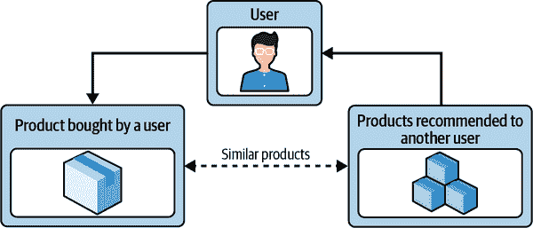

# 第十二章：产品与机器学习的互动方式

随着公司急于利用机器学习能力来满足客户需求，它们渴望利用前沿研究来解决各种业务应用问题。许多产品团队和业务经理，仍然坚守传统软件产品开发方法论，发现自己处于一个新而陌生的领域：构建机器学习产品。

构建你的第一个机器学习产品可能会令人不知所措。这不仅仅是关于如何正确运用机器学习，这本身就已经够难了；更重要的是，将机器学习整合到产品的其余部分（以及企业的其余部分）需要许多需要共同运作的事物。在这些事物中，数据收集实践与治理、数据质量、产品行为的定义、UI/UX 以及业务目标都对基于机器学习的产品或特性的成功起到了贡献作用。

# 不同类型的产品

机器学习的一个重要且有用的特点之一是它可以应用于许多类型的产品中。它可以用于分析应用程序，以推断业务趋势和指标。它可以集成到家电或设备中，以便发货给消费者。复杂的机器学习系统被内置到自动驾驶汽车中，用于检测其他对象并做出驾驶决策。机器学习应用的广泛程度是巨大且不断增长的。由于这些广泛多样的用例，专注于将机器学习整合到现有或新产品中的组织面临着极其陡峭的学习曲线和关于其实施的众多选择。

这一章节不涵盖大多数不同类型的机器学习。特别是，本章无法认真考虑存在的许多常见类型的机器学习产品集成。相反，我们将专注于本书中一直讨论的用例：*yarnit.ai*（我们的电子商务网店）希望集成机器学习。

特别考虑这个用例具有一些良好的方面，并不仅仅因为它延伸了本书中每章都触及的一个例子。*yarnit.ai*的用例集合包括一些后端的（例如，使用浏览和购买日志来预测产品的兴趣），以及许多前端的集成（例如，查找这位客户可能现在对哪些产品感兴趣）。它具有一定的复杂性，但对大多数读者来说并不难以理解。当然，显然它无法成为每个可能系统的合适类比。尽管如此，我们仍希望这里的内容对您有所帮助。

# 敏捷机器学习？

除了某些明确定义的环境外，许多当代软件工程团队已经转向以迭代、专注和短周期循环（称为*sprints*，依据[敏捷宣言](https://agilemanifesto.org)）开发。然而，将敏捷方法应用到机器学习系统远非易事。作为一种方法论，敏捷具有几个基本特征：短反馈循环、以客户为导向的故事或故事点，以及旨在小团队上工作这些故事点的估算。

将机器学习集成到产品中违反了这些假设。反馈循环较长（有时长达数月或数年），并且间接来源于数据而非直接来源于客户。小团队执行效果较差，因为集成通常涉及公司各部门的人员（详见第十三章）。模型开发可能会有任意长的延迟，因为我们需要将模型集成到产品中，并等待结果显示在数据中。此外，我们不能先构建再验证，因为即使是构建阶段也需要基于数据。还有一个最后的、可能是最重要的观点：机器学习模型既不是完全可重现的，也不是随时间稳定的。正如已指出的那样，我们可以多次训练相同的模型但结果不同，或者我们可以保留相同的模型，但世界已经发生了足够的变化，以致我们的价值不再相同。机器学习模型永远不会“完成”，因此机器学习产品集成具有有限的确定性。

尽管敏捷方法可能不太适合机器学习，但采用本章讨论的标准机器学习开发生命周期可以促进您的组织利用机器学习系统来提升客户体验并增加收入。

# 机器学习产品开发阶段

为了在产品开发生命周期中管理不确定性，机器学习项目从一开始就需要高度迭代。机器学习产品开发项目的最重要阶段包括发现与定义、业务目标设定、MVP 构建和验证、模型与产品开发、部署以及支持与维护（参见图 12-1）。

###### 图 12-1\. 机器学习产品开发阶段

## 发现与定义

机器学习产品的开发始终应从*发现和定义*开始。跳过这一步是诱人的，特别是如果你来自先构建后验证的背景，但在机器学习环境中，这一步至关重要，有助于产品团队早期处理不确定性。首先要定义问题空间，并理解和框定业务问题及预期结果。这一过程以将问题映射到解决方案空间结束，这并非总是易事。技术团队寻求量化基准以衡量可行性。另一方面，业务部门在结果不明确的时候，努力实现清晰度，并寻求明确的成本效益分析。在满足利益相关者需求、业务问题框架、定义目标与结果以及与业务建立关系方面，将是关键。

考虑到我们的产品最终设计用于向人类显示结果，没有捷径可以替代传统的用户研究。进行彻底的用户研究，以识别用户的痛点并根据其需求进行优先排序。这有助于建立用户旅程地图，识别关键工作流程和潜在障碍。此外，路线图对于定义需要修改的流程以使机器学习解决方案首次运行非常有用。您可以进行市场规模评估以估算业务潜力。接下来的问题是，我们如何知道机器学习是否能帮助解决我们的用户问题？虽然有许多机器学习应用存在，但在其核心，机器学习最适合做出决策或预测。通常情况下，我们面向人类的机器学习系统在生产中部署时将具有以下一个或多个特征：

复杂的逻辑，难以通过人定义的规则解决

例如，搜索引擎通常有多个排名阶段依次发生，如从文本索引的初始检索，使用文本相似性的主要排名，上下文排名和个性化排名。

大规模个性化

如果问题预计会扩展到数千用户或更多，则可能是机器学习的一个良好应用案例。在*yarnit.ai*网店的例子中，我们预计在三到六个月内将有成千上万的客户利用新的优惠/折扣，这意味着需要支持大量用户群体的个性化。

规则会随时间快速变化

如果规则一般在多年间保持静态不变，启发式解决方案更可取。但是，如果业务的成功依赖于快速适应和规则变更，则机器学习是一个不错的选择。例如，如果网店用户不断撰写产品评论，推荐相关产品的算法需要实时调整，适合机器学习解决方案。

明确的评估指标

例如，我们希望模型提供能够促成销售的推荐。在搜索中，键入“儿童帽子”应该返回与儿童颜色或编织规格针相关的图案和纱线列表，这与帽子相关。

不需要百分之百的准确性

如果可以通过高准确率而不是完美来实现业务成功，机器学习是一个不错的选择。例如，如果用户并不总是想要所提供的内容，推荐系统也不会被认为是有故障的。用户仍然可以有很好的体验，并且机器学习模型可以从销量不佳中学习，在未来提供改进的推荐。

## 业务目标设定

机器学习需求的选择需要仔细结合设计和业务目标。产品经理（PMs）需要理解最终用户和长期的业务目标以推动价值。例如，我们希望改进网店，鼓励客户找到并购买更多他们想要的产品，但我们也真正希望这种情况每次客户返回时都会重复发生。最终，我们通过专注于最终用户并深入理解产品可以解决的特定问题来实现这一点。否则，可能会出现开发一个极其强大的系统，但只解决了一个小（或可能不存在的）问题的风险。

机器学习很少是无错误的，没有防护措施的开发可能会产生严重后果。我们需要承认，出现错误可能会带来巨大的成本，了解犯错的成本是构建机器学习产品的重要部分。例如，假设我们试图在客户因订单错误和/或计费问题而联系支持团队时预测并取消订单。在这种情况下，模型中的错误可能会错误地解释用户的意图为取消订单，从而对用户和公司产生财务后果。另一方面，对于推荐系统来说，在产品详细页面上建议类似产品给没有购买历史的用户，错误推荐的影响可能仅仅是低转化率，也许是对我们的网店不太信任或不太有用的模糊感觉。然后我们必须考虑如何改进模型，但在我们的用例中犯错的后果并不是灾难性的（尽管在许多其他机器学习产品中显然是这样）。

机器学习在很大程度上依赖于概率。因此，模型给出错误输出的可能性总是存在的。产品经理负责预见并认识到错误预测的后果。预见此类后果的一个很好的方法是进行测试，测试，再测试一些。了解模型计算的概率组成部分。我们需要根据机器学习的业务目的来考虑模型的期望精度（和召回率）。

一旦确定了预测错误的所有后果，PM 需要确保定义并构建相关的*安全网*以减轻风险。此外，PM 可能会考虑改变基础产品（更改交互流程、修改输入和输出数据路径等）的方法，以减少不正确预测的可能性。因此，安全网可以是内在的和外在的，它们融入到所有产品中。ML 也不例外。在将 ML 引入产品之前，定义与正在构建的产品相关的安全网和业务绩效指标是至关重要的一步。

内在的安全网

这些指标体现了产品本质上的不可能性。例如，在我们的网店中，如果用户根本没有下订单，就不能取消订单。收到这类用户的电子邮件，没有订单号，主题是“取消订单”，可以被试图学习订单取消原因的模型忽略。但是，建议让客服人员调查这种情况是个好主意。为产品绘制用户旅程图，并确定用户可能经历的状态，是一项有用的活动。这有助于排除不可能的预测。内在的安全网对用户是不可见的。

外在的安全网

外在的安全网对用户是可见的。它们可以采取确认用户意图或双重检查潜在结果的形式。某些消息系统有一个模型，试图检测消息的意图并为其用户建议回复。然而，在大多数情况下，这些系统不会自动假定回复是正确的，并在未经人类确认的情况下发送。更常见的情况是，这些系统要求用户从潜在回复列表中选择。

业务绩效目标

除了我们在第八章中讨论过的一般 ML 模型性能指标之外，对于 PM 来说，清楚地定义业务绩效指标以衡量 ML 系统在生产中的成功非常重要。为了评估业务绩效，必须从产品或功能目标开始。例如，增加收入可能是我们*yarnit.ai*网店的一个很好的业务目标。一旦定义了这个目标，就应指定一个产品指标来评估成功。最好的指标具体可测。具体的指标减少了歧义，增加了关注度。此外，成功衡量起来越容易，我们就越有把握实现最初设定的结果。

这些指标因产品而异。例如，在像*yarnit.ai*这样的电子商务店铺上，跟踪基于 ML 的推荐的一些重要业务指标包括：

点击率（CTR）

从推荐列表中产品页面的浏览次数除以推荐列表上显示的产品总数。例如，在购物车页面上，此指标将有助于确定支持“常一起购买”的 ML 模型的成功程度。

转化率

从推荐列表中添加到购物车事件的数量除以推荐列表上显示的产品总数。例如，在产品详细信息页面上，此指标将有助于确定支持“与类似商品比较”列表的 ML 模型的成功程度。

平均订单价值（AOV）

所有购买事件的订单的平均价值。AOV 等于总收入除以订单数。

推荐者参与的 AOV

包括至少从推荐列表中选择的一个商品的订单的平均价值。这是从推荐者参与的收入除以至少包含一个从推荐列表中选择的商品的订单数量计算出来的。

总收入

所有记录的购买事件的总收入。此值包括运费和税费。

推荐者参与的收入

包括至少从推荐列表中选择的一个目录商品的购买事件的收入。此值包括运费、税费和任何折扣。

此外，电子商务企业通常会追踪更多的业务指标，包括客户获取成本（CAC）、客户生命周期价值（CLV）、客户保留率（CRR）、退款和退货率（RrR），以及虚荣指标，如社交媒体参与度、网站流量和页面浏览量。¹

## MVP 构建与验证

为了确定我们是否可以将 ML 模型整合到我们的产品中，投资 ML 模型可能会很昂贵。我们需要回答两个问题：（1）我们能否制作一个有效（或足够有效）的模型？（2）我们能否以引人注目且有用的方式将该模型整合到我们的产品中？建立具有正确特征和标签的数据集，训练模型，并将其投入生产，这可能需要几周到几个月的时间。我们希望尽早获取有用性的信号，以验证模型是否有效。可以通过仔细的离线评估我们构建的模型来实现这一点，分析我们预期从应用程序中获得的各种常见用例的响应。

为了评估用户交互的效用，最好先模拟该交互，针对一小部分用户。有时，这被称为使用一组固定规则或启发式方法（而没有真实的 ML 模型）来推动“最小可行产品”（MVP），以证明该功能确实能解决客户需求的点。

例如，考虑个性化使用情况，准备好一系列物品让用户根据他们上次选择的内容进行选择。简单的基于规则的引擎通常是进化为更复杂机器学习模型的第一步。以下是一些基于规则的推荐系统的例子：

+   如果用户购买了编织图案，他们可能还需要用于该图案的毛线以及针和其他编织相关用品。

+   如果用户每到秋天天气变冷就购买新的毛线，我们应该在他们所在地的每个秋天向他们推荐。

+   如果用户总是使用信用卡支付，我们将其作为下次的默认支付选项显示出来。

显然不可能编写覆盖每种情况的规则，这时候机器学习可以发挥最好的作用，但是一些简单的基于规则的代理可以在很大程度上验证机器学习方法的结果。关键是测试用户是否积极响应机器学习。尽管这些技术可能不会提供最佳结果，但对于获取信号而言至关重要。早期获取信号可以节省时间和精力，并帮助修正产品的视野和方向。这是确保投入建立机器学习系统的投资回报的最佳机会。

## 模型和产品开发

通过之前阶段制定的明确目标和目标，下一步是构建模型并将其集成到面向客户的特性中。关于此的一般介绍，请参阅第三章和第七章。但总体而言，这是一个与设计、工程、机器学习研究员、业务所有者和产品经理共同努力的过程，产品经理可以通过持续的利益相关者管理带来很大价值。从简单到复杂的构建过程将推动产品通过训练、测试和验证周期；管理与科学家们的站立会议，无论是否取得进展；以及导航设计、科学和工程团队之间的迭代依赖关系。我们在第十三章中讨论了各种团队的角色和责任。

## 部署

在生产部署阶段，机器学习系统被引入基础架构，用于服务实时客户流量，并收集反馈数据，这些数据被馈送到机器学习训练管道以改进模型。反馈循环有助于衡量模型的影响，并能增加对可用性的整体理解。在机器学习系统的背景下，反馈对于模型学习和变得更好也非常重要。我们在第八章中讨论了各种模型服务架构和最佳实践。

反馈循环是重要的数据收集机制，产生可直接插入学习机制的标记数据集。在我们的 *yarnit.ai* 网店示例中，反馈循环可能会相当简单——客人是否点击了推荐，并且是否购买了这个推荐？

将产品推向生产环境应该与在控制范围内观察业务指标（本章前面讨论过）紧密联系，以了解影响并做出增加推广或关闭推广并调查意外结果的决策。特别是，一个挑战是，大公司中的具体倡议或项目最终包含了建立机器学习模型的日常工作，这些倡议与更高层次的业务目标可能存在许多层次的分离。个性化是一个很好的例子：在高层次上，个性化可能涉及增加像每用户平均收入或增加新用户获取增长这样的指标。但是当一个模型被开发时，它很可能会被优化以改善各种低级用户体验指标，比如参与度分数。

产品经理在这两个领域之间充当翻译者的关键角色，并不断努力改进用户可观察性方法，这些方法可以帮助将低级别改进与高层次影响假设相连接。因此，对产品团队而言，有一个逐步部署机器学习系统的计划非常重要。我们在第五章中讨论了各种模型评估方法。

## 支持与维护

设计用于整合到产品中的机器学习系统在其首个发布版本上并不完整。可以说，它们永远不会完整，因为它们试图对世界的状态建模，并在产品中提供关于世界状态的有用价值。虽然开发和部署机器学习系统可能相对廉价，但随着时间的推移，维护它们可能比通常假定的更难以及更昂贵。²

组织如果真的认真将机器学习整合到其产品中，就需要认真对待维护这些机器学习模型及产生它们的基础设施。这至少部分解释了为什么敏捷方法不太适合机器学习产品的整合：它们从未真正完成，或者说它们永远不会完成。随着我们产品的变化、客户需求的变化、我们对业务的理解以及世界的变化，我们将需要不断开发和发布模型。

机器学习系统的一个特点是，通常不清楚团队正在进行的工作是“维护”还是“开发”，因此依赖于它们之间清晰分离的发展工作概念很难应用。

# 自建与购买

在这一部分中，我们需要仔细界定是否建立或购买的问题。模型是归数据和基础设施拥有的组织所属的。一般来说，模型必须来自于您自己数据的学习。[³] 但是，我们用来创建模型的工具和基础设施则是另一回事。ML 领域提供了大量的工具，包括开源和商业工具。建造与购买的决定通常是在成本、风险、定制、长期资源可用性、知识产权（IP）和供应商锁定等方面进行权衡。然而，在 ML 时代，我们有更多维度来考虑这个传统问题，包括制造或购买模型、数据处理基础设施/工具以及将所有这些内容保持在一体的端到端平台。在决定什么对企业最好时，这里有一些要考虑的因素。

## 模型

正如我们所述，模型通常是本地的，不容易在我们自己的组织之外获取。尽管如此，许多行业特定的 ML 模型和应用程序是可用的。供应商提供的解决方案可能会带来显著的节省时间和精力的潜力，但下面讨论的评估模型建造与购买的关键方面。

### 通用用例

购买预构建解决方案需要我们的组织目前使用的数据和流程与预期的输入/输出和行为高度兼容。如果一个用例的细节、数据或流程相对于组织而言是相当特定的，那么调整内部系统和流程以匹配供应商提供的解决方案的规格可能会抵消购买现成产品的好处。如果打包解决方案真正通用，它可以提供巨大的好处。简单阅读本段可能会听起来好像这种情况比较少见：是否存在一个通用模型，它能够在不需要在我们的数据上重新训练或扩展的情况下做到我们需要的功能？

随着 ML 服务提供商的增加，这里的机会正在变得越来越好。考虑一些非常有用但真正通用的用例：

图像中的物体识别

告诉我图片里有什么。

多语言文本转语音和语音转文本

与用户进行口头交互。

情感分析

告诉我一组文本对其主题的积极或消极程度。

在所有这些例子中，预训练模型可以在大量用例中表现良好，包括我们在 YarnIt 的用例。在这些情况下，我们可能完全可以跳过训练模型的步骤。

### 公司的数据倡议

在部署特定 ML 用例方面所做的工作的好处远远超出了该用例本身。通常情况下，第一个用例是全面数据倡议的开始。因此，ML 模型和/或应用程序的建设或购买决策也应考虑公司的数据策略：有时获取专业知识和技术本身就是真正的目标。

## 数据处理基础设施

数据处理和基础设施工具与技术已经发展，并且仍在以极快的速度不断发展。传统供应商、开源和基于云的解决方案在数据基础设施、处理和存储堆栈的每个环节上都在竞争。建立或购买的含义略有不同，并且通常更侧重于如下责任的委派：

支持和/或维护

通常是全开源的，与独立第三方软件供应商相对比

运营

云与本地

可访问性

打包的云工具与原生云工具

在数据处理基础设施方面，主要的决策因素不再是关于使用案例，而是关于内部可用的技能和供应商锁定风险因素。商业和开源平台各有其利弊。

在 ML 领域，许多商业平台是新的，并来自新提供商，缺乏任何长期的记录或历史。因此，它们可能提供了重大的机会，但也存在重大的风险。

另一方面，无论是用于 ML 还是通用软件的开源解决方案，可能被广泛采纳，在许多情况下比某些商业解决方案有更长的历史记录。但它们也有缺点。特别是它们可能具有较慢的发布周期，但更重要的是，它们很少为问题提供完整的解决方案。开源 ML 解决方案通常是更广泛背景下的优秀点解决方案，但仍然需要我们做必要的工作来将它们集成到我们的环境中，并组装一个完整的解决方案。

## End-to-End 平台

在当前成熟度状态下，基本上没有提供从数据开始到在服务系统中可用模型的相对完整集成解决方案的 ML 平台。这并不一定是一个巨大的问题。模型、数据处理基础设施、人力资源和业务价值在不同的方式和速度下都在发展。将所有东西协调在一起，以确保 ML 的可持续成功，需要大量的努力。但同样，在这里，决策因素是不同的，现在基于组织数据方法的基本原则：

长期或一次性数据倡议

ML 工具和技术正在不断发展，创新的速度没有减缓的迹象。这带来了一个严重的问题，类似于我们在其他情境中看到的问题：技术投资必须有时间去回报。如果一个平台的效用在我们完成实施成本之前就消失了，我们可能会意识到我们犯了一个错误。虽然在分布式计算或数据存储平台中有时会有这种显著关注，但在 ML 领域尤为困难，因为工具和技术可能在适当实施它们的时间内就已经过时了。⁴ 如果该倡议意图是长期的，那么获得一个能够适应快速发展的数据技术的完整平台可能是相关的，而对于短期倡议，可能可以基于今天的组件进行组装。

数据倡议的预期规模

在小规模 ML 项目中，不需要过多的整体连贯性或一致性，这导致更自然的“构建”场景。如果更广泛的愿景是扩展数据以增强组织活动的重要部分，那么需要包含许多技能和公司流程来成功执行该愿景。在这种情况下，购买方法可能更相关。

例如，商业 ML 平台不仅允许团队完成一次完整的数据项目，还在各个方面引入效率来实现规模化。其中包括以下功能：

+   节省清洗数据和执行数据处理流程中不提供直接业务价值的其他部分的时间

+   在每天部署模型时，平滑生产问题并避免重复发明轮子

+   改善文档和可再现性，以便更轻松地符合一些监管要求

## 决策制定的评分方法

一旦我们明确了要解决的问题，并且我们需要 ML 来解决这个问题，至少我们需要考虑以下每个因素来评估构建或购买 ML 是否是正确选择：

对齐

产品或技术是否很好地满足我们的需求？我们的目标是否实现了？是否需要定制？是否满足数据隐私和安全要求？

投资

是否必须实现特定的净现值（NPV）或投资回报率（ROI）？总体拥有成本包括人力资本、软件和硬件是多少？

时间

我们能多快开发并部署解决方案到生产环境中？

竞争优势

技术是否提供了专有的资产或 IP？这个 IP 是否为客户、员工和投资者提供了增加的价值？

维护和支持

人力资源、硬件和软件支持的工作量和成本是多少？

我们可以根据这些因素的权重来决定我们的平台的哪些部分是应该构建还是购买的。

## 做出决策

无论是自建还是购买，将 ML 技术作为关键业务工具的决策是一个战略性决定，不应轻率或在所有支持因素未就位的情况下做出。重要的是仔细评估决策将如何影响公司的长期目标和路线图。

此外，不要忘记与主要利益相关者会面，审查决策标准并确定利弊。我们在第十三章和第十四章详细讨论了各个团队和关键利益相关者的角色和责任。包括领导层、产品和销售团队以获取有效变更管理的共识和反馈至关重要。最后，与各种供应商交谈，权衡各种选择。与他们坦诚相待，获取他们对您选择和情况的诚实意见。我们可以通过任何一条路径实现结果，但需要利用先前发现步骤的结果来帮助为组织的独特需求做出正确的解决方案。

# 由 ML 提供支持的样例 YarnIt 商店特性

机器学习（ML）可以在像*yarnit.ai*这样的网络商店中用来实现各种业务目标。 ML 可以通过提高转化率和平均订单价值来增加收入，可以提高利润率，甚至可以提高客户忠诚度。今天的消费者不想被视为众多顾客中的一个。他们更喜欢高度个性化的体验。产品推荐是一个许多特性可以由 ML 模型驱动的领域。就像人类了解某人然后能够选择最适合他们的生日礼物一样，ML 模型可以利用包括产品目录、搜索查询、浏览历史、过去的购买、放入购物车的商品、社交媒体上推荐的产品、位置、客户段/买家人物等数据。以下是一些示例推荐用例。

## 展示总销量最高的毛线

这种非个性化的技术不是基于用户的个人选择，而是基于集体偏好。推荐可能根据以下标准在主页上显示：

+   购买的毛线或图案数量（例如，在假期季节发布新图案时，所有人都赶去购买）。

+   顾客在查看特定类型的毛线或图案上花费的时间。

+   用户所在国家或地区的浏览次数和购买次数。在多个国家或地区运营网络商店时，通常需要考虑文化或季节因素。

在这个例子中，虽然我们可能并没有真正个性化客户的体验，但是展示每个类别（线的类型、图案、品牌等）的热门商品可以定位首次使用者，这些使用者尚无账户历史记录（即所谓的*冷启动问题*）。这显然有利于仅依赖经过时间验证的数据库技术，这些技术比机器学习更为普遍和可靠。

## 基于浏览历史的推荐

正如其名称所示，用户将根据他们已经查看过的产品获取新的产品建议。例如，如果用户正在搜索和浏览“羊毛线”，我们可以展示由专门生产羊毛线和图案的热门品牌制作的产品。

## 交叉销售和提升销售

大多数现代网店都有一些基础设施设计用于*交叉销售*和*提升销售*。这两者都旨在帮助用户选择可能的最佳商品，同时即使我们正在向新客户销售，也可以增加收入。例如，当客户在产品页面搜索“婴儿线”时，展示交叉销售建议，如“使用这种线的图案”和/或“流行的婴儿服装”，不仅有助于提高平均订单价值，还可以为客户节省时间。类似地，展示大尺寸或捆绑销售的特别折扣可能有助于客户节省费用，同时增加我们业务的收入。

## 基于内容的过滤

利用产品的元数据来推动推荐。元数据的准确性将对这类推荐的质量产生更大的影响。

例如，如图 12-2 所示，许多网店在产品详细页面或结账前后都有“类似产品”功能。在我们的*yarnit.ai*网店中，如果我们的用户总是购买来自品牌“xyz”的“红色”和“蓝色”棉线，我们可以考虑在推荐的商品中，推荐来自另一个品牌“abc”的相同颜色和类型的棉线，前提是这些推荐的商品也具有相似的质量评级，并且“abc”正在举行特卖活动。

###### 图 12-2\. 带有“类似产品”功能的基于内容的推荐

## 协同过滤

*协同过滤*可能被认为是所有产品推荐方法中最流行的。这种技术仅依赖其他用户如何积极与产品互动（查看、购买或对购买的积极评价）。这种方法源于这样一个想法，即过去喜欢相似事物的人们未来可能也会喜欢同样的东西。此外，它信任真实的人们所做出的选择，而不仅仅是简单的评级，后者可能只是估算的猜测。

例如，如图 12-3 所示，用户 A 和用户 B 在其浏览和购买历史以及网店产品反馈方面具有相似的用户画像。利用这些相似性，当用户 B 在“毯子纱线”产品详情页面时，我们可以展示用户 A 购买的“标记”和“针织针”等工具和配件，这些配件与同款“毯子纱线”产品一同展示。因为两位用户具有相似的喜好/用户画像，向他们展示上下文相关的推荐内容不仅可以提升用户体验，还可以增加升级销售的机会，直接影响业务的整体收入。

大多数主要的网店都同时使用协同过滤和基于内容的过滤技术来提高个性化推荐的准确性。为了评估推荐模型是否有效，我们可以通过进行简单的[A/B 测试](https://oreil.ly/13N37)，从几个预测和假设开始，比如“这种算法将提高*x*%的参与度和/或转化率”（多变量测试也是一种选择）。每种替代方案都将基于不同的推荐技术。

###### 图 12-3\. 使用协同过滤的产品推荐

# 结论

要使机器学习项目产生巨大的业务影响，产品经理和业务所有者需要在每个阶段都专注于提出正确的问题。团队不应直接深入技术细节和机器学习实施，而是必须确保他们尽可能具体地理解业务问题和目标。这需要与利益相关者进行沟通，并将需求转化为技术需求。一旦明确了业务目标，我们必须首先评估是否真正需要机器学习来实现这些目标。如果机器学习是解决方案，接下来需要回答的下一个问题是，我们是否应该与外部服务提供商提供的现有解决方案集成（购买），还是投资于自建机器学习系统（构建）。无论哪种情况，都需要大量的计划和协调来将机器学习解决方案整合到面向客户的产品中。

明确定义业务目标和可衡量的产品指标，选择适当的成功衡量标准，以及迭代部署解决方案，是构建优秀机器学习产品的重要步骤之一。但是，机器学习还有许多其他要求，其中许多与传统软件应用开发的要求不同。成功在于高度意识到机器学习给您带来的新情况，同时清楚地了解哪些是真正对业务有利的，并朝着这个目标努力——尽管可能会经历坎坷的道路。

¹ 了解更多关于电子商务业务指标的信息，请参阅 Anastasia Stefanuk 的[“7 个电子商务指标帮助您衡量业务成功”](https://learn.g2.com/e-commerce-metrics)。

² 为了突出强调，这段话可能有些言过其实。尽管功能完整的机器学习产品需要持续维护，而且需要比类似的非机器学习项目更多的维护工作，但仍然可以肯定大部分工作发生在项目的前半段。随着模型的成熟（也许是所模拟的行为或情况也稳定下来），一些组织会达到稳态，因为进一步投资于模型改进的回报递减。

³ 一个例外是迁移学习，通过这种方式我们可以从外部提供者那里获得一个通用模型（比如用于图像识别的模型），然后在我们自己的数据上进行训练。但即使如此，最终的模型仍然属于我们自己。

⁴ 这里有些微妙的差别。算法确实变化很快（通常每年一次），因为新的方法被尝试并被发现在某些类型的问题上更成功。一些机器学习平台，如 TensorFlow 和 PyTorch 尤为突出，已经维护了相当长的时间（分别从 2015 年和 2016 年起）。然而，即使在这段时间内，它们也发生了显著变化，并且出现了其他可能更有效解决相同问题的机器学习平台。因此，即使是最稳定的机器学习平台和工具也只能在适度的时间内保持稳定。
