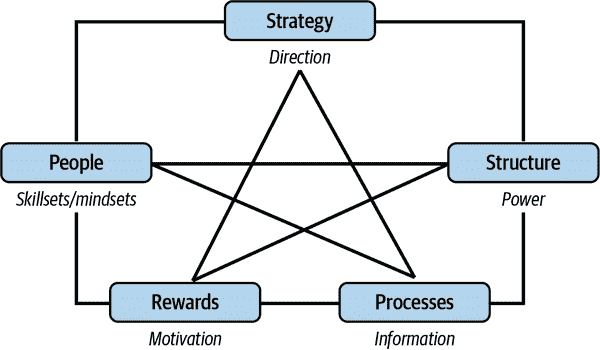

# 第十三章：将机器学习整合到您的组织中

将任何重要的新学科整合到组织中，往往看起来更像是一种不规则园艺的练习：你随意撒播种子，不管土壤是否肥沃，然后定期回来看看哪些得以茁壮生长。你可能会幸运地在春天看到五颜六色的景象，但如果缺乏更多结构和纪律，你更可能会面对一片贫瘠。

由于各种*普遍*原因，正确进行组织变革是如此困难。首先，关于如何改变组织和文化的材料几乎是无穷无尽的。甚至从这些众多选择中做出决策都是一件令人望而生畏的事情，更不用说如何最好地实施所选择的方案了。

然而，在机器学习的情况下，我们有一些*领域特定*的理由证明这一点是真实的，并且可以说这些理由更为相关。正如迅速变成陈词滥调的是，机器学习在根本上与*数据*的性质和表达紧密耦合。因此，在您的组织中任何存在数据的地方，都可能与机器学习相关。即使试图列举出业务中所有涉及或处理数据的领域也有助于证明这一点——数据无处不在，而机器学习也是如此。因此，机器学习不仅仅是一种神秘的、孤立的事物，可以与其他开发活动分离开来。要使机器学习成功，*领导者需要全面了解正在发生的事情，并有影响其各个层面做法的方式。*

关于这种情况特别令人沮丧和反直觉的是，几乎每种变革管理方法都建议从小处开始，以管理一次性做太多的风险。尽管在大多数情况下这是非常明智的，而且您的第一个临时实验通常可以在没有太多开销的情况下完成，但小型试点的成功并不能保证在更大规模上机器学习的实施会顺利进行。在大多数组织中避免孤立化已经足够困难，但对于机器学习来说尤为重要。

然而，还有一个好消息：从实际上讲，从小处开始，发展一个成功的试点，并确保正确处理机器学习的机遇和风险是完全可行的。但你必须有意识地去做，这就是为什么我们应该首先讨论我们的框架和假设。

# 章节假设

我们在起草本章时，有几个假设前提需要在开始前明确。每个假设都在本节中有详细说明。

## 基于领导者的观点

我们的第一个假设——可能已经很明显了——是本章和第十四章均直接面向组织领导者撰写。虽然对数据科学家、机器学习工程师、SRE（可靠性工程师）等也有相关性，但本章主要针对负责其组织健康、结构和结果的人员，从团队（两个或更多人）到业务单元或公司（数百或数千人）的规模。

## 细节至关重要

一般来说，组织领导者不会深入参与*任何* 变革项目的详细实施和管理，除非在有强烈需求的情况下。机器学习需要有所不同。根据前述假设，由于良好的机器学习实施涉及理解其工作原理、数据的使用方式、什么被视为数据等原则，领导者在做出决策前需要了解这些内容才能做出明智的决策。

我们的主要观察是，默认情况下，领导者不会在他们的日常管理活动中获取与机器学习相关的知识，因此需要有一个明确的机制来实现这一点。这与大部分传统管理理论相反，后者认为大多数团队可以通过少量代表性关键绩效指标和对团队动态的深刻理解来有效管理。目前我们认为机器学习足够复杂、新颖且具有潜在影响力，因此了解其细节至关重要——尽管随着时间的推移我们预计这种情况会发生改变。（1）然而，目前领导者需要了解机器学习的基础知识，并能接触从业者，这反过来将帮助他们评估成功的可能性，并使结果更好。

除了培训项目之外，我们建议要实现这种理解水平的主要方法是，机器学习不应被孤立，无论是作为独立的技术驱动型努力，还是以其他方式。考虑到它可以触及一切，强大的孤立化将颠倒信息和控制的流向，并可能引入重大的风险管理问题。机器学习本质上是一种横向活动。

## 机器学习需要了解业务

我们的第三个假设是，*业务* 的复杂性直接影响了机器学习的构思和实施方式。这不仅仅是将机器学习从业者纳入关于目标和绩效的部门通报中——它要比这更广泛和全面。机器学习从业者需要比普通产品开发人员更加关注广泛的业务层面的问题和状态。

通过几个例子可以更清楚地说明这一点：

例子 1

YarnIt 的一位机器学习开发人员希望在业务销售部分产生业务影响。他们致力于建立一个模型，识别在销售方面表现不佳的产品。该模型在特定情境中推荐这些产品，以增加它们的销售。这样的模型可能会以多种方式取得成功。它可能会为这些产品识别新的购买者，或者只是提醒曾经购买这些产品的人可能再次购买它们。

但是在我们的情况下，现在出现了一个问题：它设法找到了羊绒纱线，这是 YarnIt 库存非常低的高档商品。由于这种模型没有（不能有效地表示或理解）利润或库存的功能，它设法全部售出。羊绒纱线在行业内供应短缺，更换将需要数周，甚至数月的时间。虽然很少有顾客大量购买这种纱线，但他们中的许多人偶尔会在较大的订单中购买少量。电子商务中有时会出现的另一种影响是，当网店没有特定商品库存时，顾客有时会将他们的整个订单转移到其他地方——YarnIt 也遇到了这种情况。因此，现在 YarnIt 因为缺货而在*其他*产品上失去了销售额。

示例 2

另一个案例揭示了跨组织的隐私和合规问题。推荐和发现团队训练模型，以帮助顾客充分利用*yarnit.ai*网站并帮助 YarnIt 从顾客那里赚取更多的钱。模型使用的特性包括顾客访问网站时使用的浏览器信息，因此团队只使用浏览器提供的`User-Agent`字符串的有限信息——足以确定浏览器和平台。

与此同时，网页设计团队一直在研究新的互动方式，并希望更好地了解顾客使用的浏览器配置。为了获取所需的所有信息，团队决定，*未经*与机器学习专家讨论，只是记录和跟踪完整的浏览器信息。结果，建模团队开始在模型中使用完整的浏览器`User-Agent`，却不知情。

问题在于`User-Agent`的完整内容加上位置信息（模型也有）通常能唯一识别一个人。因此，我们现在有了一个能够针对个人进行定位的模型。这违反了 YarnIt 的某些隐私治理政策以及其所运营国家的合规要求，对整个组织构成了严重的风险。

在这两种情况下，个别团队在他们的上下文中并没有做错什么。但是，基于对其选择对其他团队影响的不完全信息的行动导致了不良结果。因此，领导者需要意识到机器学习在他们的组织中的功能，这样他们就能提供关键的协调和广泛的监督，否则这些都会缺失。真正的问题是如何最好地提供这些支持。

这里有一种结构化的思考方式：你需要能够集中机器学习工作中最重要的监督和控制部分，解放出那些领域特定关注点最重要的部分，并提供一个*整合点*，在这个点上，工作流可以汇聚。正是在这个整合点上，监督、引导和沟通应该发生。

大多数组织已经有一些地方可以进行跨部门对话是一个好消息。如果你很幸运的话，这些对话会在（例如）产品管理中自然而然地进行，那里的客户生命周期管理是一种正常的关注事项。如果无法融入现有的会议、工作流或某种场所，你就必须创建一个新的。但是，无论如何实施，你都需要进行这种类型的对话。

## 你做出的最重要的假设

我们的材料是基于所有前述的假设。然而，你的组织变革努力也有假设——甚至，或者尤其是，如果你认为没有的话——这些假设与你非常接近，因此最终可能决定你的机器学习努力的成功。

最重要的问题之一，在你开始机器学习之旅之前深入研究的，是与你的机器学习项目目标密切相关的问题。这是你假设机器学习可以为你做些什么。

## 机器学习的价值

机器学习对你的业务能做的不仅仅是让你赚更多钱²。实施机器学习可以意味着你可以改善公民参与、为灾难救援筹集更多资金，或找出哪些桥梁最急需维护³。但对于业务领导者来说，通常意味着通过自动化降低成本，使顾客更加满意（而满意的顾客通常会为企业带来更多收益），或者增加收入。

例如，让我们回顾一下 YarnIt。几年前，CEO 开始听说机器学习。最初关于如何利用机器学习的想法包括以下内容：

+   根据一个模型，网站的搜索结果能够根据一个给定客户（或者如果他们没有登录的话，是一个网站会话所有者）的先前行为和兴趣，预测他们可能购买的产品。

+   帮助客户发现新产品，包括将首页的大部分空间用于那些由专门设计用途的模型选出的产品。

+   管理库存。ML 可以对供应链约束和库存水平进行建模，并为产品提出最佳的重新订购建议，以确保 YarnIt 拥有适当混合的产品库存，考虑财务、销售、存储和供应约束。

+   通过将产品和订单利润作为其他模型的特征，来提升盈利能力。

请注意，这些想法有不同的时间尺度和不同级别的组织侵入性。其中一些可以轻松添加到已有的工作和方式中。改变搜索结果的排名可能会对客户满意度和销售产生可测量的影响，但可以相对较快地完成（几周或几个月，而不是几个季度或几年），并且不需要广泛的组织参与来实施。改变库存和供应链工作的方式将需要更长的时间，并且需要其他部门的广泛参与。如果做得好，它有可能真正改变 YarnIt 作为公司的整体效率，也许类似于即时供应链。但这不是一项可以由 ML 工程师主导的变革。

即使面对这些实施挑战，组织领导者通常对 ML 的价值都有广泛的认同。事实上，ML 有潜力根据组织已经收集的数据实现额外的价值。这是一种真正可以改变组织功能方式的一代技术变革——因此，有必要仔细审视 ML 对你能做什么，找出你想实现的那部分，然后在开始之前把这些都写下来。

# 重要的组织风险

假设你已经评估了 ML 对你有什么作用，决定了它将采取的具体形式，写下了你的假设，并且迫不及待地盼望着这些美好变化会带来你名利双收。显而易见的问题是，“接下来怎么办？”不幸的是，在我们开始之前，理解风险和价值同样重要。否则，你将无法做出一个基于权衡的决策。

## ML 不是魔法

尽管大多数业务领导对 ML 的价值和潜力有所认识，但他们不一定同样了解风险。因此，有时会出现一种领导层的视角，几乎将 ML 从业者视为可以实现奇迹般成就的人。然而，至少在领导层，没有人理解 ML 的作用方式和原理。通过误解 ML 的范围和机制，领导层也忽视了这些项目对整个组织影响的范围。在这种情况下，最大的危险是风险变得看不见，或者有效地变成外部性问题——换句话说，成为了别人的问题。这是导致不可避免的，尽管可能是任意延迟的灾难的配方。

## 心理（思维方式）模型的惯性

改变组织工作方式从未是一个简单的建议，关于这个话题已经写了成千上万页。在这里，我们限于说，实施机器学习就像任何其他变化一样，需要干系人管理和获得那些受影响者的支持，但与其他变化不同的是，涉及的干系人总数可能要大得多。

因此，问题的某些组成部分，如涉及干系人数量（例如，确定需要参与的人的纯物流问题）的部分显然会变得更大。然而，更重要的是，涉及说服、沟通，特别是理解人们*模型化*变化方式的任何组成部分，在重要性上也显著增加。

在推动重大变革时，仅仅出现在所有会议上，并携带涉及高级领导的谈话要点，很少能奏效。你不会仅基于高级领导的视角对情况进行表征来说服人们改变他们的行为。特别是，关键问题是*心态*，以及整个组织中领导者和从业者所使用的*心理模型*，用来表征发生的事情及如何对其做出反应。如果计划假设每个人都会转向理解事物的方式，就像你（或某个特定个体）那样，那么这个计划可能会很短命。

但有时，新的做事方式确实是对特定情况做出反应的正确方式。如果*是*继续进行的正确方式，但心理模型没有改变，你作为变革者必须承担说服的负担。为了最有效，这种说服必须伴随着一种或一组动机，并且这些动机必须与听众的心理模型相契合。例如，也许听众认为通过花费精力使他们团队的数据对他人可读没有真正获益；或者他们害怕被显示比其他团队更差；或者他们深信唯一重要的事情是尽快将产品功能推向公众，而花费精力在其他任何事情上都不重要。无论哪种方式，你的变革建议都需要征求、理解和解决你听众的心理模型。

最终，对于大多数实际问题来说，实施机器学习需要认真的干系人管理和大规模的努力来转变心理（思维方式）模型。

## 在不同文化中正确表达风险

显然，如果领导层明确了收益，但风险却看不见，这将导致风险管理以临时的、资金不足的方式进行，甚至可能故意不进行。这些风险甚至可能被误传，特别是在负面取向的文化中。在软件工程组织的背景下，可能有必要审查 Ron Westrum 博士建议的组织类型学，以更详细地了解这种情况的影响。⁴

如果我们稍微简化一下，Westrum 建议可以广泛将组织分为以权力为导向、以规则为导向或以绩效为导向。其中，唯一一种在实施机器学习时会遇到*结构性*问题的组织文化是以规则为导向、官僚化的文化。为什么？一方面，*以权力为导向* 的组织倾向于压制新颖性，因此在任何严肃的方式上很少会自行实施机器学习。另一方面，*以绩效为导向* 的文化对新颖性、合作、沟通和风险共享持开放态度。这些环境很可能容忍成功实施机器学习所需的开放协调方式。

相反，*以规则为导向* 的组织容忍新颖性，但对出错的人进行惩罚。失败会对那些被视为失败者的人产生负面后果，组织的责任范围狭窄（并且得到充分的保护），协调性很小。在这些组织中，我们预计机器学习可能会找到立足之地，但一旦出现问题或变得困难，责任在于的人将受到惩罚，创新很快就会停止。不幸的是，这种行为使得充分建模和响应伴随机器学习而来的横切风险变得非常困难；可能会造成重大损失。

## 孤立团队无法解决所有问题

另一个常见的风险是将机器学习团队和项目等同于对待其他新工作类型的方式，一种常见的本能反应是成立一个新的孤立团队来完成这项工作，从而导致其在组织中的分离。这是减少启动摩擦以便构建并展示结果的常见方法。然而，这对机器学习来说却带来问题，因为要实施它通常需要多个部门或部门的帮助。更重要的是，由于机器学习项目可能产生广泛的影响范围，成功部署机器学习需要组织变革来支持结构、流程和保持可靠所需的人员。肯定有可能将范围过于狭窄以致失败。

# 实施模型

讨论了将机器学习引入组织中可能涉及的一些风险后，让我们集中于实际操作的要点——如何真正完成这项工作。

一个小的实施项目可能从将机器学习应用于对您组织成功至关重要的内容开始。这涉及创建和整理数据源，组建具有问题空间和机器学习方面正确专业知识的团队，并制定您需要跟踪进展并引导项目的水平调控机制。在整个过程中，保持幸福的乐观主义可能是有利的，当您知道麻烦迟早会找上门时——尽管您不知道具体是何时或是什么形式。

首先选择一种度量指标：理想情况下，它将是系统中*有用*但不是*关键*的内容。这样，您可以从实施中获得宝贵的经验，工作将涉及组装您未来扩展所需的团队之间的交叉连接，但如果事情搞砸了，重大灾难的可能性将降低。

让我们以 YarnIt 为例。实施团队可能会考虑几种选择。使用机器学习来帮助搜索排名是一个有吸引力的起点。但团队注意到，直接来自搜索结果页面的销售额代表了显著的收入。这使得这个地方最终应用机器学习变得有吸引力，但开始时风险较大。在寻找站点的其他部分并看到它们都与收入敏感或收入关键相关后，团队采取了不同的方法：如果我们在目前没有任何内容的地方添加由机器学习生成的结果会怎么样？团队成员查看*yarnit.ai*网站，注意到有几个页面没有向最终用户显示推荐内容，但却可以这样做。他们决定在用户将商品添加到购物车时看到的确认页面上添加推荐产品——或者换句话说，我们利用用户展示对某个产品感兴趣的那一刻，来推荐其他产品。

这是一个很好的开始地方：纯粹的增加，风险低，并且至少有合理回报的可能性。购买意图已经存在，并且这种改变对现有客户工作流程的影响不是太大。因此，团队采用“购买*X*的人也购买*Y*”模型，并决定通过收集推荐产品的点击率并将其与搜索结果的点击率进行比较来衡量它。当然，一旦团队了解更多如何做到这一点的方法，另一个可能的选择是采用结合可实现性和预期收益的更传统方法，而不是专注于最小化干预风险。

## 记住目标

虽然保持灵活性很重要，尤其是在执行过程中，我们也必须记住目标——通过实验机器学习来建立组织的能力。希望你能达到所选的业务度量改进，但即使不成功，项目仍然可以总体成功：你仍然可以学到很多，并尝试另一种方法，如果事情不顺利的话。

但重要的是要在不被途中遇到的事物分散注意力和不过于坚持先前决定的细微界限之间行走。

###### 小贴士

记下你的战略目标及其背景，在解决战术问题或处理事故时可以帮助你回顾。

## 绿地与褐地

当你在组织中启动一套新的活动时，经常出现的一个基本问题是你是从零开始做（也称为*绿地*），还是有一个现有的系统、团队或业务流程来处理（也称为*褐地*）。在实践中，几乎所有的实施都是褐地，因为大多数组织通过改进他们已经拥有的系统获得最大的价值。总体而言，尽管极大地简化，转型项目在绿地情况下进行得更顺利，或者可以尽可能地使其成为绿地情况，这一点非常重要。

一种常见的直觉是，在已经存在并（在某种程度上）运行良好的基础上构建东西更容易。但事实上，新倡议成功的关键指标是它引起多少反对。反对通常更常见于褐地情况下，在这种情况下，别人的职业成功往往取决于什么都不改变。

正因如此，大多数预期会遇到重大反对的实施项目通常会尝试启动一个涵盖以前未涵盖职责的新团队或职能。我们的观点是，由于机器学习的强大相互连接性，期望相对孤立地继续进行是不现实的。最终——而且可能比你想象的更早——你将会与其他需要征求许可的人交谈。

我们在此提供的最佳指导意见，正如以往所述，是从一个有意义的度量开始，因为这是最容易讲述的故事——成功的转变几乎总是需要一个好的故事。然后利用这一点来确定你的项目需要多少是“绿地”还是“褐地”，同时要承认大多数事情都是褐地。

## 机器学习角色与责任

做好机器学习工作涉及到一系列技能、关注领域和业务问题。我们发现一个有用的知识结构方式是始终考虑组织内数据的流动。例如：

业务分析师或业务经理

这些角色负责特定业务线的运营及其财务结果。他们拥有使机器学习成功所需的数据和愿望，但如果情况不好，他们的工作能力将因错误信息而受到影响。

产品经理

这些角色为产品设定方向，并决定如何将机器学习整合到现有产品中。他们帮助我们决定数据的用途。还可能有专门的机器学习产品经理指导我们要实现的内容。

数据工程师或数据科学家

这些人了解如何提取、策划、管理和追踪数据，以及如何从中提取价值。

机器学习工程师

他们构建和管理模型及其生成系统。

产品工程师

他们开发我们试图通过机器学习改进的产品。他们帮助我们理解如何将机器学习应用到产品中。

用于机器学习的 SRE 或 MLOps 工作人员

他们主导部署机器学习模型的整体可靠性和安全性。他们改进现有的构建和部署模型流程，提出和管理跟踪我们随时间推移表现的指标，并开发新的软件基础设施来确保模型的可靠性。这些角色围绕整个过程，是少数几个从端到端看待流程的工程师之一。

在较小的组织中，每个角色可能与其他角色结合起来。它们是需要考虑填补的功能。

## 如何招聘机器学习人才

目前招聘有才华的机器学习员工很困难，并且在可预见的未来可能会继续困难。机器学习技能需求的增长远远超过了受过教育和有经验的员工的供应。这影响到所有雇主，但是最负盛名的机器学习公司（通常是大型科技组织）继续雇佣大部分新毕业生和有经验的员工。这使其他组织处境困难。

在这种情况下通常的建议包括尝试在周期的早期找到潜在的合格候选人，确保招聘过程的运作一般上是良好的，定期与候选人沟通，向候选人推销该公司的优势等等。虽然所有这些都是正确的、有用的、需要努力的，并且可能对你有用，但它们都是标准的方法。如果市场特别火爆，即使做所有这些也*可能*不奏效。

我们建议另一种方法。将问题重新框架化为在那些确实需要立即具备机器学习知识和经验的员工之间分配人员，以及那些可以在工作中学习的员工之间分配人员。大多数情况，特别是初创企业项目，只需要一两位经验丰富的机器学习研究人员或实践者。这些经验丰富的员工可以帮助设计模型以满足组织的目标，并且还可以指定需要构建和部署这些模型的系统。但是需要管理数据、将机器学习整合到产品中并维护生产中的模型的员工，可以是在其他方面有才能但在工作中深入学习机器学习的人员。（您甚至可以购买类似的书籍来帮助这些员工更快地提升水平！）

因此，分割了问题之后，我们仍然需要问，大多数组织如何能够雇佣那些最初的有经验的机器学习研究人员和工程师来启动这个过程。标准的做法包括雇佣有经验的公司的承包商或顾问，支付愿意教授的真正有经验和证书的超级明星，以及押注于初出茅庐的新星，同时要理解这条路会很不平坦。当您的组织希望进行机器学习但没有声望或资金与更大公司竞争时，这些都是实际的选择。

现在，我们已经考虑了组织在专门适应机器学习方面面临的一些具体挑战，让我们退后一步，从传统组织设计的角度来考虑这个问题。

# 组织设计与激励

使组织有效运作，根据其应该完成的任务——通常称为*组织设计*——是一门艰难的艺术，涉及战略、结构和流程的混合。对领导者来说，关键点在于报告结构通常是成功的组织设计中最不重要的部分。其他更为强大的方面和决定因素影响行为。

在我们进一步深入之前，值得注意的是，组织设计是一个技术性和常常充斥术语的主题。对于一些领导者，特别是在较小的组织中，可能难以从整个过程中看到全局。战略、流程和结构的讨论可能难以与主要的实际任务：雇佣合适的人员并将机器学习应用到您的应用程序中进行匹配。然而，最终的主要教训是，思考您的组织目前的运作方式，以及这将如何改变，极大地提高了您成功进行机器学习的机会。

我们可以选择多种模型来理解如何改变一个组织以实现特定目标。本节不旨在提供对所有这些模型的完整审查。相反，我们将选择一种常见的思考组织方式，Jay R. Galbraith 的[星型模型](https://oreil.ly/y1xts)，并将其特别应用于在组织中实施 ML 的挑战（图 13-1）。

###### 图 13-1. 星型模型（© Jay R. Galbraith. 获得许可后重印。）

在这个模型中，策略、结构、流程、奖励和人员都是管理可以设定的设计政策或选择，这些政策或选择影响组织中员工的行为。

这个模型很有用，因为它超越了报告结构或组织图表，大多数领导人往往只关注并结束他们的变革努力。Galbraith 指出，“大多数设计努力在绘制组织图表上投入了太多时间，而在过程和奖励方面投入的时间远远不够。”该模型允许您考虑这一观察结果，然后思考所有相互关联的方面是否受到影响或可以改变以更好地支持需求。政策、流程、人员和奖励政策可以随后进行调整，以支持你的结构和策略。

让我们在试图实施 ML 的组织背景下审视每一个。

## 策略

*策略*是你的组织试图前进的方向。它推动你的业务或组织成功模型。它影响哪些部分得到关注或资助，以及如何衡量或认为组织成功。

“羊毛分销行业的一流机器学习”可能是一个策略，将 ML 视为 YarnIt 的主要关注点，但如果我们坚持只使用“一流”的 ML，则可能会限制 ML 的部署位置。⁵ 另一种“产品所有方面的机器学习”的策略可能意味着组织资助新的和创新的 ML 使用方式，对于起始阶段的低质量结果更具包容性。另一方面，如果我们设定“通过多样化方法增加销售，包括使用 ML”的策略，我们可能会认为它比其他更传统的增加销售的方法更具实验性或不太重要。

## 结构

*结构*描述了谁在组织中拥有权力。你也可以将其视为组织图表或报告结构，因为它确定了正式的监督权威。（当然，它可能完全不同；在其他地方，权威可能在团队内，某些技术领导必须在实施决策之前支持。）

一种思考组织结构选择的方法，Galbraith 指出，包括功能、产品、市场、地理和过程结构：

功能

这种结构围绕特定的功能或专业（例如，在一个团队中集中 ML 实施）组织公司。

产品

这种结构将员工分为不同的产品线。在这种情况下，ML 团队将分布到各个单独的产品团队中。

市场

公司根据他们销售给的客户市场段或行业组织。对于 YarnIt 来说，可能会根据手艺人的类型（编织者、织布者或钩针者）进行组织。

地理

这种结构按地域划分：产品与地区、位置或甚至分布经济（比如食物来源）有依赖关系。考虑采用这种结构方法来管理 ML 的唯一明显理由可能是治理和遵守当地法律。这可能不是我们组织 ML 实施的方式。

过程

有时也称为*水平组织*，这种结构将权力集中在组织中开发和部署流程的所有人员身上。对于需要跨产品线工作但需要为组织创建标准和流程的 ML 团队而言，这可能是一个良好的模型。

领导者通常会对组织的运作方式和影响变革的方法有一种心理模型。例如，想象一种心理模型，即要启动一个新的功能，必须首先聘请高级领导。有了这种心理模型，领导者往往会围绕特定的高级领导者集中 ML 功能——如果找不到合适的领导者，或者集中化与（比如）现有的工程文化不太匹配，这显然会有明显的缺点。类似地，隔离的 ML 功能可能对于高级领导者更容易控制，但会阻碍其他工程团队在 ML 上的进展。最终，领导者可能需要根据选择的 ML 策略调整他们的工作方式的心理模型。（没有适合所有情况的结构存在，尽管对于那些希望采用某种大小适合某些情况的方法的人，我们在第十四章中详细介绍了结构实施选择。）

## 过程

*过程*约束信息和决策在组织中的流动，因此对 ML 的工作方式至关重要。它们可以用来根据需要解决结构中的问题。Galbraith 框架定义了两种类型的过程：*垂直过程*分配稀缺资源（例如预算），*水平过程*管理工作流程（例如客户订单录入和完整的履行）。

将机器学习引入组织的一种潜在方式是将引入过程视为一个垂直过程，由中央做出决策，但在整个组织中实施。如果领导者已经掌握了他们的依赖性和联系，这种方法会很好地运行。如果情况并非如此，那么会出现脱节的决策。例如，如果我们资助一个机器学习培训和服务团队来为我们的应用程序添加一个新的机器学习功能，那么我们是否也要资助团队来筛选所有数据，或者在一段时间内处理模型质量测量或公平性？如果是这样的话，可能会在我们的本地范围内复制中央功能，这是低效的，可能会增加摩擦。

一旦组织实施了几个机器学习项目，将这些项目的基础设施集中到一起，以满足特定的工作流程，这样可以增加鲁棒性和可靠性。例如，许多模型团队最初会提供他们自己的端到端基础设施，但最终我们可能会有许多建模团队提供能够集成到我们应用程序中的模型。在那时，我们可以为一些模型实现中央化的服务，考虑构建一个中央特征存储，从而开始建立与模型团队无关的机器学习组织基础设施的共同方面。

## 奖励

*奖励*既有金融性的，也有非金融性的。尽管大多数组织很难仅凭金融基础竞争机器学习人才，但对于组织来说更有意义的可能是基于使命、文化或增长而进行竞争。大多数员工都重视认可、地位或职业机会。他们还重视自主运用他们的技能，创造出有价值的东西。自主部分是棘手的，因为机器学习人员需要独立，但同样重要的是他们要受到组织需要确保所部署的机器学习是公平、合乎道德、有效且符合相关法律的治理。将奖励与不仅是业务目标的原始执行对齐，而且可靠性、公平性和鲁棒性将有助于创造正确的激励措施，以避免忽视这些领域。

还有一个让人惊讶的奖励 ML 技能和知识的要点需要注意。请记住，机器学习可能会影响我们组织的大部分部分。应该考虑的一件事是奖励全组织范围内的员工学习更多关于机器学习的知识。如果销售人员、会计人员、采购人员和产品经理都具备了基本的机器学习教育，那么长期来看，组织可能会更加有效。

我们预计机器学习专业知识将持续稀缺，对薪酬、招聘难度等方面会产生影响—请参阅“如何招聘机器学习人员”以获取主动方法的建议。

## 人员

最后，我们需要考虑影响组织中的人类的因素的集合。这包括这些人需要的心态和技能。它还包括人力资源政策，例如招聘、选择、轮岗、培训和人员发展。例如，灵活的组织需要灵活的人。跨职能团队需要能够彼此合作并了解组织多个方面的“通才”。

鉴于目前机器学习教育和技能的稀缺性，大多数组织应考虑招聘能够在工作中学习的员工，而不仅仅是那些已经具备资格的人。虽然这适用于机器学习人员的招聘整体图景，但在 SRE 领域尤其如此。机器学习生产工程师更多地受益于稳定可靠和分布式系统技能，而不是机器学习技能。在这些角色中，机器学习是工作发生的*背景*，但并非总是工作的*内容*。

最后，组织将需要那些能够解决由机器学习引起的问题模糊性的人才，而不仅仅停留在“机器学习模型如此说”的根本原因。这是一个很好的起点，但人们需要能够创造性地思考机器学习模型的构建方式，以及世界和数据变化如何影响它们，以及这些模型如何影响其组织的其他部分。这种视角和方法的一部分来自机器学习的教育和技能，但一些来自于对问题解决的好奇和坚持不懈的方法，而这并非每个人都具备的起点。

## 关于顺序的注释

为了清晰解释和便于说明，前述主题被分开。虽然关注点分离是计算机科学中常用的强大技术，但在现实世界的组织工作中，一切都纠缠在一起，这通常使单纯通过对单一维度的控制来改变事物几乎不可能。好消息是，最终常常发现这正是你想要的。

改变星型模型前述元素的单一维度本身不太可能带来成功。单独进行战略变更而不改变过程几乎肯定会导致同样的结果。引入一群将学习旧文化的新人很可能会培养出一批表现如同老员工的新员工。在财务上奖励新行为，同时仍然让旧行为易于实现（因为所有流程都优化为这样）本身不会改变任何事情。依此类推；严酷的现实是，成功的变革通常需要在多个方面同时推进。

然而，你并不需要在所有这些方面以相同的速度或强度前进。这是第二个好消息——你可以*顺序*进行这些。宣布你正在改变战略，然后是流程，然后是奖励。逐一处理它们，但至少涉及到那些对你的组织至关重要的部分。告诉每个人你正在遵循的时间表和评估成功的标准。传达你的意图，但承认并非所有事情会一次性改变——不会——但要大声并公开承诺总体目标。这样增加了变革的信誉并得到了组织内的支持者。

# 结论

我们无法为你推荐具体的变革维度，因为这很大程度上取决于你的当地情况。然而，我们建议至少考虑以下几点：

+   组织关心什么？试图完成组织不关心的事情来推动变革，很可能会被忽视，并且更不太可能获得资源。如果你与这些关注点一致，你的工作总体上更有可能成功。

+   今天人们在做什么，以及它需要如何改变？许多变革计划源自高级别员工，他们与其他员工日常经验脱节。如果你退后一步，看看他们做什么以及为什么这样做，你的变革计划成功的机会会更大。

+   做新事情相比旧事情容易吗？如果新事情比旧事情更难做，每个人可能都会认为做这件事非常重要，但改变会更慢，更困难，甚至可能根本不会发生。让正确的事情变得更容易做，而错误的事情变得更难做。

+   最后，要承认变革需要时间。正如我们所说，展示组织上的脆弱性不仅会让你得到更多支持来自那些欣赏现实主义的人，还可以让人们更好地管理自己对变革的反应。只是不要忘记保持定期的沟通节奏：一个大新闻公告之后长时间的沉默通常会让人们怀疑动力是否已经停滞。

如果你想看前面几点的实例，请参阅第十四章。

¹ 话虽如此，我们并不崇拜那些经常涉足细节的领导者——有时候这样做会更好，有时则会更糟——但我们确实认为，在机器学习发展的当前阶段，领导者有必要理解其中的权衡。至少，组织领导者需要了解正在优化的业务指标，并且需要有一种方法来衡量机器学习系统是否有效地优化了这些指标。理解一些实施细节以及衡量有效性的过程将使领导者能够充满信心地做出这些决策。

² 这一观察并不局限于盈利企业。寻求实施机器学习的领导者们往往希望它改善他们已经做的事情：赚更多的钱，提供更多的食物，支付更多的住房费用。机器学习确实可以做到这些事情，但它也可以改变您对整个组织运营方式的看法。

³ 在撰写本书期间，美国宾夕法尼亚州匹兹堡市发生了一起重大的桥梁坍塌事故，我们中的一些人就居住在这里。尽管美国基础设施的主要问题在于国家未能投入足够的资金，但事实上，优先考虑在哪里使用有限资源可能适合机器学习的应用。

⁴ Westrum 的原始论文是 [“组织文化的分类”](https://oreil.ly/T9Jje)。[Google 云架构中心](https://oreil.ly/POd9Y) 在 DevOps 的背景下审视了这一点，但大多数观点同样适用于机器学习生产工程。

⁵ “大多数情况下是合理的” 机器学习实际上可以改善各种情况下现有算法的部署。
