# 第十五章：案例研究：MLOps 实践

本书阐述了 MLOps 的原则和最佳实践，并且我们已经尽力在整个过程中提供了示例。但是，没有什么比听到从事这一领域工作的人的故事更能帮助我们看到这些原则在现实世界中是如何发挥作用的。

本章提供了来自不同实践者团体的一系列案例研究，每一个都详细描述了他们从 MLOps 角度经历的特定问题、挑战或危机。每个故事都是由实践者们自己撰写的，因此我们可以听到他们亲自经历了什么。我们可以看到他们面对的问题，他们是如何处理的，他们学到了什么，以及下次他们可能会有何不同的做法。确实，看到像负载测试这样貌似简单，或者像完全不相关的移动应用程序更新一样，如何给那些负责日常管理和维护 ML 模型和系统的人带来头疼，这是非常引人注目的。（请注意，为了保护商业机密，某些细节可能已被省略或省略。）

# 1\. 在 ML 管道中考虑隐私和数据保留政策

作者：Riqiang Wang，Dialpad

## 背景

在 Dialpad，自动语音识别（ASR）团队负责为全球客户生成各种 AI 功能的端到端语音转录系统（统称为*Dialpad AI*）的实时转录。我们 AI 系统的各个子组件都严重依赖于 ASR 输出，以进行进一步的预测，因此转录中的任何错误都会传播到其他下游自然语言处理（NLP）任务，如实时辅助或命名实体识别（NER）。因此，我们不断努力改进 ML 管道中的 ASR 模型。

## 问题和解决方案

到 2020 年，我们的系统在典型的北美方言中达到了很高的准确率，但我们的基准测试和轶事证据显示其他方言经常被误转录。随着我们将业务扩展到英国、澳大利亚和新西兰等其他主要英语国家，我们需要至少达到为北美方言设定的同一标准。因此，我们开始研究如何提高特定方言的 ASR 准确率，甚至是北美内众多方言的 ASR 准确率。这包括转移学习实验和使用专门的词汇表，但单独使用它们是不够的。隐私在 Dialpad 所做的一切中都是核心问题，这也是现代大多数 ML 生态系统面临的主要挑战。在本案例研究中，我们讨论了我们遇到的几个挑战及其解决方案，以及在尊重用户隐私的同时努力部署多方言模型的工作。

###### 注

与相关文献不同，我们主要使用“方言”这个术语，而不是“口音”，因为我们意识到除了口音（即语音的声音）外，还存在其他变化。例如，纽约和新西兰的方言在词汇、短语表达甚至语法上也有所不同。我们希望在使 ASR 更具包容性的过程中能够理想地解决所有这些方面。

### 挑战 1：哪些方言？

在 Dialpad，我们重视用户隐私，并且为了支持各种 AI 功能，我们需要大量数据来进行模型训练。因此，我们需要在我们的方言处理管道中进行适当的调整。具体来说，我们尽可能保留与通话相关的少量元数据，并且基于隐私原因在需要时移除通话记录。

但是为了训练一个优秀的方言模型，我们想知道我们的用户中谁使用某种方言，无论是英式、澳式还是其他方言。因此，我们需要尽可能多的元数据，以便我们可以相应地为每种方言进行采样。

我们最初考虑了让人类转录员注释每个通话中所讲的口音的想法，但后来意识到，要准确识别口音是非常困难的，尤其是对于非母语者，他们更可能有个人语言特征而非方言（即每个说话者都有自己的说话方式）。然后，我们考虑让用户自行报告方言，但这种分类显然会引起数据隐私问题，与我们促进包容性的目标相矛盾。

### 解决方案：摒弃方言的概念！

最终，我们意识到，无论用户使用何种方言，我们只是希望我们的模型在处理它当前遇到困难的语音时能做得更好。ASR 模型在处理北美方言时表现良好，是因为我们一直在提供北美的语音数据，因此我们也可以通过添加被欠采样数据来改进现有模型，建立一个不受方言限制的模型。我们最终通过模型自身的置信度量筛选了更多模型表现不佳的数据。我们手动转录了这些低频数据，并用这些数据集加上原始训练数据训练了一个新模型。

在几轮模型调优和评估后，ASR 模型在我们手动策划的低频方言测试集上表现得更好，而不需要改变训练技术或模型架构。更重要的是，这些额外的方言数据集只是更大原始训练数据的一小部分，但在性能上有了显著的提升。这显示了数据收集中意图和多样性的重要性。它还表明，当真正的多样性难以衡量时，我们可以依赖信心/不确定性测量作为数据收集的伪多样性指标。

### 挑战 2：与时间赛跑

将 Dialpad 的无成本、可定制的数据保留政策作为所有客户的标准可用性，意味着客户可以随时请求删除他们的数据，或安排新的数据仅在特定时间段内可用。然而，这些重大的隐私胜利需要整个 ASR 系统在模型测试和实验方面同样巨大的智慧，尤其是对于由多个步骤组成的方言 ML 流水线：音频收集、转录、数据准备、实验和最终投入生产。这些步骤可以跨越多个季度，长于某些收集数据的生命周期。这意味着训练数据和测试集并非恒定不变，这使得复现实验结果变得困难，有时会导致训练模型和推出客户期望改进的延迟。

在推广新的方言模型的过程中，我们发现它在多个测试集上表现良好，但在多次内部试验中，与生产中发布的模型（六个月前发布）相比，对一个单一测试集的表现明显较差。这导致我们暂停了模型的部署，以便进一步调查原因。我们采用了多种方法，包括从头开始训练新的方言模型和检查数据分区（在之前的一次不愉快的事件中，数据分区无意中在训练数据和测试数据之间发生了错误划分）。

我们还希望通过使用相同的过程训练模型来复现生产模型的结果，但是在 11 个月后，受数据保留政策约束的数据已经开始过期，我们再也没有完全相同的训练数据集了。这使得复现过去模型构建的结果变得困难，我们只得到了不确定的结果。最终，解决这一差异的关键洞察是，在测试集的参考文本中，先前表现良好的模型实际上是在生产数据被用来制作测试集时*正在使用*。由于我们的人工转录员通过编辑生产模型的转录来创建测试集的转录，这意味着这个测试集的参考转录偏向于旧模型的输出。然而，我们永远无法确定，因为数据受任意数据保留制度的瞬时性质使得为不足数据建立和维护足够的语料库问题变得更加复杂。

### 解决方案（以及新的挑战！）

我们认为，这种经验是朝着将我们对数据隐私目标的尊重与可再现研发的严谨性相结合迈出的一大步。在项目结束时，我们已经创建了一个专门的数据团队，负责处理 ASR 或 NLP 团队的数据任务，重新定义了我们整个数据收集和标注准备流程。数据团队的任务是标准化我们的测试集创建过程，创建动态测试集，即使由于数据保留政策需要移除一些测试数据，也能保证高度的可再现性。例如，具有基于时间的保留政策的数据在创建测试集时不再考虑，数据团队还通过补充处理手动数据删除，同时监控我们的测试集上的性能指标随时间变化的情况。

团队还统一了训练数据收集：不再让每个 ASR 工程师自行编写数据库查询来获取数据，现在我们可以向数据团队提交请求，根据需要提供结构化数据，包括考虑（甚至避免）标记为删除的数据。随着对人工标注流水线准确性和完整性的信心提高，我们还在探索在大规模情况下识别个人数据元素的可能性，以便在完全删除转录本之前删除或标记它们。虽然具有挑战性，但这一挑战提出了一种促进隐私、数据最小化技术的方式，从而更加安全地访问 ML 训练数据。

## 收获

无疑，与隐私和数据保留政策的整合在 ML 流水线中引入了挑战，特别是那些支持面向客户产品/服务的主要用例的 ML 流水线。在我们的用例中，为方言的更具包容性的 ASR 模型进行工作，我们首先了解到，即使在我们的训练数据中稍微增加多样性，也能使模型更加鲁棒。在传统的 ML 实践中，我们倾向于强调训练数据的数量，但我们的结果表明，质量——特别是多样性——是不可替代的。更重要的是，我们可以通过使用模型置信度测量来获得多样性，而无需深入用户的隐私。

其次，尽管在多样性方面的努力受到了我们尊重客户在数据使用上的选择的复杂性的影响，但我们发现通过精心策划，我们可以通过专门团队标准化数据集的创建，将鲁棒性和可再现性引入我们的 ML 流水线中，并实现效率收益。我们相信，通过放弃“权衡”叙事，最终可以通过展示我们愿意付出努力来成为良好的管理员，从而改善我们对所需客户数据的访问。像我们的多样性和方言倡议这样的努力同样向客户展示了广泛参与和 ML 训练集的代表性的价值。

# 2\. 持续影响流量的 ML 模型

作者：Todd Phillips，Google

## 背景

这是一个来自几年前谷歌内部的事件故事。为了保密，我们隐藏了一些细节，不直接说受影响的系统是哪一个，但这个故事的大概情节仍值得重述。

该系统包含一个连续的机器学习模型，帮助预测在搜索引擎设置中某些类型结果的点击可能性，不断根据新数据进行更新。数据来自多个来源，包括网络浏览器和移动设备上的专业应用程序。（有关连续机器学习模型的更多背景，请参阅第十章。）

有一天，一个特定应用程序做出了改进，向系统贡献了大量流量。作为改进的一部分，包含了一段代码，要求应用程序在更新后再次发出最近的查询，以确保服务的结果处于最新状态。这项改进作为一个瞬间更新推送到了所有应用程序的安装中。为了预示不祥，我们称这次大规模瞬时更新为*问题 A*。

## 问题和解决方案

接下来的一天半时间发生了有趣的事情。全球每台设备接收到更新的瞬间，它就重新发出了最近的查询。这导致流量急剧增加，但由于查询是自动发出的，没有额外的用户结果点击。这些具有更多查询但没有额外点击的数据被用来重新训练连续的机器学习模型。

由于一个与此无关的问题，我们将其称为*问题 B*，原始推送被撤销了。每个收到原始更新的设备现在都更新回了先前的版本。这当然导致每个设备都按照重新发出最近的查询的协议，再次发出最新的查询，造成第三轮重复查询，甚至更多没有相关点击的数据。

此时，连续的机器学习模型正在愉快地训练所有损坏的数据。由于这些损坏的数据中包含很多没有相关点击的流量，模型得到的信号表明，全球的整体点击率现在比仅几小时前低了约一半。模型内的学习结果很快导致了服务模型的变化，而且毫不奇怪地，服务的预测比正常情况下要低。这很快引发了大量警报，模型运维人员开始注意到一个问题，而且没有明显的根本原因，因为应用程序的所有者和模型的所有者对彼此的系统一无所知——实际上，他们处于同一组织的完全不同领域之中。

与此同时，导致回滚的与此无关的问题 B 被修复了，应用程序相关人员再次推送了更新。你猜对了！这导致每个手机设备上的应用程序都再次更新，并且还有一轮重复查询。

到这个时候，运维人员已经按下了连续 ML 模型训练的停止按钮，所有模型训练都已停止。因此，最新版本的模型受到了损坏数据的影响。

到这个时候，组织中已经传开了这件事情，根本原因已经追溯到最近的应用推送，但由于应用更新导致模型预测变化的具体原因并不明显。应用更新导致重复查询的行为并不广为人知，知情者也没有将其与连续 ML 模型中的训练数据影响联系起来。因此，假设更新可能包含另一个错误，并决定重新回滚应用更新，并在此之后观察几个小时。当然，这次再次回滚导致了更多的重复查询和损坏的数据。

当回滚完成并观察了几个小时的系统后，就有足够的信息来确保问题仅仅是推送方式的问题。最终的缓解措施变得很简单：停止在回滚和重新更新方面对应用进行更新，然后让连续 ML 系统向前发展，以迎合世界新状态。ML 模型最终看到了具有适当点击率的干净数据。

## 亮点

这个研究给我们带来的一个教训是，许多尝试的缓解措施实际上造成了与好处一样多的伤害，并在某些方面延长了影响期。回想起来，如果我们只是允许模型自行运行，系统可能会比我们试图修复问题后更顺利和优雅地恢复。有时候，坚持下去是明智的选择。

# 3\. 钢材检查

作者：Ivan Zhou，Landing AI

## 背景

许多行业的制造商依赖视觉检测来在生产钢卷过程中检测关键缺陷。我是 Landing AI 的一名机器学习工程师，并撰写了这个案例研究，展示了我们用来开发深度学习模型进行视觉检测任务的一些数据中心技术。

最近，我和我的团队在一个钢材检查项目上进行了工作（图 15-1）。客户多年来一直在开发视觉检测模型，并将其投入生产。但他们的模型只能达到 70%到 80%的准确率。我能够快速原型化一个新的深度学习模型，在项目中检测缺陷的准确率达到了 93%。

###### 图 15-1\. 本案例研究重点关注于检测可能在生产中发生的钢卷缺陷

该项目的目标是准确分类客户热轧数据集中的缺陷；*热轧* 是钢轧制生产管道中的关键阶段。这些缺陷分布在 38 个类别中，许多缺陷类别只有几百个样本。

客户们已经在解决这个问题上工作了近 10 年，他们的模型能够达到的最佳性能只有 80%的准确率，这并不符合客户的需求。多年来，客户尝试引入几个其他 AI 团队来提高模型的准确性。他们尝试通过设计几种最先进的模型来提高性能，但最终都未能取得任何改进。

## 问题与解决方案

我现场前往参与这个项目。我雇了三名当地实习生帮助我标记这些图像。在第一周，我几乎所有的时间都花在学习缺陷类别、管理标记工作和审核他们的标签上。我按批次向实习生提供数据。每次他们完成后，我会审核他们的标签，并在出现标注错误时给予反馈。

我们没有一次性标记所有数据。在第一次迭代中，每个类别的数据我们只标记了 30%，找出了所有的模棱两可之处，加以解决，然后再标记下一个 30%。所以我们在两周内进行了三次标记。我们专注于可能在制造管道的“轧制”阶段引入的缺陷，即在金属浇铸完成之后但还未完成之前。这些缺陷可能是由于热处理过程中的各种物理条件引起的，并按类别分组。最终，我们标记了 18,000 张图像，丢弃了超过 3,000 张我们认为混淆的图像（图 15-2 和 15-3）。

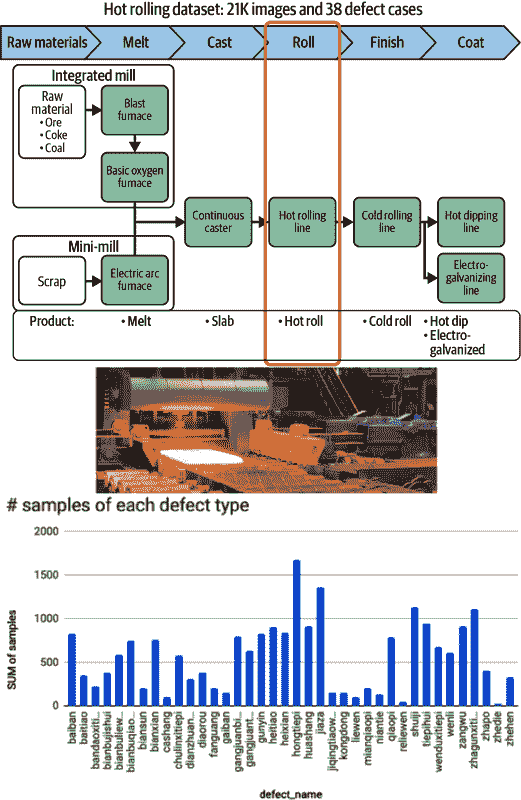

###### 图 15-2. 热轧设定的细节

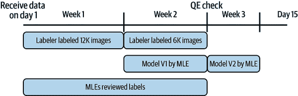

###### 图 15-3. 数据标记、标签审核和模型训练的时间轴

一个耗费大量时间的挑战是管理和更新缺陷共识。在 38 个缺陷类别中，许多类别一开始看起来非常相似，因此很容易让标注者混淆。当出现分歧时，我们不得不不断讨论模棱两可的案例，并更新我们的缺陷定义，以维持三名标注者和机器学习工程师之间的缺陷共识。例如，你能从图 Figure 15-4 的九张图像中区分出三个明显的缺陷类别吗？

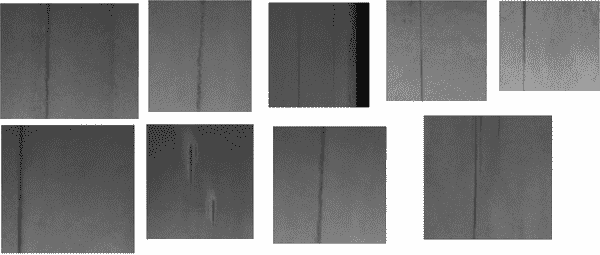

###### 图 15-4. 从九张图像中视觉识别三类别（黑线、黑条纹和划痕）的区别绝非易事

所以这些就是答案。在我们看到更多这三类样本后，我们能够持续纠正这三种缺陷类型之间的界限，并更新它们的缺陷定义（图 15-5）。我们花了大量精力来保持标注人员对缺陷的一致性。对于确实难以识别的样本，我们不得不从训练数据集中移除它们。

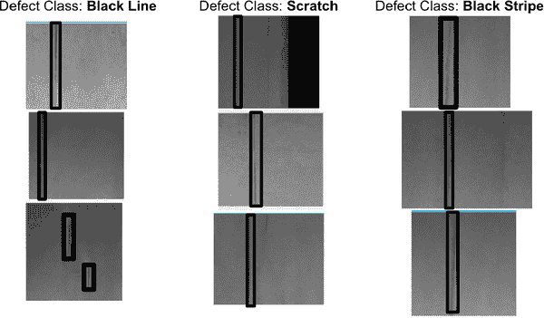

###### Figure 15-5\. 三种更新定义的缺陷类型

除了缺陷定义外，建立标注一致性也非常关键。标注人员不仅要准确地判断缺陷类别，而且由于我们正在进行目标检测，我们还希望他们的边界框标注紧凑而一致。

例如，显示在图 15-6 中的样本来自一个称为*辊压铁皮*的缺陷类别，其特征是非常密集的孔或黑点。当标注人员标注这些图像时，他们应该在所有具有明显缺陷模式的区域周围绘制紧凑的边界框。如果出现不连续性，他们需要用单独的框进行注释，就像第三张图片（图 15-6）那样。然而，第四张图片在标注审查时被拒绝，因为框太宽松，覆盖了一个缺陷区域。如果我们允许此标注添加到我们的训练集中，将会误导模型在计算损失时，我们应该避免这种情况。

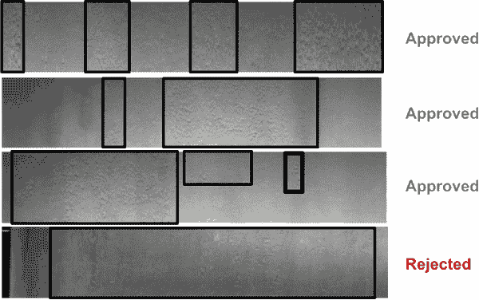

###### Figure 15-6\. 第三张图片展示了一个有详细注释的不连续性，而第四张图片在标注审查期间被拒绝，因为框覆盖的缺陷区域太宽松。

## 收获

我们花了不到 10%的时间进行模型迭代。每次训练完模型后，我大部分时间都用来回顾错误预测的例子，并找出错误的根本原因。然后，我将这些见解用于进一步清洗数据集。经过两次这样的迭代，我们在测试集上达到了 93%的准确率，错误率降低了 65%。这远远超过了基线和当时客户的预期，满足了他们的需求。

# 4\. NLP MLOps：配置文件和分阶段负载测试

作者：Cheng Chen，Dialpad

## 背景

Dialpad 的 AI 团队开发了 NLP 应用程序，帮助用户更好地利用他们的通话，包括实时转录格式化、情绪检测、行动项提取等。开发和部署大型 NLP 模型系统是一个挑战。将它们适应实时、成本效益高的性能限制，使这一挑战变得更加复杂。

2019 年，大型语言模型 BERT 实现了最先进的自然语言处理性能。¹ 我们计划利用它提供更准确的 NLP 能力，包括标点恢复、日期、时间和货币检测。然而，为了降低云成本，我们的实时生产环境资源非常有限（GPU 不是选项，多个模型最多只有一个 CPU）。此外，我们对模型推理的硬限制是每个话语 50 毫秒。与此同时，BERT 基础模型具有 12 层变压器块和 1.1 亿个参数。我们知道将其优化以适应我们的实时环境将是一项挑战，但我们仍然忽视了一个关键问题：估算模型需要多快才能满足我们的实时需求是多么困难。

## 问题与解决方案

我们的团队需要进行本地分析，以便对各种自然语言处理（NLP）模型进行基准测试，这些模型对大量随机抽样的话语进行模型推理，并计算每个话语的平均推理时间。

一旦平均推理速度达到固定阈值，打包的模型将交给我们的数据工程（DE）团队，在我们的 Google Kubernetes Engine（GKE）集群中进行金丝雀部署，并监控各种实时指标的仪表板（图 15-7），能够深入分析特定指标（图 15-8）。

这就是我们如何逐步将基于 BERT 的新标点模型（其目标是恢复标点符号）部署到生产环境中的过程，也是混乱开始的地方。对于基于 BERT 的大型语言模型，DE 团队经常发现延迟或队列时间显著增加，他们不得不回滚部署。显然，本地分析配置与生产系统中实际发生的模式不一致。这种差异可能来自两个方面：集群计算资源分配和/或流量模式。然而，事实是科学家们没有正确的工具来正确评估模型推理。这导致部署和回滚非常耗时，需要大量重复的手动工作。加上对部署潜在表现不佳模型的焦虑，导致系统拥塞和服务中断。作为一种权宜之计，应用科学家和工程师们同意增加计算资源，例如增加一个额外的 CPU 用于推理，但我们显然需要更好的基准测试方法。

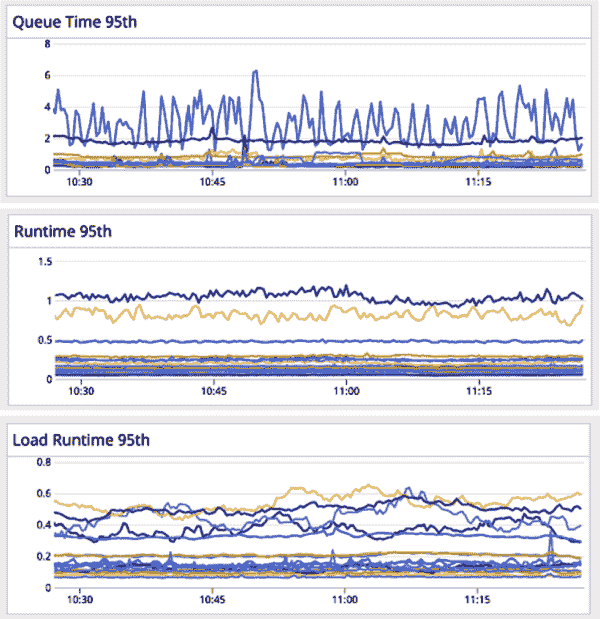

###### 图 15-7\. 监控实时指标的仪表板

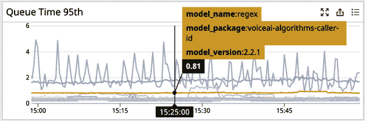

###### 图 15-8\. 针对特定模型进行详细分析

### 一个改进的基准测试过程

我们需要一种方法，允许 NLP 应用科学家高效获取接近生产指标的基准测试结果。（请注意，生产部署仍然需要金丝雀部署。）

除了生产系统外，DE 团队还维护了一个演示环境，用于部署 NLP 模型并与产品界面（参考）集成，以便在生产部署之前进行测试。我们的 QA 团队对各种调用功能进行测试调用，而应用科学家则利用该环境确保模型能够与产品界面正常运行。然而，他们尚未将其用于全面测试大型模型。

DE 团队提出了一个全面且自助的负载测试工具，以帮助应用科学家在演示环境中对模型推理进行基准测试。在设计负载测试工具时，我们牢记以下几个高级要点：

+   负载测试数据应包含触发模型的短语。

+   负载测试数据应包含健康混合的话语长度。最好使用较长的话语长度，以更好地近似系统在压力下的表现。

+   负载测试数据应触发模型推理，而不会被优化/缓存所绕过，从而导致误导性的低运行时延迟。

+   我们使用 CircleCI 工作流来控制自动部署到演示环境。

+   （可选）负载测试数据应具有与预期在生产中使用的数据类似的特征。

开发完成后，应用科学家在**演示环境**中执行负载测试时有两个选择：

+   基于音频的（端到端）负载测试

    +   这是一个完整的端到端测试。

    +   这模拟了对系统的调用。

    +   数据自动从演示环境中的调用（例如 QA 调用）中采样，并尝试在某些特定功能上提供良好的覆盖范围。

    +   如果需要，可以根据需要定制此音频，因此我们可以放置特定于 NLP 的音频数据集。

+   基于文本的（特定于模型的）负载测试

    +   这仅针对单个微服务（例如，标点符号或情感模型）。

    +   这使我们能够选择最具挑战性的输入来对我们的模型进行压力测试。

科学家们确定负载测试的类型并准备好所有必要的数据后，将更改部署到演示环境并开始负载测试。

一旦负载测试开始，科学家们可以监控实时仪表板，查看诸如运行时 95 百分位数之类的重要指标，如图 15-9 所示。这是在评估推理速度时最重要的值。作为一个经验法则，低于 1 秒的任何时间都能满足要求。目前，大多数模型倾向于聚集在或低于 0.5 秒。

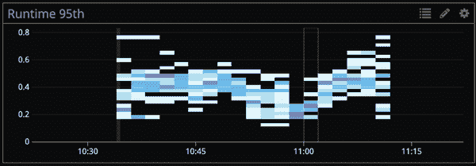

###### 图 15-9. 运行时 95 百分位数

有了这个工具，科学家们可以自行启动分段测试，无需向 DE 团队寻求帮助。Datadog 仪表板还提供了每个模型运行时性能的全面分析，以便应用科学家能更密切地监控指标数字。因此，在我们快速开发周期中，负载测试工具显著减少了通信开销。

## 要点

将最先进的自然语言处理性能融入资源受限的实时生产环境中，需要非常高的信心，即测试期间的基准将在生产中得到验证。当我们的测试方法开始在资源密集型的 BERT 模型上失效时，我们利用我们的分段环境为科学家提供更具代表性的测试环境，并使其自助化，以便他们能够快速迭代。自动化分段基准测试步骤已成为模型开发过程中的标准流程。现在，两个团队都感到放心，因为应用科学家能够非常自信地获得接近生产的模型推断估计。

# 5\. 广告点击预测：数据库与现实之间的挑战

由 Google 的 Daniel Papasian 提供

## 背景

谷歌的广告定位系统旨在帮助最大化显示广告的长期价值，其中包括尽量减少向用户展示不想看的广告的频率。他们部分地通过使用模型来预测某个广告被点击的概率来实现这一目标。当有机会展示广告时，会进行拍卖，拍卖的一部分是服务器使用模型来预测某些广告被点击的概率。这些概率是拍卖的几个输入之一，如果模型表现不佳，用户和广告主的体验都会受到影响。显示广告的行为导致我们向数据库插入一行。数据库中的行对应于向用户展示广告，其列与用于模型训练的特征相关联。此外，一个布尔列表示广告是否导致点击。当插入行时，此列默认为`false`。

如果广告被点击，将在点击日志中生成一条记录。点击日志团队运行一个过程来移除欺诈点击，并发布一份“干净”点击的反馈，供其他内部用户使用。这个反馈用于更新已经创建的数据库行，标记广告展示已经导致点击。

模型是通过查看此数据库中的行作为示例进行训练的，并使用点击位作为标签。 数据中的行是模型的原始输入，并且每个事件的标签记录为“导致点击”或“未被点击”。 如果我们从不更新模型，它们将在一段时间内表现良好，但最终由于用户行为和广告库存的变化而精度下降。 为了改善整体行为，我们自动化了点击预测模型的重新训练和部署。

在推送重新训练到生产之前，我们验证了我们是否提高了模型的准确性。 我们从训练集中留出一部分数据集，并将其用作测试集。 我们的训练过程通过伯努利抽样处理：在训练之前的 48 小时内展示的每个广告，我们将有 99%的机会对其进行训练，以及 1%的机会将其保留为测试集。 这是通过在我们将`test_set`位设置为`true`的行上实施的。 当训练系统读取事件表时，它将过滤出所有这些位为 true 的行。 新训练的模型将发送到此验证系统，该系统对具有`test_set`位的最近事件生成推断。 它将这些推断与观察到的标签进行比较，以生成有关模型准确性的统计数据。 只有新模型在最近的测试集事件上表现优于旧模型时，才会将模型推送到生产环境。

## 问题与解决方案

有一个星期一，我们进来时被自动警报所迎接：我们的广告显示率远低于正常水平。 我们很快意识到，我们平均预测的点击概率只有通常水平的十分之一。 我们是否展示广告部分取决于我们认为广告会被点击的可能性。 因此，广泛的点击概率低估解释了广告显示率警报。 但问题仍然存在：我们的用户行为是否发生了变化？ 或者我们的模型更新是否在某种程度上对我们造成了伤害，尽管我们有验证措施？

我们查询了训练截止前 48 小时内的所有行的数据库。 无论我们如何聚合它，我们看到的点击率都是惊人地典型。 模型表现得好像点击远不及我们数据库中的数据。 但是为什么我们的验证系统没有阻止模型进入生产？ 我们委托我们的数据科学和生产工程团队调查这种情况，以了解发生了什么。

数据科学团队首先查看了验证系统：这个系统原本旨在防止我们发布比替换版本表现更差的模型。验证系统通过在测试集上生成推断来计算损失指标。更低的损失意味着更好的模型。周日的验证运行日志显示，我们按预期处理了测试事件，并且新模型的损失统计低于旧模型。有人有预感，决定再次使用相同的模型对测试集进行验证。测试集从数据库重新读取，并且生成了预期的推断。这一次，损失指标表明新模型比旧模型更差——与周日相反的结果。到底发生了什么？

生产工程团队检查了大量系统的数据范围，试图查看相关系统中是否存在任何未解释的异常。耐人寻味的是，一个图表显示周三到周日的收入为 0，然后在周一凌晨出现了非常大的收入额。这个图表是由一个监视验证点击流的系统生成的。

当生产工程师和数据科学家团队相互商议并分享他们的发现时，他们意识到由于负责处理原始点击日志和向消费者分发干净点击流的基础设施失败，模型出现了欠预测的情况。干净的点击数据直到周一早上模型最后一次训练后才到达 ML 训练系统。没有证据表明相反情况，模型认为这段时间内显示的每个广告都没有被点击。每个事件都是真负或假负，这也是我们的测试集所包含的。我们训练的模型得出的结论是广告很糟糕，没有人会点击任何一个广告，这在我们训练模型时的数据是准确的。当点击处理流赶上时，验证数据被重新标记，使得产生点击的广告被相应标记。这解释了为什么对已训练模型的后续验证尝试仍然失败。问题通过在修正后的数据上重新训练得到解决。

## 收获

回顾起来，重要的是要注意，我们的模型从未直接预测点击的概率。相反，它预测了在训练时段内被标记为“被点击”的广告展示的概率。确实，虽然我们期望我们的数据库能够准确反映现实，但是错误或故障可能导致差异。在这种情况下，上游系统的生产故障导致了此标签的含义与我们希望反映的不同。我们使用监督学习技术构建的模型在我们的训练集中预测标签，我们的标签反映现实是至关重要的。

团队合作撰写了一份事后分析报告，分析发生了什么以及如何防止。这对我们的组织来说是一次重要的学习经验。我们整理了时间线：从点击预测模型工作人员的角度来看，问题直到周一才被发现。我们后来得知，点击日志团队在周三的软件发布时注意到他们的管道出现故障，并在当天通过他们的警报系统意识到了问题未被处理。他们采取了措施确保点击最终仍将被计费，并计划在周一第一时间修复其余的数据处理问题。他们没有意识到他们的系统是下游机器学习流程的数据依赖，以及该系统如何对数据的完整性作出假设。我们认为许多机器学习流水线对输入数据的完整性和提供标签的正确性做出了假设，而没有验证这些假设，因此可能面临类似问题的风险。

我们列出了我们能够想到的每一个停机的潜在原因；我们知道我们会根据改进的工作量和预期改进的价值来优先考虑这些原因。这些原因包括缺乏集成测试导致点击日志中断、训练系统依赖点击日志处理的可靠性高于约定的服务可用性目标，以及我们假设最近的事件会代表所有事件。

我们的后续工作包括为点击日志处理系统建立可用性目标，扩展我们的验证系统以检查测试集的正样本比例是否异常偏低或偏高，并建立一个流程，用于当模型健康出现严重问题时，点击日志团队可以通报故障并暂停训练。

# 6\. 在机器学习工作流中进行测试和测量依赖关系

作者：Harsh Saini，Dialpad

## 背景

在 Dialpad，我们有一个语音识别和处理引擎，它具有几个机器学习依赖项。音频从我们的电话后端输入，并通过我们的专有 ASR 模型实时转录，在这过程中还进行格式化和可读性改进。然后输出被馈送到我们的语言特定的自然语言处理模型中，如 NER 和情感分析。这个管道可以简化为一个流程图（见图 15-10）。

###### 图 15-10\. Dialpad 语音识别和处理管道流程图

然而，实际情况并不像这个简化的图表所显示的那样直接。根据用户的位置和/或他们在 Dialpad 内使用的产品线，可能会使用多个语音识别模型。例如，使用呼叫中心产品线的英国用户将使用在英国英语方言上进行了微调，并针对呼叫中心领域特定知识的语音识别模型。同样地，使用销售产品线的美国用户将使用在美国英语方言上进行了训练，并针对销售电话领域特定知识的语音识别模型来转录他们的通话。

此外，针对 NLP，多个任务特定模型并行运行，执行情感分析、问题检测和行动项识别等任务。考虑到这一点，简化的流程图可以扩展以突显 Dialpad 生产 ML 管道中模型的多样性。

## 问题与解决方案

图 15-11 强调了关于上游语音识别模型的 NLP 任务特定模型的一些 ML 依赖项。NLP 模型性能对 ASR 模型输出产物非常敏感。尽管大多数 NLP 模型对 ASR 模型输出的微小变化并不过敏感，但随着时间的推移，数据发生显著变化，NLP 模型由于回归和数据漂移而性能下降。导致 ASR 的一些常见更新导致 NLP 模型输入数据分布发生变化的几个更新如下：

+   ASR 系统词汇的修改（例如，添加了*冠状病毒*这个词）

+   ASR 系统输出的变化（例如，人们说着相同的话，但我们在准确转录它们方面变得更好）

+   主题漂移，即人们实际上在谈论不同的事物（例如，突然间所有人都开始谈论美国的选举）。

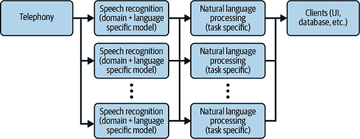

###### 图 15-11\. 一些针对 NLP 任务特定模型的 ML 依赖项

为了应对这种现象，Dialpad 的 DE 团队与数据科学团队合作，建立了一个离线测试管道，可以测量给定 ASR 模型的 NLP 模型性能。

### 建立回归测试沙盒

我们的回归测试和监控系统的一些关键需求如下：

+   确保在发布新的 ASR 模型时，NLP 模型性能的监控将自动进行。

+   模拟观察到的生产模型行为。

+   收集并报告通过评估提交的指标，供利益相关者查看。

+   收集模型推断产物和日志，以帮助科学家进行故障排除。

+   允许数据科学团队在希望评估先行发布模型时进行临时评估。

+   确保我们能够建立可比较的基线，因为评估数据集可能会在带外进行修改。

+   要成为一个可扩展的系统，以便可以同时进行多次评估，并且在增加数据集大小或测试模型数量时也不会成为瓶颈。

鉴于这些要求，做出了以下设计决策：

+   Kubeflow Pipelines（KFP）被选为托管沙箱的平台：

    +   KFP 允许用户编写称为*pipelines*的自定义有向无环图（DAGs）。

    +   每个管道都是隔离的，整个平台可以独立扩展到所有运行中管道的需求。

    +   Dialpad 的工程团队对[Kubernetes](https://kubernetes.io)和[Argo Workflows](https://argoproj.github.io/workflows)投入了大量资源，这些技术是支持 KFP 的基础技术，因此使用这个平台似乎是明智的选择。

+   KFP 中的管道将通过选择正确的模型部署工件来建立评估所需的正确基础设施，考虑到评估标准。

    +   这将在运行时进行，不会持久化，以降低成本。

    +   测试平台将与模型版本解耦，并仅了解正确编排的依赖顺序。

+   每个模型的输出将会为了调试目的持久化 30 天。

+   每个任务特定 NLP 模型的数据集都将进行版本管理，以跟踪评估数据的变化。

+   将为每个 ASR 模型版本、NLP 模型版本和数据集版本的每个组合收集度量标准。

    +   这确保了我们能够正确地消除不同依赖项之间的歧义。

    +   这些度量标准将在仪表盘上进行可视化以进行观察。

+   测试管道的输入是对话的原始音频记录，因为想法是捕捉 ASR 模型是否发生了足以改变输出的变化，从而影响下游 NLP 模型的性能。

    +   一旦收集了音频样本，它们将被注释以说明它们是否包含特定的 NLP 时刻。例如，给定的音频片段将由人类注释，以验证其在情感分析任务中是否包含正面、负面或中性情感。

    +   正如你所看到的，这是一项艰巨的任务，仍然是该项目最大的瓶颈之一。正确地切片、注释和存储这些样本对每个 NLP 任务来说都是极其耗时的（图 15-12）。

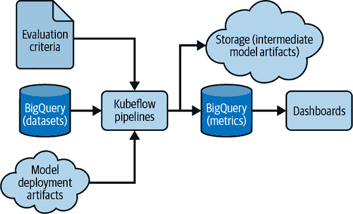

###### 图 15-12\. 高级别的回归测试环境

而在 KFP 内部，一个管道将模拟评估一个 ASR 模型版本、NLP 模型版本和数据集版本的单个组合。由于 KFP 允许我们并行运行多个管道，这将使我们能够扩展到我们想要执行的所有评估组合（图 15-13）。

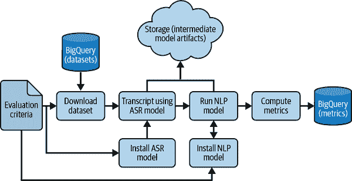

###### 图 15-13\. KFP 管道的 DAG 架构

### 用于回归监控

一旦在 KFP 上建立了管道，项目的下一步是在 NLP 模型的依赖关系发生变化时自动执行回归测试。在 Dialpad，我们有由工程团队管理的成熟的 CI/CD 工作流，并已更新为在转录服务中更新 ASR 模型时触发 KFP 管道。CI/CD 工作流会向 KFP 发送有关 ASR 模型、NLP 模型等的信息，然后在 KFP 上进行评估。度量数据将被存储，并将发出 Slack 消息，包含评估摘要。

一旦投入运行，这个过程将为平台上所有具有测试数据的 NLP 任务特定模型捕获性能评估数据。例如，NLP 情感分析模型的 F1 分数在一年内下降了约 25%，如图 15-14 所示；该图突出显示了与基准线的绝对差异。这一观察引起了 NLP 团队的注意，他们调查发现积累的数据漂移是导致性能下降的原因。新的情感模型使用最新的 ASR 模型输出进行了重新训练，并在短短几个月内发布到生产环境中。

这个过程的另一个间接好处是，在生产发布之前，它允许针对不同语音识别（ASR）模型对自然语言处理（NLP）模型进行临时评估。例如，可以测量情感分析模型在发布之前针对新的英语方言（如澳大利亚或新西兰英语）的 ASR 模型的准确性。

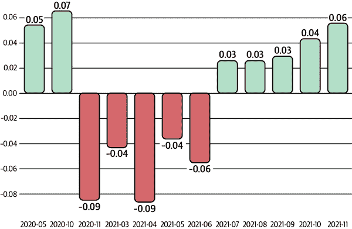

###### 图 15-14\. NLP 情感分析模型的 F1 分数

## 要点

这在 Dialpad 开发的 ML 回归测试平台大大提升了数据科学家和工程师对新模型发布对我们生产堆栈中所有依赖组件影响的可见性。即使对所有部署的生产模型了解不完全，人们也能够了解建议的发布是否会影响生产流水线中其他模型的稳定性和性能。这减少了回滚的可能性，并且可以提前指示是否需要进一步改进与现有组件的兼容性。

测试平台正在积极开发中。正在处理其他移动组件，其中之一是保持沙箱编排与生产同步，并允许仅在生产调用期间短暂存在的其他“实时数据”，这在回归测试平台中很难模拟。另一个正在考虑的功能是如何在建议的发布对下游模型有重大影响时提供自动警报，而不是当前的人工参与方法。

¹ 查看 Jacob Devlin 等人于 2019 年发表的论文 [“BERT: Pre-training of Deep Bidirectional Transformers for Language Understanding”](https://oreil.ly/WEh8t)。
