## 第一部分\. 机器学习工作流程

在本书的第一部分，我们介绍了基本的机器学习工作流程。每一章都涵盖工作流程的一个步骤。

第一章介绍了机器学习，它的用途以及为什么你应该阅读这本书。

在第二章中，你将深入了解基本机器学习工作流程中的数据处理步骤。你将了解从现实世界和杂乱数据中清理和提取价值的一些常见方法。

在第三章中，当你学习一些建模算法及其在常见实现中的应用时，你将开始构建简单的机器学习模型。

在第四章中，你将更深入地了解我们的机器学习模型，以评估和优化其性能。

第五章专门介绍基本特征工程。从数据中提取特征可能是构建和优化机器学习系统性能的一个极其重要的部分。

## 第一章\. 什么是机器学习？

*本章涵盖*

+   机器学习基础知识

+   机器学习相较于传统方法的优点

+   基本机器学习工作流程概述

+   提高模型性能的高级方法概述

1959 年，一名名叫亚瑟·萨缪尔的 IBM 计算机科学家编写了一个程序来玩跳棋。每个棋盘位置都根据其赢得比赛的可能性分配一个分数。最初，分数是基于一个使用诸如每一边的棋子数量和王的数量等因素的公式的。它起作用了，但萨缪尔有一个关于如何提高其性能的想法。他让程序与自己玩成千上万场比赛，并使用结果来细化位置评分。到 20 世纪 70 年代中期，该程序已经达到了可敬的业余选手的水平。1

> ¹
> 
> 约翰·施瓦茨，*一步之先：国际象棋的计算机完美*(纽约：斯普林格，2009)。

萨缪尔编写了一个能够通过经验提高自身性能的计算机程序。它学习了——机器学习（ML）诞生了。

这本书的目的不是描述机器学习算法的数学细节（尽管我们将剥去洋葱的一层，以提供对最常见算法内部工作原理的洞察）。相反，本书的主要目的是指导非专业人士在将机器学习集成到现实世界应用和数据管道时的重要方面和常见挑战。在本章中，我们提出一个真实的企业问题——审查贷款申请，以展示使用机器学习相较于一些最常见替代方案的优点。

### 1.1\. 理解机器学习是如何学习的

当我们谈论人类学习时，我们区分了死记硬背或记忆和真正的智慧。记住电话号码或一系列指令无疑是学习。但当我们说*学习*时，我们通常意味着更多的事情。

当孩子们在群体中玩耍时，他们会观察他人如何回应他们的行为。他们的未来社交行为将受到这种经验的影响。但他们不会重放和回放过去的经历。相反，他们互动中的一些可识别特征——操场、教室、妈妈、爸爸、兄弟姐妹、朋友、陌生人、成人、儿童、室内、室外——提供了线索。他们会根据新情况与过去情况共有的特征来评估每个新情况。他们的学习不仅仅是积累知识。他们正在构建可能被称为*洞察力*的东西。

想象一下通过使用闪卡教孩子区分狗和猫。你出示一张卡片，孩子做出选择，然后你将卡片放入两个堆叠中，分别代表正确和错误的选择。随着孩子的练习，他的表现会提高。有趣的是，没有必要首先教孩子猫和狗识别的技术。人类的认知具有内置的分类机制。所需的一切只是*例子*。在孩子熟练掌握闪卡后，他不仅能够分类闪卡上的图像，还能分类大多数猫或狗的图像，更不用说真实的事物了。这种*概括*的能力，即将通过训练获得的知识应用于新的未见过的例子，是人类和机器学习的关键特征。

当然，人类的学习比最先进的机器学习算法还要复杂得多，但计算机在记忆、回忆和处理数据方面具有更大的优势。他们的经验以历史数据的形式出现，这些数据通过本书中描述的技术进行处理，通过经验创造和优化，至少能够体现概括的能力，即使不是真正的洞察力。

人类学习和机器学习之间的类比自然让人想到术语*人工智能*（AI）以及一个明显的问题：“人工智能和机器学习有什么区别？”关于这个问题，并没有明确的共识，但大多数人（并非所有人）都同意机器学习是人工智能的一种形式，而人工智能是一个更广泛的主题，包括诸如机器人技术、语言处理和计算机视觉系统等领域。为了进一步增加这种模糊性，机器学习正在越来越多地应用于这些相邻的人工智能领域。我们可以这样说，机器学习学科指的是*一个特定的知识体系及其相关的一套技术*。对于什么是机器学习，什么不是机器学习，这一点相当清楚，而对于人工智能来说，情况则并非总是如此。用 Tom Mitchell 经常引用的定义来转述，如果一个计算机程序在执行某个任务时，其表现（通过可计算的分数来衡量）随着经验的积累而提高，那么我们就说这个程序是学习的。^([[2])

> ²
> 
> Tom Mitchell, *Machine Learning* (McGraw Hill, 1997), 2\. “如果一个计算机程序在基于经验 E 对某些任务 T 和性能度量 P 的情况下，其 T 中任务的性能（通过 P 来衡量）随着经验 E 的积累而提高，那么我们就说这个程序从经验 E 中学习。”

Kaggle，一家机器学习咨询公司，举办了一场比赛，寻找最准确的用于分类图像是否描绘了狗或猫的程序。^([[3]) 竞赛者获得了 25,000 个示例图像用于训练。每个图像都被标记以指示所描绘的物种。在所有竞争者训练了他们的算法之后，他们被测试了在区分 12,500 个未标记测试图像的能力。

> ³
> 
> 请参阅“狗与猫”比赛，[www.kaggle.com/c/dogs-vs-cats](http://www.kaggle.com/c/dogs-vs-cats)。

当我们向人们解释 Kaggle 比赛时，他们通常会通过反思可能应用于完成狗和猫识别的规则来回应。猫的耳朵是三角形的，竖立着；狗的耳朵是松垂的——但并非总是如此。试着想象一下，如果你要向一个从未见过狗或猫的人解释如何区分它们，而又不能展示任何例子，你会怎么解释。

人们使用各种方法，包括形状、颜色、质地、比例和其他特征，从例子中学习和归纳。机器学习也采用各种策略，根据手头的问题以不同的组合方式应用。

这些策略体现在近几十年来统计学、计算机科学、机器人学、应用数学等学科领域的学者和实践者开发的算法集合中，这些算法应用于在线搜索、娱乐、数字广告和语言翻译等领域。它们种类繁多，各有优缺点。其中一些是分类器。其他一些预测数值测量。还有一些测量可比实体（例如，人、机器、流程、猫、狗）的相似性或差异性。这些算法的共同之处在于从例子（经验）中学习，以及将所学知识应用于新的、未见过的案例——即泛化的能力。

在猫狗竞赛中，在学习阶段，参赛者的程序反复尝试使用许多算法进行正确的分类。在学习过程的数百万次迭代中，程序执行分类，衡量结果，然后对过程进行微调，寻找增量改进。获胜者正确分类了 98.914%的未见测试图像。考虑到人类错误率大约为 7%，这相当不错。图 1.1 说明了这个过程。机器学习过程分析标记图像，并构建一个模型，该模型随后被*召回*（预测）过程用于对未标记图像进行分类。示例中有一个被错误标记的猫。

##### 图 1.1\. 猫狗竞赛的机器学习过程

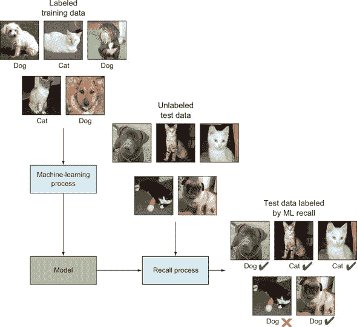

请注意，我们在这里描述的是**监督**机器学习，它不是唯一类型的 ML。我们将在后面讨论其他类型。

机器学习可以应用于广泛的商业问题，从欺诈检测到客户定位和产品推荐，再到实时工业监控、情感分析和医疗诊断。它可以处理由于必须处理的大量数据而无法手动管理的问题。当应用于大型数据集时，ML 有时可以发现如此微妙的关联，以至于任何数量的手动审查都无法发现。而且当许多这样的“弱”关系结合在一起时，它们就变成了强大的预测者。

从数据中学习的过程，以及随后使用所获得的知识来指导未来决策，是非常强大的。确实，机器学习正在迅速成为推动现代数据驱动经济的引擎。

表 1.1 描述了广泛使用的监督机器学习技术和它们的一些实际应用。这不是一个详尽的列表，因为潜在的使用案例可能跨越几页。

##### 表 1.1\. 按问题类型组织的监督机器学习用例

| 问题 | 描述 | 示例用例 |
| --- | --- | --- |
| 分类 | 根据输入数据确定每个个体所属的离散类别 | 邮件过滤、情感分析、欺诈检测、客户广告定位、客户流失预测、支持案例标记、内容个性化、制造缺陷检测、客户细分、事件发现、基因组学、药物有效性 |
| 回归 | 根据输入数据预测每个个体的实值输出 | 股票市场预测、需求预测、价格估计、广告出价优化、风险管理、资产管理、天气预报、体育预测 |
| 推荐系统 | 预测用户可能偏好的替代方案 | 产品推荐、招聘、Netflix Prize、在线约会、内容推荐 |
| 填充 | 推断缺失输入数据的值 | 不完整的患者医疗记录、缺失的客户数据、人口普查数据 |

### 1.2\. 利用数据做出决策

在以下示例中，我们将描述一个可以从机器学习方法中受益的现实世界商业问题。我们将逐一介绍常用的各种替代方案，并展示机器学习方法的优势。

想象一下，你是一家微型贷款公司的负责人，该公司为想在困难社区开展小型生意的个人提供贷款。一开始，公司每周只收到几份申请，你能在几天内手动阅读每一份申请，并对每位申请者进行必要的背景调查，以决定是否批准每项贷款申请。这个过程的结构图显示在图 1.2 中。你的早期借款人对你的快速处理时间和个性化服务感到满意。你公司的名声开始传播。

##### 图 1.2\. 微型贷款示例的贷款审批流程


随着你的公司继续获得人气，申请者的数量开始增加。很快，你每周就会收到数百份申请。你试图通过加班来跟上申请数量的增加，但申请的积压仍在继续增长。一些申请者因为等待而感到疲惫，并从你的竞争对手那里寻求贷款。对你来说，显然，手动处理每一份申请并不是一个可持续的商业流程，而且坦白说，这也不值得承受压力。

那么，你应该怎么做呢？在本节中，你将探索几种扩大你的应用程序审核流程的方法，以满足你不断增长的业务需求。

#### 1.2.1\. 传统方法

让我们探讨两种应用于申请审核流程的传统数据分析方法：手动分析和业务规则。对于每种方法，我们将介绍实施技术的过程，并强调它在帮助你构建可扩展业务方面的不足。

##### 聘请更多分析师

你决定再雇佣另一位分析师来帮助你。你并不喜欢将一部分利润用于新员工的费用，但有了第二个人来审核申请，你可以在相同的时间内处理大约两倍数量的申请。这位新分析师让你能够在一周内清理掉申请积压。

在最初的几周里，你和你的同事都加班加点以满足需求。然而，申请的数量仍在增长，一个月内翻倍，每周达到 1,000 份。为了跟上这种增长的需求，你现在必须再雇佣两名分析师。展望未来，你确定这种雇佣模式是不可持续的：所有来自新贷款申请人的增加收入都直接用于新员工，而不是更关键的领域，如你的小额贷款基金。*随着需求的增加而雇佣更多分析师阻碍了你的业务增长*。此外，你发现招聘过程漫长且昂贵，消耗了你的更多收入。最后，每位新员工的经验都比上一任少，处理申请的速度也慢，管理一个团队的个人压力也在消耗你的精力。

除了增加成本这一明显的缺点外，人们在决策过程中都会带来各种各样的有意识和无意识偏见。为了确保一致性，你可能会为审批流程制定详细的指南，并为新分析师实施广泛的培训计划，但这仍然会增加更多的成本，并且可能无法消除偏见。

##### 使用业务规则

想象一下，在 1,000 笔还款日期已过的贷款中，有 70%按时还款。这显示在图 1.3 中。

##### 图 1.3。经过几个月的业务和 2,500 笔贷款申请，有 1,000 笔获得批准，其中 700 位申请人在规定时间内偿还了贷款，另外 300 位违约。这一初步观察到的信息对于开始将自动化引入你的贷款审批流程至关重要。

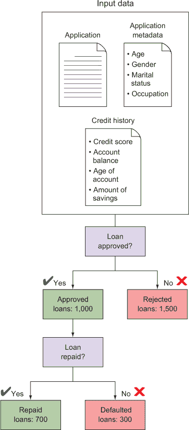

现在，你开始寻找申请数据和贷款还款发生率之间的趋势。特别是，你手动搜索一组过滤规则，以产生一个主要是按时还款的“良好”贷款子集。通过手动分析数百份申请，你获得了关于什么使每份申请好或坏的广泛经验。^([4)] 通过一些自我反思和对贷款还款状态的回测，你注意到了信用背景审查数据中的几个趋势。^([5)]

> ⁴
> 
> 你还可以使用统计相关性技术来确定哪些输入数据属性与贷款还款结果事件最强烈相关。
> 
> ⁵
> 
> 在这个例子中，我们使用了德国信贷数据集。你可以从[`mng.bz/95r4`](http://mng.bz/95r4)下载这些数据。

+   大多数信用额度超过 7,500 美元的借款人未能按时偿还贷款。

+   大多数没有支票账户的借款人按时偿还了贷款。

现在你可以设计一个过滤机制，通过这两条规则减少你需要手动处理的申请数量。

你的第一个过滤器是自动拒绝任何信用额度超过 7,500 美元的申请人。通过查看你的历史数据，你发现 86 名信用额度超过 7,500 美元的申请人中有 44 人违约。这些高信用额度申请人的违约率大约为 51%，而其他人的违约率为 28%。这个过滤器似乎是一个排除高风险申请人的好方法，但你意识到只有 8.6%（1,000 名接受申请中的 86 名）的接受申请人的信用额度如此之高，这意味着你仍然需要手动处理超过 90%的申请。你需要进行更多的过滤以将这个数字降低到更易于管理的水平。

你的第二个过滤器是自动接受任何没有支票账户的申请人。这似乎是一个很好的过滤器，因为 348 名没有支票账户的 394 名（88%）申请人在规定时间内偿还了贷款。包括这个第二个过滤器，自动接受或拒绝的申请比例达到了 45%。因此，你只需要手动分析大约一半的新到申请。图 1.4 展示了这些过滤规则。

##### 图 1.4。通过两条业务规则过滤新申请，使你能够将手动分析减少到仅占 incoming applications 的 52%。

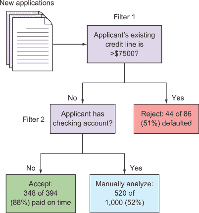

使用这两条业务规则，你可以在不雇佣第二个分析师的情况下将业务规模扩大到原来的两倍，因为你现在只需要手动接受或拒绝 52%的新申请。此外，根据已知结果的 1,000 个申请，你预计你的过滤机制会错误地拒绝每 1,000 个申请中的 42 个（4.2%），并且错误地接受每 1,000 个申请中的 46 个（4.6%）。

随着业务的增长，你希望你的系统能够自动接受或拒绝越来越多的申请，而不会增加违约损失。为此，你再次需要添加更多的业务规则。很快你就会遇到几个问题：

+   随着过滤系统的复杂性增加，手动找到有效的过滤器变得越来越困难——如果不是不可能的话。

+   业务规则变得如此复杂和透明度低，以至于调试它们和移除旧的不相关规则几乎是不可能的。

+   你的规则构建没有统计严谨性。你相当确信可以通过更好地探索数据找到更好的“规则”，但无法确定。

+   随着还款模式随时间变化——可能是因为申请人群体发生变化——系统没有适应这些变化。为了保持最新状态，系统需要不断调整。

所有这些缺点都可以追溯到业务规则方法中的一个单一致命弱点：系统不会自动从数据中学习。

数据驱动系统，从简单的统计模型到更复杂的机器学习工作流程，可以克服这些问题。

#### 1.2.2\. 机器学习方法

最后，你决定调查一种完全自动化、数据驱动的微贷款申请审核流程。机器学习是一个有吸引力的选择，因为过程的完全自动化将使你的运营能够跟上不断增长的申请流入。此外，与业务规则不同，机器学习直接从数据中学习最佳决策，而不需要任意地硬编码决策规则。从基于规则的决策到基于机器学习的决策的转变意味着你的决策将更加准确，并且随着时间的推移，随着更多贷款的发放，将得到改进。你可以确信你的机器学习系统会产生最小人工干预的优化决策。

在机器学习中，数据为推导关于当前问题的见解提供了基础。为了确定是否接受每个新的贷款申请，机器学习使用历史*训练数据*来预测每个新申请的最佳行动方案。要开始使用机器学习进行贷款审批，你首先需要组装 1,000 个已批准贷款的训练数据。这些训练数据包括每个贷款申请的输入数据，以及每个贷款是否按时偿还的已知结果。输入数据反过来又包括一组*特征*——数值或分类指标，它们捕捉了每个申请的相关方面——例如申请人的信用评分、性别和职业。

在图 1.5 中，历史数据训练了机器学习模型。然后，随着新的贷款申请到来，从申请数据中即时生成未来还款概率的预测。

##### 图 1.5\. 微贷款示例中的基本机器学习工作流程

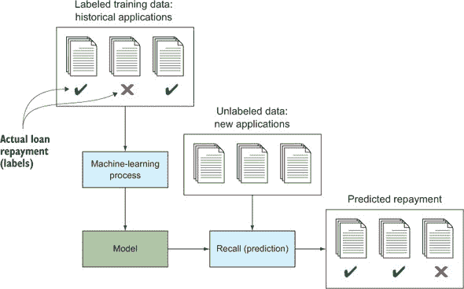

因此，机器学习建模确定了如何使用每个申请人的输入数据来*最佳预测*贷款结果。通过在训练集中找到并使用模式，机器学习产生了一个模型（现在你可以将其视为一个黑盒），根据每个新申请人的数据预测每个新申请人的结果。

下一步是选择一个要使用的机器学习算法。机器学习有多种风味，从简单的统计模型到更复杂的算法。在这里，我们比较两个例子：第一个是一个简单的参数模型，第二个是一个非参数的分类树集成。不要让术语吓到你。机器学习使用了很多算法和很多方法来分类它们，正如你很快就会看到的。

大多数传统的统计商业模型都属于第一类。这些参数模型使用简单、固定的方程来表达结果和输入之间的关系。然后使用数据来学习方程中未知项的最佳值。线性回归、逻辑回归和自回归模型等都属于这一类别。回归模型在第三章中有更详细的介绍。

在这个例子中，你可以使用逻辑回归来模拟贷款审批过程。在逻辑回归中，每笔贷款偿还的对数几率（对数几率）被模拟为输入特征的线性函数。例如，如果每个新的申请包含三个相关特征——申请人的信贷额度、教育水平和年龄——那么逻辑回归试图通过以下方程预测申请人将违约的几率（我们将称之为 y）：

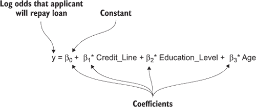

| |
| --- |

**对数几率**

概率比是表示概率的一种方式。你无疑听过有人说过一支（热门）球队获胜的几率是 3 比 1。几率是成功（例如，获胜）的概率除以失败（失败）的概率。从数学上讲，这可以表示如下：

概率比（Odds(A)）= P(A) / P(~A) = A 发生的概率除以 A 不发生的概率

因此，3 比 1 的几率等同于 0.75 / 0.25 = 3，log(3) = 0.47712...

如果 A 是一个公平的抛硬币，那么正面的几率将是 0.5 / 0.5 = 1。log(1) = 0。结果发现，对数几率可以取任何实数值。接近 –∞ 的对数几率表示一个高度不可能的事件。接近 ∞ 的值表示几乎确定，而 log(1) = 0 表示一个均匀的随机变化。使用对数几率而不是常规概率是一种数学技巧，因为它不像概率那样受限于 0 和 1 之间的值。

| |
| --- |

方程中每个系数（在本例中为 β[0]、β[1]、β[2] 和 β[3]）的最优值是从 1,000 个训练数据示例中学习的。

当你可以用这样的公式表达输入和输出之间的关系时，从输入（信贷额度、教育水平和年龄）预测输出（y）就变得容易了。你所要做的就是确定 β[1]、β[2] 和 β[3] 的哪些值在使用你的历史数据时能产生最佳结果。

但当输入和响应之间的关系复杂时，像逻辑回归这样的模型可能会受限。以图 1.6 左面板中的数据集为例。在这里，你有两个输入特征，任务是将每个数据点分类到两个类别之一。这两个类别在二维特征空间中由一条非线性曲线分开，称为*决策边界*（如图中的曲线所示）。在中间面板中，你可以看到在这个数据集上拟合逻辑回归模型的结果。逻辑回归模型提出了一条直线来分隔两个区域，导致许多分类错误（错误区域中的点）。

##### 图 1.6。在这个二分类中，单个数据点可以属于圆形类别或方形类别。这个特定的数据位于一个具有非线性决策边界的二维特征空间中，该边界将类别分开，用曲线表示。而一个简单的统计模型在准确分类数据（中心）方面表现相当糟糕，而一个机器学习模型（右侧）则能够轻松地发现真实的类别边界。

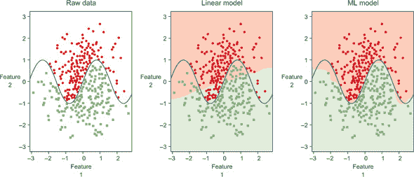

这里的问题是，中间面板中描述的模型试图用一个简单的*参数*模型来解释一个复杂、非线性的现象。参数模型与非参数模型的正式定义很复杂，对于这本书来说过于数学化，但关键是参数模型在你对输入和你要预测的响应之间的关系有先验理解时表现良好。如果你对非线性关系了解足够多，你可能能够转换你的输入或响应变量，使得参数模型仍然有效。例如，如果某种疾病在人群中的观察率在老年人中更高，你可能会发现患病概率与受试者年龄的平方之间存在线性关系。但在现实世界中，你经常遇到无法猜测这种转换的问题。

你需要的是更灵活的模型，这些模型可以自动发现数据中的复杂趋势和结构，而无需被告知这些模式看起来像什么。这就是*非参数*机器学习算法发挥作用的地方。在图 1.6 右面板中，你可以看到将一个非参数学习算法（在这种情况下，是一个*随机森林分类器*）应用于该问题的结果。显然，预测的决策边界与真实边界非常接近，因此，分类精度远高于参数模型。

由于它们在复杂、高维、现实世界的数据集上达到了如此高的准确度，非参数机器学习模型成为许多数据驱动问题的首选方法。非参数方法的例子包括机器学习中一些最广泛使用的方法，如 k 最近邻、核平滑、支持向量机、决策树和集成方法。我们在本书的后面部分描述了所有这些方法，附录提供了某些重要算法的概述。线性算法还有一些其他特性，在某些情况下使它们具有吸引力。它们可能更容易解释和推理，并且可以更快地计算和扩展到更大的数据集。

|  |
| --- |

**进一步阅读**

Gareth James 等人撰写的教科书《统计学习引论》（Springer，2013 年）为没有统计学或数学背景的读者提供了对机器学习中常用方法的详细介绍。PDF 版本可在作者网站上找到（[www-bcf.usc.edu/~gareth/ISL/](http://www-bcf.usc.edu/~gareth/ISL/))）。

|  |
| --- |

回到微贷问题，扩大您业务的最佳选择是采用非参数机器学习模型。该模型可能会找到与您最初手动找到的完全相同的规则，但它们可能略有不同，以便优化统计收益。最有可能的是，机器学习模型还会自动找到其他更深层次的关系，这些关系是您在其他情况下不会考虑到的，即输入变量和期望结果之间的关系。

除了提供自动化的工作流程外，您还可能获得更高的准确度，这直接转化为更高的商业价值。想象一下，一个非参数机器学习模型比逻辑回归方法高 25%的准确度。在这种情况下，您的机器学习模型在新应用中犯的错误会更少：接受更少的不会偿还贷款的申请人，拒绝更少的会偿还贷款的申请人。总的来说，这意味着您发放的贷款的平均回报率更高，使您能够发放更多的贷款，并为您的业务创造更高的收入。

我们希望这能让您领略到机器学习所能带来的力量。在我们继续定义我们的基本机器学习工作流程之前，我们将列举一些机器学习的优势以及这种方法的一些挑战。

#### 1.2.3\. 机器学习的五个优势

为了总结我们对微贷示例的讨论，我们列出了一些使用机器学习系统相对于最常见替代方案（如手动分析、硬编码的业务规则和简单的统计模型）的一些最显著优势。机器学习的五个优势如下：

+   ***准确度高—*** 机器学习利用数据来发现针对您问题的最佳决策引擎。随着您收集更多数据，准确度可以自动提高。

+   ***自动化——*** 当答案被验证或丢弃时，机器学习模型可以自动学习新的模式。这使用户能够将机器学习直接嵌入到自动化工作流程中。

+   ***快速——*** 当新的数据流进来时，机器学习可以在毫秒内生成答案，允许系统实时反应。

+   ***可定制——*** 许多数据驱动的问题可以用机器学习来解决。机器学习模型是根据您自己的数据定制的，并且可以配置以优化驱动您业务的各种指标。

+   ***可扩展——*** 随着业务的增长，机器学习可以轻松扩展以处理增加的数据速率。一些机器学习算法可以扩展到在云中的多台机器上处理大量数据。

#### 1.2.4\. 挑战

自然地，实现这些好处涉及一些挑战。根据业务问题的规模和形状，伴随的难度程度从孩子玩耍般的简单到汉尼拔翻越阿尔卑斯山般的巨大不等。

最突出的是以可用的形式获取数据。据估计，数据科学家将 80%的时间花在数据准备上.^([6]) 你无疑已经听说过，企业捕获的数据量比以往任何时候都要大，而且确实如此。你也可能听说过这些数据被称为业务流程的“废气”。换句话说，我们的新数据宝库并非旨在满足我们机器学习系统的输入需求。从残留物中提取有用的数据可能是繁琐和混乱的工作。

> ⁶
> 
> 史蒂夫·洛尔，《大数据科学家面临的“清洁工工作”是洞察力的关键障碍》，《纽约时报》，2014 年 8 月 17 日，[`mng.bz/7W8n`](http://mng.bz/7W8n)。

一个相关的挑战是制定问题，以便机器学习可以应用，并将产生可操作和可衡量的结果。在我们的例子中，目标是明确的：预测谁会偿还，谁会违约。分类很容易应用，结果也容易衡量。幸运的是，一些现实世界的问题是这样的简单；例如，鉴于我们对潜在客户的了解（我们有很多数据），预测他们是否会购买我们的产品。这是低垂的果实。

一个更困难的例子可能是这样的：找到最佳媒体组合和广告单元组合，以增加新产品线的品牌知名度。仅仅制定这个问题就需要构建一种衡量品牌知名度的方法，理解正在考虑的替代媒体选项，以及反映与替代方案和关联结果相关经验的数据。

当你试图预测的结果很复杂时，选择算法以及如何应用它本身可能就是一项巨大的努力。致力于预测术后并发症可能性的心脏病研究人员，对于每位患者都有一套令人眼花缭乱的资料，但机器学习算法并不自然地吸收心电图（EKG）数据和 DNA 序列。*特征工程*是将这些输入转换为预测特征的过程。

如果我们不提及预测模型师存在的痛苦：一个完美匹配训练数据的模型，但在使用它对不在训练集中的数据进行实际预测时却完全失败。这个问题最常见的是*过拟合*。

你会看到机器学习可以解决各种各样的问题，有些问题比其他问题更容易解决。你也可能注意到，解决方案的价值并不总是与所需的努力成比例。确实，机器学习并不是任何问题的万能药。但正如你将在本书中看到的，机器学习是许多现实世界、数据驱动问题的完美选择。

### 1.3. 按照机器学习工作流程：从数据到部署

在本节中，我们介绍了将机器学习模型集成到你的应用程序或数据管道中的主要工作流程。*机器学习工作流程*有五个主要组成部分：数据准备、模型构建、评估、优化以及在新的数据上的预测。这些步骤的应用有一个固有的顺序，但大多数现实世界的机器学习应用都需要在迭代过程中多次回顾每个步骤。这五个组成部分在第二章到第四章中详细说明，但我们在本介绍中概述它们，以激发你开始学习的兴趣。图 1.7 概述了此工作流程，接下来的几节将自上而下介绍这些概念。你将在本书中多次看到这张图，因为我们介绍了机器学习工作流程的各个组成部分。

##### 图 1.7. 现实世界机器学习系统的工作流程。从历史输入数据中，你可以使用机器学习算法构建一个模型。然后你需要评估该模型的表现，并优化准确性和可扩展性以适应你的需求。使用最终模型，你可以在新的数据上进行预测。

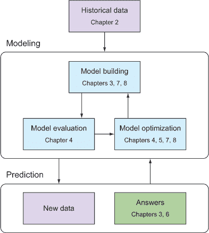

#### 1.3.1. 数据收集和准备

收集和准备机器学习系统所需的数据通常意味着如果数据尚未以表格格式存在，则需要将其转换为表格格式。将表格格式想象成一个电子表格，其中数据按行和列分布，每一行对应一个感兴趣的*实例*或*例子*，每一列代表该实例的测量值。存在一些例外和变化，但可以说大多数机器学习算法都需要以这种格式提供数据。不用担心；当你遇到例外时，你会处理它们。图 1.8 展示了这种格式的一个简单数据集。

##### 图 1.8。在一个表格数据集中，行被称为*实例*，列代表*特征*。

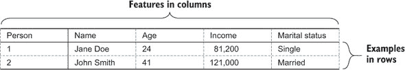

关于表格数据的第一件事要注意的是，各个列通常包含相同类型的数据，而行通常包含各种类型的数据。在图 1.8 中，你已能识别出四种类型的数据：*姓名*是一个字符串变量，*年龄*是一个整数变量，*收入*是一个浮点变量，而*婚姻状况*是一个分类变量（具有离散的类别数量）。这样的数据集被称为*异构的*（与同构相对），在第二章中我们解释了我们将如何以及为什么根据特定的机器学习算法将这些数据类型强制转换为其他类型。

实际世界的数据可能以各种方式“杂乱无章”。假设在数据收集阶段，某个特定测量值对于数据中的一个实例不可用，并且无法返回去找到缺失的信息。在这种情况下，表格将包含一个或多个单元格中的*缺失值*，这可能会使模型构建和随后的预测复杂化。在某些情况下，人类参与了数据收集阶段，我们都知道在重复性任务，如数据记录中犯错误是多么容易。这可能导致一些数据完全错误，你必须能够处理这样的场景，或者至少知道特定算法在存在误导性数据时的表现如何。你将在第二章中更详细地了解处理缺失和误导性数据的方法。

#### 1.3.2. 从数据中学习模型

构建一个成功的机器学习系统的第一步是提出一个可以通过数据回答的问题。使用这个简单的个人信息表，你可以构建一个机器学习模型，可以预测一个人是已婚还是单身。例如，这样的信息对于展示相关广告将是有用的。

在这种情况下，你会使用 *婚姻状况* 变量作为 *目标* 或 *标签*，其余变量作为 *特征*。然后，机器学习算法的任务就是找到如何使用输入特征集成功预测目标。然后，对于婚姻状况未知的人，你可以使用模型根据每个个体的输入变量来预测婚姻状况。图 1.9 展示了在我们玩具数据集上的这一过程。

##### 图 1.9\. 机器学习建模过程

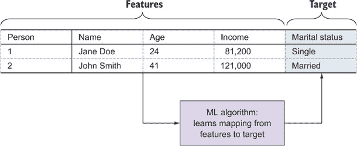

在这一点上，将机器学习算法想象成一个神奇的盒子，它执行从输入特征到输出数据的映射。为了构建一个有用的模型，你需要不止两行。与其他广泛使用的方法相比，机器学习算法的一个优点是能够处理许多特征。图 1.9 仅显示了四个特征，其中 *Person* ID 和 *Name* 可能对预测婚姻状况没有帮助。一些算法对无信息特征相对免疫，而其他算法如果省略这些特征可能会得到更高的准确率。第三章 更详细地介绍了算法类型及其在各种问题和数据集上的性能。

然而，值得注意的是，有时可以从看似无信息特征中提取出有价值的信息。例如，位置特征本身可能没有信息，但它可以导致如人口密度这样的信息特征。这种类型的数据增强，称为 *特征提取*，在现实世界的机器学习项目中非常重要，也是 第五章 和 第七章 的主题。

现在我们有了机器学习模型，现在可以对新数据进行预测——这些数据的目标变量是未知的。图 1.10 展示了这一过程，使用的是 图 1.9 中构建的神奇盒子模型。

##### 图 1.10\. 使用模型对新数据进行预测

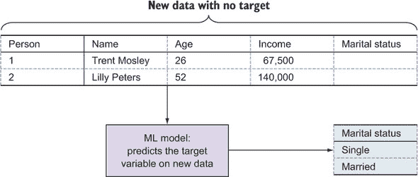

目标预测以与用于学习模型的原数据相同的形式返回。使用模型进行预测可以看作是填写新数据的目标列的空白。一些机器学习算法还可以输出与每个类别相关的概率。在我们的已婚/单身示例中，一个 *概率性* 机器学习模型会为每个新的人输出两个值：这个人已婚的概率和这个人单身的概率。

我们在途中省略了一些细节，但在原则上，你刚刚设计出了你的第一个机器学习系统。每个机器学习系统都是关于构建模型并使用这些模型进行预测。让我们用伪代码查看基本的机器学习工作流程，以获得另一个简单性的视角。

##### 列表 1.1\. 机器学习工作流程程序的初始结构

```
data = load_data("data/people.csv")
model = build_model(data, target="Marital status")
new_data = load_data("data/new_people.csv")
predictions = model.predict(new_data)
```

尽管我们还没有编写这些函数，但基本结构已经就位。到第三章（kindle_split_013.html#ch03）时，你会理解这些步骤；本书的其余部分（第四章（kindle_split_014.html#ch04）到第十章（kindle_split_021.html#ch10））是关于确保你为当前问题构建了最佳模型。

#### 1.3.3\. 评估模型性能

很少有机器学习系统在没有对模型性能进行某种验证的情况下投入使用。尽管我们在这章中省略了很多细节，但让我们假装你知道如何构建模型并进行预测。现在，你可以使用一个巧妙的技巧来了解你的模型在用于预测新数据之前的工作效果。

你取出一些数据，假装你不知道目标变量。然后你在剩余的数据上构建一个模型，并使用保留的数据（测试数据）进行预测。图 1.11 展示了这个模型测试过程。

##### 图 1.11\. 当使用测试集来评估模型性能时，你“假装”目标变量是未知的，并将预测与真实值进行比较。

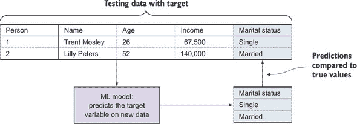

让我们再看看这个工作流程的伪代码。

##### 列表 1.2\. 我们的机器学习工作流程程序，包含模型评估

```
data = load_data(...)
training_data, testing_data = split_data(data)
model = build_model(training_data, target="Marital status")
true_values = testing_data.extract_column("Marital status")
predictions = model.predict(testing_data)
accuracy = compare_predictions(predictions, true_values)
```

现在，你可以将预测结果与已知的“真实”值进行比较，以了解模型的准确性。在伪代码中，这个功能隐藏在`compare_predictions`函数后面，而本书的第四章（kindle_split_014.html#ch04）大部分内容都是关于理解这个函数如何针对各种机器学习问题进行查找。

#### 1.3.4\. 优化模型性能

机器学习基本问题的最后一部分也包含在第四章（kindle_split_014.html#ch04）中：如何使用模型评估的结果来改进模型。你可以通过以下三种方式提高模型准确性：

+   ***调整模型参数—*** 机器学习算法配置了特定于底层算法的参数，这些参数的最佳值通常取决于数据的类型和结构。每个参数的值，或者任何组合的值，都可能影响模型的表现。我们介绍了寻找和选择最佳参数值的各种方法，并展示了这如何有助于确定针对特定数据集的最佳算法。

+   ***选择特征子集—*** 许多机器学习问题包括大量的特征，而这些特征的噪声有时会使得算法难以在数据中找到真正的信号，尽管它们本身可能仍然是有信息的。对于许多机器学习问题，拥有大量数据是好事；但有时也可能成为诅咒。因为你事先不知道何时这会影响你的模型性能，你必须仔细确定构成最通用和最准确模型的特征。

+   ***数据预处理——*** 如果你在网上搜索机器学习数据集，你会找到许多易于使用的、许多机器学习算法可以快速应用的数据集。然而，大多数现实世界的数据集并不是处于如此干净的状态，你将不得不进行清理和加工，这个过程通常被称为*数据整理*或*数据清洗*。数据集可能包括拼写不同的名称，尽管它们指的是同一个实体，或者包含缺失或错误的数据值，这些都会损害模型的性能。这听起来可能像是边缘情况，但你可能会惊讶，即使在复杂的数据驱动组织中，这种情况也经常发生。

在机器学习基础知识已经建立的基础上，你将在下一节中简要了解更高级的功能，然后再深入了解本节涵盖的主要组件的详细信息。

### 1.4. 使用高级技术提升模型性能

前一节介绍了任何现实世界机器学习项目中必不可少的步骤，现在你将了解一些常用于进一步提高模型性能的附加技术。根据数据和问题的不同，这些技术中的一些可以在准确度上带来显著的提升，但有时也会以训练和预测速度的降低为代价。这些技术将在第五章（[kindle_split_015.html#ch05](https://wiki.example.org/kindle_split_015.html#ch05)）至第十章（[kindle_split_021.html#ch10](https://wiki.example.org/kindle_split_021.html#ch10)）中更详细地解释，但本节将概述主要思想。

#### 1.4.1. 数据预处理和特征工程

你将在第二章（[kindle_split_012.html#ch02](https://wiki.example.org/kindle_split_012.html#ch02)）中了解各种类型的数据以及如何处理常见的混乱类型。但除了这项基本的数据清理之外，你还可以更进一步，从数据中提取额外的价值，这可能会提高你的模型性能。

在任何问题域中，特定的知识用于决定要收集的数据，并且这种宝贵的领域知识也可以用来从收集的数据中提取价值，实际上是在模型构建之前增加了模型的特征。我们称这个过程为*特征工程*，当之前介绍的基本机器学习工作流程对你来说已经变得习以为常时，你可能会发现自己几乎把所有的时间都花在这个优化过程的这部分。这也是机器学习的创造性部分，在这里你可以利用你的知识和想象力，通过深入数据并提取隐藏的价值来想出改进模型的方法。你将广泛使用我们经过统计验证的模型评估和优化步骤来区分当时看似不错的主意和真正有用的东西。以下是一些特征工程的重要示例：

+   ***日期和时间—*** 你会在许多数据集中看到日期或时间变量，但它们本身对机器学习算法来说并不有用，因为机器学习算法往往需要原始数字或类别。然而，这些信息可能是有价值的。如果你想预测要展示哪个广告，知道一天中的时间、一周中的哪一天以及一年中的哪个时间点肯定很重要。通过特征工程，可以从日期和时间中提取这些信息，并将其提供给模型。此外，当日期和时间出现在重复活动的观察中，例如用户在一个月或一年内重复访问网站时，它们可以用来计算可能具有预测性的间隔持续时间。例如，在购物网站上，用户可能在购买前更频繁地访问网站，以查看和比较商品和价格。

+   ***位置—*** 位置数据，如经纬度坐标或位置名称，在某些数据集中可用。这种信息有时可以单独使用，但你可能能够提取对特定问题有用的额外信息。例如，如果你想预测一个县的选举结果，你可能想要提取人口密度、平均收入和贫困率作为模型中的数字。

+   ***数字媒体—*** 这类数据包括文本、文档、图像和视频。使这类数据可用的特征工程是像狗和猫比赛这样的项目中的难点。首先从图像中提取边缘、形状和颜色光谱。然后使用数学变换对这些进行分类，其输出是一组可供分类算法使用的特征。

希望很明显，特征工程对于现实世界的机器学习项目来说可能很重要。第五章和第七章将详细介绍，介绍特定的特征工程技术；你将了解这些技术如何融入你的机器学习工作流程，以便在不变得过于复杂和容易过拟合的情况下提高模型性能。图 1.12 说明了特征工程如何集成到在第 1.3 节中引入的更大的机器学习工作流程中。

##### 图 1.12\. 在原始机器学习工作流程中插入的特征工程阶段

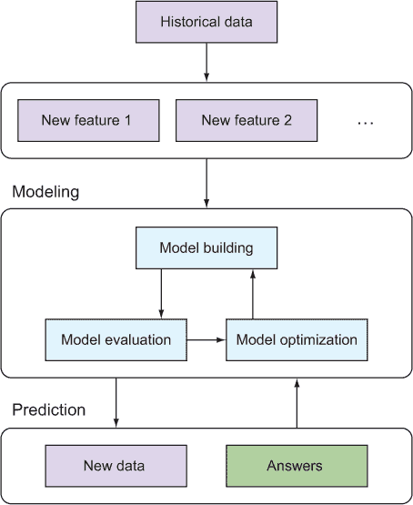

#### 1.4.2\. 使用在线方法持续改进模型

大多数传统的机器学习模型都是静态的，或者很少重建。但在许多情况下，你会有数据和预测反馈到系统中，你希望模型随着时间的推移而改进，并适应数据的变化。几种机器学习算法支持这种类型的*在线学习*；第八章介绍了这些算法及其潜在的风险。图 1.13 展示了如何将持续再学习集成到机器学习工作流程中。

##### 图 1.13\. 在这个在线机器学习系统的流程中，预测被反馈到模型中进行迭代改进。

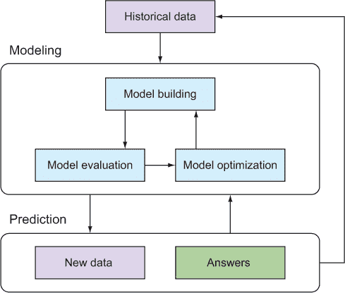

#### 1.4.3\. 随数据量和速度缩放模型

众所周知，数据集的大小和速度比以往任何时候增长得都要快。由于需要人类来获取答案，因此传统的监督方法数据集相对较小。今天，大量数据（包括答案）直接由传感器、机器或计算机产生，我们开始看到需要可扩展的机器学习算法来处理这些数据量。

第九章介绍了能够随着数据集大小的增长而扩展的机器学习方法的细节；你将看到它们是如何相互比较的，以及与非扩展算法的比较。

### 1.5\. 摘要

本章介绍了机器学习作为一种更好的、更数据驱动的决策方法。本章的主要要点如下：

+   机器学习算法与基于规则的系统不同，因为它们根据数据创建自己的模型。监督机器学习系统通过学习具有已知结果的示例的特征来泛化。

+   机器学习通常比手动构建的基于规则的系统更准确、自动化、快速、可定制和可扩展。

+   机器学习挑战包括识别和制定机器学习可以应用的问题、获取和转换数据以使其可用、找到适合问题的正确算法、特征工程和过拟合。

+   基本的机器学习工作流程包括数据准备、模型构建、模型评估、优化以及在新的数据上的预测。

+   在线学习模型通过使用其预测结果来更新自己，不断地重新学习。

### 1.6\. 本章术语

| 单词 | 定义 |
| --- | --- |
| 实例或示例 | 单个对象、观察、交易或记录。 |
| 目标或标签 | 感兴趣的数值或分类（标签）属性。这是每个新实例要预测的变量。 |
| 特征 | 用于预测目标的输入属性。这些也可能是数值或分类的。 |
| 模型 | 描述特征与目标之间关系的数学对象。 |
| 训练数据 | 包含已知目标以用于拟合机器学习模型的实例集。 |
| 回忆 | 使用模型来预测目标或标签。 |
| 监督机器学习 | 在已知输出值的示例的情况下，训练过程推断一个将输入值与输出值相关联的函数的机器学习。 |
| 非监督机器学习 | 不依赖于标记示例的机器学习技术，而是试图在未标记数据中找到隐藏的结构。 |
| 机器学习工作流程 | 机器学习过程中的阶段：数据准备、模型构建、评估、优化和预测。 |
| 在线机器学习 | 一种机器学习方法，其中对每个新示例进行预测，并更新模型。 |

在第二章中，你将深入了解收集数据、为机器学习使用准备数据以及使用可视化来获得选择最佳工具和方法所需的洞察力。

## 第二章\. 现实世界数据

*本章涵盖*

+   开始机器学习

+   收集训练数据

+   使用数据可视化技术

+   准备数据以供机器学习使用

在监督式机器学习中，你使用数据来教导自动化系统如何做出准确的决策。机器学习算法被设计用来发现历史训练数据中的模式和关联；它们从这些数据中学习，并将这种学习编码到模型中，以准确预测新数据的重要数据属性。因此，训练数据在机器学习的追求中是基本的。有了高质量的数据，细微的差别和相关性可以准确捕捉，并且可以构建高保真度的预测系统。但如果训练数据质量差，即使是最好的机器学习算法的努力也可能变得毫无用处。

本章作为你收集和整理训练数据以用于监督式机器学习工作流程（图 2.1）的指南。我们提供了为机器学习建模准备训练数据的一般指南，并警告了一些常见的陷阱。机器学习的许多艺术在于探索和可视化训练数据以评估数据质量和指导学习过程。为此，我们概述了一些最有用的数据可视化技术。最后，我们讨论了如何准备用于机器学习模型构建的训练数据集，这是第三章的主题。

##### 图 2.1\. 基本的机器学习工作流程。因为本章涉及数据，所以我们突出显示了表示历史数据和新的数据的方框。

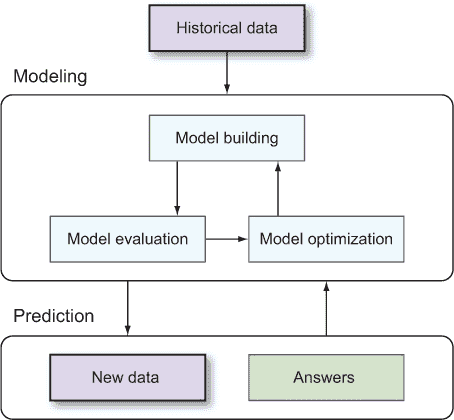

本章使用了一个真实的机器学习示例：*客户流失预测*。在商业中，*客户流失*指的是客户取消或取消订阅付费服务的行为。一个重要且价值高的任务是预测哪些客户可能在近期内流失。如果公司能够准确了解哪些客户可能会取消他们的服务，那么他们可以通过发送消息或提供折扣来干预。这种干预可以节省公司数百万美元，因为新客户获取的典型成本远超过对流失者的干预成本。因此，客户流失预测的机器学习解决方案——即提前几周预测可能流失的用户——可以非常有价值。

本章还使用了在线可用且在机器学习书籍和文档中广泛使用的数据集：泰坦尼克号乘客和汽车每加仑英里数数据集。

### 2.1\. 开始：数据收集

要开始学习机器学习，第一步是提出一个适合机器学习方法的疑问。尽管机器学习有许多风味，但大多数现实世界的机器学习问题都涉及*预测感兴趣的目标变量（或变量）*。在这本书中，我们主要涵盖这些监督式机器学习问题。适合监督式机器学习方法的疑问包括以下内容：

+   本月哪些客户会流失？

+   这个用户会点击我的广告吗？

+   这个用户账户是否欺诈？

+   这条推文的情绪是负面、正面还是中性？

+   下个月我的产品需求量会是多少？

你会注意到这些问题中存在一些共同点。首先，它们都需要对感兴趣的某个或某些实例进行评估。这些实例可以是人（例如，在流失问题中），事件（例如，推文情绪问题），甚至时间段（例如，在产品需求问题中）。

第二，这些问题的每一个都有一个明确的目标，在某些情况下是二元的（流失与否，欺诈与否），在某些情况下具有多个类别（负面、正面、中性），甚至数百或数千个类别（从大型图书馆中选择一首歌），在其他情况下则具有数值（产品需求）。请注意，在统计学和计算机科学中，*目标*也常被称为*响应*或*因变量*。这些术语可以互换使用。

第三，这些问题的每一个都可以有包含已知目标的历史数据集。例如，在几周或几个月的数据收集过程中，你可以确定哪些订阅者流失了，哪些人点击了你的广告。通过一些手动努力，你可以评估不同推文的情绪。除了已知的目标值之外，你的历史数据文件还将包含在预测时可知的每个实例的信息。这些是*输入特征*（也常被称为*解释性*或*自变量*）。例如，每个客户的消费历史，连同客户的人口统计信息和账户信息，将是流失预测的适当输入特征。输入特征，连同目标变量的已知值，构成了*训练集*。

最后，如果目标变量是可知的，每个问题都隐含着一个*行动*。例如，如果你知道一个用户会点击你的广告，你就会对该用户进行出价并展示广告。同样，如果你精确地知道下个月的产品需求，你就会调整供应链以匹配该需求。机器学习算法的作用是使用训练集来确定如何使用输入特征集最准确地预测目标变量。这种“学习”的结果编码在机器学习模型中。当观察到新的实例（具有未知的目标）时，它们的特征被输入到机器学习模型中，该模型对那些实例生成预测。最终，这些预测使最终用户能够采取更明智（更快）的行动。除了产生预测外，机器学习模型还允许用户推断输入特征与目标变量之间的关系。

让我们将所有这些内容放在客户流失预测问题的背景下。想象一下，你为一家电信公司工作，而你感兴趣的问题是：“下个月，我的哪些当前手机用户会取消订阅？”在这里，每个实例都是一个当前用户。同样，目标变量是每个用户在那个月是否取消服务的二元结果。输入特征可以包括任何在月初可知的关于每个客户的信息，例如账户当前时长、订阅计划的详细信息以及如上个月的总通话次数和使用的分钟数等信息。图 2.2 显示了电信客户流失预测的一个示例训练集的前四行。

##### 图 2.2. 用于电信客户流失问题的四个实例的训练数据

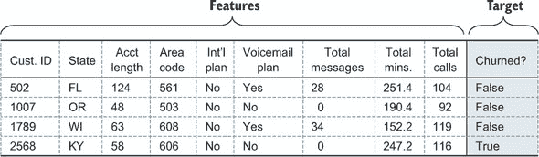

本节的目标是提供一个基本指南，以正确收集机器学习训练数据。数据收集可能因行业而异，但在组装训练数据时，会出现一些常见的问题和痛点。以下子节提供了一个实用指南，以解决四个最常见的数据收集问题：

+   我应该包含哪些输入特征？

+   我如何获得目标变量的已知值？

+   我需要多少训练数据？

+   我如何知道我的训练数据是否足够好？

#### 2.1.1. 应包含哪些特征？

在机器学习问题中，你通常会有一打以上的特征可以用来预测目标变量。在电信客户流失问题中，关于每个客户的人口统计信息（年龄、性别、位置）、订阅计划（状态、剩余时间、上次续订时间、首选状态）以及使用情况（通话记录、短信数据和数据使用、支付历史）都可能作为输入特征可用。关于是否可以将某物用作输入特征，存在两个实际限制：

+   特征的值必须在需要预测时已知（例如，对于电信 churn 示例，在月初时）。

+   特征必须是数值或分类性质（第五章展示了如何通过特征工程将非数值数据转换为特征）。

呼叫历史数据流等数据可以通过计算数据摘要统计量（如总通话分钟数、白天/夜间通话分钟数比率、周内/周末通话分钟数比率以及网络使用分钟数比例）转换成一组数值和/或分类特征。

在如此众多的可能特征中，你应该使用哪些呢？作为一个简单的经验法则，只有当特征被认为与目标变量相关时才应该包含在内。既然监督式机器学习的目标是预测目标，那么显然与目标无关的特征应该被排除。例如，如果每个客户都有一个独特的识别号码，那么这个号码就不应该用作输入特征来预测客户是否会取消订阅。这样的无用特征使得从数据中的随机扰动（噪声）中检测真正的关联（信号）变得更加困难。不具信息量的特征越多，信噪比越低，因此机器学习模型的平均准确性就越低。

同样，排除一个输入特征，因为它之前并未被认定为与目标相关，也可能损害你的机器学习模型的准确性。实际上，机器学习的角色就是发现数据中的新模式和关系！例如，假设有一个特征是计算当前未打开语音邮件的数量，如果这个特征被排除在特征集之外，那么一些小部分人群因为决定在下个月更换运营商而停止检查语音邮件。这个信号会在数据中表现为拥有大量未打开语音邮件的客户 churn 条件概率略有增加。排除这个输入特征将使机器学习算法失去重要信息，因此会导致机器学习系统的预测准确性降低。由于机器学习算法能够发现微妙的非线性关系，超出已知的一阶效应的特征可能会对模型的准确性产生重大影响。

在选择要使用的输入特征集时，你会面临一个权衡。一方面，将所有可能想到的特征（“大杂烩”）都放入模型中，可能会淹没那些包含任何信号的少量特征，而这些特征被大量的噪声所淹没。因此，机器学习模型的准确性会受到影响，因为它无法区分真实模式与随机噪声。另一方面，手动选择一小部分已知与目标变量相关的特征，可能会导致你遗漏其他高度预测性的特征。结果，机器学习模型的准确性会受到影响，因为模型不知道被忽视的特征，而这些特征是目标变量的预测因素。

面对这种权衡，最实际的方法是以下：

1.  包含所有你认为可能预测目标变量的特征。拟合一个机器学习模型。如果模型的准确性足够，则停止。

1.  否则，通过包括其他与目标变量不那么明显相关的特征来扩展特征集。拟合另一个模型并评估准确性。如果性能足够，则停止。

1.  否则，从扩展的特征集开始，运行机器学习*特征选择算法*以选择你扩展特征集中最好、最预测性的子集。

我们在第五章进一步讨论了特征选择算法。这些方法寻求在特征集的子集上构建最准确的模型；它们在特征集中保留信号，同时丢弃噪声。尽管计算成本高昂，但它们可以在模型性能上带来巨大的提升。

为了完成这个子节，重要的是要注意，为了使用输入特征，该特征不需要在每个实例中都存在。例如，如果你的客户群中只有 75%的客户年龄已知，你仍然可以使用年龄作为输入特征。我们将在本章后面讨论处理缺失数据的方法。

#### 2.1.2\. 我们如何获得目标变量的真实值？

在开始监督机器学习时，最困难的障碍之一是收集具有已知目标变量的训练实例。这个过程通常需要运行现有的次优系统一段时间，直到收集到足够的训练数据。例如，在构建电信客户流失的机器学习解决方案时，你首先需要耐心等待几周或几个月，观察一些客户取消订阅而另一些客户续订。在你收集到足够的训练实例以构建准确的机器学习模型后，你可以切换开关并开始在生产中使用机器学习。

每个用例都将有一个不同的过程，通过这个过程可以收集或估计真实值——目标变量的实际或观察到的值。例如，考虑以下几个选定的机器学习用例的训练数据收集过程：

+   ***广告定位——*** 你可以运行几天活动以确定哪些用户点击了你的广告，哪些用户进行了转化。

+   ***欺诈检测——*** 你可以仔细检查你的历史数据，以确定哪些用户是欺诈的，哪些是合法的。

+   ***需求预测——*** 你可以查看你过去几个月或几年的供应链管理数据日志，以确定过去几个月或几年的需求。

+   ***Twitter 情感分析——*** 获取真实意图的情感信息相当困难。你可以通过让人们阅读并评论一组推文（或使用众包）来进行手动分析。

虽然收集已知目标变量的实例可能既耗时又耗钱，但迁移到机器学习解决方案的好处可能会远远弥补这些损失。获取目标变量真实值的其他方法包括以下：

+   指派分析师手动检查过去或当前数据，以确定或估计目标的真实值

+   使用众包来利用“群体智慧”以获得目标估计

+   对客户进行后续访谈或其他实际实验

+   运行控制实验（例如，A/B 测试）并监控响应

这些策略都需要大量的人工劳动，但通过仅收集对机器学习模型影响最大的实例的目标变量，你可以加速学习过程并缩短收集训练数据所需的时间。这种方法的一个例子是称为*主动学习*的方法。给定一个现有的（小）训练集和一个（大）的数据集，其中包含未知响应变量，主动学习识别出后者集中包含在训练集中将产生最准确机器学习模型的实例子集。从这个意义上说，主动学习可以通过集中人工资源来加速准确机器学习模型的生产。有关主动学习及相关方法的更多信息，请参阅 Dasgupta 和 Langford 于 2009 年在 ICML 上的演示。^([[1)]

> ¹
> 
> 查看[`videolectures.net/icml09_dasgupta_langford_actl/`](http://videolectures.net/icml09_dasgupta_langford_actl/)。

#### 2.1.3\. 需要多少训练数据？

由于观察和收集数据实例的响应变量的困难，你可能会想知道需要多少训练数据才能使机器学习模型运行起来。不幸的是，这个问题如此特定于问题本身，以至于无法给出普遍的回应，甚至没有一个经验法则。

这些因素决定了所需训练数据量：

+   问题的复杂性。输入特征与目标变量之间的关系是简单的模式，还是复杂且非线性的？

+   准确度的要求。如果你只需要达到 60%的成功率来解决你的问题，那么所需的训练数据量将少于你需要达到 95%成功率的情况。

+   特征空间的维度。如果只有两个输入特征可用，所需的训练数据量将少于有 2,000 个特征的情况。

一个需要记住的指导原则是，随着训练集的增长，模型（平均而言）将变得更加准确。（这假设数据仍然代表持续的数据生成过程，你将在下一节中了解更多。）更多的训练数据导致更高的准确率，因为机器学习模型的数据驱动特性。由于特征和目标之间的关系完全是从训练数据中学习的，所以你拥有的越多，模型识别和捕捉更微妙模式和关系的能力就越强。

使用本章前面提到的电信数据，我们可以展示机器学习模型如何随着更多训练数据的增加而提高，并提供一种评估是否需要更多训练数据的方法。电信训练数据集包含 3,333 个实例，每个实例包含 19 个特征以及未订阅与续订的二进制结果。使用这些数据，可以轻松评估你是否需要收集更多数据。请执行以下操作：

1.  使用当前的训练集，选择一个子样本大小的网格进行尝试。例如，对于这个包含 3,333 个训练数据实例的电信训练集，你的网格可以是 500；1,000；1,500；2,000；2,500；3,000。

1.  对于每个样本大小，从训练集中随机抽取这么多实例（不重复抽取）。

1.  对于每个训练数据的子样本，构建一个机器学习模型并评估该模型的准确率（我们在第四章中讨论了机器学习评估指标 chapter 4）。

1.  评估准确率随样本大小的变化情况。如果它似乎在较大的样本大小上趋于平稳，那么现有的训练集可能足够。但如果准确率对于较大的样本继续上升，那么包含更多的训练实例可能会提高准确率。

或者，如果你有一个明确的准确率目标，你可以使用这种策略来评估你的当前基于现有训练数据的机器学习模型是否已经实现了该目标（在这种情况下，没有必要收集更多的训练数据）。

图 2.3 展示了电信数据集中使用训练实例数量作为函数的拟合机器学习模型准确率的变化。在这种情况下，很明显，随着训练数据的增加，机器学习模型会提高：从 250 个到 500 个再到 750 个训练示例，准确率水平显著提高。然而，当你将训练实例的数量增加到 2,000 个以上时，准确率趋于平稳。这是证据表明，如果你添加更多的训练实例，机器学习模型不会显著提高。（这并不意味着通过使用更多特征不能实现显著的改进。）

##### 图 2.3\. 测试现有 3,333 个训练实例的样本是否足够构建一个准确的电信客户流失机器学习模型。黑色线条表示评估流程重复 10 次后的平均准确率，阴影带表示误差范围。

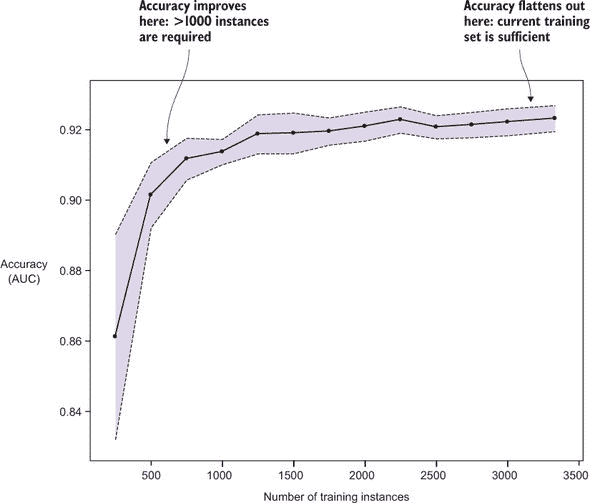

#### 2.1.4\. 训练集是否足够具有代表性？

除了训练集的大小之外，生成准确预测机器学习模型的另一个重要因素是训练集的*代表性*。训练集中的实例与未来将要收集的实例有多相似？因为监督机器学习的目标是生成对新数据的准确预测，所以训练集必须代表你最终想要生成预测的实例类型。由未来数据可能呈现的非代表性样本组成的训练集被称为*样本选择偏差*或*协变量偏移*。

训练样本可能由于以下几个原因不具有代表性：

+   只能从某些具有偏差的子样本中获取目标变量的真实值。例如，如果你的历史数据中的欺诈实例只有在造成公司损失超过 1000 美元时才会被检测到，那么在该数据上训练的模型将难以识别损失低于 1000 美元的欺诈案例。

+   实例的性质随着时间的推移而发生了变化。例如，如果你的训练示例包括医疗保险欺诈的历史数据，但新的法律大大改变了医疗保险公司必须进行业务的方式，那么你对新数据的预测可能不合适。

+   输入特征集随着时间的推移而发生了变化。例如，假设你收集的每个客户的地理位置属性集合发生了变化；你以前收集的是邮政编码和州，但现在收集 IP 地址。这种变化可能需要你修改用于模型的特征集，并可能需要从训练集中丢弃旧数据。

在这些情况下，拟合到训练数据的机器学习模型可能无法很好地推广到新数据。借用一句谚语：你不会想用训练在苹果上的模型去尝试预测橙子！该模型在橙子上的预测准确性可能不会很好。

为了避免这些问题，重要的是尽可能使训练集与未来数据相似。这意味着要以一种方式结构化你的训练数据收集过程，以便消除偏差。正如我们在下一节中提到的，可视化也可以帮助确保训练数据具有代表性。

现在你已经了解了如何收集训练数据，你的下一个任务是结构化和组装这些数据，为机器学习模型构建做准备。下一节将展示如何预处理你的训练数据，以便开始构建模型（第三章的主题）。

### 2.2\. 为建模预处理数据

收集数据是准备数据用于建模的第一步，但有时你必须根据数据集的组成运行数据通过几个预处理步骤。许多机器学习算法仅适用于数值数据——整数和实值数。最简单的机器学习数据集以这种格式出现，但许多还包括其他类型的特征，例如分类变量，并且一些数据集存在缺失值。有时你需要通过特征工程构建或计算特征。一些数值特征可能需要缩放以使它们可比较或使它们与频率分布保持一致（例如，在正态曲线上评分）。在本节中，你将了解现实世界机器学习所需的一些常见数据预处理步骤。

#### 2.2.1. 分类特征

最常见的非数值特征类型是分类特征。如果一个特征可以放入桶中，并且值的顺序不重要，则该特征是*分类的*。在某些情况下，此类特征很容易识别（例如，当它只具有几个字符串值时，如`spam`和`ham`）。在其他情况下，一个特征是数值（整数）特征还是分类特征并不那么明显。有时两种可能都是有效的表示，并且选择可能会影响模型的性能。一个例子是表示一周中某天的特征，它可以有效编码为数值（自星期日以来的天数）或分类（星期一、星期二等名称）。你将不会在第三章和第四章中查看模型构建和性能，但本节介绍了一种处理分类特征的技术。图 2.4 指出了几个数据集中的分类特征。

##### 图 2.4. 识别分类特征。顶部是简单的 Person 数据集，它有一个婚姻状况分类特征。底部是关于泰坦尼克号乘客的数据集。这里被识别为分类特征的有：Survived（乘客是否幸存），Pclass（乘客所乘的等级），Gender（男性或女性），和 Embarked（乘客出发的城市）。

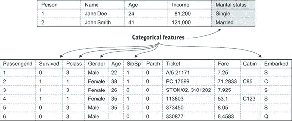

一些机器学习算法可以原生地使用分类特征，但通常它们需要数值形式的数据。你可以将分类特征编码为数字（每个类别一个数字），但你不能将这种编码后的数据用作真正的分类特征，因为这样你引入了（任意的）类别顺序。回想一下，分类特征的一个属性是它们是无序的。相反，你可以将每个类别转换为单独的二进制特征，对于出现该类别的实例，其值为 1，未出现时为 0。因此，每个分类特征都转换为一系列二进制特征，每个类别一个。以这种方式构建的特征有时被称为 *虚拟变量*。图 2.5 进一步说明了这个概念。

##### 图 2.5. 将分类列转换为数值列

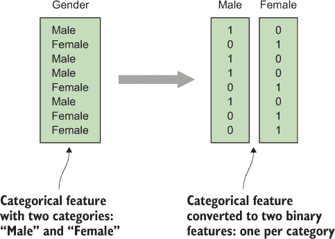

将 图 2.5 中的分类特征转换为二进制特征的伪代码如下所示。请注意，`categories` 是一种特殊的 NumPy 类型 ([www.numpy.org](http://www.numpy.org))，使得 `(data == cat)` 产生一个布尔值列表。

##### 列表 2.1. 将分类特征转换为数值二进制特征

```
def cat_to_num(data):
     categories = unique(data)
     features = []
     for cat in categories:
            binary = (data == cat)
            features.append(binary.astype("int"))
     return features
```

|  |
| --- |

##### 注意

熟悉 Python 编程语言的读者可能已经注意到，前面的例子不仅仅是伪代码，也是有效的 Python 代码。你会在整本书中看到很多这样的例子：我们以伪代码的形式引入代码片段，除非另有说明，否则它都是可运行的代码。为了使代码更简单，我们隐式地导入了几个辅助库，例如 `numpy` 和 `scipy`。我们的示例通常在包含 `from numpy import *` 和 `from scipy import *` 的情况下可以工作。请注意，尽管这种方法在交互式尝试示例时很方便，但你绝对不应该在实际应用中使用它，因为 `import *` 结构可能会导致名称冲突和意外结果。所有代码示例都可以在随附的 GitHub 仓库中检查和直接执行：[`github.com/brinkar/real-world-machine-learning`](https://github.com/brinkar/real-world-machine-learning)。

|  |
| --- |

分类到数值的转换技术适用于大多数机器学习算法。但有一些算法（如某些类型的决策树算法和相关算法，如随机森林）可以原生地使用分类特征。对于高度分类的数据集，这通常会得到更好的结果，我们将在下一章进一步讨论这一点。在将分类特征转换为二进制特征后，我们的简单 Person 数据集如图 2.6 所示。

##### 图 2.6. 将分类婚姻状态特征转换为二进制数值特征后的简单 Person 数据集。（原始数据集显示在 图 2.4 中。）

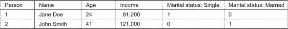

#### 2.2.2. 处理缺失数据

你已经看到了一些包含缺失数据的示例数据集。在表格数据集中，缺失数据通常表现为空单元格，或包含 NaN（非数字）、N/A 或 None 的单元格。缺失数据通常是数据收集过程中的一个副产品；由于某种原因，对于某个数据实例，特定的值无法被测量。图 2.7 展示了泰坦尼克号乘客数据集中缺失数据的示例。

##### 图 2.7\. 泰坦尼克号乘客数据集中的年龄和船舱列存在缺失值。乘客信息是从各种历史来源中提取的，因此在这种情况下，缺失值源于在来源中找不到的信息。

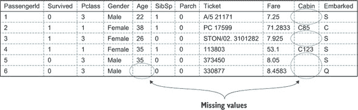

缺失数据主要有两种类型，你需要以不同的方式处理它们。首先，对于某些数据，*数据缺失的事实*可能携带着对机器学习算法有用的有意义信息。另一种可能性是，数据缺失仅仅是因为其测量是不可能的，信息的不可用本身并没有其他意义。例如，在泰坦尼克号乘客数据集中，例如，船舱列中的缺失值可能表明那些乘客处于较低的社会或经济阶层，而年龄列中的缺失值则不携带任何有用的信息（当时特定乘客的年龄根本无法找到）。

让我们先考虑*信息性*缺失数据的情况。当你认为数据中缺少信息时，你通常希望机器学习算法能够利用这些信息来潜在地提高预测准确性。为了实现这一点，你希望将缺失值转换为与列中一般格式相同。对于数值列，这可以通过将缺失值设置为-1 或-999 来完成，具体取决于非空值的典型值。在数值谱的一端选择一个数字来表示缺失值，并记住顺序对数值列很重要。你不希望选择分布中间的值。

对于具有潜在信息性缺失数据的分类列，你可以创建一个名为“缺失”、“None”或类似的新的类别，然后以通常的方式处理分类特征（例如，使用上一节中描述的技术）。图 2.8 展示了处理有意义的缺失数据的一个简单示意图。

##### 图 2.8\. 如何处理有意义的缺失数据

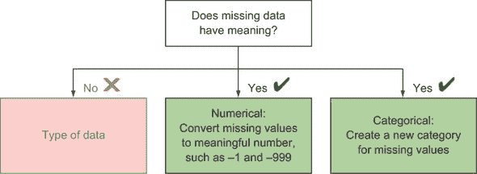

当数据项缺失的值本身没有信息价值时，你将采取不同的方法。在这种情况下，你不能引入一个特殊的数字或类别，因为你可能会引入完全错误的数据。例如，如果你将泰坦尼克号乘客数据集中年龄列的任何缺失值更改为-1，你可能会因为没有任何理由而破坏年龄分布而损害模型。一些机器学习算法能够通过忽略这些真正的缺失值来处理这些缺失值。如果不能，你需要预处理数据，要么消除缺失值，要么通过猜测真实值来替换它们。这种替换缺失数据的概念被称为*插补*。

如果你的数据集很大，但缺失值只有少数几个，那么删除带有缺失数据的观测值是最简单的方法。但是，当你的观测值中有较大一部分包含缺失值时，删除观测值中丢失的完美数据将降低你模型的预测能力。此外，如果带有缺失值的观测值在数据集中不是随机分布的，这种方法可能会引入意外的偏差。

另一种简单的方法是假设数据实例具有某种时间顺序，并用前一行列的值替换缺失值。在没有其他信息的情况下，你是在猜测一个测量值从一个实例到下一个实例没有变化。不用说，这个假设通常是不正确的，但比例如用零填充缺失值要正确得多，尤其是如果数据是一系列连续观测（昨天的温度不是对今天温度的不合理估计）。对于极其庞大的数据，你并不总是能够应用更复杂的方法，而这些简单的方法可能是有用的。

当可能时，通常更好的做法是使用现有数据的一部分来猜测缺失值。你可以通过替换缺失的列值来使用该列的平均值或中位数。在没有其他信息的情况下，你假设平均值最接近真实值。根据列值的分布，你可能想使用中位数；平均值对异常值敏感。这些方法在今天的机器学习中广泛使用，并且在许多情况下效果良好。但是，当你将所有缺失值设置为单个新值时，你会减少潜在的相关性可见性，这些相关性对于算法检测数据中的某些模式可能很重要。

如果您能做的话，您想做的就是使用您所能利用的所有数据来预测缺失变量的值。这听起来熟悉吗？这正是机器学习的核心，所以您基本上是在考虑构建 ML 模型，以便能够构建 ML 模型。在实践中，您通常会使用简单的算法（如线性或逻辑回归，在第三章中描述）来填补缺失数据。这不一定与主 ML 算法相同。无论如何，您正在创建一个 ML 算法的管道，它引入了更多的旋钮来最终优化模型。

再次强调，处理真正缺失数据没有唯一最佳方法。我们已经在本节中讨论了几种方法，图 2.9 总结了可能性。

##### 图 2.9。为 ML 建模准备数据时处理缺失值的完整决策图。


#### 2.2.3。简单特征工程

第五章 讨论了特定领域和高级特征工程技术，但为了使模型更好，值得提及简单数据预处理的基本思想。

您将在本节中再次使用泰坦尼克号示例。图 2.10 展示了数据的一部分，特别是客舱功能。未经处理，客舱功能不一定有用。一些值似乎包含多个客舱，甚至单个客舱也不太可能是一个好的分类特征，因为所有客舱都会是分开的“桶”。如果您想预测，例如，某个乘客是否幸存，住在特定客舱而不是相邻客舱可能没有任何预测能力。

##### 图 2.10。在泰坦尼克号乘客数据集中，一些客舱值包含多个客舱，而另一些则缺失。而且客舱标识符本身可能不是好的分类特征。

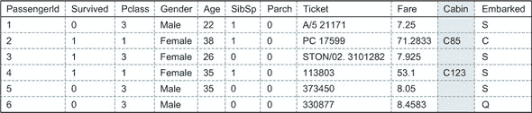

然而，住在船的特定部分对于生存可能很重要。对于单个客舱 ID，您可以提取字母作为分类特征，数字作为数值特征，假设它们代表船的不同部分。您甚至可以找到泰坦尼克号的布局图，并将每个客舱映射到船的楼层和侧面，面向海洋还是内部，等等。这些方法不处理多个客舱 ID，但由于看起来所有多个客舱都彼此靠近，因此仅提取第一个客舱 ID 应该足够。您还可以将客舱数量包含在一个新特征中，这也可能相关。

总的来说，您将从 Cabin 功能中创建三个新功能。以下列表显示了这种简单提取的代码。

##### 列表 2.2。泰坦尼克号客舱的简单特征提取。

```
def cabin_features(data):
    features = []
    for cabin in data:
        cabins = cabin.split(" ")
        n_cabins = len(cabins)
        # First char is the cabin_char
        try:
            cabin_char = cabins[0][0]
        except IndexError:
            cabin_char = "X"
            n_cabins = 0
        # The rest is the cabin number
        try:
            cabin_num = int(cabins[0][1:]) 
        except:
            cabin_num = -1
        # Add 3 features for each passanger
        features.append( [cabin_char, cabin_num, n_cabins] )
    return features
```

到现在为止，我们所说的*特征工程*的含义应该不再令人惊讶：使用现有的特征来创建新的特征，通过应用我们对数据或相关领域的知识，从而提高原始数据的价值。如前所述，你将研究高级特征工程概念和大多数算法需要处理的常见数据类型。这些包括用于网页或推文的自由格式文本特征。其他重要的特征也可以从图像、视频和时间序列数据中提取。

#### 2.2.4. 数据归一化

一些机器学习算法需要数据被*归一化*，这意味着每个单独的特征都已经被处理，使其位于相同的数值尺度上。一个特征的价值范围可以影响该特征相对于其他特征的重要性。如果一个特征的价值在 0 到 10 之间，而另一个特征的价值在 0 到 1 之间，那么第一个特征的重要性是第二个特征的 10 倍。有时你可能想要强制设置特定的特征权重，但通常让机器学习算法确定特征的相对权重会更好。为了确保所有特征都被同等考虑，你需要对数据进行归一化。通常，数据会被归一化到 0 到 1 的范围，或者从-1 到 1 的范围。

让我们考虑这种归一化是如何进行的。以下代码示例实现了这个函数。对于每个特征，你希望数据分布在最小值（通常是-1）和最大值（通常是+1）之间。为了实现这一点，你需要将数据除以数据的总范围，以便将数据放入 0-1 的范围。从这里，你可以通过乘以这个转换后的值来重新扩展到所需的范围（在-1 到+1 的情况下是 2）。最后，你将起点从 0 移动到所需的最小值（例如，-1）。

##### 列表 2.3. 特征归一化

```
def normalize_feature(data, f_min=-1.0, f_max=1.0):
    d_min, d_max = min(data), max(data)
    factor = (f_max - f_min) / (d_max - d_min)
    normalized = f_min + (data - d_min)*factor
    return normalized, factor
```

注意，你需要返回归一化的数据和用于归一化的因子。你这样做是因为任何新的数据（例如，用于预测）都必须以相同的方式进行归一化，才能得到有意义的结果。这也意味着机器学习模型构建者将不得不记住特定特征是如何归一化的，并保存相关的值（因子和最小值）。

我们将实现一个函数的任务留给你，该函数接受新的数据、归一化因子和归一化的最小值，并重新应用归一化。

当你扩展你的数据处理工具集并探索各种数据时，你会发现每个数据集都有其独特的品质，使其变得独特且通常具有挑战性。但是，具有许多变量的大量数据很难通过查看表格表示来完全理解。图形数据可视化工具对于理解你希望从中提取隐藏信息的数据至关重要。

### 2.3. 使用数据可视化

在数据收集/预处理和机器学习模型构建之间，数据可视化是一个重要的步骤。在深入机器学习的机制和预测之前，数据可视化充当了对训练特征和目标变量的合理性检查。通过简单的可视化技术，你可以开始探索输入特征与输出目标变量之间的关系，这将指导你在模型构建中的工作，并帮助你理解机器学习模型和预测。此外，可视化技术可以告诉你训练集的代表性和可能缺乏的实例类型。

本节重点介绍可视化目标变量与输入特征之间关联的方法。我们推荐四种可视化技术：约束图、箱线图、密度图和散点图。每种技术适用于不同类型（数值或分类）的输入特征和目标变量，如图 2.11 所示。

##### 图 2.11. 按输入特征和要绘制的响应变量类型排列的四种可视化技术


| |
| --- |

**进一步阅读**

有许多书籍致力于统计可视化和数据绘图。如果你想要深入了解这个主题，请查看以下内容：

+   经典教科书《定量信息的视觉展示》由 Edward Tufte（Graphics Press，2001）所著，详细介绍了数据可视化的分析和展示方法。

+   对于 R 用户来说，Winston Chang（O’Reilly，2013）所著的《R Graphics Cookbook》涵盖了 R 中的数据可视化，从基础知识到高级主题，并提供了代码示例以供参考。

+   对于 Python 用户，Igor Milovanović、Dimitry Foures 和 Giuseppe Vettigli（Packt Publishing，2015）所著的《Python Data Visualization Cookbook》涵盖了从基础知识到使用 Matplotlib 运行的内容。

| |
| --- |

#### 2.3.1. 约束图

*约束图* 允许你可视化两个或更多分类变量之间的关系。用于约束图的绘图软件在 R、SAS、Python 以及其他科学或统计编程语言中都有提供。

为了展示约束图的应用，你将使用它来显示乘客性别与泰坦尼克号乘客数据集中生存率之间的关系。约束图从一个边长为 1 的正方形开始。然后，通过垂直线将正方形分割成一系列矩形，其宽度对应于属于输入特征每个类别的数据比例。例如，在泰坦尼克号数据中，24% 的乘客是女性，因此你将单位正方形沿 x 轴分割成两个矩形，其面积宽度为 24% / 76%。

接下来，每个垂直矩形被水平线分割成子矩形，这些子矩形的相对面积与响应变量每个类别的实例百分比成比例。例如，在泰坦尼克号上的女性乘客中，74%幸存（这是在乘客为女性的条件概率）。因此，女性矩形被水平线分割成两个子矩形，包含矩形面积的 74% / 26%。对男性矩形（男性中，比例是 19% / 81%）也进行相同的处理。

这结果是一个关于性别与生存关系的快速可视化。如果没有关系，水平分割将在 y 轴上的相似位置发生。如果存在强烈的关系，水平分割将相隔甚远。为了增强可视化效果，矩形被着色编码以评估关系的统计显著性，与输入特征和响应变量的独立性相比，负残差较大（“低于预期计数”）被深灰色着色，正残差较大（“高于预期计数”）被浅灰色着色；参见图 2.12。

##### 图 2.12. 展示性别与泰坦尼克号生存关系的马赛克图。可视化显示，与性别独立于生存预期相比，女性的幸存比例要高得多（男性的幸存比例要小得多）。“妇女和儿童优先。”

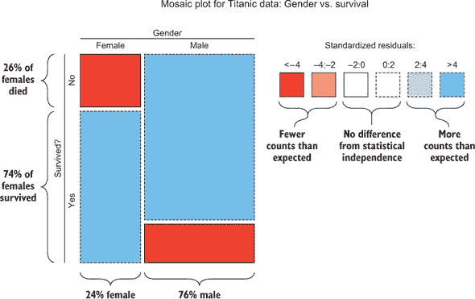

这说明，在构建一个用于预测泰坦尼克号生存情况的机器学习模型时，性别是一个重要的因素需要考虑。它还允许你对性别与生存之间的关系进行合理性检查：确实，众所周知，女性在这次灾难中幸存的比例更高。这为你提供了额外的保证，确保你的数据是合法的。这样的数据可视化也有助于你在模型构建后解释和验证你的机器学习模型。

图 2.13 展示了另一个关于生存与乘客等级（头等舱、二等舱和三等舱）的马赛克图。正如预期的那样，头等舱乘客的幸存比例更高（三等舱乘客的幸存比例更低）。显然，乘客等级也是预测生存的机器学习模型中的一个重要因素，关系正好如你所预期：等级更高的乘客有更高的生存概率。

##### 图 2.13. 展示乘客等级与泰坦尼克号生存关系的马赛克图

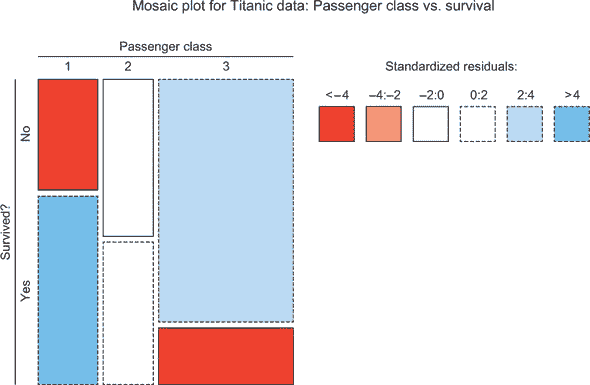

#### 2.3.2. 箱线图

*箱线图* 是一种标准的统计绘图技术，用于可视化数值变量的分布。对于一个单一变量，箱线图描绘了其分布的 *四分位数*：最小值、25 百分位数、中位数、75 百分位数和最大值。单一变量的箱线图可视化有助于深入了解其值分布的中心、离散度和偏度，以及是否存在任何异常值。

你还可以使用箱线图来比较在平行图中绘制的分布。特别是，它们可以用来可视化数值特征随分类响应变量的各种类别变化的分布差异。回到泰坦尼克号的例子，你可以通过使用平行箱线图来可视化幸存者和死亡者的年龄差异，如图 2.14 所示。在这种情况下，幸存者和死亡者的乘客年龄分布之间似乎没有明显的差异，因为两个箱线图在形状和位置上看起来相当相似。

##### 图 2.14\. 箱线图展示了乘客年龄与泰坦尼克号幸存率之间的关系。幸存者和死亡者的年龄分布之间没有明显的差异。（这本身 *不应该是* 排除年龄作为机器学习模型因素的理由，因为它可能仍然是一个预测因素。）

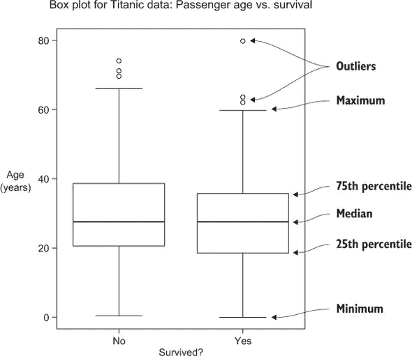

认识到可视化技术的局限性是很重要的。可视化不能替代机器学习建模！机器学习模型可以发现并利用数据深处隐藏的微妙关系，这些关系不适合通过简单的可视化来揭示。你不应该自动排除那些可视化没有显示出与目标变量明确关联的特征。这些特征在与其他输入特征一起使用时，可能仍然与目标变量有强烈的关联。例如，尽管年龄与生存率之间没有显示出明显的关联，但可能对于三等舱乘客来说，年龄是一个重要的预测因素（也许对于三等舱乘客，年轻且强壮的乘客比年长的乘客更容易到达船的甲板）。一个好的机器学习模型将发现并揭示这种关系，因此，可视化本身并不旨在排除年龄作为一个特征。

图 2.15 展示了探索乘客票价与生存结果之间关系的箱线图。在左侧面板中，很明显，支付票价的分布高度偏斜（许多小值和一些大异常值），这使得差异难以可视化。通过票价（在右侧面板中为平方根）的简单转换，可以解决这个问题，使得差异易于发现。支付票价与生存状态有明显的关联：支付更高票价的人更有可能生存，正如预期的那样。因此，票价金额应该包含在模型中，因为你期望机器学习模型能够发现并利用这种正相关关系。

##### 图 2.15\. 展示乘客票价与泰坦尼克号生存之间关系的箱线图。平方根转换使得显而易见，幸存下来的乘客平均支付了更高的票价。

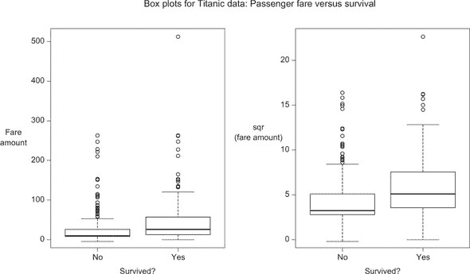

#### 2.3.3\. 密度图

现在，我们将转向数值型响应变量，而不是分类型响应变量。当输入变量是分类型时，你可以使用箱线图来可视化两个变量之间的关系，就像你在前一节中所做的那样。你还可以使用密度图。

*密度图*比箱线图更详细地显示了单个变量的分布。首先，估计变量的概率分布的平滑估计（通常使用称为*核平滑*的技术）。接下来，该分布被绘制为曲线，表示变量可能具有的值。通过为输入特征所采取的每个类别创建响应变量的单个密度图，你可以轻松地可视化响应变量值在分类输入特征差异中的任何差异。请注意，密度图与直方图类似，但它们的平滑特性使得在单个图中可视化多个分布变得简单得多。

在下一个例子中，你将使用 Auto MPG 数据集.^([2]) 该数据集包含 1970-82 年间大量汽车每加仑行驶里程（MPG），以及每辆汽车的属性，包括马力、重量、产地和车型年份。图 2.16 展示了 MPG 与产地（美国、欧洲或亚洲）的密度图。从图中可以看出，亚洲汽车的平均 MPG 较高，其次是欧洲汽车，然后是美国汽车。因此，产地应该是我们模型中的一个重要预测因子。此外，每个曲线在密度图中都有几个次级“峰值”，这可能与不同类型的汽车（例如，卡车与轿车与混合动力车）有关。因此，有必要对这些次级峰值进行额外探索，以了解其本质，并作为进一步特征工程指南。

> ²
> 
> Auto MPG 数据集可在 [`archive.ics.uci.edu/ml/datasets/Auto+MPG`](https://archive.ics.uci.edu/ml/datasets/Auto+MPG) 获取，并在 R 编程语言中是标准的，通过输入 `data (mtcars)`。

##### 图 2.16. Auto MPG 数据集的密度图，显示了每个制造商地区的车辆每加仑英里数的分布。从图中可以看出，亚洲汽车往往具有最高的每加仑英里数，而美国制造的汽车每加仑英里数最低。地区显然是每加仑英里数的强指标。

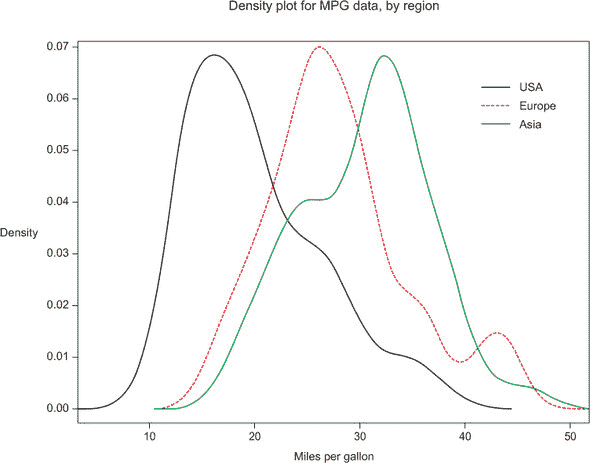

#### 2.3.4. 散点图

*散点图*是两个数值变量之间关系的简单可视化，是现存最受欢迎的绘图工具之一。在散点图中，特征值与响应变量的值相对应，每个实例用一个点表示。虽然简单，但散点图可以揭示输入变量和响应变量之间的线性关系和非线性关系。

图 2.17 展示了两个散点图：一个是汽车重量与每加仑英里数的关系，另一个是汽车型号年份与每加仑英里数的关系。在两种情况下，输入特征与汽车的每加仑英里数之间存在明显的关系，因此两者都应用于建模。在左面板中，数据呈现出明显的香蕉形状，表明随着车辆重量的增加，每加仑英里数呈非线性下降。同样，右面板显示了每加仑英里数与型号年份之间的增加的线性关系。两个图表都清楚地表明，输入特征在预测每加仑英里数时是有用的，并且两者都具有预期的关系。

##### 图 2.17. 车辆每加仑英里数与车辆重量（左）和车辆型号年份（右）的关系散点图

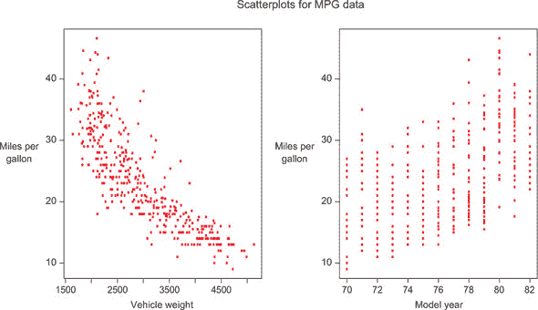

### 2.4. 摘要

在本章中，你已经在现实世界的机器学习背景下了解了数据的重要方面：

+   编译训练数据的步骤包括以下内容：

    +   决定包含哪些输入特征

    +   确定如何获得目标变量的真实值

    +   确定何时收集了足够的训练数据

    +   注意是否存在有偏或非代表性的训练数据

+   训练数据的预处理步骤包括以下内容：

    +   重新编码分类特征

    +   处理缺失数据

    +   特征归一化（对于某些机器学习方法）

    +   特征工程

+   四种有用的数据可视化包括散点图、密度图、箱线图和散点图：

    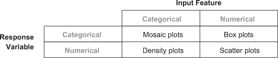

    我们的模型数据准备就绪后，现在让我们开始构建机器学习模型！

### 2.5. 本章术语

| 单词 | 定义 |
| --- | --- |
| 虚拟变量 | 一个二元特征，表示一个观测值是否属于某个类别 |
| 真实值 | 训练集或测试集中已知的目标变量或标签的值 |
| 缺失数据插补 | 对于实例子集的未知值，用数值或分类值替换缺失数据的未知值 |

## 第三章\. 建模与预测

*本章涵盖*

+   通过机器学习建模发现数据中的关系

+   使用模型进行预测和推理

+   构建分类模型

+   构建回归模型

前一章介绍了数据收集、预处理和可视化的指南和原则。机器学习工作流程的下一步是利用这些数据开始探索和揭示输入特征与目标之间存在的关系。在机器学习中，这个过程是通过基于数据建立统计模型来完成的。本章涵盖了理解机器学习建模和开始构建自己的模型所需的基本知识。与大多数机器学习教科书不同，我们花费很少的时间讨论机器学习建模的各种方法，而是专注于大局概念。这将帮助您获得对机器学习模型构建的广泛理解，并快速掌握构建自己的模型以解决现实世界问题的技能。对于那些寻求有关特定机器学习建模技术更多信息的人，请参阅附录。

我们从对统计建模的高级概述开始本章。这次讨论侧重于机器学习建模的大局概念，例如模型的目的、模型在实际中的应用方式，以及现有建模技术类型及其相对优缺点简要概述。从那里，我们深入探讨两种最常用的机器学习模型：分类和回归。在这些部分中，我们提供了更多关于如何在您的数据上构建模型的信息。我们还通过本章中散布的“算法亮点”框，强调了实践中常用的几个常见算法。

### 3.1\. 基本机器学习建模

机器学习的目标是发现数据中的模式和关系，并将这些发现应用于实践。这一发现过程是通过使用在过去 30 年中在统计学、计算机科学和应用数学中开发的建模技术来实现的。这些各种方法可以从简单到极其复杂，但它们都有一个共同的目标：估计输入特征与目标变量之间的函数关系。

这些方法也共享一个共同的流程，如图 3.1 所示：使用历史数据构建和优化模型，然后反过来使用该模型根据新数据进行预测。本节为您准备本章后面部分的实际内容。您将在下一节中查看机器学习建模的一般目标，然后继续了解最终产品如何使用以及区分不同机器学习算法的一些重要方面。

##### 图 3.1\. 基本机器学习工作流程

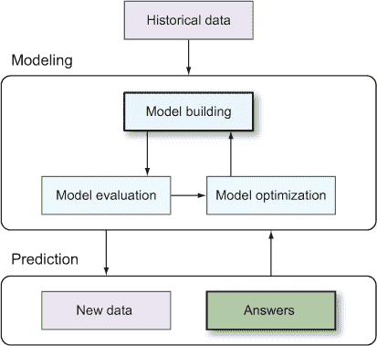

#### 3.1.1\. 寻找输入与目标之间的关系

让我们围绕一个示例来讨论机器学习建模。回想一下第二章中的 Auto MPG 数据集章节 2。该数据集包含有关汽车的各种指标，例如制造商地区、车型年份、车辆重量、马力和气缸数。该数据集的目的是了解输入特征与车辆每加仑英里数（MPG）评级之间的关系。

输入特征通常用符号 X 表示，当存在多个输入特征时，下标用于区分输入。例如，我们将 X[1]表示为制造商地区，X[2]表示为车型年份，X[3]表示为车辆重量，等等。所有输入特征的集合被称为粗体**X**。同样，目标变量通常被称为 Y。

输入 X 和输出 Y 之间的关系可以用这个简单的公式简洁地表示：

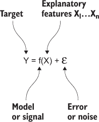

在这个方程中，f 代表与输入变量相关联的目标变量 Y 的未知函数。机器学习建模的目标是通过*使用数据*来准确估计 f。符号€代表与函数 f 无关的数据中的随机噪声。函数 f 通常被称为*信号*，而随机变量€被称为*噪声*。机器学习的挑战是使用数据来确定真正的信号是什么，同时忽略噪声。

在 Auto MPG 示例中，函数 f 描述了汽车的真实每加仑英里数（MPG）评级作为该汽车众多输入特征的一个函数。如果你完全了解这个函数，你就可以知道任何汽车（无论是真实的还是虚构的）的 MPG 评级。但是，你可能会有许多噪声源，€，包括（但不仅限于）以下内容：

+   由于测量设备中的微小不准确造成的每辆车的 MPG 评级的不完美测量——测量噪声

+   制造过程中的变化，导致车队中的每辆车的 MPG 测量值略有不同——制造过程噪声

+   输入特征测量中的噪声，例如重量和马力

+   无法访问确切确定 MPG 的更广泛的特征集

使用你从数百辆车辆中获得的噪声数据，机器学习方法是通过建模技术找到 f 的良好估计。这个结果估计被称为*机器学习模型*。

在第 3.2 节和 3.3 节中，我们更详细地描述了这些机器学习建模技术是如何工作的。实际上，机器学习的大部分学术文献都涉及如何最好地估计 f。

#### 3.1.2. 寻找好模型的目的

假设你有一个对 f 的良好估计，接下来是什么？机器学习有两个主要目标：*预测*和*推理*。

##### 预测

在你有一个模型之后，你可以通过将这些新特征插入模型来生成对新数据的目标 Y 的预测，**X**[new]。用数学符号表示，如果 f[est]表示你对 f 的机器学习估计（回想一下，f 表示特征与目标之间的真实关系），那么通过将新数据插入此公式可以获得对新数据的预测：

Y[pred] = fest

这些预测可以用来对新数据做出决策，或者可能被输入到自动化工作流程中。

回到 Auto MPG 示例，假设你有一个机器学习模型 f[est]，它描述了 MPG 与汽车输入指标之间的关系。预测能力允许你提出这样的问题：“已知输入指标的特定汽车的 MPG 是多少？”这种预测能力对于设计汽车非常有用，因为它允许工程师评估不同设计概念的 MPG 评级，并确保各个概念满足 MPG 要求。

预测是机器学习系统最常见的使用方式。预测是许多机器学习用例的核心，包括以下这些：

+   解析手写数字或语音录音

+   预测股市

+   预测

+   预测哪些用户最有可能点击、转化或购买

+   预测哪些用户需要产品支持以及哪些用户可能会取消订阅

+   确定哪些交易是欺诈的

+   提供建议

由于机器学习方法达到了高预测准确率，以及 ML 预测可以快速生成，因此成千上万的公司在预测目的上每天都在使用 ML。

##### 推理

除了对新数据进行预测外，你还可以使用机器学习模型更好地理解输入特征与输出目标之间的关系。对 f 的良好估计能够帮助你回答关于手头变量之间关联的深入问题。例如：

+   哪些输入特征与目标变量最密切相关？

+   这些关系是正向的还是负向的？

+   f 是一个简单的关系，还是一个更微妙和非线性的函数？

这些推理可以告诉你很多关于数据生成过程的信息，并为数据中关系驱动因素提供线索。回到 Auto MPG 示例，你可以使用推理来回答这些问题：制造商地区对 MPG 有影响吗？哪些输入与 MPG 最密切相关？它们是负相关还是正相关？对这些问题的回答可以给你一个关于汽车 MPG 驱动因素的概念，并为你提供如何设计更高 MPG 车辆的线索。

#### 3.1.3\. 建模方法类型

现在是时候拂去你的统计知识灰尘，深入探讨机器学习建模的一些数学细节了。别担心——我们将保持讨论相对广泛和易于理解，即使对于那些没有太多统计背景的人来说也是如此！

统计建模在预测准确性和模型可解释性之间有一个普遍的权衡。简单的模型容易解释，但不会产生准确的预测（尤其是对于复杂的关系）。复杂的模型可能会产生准确的预测，但可能是黑盒且难以解释。

此外，机器学习模型主要有两种类型：参数和非参数。本质区别在于参数模型假设 f 采用特定的函数形式，而非参数模型则不做这样的严格假设。因此，参数方法通常简单且可解释，但准确性较低。同样，非参数方法在广泛的问题上通常可解释性较低但准确性更高。让我们更详细地看看参数和非参数方法在机器学习建模中的应用。

##### 参数方法

参数方法的简单例子是线性回归。在线性回归中，假设 f 是输入数值的线性组合。标准的线性回归模型如下：

f(**X**) = β[0] + X[1] × β[1] + X[2] × β[2] + **...**

在这个方程中，未知参数 β[0]、β[1]、... 可以解释为截距和斜率参数（相对于每个输入）。当你将参数模型拟合到某些数据时，你估计每个未知参数的最佳值。然后你可以将这些估计值代入 f(**X**) 的公式中，并加入新数据以生成预测。

常用的参数模型的其他例子包括逻辑回归、多项式回归、线性判别分析、二次判别分析、（参数）混合模型和朴素贝叶斯（当使用参数密度估计时）。在模型选择目的上常与参数模型结合使用的方法包括岭回归、lasso 和主成分回归。关于这些方法的一些更详细信息将在本章后面给出，每种方法的描述将在附录中提供。

参数方法的缺点是它们对函数 f 的真实形式做出了强烈的假设。在大多数现实世界的问题中，f 不假设这种简单的形式，尤其是在有多个输入变量（X）的情况下。在这些情况下，参数方法将数据拟合得不好，导致预测不准确。因此，大多数现实世界的机器学习方法依赖于非参数机器学习方法。

##### 非参数方法

在*非参数*模型中，f 不采用简单的、固定的函数。相反，f 的形式和复杂性会适应数据的复杂性。例如，如果 X 和 Y 之间的关系是曲折的，非参数方法会选择一个匹配曲线模式的函数 f。同样，如果输入变量和输出变量之间的关系是平滑的，将选择一个简单的函数 f。

非参数模型的一个简单例子是分类树。*分类树*是一系列关于输入特征的递归二进制决策。分类树学习算法使用目标变量来学习最优的分割序列，使得树的终端叶节点包含具有相似目标值的实例。

以泰坦尼克号乘客数据集为例。分类树算法首先寻找最佳的输入特征进行分割，使得结果叶节点包含要么大部分生存要么大部分死亡的乘客。在这种情况下，最佳的分割是乘客的性别（男性/女性）。算法继续在每个子节点上对其他输入特征进行分割，直到算法无法再检测到任何好的后续分割。

分类树是非参数的，因为树的深度和复杂性不是预先固定的，而是从数据中学习得到的。如果目标变量与输入特征之间的关系复杂，并且有足够的数据量，那么树将生长得更深，揭示出更细微的模式。图 3.2 展示了从不同的泰坦尼克号乘客数据集子集中学习到的两个分类树。在左侧面板中，是从只有 400 名乘客中学习到的树：得到的模型很简单，只包含一个分割。在右侧面板中，是从 891 名乘客中学习到的树：更多的数据量使得模型能够增加复杂性，并在数据中找到更详细的模式。

##### 图 3.2\. 决策树是非参数机器学习算法的一个例子，因为它的函数形式不是固定的。树模型可以随着数据量的增加而增加复杂性，以捕捉更复杂的模式。在树的每个终端节点中，比例代表该节点中死亡与生存的训练实例数。

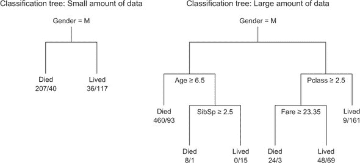

非参数机器学习方法的其他例子包括 k 近邻、样条、基函数展开方法、核平滑、广义加性模型、神经网络、Bagging、Boosting、随机森林和支持向量机。同样，关于这些方法的一些更详细的内容将在本章后面给出，每种方法的描述将在附录中提供。

#### 3.1.4\. 监督学习与无监督学习

机器学习问题可以分为两大类：监督学习和无监督学习。*监督学习问题*是指对于一组训练数据，你可以访问目标变量，而*无监督学习问题*是指没有明确的目标变量。

本书迄今为止的所有示例都属于监督学习范畴。这些问题每个都包含一个感兴趣的目标（泰坦尼克号乘客是否幸存？客户是否流失？MPG 是多少？）以及一组具有目标已知值的训练数据。实际上，机器学习中的大多数问题本质上是监督性的，大多数机器学习技术都是设计用来解决监督学习问题的。我们在这本书的大部分内容中描述了如何解决监督学习问题。

在无监督学习中，你只能访问输入特征，没有相关的目标变量。如果没有任何目标可用，你能进行哪些类型的分析？无监督学习方法有两个主要类别：

+   ***聚类——*** 使用输入特征来发现数据中的自然分组，并将数据划分为这些组。方法：k-means、高斯混合模型和层次聚类。

+   ***降维——*** 将输入特征转换为少数坐标，这些坐标可以捕捉到数据的大部分变异性。方法：主成分分析（PCA）、多维缩放和流形学习。

聚类和降维（尤其是 k-means 和 PCA）非常受欢迎，但在需要监督方法的情况下，它们往往被滥用和不恰当地使用。

但无监督问题在机器学习中确实扮演着重要的角色，通常在支持监督问题方面发挥作用，要么帮助编译学习所需的数据，要么推导出新的输入特征以进行学习。你将在第八章返回无监督学习的话题。

现在，让我们转向机器学习建模的更实际方面。接下来，我们将描述开始在自己的数据上构建模型所需的步骤，以及选择使用哪种算法的实际考虑。我们将本章的其余部分分为两个部分，对应于机器学习中最常见的两个问题：分类和回归。我们首先从分类这个主题开始。

### 3.2. 分类：预测到桶中

在机器学习中，*分类*描述了使用机器学习算法构建的*分类器*将新数据预测到桶（类别）中的过程。例如，垃圾邮件检测器将电子邮件放入垃圾邮件和非垃圾邮件桶中，手写数字识别器将图像放入从 0 到 9 的桶中。在本节中，你将学习如何根据手头的数据构建分类器。图 3.3 说明了分类的过程。

##### 图 3.3。一个分类过程。矩形和圆形被分类器分为 A 和 B 两类。这是一个只有两个类别的二元分类案例。

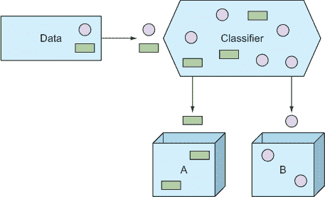

让我们再次用一个例子来说明。在第二章中，你研究了泰坦尼克号乘客数据集，以预测船上乘客的生存情况。图 3.4 显示了这些数据的一个子集。

##### 图 3.4\. 泰坦尼克号乘客数据集的一个子集

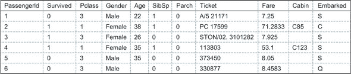

如我们之前讨论的，通常开始一个机器学习项目的最佳方式是通过可视化数据来感受数据。例如，普遍认为女性比男性在泰坦尼克号上幸存的可能性更大，你可以从图 3.5 中的频率图中看到这一点（如果你忘记了频率图，请回顾第 2.3.1 节）。

##### 图 3.5\. 频率图显示女性比男性在灾难中幸存的可能性更大。


通过使用第 2.3 节中的可视化技术，你可以感受到泰坦尼克号乘客数据集中每个特征的表现。但重要的是要意识到，仅仅因为单个特征看起来好或不好，并不意味着它与其他一个或多个特征结合时能表现出该特征的性能。也许年龄与性别和社会地位的结合比任何单个特征都能更好地划分乘客。实际上，这正是最初使用机器学习算法的主要原因之一：寻找人类难以轻易发现的多个维度上的信号。

下面的子节介绍了构建分类模型和进行预测的方法。你将了解一些具体的算法以及线性算法和非线性算法之间的区别。

#### 3.2.1\. 构建分类器并进行预测

首要任务是选择用于构建分类器的分类算法。有许多算法可供选择，每种算法针对不同的数据和部署需求都有其优缺点。附录提供了一个算法表及其特性的比较。你将在本书中通过这个表来选择尝试不同问题的算法。在本节中，算法的选择不是必要的；在下一章，你将学习如何正确衡量算法的性能并选择最适合的算法。

下一步是为建模准备数据。在探索数据集的一些特征之后，你可能想要预处理数据以处理分类特征、缺失值等问题（如第二章中所述）。预处理需求也取决于特定的算法，附录中列出了每个算法的需求。

对于泰坦尼克号生存模型，你将首先选择一个简单的分类算法：逻辑回归.^([1]) 对于逻辑回归，你需要做以下几步：

> ¹
> 
> 逻辑回归中的*回归*并不意味着它是一个回归算法。逻辑回归通过逻辑函数扩展线性回归，使其适合分类。

1.  填充缺失值。

1.  扩展分类特征。

1.  从第二章中，你知道票价特征严重倾斜。在这种情况下，将变量转换为使特征分布更加对称，并减少异常值可能产生的有害影响是有利的（对于某些机器学习模型）。在这里，你将选择通过开平方根来转换票价。

你将用于建模的最终数据集在图 3.6 中显示。

##### 图 3.6。在处理分类特征和缺失值，并将票价变量通过开平方根转换后的泰坦尼克号乘客数据集的前五行（参见源代码仓库中的`prepare_data`函数）。所有特征现在都是数值型，这是大多数机器学习算法首选的格式。


现在，你可以通过运行数据通过逻辑回归算法来构建模型。该算法在 scikit-learn Python 包中实现，模型构建和预测代码如下所示。

##### 列表 3.1。使用 scikit-learn 构建逻辑回归分类器

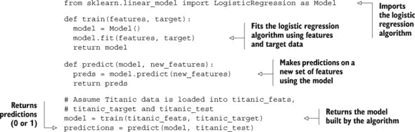

在构建模型后，你可以根据乘客的特征预测之前未见过的乘客的生存情况。模型期望的特征格式如图 3.6 所示，因此任何新的乘客都必须经过与训练数据完全相同的处理过程。`predict`函数的输出将为 1，如果预测乘客幸存，否则为 0。

通过绘制决策边界来可视化分类器是有用的。图 3.7 展示了根据模型，使用数据集中的两个特征（年龄和票价平方根）来区分幸存乘客和死亡乘客的边界。

##### 图 3.7。年龄和票价平方根特征的决策边界。菱形表示幸存乘客，而圆圈表示死亡乘客。浅色背景表示预测为生存的年龄和票价的组合。请注意，一些实例与边界重叠。分类器并不完美，但你只考虑了两个维度。在完整数据集上的算法在 10 个维度上找到这个决策边界，但可视化变得更加困难。

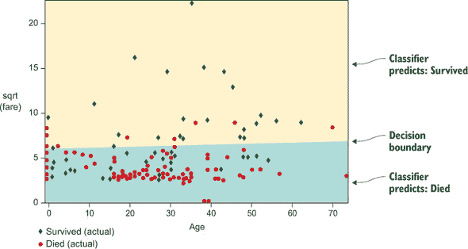

|  |
| --- |

**算法重点：逻辑回归**

在这些“算法亮点”框中，您将更深入地了解本书中使用的算法背后的基本思想。这允许好奇的读者尝试编写，通过一些额外的研究，算法的基本工作版本。尽管我们主要关注本书中现有包的使用，但了解特定算法的基本原理有时对于完全实现预测潜力很重要。

您将首先查看的算法是*逻辑回归算法*，这可能是用于分类任务的最简单的机器学习算法。将问题视为只有两个特征并且数据集分为两类是有帮助的。图 3.7 展示了示例，其中特征为年龄和 sqrt(Fare)；目标是幸存或死亡。为了构建分类器，您希望找到将数据最佳地分割成目标类别的线。二维中的一条线可以用两个参数来描述。这两个数字是您需要确定的模型参数。

算法随后包括以下步骤：

1.  您可以通过随机选择参数值来开始搜索，因此在二维图中放置一条随机线。

1.  测量这条线如何将两个类别分开。在逻辑回归中，您使用统计的*偏差*来衡量拟合优度。

1.  估计参数的新值并测量其分离能力。

1.  重复此过程，直到没有更好的猜测。这是一个*优化*过程，可以使用多种优化算法来完成。梯度下降是简单优化算法中的一种流行选择。

这种方法可以扩展到更多维度，因此您在这个模型中不必局限于两个特征。如果您对细节感兴趣，我们强烈建议您进一步研究并尝试在您选择的编程语言中实现此算法。然后查看广泛使用的机器学习包中的实现。我们省略了很多细节，但前面的步骤仍然是算法的基础。

逻辑回归的一些特性包括以下内容：

+   与更复杂的算法相比，该算法相对容易理解。它也是计算上简单的，这使得它可以扩展到大型数据集。

+   如果需要高度非线性的决策边界来分离类别，性能将下降。参见第 3.2.2 节。

+   逻辑回归算法有时会过度拟合数据，您通常需要使用一种称为*正则化*的技术来限制这种风险。参见第 3.2.2 节中的过度拟合示例。

| |
| --- |
| |

**进一步阅读**

如果您想了解更多关于逻辑回归及其在现实世界中的应用，请查看 David Hosmer 等人所著的*应用逻辑回归*（Wiley，2013 年）。

| |
| --- |

#### 3.2.2\. 对复杂、非线性数据进行分类

观察到图 3.7，你可以理解为什么逻辑回归是一个线性算法：决策边界是一条直线。当然，你的数据可能不会很好地被直线分开，因此对于这样的数据集，你应该使用非线性算法。但非线性算法通常在计算上要求更高，并且不适合大规模数据集。你将在第八章中进一步了解各种类型算法的可扩展性。

再次查看附录，你可以选择一个非线性算法来建模泰坦尼克号乘客数据集。对于非线性问题，一个流行的方法是使用具有非线性核的支持向量机。支持向量机本质上是线性的，但通过使用核，这个模型变成了一个强大的非线性方法。你可以在代码清单 3.1 中更改一行代码来使用这个新算法，并且决策边界在图 3.8 中绘制：

```
from sklearn.svm import SVC as Model
```

##### 图 3.8. 带有非线性核的泰坦尼克号生存支持向量机分类器的非线性决策边界。浅色背景表示预测为生存的年龄和船票的组合。


你可以看到图 3.8 中的决策边界与图 3.7 中的线性决策边界不同。这里你看到的是机器学习中的一个重要概念：过拟合的例子。算法能够很好地拟合数据，几乎在单个记录级别，你可能会失去对新数据做出良好预测的能力，这些新数据没有包含在训练集中；你允许模型变得越复杂，过拟合的风险就越高。

通常，你可以通过使用算法内建的模式参数来避免非线性模型的过拟合。通过调整模型的参数，保持数据不变，你可以获得更好的决策边界。请注意，你目前正使用直觉来判断何时出现过拟合；在第四章中，你将学习如何使用数据和统计学来量化这种直觉。现在，你将使用（作者们的）经验并调整一个称为*gamma*的参数。你目前不需要知道 gamma 是什么，只需知道它有助于控制过拟合的风险。在第五章中，你将看到如何仅通过猜测更好的值来优化模型参数。在 SVM 分类器中将 gamma 设置为 0.1，你将获得如图 3.9 所示的决策边界的大幅改进。

##### 图 3.9. 带有 gamma = 0.1 的非线性 RBF 核 SVM 的决策边界

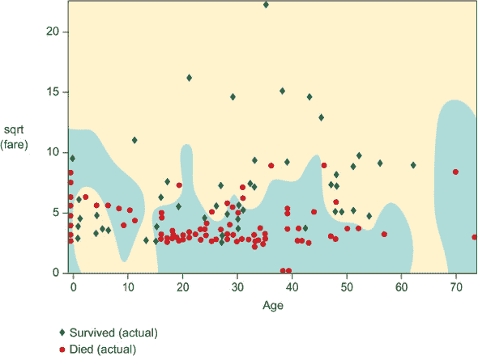

| |
| --- |

**算法亮点：支持向量机**

支持向量机（SVM）算法是线性和非线性问题的流行选择。它具有一些有趣的理论和实践特性，使其在许多场景中非常有用。

该算法背后的主要思想，就像之前讨论的逻辑回归一样，是找到最优地分离类别的线（或更高维度的等价物）。SVMs 试图找到仅位于决策线两侧的点之间的最大*间隔*，而不是测量所有点到线的距离。想法是，没有必要担心那些很好地位于边界内的点，只有那些接近边界的点。在下面的图像中，你可以看到线 H[1]和 H[2]是糟糕的分离边界，因为到线两侧最近点的距离不是最大的。H[3]是最佳线。

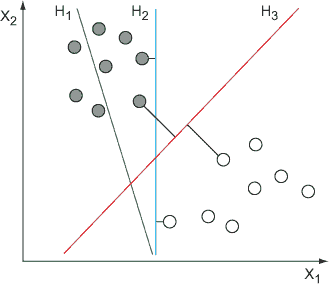

SVM 决策边界（H[3]）通常优于其他机器学习算法找到的决策边界。

虽然这个算法在某种意义上也是线性的，因为分离边界是线性的，但 SVMs 能够拟合非线性数据，正如你在这部分前面看到的。SVMs 使用一种巧妙的技术来拟合非线性数据：核技巧。*核*是一种数学结构，可以“扭曲”数据所在的空间。然后算法可以在扭曲的空间中找到一个线性边界，使得边界在原始空间中是非线性的。

|  |
| --- |
|  |

**进一步阅读**

关于机器学习算法的书已经写了数百本，涵盖了从它们的理论基础和高效实现到它们实际应用的所有内容。如果你在寻找对这些主题更严谨的处理，我们推荐两本关于机器学习算法的经典著作：

+   《*统计学习基础：数据挖掘、推理和预测*》由特里弗·哈斯蒂等人（Springer，2009 年）著。

+   《*模式识别与机器学习*》由克里斯托弗·贝斯希（Springer，2007 年）著。

|  |
| --- |

#### 3.2.3\. 多类别分类

到目前为止，你只看到了两类的分类。在某些情况下，你将会有超过两个类别。多类别分类的一个好的现实世界例子是手写数字识别问题。每当你给家人寄老式邮件时，机器人会读取手写的 ZIP 代码并确定信件的去向，而在这一过程中良好的数字识别是至关重要的。一个公开的数据集，MNIST 数据库，^([2])可用于研究这类问题。这个数据集包含 60,000 个手写数字的图像。图 3.10 展示了其中的一些手写数字图像。

> ²
> 
> 你可以在[`yann.lecun.com/exdb/mnist/`](http://yann.lecun.com/exdb/mnist/)找到手写数字的 MNIST 数据库。

##### 图 3.10\. 从 MNIST 数据库中随机选择的四个手写数字


每个图像都是 28 × 28 像素，但我们把每个图像转换成 28² = 784 个特征，每个像素一个特征。除了是一个多类问题外，这也是一个高维问题。算法需要找到的是许多这些特征的复杂组合，并且这个问题本质上是非线性的。

要构建分类器，你首先需要从附录中选择要使用的算法。列表中第一个原生支持多类问题的非线性算法是 k-最近邻分类器，这是另一种简单但强大的非线性机器学习建模算法。你只需要在列表 3.1 中更改一行来使用新算法，但你还需要包含一个用于获取完整预测概率而不是仅获取最终预测的函数：

```
from sklearn.neighbors import KNeighborsClassifier as Model

def predict_probabilities(model, new_features):
  preds = model.predict_proba(new_features)
  return preds
```

构建 k-最近邻分类器并对图 3.10 中显示的四个数字进行预测，你将获得图 3.11 中显示的概率表。

你可以看到，对数字 1 和 3 的预测非常准确，对数字 4 的预测只有很小的（10%）不确定性。看第二个数字（3），它难以完美分类并不奇怪。这正是最初获取完整概率的主要原因：能够对那些不是完全确定的事情采取行动。在邮局机器人分拣信件的情况下，这很容易理解；如果机器人对某些数字的确定性足够低，那么在我们将其发送出去之前，也许我们应该让一个好人先看看它。

##### 图 3.11。k-最近邻分类器应用于 MNIST 数据集的预测概率表

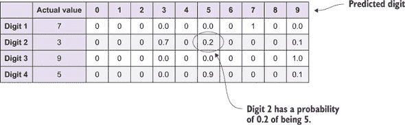

|  |
| --- |

**算法亮点：k-最近邻算法**

*k-最近邻算法*是一种简单但强大的非线性机器学习方法。它通常在模型训练需要快速进行，但预测通常较慢的情况下使用。你很快就会看到这是为什么。

基本思想是，你可以通过将新数据记录与训练集中的相似记录进行比较来对新的数据记录进行分类。如果一个数据集记录由一组数字*n[i]*组成，你可以通过通常的距离公式找到记录之间的*距离*：

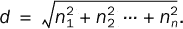

当对新记录进行预测时，你找到*最近的*已知记录，并将该类别分配给新记录。这将是一个 1-最近邻分类器，因为你只使用最近的邻居。通常你会使用 3、5 或 9 个邻居，并选择在邻居中最常见的类别（你使用奇数以避免平局）。

训练阶段相对较快，因为你为已知记录索引以快速计算新数据之间的距离。预测阶段是大部分工作所在的地方，即从整个数据集中找到最近的邻居。

之前的简单示例使用了常用的欧几里得距离度量。你也可以根据数据集使用更高级的距离度量。

K-最近邻不仅对分类有用，对回归也有用。你不仅取邻居中最常见的类别，还取邻居的目标值的平均值或中位数。第 3.3 节进一步详细介绍了回归。

| |
| --- |

### 3.3\. 回归：预测数值

并非每个机器学习问题都是关于将记录放入类别中。有时目标变量取数值——例如，在金融模型中预测美元价值时。我们将预测数值的行为称为*回归*，而模型本身称为*回归器*。图 3.12 说明了回归的概念。

##### 图 3.12\. 在这个回归过程中，回归器正在预测一条记录的数值。

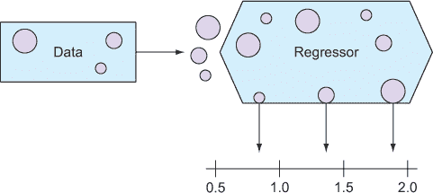

作为回归分析的例子，你将使用第二章中介绍的汽车燃油效率数据集。目标是构建一个模型，可以预测汽车的平均每加仑英里数，给定汽车的属性，如马力、重量、产地和车型年份。图 3.13 显示了这些数据的一个小子集。

##### 图 3.13\. 汽车燃油效率数据的小子集

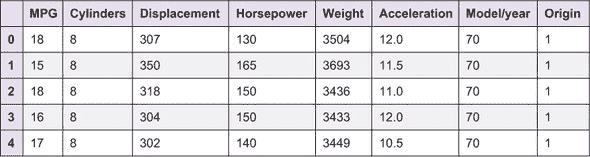

在第二章中，你发现了燃油效率（MPG）评级、汽车重量和车型年份之间的有用关系。这些关系在图 3.14 中展示。

##### 图 3.14\. 使用散点图，你可以看到车辆重量和车型年份对于预测 MPG 是有用的。更多详情请见第二章。

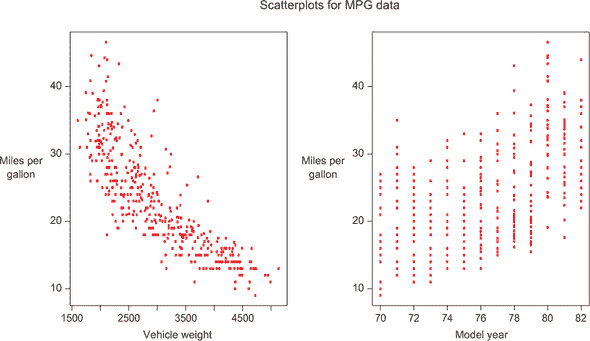

在下一节中，你将了解如何构建一个基本的线性回归模型来预测这些车辆数据集的每加仑英里数。在成功构建基本模型之后，你将了解用于建模非线性数据的更高级算法。

#### 3.3.1\. 构建回归器并进行预测

再次，你将首先选择一个算法来使用，并将数据格式化为合适的格式。线性回归算法可以说是最简单的回归算法。正如其名所示，这是一个线性算法，附录显示了使用此算法所需的数据预处理。你需要（1）填补缺失值和（2）扩展分类特征。我们的汽车燃油效率数据集没有缺失值，但有一个分类列：产地。在扩展产地列（如第二章中的第 2.2.1 节所述）之后，你将获得图 3.15 中所示的数据格式。

##### 图 3.15\. 扩展 Origin 列后的汽车燃油效率数据

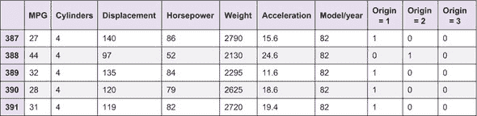

你现在可以使用该算法来构建模型。再次，你可以使用代码清单 3.1 中定义的代码结构，并更改此行：

```
from sklearn.linear_model import LinearRegression as Model
```

拿到模型后，你可以进行预测。然而，在这个例子中，在构建模型之前，你需要将数据集分成训练集和测试集。在第四章中，你将学习更多关于如何评估模型的知识，但在这个部分你将使用一些简单的技术。通过在仅使用部分数据训练模型的同时保留测试集，你可以在测试集上进行预测，并查看你的预测与实际值有多接近。如果你在所有数据上训练并在部分训练数据上做出预测，那么你就是在作弊，因为模型在训练时看到数据更有可能做出好的预测。

图 3.16 展示了在保留测试集上进行预测的结果，以及它们与已知值的比较。在这个例子中，你使用 80%的数据来训练模型，并使用剩余的 20%进行测试。

##### 图 3.16\. 将保留测试集中的 MPG 预测值与实际值进行比较

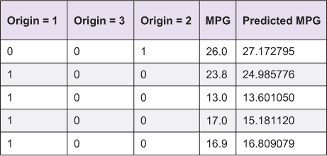

比较多个预测值的一个有用方法是再次使用我们的好朋友，散点图。对于回归问题，实际的目标值和预测值都是数值。在第二章中介绍的散点图中，将预测值相互对比，你可以可视化预测值如何跟随实际值。这可以在图 3.17 中看到的保留测试集的 Auto MPG 测试集中展示。此图显示了出色的预测性能，因为所有预测值都接近最优的对角线。通过观察此图，你可以了解你的机器学习模型在新数据上可能的表现。在这种情况下，对于更高的 MPG 值的一些预测似乎被低估了，这可能对你是有用的信息。例如，如果你想提高估计高 MPG 值的能力，你可能需要找到更多高 MPG 车辆的例子，或者你可能需要在这个范围内获得更高质量的数据。

##### 图 3.17\. 实际值与预测值在保留测试集中的散点图。对角线表示完美的回归器。所有预测值都接近这条线，则模型越好。

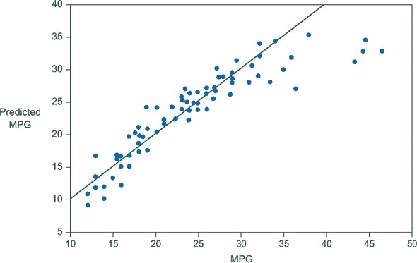

|  |
| --- |

**算法亮点：线性回归**

就像用于分类的逻辑回归一样，*线性回归*可以说是构建回归模型最简单且最广泛使用的算法。其主要优势是线性可扩展性和高度的可解释性。

此算法将数据集记录绘制为点，目标变量位于 y 轴上，并将一条直线（或平面，如果有两个或更多特征）拟合到这些点上。以下图示了优化点到模型直线距离的过程。

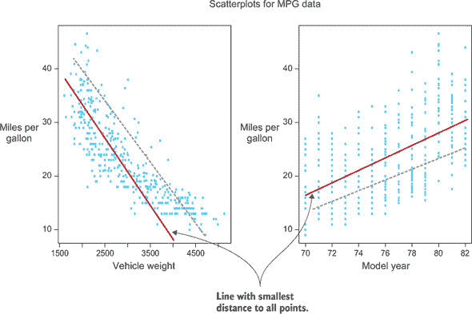

线性回归如何确定最佳拟合线的演示。在这里，深色线是此数据集上的最佳线性回归拟合线，它相对于任何其他可能的线（如图中所示虚线所示）具有更小的均方偏差。

在二维空间中，一条直线可以用两个参数来描述，以此类推。你知道这个，从基本的数学公式 y = a × x + b 中的 a 和 b。这些参数与数据拟合，当优化后，它们完全描述了模型，并且可以用来对新数据进行预测。

| |
| --- |

#### 3.3.2\. 对复杂、非线性数据进行回归

在某些数据集中，特征之间的关系无法用线性模型来拟合，如果需要准确预测，线性回归算法可能不适用。其他属性，如可扩展性，可能使得降低准确性成为必要的权衡。此外，非线性算法不一定更准确，因为你可能会过度拟合数据。作为一个非线性回归模型的例子，我们介绍了随机森林算法。随机森林是用于高度非线性问题且准确性很重要的一种流行方法。正如附录中所示，它也很容易使用，因为它需要的数据预处理最少。在图 3.18 和 3.19 中，你可以看到通过随机森林模型对 Auto MPG 测试集进行预测的结果。

##### 图 3.18\. 非线性随机森林回归模型中实际与预测 MPG 值的表格

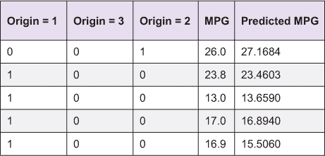

##### 图 3.19\. 非线性随机森林回归模型中 MPG 数据与预测值的比较

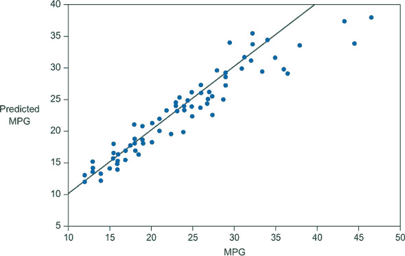

这个模型与线性算法在视觉上并没有太大的区别。在准确性方面，哪个算法表现最好并不明显。在下一章中，你将学习如何量化性能（通常称为模型的*准确度得分*），这样你就可以对预测准确度进行有意义的测量。

| |
| --- |

**算法亮点：随机森林**

作为本章最后一个算法亮点，我们介绍了*随机森林*（RF）算法。这个高度准确的非线性算法在现实世界的分类和回归问题中得到了广泛应用。

RF 算法的基础是决策树。想象一下，你需要就某事做出决定，比如下一步做什么。一些变量可以帮助你决定最佳的行动方案，而一些变量的权重高于其他变量。在这种情况下，你可能会首先问，“这能让我赚多少钱？”如果答案是少于 10 美元，你可以选择不继续这项任务。如果答案是超过 10 美元，你可能会在决策树中提出下一个问题，“从事这项工作会让我快乐吗？”并回答是或否。你可以继续构建这个树，直到你得出结论并选择一个任务来工作。

决策树算法让计算机根据训练集确定哪些变量是最重要的，并将它们放在树的顶部，然后逐渐使用不那么重要的变量。这使得它能够结合变量并说，“如果金额大于 10 并且让我开心，而且工作量少于 1 小时，那么就是。”

决策树的一个问题是树的顶层对答案有巨大影响，如果新数据没有遵循与训练集完全相同的分布，泛化能力可能会受到影响。这就是随机森林方法出现的地方。通过构建决策树集合，你可以降低这种风险。在做出答案时，在分类的情况下选择多数投票，在回归的情况下取平均值。由于你使用投票或平均值，你也可以以自然的方式返回完整的概率，这是许多算法所不具备的。

随机森林还以其其他优点而闻名，例如对不重要特征的免疫力、缺失值方面的噪声数据集以及错误标记的记录。

|  |
| --- |

### 3.4\. 摘要

在本章中，我们介绍了机器学习建模。以下是我们从本章中获得的主要收获：

+   模型的目的是描述输入特征与目标变量之间的关系。

+   你可以使用模型来为新数据（其目标未知）生成预测，或者推断数据中存在的真实关联（或不存在）。

+   机器学习建模有数百种方法。其中一些是参数化的，这意味着将特征与目标相关联的数学函数的形式在事先是固定的。参数化模型通常比非参数方法更易于解释，但准确性较低，而非参数方法更灵活，可以适应特征与目标之间关系的真实复杂性。由于它们高度的预测准确性和灵活性，非参数方法受到大多数机器学习实践者的青睐。

+   机器学习方法进一步分为监督学习和无监督学习。监督学习方法需要一个包含已知目标的训练集，而无监督学习方法不需要目标变量。本书的大部分内容都致力于监督学习。

+   监督学习中最常见的两个问题是分类，其中目标是分类的，和回归，其中目标是数值的。在本章中，你学习了如何构建分类和回归模型，以及如何使用它们对新数据进行预测。

+   你还更深入地研究了分类问题。线性算法可以定义类之间的线性决策边界，而非线性方法在数据不能线性分离时是必需的。使用非线性模型通常具有更高的计算成本。

+   与分类（其中预测的是分类目标）相反，在回归模型中预测的是数值目标变量。你看到了线性和非线性方法的例子以及如何可视化这些模型的预测。

### 3.5. 本章术语

| 词 | 定义 |
| --- | --- |
| 模型 | 使用机器学习算法在训练数据上得到的基产品。 |
| 预测 | 通过将新数据通过模型进行预测来执行预测。 |
| 推理 | 通过构建模型并不仅仅进行预测来获取对数据的洞察。 |
| (非)参数 | 参数模型对数据的结构做出假设。非参数模型则不做出假设。 |
| (无)监督 | 监督模型，如分类和回归，寻找输入特征和目标变量之间的映射。无监督模型用于在数据中寻找模式，而不需要指定的目标变量。 |
| 聚类 | 一种无监督学习方法，将数据放入自定义的簇中。 |
| 维度降低 | 另一种无监督学习方法，可以将高维数据集映射到低维表示，通常用于在二维或三维中进行绘图。 |
| 分类 | 一种预测数据到桶中的监督学习方法。 |
| 回归 | 一种预测数值目标值的监督方法。 |

在下一章中，你将学习创建和测试模型，这是机器学习的精彩部分。你将看到你的算法和特征选择是否能够解决当前的问题。你还将了解如何严格验证模型，以查看其预测在新数据上可能有多好。你还将了解用于评估模型性能的验证方法、指标和一些有用的可视化方法。

## 第四章. 模型评估和优化

*本章涵盖*

+   使用交叉验证来正确评估模型的预测性能

+   过拟合及其避免方法

+   标准二元和多类分类的评估指标和可视化方法

+   标准回归模型的评估指标和可视化方法

+   通过选择最佳参数来优化你的模型

在你拟合了一个机器学习模型之后，下一步是评估该模型的准确性。在你能够将模型投入使用之前，你需要知道它在新的数据上预测的效果如何。如果你确定预测性能相当好，你可以在生产环境中部署该模型来分析新数据。同样，如果你评估预测性能不足以完成当前任务，你可以回顾你的数据和模型，尝试改进和优化其准确性。（本章的最后部分介绍了简单的模型优化方法。第五章、第七章和第九章介绍了更复杂的提高机器学习模型预测准确性的方法。）

正确评估机器学习模型的预测性能是一项非同小可的任务。我们本章首先介绍统计上严格的评估机器学习模型预测性能的技术，通过图表和伪代码演示如何正确验证模型。

从那里，我们深入探讨机器学习分类模型的评估，重点关注机器学习从业者常用的典型评估指标和图形工具。然后，我们介绍回归模型的类似评估工具。最后，我们描述了一种通过参数调整来优化模型预测性能的简单方法。

到本章结束时，你将具备评估你在第三章中构建的机器学习模型的预测准确性的手段和知识，以及优化这些模型以实现预测准确性的方法（参见图 4.1）。这种模型评估提供了你需要的信息，以确定你构建的模型是否足够好，或者是否需要进一步的优化。

##### 图 4.1\. 机器学习工作流程中的评估和优化

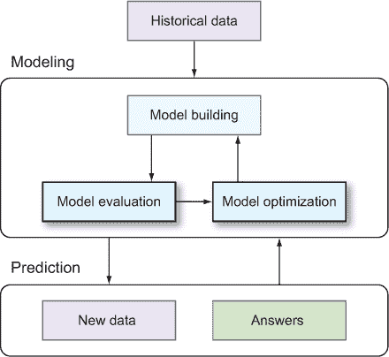

### 4.1\. 模型泛化：评估新数据的预测准确性

监督机器学习的主要目标是准确的预测。你希望你的机器学习模型在预测新数据（目标变量未知）时尽可能准确。换句话说，你希望从训练数据构建的模型能够很好地泛化到新数据。这样，当你将模型部署到生产环境中时，你可以确信生成的预测结果是高质量的。

因此，当你评估模型的表现时，你想要确定“该模型在新数据上的表现如何”。这个看似简单的任务充满了复杂性和陷阱，即使是经验最丰富的机器学习用户也可能感到困惑。本节描述了评估机器学习模型时出现的困难，并提出了一个简单的流程来克服这些问题，以实现模型性能的无偏估计。

#### 4.1.1\. 问题：过拟合和模型乐观

要描述与估计模型预测准确度相关的挑战，从例子开始最容易。

想象一下，你想要预测一个农场每英亩玉米产量作为使用一种新农药处理的种植面积比例的函数。你为此回归问题有 100 个农场的训练数据。当你绘制目标（每英亩玉米产量）与特征（农场处理的百分比）之间的关系时，很明显存在一个增加的非线性关系，并且数据也存在随机波动（见图 4.2）。

##### 图 4.2\. 玉米产量回归问题的训练数据包含明显的信号和噪声。


现在，假设你想要使用一种简单的非参数机器学习回归建模技术来构建一个玉米产量作为土地处理比例的函数的预测模型。最简单的机器学习回归模型之一是核平滑。*核平滑*通过取局部平均值来操作：对于每个新的数据点，目标变量的值被建模为仅与新的数据点的特征值相近的训练数据的目标变量值的平均值。一个称为*带宽参数*的单个参数控制局部平均的窗口大小。

图 4.3 展示了核平滑带宽参数各种值时的情况。对于带宽参数的大值，几乎所有的训练数据都被平均在一起来预测目标，对于每个输入参数的每个值。这导致模型变得平坦，并且欠拟合训练数据中的明显趋势。同样，对于带宽参数的小值，每个特征值处的模型输出仅使用一个或两个训练实例来确定。因此，模型实际上追踪了数据中的每一个波峰和波谷。这种对数据内在噪声而不是真实信号的建模敏感性被称为*过拟合*。你想要达到的是在金发姑娘区域：既不过度欠拟合，也不过度过拟合。

##### 图 4.3\. 核平滑回归模型对玉米产量训练集的三次拟合。对于带宽参数的小值，模型过拟合，导致模型过于崎岖。对于带宽参数的大值，模型欠拟合，导致模型过于平坦。合适的调整参数选择会导致看起来恰到好处的拟合。


现在，让我们回到手头的问题：确定你的机器学习模型将如何泛化以预测来自不同农场的玉米产量数据。这个过程的第一步是选择一个评估指标，该指标可以捕捉你预测的质量。对于回归，评估的标准指标是*均方误差（MSE）*，它是目标变量的真实值与模型预测值之间平均平方差的度量（在本章的后面，你将了解回归和分类的其他评估指标）。

这就是事情变得复杂的地方。在训练集上评估，随着带宽参数的减小，我们模型预测的错误（用 MSE 衡量）会越来越小。这是预期的：你允许模型越灵活，它在追踪训练数据中的模式（信号和噪声）方面做得越好。但是，具有最小带宽的模型对训练数据严重过拟合，因为它们追踪训练集中的每一个随机波动。使用这些模型来预测新数据会导致预测精度差，因为新数据将具有其独特的随机噪声特征，这些特征与训练集中的不同。

因此，训练集错误和机器学习模型的泛化错误之间出现了差异。这种差异在图 4.4 中的玉米产量数据中得到了例证。对于带宽参数的小值，训练集上评估的 MSE 非常小，而新数据（在这种情况下，10,000 个新实例）上的 MSE 要大得多。简单来说，在训练集上评估的模型预测的性能并不能表明该模型在新数据上的性能。因此，在用于训练模型的数据上评估模型的性能是危险的。

##### 图 4.4。玉米产量回归问题中训练集错误与新数据错误的比较。训练集错误是衡量新数据模型性能的一个过于乐观的指标，尤其是对于带宽参数的小值。将训练集错误用作新数据预测错误的替代指标将给你带来很多麻烦。


| |
| --- |

##### 关于双重使用训练数据的警告

使用训练数据既用于模型拟合又用于评估可能会导致你对模型的性能过于乐观。这可能导致你最终选择一个次优模型，该模型在预测新数据时表现不佳。

| |
| --- |

如你在玉米产量数据中看到的，选择具有最小训练集均方误差（MSE）的模型会导致选择具有最小带宽的模型。在训练集上，此模型产生的 MSE 为 0.08。但是，当应用于新数据时，相同的模型产生的 MSE 为 0.50，这比最优模型（带宽=0.12 和 MSE=0.27）差得多。

你需要一个更好的评估指标，它能更好地近似模型在新数据上的性能。这样，当你将模型部署到新数据上进行预测时，你可以对模型的准确性有信心。这是下一小节的主题。

#### 4.1.2. 解决方案：交叉验证

我们已经诊断了模型评估中的挑战：当应用于新数据时，训练集错误并不能指示模型错误。为了得到新数据错误率的良好估计，你必须使用一种更复杂的方法，称为**交叉验证**（通常缩写为**CV**），该方法严格使用训练集来评估新数据上的准确性。

交叉验证中最常用的两种方法是保留方法和 k 折交叉验证。

##### 保留方法

使用相同的训练数据来拟合和评估模型的准确性会产生过于乐观的准确性指标。解决这个问题最简单的方法是使用独立的训练集和测试集。你只使用训练集来拟合模型，而只使用测试集来评估模型的准确性。

这种方法被称为**保留方法**，因为从训练过程中保留了一个随机子集的训练数据。从业者通常将 20-40%的数据作为测试集。描述了保留方法的基本算法流程，列表 4.1 提供了 Python 伪代码。

##### 图 4.5. 交叉验证的保留方法的流程图。


##### 列表 4.1. 使用保留方法的交叉验证


现在，让我们将保留方法应用于玉米产量数据。对于带宽参数的每个值，你应用保留方法（使用 70/30 的分割）并计算保留的 30%数据的预测 MSE。图 4.6 展示了保留方法估计的 MSE 如何与新数据上应用的模型 MSE 相比较。两个主要的事情很突出：

+   保留方法计算的错误估计接近模型的新数据误差。它们当然比训练集错误估计（图 4.4）要接近得多，尤其是对于小带宽值。

+   保留误差估计是嘈杂的。与代表新数据错误的平滑曲线相比，它们波动很大。

##### 图 4.6. 使用玉米产量数据集比较保留误差 MSE 与新数据上的 MSE。保留误差是每个模型在新数据上误差的无偏估计。但它是一个嘈杂的估计器，在最佳模型（带宽=0.12）附近的带宽中波动很大，介于 0.14 和 0.40 之间。


你可以通过重复进行随机训练-测试分割并平均结果来降低噪声。但是，在多次迭代中，每个数据点将被分配到测试集的不同次数，这可能会对结果产生偏差。

一种更好的方法是进行 k 折交叉验证。

##### K 折交叉验证

一种更好但计算量更大的交叉验证方法是**k 折交叉验证**。与保留法类似，k 折交叉验证在训练过程中依赖于隔离训练数据的一部分。主要区别在于，k 折 CV 首先将数据随机分为*k*个不相交的子集，称为**folds**（k 的典型选择是 5、10 或 20）。对于每个 folds，使用除了该 folds 数据之外的所有数据进行模型训练，并随后使用该模型对该 folds 的数据进行预测。

在所有 k 折都经过循环后，将每个 folds 的预测汇总并与其真实目标变量进行比较，以评估准确性。图 4.7 说明了 k 折交叉验证，列表 4.2 提供了伪代码。

##### 图 4.7\. k 折交叉验证流程图


最后，让我们将 k 折交叉验证应用于玉米产量数据。对于带宽参数的每个值，你使用 k=10 进行 k 折交叉验证，并在预测上计算交叉验证 MSE。图 4.8 展示了 k 折交叉验证 MSE 估计与应用于新数据时模型 MSE 的关系。显然，k 折交叉验证误差估计接近模型在未来的数据上的误差。

##### 图 4.8\. 使用玉米产量数据集比较 k 折交叉验证误差 MSE 与新数据上的 MSE。k 折 CV 误差是评估模型在新数据上表现的一个很好的估计，允许你自信地预测模型的误差并选择最佳模型。


##### 列表 4.2\. 使用 k 折交叉验证的交叉验证


#### 4.1.3\. 使用交叉验证时需要注意的一些事项

交叉验证为你提供了一种估计你的机器学习模型在野外部署时的预测准确性的方法。这非常强大，因为它使你能够为你的任务选择最佳模型。

但是，当你将交叉验证应用于实际数据时，需要注意以下几点：

+   交叉验证方法（包括保留法和 k 折法）假设训练数据构成了感兴趣人群的代表性样本。如果你计划将模型部署到预测新数据，那么这些数据应该由训练数据很好地表示。如果不是这样，交叉验证误差估计可能对未来的数据误差率过于乐观。解决方案：确保解决并最小化训练数据中的任何潜在偏差。

+   一些数据集使用时间序列特征——例如，使用上个月的收入来预测这个月的收入。如果你的数据是这样的，你必须确保未来可用的特征永远不能用来预测过去。解决方案：你可以构建交叉验证的保留集或 k 折，以确保所有训练集数据都在测试集之前收集。

+   在 k 折交叉验证中使用更多的折数，误差估计将更好，但你的程序运行时间会更长。解决方案：当你能的时候，至少使用 10 折（或更多）。对于训练和预测速度快的模型，你可以使用留一法交叉验证（k = 数据实例数）。

接下来，你将在此基础上构建交叉验证工具，并深入探讨如何对分类模型进行严格的模型评估。

### 4.2. 分类模型的评估

我们通过介绍只有两个类别的例子来开始对评估分类模型的讨论，这也被称为*二元分类*。第三章介绍了在机器学习中，二元分类是一种基于许多因素或变量的强大方法，用于预测正/负结果。二元分类的一个好例子是疾病检测或生存预测。

假设你想根据个人、社会和经济因素预测泰坦尼克号乘客是否会幸存。你会收集关于乘客的所有信息，并训练一个可以将所有这些信息与他们的生存概率相关联的分类器。你第一次看到这个例子是在第二章，但泰坦尼克号乘客数据集的前五行再次在图 4.9 中展示。

##### 图 4.9。泰坦尼克号乘客数据集的前五行。目标列指示乘客是否在船沉没中幸存或死亡。


要构建你的分类器，你需要将这个数据集输入到分类算法中。因为这个数据集包含不同类型的数据，你必须确保算法知道如何处理这些类型。正如前几章所讨论的，你可能需要在训练模型之前处理数据，但在这个章节中，你将把分类器视为一个黑盒，它已经学会了从输入变量到目标变量的映射。本节的目标是评估模型，以优化预测准确率并与其他模型进行比较。

数据准备就绪后，你将进入下一个任务：交叉验证。你需要将整个数据集分成训练集和测试集，并使用交叉验证的保留法。模型将在训练集上构建并在保留的测试集上评估。重要的是要重申，你的目标不一定是在训练数据上获得最大的模型准确率，而是要在未见过的数据上获得最高的预测准确率。在模型构建阶段，根据定义，你还没有掌握这些数据，所以你假装一些训练数据对学习算法是隐藏的。

图 4.10 说明了这个特定示例中的数据分割步骤。

##### 图 4.10\. 将整个数据集分成训练集和测试集，可以让你评估模型。


准备好训练集后，你可以构建分类器并在测试集上进行预测。按照图 4.5 的保留法，你将获得一系列预测值：对于测试集中的所有行，值为 0（死亡）或 1（存活）。然后你进入评估工作流程的第 3 步，将这些预测值与实际存活值进行比较，以获得一个可以优化的性能指标。

分类模型的简单性能度量是计算*正确*答案的分数；如果四行中有三行被正确预测，那么你可以说该模型在这个特定验证集上的*准确率*是 3/4 = 0.75，或 75%。图 4.11 说明了这个结果。以下几节将介绍进行这种比较的更复杂的方法。

##### 图 4.11\. 将测试集预测值与实际值进行比较，可以得到模型的准确率。


#### 4.2.1\. 按类别准确率和混淆矩阵

预测提供的信息比仅仅是正确或错误更多。例如，你可以分析每个类别的准确率（预测存活但实际上死亡或存活的人数）。对于二元分类，你可以以两种方式出错：预测 0 而正确值是 1，或者预测 1 而正确值是 0。同样，你也可以以两种方式正确。 图 4.12 说明了这一点。

##### 图 4.12\. 计算按类别准确率和错误率可以为你提供有关模型准确率的更多信息。


在许多分类问题中，除了简单的计数准确率之外，查看这种按类别准确率或类别混淆情况是有用的。结果显示，将这些四个数字显示在一个称为*混淆矩阵*的二维图中非常有用，如图图 4.13 所示。

##### 图 4.13\. 将按类别准确率组织到混淆矩阵中


矩阵中的每个元素都显示了正负类之间的分类准确度或混淆。 将 图 4.13 中的特定混淆矩阵与接收器操作特征（ROCs）的一般概念联系起来，这是你在本书的其余部分广泛应用的。虽然这些术语一开始可能有点令人困惑，但当你与其他人谈论你模型的性能时，它们将变得很重要。

##### 


####  展示了排序概率向量和设置 0.7 阈值的过程。现在所有高于这条线的行都被预测为生存，你可以将它们与实际标签进行比较，以获得在此特定阈值下的混淆矩阵和 ROC 指标。如果你为从 0 到 1 的所有阈值都遵循这个过程，你定义了*ROC 曲线*，如 图 4.16 所示。

到目前为止，你只看了输出为预测类别的预测；在我们的泰坦尼克号例子中，1 表示生存，否则为 0。机器学习预测通常包含一定的不确定性，许多分类算法不仅输出零一预测，还输出完整的预测*概率*。例如，在我们的泰坦尼克号模型中简单地预测为*生存*的实例可能具有 0.8、0.99 或 0.5 的生存概率。很明显，这些答案的置信度有很大的差异，在本节中，你将利用这些信息更详细地评估你的模型。

*概率分类器*的输出就是我们所说的*概率向量*或*类别概率*。对于测试集中的每一行，你都会为分类器中的每个类别得到一个从 0 到 1 的实数值（总和为 1）。到目前为止，你通过考虑大于 0.5 的概率来确定类别预测，并据此计算上一节中所有性能指标。我们说确定类别的*阈值*是 0.5。很明显，你可以选择任何其他阈值，并会得到所有指标的不同值。


##### 

4.2.2. 准确度权衡和 ROC 曲线

从 图 4.16 中，你可以读出所有阈值点的混淆矩阵，这使得 ROC 曲线在评估分类器性能时成为一个强大的可视化工具。给定任何交叉验证过程中的真实和预测标签，ROC 曲线按照 列表 4.3 中的方法计算。

##### 图 4.16\. 通过计算从 0 到 1 的 100 个阈值点的混淆矩阵和 ROC 指标定义的 ROC 曲线。按照惯例，你在 x 轴上绘制假阳性率，在 y 轴上绘制真阳性率。


##### 列表 4.3\. ROC 曲线


如果你跟随 ROC 曲线，你会看到当假阳性率增加时，真阳性率会降低。这种权衡是机器学习的“没有免费午餐”，因为你能够为了获得更高的正确性而牺牲你正确分类的实例比例，反之亦然，这取决于你选择的概率阈值参数。

在现实场景中，这种权衡可能非常重要，需要评估。如果你正在分类一个患者是否有癌症，将几个额外的健康患者错误地分类为患病患者，并避免将任何患病患者错误地分类为健康患者，会更好。因此，你会选择一个可以最小化假阴性率的阈值，从而最大化真阳性率，并将你尽可能放置在 ROC 图表的顶部，同时牺牲假阳性率。

另一个很好的例子是垃圾邮件过滤器，你需要在你收件箱中显示不想要的电子邮件或把想要的电子邮件放入垃圾邮件文件夹之间做出选择。或者信用卡公司检测欺诈活动——你更愿意经常给客户发出虚假警报，还是冒着错过潜在欺诈交易的风险？

除了权衡信息之外，ROC 曲线本身也提供了对分类器整体性能的视图。一个完美的分类器不会有假阳性也不会有漏检，所以曲线会推向左上角，如图 图 4.17 所示。这自然引导我们到另一个评估指标：ROC 曲线下方的面积（AUC）。这个面积越大，分类性能越好。AUC 是评估和比较模型时广泛使用的选择，尽管在大多数情况下，检查完整的 ROC 曲线对于理解性能权衡非常重要。你将在本书的其余部分使用 ROC 曲线和 AUC 评估指标来验证分类模型。

##### 图 4.17\. ROC 曲线说明了整体模型性能。你可以通过定义 AUC 指标来量化这一点：ROC 曲线下方的面积。这个面积越大，分类性能越好。AUC 是评估和比较模型时广泛使用的选择，尽管在大多数情况下，检查完整的 ROC 曲线对于理解性能权衡非常重要。你将在本书的其余部分使用 ROC 曲线和 AUC 评估指标来验证分类模型。


##### 列表 4.4\. ROC 曲线下方的面积


#### 4.2.3\. 多类分类

到目前为止，你只看过二进制或双类别的分类问题，但幸运的是，你可以使用许多相同的工具来处理多类分类器。一个著名的多类分类问题就是手写数字识别。我们时不时都会发送实体邮件，有很大可能性在这个过程中已经使用了机器学习算法来确定你的信件的终点地址。如果你的字迹像我们一样，这听起来像是一个巨大的挑战，但这样的自动化系统已经由邮政服务使用了几十年。

由于机器学习在手写数字识别上的早期成功，这个例子在 ML 文献中一直被用作多类分类性能的基准。想法是扫描手写数字，并将它们分成每个图像中有一个字母的图像。然后你使用图像处理算法或在原始灰度像素上构建一个多类分类器来预测数字。图 4.18 显示了名为 MNIST 的手写数字数据集的一些示例。

##### 图 4.18\. MNIST 数据集中的手写数字。整个数据集包含 80,000 个这样的数字，每个数字都是一个 28 x 28 像素的图像。没有任何图像处理，我们的数据集的每一行都包含一个已知的标签（0 到 9）和 784 个特征（每个 28 x 28 像素一个）。


你使用随机森林算法（在第三章中介绍）从训练集构建一个分类器，并从保留的测试集生成混淆矩阵。记住，你只处理过二类分类的混淆矩阵。幸运的是，你可以轻松地为多个类别定义它，因为矩阵中的每个元素都是行上的类别与列上的类别。对于 MNIST 分类器，你可以在图 4.19 中看到，大部分的力量都位于矩阵的对角线上，正如它应该的那样，因为它显示了每个数字被*正确*分类的实例数量。最大的非对角元素显示了分类器最困惑的地方。检查这个图，你可以看到最大的混淆发生在数字 4 和 9、3 和 5、以及 7 和 9 之间，这符合你对数字形状的了解。

##### 图 4.19\. 10 类 MNIST 手写数字分类问题的混淆矩阵


以矩阵形式显示类别准确率的原因是为了利用我们出色的视觉能力来处理更多信息。在图 4.19 中，你可以清楚地看到如何通过对比度增强混淆矩阵来利用这种能力。

那么，如何为多类分类器生成 ROC 曲线呢？原则上，ROC 曲线仅适用于二元分类问题，因为你在预测中将类别分为*正类*和*负类*，以便获得 ROC 曲线轴上常用的如真正例率（true-positive rate）和假正例率（false-positive rate）等 ROC 指标。为了在多类问题中模拟二元分类，你使用*一对多*技巧。对于每个类别，你将特定类别标记为*正类*，其余所有类别作为*负类*，然后像往常一样绘制 ROC 曲线。运行 MNIST 分类器进行此过程得到的 10 个 ROC 曲线如图 4.20 所示。最准确分类的数字是 0 和 1，这与图 4.19 中的混淆矩阵一致。然而，混淆矩阵是由最可能的类别预测生成的，而 ROC 曲线则显示了类别在所有概率阈值下的性能。

##### 图 4.20。使用一对多方法模拟二元分类问题时，MNIST 10 类分类器每个类别的 ROC 曲线。请注意，由于分类器非常出色，我们已将 ROC 曲线的右上角放大，以便观察不同类别之间模型性能的差异。每个类别的 AUC 都进行了计算，并且整体模型表现良好。


然而，请注意，多类 ROC 曲线并不在曲线上显示整个混淆矩阵。原则上，在 ROC 曲线的每个点上都有一个完整的 10 x 10 混淆矩阵，但我们无法以足够简单的方式可视化这一点。在多类情况下，因此重要的是要查看混淆矩阵和 ROC 曲线。

### 4.3. 回归模型的评估

你已经在之前的章节中查看过回归模型。通常，*回归*是用于预测数值结果（如整数或浮点值）的模型的术语。对于回归，你使用本节中介绍的不同性能指标集。

你将使用在第二章中首次介绍的 Auto MPG 数据集作为本节的工作示例。图 4.21 显示了该数据集的一个小子集。你将此数据集通过所有必要的数据转换（有关数据转换的更多信息，请参阅第 2.2 节），并选择一个适当模型，如第二章和第三章中讨论的那样。在这种情况下，你感兴趣的是测量模型性能。

##### 图 4.21。Auto MPG 数据集的一个子集


使用本章开头介绍的基模型评估工作流程，您使用数据和所选算法构建一个交叉验证的回归模型。在以下各节中介绍了在此过程中使用的潜在模型性能指标，但 图 4.22 展示了基于这些指标的回归性能的最基本可视化：预测值与实际值之间的散点图。

##### 图 4.22\. 测试集中预测 MPG 与实际值的散点图。对角线表示最佳模型。


#### 4.3.1\. 使用简单的回归性能指标

与分类模型不同，回归没有简单的 *正确* 预测的概念。数值预测通常不太可能完全正确，但它可以是 *接近* 或 *远离* 正确值。这也是正确值含义本质的后果，因为我们通常认为数值测量是从具有称为 *误差* 的不确定程度的分布中抽取的。本节介绍了两个简单的指标来衡量回归性能：均方根误差（MSE 的平方根）和 R² 值。

回归模型性能的最简单测量方法是 *均方根误差*，或称 *RMSE*。这个估计量查看每个预测值与已知值之间的差异，并以一种不受预测值可能高于或低于实际值这一事实影响的方式计算平均值。图 4.23 展示了 RMSE 的计算过程。

##### 图 4.23\. RMSE 计算：在方程中，y[i] 和 x[i] 分别表示第 i 个目标和特征向量，而 f(x) 表示将模型应用于特征向量，返回预测的目标值。


为了鼓励更好地理解 RMSE 计算的细节，以下列表展示了一段代码片段。

##### 列表 4.5\. 均方根误差

```
def rmse(true_values, predicted_values):
  n = len(true_values)
  residuals = 0
  for i in range(n):
    residuals += (true_values[i] – predicted_values[i])**2.
  return np.sqrt(residuals/n)
```

RMSE 的优点是结果与自身值具有相同的单位，但这也意味着 RMSE 值依赖于问题的规模，因此在不同数据集之间不容易进行比较。如果预测值或实际值是较大的数字，RMSE 将相应地更高。尽管在比较同一项目中的模型时这不是问题，但理解整体模型性能并将其与其他模型进行比较可能是一个挑战。

为了克服这一点，通常计算 R² 或 R² 指标也是值得的，其响应是相对的，并且始终在 0–1 范围内。如果模型可以更好地预测数据，R² 值将更接近 1。以下列表展示了 R² 计算的更多细节。

##### 列表 4.6\. R² 计算方法

```
def r2(true_values, predicted_values):
  n = len(true_values)
  mean = np.mean(true_values)
  residuals = 0
  total = 0
  for i in range(n):
    residuals += (true_values[i] – predicted_values[i])**2.
    total += (true_values[i] – mean)**2.
  return 1.0 – residuals/total
```

无论使用 MSE、RMSE 还是 R²作为评估指标，你都应该始终记住以下几点：

+   总是使用交叉验证来评估模型。如果不这样做，随着模型复杂性的增加，指标总是会提高，导致过拟合。

+   在可能的情况下，评估指标应该与手头的问题相一致。例如，如果从汽车特征预测 MPG，RMSE 为 5 意味着你期望平均预测值与真实 MPG 相差 5 英里/加仑。

此外，回归还使用了许多其他评估指标，其中许多内置了对过拟合的惩罚（因此不需要交叉验证）。例如，包括赤池信息准则（AIC）和贝叶斯信息准则（BIC）。大多数回归分析教科书都涵盖了这些以及更高级的主题。

#### 4.3.2. 检查残差

在上一节中，你看到了如何使用残差，即预测值和实际值之间的距离，用于介绍的两个简单指标。这些残差本身也值得进行视觉分析。

图 4.24 展示了我们 MPG 数据集的一个示例残差图。这展示了与图 4.23（#ch04fig23）中的散点图相同的信息，但聚焦于残差的尺度。在理想情况下，你期望残差随机分布在 0 线周围。在图的下端，MPG 值从 10 到 35，看起来残差是随机分布在 0 线周围的，可能略微偏向高估值。然而，在 35-45 的值中，你可以看到明显的低估值的倾向，导致较大的残差值。你可以使用这些信息来改进模型，要么通过调整模型参数，要么通过处理或修正数据。如果你可以获取更多数据，你可以尝试为一些高 MPG 示例获取标签。在这种情况下，你可以找到一些更多的高 MPG 汽车并将它们添加到数据集中，以改进该尺度部分的预测。

##### 图 4.24. 在 MPG 数据集上的预测残差图。在水平 0 线上，残差为 0。


你已经看到了如何使用交叉验证来测试模型以及你可以用来评估结果的一些性能指标。对于最简单的模型，这只是一个训练、测试和计算适当的性能指标的问题。更复杂的算法有可调整的参数——用户可以调整的旋钮，这会影响它们的训练和应用方式。每种设置组合产生不同的模式。在下一节中，你将看到有时微小的调整可以在结果中产生很大的差异。

### 4.4. 通过参数调整进行模型优化

大多数机器学习模型都内置了一个或多个*调整参数*，这些参数控制学习算法的内部工作原理。这些调整参数通常控制输入特征与目标变量之间关系的复杂性。因此，调整参数可以对拟合模型及其在新数据上的预测准确性产生强烈影响。

例如，在第 4.1 节中，您看到了单个调整参数（核平滑回归算法中的带宽）如何导致在玉米产量数据集中产生截然不同的模型拟合。对于带宽参数的小值，回归函数过于颠簸，过度拟合了数据。同样，对于带宽参数的大值，回归函数过于平滑，欠拟合了数据。

本节介绍了一种严格的方法来优化机器学习算法的调整参数。

#### 4.4.1\. 机器学习算法及其调整参数

每个机器学习算法都包含一组不同的调整参数，这些参数控制算法如何使用训练数据来构建模型。随着算法变得更加复杂，通常调整参数的数量也会更多，且更加复杂。以下是您在第三章中学习的一些流行分类算法的标准调整参数，按复杂度递增的顺序列出：

+   ***逻辑回归—*** 无

+   ***K 近邻—*** 用于平均的最近邻数量

+   ***决策树—*** 分割标准，树的最大深度，进行分割所需的最小样本数

+   ***核支持向量机—*** 核类型，核系数，惩罚参数

+   ***随机森林—*** 树的数量，每个节点中用于分割的特征数，分割标准，进行分割所需的最小样本数

+   ***提升—*** 树的数量，学习率，树的最大深度，分割标准，进行分割所需的最小样本数

作为例子，回想一下第三章，在那里您将核支持向量机应用于泰坦尼克号乘客数据集。您看到，在图 3.8 和图 3.9 中，两种核系数参数（称为*gamma*）的选择会导致模型拟合不同：设置 gamma = 0.01 产生了一个复杂、分割的决策边界，而设置 gamma = 0.1 则创建了一个更平滑的模型。在这种情况下，拟合的模型对调整参数 gamma 的选择非常敏感。

使这变得困难的是，对于给定算法的每个调整参数的正确选择完全依赖于特定的问题和数据。对于一个问题有效的东西不一定适用于下一个问题。依赖于启发式和经验法则的默认调整参数设置可能会导致预测性能不佳。严格选择调整参数对于确保您的模型尽可能准确至关重要。

#### 4.4.2\. 网格搜索

标准的优化机器学习模型调整参数的方法是通过穷举搜索的网格搜索。在规划以下基本的网格搜索算法时，请注意，这种策略将本章前几节中关于交叉验证和模型评估的材料结合起来。网格搜索算法如下：

1.  选择您想要最大化的评估指标（例如，分类中的 AUC，回归中的 R²）。

1.  选择您想要使用的机器学习算法（例如，随机森林）。

1.  选择您想要优化的调整参数（例如，树的数量和每个分割的特征数量）以及每个参数要测试的值数组。

1.  定义网格为每个调整参数数组的笛卡尔积。例如，如果树的数量数组为[50, 100, 1000]，每个分割的特征数量数组为[10, 15]，则网格为[(50,10), (50,15), (100,10), (100,15), (1000,10), (1000,15)]。

1.  对于网格中每个调整参数的组合，使用训练集进行交叉验证（使用保留法或 k 折交叉验证方法），并在交叉验证预测上计算评估指标。

1.  最后，选择与评估指标最大值对应的调整参数集。这就是优化后的模型。

为什么这有效？网格搜索在调整参数的每个可能值组合上进行广泛的搜索。对于每个组合，它通过比较交叉验证预测与真实目标变量来估计该模型在新数据上的性能。然后，选择具有最佳估计准确度（对于新数据）的模型。这个模型在应用于新数据时最有可能表现最佳。

让我们将网格搜索应用于泰坦尼克号乘客数据集。您将使用 AUC 作为优化指标，并使用具有径向基函数（RBF）核的 SVM 作为分类算法。原则上，您也可以使用网格搜索来选择最佳核。实际上，您可以使用网格搜索在不同的算法之间进行选择！

接下来，您选择要优化的调整参数。对于具有 RBF 核的核 SVM，您有两个标准调整参数：核系数 gamma 和惩罚参数 C。以下列表显示了如何运行针对这两个参数的网格搜索。

##### 列表 4.7\. 基于核 SVM 的网格搜索


你在泰坦尼克号数据集中发现，最大交叉验证 AUC 为 0.670，出现在调整参数向量(gamma = 0.01, C = 6)。一个等高线图显示了在图 4.25 中网格上评估的 AUC，这可能是有用的。以下是一些从这个图中跳出的因素：

+   最大值出现在网格的边界(gamma = 0.01)，这意味着你想要在扩展的网格上重新运行网格搜索。

+   预测的准确性对 gamma 参数数值的敏感性很高，这意味着你需要增加该参数采样的粒度。

+   最大值出现在 gamma = 0 附近，因此在对数尺度上表示网格（例如，10^(-4), 10^(-3), 10^(-2), 10^(-1)）是合理的。

+   AUC 作为 C 函数的敏感性不高，因此你可以使用该参数的粗略采样。

##### 图 4.25。等高线图显示了交叉验证的 AUC 作为两个调整参数 gamma 和 C 的函数。最大值出现在左上角，这意味着你需要扩大搜索范围并关注该区域。


在修改后的网格上重新运行网格搜索，你发现最大 AUC 为 0.690，出现在(gamma = 0.08, C = 20)。优化调整参数的价值是明显的：一个模型如果随意选择调整参数，其结果可能差到 AUC = 0.5（不如随机猜测）；网格搜索优化的模型将准确度提升到 AUC = 0.69。

注意，网格搜索并不绝对确保你选择了最佳的调整参数集。由于选择有限的可能值网格所造成的限制，实际的最佳值可能位于网格值之间。对优化有一定了解的读者可能会想知道为什么更复杂的优化程序传统上没有被用于调整参数的选择。简短的回答是，无导数、非凸优化的世界尚未成为标准机器学习工具箱的一部分。更长的回答是，该领域的机器学习研究人员正在开始将这些方法纳入调整参数优化策略中。

### 4.5. 摘要

在本章中，你学习了评估机器学习模型性能的基础知识。以下是主要收获的简要概述：

+   当你评估模型时，你不能双重使用训练数据，既用于评估也用于训练。

+   交叉验证是模型评估的一种更稳健的方法。

+   持续交叉验证是交叉验证的最简单形式。为了更好地估计模型泛化能力，保留一个测试集用于预测。

+   在 k 折交叉验证中，每次保留一个 k 折，提供对模型性能的更自信的估计。这种改进是以更高的计算成本为代价的。如果可能，当 k = 样本数时，可以获得最佳估计，也称为留一法交叉验证。

+   基本模型评估工作流程如下：

    1.  获取并预处理数据集以进行建模（第二章）并确定适当的机器学习方法（第三章）。

    1.  根据可用的计算资源，使用留出法或 k 折交叉验证方法构建模型并进行预测。

    1.  根据机器学习方法是否为分类或回归，使用所选的性能指标评估预测。

    1.  调整数据和模型，直到获得所需的模型性能。在第五章–第八章中，你会看到在常见的实际场景中提高模型性能的各种方法。

+   对于分类模型，我们在工作流程的第 3 步中介绍了一些模型性能指标。这些技术包括简单的计数准确率、混淆矩阵、接收者操作特征、ROC 曲线和 ROC 曲线下的面积。

+   对于回归模型，我们介绍了均方根误差和 R 平方估计量。简单的可视化，如预测值与实际值的散点图和残差图，很有用。

+   你可以使用网格搜索算法来优化模型，以调整参数。

### 4.6. 本章术语

| 单词 | 定义 |
| --- | --- |
| 欠拟合/过拟合 | 分别使用过于简单或过于复杂的模型来处理问题。 |
| 评估指标 | 描述模型性能的数字。 |
| 均方误差 | 用于回归模型的一种特定评估指标。 |
| 交叉验证 | 将训练集分成两个或多个训练/测试集的方法，以更好地评估准确性。 |
| 留出法 | 一种交叉验证形式，其中保留一个单独的测试集，用于模型拟合过程中的测试。 |
| k 折交叉验证 | 一种交叉验证方法，其中数据被分成 k 个随机不相交的集合（折）。每次保留一个折，并在剩余数据上构建的模型上进行交叉验证。 |
| 混淆矩阵 | 一个矩阵，显示每个类别的预测值中正确分类或未正确分类的数量。 |
| 接收者操作特征（ROC） | 表示真阳性、假阳性、真阴性或假阴性的数字。 |
| 面积下限（AUC） | 一个用于分类任务的评估指标，定义为假阳性与真阳性之间的 ROC 曲线下的面积。 |
| 调整参数 | 机器学习算法的一个内部参数，例如核平滑回归中的带宽参数。 |
| 网格搜索 | 一种用于选择调整参数最佳值以优化 ML 模型的暴力策略。 |

在下一章中，您将开始关注通过关注其特征来改进您的模型。除了基本特征工程技术外，您还将学习从文本、图像和时间序列数据中提取信息的高级方法。您还将了解如何选择最佳特征以优化模型性能并避免过拟合。

## 第五章\. 基本特征工程

*本章涵盖*

+   理解特征工程对您的机器学习项目的重要性

+   使用基本的特征工程过程，包括处理日期和时间以及简单的文本

+   选择最佳特征并减少模型的统计和计算复杂性

+   在模型构建和预测时使用特征工程

前四章向您展示了如何根据一组输入特征和感兴趣的输出目标来拟合、评估和优化一个监督式机器学习算法。但是，那些输入特征从何而来？你是如何定义和计算特征的？以及从业者如何知道他们是否使用了适合他们问题的正确特征集？

### 5.1\. 动机：为什么特征工程有用？

在本章中，我们探讨了如何从原始输入数据中创建特征——这个过程被称为*特征工程*——并介绍了一些简单的特征工程过程示例。这将为本章 7.0 节中介绍的更复杂的特征工程算法奠定基础。

#### 5.1.1\. 什么是特征工程？

特征工程是一种使用原始输入数据的数学变换来创建用于 ML 模型的新特征的做法。以下是一些这样的变换示例：

+   将总金额除以总支付次数，以获得每笔支付的金额比率

+   计算文本文档中特定单词的出现次数

+   计算用户 ping 时间分布的统计摘要（例如，均值、中位数、标准差和偏度）以评估网络健康

+   在用户 ID 上连接两个表（例如，支付和支持）

+   将复杂的信号处理工具应用于图像并总结其输出（例如，梯度直方图）

在深入探讨几个示例以展示特征工程的实际应用之前，让我们考虑一个简单的问题：为什么使用特征工程？

#### 5.1.2\. 使用特征工程的理由

本节描述了特征工程在机器学习应用中提供价值的一些方法。这个列表并不全面，而是介绍了特征工程可以提升您的 ML 模型准确性和计算效率的几种主要方式。

##### 将原始数据转换为与目标相关

您可以使用特征工程产生与目标变量更紧密相关的原始数据转换。以一个包含每位客户当前银行账户余额和信用债务的个人金融数据集为例。如果您正在构建一个模型来预测每位客户三个月后是否会成为支付违约者，那么工程化特征

```
Ratio of debt-to-balance = amount of debt / amount of balance
```

可能对目标变量有很高的预测性。

在这个例子中，尽管原始数据集中存在原始输入，但如果将工程化特征直接用作输入，机器学习模型将更容易找到债务与余额比率与未来违约之间的关系。这将导致预测准确性的提高。

##### 引入外部数据源

特征工程使从业者能够将外部数据源引入他们的机器学习模型中。想象一下，你运营一个互联网订阅服务。每位客户首次登录时，你想要预测该客户的终身价值。在众多指标中，你可以捕捉到每个用户的地理位置。尽管这些数据可以直接作为分类特征（例如，IP 地址或邮政编码）输入，但模型可能很难确定基于位置的信号（在这种情况下，这些可能是每个位置的平均收入，或城市与农村的差异）。

通过引入第三方人口统计数据，您可以做得更好。例如，这将允许您计算每个用户位置的平均收入和人口密度，并将这些因素直接插入到训练集中。现在，您不再需要模型从原始位置数据中推断这些微妙的关系，这些预测因素立即变得更容易推断。此外，将位置特征工程化为收入和人口密度使您能够评估哪些位置衍生因素最重要。

##### 使用非结构化数据源

特征工程使您能够在机器学习模型中使用非结构化数据源。许多数据源并非天生就是特征向量，可以直接插入到第一至四章中介绍的机器学习框架中。非结构化数据，如文本、时间序列、图像、视频、日志数据和点击流，占到了创建的数据的绝大多数。特征工程正是使机器学习从业者能够从这些原始数据流中产生机器学习特征向量。

本章涉及一些关于文本数据特征工程相对简单的例子。随后的章节将介绍文本、图像和时间序列数据中最常用的特征工程类型。

##### 创建更易于解释的特征

特征工程赋予机器学习从业者创建更可解释和可操作特征的能力。通常，使用机器学习在数据中寻找模式对于做出准确预测是有用的，但你可能会面临模型可解释性和模型最终驱动变化的实际效用方面的限制。在这些情况下，可能更有价值的是设计新的特征，这些特征更能表明驱动数据生成的过程以及原始数据与目标变量之间的联系。

考虑一个简单的例子，即制造计算机硬件的机器。你可以使用原始机器数据，例如信号响应的测量和其他处理信号，来构建机器学习模型以预测部件故障。但诸如上次机器调校时间以及生产的硬件数量等特征可以提供对制造过程可变方面的洞察。

##### 通过使用大量特征来增强创造力

特征工程使你能够尝试大量特征以查看哪些能够粘附。你可以创造出尽可能多的特征，并查看在训练模型时哪些特征具有预测力。这允许机器学习从业者从创建和测试特征时的僵化思维中解脱出来，并可能导致新发现的趋势和模式。

虽然当使用数十或数百个特征来训练机器学习模型时，过拟合成为一个关注点，但严格的特征选择算法可以被用来减少特征集，使其更易于管理。（例如，你可以自动确定使用前 10 个特征的预测与使用所有 1,000 个特征的预测一样好或更好。）我们将在本章后面描述这些算法，在 5.3 节中。

#### 5.1.3\. 特征工程和领域专业知识

另一种理解特征工程的方式是将领域专业知识注入机器学习模型中。我们所说的简单来说就是：对于手头的每个问题，关于研究的数据和系统的知识会随着时间的推移而积累。对于某些问题，这些模式将足够简单，以至于机器学习模型可以轻松地学习。但对于更具挑战性的问题，机器学习模型将从将领域专业知识编码到特征集中而显著改进。以下是将容易编码到机器学习特征中的领域专业知识声明的例子：

+   网络转化率在星期二总是更高（包括布尔特征“是否是星期二？”）。

+   家庭电力消耗随着温度的升高而增加（包括温度作为特征）。

+   垃圾邮件通常来自免费电子邮件账户（设计布尔特征“是否来自免费电子邮件账户？”或电子邮件域名）。

+   最近开设信用卡的贷款申请人更频繁地违约（使用“上次开设信用卡天数”特征）。

+   客户通常在他们网络中的其他人也更换了服务提供商之后才会更换自己的手机服务提供商（设计一个功能来统计最近更换了服务提供商的订阅者网络中的人数）。

显然，潜在领域专业知识片段的列表可以无限延续。实际上，许多公司的标准操作程序是使用这些临时规则的长列表来做出决策和预测。这些业务规则是构建机器学习模型的一个完美的工程特征集！

反过来说，特征工程可以是一种检验领域专家持有的先入为主的观念的方法。如果有任何疑问，关于某个特定假设是否具有任何价值，它可以被编码并用作机器模型中的一个特征。然后，可以通过有无该特征来测试模型的准确性，以评估该特征在预测目标变量中的条件重要性。如果准确性的提升可以忽略不计，这表明该想法的附加值不足。

接下来，我们将展示一些简单的特征工程示例，以展示这些过程在实际中是如何工作的。我们描述了特征工程如何融入整体机器学习工作流程，并展示了通过采用一些相对简单的特征工程过程如何提高机器学习模型的预测准确性。

### 5.2\. 基本特征工程过程

在深入我们的例子之前，让我们回顾一下我们基本的机器学习工作流程，以展示特征工程是如何扩展你迄今为止所看到的。展示了工作流程。

##### 图 5.1\. 特征工程如何融入基本的机器学习工作流程。你在构建模型之前扩展训练数据中的特征。在做出预测时，你需要将新数据通过相同的特征工程管道，以确保答案是有意义的。


工作流程的特征工程扩展允许你扩展训练数据以增加机器学习算法的准确性。为了确保特征工程得到正确使用，你需要将预测数据通过应用于训练数据的相同特征工程管道。这确保了预测是通过与应用于训练数据完全相同的过程生成的。

#### 5.2.1\. 示例：活动推荐

为了说明特征工程的概念，本节引入了一个来自现实世界的例子：来自数据科学竞赛网站 Kaggle（[www.kaggle.com](http://www.kaggle.com)）的挑战。

想象一下，您正在运行一个事件推荐网站，并希望预测一个特定用户是否对某个事件（如会议、Happy Hour 或讲座）感兴趣。您有一组训练数据，描述了过去哪些用户对哪些事件表示了兴趣，以及一些关于用户和事件本身的信息。您的目标是构建一个机器学习模型来预测特定事件是否对用户感兴趣——一个二分类模型。

在您在 Kaggle 网站上注册后（如果您还没有注册），可以在[www.kaggle.com/c/event-recommendation-engine-challenge](http://www.kaggle.com/c/event-recommendation-engine-challenge)找到关于挑战的数据和信息。基础数据集包括 train.csv、events.csv 和 users.csv 文件，这些文件可以根据用户和事件标识符进行合并。您将数据集限制在具有明确感兴趣或未感兴趣选择的活动中，以及基本的数值和分类特征。显示了初始训练数据集的一个选择。

##### 图 5.2. 用于训练事件推荐模型的数据集样本

![05fig02_alt.jpg]

您的样本训练数据包含以下特征：

+   `invited`——一个布尔值，表示个人是否被邀请参加活动

+   `birthyear`——人员的出生年份

+   `gender`——人员的性别

+   `timezone`——个人的当前位置时区

+   `lat/lng`——事件的纬度/经度

首先，您将基于这六个特征构建和评估一个模型。很明显，这个数据集在识别每个用户是否对事件感兴趣的模式方面是有限的。随着您继续本节，您将使用一些简单的特征工程转换来扩展特征集并添加新信息。

您将构建一个初始的二分类模型，从六个输入特征中预测目标变量`interested`。遵循第一章到第四章的 ML 工作流程 chapters 1–4，您需要执行以下操作：

1.  执行初始数据处理练习（将分类列转换为数值，填充缺失值）。

1.  进行模型训练（使用随机森林算法）。

1.  评估模型（使用 10 折交叉验证和 ROC 曲线）。图 5.3 显示了交叉验证的 ROC 曲线。它达到了 0.81 的 AUC 分数。

    ##### 图 5.3. 简单事件推荐模型的交叉验证 ROC 曲线和 AUC 指标

    ![05fig03_alt.jpg]

#### 5.2.2. 处理日期和时间特征

接下来，你将使用特征工程尝试改进第一个模型的结果。除了图 5.2 中显示的数据外，数据集中的每个事件都有一个相关的`start_time`。这个数据元素是一个 ISO-8601 UTC 字符串，表示事件计划开始的时间。数据字段具有类似于`2012-10-02 15:53:05.754000+00:00`的格式，表示 yyyy-mm-dd hh:mm:ss.mmmmmm_HH:MM。

在第三章中描述的 ML 模型可以支持数值或分类输入特征，其中`datetime`字符串不属于这两种。因此，你不能简单地将字符串列直接插入模型中。然而，你可以执行将`datetime`元素转换为数值特征的转换，这些特征可以捕获`datetime`字符串中编码的信息。这个简单而强大的特征工程概念可以使你将每个`datetime`字符串转换为一系列特征，例如这些：

+   一天中的小时

+   星期

+   年份的月份

+   小时

+   年份的季度

图 5.4 显示了将你的单个`start_time`特征转换为 10 个`datetime`特征后得到的前五行数据。

##### 图 5.4\. 从事件推荐数据集的时间戳列中提取的附加日期时间列


接下来，你将在这个新的 16 特征数据集上构建随机森林模型。我们的交叉验证 ROC 曲线如图 5.5 所示。

##### 图 5.5\. 包含日期时间特征的模型的交叉验证 ROC 曲线


模型的 AUC 从 0.81 增加到 0.85。显然，`start_time`信息中隐藏的价值，当通过特征工程注入到 ML 模型中时，有助于提高模型的准确性。最有可能的是，在特定星期几和一天中的特定时间发生的事件比其他事件更受欢迎。

#### 5.2.3\. 处理简单文本特征

除了事件的时间外，数据还包括来自简单自然语言处理程序的文本特征。与`datetime`特征不能直接由模型使用一样，因为它们既不是数值也不是分类的，任意文本不能在没有某种将数据转换为两种接受类型之一的处理的情况下输入到 ML 算法中。要将文本转换为 ML 特征，你将使用一种称为“词袋”的方法。在原则上，这个想法很简单：计算文本中每个单词出现的次数，并在数据集中插入一个包含该单词计数的列。然而，你仍将有一些复杂因素需要处理。

您提供给机器学习算法的特征必须是一致的：对于数据集中的所有实例，特征的数量必须相同，并且它们必须对应于相同的基本概念。例如，如果第一个实例包含五个“家庭”这个词的出现，而下一个实例没有，您必须选择在第二个实例中包含一个“家庭”列并将计数设置为 0，或者在不包含这两个实例的情况下。通常，您会使用整个数据集的文本语料库来决定哪些单词应该有列，哪些不应该。在大多数情况下，您会为整个数据集构建词袋，并只包含出现频率最高的单词以在数据集中创建列。然后，您可以有一个包含所有剩余单词的通用列，这在原则上决定了所选顶级单词之外文本的长度。

现在，假设您正在选择前 100 个单词以在数据集中创建一个计数列。您将得到一些列，这些列包含常见但无用的单词的计数，例如“是”、“和”和“the”。在自然语言处理领域，这些单词被称为“停用词”，通常在执行词袋计数之前从文本中删除。

我们将在下一章介绍更高级的文本特征概念，但在此要提到的最后一个复杂因素是，词袋数据集很快就会变得很大且稀疏。我们有很多特征，大部分都是 0，因为特定的单词通常不太可能出现在随机文本段落中。英语词典很大（有超过 20 万个在使用的单词），但其中只有一小部分单词在大多数文本中使用。一些机器学习问题有一个更窄的空间，其中一类单词比一般情况更常见。例如，图 5.6 显示了我们事件推荐示例中顶级单词的计数特征的一些实例；数据稀疏性很明显。一些机器学习算法，如朴素贝叶斯分类器，可以很好地处理稀疏数据（不需要为 0 分配额外内存），而大多数其他算法则不行。

##### 图 5.6. 事件推荐示例的词袋数据的一个切片。这些数字是事件描述中顶级出现单词的计数。大部分单元格包含 0，因此我们称该数据集为“稀疏”。


在我们的事件推荐示例的 events.csv 中，100 个特征代表 100 个顶级出现单词的词袋。您希望将这些用作模型中的特征，因为某些事件可能比其他事件更受欢迎。图 5.7 显示了将这些特征添加到模型后得到的 ROC 曲线。

##### 图 5.7. 包含日期时间特征和文本特征的完整模型的交叉验证 ROC 曲线


图 5.7 中的 AUC 指标与只包含基本和日期时间特征的先前模型相比没有增加。这告诉你，仅仅因为文本，特定的事件描述更有可能对用户感兴趣。这个模型没有解决个别用户的兴趣，而是针对一般用户群体。在真实的推荐引擎中，你可以为每个用户或每个用户类别构建一个模型。其他流行的推荐引擎方法使用事件、用户和用户朋友之间的联系来寻找推荐。

### 5.3\. 特征选择

与基本的统计方法和人类模式识别能力相比，机器学习算法的主要优势之一是处理更多特征的能力。大多数机器学习算法可以处理数千或数百万个特征。增加更多特征以提高模型准确性的策略通常是有用的。但在机器学习中，就像在许多其他情况下一样，更多并不总是更好。

由于更多特征使模型能够更详细地学习特征到目标的映射，存在模型过度拟合数据的危险。这增加了模型在训练时的出现准确率，但可能会损害对新、未见数据的预测性能。图 5.8 展示了过度拟合的一个例子（我们首次在第三章中讨论了过度拟合）。

##### 图 5.8\. 两个模型在相同训练数据上的决策边界。在顶部的模型中，决策边界过于详细，可能会影响新数据的分类性能。


在本节中，你将了解选择特征子集的方法，以避免过度拟合，从而在应用于新数据时提高模型的准确性。某些算法或多或少容易受到过度拟合的影响，但如果模型准确性特别重要，那么进行一些这些优化可能值得。

较少的特征数量和因此较小的模型的一个优点是，训练和预测的计算成本通常与特征数量相关。在模型开发阶段花些时间，可以在重新训练或进行预测时节省时间。

最后，特征选择和相关概念*特征重要性*可以帮助你深入了解模型，因此可以了解用于构建模型的原始数据。在某些情况下，构建模型的目标甚至可能不是进行预测，而是了解模型的重要特征；你可以使用关于最显著特征的知识来发现某些模式，例如信用状况与某些人口或社会因素相关。获取特定特征的数据可能存在成本，如果该特征对当前模型不重要，则无需承受损失。特定特征的重要性还可以揭示模型返回的预测中的宝贵见解。在许多现实世界的用例中，了解为什么做出某个特定预测很重要，而不仅仅是特定的答案。

有了这些，你应该有足够的动力深入了解特征选择和最常用的方法。选择最优特征子集的最简单方法就是尝试所有特征组合——例如，为所有特征子集构建模型，并使用你在第四章中获得的知识来衡量模型的性能。不幸的是，即使特征数量很少，这种方法也会迅速变得不可行。你必须使用可以近似最优特征子集的技术。在接下来的几个小节中，你将研究这些方法中的一些。最广泛使用的方法类别之一是前向选择/后向消除，将在下一小节中介绍。其他启发式方法将在本章后面介绍。

|  |
| --- |

**一些算法具有内置的特征选择功能**

尽管本节讨论的方法适用于任何机器学习算法，但某些算法在特征选择领域具有优势，因为它们具有内置的类似行为。然而，在所有情况下，这些内置方法不太可能产生与通用方法相当的结果，但可能在计算上显著更高效。因此，在回退到更计算密集的通用方法之前，尝试内置方法可能是有用的，或者甚至可以将内置方法用作种子来节省通用方法上的计算时间。

内置特征选择方法的例子包括线性回归和逻辑回归算法中分配给特征的权重，以及决策树和随机森林等集成变体中的特征重要性，这些方法以计算效率高的方式捕捉到如果用随机噪声替换一个特征，预测准确性预期会降低的量。我们可以从上一节中检查随机森林事件推荐模型的顶级特征重要性。


事件推荐模型中前七个特征的随机森林特征重要性。根据这一衡量标准，用户的出生年份和事件所在的时区是判断事件是否对用户感兴趣的两个最重要的指标。

| |
| --- |

#### 5.3.1. 前向选择和后向消除

用于近似最佳特征子集的最广泛使用的方法集是迭代选择方法，你将在下面探讨。一般概念是从没有特征开始，迭代地找到要添加的最佳特征，或者从所有特征开始，迭代地移除最差的。当所有特征都已添加或移除，当准确性的提高达到平稳，或者达到预定的特征集大小时，搜索停止。

这些方法分别被称为*前向选择*和*后向消除*。它们不能保证找到最佳特征子集，这就是为什么我们称之为*近似*。被遗漏或移除的特征中，可能有一些在与尚未达到的特征组合时具有更强的预测能力。记住，机器学习的力量来自于通过组合许多特征来发现模式的能力。或者换句话说，一个弱特征在存在恰好的一组其他特征时可能变得强大。

然而，在实践中，前向选择或后向消除在以比穷举搜索小得多的计算复杂度找到良好的特征子集方面效果很好。然而，当特征数量特别大时，即使是这种方法也可能在计算上不可行。在这些情况下，可能需要依赖于内置的特征重要性度量或其他搜索启发式方法，我们将在下一节中介绍。

前向特征选择的过程如图 5.9 所示。根据特征的数量，可能需要构建许多模型。如果算法运行到结束，你需要构建 N + (N – 1) + (N – 2)...(N – N + 2) + (N – N + 1)，或者。对于 20、100、500 或 1000 个特征，这分别是 210、5,050、125,250 和 500,500 个模型构建。此外，每次交叉验证迭代都需要构建 k 个模型，因此如果模型构建需要任何显著的时间，这也变得难以管理。对于特征集较小的集合，或者当运行较少的迭代次数（例如，因为准确性的提高迅速达到平稳）时，这种方法在实践中是有效的。

##### 图 5.9. 前向特征选择的过程。从最左边的框开始，特征被迭代添加，直到根据交叉验证评估指标选择出最佳特征集。


图 5.10 展示了向后消除的等效过程。计算需求与正向选择相同，因此选择正向或向后方法通常取决于具体问题和算法的选择。例如，某些算法在非常小的特征集上表现较差，在这种情况下，向后消除是更好的方法。

##### 图 5.10\. 向后特征消除的过程


通过绘制类似于 图 5.11 的垂直条形图是一种可视化迭代特征选择过程的有用方法。

##### 图 5.11\. 迭代特征选择条形图，显示特征选择过程中的准确度演变——在这种情况下，是正向选择算法。对于问题有意义的任何准确度度量（见 第四章）都应在此处使用。


正如我们之前提到的，一些机器学习算法具有内置的特征选择方法。您可以使用混合方法，而不是基于内置特征排名进行特征选择，这种方法在正向选择或向后消除过程的每次迭代中使用内置特征重要性来找到最佳或最差特征。当您有大量特征时，这可以显著减少计算时间，但可能会产生对最优特征子集的更不精确的近似。

#### 5.3.2\. 数据探索的特征选择

特征选择不仅可以用于避免过拟合或使模型更精简。特征选择的一个强大用途是深入了解模型和训练数据。实际上，在某些情况下，您可能只想构建一个分类器来运行特征选择算法，而不是为了做出预测。

你可以使用特征选择对用于构建模型的原始数据进行探索性分析。从特征选择过程中，你可以知道最重要的特征——从所有特征中预测目标变量的最有信息量的特征集。这告诉你有关数据的一些信息，这本身可能很有用。想象一下，你的任务是预测患者是否可能患有癌症。因为你不确定特定形式癌症的原因，你添加了你所能获取的所有特征，并使用特征选择来找到顶级特征。你不仅获得了更好的交叉验证准确率，而且使用数据来指示哪些因素最有可能导致疾病，或者至少与诊断概率相关。所讨论的特征选择方法并没有告诉你特征在正方向还是负方向上是否强大（在二元分类的情况下），但你可以很容易地将特定特征与目标变量进行可视化，以理解这一点（例如，使用第 2.3 节中的可视化）。

另一个特征选择的无监督用例是用于**降维**。当处理包含三个以上变量的数据集时，一个巨大的挑战是如何可视化数据。人类大脑已经优化适应三维世界，我们很难理解超过三维的信息。然而，在现实世界的数据中，只有三个特征的情况极为罕见，你需要采用各种技术来可视化高维数据集。你可以使用特征选择来展示机器学习算法如何将数据划分为类别，例如，只需简单地将两个或三个最佳特征与目标变量进行对比。图 5.12 展示了在二维中显示的决策边界示例，尽管构建模型使用了更多特征。

##### 图 5.12. 这个将数据分类为圆形和钻石的决策边界只有两个特征。模型是在许多更多特征的基础上构建的，但特征选择算法发现 sqrt(Fare)和 Age 特征在这个特定问题（泰坦尼克号生存预测）中非常重要。这个图表最初在第三章中介绍。


在下一节中，你将看到特征选择在现实世界问题中如何有用的一个示例。

#### 5.3.3. 现实世界的特征选择示例

对于特征工程和特征选择在现实世界中的伟大用例，让我们看看科学中的一个例子。

你的任务是从小型天文图像中从大量所谓的虚假事件（看起来真实但并非如此的事件）中找到真正的超新星事件。图 5.13 展示了真实和虚假事件的示例。

##### 图 5.13。真实超新星图像显示在左面板中。虚假候选事件显示在右面板中.^([1])分类器的工作是学习从图像中提取的特征之间的差异，以区分这两种类型的候选者。（这些是明显的例子；许多其他例子很难分类，即使是训练有素的人。）

> ¹
> 
> 本节中的超新星图像和数据图最初发表在 2013 年《皇家天文学会月报》第 435 卷第 2 期，第 1047-1060 页([`mnras.oxfordjournals.org/content/435/2/1047`](http://mnras.oxfordjournals.org/content/435/2/1047))。


真实/虚假分类器是通过首先将原始图像数据处理成一组特征来构建的，其中一些将在下一章中讨论。然后，您将特征化数据通过随机森林算法来构建分类器，并执行各种模型优化，如第三章和第四章中概述的优化。在将此模型投入望远镜的实时流之前，最后一部分是确定最佳特征，避免过拟合，并使模型尽可能小，以支持项目的实时需求。特征选择图，是图 5.11 的一个稍微高级的版本，显示在图 5.14 中。

##### 图 5.14。特征选择图显示了反向消除过程。随着算法的进行，从底部向上选择每个特征进行删除，并在每个步骤中计算 1%假阳性率（FPR）下的漏检率（MDR）的定制评估指标。条形图显示了通过删除特征（带有交叉验证的标准差）在每一步获得的性能指标（在这种情况下，越小越好）。删除了 23 个特征（共 44 个）后，交叉验证的性能提升趋于平稳，当删除太多特征时最终变得非常糟糕。最终，通过删除噪声特征，模型性能提高了 5 个百分点。


现在，通过了解哪些特征对模型最重要，您可以绘制这些特征与真实和虚假事件的关系图，以可视化特定特征如何帮助解决问题。图 5.15 显示了四个最佳特征的性能。

##### 图 5.15。我们特征选择算法选择的四个最佳特征中四个单个特征的性能可视化。直方图显示了具有特定特征值的真实或虚假事件的数量。您可以看到，在*振幅*和*通量比*特征中，真实事件与虚假事件的分布不同，它们被选为特征选择过程中的顶级性能特征。


### 5.4. 摘要

本章介绍了特征工程，它将原始数据转换为提高机器学习模型准确度。本章的主要收获如下：

+   特征工程是将数学变换应用于原始数据以创建新的输入特征用于机器学习建模的过程。这些变换可以从简单到极其复杂。

+   特征工程有以下五个原因很有价值：

    +   它可以创建与目标变量更紧密相关的特征。

    +   它使您能够引入外部数据源。

    +   它允许您使用非结构化数据。

    +   它可以使您创建更可解释的特征。

    +   它给您自由创建大量特征，然后通过特征选择选择最佳子集。

+   特征工程与领域知识之间存在复杂的联系。

+   特征工程在整体机器学习工作流程中适合两个地方：

    +   在训练数据集上，在拟合模型之前

    +   在预测数据集上，在生成预测之前

+   在事件推荐问题中可以使用两种类型的简单特征工程：

    +   从日期时间信息中提取特征

    +   自然语言文本的特征工程

+   特征选择是从数据集中选择最具预测性特征子集的一种严谨方法。

### 5.5. 本章术语

| 单词 | 定义 |
| --- | --- |
| 特征工程 | 将输入数据转换为提取更多价值并提高机器学习模型预测准确度的过程 |
| 特征选择 | 从更大的特征集中选择最具预测性的特征子集的过程 |
| 前向选择 | 一种特征选择版本，根据当前活动特征集，迭代地添加增加模型准确度最大的特征 |
| 后向消除 | 一种特征选择版本，根据当前活动特征集，移除降低模型准确度最大的特征 |
| 词袋模型 | 一种将任意文本转换为数值特征以供机器学习算法使用的方法 |

第七章扩展了这里所展示的简单特征工程方法，以便您可以对文本、图像和时间序列等数据进行更高级的特征工程。在下一章中，我们将使用本章所学的内容进行一个全章示例。
